# Book Metadata
- Topic: Event-Driven Architecture (Arquitetura Baseada em Eventos)
- Audience: Software architects and senior back-end engineers
- Market Context: One of the most frequently cited skills in senior engineering roles; authoritative English-language material is abundant, but this book targets Portuguese-speaking senior practitioners who need depth, trade-offs, and real-world cases — not a translation.
- Focus: Event-Driven Architecture, CQRS, Event Sourcing, real-world cases, trade-offs and pitfalls
- Primary Language: English (source); translations: pt-BR, es
- Chapters: 10
- Depth: standard
- Code Language: python
- Code Style: working-code
- Additional Languages: none
- Slug: arquitetura-baseada-em-eventos
- Created: 2026-09-01

---


# Chapter 1: Foundations of Event-Driven Architecture

## Opening Problem Statement

Most distributed systems fail not because a single service is slow, but because every service waits on another. A payment service calls inventory, which calls shipping, which calls notifications, and the customer stares at a spinner while a chain of synchronous calls decides their fate. When one link degrades, the whole chain degrades with it. This is the pathology of **temporal coupling**: two components must be alive, reachable, and responsive at the same instant for the interaction to succeed. Senior architects know this pain intimately. It shows up as cascading timeouts, retry storms, and the 3 a.m. page where a downstream failure took the entire order pipeline offline. Event-Driven Architecture (EDA) is not a fashionable label for message queues. It is a deliberate inversion of who waits for whom. This chapter defines the atom of that inversion — the **event** — and builds the vocabulary you need to reason precisely about coupling. It is opinionated on purpose: EDA is powerful, and it is also frequently misapplied. By the end, you will know both when it earns its complexity and when it is pure over-engineering.

## The Event as an Immutable Fact of the Past

Start with the definition, because everything else depends on it. An **event** is an immutable record of something that has already happened. `OrderPlaced`, `PaymentCaptured`, `ShipmentDispatched` — each names a fact in the past tense, and each is unchangeable once emitted. You cannot un-place an order any more than you can un-ring a bell. If reality changes later, you emit a new event (`OrderCancelled`), you do not edit the old one.

This immutability is not a stylistic preference. It is the property that makes events safe to replicate, replay, and fan out to consumers the producer has never heard of.

The distinction that trips up experienced engineers is **event versus command versus message**. They are not synonyms, and conflating them corrupts your design.

| Concept | Direction | Intent | Coupling to receiver |
|---------|-----------|--------|----------------------|
| **Command** | Sender → one receiver | "Do this" (imperative, future) | Sender knows and expects a handler |
| **Event** | Producer → N consumers | "This happened" (declarative, past) | Producer knows nothing about consumers |
| **Message** | — | The transport envelope | Neither; it carries commands or events |

A **command** expresses intent and expects execution: `CapturePayment` demands that some specific handler act. It can be rejected. An **event** expresses a fact and expects nothing: `PaymentCaptured` simply announces reality to whoever cares. A **message** is neither — it is the envelope on the wire that happens to carry one or the other.

The mental flip is ownership of consequence. A command's sender owns the outcome and waits for it. An event's producer disowns the outcome entirely; consequences belong to the consumers. That single shift is the seed of decoupling.

Commands and events differ fundamentally in intent and coupling: a command targets one specific receiver and demands a response, while an event broadcasts a fact to any number of independent consumers who may or may not exist at publish time. Understanding this contrast is the first step to avoiding the design mistake of publishing commands disguised as events.

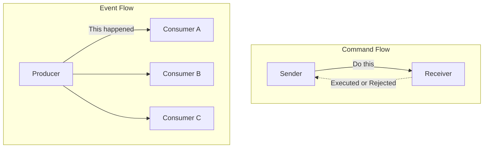

Naming discipline follows directly. Events are named in the past tense because they are facts of the past. A queue named `order-processing` is a smell; a stream named `orders.placed` is a fact. If your team is publishing something named in the imperative — `SendEmail` — you have a command masquerading as an event, and the design lie will surface later as coupling you did not intend to create.

## Temporal, Spatial, and Flow Coupling

Coupling is the currency of architecture, and it comes in more denominations than most diagrams admit. To evaluate EDA honestly, separate three distinct axes.

**Temporal coupling** means both parties must be available at the same time. In a synchronous HTTP call, if the callee is down, the caller fails now. Event-driven communication breaks this axis: the producer emits and moves on; the consumer processes whenever it is ready, even minutes later. The broker absorbs the gap.

**Spatial coupling** (also called location or reference coupling) means the caller must know the identity and address of the callee. Service A holds a URL or a client stub for Service B. Change B's location and A breaks. Publishing to a topic breaks this axis: the producer knows the topic, not the subscribers. New consumers attach without the producer ever learning their names.

**Flow coupling** means one component knows the sequence of steps the other must perform, embedding the workflow into the caller. When order-service orchestrates payment, then inventory, then shipping in a fixed sequence, it owns the business flow. Event choreography can invert this — each service reacts to facts and emits its own — though, as later chapters show, moving the flow out of code does not delete it; it relocates it into the emergent behavior of the system.

| Coupling axis | Synchronous request-response | Event-driven |
|---------------|------------------------------|--------------|
| **Temporal** | Both alive simultaneously | Decoupled via broker |
| **Spatial** | Caller knows callee address | Producer knows only the topic |
| **Flow** | Caller owns the sequence | Distributed across reactors |

The critical insight for a senior audience: EDA does not eliminate coupling. It trades explicit, compile-time coupling for implicit, runtime coupling. You gain independence in deployment and availability. You pay with a control flow that no single file describes. Whether that trade is worth it is the central question of this book.

<details>
<summary>💡 Expert Note</summary>

The three-axis coupling framework (temporal, spatial, flow) is accurate but omits a fourth axis that emerges as dominant in mature EDA systems: **semantic coupling** (also called data or content coupling). Consumers depend not just on whether a producer is reachable, but on the precise structure and meaning of the event payload. A consumer that pattern-matches on `order.status == "CONFIRMED"` is semantically coupled to that field name, that enumeration, and the business rule that determines when CONFIRMED is emitted. EDA removes the need to call the producer, but it does not remove the need to agree on what the event *means*. This axis is what makes event schema governance non-negotiable in multi-team environments — the implicit semantic contract is harder to discover and negotiate than a REST API definition because it is distributed across every consumer codebase.
</details>

<details>
<summary>⚠️ Critical Note</summary>

The coupling table lists Flow coupling in event-driven systems as "Distributed across reactors," and the prose only describes choreography as the EDA alternative to orchestration. This conflates one pattern (choreography) with the whole paradigm. Orchestration-based EDA — Saga orchestrators, AWS Step Functions, Azure Durable Functions, Temporal — centralizes flow control explicitly while still using asynchronous events between steps. A senior architect evaluating EDA for long-running business transactions will reach for orchestration precisely because distributed choreography makes it hard to reason about the overall flow. Presenting flow coupling as always "distributed" misrepresents the design space and could push practitioners toward choreography when an orchestrator is the more appropriate tool.
</details>

## Request-Response Versus Asynchronous Communication

The **request-response** model is the default because it maps to how we think: ask a question, wait for the answer. It is synchronous, blocking, and beautifully easy to debug — the stack trace tells the whole story. For a read that a user is actively waiting on, it is usually the right tool. Do not let anyone shame you out of a synchronous call where one belongs.

Its weakness is availability math. Chain five synchronous services, each with 99.9% uptime, and the composite availability is roughly 99.9% to the fifth power — about 99.5%. Every dependency you add to a synchronous path multiplies risk and latency. The system is only as available as the product of its parts.

**Asynchronous communication** decouples the request from the result. The producer hands a fact to a broker and returns immediately; consumers act on their own schedule. A consumer outage no longer propagates upstream — messages wait in the log. Availability becomes additive resilience rather than multiplicative fragility.

This diagram makes the availability cost of synchronous chains concrete: a single failing service cascades timeouts all the way back to the caller, whereas a broker-mediated async flow absorbs the failure by buffering messages, allowing the client to receive an acknowledgment immediately and the healthy consumers to continue processing independently.

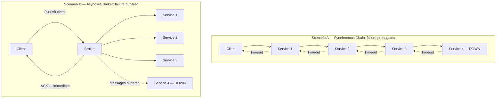

The cost is real and must be stated plainly. You surrender the immediate, linear answer. You inherit eventual consistency, out-of-order arrival, duplicate delivery, and debugging across process boundaries. The stack trace no longer tells the whole story. Chapters 4, 7, and 9 are dedicated entirely to taming these costs, which is itself a signal of how much they matter.

> 💡 **Expert Note:** The prose correctly frames async communication as converting "multiplicative fragility to additive resilience," but this holds only when the broker itself achieves genuine high availability. In many early-stage or cost-optimized deployments — a single Kafka cluster in one availability zone, a managed RabbitMQ with no standby — teams have simply relocated the single point of failure to the broker. The resilience claim becomes true only with multi-AZ broker replication (Kafka MirrorMaker 2, MSK Multi-AZ, Confluent Replication), lag-based alerting, and consumer-side retry with dead-letter queues. Senior architects must audit broker HA before accepting the "buffered resilience" promise at face value; otherwise the first broker outage produces a harder incident than any synchronous chain would have.

<details>
<summary>⚠️ Critical Note</summary>

The availability arithmetic (99.9%^5 ≈ 99.5%) implicitly assumes that service failures are statistically independent. In practice, services that share a database cluster, a VPC, a cloud availability zone, or a common dependency (e.g., a secrets manager or a service mesh control plane) have correlated failure modes. When failures are correlated, the real composite availability can be significantly worse than the independence model predicts, which cuts against the chapter's argument. Presenting this as a clean multiplicative formula without the independence caveat overstates the precision of the estimate and could mislead practitioners into being either over-confident (in systems with correlated failure) or under-confident (in systems with strong blast-radius isolation).
</details>

<details>
<summary>⚠️ Critical Note</summary>

The claim "a consumer outage no longer propagates upstream — messages wait in the log" is presented as an unconditional property of asynchronous, broker-mediated communication. This is only true within the broker's retention window and storage capacity. If a consumer is offline longer than the configured retention period (e.g., Kafka's default `log.retention.hours` or a finite SQS queue depth under sustained load), messages are dropped or overwritten. For senior architects designing production systems, this distinction is operationally critical: the choice of retention policy, consumer lag monitoring, and dead-letter strategy are all load-bearing design decisions that the prose glosses over.
</details>

## The Four Event Styles: Notification and State Transfer

Martin Fowler's taxonomy of four event styles is the sharpest tool for aligning a team on what "using events" actually means. Two styles dominate practice, and choosing between them is a concrete design decision with concrete consequences.

**Event Notification** carries the bare fact and little else: an ID, a type, a timestamp. `OrderPlaced { orderId: 4471 }`. The consumer that needs more must call back to the producer to fetch details. This keeps events tiny and payloads stable, but it reintroduces spatial and temporal coupling through the callback, and it can generate a storm of read traffic back to the source.

**Event-Carried State Transfer** puts the relevant data inside the event: the order lines, the customer, the totals. The consumer needs no callback; it holds its own replica of what it cares about. This maximizes decoupling and availability — the consumer works even when the producer is down — at the price of larger payloads, data duplication across services, and the discipline of keeping replicas coherent.

The remaining two styles, **Event Sourcing** (state as a log of events) and **CQRS** (segregating the read and write models), are the deep architectural patterns this book spends Chapters 5 and 6 dissecting. Treat them as advanced; do not reach for them to solve a notification problem.

| Style | Payload | Consumer needs callback? | Primary trade-off |
|-------|---------|--------------------------|-------------------|
| **Notification** | Minimal (ID + type) | Yes, to fetch details | Small events, but callback coupling |
| **State Transfer** | Full relevant state | No | Autonomy, but duplication |
| **Event Sourcing** | The events *are* the state | N/A | Full history, high complexity |
| **CQRS** | Separate read/write models | N/A | Read scalability, dual models |

A pragmatic default for corporate microservices: start with Event-Carried State Transfer for integration between bounded contexts, so consumers stay autonomous, and reserve the heavier patterns for problems that genuinely demand them.

> 💡 **Expert Note:** Event-Carried State Transfer maximizes consumer autonomy, but it silently assumes schema stability. In practice, once fat events are in production, the event schema becomes an implicit distributed API contract that producers regularly break — adding required fields, renaming properties, changing data types. Without a schema registry enforcing a compatibility mode (Confluent Schema Registry with BACKWARD or FULL compatibility, AWS Glue Schema Registry, or Apicurio), a single producer deploy can crash every downstream consumer simultaneously at runtime with no compile-time warning. The discipline of schema evolution — versioning strategies, Avro/Protobuf/JSON Schema compatibility contracts, and dual-publish migration windows — deserves equal billing with the "fat vs thin" payload trade-off introduced here, as it is the #1 operational failure mode teams hit after adopting Event-Carried State Transfer.

> ⚠️ **Critical Note:** The prose recommends Event-Carried State Transfer (ECST) as the "pragmatic default for corporate microservices" without acknowledging that embedding state (especially PII) inside events creates serious GDPR and data-governance exposure. Once an event containing customer name, email, or payment data is replicated to N consumers, satisfying a right-to-erasure request becomes operationally complex or technically impossible without rebuilding consumer projections. For senior architects operating in regulated enterprise environments — the exact audience of this book — following this default without qualification could produce a compliance landmine that is extremely expensive to unwind after the fact.

<details>
<summary>💡 Expert Note</summary>

The pragmatic default — "start with Event-Carried State Transfer for cross-context integration" — requires a critical qualifier for corporate systems handling personal data. Fat events that carry customer PII (name, email, payment tokens, behavioral data) and are replicated to N consumers across N databases create significant GDPR Article 17 (right to erasure) and data residency exposure. When a customer requests deletion, you must identify and purge every replica in every consumer data store, which becomes an operational nightmare as the consumer count grows. Production patterns for compliant fat events include: (1) emitting only pseudonymous identifiers in the event with PII fetched via a controlled data vault, or (2) encrypting per-customer payloads with a key stored in a key-management service — revoking the key effectively erases the data in all replicas. Teams in regulated industries should validate this trade-off before adopting Event-Carried State Transfer as a blanket default.
</details>

## Decision Criteria: When to Adopt and When to Avoid

Opinions without criteria are just preferences. Here is the checklist.

**Adopt EDA when** several of these hold:
1. Producers and consumers must scale, deploy, and fail independently.
2. One fact naturally triggers many reactions (fan-out to consumers you cannot enumerate today).
3. The business tolerates — or actively wants — eventual consistency.
4. Peaks require buffering, so a broker can absorb load spikes the downstream cannot.
5. New capabilities should attach to existing flows without modifying the producer.

**Avoid EDA when** any of these dominate:
1. The interaction is a synchronous read a user is waiting on right now.
2. You need a strongly consistent, immediate answer (many financial authorizations do).
3. The system is a small monolith or a handful of services with a stable, well-understood flow.
4. Your team lacks the operational maturity for tracing, schema governance, and idempotency — the disciplines the rest of this book teaches.

This function encodes the adoption checklist from the chapter into an executable rule:
it allows teams to reason about architectural style systematically rather than by intuition alone,
and makes the maturity gate explicit — preventing premature EDA adoption, the failure mode the
chapter calls the most expensive mistake.

```python
# Decision function: maps system context flags to an architectural style recommendation
from dataclasses import dataclass


@dataclass(frozen=True)
class ArchitectureContext:
    """Captures the boolean flags that drive the EDA adoption decision."""
    needs_immediate_answer: bool          # user or system is blocked waiting for a synchronous result
    requires_strong_consistency: bool     # e.g. financial authorization — cannot tolerate stale reads
    independent_scaling: bool             # producers and consumers must scale and deploy independently
    fan_out: bool                         # one fact triggers reactions in multiple, possibly unknown, consumers
    tolerates_eventual_consistency: bool  # business domain accepts that replicas converge, not instantly
    operational_maturity: bool            # team can operate distributed tracing, schema governance, idempotency


def recommend_architecture(ctx: ArchitectureContext) -> str:
    """
    Returns one of three recommendations based on the context flags.

    Rules applied in priority order:
      1. Hard blockers for EDA → synchronous is safer
      2. Missing operational maturity → reconsider before committing
      3. Sufficient EDA signals present → prefer event-driven
      4. Default → synchronous (the simpler, more honest choice)
    """

    # Hard blockers: situations where synchronous request-response is clearly correct
    if ctx.needs_immediate_answer or ctx.requires_strong_consistency:
        return "prefer synchronous request-response"

    # Operational gate: EDA complexity is not free — check the team can absorb it
    eda_signals = sum([
        ctx.independent_scaling,
        ctx.fan_out,
        ctx.tolerates_eventual_consistency,
    ])

    if eda_signals >= 2 and not ctx.operational_maturity:
        return "reconsider — insufficient maturity for EDA"

    # Positive case: multiple EDA drivers present and team is ready
    if eda_signals >= 2 and ctx.operational_maturity:
        return "prefer event-driven"

    # Default: absent strong distribution pressures, synchronous is the honest choice
    return "prefer synchronous request-response"


# --- Example usage ---

if __name__ == "__main__":
    # Scenario A: checkout flow — user is waiting, payment requires strong consistency
    checkout = ArchitectureContext(
        needs_immediate_answer=True,
        requires_strong_consistency=True,
        independent_scaling=False,
        fan_out=False,
        tolerates_eventual_consistency=False,
        operational_maturity=True,
    )
    print(recommend_architecture(checkout))
    # Output: prefer synchronous request-response

    # Scenario B: order placed, triggers inventory + notifications + analytics
    order_placed = ArchitectureContext(
        needs_immediate_answer=False,
        requires_strong_consistency=False,
        independent_scaling=True,
        fan_out=True,
        tolerates_eventual_consistency=True,
        operational_maturity=True,
    )
    print(recommend_architecture(order_placed))
    # Output: prefer event-driven

    # Scenario C: team is new to distributed systems — maturity gate fires
    greenfield_low_maturity = ArchitectureContext(
        needs_immediate_answer=False,
        requires_strong_consistency=False,
        independent_scaling=True,
        fan_out=True,
        tolerates_eventual_consistency=True,
        operational_maturity=False,  # missing: tracing, schema governance, idempotency
    )
    print(recommend_architecture(greenfield_low_maturity))
    # Output: reconsider — insufficient maturity for EDA
```

The failure mode to fear most is premature adoption. Wrapping a two-service CRUD app in Kafka does not make it resilient; it makes it a distributed system with all the debugging pain and none of the payoff. EDA is a response to genuine distribution, scale, and independence pressures. Absent those pressures, a well-factored synchronous service is the more honest engineering choice. Reach for events when the problem is asynchronous by nature — not to appear modern.

<details>
<summary>💡 Expert Note</summary>

The "avoid EDA" criterion that references "operational maturity" is the right gate, but leaving it undefined lets teams self-certify incorrectly. In practice, minimum viable EDA operations requires at least: (1) distributed tracing with propagated correlation IDs across all producers and consumers — OpenTelemetry with a W3C TraceContext header injected into event metadata is the current industry standard; (2) dead-letter queues on every consumer with alerting on DLQ depth, not just on consumer lag; (3) a schema registry with enforced compatibility modes as described above; and (4) idempotency keys on all consumer handlers, documented and tested, because duplicate delivery is not an edge case — it is guaranteed by at-least-once brokers. A team that cannot demonstrate all four capabilities in a lower environment should defer EDA adoption regardless of how strong the scale and fan-out pressures are.
</details>

## Key Takeaways

- An **event** is an immutable fact of the past; a **command** is an intent to act; a **message** is only the envelope. Conflating them corrupts the design.
- Coupling has three axes — **temporal**, **spatial**, and **flow**. EDA loosens all three but replaces explicit coupling with implicit, runtime coupling rather than eliminating it.
- Synchronous availability is multiplicative and fragile across a chain; asynchronous, broker-mediated communication converts that into buffered resilience — at the cost of eventual consistency and harder debugging.
- **Event Notification** keeps events tiny but reintroduces callback coupling; **Event-Carried State Transfer** maximizes consumer autonomy through data duplication. Prefer the latter as the default for cross-context integration.
- Adopt EDA for independent scaling, fan-out, and load buffering; avoid it for synchronous reads, strong-consistency needs, and teams without operational maturity. Premature adoption is the most expensive mistake.

## What's Next

With the atom defined, Chapter 2 turns to designing events that express meaningful business facts — using Domain-Driven Design and Event Storming to avoid publishing technical noise as if it were a domain event.

<!-- ASSEMBLY COMPLETE
  Chapter: Foundations of Event-Driven Architecture
  Code blocks resolved: 1 / 1
  Diagrams resolved: 2 / 2
  Expert callouts (inline): 2
  Expert callouts (collapsed): 3
  Critical callouts (inline): 1
  Critical callouts (collapsed): 3
  Unresolved markers: 0
-->


# Chapter 2: Modeling Events as Domain Facts

## Opening Problem Statement

Chapter 1 defined an event as an immutable fact of the past and gave us a shared vocabulary: coupling axes, event styles, and Event-Carried State Transfer as the default for cross-context integration. But a definition does not tell you *which* facts deserve to become events. This is where most event-driven systems quietly rot. A team wires a broker into their stack, and within months the topics are flooded with `RowInserted`, `CacheInvalidated`, and `UserEntityUpdated`. None of these mean anything to the business. They are technical exhaust dressed up as domain knowledge, and every consumer that subscribes to them inherits the producer's database schema as a de facto contract. The problem this chapter solves is discipline in modeling: how to design events that carry genuine business meaning, that survive refactoring, and that let independent teams integrate without stepping on each other. The senior architect's job here is not to publish more events — it is to publish the *right* ones, with names that read like sentences a domain expert would speak. Get this wrong and no amount of Kafka tuning will save the architecture.

## Domain Events Versus Integration Events

The single most useful distinction in event modeling is between **domain events** and **integration events**. They look identical on the wire — both are immutable facts — but they serve different audiences and obey different rules.

A **domain event** is a fact that matters *inside* a single bounded context. It is expressed in that context's ubiquitous language and is often consumed by the same service that produced it, or by tightly related components within the same team's boundary. `OrderPlaced`, `PaymentDeclined`, `SeatReserved` — these describe something a business stakeholder cares about. Domain events are rich; they can reference internal aggregates freely because everyone who reads them shares the same model.

An **integration event** is a fact published *across* a bounded-context boundary, intended for other teams and other services. It is a deliberate, public contract. Because it crosses a boundary, it must not leak internal structure. An integration event is a translation — a stripped, stabilized projection of one or more domain events into a shape the outside world can depend on.

The table below makes the contrast concrete.

| Aspect | Domain Event | Integration Event |
|--------|--------------|-------------------|
| Audience | Inside one bounded context | Other contexts and teams |
| Language | Full ubiquitous language | Stable public vocabulary |
| Payload | Rich, references aggregates | Minimal, self-contained |
| Coupling | Tight, by design | Loose, contractual |
| Lifespan | Changes with the model | Changes only via versioning |
| Failure of leaking | Local refactor | Breaks external consumers |

The rule follows directly: **never publish a raw domain event across a context boundary.** Translate it first. The moment an external team subscribes to your internal `OrderAggregateUpdated`, your database becomes their API, and you have lost the freedom to refactor. This translation step is not bureaucracy — it is the seam that keeps teams independent.

*A domain event produced inside a bounded context must be translated into an integration event before it crosses the context boundary; this seam preserves each team's freedom to refactor their internal model independently.*

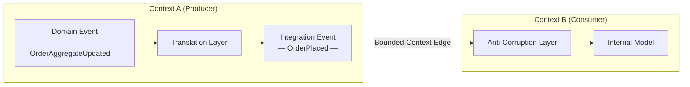

> 💡 **Expert Note:** The translation step from domain event to integration event is not just a modeling discipline — it is a reliability boundary that requires an explicit delivery mechanism. In production systems, the most common failure mode is: domain event is captured in memory or in an application-layer listener, the translation runs synchronously, and the publish to the broker fails or the process crashes between the database commit and the broker write. The industry-standard fix is the **Transactional Outbox pattern**: write the outgoing integration event to an `outbox` table in the same ACID transaction that mutates the aggregate, then relay asynchronously. Without this, the translation boundary that protects your consumers from your schema is itself a source of phantom consistency bugs that are extremely hard to reproduce in test environments.

<details>
<summary>⚠️ Critical Note</summary>
The table labels domain event coupling as "Tight, by design." This is misleading and risks confusing senior architects. Domain events within a bounded context are precisely a *decoupling* mechanism: an Order aggregate raises `OrderPlaced` so that other domain services (inventory reservation, email dispatch) can react without the aggregate calling them directly. "Tight" is inaccurate; the correct framing is "internal — boundary does not apply." Describing intra-context coupling as "tight by design" could lead readers to resist domain events inside their own context, defeating their purpose.

**Suggested fix:** Replace "Tight, by design" in the Coupling row with "Internal — no contract boundary; consumers share the same model." Add a sentence noting that domain events *enable* loose coupling within a context between aggregates and domain services.
</details>

<details>
<summary>⚠️ Critical Note</summary>
The prose presents the translation step ("never publish a raw domain event across a context boundary — translate it first") as a design rule without addressing the reliability mechanism that makes this rule safe to follow. The translation from domain event to integration event is typically done inside the same transaction or via an outbox pattern; if it is done by a separate process or handler, the translation itself can fail silently, producing either duplicates or lost events. For senior architects, the "translate it first" rule is incomplete without acknowledging that the *how* of reliable translation is non-trivial and is the source of most real-world integration bugs. Deferring this entirely to Chapter 3 leaves a dangerous gap at the exact moment the reader is deciding to adopt the pattern.

**Suggested fix:** Add a one- or two-sentence callout acknowledging that reliable translation requires an atomicity guarantee (e.g., transactional outbox or event sourcing), and forward-reference the specific chapter where this is addressed so readers know the gap is intentional, not overlooked.
</details>

## Event Storming as a Discovery Technique

You cannot model events well by staring at a database schema. Events must be *discovered* from the business, and the fastest technique for that discovery is **Event Storming** — a collaborative workshop invented by Alberto Brandolini. It puts domain experts and engineers at the same wall and asks one question: what happens in this business?

The mechanics are deliberately low-tech. Participants write facts on orange sticky notes, phrased in the past tense, and place them on a timeline. `OrderPlaced` goes up, then `PaymentAuthorized`, then `OrderShipped`. When the orange notes stop flowing, other colors enter: blue for commands that trigger events, yellow for aggregates, pink for external systems, and purple for policies ("whenever *this* happens, do *that*"). The wall becomes a map of the business process before a single class is written.

Three signals from an Event Storming session directly shape your architecture:

1. **Clusters of events** around the same aggregate reveal a bounded context. Where the language shifts — where "order" starts meaning something different — you have found a boundary.
2. **Hotspots**, marked with red notes, expose disagreement or unknowns. These are the risky parts of the domain and deserve the most design attention.
3. **Pivotal events** — the ones every stakeholder points to — are your true integration events, the facts other contexts will want.

*An Event Storming timeline maps business facts in past tense from left to right, surfacing commands, aggregates, and policies; the point where the ubiquitous language shifts marks a bounded-context boundary and signals a candidate integration event.*

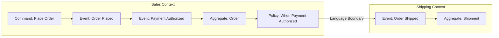

The payoff is that events emerge from the language of the business, not from the shape of a table. When a domain expert nods at `PaymentDeclined` and shakes their head at `UserRecordUpdated`, they are doing your naming review for free. Run the workshop before you design schemas, not after.

<details>
<summary>💡 Expert Note</summary>
Alberto Brandolini defines three levels of Event Storming — **Big Picture**, **Process Modeling**, and **Software Design** — but most teams run only the first and call it done. The Big Picture session produces the boundary map and pivotal events described in the prose. Process Modeling (a separate, smaller session) is where commands, actors, read models, and policies are refined per sub-process: this is the level that produces the aggregate and command design that feeds directly into code. Stopping at Big Picture leaves a significant translation gap between the workshop wall and the first schema draft, which engineers typically fill by reverting to database-shaped events — the exact anti-pattern Chapter 2 warns against.
</details>

<details>
<summary>💡 Expert Note</summary>
In practice, Event Storming hotspots (red notes) are as often organizational as they are technical. A persistent hotspot where domain experts cannot agree on a term is frequently a signal of **Conway's Law** tension: two teams share ownership of a concept and have evolved different models. Treating these as purely technical modeling problems leads to fragile compromises. The more effective response is to surface the organizational ownership question explicitly — which team owns the definition of this aggregate? — and let that decision drive the bounded-context boundary, rather than searching for a linguistic middle ground that neither team will actually maintain.
</details>

<details>
<summary>⚠️ Critical Note</summary>
Event Storming is presented as a straightforwardly accessible technique: "participants write facts on orange sticky notes" and the wall "becomes a map of the business process before a single class is written." This glosses over the substantial organizational and facilitation prerequisites. Without an experienced facilitator, sessions routinely collapse into technical jargon, scope explosion, or competing political agendas between departments. Domain experts must be willing and available — a constraint that is often the hardest part in enterprise settings. Presenting the technique as low-effort ("deliberately low-tech") without acknowledging facilitation complexity could cause teams to run poorly structured sessions, produce misleading event maps, and blame the technique rather than the execution.

**Suggested fix:** Add a short paragraph noting that effective Event Storming requires a skilled, neutral facilitator (ideally experienced with DDD), prepared domain experts who have authority to describe the business (not just developers describing what the system does), and a time commitment of at least a full day per major process. Recommend Brandolini's "Introducing EventStorming" as the reference for facilitation details.
</details>

## Bounded Contexts and Event Contracts Between Teams

A **bounded context** is the scope within which a model and its ubiquitous language are consistent. "Customer" in the Sales context is not the same "Customer" in the Billing context, even if both map to the same person. Events are how these contexts talk without merging their models — and that makes every published event a **contract**.

Treating events as contracts changes how you manage them. A contract has an owner (the producing team), a specification (the schema), and consumers who build against it. Once someone depends on your integration event, you cannot silently change its shape. This is why mature organizations adopt **consumer-driven contracts**: consumers publish the expectations they hold, and the producer's pipeline verifies that changes do not break them. We return to schema evolution in depth in Chapter 8, but the modeling decision starts here — a well-modeled integration event is one whose meaning is stable enough to promise indefinitely.

The anti-corruption boundary is the practical mechanism. When Context B consumes an event from Context A, it translates A's vocabulary into its own model at the edge, rather than letting A's concepts spread inside. This keeps the two models free to evolve. The event is the wire between them; the translation layers on each side are the insulation.

**Pro Tip:** Assign every integration event a single owning team and record it in a discoverable catalog. An event with no owner is an event no one can safely change — and one that no one dares to delete.

<details>
<summary>💡 Expert Note</summary>
The prose correctly introduces consumer-driven contracts as the mechanism for safely evolving integration events, but the tooling gap is worth naming for practitioners ready to implement it. For asynchronous event systems, **Pact** (pact.io) is the most widely adopted consumer-driven contract testing framework and has first-class support for message contracts as of v4. Schema registry contract enforcement (Confluent Schema Registry with compatibility modes, or AWS Glue Schema Registry) handles structural evolution but not semantic compatibility — Pact covers the latter. A complementary layer is **AsyncAPI 3.0**, now the dominant spec for documenting async event contracts, equivalent to OpenAPI for REST; it integrates with schema registries and feeds discoverability catalogs such as Backstage.
</details>

> 💡 **Expert Note:** The prose correctly places the anti-corruption boundary at the context edge, but teams frequently misplace the implementation of it. In an asynchronous event system, the ACL lives **inside the consuming service's event handler or a dedicated transformer process** — not in the broker, not in a shared middleware layer. Attempts to implement a "centralized ACL" at the broker level (via Kafka Streams topology or an ESB-style intermediary) reconstitute the integration hub that event-driven architecture was meant to eliminate, and create a shared-mutable component that every team depends on. Each consumer owns its own translation; that is what keeps them independently deployable.

<details>
<summary>⚠️ Critical Note</summary>
The prose states that "a well-modeled integration event is one whose meaning is stable enough to promise indefinitely." This is an unrealistic and potentially harmful standard for most business domains. Business meaning changes: regulations shift, products are discontinued, mergers redefine "customer." The correct framing is that integration events should be *stable enough to require explicit versioning rather than silent breakage* — not stable indefinitely. Promising indefinite stability could cause teams to over-engineer events in an attempt to anticipate all future meanings, resulting in bloated, over-generic schemas that are harder to evolve than well-scoped versioned ones.

**Suggested fix:** Replace "stable enough to promise indefinitely" with "stable enough that changes require explicit versioning and coordinated consumer migration — not silent schema mutation." Briefly note that business domain evolution makes indefinite stability a fiction; good event design minimizes the *frequency* of breaking changes, not their possibility.
</details>

## Granularity and Event Naming Conventions

Granularity is where good intentions produce bad systems. Too coarse, and one bloated event forces every consumer to parse fields they do not need. Too fine, and consumers must reassemble a business fact from a storm of fragments, reintroducing exactly the coupling events were meant to remove.

The guiding heuristic: **model events at the granularity of a business decision, not a data mutation.** `OrderPlaced` is a decision. `OrderTotalColumnUpdated` is a mutation. If a fact only makes sense to someone holding your table definition, it is too fine and probably not a domain event at all.

Naming carries as much weight as granularity. Follow these rules without exception:

- **Past tense, always.** An event records something that already happened: `InvoiceIssued`, not `IssueInvoice` (that is a command) and not `InvoiceIssue`.
- **Business language, not technical language.** `PaymentCaptured` beats `PaymentServiceApiCallSucceeded`.
- **Name the fact, not the handler.** `SubscriptionCancelled`, not `SendCancellationEmail` — the latter names a reaction, coupling the event to one consumer's intent.
- **Include the aggregate, keep it specific.** `CartCheckedOut` tells you the subject and the fact in two words.

*Both definitions below are publishable Python dataclasses. `OrderPlaced` captures a business decision in vocabulary a domain expert recognizes; `OrderTableRowChanged` exposes raw persistence details that couple every consumer to the producer's database schema.*

```python
# Contrasting event schemas: durable business contract vs. technical noise
# O(1) — schema definition; no algorithmic complexity

from __future__ import annotations

import uuid
from dataclasses import dataclass, field
from datetime import datetime
from decimal import Decimal
from enum import StrEnum


# ---------------------------------------------------------------------------
# GOOD: OrderPlaced — a durable integration event
#
# Why this works as a contract:
#   • Named in the past tense using ubiquitous language ("Placed")
#   • Carries only stable business facts; no internal aggregate IDs leak out
#   • A non-technical domain expert can read every field and understand it
#   • Consumers depend on *meaning*, not on the producer's table structure
#   • Adding a new field (non-breaking) or renaming an existing one (versioned)
#     is a deliberate, announced change — not a silent side-effect of a migration
# ---------------------------------------------------------------------------

class Currency(StrEnum):
    USD = "USD"
    EUR = "EUR"
    BRL = "BRL"


@dataclass(frozen=True)          # frozen=True enforces immutability
class OrderLineItem:
    product_id: str              # public product catalog ID (stable reference)
    product_name: str            # denormalized for self-containment
    quantity: int
    unit_price: Decimal
    currency: Currency


@dataclass(frozen=True)
class OrderPlaced:
    """
    Integration event: a customer has placed an order.

    This is the canonical fact other bounded contexts depend on.
    Billing uses it to initiate payment; Fulfillment uses it to reserve stock.
    Neither context needs to know which database table stored the order.
    """
    event_id: str = field(default_factory=lambda: str(uuid.uuid4()))
    occurred_at: datetime = field(default_factory=datetime.utcnow)

    # --- Business payload (stable, meaningful fields) ---
    order_id: str = ""           # public order reference, not a DB primary key
    customer_id: str = ""        # stable external customer identifier
    channel: str = ""            # "web", "mobile", "api" — business channel
    items: tuple[OrderLineItem, ...] = field(default_factory=tuple)
    total_amount: Decimal = Decimal("0.00")
    currency: Currency = Currency.USD
    shipping_address_country: str = ""   # country code (ISO 3166-1 alpha-2)


# ---------------------------------------------------------------------------
# BAD: OrderTableRowChanged — technical noise masquerading as a domain event
#
# Why this is an anti-pattern:
#   • The name describes a persistence mechanism ("TableRow"), not a business fact
#   • `changed_columns` leaks the producer's schema; consumers must understand
#     column names to extract any meaning — their code now mirrors the DB schema
#   • A non-technical domain expert cannot tell whether anything meaningful
#     happened: a retry, a migration, or a real business decision all look the same
#   • When the producer renames a column or splits a table, all consumers break
#     silently — this is the hidden cost of technical noise
# ---------------------------------------------------------------------------

@dataclass(frozen=True)
class ColumnDiff:
    column_name: str             # raw DB column name — a leaking implementation detail
    old_value: object
    new_value: object


@dataclass(frozen=True)
class OrderTableRowChanged:
    """
    Anti-pattern: publishes a raw persistence event as though it were a domain fact.

    Consumers cannot determine business intent from column diffs.
    Did the user cancel? Did a background job fix a typo? Was it a no-op write?
    This event answers none of those questions.
    """
    event_id: str = field(default_factory=lambda: str(uuid.uuid4()))
    occurred_at: datetime = field(default_factory=datetime.utcnow)

    # --- Technical payload (unstable, leaks internal schema) ---
    table_name: str = "orders"           # couples consumers to the DB table name
    row_pk: int = 0                      # exposes the surrogate database primary key
    changed_columns: tuple[ColumnDiff, ...] = field(default_factory=tuple)
    transaction_id: str = ""             # DB transaction detail — irrelevant to consumers
    orm_version: int = 0                 # ORM optimistic-lock version — internal noise


# ---------------------------------------------------------------------------
# Demonstration: the same business fact expressed in both styles
# ---------------------------------------------------------------------------

def demo() -> None:
    item = OrderLineItem(
        product_id="PROD-7821",
        product_name="Wireless Keyboard",
        quantity=2,
        unit_price=Decimal("49.99"),
        currency=Currency.USD,
    )

    # Meaningful: any consumer knows exactly what happened
    good_event = OrderPlaced(
        order_id="ORD-20240901-00042",
        customer_id="CUST-8814",
        channel="web",
        items=(item,),
        total_amount=Decimal("99.98"),
        currency=Currency.USD,
        shipping_address_country="US",
    )

    # Noisy: consumers must reverse-engineer business meaning from column diffs
    bad_event = OrderTableRowChanged(
        table_name="orders",
        row_pk=100042,
        changed_columns=(
            ColumnDiff("status_cd", "DRAFT", "CONFIRMED"),    # what does "CONFIRMED" mean?
            ColumnDiff("upd_ts", "2024-09-01T10:00:00", "2024-09-01T10:00:01"),
            ColumnDiff("orm_ver", 3, 4),                      # pure internal noise
        ),
    )

    print("Good event type :", type(good_event).__name__)     # OrderPlaced
    print("Good event items:", len(good_event.items))         # 2 items
    print()
    print("Bad event type  :", type(bad_event).__name__)      # OrderTableRowChanged
    print("Bad event cols  :", [c.column_name for c in bad_event.changed_columns])


if __name__ == "__main__":
    demo()
```

A good name is a design review in itself. If a domain expert cannot understand your event from its name alone, the model is wrong — rename it before you ship it.

> 💡 **Expert Note:** The prose warns against events that are too fine-grained (mutations), but the opposite failure is equally dangerous in production and receives less attention: events that are too coarse create **evolutionary pressure toward kitchen-sink payloads**. As new consumers arrive, each one needs a field the existing event does not carry. The path of least resistance is to keep adding fields to the single coarse event. Within 18 months, `OrderPlaced` carries 60 fields, half of which are null for any given consumer, and the schema has become a de facto shared database across teams. The mitigation is to model at business decision granularity but then deliberately audit which fields each declared consumer actually uses — zero-field consumers are a signal the event boundary is wrong.

<details>
<summary>⚠️ Critical Note</summary>
The granularity discussion is missing the critical fat-versus-thin event trade-off that every senior architect must decide at design time. Fat events (carrying full aggregate state) make consumers self-sufficient but increase payload size, may leak internal model details, and make it harder to control what constitutes a "meaningful" change. Thin events (carrying only the ID or a minimal diff) keep payloads small but force consumers to make a synchronous lookup call to fetch needed state, reintroducing temporal coupling and a potential availability dependency. For an audience of senior engineers and architects, presenting granularity only as "business decision vs. data mutation" without naming this trade-off leaves out the most consequential design decision at the schema level.

**Suggested fix:** Add a sub-section or callout covering the fat/thin spectrum: fat events favor consumer autonomy at the cost of payload size and model exposure; thin events reduce payload and exposure but can force consumers into synchronous queries. Reference Event-Carried State Transfer (from Chapter 1) as the recommended default for cross-context integration, and note that thin events are preferable when payload size or model sensitivity is a concern within a context.
</details>

## Technical Noise as a Modeling Anti-Pattern

The most common failure in event-driven systems is **technical noise**: publishing infrastructure and persistence events as though they were domain facts. `EntitySaved`, `KafkaOffsetCommitted`, `CacheEvicted`, `FieldXChanged`. These events describe how the software works, not what the business did.

Technical noise is corrosive for three reasons. First, it couples consumers to your implementation — subscribers now depend on your ORM's save cadence or your caching strategy. Second, it destroys signal: real business events drown in a flood of mechanical chatter, and consumers cannot tell which events matter. Third, it lies. An `EntityUpdated` event claims a business fact occurred when often nothing meaningful did — a retry, a migration, or a no-op write.

The test is simple and unforgiving: **could a non-technical domain expert say this event out loud and mean it?** "The order was placed" passes. "The row was updated" fails. If the answer is no, you are looking at technical noise, and it does not belong on a domain topic.

*Mixing technical noise into domain topics floods consumers with irrelevant signals, making it impossible to distinguish real business facts from implementation artifacts; keeping domain topics clean preserves the stream as a reliable business ledger.*

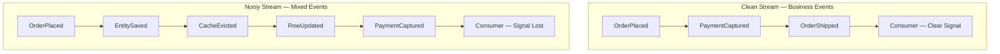

This does not mean technical events are worthless. Operational and infrastructure signals are legitimate — for monitoring, metrics, and debugging, which Chapter 9 covers. The sin is not producing them; it is publishing them onto the same domain channels that other teams treat as the source of business truth. Keep the two streams separate. Your domain topics are a business ledger, and a ledger with fake entries is worse than no ledger at all.

> 💡 **Expert Note:** The most common production source of technical noise that practitioners encounter is **Change Data Capture (CDC) pipelines publishing directly to domain topics**. Tools like Debezium capture row-level changes from the database transaction log and emit events such as `INSERT/UPDATE on orders table with column deltas` — which is precisely the `OrderTableRowChanged` anti-pattern the prose describes. The failure mode is that teams treat CDC as the event publishing layer, bypassing domain modeling entirely. The correct architecture is to use CDC as an **outbox relay** (reading from an `outbox` or `domain_events` table written by the application) rather than capturing raw table mutations. If you see Debezium topics named after database tables flowing directly to consumers, you are looking at technical noise at industrial scale.

## Key Takeaways

- **Domain events** live inside one bounded context; **integration events** are deliberate public contracts. Never publish a raw domain event across a boundary — translate it first.
- **Event Storming** discovers events from the business language, exposing bounded contexts, hotspots, and the pivotal facts that become integration events.
- Every published event is a **contract** with an owner, a schema, and consumers; anti-corruption boundaries keep producer and consumer models independent.
- Model events at the granularity of a **business decision**, name them in the **past tense** using ubiquitous language, and name the fact rather than the handler.
- **Technical noise** — persistence and infrastructure events masquerading as domain facts — couples consumers to your implementation and drowns real signal. Apply the domain-expert test.

## What's Next

With well-modeled events in hand, Chapter 3 examines how those events actually flow — comparing broker and mediator topologies, choreography versus orchestration, and the messaging technologies that carry your domain facts across the system.

<!-- ASSEMBLY COMPLETE
  Chapter: Modeling Events as Domain Facts
  Code blocks resolved: 1 / 1
  Diagrams resolved: 3 / 3
  Expert callouts (inline): 4
  Expert callouts (collapsed): 3
  Critical callouts (inline): 0
  Critical callouts (collapsed): 4
  Unresolved markers: 0
-->


# Chapter 3: Topologies and Messaging Infrastructure

## Opening Problem Statement

Chapter 2 taught how to model events as genuine business facts and treat every published event as an owned contract. But a well-modeled event is inert until something moves it from the service that produced it to the services that care. That "something" is your messaging infrastructure, and choosing it is one of the highest-leverage, hardest-to-reverse decisions in an event-driven system. Pick the wrong topology and you will spend the next two years fighting your own middleware: replaying events that cannot be replayed, ordering messages that were never ordered, and debugging a control flow that lives nowhere in your codebase. Senior architects do not get to be vague here. The distinction between a distributed log and a queue is not academic trivia; it dictates whether you can rebuild a read model from scratch, whether a slow consumer blocks a fast one, and whether "add another consumer" is a config change or a redesign. This chapter maps the two topology families, the two coordination models, and the three technology archetypes you will actually meet in production. By the end, you should be able to defend a choice, not just name one.

## Broker Topology Versus Mediator Topology

Every event-driven system falls into one of two structural patterns, and the difference is about where the control flow lives. In a **broker topology**, there is no central coordinator. Each service publishes events and subscribes to the events it needs, then reacts on its own. The business process is an emergent property of many independent reactions. Nobody owns the end-to-end flow; it exists only as the sum of local decisions. This is the pattern that gives EDA its famous decoupling and its equally famous debuggability problem.

In a **mediator topology**, a central component, the **mediator** or **orchestrator**, owns the process. It receives a triggering event, then issues commands to participant services in a deliberate sequence, tracking the state of the workflow as it advances. The mediator knows what step comes next, what to do when a step fails, and when the process is complete. The flow is explicit and lives in one place you can read.

The trade-off is the whole point. Broker topology maximizes decoupling and throughput but scatters the process across services, making it hard to answer "why did this order get stuck?" Mediator topology centralizes visibility and error handling but reintroduces a coordination dependency and a potential bottleneck. Neither is correct in the abstract.

*Diagram: Broker Topology versus Mediator Topology — contrasting emergent, decentralized control flow against deliberate, centralized coordination.*

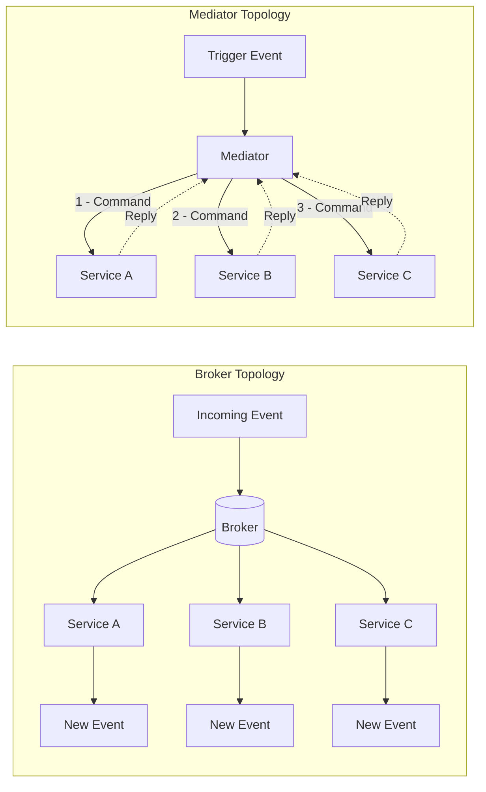

A useful heuristic: use broker topology for simple, mostly independent reactions where each subscriber's job is self-contained. Reach for a mediator when the process has real steps, ordering constraints, and compensation logic that someone must own. We will formalize the mediator as a saga process manager in Chapter 7; here it is enough to recognize the structural choice.

<details>
<summary>💡 Expert Note</summary>

The prose correctly identifies the mediator as a potential bottleneck, but in practice the more dangerous production risk is blast radius, not throughput. Modern workflow engines (AWS Step Functions, Temporal, Conductor) scale horizontally and are rarely CPU- or throughput-limited. The real danger is that a bug in the orchestrator's business logic, or a bad deployment that corrupts workflow state, simultaneously affects every in-flight instance of every workflow type managed by that orchestrator. Teams mitigate this with workflow versioning (Temporal's versioning API, Step Functions state machine versions), strict canary deployment of orchestrator changes, and separation of workflow definitions by domain boundary so a defect in Order workflows cannot corrupt Payment workflows.
</details>

<details>
<summary>⚠️ Critical Note</summary>

The prose opens with "every event-driven system falls into one of two structural patterns" and then builds the entire topology framework on the broker/mediator binary. In practice, large production systems routinely combine both: domain events flow over a broker while cross-domain sagas are orchestrated via a mediator, often within the same deployment. Presenting the choice as mutually exclusive at the system level leads architects toward a false either/or decision at architecture time, when the real question is "which topology per process boundary?" The binary framing is pedagogically convenient but actively misleading for senior practitioners designing systems with heterogeneous workflows.
</details>

## Choreography Versus Orchestration

Broker and mediator are structural terms; **choreography** and **orchestration** are the behavioral coordination models that map onto them. They are frequently used as synonyms for the topologies, and for practical purposes the mapping holds: choreography is how a broker topology coordinates, orchestration is how a mediator topology coordinates.

In **choreography**, each service reacts to events and emits new events without being told to by any central authority. Think of dancers who each know their own steps and cues; the dance emerges from everyone reacting to the music and to each other. There is no conductor. An `OrderPlaced` event triggers the payment service, whose `PaymentCaptured` event triggers the shipping service, and so on. The flow is a chain of reactions.

In **orchestration**, a conductor, the orchestrator, explicitly directs each participant. It sends a "capture payment" command, waits for the result, then sends a "reserve inventory" command. The participants do not need to know about each other at all; they only know how to obey commands and report outcomes.

The tension is visibility versus autonomy. Choreography keeps services maximally independent but hides the process; to understand the whole flow you must trace events across many services. Orchestration makes the process legible and centralizes failure handling but couples participants to the orchestrator and creates a component that must scale and stay available.

| Dimension | Choreography | Orchestration |
|---|---|---|
| Control flow | Distributed, emergent | Centralized, explicit |
| Coupling | Lowest | Higher (to orchestrator) |
| Process visibility | Poor, must be traced | Excellent, lives in one place |
| Failure handling | Each service, locally | Orchestrator owns it |
| Best fit | Few steps, autonomous reactions | Many steps, ordering, compensation |

The opinionated position: default to choreography for small numbers of steps, and switch to orchestration the moment the process exceeds roughly four steps or requires compensation. Junior teams tend to over-orchestrate out of a desire for control; over-decoupled teams choreograph flows so complex that no one can explain them. Both are failure modes.

<details>
<summary>💡 Expert Note</summary>

The prose frames the choice as system-wide, but the most resilient production architectures apply both models simultaneously at different granularity levels. The canonical pattern: use orchestration inside a bounded context (a saga process manager owns multi-step workflows within the Payment domain) and use choreography between bounded contexts (Payment publishes `PaymentCaptured`; Fulfillment subscribes without knowing that Payment exists). This aligns with DDD's autonomous bounded-context principle and prevents the orchestrator from accumulating cross-domain knowledge that collapses the boundary. Teams that miss this often build a "god orchestrator" that ends up knowing about every service, recreating the coupling they were trying to eliminate.
</details>

<details>
<summary>⚠️ Critical Note</summary>

The prose offers "switch to orchestration the moment the process exceeds roughly four steps" as an opinionated but actionable threshold. This number has no empirical basis and is highly context-dependent. Two-step flows with external payment systems and regulatory compensation requirements often demand a mediator; eight-step internal data pipelines with fully autonomous services and mature observability can operate safely as choreography. The relevant variables are not step count but: whether compensation is required (sagas), whether the process has a business owner who needs an audit trail, what observability tooling is in place, and whether services are autonomously deployable. Presenting a step count as the decision threshold will cause teams to misclassify their workflows.
</details>

## Distributed Log Versus Queue

Now to the infrastructure itself. The single most consequential technical distinction in messaging is between a **queue** and a **distributed log**, because it determines what you can and cannot do with events after they are consumed.

A traditional **message queue**, such as RabbitMQ or Amazon SQS, treats a message as a work item to be consumed and destroyed. A producer puts a message on the queue; a consumer takes it off; once acknowledged, the message is gone. Queues excel at distributing work: many competing consumers pull from the same queue, and each message is handled by exactly one of them. This is the **competing consumers** pattern, and it is ideal for task distribution where messages are transient commands to do work.

A **distributed log**, exemplified by Apache Kafka, treats events as an append-only, durable sequence. Consuming an event does not delete it. Each consumer tracks its own position, the **offset**, in the log and reads forward at its own pace. The log retains events for a configured period regardless of who has read them. This changes everything downstream: a new consumer can join and read the entire history from the beginning, and an existing consumer can rewind and reprocess.

*Diagram: Queue versus Distributed Log — messages are destroyed on consumption in a queue; independent consumer groups maintain their own offsets in a durable log.*

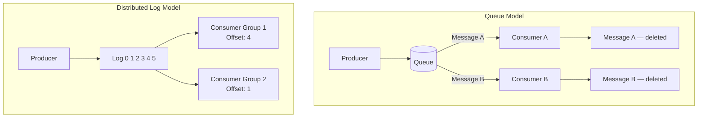

The distinction is not "which is better" but "which model fits your need." If the message is a transient command consumed once, a queue is simpler and cheaper. If the event is a durable fact that multiple independent consumers need, now and in the future, and that you may need to replay, the log is the right tool. Notice how this echoes Chapter 2: durable facts want a log; transient work items want a queue.

<details>
<summary>💡 Expert Note</summary>

The binary framing of log versus queue, while pedagogically useful, understates how much the boundary has shifted. RabbitMQ 3.9 (2021) introduced Streams, a durable, append-only, replayable log abstraction built into the broker, with consumer offset tracking semantics nearly identical to Kafka. Teams evaluating RabbitMQ for new EDA workloads should assess Streams before dismissing it as a queue-only tool. The meaningful differentiators between Kafka and RabbitMQ Streams at this point are ecosystem maturity, Kafka's richer partition-level parallelism controls, and the managed-service landscape (MSK, Confluent Cloud), not the fundamental replay capability.
</details>

## Publish/Subscribe, Partitions, and Consumer Groups

Three mechanics make the log model work at scale, and senior engineers must understand all three precisely.

**Publish/subscribe** (pub/sub) means a producer publishes to a **topic** and any number of subscribers receive a copy. This is fan-out: one event, many independent readers. It contrasts with point-to-point queuing, where one message goes to one consumer. In cloud terms, Amazon SNS is a pub/sub fan-out service and SQS is a queue; the common SNS-to-SQS pattern deliberately combines both, using SNS to fan an event out to several SQS queues so each downstream service gets its own private copy to consume at its own pace.

**Partitions** are how a log scales horizontally and preserves order. A topic is split into partitions, and each event is routed to a partition by a **partition key**, typically an entity ID such as `orderId`. Kafka guarantees ordering only within a partition, never across partitions. This is the rule that catches teams off guard: if global ordering matters you are limited to one partition and therefore no parallelism, so you deliberately choose a key that keeps causally related events together while letting unrelated entities spread across partitions for throughput.

*Code example: Kafka producer keying events by `orderId` to enforce per-order partition affinity — all events for the same order land on the same partition; events for different orders distribute across partitions for throughput.*

```python
# Kafka producer keying events by orderId to enforce per-order partition affinity
# Requires: pip install confluent-kafka
from __future__ import annotations

import json
from dataclasses import dataclass, field
from typing import Any

from confluent_kafka import Producer
from confluent_kafka.error import KafkaError

BROKER = "localhost:9092"
TOPIC = "order-events"


@dataclass
class OrderEvent:
    order_id: str
    event_type: str       # e.g. "OrderPlaced", "OrderShipped"
    payload: dict[str, Any] = field(default_factory=dict)

    def to_json(self) -> bytes:
        return json.dumps(
            {"type": self.event_type, "orderId": self.order_id, "payload": self.payload}
        ).encode("utf-8")


def _delivery_report(err: KafkaError | None, msg: Any) -> None:
    """Callback invoked once the broker acknowledges (or rejects) each message."""
    if err:
        print(f"[FAILED] {err}")
    else:
        # partition() and offset() confirm exactly where the event was stored
        print(f"[OK] type={json.loads(msg.value())['type']} "
              f"partition={msg.partition()} offset={msg.offset()}")


def publish_order_event(producer: Producer, event: OrderEvent) -> None:
    """Publish one order event.

    The `key` argument is the partition key.  Kafka's default partitioner applies
    a consistent hash over the key bytes, so the same orderId always maps to the
    same partition — guaranteeing that OrderPlaced arrives before OrderShipped
    for every individual order, regardless of broker load or producer restarts.
    """
    producer.produce(
        topic=TOPIC,
        key=event.order_id,           # partition key — same orderId → same partition
        value=event.to_json(),
        callback=_delivery_report,
    )
    producer.poll(0)  # flush delivery callbacks without blocking the caller


def main() -> None:
    producer = Producer({"bootstrap.servers": BROKER})

    # Two events for order-42 → same partition; OrderPlaced is always before OrderShipped
    publish_order_event(producer, OrderEvent("order-42", "OrderPlaced",  {"customerId": "cust-7", "total": 149.99}))
    publish_order_event(producer, OrderEvent("order-42", "OrderShipped", {"trackingId": "TRK-001"}))

    # A concurrent event for order-99 → likely a different partition; no ordering constraint
    # relative to order-42, but full parallelism across partitions is preserved
    publish_order_event(producer, OrderEvent("order-99", "OrderPlaced", {"customerId": "cust-3", "total": 59.00}))

    producer.flush()  # block until all in-flight messages are acknowledged or fail


if __name__ == "__main__":
    main()
```

**Consumer groups** coordinate parallel consumption without duplication. Consumers sharing a group ID split the partitions among themselves; each partition is read by exactly one consumer in the group, giving you competing-consumers parallelism inside the log model. Meanwhile, a different group reading the same topic gets its own full copy of the stream. This is the elegant unification: within a group you get work distribution like a queue, across groups you get fan-out like pub/sub, all from the same durable log.

> 💡 **Expert Note:** The prose correctly states that ordering is guaranteed only within a partition and that the partition key should keep causally related events together. What is not said — and what routinely causes production incidents — is the hot-partition problem: if a small number of keys (a high-volume merchant ID, a viral product) accounts for a large share of events, those partitions receive disproportionate write pressure and lag accumulates on the consumers assigned to them while other partitions sit idle. The naive fix of switching to a composite key (e.g., `merchantId + orderId`) restores distribution but breaks the causal ordering guarantee across orders for that merchant. Teams must profile key cardinality before going live. When true hot-key situations are unavoidable, a common mitigation is key salting with a bounded random suffix (e.g., `orderId-0` through `orderId-N`) combined with a merge step, accepting that ordering is coordinated in the consumer rather than guaranteed by the broker.

> 💡 **Expert Note:** The prose explains consumer groups clearly but does not flag the rebalancing hazard. In Kafka's original eager rebalancing protocol, every time a consumer joins, leaves, or crashes, the entire group stops processing and reassigns all partitions — a stop-the-world pause that can range from seconds to tens of seconds depending on session timeouts and partition count. Under `at-least-once` delivery this window also produces duplicates, because in-flight records are re-delivered to newly assigned consumers. Kafka 2.4 introduced Incremental Cooperative Rebalancing (the `CooperativeStickyAssignor` assignment strategy), which transfers only the partitions that must move, leaving the rest actively consumed. This is not the default in many client versions, so production deployments should explicitly configure `partition.assignment.strategy=CooperativeStickyAssignor` and tune `session.timeout.ms` and `heartbeat.interval.ms` deliberately. Ignoring this is a common source of mystery lag spikes during routine deployments.

## Retention, Replay, and Reprocessing

The log's defining superpower is that events persist after consumption, and this is where the log earns its cost. **Retention** is the policy governing how long events are kept, by time (for example, seven days) or by size, or indefinitely via **log compaction**, which keeps the latest event per key forever. Retention is a first-class architectural decision, not a default to accept blindly, because it sets the boundary of what history you can reach.

**Replay** is reading historical events again by resetting a consumer's offset backward. **Reprocessing** is the application of replay: you deploy a new version of a projection, reset its consumer group to offset zero, and rebuild its entire state from history. This capability is what makes Event Sourcing and CQRS practical, and both depend on it in later chapters. With a queue, none of this exists; once a message is acknowledged it is gone, so a bug that corrupts a read model is unrecoverable from the messaging layer.

This single capability is the strongest argument for a log over a queue in fact-oriented systems, and the reason Kafka anchors so many event-driven platforms. But it is not free. Retention costs storage, replay can flood downstream systems if not throttled, and reprocessing demands that consumers be idempotent, because replayed events will be seen again. That idempotency requirement is not optional, and it is exactly the subject of Chapter 4.

With the mechanics established, the technology choice becomes a mapping exercise rather than a popularity contest.

*Diagram: Technology selection decision flowchart — from message semantics to the appropriate infrastructure archetype.*

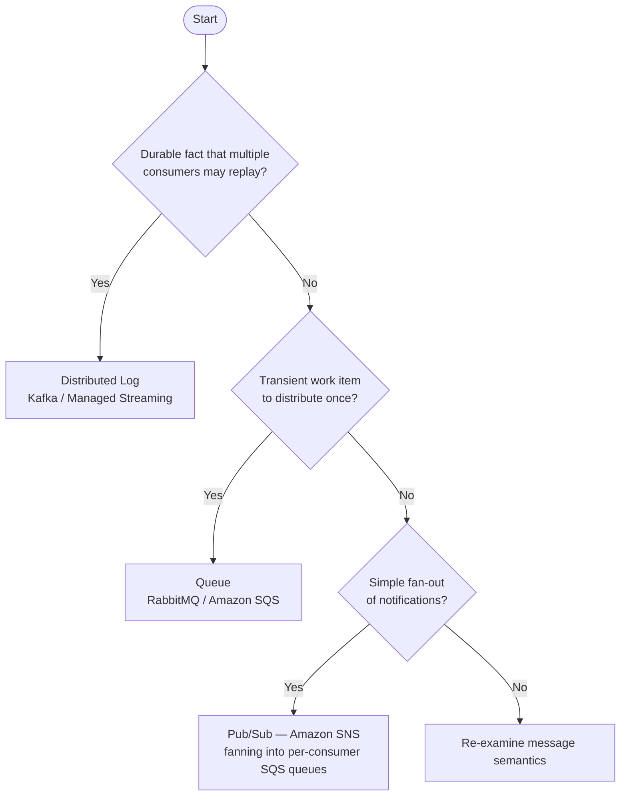

> 💡 **Expert Note:** Replay is the log's most powerful capability, but it introduces a failure mode the prose does not cover: schema evolution. Events written months or years ago carry older schema versions. When a consumer is reset to offset zero and processes that history, its current deserializer must be backward-compatible with every schema version it will encounter, not just the current one. Without a schema registry (Confluent Schema Registry or AWS Glue Schema Registry) enforcing a compatibility policy (typically BACKWARD or FULL), a reprocessing job will fail partway through history on the first breaking schema change — usually discovered in a high-pressure incident recovery window. The practical rule: treat schema registry enrollment and compatibility enforcement as a prerequisite to enabling replay in production, not an afterthought.

<details>
<summary>💡 Expert Note</summary>

The prose accurately defines log compaction as keeping the latest event per key forever, which is correct. The nuance worth adding is that log-compacted topics are incompatible with full event sourcing. Event sourcing requires every event for an entity, not just the latest value; compaction discards intermediate events, which means you can derive current state but cannot reconstruct the audit trail or time-travel queries. Log compaction is appropriate for changelog topics (CDC, KTable materialization) and not for event-sourced aggregates, where infinite retention or external event store archival (DynamoDB, EventStoreDB) is the correct strategy. Teams that enable compaction on an event-sourced topic discover the data loss only when they attempt a full replay.
</details>

> ⚠️ **Critical Note:** The prose states that log compaction "keeps the latest event per key forever" and presents it as a retention option alongside time-based or size-based policies — but this conflates two incompatible goals. Log compaction is a compaction strategy that actively deletes all intermediate events for a given key, retaining only the most recent value. A team that enables compaction on a topic and later attempts full replay to rebuild a projection will silently receive a truncated history: every intermediate state transition for each entity is gone. The phrase "keeps the latest event per key forever" is technically accurate for the surviving record, but it implies durability of history rather than destruction of it. For a chapter whose entire argument for choosing a log over a queue rests on replay and reprocessing, recommending compaction without a hard warning about what it erases directly undermines the chapter's core thesis. **Suggested fix:** Add an explicit callout that log compaction is incompatible with event-history replay. Reserve it for changelog use cases (maintaining current state per key, as in Kafka Streams materialized views or KTables), and flag that event-sourced systems should use time-based or size-based retention with infinite or very long windows, never compaction on fact-carrying topics.

<details>
<summary>⚠️ Critical Note</summary>

The prose correctly states that reprocessing "demands that consumers be idempotent, because replayed events will be seen again" — but idempotency in the consumer's own data writes is only one layer of the problem. Any consumer that triggers external side effects during processing (sending an email, calling a payment gateway, invoking a webhook, publishing a notification to an external system) will re-execute those side effects on replay unless they are independently deduped at the external boundary. This failure mode is extremely common and causes real production incidents: replaying six months of `OrderPlaced` events re-sends confirmation emails to customers and re-charges payment methods. The prose defers all idempotency detail to Chapter 4, but senior engineers reading this chapter need at least a one-sentence warning that external side effects are a separate, harder problem than idempotent storage writes.
</details>

<details>
<summary>⚠️ Critical Note</summary>

The chapter argues strongly for replay and reprocessing as the log's decisive advantage, but never addresses schema evolution — arguably the biggest operational risk in long-lived logs. If a topic retains events for two years, consumers performing full replay will encounter events serialized under schemas that predate multiple breaking changes. Avro, Protobuf, and JSON Schema all have compatibility rules, but enforcing them, maintaining a schema registry, and writing consumer deserializers that handle both old and new shapes is non-trivial. A team that deploys a new consumer, resets to offset zero, and hits a three-year-old event in a deprecated Avro schema will get a deserialization exception and a stalled consumer group. For an audience of senior architects, treating replay as straightforward while omitting schema evolution is a significant gap.
</details>

## Key Takeaways

- **Topology is a control-flow decision.** Broker topology decouples but scatters the process; mediator topology centralizes visibility at the cost of a coordination dependency. Choreography and orchestration are the behavioral models that map onto them.
- **Queue and log are fundamentally different tools.** A queue destroys messages on consumption and distributes work; a distributed log retains events and lets independent consumers read, rewind, and replay.
- **Partitions preserve order only within a partition.** Choose a partition key that keeps causally related events together; global ordering costs you parallelism.
- **Consumer groups unify queue and pub/sub semantics.** Within a group you get competing-consumers parallelism; across groups you get fan-out, all from one log.
- **Retention and replay are the log's decisive advantage** and the foundation for Event Sourcing and CQRS, but they demand idempotent consumers and deliberate retention policy.

## What's Next

Replay guarantees that consumers will see the same event more than once, so Chapter 4 confronts delivery guarantees head-on and shows how to build idempotent consumers under at-least-once delivery.

<!-- ASSEMBLY COMPLETE
  Chapter: Topologies and Messaging Infrastructure
  Code blocks resolved: 1 / 1
  Diagrams resolved: 3 / 3
  Expert callouts (inline): 3
  Expert callouts (collapsed): 4
  Critical callouts (inline): 1
  Critical callouts (collapsed): 4
  Unresolved markers: 0
-->


# Chapter 4: Delivery Guarantees and Idempotency

## Opening Problem Statement

Chapter 3 ended with a promise and a warning. The distributed log lets you replay history — reprocess millions of past events to rebuild a read model or fix a bug. But replay only works if reprocessing the same event twice produces the same result as processing it once. That property is called **idempotency**, and without it, replay corrupts data instead of repairing it.

This is not an edge case. Under the most common delivery guarantee in production systems, **every consumer will eventually receive a duplicate**. A network timeout, a broker retry, a consumer crash after processing but before acknowledging — any of these produces a message the consumer has already seen. If your handler charges a credit card, sends an email, or decrements inventory, a duplicate is a real financial or reputational loss.

Senior engineers frequently reach for a comforting escape hatch: "exactly-once delivery." They assume a broker feature or a cloud service flag makes the problem disappear. It does not. This chapter demystifies the three delivery semantics, explains precisely why exactly-once is the most misunderstood term in distributed systems, and gives you the concrete patterns — deduplication keys, the Transactional Outbox, dead-letter queues — that make correctness achievable. The goal is that duplicates stop being a threat and become a non-event.

## At-Most-Once, At-Least-Once, and Exactly-Once Semantics

A **delivery guarantee** describes what the messaging system promises about how many times a consumer observes each message. There are three levels, and the difference between them comes down to *when* the consumer acknowledges receipt.

An **acknowledgment** (ack) is the signal a consumer sends back to the broker to say "I am done with this message; you may stop tracking it." The ordering of *process* and *ack* determines the guarantee.

- **At-most-once**: ack first, then process. If the consumer crashes after acking but before finishing, the message is lost. Zero or one delivery. Fast, lossy, acceptable only for disposable data like metrics samples or non-critical telemetry.
- **At-least-once**: process first, then ack. If the consumer crashes after processing but before acking, the broker redelivers. One or more deliveries. Never loses a message, but guarantees duplicates. This is the default in Kafka, SQS, and RabbitMQ.
- **Exactly-once**: the holy grail — one delivery, no loss, no duplication.

**Figure 4.1 — At-Most-Once vs At-Least-Once: crash scenarios**

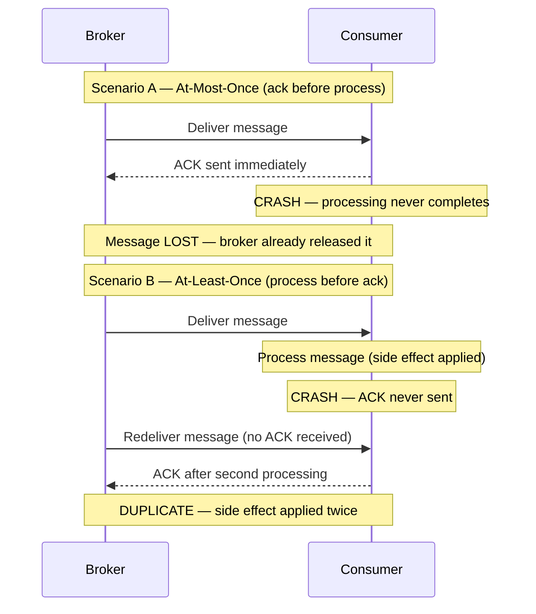

The table below is the mental model to keep.

**Listing 4.1 — Delivery-semantics reference table as typed dataclasses**

```python
# Delivery-semantics reference table as typed dataclasses
from dataclasses import dataclass
from typing import Literal

@dataclass(frozen=True)
class DeliverySemantics:
    name: str
    ack_ordering: str            # when the ack is sent relative to processing
    on_crash: str                # what happens if the consumer crashes mid-flight
    duplicates_possible: bool
    message_loss_possible: bool
    typical_use_case: str

DELIVERY_SEMANTICS: list[DeliverySemantics] = [
    DeliverySemantics(
        name="at-most-once",
        ack_ordering="ack BEFORE process",
        on_crash="message is lost — broker already removed it",
        duplicates_possible=False,
        message_loss_possible=True,
        typical_use_case="metrics samples, non-critical telemetry",
    ),
    DeliverySemantics(
        name="at-least-once",
        ack_ordering="ack AFTER process",
        on_crash="broker redelivers — consumer sees it again",
        duplicates_possible=True,
        message_loss_possible=False,
        typical_use_case="default in Kafka, SQS, RabbitMQ; requires idempotent consumers",
    ),
    DeliverySemantics(
        name="exactly-once (processing)",
        ack_ordering="atomic commit covering both effect and ack",
        on_crash="transaction rolls back; redelivered message is a no-op",
        duplicates_possible=False,   # at the effect level, not at the wire level
        message_loss_possible=False,
        typical_use_case="Kafka Streams read-process-write within Kafka topology only",
    ),
]

# Quick display helper — useful in notebooks or during architecture reviews
if __name__ == "__main__":
    header = f"{'Semantic':<22} {'Ack order':<22} {'Dups?':<7} {'Loss?':<7} {'Use case'}"
    print(header)
    print("-" * len(header))
    for s in DELIVERY_SEMANTICS:
        print(
            f"{s.name:<22} {s.ack_ordering:<22} "
            f"{'yes' if s.duplicates_possible else 'no':<7} "
            f"{'yes' if s.message_loss_possible else 'no':<7} "
            f"{s.typical_use_case}"
        )
```

Now for the misunderstanding. **True exactly-once delivery over a network is impossible.** This follows from the Two Generals Problem: two parties communicating over an unreliable channel can never both be certain the other received the final message. A sender that gets no ack cannot distinguish "message lost" from "ack lost," so it must either resend (risking a duplicate) or give up (risking loss). No protocol escapes this.

What vendors sell as "exactly-once" is really **exactly-once *processing***, not delivery. The message may be *delivered* many times, but the system produces the *effect* only once. Kafka's exactly-once semantics work this way: they combine at-least-once delivery with idempotent producers and transactional writes that are scoped **within Kafka** — a read-process-write loop whose output is another Kafka topic. The moment your side effect leaves that boundary — a database, a payment gateway, an email — Kafka's transaction cannot cover it. You are back to at-least-once, and correctness becomes *your* responsibility.

The opinionated takeaway: **design every consumer for at-least-once.** Treat exactly-once as a marketing term for a narrow, broker-internal optimization. If your architecture depends on messages never duplicating, it is already broken.

> ⚠️ **Critical Note:** The prose states that at-least-once is "the default in Kafka, SQS, and RabbitMQ." For Kafka this is inaccurate. Kafka's actual out-of-the-box default is `enable.auto.commit=true` with a 5-second auto-commit interval. Under this configuration, if the periodic auto-commit timer fires while a batch is being processed and the consumer subsequently crashes, those in-flight messages will not be redelivered — that is at-most-once behavior, not at-least-once. Achieving true at-least-once in Kafka requires explicit configuration: `enable.auto.commit=false` with a manual commit issued only after the processing of each batch has completed. A senior engineer reading this chapter could conclude that Kafka protects them against message loss by default and skip the necessary commit configuration in production systems. Qualify the Kafka claim: "At-least-once is the effective default in SQS and RabbitMQ, and is achievable in Kafka when manual commit (`enable.auto.commit=false`) is configured. Kafka's out-of-the-box auto-commit can produce at-most-once behavior under crash scenarios and should not be relied upon for loss-free delivery without explicit configuration."

> 💡 **Expert Note:** The prose correctly frames Kafka's exactly-once semantics (EOS) as broker-internal, but understates two production-critical constraints that architects routinely discover too late. First, enabling EOS requires `enable.idempotence=true` plus transactional producers (`transactional.id`) and carries a measurable throughput cost — Confluent benchmarks consistently show 5–15% reduction in write throughput at high load, because each batch requires a two-phase protocol with the broker's transaction coordinator. Second, Kafka EOS is invalidated the moment an external side effect is introduced — but the invalidation is silent. There is no exception, no warning, and no transaction rollback of the external system. Teams that enable EOS on their Kafka clients and then call an HTTP endpoint inside the same handler believe they are protected; they are not. The correct mental model is: EOS = atomic Kafka-offset-commit + atomic Kafka-topic-write, nothing more.

## Consumer Idempotency and Deduplication Keys

An operation is **idempotent** when applying it multiple times yields the same result as applying it once. Setting a value (`status = SHIPPED`) is naturally idempotent. Incrementing a value (`balance = balance - 10`) is not — run it twice and you have double-charged.

Since duplicates are guaranteed, the consumer must detect and discard them. The tool is a **deduplication key**: a stable, unique identifier carried by the event that lets the consumer recognize a message it has already handled. The producer must generate this key once and attach it to the event; never derive it from arrival time or a random value at the consumer.

Two patterns dominate.

**1. The idempotency check (dedup store).** Before processing, the consumer checks whether the key already exists in a store of processed IDs. If present, it acks and skips. If absent, it processes and records the key. This works for side effects that cannot be made naturally idempotent, such as calling an external payment API.

**Listing 4.2 — Idempotent consumer: dedup store + side effect in a single atomic transaction**

```python
# Idempotent consumer: dedup store + side effect in a single atomic transaction
import sqlite3
import uuid
from dataclasses import dataclass


@dataclass
class Message:
    event_id: str       # stable, producer-assigned deduplication key
    payload: dict


class DuplicateEventError(Exception):
    """Raised when the event has already been processed."""


def process_payment(conn: sqlite3.Connection, payload: dict) -> None:
    """Business side effect: record payment. Runs INSIDE the same transaction."""
    conn.execute(
        "INSERT INTO payments (payment_id, amount) VALUES (?, ?)",
        (payload["payment_id"], payload["amount"]),
    )


def handle_message(conn: sqlite3.Connection, message: Message) -> None:
    """
    Idempotent message handler.

    CRITICAL RACE WINDOW:
    If we record the dedup key BEFORE the side effect and crash, the
    redelivery is silently skipped — silent loss.
    If we record the key AFTER the side effect and crash in between,
    redelivery re-executes the side effect — duplicate.
    Solution: both writes share a SINGLE local transaction so they
    commit or roll back together.
    """
    try:
        # BEGIN TRANSACTION (implicit on first DML in sqlite3 connection)
        conn.execute(
            # UNIQUE constraint on event_id enforces exactly-once semantics
            "INSERT INTO processed_events (event_id) VALUES (?)",
            (message.event_id,),
        )
    except sqlite3.IntegrityError:
        # Unique-constraint violation → already processed; safe to ack and skip
        print(f"[SKIP] Duplicate event {message.event_id}")
        return

    # Side effect and dedup record commit atomically — the race window is closed
    process_payment(conn, message.payload)
    conn.commit()
    print(f"[OK]   Processed event {message.event_id}")


# --- Bootstrap schema (run once at startup) ---
def bootstrap(conn: sqlite3.Connection) -> None:
    conn.executescript("""
        CREATE TABLE IF NOT EXISTS processed_events (
            event_id TEXT PRIMARY KEY
        );
        CREATE TABLE IF NOT EXISTS payments (
            payment_id TEXT PRIMARY KEY,
            amount     REAL NOT NULL
        );
    """)


if __name__ == "__main__":
    conn = sqlite3.connect(":memory:")
    bootstrap(conn)

    msg = Message(
        event_id=str(uuid.uuid4()),
        payload={"payment_id": "pay-001", "amount": 49.99},
    )

    handle_message(conn, msg)   # → [OK]   Processed ...
    handle_message(conn, msg)   # → [SKIP] Duplicate ... (redelivery simulation)
```

There is a subtle race. If the consumer records the key *before* the side effect and then crashes, the redelivered message will be skipped and the side effect never happens — silent loss. If it records the key *after* the side effect and crashes in between, the redelivery reprocesses — a duplicate. The clean solution is to make the dedup record and the business write **atomic**, committed in the same local database transaction. We return to this idea with the Outbox.

**2. Natural idempotency via upsert.** When the side effect is a database write you control, model it so that reapplying it is harmless. An **upsert** keyed by the event's identifier — insert if new, overwrite if present — makes reprocessing safe by construction. This is why event-carried state transfer (Chapter 1) pairs so well with idempotent consumers: the event contains the full new state, and the consumer simply writes it.

Pro Tip: prefer natural idempotency over a dedup store whenever the domain allows it. A dedup store adds a lookup, a write, and a retention policy — you must eventually expire old keys or the table grows without bound. An upsert carries none of that operational weight.

> 💡 **Expert Note:** The prose correctly warns that dedup key retention cannot grow without bound, but does not provide the formula for the minimum safe retention window — which is where teams silently introduce data loss. The minimum retention must be: `max_redelivery_window = message_visibility_timeout x max_receive_count`. For SQS with a 12-hour visibility timeout and a max receive count of 10, that is 120 hours minimum. In Kafka, the equivalent is the `retention.ms` of the retry topic multiplied by the maximum consumer restart lag. Teams commonly set a flat 24-hour TTL by intuition. If a Kafka broker lag event holds a message in a retry topic for 36 hours before it is redelivered, the dedup store entry has already expired and the handler reprocesses it as new — a silent, intermittent duplicate with no stack trace.

<details>
<summary>💡 Expert Note</summary>
The dedup store is a stateful dependency and must be designed to the same availability and consistency tier as the primary business database. In practice, teams commonly reach for a shared Redis instance because it is fast, then deploy it without persistence (`appendonly no`) or with a single node. When Redis becomes unavailable — a rolling restart during patching, a sentinel failover — the consumer falls back to processing every message as if it were new. The dedup store silently stops protecting. The minimum production posture is Redis with AOF persistence enabled and a replicated Sentinel or Cluster setup. If the dedup check and the business write are unified in the same relational transaction (as the prose recommends), this concern disappears — which is the strongest argument for the unified-transaction approach over a separate cache.
</details>

<details>
<summary>⚠️ Critical Note</summary>
The prose introduces the dedup store as the pattern for "side effects that cannot be made naturally idempotent, such as calling an external payment API," and then proposes fixing the race condition by making "the dedup record and the business write atomic, committed in the same local database transaction." These two statements are in direct contradiction. A local database transaction covers only local database writes. An external payment API call — the stated motivating example — cannot participate in that transaction. If the consumer writes the dedup key to the local DB, commits, then crashes before calling the payment API, the dedup check will prevent the call from ever being retried. If it calls the payment API first and then crashes before writing the dedup key, the call is duplicated. The atomic-transaction fix is valid only when the side effect is itself a local database write; it does not solve the problem for external service calls. Split the discussion: (1) When the side effect is a local DB write, use an atomic transaction covering both the business write and the dedup key. (2) When the side effect is an external call, acknowledge that no local transaction can help — the only sound strategies are to make the external API itself idempotent (passing the event ID as an idempotency key, a capability offered by Stripe, Braintree, and others), or to accept the rare duplicate and build compensating logic downstream.
</details>

## Message Ordering and Partitioning

Idempotency handles *duplicates*. It does not handle *out-of-order* arrival, and the two are easy to conflate. Recall from Chapter 3 that a distributed log guarantees order **only within a partition**, selected by the **partition key**. Across partitions, all bets are off.

This matters because many business operations are order-sensitive. Consider three events for one account: `AccountOpened`, `Deposited`, `Withdrawn`. Process the withdrawal before the deposit and you may reject a valid transaction. The fix is to route all events for a given entity to the same partition by using a stable partition key — here, the account ID. Same key, same partition, guaranteed order.

**Figure 4.2 — Partitioning by accountId: per-account order with parallel consumer group**

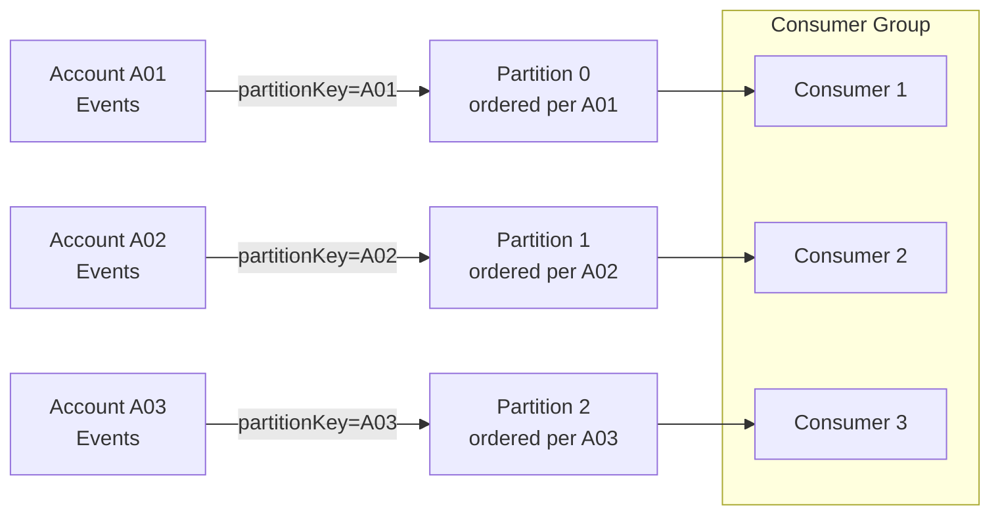

But ordering has a cost, and it is the tension every architect must weigh:

- A **narrow** partition key (few distinct values) preserves order across large groups of events but concentrates load on few partitions, capping parallelism.
- A **wide** partition key (many distinct values, like a per-entity ID) spreads load and maximizes throughput but only guarantees order within each tiny group.

There is no ordering *across* keys. Pick the key at the granularity where order actually matters to the business — usually the aggregate (the account, the order, the shipment), not the whole system.

A defensive complement is **version-aware idempotency**. Stamp each event with a monotonically increasing version per entity. The consumer stores the last version it applied and rejects any event whose version is less than or equal to what it has already seen. This makes the consumer robust to both duplicates *and* stale out-of-order redeliveries in one mechanism.

**Listing 4.3 — Version-aware consumer: rejects duplicates and stale out-of-order redeliveries**

```python
# Version-aware consumer: rejects duplicates AND stale out-of-order redeliveries
# Time complexity: O(1) per message (single indexed lookup by entity_id)
import sqlite3
from dataclasses import dataclass


@dataclass
class VersionedEvent:
    event_id: str
    entity_id: str   # e.g. account_id — determines partition key
    version: int     # monotonically increasing per entity; producer assigns this
    payload: dict


class StaleEventError(Exception):
    """Raised when the incoming version is not strictly greater than stored."""


def apply_event(conn: sqlite3.Connection, event: VersionedEvent) -> None:
    """Business state update — called only when the version advances."""
    conn.execute(
        """
        INSERT INTO account_state (entity_id, balance, last_version)
        VALUES (:entity_id, :balance, :version)
        ON CONFLICT (entity_id) DO UPDATE
          SET balance      = :balance,
              last_version = :version
        """,
        {
            "entity_id": event.entity_id,
            "balance": event.payload.get("balance"),
            "version": event.version,
        },
    )


def handle_versioned_event(conn: sqlite3.Connection, event: VersionedEvent) -> None:
    """
    Version gate: apply the event only if its version strictly exceeds
    the last stored version for this entity.
    Handles duplicates (same version re-delivered) and
    stale redeliveries (older version arriving after a newer one).
    """
    row = conn.execute(
        "SELECT last_version FROM account_state WHERE entity_id = ?",
        (event.entity_id,),
    ).fetchone()

    stored_version: int = row[0] if row else -1  # -1 → entity never seen before

    if event.version <= stored_version:
        # Duplicate or stale out-of-order redelivery — safe to discard
        print(
            f"[DISCARD] entity={event.entity_id} "
            f"incoming_v={event.version} stored_v={stored_version}"
        )
        return

    apply_event(conn, event)
    conn.commit()
    print(
        f"[APPLIED] entity={event.entity_id} "
        f"v{stored_version} -> v{event.version}"
    )


# --- Bootstrap ---
def bootstrap(conn: sqlite3.Connection) -> None:
    conn.execute("""
        CREATE TABLE IF NOT EXISTS account_state (
            entity_id    TEXT PRIMARY KEY,
            balance      REAL NOT NULL DEFAULT 0,
            last_version INTEGER NOT NULL DEFAULT -1
        )
    """)


if __name__ == "__main__":
    conn = sqlite3.connect(":memory:")
    bootstrap(conn)

    events = [
        VersionedEvent("e1", "acct-42", version=1, payload={"balance": 100.0}),
        VersionedEvent("e2", "acct-42", version=2, payload={"balance": 90.0}),
        VersionedEvent("e2", "acct-42", version=2, payload={"balance": 90.0}),  # duplicate
        VersionedEvent("e1", "acct-42", version=1, payload={"balance": 100.0}), # stale
        VersionedEvent("e3", "acct-42", version=3, payload={"balance": 150.0}),
    ]

    for ev in events:
        handle_versioned_event(conn, ev)
```

Opinionated guidance: do not attempt to impose global ordering across your whole event stream. It destroys the scalability that made you choose a log in the first place. Order per aggregate; tolerate disorder everywhere else.

<details>
<summary>💡 Expert Note</summary>
Version-aware idempotency using a monotonically increasing per-entity version number is sound when a single producer owns the entity lifecycle. It breaks down in common multi-producer patterns — for example, when multiple services can independently emit events for the same aggregate (an order updated by both the fulfillment service and the payments service). Coordinating a global sequence counter across producers creates coupling and a distributed coordination problem. The industry-standard solution is to push version enforcement to the database via optimistic locking: the consumer performs a `WHERE current_version = N - 1` conditional update and treats zero-rows-affected as a duplicate or stale event, retrying or discarding accordingly. This is how Axon Framework and EventStoreDB implement sequence enforcement at the aggregate boundary without requiring cross-producer coordination.
</details>

<details>
<summary>💡 Expert Note</summary>
The partition hotspot problem is understated in discussions of partition key selection, and it is acute in multi-tenant SaaS systems. If the partition key is the tenant ID and a single tenant accounts for 40% of traffic volume (a common enterprise contract pattern), that tenant's events concentrate on one or a few partitions. Consumer group parallelism is bounded by partition count, so hot partitions create a processing bottleneck that no amount of horizontal consumer scaling can resolve without a partition count increase — which requires a Kafka topic rebuild or a repartition stream. Design the partition key at the granularity where order matters (aggregate ID, not tenant ID), and use a separate fan-out mechanism if per-tenant isolation is a requirement.
</details>

<details>
<summary>⚠️ Critical Note</summary>
The version-aware idempotency mechanism (apply only if `incoming_version > stored_version`, otherwise discard) silently creates permanent event loss when a version gap occurs. If a consumer has applied version 3 and version 4 is never delivered (dropped, expired, sent to DLQ), then version 5 arrives: the check `5 > 3` passes and version 5 is applied, permanently skipping version 4's state transition. The system is now in an inconsistent state with no error signal. The prose presents the pattern as robustness against "duplicates and stale redeliveries" without noting that it implicitly assumes gapless delivery — an assumption that contradicts the at-least-once-with-DLQ reality described elsewhere in the same chapter. Add a guard against version gaps: "The version-check pattern requires a monotonically gapless sequence per entity to be safe. Complement it with a gap-detection step: if `incoming_version > stored_version + 1`, the consumer should park the message (e.g., a retry queue) or emit an alert rather than silently applying it. In practice, combine version checks with exactly-once sequence assignment at the producer — typically using an optimistic-lock counter in the aggregate's own row."
</details>

## The Transactional Outbox Pattern and the Dual-Write Problem

Everything so far protects the *consumer*. But the *producer* has its own failure mode, and it is one of the most common sources of silent data loss in event-driven systems: the **dual-write problem**.

A service usually needs to do two things when handling a command: update its own database and publish an event. These are two separate systems — a database and a broker — with no shared transaction. Four sequences are possible, and two of them are corrupt:

1. Write DB, publish event — both succeed. Correct.
2. Write DB, then crash before publishing — state changed, but no event. Consumers never learn. **Lost event.**
3. Publish event, then crash before writing DB — consumers act on a fact that never became true. **Phantom event.**
4. Neither happens. Correct (nothing changed).

You cannot make two independent systems commit atomically without a distributed transaction, and distributed transactions (two-phase commit) are exactly what we abandon in cloud-native architectures for their cost and fragility.

**Figure 4.3 — The dual-write failure gap: DB committed, broker publish never happens**

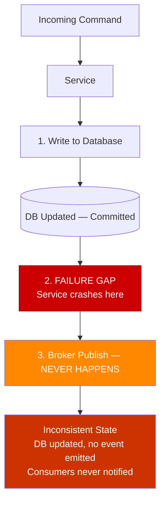

The **Transactional Outbox** pattern solves this elegantly. Instead of writing to the database *and* the broker, the service writes to the database *only*. In the **same local transaction** that updates the business tables, it also inserts the event into an **outbox table** in that same database. Because it is one transaction over one database, it is atomic: either both the state change and the outbox row commit, or neither does. The dual-write problem disappears.

A separate process then reads unpublished rows from the outbox and publishes them to the broker, marking each as sent. This process operates **at-least-once** — if it crashes after publishing but before marking a row, it republishes on restart. Which is exactly why consumers must be idempotent. The Outbox does not eliminate duplicates; it guarantees *no loss*, and pushes deduplication to the consumer, where we already built defenses for it.

**Listing 4.4 — Transactional Outbox: one atomic commit covers business record and outbox row**

```python
# Transactional Outbox: one atomic commit covers business record + outbox row
import json
import sqlite3
import uuid
from dataclasses import dataclass, field
from datetime import datetime, timezone


@dataclass
class Order:
    order_id: str
    customer_id: str
    total_amount: float
    status: str = "PLACED"


@dataclass
class OutboxRow:
    event_id: str = field(default_factory=lambda: str(uuid.uuid4()))
    aggregate_type: str = "Order"
    event_type: str = "OrderPlaced"
    payload: dict = field(default_factory=dict)
    created_at: str = field(
        default_factory=lambda: datetime.now(timezone.utc).isoformat()
    )
    published: bool = False


def place_order(conn: sqlite3.Connection, order: Order) -> OutboxRow:
    """
    ── COMMIT BOUNDARY ──────────────────────────────────────────────────
    Both the orders INSERT and the outbox INSERT execute in the SAME
    local transaction. Either both commit or both roll back — no dual-write
    problem, no phantom events, no lost events.
    ─────────────────────────────────────────────────────────────────────
    """
    outbox_row = OutboxRow(
        aggregate_type="Order",
        event_type="OrderPlaced",
        payload={
            "order_id": order.order_id,
            "customer_id": order.customer_id,
            "total_amount": order.total_amount,
            "status": order.status,
        },
    )

    # ── BEGIN implicit transaction ──
    conn.execute(
        "INSERT INTO orders (order_id, customer_id, total_amount, status) "
        "VALUES (?, ?, ?, ?)",
        (order.order_id, order.customer_id, order.total_amount, order.status),
    )
    conn.execute(
        "INSERT INTO outbox (event_id, aggregate_type, event_type, payload, created_at, published) "
        "VALUES (?, ?, ?, ?, ?, ?)",
        (
            outbox_row.event_id,
            outbox_row.aggregate_type,
            outbox_row.event_type,
            json.dumps(outbox_row.payload),   # serialized event carried to broker
            outbox_row.created_at,
            False,
        ),
    )
    conn.commit()  # ── COMMIT: both rows land together or neither does ──

    print(f"[COMMITTED] order={order.order_id}  outbox_event={outbox_row.event_id}")
    return outbox_row


def relay_unpublished(conn: sqlite3.Connection) -> None:
    """
    Outbox relay (runs in a separate process/thread).
    Operates at-least-once: if it crashes after publish but before marking
    the row as published, it will republish on next run — consumers must be
    idempotent (event_id is the deduplication key).
    """
    rows = conn.execute(
        "SELECT event_id, event_type, payload FROM outbox WHERE published = 0"
    ).fetchall()

    for event_id, event_type, payload in rows:
        # Simulate broker publish (replace with real broker SDK call)
        print(f"[RELAY -> BROKER] event_id={event_id} type={event_type}")
        conn.execute(
            "UPDATE outbox SET published = 1 WHERE event_id = ?", (event_id,)
        )
        conn.commit()


# --- Bootstrap ---
def bootstrap(conn: sqlite3.Connection) -> None:
    conn.executescript("""
        CREATE TABLE IF NOT EXISTS orders (
            order_id     TEXT PRIMARY KEY,
            customer_id  TEXT NOT NULL,
            total_amount REAL NOT NULL,
            status       TEXT NOT NULL
        );
        CREATE TABLE IF NOT EXISTS outbox (
            event_id       TEXT PRIMARY KEY,
            aggregate_type TEXT NOT NULL,
            event_type     TEXT NOT NULL,
            payload        TEXT NOT NULL,   -- JSON
            created_at     TEXT NOT NULL,
            published      INTEGER NOT NULL DEFAULT 0
        );
    """)


if __name__ == "__main__":
    conn = sqlite3.connect(":memory:")
    bootstrap(conn)

    order = Order(
        order_id=str(uuid.uuid4()),
        customer_id="cust-7",
        total_amount=129.90,
    )
    place_order(conn, order)
    relay_unpublished(conn)
```

Two mechanisms drive the outbox relay. **Polling** queries the table on an interval — simple, portable, but adds latency and database load. **Change Data Capture (CDC)** tails the database transaction log (via tools like Debezium) and streams new outbox rows to the broker in near-real time, with no polling overhead. CDC is the more scalable choice for high-volume systems; polling is perfectly adequate for most.

Pro Tip: the event ID written into the outbox row is the same deduplication key the consumer uses. Design the two together. The producer's Outbox and the consumer's dedup check are two halves of one end-to-end correctness contract.

> 💡 **Expert Note:** CDC via Debezium is the correct high-throughput choice, but it requires database-level permissions that corporate DBAs frequently restrict and that PaaS offerings (Amazon RDS, Azure Database for PostgreSQL Flexible Server) expose only under specific configurations. Specifically: MySQL binlog access requires the `REPLICATION SLAVE` and `REPLICATION CLIENT` grants, and `binlog_format=ROW` must be set at the server level. PostgreSQL logical replication requires the `REPLICATION` role and a replication slot, and RDS imposes a hard limit of 20 replication slots that counts against all consumers. Teams routinely discover this constraint during UAT or production cutover, not during design. The fallback to polling is always available, but the architectural decision should be made with full knowledge of the permission requirements in the target environment — not deferred to deployment day.

<details>
<summary>⚠️ Critical Note</summary>
The Transactional Outbox is presented as solving the dual-write problem, but introduces a new operationally significant dependency that is not acknowledged: the outbox relay process. Whether implemented as a polling loop or a Debezium CDC connector, this relay is a separate process that can fail, lag, or be unavailable. While the outbox table accumulates rows, downstream consumers receive no events — a scenario that is functionally equivalent to the "lost event" problem the pattern was meant to solve, except now it is a relay-process outage rather than a service crash causing the delay. For CDC specifically, Debezium connectors are sensitive to database schema changes (an `ALTER TABLE` on a captured table can halt the connector) and require their own high-availability deployment. The prose describes CDC as "the more scalable choice" without surfacing any of this operational burden. Add a paragraph on relay reliability: "The outbox relay is a required component of the pattern's correctness. Treat it with the same operational discipline as the service itself: deploy it with redundancy, monitor its lag (the age of the oldest unpublished outbox row), and alert when that lag exceeds your SLA. For CDC with Debezium, plan for schema-change procedures that pause and safely resume the connector, and store connector offsets in a durable store rather than in-memory."
</details>

<details>
<summary>⚠️ Critical Note</summary>
The Outbox pattern as described does not preserve ordering across concurrent transactions from multiple application instances. Consider two concurrent requests A and B: A begins its transaction first (inserts outbox row with `id=100`), B begins slightly later (inserts outbox row with `id=101`), but B commits first. The relay picks up row 101 and publishes B's event. A then commits, and row 100 is published second. Consumers relying on insertion-order delivery now observe B's event before A's — violating the ordering guarantee the chapter spent the previous section building. This gap exists for polling-based relays and for CDC-based relays alike (CDC reads committed transactions, not start-order). The prose is silent on this failure mode. Note the limitation explicitly: "The Outbox guarantees delivery without loss, not strict global ordering across concurrent requests. For use cases requiring strict ordering, enforce single-writer access per aggregate (e.g., serialize commands through a queue or a database advisory lock per entity ID), or accept that the Outbox provides per-entity ordering only when writes to the same entity are serialized upstream."
</details>

## Dead-Letter Queues and Retry Policies

Idempotency and the Outbox assume messages eventually succeed. Some never will. A malformed payload, a permanent schema mismatch, or a business rule that always rejects the message creates a **poison message** — one that fails no matter how many times it is retried. Under at-least-once, a naive broker redelivers it forever, blocking the partition or starving the consumer. This is a self-inflicted outage.

The containment tool is a **dead-letter queue (DLQ)**: a separate queue where messages are moved after exhausting their retry budget. The DLQ isolates the poison message so the healthy stream keeps flowing, and preserves the failed message for inspection and manual reprocessing rather than discarding it.

A sound **retry policy** distinguishes two failure classes:

- **Transient failures** — a timeout, a throttled dependency, a brief network blip. These deserve retries, ideally with **exponential backoff** (increasing delays: 1s, 2s, 4s, 8s) and **jitter** (randomization) to avoid a thundering herd of synchronized retries hammering a recovering service.
- **Permanent failures** — a validation error, an unparseable message. Retrying is pointless; route these to the DLQ immediately. Wasting a retry budget on a message that can never succeed only delays the inevitable.

**Listing 4.5 — Retry policy: exponential backoff with jitter for transient errors; immediate DLQ for permanent**

```python
# Retry policy: exponential backoff with jitter for transient errors; immediate DLQ for permanent
import random
import time
import logging
from dataclasses import dataclass
from typing import Callable

logger = logging.getLogger(__name__)


# ── Failure taxonomy ──────────────────────────────────────────────────────────

class TransientError(Exception):
    """Temporary failure — worth retrying (timeout, throttle, network blip)."""


class PermanentError(Exception):
    """Unrecoverable failure — retrying is pointless (bad schema, invalid payload)."""


# ── Retry policy configuration ────────────────────────────────────────────────

@dataclass
class RetryPolicy:
    max_attempts: int = 5          # total delivery attempts before dead-lettering
    base_delay_seconds: float = 1.0
    max_delay_seconds: float = 30.0
    jitter_factor: float = 0.3     # ±30 % randomization to spread retry waves


def _backoff_delay(attempt: int, policy: RetryPolicy) -> float:
    """Exponential backoff: base * 2^attempt, capped, then jittered."""
    delay = min(
        policy.base_delay_seconds * (2 ** attempt),
        policy.max_delay_seconds,
    )
    # Jitter: multiply by a random factor in [1 - jitter, 1 + jitter]
    jitter = 1.0 + policy.jitter_factor * (2 * random.random() - 1)
    return delay * jitter


def send_to_dlq(message: dict, reason: str) -> None:
    """Dead-letter the message — triggers an alert in production monitoring."""
    logger.error(
        "DLQ: message dead-lettered",
        extra={"event_id": message.get("event_id"), "reason": reason},
    )
    # Replace with real DLQ publish (SQS redrive, Kafka DLQ topic, etc.)


def process_with_retry(
    message: dict,
    handler: Callable[[dict], None],
    policy: RetryPolicy | None = None,
) -> None:
    """
    Drive a message handler through the retry policy.

    - PermanentError  → dead-letter immediately, no retries wasted
    - TransientError  → retry up to max_attempts with exponential backoff + jitter
    - Exceeded budget → dead-letter with the last exception as reason
    """
    if policy is None:
        policy = RetryPolicy()

    for attempt in range(policy.max_attempts):
        try:
            handler(message)
            return  # success — done
        except PermanentError as exc:
            # Retrying a permanent error is pointless; route to DLQ immediately
            send_to_dlq(message, reason=f"PermanentError: {exc}")
            return
        except TransientError as exc:
            if attempt + 1 == policy.max_attempts:
                # Retry budget exhausted — dead-letter
                send_to_dlq(message, reason=f"TransientError after {policy.max_attempts} attempts: {exc}")
                return
            delay = _backoff_delay(attempt, policy)
            logger.warning(
                "Transient failure, retrying",
                extra={"attempt": attempt + 1, "delay_s": round(delay, 2), "error": str(exc)},
            )
            time.sleep(delay)


# ── Example usage ─────────────────────────────────────────────────────────────

if __name__ == "__main__":
    logging.basicConfig(level=logging.INFO)

    call_count = 0

    def flaky_handler(msg: dict) -> None:
        """Simulates two transient failures then success."""
        global call_count
        call_count += 1
        if call_count < 3:
            raise TransientError("downstream timeout")
        print(f"[PROCESSED] event_id={msg['event_id']}")

    def bad_handler(msg: dict) -> None:
        raise PermanentError("schema validation failed: missing required field 'amount'")

    policy = RetryPolicy(max_attempts=5, base_delay_seconds=0.05)  # fast for demo

    process_with_retry({"event_id": "ev-001"}, flaky_handler, policy)
    process_with_retry({"event_id": "ev-002"}, bad_handler, policy)
```

Set a **maximum receive count** — the number of delivery attempts before the message is dead-lettered. In SQS this is a native redrive policy; in Kafka it is typically implemented with retry topics and a final DLQ topic. Choose the count deliberately: too low and transient blips lose messages to the DLQ; too high and a poison message churns for minutes before quarantine.

Critically, the DLQ is not a garbage can. A message landing there is an **operational signal** demanding an alert. Chapter 9 treats DLQ monitoring and safe reprocessing in depth; for now, the rule is simple: **an unwatched DLQ is a silent data loss buffer.** Every message that enters it represents a business fact your system failed to honor.

> ⚠️ **Critical Note:** The prose warns that a poison message "churns for minutes before quarantine," but in Kafka this is a severe understatement of the consequence. Kafka guarantees order within a partition; a consumer does not advance past a failing offset until that message is either successfully processed or manually skipped. A poison message with a generous retry budget (e.g., 10 attempts × exponential backoff reaching 512s) can block every subsequent message in an entire partition for hours, causing consumer-group lag to grow without bound for that partition. Unlike SQS or RabbitMQ, there is no native mechanism to park a single Kafka message mid-stream and continue consuming — the retry-topic pattern must be deliberately designed in. The prose describes this as a timing nuisance rather than a potential partition-wide outage, which could lead architects to underestimate the required safeguards. Add a Kafka-specific callout: "In a partition-ordered Kafka consumer, a poison message is uniquely dangerous — it halts forward progress on the entire partition until exhausted. The retry-topic pattern (a separate retry-1, retry-2, … DLQ topic chain) exists precisely to allow the main partition to advance. If your system uses Kafka with ordering guarantees, implement retry topics from the start, not as an afterthought."

> 💡 **Expert Note:** The prose correctly distinguishes transient from permanent failures, but omits a production-critical failure mode that sits between the two: the infrastructure-level redelivery that occurs before any application-level retry policy fires. In SQS, if the `VisibilityTimeout` is shorter than the processing time for a message, the broker makes the message visible again while the first consumer is still processing it — causing concurrent dual delivery to two different consumer instances. Neither instance sees an application-level error; both process successfully and both ack. The result is a duplicate that bypasses the dedup store if both reads happen before either write commits. The safe rule is: set `VisibilityTimeout` to at least 6x the P99 processing latency, and monitor the `ApproximateNumberOfMessagesNotVisible` CloudWatch metric to detect concurrent delivery events. In Kafka, the analogous failure is a session timeout causing partition rebalance mid-processing, which re-delivers from the last committed offset.

## Key Takeaways

- **At-least-once is the realistic default.** True exactly-once *delivery* is impossible over a network (Two Generals); what vendors sell is exactly-once *processing*, scoped inside the broker and void the moment a side effect touches an external system.
- **Duplicates are guaranteed, so consumers must be idempotent.** Use natural idempotency (upserts keyed by event ID) where the domain allows, and a deduplication-key store where side effects are external.
- **Order is a partition-scoped guarantee.** Route order-sensitive events for one aggregate to one partition via a stable partition key, and use per-entity version numbers to reject stale or duplicate deliveries.
- **The Transactional Outbox defeats the dual-write problem** by committing the state change and the event atomically to one database, then relaying to the broker at-least-once — which is why the consumer's idempotency is non-negotiable.
- **Dead-letter queues contain poison messages.** Retry transient failures with exponential backoff and jitter; dead-letter permanent failures immediately; and alert on every DLQ arrival.

## What's Next

With reliable delivery and idempotent processing established, Chapter 5 turns to structure — introducing CQRS to separate the write path from the read path and resolve the shape mismatch between how data is stored and how it is queried.

<!-- ASSEMBLY COMPLETE
  Chapter: Delivery Guarantees and Idempotency
  Code blocks resolved: 5 / 5
  Diagrams resolved: 3 / 3
  Expert callouts (inline): 4
  Expert callouts (collapsed): 3
  Critical callouts (inline): 2
  Critical callouts (collapsed): 4
  Unresolved markers: 0
-->


# Chapter 5: CQRS — Separating Reads and Writes

## Opening Problem Statement

Chapter 4 left the write path in good shape. Events flow at-least-once, consumers are idempotent, and the Transactional Outbox publishes reliably. But a nagging question remains: once those events have reshaped your system's state, how does anyone *read* that state efficiently? A single table optimized to enforce invariants on write is almost never the same table you want to query for a dashboard, a search screen, or a mobile feed. This is the tension **Command Query Responsibility Segregation (CQRS)** was built to resolve.

CQRS is one of the most misunderstood patterns in the event-driven toolkit. Some teams treat it as a mandatory companion to Event Sourcing. Others deploy it reflexively on every microservice and drown in accidental complexity. Neither reflex is correct. CQRS is a targeted answer to a specific structural problem — the mismatch between the shape of data you write and the shape you read. This chapter defines that problem precisely, shows how to separate the two paths, teaches you to build read models from events, confronts the consistency cost honestly, and — most importantly for a senior audience — draws a hard line around when CQRS is simply over-engineering.

## The Shape-Mismatch Problem

Every persistent system serves two fundamentally different jobs. On one side, it accepts changes and must protect business rules — an account cannot be overdrawn, an order cannot ship twice. On the other side, it answers questions — show me this customer's order history, rank products by revenue, list unpaid invoices. These two jobs pull the data model in opposite directions.

The write side wants **normalization**. Normalized tables prevent anomalies, enforce referential integrity, and keep invariants local to one aggregate. The read side wants **denormalization**. A query screen wants everything it needs pre-joined, flattened, and indexed for the exact access pattern it serves. Forcing both jobs onto one schema means neither gets what it needs. This is the **shape-mismatch problem**: the optimal structure for validating a change differs from the optimal structure for answering a question.

Consider a corporate e-commerce order service. The write model is a tidy `Order` aggregate with line items, enforcing that totals reconcile and stock is reserved. Now the business asks for a screen showing, per customer, their last ten orders with product thumbnails, shipping status, and a running lifetime-value figure. Serving that from the normalized write schema means a multi-table join executed on every page load, competing for locks with the very transactions that place orders.

**Figure 5.1 — Write Model vs Read Model: the projection bridge**

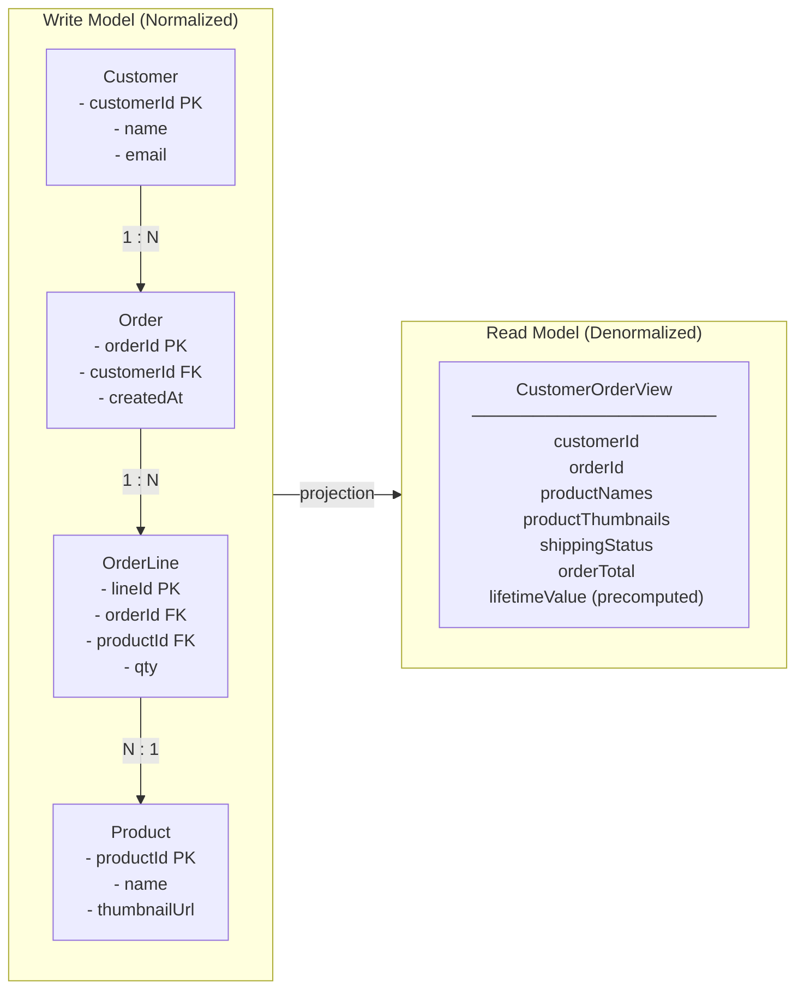

*The write model (left) keeps data normalized across four tables to enforce invariants and prevent anomalies; the read model (right) flattens those tables into a single document pre-optimized for the query screen. The "projection" arrow between them represents the event-driven process that continuously derives the read shape from write-side events — this is the structural core of CQRS.*

The naive fix is to keep bolting indexes and read replicas onto the single model. That buys time but not escape. Read-optimized indexes slow writes; heavy reporting queries contend with transactional load; and the schema calcifies because it must satisfy every consumer at once. CQRS proposes a cleaner cut: stop pretending one model can be both. Let the write side stay lean and rule-bound, and derive whatever read shapes you need as separate, purpose-built structures.

<details>
<summary>⚠️ Critical Note</summary>

"The naive fix is to keep bolting indexes and read replicas onto the single model. That buys time but not escape." This frames read replicas and materialized views as merely a stopgap, implying they are inadequate long-term solutions. For a significant class of real systems — moderate read/write ratios, bounded query diversity, predictable access patterns — a well-maintained read replica with a materialized view is a fully adequate permanent solution, not a stepping stone to CQRS. The prose does not acknowledge this, potentially pushing architects toward unnecessary complexity when the boring solution would suffice. This is in tension with the chapter's own "When CQRS Is Over-Engineering" section, which argues exactly the opposite.

**Suggested fix:** Qualify the claim: "For systems with diverse, unpredictable, or divergent query shapes, indexes and read replicas buy time but not escape. For systems with a stable, bounded set of queries, a carefully maintained read replica with a materialized view is often the correct permanent answer and should be evaluated before adopting CQRS."
</details>

## Command and Query Separation

The name says it all. A **command** is an instruction to change state — `PlaceOrder`, `CancelReservation`, `ApplyDiscount`. A **query** is a request to return state without changing it — `GetOrderHistory`, `FindUnpaidInvoices`. CQRS insists that these two responsibilities live in **separate models**, and often in separate infrastructure entirely.

This is a deliberate generalization of the older **Command Query Separation (CQS)** principle, which merely said a single method should either change state or return it, never both. CQRS lifts that idea from the method level to the architectural level: one model handles the command path, a different model handles the query path.

The command path processes an intent, validates it against business rules, and — on success — mutates the authoritative state and emits a domain event. That path returns almost nothing to the caller; frequently just an acknowledgement or an identifier. The query path never touches the authoritative write store. It reads from one or more **read models** built specifically for the questions being asked.

> ⚠️ **Critical Note:** The prose states categorically that "the query path never touches the authoritative write store," yet Section "Consistency Between Write Side and Read Side" correctly advises to "keep the invariant-critical reads close to the write model." These two statements directly contradict each other. A senior architect reading Chapter 5 in sequence will internalize an absolute rule in the first section, then encounter a carve-out three sections later without acknowledgment that it reverses the earlier rule. This ambiguity can cause misapplication: teams may implement a strict "never read from the write store" policy and then be unable to serve the strongly-consistent reads their domain actually requires without a full rework. **Suggested fix:** Remove the word "never" from the query-path description in Command and Query Separation and qualify the statement: "In the general case the query path reads from purpose-built read models; Section X identifies the exception for strongly-consistent, invariant-critical queries that legitimately stay on the write store." This acknowledges the hybrid reality from the outset and removes the contradiction.

**Listing 5.1 — CQRS write path vs read path: two independent models with no shared store**

```python
# CQRS write path vs read path — two independent models with no shared store
# O(1) write (single aggregate), O(1) read (indexed flat table)

from __future__ import annotations

from dataclasses import dataclass, field
from datetime import datetime, timezone
from typing import Protocol
from uuid import UUID, uuid4


# ---------------------------------------------------------------------------
# Shared value types (identifiers only — no business logic shared)
# ---------------------------------------------------------------------------

@dataclass(frozen=True)
class OrderId:
    value: UUID = field(default_factory=uuid4)


# ---------------------------------------------------------------------------
# COMMAND SIDE — intent, invariants, persistence, event emission
# ---------------------------------------------------------------------------

@dataclass(frozen=True)
class PlaceOrderCommand:
    customer_id: UUID
    items: list[dict]   # [{"product_id": UUID, "quantity": int, "unit_price": float}]


@dataclass(frozen=True)
class OrderPlacedEvent:
    order_id: UUID
    customer_id: UUID
    items: list[dict]
    total_amount: float
    placed_at: datetime
    event_id: UUID = field(default_factory=uuid4)  # used by projections for idempotency


class OrderCommandHandler:
    """Enforces write-side invariants; returns only OrderId — no read data leaks back."""

    def __init__(self, order_repo: OrderRepository, publisher: EventPublisher) -> None:
        self._repo = order_repo
        self._publisher = publisher

    def handle(self, cmd: PlaceOrderCommand) -> OrderId:
        if not cmd.items:
            raise ValueError("An order must contain at least one line item")

        total = sum(i["quantity"] * i["unit_price"] for i in cmd.items)
        if total <= 0:
            raise ValueError("Order total must be positive")

        order_id = OrderId()
        self._repo.save(order_id, cmd)   # persist write aggregate

        self._publisher.publish(OrderPlacedEvent(
            order_id=order_id.value,
            customer_id=cmd.customer_id,
            items=cmd.items,
            total_amount=total,
            placed_at=datetime.now(tz=timezone.utc),
        ))

        return order_id   # ← caller receives only the identifier


# ---------------------------------------------------------------------------
# QUERY SIDE — denormalized DTO, separate store, no write model contact
# ---------------------------------------------------------------------------

@dataclass
class CustomerOrderSummary:
    """Fully-denormalized view: prejoined, precomputed — shaped for the UI."""
    order_id: UUID
    customer_id: UUID
    status: str
    total_amount: float
    item_count: int
    placed_at: datetime
    shipped_at: datetime | None = None


class OrderQueryService:
    """Reads from the dedicated read store only — independent of write infrastructure."""

    def __init__(self, read_store: ReadStore) -> None:
        self._store = read_store

    def get_customer_orders(
        self, customer_id: UUID, *, limit: int = 10
    ) -> list[CustomerOrderSummary]:
        # Single flat query — no joins, no lock contention with write transactions
        rows = self._store.query(
            "SELECT * FROM customer_order_view "
            "WHERE customer_id = %s ORDER BY placed_at DESC LIMIT %s",
            (customer_id, limit),
        )
        return [CustomerOrderSummary(**row) for row in rows]


# ---------------------------------------------------------------------------
# Infrastructure protocols (injected; not shared between command and query)
# ---------------------------------------------------------------------------

class OrderRepository(Protocol):
    def save(self, order_id: OrderId, cmd: PlaceOrderCommand) -> None: ...

class EventPublisher(Protocol):
    def publish(self, event: OrderPlacedEvent) -> None: ...

class ReadStore(Protocol):
    def query(self, sql: str, params: tuple) -> list[dict]: ...
```

*The command handler owns the write path: it enforces invariants, persists the aggregate, and emits a domain event — returning only an `OrderId` to the caller. The query service owns the read path: it reads exclusively from a pre-projected, denormalized store and returns a fully-populated DTO, never touching the write model.*

Notice what this separation unlocks. The two sides can scale independently — read traffic in most corporate systems dwarfs write traffic by an order of magnitude, so you can add read replicas or query nodes without touching write capacity. They can use different storage engines: a relational store for transactional writes, a document store or search index for reads. And they can evolve on independent schedules, because a new query screen means adding a read model, not migrating the write schema.

The trade-off is equally clear. You now maintain two models and the machinery that keeps them aligned. That machinery is where events re-enter the story, and where the pattern earns or loses its keep.

<details>
<summary>💡 Expert Note</summary>

A common design conflict surfaces when UX teams assume the command path should return rich, post-mutation state — the updated order, the new account balance. The correct CQRS contract is stricter: the command handler returns synchronous **validation errors and failure codes** (the user must know immediately if their intent was rejected), but on success returns only an identifier or causal token — never the mutated read shape. Returning query-side data from the command path reintroduces the coupling CQRS was designed to sever and forces the command handler to query the read model or re-read the write store. Teams that blur this boundary end up with a "command-query hybrid" that inherits the complexity of both models without the scaling benefit of either.
</details>

<details>
<summary>⚠️ Critical Note</summary>

"The command path returns almost nothing to the caller; frequently just an acknowledgement or an identifier" is presented as an architectural fact rather than a contested design choice. Returning only an ID forces a mandatory second round-trip to retrieve the created or updated resource — a real latency and UX cost, especially over high-latency mobile or international connections. Many widely-deployed CQRS systems (including those built on Axon, MediatR, and similar frameworks) routinely return a result DTO from command handlers without violating CQRS semantics. The prose does not acknowledge this as a trade-off; it reads as a prescription.

**Suggested fix:** Reframe the statement as a common convention rather than a rule: "A common convention is to return only an identifier or acknowledgement from the command path; some teams return a lightweight result DTO to avoid an extra round-trip. Either is valid — the principle is that the command handler must not read from the query-side read model to compose its response."
</details>

## Read Models and Event-Driven Projections

How does data cross from the write side to the read side? Through events. Every time the command path commits a change, it emits a domain event — exactly the events Chapter 2 taught you to model and Chapter 4 taught you to deliver reliably. A **projection** is the component that consumes those events and updates a read model to reflect them.

Think of a projection as a small, dedicated consumer with one job: translate a stream of facts into a shape optimized for a specific query. When an `OrderPlaced` event arrives, the projection inserts or updates a row in the `CustomerOrderView`. When `OrderShipped` arrives, it flips the status field. The read model is never written to by hand; it is *derived*, entirely and repeatedly, from the event stream.

**Figure 5.2 — Command path fan-out to independent read-store projections**

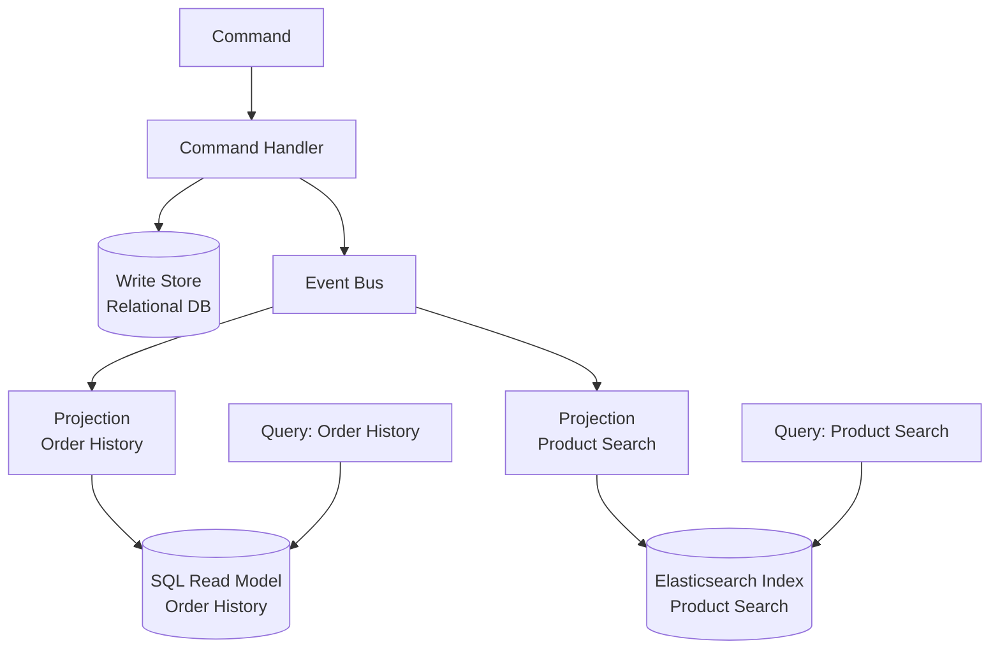

*This diagram shows how events produced by the command path fan out to purpose-built projections, each maintaining its own read store optimized for a specific query pattern. It illustrates why CQRS allows the read and write sides to use different storage engines and scale independently.*

This design has a property that senior architects should savor: read models are **disposable and rebuildable**. Because a projection is a pure function of the event stream, you can delete a read model and reconstruct it by replaying events from the beginning. Need a brand-new query shape for a feature shipping next quarter? Write a new projection, replay history through it, and you have a fully-populated read model without a risky data migration. This rebuildability is the strongest practical argument for pairing CQRS with the event log, and it foreshadows Event Sourcing in Chapter 6.

**Listing 5.2 — Idempotent event projection: upserts a denormalized read model from the event stream**

```python
# Idempotent event projection — upserts a denormalized read model from the event stream
# At-least-once delivery safe: duplicate events are detected and skipped

from __future__ import annotations

from dataclasses import dataclass
from datetime import datetime, timezone
from typing import Protocol
from uuid import UUID


# ---------------------------------------------------------------------------
# Domain events consumed by this projection
# (emitted by the command side — identical to what the write handler published)
# ---------------------------------------------------------------------------

@dataclass(frozen=True)
class OrderPlaced:
    event_id: UUID
    order_id: UUID
    customer_id: UUID
    items: list[dict]   # [{"product_id": UUID, "quantity": int, "unit_price": float}]
    total_amount: float
    placed_at: datetime

@dataclass(frozen=True)
class OrderShipped:
    event_id: UUID
    order_id: UUID
    shipped_at: datetime

@dataclass(frozen=True)
class OrderCancelled:
    event_id: UUID
    order_id: UUID
    cancelled_at: datetime


# ---------------------------------------------------------------------------
# Projection handler
# ---------------------------------------------------------------------------

class CustomerOrderViewProjection:
    """
    Maintains the customer_order_view read table.

    Idempotency strategy: each row stores `last_applied_event_id`.
    Before applying any event, the handler checks whether that event_id
    was already applied — duplicates are silently skipped (Chapter 4 pattern).
    """

    def __init__(self, view_store: ViewStore) -> None:
        self._store = view_store

    # ------------------------------------------------------------------
    # Event handlers (one per subscribed event type)
    # ------------------------------------------------------------------

    def on_order_placed(self, event: OrderPlaced) -> None:
        if self._already_applied(event.order_id, event.event_id):
            return   # at-least-once: safe to skip duplicate

        self._store.upsert(
            table="customer_order_view",
            key={"order_id": event.order_id},
            values={
                "customer_id": event.customer_id,
                "status": "placed",
                "total_amount": event.total_amount,
                "item_count": len(event.items),
                "placed_at": event.placed_at,
                "shipped_at": None,
                "last_applied_event_id": event.event_id,
            },
        )

    def on_order_shipped(self, event: OrderShipped) -> None:
        if self._already_applied(event.order_id, event.event_id):
            return

        self._store.upsert(
            table="customer_order_view",
            key={"order_id": event.order_id},
            values={
                "status": "shipped",
                "shipped_at": event.shipped_at,
                "last_applied_event_id": event.event_id,
            },
        )

    def on_order_cancelled(self, event: OrderCancelled) -> None:
        if self._already_applied(event.order_id, event.event_id):
            return

        self._store.upsert(
            table="customer_order_view",
            key={"order_id": event.order_id},
            values={
                "status": "cancelled",
                "last_applied_event_id": event.event_id,
            },
        )

    # ------------------------------------------------------------------
    # Internal helpers
    # ------------------------------------------------------------------

    def _already_applied(self, order_id: UUID, event_id: UUID) -> bool:
        """Return True if this exact event was already written to the view."""
        row = self._store.fetch_one(
            "SELECT last_applied_event_id FROM customer_order_view "
            "WHERE order_id = %s",
            (order_id,),
        )
        if row is None:
            return False
        return row["last_applied_event_id"] == event_id


# ---------------------------------------------------------------------------
# Infrastructure protocol (injected — decouples projection from DB driver)
# ---------------------------------------------------------------------------

class ViewStore(Protocol):
    def upsert(self, table: str, key: dict, values: dict) -> None:
        """INSERT … ON CONFLICT DO UPDATE or equivalent for the target engine."""
        ...

    def fetch_one(self, sql: str, params: tuple) -> dict | None: ...
```

*The projection is the bridge between the write side and the read side: it consumes domain events and applies deterministic upserts to the denormalized `customer_order_view`. Idempotency is enforced by tracking the `last_applied_event_id` per row, making repeated delivery of the same event a safe no-op.*

A word of discipline: projections must be **idempotent**, for exactly the reasons Chapter 4 established. Delivery is at-least-once, so the same `OrderShipped` event may arrive twice. A projection that blindly increments a counter will drift. Use upserts keyed by the aggregate identifier, or track the last-applied event version per view, and duplicates become harmless. Treat the read model as a deterministic replay target, never as a place to accumulate side effects.

> 💡 **Expert Note:** The prose correctly presents read-model rebuildability as a practical advantage, but omits the operational cost that surprises every team the first time they exercise it in production. Replaying millions of events through a projection is not instantaneous — a mature event log can contain hundreds of millions of events, and a naive single-threaded replay can take hours or days. Production-grade systems handle this with snapshot checkpoints (periodic materialized snapshots of the projection state at a given event position), partitioned parallel replay across event-stream segments, and a "shadow projection" strategy: the new projection is built on the side while the old one continues serving traffic, and traffic is cut over only when the shadow reaches the live position. Teams that treat "just replay from the beginning" as a cost-free escape hatch discover the hard way that it is a maintenance operation requiring planning, capacity, and a tested runbook.

<details>
<summary>💡 Expert Note</summary>

Projection versioning is the quietly dangerous part of long-running CQRS systems. When a projection's logic changes — a new computed field, a renamed column, a changed aggregation — the read model built under the old logic is invalidated. The industry pattern is to version projections explicitly (e.g., `CustomerOrderView_v1`, `CustomerOrderView_v2`), run both simultaneously until the new version fully catches up, then atomically swap the query service's read target and decommission the old version. Frameworks such as Axon Framework and EventStoreDB provide projection versioning primitives; rolling your own requires a projection registry and a controlled replay harness. Teams that skip this discipline end up with silent data drift as they patch projections in place without rebuilding — a read model that no longer faithfully represents the event stream.
</details>

<details>
<summary>💡 Expert Note</summary>

Projection idempotency keys deserve more precision than "event ID or per-view version." In broker-based systems (Kafka, Kinesis), the temptation is to use the broker's partition offset as the idempotency key. This is fragile: offsets can be reassigned after topic compaction, partition rebalancing, or topic recreation during disaster recovery. The robust choice is the **domain event's own UUID or aggregate version**, which is stable across infrastructure changes. Concretely, the projection table should carry a `last_applied_event_id` column; an upsert is only executed when the incoming event ID differs. This makes the projection resilient to broker infrastructure events that the team controls separately from domain semantics.
</details>

<details>
<summary>⚠️ Critical Note</summary>

The prose says "Write a new projection, replay history through it, and you have a fully-populated read model without a risky data migration." This is true only when the event history is short, the event schemas have been kept stable, and projections do not depend on external state. In production systems: (1) events published years ago may carry different field names, missing fields, or obsolete semantics — requiring versioned upcasters before replay is correct; (2) replaying billions of events takes hours to days, which may be operationally unacceptable; (3) projections that call external services (pricing APIs, enrichment services) at projection time cannot be faithfully reconstructed because that external state may have changed or been decommissioned. Presenting rebuildability as an unqualified strength misleads the target audience about real operational costs.

**Suggested fix:** Add a paragraph after the "disposable and rebuildable" claim that scopes the guarantee: rebuildability holds when events carry self-contained, version-stable payloads and projections are pure functions of the event stream. Flag event schema evolution (and the need for upcasters), replay throughput limits at scale, and the anti-pattern of projections with external side effects as conditions that undermine the guarantee.
</details>

## Consistency Between Write Side and Read Side

Here is the fact that decides whether CQRS fits: the read side is **eventually consistent** with the write side. A command commits and its event is published, but the projection processes that event a moment later — milliseconds usually, seconds under load, longer if a consumer is lagging or recovering. During that window, a query can return state that does not yet reflect the change the user just made. This is **replication lag**, and it is not a bug you can eliminate; it is the structural price of separating the models.

The classic symptom is **read-your-own-writes** violation. A user cancels an order, the screen refreshes, and the order still shows as active because the cancellation event hasn't been projected yet. Users experience this as the system "losing" their action. You must design for it deliberately rather than hope it never happens.

The table below lays out the practical mitigations and their costs.

| Technique | How it works | Cost / caveat |
|---|---|---|
| Accept the lag | Show eventual state; add a subtle "processing…" hint in the UI | Simplest; only viable where staleness is tolerable |
| Optimistic UI update | Client renders the expected result locally after a command | UI can diverge from server truth on failure |
| Read-your-writes routing | Route a user's reads to the write model briefly after their command | Reintroduces write-side read load you tried to shed |
| Version / token check | Command returns a version; query waits until the read model reaches it | Adds latency and coordination complexity |

**Figure 5.3 — Eventual consistency window: stale read immediately after command commit**

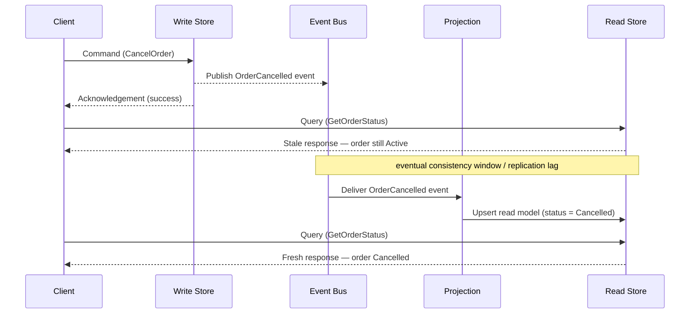

*This sequence diagram makes the eventual-consistency cost of CQRS visible: a query issued immediately after a successful command can return stale data because the projection has not yet processed the event. Understanding this window — and the business tolerance for it — is the key design decision when adopting CQRS.*

The governing question is one of **business tolerance**, not technology. Ask, for each query: how stale can this data be before it causes real harm? A product-catalog view can lag by seconds with zero consequence. An account-balance check that gates a withdrawal cannot — and that is a strong signal to keep that specific read on the strongly-consistent write model, even in an otherwise CQRS system. CQRS does not force *every* read onto the eventual-consistency path. Keep the invariant-critical reads close to the write model and reserve projections for the reporting, search, and display workloads that dominate volume but tolerate delay.

> 💡 **Expert Note:** The "version / token check" row in the consistency table understates how this pattern is implemented at scale. The correct production form is a **causal consistency token**: the command handler returns an opaque token encoding the event sequence position (e.g., a global offset in Kafka, a stream revision in EventStoreDB). The client passes that token on its next read; the query service blocks or retries internally until the projection's watermark has advanced past the token, then responds. This provides read-your-own-writes without ever touching the write model. AWS AppSync, Confluent's ksqlDB, and EventStoreDB all expose variants of this under names like "read-at-revision" or "after-position." The key production nuance is that the query service must expose a "not yet" response code (HTTP 202 Accepted or a structured retry-after payload) rather than silently returning stale data — otherwise the client cannot distinguish "the system caught up" from "the projection is lagging."

<details>
<summary>⚠️ Critical Note</summary>

The prose characterizes replication lag as "milliseconds usually, seconds under load" — framing it as a narrow, recoverable window. This omits the failure-mode scenario that shapes SLA design: a crashed projection consumer, a poison-pill event causing repeated reprocessing, or a Kafka consumer-group rebalance can stall a projection for minutes or hours, not seconds. For a senior audience designing production SLAs and alerting strategies, the failure-mode tail matters more than the happy-path average. Quoting only the happy-path latency invites under-engineering of monitoring, dead-letter handling, and consumer health alerting.

**Suggested fix:** Extend the lag characterization to include the failure tail: "milliseconds in the steady state, seconds under load — but a stalled or crash-looping projection consumer can pause updates for minutes to hours, making projection-lag monitoring and alerting a first-class operational concern, not an afterthought."
</details>

## When CQRS Is Over-Engineering

Now the opinionated part, and the reason this chapter exists. CQRS is a specialized tool, not a default architecture. Applied where it is not needed, it manufactures complexity that will haunt the team for years. A senior architect's job is to recognize the difference before writing the first line of code.

CQRS is **over-engineering** when your read and write models have essentially the same shape. If a straightforward CRUD entity — a customer profile, a configuration record, a reference table — is written and read through nearly identical structures, there is no shape mismatch to solve. Splitting it into two models and a projection adds a moving part, an eventual-consistency window, and an operational burden while solving no actual problem. A well-indexed table, perhaps with a read replica, is the correct and boring answer.

Watch for these warning signs that CQRS is the wrong call:

1. **The domain is simple CRUD.** Data is created, read, updated, and deleted with no rich behavior and no query shapes that diverge from the write shape.
2. **Read and write volumes are comparable and modest.** The independent-scaling benefit is the main payoff; with balanced, low traffic there is little to gain.
3. **The team has no operational maturity for asynchrony.** CQRS means monitoring projection lag, handling replays, and debugging eventual consistency. Without that muscle, you inherit a system you cannot reason about.
4. **Stakeholders cannot tolerate any staleness.** If every read must be immediately consistent, you are fighting the pattern's core mechanic and should not adopt it.

**Pro Tip:** Adopt CQRS at the *aggregate* or *bounded-context* level, never as a blanket rule for the whole system. Most real systems are hybrids — a few high-value contexts justify full CQRS with projections, while the majority stay comfortable CRUD. Applying the pattern selectively is the mark of judgment; applying it everywhere is the mark of dogma.

The honest heuristic: reach for CQRS when a genuine shape mismatch, a large read/write asymmetry, or a need for many divergent read models makes a single model painful — and only then. If you cannot name the specific pain, you do not yet have a reason to pay the price.

<details>
<summary>💡 Expert Note</summary>

In practice, the safest adoption path is incremental rather than upfront. A team that introduces CQRS from day one on an untested domain almost always over-applies it — the bounded contexts are speculative, the query shapes are unknown, and the projections that get built end up mirroring the write model anyway. The field-validated approach is to start with a shared model under a read replica, instrument query patterns, identify the two or three read shapes that genuinely diverge from the write model under real load, and extract only those into projections. This "migrate from pain" path is dramatically less risky than designing CQRS upfront, and it keeps most of the codebase in the simpler CRUD regime until real evidence justifies the cost.
</details>

<details>
<summary>💡 Expert Note</summary>

The prose's warning signs are solid, but one failure mode common in microservices-heavy corporate environments is missing: cross-stream projections. When domain aggregates are partitioned too finely — separate services for Order, OrderLine, and Fulfillment — projections for UI screens must join events from multiple streams. This is effectively a distributed join, and it introduces a secondary consistency hazard: the projection for a CustomerOrderView may receive OrderPlaced from stream A before the correlated FulfillmentScheduled from stream B, requiring buffering, timeout logic, and compensating logic for events that never arrive. At that point the projection is no longer a simple consumer but a stateful correlation engine. This is a strong signal that the bounded contexts were drawn incorrectly rather than that CQRS should be extended to handle the complexity.
</details>

## Key Takeaways

- The **shape-mismatch problem** is CQRS's reason to exist: the normalized model that enforces write-side invariants is rarely the denormalized shape that serves reads efficiently.
- CQRS separates the **command path** (changes state, emits events, returns little) from the **query path** (reads purpose-built read models, never touches the write store), letting each scale and evolve independently.
- **Projections** are idempotent event consumers that derive read models from the event stream, making read models disposable and rebuildable by replay.
- The read side is **eventually consistent**; replication lag and read-your-own-writes are structural costs to be designed for, not bugs to be fixed. Match each read to its business tolerance for staleness.
- CQRS is **over-engineering** for simple CRUD with matching read/write shapes. Adopt it per aggregate or bounded context, only where a concrete pain justifies the added complexity.

## What's Next

Rebuildable read models hinted at a deeper idea — storing state as the events themselves; Chapter 6 makes that leap explicit with Event Sourcing.

<!-- ASSEMBLY COMPLETE
  Chapter: CQRS — Separating Reads and Writes
  Code blocks resolved: 2 / 2
  Diagrams resolved: 3 / 3
  Expert callouts (inline): 2
  Expert callouts (collapsed): 5
  Critical callouts (inline): 1
  Critical callouts (collapsed): 4
  Unresolved markers: 0
-->


# Chapter 6: Event Sourcing — State as a Sequence of Events

## Opening Problem Statement

Chapter 5 left a loose thread. It showed that read models are disposable — you can throw them away and rebuild them by replaying events. That statement quietly assumed something we never justified: that the events still exist somewhere, in order, forever. If projections are rebuildable from an event log, then that log, and not the read model, is the real source of truth.

This chapter formalizes that idea. **Event Sourcing** is the pattern where the authoritative state of an entity is not a row you update, but the complete, ordered sequence of events that happened to it. You do not store the current balance of an account. You store every deposit and every withdrawal, and you compute the balance when you need it.

For senior architects, the appeal is obvious and the danger is subtle. Event Sourcing gives you a perfect audit trail, temporal queries, and debugging power that traditional systems cannot match. It also imposes constraints that last for the life of the system — schemas you can never fully delete, a mental model your whole team must share, and operational costs that only appear at year three. This chapter teaches both sides honestly.

## The Truth-and-History Problem

Traditional systems have a memory problem: they forget. Consider a classic banking table with a single `balance` column. When a customer withdraws money, you run an `UPDATE` and the previous balance is gone. The database now holds a fact — "the balance is 500" — but it has destroyed the history that produced it.

This is the **truth-and-history problem**: a system that stores only current state can answer *what is true now*, but not *how it became true*. Most of the time nobody asks the second question. Then an auditor, a regulator, or an angry customer does, and the answer is a shrug.

Consider what the update-in-place model throws away every time it runs.

*Figure: Side-by-side comparison of State-Oriented vs Event-Sourced storage — the state-oriented model overwrites history on each UPDATE while the event-sourced model derives the current balance from an immutable append-only log.*

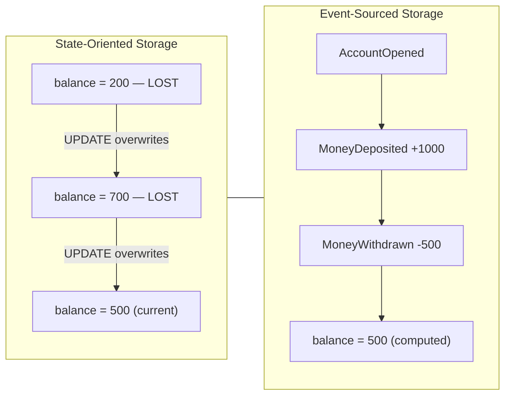

The state-oriented approach optimizes for the present at the expense of the past. Event Sourcing inverts that priority. It treats each **event** — an immutable fact of the past, exactly as defined in Chapter 1 — as the durable unit of truth. Current state becomes a *derived value*, recomputed on demand from the events.

The consequence is strategic, not just technical. In a state-oriented system, history is an afterthought you bolt on with audit tables and triggers, and those audit tables are always slightly wrong. In an event-sourced system, history *is* the storage model. You cannot have incorrect history, because the history is the only thing you ever wrote. Correctness of the audit trail stops being a feature you maintain and becomes a property of the architecture.

That is the trade the pattern offers: you give up the convenience of reading current state directly, and in return you never lose a fact.

> ⚠️ **Critical Note:** The prose states "you cannot have incorrect history, because the history is the only thing you ever wrote" and frames audit-trail correctness as "a property of the architecture." This is a consequential overstatement. Application-layer bugs — emitting a `MoneyWithdrawn` event with the wrong amount, writing to the wrong stream ID, or double-firing a command handler — produce incorrect events that are permanently persisted with the same immutability guarantee as correct ones. The event store enforces append-only and ordering, not domain correctness. A senior engineer who internalizes this claim may dangerously deprioritize command-handler correctness testing and idempotency controls on the grounds that "the store guarantees correctness." The architecture guarantees that every event written is durably preserved exactly as written, eliminating accidental overwrite — but correctness of what is written remains entirely the responsibility of the application. Idempotent command handlers and at-least-once delivery guards are essential to prevent duplicate or incorrect events from becoming permanent facts.

<details>
<summary>💡 Expert Note</summary>
The prose correctly dismisses audit tables as "always slightly wrong," but the failure modes go deeper than most teams expect. Audit triggers miss intermediate states inside multi-statement transactions — if a stored procedure updates three rows and fires one trigger per row, the trigger log records individual row changes but not the single business intent that caused them. More insidiously, when the schema changes (a column is renamed or dropped), the trigger definition silently breaks or starts logging null for that field, and no error is raised. Teams discover this only during an audit, months later, when the log has a systematic gap nobody noticed. Event Sourcing avoids this entirely because the intent — the business event — is what gets written, not the row mutation.
</details>

## The Event Store and the Append-Only Log

The database that holds these events is called an **event store**. It is not a general-purpose table you happen to insert into — it is a specialized log with two rules that define the entire pattern.

First, the event store is **append-only**. You may add events to the end. You may never update or delete an event already written. An event records something that happened, and the past does not change. This is the same immutability principle from Chapter 1, now enforced at the persistence layer.

Second, events are grouped into **streams**. A stream is the ordered sequence of all events for one entity — for example, all events for account `acc-123`. The stream is the unit of consistency and the unit of reconstruction.

A minimal event store schema needs only a handful of columns to enforce these rules.

*Code: SQL DDL for a minimal event store table — `global_position` provides monotone total order across all streams; `UNIQUE (stream_id, version)` enforces per-stream ordering and acts as the optimistic concurrency guard with no application-level locking.*

```python
# ⚠️ LANGUAGE MISMATCH: original was sql, regenerated as python
# Python 3.10+ — event store schema setup using psycopg2
# global_position provides monotone total order across all streams;
# UNIQUE (stream_id, version) enforces per-stream ordering and acts as the
# optimistic concurrency guard with no application-level locking.

import psycopg2

_CREATE_TABLE = """
CREATE TABLE IF NOT EXISTS event_store (
    global_position  BIGSERIAL    PRIMARY KEY,
    stream_id        TEXT         NOT NULL,
    version          INTEGER      NOT NULL,
    event_type       TEXT         NOT NULL,
    payload          JSONB        NOT NULL,
    metadata         JSONB        NOT NULL DEFAULT '{}',
    occurred_at      TIMESTAMPTZ  NOT NULL DEFAULT now(),

    CONSTRAINT uq_stream_version UNIQUE (stream_id, version)
);
"""

_CREATE_INDEX_STREAM = """
CREATE INDEX IF NOT EXISTS idx_event_store_stream
    ON event_store (stream_id, version ASC);
"""

_CREATE_INDEX_GLOBAL = """
CREATE INDEX IF NOT EXISTS idx_event_store_global
    ON event_store (global_position ASC);
"""


def setup_event_store(conn) -> None:
    """
    Create the event_store table and supporting indexes if they do not exist.
    Safe to call on an already-initialised database (uses IF NOT EXISTS).

    Fast stream replay: idx_event_store_stream fetches all events for a stream
    in version order. Subscription catch-up: idx_event_store_global lets
    consumers track their last-seen global_position.
    """
    with conn:
        with conn.cursor() as cur:
            cur.execute(_CREATE_TABLE)
            cur.execute(_CREATE_INDEX_STREAM)
            cur.execute(_CREATE_INDEX_GLOBAL)
```

The `version` column is the quiet hero of that schema. It numbers events within a stream: 1, 2, 3, and so on. The `UNIQUE (stream_id, version)` constraint does two jobs at once. It guarantees a total order inside each stream, and it gives you **optimistic concurrency control** for free.

Here is how the concurrency check works. When a command handler loads a stream, it notes the current highest version — say, 7. It processes the command and tries to append a new event as version 8. If another process already wrote version 8 in the meantime, the unique constraint rejects the insert. The handler knows its decision was based on stale data and retries. No locks, no blocking — just a constraint doing its job.

*Code: Optimistic concurrency append — raises `ConcurrencyConflictError` when another writer has already claimed the expected version; the caller should reload the stream and retry the command.*

```python
# Python 3.10+ — optimistic concurrency append using psycopg2 and PostgreSQL
# Raises ConcurrencyConflictError when another writer has already claimed the expected version.

from __future__ import annotations

import json
from dataclasses import dataclass, field
from typing import Any

import psycopg2
from psycopg2 import errors as pg_errors


@dataclass
class EventRecord:
    stream_id:  str
    event_type: str
    payload:    dict[str, Any]
    metadata:   dict[str, Any] = field(default_factory=dict)


class ConcurrencyConflictError(Exception):
    """Raised when another writer already appended at the expected version.
    The caller should reload the stream and retry the command."""


def append_events(
    conn,
    stream_id:        str,
    events:           list[EventRecord],
    expected_version: int,          # highest version seen when the command was loaded
) -> None:
    """
    Appends `events` to `stream_id` starting at expected_version + 1.
    All inserts run inside a single transaction; a unique-constraint violation
    signals a concurrent write and triggers a rollback.
    """
    with conn:                       # psycopg2 context manager: commit or rollback
        with conn.cursor() as cur:
            for offset, event in enumerate(events):
                next_version = expected_version + 1 + offset  # 1-based, increments per event

                try:
                    cur.execute(
                        """
                        INSERT INTO event_store
                            (stream_id, version, event_type, payload, metadata)
                        VALUES (%s, %s, %s, %s::jsonb, %s::jsonb)
                        """,
                        (
                            stream_id,
                            next_version,
                            event.event_type,
                            json.dumps(event.payload),
                            json.dumps(event.metadata),
                        ),
                    )
                except pg_errors.UniqueViolation:
                    # Another process already wrote at this version; the caller must retry.
                    raise ConcurrencyConflictError(
                        f"Concurrency conflict on stream '{stream_id}': "
                        f"expected version {expected_version} is stale. Reload and retry."
                    )
```

A word of realism for architects choosing infrastructure. You can build an event store on plain PostgreSQL, and for many corporate systems you should — the operational familiarity is worth more than any specialized feature. Purpose-built stores such as EventStoreDB or Axon Server, or cloud primitives like DynamoDB with a partition-plus-sort-key design, add subscription and projection tooling. But none of them changes the two rules above. Append-only and ordered-by-stream are the whole game.

> 💡 **Expert Note:** The `global_position` column in the schema is easy to misimplement on PostgreSQL with a `BIGSERIAL` or `SEQUENCE`, creating a silent production hazard. PostgreSQL sequences are non-transactional by design: if a transaction inserts an event and then rolls back, the sequence value is consumed and not reused. Consumers reading `global_position` in order will see gaps (e.g., positions 1, 2, 4 — position 3 was a rolled-back insert) and must decide whether a gap means "not yet committed" or "permanently missing." The standard production fix is to use a replication-slot-based change-data-capture approach (e.g., `pg_logical`) or to track the global order through a separate, lock-protected counter table flushed only on commit. EventStoreDB sidesteps this by handling position assignment inside its own transaction log. Choose your infrastructure knowing this gap problem exists on plain SQL stores.

<details>
<summary>💡 Expert Note</summary>
When comparing EventStoreDB against a homegrown PostgreSQL store, the practical corporate differentiator is subscription semantics, not storage. EventStoreDB's persistent subscriptions support a competing-consumer model per group natively, but their projection engine (historically JavaScript-based server-side projections) introduces an operational burden — a second runtime to monitor, version, and debug — that most enterprise teams underestimate. For organizations already standardising on Kafka, treating the event store as the authoritative append-only log and Kafka as the subscription/fan-out layer is a common hybrid that preserves familiarity. The two layers have different guarantees (exactly-once append vs. at-least-once delivery) and must be wired accordingly.
</details>

<details>
<summary>⚠️ Critical Note</summary>
The claim "no locks, no blocking — just a constraint doing its job" overstates the benefit of optimistic concurrency under contention. In high-throughput write scenarios on a single aggregate stream — for example, a shared account receiving concurrent payment events — every conflicting writer will retry. Under sustained contention this degrades to effective serialization: all writers spin, reload the stream, reprocess the command, and retry the insert. Retry storms can be worse than a fair queue with a single lock, and the application must bound retries and handle persistent concurrency-conflict errors. This failure mode is invisible on the happy path but material in production. Optimistic concurrency works best when conflicting writers on the same stream are rare. For hot streams, consider command de-duplication at the handler level, stream partitioning, or explicit locking strategies, and always guard against unbounded retries with a max-retry count and backoff.
</details>

## State Reconstruction and Aggregates

If you never store current state, how do you get it? You compute it. The process is called **reconstruction** or **rehydration**: you read the stream from the beginning and apply each event, in order, to a fresh in-memory object. That object is the **aggregate** — the consistency boundary from Domain-Driven Design that owns the business rules for one entity.

Reconstruction is a fold. You start with an empty aggregate and, event by event, fold each fact into the aggregate's state.

*Code: Account aggregate with strict command/apply separation — `rehydrate()` folds the full event stream into a live aggregate at O(n) in stream length.*

```python
# Python 3.10+ — Account aggregate with strict command / apply separation
# rehydrate() folds the full event stream into a live aggregate; O(n) in stream length.

from __future__ import annotations

from dataclasses import dataclass, field
from typing import Union


# ---------------------------------------------------------------------------
# Immutable event types — historical facts, never mutated after creation
# ---------------------------------------------------------------------------

@dataclass(frozen=True)
class AccountOpened:
    account_id: str
    owner:      str

@dataclass(frozen=True)
class MoneyDeposited:
    account_id: str
    amount:     int  # in cents; always positive

@dataclass(frozen=True)
class MoneyWithdrawn:
    account_id: str
    amount:     int  # in cents; always positive

DomainEvent = Union[AccountOpened, MoneyDeposited, MoneyWithdrawn]


# ---------------------------------------------------------------------------
# Aggregate
# ---------------------------------------------------------------------------

@dataclass
class Account:
    account_id: str  = ""
    owner:      str  = ""
    balance:    int  = 0    # in cents
    version:    int  = 0
    _pending:   list[DomainEvent] = field(default_factory=list, repr=False)

    # ---- Command methods: validate invariants, then record a new event ----

    @classmethod
    def open(cls, account_id: str, owner: str) -> "Account":
        """Command: open a new account."""
        aggregate = cls()
        aggregate._record(AccountOpened(account_id=account_id, owner=owner))
        return aggregate

    def deposit(self, amount: int) -> None:
        """Command: credit the account."""
        if amount <= 0:
            raise ValueError(f"Deposit amount must be positive, got {amount}.")
        self._record(MoneyDeposited(account_id=self.account_id, amount=amount))

    def withdraw(self, amount: int) -> None:
        """Command: debit the account; rejects if funds are insufficient."""
        if amount <= 0:
            raise ValueError(f"Withdrawal amount must be positive, got {amount}.")
        if amount > self.balance:
            raise ValueError(
                f"Insufficient funds: balance={self.balance} cents, requested={amount} cents."
            )
        self._record(MoneyWithdrawn(account_id=self.account_id, amount=amount))

    # ---- Apply methods: pure state mutation — NO validation, NEVER reject ----

    def _apply(self, event: DomainEvent) -> None:
        """Mutate in-memory state from an already-decided event. Must never raise."""
        match event:
            case AccountOpened(account_id=aid, owner=owner):
                self.account_id = aid
                self.owner      = owner
                self.balance    = 0
            case MoneyDeposited(amount=amount):
                self.balance += amount
            case MoneyWithdrawn(amount=amount):
                self.balance -= amount

    def _record(self, event: DomainEvent) -> None:
        """Apply a new event to in-memory state and stage it for persistence."""
        self._apply(event)
        self._pending.append(event)

    # ---- Rehydration: reconstruct from a stored event stream ----

    @classmethod
    def rehydrate(cls, events: list[DomainEvent]) -> "Account":
        """
        Fold a complete event stream into a live Account aggregate.
        Time complexity: O(n) where n = len(events).
        """
        aggregate = cls()
        for i, event in enumerate(events, start=1):
            aggregate._apply(event)  # apply history — no validation
            aggregate.version = i    # track stream position for optimistic concurrency
        return aggregate
```

Notice the discipline this enforces. There are exactly two kinds of methods on the aggregate, and confusing them is the most common Event Sourcing bug.

1. **Command methods** (for example, `withdraw`) contain the business rules. They validate invariants — "you cannot withdraw more than the balance" — and, if the rule holds, they *produce a new event*. They decide what should happen.
2. **Apply methods** (for example, `applyMoneyWithdrawn`) contain no business logic at all. They only mutate in-memory state from an event that has *already happened*. They record what did happen.

The rule is absolute: **apply methods must never reject an event or contain validation.** The event is a historical fact. Refusing to apply it during reconstruction would mean refusing to acknowledge the past, and your rebuilt state would silently diverge from reality. All validation lives in command methods, before the event exists.

*Figure: Sequence diagram of a write — from stream loading through aggregate rehydration, invariant validation, and optimistic-concurrency-controlled append, showing where validation lives and where the unique-constraint concurrency guard fires.*

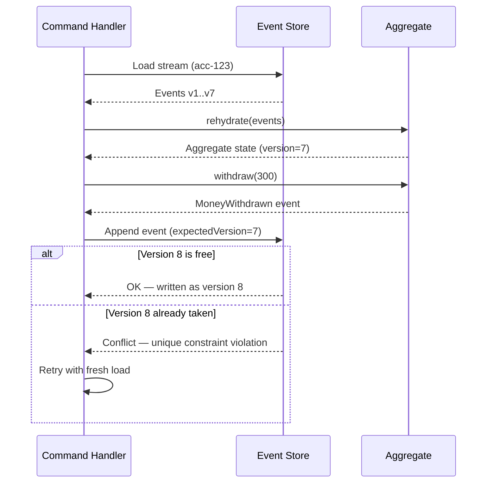

This is where Event Sourcing and CQRS from Chapter 5 lock together. The command side reconstructs the aggregate to make a decision and emits an event. That same event feeds the projections that build the read models. One event, written once, serves both truth and query. The event log becomes the single source that CQRS's disposable read models are rebuilt from.

<details>
<summary>💡 Expert Note</summary>
The prose describes command methods as methods that "produce a new event," but the standard implementation pattern adds a structural detail that changes how the aggregate interacts with its repository: the aggregate holds an internal list of "uncommitted events." When a command method decides to accept a business action, it calls its own `apply()` internally — to update in-memory state immediately — and appends the event to this uncommitted list. The repository, after calling the command, reads the uncommitted list, appends those events to the store at the expected version, then clears the list. This two-phase design (apply-now, flush-later) is why command methods can chain decisions within a single unit of work and why the aggregate never knows about the database. Omitting this pattern leads teams to either re-load the aggregate between commands in the same request or to call `apply()` twice (once in the command, once during reconstruction), causing double-mutation bugs.
</details>

<details>
<summary>⚠️ Critical Note</summary>
The rule "apply methods must never reject an event or contain validation" is described as absolute, but it does not address the forward-compatibility scenario where an aggregate encounters an event type introduced by a newer version of the application that the current code does not recognize. Silently ignoring unknown event types during rehydration can produce subtly wrong in-memory state; hard-failing on unknown types breaks reconstruction entirely. This is a real operational problem during rolling deployments and schema migrations. Apply methods must not reject *known* events or apply business validation to them. For unknown or unrecognized event types, the recommended strategy is ignore-and-log with a version-awareness check. Chapter 8 addresses schema versioning formally.
</details>

## Snapshots and Replay Optimization

Reconstruction has an obvious flaw, and every skeptic spots it immediately. If an account has 200,000 events accumulated over ten years, must you read and fold all 200,000 events every time someone checks the balance? At that volume, reconstruction turns a millisecond operation into a multi-second one.

The answer is the **snapshot**. A snapshot is a cached copy of the aggregate's state at a specific version — a checkpoint that says "at version 50,000, the balance was 12,340." Reconstruction then changes: load the latest snapshot, then replay only the events that came *after* it.

*Code: Snapshot-based rehydration with full-replay fallback — the snapshot is a disposable optimization; deleting all snapshots must leave behaviour unchanged.*

```python
# Python 3.10+ — snapshot-based rehydration with full-replay fallback
# Snapshot is a disposable optimisation; deleting all snapshots must leave behaviour unchanged.

from __future__ import annotations

import json
from dataclasses import dataclass
from typing import Any, Optional

# Re-uses Account, DomainEvent defined in the aggregate example above.


# ---------------------------------------------------------------------------
# Snapshot data contract
# ---------------------------------------------------------------------------

@dataclass
class Snapshot:
    stream_id: str
    version:   int            # aggregate version at time the snapshot was taken
    state:     dict[str, Any] # serialised aggregate fields (excludes _pending)


# ---------------------------------------------------------------------------
# Storage helpers — replace with real persistence in production
# ---------------------------------------------------------------------------

def load_latest_snapshot(stream_id: str) -> Optional[Snapshot]:
    """Return the most recent snapshot for the stream, or None if none exists."""
    raise NotImplementedError  # implement against your snapshot store


def load_events_after_version(stream_id: str, after_version: int) -> list[DomainEvent]:
    """Return events where version > after_version, ordered ascending by version."""
    raise NotImplementedError  # implement against the event_store table


# ---------------------------------------------------------------------------
# Rehydration with snapshot shortcut
# ---------------------------------------------------------------------------

def rehydrate_from_snapshot(stream_id: str) -> Account:
    """
    Reconstruct an Account aggregate, using a snapshot when available.

    Steps:
      1. Load the most recent snapshot for the stream.
      2. If found: restore aggregate state from the snapshot, then replay
         only the events written after snapshot.version.
      3. If not found: fall back to full replay from the start of the stream.

    The snapshot is purely an optimisation — deleting it produces the same
    aggregate state, just more slowly.
    """
    snapshot: Optional[Snapshot] = load_latest_snapshot(stream_id)

    if snapshot is not None:
        # Fast path: restore from checkpoint, then apply the delta only
        aggregate = Account(
            account_id=snapshot.state["account_id"],
            owner=snapshot.state["owner"],
            balance=snapshot.state["balance"],
        )
        aggregate.version = snapshot.version
        delta_events = load_events_after_version(stream_id, after_version=snapshot.version)
    else:
        # Slow path: no snapshot exists — replay the full stream from scratch
        aggregate = Account()
        delta_events = load_events_after_version(stream_id, after_version=0)

    # Fold the delta (or full stream) onto the aggregate state
    for event in delta_events:
        aggregate._apply(event)   # pure mutation, no validation
        aggregate.version += 1

    return aggregate


def maybe_take_snapshot(aggregate: Account, interval: int = 100) -> Optional[Snapshot]:
    """
    Policy: create a new snapshot every `interval` events.
    Caller is responsible for persisting the returned snapshot.
    Returns None when the version does not fall on a snapshot boundary.
    """
    if aggregate.version > 0 and aggregate.version % interval == 0:
        return Snapshot(
            stream_id=aggregate.account_id,
            version=aggregate.version,
            state={
                "account_id": aggregate.account_id,
                "owner":      aggregate.owner,
                "balance":    aggregate.balance,
            },
        )
    return None
```

Two design points separate a working snapshot strategy from a broken one.

- **A snapshot is a derived optimization, never a source of truth.** You must be able to delete every snapshot in the system and rebuild all of them from events alone. If deleting snapshots loses data, you have accidentally reintroduced the state-oriented model you were trying to escape.
- **Snapshot on a cadence, not on every write.** A common policy is one snapshot every *N* events per stream — say, every 100. The number is a tuning knob, not a constant.

The following table frames the trade-off you are actually tuning.

| Snapshot frequency | Replay cost per load | Storage & write overhead | Best fit |
|---|---|---|---|
| Never (pure replay) | Grows without bound | None | Short streams, low event counts |
| Every N events (e.g., 100) | Bounded, small | Moderate | Most production systems |
| Every event | Near zero | High; approaches state storage | Almost never — a code smell |

The last row is worth a **Pro Tip**. If your instinct is to snapshot on every single write, stop. You have rebuilt an update-in-place database with extra steps and worse performance. The point of snapshots is to make replay *acceptable*, not to eliminate it. Reach for snapshots only when measurement proves reconstruction is too slow — and for aggregates with short lifespans and few events, you may never need them at all.

> 💡 **Expert Note:** A bug in any `apply()` method that goes undetected for weeks will silently corrupt every snapshot generated during that period. When the bug is fixed, the corrected apply logic produces different in-memory state than the stored snapshot reflects, and reconstruction that starts from a stale snapshot will produce wrong results without raising an error — the corrupted snapshot is structurally valid JSON. The production fix is to attach a `snapshot_schema_version` (an integer you increment whenever apply logic changes semantics) to every snapshot row. On load, if `snapshot_schema_version` does not match the current code version, discard the snapshot and fall back to full replay. This adds one config constant and one comparison but makes snapshot invalidation automatic and safe during deploys.

<details>
<summary>💡 Expert Note</summary>
The prose frames snapshotting as a tuning knob on read, but it matters equally on the write path. A naive implementation takes a snapshot synchronously inside the same transaction that appends the event — doubling write latency on every Nth event. Production systems almost universally make snapshotting asynchronous: a background worker (or a projection that reads the event stream) detects that a stream has advanced past a threshold and writes the snapshot out-of-band. The command path stays fast and predictable; the snapshot may lag by a few seconds, which is acceptable because reconstruction always falls back to replay if a snapshot is absent or stale.
</details>

<details>
<summary>⚠️ Critical Note</summary>
The snapshot strategy discussion omits a critical operational question: who writes the snapshot, and what happens if that write fails? If the command handler writes the snapshot synchronously after appending an event, a snapshot write failure must not be treated as a command failure — or command processing becomes unreliable. If snapshots are written by an asynchronous background process, there is a window where the snapshot store is stale or empty and full replay is silently required. Snapshots should be written as best-effort, non-transactional operations that never block or fail the command pipeline. The code should always fall back to full replay if a snapshot is missing or its version is not present in the event store, treating the snapshot as an advisory cache rather than a required dependency.
</details>

## Long-Term Costs and Design Constraints

Event Sourcing is not a technique you try for a sprint and back out of cleanly. Once real events accumulate, the pattern becomes load-bearing, and its costs are structural. An honest architect weighs them before adopting, not after.

**Events are permanent, so their schemas are permanent.** A row you no longer like can be migrated with an `ALTER TABLE`. An event written in 2024 will still be read during reconstruction in 2030, exactly as it was written. You cannot migrate the past. You accommodate old shapes through versioning and upcasting — the entire subject of Chapter 8 — and that discipline is mandatory, not optional.

**Deletion becomes a real design problem.** Regulations such as GDPR grant a right to erasure, which collides head-on with an append-only, immutable log. You cannot simply delete the events. The standard answer is **crypto-shredding**: encrypt personal data per subject and delete the key to render the data unrecoverable. This must be designed in from the first event, because you cannot retrofit encryption onto facts already written in plaintext.

**Querying current state requires the read side.** Since state is derived, you cannot write a simple `SELECT balance FROM accounts`. You need projections and read models — which is precisely why Event Sourcing and CQRS are so often adopted together. Choosing Event Sourcing effectively commits you to the CQRS read path from Chapter 5.

*Figure: Decision flowchart for adopting Event Sourcing — routes toward adoption only when all four qualifying conditions hold and toward lighter alternatives otherwise.*

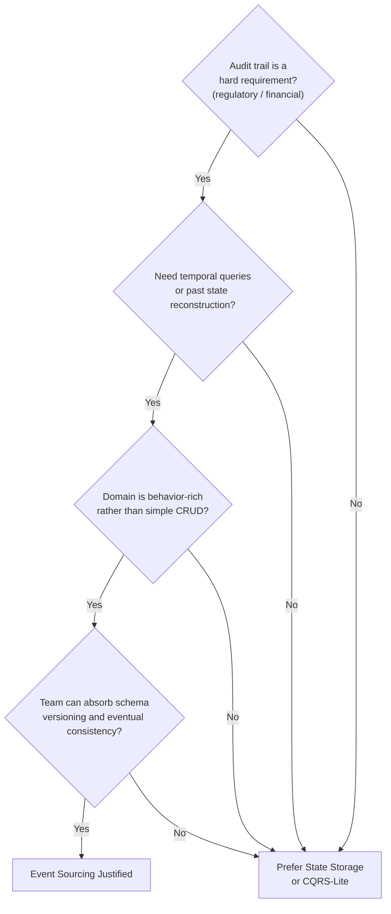

The blunt guidance for senior architects: Event Sourcing earns its keep in domains where history is intrinsically valuable — ledgers, trading, insurance, medical records, order lifecycles — and where the business genuinely asks *how did we get here*. For a CRUD-shaped domain whose users never ask about the past, it is over-engineering with a decade-long maintenance tail. Adopt it where the audit trail is the product, not where it is a novelty.

> 💡 **Expert Note:** Crypto-shredding as described is correct but understates a critical implementation constraint: the scope of what must be encrypted is wider than most teams anticipate. Personal data cannot appear anywhere outside the encrypted payload — not in the event type name, not in metadata fields (correlation IDs, user-agent strings, IP addresses logged as metadata), and not in stream IDs that encode a username or email. A stream ID of `user-john.doe@example.com` cannot be shredded; the identifier itself is personal data and will persist in every event header, every snapshot row, and every projection row forever. The architectural discipline is to use opaque, surrogate identifiers (UUIDs) as stream IDs from day one and to store a separate subject-keyed encryption key per data subject in a dedicated key management service (AWS KMS, HashiCorp Vault) before writing the first event. Retrofitting this onto an existing event store is effectively impossible without rewriting history, which the pattern prohibits.

<details>
<summary>⚠️ Critical Note</summary>
The prose cites medical records as a canonical domain where Event Sourcing "earns its keep" because history is intrinsically valuable. This is the same domain where HIPAA and GDPR create a right-to-erasure obligation and where data correction (amending a clinical entry) is a routine operational requirement. The immutability of Event Sourcing is in direct tension with both. Crypto-shredding handles GDPR erasure in principle, but clinical correction — where a misdiagnosis event must be amended, not just superseded — requires compensating events and careful read-model logic to surface the corrected state. Presenting medical records as a straightforward fit for Event Sourcing without this caveat could lead a reader to underestimate the regulatory complexity. Regulated domains requiring correction or erasure workflows demand explicit design: compensating events for corrections, crypto-shredding for deletion, and read models that correctly surface only the authoritative current record. Financial ledgers and order lifecycle are cleaner canonical examples since those domains have the weakest deletion requirements.
</details>

## Key Takeaways

- Event Sourcing stores every state-changing event as immutable fact and derives current state by replay, solving the truth-and-history problem that update-in-place systems create by forgetting the past.
- The **event store** is append-only and organized into per-entity **streams**; a `UNIQUE (stream_id, version)` constraint enforces both ordering and lock-free optimistic concurrency.
- Aggregates are **rehydrated** by folding events in order; command methods validate invariants and emit events, while apply methods only mutate state and must never reject a fact.
- **Snapshots** bound replay cost by checkpointing state every N events, but they are disposable optimizations — never a source of truth, and never taken on every write.
- The costs are permanent schemas, hard deletion (crypto-shredding), and a mandatory read side; adopt Event Sourcing only where history is genuinely valuable to the business.

## What's Next

Chapter 7 confronts what happens when a single business process spans multiple aggregates and services, introducing sagas to coordinate transactions under eventual consistency instead of distributed ACID.

<!-- ASSEMBLY COMPLETE
  Chapter: Event Sourcing — State as a Sequence of Events
  Code blocks resolved: 4 / 4
  Diagrams resolved: 3 / 3
  Expert callouts (inline): 3
  Expert callouts (collapsed): 4
  Critical callouts (inline): 1
  Critical callouts (collapsed): 4
  Unresolved markers: 0
-->


# Chapter 7: Consistency, Sagas, and Long-Running Processes

## Opening Problem Statement

Chapter 6 left the write side settled: state is an immutable log of events, and truth lives in the event store. But that chapter quietly assumed a comfortable boundary — one aggregate, one stream, one transaction. Real business processes are not so polite. Placing an order touches inventory, payment, and shipping. Onboarding a customer touches identity, billing, and compliance. Each of these lives in a different service, behind a different database, owned by a different team.

Here is the uncomfortable question this chapter answers: **how do you keep three services consistent when you cannot wrap them in a single transaction?** The classic instinct — a distributed transaction that locks all three and commits atomically — sounds correct and is almost always wrong in a cloud-native system. It couples availability, punishes latency, and fails in ways that are hard to reason about.

The alternative is the **saga**: a sequence of local transactions, each committing independently, coordinated by events, and reversed not by rollback but by *compensation*. Sagas trade the illusion of instantaneous global consistency for something honest and operable: **eventual consistency**. This chapter shows how sagas work, when to choreograph them and when to orchestrate them, how to design compensations that actually undo business effects, and how the CAP theorem quietly governs every one of these choices.

## Eventual Consistency Versus Strong Consistency

Start with the word every architect uses and few define precisely. **Strong consistency** means that once a write completes, every subsequent read — from anywhere — sees that write. The system behaves as if there were a single copy of the data and a single clock. This is the guarantee a local ACID transaction gives you inside one database.

**Eventual consistency** makes a weaker promise: if writes stop, all replicas and derived views will *eventually* converge to the same value. Between the write and that convergence, there is a window in which different parts of the system disagree. That window is not a bug. It is the price of keeping services independent and available.

The mistake is treating eventual consistency as "strong consistency, but sloppy." It is a different model with different rules. You do not ask "is the data consistent?" You ask "what is the maximum staleness the business can tolerate, and what happens inside that window?"

Consider a familiar analogy. When you transfer money between banks, the sender's balance drops immediately, but the recipient sees nothing for hours or days. The money is, for a while, *in flight* — visible nowhere. The banking system is eventually consistent by design, and it works because the business defined explicit intermediate states ("pending," "settled") and rules for each. That is the discipline eventual consistency demands.

**Figure 7.1** — Two-phase commit forces all participants to lock and commit atomically, creating a single all-or-nothing window; a saga lets each service commit locally in sequence, accepting a visible inconsistency window between steps that closes as events propagate forward.

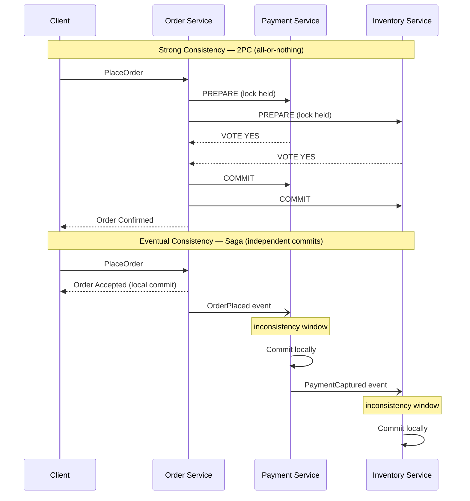

The table below sharpens the contrast.

| Dimension | Strong consistency | Eventual consistency |
|---|---|---|
| Read after write | Always current | Current *eventually* |
| Scope | Single database / transaction | Multiple services |
| Availability under partition | Sacrificed | Preserved |
| Latency | Higher (coordination) | Lower (local commits) |
| Failure mode | All-or-nothing | Partial, then reconciled |
| Reasoning cost | Low | High — intermediate states matter |

The senior takeaway: **eventual consistency is not a compromise you accept reluctantly; it is the enabling assumption of independent services.** The moment you demand strong consistency across service boundaries, you have re-coupled the services you spent Chapters 1 through 6 decoupling.

<details>
<summary>💡 Expert Note</summary>

The prose presents consistency as a binary (strong vs. eventual), which is pedagogically useful but can lead architects to over-engineer. In practice, many UX and API requirements need only "read-your-writes" (causal) consistency — the user who just created a resource can see it on the next request, but other users seeing a slightly stale view is acceptable. This is weaker than strong consistency but stronger than bare eventual. Designing for read-your-writes often eliminates the need for synchronous cross-service calls: redirect the user to the newly created resource's canonical URL immediately after the local commit, and rely on event propagation for everyone else. Distinguishing "which consistency level does this user action actually need?" prevents the knee-jerk response of adding synchronous calls to achieve strong consistency where causal would suffice.
</details>

## Why Distributed ACID Transactions Fail

Before sagas, honor the pattern they replace. The textbook answer to multi-service consistency is the **two-phase commit** (2PC): a coordinator asks every participant to *prepare*, waits for all to vote yes, then tells all to *commit*. If any participant votes no, everyone aborts. On paper, atomicity across services.

In practice, 2PC has three fatal properties for cloud-native systems.

First, **it holds locks across the network.** Between prepare and commit, every participant keeps its rows locked, waiting for the coordinator. A slow network or a distant service turns a millisecond lock into a multi-second one, collapsing throughput.

Second, **it is a blocking protocol.** If the coordinator crashes after participants vote yes but before it broadcasts the decision, participants are stuck — locked, uncertain, unable to safely proceed or abort. This is the well-known "in-doubt" state, and recovering from it is operationally miserable.

Third, **it couples availability.** A transaction succeeds only if *every* participant is up at the same instant. Five services at 99.9% availability each yield roughly 99.5% combined — you have multiplied your fragility. This directly violates the independence that makes microservices worth their cost.

**Listing 7.1** — This example simulates a 2PC coordinator driving three services through the prepare and commit phases. The `simulate_crash_after_prepare` flag demonstrates the in-doubt window: participants have already voted yes and hold their locks, but the coordinator has not yet broadcast the decision — leaving the system in an unresolvable state until manual intervention or a recovery protocol.

```python
# O(n) per phase where n = number of participants; locks held across both phases are the core hazard
from __future__ import annotations

import enum
from dataclasses import dataclass


class VoteResult(enum.Enum):
    YES = "yes"
    NO = "no"


class CoordinatorState(enum.Enum):
    IDLE = "IDLE"
    PREPARING = "PREPARING"
    COMMITTED = "COMMITTED"
    ABORTED = "ABORTED"
    IN_DOUBT = "IN_DOUBT"  # coordinator crashed after votes, before broadcasting the decision


@dataclass
class Participant:
    """Represents one service participating in the distributed transaction."""
    name: str
    vote: VoteResult = VoteResult.YES
    locked: bool = False   # True while row locks are held during the prepare phase
    committed: bool = False

    def prepare(self) -> VoteResult:
        # Participant locks its rows and signals readiness; lock is NOT released until phase 2
        self.locked = True
        return self.vote

    def commit(self) -> None:
        self.locked = False
        self.committed = True

    def abort(self) -> None:
        self.locked = False
        self.committed = False


class TwoPhaseCommitCoordinator:
    """Drives the two phases; exposes the crash-induced in-doubt scenario."""

    def __init__(self, participants: list[Participant]) -> None:
        self.participants = participants
        self.state = CoordinatorState.IDLE
        self._votes: dict[str, VoteResult] = {}

    def run(self, simulate_crash_after_prepare: bool = False) -> CoordinatorState:
        # ── Phase 1 — Prepare ───────────────────────────────────────────────
        # Coordinator asks every participant to vote; each locks its rows.
        self.state = CoordinatorState.PREPARING
        for p in self.participants:
            vote = p.prepare()
            self._votes[p.name] = vote
            print(f"  {p.name:20s}  voted {vote.value:3s}  locked={p.locked}")

        all_yes = all(v == VoteResult.YES for v in self._votes.values())

        if simulate_crash_after_prepare:
            # The coordinator dies here. Participants hold locks and cannot safely
            # commit or abort on their own — the "in-doubt" blocking window begins.
            self.state = CoordinatorState.IN_DOUBT
            stuck = [p.name for p in self.participants if p.locked]
            print(f"\n  *** COORDINATOR CRASHED — in-doubt participants (locks held): {stuck} ***")
            print("  Recovery requires the coordinator to restart and re-broadcast its decision.")
            return self.state

        # ── Phase 2 — Commit or Abort ────────────────────────────────────────
        # Only reached if the coordinator survived; broadcasts a single uniform decision.
        if all_yes:
            for p in self.participants:
                p.commit()
            self.state = CoordinatorState.COMMITTED
        else:
            for p in self.participants:
                p.abort()
            self.state = CoordinatorState.ABORTED

        return self.state


# ── Demo ─────────────────────────────────────────────────────────────────────
if __name__ == "__main__":
    print("=== Happy path: all participants vote YES ===")
    services = [Participant("OrderSvc"), Participant("PaymentSvc"), Participant("InventorySvc")]
    result = TwoPhaseCommitCoordinator(services).run()
    print(f"Coordinator final state: {result.value}\n")

    print("=== Crash scenario: coordinator dies after phase 1 ===")
    services = [Participant("OrderSvc"), Participant("PaymentSvc"), Participant("InventorySvc")]
    result = TwoPhaseCommitCoordinator(services).run(simulate_crash_after_prepare=True)
    print(f"Coordinator final state: {result.value}")
    # Expected output:
    #   *** COORDINATOR CRASHED — in-doubt participants (locks held): ['OrderSvc', 'PaymentSvc', 'InventorySvc'] ***
```

There is a deeper truth here, and it is the CAP theorem, which we return to at the end of the chapter: when a network partition splits your services, 2PC chooses consistency by refusing to proceed. For most business processes — orders, bookings, signups — refusing to proceed is the wrong answer. The business would rather accept the order now and reconcile later. That preference *is* the choice of a saga.

> 💡 **Expert Note:** The prose correctly identifies 2PC as the pattern to replace, but misses a widespread enterprise trap: XA transactions (JTA in Jakarta EE, Spring's `@Transactional` spanning multiple `DataSource` or `ConnectionFactory` beans, and MSDTC in .NET) are 2PC in disguise. Many teams believe they are not using distributed ACID until they trace a production incident and find an XA coordinator quietly holding locks across a database and a message broker. The tell is a `javax.transaction.UserTransaction` or `ChainedTransactionManager` in the dependency tree. Audit your dependency graph before declaring you have eliminated 2PC from a legacy migration path.

<details>
<summary>⚠️ Critical Note</summary>

The chapter frames 2PC as a pure "CP" choice — a system that sacrifices availability in exchange for consistency when a partition occurs. This is an oversimplification that the in-doubt state already disproves within the same section. When the coordinator crashes after participants have voted *yes* but before the commit decision is broadcast, participants are locked and uncertain — they can neither commit nor abort safely. The system at that point is neither available *nor* consistent: it is stuck. 2PC does not reliably guarantee C under coordinator failure; it guarantees that no incorrect commit happens, which is not the same as providing a consistent read. The CAP characterization of 2PC as CP is a useful shorthand for the partition-tolerance trade-off, but presenting it without the caveat that the "C" guarantee degrades under coordinator failure is misleading for practitioners evaluating failure modes.

**Suggested fix:** Qualify the CP characterization: "2PC is typically described as CP, but the guarantee is more precisely 'no incorrect commit' — under coordinator failure, in-doubt participants achieve neither availability nor a guaranteed consistent state. The real cost of 2PC is not only lost availability under partitions but lost recoverability under coordinator crashes."
</details>

## Choreographed Versus Orchestrated Sagas

A **saga** is a sequence of local transactions where each step publishes an event that triggers the next. If a step fails, the saga runs **compensating transactions** to undo the completed steps. There are two ways to wire the steps together, and the distinction — first met in Chapter 3 as a topology, now applied specifically to sagas — defines how you will operate the system.

In a **choreographed saga**, there is no central coordinator. Each service listens for events, does its local work, and emits its own event. The Order service publishes `OrderPlaced`; the Payment service reacts, charges the card, and publishes `PaymentCaptured`; the Inventory service reacts to *that* and reserves stock. The flow lives in the reactions. No single component knows the whole process.

In an **orchestrated saga**, a dedicated coordinator — the **orchestrator** — owns the process. It sends explicit commands (`CapturePayment`, `ReserveStock`), waits for replies, and decides the next step. The Order Orchestrator knows every step, every possible failure, and every compensation. The flow lives in one place.

**Figure 7.2** — Choreography wires services together through a chain of reactive events with no single coordinator, while orchestration places all process logic in one explicit orchestrator that issues commands and awaits replies — understanding this trade-off determines how visible and maintainable the saga flow will be as complexity grows.

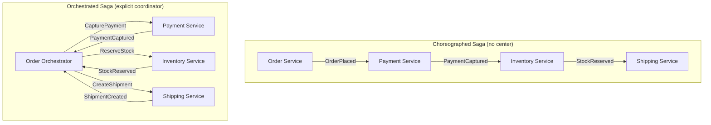

The trade-off is real and it is about *where the process logic lives*.

| Factor | Choreography | Orchestration |
|---|---|---|
| Coupling | Low — services know only events | Higher — orchestrator knows all steps |
| Visibility | Poor — flow is implicit | Excellent — flow is explicit in one place |
| Adding a step | Touch multiple services | Touch the orchestrator |
| Risk of cycles | High — events triggering events | Low — commands are directed |
| Best for | Short flows, 2–4 steps | Complex flows, many branches |
| Debugging | Hard — no single narrative | Easier — one state to inspect |

Here is the opinionated guidance. **Use choreography for short, stable flows** where the reactions are obvious and unlikely to change. The decoupling is genuine and the simplicity is real. But **the moment a saga grows past three or four steps, or acquires conditional branches, reach for orchestration.** Choreographed sagas at scale become "event spaghetti" — nobody can tell you what the process does without tracing events across six services. The implicit control flow that makes choreography elegant at small scale makes it unmaintainable at large scale. Prefer the boring, visible orchestrator.

> 💡 **Expert Note:** The prose correctly warns about "event spaghetti" in choreography, but the reliability dependency on transactional event publication deserves equal emphasis. In a choreographed saga, if a service commits its local database transaction but crashes before publishing the downstream event, the saga silently stalls — no exception, no alert, no next step. The Outbox Pattern (writing the event to a local `outbox` table in the same ACID transaction and polling it with a relay) is not optional for choreographed sagas in production; it is the mechanism that makes the choreography reliable at all. Without it, the decoupling advantage is undermined by a hidden reliability gap. If this chapter references the Outbox Pattern from an earlier chapter, make that dependency explicit here.

<details>
<summary>💡 Expert Note</summary>

Testing strategy diverges sharply between the two topologies, and this shapes team velocity in practice. Choreographed sagas require contract testing across service boundaries (Pact, Spring Cloud Contract) to verify that an event published by Service A actually satisfies Service B's consumer schema — without this, integration breaks silently when a field is renamed. Orchestrated sagas can be unit-tested in isolation: mock the downstream command channels, feed reply events, assert state transitions. The orchestrator test suite becomes the saga's living documentation. Teams that choose orchestration for visibility often underestimate that it also gives them a dramatically simpler test surface — a point worth making to architects who prefer choreography for ideological reasons.
</details>

## Compensating Transactions and Semantic Rollback

The heart of the saga is what happens when step four fails after steps one through three succeeded. There is no `ROLLBACK` — those transactions already committed, in other databases, possibly hours ago. Instead, the saga executes **compensating transactions**: new transactions that semantically undo the effect of the completed ones.

The critical word is **semantically**. A compensation is not a technical reversal to a prior state; it is a *new business action* that counteracts a previous one. You do not un-charge a credit card — you *issue a refund*. You do not un-send an email — you *send a correction*. You do not delete a shipment record — you *cancel the shipment*. The compensating action is itself a real, recorded, forward-moving fact.

**Listing 7.2** — This example implements the choreography-agnostic saga execution kernel: each `SagaStep` bundles a forward action with its semantic compensation. When any step raises, the executor unwinds only the already-completed steps in strict reverse order — ensuring effects are undone in a sensible business sequence. The compensation actions are new business facts (refund, release, cancel), never raw database undos.

```python
# Saga execution — O(n) forward, O(k) compensation where k = steps completed before failure
from __future__ import annotations

import enum
from dataclasses import dataclass, field
from typing import Callable


class StepStatus(enum.Enum):
    PENDING = "pending"
    COMPLETED = "completed"
    COMPENSATED = "compensated"
    FAILED = "failed"


@dataclass
class SagaStep:
    """Pairs a forward business action with its semantic compensation."""
    name: str
    action: Callable[[], None]
    compensation: Callable[[], None]
    status: StepStatus = field(default=StepStatus.PENDING, init=False)


class OrderSaga:
    """
    Executes an order saga: ReserveStock → CapturePayment → CreateShipment.
    On any failure, compensates completed steps in reverse order.
    """

    def __init__(self, order_id: str) -> None:
        self.order_id = order_id
        # Steps are declared in the intended execution order.
        # Compensations are the semantic inverse — a refund, not an un-charge.
        self.steps: list[SagaStep] = [
            SagaStep("ReserveStock",   self._reserve_stock,   self._release_stock),
            SagaStep("CapturePayment", self._capture_payment, self._refund_payment),
            SagaStep("CreateShipment", self._create_shipment, self._cancel_shipment),
        ]

    # ── Forward actions ───────────────────────────────────────────────────────

    def _reserve_stock(self) -> None:
        print(f"  [ReserveStock]   stock reserved   order={self.order_id}")

    def _capture_payment(self) -> None:
        print(f"  [CapturePayment] charging card     order={self.order_id}")
        # Simulate a transient infrastructure failure mid-saga
        raise RuntimeError("Payment gateway timeout — no charge was made")

    def _create_shipment(self) -> None:
        print(f"  [CreateShipment] shipment created  order={self.order_id}")

    # ── Compensating actions — semantic reversals, each a new business fact ──

    def _release_stock(self) -> None:
        # Idempotent: check a compensation key in production to guard against double-release
        print(f"  [ReleaseStock]   stock released    order={self.order_id}")

    def _refund_payment(self) -> None:
        # Issues a refund record, not a deletion of the charge attempt
        print(f"  [RefundPayment]  refund issued     order={self.order_id}")

    def _cancel_shipment(self) -> None:
        print(f"  [CancelShipment] shipment cancelled order={self.order_id}")

    # ── Saga runner ───────────────────────────────────────────────────────────

    def execute(self) -> bool:
        """
        Run forward steps in order. On the first failure, compensate every
        previously completed step in reverse order (LIFO), then return False.
        """
        completed: list[SagaStep] = []

        for step in self.steps:
            try:
                step.action()
                step.status = StepStatus.COMPLETED
                completed.append(step)
            except Exception as exc:
                step.status = StepStatus.FAILED
                print(f"\n  Step '{step.name}' failed: {exc}")
                print("  Compensating completed steps in reverse order...")
                # Reverse-order compensation ensures effects unwind in a sensible sequence
                for done in reversed(completed):
                    done.compensation()
                    done.status = StepStatus.COMPENSATED
                return False

        return True


# ── Demo ─────────────────────────────────────────────────────────────────────
if __name__ == "__main__":
    print("=== Order Saga: ReserveStock succeeds, CapturePayment fails ===\n")
    saga = OrderSaga(order_id="ORD-42")
    success = saga.execute()

    print(f"\nSaga result: {'completed' if success else 'compensated'}")
    for step in saga.steps:
        print(f"  {step.name:20s}  {step.status.value}")
    # Expected output:
    #   [ReserveStock]   stock reserved   order=ORD-42
    #   [CapturePayment] charging card     order=ORD-42
    #   Step 'CapturePayment' failed: Payment gateway timeout — no charge was made
    #   Compensating completed steps in reverse order...
    #   [ReleaseStock]   stock released    order=ORD-42
    #   Saga result: compensated
    #   ReserveStock          compensated
    #   CapturePayment        failed
    #   CreateShipment        pending
```

Three properties make compensations trustworthy, and each maps to a design rule.

1. **Compensations must be idempotent.** A refund command may be delivered more than once under at-least-once delivery (Chapter 4). Reissuing it must not refund twice. Use a compensation key and check "already compensated?" before acting.

2. **Compensations must be commutative-safe with respect to ordering.** Run them in reverse order of the forward steps, so effects unwind in a sensible sequence — release the stock you reserved, refund the payment you captured.

3. **Some actions cannot be compensated — so order the saga around them.** You cannot un-launch a missile or un-send a physical package. These are **pivot transactions**: after the pivot, the saga can only go forward. The design rule is to place all *compensatable* steps before the pivot and all *retriable* (guaranteed-to-eventually-succeed) steps after it. Structure the saga so the irreversible step happens last, once everything reversible has already succeeded.

This taxonomy — compensatable, pivot, retriable — is the single most useful mental model for designing sagas. Classify every step, then order them so failure is always either fully reversible or guaranteed to complete.

> **Pro Tip:** Compensation is not error handling bolted on afterward. It is half of the business process. If you cannot describe how to undo a step in business terms, you do not yet understand the step. Model the compensation at the same time you model the forward action — in the same Event Storming session from Chapter 2.

> 💡 **Expert Note:** The prose establishes that compensations must be idempotent, but it does not address the case where the compensation itself fails — and this is one of the most operationally dangerous scenarios in production sagas. A `RefundPayment` command can be rejected by a downstream payment processor that is temporarily down, or refused because the card has been cancelled. When the compensating transaction is undeliverable or rejected, the saga is stuck in a partially compensated state with no automatic resolution path. Production systems must model this explicitly: a `CompensationFailed` terminal state backed by a dead-letter queue, an alerting rule, and a manual remediation playbook. In regulated industries (financial services, healthcare) this state must also trigger a compliance event. Teams that omit this state discover it exists anyway — they just cannot observe or act on it.

> ⚠️ **Critical Note:** The entire section on compensations describes a single saga instance in isolation. It never addresses the *saga isolation problem*: because each local transaction commits independently and intermediate saga states are fully visible to other concurrent transactions, sagas suffer from phenomena that ACID isolation prevents — specifically dirty reads and lost updates. A concurrent process reading the order record between `PaymentCaptured` and `ShipmentCreated` sees a state that may later be compensated. Depending on what it does with that data, the compensation may be insufficient to restore global correctness. Garcia-Molina's original 1987 paper introducing sagas explicitly identified this limitation, and Chris Richardson's "Microservices Patterns" (the canonical practitioner reference) dedicates a full section to countermeasures: semantic locks, commutative updates, pessimistic views, and re-read values. For a senior architect audience designing high-concurrency order processing systems, omitting this is a material gap — it is the most common source of subtle data corruption in production saga implementations.

<details>
<summary>⚠️ Critical Note</summary>

Property 2 states "Compensations must be commutative-safe with respect to ordering." This is a terminology error that directly contradicts the advice that follows it. *Commutativity* means the order of operations does not matter — if compensations were commutative, there would be no need to run them in reverse order. The prose then immediately instructs the reader to run compensations in reverse order, which is the *opposite* of a commutativity requirement. What the property actually requires is strict *sequential* reverse ordering: each compensation must be applied in inverse sequence relative to the forward steps. Calling this "commutative-safe" will confuse any engineer who knows the term.

**Suggested fix:** Replace "Compensations must be commutative-safe with respect to ordering" with "Compensations must be applied in strict reverse sequence: undo the last committed step first." Clarify that commutativity would mean order is irrelevant, which is the opposite of the constraint here.
</details>

## Process Managers and State Machines

An orchestrator that merely forwards commands is thin. A real orchestrator must remember: which steps have completed, which are pending, what to do on each reply, when to time out, and when to start compensating. That stateful coordinator has a name — the **process manager** — and its most reliable implementation is an explicit **state machine**.

A process manager is a component that receives events, maintains the state of a single saga instance, and decides the next command based on that state. Model it as a finite set of states with defined transitions: `AwaitingPayment → AwaitingStock → AwaitingShipment → Completed`, with failure edges branching into `Compensating → Cancelled`. Every incoming event either advances the state or triggers compensation. Nothing happens implicitly.

**Figure 7.3** — This state machine captures every observable state of an in-flight order saga and makes both the happy path and compensation paths explicit transitions — persisting this state on each transition is what allows the process manager to survive crashes and resume without orphaning in-flight orders.

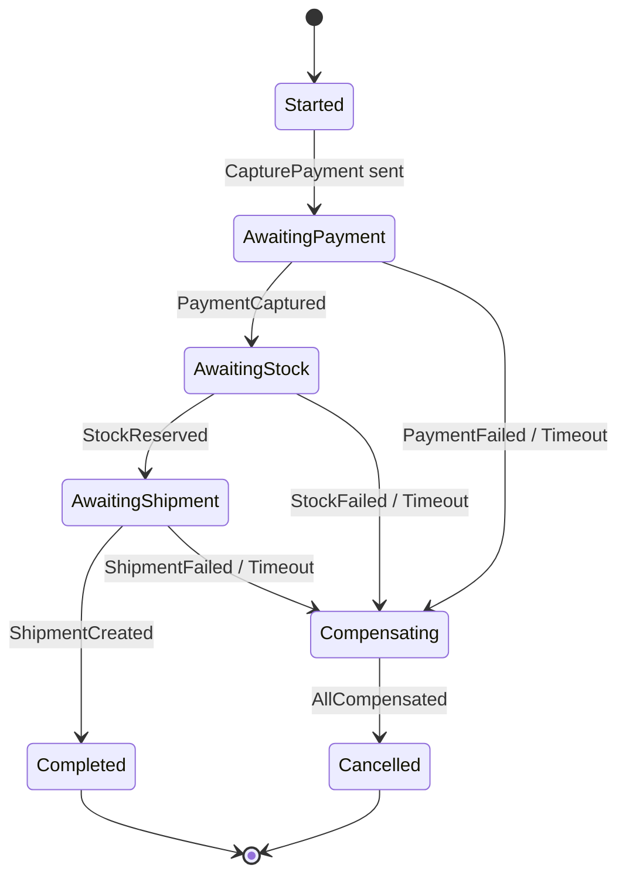

Two implementation disciplines separate a robust process manager from a fragile one.

**Persist the saga state on every transition.** The process manager is itself an aggregate — and everything from Chapter 6 applies. Its state must survive a crash. When the orchestrator restarts, it rehydrates each in-flight saga from its persisted state and resumes exactly where it left off. A process manager that keeps saga state only in memory will, on the first pod restart, orphan every in-flight order. This is not hypothetical; it is the most common saga bug in production.

**Make timeouts first-class states, not afterthoughts.** In a synchronous world, a hung call throws an exception. In a saga, a step that never replies simply... waits, forever, silently. The process manager must set a timer on each pending step. If `PaymentCaptured` does not arrive within the deadline, the timeout is an *event* that transitions the state machine — usually into compensation. Long-running processes live and die by their handling of the reply that never comes.

> **Pro Tip:** Resist the urge to hand-code process managers with nested conditionals and boolean flags (`paymentDone`, `stockDone`). That style rots the instant a fourth step appears. An explicit state machine — a table of (current state, event) → (next state, action) — stays readable at ten states and is directly testable without any infrastructure.

Many teams reach for a workflow engine here — Temporal, AWS Step Functions, Camunda — precisely because these tools provide durable state, timers, and retries out of the box. That is a reasonable choice. But understand what they give you: a managed, persistent state machine. The pattern is the same whether you hand-roll it or buy it.

<details>
<summary>💡 Expert Note</summary>

The prose recommends Temporal, AWS Step Functions, and Camunda as reasonable choices, which is accurate. However, their durability models differ in ways that surface under failure: Temporal persists a full replay-safe event history to a database (Postgres or Cassandra) and reconstructs workflow state by replaying that history — a crash mid-step replays all preceding activities on restart. AWS Step Functions stores execution state in its own managed store but imposes hard limits (25,000 history events per execution) that affect long-running processes spanning weeks. Camunda 8 uses Zeebe's replicated log. Teams that select one of these tools based on developer experience alone, then hit an execution history limit or discover that Temporal requires operating its own database cluster, face expensive migrations. Evaluate the durability model and operational footprint before committing.
</details>

<details>
<summary>💡 Expert Note</summary>

A common anti-pattern when teams adopt workflow engines is encoding business rules inside the orchestrator itself — conditional branches based on customer tier, pricing logic, compliance checks — turning it into a "God Workflow." The orchestrator should issue commands and receive replies; it should contain only control flow (sequence, branching on reply type, timeout). Business rules belong in the services that execute the commands. When the orchestrator grows past a few hundred lines of control logic, it becomes as hard to change as the monolith the saga replaced. The discipline is: if a branch condition requires domain knowledge, it belongs in a service, not in the saga coordinator.
</details>

## CAP Theorem Applied to Event Flows

Everything in this chapter is a consequence of one theorem, so make it explicit. The **CAP theorem** states that a distributed system, when a network **partition** (P) splits it, can preserve either **consistency** (C) — every node sees the same data — or **availability** (A) — every request gets a response — but not both. Partitions are not optional; networks fail. So the real choice is *not* "CA versus something." When the partition happens, you choose C or A.

Distributed transactions and 2PC are the **CP** choice: under a partition, they refuse to proceed to keep data consistent. The order simply fails. Sagas are the **AP** choice: under a partition, each local transaction still commits, the system stays available, and consistency is restored later through the flow of events and compensations. **A saga is, at its core, an architectural bet that availability matters more than instantaneous consistency** — and for most business processes, that bet is correct.

This reframes eventual consistency from a limitation into a deliberate position. You are not settling for weak consistency because sagas cannot do better. You are *choosing* availability, and eventual consistency is the disciplined way to honor that choice while still converging to a correct final state.

**Figure 7.4** — When a network partition occurs, the system must choose between blocking the operation to preserve consistency (CP — the 2PC path) or committing locally to stay available and converging later (AP — the saga path), and this diagram makes explicit that sagas are not a workaround but a deliberate architectural choice with predictable business consequences.

```mermaid
flowchart TD
    A[Cross-Service Business Operation] --> B{Network Partition Detected?}
    B -->|No| N[Proceed Normally]
    B -->|Yes| D{CAP Choice}
    D -->|Choose Consistency - CP| E[Block — Wait for All Participants]
    E --> F[2PC Coordinator Holds Locks]
    F --> G[Operation Fails\nData remains consistent\nBusiness request rejected]
    D -->|Choose Availability - AP| H[Commit Locally per Service]
    H --> I[Each Service Stays Available\nSaga Continues]
    I --> J[Eventual Convergence\nvia Events and Compensations\nBusiness request accepted]
```

One nuance worth internalizing, and it is where senior architects earn their title. CAP is not a property of your whole system; it is a property of each *operation*. Charging a payment might demand CP-like strictness within the payment service's own boundary — a single ACID transaction, no ambiguity about money. Coordinating that payment with inventory and shipping across services is AP — a saga. Mature architectures are not uniformly consistent or uniformly available. They are strongly consistent *inside* each service boundary and eventually consistent *across* boundaries, with sagas as the bridge between the two regimes.

<details>
<summary>⚠️ Critical Note</summary>

The CAP theorem is presented as a complete and current framework for distributed consistency decisions, but its practical limitations are well-established. Eric Brewer himself acknowledged in his 2012 retrospective ("CAP Twelve Years Later: How the 'Rules' Have Changed," IEEE Computer) that the theorem's binary framing obscures more than it reveals. The PACELC theorem (Abadi, 2012) — which extends CAP to address the latency/consistency trade-off that exists *even when there is no partition* — is the more operationally relevant model for architects designing event-driven systems, where the everyday question is not "what happens during a partition" but "what is the latency cost of stronger consistency when the network is healthy." Presenting CAP without this context leads senior architects to use it as a blunt instrument when evaluating system behavior outside failure scenarios, which is the common case.

**Suggested fix:** Add a "Beyond CAP" sidebar noting: (1) CAP's "C" specifically means linearizability, not all consistency models; (2) the PACELC model extends the analysis to the latency/consistency dimension under normal operation; (3) Brewer's 2012 retrospective recommends treating the trade-off as continuous rather than binary. This positions the reader to read vendor documentation accurately.
</details>

## Key Takeaways

- **Distributed ACID transactions do not scale.** Two-phase commit holds locks across the network, blocks on coordinator failure, and multiplies your services' fragility into a single point of failure. Reject it for cross-service business processes.
- **A saga is a sequence of local transactions coordinated by events, reversed by compensation, not rollback.** It accepts eventual consistency to preserve availability and service independence.
- **Choreograph short, stable flows; orchestrate complex or branching ones.** Choreography decouples but hides the process; orchestration centralizes logic and makes the flow visible. Past three or four steps, prefer orchestration.
- **Compensations are new business actions, not technical undos.** Classify every step as compensatable, pivot, or retriable, and order the saga so irreversibility comes last.
- **A process manager is a persistent state machine.** Persist state on every transition and treat timeouts as first-class events, or the first pod restart will orphan your in-flight sagas.
- **Sagas are the AP choice of the CAP theorem.** Strong consistency inside each service boundary, eventual consistency across boundaries, with the saga as the bridge.

## What's Next

Sagas depend on events whose meaning stays stable across services and across time — which raises the problem Chapter 8 confronts head-on: how to evolve event schemas and contracts without breaking the consumers and long-running sagas that depend on them.

<!-- ASSEMBLY COMPLETE
  Chapter: Consistency, Sagas, and Long-Running Processes
  Code blocks resolved: 2 / 2
  Diagrams resolved: 4 / 4
  Expert callouts (inline): 3
  Expert callouts (collapsed): 4
  Critical callouts (inline): 1
  Critical callouts (collapsed): 3
  Unresolved markers: 0
-->


# Chapter 8: Schema Evolution and Event Versioning

## Opening Problem Statement

Chapter 7 left the reader with a system whose truth is spread across services that converge over time through sagas and compensations. Chapter 6 made a heavier promise still: with Event Sourcing, every event is kept forever. That promise now presents its bill. A request-response API can deprecate a field in a quarter and force every caller to upgrade. An event store cannot. An event written in 2021 will be read in 2027, by a consumer written in 2025, running code nobody on the original team remembers. The event is not a transient message; it is a **persisted contract with the future**. So the real question of this chapter is uncomfortable: how does an architect change the shape of a fact that has already happened, is stored millions of times over, and is consumed by teams they have never met? Get this wrong and every deployment becomes a coordinated, cross-team, high-risk event. Get it right and teams evolve their contracts independently, on their own schedule, without a single broken consumer. This chapter is about buying that independence — and about the one policy decision that, if skipped, quietly guarantees the opposite.

## Backward and Forward Compatibility

Every conversation about schema evolution eventually reduces to two words: **compatibility** direction. Confusing them is the most common — and most expensive — mistake in this domain, so define them precisely and never mix them again.

**Backward compatibility** means a *new consumer* can read *old events*. You changed the schema; a consumer running the new schema still understands data written under the old one. This is the direction Event Sourcing demands, because your event store is full of old events that will be replayed forever.

**Forward compatibility** means an *old consumer* can read *new events*. You changed the schema; a consumer still running the old version tolerates data written under the new one, typically by ignoring what it does not recognize. This is the direction that pub/sub integration demands, because you cannot upgrade every consumer at the same instant you upgrade the producer.

**Full compatibility** is both at once. It is the strictest and the safest, and it is the target most mature registries default to.

The practical payoff is a simple rule set for what a change is allowed to do. The safe changes are almost always additive.

**Figure 8.1 — Schema change compatibility decision matrix**

```mermaid
flowchart LR
    subgraph FULL["Full-Safe — Backward AND Forward"]
        F1["Add optional field with default"]
        F2["Widen type — int to long"]
    end

    subgraph BACK["Backward-Safe Only\n(new consumer reads old events)"]
        B1["Remove optional field\n(new schema supplies default)"]
    end

    subgraph FWD["Forward-Safe Only\n(old consumer reads new events)"]
        V1["Add required field — no default\n(old consumer ignores unknown fields)"]
    end

    subgraph UNSAFE["Never Safe — Breaks Both Directions"]
        U1["Rename field\n= remove + add — fails both ways"]
        U2["Narrow type — long to int\n(truncation risk)"]
        U3["Change field meaning\n(semantic breakage)"]
    end

    FULL -->|"Safe to ship anytime"| OK(["Deploy freely"])
    BACK -->|"Roll consumers forward first"| WARN(["Coordinate rollout"])
    FWD -->|"Breaks event replays"| WARN2(["Block for Event Sourcing"])
    UNSAFE -->|"Registry must reject"| BLOCK(["Build fails"])
```

*This diagram classifies common schema changes into four safety groups, making it immediately clear which operations are safe to ship without consumer coordination. Understanding these groupings is the foundation of disciplined schema evolution: only full-safe changes can be deployed at any time without risk.*

Notice the trap hiding in that matrix. Adding a **required** field breaks backward compatibility, because old events simply do not carry it. Removing a field breaks forward compatibility, because old consumers still expect it. And a rename is not one operation — it is a delete plus an add, so it fails on both fronts. The discipline, then, is boring on purpose: prefer optional fields, always supply defaults, and treat "required" as a word you have to justify in a review.

**Listing 8.1 — Safe Avro schema evolution: adding an optional field with a null default**

This example shows two Avro schema versions for an `OrderPlaced` event. Adding a null-defaulted optional field achieves full compatibility: Avro's reader/writer resolution fills in the default for old events (backward), and newer fields absent in the reader schema are simply projected away (forward).

```python
# Schema evolution: safe addition of an optional field with a null default
# Demonstrates both backward and forward compatibility using Avro-style schemas

from typing import Any

# v1 schema: original OrderPlaced event (no coupon support yet)
ORDER_PLACED_V1: dict[str, Any] = {
    "type": "record",
    "name": "OrderPlaced",
    "namespace": "com.example.orders",
    "doc": "An order was placed by a customer.",
    "fields": [
        {"name": "orderId",    "type": "string"},
        {"name": "customerId", "type": "string"},
        {"name": "totalCents", "type": "long"},
    ],
}

# v2 schema: adds optional couponCode as a null-first union (default = null)
ORDER_PLACED_V2: dict[str, Any] = {
    "type": "record",
    "name": "OrderPlaced",
    "namespace": "com.example.orders",
    "doc": "An order was placed by a customer.",
    "fields": [
        {"name": "orderId",    "type": "string"},
        {"name": "customerId", "type": "string"},
        {"name": "totalCents", "type": "long"},
        # null-first union means the declared default (None/null) is valid.
        # Avro requires that the default value matches the first type in the union.
        {
            "name": "couponCode",
            "type": ["null", "string"],  # null-first union
            "default": None,             # Python None serialises as Avro null
            "doc": "Discount coupon applied at checkout, or null if none.",
        },
    ],
}

# --- Compatibility analysis ---
#
# BACKWARD-COMPATIBLE (new consumer reads old v1 event):
#   A v2 consumer deserialising a v1 event finds no couponCode bytes.
#   Avro reader/writer schema resolution fills in the declared default: null.
#   The v2 consumer proceeds without error. ✓
#
# FORWARD-COMPATIBLE (old consumer reads new v2 event):
#   A v1 consumer deserialising a v2 event encounters the couponCode bytes.
#   Avro projection: writer fields absent from the reader schema are skipped.
#   The v1 consumer proceeds without error. ✓
#
# RESULT: FULL compatibility — safe in both directions.


def demonstrate_compatibility() -> None:
    """Simulate reader/writer schema resolution in plain Python dicts."""
    import json

    # v1 event as it exists in the store — no couponCode field
    v1_payload: dict[str, Any] = {
        "orderId": "ord-001",
        "customerId": "cust-42",
        "totalCents": 4999,
    }

    # v2 consumer view: Avro fills in the default for absent fields
    def read_as_v2(payload: dict[str, Any]) -> dict[str, Any]:
        return {**{"couponCode": None}, **payload}  # default applied if key missing

    # v1 consumer view: extra fields in a v2 payload are projected away
    v1_field_names = {f["name"] for f in ORDER_PLACED_V1["fields"]}

    def read_as_v1(payload: dict[str, Any]) -> dict[str, Any]:
        return {k: v for k, v in payload.items() if k in v1_field_names}

    # v2 event as a newer producer would write it
    v2_payload: dict[str, Any] = {
        "orderId": "ord-002",
        "customerId": "cust-99",
        "totalCents": 2500,
        "couponCode": "SAVE10",
    }

    print("v2 consumer reads v1 event:", json.dumps(read_as_v2(v1_payload)))
    print("v1 consumer reads v2 event:", json.dumps(read_as_v1(v2_payload)))


if __name__ == "__main__":
    demonstrate_compatibility()
```

One more distinction that senior engineers routinely blur: compatibility is a property of the *schema pair*, not of the event. A single change can be backward-compatible and forward-incompatible at the same time. Always ask "compatible in which direction, for whom?" before approving anything.

> 💡 **Expert Note:** The prose states that full compatibility "is the target most mature registries default to." This is inaccurate and should be corrected before publication. Confluent Schema Registry — the de facto industry standard — defaults to **BACKWARD** compatibility, not FULL. AWS Glue Schema Registry also defaults to BACKWARD_ALL. FULL compatibility is an opt-in choice, not a default, precisely because it prohibits field removal and imposes constraints many teams cannot meet early in a product's lifecycle. Shipping the claim as written will cause practitioners to mis-configure registries, then be confused when the real defaults contradict the book.

<details>
<summary>💡 Expert Note</summary>

The prose covers what changes are safe and unsafe, but does not name the **Tolerant Reader** pattern — the consumer-side discipline that is the practical implementation of forward compatibility. A tolerant reader deserializes only the fields it explicitly needs and discards everything else without error, rather than failing on unrecognized or missing fields. This is the complementary discipline to additive-only producer changes: the producer adds fields safely only if consumers are written to tolerate them. In practice, many deserialization frameworks (especially Jackson with `FAIL_ON_UNKNOWN_PROPERTIES` defaulting to false in recent versions, or Avro's schema projection) implement this automatically, but teams using strict validation libraries or hand-written parsers must enforce it explicitly in code review. Naming the pattern gives teams a vocabulary to use in standards documents and review checklists.
</details>

> ⚠️ **Critical Note:** The prose states that FULL compatibility "is the target most mature registries default to." This is factually incorrect. Confluent Schema Registry — the dominant registry in Kafka-based systems and the de facto reference implementation — defaults to `BACKWARD`, not `FULL`. AWS Glue Schema Registry also defaults to `BACKWARD_ALL`. No widely deployed registry defaults to `FULL` out of the box. An architect who reads this claim and then opens their registry's admin UI will immediately encounter a contradiction, which undermines trust in the entire chapter. Replace the sentence with the accurate statement: most mature registries default to `BACKWARD` (Confluent) or `BACKWARD_ALL` (AWS Glue). Clarify that `FULL` must be explicitly configured and explain the trade-off: it prevents field removal, which causes schema bloat over time but eliminates an entire class of consumer breakage.

## Schema Registry and Formats (Avro, JSON Schema, Protobuf)

Rules are worthless if nobody enforces them. A **schema registry** is the component that stores the canonical schema for each event type, assigns it a version, and — this is the part that matters — *refuses* to register a new version that violates the configured compatibility rule. It turns compatibility from a code-review hope into a build-time gate.

The mechanics are straightforward. The producer registers a schema and gets back a numeric ID. It publishes events tagged with that ID rather than the full schema. The consumer reads the ID, fetches the matching schema from the registry (and caches it), and deserializes. Two benefits fall out immediately: events on the wire are small, and no consumer can ever guess the schema — it always resolves the exact one the producer used.

**Figure 8.2 — Schema registry interaction sequence**

```mermaid
sequenceDiagram
    participant P as Producer
    participant SR as Schema Registry
    participant BR as Broker
    participant C as Consumer

    P->>SR: Submit candidate schema
    alt Schema is compatible
        SR-->>P: Return schema ID
        P->>BR: Publish event (schema ID + binary payload)
        C->>BR: Read message
        C->>SR: Fetch schema by ID (cache miss)
        SR-->>C: Return schema definition
        C->>C: Deserialize event using schema
    else Schema violates compatibility rule
        SR-->>P: Reject — compatibility violation
        note over P: Build fails on producer side
    end
```

*This sequence diagram shows how a schema registry converts a code-review policy into a hard build-time gate: incompatible schemas are rejected before a single event reaches the broker. The ID-based wire format is also shown, illustrating how consumers always resolve the exact schema the producer used — eliminating guesswork in deserialization.*

The registry is format-neutral in concept, but the choice of serialization format is itself a design decision with real consequences. The three that dominate cloud-native systems trade off differently.

| Format | Schema location | Evolution model | Human-readable | Best fit |
|---|---|---|---|---|
| **Avro** | External, resolved by ID | Reader/writer schema resolution — strongest evolution story | No (binary) | Kafka event streams, event stores |
| **Protobuf** | Compiled into code (field numbers) | Field-number based; add/reserve, never reuse numbers | No (binary) | gRPC, high-throughput internal contracts |
| **JSON Schema** | External or inline | Additive with defaults; validation-centric | Yes (text) | Public/partner events, debuggability first |

**Avro** deserves the architect's attention in event-sourced systems because of one feature: it deserializes using *both* the writer's schema (what produced the event) and the reader's schema (what the consumer expects), reconciling the difference automatically. That reader/writer split is exactly the backward-compatibility machinery Event Sourcing needs, built into the format.

**Protobuf** encodes fields by number, not name, so renaming a field costs nothing on the wire — but reusing a retired field number is catastrophic, silently mapping old bytes to a new meaning. The rule is absolute: **reserve** deleted field numbers, never recycle them.

**JSON Schema** buys you readability and painless debugging at the cost of size and weaker guarantees. For events that cross a company boundary to a partner who will inspect them by eye, that trade is often correct.

There is no universal winner. Streams internal to your platform lean Avro or Protobuf; contracts you hand to outsiders lean JSON. What is non-negotiable is that *some* registry enforces *some* policy.

<details>
<summary>💡 Expert Note</summary>

The prose explains that producers tag events with a schema ID, but omits the wire-format detail that makes this interoperable in practice. The Confluent wire format — now a de facto standard adopted by AWS MSK, Confluent Cloud, and most Kafka-adjacent tooling — is: `0x00` (magic byte) + 4-byte big-endian schema ID + serialized payload. Any non-Kafka consumer (an HTTP webhook bridge, a CDC pipeline, a legacy Java consumer) must understand this framing before it can even begin deserialization. Teams that treat the schema ID as an internal detail discover this the hard way when they onboard their first external or polyglot consumer. Architects should document this wire contract explicitly and test deserialization from at least one non-JVM client before go-live.
</details>

<details>
<summary>💡 Expert Note</summary>

The schema registry is mentioned as a build-time gate but its operational risk as a runtime dependency is not addressed. In production, every consumer performs a cache-miss lookup to the registry on first contact with a new schema ID. If the registry is unavailable, a consumer that has not yet cached that schema will fail to deserialize. The standard mitigation is a **local on-disk schema cache** that survives registry downtime — Confluent's Java client supports this via `SchemaRegistryClient` cache configuration, but it is not on by default. Teams that deploy the registry as a single instance without HA, or that do not seed the local cache before deploying consumers, treat a routine registry restart as a production incident. Treat the registry with the same availability SLA as the broker itself.
</details>

<details>
<summary>⚠️ Critical Note</summary>

The Protobuf section states that "renaming a field costs nothing on the wire." While true at the binary encoding level (fields are keyed by number, not name), it is misleading in practice for the target audience. Renaming a Protobuf field changes every generated client API — every service that imports the `.proto` file must recompile and update its call sites. For a shared internal contract with many consumers, a rename triggers a coordinated rollout of generated code across all consumers, which is exactly the coupling problem the chapter aims to avoid. Presenting this as "costs nothing" understates the operational impact. Qualify the statement: "renaming costs nothing on the *wire format*, but every consumer's generated code changes and must be recompiled and deployed." Add a note that this makes renaming a logistical concern even when it is wire-safe, particularly for widely shared contracts.
</details>

## Upcasting and Versioning of Persisted Events

Compatibility rules keep you safe as long as every change is additive. Reality is not that kind. Eventually a business concept genuinely changes shape — a single `name` field must become `firstName` and `lastName`, or an amount stored as a float must become an integer of minor units. No additive rule covers this, and you cannot rewrite history: the old events are immutable facts, already persisted, possibly by the millions.

The answer is **upcasting**: transforming an old event into the current schema *at read time*, in memory, on its way from the store to the application. The stored bytes never change. A component in the deserialization pipeline detects the old version and applies a function that maps it forward to the new shape. Your domain logic only ever sees the latest version and stays blissfully unaware that five historical formats exist beneath it.

**Listing 8.2 — Upcaster pipeline: promoting versioned events to the current schema at read time**

This example implements a versioned upcaster pipeline as a decorator-based registry. Each upcaster promotes exactly one version forward; the pipeline chains them automatically. Stored bytes are never mutated — transformation happens at read time, in memory. The domain handler is intentionally written knowing only `CustomerRegisteredV2`.

```python
# Upcaster pipeline: promote persisted events to the current schema at read time.
# Stored bytes are never modified; the upgrade is purely in-memory on the read path.
# Time complexity: O(n) per event, where n = number of version steps required.

from __future__ import annotations

import dataclasses
from collections.abc import Callable
from typing import Any

UpcasterKey = tuple[str, int]          # (event_type, from_version)
UpcasterFn  = Callable[[dict[str, Any]], dict[str, Any]]


class UpcasterPipeline:
    """Registry and executor of upcaster functions keyed by (event_type, from_version).

    Each registered upcaster promotes one version forward. The pipeline walks
    the chain until no further upcaster is registered for the current version.
    """

    def __init__(self) -> None:
        self._registry: dict[UpcasterKey, UpcasterFn] = {}

    def register(
        self, event_type: str, from_version: int
    ) -> Callable[[UpcasterFn], UpcasterFn]:
        """Decorator: register a function as the upcaster for (event_type, from_version)."""
        def decorator(fn: UpcasterFn) -> UpcasterFn:
            self._registry[(event_type, from_version)] = fn
            return fn
        return decorator

    def upcast(self, raw: dict[str, Any]) -> dict[str, Any]:
        """Walk the upcaster chain until the payload reaches the latest version."""
        payload = dict(raw)  # shallow copy — original dict (stored bytes) is untouched
        event_type: str = payload["event_type"]

        while (key := (event_type, payload["version"])) in self._registry:
            payload = self._registry[key](payload)

        return payload


# Singleton pipeline shared across the read path
pipeline = UpcasterPipeline()


# ── Upcaster: CustomerRegistered v1 → v2 ──────────────────────────────────────
# Business change: the single denormalised fullName field was split into
# firstName and lastName to support proper sorting and personalisation.

@pipeline.register("CustomerRegistered", from_version=1)
def upcast_customer_registered_v1_to_v2(payload: dict[str, Any]) -> dict[str, Any]:
    full_name: str = payload["full_name"]
    first, _, last = full_name.partition(" ")   # partition on first space only
    return {
        "event_type":  payload["event_type"],
        "version":     2,                        # bumped — v2 upcaster can now run if needed
        "customer_id": payload["customer_id"],
        "first_name":  first,
        "last_name":   last or "",
        # full_name is intentionally absent — it no longer exists in v2
    }


# ── Current domain schema ──────────────────────────────────────────────────────

@dataclasses.dataclass(frozen=True)
class CustomerRegisteredV2:
    event_type:  str
    version:     int
    customer_id: str
    first_name:  str
    last_name:   str


# ── Domain handler ─────────────────────────────────────────────────────────────
# This handler knows nothing about v1. It only works with CustomerRegisteredV2.

def handle_customer_registered(event: CustomerRegisteredV2) -> None:
    print(
        f"[handler] Welcome, {event.first_name} {event.last_name}!"
        f" (customer_id={event.customer_id}, schema_version={event.version})"
    )


# ── Read-path orchestration ────────────────────────────────────────────────────

def load_and_dispatch(raw: dict[str, Any]) -> None:
    """Read a stored event payload, upcast transparently, dispatch to handler."""
    current = pipeline.upcast(raw)          # v1 is promoted; v2+ passes through
    event = CustomerRegisteredV2(**current)
    handle_customer_registered(event)


if __name__ == "__main__":
    # Simulate a v1 event written to the event store years ago
    stored_v1: dict[str, Any] = {
        "event_type":  "CustomerRegistered",
        "version":     1,
        "customer_id": "cust-007",
        "full_name":   "Ada Lovelace",     # old single-field schema
    }

    # Simulate a v2 event written after the schema change
    stored_v2: dict[str, Any] = {
        "event_type":  "CustomerRegistered",
        "version":     2,
        "customer_id": "cust-008",
        "first_name":  "Grace",
        "last_name":   "Hopper",
    }

    load_and_dispatch(stored_v1)  # upcasted v1 → v2 transparently
    load_and_dispatch(stored_v2)  # already current; passes through unchanged
```

The upcaster chain is the pattern that scales this. Each upcaster promotes exactly one version forward — v1→v2, v2→v3 — and the pipeline runs them in sequence. A v1 event on disk passes through both upcasters and arrives as v3. This keeps every transformation small, independently testable, and honest about exactly which change it represents.

**Figure 8.3 — Upcaster pipeline flowchart**

```mermaid
flowchart TD
    STORE["Event Store\n(immutable — bytes never changed)"]
    STORE -->|read raw bytes| A["Stored Event + Version Tag"]
    A --> VER{Check version}

    VER -->|v1| U1["Upcaster v1 → v2\nsplit fullName into firstName + lastName"]
    VER -->|v2| U2["Upcaster v2 → v3\nconvert amount float to integer minor units"]
    VER -->|v3| PT["Pass Through\nno transformation needed"]

    U1 --> U2
    U2 --> CURR["Current Schema Event — v3"]
    PT --> CURR

    CURR --> DH["Domain Handler\n(sees only v3 — always)"]
```

*This flowchart illustrates how an upcaster chain promotes any historical event version to the current schema at read time, without ever touching the stored bytes. Each upcaster transforms exactly one version step, keeping individual transformations small, testable, and independently reasoned about — while the domain handler remains unaware that multiple historical formats exist.*

Two disciplines make upcasting sustainable rather than a growing tax. First, **every event carries an explicit version number** in its metadata from day one — retrofitting versioning onto an unversioned store is painful, so pay this cost up front even when v1 is all you have. Second, upcasting is not the *only* option for large migrations. When an upcaster chain grows unwieldy, you can **rewrite the stream** into a new one under the new schema (a "copy-and-transform" migration), leaving the old stream as an immutable archive. Upcasting is cheaper day to day; stream rewriting is cleaner long-term. Most systems use both, and choosing between them is a genuine architectural judgment, not a default.

Resist the temptation to "just fix the data" with an in-place update to the store. That destroys the one property — an immutable, auditable history — that justified Event Sourcing in the first place.

<details>
<summary>💡 Expert Note</summary>

At production scale, an upcaster chain interacts dangerously with Event Sourcing aggregate reconstruction. Replaying a stream of 500k events through even two upcasters per event adds meaningful CPU and wall-clock time during cold restarts or aggregate rebuilds from scratch. The standard mitigation — **aggregate snapshots** — must be co-designed with the upcasting strategy: a snapshot stores a fully-upcasted, current-version aggregate state, so replays only process events *since* the last snapshot. If snapshotting is added as an afterthought after the upcaster chain is already in place, teams discover that old snapshots may themselves need versioning and upcasting, creating a recursive problem. Both versioning and snapshotting should be designed together from the start, not sequentially.
</details>

<details>
<summary>⚠️ Critical Note</summary>

The upcaster chain pattern is presented entirely in the happy path. There is no discussion of what happens when an upcaster throws an exception or produces an output that fails downstream validation. In an event-sourced system, a defective upcaster does not just fail one message — it renders the entire aggregate history unreadable, blocking all command processing for that aggregate until the bug is fixed and redeployed. This is one of the most operationally dangerous failure modes in event-sourced systems and is completely absent from the prose. Upcasters must be tested against a corpus of real historical events before deployment; a failing upcaster should surface a clear error with the stored event payload and version, not silently corrupt state; consider wrapping the pipeline in a fallback that surfaces the raw event for triage rather than crashing the read side entirely.
</details>

## Contracts, Consumer-Driven Contracts, and Governance

Everything so far is mechanism. The hardest part of schema evolution is not technical; it is organizational. An event that crosses a bounded context (Chapter 2 framed events as owned contracts) is a promise from a producing team to consuming teams that may sit in other departments, other time zones, other reporting lines. The registry enforces syntactic compatibility. It cannot tell you *who is actually consuming what*, and therefore cannot tell you whether a technically-compatible change is *semantically* safe to ship.

This is where **consumer-driven contracts** (CDC) earn their place. The idea inverts the usual direction of authority. Instead of the producer declaring "here is my schema, adapt to it," each consumer publishes a contract stating exactly the fields and shapes *it* depends on. The producer's build then verifies its schema against the union of all consumer contracts. If a proposed change breaks any consumer's stated expectations, the producer's pipeline fails — before deployment, on the producer's side, where the change originated.

**Figure 8.4 — Consumer-driven contract workflow**

```mermaid
flowchart TD
    CA["Consumer A\npublishes contract\n(expected fields + types)"]
    CB["Consumer B\npublishes contract\n(expected fields + types)"]

    CA -->|upload| REPO["Shared Contract Repository\n(contract broker)"]
    CB -->|upload| REPO

    REPO -->|pull all contracts| CI["Producer CI Pipeline\n(candidate schema)"]

    CI --> CHK{Candidate schema\nsatisfies all contracts?}
    CHK -->|Yes — all consumers pass| PASS["Build Passes\nProduce deploys safely"]
    CHK -->|No — contract violated| FAIL["Build Fails\nProducer must fix schema\nbefore deployment"]

    subgraph CONTRAST["Direction of Authority"]
        PD["Producer-driven\nschema pushed down to consumers"]
        CDC["Consumer-driven\ncontracts pulled up by producer"]
    end
```

*This diagram shows how consumer-driven contracts invert the authority relationship: instead of the producer declaring a schema and pushing it down, each consumer states what it needs and the producer's own CI pipeline is responsible for satisfying all of them. This is the mechanism that catches semantically breaking changes that a schema registry — which has no knowledge of actual consumers — cannot detect.*

The distinction between a schema registry and consumer-driven contracts is worth stating plainly, because teams often assume one replaces the other.

| Concern | Schema registry | Consumer-driven contracts |
|---|---|---|
| Question answered | "Is this change structurally compatible?" | "Does any real consumer actually break?" |
| Knows about consumers | No | Yes, explicitly |
| Enforcement point | Schema registration | Producer CI build |
| Catches semantic misuse | No | Partially (only stated expectations) |

They are complementary layers, not competitors. The registry is the fast, coarse gate; CDC is the slower, consumer-aware one.

Around both sits **governance**: the policies that make evolution predictable across an organization. Effective governance is lighter than teams fear and consists of a few durable rules. Assign every event type a single owning team. Mandate an explicit compatibility mode per event stream, registered and visible. Require deprecation to be announced with a timeline and a metric proving the old version is no longer read before it is retired. Version in metadata, never by mutating payloads. Governance is not a committee that slows teams down; it is the small set of agreements that let teams move *without* coordinating every release.

<details>
<summary>💡 Expert Note</summary>

The prose describes consumer-driven contracts conceptually but does not name the tooling, which matters for practitioners. **Pact** (pact.io) is the dominant open-source implementation: consumers write Pact files expressing the interactions they depend on, a **Pact Broker** (or PactFlow for SaaS) stores them, and the producer's CI pipeline runs `can-i-deploy` against the broker before any release. The critical production discipline that the prose does not mention is **pending pacts and WIP pacts** — Pact's mechanism for introducing new consumer contracts without immediately blocking the producer's build during the initial negotiation period. Without this mechanism, onboarding a new consumer becomes a coordinated freeze across both teams. Senior architects evaluating CDC should specifically assess whether their chosen tool supports this graduated rollout mode.
</details>

<details>
<summary>💡 Expert Note</summary>

The prose recommends "metric-backed deprecation" before retiring old schema versions, which is the right principle, but the measurement gap in practice is worth naming explicitly. Schema registry metrics tell you whether a schema *version* is being registered or fetched — they do not tell you whether a specific *field* within that version is being used by downstream consumers. A consumer might fetch schema v3 while only reading the `orderId` field and ignoring `couponCode`. If `couponCode` is the field you want to remove, fetch counts give you false confidence. The safest metric is **consumer-side field-level telemetry**: instrumented deserialization that logs which fields are accessed per consumer group. Few teams implement this, but those who have gone through a painful field removal incident almost always add it afterward.
</details>

<details>
<summary>⚠️ Critical Note</summary>

The consumer-driven contracts (CDC) section presents the pattern as a reliable safety net with little acknowledgment of its primary organizational failure mode: CDC only works when every consumer actively maintains and publishes its contract. In practice, getting 100% participation is difficult — teams deprioritize contract updates, new consumers are onboarded without contracts, and legacy consumers are forgotten. A producer CI build that passes against the union of *published* contracts can still break an unpublished consumer. The prose implies CDC answers "does any real consumer actually break?" but the honest answer is "does any real consumer *that published a contract* break?" — a weaker guarantee than the table suggests. The guarantee is bounded by participation — a consuming team that never publishes a contract gets no protection. CDC must be paired with a registry of known consumers and an onboarding checklist that makes contract publication mandatory.
</details>

## The Missing-Policy Pitfall

The single most damaging mistake in this entire chapter is not a bad schema change. It is the *absence of a declared compatibility policy at all*. This deserves its own section because it fails silently and is nearly always discovered too late.

A system without a policy does not announce the problem. Everything works — right up until the first genuinely breaking change ships, a consumer three teams away deserializes garbage, and a production incident traces back to a field someone "cleaned up" months earlier. Because there was no gate, nothing stopped it. Because events are persisted, the poison is now in the store permanently, and every replay re-triggers it.

The fix is embarrassingly cheap relative to the damage it prevents: **choose a default compatibility mode before your first event ships**, and make the registry enforce it. `BACKWARD` is the sane default for most event-sourced systems; `FULL` if you can afford the discipline. That one decision, made early, converts an entire class of cross-team production incidents into build-time failures on the desk of the person who caused them.

> 💡 **Expert Note:** The prose correctly identifies the absence of a declared policy as the most damaging mistake, but does not distinguish between two failure modes that require different remediation. The first is a greenfield team with no registry at all — the fix is straightforward: stand up a registry, pick BACKWARD, enforce it. The second, more painful case is a running system where events have been shipped for months without a registry, and a registry is now being retrofitted. In this case, the initial schema registration must be treated as a **compatibility baseline** audit, not a simple import: every existing schema must be manually reviewed before being registered, because the registry's first compatibility check will be against whatever you declare as v1. Teams that bulk-import existing schemas without review often discover that their "stable" schemas already contain patterns (undocumented required fields, implicit type coercions) that would fail a BACKWARD check, requiring immediate remediation of live consumers before the registry can be enforced.

## Key Takeaways

- **Compatibility has a direction.** Backward = new consumer reads old events (Event Sourcing needs this); forward = old consumer reads new events (pub/sub needs this); full = both. Always ask "compatible in which direction, for whom?"
- **Additive-only is the safe path.** Add optional fields with defaults; never rename in place, add required fields without defaults, or reuse a retired Protobuf field number.
- **A schema registry turns policy into a build-time gate.** It rejects incompatible schemas before they ship; Avro's reader/writer resolution makes it especially strong for event stores.
- **Upcast, don't mutate.** Transform old persisted events to the current schema at read time through a versioned upcaster chain; version every event in metadata from day one.
- **The registry answers "is it structurally compatible?"; consumer-driven contracts answer "does any real consumer break?"** You need both, plus lightweight governance: one owner per event type, an explicit compatibility mode, and metric-backed deprecation.
- **No compatibility policy is the pitfall.** Choose a default mode (BACKWARD or FULL) and enforce it before your first event ships.

## What's Next

With contracts that can evolve safely in place, Chapter 9 turns to the operational reality of running these systems — observing, tracing, and debugging event flows whose control flow is implicit and spread across decoupled services.

<!-- ASSEMBLY COMPLETE
  Chapter: Schema Evolution and Event Versioning
  Code blocks resolved: 2 / 2
  Diagrams resolved: 4 / 4
  Expert callouts (inline): 2
  Expert callouts (collapsed): 6
  Critical callouts (inline): 1
  Critical callouts (collapsed): 3
  Unresolved markers: 0
-->


# Chapter 9: Observability, Debugging, and Operations

## Opening Problem Statement

Chapter 8 gave you the discipline to evolve event schemas without breaking consumers, and it added versioning metadata to every event. Now a different problem appears in production. A customer complains that an order was charged twice but the confirmation email never arrived. In a synchronous system, you would open one stack trace and follow the call chain from top to bottom. In an event-driven system, there is no stack trace. The payment service published a fact. Three consumers reacted independently. One of them published another fact. The email service was supposed to be listening, but nothing happened. Where do you even start?

This is the central operational pain of Event-Driven Architecture: **the control flow is implicit**. No single service knows the whole story, because decoupling — the very property you paid for in Chapter 1 — hides the causal chain. This chapter gives you the tools to make that hidden chain visible again. You will learn how to trace a request across decoupled services, how to measure whether consumers are keeping up, how to debug flows that have no call stack, and how to operate the failure machinery — dead-letter queues and reprocessing — without making things worse. These are not optional extras. In a distributed system, observability is a first-class architectural requirement, not something you bolt on after an incident.

## Distributed Tracing and Correlation/Causation IDs

Let's start with the single most important idea in this chapter. To reconstruct a story from decoupled events, you must carry identity through the entire flow. Two IDs do this job, and they are not the same thing.

A **correlation ID** is a single identifier shared by every event that belongs to the same logical business transaction. It is generated once, at the edge — when the order is placed — and copied unchanged into every event that results, no matter how many services the flow touches. Filtering your logs by one correlation ID gives you the complete story of that one order.

A **causation ID** answers a narrower question: *which specific event directly caused this one?* Each event's causation ID is the message ID of its immediate parent. Where the correlation ID groups the whole tree, the causation ID rebuilds the exact parent-child edges of that tree. With both, you can reconstruct not just *what* happened but *in what causal order*.

The rule is simple and absolute: **every consumer that produces a new event copies the correlation ID and sets the causation ID to the parent event's ID.** Miss this in one consumer and the chain breaks there.

**Message Envelope with Traceability Fields and Child-Event Construction Pattern**

```python
# Message envelope with traceability fields and child-event construction pattern
from __future__ import annotations

import uuid
from dataclasses import dataclass, field
from datetime import datetime, timezone


@dataclass(frozen=True)
class EventEnvelope:
    """Immutable wrapper carried by every event through the system."""
    message_id: str                     # unique ID for this specific event
    event_type: str                     # e.g. "order.placed", "payment.captured"
    event_version: str                  # schema version, e.g. "1.0"
    payload: dict                       # domain-specific body
    correlation_id: str                 # shared by all events in one business transaction
    causation_id: str                   # message_id of the direct parent event
    timestamp: str = field(
        default_factory=lambda: datetime.now(timezone.utc).isoformat()
    )

    @staticmethod
    def create_root(event_type: str, event_version: str, payload: dict) -> "EventEnvelope":
        """Create the first event in a flow; its own ID seeds the correlation chain."""
        new_id = str(uuid.uuid4())
        return EventEnvelope(
            message_id=new_id,
            event_type=event_type,
            event_version=event_version,
            payload=payload,
            correlation_id=new_id,   # root event is its own correlation anchor
            causation_id=new_id,     # no parent, so self-reference by convention
        )

    def spawn_child(self, event_type: str, event_version: str, payload: dict) -> "EventEnvelope":
        """Produce a child event: copy correlation_id, set causation_id to this event's ID."""
        return EventEnvelope(
            message_id=str(uuid.uuid4()),
            event_type=event_type,
            event_version=event_version,
            payload=payload,
            correlation_id=self.correlation_id,  # unchanged — same business transaction
            causation_id=self.message_id,        # direct parent is this event
        )


# --- Consumer handler example ---

def handle_order_placed(parent: EventEnvelope, publisher) -> None:
    """
    Payment consumer: receives OrderPlaced, performs capture, emits PaymentCaptured.
    Demonstrates the mandatory ID-propagation rule.
    """
    order_id = parent.payload["order_id"]
    amount = parent.payload["amount"]

    # ... domain logic: charge the card ...
    charge_result = {"charge_id": "ch_abc123", "status": "captured"}

    # Construct child event — correlation_id copied, causation_id = parent.message_id
    child_event = parent.spawn_child(
        event_type="payment.captured",
        event_version="1.0",
        payload={
            "order_id": order_id,
            "amount": amount,
            "charge_id": charge_result["charge_id"],
        },
    )

    publisher.publish(topic="payments", event=child_event)
```

These IDs are what make **distributed tracing** possible. Distributed tracing is the practice of following one request as it crosses service boundaries, representing the journey as a **trace** (the whole request) composed of **spans** (individual units of work). The open standard is **OpenTelemetry**, which propagates a trace context through message headers. The important subtlety for EDA: in a synchronous call the parent span is still open when the child runs, but with asynchronous messaging the parent has already returned. Your instrumentation must therefore link spans through **span links** rather than simple parent-child nesting, so the broker hop is preserved in the trace.

**Correlation and Causation ID Flow with Distributed Trace Spans**

```mermaid
sequenceDiagram
    participant GW as API Gateway
    participant BR as Broker
    participant PAY as Payment Service
    participant EMAIL as Email Service

    GW->>BR: OrderPlaced<br/>msg_id=M1, corr=C1, cause=—
    Note over GW,BR: Trace Span S1

    BR->>PAY: OrderPlaced<br/>msg_id=M1, corr=C1, cause=—
    Note over BR,PAY: Span S2 (linked to S1)

    PAY->>BR: PaymentCaptured<br/>msg_id=M2, corr=C1, cause=M1
    Note over PAY,BR: Trace Span S3

    BR->>EMAIL: PaymentCaptured<br/>msg_id=M2, corr=C1, cause=M1
    Note over BR,EMAIL: Span S4 (linked to S3)

    EMAIL-->>BR: Ack (EmailSent)
    Note over EMAIL,BR: Span S4 ends
```

*This diagram shows how a single correlation ID threads through every service in an asynchronous flow while causation IDs preserve the parent-child relationship at each hop. It illustrates why both IDs are necessary: correlation groups the whole transaction, and causation rebuilds the exact causal order, enabling distributed tracing across broker hops via span links.*

Pro Tip: generate the correlation ID as early as possible — ideally at the API gateway or the first synchronous entry point — and reject any internal event that arrives without one. An event with no correlation ID is an event you cannot debug later.

> 💡 **Expert Note:** The prose correctly recommends linking async spans through OpenTelemetry span links rather than parent-child nesting, but in practice most observability backends — Jaeger, Zipkin, and even some Datadog agent configurations — have partial or inconsistent rendering support for span links as of their current stable releases. Teams that rely on span links for fan-out flows often discover their traces render as disconnected fragments in the UI, making fan-out causality invisible. The field workaround is to propagate the W3C `traceparent` header (defined in the W3C Trace Context Recommendation, https://www.w3.org/TR/trace-context/) through every message header and treat async hops as FOLLOWS_FROM relationships, then cross-reference by correlation ID in log queries until backend support matures. Choose your tracing backend knowing this limitation before you design your instrumentation contract.

<details>
<summary>💡 Expert Note</summary>
A common mistake at the API gateway layer is to reuse the inbound HTTP `X-Request-ID` or `X-B3-TraceId` header directly as the correlation ID. These headers are generated by load balancers and proxies in formats that vary across vendors — hex strings, short IDs, or vendor-specific encoding — and downstream log aggregation queries often break when they encounter non-UUID values mixed with UUID correlation IDs from internal services. Best practice: always generate a fresh UUID v4 at the domain boundary (the first service that owns the business transaction) and use it exclusively as the correlation ID. Store the originating HTTP trace ID as a separate `http_trace_id` field for HTTP-level debugging, but never conflate the two.
</details>

<details>
<summary>⚠️ Critical Note</summary>
The prose states "The rule is simple and absolute: every consumer that produces a new event copies the correlation ID and sets the causation ID to the parent event's ID." This collapses entirely in fan-in scenarios, which are common in real EDA systems. When a saga or aggregation consumer emits an output event only after receiving two or more independent upstream events (e.g., both a `PaymentCaptured` and an `InventoryReserved` must arrive before `OrderFulfilled` is published), there is no single parent event to set as the causation ID. Picking one arbitrarily loses half the causal graph; the other parent simply disappears from the trace. The rule is not absolute — it is only correct for fan-out (one parent, many children) topologies. In fan-in patterns such as sagas, carry all contributing event IDs in a `causation_ids` list, or link multiple spans via OpenTelemetry span links.
</details>

<details>
<summary>⚠️ Critical Note</summary>
The Pro Tip advises to "reject any internal event that arrives without [a correlation ID]." Applied literally, this rule breaks an entire class of legitimate events: those produced by scheduled jobs, cron-triggered pipelines, infrastructure automation, database CDC captures, and data-migration scripts. None of these originate from an edge request, so they have no natural correlation ID to inherit. Rejecting them halts the consumers that depend on them without producing any actionable error for the operator. The qualified rule: synthetic events (scheduled, system-generated, or CDC-sourced) should generate their own root correlation ID at the point of emission, documented as a system-originated transaction. The rejection rule applies to events that claim to be part of an existing business transaction but carry no ID — not to all events universally.
</details>

## Lag, Throughput, and Consumer Health Metrics

Tracing tells you the story of one request. Metrics tell you the health of the whole system. In event-driven systems, the single most valuable metric is **consumer lag**.

**Consumer lag** is the gap between the latest offset a producer has written to a partition and the latest offset a consumer group has processed. In a log-based broker like Kafka, it is measured in messages. In a queue-based broker, the equivalent signal is queue depth or the age of the oldest unacknowledged message. Lag is the distributed-systems equivalent of a growing to-do pile: a small, stable pile is fine, but a pile that grows without bound means the consumer will never catch up.

Watch how lag behaves over time, because the trend matters more than the value.

| Lag pattern | What it means | Action |
|---|---|---|
| Low and flat | Consumer keeps pace with producers | Healthy; no action |
| Sawtooth (rises, drains) | Bursty traffic, consumer recovers | Normal; verify peak drains fully |
| Steadily climbing | Consumer is slower than producer | Scale out consumers or optimize handler |
| Flat but high, not draining | Consumer likely stuck or crash-looping | Investigate poison message immediately |

Lag alone is not enough. Pair it with **throughput** (events processed per second) and **processing latency** (time from event receipt to completion). Together they distinguish two very different failures: rising lag with high throughput means you are simply overwhelmed by volume, while rising lag with *zero* throughput means the consumer has stopped dead — often stuck on a single message it can neither process nor release.

**Consumer Lag Diagnosis Decision Tree**

```mermaid
flowchart TD
    A[Rising Consumer Lag Detected] --> B{Throughput near zero?}

    B -->|Yes - consumer stuck| C[Suspect poison message]
    C --> D[Inspect DLQ for failed messages]
    D --> E[Apply bounded retries + DLQ routing]
    E --> F[Partition unblocked — lag resumes draining]

    B -->|No - throughput is high| G{Does lag drain during off-peak?}
    G -->|Yes - bursty traffic| H[Normal burst pattern]
    H --> I[Verify peak lag fully drains]
    G -->|No - lag keeps climbing| J[Consumer slower than producer]
    J --> K{Handler optimization feasible?}
    K -->|Yes| L[Optimize consumer handler]
    K -->|No| M[Scale out consumer instances]
```

*This decision tree gives on-call engineers a structured path from a rising-lag alert to a concrete action, distinguishing the two fundamentally different failure modes — a consumer that is overwhelmed versus one that is completely stuck — because the remediation for each is different and applying the wrong fix wastes critical incident time.*

Alert on lag *trend and age*, not on a fixed absolute number. A threshold of "10,000 messages" is meaningless without knowing the throughput; ten thousand messages at a hundred thousand per second is a tenth of a second of delay, but the same number at ten per second is a quarter-hour outage. Alerting on the age of the oldest unprocessed message expresses the business impact directly.

> 💡 **Expert Note:** The prose correctly distinguishes "overwhelmed" (high throughput, rising lag) from "stuck" (zero throughput, rising lag), but monitors consumer group aggregate throughput, which masks a critical production failure mode. A consumer group processing messages from ten partitions can show non-zero aggregate throughput while one partition is fully head-of-line blocked by a poison message. The aggregate metric never hits zero, so the "stuck" alarm never fires, yet that one partition accumulates lag indefinitely. The correct monitoring posture is to track lag and throughput at the **per-partition level**, not just at the consumer group level. Kafka's Consumer Group API exposes per-partition offsets; tooling like LinkedIn's Burrow (https://github.com/linkedin/Burrow) and the Kafka Lag Exporter evaluate per-partition lag health separately, which is how production teams catch single-partition stalls that aggregate dashboards hide.

<details>
<summary>💡 Expert Note</summary>
The prose correctly recommends alerting on the age of the oldest unprocessed message rather than on absolute lag count, but does not address how to obtain this metric in practice, where teams often get stuck. Kafka's native consumer group API reports committed offsets and log-end offsets but does not surface message timestamps directly in a lag-age form. AWS MSK exposes a CloudWatch metric called `EstimatedMaxTimeLag` that gives the age-based lag for MSK clusters directly. For self-managed Kafka, Burrow calculates consumer group health using a sliding window of lag velocity rather than a single snapshot, which naturally converts lag into a time-domain signal. Teams that monitor only `kafka_consumer_group_lag` (the raw count metric from JMX or the Kafka exporter) will miss the age signal entirely unless they explicitly add one of these tools or compute it themselves from the partition timestamp index.
</details>

## Debugging Asynchronous Event Flows

Now combine the two. When an incident lands, you rarely have a neat exception pointing at one line. You have a symptom — a missing email, a duplicate charge — and you must work backward through an invisible flow. Follow a disciplined procedure rather than guessing.

1. **Anchor on the correlation ID.** Find the ID for the affected transaction from any known event, log line, or user-facing reference. This is your key into everything else.
2. **Reconstruct the tree.** Query your log aggregation for every event and log entry carrying that correlation ID, then order them by causation ID to rebuild the exact causal chain. This shows you which event was the last one that fired.
3. **Find the broken edge.** The failure is almost always at the first *missing* link — the event that should have been produced or consumed but was not. If `PaymentCaptured` exists but no `EmailRequested` followed, your fault is in the email consumer or its subscription, not in payment.
4. **Inspect the suspect consumer.** Check its lag, its error rate, and its dead-letter queue for that message. A message sitting in the DLQ is your smoking gun.

**Log-Aggregation Incident Query: Reconstruct the Causal Chain for One Correlation ID**

```python
# Log-aggregation incident query: reconstruct the causal chain for one correlation_id
from __future__ import annotations

from dataclasses import dataclass
from typing import Any

# --- Generic SQL query (ANSI-compatible; paste directly into Athena / BigQuery / ClickHouse) ---
INCIDENT_QUERY = """
SELECT
    timestamp,
    event_type,
    service,
    message_id,
    causation_id,
    correlation_id,
    COALESCE(status, 'unknown') AS status
FROM event_log
WHERE correlation_id = :correlation_id
ORDER BY timestamp ASC;
"""
# Note: replace :correlation_id with $1 / ? / %(correlation_id)s depending on your driver.


@dataclass
class EventRow:
    timestamp: str
    event_type: str
    service: str
    message_id: str
    causation_id: str
    correlation_id: str
    status: str


def fetch_causal_chain(
    connection,           # any PEP 249-compatible DB connection
    correlation_id: str,
) -> list[EventRow]:
    """
    Run the incident query and return rows ordered by timestamp.
    Each row's causation_id points to its parent message_id,
    giving you the exact causal tree without relying on wall-clock order.
    """
    cursor = connection.cursor()
    cursor.execute(
        INCIDENT_QUERY.replace(":correlation_id", "%s"),  # adapt placeholder per driver
        (correlation_id,),
    )
    rows = [EventRow(*row) for row in cursor.fetchall()]
    return rows


def print_causal_tree(rows: list[EventRow]) -> None:
    """
    Pretty-print the chain; highlight any gap where causation_id has no matching message_id.
    The first missing link is almost always where the incident occurred.
    """
    known_ids = {r.message_id for r in rows}
    print(f"{'TIMESTAMP':<30} {'EVENT TYPE':<30} {'SERVICE':<20} {'STATUS':<12} NOTE")
    print("-" * 100)
    for row in rows:
        gap_flag = ""
        # Flag the root event and any orphaned causation reference
        if row.causation_id not in known_ids and row.causation_id != row.message_id:
            gap_flag = "  <-- BROKEN LINK (parent not in trace)"
        print(
            f"{row.timestamp:<30} {row.event_type:<30} {row.service:<20} {row.status:<12}{gap_flag}"
        )
```

Two hard-won warnings. First, **wall-clock timestamps lie** across machines. Clock skew between services means you cannot trust ordering by timestamp alone; trust the causation chain, which encodes real causality. Second, resist the urge to reason about the flow from your architecture diagram. The diagram shows the flow you *designed*; the correlation trace shows the flow that *actually happened*. When they disagree, the trace is right, and the gap between them is usually the bug.

<details>
<summary>💡 Expert Note</summary>
The prose warns that wall-clock timestamps lie due to clock skew, which is correct. The practical magnitude is worth stating explicitly: in cloud environments, even with NTP configured, cross-host clock skew of 50–200 milliseconds is common, and in containerized Kubernetes deployments where the host's NTP sync is misconfigured or the kubelet clock is not propagated correctly into containers, skew can reach several seconds. For any event flow where ordering matters, store the **broker-assigned sequence number or partition offset** alongside the event in your log store and use that as the authoritative ordering key. The broker is the single writer to its own offset sequence and therefore the only truly monotonic ordering anchor across services. Causation ID gives you the causal tree shape; broker offset gives you the physical sequence within a partition. Together they eliminate timestamp ambiguity entirely.
</details>

## Dead-Letter Queues and Operational Reprocessing

Chapter 4 introduced the **dead-letter queue (DLQ)** — a separate destination where a broker parks messages that could not be processed after exhausting their retries. There we treated it as a safety net. Here we treat it as something you must actively operate, because an unattended DLQ is one of the most common silent failures in production EDA.

A DLQ is not a garbage can. It is a *pending-work queue that requires human or automated judgment.* Every message in it represents a business fact that did not take effect: a payment not recorded, an order not shipped. Left alone, the DLQ becomes a graveyard of lost business events that nobody discovers until a customer complains. Therefore: **alert on DLQ depth greater than zero.** A non-empty DLQ is always an incident, even a small one.

Reprocessing — moving messages from the DLQ back into the main flow — is where operators cause secondary outages if they are careless. Follow these rules.

- **Fix the cause before reprocessing.** Replaying a message into the same broken consumer just sends it straight back to the DLQ. Deploy the fix first.
- **Reprocessing demands idempotency.** This is why Chapter 4's idempotent consumers matter operationally. A message may have partially succeeded before failing; replaying it must not double-charge. Without idempotency, reprocessing is unsafe.
- **Preserve original metadata.** Reprocess with the *original* correlation and causation IDs, not new ones, or you sever the message from its history and lose traceability.
- **Reprocess in controlled batches.** Draining ten thousand DLQ messages at full speed can overwhelm a downstream that is only just recovering. Throttle the replay.

**Safe DLQ Reprocessing Workflow**

```mermaid
flowchart TD
    A[DLQ Alert: depth gt 0] --> B[Inspect DLQ messages]
    B --> C[Identify root cause]
    C --> D[Deploy fix to consumer]
    D --> E{Consumer idempotent?}

    E -->|No| F[Implement idempotency guard]
    F --> G[Replay messages in throttled batches]
    E -->|Yes| G

    G --> H[Preserve original corr_id and cause_id]
    H --> I[Monitor consumer lag during replay]
    I --> J{Lag stable or decreasing?}

    J -->|Yes| K[Continue replay until DLQ empty]
    K --> L[Incident resolved]
    J -->|No| M[Pause replay]
    M --> N[Investigate downstream health]
    N --> G
```

*This flowchart captures the safe reprocessing procedure that prevents operators from triggering secondary outages when draining a DLQ. It emphasizes the mandatory order of operations — fix first, verify idempotency, then replay in controlled batches — because skipping any step can turn a recovery into a second incident.*

Pro Tip: attach a `dead_letter_reason` and a retry count to each DLQ message. When you open the DLQ during an incident, you want the *why* immediately, not a raw payload you have to reverse-engineer under pressure.

> 💡 **Expert Note:** The prose states "alert on DLQ depth greater than zero — a non-empty DLQ is always an incident, even a small one." This rule is correct and important for teams early in their EDA journey, but at scale it produces alert fatigue that causes operators to start silencing DLQ alerts entirely — the opposite of the intended effect. The high-volume scenario: during rolling deployments where new schema versions are being introduced, consumers running old code may transiently fail to deserialize new-version events and DLQ them; this is an expected and temporary condition, not a business-impacting incident. The mature production refinement is to alert on **DLQ growth rate** (messages per minute) and on **DLQ message age exceeding your business SLA window** (e.g., older than 15 minutes for a payment flow), rather than on absolute depth above zero. The principle — every DLQ message represents a business fact that has not taken effect — is correct; the alerting expression should encode the business urgency, not just existence.

> ⚠️ **Critical Note:** "Alert on DLQ depth greater than zero. A non-empty DLQ is always an incident, even a small one." In high-volume production systems this prescription is operationally harmful. At scale, isolated transient failures from third-party timeouts, brief downstream unavailability, or infrastructure hiccups will routinely land one or two messages in the DLQ before auto-recovery. Alerting on any single message creates chronic alert fatigue, which causes on-call engineers to start suppressing DLQ alerts — the exact opposite of the desired behavior. The absolute threshold also does not account for already-triaged and acknowledged DLQ entries awaiting a planned replay window. Replace the absolute rule with a graduated policy: alert immediately on DLQ *rate* (new messages per minute above a baseline) and on DLQ messages that have been sitting unacknowledged beyond a time-based SLO (e.g., 30 minutes without triage). Reserve a "depth > 0" alert for systems where the DLQ should ordinarily be empty by contract, and mark that as a configuration choice, not a universal rule.

> 💡 **Expert Note:** The prose instructs operators to "preserve original metadata" during reprocessing, which includes correlation and causation IDs. A commonly missed dimension of original metadata is the **message routing key** — in Kafka this is the partition key, in RabbitMQ the routing key, in SQS FIFO queues the message group ID. When operators drain a DLQ using a generic replay tool or a simple re-publish script, it is easy to republish without the original partition key, causing the replayed message to land on a different partition than the original. This breaks ordering guarantees for all downstream consumers that rely on partition-level ordering, and it can cause business logic errors (e.g., a state-machine consumer that processes events for a given order ID always on the same partition now sees events out of sequence). Any reprocessing tooling must explicitly extract and re-apply the original routing key from the DLQ message envelope.

<details>
<summary>⚠️ Critical Note</summary>
The rule "Preserve original metadata — reprocess with the original correlation and causation IDs, not new ones" is sound at the application layer, but breaks silently when using broker-native DLQ redrive mechanisms. AWS SQS dead-letter redrive, Azure Service Bus dead-letter resubmission, and similar broker features reassign a new broker-level MessageId to the requeued message regardless of the application payload. Any consumer or instrumentation that reads causation/correlation from the broker's native message identifier — rather than from application-level headers — will silently receive a new, unrooted ID and produce a broken trace, even though the application envelope looks correct. Always embed correlation and causation IDs in the message body or in application-defined headers (not in broker-native fields), and verify that all consumers read from those application fields rather than from broker metadata.
</details>

## Poison Messages and Containment Strategies

Some messages can never be processed successfully, no matter how many times you retry. This is the **poison message** — an event whose content triggers a deterministic failure in the consumer every single time. The classic cause is a malformed or unexpected payload: a null field the handler dereferences, a schema the consumer cannot deserialize, a value that violates an invariant.

The danger is specific and severe. In an *ordered* partition, a poison message is **head-of-line blocking**: because the consumer must process messages in order and it cannot get past this one, every message behind it is stuck too. One bad event can freeze an entire partition. This is exactly the "flat but high, not draining" lag signature from earlier — a stuck consumer crash-looping on a single message while thousands pile up behind it.

Containment rests on three mechanisms working together.

1. **Bounded retries with backoff.** Never retry a poison message infinitely. After a small number of attempts with increasing delay, give up on it and route it to the DLQ. Infinite retry turns one bad message into a permanent outage.
2. **Route to the DLQ to unblock the partition.** Moving the poison message aside lets the consumer advance and process the healthy messages queued behind it. The DLQ is what converts a system-wide stall into a single isolated failure.
3. **Validate at the edge.** The cheapest poison message is the one you reject before it enters the flow. Schema validation at ingestion — the registry from Chapter 8 — catches most malformed payloads before they can poison anything downstream.

**Bounded-Retry Consumer Loop with DLQ Routing to Prevent Head-of-Line Blocking**

```python
# Bounded-retry consumer loop with DLQ routing to prevent head-of-line blocking
from __future__ import annotations

import logging
import time
from dataclasses import dataclass
from typing import Callable

logger = logging.getLogger(__name__)

MAX_ATTEMPTS = 3          # after this many failures the message is a confirmed poison message
BASE_BACKOFF_SECONDS = 1  # initial retry delay; doubles on each attempt


@dataclass
class MessageContext:
    """Thin wrapper around a broker message carrying the envelope and ack handle."""
    envelope: "EventEnvelope"   # from the envelope example above
    raw_payload: bytes
    ack: Callable[[], None]     # callable that commits the offset / deletes from queue
    nack: Callable[[], None]    # callable that returns the message for immediate retry


def process_with_dlq_fallback(
    ctx: MessageContext,
    handler: Callable[["EventEnvelope"], None],
    dlq_publisher,
    dlq_topic: str,
) -> None:
    """
    Attempt to process a message up to MAX_ATTEMPTS times with exponential backoff.
    On final failure, publish to the DLQ with diagnostic metadata and acknowledge
    the original so the partition advances past the poison message.
    """
    last_exception: Exception | None = None

    for attempt in range(1, MAX_ATTEMPTS + 1):
        try:
            handler(ctx.envelope)
            ctx.ack()   # success — commit the offset; we are done
            return

        except Exception as exc:  # noqa: BLE001  (intentional broad catch for poison detection)
            last_exception = exc
            logger.warning(
                "Handler failed (attempt %d/%d) for message_id=%s: %s",
                attempt,
                MAX_ATTEMPTS,
                ctx.envelope.message_id,
                exc,
            )
            if attempt < MAX_ATTEMPTS:
                backoff = BASE_BACKOFF_SECONDS * (2 ** (attempt - 1))  # 1s, 2s, 4s …
                time.sleep(backoff)

    # All attempts exhausted — this is a poison message.
    # Publish to DLQ *before* acking so the message is never silently dropped.
    dead_letter_payload = {
        "original_message_id": ctx.envelope.message_id,
        "original_event_type": ctx.envelope.event_type,
        "original_payload": ctx.envelope.payload,
        "correlation_id": ctx.envelope.correlation_id,   # preserve for traceability
        "causation_id": ctx.envelope.causation_id,       # preserve causal link
        "dead_letter_reason": str(last_exception),
        "retry_count": MAX_ATTEMPTS,
    }

    try:
        dlq_publisher.publish(topic=dlq_topic, payload=dead_letter_payload)
        logger.error(
            "Poison message routed to DLQ after %d attempts: message_id=%s reason=%s",
            MAX_ATTEMPTS,
            ctx.envelope.message_id,
            last_exception,
        )
    except Exception as dlq_exc:  # noqa: BLE001
        # DLQ publish failed — log loudly but still ack to avoid infinite head-of-line block.
        # An alert on DLQ publish errors must exist so this situation is never silent.
        logger.critical(
            "CRITICAL: DLQ publish failed for message_id=%s. Acknowledging anyway to unblock "
            "partition. Manual recovery required. dlq_error=%s original_error=%s",
            ctx.envelope.message_id,
            dlq_exc,
            last_exception,
        )

    # Acknowledge the original message so the partition advances past the poison message.
    # This is the key step that converts a system-wide stall into an isolated DLQ entry.
    ctx.ack()
```

The architectural lesson is to fail *fast and sideways*, never *slow and forward*. A poison message should be detected quickly, moved out of the hot path immediately, and preserved for later human review — not retried forever in a way that blocks healthy traffic.

<details>
<summary>💡 Expert Note</summary>
The prose recommends "schema validation at ingestion" via the registry as the primary edge defense. In production, schema validation at the broker boundary (e.g., Confluent Schema Registry with `FULL_TRANSITIVE` compatibility or AWS Glue Schema Registry with strict mode) catches structural contract violations, but it does not catch **semantic poison messages** — events that are structurally valid against the schema but contain values that trigger deterministic failures in specific consumers: a product ID that exists in the schema as a non-null string but refers to a deleted record, a numeric amount of zero that causes a division-by-zero in a commission calculation, or a timestamp in a technically valid ISO-8601 format that is in the far future and breaks a date-windowing query. These pass schema validation and go straight to the DLQ. The defensive layer for semantic poisons is **consumer-level input validation at the start of the handler** — guard clauses that check domain invariants before any business logic runs — combined with a clear error code in the `dead_letter_reason` field that distinguishes semantic failures from infrastructure failures, enabling operators to triage DLQ contents at a glance.
</details>

<details>
<summary>⚠️ Critical Note</summary>
The prose states "Schema validation at ingestion — the registry from Chapter 8 — catches most malformed payloads before they can poison anything downstream." This significantly overstates the coverage of schema validation. Schema registries validate structural conformance (field types, required fields, allowed values from an enum). They do not catch the most common real-world poison messages: a syntactically valid integer that causes a division-by-zero in a business rule, a null value in an optional field that the consumer dereferences without a guard, a date in the past that violates an invariant assumed to never occur, or a valid customer ID that no longer exists in the database and causes a foreign-key lookup failure. These semantic failures are the dominant source of poison messages in mature EDA systems, and schema validation does nothing to prevent them. Reframe: "Schema validation eliminates *structural* malformation — the wrong type, missing required fields — but not semantic failures, which are the most common real-world source of poison messages." Semantic validation (business-rule guards, null checks, existence checks before dereferencing) must be implemented inside the consumer handler, and try/catch with bounded retries remains the last line of defense for failures schema validation cannot predict.
</details>

## Key Takeaways

- **Correlation IDs group a whole business transaction; causation IDs rebuild the exact parent-child causal chain.** Every producing consumer must copy the correlation ID and set the causation ID to its parent's message ID, or the trace breaks.
- **Consumer lag is your primary health signal.** Alert on its trend and on the age of the oldest unprocessed message, and pair it with throughput to tell "overwhelmed" apart from "stuck."
- **Debug backward from the correlation ID, not from the architecture diagram.** Trust the causation chain over wall-clock timestamps, and look for the first missing link.
- **A non-empty DLQ is always an incident.** Fix the root cause first, rely on idempotency, preserve original metadata, and reprocess in throttled batches.
- **Poison messages cause head-of-line blocking.** Contain them with bounded retries, DLQ routing to unblock the partition, and edge validation to keep them out entirely.

## What's Next

With observability and operations under control, Chapter 10 consolidates the entire book through real fintech and e-commerce case studies, a decision map of trade-offs, and a catalog of the most common pitfalls in adopting event-driven architectures.

<!-- ASSEMBLY COMPLETE
  Chapter: Observability, Debugging, and Operations
  Code blocks resolved: 3 / 3
  Diagrams resolved: 3 / 3
  Expert callouts (inline): 4
  Expert callouts (collapsed): 4
  Critical callouts (inline): 2
  Critical callouts (collapsed): 3
  Unresolved markers: 0
-->


# Chapter 10: Real-World Cases, Trade-offs, and Pitfalls

## Opening Problem Statement

Nine chapters have handed you a toolbox. You now know what an event is, how to model it as a domain fact, how to move it through brokers and logs, how to guarantee delivery, how to split reads from writes with CQRS, how to store history with Event Sourcing, how to coordinate long-running work with sagas, how to evolve schemas, and how to operate the whole thing in production. But a toolbox is dangerous in the wrong hands. The single most expensive mistake in event-driven architecture is not a bug — it is adopting a pattern that solves a problem you do not have. This closing chapter changes the question. Instead of asking "how do I use this pattern?", it asks "should I use it at all, and what happens to the organization when I do?" We will walk through two real-world shapes of system — a fintech ledger and an e-commerce checkout — and watch decisions produce consequences. Then we will catalog the anti-patterns that recur across teams, examine the seductive trap of adopting Event Sourcing, CQRS, and sagas all at once, map the migration paths into and out of Event Sourcing, and finish with the decision framework that should govern every choice you make. This is where the book earns its subtitle.

## Case Studies in Fintech and E-commerce

Patterns are abstract. Consequences are concrete. Two industries expose the trade-offs of event-driven architecture with unusual clarity, because their failure modes are visible and expensive.

Consider a **fintech ledger** — the core system that records money movements for a digital bank. Money has a non-negotiable property: every balance must be explainable. A regulator or a customer can ask "why is this number what it is?", and "the database says so" is not an acceptable answer. This is the exact problem Event Sourcing was built for. The ledger stores every `FundsDeposited`, `FundsWithdrawn`, and `TransferSettled` event as an immutable fact. The current balance is a projection — a **read model** rebuilt by replaying the event stream. When an auditor arrives, the history *is* the audit trail. There is nothing to reconstruct because nothing was ever destroyed. Here, Event Sourcing is not over-engineering; it is the cheapest way to meet a hard requirement.

The e-commerce **checkout** tells a different story. A customer places an order, and behind that single click sit inventory reservation, payment authorization, fraud scoring, and shipping. No single database owns all of it. These services live in separate **bounded contexts**, and a distributed ACID transaction across them is impractical. This is saga territory. The order becomes a **saga** coordinated by a **process manager**, with **compensating transactions** ready to release inventory or refund a charge if a later step fails.

The two cases share DNA but diverge on emphasis, as the table below shows.

| Concern | Fintech Ledger | E-commerce Checkout |
|---|---|---|
| Primary driver | Auditability and correctness | Availability and coordination |
| Dominant pattern | Event Sourcing | Saga + process manager |
| Consistency stance | History is the source of truth | Eventual consistency, compensations |
| Cost of a lost event | Catastrophic (money) | Recoverable (retry or compensate) |
| Read model | Rebuilt balance projection | Order-status projection |

*These two subgraphs contrast the dominant pattern for each domain: the fintech ledger uses Event Sourcing to build an auditable, immutable history that drives a balance projection, while the e-commerce checkout uses a saga with compensating transactions to coordinate across bounded contexts when any step fails.*

```mermaid
flowchart TD
    subgraph Fintech["Fintech Ledger — Event Sourcing"]
        FD[FundsDeposited] --> ES[(Event Store)]
        FW[FundsWithdrawn] --> ES
        TS[TransferSettled] --> ES
        ES --> BP[Balance Projection]
        BP --> AT[Audit Trail]
    end

    subgraph Ecommerce["E-commerce Checkout — Saga"]
        OP[OrderPlaced] --> IR[Reserve Inventory]
        IR --> PA[Authorize Payment]
        PA --> SH[Schedule Shipping]
        PA -->|Payment fails| CI[Compensate: Release Inventory]
        SH -->|Shipping fails| RP[Compensate: Refund Payment]
        RP --> CI
    end
```

Notice what neither case did. The fintech team did not bolt sagas onto every internal balance update. The e-commerce team did not event-source the shopping cart, which is disposable by nature. Each team applied one pattern where it paid for itself and resisted the urge to apply it everywhere. That restraint is the real lesson, and it sets up the failures we examine next.

> 💡 **Expert Note:** The fintech ledger example correctly motivates Event Sourcing for auditability, but omits a critical production constraint: as an aggregate accumulates tens of thousands of events — common for active accounts after 2–3 years — replaying the full stream on every read becomes prohibitive. Production Event Sourcing systems at scale universally require a **snapshot strategy**: periodically persisting the projected state as a checkpoint so replay starts from the nearest snapshot rather than event zero. Without snapshotting, read latency for high-frequency aggregates grows linearly with account age and can cross SLA thresholds within months of go-live. Teams that discover this late are forced into an emergency snapshot migration under production load.

<details>
<summary>💡 Expert Note</summary>
The e-commerce checkout saga section is accurate, but omits a production failure mode worth naming: the **saga rollback storm**. When a late-stage compensation fires at high volume — for example, a shipping service rejects an order after payment has already been captured — the compensating `RefundPayment` and `ReleaseInventory` events arrive at upstream services as a burst. At checkout peaks (Black Friday, flash sales), the compensation burst can overwhelm payment provider rate limits or inventory service capacity, causing a second failure wave that cascades back through the saga. Teams operating at scale add backpressure and exponential-backoff retry budgets specifically for the compensation path, treating it as a separate traffic class from the happy path.
</details>

<details>
<summary>⚠️ Critical Note</summary>
The prose claims Event Sourcing is "the cheapest way to meet" the auditability requirement of a fintech ledger, with no comparison against alternatives. Append-only audit log tables (a separate audit_log table that is INSERT-only and NEVER updated), Change Data Capture (CDC) with Debezium writing to an immutable sink, and purpose-built audit services (AWS CloudTrail-style) all satisfy the same auditability requirement at a fraction of the operational complexity. For many teams, an append-only audit table is the cheapest and most maintainable solution. Presenting Event Sourcing as the default-correct answer to "you need auditability" is the very over-adoption trap the chapter warns against.
</details>

<details>
<summary>⚠️ Critical Note</summary>
The e-commerce checkout section presents distributed ACID as "impractical" as a universal claim, without acknowledging that modern globally-distributed databases (Google Spanner, CockroachDB, YugabyteDB, AWS Aurora Global Database with serializable isolation) do provide distributed ACID semantics. For a target audience of senior architects, dismissing distributed ACID categorically may produce over-reliance on sagas even in cases where a strongly-consistent database satisfying all services' requirements is the simpler and safer choice.
</details>

<details>
<summary>⚠️ Critical Note</summary>
The shopping cart is described as "disposable by nature," implicitly endorsing the decision not to event-source it. While discouraging event-sourcing the cart is correct advice, characterizing carts as disposable is an oversimplification that does not match real-world e-commerce requirements. Abandoned cart recovery, GDPR right-to-erasure auditing over cart contents, tax-jurisdiction snapshotting, and wishlist/save-for-later features all require durable, queryable cart state. The framing may lead readers to under-invest in cart persistence design under the assumption it is inherently throwaway.
</details>

## Anti-Pattern Catalog and Recurring Pitfalls

Failures in event-driven systems are remarkably repetitive. The same mistakes appear across companies, teams, and technologies. Cataloging them lets you recognize a smell before it becomes an outage. Here are the recurring pitfalls, each tied to the chapters that armed you against them.

- **The event as disguised command.** A message named `SendEmail` or `UpdateInventory` is not an event — it is a command wearing a costume. Real events describe facts of the past (`OrderPlaced`), not instructions for the future. Confusing the two rebuilds the temporal coupling EDA was meant to remove (Chapters 1 and 2).
- **Technical noise as domain events.** Publishing `RowInserted` or `CacheInvalidated` floods the system with facts no business capability cares about. Events should express meaningful business change, not database mechanics (Chapter 2).
- **The distributed monolith.** Services communicate through events but remain so tightly coupled that none can deploy independently. A shared, synchronously-versioned schema across every service recreates the monolith with added network latency (Chapters 2 and 8).
- **Assuming exactly-once delivery.** Building consumers that break when a message arrives twice. Under **at-least-once** delivery — the realistic default — duplicates are guaranteed. Non-idempotent consumers are a time bomb (Chapter 4).
- **The ignored dead-letter queue.** Treating the **DLQ** as a landfill instead of a work queue. A non-empty DLQ is an incident, not a metric to glance at quarterly (Chapter 9).
- **Schema evolution by hope.** Shipping a breaking change to an event contract and discovering downstream consumers only when they crash. No compatibility policy means every producer change is a gamble (Chapter 8).

*This diagnostic map surfaces the six most common event-driven anti-patterns, their structural root cause, and the corrective pattern — allowing a team inheriting an unfamiliar system to identify architectural debt before reading business logic.*

```mermaid
flowchart LR
    AP1["Symptom: SendEmail event"] -->|Root cause: Command as event| FX1["Fix: Past-tense fact — EmailSent"]
    AP2["Symptom: RowInserted published"] -->|Root cause: Technical noise| FX2["Fix: Business-meaningful events only"]
    AP3["Symptom: Shared schema, lockstep deploy"] -->|Root cause: Distributed monolith| FX3["Fix: Schema registry + compatibility policy"]
    AP4["Symptom: Breaks on duplicate message"] -->|Root cause: Assumes exactly-once| FX4["Fix: Idempotent consumer design"]
    AP5["Symptom: DLQ never actioned"] -->|Root cause: DLQ as landfill| FX5["Fix: Alert on non-empty DLQ"]
    AP6["Symptom: Consumers crash on deploy"] -->|Root cause: No compatibility strategy| FX6["Fix: Schema evolution contracts"]
```

**Pro Tip:** When you inherit an unfamiliar event-driven system, audit it against this list before reading a line of business logic. The anti-patterns present a system's health faster than any dashboard. A team that named its events as commands and ignores its DLQ has architectural debt no amount of scaling will fix.

> 💡 **Expert Note:** The "assuming exactly-once delivery" anti-pattern is correctly identified, but there is a specific, recurring misconception that the prose does not address: engineers who enable Kafka's **exactly-once semantics (EOS)** via transactional producers and idempotent consumers believe they have eliminated the idempotency requirement on the consumer side. This is wrong. Kafka EOS guarantees that each message is written to and read from the Kafka log exactly once; it makes no guarantee about the side effects of consumer processing — database writes, downstream HTTP calls, file mutations, or external API invocations are completely outside the EOS scope. A consumer that calls an external payment API or writes to a relational DB is still fully responsible for idempotency. Teams have shipped "EOS-enabled" consumers that double-charge customers because they conflated broker-level deduplication with end-to-end exactly-once processing.

<details>
<summary>💡 Expert Note</summary>
The distributed monolith anti-pattern could be made more specific with a concrete organizational trigger teams miss: using a **shared schema registry with synchronized releases**. Teams adopt Confluent Schema Registry or AWS Glue Schema Registry correctly, but then manage all schema versions in a single monorepo with a unified release pipeline — requiring schema owners and all consumer teams to coordinate each release cycle. This recreates the centralized release train of the monolith at the schema layer, even when the services themselves are independently deployable. The tell is a sprint board with "schema freeze" stories blocking unrelated feature work.
</details>

<details>
<summary>⚠️ Critical Note</summary>
The anti-pattern for "Assuming exactly-once delivery" states that "under at-least-once delivery — the realistic default — duplicates are guaranteed." The word "guaranteed" is technically wrong: at-least-once delivery means a message will be delivered at least once, which makes duplicates possible and likely under failure conditions, but not guaranteed in every execution. Saying they are guaranteed implies every single message will arrive more than once, which is false and could lead engineers to add unnecessary deduplication overhead on low-volume, low-failure paths while the real lesson — that idempotency must be designed in regardless of observed duplicate rate — is sound.
</details>

## Premature Adoption of ES, CQRS, and Saga Combined

There is a specific failure so common and so damaging that it deserves its own section: adopting **Event Sourcing**, **CQRS**, and **sagas** together, from day one, on a greenfield project. Teams do this because the patterns are presented together in conference talks and appear to form a coherent whole. They do form a coherent whole — for the small set of systems that genuinely need all three.

The seduction is understandable. Event Sourcing gives you history. CQRS gives you clean read models. Sagas give you distributed coordination. Combined, they look like the "correct" modern architecture. But each pattern carries a permanent tax, and the taxes compound.

Event Sourcing means you can never simply `UPDATE` a row; every state change requires an event, a projection, and a versioning strategy for events that will outlive the code that wrote them. CQRS means every read model is eventually consistent, so your UI must handle the gap between a write and its visible effect. Sagas mean every multi-step process needs designed compensating transactions and a process manager to track state. Adopt all three before you have proven you need any one of them, and you have built a system where a junior engineer cannot add a field without touching an event schema, a projection, an upcaster, and possibly a saga step.

The table below contrasts the promise with the operational reality.

| Pattern | What it promises | What it costs, permanently |
|---|---|---|
| Event Sourcing | Full history, perfect audit | Versioning, upcasting, no in-place edits |
| CQRS | Optimized reads, scalable queries | Eventual consistency, projection maintenance |
| Saga | Coordination without distributed ACID | Compensation logic, state tracking, partial-failure reasoning |

The correct sequence is subtractive, not additive. Start with the simplest thing that works — often a well-structured service with a normal database and a few integration events. Introduce CQRS only when read and write shapes genuinely diverge. Introduce Event Sourcing only when history is a hard requirement, as in the fintech ledger. Introduce sagas only when a business process truly spans bounded contexts. Each pattern must earn its place by solving a problem you can name. If you cannot name the problem, you do not have it yet.

<details>
<summary>💡 Expert Note</summary>
The prose correctly describes the technical taxes of combining all three patterns, but the organizational tax is equally significant and often hits first. In a system with Event Sourcing, CQRS, and sagas all active, a single P1 incident requires an engineer to simultaneously reason across four distinct layers: the event stream (what happened?), the projection state (what did it compute?), the saga state (what step is the process in?), and the compensation log (what was rolled back?). Mean time to diagnose spikes. Teams report that onboarding a new engineer to full-stack debugging in this environment takes 6–9 months rather than the 4–6 weeks typical for a service-based system. The complexity is not just a code problem — it is a hiring constraint and a key-person risk.
</details>

## Migrating to and from Event Sourcing

Event Sourcing is the highest-commitment decision in this book, so its two migration directions deserve explicit maps. Most teams focus on how to get in. The mature teams also know how to get out.

**Migrating to Event Sourcing** from a state-based system is a controlled procedure, not a rewrite:

1. **Identify the aggregate** whose history matters — the account, the order, the policy. Do not event-source the whole system; event-source the part with an audit or temporal requirement.
2. **Model the events** that would have produced the current state. This is domain work, not database work; it forces you to name the facts your CRUD tables silently discarded.
3. **Seed the event store** with a `Migrated` or `Initialized` event capturing the current state as a starting fact. Old history before the cutover is lost, and that is acceptable — you begin recording facts from now on.
4. **Run dual-write or shadow projections** to validate that replaying events reproduces the state the legacy system holds, before you cut over reads.
5. **Switch reads to the projection**, then retire the legacy write path once confidence is established.

*This sequence traces the five-stage controlled migration from a state-based system to Event Sourcing — seeding an initial fact, running shadow projections in parallel with the legacy system to validate correctness, and only then switching reads to the new projection and retiring the legacy write path.*

```mermaid
sequenceDiagram
    participant App as Application
    participant Legacy as Legacy State DB
    participant ES as Event Store
    participant Proj as Shadow Projection

    App->>Legacy: Read current state
    App->>ES: Append Initialized event (snapshot of current state)

    loop Dual-write phase
        App->>Legacy: Write state change (legacy path)
        App->>ES: Append domain event (new path)
        ES->>Proj: Replay events
        Proj-->>App: Compare projection vs Legacy state
    end

    App->>App: Validation passed — cutover reads to Projection
    App->>Legacy: Retire legacy write path
```

**Migrating away from Event Sourcing** is rarer but not a defeat. Sometimes a team discovers that a component was event-sourced out of enthusiasm, not need, and the versioning tax outweighs any benefit. The exit is straightforward precisely because the current state is always derivable: build the final projection, persist it as ordinary state in a conventional table, point reads and writes at that table, and archive the event store as a cold historical record. You keep the history for compliance without paying the runtime tax of rebuilding from it. The ability to leave cleanly is itself an argument for adopting deliberately — a reversible decision is a safer decision.

> 💡 **Expert Note:** Step 4 in the migration procedure — "run dual-write or shadow projections" — glosses over a critical atomicity problem. Dual-writing to a legacy state database and an event store in the same application transaction is not atomic unless both are in the same ACID boundary, which they typically are not. A crash between the DB write and the event store append leaves the two systems inconsistent. The production-safe approach is the **transactional outbox pattern**: write the event to a local outbox table in the same transaction as the state update, then relay it asynchronously to the event store via CDC (Change Data Capture, e.g., Debezium) or a dedicated relay process. Teams that skip this step discover inconsistencies only under failure injection testing or, worse, during an actual production incident.

> 💡 **Expert Note:** Step 3 states that "old history before the cutover is lost, and that is acceptable." This claim requires a hard qualification for regulated industries — precisely the fintech context the chapter uses as its primary case study. Under SOX, PCI-DSS, and most banking regulators' data retention requirements, historical transaction state must be auditable for 5–7 years. "Seeding with an Initialized event" satisfies the requirement going forward but does not satisfy backward-looking audits for the pre-migration period. Regulated teams must either (a) migrate historical CRUD records into synthetic events at cutover, (b) retain the legacy system in read-only mode as an archive for the retention window, or (c) export historical state snapshots to a compliant cold store. Treating pre-cutover history as acceptable loss without verifying regulatory obligations is an audit risk, not just a technical trade-off.

> ⚠️ **Critical Note:** Step 3 of the migration guide states "Old history before the cutover is lost, and that is acceptable." This assertion is directly contradicted by the fintech ledger case study introduced just two sections earlier, where the primary driver is auditability and the stated requirement is that "every balance must be explainable." Regulators (PCI-DSS, SOX, FCA, BACEN) routinely demand multi-year transaction history, and a migration strategy that discards pre-cutover state would be non-compliant in precisely the domain the chapter uses as its canonical success story. A senior architect reading this in a regulated industry context may follow this advice and produce a legally non-compliant migration plan.

<details>
<summary>⚠️ Critical Note</summary>
The exit from Event Sourcing is described as "straightforward" because "current state is always derivable." This glosses over three significant failure modes that senior practitioners regularly encounter: (1) projection bugs that have silently accumulated incorrect state over thousands of replays, meaning the "final" projection may not reflect reality; (2) event store volume — a system with hundreds of millions of events may take hours or days to replay into a final snapshot, making a clean cutover operationally complex; and (3) incomplete or corrupt event streams where gaps or deserialization failures mean the current state is not fully derivable. Calling the exit "straightforward" understates the due diligence required.
</details>

## Decision Framework: When Not to Use Each Pattern

The whole book converges here. Every pattern has a mirror question: not "when do I use this?" but "when do I refuse it?" Refusal is the senior architect's most underused skill. The framework below is deliberately phrased as prohibitions, because the default should always be the simpler option until a concrete requirement forces the complex one.

| Pattern | Do NOT use it when... | Prefer instead |
|---|---|---|
| Event-Driven Architecture | The workflow is a simple, synchronous request needing an immediate answer | Direct request-response call |
| Event Sourcing | You have no audit, temporal, or replay requirement | State-based persistence (CRUD) |
| CQRS | Read and write models have the same shape | A single shared model |
| Saga | The transaction lives inside one bounded context | A local ACID transaction |
| Choreography | The process has many steps and needs central visibility | Orchestration with a process manager |
| Orchestration | Two services need loose, independent coupling | Choreography via events |

*This decision tree operationalizes the book's refusal framework — defaulting always to the simpler option and introducing each pattern only when a named, concrete requirement cannot be met without it.*

```mermaid
flowchart TD
    A{Concrete requirement\nidentified?} -->|No| B[Use simpler default\nCRUD / request-response]
    A -->|Yes| C{Audit, replay,\nor temporal query needed?}
    C -->|Yes| D[Event Sourcing]
    C -->|No| E{Process spans multiple\nbounded contexts?}
    E -->|Yes| F{Central visibility\nor complex flow?}
    F -->|Yes| G[Saga + Orchestration\nprocess manager]
    F -->|No| H[Saga + Choreography\nvia events]
    E -->|No| I{Read and write shapes\ngenuinely differ?}
    I -->|Yes| J[CQRS]
    I -->|No| K{Async decoupling\nrequired?}
    K -->|Yes| L[Event-Driven Architecture]
    K -->|No| M[Direct request-response call]
```

The unifying principle is **coupling as a budget**. Every pattern in this book trades one kind of coupling for another. EDA trades temporal coupling for eventual consistency. CQRS trades a single model for two models kept in sync. Sagas trade ACID guarantees for compensation logic. You do not get decoupling for free; you pay for it in complexity, and that complexity is permanent. A senior architect spends the coupling budget only where the return is real.

That is the thread running through all ten chapters. Events are immutable facts. Decoupling is powerful but not free. Consistency is a spectrum you choose a point on, not a binary you switch. Delivery is at-least-once, so idempotency is not optional. History is a requirement to be justified, not a default to be assumed. The patterns are tools, and tools are chosen against problems. If you internalize nothing else, internalize this: the goal was never to build an event-driven system. The goal was to solve a business problem, and event-driven architecture is one means to that end — powerful when the problem demands it, and expensive over-engineering when it does not. Choose deliberately, and the toolbox serves you rather than the reverse.

<details>
<summary>💡 Expert Note</summary>
The decision table recommends choreography when "two services need loose, independent coupling," implying a two-service ceiling where orchestration is not yet justified. In practice, the threshold is more a function of **observability** than participant count. Choreography with even three or four services creates an implicit distributed state machine with no single component that knows the overall process state, making incident diagnosis and business-level reporting (e.g., "how many orders are stuck between payment and shipping right now?") extremely difficult. The operational rule of thumb used at scale: if a business stakeholder or SRE needs to ask a cross-service question about process state more than once per quarter, that process needs an orchestrator. Choreography should be reserved for fire-and-forget fan-out where the publisher genuinely does not care what consumers do with the event.
</details>

## Key Takeaways

- Real systems apply one pattern where it pays for itself and resist applying it everywhere; the fintech ledger needs Event Sourcing, the e-commerce checkout needs sagas, and neither needs both.
- Anti-patterns recur predictably — events disguised as commands, ignored DLQs, exactly-once assumptions, and breaking schema changes — and recognizing the smell is faster than any dashboard.
- Adopting Event Sourcing, CQRS, and sagas together from day one is the most expensive premature-optimization trap; the correct sequence is subtractive, adding each pattern only when a named problem demands it.
- Migration to Event Sourcing is a controlled, staged procedure, and migration away is clean because current state is always derivable — reversibility is a reason to adopt deliberately.
- Every pattern trades one coupling for another; spend the coupling budget only where the return is concrete, and default to the simpler option until a real requirement forces complexity.

## What's Next

This concludes the book — you now hold both the patterns and, more importantly, the judgment to know when to refuse them.

<!-- ASSEMBLY COMPLETE
  Chapter: Real-World Cases, Trade-offs, and Pitfalls
  Code blocks resolved: 0 / 0
  Diagrams resolved: 4 / 4
  Expert callouts (inline): 4
  Expert callouts (collapsed): 4
  Critical callouts (inline): 1
  Critical callouts (collapsed): 5
  Unresolved markers: 0
-->

