# Book Metadata
- Topic: Event-Driven Architecture (Arquitetura Baseada em Eventos)
- Audience: Software architects and senior back-end engineers
- Market Context: One of the most frequently cited skills in senior engineering roles; authoritative English-language material is abundant, but this book targets Portuguese-speaking senior practitioners who need depth, trade-offs, and real-world cases — not a translation.
- Focus: Event-Driven Architecture, CQRS, Event Sourcing, real-world cases, trade-offs and pitfalls
- Primary Language: English (source); translations: pt-BR, es
- Chapters: 10
- Depth: standard
- Code Language: python
- Code Style: working-code
- Additional Languages: none
- Slug: arquitetura-baseada-em-eventos
- Created: 2026-09-01

---


# Chapter 1: Foundations of Event-Driven Architecture

## Declaración del Problema Inicial

La mayoría de los sistemas distribuidos fallan no porque un servicio sea lento, sino porque cada servicio espera a otro. Un servicio de pagos llama a inventario, que llama a envíos, que llama a notificaciones, y el cliente mira un spinner mientras una cadena de llamadas síncronas decide su destino. Cuando un eslabón se degrada, toda la cadena se degrada con él. Esta es la patología del **acoplamiento temporal** (temporal coupling): dos componentes deben estar vivos, alcanzables y responsivos en el mismo instante para que la interacción tenga éxito. Los arquitectos senior conocen bien este dolor. Se manifiesta como timeouts en cascada, tormentas de reintentos y la llamada de las 3 a.m. en la que un fallo en un servicio descendente dejó toda la pipeline de pedidos fuera de línea. Event-Driven Architecture (EDA) no es una etiqueta de moda para colas de mensajes. Es una inversión deliberada de quién espera a quién. Este capítulo define el átomo de esa inversión — el **evento** — y construye el vocabulario que necesitas para razonar con precisión sobre el acoplamiento. Es deliberadamente opinionado: EDA es poderoso, y también se aplica mal con frecuencia. Al final, sabrás tanto cuándo justifica su complejidad como cuándo es pura sobreingeniería.

## El Evento como un Hecho Inmutable del Pasado

Comencemos con la definición, porque todo lo demás depende de ella. Un **evento** es un registro inmutable de algo que ya ocurrió. `OrderPlaced`, `PaymentCaptured`, `ShipmentDispatched` — cada uno nombra un hecho en tiempo pasado, y cada uno es inmutable una vez emitido. No puedes deshacer un pedido del mismo modo que no puedes des-tocar una campana. Si la realidad cambia después, emites un nuevo evento (`OrderCancelled`), no editas el antiguo.

Esta inmutabilidad no es una preferencia estilística. Es la propiedad que hace que los eventos sean seguros para replicar, reproducir y distribuir a consumidores que el productor nunca conoció.

La distinción que confunde a los ingenieros experimentados es **evento versus comando versus mensaje**. No son sinónimos, y confundirlos corrompe tu diseño.

| Concepto | Dirección | Intención | Acoplamiento al receptor |
|---------|-----------|--------|----------------------|
| **Command** | Emisor → un receptor | "Haz esto" (imperativo, futuro) | El emisor conoce y espera un handler |
| **Event** | Productor → N consumidores | "Esto ocurrió" (declarativo, pasado) | El productor no sabe nada sobre los consumidores |
| **Message** | — | El sobre de transporte | Ninguno; transporta comandos o eventos |

Un **command** expresa intención y espera ejecución: `CapturePayment` exige que algún handler específico actúe. Puede ser rechazado. Un **event** expresa un hecho y no espera nada: `PaymentCaptured` simplemente anuncia la realidad a quien le interese. Un **message** no es ninguno de los dos — es el sobre en el cable que lleva uno u otro.

El cambio mental es la propiedad de la consecuencia. El emisor de un command es dueño del resultado y lo espera. El productor de un event desposee completamente el resultado; las consecuencias pertenecen a los consumidores. Ese único cambio es la semilla del desacoplamiento.

Los commands y los events difieren fundamentalmente en intención y acoplamiento: un command apunta a un receptor específico y exige una respuesta, mientras que un event transmite un hecho a cualquier número de consumidores independientes que pueden o no existir en el momento de la publicación. Comprender este contraste es el primer paso para evitar el error de diseño de publicar commands disfrazados de events.

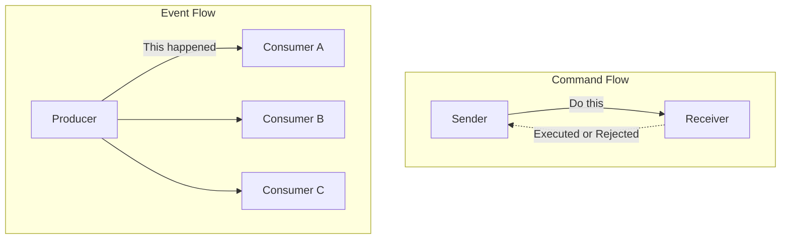

La disciplina de nomenclatura se deriva directamente de esto. Los eventos se nombran en tiempo pasado porque son hechos del pasado. Una cola llamada `order-processing` es un indicio de problema; un stream llamado `orders.placed` es un hecho. Si tu equipo está publicando algo nombrado en imperativo — `SendEmail` — tienes un command disfrazado de event, y la mentira de diseño se manifestará más tarde como acoplamiento que no pretendías crear.

## Acoplamiento Temporal, Espacial y de Flujo

El acoplamiento es la moneda de la arquitectura, y viene en más denominaciones de las que la mayoría de los diagramas admite. Para evaluar EDA honestamente, separa tres ejes distintos.

El **acoplamiento temporal** significa que ambas partes deben estar disponibles al mismo tiempo. En una llamada HTTP síncrona, si el destinatario está caído, el llamador falla ahora. La comunicación orientada a eventos rompe este eje: el productor emite y continúa; el consumidor procesa cuando esté listo, incluso minutos después. El broker absorbe la brecha.

El **acoplamiento espacial** (también llamado acoplamiento de ubicación o referencia) significa que el llamador debe conocer la identidad y la dirección del destinatario. El Servicio A mantiene una URL o un stub de cliente para el Servicio B. Cambia la ubicación de B y A se rompe. Publicar en un topic rompe este eje: el productor conoce el topic, no los suscriptores. Nuevos consumidores se conectan sin que el productor aprenda nunca sus nombres.

El **acoplamiento de flujo** significa que un componente conoce la secuencia de pasos que el otro debe realizar, incrustando el flujo de trabajo en el llamador. Cuando order-service orquesta pago, luego inventario, luego envío en una secuencia fija, posee el flujo de negocio. La coreografía de eventos puede invertir esto — cada servicio reacciona a hechos y emite los suyos propios — aunque, como muestran los capítulos posteriores, mover el flujo fuera del código no lo elimina; lo reubica en el comportamiento emergente del sistema.

| Eje de acoplamiento | Request-response síncrono | Event-driven |
|---------------|------------------------------|--------------|
| **Temporal** | Ambos vivos simultáneamente | Desacoplado vía broker |
| **Espacial** | El llamador conoce la dirección del destinatario | El productor conoce solo el topic |
| **Flujo** | El llamador posee la secuencia | Distribuido entre reactores |

La visión crítica para una audiencia senior: EDA no elimina el acoplamiento. Intercambia acoplamiento explícito en tiempo de compilación por acoplamiento implícito en tiempo de ejecución. Ganas independencia en despliegue y disponibilidad. Pagas con un flujo de control que ningún archivo describe de forma completa. Si ese intercambio vale la pena es la pregunta central de este libro.

<details>
<summary>💡 Nota del Experto</summary>

El marco de acoplamiento de tres ejes (temporal, espacial, de flujo) es preciso pero omite un cuarto eje que emerge como dominante en sistemas EDA maduros: el **acoplamiento semántico** (también llamado acoplamiento de datos o de contenido). Los consumidores dependen no solo de si un productor es alcanzable, sino de la estructura y el significado precisos del payload del evento. Un consumidor que hace pattern-matching sobre `order.status == "CONFIRMED"` está semánticamente acoplado a ese nombre de campo, esa enumeración y la regla de negocio que determina cuándo se emite CONFIRMED. EDA elimina la necesidad de llamar al productor, pero no elimina la necesidad de acordar qué *significa* el evento. Este eje es lo que hace que la gobernanza de esquemas de eventos sea innegociable en entornos de múltiples equipos — el contrato semántico implícito es más difícil de descubrir y negociar que una definición de API REST porque está distribuido en cada codebase de consumidores.
</details>

<details>
<summary>⚠️ Nota Crítica</summary>

La tabla de acoplamiento lista el acoplamiento de Flujo en sistemas event-driven como "Distribuido entre reactores", y el texto solo describe la coreografía como la alternativa EDA a la orquestación. Esto conflaciona un patrón (coreografía) con todo el paradigma. EDA basada en orquestación — orquestadores de Saga, AWS Step Functions, Azure Durable Functions, Temporal — centraliza el control de flujo explícitamente mientras sigue usando eventos asíncronos entre pasos. Un arquitecto senior que evalúa EDA para transacciones de negocio de larga duración recurrirá a la orquestación precisamente porque la coreografía distribuida dificulta el razonamiento sobre el flujo general. Presentar el acoplamiento de flujo como siempre "distribuido" tergiversa el espacio de diseño y podría llevar a los profesionales hacia la coreografía cuando un orquestador es la herramienta más apropiada.
</details>

## Request-Response Versus Comunicación Asíncrona

El modelo **request-response** es el predeterminado porque se mapea a cómo pensamos: hacer una pregunta, esperar la respuesta. Es síncrono, bloqueante y maravillosamente fácil de depurar — el stack trace cuenta toda la historia. Para una lectura que un usuario está esperando activamente, generalmente es la herramienta correcta. No permitas que nadie te avergüence por usar una llamada síncrona donde corresponde.

Su debilidad es la aritmética de disponibilidad. Encadena cinco servicios síncronos, cada uno con 99.9% de uptime, y la disponibilidad compuesta es aproximadamente 99.9% elevado a la quinta potencia — alrededor del 99.5%. Cada dependencia que agregas a una ruta síncrona multiplica el riesgo y la latencia. El sistema es tan disponible como el producto de sus partes.

La **comunicación asíncrona** desacopla la solicitud del resultado. El productor entrega un hecho a un broker y regresa de inmediato; los consumidores actúan según su propio horario. Una interrupción del consumidor ya no se propaga aguas arriba — los mensajes esperan en el log. La disponibilidad se convierte en resiliencia aditiva en lugar de fragilidad multiplicativa.

Este diagrama hace concreto el costo de disponibilidad de las cadenas síncronas: un único servicio fallido propaga timeouts hasta el llamador, mientras que un flujo async mediado por broker absorbe el fallo almacenando mensajes en buffer, permitiendo al cliente recibir un acuse de recibo inmediatamente y que los consumidores sanos continúen procesando de forma independiente.

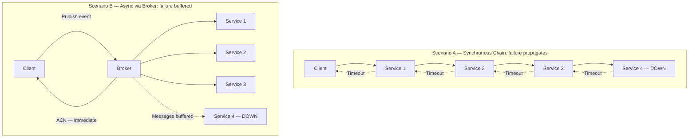

El costo es real y debe expresarse con claridad. Renuncias a la respuesta inmediata y lineal. Heredas consistencia eventual, llegada desordenada, entrega duplicada y depuración a través de límites de proceso. El stack trace ya no cuenta toda la historia. Los capítulos 4, 7 y 9 están dedicados íntegramente a domar estos costos, lo cual es en sí mismo una señal de cuánto importan.

> 💡 **Nota del Experto:** El texto enmarca correctamente la comunicación async como la conversión de "fragilidad multiplicativa en resiliencia aditiva", pero esto solo se sostiene cuando el broker en sí mismo alcanza una alta disponibilidad genuina. En muchos despliegues de etapa temprana u optimizados en costo — un único clúster de Kafka en una zona de disponibilidad, un RabbitMQ administrado sin standby — los equipos simplemente han reubicado el punto único de fallo en el broker. La afirmación de resiliencia solo se vuelve verdadera con replicación multi-AZ del broker (Kafka MirrorMaker 2, MSK Multi-AZ, Confluent Replication), alertas basadas en lag, y reintentos del lado del consumidor con dead-letter queues. Los arquitectos senior deben auditar la HA del broker antes de aceptar la promesa de "resiliencia en buffer" a valor nominal; de lo contrario, la primera interrupción del broker produce un incidente más difícil que cualquier cadena síncrona.

<details>
<summary>⚠️ Nota Crítica</summary>

La aritmética de disponibilidad (99.9%^5 ≈ 99.5%) asume implícitamente que los fallos de los servicios son estadísticamente independientes. En la práctica, los servicios que comparten un clúster de base de datos, una VPC, una zona de disponibilidad en la nube o una dependencia común (por ejemplo, un secrets manager o un control plane de service mesh) tienen modos de fallo correlacionados. Cuando los fallos están correlacionados, la disponibilidad compuesta real puede ser significativamente peor de lo que predice el modelo de independencia, lo que va en contra del argumento del capítulo. Presentar esto como una fórmula multiplicativa limpia sin la advertencia de independencia exagera la precisión de la estimación y podría llevar a los profesionales a tener exceso de confianza (en sistemas con fallos correlacionados) o falta de confianza (en sistemas con un fuerte aislamiento de blast radius).
</details>

<details>
<summary>⚠️ Nota Crítica</summary>

La afirmación "una interrupción del consumidor ya no se propaga aguas arriba — los mensajes esperan en el log" se presenta como una propiedad incondicional de la comunicación asíncrona mediada por broker. Esto solo es cierto dentro de la ventana de retención y la capacidad de almacenamiento del broker. Si un consumidor está fuera de línea por más tiempo que el período de retención configurado (por ejemplo, el `log.retention.hours` predeterminado de Kafka o una profundidad finita de cola SQS bajo carga sostenida), los mensajes se descartan o se sobreescriben. Para los arquitectos senior que diseñan sistemas de producción, esta distinción es operacionalmente crítica: la elección de la política de retención, el monitoreo del consumer lag y la estrategia de dead-letter son todas decisiones de diseño estructurales que el texto pasa por alto.
</details>

## Los Cuatro Estilos de Eventos: Notificación y Transferencia de Estado

La taxonomía de cuatro estilos de eventos de Martin Fowler es la herramienta más precisa para alinear a un equipo sobre lo que realmente significa "usar eventos". Dos estilos dominan la práctica, y elegir entre ellos es una decisión de diseño concreta con consecuencias concretas.

**Event Notification** (notificación de evento) lleva el hecho básico y poco más: un ID, un tipo, un timestamp. `OrderPlaced { orderId: 4471 }`. El consumidor que necesita más debe volver a llamar al productor para obtener los detalles. Esto mantiene los eventos pequeños y los payloads estables, pero reintroduce el acoplamiento espacial y temporal a través del callback, y puede generar una tormenta de tráfico de lectura de vuelta a la fuente.

**Event-Carried State Transfer** (transferencia de estado llevada por el evento) pone los datos relevantes dentro del evento: las líneas del pedido, el cliente, los totales. El consumidor no necesita ningún callback; mantiene su propia réplica de lo que le importa. Esto maximiza el desacoplamiento y la disponibilidad — el consumidor funciona incluso cuando el productor está caído — al precio de payloads más grandes, duplicación de datos entre servicios y la disciplina de mantener las réplicas coherentes.

Los dos estilos restantes, **Event Sourcing** (almacenamiento de eventos) (el estado como un log de eventos) y **CQRS** (segregación de los modelos de lectura y escritura), son los patrones arquitectónicos profundos que este libro disecciona en los Capítulos 5 y 6. Tratalos como avanzados; no los uses para resolver un problema de notificación.

| Estilo | Payload | ¿El consumidor necesita callback? | Trade-off principal |
|-------|---------|--------------------------|-------------------|
| **Notification** | Mínimo (ID + tipo) | Sí, para obtener detalles | Eventos pequeños, pero acoplamiento de callback |
| **State Transfer** | Estado relevante completo | No | Autonomía, pero duplicación |
| **Event Sourcing** | Los eventos *son* el estado | N/A | Historial completo, alta complejidad |
| **CQRS** | Modelos de lectura/escritura separados | N/A | Escalabilidad de lectura, modelos duales |

Un valor predeterminado pragmático para microservicios corporativos: comienza con Event-Carried State Transfer para la integración entre bounded contexts, para que los consumidores permanezcan autónomos, y reserva los patrones más pesados para problemas que genuinamente los requieran.

> 💡 **Nota del Experto:** Event-Carried State Transfer maximiza la autonomía del consumidor, pero asume silenciosamente la estabilidad del esquema. En la práctica, una vez que los fat events están en producción, el esquema del evento se convierte en un contrato de API distribuido implícito que los productores rompen regularmente — agregando campos requeridos, renombrando propiedades, cambiando tipos de datos. Sin un schema registry que aplique un modo de compatibilidad (Confluent Schema Registry con compatibilidad BACKWARD o FULL, AWS Glue Schema Registry, o Apicurio), un único despliegue del productor puede crashear todos los consumidores descendentes simultáneamente en tiempo de ejecución sin ninguna advertencia en tiempo de compilación. La disciplina de evolución de esquemas — estrategias de versionado, contratos de compatibilidad Avro/Protobuf/JSON Schema y ventanas de migración de publicación dual — merece igual protagonismo que el trade-off de payload "fat vs thin" introducido aquí, ya que es el modo de fallo operacional número 1 que los equipos encuentran después de adoptar Event-Carried State Transfer.

> ⚠️ **Nota Crítica:** El texto recomienda Event-Carried State Transfer (ECST) como el "valor predeterminado pragmático para microservicios corporativos" sin reconocer que incrustar estado (especialmente PII) dentro de eventos crea una exposición seria al RGPD y a la gobernanza de datos. Una vez que un evento que contiene nombre de cliente, correo electrónico o datos de pago se replica a N consumidores, satisfacer una solicitud de derecho al olvido se vuelve operacionalmente complejo o técnicamente imposible sin reconstruir las proyecciones de los consumidores. Para los arquitectos senior que operan en entornos empresariales regulados — la audiencia exacta de este libro — seguir este valor predeterminado sin calificación podría producir una mina de cumplimiento que es extremadamente costosa de deshacer a posteriori.

<details>
<summary>💡 Nota del Experto</summary>

El valor predeterminado pragmático — "comenzar con Event-Carried State Transfer para la integración entre contextos" — requiere un calificador crítico para los sistemas corporativos que manejan datos personales. Los fat events que llevan PII de clientes (nombre, correo electrónico, tokens de pago, datos de comportamiento) y se replican a N consumidores en N bases de datos crean una exposición significativa al Artículo 17 del RGPD (derecho de supresión) y a la residencia de datos. Cuando un cliente solicita la eliminación, debes identificar y purgar cada réplica en cada almacén de datos de cada consumidor, lo que se convierte en una pesadilla operacional a medida que crece el número de consumidores. Los patrones de producción para fat events conformes incluyen: (1) emitir solo identificadores pseudónimos en el evento con PII obtenida a través de un data vault controlado, o (2) cifrar los payloads por cliente con una clave almacenada en un key-management service — revocar la clave elimina efectivamente los datos en todas las réplicas. Los equipos en industrias reguladas deben validar este trade-off antes de adoptar Event-Carried State Transfer como valor predeterminado general.
</details>

## Criterios de Decisión: Cuándo Adoptar y Cuándo Evitar

Las opiniones sin criterios son solo preferencias. Aquí está la lista de verificación.

**Adopta EDA cuando** varios de estos aplican:
1. Los productores y consumidores deben escalar, desplegarse y fallar de forma independiente.
2. Un hecho desencadena naturalmente muchas reacciones (fan-out a consumidores que no puedes enumerar hoy).
3. El negocio tolera — o quiere activamente — consistencia eventual.
4. Los picos requieren almacenamiento en buffer, para que un broker pueda absorber picos de carga que el downstream no puede.
5. Las nuevas capacidades deben conectarse a los flujos existentes sin modificar al productor.

**Evita EDA cuando** alguno de estos domina:
1. La interacción es una lectura síncrona que un usuario está esperando ahora mismo.
2. Necesitas una respuesta inmediata y fuertemente consistente (muchas autorizaciones financieras requieren esto).
3. El sistema es un monolito pequeño o un puñado de servicios con un flujo estable y bien entendido.
4. Tu equipo carece de la madurez operacional para tracing, gobernanza de esquemas e idempotencia — las disciplinas que el resto de este libro enseña.

Esta función codifica la lista de verificación de adopción del capítulo en una regla ejecutable: permite a los equipos razonar sobre el estilo arquitectónico de forma sistemática en lugar de por intuición sola, y hace explícita la barrera de madurez — evitando la adopción prematura de EDA, el modo de fallo que el capítulo llama el error más costoso.

```python
# Decision function: maps system context flags to an architectural style recommendation
from dataclasses import dataclass


@dataclass(frozen=True)
class ArchitectureContext:
    """Captures the boolean flags that drive the EDA adoption decision."""
    needs_immediate_answer: bool          # user or system is blocked waiting for a synchronous result
    requires_strong_consistency: bool     # e.g. financial authorization — cannot tolerate stale reads
    independent_scaling: bool             # producers and consumers must scale and deploy independently
    fan_out: bool                         # one fact triggers reactions in multiple, possibly unknown, consumers
    tolerates_eventual_consistency: bool  # business domain accepts that replicas converge, not instantly
    operational_maturity: bool            # team can operate distributed tracing, schema governance, idempotency


def recommend_architecture(ctx: ArchitectureContext) -> str:
    """
    Returns one of three recommendations based on the context flags.

    Rules applied in priority order:
      1. Hard blockers for EDA → synchronous is safer
      2. Missing operational maturity → reconsider before committing
      3. Sufficient EDA signals present → prefer event-driven
      4. Default → synchronous (the simpler, more honest choice)
    """

    # Hard blockers: situations where synchronous request-response is clearly correct
    if ctx.needs_immediate_answer or ctx.requires_strong_consistency:
        return "prefer synchronous request-response"

    # Operational gate: EDA complexity is not free — check the team can absorb it
    eda_signals = sum([
        ctx.independent_scaling,
        ctx.fan_out,
        ctx.tolerates_eventual_consistency,
    ])

    if eda_signals >= 2 and not ctx.operational_maturity:
        return "reconsider — insufficient maturity for EDA"

    # Positive case: multiple EDA drivers present and team is ready
    if eda_signals >= 2 and ctx.operational_maturity:
        return "prefer event-driven"

    # Default: absent strong distribution pressures, synchronous is the honest choice
    return "prefer synchronous request-response"


# --- Example usage ---

if __name__ == "__main__":
    # Scenario A: checkout flow — user is waiting, payment requires strong consistency
    checkout = ArchitectureContext(
        needs_immediate_answer=True,
        requires_strong_consistency=True,
        independent_scaling=False,
        fan_out=False,
        tolerates_eventual_consistency=False,
        operational_maturity=True,
    )
    print(recommend_architecture(checkout))
    # Output: prefer synchronous request-response

    # Scenario B: order placed, triggers inventory + notifications + analytics
    order_placed = ArchitectureContext(
        needs_immediate_answer=False,
        requires_strong_consistency=False,
        independent_scaling=True,
        fan_out=True,
        tolerates_eventual_consistency=True,
        operational_maturity=True,
    )
    print(recommend_architecture(order_placed))
    # Output: prefer event-driven

    # Scenario C: team is new to distributed systems — maturity gate fires
    greenfield_low_maturity = ArchitectureContext(
        needs_immediate_answer=False,
        requires_strong_consistency=False,
        independent_scaling=True,
        fan_out=True,
        tolerates_eventual_consistency=True,
        operational_maturity=False,  # missing: tracing, schema governance, idempotency
    )
    print(recommend_architecture(greenfield_low_maturity))
    # Output: reconsider — insufficient maturity for EDA
```

El modo de fallo que más hay que temer es la adopción prematura. Envolver una aplicación CRUD de dos servicios en Kafka no la hace resiliente; la convierte en un sistema distribuido con todo el dolor de depuración y ninguno de los beneficios. EDA es una respuesta a presiones genuinas de distribución, escala e independencia. Sin esas presiones, un servicio síncrono bien estructurado es la elección de ingeniería más honesta. Recurre a los eventos cuando el problema es asíncrono por naturaleza — no para parecer moderno.

<details>
<summary>💡 Nota del Experto</summary>

El criterio "evitar EDA" que hace referencia a la "madurez operacional" es la barrera correcta, pero dejarlo sin definir permite que los equipos se autocertifiquen incorrectamente. En la práctica, las operaciones mínimas viables de EDA requieren al menos: (1) distributed tracing con IDs de correlación propagados en todos los productores y consumidores — OpenTelemetry con un header W3C TraceContext inyectado en los metadatos del evento es el estándar actual de la industria; (2) dead-letter queues en cada consumidor con alertas sobre la profundidad de la DLQ, no solo sobre el consumer lag; (3) un schema registry con modos de compatibilidad aplicados como se describe anteriormente; y (4) claves de idempotencia en todos los handlers de consumidores, documentadas y probadas, porque la entrega duplicada no es un caso extremo — está garantizada por los brokers at-least-once. Un equipo que no puede demostrar las cuatro capacidades en un entorno inferior debe aplazar la adopción de EDA independientemente de cuán fuertes sean las presiones de escala y fan-out.
</details>

## Conclusiones Clave

- Un **event** es un hecho inmutable del pasado; un **command** es una intención de actuar; un **message** es solo el sobre. Confundirlos corrompe el diseño.
- El acoplamiento tiene tres ejes — **temporal**, **espacial** y **de flujo**. EDA afloja los tres, pero reemplaza el acoplamiento explícito por acoplamiento implícito en tiempo de ejecución en lugar de eliminarlo.
- La disponibilidad síncrona es multiplicativa y frágil a lo largo de una cadena; la comunicación asíncrona mediada por broker convierte eso en resiliencia con buffer — al costo de consistencia eventual y depuración más difícil.
- **Event Notification** mantiene los eventos pequeños pero reintroduce el acoplamiento de callback; **Event-Carried State Transfer** maximiza la autonomía del consumidor mediante la duplicación de datos. Prefiere este último como valor predeterminado para la integración entre contextos.
- Adopta EDA para escala independiente, fan-out y almacenamiento de carga en buffer; evítalo para lecturas síncronas, necesidades de consistencia fuerte y equipos sin madurez operacional. La adopción prematura es el error más costoso.

## Qué Sigue

Con el átomo definido, el Capítulo 2 se centra en diseñar eventos que expresen hechos de negocio significativos — usando Domain-Driven Design y Event Storming para evitar publicar ruido técnico como si fuera un evento de dominio.

<!-- ASSEMBLY COMPLETE
  Chapter: Foundations of Event-Driven Architecture
  Code blocks resolved: 1 / 1
  Diagrams resolved: 2 / 2
  Expert callouts (inline): 2
  Expert callouts (collapsed): 3
  Critical callouts (inline): 1
  Critical callouts (collapsed): 3
  Unresolved markers: 0
-->


# Capítulo 2: Modelando Eventos como Hechos del Dominio

## Planteamiento del Problema Inicial

El Capítulo 1 definió un evento como un hecho inmutable del pasado y nos dio un vocabulario compartido: ejes de acoplamiento, estilos de evento y Event-Carried State Transfer (transferencia de estado transportada por eventos) como el patrón predeterminado para la integración entre contextos. Pero una definición no nos dice *qué* hechos merecen convertirse en eventos. Aquí es donde la mayoría de los sistemas orientados a eventos se degradan silenciosamente. Un equipo conecta un broker a su stack y en cuestión de meses los topics están inundados de `RowInserted`, `CacheInvalidated` y `UserEntityUpdated`. Ninguno de estos tiene significado para el negocio. Son residuos técnicos disfrazados de conocimiento del dominio, y cada consumidor que se suscribe a ellos hereda el esquema de base de datos del productor como un contrato de facto. El problema que este capítulo resuelve es la disciplina en el modelado: cómo diseñar eventos que transmitan un significado empresarial genuino, que sobrevivan a la refactorización y que permitan a equipos independientes integrarse sin interferirse entre sí. El trabajo del arquitecto senior aquí no es publicar más eventos — es publicar los *correctos*, con nombres que se lean como oraciones que un experto del dominio pronunciaría. Equivocarse en esto y ninguna cantidad de ajuste en Kafka salvará la arquitectura.

## Eventos de Dominio Versus Eventos de Integración

La distinción más útil en el modelado de eventos es entre **domain events** (eventos de dominio) e **integration events** (eventos de integración). Se ven idénticos en el cable — ambos son hechos inmutables — pero sirven a audiencias distintas y obedecen reglas diferentes.

Un **domain event** es un hecho que importa *dentro* de un único bounded context (contexto delimitado). Se expresa en el lenguaje ubicuo de ese contexto y con frecuencia es consumido por el mismo servicio que lo produjo, o por componentes estrechamente relacionados dentro de la frontera del mismo equipo. `OrderPlaced`, `PaymentDeclined`, `SeatReserved` — estos describen algo que le importa a un stakeholder del negocio. Los domain events son ricos; pueden referenciar agregados internos libremente porque todos los que los leen comparten el mismo modelo.

Un **integration event** es un hecho publicado *a través* de una frontera de bounded context, destinado a otros equipos y otros servicios. Es un contrato público deliberado. Dado que cruza una frontera, no debe filtrar estructura interna. Un integration event es una traducción — una proyección depurada y estabilizada de uno o más domain events hacia una forma en la que el mundo exterior pueda confiar.

La tabla a continuación hace el contraste concreto.

| Aspecto | Domain Event | Integration Event |
|--------|--------------|-------------------|
| Audiencia | Dentro de un bounded context | Otros contextos y equipos |
| Lenguaje | Lenguaje ubicuo completo | Vocabulario público estable |
| Payload | Rico, referencia agregados | Mínimo, autocontenido |
| Acoplamiento | Interno — sin frontera de contrato | Débil, contractual |
| Vida útil | Cambia con el modelo | Cambia solo mediante versionado |
| Consecuencia de filtrar | Refactor local | Rompe consumidores externos |

La regla se desprende directamente: **nunca publique un domain event crudo a través de una frontera de contexto.** Tradúzcalo primero. En el momento en que un equipo externo se suscribe a su `OrderAggregateUpdated` interno, su base de datos se convierte en su API y usted ha perdido la libertad de refactorizar. Este paso de traducción no es burocracia — es la costura que mantiene a los equipos independientes.

*Un domain event producido dentro de un bounded context debe ser traducido a un integration event antes de cruzar la frontera del contexto; esta costura preserva la libertad de cada equipo para refactorizar su modelo interno de forma independiente.*

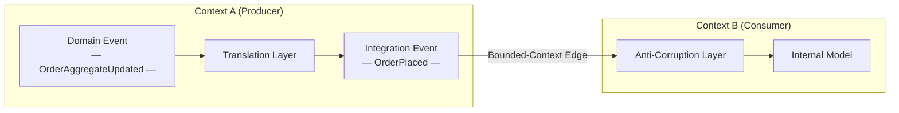

> 💡 **Nota del Experto:** El paso de traducción de domain event a integration event no es solo una disciplina de modelado — es una frontera de fiabilidad que requiere un mecanismo de entrega explícito. En sistemas de producción, el modo de falla más común es: el domain event es capturado en memoria o en un listener de la capa de aplicación, la traducción se ejecuta de forma síncrona y la publicación al broker falla, o el proceso se cae entre el commit de la base de datos y la escritura en el broker. La solución estándar de la industria es el patrón **Transactional Outbox**: escribir el integration event saliente en una tabla `outbox` dentro de la misma transacción ACID que muta el agregado, y luego retransmitir de forma asíncrona. Sin esto, la frontera de traducción que protege a sus consumidores de su esquema es en sí misma una fuente de bugs de consistencia fantasma extremadamente difíciles de reproducir en entornos de prueba.

<details>
<summary>⚠️ Nota Crítica</summary>
La tabla etiqueta el acoplamiento de los domain events como "Tight, by design." Esto es engañoso y corre el riesgo de confundir a los arquitectos senior. Los domain events dentro de un bounded context son precisamente un mecanismo de *desacoplamiento*: un agregado Order lanza `OrderPlaced` para que otros servicios de dominio (reserva de inventario, envío de correo) puedan reaccionar sin que el agregado los llame directamente. "Tight" es inexacto; el encuadre correcto es "interno — la frontera no aplica." Describir el acoplamiento intra-contexto como "tight by design" podría llevar a los lectores a resistir los domain events dentro de su propio contexto, anulando su propósito.

**Corrección sugerida:** Reemplazar "Tight, by design" en la fila de Acoplamiento con "Internal — no contract boundary; consumers share the same model." Agregar una oración que indique que los domain events *habilitan* el acoplamiento débil dentro de un contexto entre agregados y servicios de dominio.
</details>

<details>
<summary>⚠️ Nota Crítica</summary>
El texto presenta el paso de traducción ("nunca publique un domain event crudo a través de una frontera de contexto — tradúzcalo primero") como una regla de diseño sin abordar el mecanismo de fiabilidad que hace seguro seguir esta regla. La traducción de domain event a integration event se realiza típicamente dentro de la misma transacción o mediante un patrón outbox; si lo realiza un proceso o handler separado, la traducción misma puede fallar silenciosamente, produciendo duplicados o eventos perdidos. Para arquitectos senior, la regla "tradúzcalo primero" está incompleta sin reconocer que el *cómo* de la traducción fiable no es trivial y es la fuente de la mayoría de los bugs de integración del mundo real. Diferir esto completamente al Capítulo 3 deja una brecha peligrosa en el momento exacto en que el lector decide adoptar el patrón.

**Corrección sugerida:** Agregar un callout de una o dos oraciones que reconozca que la traducción fiable requiere una garantía de atomicidad (por ejemplo, transactional outbox o event sourcing), y hacer referencia al capítulo específico donde esto se aborda para que los lectores sepan que la brecha es intencional, no pasada por alto.
</details>

## Event Storming como Técnica de Descubrimiento

No se pueden modelar bien los eventos mirando fijamente un esquema de base de datos. Los eventos deben *descubrirse* del negocio, y la técnica más rápida para ese descubrimiento es el **Event Storming** — un taller colaborativo inventado por Alberto Brandolini. Reúne a expertos del dominio e ingenieros frente a la misma pared y formula una pregunta: ¿qué sucede en este negocio?

La mecánica es deliberadamente de bajo nivel tecnológico. Los participantes escriben hechos en notas adhesivas naranjas, formuladas en tiempo pasado, y las colocan en una línea de tiempo. `OrderPlaced` va primero, luego `PaymentAuthorized`, luego `OrderShipped`. Cuando las notas naranjas dejan de fluir, entran otros colores: azul para comandos que desencadenan eventos, amarillo para agregados, rosa para sistemas externos y morado para políticas ("cada vez que *esto* sucede, hacer *aquello*"). La pared se convierte en un mapa del proceso empresarial antes de que se escriba una sola clase.

Tres señales de una sesión de Event Storming dan forma directamente a su arquitectura:

1. **Clusters de eventos** alrededor del mismo agregado revelan un bounded context. Donde el lenguaje cambia — donde "order" (orden) comienza a significar algo diferente — usted ha encontrado una frontera.
2. **Hotspots** (puntos calientes), marcados con notas rojas, exponen desacuerdos o incógnitas. Estas son las partes arriesgadas del dominio y merecen la mayor atención de diseño.
3. **Pivotal events** (eventos pivotales) — aquellos a los que señala cada stakeholder — son sus verdaderos integration events, los hechos que otros contextos querrán conocer.

*Una línea de tiempo de Event Storming mapea hechos del negocio en tiempo pasado de izquierda a derecha, exponiendo comandos, agregados y políticas; el punto donde el lenguaje ubicuo cambia marca una frontera de bounded context y señala un integration event candidato.*

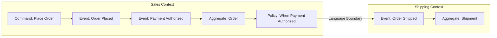

El beneficio es que los eventos emergen del lenguaje del negocio, no de la forma de una tabla. Cuando un experto del dominio asiente ante `PaymentDeclined` y niega con la cabeza ante `UserRecordUpdated`, está haciendo su revisión de nomenclatura de forma gratuita. Realice el taller antes de diseñar esquemas, no después.

<details>
<summary>💡 Nota del Experto</summary>
Alberto Brandolini define tres niveles de Event Storming — **Big Picture**, **Process Modeling** y **Software Design** — pero la mayoría de los equipos solo ejecutan el primero y lo dan por terminado. La sesión Big Picture produce el mapa de fronteras y los eventos pivotales descritos en el texto. El Process Modeling (una sesión separada y más pequeña) es donde se refinan los comandos, actores, modelos de lectura y políticas por subproceso: este es el nivel que produce el diseño de agregados y comandos que alimenta directamente el código. Detenerse en Big Picture deja una brecha de traducción significativa entre la pared del taller y el primer borrador de esquema, que los ingenieros típicamente llenan revirtiendo a eventos con forma de base de datos — exactamente el anti-patrón contra el que advierte el Capítulo 2.
</details>

<details>
<summary>💡 Nota del Experto</summary>
En la práctica, los hotspots del Event Storming (notas rojas) son tan frecuentemente organizacionales como técnicos. Un hotspot persistente donde los expertos del dominio no pueden ponerse de acuerdo en un término es frecuentemente una señal de tensión con la **Ley de Conway**: dos equipos comparten la propiedad de un concepto y han desarrollado modelos diferentes. Tratar estos como problemas puramente técnicos de modelado conduce a compromisos frágiles. La respuesta más efectiva es sacar a la luz la pregunta de propiedad organizacional de forma explícita — ¿qué equipo es dueño de la definición de este agregado? — y dejar que esa decisión guíe la frontera del bounded context, en lugar de buscar un terreno lingüístico intermedio que ningún equipo mantendrá realmente.
</details>

<details>
<summary>⚠️ Nota Crítica</summary>
El Event Storming se presenta como una técnica francamente accesible: "los participantes escriben hechos en notas adhesivas naranjas" y la pared "se convierte en un mapa del proceso empresarial antes de que se escriba una sola clase." Esto pasa por alto los sustanciales prerrequisitos organizacionales y de facilitación. Sin un facilitador experimentado, las sesiones colapsan rutinariamente en jerga técnica, explosión del alcance o agendas políticas competidoras entre departamentos. Los expertos del dominio deben estar dispuestos y disponibles — una restricción que suele ser la parte más difícil en entornos empresariales. Presentar la técnica como de bajo esfuerzo ("deliberadamente de bajo nivel tecnológico") sin reconocer la complejidad de facilitación podría hacer que los equipos realicen sesiones mal estructuradas, produzcan mapas de eventos engañosos y culpen a la técnica en lugar de la ejecución.

**Corrección sugerida:** Agregar un párrafo breve que indique que el Event Storming efectivo requiere un facilitador hábil y neutral (idealmente con experiencia en DDD), expertos del dominio preparados que tengan autoridad para describir el negocio (no solo desarrolladores describiendo lo que hace el sistema), y un compromiso de tiempo de al menos un día completo por proceso mayor. Recomendar "Introducing EventStorming" de Brandolini como referencia para los detalles de facilitación.
</details>

## Bounded Contexts y Contratos de Eventos Entre Equipos

Un **bounded context** es el ámbito dentro del cual un modelo y su lenguaje ubicuo son consistentes. "Customer" (cliente) en el contexto de Sales (ventas) no es el mismo "Customer" en el contexto de Billing (facturación), aunque ambos mapeen a la misma persona. Los eventos son la forma en que estos contextos se comunican sin fusionar sus modelos — y eso convierte a cada evento publicado en un **contrato**.

Tratar los eventos como contratos cambia cómo se gestionan. Un contrato tiene un propietario (el equipo productor), una especificación (el esquema) y consumidores que construyen sobre él. Una vez que alguien depende de su integration event, usted no puede cambiar silenciosamente su forma. Por eso las organizaciones maduras adoptan **consumer-driven contracts** (contratos orientados al consumidor): los consumidores publican las expectativas que tienen, y el pipeline del productor verifica que los cambios no los rompan. Volvemos a la evolución de esquemas en profundidad en el Capítulo 8, pero la decisión de modelado comienza aquí — un integration event bien modelado es aquel cuyo significado es suficientemente estable como para comprometerse de forma explícita mediante versionado y migración coordinada de consumidores — no de forma silenciosa.

La frontera anti-corrupción es el mecanismo práctico. Cuando el Context B consume un evento del Context A, traduce el vocabulario de A a su propio modelo en el borde, en lugar de dejar que los conceptos de A se propaguen hacia adentro. Esto mantiene a los dos modelos libres para evolucionar. El evento es el cable entre ellos; las capas de traducción en cada lado son el aislamiento.

**Pro Tip:** Asigne a cada integration event un único equipo propietario y regístrelo en un catálogo descubrible. Un evento sin propietario es un evento que nadie puede cambiar con seguridad — y que nadie se atreve a eliminar.

<details>
<summary>💡 Nota del Experto</summary>
El texto introduce correctamente los consumer-driven contracts como el mecanismo para evolucionar de forma segura los integration events, pero vale la pena nombrar la brecha en las herramientas para los profesionales listos para implementarlo. Para sistemas de eventos asíncronos, **Pact** (pact.io) es el framework de pruebas de contratos orientados al consumidor más ampliamente adoptado y tiene soporte de primera clase para contratos de mensajes desde la v4. La aplicación de contratos mediante un registro de esquemas (Confluent Schema Registry con modos de compatibilidad, o AWS Glue Schema Registry) maneja la evolución estructural pero no la compatibilidad semántica — Pact cubre esto último. Una capa complementaria es **AsyncAPI 3.0**, ahora la especificación dominante para documentar contratos de eventos asíncronos, equivalente a OpenAPI para REST; se integra con registros de esquemas y alimenta catálogos de descubrimiento como Backstage.
</details>

> 💡 **Nota del Experto:** El texto coloca correctamente la frontera anti-corrupción en el borde del contexto, pero los equipos frecuentemente ubican mal su implementación. En un sistema de eventos asíncrono, el ACL vive **dentro del event handler del servicio consumidor o en un proceso transformador dedicado** — no en el broker, no en una capa de middleware compartida. Los intentos de implementar un "ACL centralizado" a nivel del broker (mediante una topología de Kafka Streams o un intermediario estilo ESB) reconstituyen el integration hub que la arquitectura orientada a eventos pretendía eliminar, y crean un componente mutable compartido del que depende cada equipo. Cada consumidor es dueño de su propia traducción; eso es lo que los mantiene desplegables de forma independiente.

<details>
<summary>⚠️ Nota Crítica</summary>
El texto afirma que "un integration event bien modelado es aquel cuyo significado es suficientemente estable como para prometerse indefinidamente." Este es un estándar poco realista y potencialmente dañino para la mayoría de los dominios empresariales. El significado del negocio cambia: las regulaciones se modifican, los productos se discontinúan, las fusiones redefinen "customer." El encuadre correcto es que los integration events deben ser *suficientemente estables como para requerir versionado explícito en lugar de roturas silenciosas* — no estables indefinidamente. Prometer estabilidad indefinida podría causar que los equipos sobre-ingenierien los eventos en un intento de anticipar todos los significados futuros, resultando en esquemas inflados y excesivamente genéricos que son más difíciles de evolucionar que los versionados bien delimitados.

**Corrección sugerida:** Reemplazar "stable enough to promise indefinitely" con "stable enough that changes require explicit versioning and coordinated consumer migration — not silent schema mutation." Indicar brevemente que la evolución del dominio empresarial hace que la estabilidad indefinida sea una ficción; el buen diseño de eventos minimiza la *frecuencia* de los cambios disruptivos, no su posibilidad.
</details>

## Granularidad y Convenciones de Nomenclatura de Eventos

La granularidad es donde las buenas intenciones producen malos sistemas. Demasiado gruesa, y un evento inflado obliga a cada consumidor a parsear campos que no necesita. Demasiado fina, y los consumidores deben reensamblar un hecho empresarial a partir de una tormenta de fragmentos, reintroduciendo exactamente el acoplamiento que los eventos pretendían eliminar.

La heurística guía: **modele los eventos a la granularidad de una decisión empresarial, no de una mutación de datos.** `OrderPlaced` es una decisión. `OrderTotalColumnUpdated` es una mutación. Si un hecho solo tiene sentido para alguien que conoce su definición de tabla, es demasiado fino y probablemente no es un domain event en absoluto.

La nomenclatura tiene tanto peso como la granularidad. Siga estas reglas sin excepción:

- **Tiempo pasado, siempre.** Un evento registra algo que ya sucedió: `InvoiceIssued`, no `IssueInvoice` (eso es un comando) ni `InvoiceIssue`.
- **Lenguaje del negocio, no lenguaje técnico.** `PaymentCaptured` supera a `PaymentServiceApiCallSucceeded`.
- **Nombre el hecho, no el handler.** `SubscriptionCancelled`, no `SendCancellationEmail` — este último nombra una reacción, acoplando el evento a la intención de un consumidor.
- **Incluya el agregado, sea específico.** `CartCheckedOut` le dice el sujeto y el hecho en dos palabras.

*Ambas definiciones a continuación son dataclasses de Python publicables. `OrderPlaced` captura una decisión empresarial en vocabulario que un experto del dominio reconoce; `OrderTableRowChanged` expone detalles de persistencia sin procesar que acoplan a cada consumidor al esquema de base de datos del productor.*

```python
# Contrasting event schemas: durable business contract vs. technical noise
# O(1) — schema definition; no algorithmic complexity

from __future__ import annotations

import uuid
from dataclasses import dataclass, field
from datetime import datetime
from decimal import Decimal
from enum import StrEnum


# ---------------------------------------------------------------------------
# GOOD: OrderPlaced — a durable integration event
#
# Why this works as a contract:
#   • Named in the past tense using ubiquitous language ("Placed")
#   • Carries only stable business facts; no internal aggregate IDs leak out
#   • A non-technical domain expert can read every field and understand it
#   • Consumers depend on *meaning*, not on the producer's table structure
#   • Adding a new field (non-breaking) or renaming an existing one (versioned)
#     is a deliberate, announced change — not a silent side-effect of a migration
# ---------------------------------------------------------------------------

class Currency(StrEnum):
    USD = "USD"
    EUR = "EUR"
    BRL = "BRL"


@dataclass(frozen=True)          # frozen=True enforces immutability
class OrderLineItem:
    product_id: str              # public product catalog ID (stable reference)
    product_name: str            # denormalized for self-containment
    quantity: int
    unit_price: Decimal
    currency: Currency


@dataclass(frozen=True)
class OrderPlaced:
    """
    Integration event: a customer has placed an order.

    This is the canonical fact other bounded contexts depend on.
    Billing uses it to initiate payment; Fulfillment uses it to reserve stock.
    Neither context needs to know which database table stored the order.
    """
    event_id: str = field(default_factory=lambda: str(uuid.uuid4()))
    occurred_at: datetime = field(default_factory=datetime.utcnow)

    # --- Business payload (stable, meaningful fields) ---
    order_id: str = ""           # public order reference, not a DB primary key
    customer_id: str = ""        # stable external customer identifier
    channel: str = ""            # "web", "mobile", "api" — business channel
    items: tuple[OrderLineItem, ...] = field(default_factory=tuple)
    total_amount: Decimal = Decimal("0.00")
    currency: Currency = Currency.USD
    shipping_address_country: str = ""   # country code (ISO 3166-1 alpha-2)


# ---------------------------------------------------------------------------
# BAD: OrderTableRowChanged — technical noise masquerading as a domain event
#
# Why this is an anti-pattern:
#   • The name describes a persistence mechanism ("TableRow"), not a business fact
#   • `changed_columns` leaks the producer's schema; consumers must understand
#     column names to extract any meaning — their code now mirrors the DB schema
#   • A non-technical domain expert cannot tell whether anything meaningful
#     happened: a retry, a migration, or a real business decision all look the same
#   • When the producer renames a column or splits a table, all consumers break
#     silently — this is the hidden cost of technical noise
# ---------------------------------------------------------------------------

@dataclass(frozen=True)
class ColumnDiff:
    column_name: str             # raw DB column name — a leaking implementation detail
    old_value: object
    new_value: object


@dataclass(frozen=True)
class OrderTableRowChanged:
    """
    Anti-pattern: publishes a raw persistence event as though it were a domain fact.

    Consumers cannot determine business intent from column diffs.
    Did the user cancel? Did a background job fix a typo? Was it a no-op write?
    This event answers none of those questions.
    """
    event_id: str = field(default_factory=lambda: str(uuid.uuid4()))
    occurred_at: datetime = field(default_factory=datetime.utcnow)

    # --- Technical payload (unstable, leaks internal schema) ---
    table_name: str = "orders"           # couples consumers to the DB table name
    row_pk: int = 0                      # exposes the surrogate database primary key
    changed_columns: tuple[ColumnDiff, ...] = field(default_factory=tuple)
    transaction_id: str = ""             # DB transaction detail — irrelevant to consumers
    orm_version: int = 0                 # ORM optimistic-lock version — internal noise


# ---------------------------------------------------------------------------
# Demonstration: the same business fact expressed in both styles
# ---------------------------------------------------------------------------

def demo() -> None:
    item = OrderLineItem(
        product_id="PROD-7821",
        product_name="Wireless Keyboard",
        quantity=2,
        unit_price=Decimal("49.99"),
        currency=Currency.USD,
    )

    # Meaningful: any consumer knows exactly what happened
    good_event = OrderPlaced(
        order_id="ORD-20240901-00042",
        customer_id="CUST-8814",
        channel="web",
        items=(item,),
        total_amount=Decimal("99.98"),
        currency=Currency.USD,
        shipping_address_country="US",
    )

    # Noisy: consumers must reverse-engineer business meaning from column diffs
    bad_event = OrderTableRowChanged(
        table_name="orders",
        row_pk=100042,
        changed_columns=(
            ColumnDiff("status_cd", "DRAFT", "CONFIRMED"),    # what does "CONFIRMED" mean?
            ColumnDiff("upd_ts", "2024-09-01T10:00:00", "2024-09-01T10:00:01"),
            ColumnDiff("orm_ver", 3, 4),                      # pure internal noise
        ),
    )

    print("Good event type :", type(good_event).__name__)     # OrderPlaced
    print("Good event items:", len(good_event.items))         # 2 items
    print()
    print("Bad event type  :", type(bad_event).__name__)      # OrderTableRowChanged
    print("Bad event cols  :", [c.column_name for c in bad_event.changed_columns])


if __name__ == "__main__":
    demo()
```

Un buen nombre es en sí mismo una revisión de diseño. Si un experto del dominio no puede entender su evento solo por su nombre, el modelo está mal — renómbrelo antes de desplegarlo.

> 💡 **Nota del Experto:** El texto advierte contra los eventos demasiado granulares (mutaciones), pero el fallo opuesto es igualmente peligroso en producción y recibe menos atención: los eventos demasiado gruesos crean **presión evolutiva hacia payloads de tipo "todo en uno"**. A medida que llegan nuevos consumidores, cada uno necesita un campo que el evento existente no lleva. El camino de menor resistencia es seguir agregando campos al único evento grueso. En 18 meses, `OrderPlaced` lleva 60 campos, la mitad de los cuales son nulos para cualquier consumidor dado, y el esquema se ha convertido en una base de datos compartida de facto entre equipos. La mitigación es modelar a la granularidad de la decisión empresarial, pero luego auditar deliberadamente qué campos usa realmente cada consumidor declarado — los consumidores con cero campos son una señal de que la frontera del evento está mal.

<details>
<summary>⚠️ Nota Crítica</summary>
La discusión sobre granularidad omite el trade-off crítico entre eventos fat (gruesos) y thin (delgados) que todo arquitecto senior debe decidir en tiempo de diseño. Los fat events (que llevan el estado completo del agregado) hacen a los consumidores autosuficientes pero aumentan el tamaño del payload, pueden filtrar detalles del modelo interno y dificultan controlar qué constituye un cambio "significativo". Los thin events (que llevan solo el ID o un diff mínimo) mantienen los payloads pequeños pero obligan a los consumidores a hacer una llamada síncrona de búsqueda para obtener el estado necesario, reintroduciendo acoplamiento temporal y una dependencia potencial de disponibilidad. Para una audiencia de ingenieros y arquitectos senior, presentar la granularidad solo como "decisión empresarial versus mutación de datos" sin nombrar este trade-off omite la decisión de diseño más determinante a nivel de esquema.

**Corrección sugerida:** Agregar una subsección o callout que cubra el espectro fat/thin: los fat events favorecen la autonomía del consumidor a costa del tamaño del payload y la exposición del modelo; los thin events reducen el payload y la exposición pero pueden forzar a los consumidores a realizar consultas síncronas. Hacer referencia al Event-Carried State Transfer (del Capítulo 1) como el predeterminado recomendado para la integración entre contextos, y señalar que los thin events son preferibles cuando el tamaño del payload o la sensibilidad del modelo son una preocupación dentro de un contexto.
</details>

## El Ruido Técnico como Anti-Patrón de Modelado

El fallo más común en los sistemas orientados a eventos es el **ruido técnico** (technical noise): publicar eventos de infraestructura y persistencia como si fueran hechos del dominio. `EntitySaved`, `KafkaOffsetCommitted`, `CacheEvicted`, `FieldXChanged`. Estos eventos describen cómo funciona el software, no qué hizo el negocio.

El ruido técnico es corrosivo por tres razones. Primero, acopla a los consumidores a su implementación — los suscriptores ahora dependen de la cadencia de guardado de su ORM o de su estrategia de caché. Segundo, destruye la señal: los eventos empresariales reales se ahogan en una inundación de ruido mecánico, y los consumidores no pueden distinguir qué eventos importan. Tercero, miente. Un evento `EntityUpdated` afirma que ocurrió un hecho empresarial cuando a menudo no sucedió nada significativo — un reintento, una migración o una escritura sin cambios reales.

La prueba es simple e implacable: **¿podría un experto del dominio no técnico decir este evento en voz alta y darle sentido?** "La orden fue colocada" pasa. "La fila fue actualizada" falla. Si la respuesta es no, usted está ante ruido técnico, y no pertenece a un topic de dominio.

*Mezclar ruido técnico en los topics de dominio inunda a los consumidores con señales irrelevantes, haciendo imposible distinguir hechos empresariales reales de artefactos de implementación; mantener los topics de dominio limpios preserva el stream como un libro mayor empresarial confiable.*

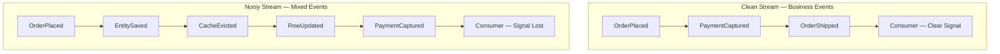

Esto no significa que los eventos técnicos sean inútiles. Las señales operacionales e de infraestructura son legítimas — para monitoreo, métricas y depuración, que el Capítulo 9 cubre. El pecado no es producirlos; es publicarlos en los mismos canales de dominio que otros equipos tratan como la fuente de verdad empresarial. Mantenga los dos streams separados. Sus topics de dominio son un libro mayor empresarial, y un libro mayor con entradas falsas es peor que ningún libro mayor en absoluto.

> 💡 **Nota del Experto:** La fuente de ruido técnico más común en producción que los profesionales encuentran son los **pipelines de Change Data Capture (CDC) publicando directamente a topics de dominio**. Herramientas como Debezium capturan cambios a nivel de fila desde el log de transacciones de la base de datos y emiten eventos como `INSERT/UPDATE on orders table with column deltas` — que es precisamente el anti-patrón `OrderTableRowChanged` que describe el texto. El modo de falla es que los equipos tratan el CDC como la capa de publicación de eventos, omitiendo por completo el modelado del dominio. La arquitectura correcta es usar el CDC como un **relay de outbox** (leyendo desde una tabla `outbox` o `domain_events` escrita por la aplicación) en lugar de capturar mutaciones de tablas sin procesar. Si ve topics de Debezium nombrados según tablas de base de datos fluyendo directamente a los consumidores, está ante ruido técnico a escala industrial.

## Conclusiones Clave

- Los **domain events** viven dentro de un bounded context; los **integration events** son contratos públicos deliberados. Nunca publique un domain event crudo a través de una frontera — tradúzcalo primero.
- El **Event Storming** descubre eventos desde el lenguaje del negocio, exponiendo bounded contexts, hotspots y los hechos pivotales que se convierten en integration events.
- Cada evento publicado es un **contrato** con un propietario, un esquema y consumidores; las fronteras anti-corrupción mantienen independientes los modelos del productor y del consumidor.
- Modele los eventos a la granularidad de una **decisión empresarial**, nómbrelos en **tiempo pasado** usando el lenguaje ubicuo, y nombre el hecho en lugar del handler.
- El **ruido técnico** — eventos de persistencia e infraestructura haciéndose pasar por hechos del dominio — acopla a los consumidores a su implementación y ahoga la señal real. Aplique la prueba del experto del dominio.

## Qué Sigue

Con eventos bien modelados en mano, el Capítulo 3 examina cómo fluyen realmente esos eventos — comparando topologías de broker y mediador, coreografía versus orquestación, y las tecnologías de mensajería que transportan sus hechos del dominio a través del sistema.

<!-- ASSEMBLY COMPLETE
  Chapter: Modeling Events as Domain Facts
  Code blocks resolved: 1 / 1
  Diagrams resolved: 3 / 3
  Expert callouts (inline): 4
  Expert callouts (collapsed): 3
  Critical callouts (inline): 0
  Critical callouts (collapsed): 4
  Unresolved markers: 0
-->


# Capítulo 3: Topologías e Infraestructura de Mensajería

## Planteamiento del Problema Inicial

El Capítulo 2 enseñó cómo modelar eventos como hechos de negocio genuinos y tratar cada evento publicado como un contrato propio. Pero un evento bien modelado es inerte hasta que algo lo mueve desde el servicio que lo produjo hasta los servicios que lo necesitan. Ese "algo" es tu infraestructura de mensajería, y elegirla es una de las decisiones de mayor impacto y más difíciles de revertir en un sistema orientado a eventos. Elige la topología equivocada y pasarás los próximos dos años luchando contra tu propio middleware: reproduciendo eventos que no pueden reproducirse, ordenando mensajes que nunca estuvieron ordenados, y depurando un flujo de control que no existe en ninguna parte de tu base de código. Los arquitectos senior no pueden darse el lujo de ser vagos aquí. La distinción entre un log distribuido y una cola no es una trivialidad académica; dicta si puedes reconstruir un modelo de lectura desde cero, si un consumidor lento bloquea a uno rápido, y si "agregar otro consumidor" es un cambio de configuración o un rediseño. Este capítulo traza las dos familias de topologías, los dos modelos de coordinación, y los tres arquetipos tecnológicos que encontrarás realmente en producción. Al final, deberías poder defender una elección, no solo nombrarla.

## Topología Broker Versus Topología Mediator

Cada sistema orientado a eventos cae en uno de dos patrones estructurales, y la diferencia radica en dónde vive el flujo de control. En una **topología broker** (broker topology), no hay un coordinador central. Cada servicio publica eventos y se suscribe a los eventos que necesita, luego reacciona por su cuenta. El proceso de negocio es una propiedad emergente de muchas reacciones independientes. Nadie es dueño del flujo de extremo a extremo; existe solo como la suma de las decisiones locales. Este es el patrón que le da a la EDA (arquitectura orientada a eventos) su famoso desacoplamiento y su igualmente famoso problema de depurabilidad.

En una **topología mediator** (mediator topology), un componente central, el **mediator** u **orquestador**, es dueño del proceso. Recibe un evento disparador, luego emite comandos a los servicios participantes en una secuencia deliberada, rastreando el estado del flujo de trabajo a medida que avanza. El mediator sabe qué paso viene a continuación, qué hacer cuando un paso falla, y cuándo el proceso está completo. El flujo es explícito y vive en un lugar que puedes leer.

El balance es todo el punto. La topología broker maximiza el desacoplamiento y el rendimiento, pero dispersa el proceso entre servicios, lo que hace difícil responder "¿por qué se atascó este pedido?" La topología mediator centraliza la visibilidad y el manejo de errores, pero reintroduce una dependencia de coordinación y un posible cuello de botella. Ninguna es correcta en abstracto.

*Diagrama: Topología Broker versus Topología Mediator — flujo de control emergente y descentralizado en contraste con la coordinación deliberada y centralizada.*

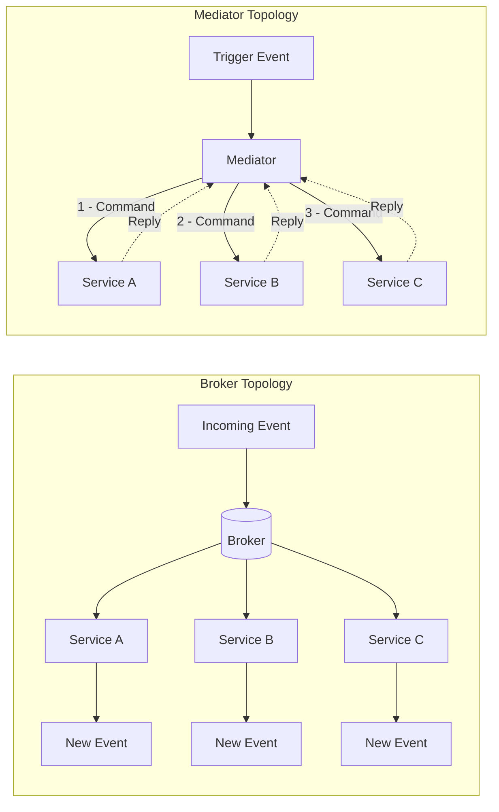

Una heurística útil: usa la topología broker para reacciones simples y mayormente independientes donde el trabajo de cada suscriptor es autocontenido. Recurre a un mediator cuando el proceso tiene pasos reales, restricciones de orden y lógica de compensación que alguien debe poseer. Formalizaremos el mediator como un gestor de procesos saga en el Capítulo 7; aquí es suficiente reconocer la elección estructural.

<details>
<summary>💡 Nota del Experto</summary>

El texto identifica correctamente el mediator como un posible cuello de botella, pero en la práctica el riesgo de producción más peligroso es el radio de impacto (blast radius), no el rendimiento. Los motores de flujo de trabajo modernos (AWS Step Functions, Temporal, Conductor) escalan horizontalmente y rara vez tienen limitaciones de CPU o rendimiento. El verdadero peligro es que un error en la lógica de negocio del orquestador, o un despliegue defectuoso que corrompe el estado del flujo de trabajo, afecta simultáneamente a todas las instancias en vuelo de cada tipo de flujo de trabajo gestionado por ese orquestador. Los equipos mitigan esto con el versionado de flujos de trabajo (la API de versionado de Temporal, las versiones de máquinas de estado de Step Functions), el despliegue canary estricto de los cambios en el orquestador, y la separación de las definiciones de flujo de trabajo por límite de dominio, de modo que un defecto en los flujos de trabajo de Order no pueda corromper los flujos de trabajo de Payment.
</details>

<details>
<summary>⚠️ Nota Crítica</summary>

El texto abre con "cada sistema orientado a eventos cae en uno de dos patrones estructurales" y luego construye todo el marco de topología sobre el binario broker/mediator. En la práctica, los grandes sistemas de producción combinan rutinariamente ambos: los eventos de dominio fluyen sobre un broker mientras las sagas entre dominios se orquestan mediante un mediator, a menudo dentro del mismo despliegue. Presentar la elección como mutuamente excluyente a nivel de sistema lleva a los arquitectos hacia una falsa decisión de uno u otro en el momento de diseño, cuando la pregunta real es "¿qué topología por límite de proceso?" El encuadre binario es pedagógicamente conveniente pero activamente engañoso para los profesionales senior que diseñan sistemas con flujos de trabajo heterogéneos.
</details>

## Coreografía Versus Orquestación

Broker y mediator son términos estructurales; la **coreografía** (choreography) y la **orquestación** (orchestration) son los modelos de coordinación conductual que se mapean sobre ellos. Frecuentemente se usan como sinónimos de las topologías, y para propósitos prácticos el mapeo es válido: la coreografía es cómo coordina una topología broker, la orquestación es cómo coordina una topología mediator.

En la **coreografía**, cada servicio reacciona a los eventos y emite nuevos eventos sin ser dirigido por ninguna autoridad central. Piensa en bailarines que cada uno conoce sus propios pasos y señales; el baile emerge de que todos reaccionan a la música y entre sí. No hay director. Un evento `OrderPlaced` desencadena el servicio de pago, cuyo evento `PaymentCaptured` desencadena el servicio de envío, y así sucesivamente. El flujo es una cadena de reacciones.

En la **orquestación**, un director, el orquestador, dirige explícitamente a cada participante. Envía un comando "capturar pago", espera el resultado, luego envía un comando "reservar inventario". Los participantes no necesitan conocerse entre sí en absoluto; solo saben cómo obedecer comandos y reportar resultados.

La tensión es visibilidad versus autonomía. La coreografía mantiene los servicios con la máxima independencia, pero oculta el proceso; para entender el flujo completo debes rastrear eventos a través de muchos servicios. La orquestación hace el proceso legible y centraliza el manejo de fallos, pero acopla a los participantes con el orquestador y crea un componente que debe escalar y mantenerse disponible.

| Dimensión | Coreografía | Orquestación |
|---|---|---|
| Flujo de control | Distribuido, emergente | Centralizado, explícito |
| Acoplamiento | Mínimo | Mayor (hacia el orquestador) |
| Visibilidad del proceso | Deficiente, debe rastrearse | Excelente, vive en un lugar |
| Manejo de fallos | Cada servicio, localmente | El orquestador lo posee |
| Mejor para | Pocos pasos, reacciones autónomas | Muchos pasos, orden, compensación |

La posición fundamentada: usa coreografía por defecto para un número pequeño de pasos, y cambia a orquestación en el momento en que el proceso supera aproximadamente cuatro pasos o requiere compensación. Los equipos junior tienden a sobre-orquestar por un deseo de control; los equipos excesivamente desacoplados coreografían flujos tan complejos que nadie puede explicarlos. Ambas son modos de fallo.

<details>
<summary>💡 Nota del Experto</summary>

El texto encuadra la elección como aplicable a todo el sistema, pero las arquitecturas de producción más resilientes aplican ambos modelos simultáneamente en diferentes niveles de granularidad. El patrón canónico: usar orquestación dentro de un bounded context (un gestor de proceso saga posee flujos de trabajo de múltiples pasos dentro del dominio de Payment) y usar coreografía entre bounded contexts (Payment publica `PaymentCaptured`; Fulfillment se suscribe sin saber que Payment existe). Esto se alinea con el principio de bounded context autónomo de DDD y evita que el orquestador acumule conocimiento entre dominios que derrumbe el límite. Los equipos que pasan por alto esto a menudo construyen un "orquestador dios" que termina conociendo todos los servicios, recreando el acoplamiento que intentaban eliminar.
</details>

<details>
<summary>⚠️ Nota Crítica</summary>

El texto ofrece "cambia a orquestación en el momento en que el proceso supera aproximadamente cuatro pasos" como un umbral con opinión pero accionable. Este número no tiene base empírica y depende en gran medida del contexto. Los flujos de dos pasos con sistemas de pago externos y requisitos de compensación regulatoria a menudo exigen un mediator; los pipelines de datos internos de ocho pasos con servicios completamente autónomos y observabilidad madura pueden operar de forma segura como coreografía. Las variables relevantes no son el conteo de pasos sino: si se requiere compensación (sagas), si el proceso tiene un propietario de negocio que necesita una pista de auditoría, qué herramientas de observabilidad están disponibles, y si los servicios son desplegables de forma autónoma. Presentar un conteo de pasos como el umbral de decisión hará que los equipos clasifiquen incorrectamente sus flujos de trabajo.
</details>

## Log Distribuido Versus Cola

Ahora a la infraestructura misma. La distinción técnica más consecuente en la mensajería es entre una **cola** (queue) y un **log distribuido** (distributed log), porque determina qué puedes y qué no puedes hacer con los eventos después de consumirlos.

Una **cola de mensajes** (message queue) tradicional, como RabbitMQ o Amazon SQS, trata un mensaje como una tarea de trabajo que se consume y destruye. Un productor coloca un mensaje en la cola; un consumidor lo extrae; una vez reconocido, el mensaje desaparece. Las colas sobresalen en la distribución de trabajo: muchos consumidores en competencia toman de la misma cola, y cada mensaje es manejado por exactamente uno de ellos. Este es el patrón de **consumidores en competencia** (competing consumers), y es ideal para la distribución de tareas donde los mensajes son comandos transitorios para realizar trabajo.

Un **log distribuido**, ejemplificado por Apache Kafka, trata los eventos como una secuencia durable de solo adición. Consumir un evento no lo elimina. Cada consumidor rastrea su propia posición, el **offset**, en el log y avanza a su propio ritmo. El log retiene los eventos durante un período configurado independientemente de quién los haya leído. Esto cambia todo lo que sigue: un nuevo consumidor puede unirse y leer todo el historial desde el principio, y un consumidor existente puede rebobinar y reprocesar.

*Diagrama: Cola versus Log Distribuido — los mensajes se destruyen al consumirse en una cola; los grupos de consumidores independientes mantienen sus propios offsets en un log durable.*

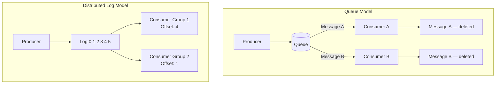

La distinción no es "cuál es mejor" sino "qué modelo se ajusta a tu necesidad." Si el mensaje es un comando transitorio consumido una sola vez, una cola es más simple y más económica. Si el evento es un hecho durable que múltiples consumidores independientes necesitan, ahora y en el futuro, y que puede que necesites reproducir, el log es la herramienta correcta. Observa cómo esto hace eco del Capítulo 2: los hechos durables quieren un log; los elementos de trabajo transitorios quieren una cola.

<details>
<summary>💡 Nota del Experto</summary>

El encuadre binario de log versus cola, aunque es pedagógicamente útil, subestima cuánto ha cambiado el límite. RabbitMQ 3.9 (2021) introdujo Streams, una abstracción de log durable, de solo adición y reproducible integrada en el broker, con semánticas de rastreo de offset del consumidor casi idénticas a Kafka. Los equipos que evalúan RabbitMQ para nuevas cargas de trabajo EDA deben evaluar Streams antes de descartarlo como una herramienta solo para colas. Los diferenciadores significativos entre Kafka y RabbitMQ Streams en este punto son la madurez del ecosistema, los controles más ricos de paralelismo a nivel de partición de Kafka, y el panorama de servicios gestionados (MSK, Confluent Cloud), no la capacidad fundamental de reproducción.
</details>

## Publish/Subscribe, Particiones y Grupos de Consumidores

Tres mecanismos hacen que el modelo de log funcione a escala, y los ingenieros senior deben entender los tres con precisión.

**Publish/subscribe** (pub/sub) significa que un productor publica en un **topic** y cualquier número de suscriptores recibe una copia. Esto es fan-out: un evento, muchos lectores independientes. Contrasta con la cola punto a punto, donde un mensaje va a un solo consumidor. En términos de nube, Amazon SNS es un servicio de fan-out pub/sub y SQS es una cola; el patrón común SNS-to-SQS combina deliberadamente ambos, usando SNS para distribuir un evento a varias colas SQS de modo que cada servicio descendente obtenga su propia copia privada para consumir a su propio ritmo.

Las **particiones** son cómo un log escala horizontalmente y preserva el orden. Un topic se divide en particiones, y cada evento se enruta a una partición mediante una **clave de partición** (partition key), típicamente un ID de entidad como `orderId`. Kafka garantiza el orden solo dentro de una partición, nunca entre particiones. Esta es la regla que toma desprevenidos a los equipos: si el orden global importa, estás limitado a una sola partición y, por lo tanto, a ningún paralelismo, por lo que deliberadamente eliges una clave que mantiene juntos los eventos causalmente relacionados mientras permite que las entidades no relacionadas se distribuyan entre particiones para maximizar el rendimiento.

*Ejemplo de código: Productor Kafka con clave de eventos por `orderId` para imponer afinidad de partición por pedido — todos los eventos para el mismo pedido caen en la misma partición; los eventos para pedidos diferentes se distribuyen entre particiones para mayor rendimiento.*

```python
# Kafka producer keying events by orderId to enforce per-order partition affinity
# Requires: pip install confluent-kafka
from __future__ import annotations

import json
from dataclasses import dataclass, field
from typing import Any

from confluent_kafka import Producer
from confluent_kafka.error import KafkaError

BROKER = "localhost:9092"
TOPIC = "order-events"


@dataclass
class OrderEvent:
    order_id: str
    event_type: str       # e.g. "OrderPlaced", "OrderShipped"
    payload: dict[str, Any] = field(default_factory=dict)

    def to_json(self) -> bytes:
        return json.dumps(
            {"type": self.event_type, "orderId": self.order_id, "payload": self.payload}
        ).encode("utf-8")


def _delivery_report(err: KafkaError | None, msg: Any) -> None:
    """Callback invoked once the broker acknowledges (or rejects) each message."""
    if err:
        print(f"[FAILED] {err}")
    else:
        # partition() and offset() confirm exactly where the event was stored
        print(f"[OK] type={json.loads(msg.value())['type']} "
              f"partition={msg.partition()} offset={msg.offset()}")


def publish_order_event(producer: Producer, event: OrderEvent) -> None:
    """Publish one order event.

    The `key` argument is the partition key.  Kafka's default partitioner applies
    a consistent hash over the key bytes, so the same orderId always maps to the
    same partition — guaranteeing that OrderPlaced arrives before OrderShipped
    for every individual order, regardless of broker load or producer restarts.
    """
    producer.produce(
        topic=TOPIC,
        key=event.order_id,           # partition key — same orderId → same partition
        value=event.to_json(),
        callback=_delivery_report,
    )
    producer.poll(0)  # flush delivery callbacks without blocking the caller


def main() -> None:
    producer = Producer({"bootstrap.servers": BROKER})

    # Two events for order-42 → same partition; OrderPlaced is always before OrderShipped
    publish_order_event(producer, OrderEvent("order-42", "OrderPlaced",  {"customerId": "cust-7", "total": 149.99}))
    publish_order_event(producer, OrderEvent("order-42", "OrderShipped", {"trackingId": "TRK-001"}))

    # A concurrent event for order-99 → likely a different partition; no ordering constraint
    # relative to order-42, but full parallelism across partitions is preserved
    publish_order_event(producer, OrderEvent("order-99", "OrderPlaced", {"customerId": "cust-3", "total": 59.00}))

    producer.flush()  # block until all in-flight messages are acknowledged or fail


if __name__ == "__main__":
    main()
```

Los **grupos de consumidores** (consumer groups) coordinan el consumo paralelo sin duplicación. Los consumidores que comparten un ID de grupo dividen las particiones entre ellos; cada partición es leída por exactamente un consumidor del grupo, lo que te brinda paralelismo de consumidores en competencia dentro del modelo de log. Mientras tanto, un grupo diferente que lee el mismo topic obtiene su propia copia completa del stream. Esta es la unificación elegante: dentro de un grupo obtienes distribución de trabajo como una cola; entre grupos obtienes fan-out como pub/sub, todo desde el mismo log durable.

> 💡 **Nota del Experto:** El texto indica correctamente que el orden está garantizado solo dentro de una partición y que la clave de partición debe mantener juntos los eventos causalmente relacionados. Lo que no se dice — y lo que rutinariamente causa incidentes en producción — es el problema de la partición caliente (hot-partition): si una pequeña cantidad de claves (un ID de comerciante de alto volumen, un producto viral) representa una gran parte de los eventos, esas particiones reciben una presión de escritura desproporcionada y el lag se acumula en los consumidores asignados a ellas mientras otras particiones permanecen inactivas. La solución ingenua de cambiar a una clave compuesta (por ejemplo, `merchantId + orderId`) restaura la distribución pero rompe la garantía de orden causal entre los pedidos de ese comerciante. Los equipos deben perfilar la cardinalidad de las claves antes de salir a producción. Cuando las situaciones de clave caliente son inevitables, una mitigación común es el salting de claves con un sufijo aleatorio acotado (por ejemplo, `orderId-0` hasta `orderId-N`) combinado con un paso de combinación, aceptando que el orden se coordina en el consumidor en lugar de estar garantizado por el broker.

> 💡 **Nota del Experto:** El texto explica los grupos de consumidores claramente, pero no señala el riesgo del rebalanceo. En el protocolo de rebalanceo eager original de Kafka, cada vez que un consumidor se une, se va o falla, todo el grupo detiene el procesamiento y reasigna todas las particiones — una pausa de parada del mundo que puede oscilar entre segundos y decenas de segundos dependiendo de los tiempos de sesión y el conteo de particiones. Bajo la entrega `at-least-once` (al menos una vez), esta ventana también produce duplicados, porque los registros en vuelo se vuelven a entregar a los consumidores recién asignados. Kafka 2.4 introdujo Incremental Cooperative Rebalancing (la estrategia de asignación `CooperativeStickyAssignor`), que transfiere solo las particiones que deben moverse, dejando el resto activamente consumido. Esto no es el valor predeterminado en muchas versiones de clientes, por lo que los despliegues en producción deben configurar explícitamente `partition.assignment.strategy=CooperativeStickyAssignor` y ajustar `session.timeout.ms` y `heartbeat.interval.ms` deliberadamente. Ignorar esto es una fuente común de misteriosos picos de lag durante los despliegues rutinarios.

## Retención, Reproducción y Reprocesamiento

El superpoder definitorio del log es que los eventos persisten después del consumo, y aquí es donde el log justifica su costo. La **retención** (retention) es la política que rige cuánto tiempo se mantienen los eventos, por tiempo (por ejemplo, siete días) o por tamaño, o indefinidamente mediante **compactación del log** (log compaction), que conserva el último evento por clave para siempre. La retención es una decisión arquitectónica de primer nivel, no un valor predeterminado que se acepta ciegamente, porque establece el límite del historial al que puedes acceder.

La **reproducción** (replay) es leer eventos históricos nuevamente restableciendo el offset de un consumidor hacia atrás. El **reprocesamiento** (reprocessing) es la aplicación de la reproducción: despliegas una nueva versión de una proyección, restableces su grupo de consumidores al offset cero, y reconstruyes su estado completo desde el historial. Esta capacidad es lo que hace prácticos el Event Sourcing (almacenamiento de eventos) y el CQRS (segregación de responsabilidades de consultas y comandos), y ambos dependen de ella en capítulos posteriores. Con una cola, nada de esto existe; una vez que un mensaje es reconocido desaparece, por lo que un error que corrompe un modelo de lectura es irrecuperable desde la capa de mensajería.

Esta única capacidad es el argumento más sólido para elegir un log sobre una cola en sistemas orientados a hechos, y la razón por la que Kafka ancla tantas plataformas orientadas a eventos. Pero no es gratuita. La retención tiene un costo de almacenamiento, la reproducción puede inundar los sistemas descendentes si no se regula, y el reprocesamiento exige que los consumidores sean idempotentes, porque los eventos reproducidos se verán nuevamente. Ese requisito de idempotencia no es opcional, y es exactamente el tema del Capítulo 4.

Con la mecánica establecida, la elección tecnológica se convierte en un ejercicio de mapeo más que en un concurso de popularidad.

*Diagrama: Diagrama de flujo de decisión para la selección de tecnología — desde la semántica del mensaje hasta el arquetipo de infraestructura apropiado.*

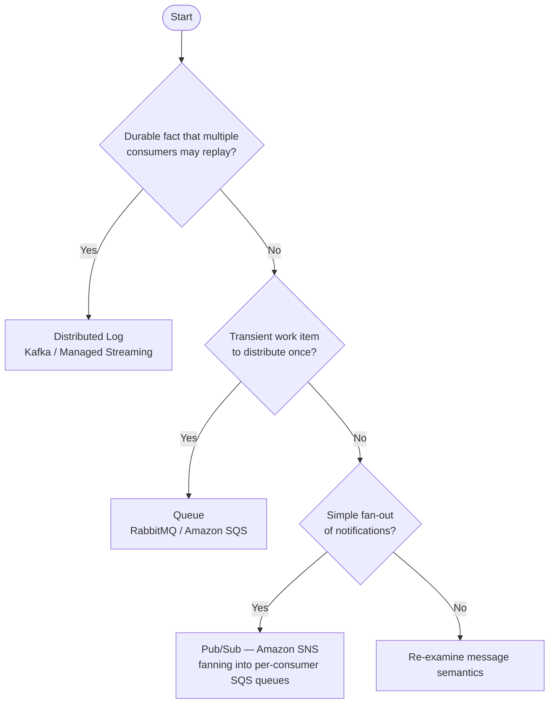

> 💡 **Nota del Experto:** La reproducción es la capacidad más poderosa del log, pero introduce un modo de fallo que el texto no cubre: la evolución del esquema. Los eventos escritos hace meses o años llevan versiones de esquema más antiguas. Cuando un consumidor se restablece al offset cero y procesa ese historial, su deserializador actual debe ser compatible con cada versión de esquema que encontrará, no solo con la actual. Sin un registro de esquemas (Confluent Schema Registry o AWS Glue Schema Registry) que aplique una política de compatibilidad (típicamente BACKWARD o FULL), un trabajo de reprocesamiento fallará a mitad del historial en el primer cambio de esquema que rompa la compatibilidad — normalmente descubierto en una ventana de recuperación de incidentes de alta presión. La regla práctica: tratar la inscripción en el registro de esquemas y la aplicación de compatibilidad como un requisito previo para habilitar la reproducción en producción, no como algo que se añade después.

<details>
<summary>💡 Nota del Experto</summary>

El texto define con precisión la compactación del log como conservar el último evento por clave para siempre, lo cual es correcto. El matiz que vale la pena agregar es que los topics compactados por log son incompatibles con el Event Sourcing completo. El Event Sourcing requiere cada evento para una entidad, no solo el último valor; la compactación descarta los eventos intermedios, lo que significa que puedes derivar el estado actual pero no puedes reconstruir la pista de auditoría ni las consultas de viaje en el tiempo. La compactación del log es apropiada para los topics de changelog (CDC, materialización de KTable) y no para los agregados con Event Sourcing, donde la retención infinita o el archivado externo de eventos (DynamoDB, EventStoreDB) es la estrategia correcta. Los equipos que habilitan la compactación en un topic con Event Sourcing descubren la pérdida de datos solo cuando intentan una reproducción completa.
</details>

> ⚠️ **Nota Crítica:** El texto afirma que la compactación del log "conserva el último evento por clave para siempre" y la presenta como una opción de retención junto con las políticas basadas en tiempo o tamaño — pero esto confunde dos objetivos incompatibles. La compactación del log es una estrategia de compactación que elimina activamente todos los eventos intermedios para una clave dada, conservando solo el valor más reciente. Un equipo que habilita la compactación en un topic e intenta posteriormente una reproducción completa para reconstruir una proyección recibirá silenciosamente un historial truncado: cada transición de estado intermedia para cada entidad ha desaparecido. La frase "conserva el último evento por clave para siempre" es técnicamente precisa para el registro que sobrevive, pero implica durabilidad del historial en lugar de su destrucción. Para un capítulo cuyo argumento completo a favor de elegir un log sobre una cola se basa en la reproducción y el reprocesamiento, recomendar la compactación sin una advertencia clara sobre lo que elimina socava directamente la tesis central del capítulo. **Corrección sugerida:** Agregar un aviso explícito de que la compactación del log es incompatible con la reproducción del historial de eventos. Reservarla para casos de uso de changelog (mantener el estado actual por clave, como en las vistas materializadas de Kafka Streams o KTables), e indicar que los sistemas con Event Sourcing deben usar retención basada en tiempo o tamaño con ventanas infinitas o muy largas, nunca compactación en topics que transportan hechos.

<details>
<summary>⚠️ Nota Crítica</summary>

El texto indica correctamente que el reprocesamiento "exige que los consumidores sean idempotentes, porque los eventos reproducidos se verán nuevamente" — pero la idempotencia en las escrituras de datos propias del consumidor es solo una capa del problema. Cualquier consumidor que desencadene efectos secundarios externos durante el procesamiento (enviar un correo electrónico, llamar a una pasarela de pago, invocar un webhook, publicar una notificación a un sistema externo) volverá a ejecutar esos efectos secundarios en la reproducción a menos que se dedupliquen de forma independiente en el límite externo. Este modo de fallo es extremadamente común y causa incidentes reales en producción: reproducir seis meses de eventos `OrderPlaced` reenvía correos electrónicos de confirmación a los clientes y vuelve a cobrar los métodos de pago. El texto aplaza todos los detalles de idempotencia al Capítulo 4, pero los ingenieros senior que leen este capítulo necesitan al menos una advertencia de una oración de que los efectos secundarios externos son un problema separado y más difícil que las escrituras de almacenamiento idempotentes.
</details>

<details>
<summary>⚠️ Nota Crítica</summary>

El capítulo argumenta con fuerza a favor de la reproducción y el reprocesamiento como la ventaja decisiva del log, pero nunca aborda la evolución del esquema — posiblemente el mayor riesgo operativo en logs de larga duración. Si un topic retiene eventos durante dos años, los consumidores que realicen una reproducción completa encontrarán eventos serializados bajo esquemas que preceden a múltiples cambios de ruptura. Avro, Protobuf y JSON Schema tienen reglas de compatibilidad, pero aplicarlas, mantener un registro de esquemas y escribir deserializadores de consumidores que manejen tanto formas antiguas como nuevas no es trivial. Un equipo que despliega un nuevo consumidor, lo restablece al offset cero, y encuentra un evento antiguo con un esquema Avro obsoleto obtendrá una excepción de deserialización y un grupo de consumidores bloqueado. Para una audiencia de arquitectos senior, tratar la reproducción como algo sencillo mientras se omite la evolución del esquema es una brecha significativa.
</details>

## Conclusiones Clave

- **La topología es una decisión de flujo de control.** La topología broker desacopla pero dispersa el proceso; la topología mediator centraliza la visibilidad al costo de una dependencia de coordinación. La coreografía y la orquestación son los modelos conductuales que se mapean sobre ellas.
- **La cola y el log son herramientas fundamentalmente diferentes.** Una cola destruye los mensajes al consumirlos y distribuye el trabajo; un log distribuido retiene los eventos y permite que los consumidores independientes lean, rebobinen y reproduzcan.
- **Las particiones preservan el orden solo dentro de una partición.** Elige una clave de partición que mantenga juntos los eventos causalmente relacionados; el orden global te cuesta paralelismo.
- **Los grupos de consumidores unifican la semántica de cola y pub/sub.** Dentro de un grupo obtienes paralelismo de consumidores en competencia; entre grupos obtienes fan-out, todo desde un log.
- **La retención y la reproducción son la ventaja decisiva del log** y la base para el Event Sourcing y el CQRS, pero demandan consumidores idempotentes y una política de retención deliberada.

## Qué Sigue

La reproducción garantiza que los consumidores verán el mismo evento más de una vez, por lo que el Capítulo 4 enfrenta de frente las garantías de entrega y muestra cómo construir consumidores idempotentes bajo la entrega at-least-once.

<!-- ASSEMBLY COMPLETE
  Chapter: Topologies and Messaging Infrastructure
  Code blocks resolved: 1 / 1
  Diagrams resolved: 3 / 3
  Expert callouts (inline): 3
  Expert callouts (collapsed): 4
  Critical callouts (inline): 1
  Critical callouts (collapsed): 4
  Unresolved markers: 0
-->


# Capítulo 4: Garantías de Entrega e Idempotencia

## Planteamiento del Problema Inicial

El Capítulo 3 terminó con una promesa y una advertencia. El log distribuido permite reproducir la historia — reprocesar millones de eventos pasados para reconstruir un modelo de lectura o corregir un error. Pero la reproducción solo funciona si reprocesar el mismo evento dos veces produce el mismo resultado que procesarlo una sola vez. Esa propiedad se llama **idempotencia (idempotency)**, y sin ella, la reproducción corrompe los datos en lugar de repararlos.

Esto no es un caso extremo. Bajo la garantía de entrega más común en sistemas productivos, **todo consumidor eventualmente recibirá un duplicado**. Un timeout de red, un reintento del broker, un consumidor que falla después de procesar pero antes de confirmar la recepción — cualquiera de estos produce un mensaje que el consumidor ya ha visto. Si tu handler cobra una tarjeta de crédito, envía un correo electrónico o decrementa el inventario, un duplicado es una pérdida financiera o reputacional real.

Los ingenieros senior frecuentemente buscan una salida reconfortante: "entrega exactamente una vez" (exactly-once delivery). Asumen que una característica del broker o un flag de un servicio en la nube hace desaparecer el problema. No es así. Este capítulo desmitifica las tres semánticas de entrega, explica con precisión por qué exactly-once es el término más malentendido en sistemas distribuidos, y te ofrece los patrones concretos — claves de deduplicación, el Transactional Outbox, las dead-letter queues — que hacen alcanzable la corrección. El objetivo es que los duplicados dejen de ser una amenaza y se conviertan en algo sin importancia.

## Semánticas At-Most-Once, At-Least-Once y Exactly-Once

Una **garantía de entrega** describe lo que el sistema de mensajería promete sobre cuántas veces un consumidor observa cada mensaje. Hay tres niveles, y la diferencia entre ellos se reduce a *cuándo* el consumidor confirma la recepción.

Un **acknowledgment** (ack) es la señal que un consumidor envía de vuelta al broker para decir "terminé con este mensaje; puedes dejar de rastrearlo." El orden de *procesar* y *ack* determina la garantía.

- **At-most-once**: ack primero, luego procesar. Si el consumidor falla después del ack pero antes de terminar, el mensaje se pierde. Cero o una entrega. Rápido, con pérdidas, aceptable solo para datos desechables como muestras de métricas o telemetría no crítica.
- **At-least-once**: procesar primero, luego ack. Si el consumidor falla después de procesar pero antes del ack, el broker reentrega. Una o más entregas. Nunca pierde un mensaje, pero garantiza duplicados. Este es el comportamiento predeterminado en Kafka, SQS y RabbitMQ.
- **Exactly-once**: el santo grial — una entrega, sin pérdidas, sin duplicados.

**Figura 4.1 — At-Most-Once vs At-Least-Once: escenarios de fallo**

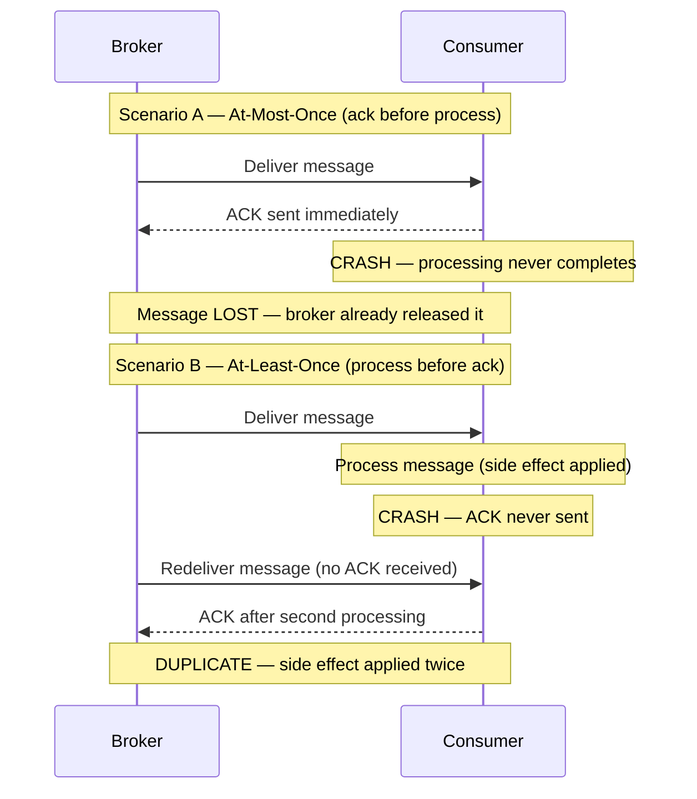

La tabla a continuación es el modelo mental a retener.

**Listado 4.1 — Tabla de referencia de semánticas de entrega como dataclasses tipadas**

```python
# Delivery-semantics reference table as typed dataclasses
from dataclasses import dataclass
from typing import Literal

@dataclass(frozen=True)
class DeliverySemantics:
    name: str
    ack_ordering: str            # when the ack is sent relative to processing
    on_crash: str                # what happens if the consumer crashes mid-flight
    duplicates_possible: bool
    message_loss_possible: bool
    typical_use_case: str

DELIVERY_SEMANTICS: list[DeliverySemantics] = [
    DeliverySemantics(
        name="at-most-once",
        ack_ordering="ack BEFORE process",
        on_crash="message is lost — broker already removed it",
        duplicates_possible=False,
        message_loss_possible=True,
        typical_use_case="metrics samples, non-critical telemetry",
    ),
    DeliverySemantics(
        name="at-least-once",
        ack_ordering="ack AFTER process",
        on_crash="broker redelivers — consumer sees it again",
        duplicates_possible=True,
        message_loss_possible=False,
        typical_use_case="default in Kafka, SQS, RabbitMQ; requires idempotent consumers",
    ),
    DeliverySemantics(
        name="exactly-once (processing)",
        ack_ordering="atomic commit covering both effect and ack",
        on_crash="transaction rolls back; redelivered message is a no-op",
        duplicates_possible=False,   # at the effect level, not at the wire level
        message_loss_possible=False,
        typical_use_case="Kafka Streams read-process-write within Kafka topology only",
    ),
]

# Quick display helper — useful in notebooks or during architecture reviews
if __name__ == "__main__":
    header = f"{'Semantic':<22} {'Ack order':<22} {'Dups?':<7} {'Loss?':<7} {'Use case'}"
    print(header)
    print("-" * len(header))
    for s in DELIVERY_SEMANTICS:
        print(
            f"{s.name:<22} {s.ack_ordering:<22} "
            f"{'yes' if s.duplicates_possible else 'no':<7} "
            f"{'yes' if s.message_loss_possible else 'no':<7} "
            f"{s.typical_use_case}"
        )
```

Ahora el malentendido. **La entrega verdaderamente exactly-once sobre una red es imposible.** Esto se deriva del Problema de los Dos Generales: dos partes que se comunican a través de un canal no confiable nunca pueden tener la certeza de que la otra recibió el mensaje final. Un emisor que no recibe ack no puede distinguir "mensaje perdido" de "ack perdido", por lo que debe reenviar (arriesgando un duplicado) o rendirse (arriesgando pérdida). Ningún protocolo escapa a esto.

Lo que los proveedores venden como "exactly-once" es en realidad **exactly-once *processing*** (procesamiento exactamente una vez), no entrega. El mensaje puede ser *entregado* muchas veces, pero el sistema produce el *efecto* solo una vez. Las semánticas exactly-once de Kafka funcionan así: combinan entrega at-least-once con productores idempotentes y escrituras transaccionales que están delimitadas **dentro de Kafka** — un ciclo de leer-procesar-escribir cuya salida es otro topic de Kafka. En el momento en que tu efecto secundario (side effect) sale de esa frontera — una base de datos, una pasarela de pago, un correo electrónico — la transacción de Kafka no puede cubrirlo. Vuelves a at-least-once, y la corrección se convierte en *tu* responsabilidad.

La conclusión con opinión: **diseña cada consumidor para at-least-once.** Trata exactly-once como un término de marketing para una optimización interna del broker, estrecha y limitada. Si tu arquitectura depende de que los mensajes nunca se dupliquen, ya está rota.

> ⚠️ **Nota Crítica:** El texto afirma que at-least-once es "el comportamiento predeterminado en Kafka, SQS y RabbitMQ." Para Kafka esto es inexacto. El comportamiento predeterminado real de Kafka es `enable.auto.commit=true` con un intervalo de auto-commit de 5 segundos. Bajo esta configuración, si el temporizador de auto-commit periódico se dispara mientras se procesa un lote y el consumidor falla posteriormente, esos mensajes en vuelo no serán reentregados — eso es comportamiento at-most-once, no at-least-once. Lograr verdadero at-least-once en Kafka requiere configuración explícita: `enable.auto.commit=false` con un commit manual emitido solo después de que el procesamiento de cada lote haya completado. Un ingeniero senior que lea este capítulo podría concluir que Kafka lo protege contra la pérdida de mensajes por defecto y omitir la configuración de commit necesaria en sistemas productivos. Califica la afirmación sobre Kafka: "At-least-once es el comportamiento efectivo predeterminado en SQS y RabbitMQ, y es alcanzable en Kafka cuando se configura el commit manual (`enable.auto.commit=false`). El auto-commit predeterminado de Kafka puede producir comportamiento at-most-once bajo escenarios de fallo y no debe confiarse en él para entrega sin pérdidas sin configuración explícita."

> 💡 **Nota del Experto:** El texto enmarca correctamente las semánticas exactly-once (EOS) de Kafka como internas al broker, pero subestima dos restricciones críticas para producción que los arquitectos descubren rutinariamente demasiado tarde. Primero, habilitar EOS requiere `enable.idempotence=true` más productores transaccionales (`transactional.id`) y conlleva un costo de throughput medible — los benchmarks de Confluent muestran consistentemente una reducción del 5–15% en el throughput de escritura bajo carga alta, porque cada lote requiere un protocolo de dos fases con el coordinador de transacciones del broker. Segundo, Kafka EOS queda invalidado en el momento en que se introduce un efecto secundario externo — pero la invalidación es silenciosa. No hay excepción, no hay advertencia, y no hay rollback de transacción del sistema externo. Los equipos que habilitan EOS en sus clientes Kafka y luego llaman a un endpoint HTTP dentro del mismo handler creen estar protegidos; no lo están. El modelo mental correcto es: EOS = Kafka-offset-commit atómico + escritura atómica en topic de Kafka, nada más.

## Idempotencia del Consumidor y Claves de Deduplicación

Una operación es **idempotente** cuando aplicarla múltiples veces produce el mismo resultado que aplicarla una sola vez. Establecer un valor (`status = SHIPPED`) es naturalmente idempotente. Incrementar un valor (`balance = balance - 10`) no lo es — ejecútalo dos veces y habrás cobrado el doble.

Como los duplicados están garantizados, el consumidor debe detectarlos y descartarlos. La herramienta es una **clave de deduplicación (deduplication key)**: un identificador estable y único transportado por el evento que permite al consumidor reconocer un mensaje que ya ha manejado. El productor debe generar esta clave una vez y adjuntarla al evento; nunca la derives del tiempo de llegada ni de un valor aleatorio en el consumidor.

Dos patrones dominan.

**1. La verificación de idempotencia (dedup store).** Antes de procesar, el consumidor verifica si la clave ya existe en un almacén de IDs procesados. Si está presente, hace ack y omite. Si está ausente, procesa y registra la clave. Esto funciona para efectos secundarios que no pueden hacerse naturalmente idempotentes, como llamar a una API de pagos externa.

**Listado 4.2 — Consumidor idempotente: dedup store + efecto secundario en una única transacción atómica**

```python
# Idempotent consumer: dedup store + side effect in a single atomic transaction
import sqlite3
import uuid
from dataclasses import dataclass


@dataclass
class Message:
    event_id: str       # stable, producer-assigned deduplication key
    payload: dict


class DuplicateEventError(Exception):
    """Raised when the event has already been processed."""


def process_payment(conn: sqlite3.Connection, payload: dict) -> None:
    """Business side effect: record payment. Runs INSIDE the same transaction."""
    conn.execute(
        "INSERT INTO payments (payment_id, amount) VALUES (?, ?)",
        (payload["payment_id"], payload["amount"]),
    )


def handle_message(conn: sqlite3.Connection, message: Message) -> None:
    """
    Idempotent message handler.

    CRITICAL RACE WINDOW:
    If we record the dedup key BEFORE the side effect and crash, the
    redelivery is silently skipped — silent loss.
    If we record the key AFTER the side effect and crash in between,
    redelivery re-executes the side effect — duplicate.
    Solution: both writes share a SINGLE local transaction so they
    commit or roll back together.
    """
    try:
        # BEGIN TRANSACTION (implicit on first DML in sqlite3 connection)
        conn.execute(
            # UNIQUE constraint on event_id enforces exactly-once semantics
            "INSERT INTO processed_events (event_id) VALUES (?)",
            (message.event_id,),
        )
    except sqlite3.IntegrityError:
        # Unique-constraint violation → already processed; safe to ack and skip
        print(f"[SKIP] Duplicate event {message.event_id}")
        return

    # Side effect and dedup record commit atomically — the race window is closed
    process_payment(conn, message.payload)
    conn.commit()
    print(f"[OK]   Processed event {message.event_id}")


# --- Bootstrap schema (run once at startup) ---
def bootstrap(conn: sqlite3.Connection) -> None:
    conn.executescript("""
        CREATE TABLE IF NOT EXISTS processed_events (
            event_id TEXT PRIMARY KEY
        );
        CREATE TABLE IF NOT EXISTS payments (
            payment_id TEXT PRIMARY KEY,
            amount     REAL NOT NULL
        );
    """)


if __name__ == "__main__":
    conn = sqlite3.connect(":memory:")
    bootstrap(conn)

    msg = Message(
        event_id=str(uuid.uuid4()),
        payload={"payment_id": "pay-001", "amount": 49.99},
    )

    handle_message(conn, msg)   # → [OK]   Processed ...
    handle_message(conn, msg)   # → [SKIP] Duplicate ... (redelivery simulation)
```

Hay una condición de carrera sutil. Si el consumidor registra la clave *antes* del efecto secundario y luego falla, el mensaje reentregado será omitido y el efecto secundario nunca ocurrirá — pérdida silenciosa. Si registra la clave *después* del efecto secundario y falla en el medio, la reentrega reprocesa — un duplicado. La solución limpia es hacer que el registro de dedup y la escritura de negocio sean **atómicos**, confirmados en la misma transacción local de base de datos. Volvemos a esta idea con el Outbox.

**2. Idempotencia natural mediante upsert.** Cuando el efecto secundario es una escritura de base de datos que controlas, modélalo de manera que reaplicarlo sea inofensivo. Un **upsert** con clave en el identificador del evento — insertar si es nuevo, sobrescribir si ya existe — hace que el reprocesamiento sea seguro por construcción. Por eso la transferencia de estado transportada por eventos (event-carried state transfer, Capítulo 1) se combina tan bien con consumidores idempotentes: el evento contiene el nuevo estado completo, y el consumidor simplemente lo escribe.

Consejo profesional: prefiere la idempotencia natural sobre un dedup store siempre que el dominio lo permita. Un dedup store agrega una búsqueda, una escritura y una política de retención — eventualmente debes expirar las claves antiguas o la tabla crece sin límite. Un upsert no tiene ninguna de esa carga operacional.

> 💡 **Nota del Experto:** El texto advierte correctamente que la retención de claves de dedup no puede crecer sin límite, pero no proporciona la fórmula para la ventana de retención mínima segura — que es donde los equipos introducen silenciosamente pérdida de datos. La retención mínima debe ser: `max_redelivery_window = message_visibility_timeout x max_receive_count`. Para SQS con un visibility timeout de 12 horas y un max receive count de 10, eso es un mínimo de 120 horas. En Kafka, el equivalente es el `retention.ms` del retry topic multiplicado por el lag máximo de reinicio del consumidor. Los equipos comúnmente establecen un TTL plano de 24 horas por intuición. Si un evento de lag del broker de Kafka retiene un mensaje en un retry topic durante 36 horas antes de ser reentregado, la entrada del dedup store ya ha expirado y el handler lo reprocesa como nuevo — un duplicado silencioso e intermitente sin stack trace.

<details>
<summary>💡 Nota del Experto</summary>
El dedup store es una dependencia con estado y debe diseñarse al mismo nivel de disponibilidad y consistencia que la base de datos de negocio principal. En la práctica, los equipos suelen usar una instancia compartida de Redis porque es rápida, y luego la despliegan sin persistencia (`appendonly no`) o con un único nodo. Cuando Redis no está disponible — un reinicio progresivo durante el parcheo, un failover de sentinel — el consumidor vuelve a procesar cada mensaje como si fuera nuevo. El dedup store deja de proteger silenciosamente. La postura mínima para producción es Redis con persistencia AOF habilitada y una configuración de Sentinel o Cluster replicado. Si la verificación de dedup y la escritura de negocio están unificadas en la misma transacción relacional (como recomienda el texto), esta preocupación desaparece — lo cual es el argumento más sólido para el enfoque de transacción unificada sobre una caché separada.
</details>

<details>
<summary>⚠️ Nota Crítica</summary>
El texto introduce el dedup store como el patrón para "efectos secundarios que no pueden hacerse naturalmente idempotentes, como llamar a una API de pagos externa," y luego propone solucionar la condición de carrera haciendo "el registro de dedup y la escritura de negocio atómicos, confirmados en la misma transacción local de base de datos." Estas dos afirmaciones están en contradicción directa. Una transacción local de base de datos solo cubre escrituras locales en base de datos. Una llamada a una API de pagos externa — el ejemplo motivador declarado — no puede participar en esa transacción. Si el consumidor escribe la clave de dedup en la BD local, confirma, y luego falla antes de llamar a la API de pagos, la verificación de dedup impedirá que la llamada se reintente jamás. Si llama primero a la API de pagos y luego falla antes de escribir la clave de dedup, la llamada se duplica. La corrección mediante transacción atómica es válida solo cuando el efecto secundario es en sí mismo una escritura local en base de datos; no resuelve el problema para llamadas a servicios externos. Divide la discusión: (1) Cuando el efecto secundario es una escritura local en BD, usa una transacción atómica que cubra tanto la escritura de negocio como la clave de dedup. (2) Cuando el efecto secundario es una llamada externa, reconoce que ninguna transacción local puede ayudar — las únicas estrategias sólidas son hacer que la API externa sea en sí misma idempotente (pasando el event ID como clave de idempotencia, una capacidad que ofrecen Stripe, Braintree y otros), o aceptar el duplicado infrecuente y construir lógica de compensación aguas abajo.
</details>

## Ordenamiento de Mensajes y Particionamiento

La idempotencia maneja los *duplicados*. No maneja la llegada *desordenada*, y los dos se confunden fácilmente. Recuerda del Capítulo 3 que un log distribuido garantiza el orden **solo dentro de una partición**, seleccionada por la **clave de partición (partition key)**. Entre particiones, no hay ninguna garantía.

Esto importa porque muchas operaciones de negocio son sensibles al orden. Considera tres eventos para una cuenta: `AccountOpened`, `Deposited`, `Withdrawn`. Procesa el retiro antes del depósito y podrías rechazar una transacción válida. La solución es enrutar todos los eventos de una entidad dada a la misma partición usando una clave de partición estable — aquí, el ID de cuenta. Misma clave, misma partición, orden garantizado.

**Figura 4.2 — Particionamiento por accountId: orden por cuenta con consumer group en paralelo**

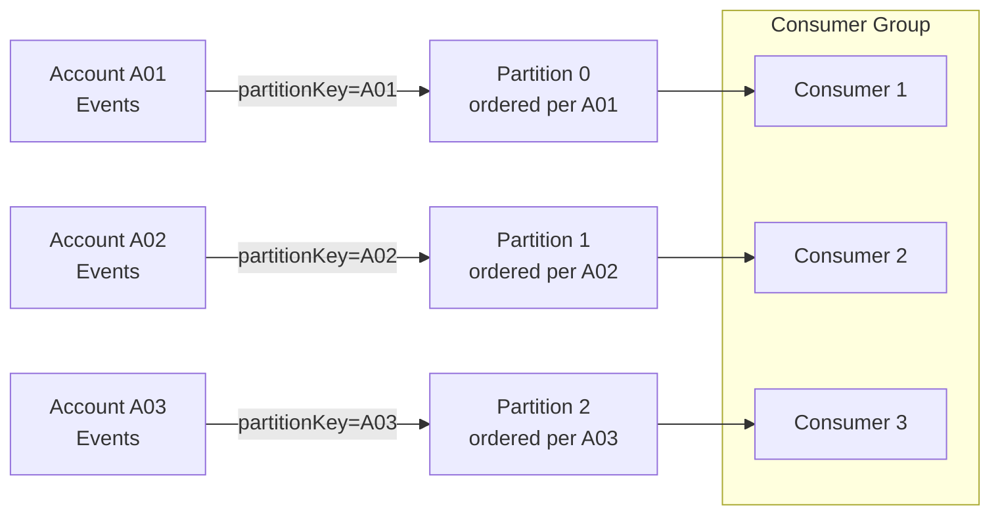

Pero el ordenamiento tiene un costo, y es la tensión que todo arquitecto debe sopesar:

- Una clave de partición **estrecha** (pocos valores distintos) preserva el orden entre grupos grandes de eventos, pero concentra la carga en pocas particiones, limitando el paralelismo.
- Una clave de partición **amplia** (muchos valores distintos, como un ID por entidad) distribuye la carga y maximiza el throughput, pero solo garantiza el orden dentro de cada pequeño grupo.

No existe ordenamiento *entre* claves. Elige la clave en la granularidad donde el orden realmente importa al negocio — generalmente el agregado (la cuenta, el pedido, el envío), no el sistema completo.

Un complemento defensivo es la **idempotencia consciente de versiones (version-aware idempotency)**. Estampa cada evento con una versión de incremento monotónico por entidad. El consumidor almacena la última versión que aplicó y rechaza cualquier evento cuya versión sea menor o igual a lo que ya ha visto. Esto hace que el consumidor sea robusto tanto a duplicados *como* a reentregas desordenadas y obsoletas en un solo mecanismo.

**Listado 4.3 — Consumidor consciente de versiones: rechaza duplicados y reentregas desordenadas obsoletas**

```python
# Version-aware consumer: rejects duplicates AND stale out-of-order redeliveries
# Time complexity: O(1) per message (single indexed lookup by entity_id)
import sqlite3
from dataclasses import dataclass


@dataclass
class VersionedEvent:
    event_id: str
    entity_id: str   # e.g. account_id — determines partition key
    version: int     # monotonically increasing per entity; producer assigns this
    payload: dict


class StaleEventError(Exception):
    """Raised when the incoming version is not strictly greater than stored."""


def apply_event(conn: sqlite3.Connection, event: VersionedEvent) -> None:
    """Business state update — called only when the version advances."""
    conn.execute(
        """
        INSERT INTO account_state (entity_id, balance, last_version)
        VALUES (:entity_id, :balance, :version)
        ON CONFLICT (entity_id) DO UPDATE
          SET balance      = :balance,
              last_version = :version
        """,
        {
            "entity_id": event.entity_id,
            "balance": event.payload.get("balance"),
            "version": event.version,
        },
    )


def handle_versioned_event(conn: sqlite3.Connection, event: VersionedEvent) -> None:
    """
    Version gate: apply the event only if its version strictly exceeds
    the last stored version for this entity.
    Handles duplicates (same version re-delivered) and
    stale redeliveries (older version arriving after a newer one).
    """
    row = conn.execute(
        "SELECT last_version FROM account_state WHERE entity_id = ?",
        (event.entity_id,),
    ).fetchone()

    stored_version: int = row[0] if row else -1  # -1 → entity never seen before

    if event.version <= stored_version:
        # Duplicate or stale out-of-order redelivery — safe to discard
        print(
            f"[DISCARD] entity={event.entity_id} "
            f"incoming_v={event.version} stored_v={stored_version}"
        )
        return

    apply_event(conn, event)
    conn.commit()
    print(
        f"[APPLIED] entity={event.entity_id} "
        f"v{stored_version} -> v{event.version}"
    )


# --- Bootstrap ---
def bootstrap(conn: sqlite3.Connection) -> None:
    conn.execute("""
        CREATE TABLE IF NOT EXISTS account_state (
            entity_id    TEXT PRIMARY KEY,
            balance      REAL NOT NULL DEFAULT 0,
            last_version INTEGER NOT NULL DEFAULT -1
        )
    """)


if __name__ == "__main__":
    conn = sqlite3.connect(":memory:")
    bootstrap(conn)

    events = [
        VersionedEvent("e1", "acct-42", version=1, payload={"balance": 100.0}),
        VersionedEvent("e2", "acct-42", version=2, payload={"balance": 90.0}),
        VersionedEvent("e2", "acct-42", version=2, payload={"balance": 90.0}),  # duplicate
        VersionedEvent("e1", "acct-42", version=1, payload={"balance": 100.0}), # stale
        VersionedEvent("e3", "acct-42", version=3, payload={"balance": 150.0}),
    ]

    for ev in events:
        handle_versioned_event(conn, ev)
```

Orientación con opinión: no intentes imponer un ordenamiento global en todo tu flujo de eventos. Destruye la escalabilidad que te llevó a elegir un log en primer lugar. Orden por agregado; tolera el desorden en todo lo demás.

<details>
<summary>💡 Nota del Experto</summary>
La idempotencia consciente de versiones usando un número de versión de incremento monotónico por entidad es sólida cuando un único productor controla el ciclo de vida de la entidad. Se rompe en patrones comunes de múltiples productores — por ejemplo, cuando múltiples servicios pueden emitir independientemente eventos para el mismo agregado (un pedido actualizado tanto por el servicio de fulfillment como por el servicio de pagos). Coordinar un contador de secuencia global entre productores crea acoplamiento y un problema de coordinación distribuida. La solución estándar de la industria es empujar la aplicación de versiones a la base de datos mediante bloqueo optimista (optimistic locking): el consumidor realiza una actualización condicional `WHERE current_version = N - 1` y trata cero filas afectadas como un evento duplicado o obsoleto, reintentando o descartando según corresponda. Así es como Axon Framework y EventStoreDB implementan la aplicación de secuencias en el límite del agregado sin requerir coordinación entre productores.
</details>

<details>
<summary>💡 Nota del Experto</summary>
El problema del hotspot de partición está subestimado en las discusiones sobre selección de clave de partición, y es agudo en sistemas SaaS multiinquilino. Si la clave de partición es el ID de inquilino y un solo inquilino representa el 40% del volumen de tráfico (un patrón común en contratos empresariales), los eventos de ese inquilino se concentran en una o pocas particiones. El paralelismo del consumer group está limitado por el conteo de particiones, por lo que las particiones calientes crean un cuello de botella de procesamiento que ninguna cantidad de escalado horizontal de consumidores puede resolver sin un aumento en el conteo de particiones — lo cual requiere reconstruir el topic de Kafka o una corriente de reparticionamiento. Diseña la clave de partición en la granularidad donde importa el orden (ID de agregado, no ID de inquilino), y usa un mecanismo de fan-out separado si el aislamiento por inquilino es un requisito.
</details>

<details>
<summary>⚠️ Nota Crítica</summary>
El mecanismo de idempotencia consciente de versiones (aplicar solo si `incoming_version > stored_version`, de lo contrario descartar) crea silenciosamente pérdida permanente de eventos cuando ocurre una brecha de versión. Si un consumidor ha aplicado la versión 3 y la versión 4 nunca se entrega (perdida, expirada, enviada a DLQ), entonces llega la versión 5: la verificación `5 > 3` pasa y se aplica la versión 5, omitiendo permanentemente la transición de estado de la versión 4. El sistema ahora está en un estado inconsistente sin señal de error. El texto presenta el patrón como robustez contra "duplicados y reentregas obsoletas" sin mencionar que implícitamente asume entrega sin brechas — una suposición que contradice la realidad de at-least-once-con-DLQ descrita en otro lugar del mismo capítulo. Agrega una protección contra brechas de versión: "El patrón de verificación de versión requiere una secuencia monotónicamente continua por entidad para ser seguro. Complémentalo con un paso de detección de brechas: si `incoming_version > stored_version + 1`, el consumidor debe aparcar el mensaje (p. ej., una cola de reintento) o emitir una alerta en lugar de aplicarlo silenciosamente. En la práctica, combina verificaciones de versión con asignación de secuencia exactamente una vez en el productor — típicamente usando un contador de bloqueo optimista en la propia fila del agregado."
</details>

## El Patrón Transactional Outbox y el Problema del Dual-Write

Todo lo anterior protege al *consumidor*. Pero el *productor* tiene su propio modo de fallo, y es una de las fuentes más comunes de pérdida silenciosa de datos en sistemas orientados a eventos: el **problema del dual-write (escritura dual)**.

Un servicio generalmente necesita hacer dos cosas al manejar un comando: actualizar su propia base de datos y publicar un evento. Estos son dos sistemas separados — una base de datos y un broker — sin transacción compartida. Cuatro secuencias son posibles, y dos de ellas son corruptas:

1. Escribe en BD, publica evento — ambos tienen éxito. Correcto.
2. Escribe en BD, luego falla antes de publicar — el estado cambió, pero no hay evento. Los consumidores nunca se enteran. **Evento perdido.**
3. Publica evento, luego falla antes de escribir en BD — los consumidores actúan sobre un hecho que nunca se hizo verdad. **Evento fantasma.**
4. Ninguno ocurre. Correcto (nada cambió).

No puedes hacer que dos sistemas independientes confirmen atómicamente sin una transacción distribuida, y las transacciones distribuidas (two-phase commit) son exactamente lo que abandonamos en arquitecturas cloud-native por su costo y fragilidad.

**Figura 4.3 — La brecha de fallo del dual-write: BD confirmada, publicación al broker nunca ocurre**

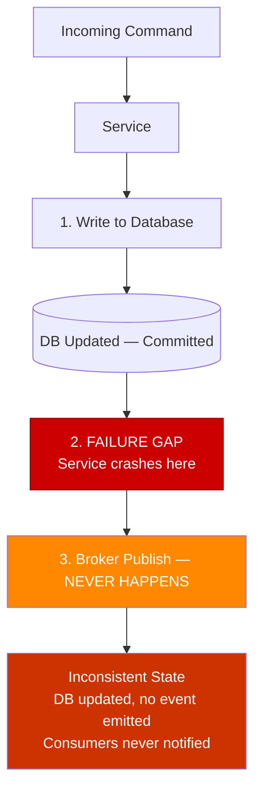

El patrón **Transactional Outbox** resuelve esto de manera elegante. En lugar de escribir en la base de datos *y* el broker, el servicio escribe solo en la base de datos. En la **misma transacción local** que actualiza las tablas de negocio, también inserta el evento en una **tabla outbox** en esa misma base de datos. Como es una transacción sobre una sola base de datos, es atómica: o bien el cambio de estado y la fila del outbox se confirman juntos, o ninguno lo hace. El problema del dual-write desaparece.

Un proceso separado luego lee las filas no publicadas del outbox y las publica en el broker, marcando cada una como enviada. Este proceso opera **at-least-once** — si falla después de publicar pero antes de marcar una fila, la vuelve a publicar al reiniciarse. Lo cual es exactamente por qué los consumidores deben ser idempotentes. El Outbox no elimina los duplicados; garantiza *ninguna pérdida*, y empuja la deduplicación al consumidor, donde ya construimos defensas para ello.

**Listado 4.4 — Transactional Outbox: un único commit atómico cubre el registro de negocio y la fila del outbox**

```python
# Transactional Outbox: one atomic commit covers business record + outbox row
import json
import sqlite3
import uuid
from dataclasses import dataclass, field
from datetime import datetime, timezone


@dataclass
class Order:
    order_id: str
    customer_id: str
    total_amount: float
    status: str = "PLACED"


@dataclass
class OutboxRow:
    event_id: str = field(default_factory=lambda: str(uuid.uuid4()))
    aggregate_type: str = "Order"
    event_type: str = "OrderPlaced"
    payload: dict = field(default_factory=dict)
    created_at: str = field(
        default_factory=lambda: datetime.now(timezone.utc).isoformat()
    )
    published: bool = False


def place_order(conn: sqlite3.Connection, order: Order) -> OutboxRow:
    """
    ── COMMIT BOUNDARY ──────────────────────────────────────────────────
    Both the orders INSERT and the outbox INSERT execute in the SAME
    local transaction. Either both commit or both roll back — no dual-write
    problem, no phantom events, no lost events.
    ─────────────────────────────────────────────────────────────────────
    """
    outbox_row = OutboxRow(
        aggregate_type="Order",
        event_type="OrderPlaced",
        payload={
            "order_id": order.order_id,
            "customer_id": order.customer_id,
            "total_amount": order.total_amount,
            "status": order.status,
        },
    )

    # ── BEGIN implicit transaction ──
    conn.execute(
        "INSERT INTO orders (order_id, customer_id, total_amount, status) "
        "VALUES (?, ?, ?, ?)",
        (order.order_id, order.customer_id, order.total_amount, order.status),
    )
    conn.execute(
        "INSERT INTO outbox (event_id, aggregate_type, event_type, payload, created_at, published) "
        "VALUES (?, ?, ?, ?, ?, ?)",
        (
            outbox_row.event_id,
            outbox_row.aggregate_type,
            outbox_row.event_type,
            json.dumps(outbox_row.payload),   # serialized event carried to broker
            outbox_row.created_at,
            False,
        ),
    )
    conn.commit()  # ── COMMIT: both rows land together or neither does ──

    print(f"[COMMITTED] order={order.order_id}  outbox_event={outbox_row.event_id}")
    return outbox_row


def relay_unpublished(conn: sqlite3.Connection) -> None:
    """
    Outbox relay (runs in a separate process/thread).
    Operates at-least-once: if it crashes after publish but before marking
    the row as published, it will republish on next run — consumers must be
    idempotent (event_id is the deduplication key).
    """
    rows = conn.execute(
        "SELECT event_id, event_type, payload FROM outbox WHERE published = 0"
    ).fetchall()

    for event_id, event_type, payload in rows:
        # Simulate broker publish (replace with real broker SDK call)
        print(f"[RELAY -> BROKER] event_id={event_id} type={event_type}")
        conn.execute(
            "UPDATE outbox SET published = 1 WHERE event_id = ?", (event_id,)
        )
        conn.commit()


# --- Bootstrap ---
def bootstrap(conn: sqlite3.Connection) -> None:
    conn.executescript("""
        CREATE TABLE IF NOT EXISTS orders (
            order_id     TEXT PRIMARY KEY,
            customer_id  TEXT NOT NULL,
            total_amount REAL NOT NULL,
            status       TEXT NOT NULL
        );
        CREATE TABLE IF NOT EXISTS outbox (
            event_id       TEXT PRIMARY KEY,
            aggregate_type TEXT NOT NULL,
            event_type     TEXT NOT NULL,
            payload        TEXT NOT NULL,   -- JSON
            created_at     TEXT NOT NULL,
            published      INTEGER NOT NULL DEFAULT 0
        );
    """)


if __name__ == "__main__":
    conn = sqlite3.connect(":memory:")
    bootstrap(conn)

    order = Order(
        order_id=str(uuid.uuid4()),
        customer_id="cust-7",
        total_amount=129.90,
    )
    place_order(conn, order)
    relay_unpublished(conn)
```

Dos mecanismos impulsan el relay del outbox. El **polling** consulta la tabla en un intervalo — simple, portable, pero agrega latencia y carga a la base de datos. **Change Data Capture (CDC)** sigue el log de transacciones de la base de datos (mediante herramientas como Debezium) y transmite nuevas filas del outbox al broker en tiempo casi real, sin sobrecarga de polling. CDC es la opción más escalable para sistemas de alto volumen; el polling es perfectamente adecuado para la mayoría.

Consejo profesional: el event ID escrito en la fila del outbox es la misma clave de deduplicación que usa el consumidor. Diseña los dos juntos. El Outbox del productor y la verificación de dedup del consumidor son dos mitades de un contrato de corrección de extremo a extremo.

> 💡 **Nota del Experto:** CDC mediante Debezium es la elección correcta para alto throughput, pero requiere permisos a nivel de base de datos que los DBAs corporativos frecuentemente restringen y que las ofertas PaaS (Amazon RDS, Azure Database for PostgreSQL Flexible Server) exponen solo bajo configuraciones específicas. Específicamente: el acceso al binlog de MySQL requiere los grants `REPLICATION SLAVE` y `REPLICATION CLIENT`, y `binlog_format=ROW` debe configurarse a nivel del servidor. La replicación lógica de PostgreSQL requiere el rol `REPLICATION` y un replication slot, y RDS impone un límite estricto de 20 replication slots que cuenta contra todos los consumidores. Los equipos descubren rutinariamente esta restricción durante UAT o el corte a producción, no durante el diseño. El fallback al polling siempre está disponible, pero la decisión arquitectónica debe tomarse con pleno conocimiento de los requisitos de permisos en el entorno objetivo — no diferirla al día del despliegue.

<details>
<summary>⚠️ Nota Crítica</summary>
El Transactional Outbox se presenta como solución al problema del dual-write, pero introduce una nueva dependencia operacionalmente significativa que no se reconoce: el proceso relay del outbox. Ya sea implementado como un bucle de polling o un conector CDC de Debezium, este relay es un proceso separado que puede fallar, retrasarse o no estar disponible. Mientras la tabla outbox acumula filas, los consumidores aguas abajo no reciben eventos — un escenario que es funcionalmente equivalente al problema de "evento perdido" que el patrón pretendía resolver, excepto que ahora es una interrupción del proceso relay en lugar de un fallo del servicio lo que causa el retraso. Para CDC específicamente, los conectores Debezium son sensibles a cambios en el esquema de la base de datos (un `ALTER TABLE` en una tabla capturada puede detener el conector) y requieren su propio despliegue de alta disponibilidad. El texto describe CDC como "la opción más escalable" sin revelar ninguna de esta carga operacional. Agrega un párrafo sobre la fiabilidad del relay: "El relay del outbox es un componente requerido de la corrección del patrón. Trátalo con la misma disciplina operacional que el servicio mismo: despliégalo con redundancia, monitorea su lag (la antigüedad de la fila del outbox no publicada más antigua) y genera alertas cuando ese lag supere tu SLA. Para CDC con Debezium, planifica procedimientos de cambio de esquema que pasen y reanuden el conector de forma segura, y almacena los offsets del conector en un almacén duradero en lugar de en memoria."
</details>

<details>
<summary>⚠️ Nota Crítica</summary>
El patrón Outbox tal como se describe no preserva el ordenamiento entre transacciones concurrentes de múltiples instancias de la aplicación. Considera dos solicitudes concurrentes A y B: A comienza su transacción primero (inserta fila del outbox con `id=100`), B comienza ligeramente después (inserta fila del outbox con `id=101`), pero B confirma primero. El relay recoge la fila 101 y publica el evento de B. Luego A confirma y la fila 100 se publica después. Los consumidores que dependen de la entrega en orden de inserción ahora observan el evento de B antes que el de A — violando la garantía de ordenamiento que el capítulo dedicó la sección anterior a construir. Esta brecha existe tanto para relays basados en polling como para relays basados en CDC (CDC lee transacciones confirmadas, no el orden de inicio). El texto guarda silencio sobre este modo de fallo. Señala la limitación explícitamente: "El Outbox garantiza entrega sin pérdidas, no ordenamiento global estricto entre solicitudes concurrentes. Para casos de uso que requieran ordenamiento estricto, impón acceso de escritura única por agregado (p. ej., serializa comandos a través de una cola o un advisory lock de base de datos por ID de entidad), o acepta que el Outbox proporciona ordenamiento por entidad solo cuando las escrituras a la misma entidad se serializan aguas arriba."
</details>

## Dead-Letter Queues y Políticas de Reintento

La idempotencia y el Outbox asumen que los mensajes eventualmente tienen éxito. Algunos nunca lo harán. Un payload malformado, una incompatibilidad permanente de esquema o una regla de negocio que siempre rechaza el mensaje crea un **mensaje envenenado (poison message)** — uno que falla sin importar cuántas veces se reintente. Bajo at-least-once, un broker ingenuo lo reentrega para siempre, bloqueando la partición o privando de recursos al consumidor. Esto es una interrupción autoinfligida.

La herramienta de contención es una **dead-letter queue (DLQ)**: una cola separada a donde se mueven los mensajes después de agotar su presupuesto de reintentos. La DLQ aísla el mensaje envenenado para que el flujo saludable siga fluyendo, y preserva el mensaje fallido para inspección y reprocesamiento manual en lugar de descartarlo.

Una **política de reintento** sólida distingue dos clases de fallos:

- **Fallos transitorios** — un timeout, una dependencia con throttling, un breve problema de red. Estos merecen reintentos, idealmente con **exponential backoff** (retrasos crecientes: 1s, 2s, 4s, 8s) y **jitter** (aleatorización) para evitar una horda atronadora de reintentos sincronizados que golpeen a un servicio en recuperación.
- **Fallos permanentes** — un error de validación, un mensaje no parseable. Reintentar no tiene sentido; enrútalos a la DLQ inmediatamente. Desperdiciar un presupuesto de reintentos en un mensaje que nunca puede tener éxito solo retrasa lo inevitable.

**Listado 4.5 — Política de reintento: exponential backoff con jitter para errores transitorios; DLQ inmediata para permanentes**

```python
# Retry policy: exponential backoff with jitter for transient errors; immediate DLQ for permanent
import random
import time
import logging
from dataclasses import dataclass
from typing import Callable

logger = logging.getLogger(__name__)


# ── Failure taxonomy ──────────────────────────────────────────────────────────

class TransientError(Exception):
    """Temporary failure — worth retrying (timeout, throttle, network blip)."""


class PermanentError(Exception):
    """Unrecoverable failure — retrying is pointless (bad schema, invalid payload)."""


# ── Retry policy configuration ────────────────────────────────────────────────

@dataclass
class RetryPolicy:
    max_attempts: int = 5          # total delivery attempts before dead-lettering
    base_delay_seconds: float = 1.0
    max_delay_seconds: float = 30.0
    jitter_factor: float = 0.3     # ±30 % randomization to spread retry waves


def _backoff_delay(attempt: int, policy: RetryPolicy) -> float:
    """Exponential backoff: base * 2^attempt, capped, then jittered."""
    delay = min(
        policy.base_delay_seconds * (2 ** attempt),
        policy.max_delay_seconds,
    )
    # Jitter: multiply by a random factor in [1 - jitter, 1 + jitter]
    jitter = 1.0 + policy.jitter_factor * (2 * random.random() - 1)
    return delay * jitter


def send_to_dlq(message: dict, reason: str) -> None:
    """Dead-letter the message — triggers an alert in production monitoring."""
    logger.error(
        "DLQ: message dead-lettered",
        extra={"event_id": message.get("event_id"), "reason": reason},
    )
    # Replace with real DLQ publish (SQS redrive, Kafka DLQ topic, etc.)


def process_with_retry(
    message: dict,
    handler: Callable[[dict], None],
    policy: RetryPolicy | None = None,
) -> None:
    """
    Drive a message handler through the retry policy.

    - PermanentError  → dead-letter immediately, no retries wasted
    - TransientError  → retry up to max_attempts with exponential backoff + jitter
    - Exceeded budget → dead-letter with the last exception as reason
    """
    if policy is None:
        policy = RetryPolicy()

    for attempt in range(policy.max_attempts):
        try:
            handler(message)
            return  # success — done
        except PermanentError as exc:
            # Retrying a permanent error is pointless; route to DLQ immediately
            send_to_dlq(message, reason=f"PermanentError: {exc}")
            return
        except TransientError as exc:
            if attempt + 1 == policy.max_attempts:
                # Retry budget exhausted — dead-letter
                send_to_dlq(message, reason=f"TransientError after {policy.max_attempts} attempts: {exc}")
                return
            delay = _backoff_delay(attempt, policy)
            logger.warning(
                "Transient failure, retrying",
                extra={"attempt": attempt + 1, "delay_s": round(delay, 2), "error": str(exc)},
            )
            time.sleep(delay)


# ── Example usage ─────────────────────────────────────────────────────────────

if __name__ == "__main__":
    logging.basicConfig(level=logging.INFO)

    call_count = 0

    def flaky_handler(msg: dict) -> None:
        """Simulates two transient failures then success."""
        global call_count
        call_count += 1
        if call_count < 3:
            raise TransientError("downstream timeout")
        print(f"[PROCESSED] event_id={msg['event_id']}")

    def bad_handler(msg: dict) -> None:
        raise PermanentError("schema validation failed: missing required field 'amount'")

    policy = RetryPolicy(max_attempts=5, base_delay_seconds=0.05)  # fast for demo

    process_with_retry({"event_id": "ev-001"}, flaky_handler, policy)
    process_with_retry({"event_id": "ev-002"}, bad_handler, policy)
```

Establece un **conteo máximo de recepciones (maximum receive count)** — el número de intentos de entrega antes de que el mensaje sea enviado a la dead-letter. En SQS esto es una política de redrive nativa; en Kafka típicamente se implementa con retry topics y un DLQ topic final. Elige el conteo deliberadamente: demasiado bajo y los problemas transitorios envían mensajes a la DLQ; demasiado alto y un mensaje envenenado da vueltas durante minutos antes de la cuarentena.

Críticamente, la DLQ no es un cubo de basura. Un mensaje que aterriza ahí es una **señal operacional** que demanda una alerta. El Capítulo 9 trata el monitoreo de DLQ y el reprocesamiento seguro en profundidad; por ahora, la regla es simple: **una DLQ no vigilada es un buffer de pérdida silenciosa de datos.** Cada mensaje que entra en ella representa un hecho de negocio que tu sistema falló en honrar.

> ⚠️ **Nota Crítica:** El texto advierte que un mensaje envenenado "da vueltas durante minutos antes de la cuarentena," pero en Kafka esto es una subestimación grave de la consecuencia. Kafka garantiza el orden dentro de una partición; un consumidor no avanza más allá de un offset fallido hasta que ese mensaje sea procesado exitosamente o saltado manualmente. Un mensaje envenenado con un presupuesto de reintentos generoso (p. ej., 10 intentos × exponential backoff alcanzando 512s) puede bloquear cada mensaje posterior en toda una partición durante horas, haciendo que el lag del consumer group crezca sin límite para esa partición. A diferencia de SQS o RabbitMQ, no hay un mecanismo nativo para aparcar un único mensaje de Kafka en medio del flujo y continuar consumiendo — el patrón de retry-topic debe diseñarse deliberadamente. El texto describe esto como un inconveniente de tiempo en lugar de una posible interrupción a nivel de toda la partición, lo que podría llevar a los arquitectos a subestimar las salvaguardas necesarias. Agrega una nota específica para Kafka: "En un consumidor Kafka con ordenamiento por partición, un mensaje envenenado es únicamente peligroso — detiene el progreso hacia adelante en toda la partición hasta agotarse. El patrón de retry-topic (una cadena separada de topics retry-1, retry-2, … DLQ) existe precisamente para permitir que la partición principal avance. Si tu sistema usa Kafka con garantías de ordenamiento, implementa retry topics desde el principio, no como una adición posterior."

> 💡 **Nota del Experto:** El texto distingue correctamente los fallos transitorios de los permanentes, pero omite un modo de fallo crítico para producción que se sitúa entre los dos: la reentrega a nivel de infraestructura que ocurre antes de que se active cualquier política de reintento a nivel de aplicación. En SQS, si el `VisibilityTimeout` es más corto que el tiempo de procesamiento de un mensaje, el broker hace el mensaje visible nuevamente mientras el primer consumidor aún lo está procesando — causando entrega dual concurrente a dos instancias de consumidor diferentes. Ninguna instancia ve un error a nivel de aplicación; ambas procesan exitosamente y ambas hacen ack. El resultado es un duplicado que elude el dedup store si ambas lecturas ocurren antes de que cualquiera de las escrituras confirme. La regla segura es: establece `VisibilityTimeout` a al menos 6 veces la latencia de procesamiento P99, y monitorea la métrica de CloudWatch `ApproximateNumberOfMessagesNotVisible` para detectar eventos de entrega concurrente. En Kafka, el fallo análogo es un timeout de sesión que causa un rebalanceo de partición durante el procesamiento, que reentrega desde el último offset confirmado.

## Conclusiones Clave

- **At-least-once es el predeterminado realista.** La entrega verdaderamente exactly-once *delivery* es imposible sobre una red (Problema de los Dos Generales); lo que los proveedores venden es exactly-once *processing*, delimitado dentro del broker y nulo en el momento en que un efecto secundario toca un sistema externo.
- **Los duplicados están garantizados, por lo que los consumidores deben ser idempotentes.** Usa idempotencia natural (upserts con clave en el event ID) donde el dominio lo permita, y un almacén de claves de deduplicación donde los efectos secundarios sean externos.
- **El orden es una garantía delimitada a la partición.** Enruta eventos sensibles al orden para un agregado a una partición mediante una clave de partición estable, y usa números de versión por entidad para rechazar entregas obsoletas o duplicadas.
- **El Transactional Outbox derrota el problema del dual-write** al confirmar el cambio de estado y el evento atómicamente en una base de datos, luego retransmitiendo al broker at-least-once — razón por la cual la idempotencia del consumidor es innegociable.
- **Las dead-letter queues contienen mensajes envenenados.** Reintenta fallos transitorios con exponential backoff y jitter; envía a la dead-letter los fallos permanentes inmediatamente; y genera alertas en cada llegada a la DLQ.

## Qué Sigue

Con la entrega confiable y el procesamiento idempotente establecidos, el Capítulo 5 se centra en la estructura — introduciendo CQRS para separar la ruta de escritura de la ruta de lectura y resolver la discrepancia entre cómo se almacenan los datos y cómo se consultan.

<!-- ASSEMBLY COMPLETE
  Chapter: Delivery Guarantees and Idempotency
  Code blocks resolved: 5 / 5
  Diagrams resolved: 3 / 3
  Expert callouts (inline): 4
  Expert callouts (collapsed): 3
  Critical callouts (inline): 2
  Critical callouts (collapsed): 4
  Unresolved markers: 0
-->


# Capítulo 5: CQRS — Separando Lecturas y Escrituras

## Planteamiento del Problema Inicial

El Capítulo 4 dejó el camino de escritura en buena forma. Los eventos fluyen al menos una vez, los consumidores son idempotentes y el Transactional Outbox publica de forma confiable. Pero queda una pregunta persistente: una vez que esos eventos han transformado el estado de tu sistema, ¿cómo puede alguien *leer* ese estado de manera eficiente? Una sola tabla optimizada para hacer cumplir invariantes en la escritura casi nunca es la misma tabla que deseas consultar para un panel de control, una pantalla de búsqueda o un feed móvil. Esa es la tensión que **Command Query Responsibility Segregation (CQRS)** fue creado para resolver.

CQRS es uno de los patrones más incomprendidos en el conjunto de herramientas orientadas a eventos. Algunos equipos lo tratan como un acompañante obligatorio de Event Sourcing. Otros lo despliegan reflexivamente en cada microservicio y se ahogan en complejidad accidental. Ningún reflejo es correcto. CQRS es una respuesta específica a un problema estructural concreto — la discrepancia entre la forma de los datos que se escriben y la forma en que se leen. Este capítulo define ese problema con precisión, muestra cómo separar los dos caminos, te enseña a construir modelos de lectura a partir de eventos, enfrenta honestamente el costo de consistencia y — lo más importante para una audiencia senior — traza una línea firme sobre cuándo CQRS es simplemente sobre-ingeniería.

## El Problema de la Discrepancia de Forma

Cada sistema persistente tiene dos trabajos fundamentalmente diferentes. Por un lado, acepta cambios y debe proteger las reglas de negocio — una cuenta no puede quedar en descubierto, un pedido no puede enviarse dos veces. Por otro lado, responde preguntas — muéstrame el historial de pedidos de este cliente, clasifica los productos por ingresos, lista las facturas impagas. Estos dos trabajos llevan el modelo de datos en direcciones opuestas.

El lado de escritura quiere **normalización** (normalization). Las tablas normalizadas previenen anomalías, hacen cumplir la integridad referencial y mantienen los invariantes localizados en un único agregado. El lado de lectura quiere **desnormalización** (denormalization). Una pantalla de consulta quiere todo lo que necesita pre-unido, aplanado e indexado para el patrón de acceso exacto que sirve. Forzar ambos trabajos a un mismo esquema significa que ninguno obtiene lo que necesita. Este es el **problema de discrepancia de forma**: la estructura óptima para validar un cambio difiere de la estructura óptima para responder una pregunta.

Considera un servicio de pedidos de e-commerce corporativo. El modelo de escritura es un agregado `Order` ordenado con líneas de artículos, que hace cumplir que los totales concuerden y el stock esté reservado. Ahora el negocio pide una pantalla que muestre, por cliente, sus últimos diez pedidos con miniaturas de productos, estado de envío y una cifra de valor de vida acumulado. Servir eso desde el esquema normalizado de escritura implica un join de múltiples tablas ejecutado en cada carga de página, compitiendo por bloqueos con las propias transacciones que realizan pedidos.

**Figura 5.1 — Modelo de Escritura vs Modelo de Lectura: el puente de proyección**

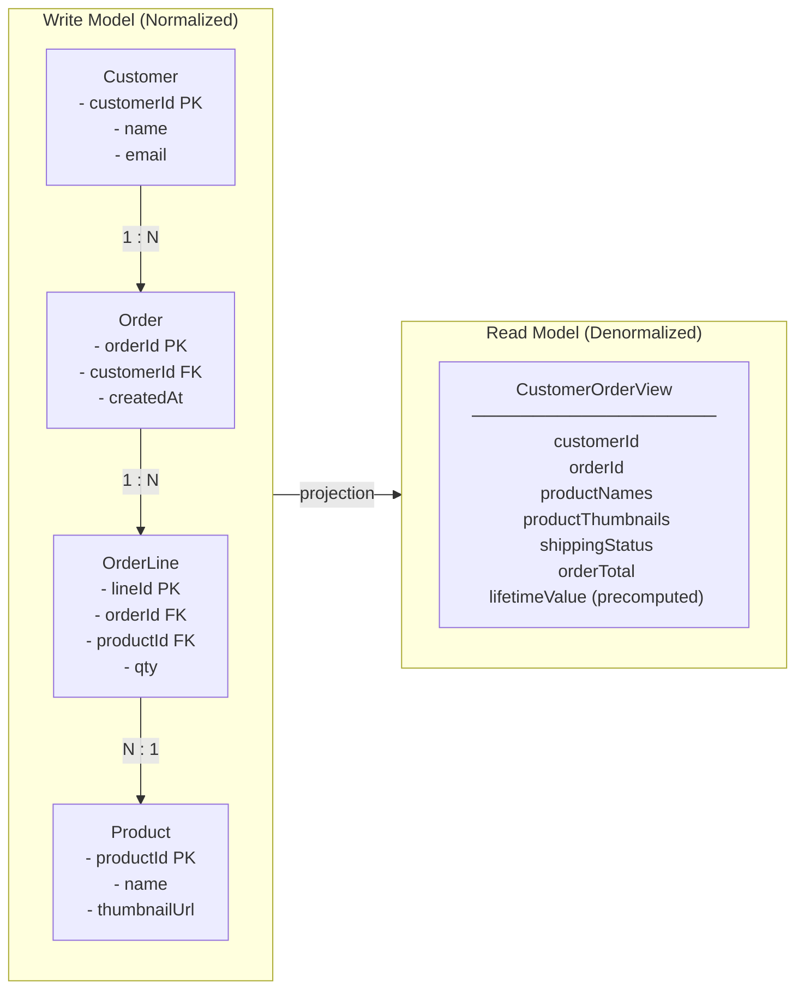

*El modelo de escritura (izquierda) mantiene los datos normalizados en cuatro tablas para hacer cumplir invariantes y prevenir anomalías; el modelo de lectura (derecha) aplana esas tablas en un único documento pre-optimizado para la pantalla de consulta. La flecha de "projection" entre ellos representa el proceso orientado a eventos que deriva continuamente la forma de lectura a partir de los eventos del lado de escritura — este es el núcleo estructural de CQRS.*

La solución ingenua es seguir añadiendo índices y réplicas de lectura al modelo único. Eso compra tiempo pero no una salida. Los índices optimizados para lectura ralentizan las escrituras; las consultas de informes pesadas compiten con la carga transaccional; y el esquema se calcifica porque debe satisfacer a todos los consumidores a la vez. CQRS propone un corte más limpio: deja de pretender que un modelo puede ser ambos. Deja que el lado de escritura permanezca liviano y orientado a reglas, y deriva las formas de lectura que necesites como estructuras separadas y especialmente construidas.

<details>
<summary>⚠️ Nota Crítica</summary>

"La solución ingenua es seguir añadiendo índices y réplicas de lectura al modelo único. Eso compra tiempo pero no una salida." Esto enmarca las réplicas de lectura y las vistas materializadas simplemente como un paliativo, implicando que son soluciones a largo plazo inadecuadas. Para una clase significativa de sistemas reales — relaciones de lectura/escritura moderadas, diversidad de consultas acotada, patrones de acceso predecibles — una réplica de lectura bien mantenida con una vista materializada es una solución permanente completamente adecuada, no un peldaño hacia CQRS. El texto no reconoce esto, empujando potencialmente a los arquitectos hacia una complejidad innecesaria cuando la solución aburrida sería suficiente. Esto está en tensión con la propia sección "Cuándo CQRS Es Sobre-Ingeniería" del capítulo, que argumenta exactamente lo contrario.

**Corrección sugerida:** Califica la afirmación: "Para sistemas con formas de consulta diversas, impredecibles o divergentes, los índices y las réplicas de lectura compran tiempo pero no una salida. Para sistemas con un conjunto estable y acotado de consultas, una réplica de lectura cuidadosamente mantenida con una vista materializada es a menudo la respuesta permanente correcta y debe evaluarse antes de adoptar CQRS."
</details>

## Separación de Comandos y Consultas

El nombre lo dice todo. Un **comando** (command) es una instrucción para cambiar el estado — `PlaceOrder`, `CancelReservation`, `ApplyDiscount`. Una **consulta** (query) es una solicitud para devolver el estado sin modificarlo — `GetOrderHistory`, `FindUnpaidInvoices`. CQRS insiste en que estas dos responsabilidades vivan en **modelos separados** y, frecuentemente, en infraestructura completamente diferente.

Esta es una generalización deliberada del principio más antiguo de **Command Query Separation (CQS)**, que simplemente decía que un único método debería o bien cambiar el estado o bien devolverlo, nunca ambas cosas. CQRS eleva esa idea del nivel de método al nivel arquitectónico: un modelo gestiona el camino de comandos, un modelo diferente gestiona el camino de consultas.

El camino de comandos procesa una intención, la valida contra las reglas de negocio y — en caso de éxito — muta el estado autoritativo y emite un evento de dominio. Ese camino devuelve casi nada al invocador; frecuentemente solo un acuse de recibo o un identificador. El camino de consultas nunca toca el almacén autoritativo de escritura. Lee de uno o más **modelos de lectura** construidos específicamente para las preguntas que se formulan.

> ⚠️ **Nota Crítica:** El texto afirma categóricamente que "el camino de consultas nunca toca el almacén autoritativo de escritura", sin embargo la sección "Consistencia Entre el Lado de Escritura y el Lado de Lectura" aconseja correctamente "mantener las lecturas críticas para los invariantes cerca del modelo de escritura." Estas dos afirmaciones se contradicen directamente. Un arquitecto senior que lea el Capítulo 5 en secuencia internalizará una regla absoluta en la primera sección y luego encontrará una excepción tres secciones más adelante sin que se reconozca que revierte la regla anterior. Esta ambigüedad puede causar una mala aplicación: los equipos pueden implementar una política estricta de "nunca leer del almacén de escritura" y luego ser incapaces de servir las lecturas con consistencia fuerte que su dominio realmente requiere sin una revisión completa. **Corrección sugerida:** Elimina la palabra "nunca" de la descripción del camino de consultas en Separación de Comandos y Consultas y califica la afirmación: "En el caso general, el camino de consultas lee de modelos de lectura construidos específicamente; la Sección X identifica la excepción para las consultas con consistencia fuerte y críticas para los invariantes que legítimamente permanecen en el almacén de escritura." Esto reconoce la realidad híbrida desde el principio y elimina la contradicción.

**Listado 5.1 — Camino de escritura vs camino de lectura en CQRS: dos modelos independientes sin almacén compartido**

```python
# CQRS write path vs read path — two independent models with no shared store
# O(1) write (single aggregate), O(1) read (indexed flat table)

from __future__ import annotations

from dataclasses import dataclass, field
from datetime import datetime, timezone
from typing import Protocol
from uuid import UUID, uuid4


# ---------------------------------------------------------------------------
# Shared value types (identifiers only — no business logic shared)
# ---------------------------------------------------------------------------

@dataclass(frozen=True)
class OrderId:
    value: UUID = field(default_factory=uuid4)


# ---------------------------------------------------------------------------
# COMMAND SIDE — intent, invariants, persistence, event emission
# ---------------------------------------------------------------------------

@dataclass(frozen=True)
class PlaceOrderCommand:
    customer_id: UUID
    items: list[dict]   # [{"product_id": UUID, "quantity": int, "unit_price": float}]


@dataclass(frozen=True)
class OrderPlacedEvent:
    order_id: UUID
    customer_id: UUID
    items: list[dict]
    total_amount: float
    placed_at: datetime
    event_id: UUID = field(default_factory=uuid4)  # used by projections for idempotency


class OrderCommandHandler:
    """Enforces write-side invariants; returns only OrderId — no read data leaks back."""

    def __init__(self, order_repo: OrderRepository, publisher: EventPublisher) -> None:
        self._repo = order_repo
        self._publisher = publisher

    def handle(self, cmd: PlaceOrderCommand) -> OrderId:
        if not cmd.items:
            raise ValueError("An order must contain at least one line item")

        total = sum(i["quantity"] * i["unit_price"] for i in cmd.items)
        if total <= 0:
            raise ValueError("Order total must be positive")

        order_id = OrderId()
        self._repo.save(order_id, cmd)   # persist write aggregate

        self._publisher.publish(OrderPlacedEvent(
            order_id=order_id.value,
            customer_id=cmd.customer_id,
            items=cmd.items,
            total_amount=total,
            placed_at=datetime.now(tz=timezone.utc),
        ))

        return order_id   # ← caller receives only the identifier


# ---------------------------------------------------------------------------
# QUERY SIDE — denormalized DTO, separate store, no write model contact
# ---------------------------------------------------------------------------

@dataclass
class CustomerOrderSummary:
    """Fully-denormalized view: prejoined, precomputed — shaped for the UI."""
    order_id: UUID
    customer_id: UUID
    status: str
    total_amount: float
    item_count: int
    placed_at: datetime
    shipped_at: datetime | None = None


class OrderQueryService:
    """Reads from the dedicated read store only — independent of write infrastructure."""

    def __init__(self, read_store: ReadStore) -> None:
        self._store = read_store

    def get_customer_orders(
        self, customer_id: UUID, *, limit: int = 10
    ) -> list[CustomerOrderSummary]:
        # Single flat query — no joins, no lock contention with write transactions
        rows = self._store.query(
            "SELECT * FROM customer_order_view "
            "WHERE customer_id = %s ORDER BY placed_at DESC LIMIT %s",
            (customer_id, limit),
        )
        return [CustomerOrderSummary(**row) for row in rows]


# ---------------------------------------------------------------------------
# Infrastructure protocols (injected; not shared between command and query)
# ---------------------------------------------------------------------------

class OrderRepository(Protocol):
    def save(self, order_id: OrderId, cmd: PlaceOrderCommand) -> None: ...

class EventPublisher(Protocol):
    def publish(self, event: OrderPlacedEvent) -> None: ...

class ReadStore(Protocol):
    def query(self, sql: str, params: tuple) -> list[dict]: ...
```

*El manejador de comandos posee el camino de escritura: hace cumplir los invariantes, persiste el agregado y emite un evento de dominio — devolviendo solo un `OrderId` al invocador. El servicio de consultas posee el camino de lectura: lee exclusivamente de un almacén desnormalizado pre-proyectado y devuelve un DTO completamente poblado, sin tocar nunca el modelo de escritura.*

Nota lo que esta separación habilita. Los dos lados pueden escalar de forma independiente — el tráfico de lectura en la mayoría de los sistemas corporativos supera al tráfico de escritura por un orden de magnitud, por lo que puedes añadir réplicas de lectura o nodos de consulta sin tocar la capacidad de escritura. Pueden usar diferentes motores de almacenamiento: un almacén relacional para escrituras transaccionales, un almacén de documentos o un índice de búsqueda para lecturas. Y pueden evolucionar en calendarios independientes, porque una nueva pantalla de consulta significa añadir un modelo de lectura, no migrar el esquema de escritura.

La contrapartida es igual de clara. Ahora mantienes dos modelos y la maquinaria que los mantiene alineados. Esa maquinaria es donde los eventos vuelven a entrar en la historia, y donde el patrón gana o pierde su valor.

<details>
<summary>💡 Nota del Experto</summary>

Un conflicto de diseño común surge cuando los equipos de UX asumen que el camino de comandos debería devolver un estado rico post-mutación — el pedido actualizado, el nuevo saldo de la cuenta. El contrato correcto de CQRS es más estricto: el manejador de comandos devuelve sincrónicamente **errores de validación y códigos de fallo** (el usuario debe saber inmediatamente si su intención fue rechazada), pero en caso de éxito devuelve solo un identificador o token causal — nunca la forma de lectura mutada. Devolver datos del lado de consultas desde el camino de comandos reintroduce el acoplamiento que CQRS fue diseñado para cortar y obliga al manejador de comandos a consultar el modelo de lectura o releer el almacén de escritura. Los equipos que difuminan este límite terminan con un "híbrido comando-consulta" que hereda la complejidad de ambos modelos sin el beneficio de escalado de ninguno.
</details>

<details>
<summary>⚠️ Nota Crítica</summary>

"El camino de comandos devuelve casi nada al invocador; frecuentemente solo un acuse de recibo o un identificador" se presenta como un hecho arquitectónico en lugar de una elección de diseño debatida. Devolver solo un ID fuerza un segundo viaje de ida y vuelta obligatorio para recuperar el recurso creado o actualizado — un costo real de latencia y UX, especialmente en conexiones móviles de alta latencia o internacionales. Muchos sistemas CQRS ampliamente desplegados (incluyendo los construidos sobre Axon, MediatR y frameworks similares) devuelven rutinariamente un DTO de resultado desde los manejadores de comandos sin violar la semántica de CQRS. El texto no reconoce esto como una contrapartida; se lee como una prescripción.

**Corrección sugerida:** Reformula la afirmación como una convención común en lugar de una regla: "Una convención común es devolver solo un identificador o acuse de recibo desde el camino de comandos; algunos equipos devuelven un DTO de resultado ligero para evitar un viaje de ida y vuelta adicional. Ambos son válidos — el principio es que el manejador de comandos no debe leer del modelo de lectura del lado de consultas para componer su respuesta."
</details>

## Modelos de Lectura y Proyecciones Orientadas a Eventos

¿Cómo cruzan los datos del lado de escritura al lado de lectura? A través de eventos. Cada vez que el camino de comandos confirma un cambio, emite un evento de dominio — exactamente los eventos que el Capítulo 2 te enseñó a modelar y el Capítulo 4 te enseñó a entregar de forma confiable. Una **proyección** (projection) es el componente que consume esos eventos y actualiza un modelo de lectura para reflejarlos.

Piensa en una proyección como un consumidor pequeño y dedicado con un solo trabajo: traducir un flujo de hechos en una forma optimizada para una consulta específica. Cuando llega un evento `OrderPlaced`, la proyección inserta o actualiza una fila en la `CustomerOrderView`. Cuando llega `OrderShipped`, cambia el campo de estado. El modelo de lectura nunca se escribe a mano; se *deriva*, completa y repetidamente, del flujo de eventos.

**Figura 5.2 — Distribución del camino de comandos a proyecciones independientes de almacén de lectura**

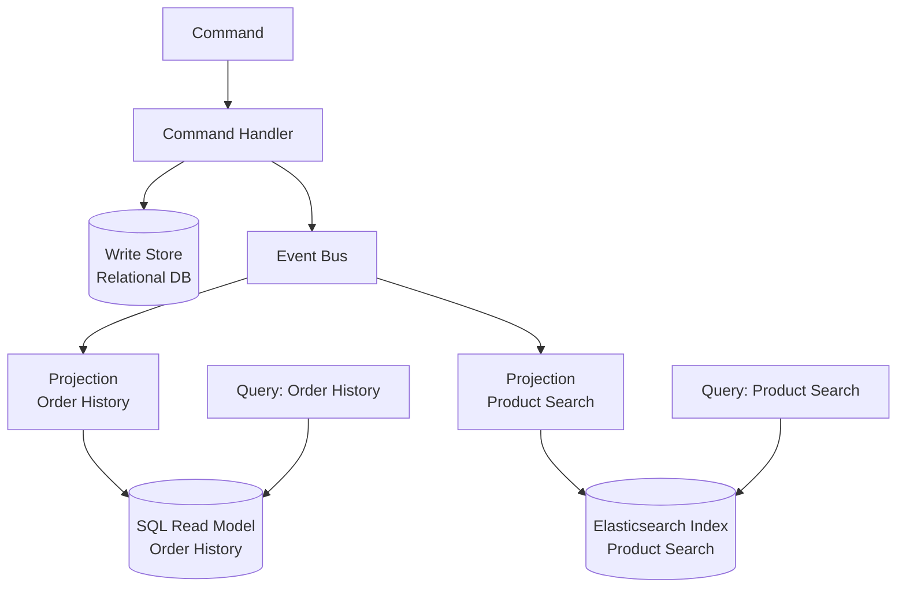

*Este diagrama muestra cómo los eventos producidos por el camino de comandos se distribuyen a proyecciones específicas, cada una manteniendo su propio almacén de lectura optimizado para un patrón de consulta particular. Ilustra por qué CQRS permite que los lados de lectura y escritura usen diferentes motores de almacenamiento y escalen de forma independiente.*

Este diseño tiene una propiedad que los arquitectos senior deberían apreciar: los modelos de lectura son **desechables y reconstruibles**. Como una proyección es una función pura del flujo de eventos, puedes eliminar un modelo de lectura y reconstruirlo reproduciendo los eventos desde el principio. ¿Necesitas una forma de consulta completamente nueva para una funcionalidad que se lanzará el próximo trimestre? Escribe una nueva proyección, reproduce el historial a través de ella, y tendrás un modelo de lectura completamente poblado sin una migración de datos arriesgada. Esta reconstruibilidad es el argumento práctico más sólido para combinar CQRS con el registro de eventos, y anticipa Event Sourcing en el Capítulo 6.

**Listado 5.2 — Proyección de eventos idempotente: realiza upserts en un modelo de lectura desnormalizado desde el flujo de eventos**

```python
# Idempotent event projection — upserts a denormalized read model from the event stream
# At-least-once delivery safe: duplicate events are detected and skipped

from __future__ import annotations

from dataclasses import dataclass
from datetime import datetime, timezone
from typing import Protocol
from uuid import UUID


# ---------------------------------------------------------------------------
# Domain events consumed by this projection
# (emitted by the command side — identical to what the write handler published)
# ---------------------------------------------------------------------------

@dataclass(frozen=True)
class OrderPlaced:
    event_id: UUID
    order_id: UUID
    customer_id: UUID
    items: list[dict]   # [{"product_id": UUID, "quantity": int, "unit_price": float}]
    total_amount: float
    placed_at: datetime

@dataclass(frozen=True)
class OrderShipped:
    event_id: UUID
    order_id: UUID
    shipped_at: datetime

@dataclass(frozen=True)
class OrderCancelled:
    event_id: UUID
    order_id: UUID
    cancelled_at: datetime


# ---------------------------------------------------------------------------
# Projection handler
# ---------------------------------------------------------------------------

class CustomerOrderViewProjection:
    """
    Maintains the customer_order_view read table.

    Idempotency strategy: each row stores `last_applied_event_id`.
    Before applying any event, the handler checks whether that event_id
    was already applied — duplicates are silently skipped (Chapter 4 pattern).
    """

    def __init__(self, view_store: ViewStore) -> None:
        self._store = view_store

    # ------------------------------------------------------------------
    # Event handlers (one per subscribed event type)
    # ------------------------------------------------------------------

    def on_order_placed(self, event: OrderPlaced) -> None:
        if self._already_applied(event.order_id, event.event_id):
            return   # at-least-once: safe to skip duplicate

        self._store.upsert(
            table="customer_order_view",
            key={"order_id": event.order_id},
            values={
                "customer_id": event.customer_id,
                "status": "placed",
                "total_amount": event.total_amount,
                "item_count": len(event.items),
                "placed_at": event.placed_at,
                "shipped_at": None,
                "last_applied_event_id": event.event_id,
            },
        )

    def on_order_shipped(self, event: OrderShipped) -> None:
        if self._already_applied(event.order_id, event.event_id):
            return

        self._store.upsert(
            table="customer_order_view",
            key={"order_id": event.order_id},
            values={
                "status": "shipped",
                "shipped_at": event.shipped_at,
                "last_applied_event_id": event.event_id,
            },
        )

    def on_order_cancelled(self, event: OrderCancelled) -> None:
        if self._already_applied(event.order_id, event.event_id):
            return

        self._store.upsert(
            table="customer_order_view",
            key={"order_id": event.order_id},
            values={
                "status": "cancelled",
                "last_applied_event_id": event.event_id,
            },
        )

    # ------------------------------------------------------------------
    # Internal helpers
    # ------------------------------------------------------------------

    def _already_applied(self, order_id: UUID, event_id: UUID) -> bool:
        """Return True if this exact event was already written to the view."""
        row = self._store.fetch_one(
            "SELECT last_applied_event_id FROM customer_order_view "
            "WHERE order_id = %s",
            (order_id,),
        )
        if row is None:
            return False
        return row["last_applied_event_id"] == event_id


# ---------------------------------------------------------------------------
# Infrastructure protocol (injected — decouples projection from DB driver)
# ---------------------------------------------------------------------------

class ViewStore(Protocol):
    def upsert(self, table: str, key: dict, values: dict) -> None:
        """INSERT … ON CONFLICT DO UPDATE or equivalent for the target engine."""
        ...

    def fetch_one(self, sql: str, params: tuple) -> dict | None: ...
```

*La proyección es el puente entre el lado de escritura y el lado de lectura: consume eventos de dominio y aplica upserts deterministas a la `customer_order_view` desnormalizada. La idempotencia se hace cumplir rastreando el `last_applied_event_id` por fila, haciendo que la entrega repetida del mismo evento sea un no-op seguro.*

Una nota de disciplina: las proyecciones deben ser **idempotentes**, exactamente por las razones que estableció el Capítulo 4. La entrega es al menos una vez, por lo que el mismo evento `OrderShipped` puede llegar dos veces. Una proyección que ingenuamente incrementa un contador irá a la deriva. Usa upserts con clave por el identificador del agregado, o rastrea la última versión de evento aplicada por vista, y los duplicados se vuelven inofensivos. Trata el modelo de lectura como un destino de reproducción determinista, nunca como un lugar donde acumular efectos secundarios.

> 💡 **Nota del Experto:** El texto presenta correctamente la reconstruibilidad del modelo de lectura como una ventaja práctica, pero omite el costo operacional que sorprende a cada equipo la primera vez que lo ejercen en producción. Reproducir millones de eventos a través de una proyección no es instantáneo — un registro de eventos maduro puede contener cientos de millones de eventos, y una reproducción ingenua de un solo hilo puede tomar horas o días. Los sistemas de nivel de producción manejan esto con checkpoints de instantánea (instantáneas materializadas periódicas del estado de la proyección en una posición de evento dada), reproducción paralela particionada a través de segmentos del flujo de eventos, y una estrategia de "proyección en la sombra": la nueva proyección se construye en paralelo mientras la antigua continúa sirviendo tráfico, y el tráfico se transfiere solo cuando la sombra alcanza la posición en vivo. Los equipos que tratan "simplemente reproducir desde el principio" como un escape sin costo descubren a las malas que es una operación de mantenimiento que requiere planificación, capacidad y un runbook probado.

<details>
<summary>💡 Nota del Experto</summary>

El versionado de proyecciones es la parte silenciosamente peligrosa de los sistemas CQRS de larga ejecución. Cuando la lógica de una proyección cambia — un nuevo campo calculado, una columna renombrada, una agregación modificada — el modelo de lectura construido bajo la lógica anterior queda invalidado. El patrón de la industria es versionar las proyecciones explícitamente (por ejemplo, `CustomerOrderView_v1`, `CustomerOrderView_v2`), ejecutar ambas simultáneamente hasta que la nueva versión se ponga completamente al día, luego intercambiar atómicamente el destino de lectura del servicio de consultas y desmantelar la versión antigua. Frameworks como Axon Framework y EventStoreDB proporcionan primitivas de versionado de proyecciones; construir el propio requiere un registro de proyecciones y un arnés de reproducción controlado. Los equipos que omiten esta disciplina terminan con una deriva silenciosa de datos al parchar las proyecciones en su lugar sin reconstruirlas — un modelo de lectura que ya no representa fielmente el flujo de eventos.
</details>

<details>
<summary>💡 Nota del Experto</summary>

Las claves de idempotencia de proyecciones merecen más precisión que "ID de evento o versión por vista." En sistemas basados en brokers (Kafka, Kinesis), la tentación es usar el offset de partición del broker como clave de idempotencia. Esto es frágil: los offsets pueden ser reasignados después de la compactación del topic, el rebalanceo de particiones o la recreación del topic durante la recuperación ante desastres. La elección robusta es el **UUID propio del evento de dominio o la versión del agregado**, que es estable a través de los cambios de infraestructura. Concretamente, la tabla de proyección debería llevar una columna `last_applied_event_id`; un upsert solo se ejecuta cuando el ID del evento entrante difiere. Esto hace que la proyección sea resiliente a los eventos de infraestructura del broker que el equipo controla por separado de la semántica del dominio.
</details>

<details>
<summary>⚠️ Nota Crítica</summary>

El texto dice "Escribe una nueva proyección, reproduce el historial a través de ella, y tendrás un modelo de lectura completamente poblado sin una migración de datos arriesgada." Esto solo es verdad cuando el historial de eventos es corto, los esquemas de eventos se han mantenido estables y las proyecciones no dependen de estado externo. En sistemas de producción: (1) los eventos publicados hace años pueden llevar nombres de campo diferentes, campos faltantes o semántica obsoleta — requiriendo upcasters versionados antes de que la reproducción sea correcta; (2) reproducir miles de millones de eventos lleva horas o días, lo que puede ser operacionalmente inaceptable; (3) las proyecciones que llaman a servicios externos (APIs de precios, servicios de enriquecimiento) en el momento de la proyección no pueden reconstruirse fielmente porque ese estado externo puede haber cambiado o sido desmantelado. Presentar la reconstruibilidad como una fortaleza sin calificaciones engaña a la audiencia objetivo sobre los costos operacionales reales.

**Corrección sugerida:** Añade un párrafo después de la afirmación "desechable y reconstruible" que delimite la garantía: la reconstruibilidad se mantiene cuando los eventos llevan cargas útiles autocontenidas y de versión estable y las proyecciones son funciones puras del flujo de eventos. Señala la evolución del esquema de eventos (y la necesidad de upcasters), los límites de rendimiento de reproducción a escala y el anti-patrón de proyecciones con efectos secundarios externos como condiciones que socavan la garantía.
</details>

## Consistencia Entre el Lado de Escritura y el Lado de Lectura

Aquí está el hecho que decide si CQRS encaja: el lado de lectura es **eventualmente consistente** con el lado de escritura. Un comando se confirma y su evento se publica, pero la proyección procesa ese evento un momento después — milisegundos normalmente, segundos bajo carga, más tiempo si un consumidor está rezagado o recuperándose. Durante esa ventana, una consulta puede devolver un estado que todavía no refleja el cambio que el usuario acaba de hacer. Esto es **retraso de replicación** (replication lag), y no es un error que puedas eliminar; es el precio estructural de separar los modelos.

El síntoma clásico es la violación de **read-your-own-writes**. Un usuario cancela un pedido, la pantalla se actualiza y el pedido todavía aparece como activo porque el evento de cancelación aún no ha sido proyectado. Los usuarios experimentan esto como que el sistema "pierde" su acción. Debes diseñar para ello deliberadamente en lugar de esperar que nunca ocurra.

La tabla a continuación describe las mitigaciones prácticas y sus costos.

| Técnica | Cómo funciona | Costo / advertencia |
|---|---|---|
| Aceptar el retraso | Mostrar el estado eventual; añadir una pista sutil de "procesando…" en la UI | La más simple; solo viable cuando la obsolescencia es tolerable |
| Actualización optimista de la UI | El cliente renderiza el resultado esperado localmente después de un comando | La UI puede divergir de la verdad del servidor en caso de fallo |
| Enrutamiento read-your-writes | Enrutar las lecturas de un usuario al modelo de escritura brevemente después de su comando | Reintroduce la carga de lectura del lado de escritura que intentabas reducir |
| Verificación de versión / token | El comando devuelve una versión; la consulta espera hasta que el modelo de lectura la alcance | Añade latencia y complejidad de coordinación |

**Figura 5.3 — Ventana de consistencia eventual: lectura obsoleta inmediatamente después de la confirmación del comando**

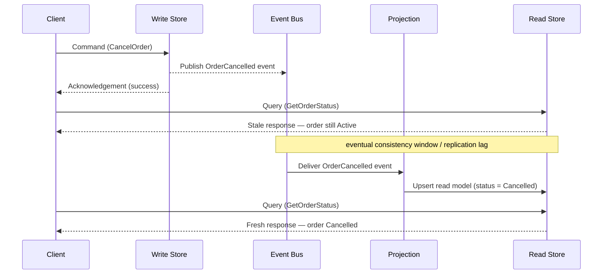

*Este diagrama de secuencia hace visible el costo de consistencia eventual de CQRS: una consulta emitida inmediatamente después de un comando exitoso puede devolver datos obsoletos porque la proyección aún no ha procesado el evento. Entender esta ventana — y la tolerancia del negocio para ella — es la decisión de diseño clave al adoptar CQRS.*

La pregunta rectora es de **tolerancia del negocio**, no de tecnología. Pregunta, para cada consulta: ¿qué tan obsoletos pueden ser estos datos antes de causar daño real? Una vista de catálogo de productos puede retrasarse segundos sin consecuencias. Una verificación de saldo de cuenta que controla un retiro no puede — y esa es una señal fuerte para mantener esa lectura específica en el modelo de escritura con consistencia fuerte, incluso en un sistema que de otro modo es CQRS. CQRS no fuerza *cada* lectura por el camino de consistencia eventual. Mantén las lecturas críticas para los invariantes cerca del modelo de escritura y reserva las proyecciones para las cargas de trabajo de informes, búsqueda y visualización que dominan en volumen pero toleran el retraso.

> 💡 **Nota del Experto:** La fila "verificación de versión / token" en la tabla de consistencia subestima cómo se implementa este patrón a escala. La forma correcta de producción es un **token de consistencia causal**: el manejador de comandos devuelve un token opaco que codifica la posición en la secuencia de eventos (por ejemplo, un offset global en Kafka, una revisión de stream en EventStoreDB). El cliente pasa ese token en su próxima lectura; el servicio de consultas bloquea o reintenta internamente hasta que el watermark de la proyección haya avanzado más allá del token y luego responde. Esto proporciona read-your-own-writes sin tocar nunca el modelo de escritura. AWS AppSync, ksqlDB de Confluent y EventStoreDB exponen variantes de esto bajo nombres como "read-at-revision" o "after-position." El matiz clave de producción es que el servicio de consultas debe exponer un código de respuesta "aún no disponible" (HTTP 202 Accepted o una carga útil estructurada de retry-after) en lugar de devolver silenciosamente datos obsoletos — de lo contrario, el cliente no puede distinguir "el sistema se puso al día" de "la proyección está rezagada."

<details>
<summary>⚠️ Nota Crítica</summary>

El texto caracteriza el retraso de replicación como "milisegundos normalmente, segundos bajo carga" — enmarcándolo como una ventana estrecha y recuperable. Esto omite el escenario de modo de fallo que da forma al diseño de SLA: un consumidor de proyección que falla, un evento envenenado que causa reprocesamiento repetido, o un rebalanceo del grupo de consumidores de Kafka puede detener una proyección por minutos u horas, no segundos. Para una audiencia senior que diseña SLAs de producción y estrategias de alertas, la cola del modo de fallo importa más que el promedio del camino feliz. Citar solo la latencia del camino feliz invita a sub-diseñar el monitoreo, el manejo de dead-letter y las alertas de salud del consumidor.

**Corrección sugerida:** Extiende la caracterización del retraso para incluir la cola del modo de fallo: "milisegundos en estado estable, segundos bajo carga — pero un consumidor de proyección detenido o en bucle de fallo puede pausar las actualizaciones por minutos a horas, haciendo del monitoreo y las alertas de retraso de proyección una preocupación operacional de primer nivel, no una ocurrencia tardía."
</details>

## Cuándo CQRS Es Sobre-Ingeniería

Ahora la parte con opinión, y la razón por la que existe este capítulo. CQRS es una herramienta especializada, no una arquitectura predeterminada. Aplicado donde no se necesita, fabrica complejidad que perseguirá al equipo durante años. El trabajo de un arquitecto senior es reconocer la diferencia antes de escribir la primera línea de código.

CQRS es **sobre-ingeniería** cuando tus modelos de lectura y escritura tienen esencialmente la misma forma. Si una entidad CRUD sencilla — un perfil de cliente, un registro de configuración, una tabla de referencia — se escribe y lee a través de estructuras casi idénticas, no hay discrepancia de forma que resolver. Dividirlo en dos modelos y una proyección añade una pieza en movimiento, una ventana de consistencia eventual y una carga operacional sin resolver ningún problema real. Una tabla bien indexada, quizás con una réplica de lectura, es la respuesta correcta y aburrida.

Presta atención a estas señales de advertencia de que CQRS es la elección incorrecta:

1. **El dominio es CRUD simple.** Los datos se crean, leen, actualizan y eliminan sin comportamiento rico y sin formas de consulta que diverjan de la forma de escritura.
2. **Los volúmenes de lectura y escritura son comparables y modestos.** El beneficio de escalado independiente es la principal recompensa; con tráfico balanceado y bajo hay poco que ganar.
3. **El equipo no tiene madurez operacional para la asincronía.** CQRS significa monitorear el retraso de proyecciones, manejar reproducciones y depurar la consistencia eventual. Sin ese músculo, heredas un sistema que no puedes razonar.
4. **Las partes interesadas no pueden tolerar ninguna obsolescencia.** Si cada lectura debe ser inmediatamente consistente, estás luchando contra la mecánica central del patrón y no deberías adoptarlo.

**Consejo Profesional:** Adopta CQRS al nivel del *agregado* o del *bounded context*, nunca como una regla general para todo el sistema. La mayoría de los sistemas reales son híbridos — algunos contextos de alto valor justifican CQRS completo con proyecciones, mientras que la mayoría permanecen como CRUD cómodo. Aplicar el patrón de forma selectiva es la marca del juicio; aplicarlo en todas partes es la marca del dogmatismo.

La heurística honesta: alcanza CQRS cuando una discrepancia de forma genuina, una gran asimetría lectura/escritura o la necesidad de muchos modelos de lectura divergentes hace que un modelo único sea doloroso — y solo entonces. Si no puedes nombrar el dolor específico, aún no tienes razón para pagar el precio.

<details>
<summary>💡 Nota del Experto</summary>

En la práctica, el camino de adopción más seguro es incremental en lugar de anticipado. Un equipo que introduce CQRS desde el primer día en un dominio no probado casi siempre lo sobre-aplica — los bounded contexts son especulativos, las formas de consulta son desconocidas y las proyecciones que se construyen terminan reflejando el modelo de escritura de todos modos. El enfoque validado en el campo es comenzar con un modelo compartido bajo una réplica de lectura, instrumentar los patrones de consulta, identificar las dos o tres formas de lectura que genuinamente divergen del modelo de escritura bajo carga real, y extraer solo esas en proyecciones. Este camino de "migrar desde el dolor" es dramáticamente menos arriesgado que diseñar CQRS de antemano, y mantiene la mayor parte de la base de código en el régimen CRUD más simple hasta que la evidencia real justifique el costo.
</details>

<details>
<summary>💡 Nota del Experto</summary>

Las señales de advertencia del texto son sólidas, pero falta un modo de fallo común en entornos corporativos con muchos microservicios: las proyecciones entre flujos. Cuando los agregados de dominio están particionados demasiado finamente — servicios separados para Order, OrderLine y Fulfillment — las proyecciones para pantallas de UI deben unir eventos de múltiples flujos. Esto es efectivamente un join distribuido, e introduce un riesgo de consistencia secundario: la proyección para una CustomerOrderView puede recibir OrderPlaced del flujo A antes del FulfillmentScheduled correlacionado del flujo B, requiriendo lógica de buffering, timeout y lógica de compensación para eventos que nunca llegan. En ese punto la proyección ya no es un consumidor simple sino un motor de correlación con estado. Esta es una señal fuerte de que los bounded contexts fueron delimitados incorrectamente en lugar de que CQRS deba extenderse para manejar la complejidad.
</details>

## Conclusiones Clave

- El **problema de discrepancia de forma** es la razón de existir de CQRS: el modelo normalizado que hace cumplir los invariantes del lado de escritura rara vez es la forma desnormalizada que sirve las lecturas de manera eficiente.
- CQRS separa el **camino de comandos** (cambia el estado, emite eventos, devuelve poco) del **camino de consultas** (lee modelos de lectura construidos específicamente, nunca toca el almacén de escritura), permitiendo que cada uno escale y evolucione de forma independiente.
- Las **proyecciones** son consumidores de eventos idempotentes que derivan modelos de lectura del flujo de eventos, haciendo que los modelos de lectura sean desechables y reconstruibles por reproducción.
- El lado de lectura es **eventualmente consistente**; el retraso de replicación y el read-your-own-writes son costos estructurales para los que hay que diseñar, no errores a corregir. Empareja cada lectura con la tolerancia de obsolescencia del negocio.
- CQRS es **sobre-ingeniería** para CRUD simple con formas de lectura/escritura coincidentes. Adóptalo por agregado o bounded context, solo donde un dolor concreto justifique la complejidad añadida.

## Qué Sigue

Los modelos de lectura reconstruibles insinuaron una idea más profunda — almacenar el estado como los propios eventos; el Capítulo 6 hace ese salto explícito con Event Sourcing.

<!-- ASSEMBLY COMPLETE
  Chapter: CQRS — Separating Reads and Writes
  Code blocks resolved: 2 / 2
  Diagrams resolved: 3 / 3
  Expert callouts (inline): 2
  Expert callouts (collapsed): 5
  Critical callouts (inline): 1
  Critical callouts (collapsed): 4
  Unresolved markers: 0
-->


# Capítulo 6: Event Sourcing — El Estado como una Secuencia de Eventos

## Planteamiento del Problema Inicial

El Capítulo 5 dejó un hilo suelto. Mostró que los modelos de lectura son descartables — puedes eliminarlos y reconstruirlos reproduciendo eventos. Esa afirmación asumía en silencio algo que nunca justificamos: que los eventos siguen existiendo en algún lugar, en orden, para siempre. Si las proyecciones se pueden reconstruir desde un registro de eventos, entonces ese registro, y no el modelo de lectura, es la verdadera fuente de verdad.

Este capítulo formaliza esa idea. **Event Sourcing** (almacenamiento de eventos) es el patrón en el que el estado autoritativo de una entidad no es una fila que se actualiza, sino la secuencia completa y ordenada de eventos que le ocurrieron. No almacenas el saldo actual de una cuenta. Almacenas cada depósito y cada retiro, y calculas el saldo cuando lo necesitas.

Para los arquitectos senior, el atractivo es obvio y el peligro es sutil. Event Sourcing te proporciona una trazabilidad perfecta, consultas temporales y poder de depuración que los sistemas tradicionales no pueden igualar. También impone restricciones que duran toda la vida del sistema — esquemas que nunca podrás eliminar completamente, un modelo mental que todo el equipo debe compartir y costos operacionales que solo aparecen en el año tres. Este capítulo enseña ambos lados con honestidad.

## El Problema de la Verdad y la Historia

Los sistemas tradicionales tienen un problema de memoria: olvidan. Considera una tabla bancaria clásica con una sola columna `balance`. Cuando un cliente retira dinero, ejecutas un `UPDATE` y el saldo anterior desaparece. La base de datos ahora contiene un hecho — "el saldo es 500" — pero ha destruido la historia que lo produjo.

Este es el **problema de la verdad y la historia**: un sistema que solo almacena el estado actual puede responder *qué es verdad ahora*, pero no *cómo llegó a ser verdad*. La mayoría de las veces nadie hace la segunda pregunta. Entonces lo hace un auditor, un regulador o un cliente molesto, y la respuesta es un encogimiento de hombros.

Considera lo que el modelo de actualización en el lugar desecha cada vez que se ejecuta.

*Figura: Comparación lado a lado del almacenamiento orientado al estado vs. orientado a eventos — el modelo orientado al estado sobreescribe la historia en cada UPDATE, mientras que el modelo basado en eventos deriva el saldo actual de un registro inmutable de solo adición.*

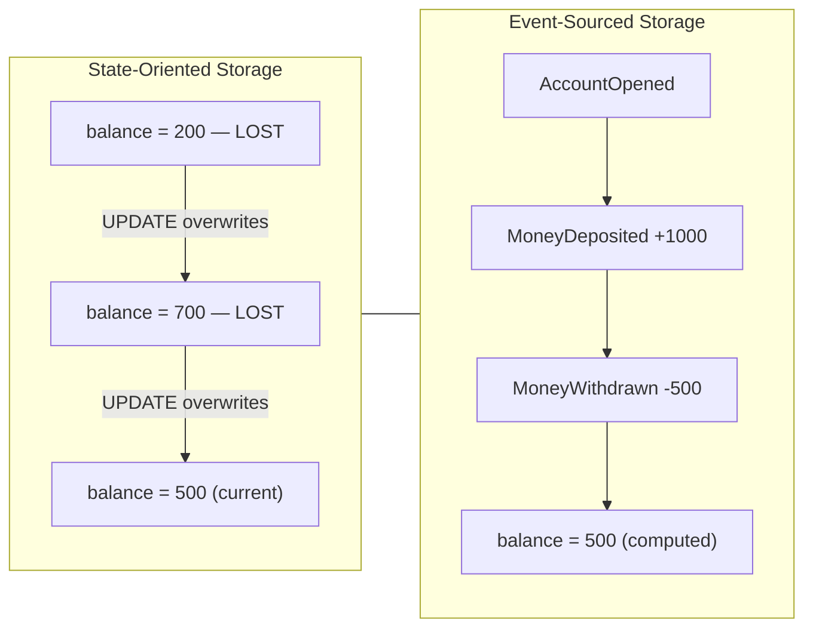

El enfoque orientado al estado optimiza para el presente a expensas del pasado. Event Sourcing invierte esa prioridad. Trata cada **evento** — un hecho inmutable del pasado, exactamente como se definió en el Capítulo 1 — como la unidad duradera de verdad. El estado actual se convierte en un *valor derivado*, recalculado bajo demanda a partir de los eventos.

La consecuencia es estratégica, no solo técnica. En un sistema orientado al estado, la historia es un añadido que se implementa con tablas de auditoría y triggers, y esas tablas de auditoría siempre están ligeramente equivocadas. En un sistema basado en Event Sourcing, la historia *es* el modelo de almacenamiento. No puedes tener una historia incorrecta, porque la historia es lo único que alguna vez escribiste. La corrección del registro de auditoría deja de ser una característica que se mantiene y se convierte en una propiedad de la arquitectura.

Eso es el intercambio que ofrece el patrón: renuncias a la conveniencia de leer el estado actual directamente y, a cambio, nunca pierdes un hecho.

> ⚠️ **Nota Crítica:** El texto afirma "no puedes tener una historia incorrecta, porque la historia es lo único que alguna vez escribiste" y encuadra la corrección del registro de auditoría como "una propiedad de la arquitectura." Esto es una exageración significativa. Los errores en la capa de aplicación — emitir un evento `MoneyWithdrawn` con el monto incorrecto, escribir en el ID de flujo equivocado o disparar dos veces un manejador de comandos — producen eventos incorrectos que se persisten de forma permanente con la misma garantía de inmutabilidad que los eventos correctos. El almacén de eventos garantiza solo adición y ordenamiento, no la corrección del dominio. Un ingeniero senior que interioriza esta afirmación puede priorizar peligrosamente menos las pruebas de corrección del manejador de comandos y los controles de idempotencia bajo el argumento de que "el almacén garantiza la corrección." La arquitectura garantiza que cada evento escrito se preserve de forma duradera exactamente como fue escrito, eliminando la sobreescritura accidental — pero la corrección de lo que se escribe sigue siendo enteramente responsabilidad de la aplicación. Los manejadores de comandos idempotentes y las protecciones contra entrega al menos una vez son esenciales para evitar que eventos duplicados o incorrectos se conviertan en hechos permanentes.

<details>
<summary>💡 Nota del Experto</summary>
El texto descarta correctamente las tablas de auditoría como "siempre ligeramente equivocadas," pero los modos de fallo van más profundo de lo que la mayoría de los equipos espera. Los triggers de auditoría omiten los estados intermedios dentro de las transacciones de múltiples declaraciones — si un procedimiento almacenado actualiza tres filas y dispara un trigger por fila, el registro del trigger captura los cambios individuales de filas, pero no la única intención de negocio que los causó. Más insidiosamente, cuando cambia el esquema (se renombra o elimina una columna), la definición del trigger se rompe silenciosamente o comienza a registrar null para ese campo, sin que se genere ningún error. Los equipos descubren esto solo durante una auditoría, meses después, cuando el registro tiene una brecha sistemática que nadie notó. Event Sourcing evita esto por completo porque la intención — el evento de negocio — es lo que se escribe, no la mutación de la fila.
</details>

## El Almacén de Eventos y el Registro de Solo Adición

La base de datos que contiene estos eventos se denomina **almacén de eventos** (event store). No es una tabla de propósito general en la que simplemente insertas — es un registro especializado con dos reglas que definen todo el patrón.

Primero, el almacén de eventos es de **solo adición** (append-only). Puedes añadir eventos al final. Nunca puedes actualizar ni eliminar un evento ya escrito. Un evento registra algo que ocurrió, y el pasado no cambia. Este es el mismo principio de inmutabilidad del Capítulo 1, ahora aplicado en la capa de persistencia.

Segundo, los eventos se agrupan en **flujos** (streams). Un flujo es la secuencia ordenada de todos los eventos de una entidad — por ejemplo, todos los eventos de la cuenta `acc-123`. El flujo es la unidad de consistencia y la unidad de reconstrucción.

Un esquema mínimo de almacén de eventos solo necesita un puñado de columnas para aplicar estas reglas.

*Código: DDL SQL para una tabla mínima de almacén de eventos — `global_position` proporciona un orden total monotónico en todos los flujos; `UNIQUE (stream_id, version)` garantiza el ordenamiento por flujo y actúa como protección de concurrencia optimista sin bloqueos a nivel de aplicación.*

```python
# ⚠️ LANGUAGE MISMATCH: original was sql, regenerated as python
# Python 3.10+ — event store schema setup using psycopg2
# global_position provides monotone total order across all streams;
# UNIQUE (stream_id, version) enforces per-stream ordering and acts as the
# optimistic concurrency guard with no application-level locking.

import psycopg2

_CREATE_TABLE = """
CREATE TABLE IF NOT EXISTS event_store (
    global_position  BIGSERIAL    PRIMARY KEY,
    stream_id        TEXT         NOT NULL,
    version          INTEGER      NOT NULL,
    event_type       TEXT         NOT NULL,
    payload          JSONB        NOT NULL,
    metadata         JSONB        NOT NULL DEFAULT '{}',
    occurred_at      TIMESTAMPTZ  NOT NULL DEFAULT now(),

    CONSTRAINT uq_stream_version UNIQUE (stream_id, version)
);
"""

_CREATE_INDEX_STREAM = """
CREATE INDEX IF NOT EXISTS idx_event_store_stream
    ON event_store (stream_id, version ASC);
"""

_CREATE_INDEX_GLOBAL = """
CREATE INDEX IF NOT EXISTS idx_event_store_global
    ON event_store (global_position ASC);
"""


def setup_event_store(conn) -> None:
    """
    Create the event_store table and supporting indexes if they do not exist.
    Safe to call on an already-initialised database (uses IF NOT EXISTS).

    Fast stream replay: idx_event_store_stream fetches all events for a stream
    in version order. Subscription catch-up: idx_event_store_global lets
    consumers track their last-seen global_position.
    """
    with conn:
        with conn.cursor() as cur:
            cur.execute(_CREATE_TABLE)
            cur.execute(_CREATE_INDEX_STREAM)
            cur.execute(_CREATE_INDEX_GLOBAL)
```

La columna `version` es el héroe silencioso de ese esquema. Numera los eventos dentro de un flujo: 1, 2, 3 y así sucesivamente. La restricción `UNIQUE (stream_id, version)` realiza dos trabajos a la vez. Garantiza un orden total dentro de cada flujo y te proporciona **control de concurrencia optimista** de forma gratuita.

Así es como funciona la verificación de concurrencia. Cuando un manejador de comandos carga un flujo, anota la versión más alta actual — digamos, 7. Procesa el comando e intenta añadir un nuevo evento como versión 8. Si otro proceso ya escribió la versión 8 mientras tanto, la restricción única rechaza la inserción. El manejador sabe que su decisión se basó en datos desactualizados y reintenta. Sin bloqueos, sin espera — solo una restricción haciendo su trabajo.

*Código: Adición con concurrencia optimista — lanza `ConcurrencyConflictError` cuando otro escritor ya ha reclamado la versión esperada; el llamador debe recargar el flujo y reintentar el comando.*

```python
# Python 3.10+ — optimistic concurrency append using psycopg2 and PostgreSQL
# Raises ConcurrencyConflictError when another writer has already claimed the expected version.

from __future__ import annotations

import json
from dataclasses import dataclass, field
from typing import Any

import psycopg2
from psycopg2 import errors as pg_errors


@dataclass
class EventRecord:
    stream_id:  str
    event_type: str
    payload:    dict[str, Any]
    metadata:   dict[str, Any] = field(default_factory=dict)


class ConcurrencyConflictError(Exception):
    """Raised when another writer already appended at the expected version.
    The caller should reload the stream and retry the command."""


def append_events(
    conn,
    stream_id:        str,
    events:           list[EventRecord],
    expected_version: int,          # highest version seen when the command was loaded
) -> None:
    """
    Appends `events` to `stream_id` starting at expected_version + 1.
    All inserts run inside a single transaction; a unique-constraint violation
    signals a concurrent write and triggers a rollback.
    """
    with conn:                       # psycopg2 context manager: commit or rollback
        with conn.cursor() as cur:
            for offset, event in enumerate(events):
                next_version = expected_version + 1 + offset  # 1-based, increments per event

                try:
                    cur.execute(
                        """
                        INSERT INTO event_store
                            (stream_id, version, event_type, payload, metadata)
                        VALUES (%s, %s, %s, %s::jsonb, %s::jsonb)
                        """,
                        (
                            stream_id,
                            next_version,
                            event.event_type,
                            json.dumps(event.payload),
                            json.dumps(event.metadata),
                        ),
                    )
                except pg_errors.UniqueViolation:
                    # Another process already wrote at this version; the caller must retry.
                    raise ConcurrencyConflictError(
                        f"Concurrency conflict on stream '{stream_id}': "
                        f"expected version {expected_version} is stale. Reload and retry."
                    )
```

Una nota de realismo para los arquitectos que eligen infraestructura. Puedes construir un almacén de eventos sobre PostgreSQL simple, y para muchos sistemas corporativos deberías hacerlo — la familiaridad operacional vale más que cualquier característica especializada. Los almacenes de propósito específico como EventStoreDB o Axon Server, o primitivas en la nube como DynamoDB con un diseño de clave de partición más clave de ordenamiento, añaden herramientas de suscripción y proyección. Pero ninguno de ellos cambia las dos reglas anteriores. Solo adición y ordenado por flujo son todo el juego.

> 💡 **Nota del Experto:** La columna `global_position` en el esquema es fácil de implementar incorrectamente en PostgreSQL con un `BIGSERIAL` o `SEQUENCE`, creando un riesgo silencioso en producción. Las secuencias de PostgreSQL son no transaccionales por diseño: si una transacción inserta un evento y luego hace rollback, el valor de la secuencia se consume y no se reutiliza. Los consumidores que leen `global_position` en orden verán brechas (p. ej., posiciones 1, 2, 4 — la posición 3 fue una inserción con rollback) y deben decidir si una brecha significa "aún no confirmado" o "permanentemente faltante." La solución estándar en producción es usar un enfoque de captura de cambios de datos (CDC) basado en ranuras de replicación (p. ej., `pg_logical`) o rastrear el orden global a través de una tabla de contador separada y protegida por bloqueo que se vacía solo en el commit. EventStoreDB evita esto gestionando la asignación de posiciones dentro de su propio registro de transacciones. Elige tu infraestructura sabiendo que este problema de brechas existe en los almacenes SQL simples.

<details>
<summary>💡 Nota del Experto</summary>
Al comparar EventStoreDB con un almacén PostgreSQL hecho en casa, el diferenciador práctico corporativo es la semántica de suscripción, no el almacenamiento. Las suscripciones persistentes de EventStoreDB admiten un modelo de consumidores en competencia por grupo de forma nativa, pero su motor de proyecciones (históricamente proyecciones del lado del servidor basadas en JavaScript) introduce una carga operacional — un segundo tiempo de ejecución que monitorear, versionar y depurar — que la mayoría de los equipos empresariales subestiman. Para organizaciones que ya están estandarizando en Kafka, tratar el almacén de eventos como el registro autoritativo de solo adición y Kafka como la capa de suscripción/difusión es un híbrido común que preserva la familiaridad. Las dos capas tienen diferentes garantías (adición exactamente una vez vs. entrega al menos una vez) y deben conectarse en consecuencia.
</details>

<details>
<summary>⚠️ Nota Crítica</summary>
La afirmación "sin bloqueos, sin espera — solo una restricción haciendo su trabajo" sobreestima el beneficio de la concurrencia optimista bajo contención. En escenarios de escritura de alto rendimiento en un único flujo de agregado — por ejemplo, una cuenta compartida que recibe eventos de pago concurrentes — cada escritor en conflicto reintentará. Bajo contención sostenida, esto degrada a una serialización efectiva: todos los escritores giran, recargan el flujo, reprocesam el comando y reintentan la inserción. Las tormentas de reintentos pueden ser peores que una cola justa con un único bloqueo, y la aplicación debe limitar los reintentos y manejar los errores persistentes de conflicto de concurrencia. Este modo de fallo es invisible en el camino feliz, pero es material en producción. La concurrencia optimista funciona mejor cuando los escritores en conflicto en el mismo flujo son raros. Para flujos activos, considera la deduplicación de comandos a nivel del manejador, la partición de flujos o estrategias de bloqueo explícito, y siempre protege contra reintentos ilimitados con un recuento máximo de reintentos y retroceso exponencial.
</details>

## Reconstrucción de Estado y Agregados

Si nunca almacenas el estado actual, ¿cómo lo obtienes? Lo calculas. El proceso se denomina **reconstrucción** o **rehidratación**: lees el flujo desde el principio y aplicas cada evento, en orden, a un objeto en memoria nuevo. Ese objeto es el **agregado** (aggregate) — el límite de consistencia de Domain-Driven Design que posee las reglas de negocio de una entidad.

La reconstrucción es un pliegue (fold). Comienzas con un agregado vacío y, evento por evento, pliegas cada hecho en el estado del agregado.

*Código: Agregado Account con separación estricta de comando/aplicación — `rehydrate()` pliega el flujo completo de eventos en un agregado activo con complejidad O(n) en la longitud del flujo.*

```python
# Python 3.10+ — Account aggregate with strict command / apply separation
# rehydrate() folds the full event stream into a live aggregate; O(n) in stream length.

from __future__ import annotations

from dataclasses import dataclass, field
from typing import Union


# ---------------------------------------------------------------------------
# Immutable event types — historical facts, never mutated after creation
# ---------------------------------------------------------------------------

@dataclass(frozen=True)
class AccountOpened:
    account_id: str
    owner:      str

@dataclass(frozen=True)
class MoneyDeposited:
    account_id: str
    amount:     int  # in cents; always positive

@dataclass(frozen=True)
class MoneyWithdrawn:
    account_id: str
    amount:     int  # in cents; always positive

DomainEvent = Union[AccountOpened, MoneyDeposited, MoneyWithdrawn]


# ---------------------------------------------------------------------------
# Aggregate
# ---------------------------------------------------------------------------

@dataclass
class Account:
    account_id: str  = ""
    owner:      str  = ""
    balance:    int  = 0    # in cents
    version:    int  = 0
    _pending:   list[DomainEvent] = field(default_factory=list, repr=False)

    # ---- Command methods: validate invariants, then record a new event ----

    @classmethod
    def open(cls, account_id: str, owner: str) -> "Account":
        """Command: open a new account."""
        aggregate = cls()
        aggregate._record(AccountOpened(account_id=account_id, owner=owner))
        return aggregate

    def deposit(self, amount: int) -> None:
        """Command: credit the account."""
        if amount <= 0:
            raise ValueError(f"Deposit amount must be positive, got {amount}.")
        self._record(MoneyDeposited(account_id=self.account_id, amount=amount))

    def withdraw(self, amount: int) -> None:
        """Command: debit the account; rejects if funds are insufficient."""
        if amount <= 0:
            raise ValueError(f"Withdrawal amount must be positive, got {amount}.")
        if amount > self.balance:
            raise ValueError(
                f"Insufficient funds: balance={self.balance} cents, requested={amount} cents."
            )
        self._record(MoneyWithdrawn(account_id=self.account_id, amount=amount))

    # ---- Apply methods: pure state mutation — NO validation, NEVER reject ----

    def _apply(self, event: DomainEvent) -> None:
        """Mutate in-memory state from an already-decided event. Must never raise."""
        match event:
            case AccountOpened(account_id=aid, owner=owner):
                self.account_id = aid
                self.owner      = owner
                self.balance    = 0
            case MoneyDeposited(amount=amount):
                self.balance += amount
            case MoneyWithdrawn(amount=amount):
                self.balance -= amount

    def _record(self, event: DomainEvent) -> None:
        """Apply a new event to in-memory state and stage it for persistence."""
        self._apply(event)
        self._pending.append(event)

    # ---- Rehydration: reconstruct from a stored event stream ----

    @classmethod
    def rehydrate(cls, events: list[DomainEvent]) -> "Account":
        """
        Fold a complete event stream into a live Account aggregate.
        Time complexity: O(n) where n = len(events).
        """
        aggregate = cls()
        for i, event in enumerate(events, start=1):
            aggregate._apply(event)  # apply history — no validation
            aggregate.version = i    # track stream position for optimistic concurrency
        return aggregate
```

Observa la disciplina que esto impone. Hay exactamente dos tipos de métodos en el agregado, y confundirlos es el error más común de Event Sourcing.

1. **Los métodos de comando** (por ejemplo, `withdraw`) contienen las reglas de negocio. Validan invariantes — "no puedes retirar más que el saldo" — y, si la regla se cumple, *producen un nuevo evento*. Deciden qué debería ocurrir.
2. **Los métodos de aplicación** (por ejemplo, `applyMoneyWithdrawn`) no contienen ninguna lógica de negocio. Solo mutan el estado en memoria a partir de un evento que *ya ocurrió*. Registran lo que ocurrió.

La regla es absoluta: **los métodos de aplicación nunca deben rechazar un evento ni contener validación.** El evento es un hecho histórico. Negarse a aplicarlo durante la reconstrucción significaría negarse a reconocer el pasado, y tu estado reconstruido divergiría silenciosamente de la realidad. Toda la validación vive en los métodos de comando, antes de que exista el evento.

*Figura: Diagrama de secuencia de una escritura — desde la carga del flujo hasta la rehidratación del agregado, la validación de invariantes y la adición controlada por concurrencia optimista, mostrando dónde vive la validación y dónde actúa la protección de concurrencia por restricción única.*

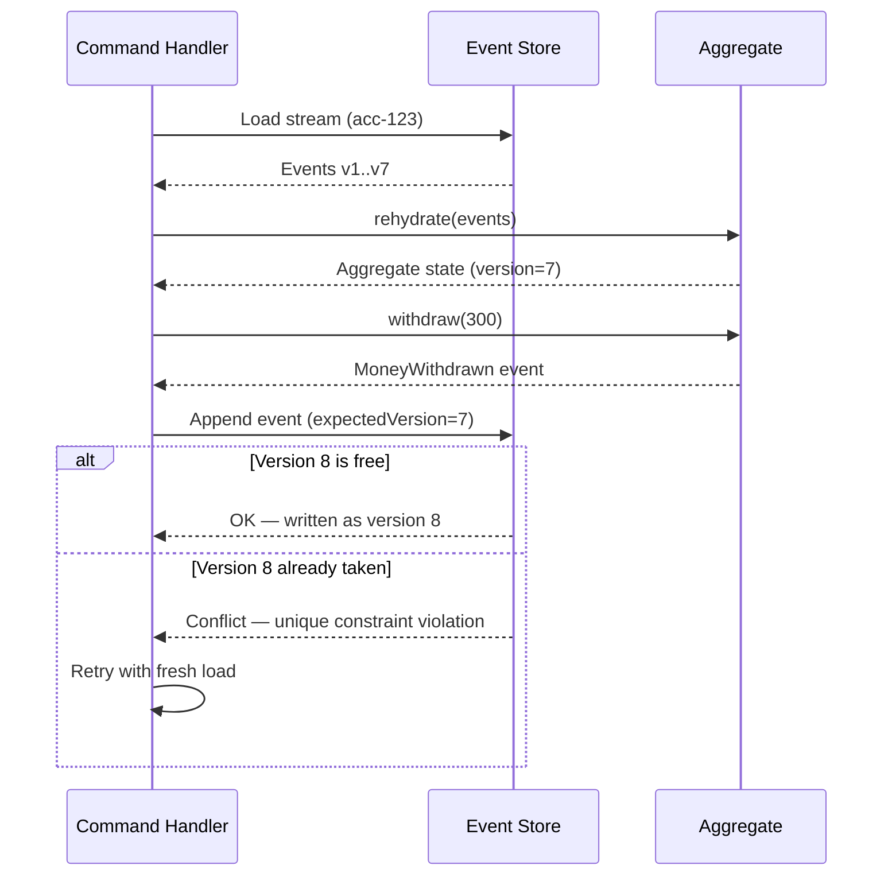

Aquí es donde Event Sourcing y CQRS del Capítulo 5 se ensamblan. El lado de comandos reconstruye el agregado para tomar una decisión y emite un evento. Ese mismo evento alimenta las proyecciones que construyen los modelos de lectura. Un evento, escrito una vez, sirve tanto para la verdad como para la consulta. El registro de eventos se convierte en la única fuente de la que se reconstruyen los modelos de lectura descartables de CQRS.

<details>
<summary>💡 Nota del Experto</summary>
El texto describe los métodos de comando como métodos que "producen un nuevo evento," pero el patrón de implementación estándar añade un detalle estructural que cambia cómo el agregado interactúa con su repositorio: el agregado mantiene una lista interna de "eventos no confirmados." Cuando un método de comando decide aceptar una acción de negocio, llama a su propio `apply()` internamente — para actualizar el estado en memoria de inmediato — y añade el evento a esta lista de no confirmados. El repositorio, después de llamar al comando, lee la lista de no confirmados, añade esos eventos al almacén en la versión esperada y luego limpia la lista. Este diseño de dos fases (aplicar-ahora, vaciar-después) es la razón por la que los métodos de comando pueden encadenar decisiones dentro de una única unidad de trabajo y por la que el agregado nunca sabe nada sobre la base de datos. Omitir este patrón lleva a los equipos a recargar el agregado entre comandos en la misma solicitud o a llamar a `apply()` dos veces (una en el comando, otra durante la reconstrucción), causando errores de doble mutación.
</details>

<details>
<summary>⚠️ Nota Crítica</summary>
La regla "los métodos de aplicación nunca deben rechazar un evento ni contener validación" se describe como absoluta, pero no aborda el escenario de compatibilidad hacia adelante en el que un agregado encuentra un tipo de evento introducido por una versión más reciente de la aplicación que el código actual no reconoce. Ignorar silenciosamente los tipos de eventos desconocidos durante la rehidratación puede producir un estado en memoria sutilmente incorrecto; fallar de forma rígida en tipos desconocidos rompe la reconstrucción por completo. Este es un problema operacional real durante los despliegues en ciclos y las migraciones de esquemas. Los métodos de aplicación no deben rechazar eventos *conocidos* ni aplicarles validación de negocio. Para tipos de eventos desconocidos o no reconocidos, la estrategia recomendada es ignorar-y-registrar con una verificación de conciencia de versión. El Capítulo 8 aborda el versionado de esquemas de forma formal.
</details>

## Snapshots y Optimización de Reproducción

La reconstrucción tiene un defecto obvio que todo escéptico identifica de inmediato. Si una cuenta ha acumulado 200.000 eventos a lo largo de diez años, ¿debes leer y plegar los 200.000 eventos cada vez que alguien consulta el saldo? A ese volumen, la reconstrucción convierte una operación de milisegundos en una de varios segundos.

La respuesta es el **snapshot** (instantánea). Un snapshot es una copia en caché del estado del agregado en una versión específica — un punto de control que dice "en la versión 50.000, el saldo era 12.340." La reconstrucción cambia entonces: carga el snapshot más reciente y reproduce solo los eventos que vinieron *después* de él.

*Código: Rehidratación basada en snapshots con fallback a reproducción completa — el snapshot es una optimización descartable; eliminar todos los snapshots no debe cambiar el comportamiento.*

```python
# Python 3.10+ — snapshot-based rehydration with full-replay fallback
# Snapshot is a disposable optimisation; deleting all snapshots must leave behaviour unchanged.

from __future__ import annotations

import json
from dataclasses import dataclass
from typing import Any, Optional

# Re-uses Account, DomainEvent defined in the aggregate example above.


# ---------------------------------------------------------------------------
# Snapshot data contract
# ---------------------------------------------------------------------------

@dataclass
class Snapshot:
    stream_id: str
    version:   int            # aggregate version at time the snapshot was taken
    state:     dict[str, Any] # serialised aggregate fields (excludes _pending)


# ---------------------------------------------------------------------------
# Storage helpers — replace with real persistence in production
# ---------------------------------------------------------------------------

def load_latest_snapshot(stream_id: str) -> Optional[Snapshot]:
    """Return the most recent snapshot for the stream, or None if none exists."""
    raise NotImplementedError  # implement against your snapshot store


def load_events_after_version(stream_id: str, after_version: int) -> list[DomainEvent]:
    """Return events where version > after_version, ordered ascending by version."""
    raise NotImplementedError  # implement against the event_store table


# ---------------------------------------------------------------------------
# Rehydration with snapshot shortcut
# ---------------------------------------------------------------------------

def rehydrate_from_snapshot(stream_id: str) -> Account:
    """
    Reconstruct an Account aggregate, using a snapshot when available.

    Steps:
      1. Load the most recent snapshot for the stream.
      2. If found: restore aggregate state from the snapshot, then replay
         only the events written after snapshot.version.
      3. If not found: fall back to full replay from the start of the stream.

    The snapshot is purely an optimisation — deleting it produces the same
    aggregate state, just more slowly.
    """
    snapshot: Optional[Snapshot] = load_latest_snapshot(stream_id)

    if snapshot is not None:
        # Fast path: restore from checkpoint, then apply the delta only
        aggregate = Account(
            account_id=snapshot.state["account_id"],
            owner=snapshot.state["owner"],
            balance=snapshot.state["balance"],
        )
        aggregate.version = snapshot.version
        delta_events = load_events_after_version(stream_id, after_version=snapshot.version)
    else:
        # Slow path: no snapshot exists — replay the full stream from scratch
        aggregate = Account()
        delta_events = load_events_after_version(stream_id, after_version=0)

    # Fold the delta (or full stream) onto the aggregate state
    for event in delta_events:
        aggregate._apply(event)   # pure mutation, no validation
        aggregate.version += 1

    return aggregate


def maybe_take_snapshot(aggregate: Account, interval: int = 100) -> Optional[Snapshot]:
    """
    Policy: create a new snapshot every `interval` events.
    Caller is responsible for persisting the returned snapshot.
    Returns None when the version does not fall on a snapshot boundary.
    """
    if aggregate.version > 0 and aggregate.version % interval == 0:
        return Snapshot(
            stream_id=aggregate.account_id,
            version=aggregate.version,
            state={
                "account_id": aggregate.account_id,
                "owner":      aggregate.owner,
                "balance":    aggregate.balance,
            },
        )
    return None
```

Dos puntos de diseño separan una estrategia de snapshots funcional de una defectuosa.

- **Un snapshot es una optimización derivada, nunca una fuente de verdad.** Debes poder eliminar todos los snapshots del sistema y reconstruirlos todos a partir de los eventos. Si eliminar los snapshots pierde datos, has reintroducido accidentalmente el modelo orientado al estado del que estabas intentando escapar.
- **Toma snapshots en una cadencia, no en cada escritura.** Una política común es un snapshot cada *N* eventos por flujo — digamos, cada 100. El número es un parámetro de ajuste, no una constante.

La siguiente tabla enmarca el equilibrio que realmente estás ajustando.

| Frecuencia de snapshots | Costo de reproducción por carga | Almacenamiento y sobrecarga de escritura | Mejor ajuste |
|---|---|---|---|
| Nunca (reproducción pura) | Crece sin límite | Ninguno | Flujos cortos, pocos eventos |
| Cada N eventos (p. ej., 100) | Acotado, pequeño | Moderado | La mayoría de los sistemas en producción |
| Cada evento | Casi cero | Alto; se aproxima al almacenamiento de estado | Casi nunca — un olor a código |

La última fila merece una **Nota Pro**. Si tu instinto es tomar un snapshot en cada escritura, detente. Has reconstruido una base de datos de actualización en el lugar con pasos adicionales y peor rendimiento. El punto de los snapshots es hacer que la reproducción sea *aceptable*, no eliminarla. Recurre a los snapshots solo cuando la medición demuestre que la reconstrucción es demasiado lenta — y para los agregados con vidas cortas y pocos eventos, puede que nunca los necesites.

> 💡 **Nota del Experto:** Un error en cualquier método `apply()` que pase desapercibido durante semanas corromperá silenciosamente cada snapshot generado durante ese período. Cuando se corrija el error, la lógica de aplicación corregida produce un estado en memoria diferente al que refleja el snapshot almacenado, y la reconstrucción que comienza desde un snapshot obsoleto producirá resultados incorrectos sin generar un error — el snapshot corrupto es JSON estructuralmente válido. La solución en producción es adjuntar un `snapshot_schema_version` (un entero que incrementas cada vez que la lógica de aplicación cambia de semántica) a cada fila de snapshot. Al cargar, si `snapshot_schema_version` no coincide con la versión del código actual, descarta el snapshot y cae de nuevo a la reproducción completa. Esto añade una constante de configuración y una comparación, pero hace que la invalidación de snapshots sea automática y segura durante los despliegues.

<details>
<summary>💡 Nota del Experto</summary>
El texto enmarca los snapshots como un parámetro de ajuste en la lectura, pero importa igualmente en la ruta de escritura. Una implementación ingenua toma un snapshot de forma síncrona dentro de la misma transacción que añade el evento, duplicando la latencia de escritura en cada N-ésimo evento. Los sistemas en producción casi universalmente hacen los snapshots asíncronos: un trabajador en segundo plano (o una proyección que lee el flujo de eventos) detecta que un flujo ha avanzado más allá de un umbral y escribe el snapshot fuera de banda. La ruta de comandos se mantiene rápida y predecible; el snapshot puede retrasarse unos segundos, lo cual es aceptable porque la reconstrucción siempre cae de nuevo a la reproducción si falta un snapshot o está obsoleto.
</details>

<details>
<summary>⚠️ Nota Crítica</summary>
La discusión sobre la estrategia de snapshots omite una pregunta operacional crítica: ¿quién escribe el snapshot y qué ocurre si esa escritura falla? Si el manejador de comandos escribe el snapshot de forma síncrona después de añadir un evento, un fallo en la escritura del snapshot no debe tratarse como un fallo del comando — o el procesamiento de comandos se vuelve poco confiable. Si los snapshots son escritos por un proceso asíncrono en segundo plano, hay una ventana en la que el almacén de snapshots está obsoleto o vacío y se requiere silenciosamente la reproducción completa. Los snapshots deben escribirse como operaciones de mejor esfuerzo, no transaccionales, que nunca bloqueen ni hagan fallar el pipeline de comandos. El código siempre debe recurrir a la reproducción completa si falta un snapshot o si su versión no está presente en el almacén de eventos, tratando el snapshot como una caché informativa en lugar de una dependencia obligatoria.
</details>

## Costos a Largo Plazo y Restricciones de Diseño

Event Sourcing no es una técnica que pruebas durante un sprint y abandonas limpiamente. Una vez que se acumulan eventos reales, el patrón se vuelve estructural, y sus costos son permanentes. Un arquitecto honesto los sopesa antes de adoptarlo, no después.

**Los eventos son permanentes, por lo tanto sus esquemas son permanentes.** Una fila que ya no te gusta puede migrarse con un `ALTER TABLE`. Un evento escrito en 2024 seguirá siendo leído durante la reconstrucción en 2030, exactamente como fue escrito. No puedes migrar el pasado. Acomodas las formas antiguas mediante versionado y upcasting — todo el tema del Capítulo 8 — y esa disciplina es obligatoria, no opcional.

**La eliminación se convierte en un problema de diseño real.** Regulaciones como el GDPR otorgan el derecho al olvido, lo que choca frontalmente con un registro inmutable de solo adición. No puedes simplemente eliminar los eventos. La respuesta estándar es el **crypto-shredding** (destrucción criptográfica): cifrar los datos personales por sujeto y eliminar la clave para hacer los datos irrecuperables. Esto debe diseñarse desde el primer evento, porque no puedes retroadaptar el cifrado a hechos ya escritos en texto plano.

**Consultar el estado actual requiere el lado de lectura.** Dado que el estado es derivado, no puedes escribir un simple `SELECT balance FROM accounts`. Necesitas proyecciones y modelos de lectura — que es precisamente por qué Event Sourcing y CQRS se adoptan tan frecuentemente juntos. Elegir Event Sourcing te compromete efectivamente con la ruta de lectura CQRS del Capítulo 5.

*Figura: Diagrama de flujo de decisión para adoptar Event Sourcing — dirige hacia la adopción solo cuando se cumplen las cuatro condiciones de calificación y hacia alternativas más ligeras de lo contrario.*

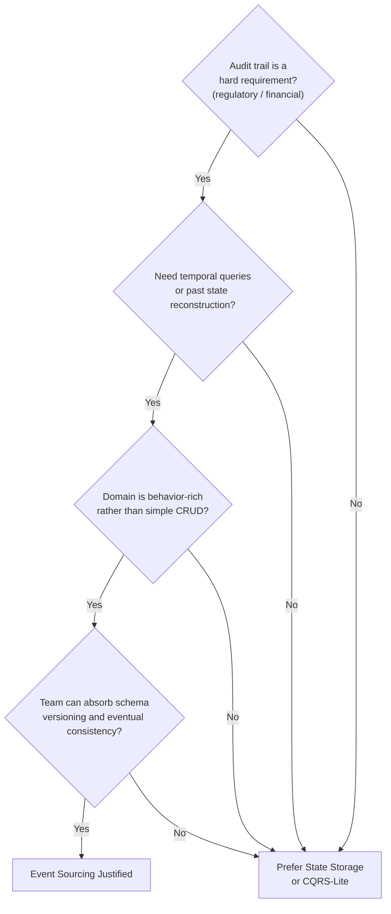

La orientación directa para los arquitectos senior: Event Sourcing justifica su costo en dominios donde la historia es intrínsecamente valiosa — libros contables, operaciones bursátiles, seguros, registros médicos, ciclos de vida de pedidos — y donde el negocio genuinamente pregunta *cómo llegamos aquí*. Para un dominio con forma de CRUD cuyos usuarios nunca preguntan sobre el pasado, es sobreingeniería con una cola de mantenimiento de una década. Adóptalo donde el registro de auditoría es el producto, no donde es una novedad.

> 💡 **Nota del Experto:** El crypto-shredding tal como se describe es correcto, pero subestima una restricción de implementación crítica: el alcance de lo que debe cifrarse es más amplio de lo que la mayoría de los equipos anticipa. Los datos personales no pueden aparecer en ningún lugar fuera del payload cifrado — no en el nombre del tipo de evento, no en los campos de metadatos (IDs de correlación, cadenas de user-agent, direcciones IP registradas como metadatos), y no en los IDs de flujo que codifican un nombre de usuario o correo electrónico. Un ID de flujo de `user-john.doe@example.com` no puede ser destruido criptográficamente; el identificador en sí es un dato personal y persistirá en cada cabecera de evento, cada fila de snapshot y cada fila de proyección para siempre. La disciplina arquitectónica es usar identificadores opacos y sustitutos (UUIDs) como IDs de flujo desde el primer día y almacenar una clave de cifrado separada por sujeto de datos en un servicio dedicado de gestión de claves (AWS KMS, HashiCorp Vault) antes de escribir el primer evento. Retroadaptar esto a un almacén de eventos existente es efectivamente imposible sin reescribir la historia, lo cual el patrón prohíbe.

<details>
<summary>⚠️ Nota Crítica</summary>
El texto cita los registros médicos como un dominio canónico donde Event Sourcing "justifica su costo" porque la historia es intrínsecamente valiosa. Este es el mismo dominio donde HIPAA y GDPR crean una obligación de derecho al olvido y donde la corrección de datos (enmendar una entrada clínica) es un requisito operacional rutinario. La inmutabilidad de Event Sourcing está en tensión directa con ambos. El crypto-shredding maneja la eliminación GDPR en principio, pero la corrección clínica — donde un evento de diagnóstico erróneo debe enmendarse, no solo superponerse — requiere eventos compensatorios y lógica cuidadosa del modelo de lectura para mostrar el estado corregido. Presentar los registros médicos como un ajuste sencillo para Event Sourcing sin esta advertencia podría llevar al lector a subestimar la complejidad regulatoria. Los dominios regulados que requieren flujos de trabajo de corrección o eliminación exigen un diseño explícito: eventos compensatorios para las correcciones, crypto-shredding para la eliminación y modelos de lectura que muestren correctamente solo el registro actual autoritativo. Los libros contables financieros y el ciclo de vida de pedidos son ejemplos canónicos más limpios, ya que esos dominios tienen los requisitos de eliminación más débiles.
</details>

## Conclusiones Clave

- Event Sourcing almacena cada evento que cambia el estado como un hecho inmutable y deriva el estado actual mediante reproducción, resolviendo el problema de la verdad y la historia que crean los sistemas de actualización en el lugar al olvidar el pasado.
- El **almacén de eventos** (event store) es de solo adición y está organizado en **flujos** por entidad; una restricción `UNIQUE (stream_id, version)` garantiza tanto el ordenamiento como la concurrencia optimista sin bloqueos.
- Los agregados son **rehidratados** al plegar los eventos en orden; los métodos de comando validan invariantes y emiten eventos, mientras que los métodos de aplicación solo mutan el estado y nunca deben rechazar un hecho.
- Los **snapshots** acotan el costo de reproducción al crear puntos de control del estado cada N eventos, pero son optimizaciones descartables — nunca una fuente de verdad, y nunca tomadas en cada escritura.
- Los costos son esquemas permanentes, eliminación difícil (crypto-shredding) y un lado de lectura obligatorio; adopta Event Sourcing solo donde la historia sea genuinamente valiosa para el negocio.

## Qué Sigue

El Capítulo 7 aborda lo que ocurre cuando un único proceso de negocio abarca múltiples agregados y servicios, introduciendo sagas para coordinar transacciones bajo consistencia eventual en lugar de ACID distribuido.

<!-- ASSEMBLY COMPLETE
  Chapter: Event Sourcing — State as a Sequence of Events
  Code blocks resolved: 4 / 4
  Diagrams resolved: 3 / 3
  Expert callouts (inline): 3
  Expert callouts (collapsed): 4
  Critical callouts (inline): 1
  Critical callouts (collapsed): 4
  Unresolved markers: 0
-->


# Capítulo 7: Consistencia, Sagas y Procesos de Larga Duración

## Planteamiento del Problema Inicial

El Capítulo 6 dejó el lado de escritura resuelto: el estado es un registro inmutable de eventos, y la verdad vive en el almacén de eventos. Pero ese capítulo asumió silenciosamente un límite cómodo — un agregado, un stream, una transacción. Los procesos de negocio reales no son tan educados. Colocar un pedido toca inventario, pago y envío. Incorporar un cliente toca identidad, facturación y cumplimiento. Cada uno de estos vive en un servicio diferente, detrás de una base de datos diferente, propiedad de un equipo diferente.

Esta es la pregunta incómoda que responde este capítulo: **¿cómo se mantienen tres servicios consistentes cuando no se pueden envolver en una sola transacción?** El instinto clásico — una transacción distribuida (distributed transaction) que bloquea los tres y confirma atómicamente — suena correcto y casi siempre está equivocado en un sistema cloud-native. Acopla la disponibilidad, penaliza la latencia y falla de maneras difíciles de razonar.

La alternativa es la **saga**: una secuencia de transacciones locales, cada una confirmando de forma independiente, coordinadas por eventos, y revertidas no por rollback sino por *compensación*. Las sagas intercambian la ilusión de consistencia global instantánea por algo honesto y operable: **consistencia eventual** (eventual consistency). Este capítulo muestra cómo funcionan las sagas, cuándo coreografiarlas y cuándo orquestarlas, cómo diseñar compensaciones que realmente deshagan efectos de negocio, y cómo el teorema CAP gobierna silenciosamente cada una de estas decisiones.

## Consistencia Eventual Versus Consistencia Fuerte

Comencemos con la palabra que todo arquitecto usa y pocos definen con precisión. La **consistencia fuerte** (strong consistency) significa que una vez que se completa una escritura, cada lectura posterior — desde cualquier lugar — ve esa escritura. El sistema se comporta como si hubiera una sola copia de los datos y un solo reloj. Esta es la garantía que da una transacción ACID local dentro de una sola base de datos.

La **consistencia eventual** (eventual consistency) hace una promesa más débil: si las escrituras se detienen, todas las réplicas y vistas derivadas *eventualmente* convergerán al mismo valor. Entre la escritura y esa convergencia, existe una ventana en la que diferentes partes del sistema no están de acuerdo. Esa ventana no es un error. Es el precio de mantener los servicios independientes y disponibles.

El error es tratar la consistencia eventual como "consistencia fuerte, pero descuidada." Es un modelo diferente con reglas diferentes. No se pregunta "¿son los datos consistentes?" Se pregunta "¿cuál es la obsolescencia máxima que el negocio puede tolerar, y qué sucede dentro de esa ventana?"

Considere una analogía familiar. Cuando transfiere dinero entre bancos, el saldo del remitente cae inmediatamente, pero el destinatario no ve nada durante horas o días. El dinero está, por un tiempo, *en tránsito* — invisible en ningún lado. El sistema bancario es consistente de forma eventual por diseño, y funciona porque el negocio definió estados intermedios explícitos ("pendiente", "liquidado") y reglas para cada uno. Esa es la disciplina que exige la consistencia eventual.

**Figura 7.1** — El commit en dos fases obliga a todos los participantes a bloquearse y confirmar atómicamente, creando una única ventana de todo o nada; una saga deja que cada servicio confirme localmente en secuencia, aceptando una ventana de inconsistencia visible entre pasos que se cierra a medida que los eventos se propagan hacia adelante.

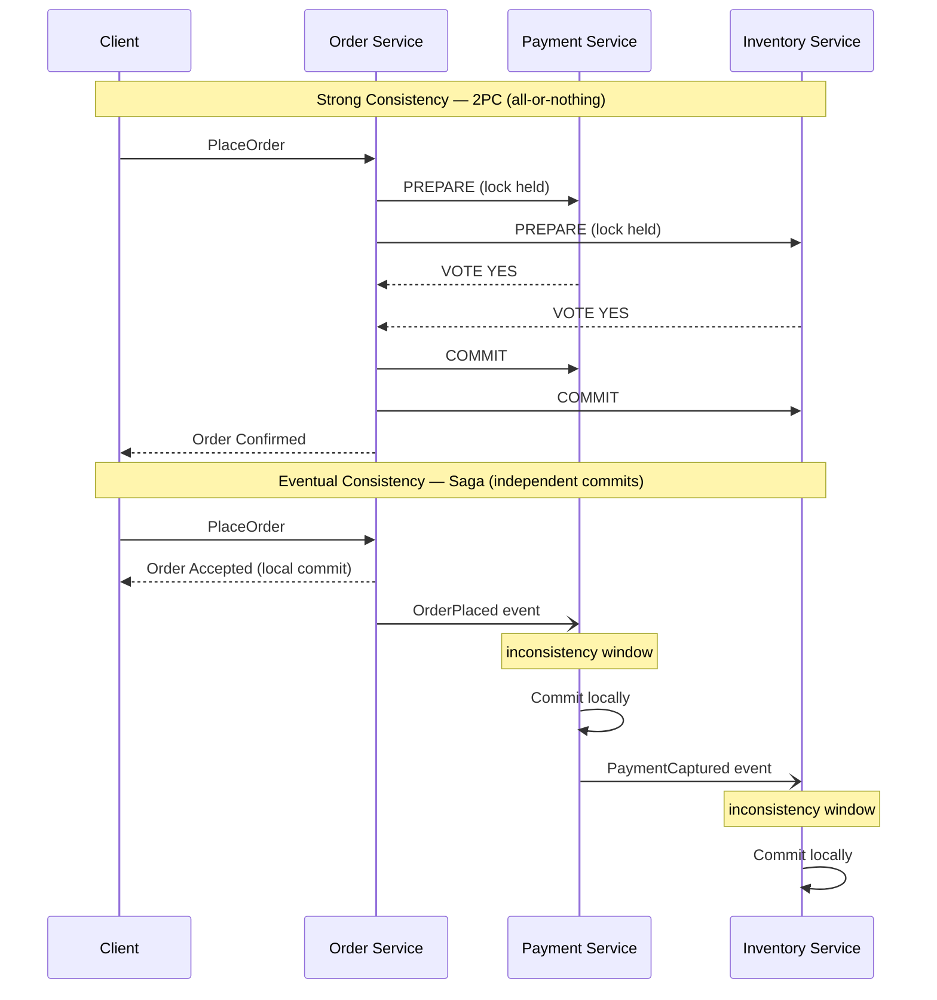

La siguiente tabla agudiza el contraste.

| Dimensión | Consistencia fuerte | Consistencia eventual |
|---|---|---|
| Lectura después de escritura | Siempre actualizada | Actualizada *eventualmente* |
| Alcance | Base de datos única / transacción | Múltiples servicios |
| Disponibilidad bajo partición | Sacrificada | Preservada |
| Latencia | Mayor (coordinación) | Menor (commits locales) |
| Modo de fallo | Todo o nada | Parcial, luego reconciliado |
| Costo de razonamiento | Bajo | Alto — los estados intermedios importan |

La conclusión para arquitectos senior: **la consistencia eventual no es un compromiso que se acepta a regañadientes; es el supuesto habilitador de los servicios independientes.** En el momento en que se exige consistencia fuerte a través de límites de servicio, se han reacoplado los servicios que los Capítulos 1 al 6 se esforzaron en desacoplar.

<details>
<summary>💡 Nota del Experto</summary>

El texto presenta la consistencia como algo binario (fuerte vs. eventual), lo cual es útil pedagógicamente pero puede llevar a los arquitectos a sobreingeniería. En la práctica, muchos requisitos de UX y API solo necesitan consistencia "read-your-writes" (causal) — el usuario que acaba de crear un recurso puede verlo en la siguiente solicitud, pero que otros usuarios vean una vista ligeramente obsoleta es aceptable. Esto es más débil que la consistencia fuerte pero más fuerte que la eventual pura. Diseñar para read-your-writes a menudo elimina la necesidad de llamadas síncronas entre servicios: redirige al usuario a la URL canónica del recurso recién creado inmediatamente después del commit local, y depende de la propagación de eventos para todos los demás. Distinguir "¿qué nivel de consistencia necesita realmente esta acción del usuario?" evita la respuesta instintiva de agregar llamadas síncronas para lograr consistencia fuerte donde la causal sería suficiente.
</details>

## Por Qué Fallan las Transacciones ACID Distribuidas

Antes de las sagas, hay que reconocer el patrón que reemplazan. La respuesta del libro de texto para la consistencia multi-servicio es el **commit en dos fases** (two-phase commit, 2PC): un coordinador le pide a cada participante que se *prepare*, espera que todos voten sí, y luego les dice que hagan *commit*. Si algún participante vota no, todos abortan. Sobre el papel, atomicidad a través de servicios.

En la práctica, 2PC tiene tres propiedades fatales para los sistemas cloud-native.

Primero, **mantiene bloqueos a través de la red.** Entre prepare y commit, cada participante mantiene sus filas bloqueadas, esperando al coordinador. Una red lenta o un servicio distante convierte un bloqueo de milisegundos en uno de varios segundos, colapsando el rendimiento.

Segundo, **es un protocolo bloqueante.** Si el coordinador falla después de que los participantes votan sí pero antes de que transmita la decisión, los participantes quedan atrapados — bloqueados, inciertos, incapaces de continuar o abortar de forma segura. Este es el conocido estado "en duda", y recuperarse de él es operacionalmente miserable.

Tercero, **acopla la disponibilidad.** Una transacción tiene éxito solo si *cada* participante está activo al mismo instante. Cinco servicios con 99.9% de disponibilidad cada uno producen aproximadamente 99.5% combinado — se ha multiplicado la fragilidad. Esto viola directamente la independencia que hace que los microservicios valgan su costo.

**Listing 7.1** — Este ejemplo simula un coordinador 2PC que dirige tres servicios a través de las fases de prepare y commit. El flag `simulate_crash_after_prepare` demuestra la ventana de estado en duda: los participantes ya votaron sí y mantienen sus bloqueos, pero el coordinador aún no transmitió la decisión — dejando al sistema en un estado irresoluble hasta una intervención manual o un protocolo de recuperación.

```python
# O(n) per phase where n = number of participants; locks held across both phases are the core hazard
from __future__ import annotations

import enum
from dataclasses import dataclass


class VoteResult(enum.Enum):
    YES = "yes"
    NO = "no"


class CoordinatorState(enum.Enum):
    IDLE = "IDLE"
    PREPARING = "PREPARING"
    COMMITTED = "COMMITTED"
    ABORTED = "ABORTED"
    IN_DOUBT = "IN_DOUBT"  # coordinator crashed after votes, before broadcasting the decision


@dataclass
class Participant:
    """Represents one service participating in the distributed transaction."""
    name: str
    vote: VoteResult = VoteResult.YES
    locked: bool = False   # True while row locks are held during the prepare phase
    committed: bool = False

    def prepare(self) -> VoteResult:
        # Participant locks its rows and signals readiness; lock is NOT released until phase 2
        self.locked = True
        return self.vote

    def commit(self) -> None:
        self.locked = False
        self.committed = True

    def abort(self) -> None:
        self.locked = False
        self.committed = False


class TwoPhaseCommitCoordinator:
    """Drives the two phases; exposes the crash-induced in-doubt scenario."""

    def __init__(self, participants: list[Participant]) -> None:
        self.participants = participants
        self.state = CoordinatorState.IDLE
        self._votes: dict[str, VoteResult] = {}

    def run(self, simulate_crash_after_prepare: bool = False) -> CoordinatorState:
        # ── Phase 1 — Prepare ───────────────────────────────────────────────
        # Coordinator asks every participant to vote; each locks its rows.
        self.state = CoordinatorState.PREPARING
        for p in self.participants:
            vote = p.prepare()
            self._votes[p.name] = vote
            print(f"  {p.name:20s}  voted {vote.value:3s}  locked={p.locked}")

        all_yes = all(v == VoteResult.YES for v in self._votes.values())

        if simulate_crash_after_prepare:
            # The coordinator dies here. Participants hold locks and cannot safely
            # commit or abort on their own — the "in-doubt" blocking window begins.
            self.state = CoordinatorState.IN_DOUBT
            stuck = [p.name for p in self.participants if p.locked]
            print(f"\n  *** COORDINATOR CRASHED — in-doubt participants (locks held): {stuck} ***")
            print("  Recovery requires the coordinator to restart and re-broadcast its decision.")
            return self.state

        # ── Phase 2 — Commit or Abort ────────────────────────────────────────
        # Only reached if the coordinator survived; broadcasts a single uniform decision.
        if all_yes:
            for p in self.participants:
                p.commit()
            self.state = CoordinatorState.COMMITTED
        else:
            for p in self.participants:
                p.abort()
            self.state = CoordinatorState.ABORTED

        return self.state


# ── Demo ─────────────────────────────────────────────────────────────────────
if __name__ == "__main__":
    print("=== Happy path: all participants vote YES ===")
    services = [Participant("OrderSvc"), Participant("PaymentSvc"), Participant("InventorySvc")]
    result = TwoPhaseCommitCoordinator(services).run()
    print(f"Coordinator final state: {result.value}\n")

    print("=== Crash scenario: coordinator dies after phase 1 ===")
    services = [Participant("OrderSvc"), Participant("PaymentSvc"), Participant("InventorySvc")]
    result = TwoPhaseCommitCoordinator(services).run(simulate_crash_after_prepare=True)
    print(f"Coordinator final state: {result.value}")
    # Expected output:
    #   *** COORDINATOR CRASHED — in-doubt participants (locks held): ['OrderSvc', 'PaymentSvc', 'InventorySvc'] ***
```

Hay una verdad más profunda aquí, y es el teorema CAP, al cual volvemos al final del capítulo: cuando una partición de red divide los servicios, 2PC elige consistencia negándose a continuar. Para la mayoría de los procesos de negocio — pedidos, reservas, registros — negarse a continuar es la respuesta incorrecta. El negocio preferiría aceptar el pedido ahora y reconciliar después. Esa preferencia *es* la elección de una saga.

> 💡 **Nota del Experto:** El texto identifica correctamente 2PC como el patrón a reemplazar, pero omite una trampa empresarial muy extendida: las transacciones XA (JTA en Jakarta EE, `@Transactional` de Spring abarcando múltiples beans `DataSource` o `ConnectionFactory`, y MSDTC en .NET) son 2PC disfrazado. Muchos equipos creen que no están usando ACID distribuido hasta que rastrean un incidente en producción y encuentran un coordinador XA manteniendo bloqueos silenciosamente a través de una base de datos y un message broker. La señal es un `javax.transaction.UserTransaction` o `ChainedTransactionManager` en el árbol de dependencias. Audite su grafo de dependencias antes de declarar que ha eliminado 2PC de una ruta de migración heredada.

<details>
<summary>⚠️ Nota Crítica</summary>

El capítulo enmarca 2PC como una elección puramente "CP" — un sistema que sacrifica disponibilidad a cambio de consistencia cuando ocurre una partición. Esto es una simplificación excesiva que el propio estado en duda ya refuta dentro de la misma sección. Cuando el coordinador falla después de que los participantes hayan votado *sí* pero antes de que se transmita la decisión de commit, los participantes están bloqueados e inciertos — no pueden ni confirmar ni abortar de forma segura. En ese punto, el sistema no es ni disponible *ni* consistente: está atascado. 2PC no garantía C de manera confiable bajo fallos del coordinador; garantiza que no ocurra ningún commit incorrecto, lo cual no es lo mismo que proporcionar una lectura consistente. La caracterización CAP de 2PC como CP es una abreviatura útil para el compromiso de tolerancia a particiones, pero presentarla sin la advertencia de que la garantía "C" se degrada bajo fallos del coordinador es engañoso para los profesionales que evalúan modos de fallo.

**Corrección sugerida:** Calificar la caracterización CP: "2PC se describe típicamente como CP, pero la garantía es más precisamente 'ningún commit incorrecto' — bajo fallos del coordinador, los participantes en duda no logran ni disponibilidad ni un estado consistente garantizado. El costo real de 2PC no es solo disponibilidad perdida bajo particiones sino recuperabilidad perdida bajo fallos del coordinador."
</details>

## Sagas Coreografiadas Versus Orquestadas

Una **saga** es una secuencia de transacciones locales donde cada paso publica un evento que desencadena el siguiente. Si un paso falla, la saga ejecuta **transacciones compensatorias** (compensating transactions) para deshacer los pasos completados. Hay dos formas de conectar los pasos, y la distinción — presentada por primera vez en el Capítulo 3 como una topología, aplicada ahora específicamente a las sagas — define cómo operará el sistema.

En una **saga coreografiada** (choreographed saga), no hay coordinador central. Cada servicio escucha eventos, hace su trabajo local y emite su propio evento. El servicio de pedidos publica `OrderPlaced`; el servicio de pagos reacciona, carga la tarjeta y publica `PaymentCaptured`; el servicio de inventario reacciona a *ese* y reserva el stock. El flujo vive en las reacciones. Ningún componente individual conoce el proceso completo.

En una **saga orquestada** (orchestrated saga), un coordinador dedicado — el **orquestador** (orchestrator) — es dueño del proceso. Envía comandos explícitos (`CapturePayment`, `ReserveStock`), espera respuestas y decide el siguiente paso. El Order Orchestrator conoce cada paso, cada posible fallo y cada compensación. El flujo vive en un solo lugar.

**Figura 7.2** — La coreografía conecta los servicios a través de una cadena de eventos reactivos sin coordinador único, mientras que la orquestación coloca toda la lógica del proceso en un orquestador explícito que emite comandos y espera respuestas — comprender este compromiso determina qué tan visible y mantenible será el flujo de la saga a medida que crece la complejidad.

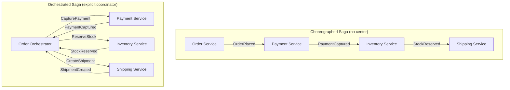

El compromiso es real y se trata de *dónde vive la lógica del proceso*.

| Factor | Coreografía | Orquestación |
|---|---|---|
| Acoplamiento | Bajo — los servicios solo conocen eventos | Mayor — el orquestador conoce todos los pasos |
| Visibilidad | Deficiente — el flujo es implícito | Excelente — el flujo es explícito en un solo lugar |
| Agregar un paso | Tocar múltiples servicios | Tocar el orquestador |
| Riesgo de ciclos | Alto — eventos desencadenando eventos | Bajo — los comandos son dirigidos |
| Mejor para | Flujos cortos, 2–4 pasos | Flujos complejos, muchas ramificaciones |
| Depuración | Difícil — sin narrativa única | Más fácil — un solo estado para inspeccionar |

Aquí está la guía con posición propia. **Use coreografía para flujos cortos y estables** donde las reacciones son obvias e improbables de cambiar. El desacoplamiento es genuino y la simplicidad es real. Pero **en el momento en que una saga crece más allá de tres o cuatro pasos, o adquiere ramas condicionales, recurra a la orquestación.** Las sagas coreografiadas a escala se convierten en "espagueti de eventos" — nadie puede decirle lo que hace el proceso sin rastrear eventos a través de seis servicios. El flujo de control implícito que hace elegante a la coreografía a pequeña escala la hace inmantenible a gran escala. Prefiera el orquestador aburrido y visible.

> 💡 **Nota del Experto:** El texto advierte correctamente sobre el "espagueti de eventos" en la coreografía, pero la dependencia de confiabilidad en la publicación transaccional de eventos merece igual énfasis. En una saga coreografiada, si un servicio confirma su transacción de base de datos local pero falla antes de publicar el evento downstream, la saga se detiene silenciosamente — sin excepción, sin alerta, sin siguiente paso. El Outbox Pattern (escribir el evento en una tabla `outbox` local en la misma transacción ACID y sondearlo con un relay) no es opcional para sagas coreografiadas en producción; es el mecanismo que hace que la coreografía sea confiable en absoluto. Sin él, la ventaja del desacoplamiento se ve socavada por una brecha de confiabilidad oculta. Si este capítulo hace referencia al Outbox Pattern de un capítulo anterior, haga esa dependencia explícita aquí.

<details>
<summary>💡 Nota del Experto</summary>

La estrategia de pruebas diverge marcadamente entre las dos topologías, y esto moldea la velocidad del equipo en la práctica. Las sagas coreografiadas requieren pruebas de contrato a través de los límites de servicio (Pact, Spring Cloud Contract) para verificar que un evento publicado por el Servicio A satisface realmente el esquema de consumidor del Servicio B — sin esto, las integraciones se rompen silenciosamente cuando se renombra un campo. Las sagas orquestadas se pueden probar unitariamente de forma aislada: simular los canales de comandos downstream, alimentar eventos de respuesta, verificar transiciones de estado. El conjunto de pruebas del orquestador se convierte en la documentación viva de la saga. Los equipos que eligen orquestación por visibilidad a menudo subestiman que también les da una superficie de pruebas dramáticamente más simple — un punto que vale la pena destacar para los arquitectos que prefieren la coreografía por razones ideológicas.
</details>

## Transacciones Compensatorias y Rollback Semántico

El corazón de la saga es lo que sucede cuando el paso cuatro falla después de que los pasos uno al tres tuvieron éxito. No hay `ROLLBACK` — esas transacciones ya confirmaron, en otras bases de datos, posiblemente hace horas. En cambio, la saga ejecuta **transacciones compensatorias**: nuevas transacciones que semánticamente deshacen el efecto de las completadas.

La palabra crítica es **semánticamente**. Una compensación no es una reversión técnica a un estado anterior; es una *nueva acción de negocio* que contrarresta una anterior. No se descarga una tarjeta de crédito — se *emite un reembolso*. No se des-envía un correo electrónico — se *envía una corrección*. No se elimina un registro de envío — se *cancela el envío*. La acción compensatoria es en sí misma un hecho real, registrado y que avanza hacia adelante.

**Listing 7.2** — Este ejemplo implementa el núcleo de ejecución de saga independiente de coreografía: cada `SagaStep` agrupa una acción de avance con su compensación semántica. Cuando cualquier paso lanza una excepción, el ejecutor deshace solo los pasos ya completados en estricto orden inverso — asegurando que los efectos se deshagan en una secuencia de negocio sensata. Las acciones de compensación son nuevos hechos de negocio (reembolso, liberación, cancelación), nunca deshechos de base de datos en bruto.

```python
# Saga execution — O(n) forward, O(k) compensation where k = steps completed before failure
from __future__ import annotations

import enum
from dataclasses import dataclass, field
from typing import Callable


class StepStatus(enum.Enum):
    PENDING = "pending"
    COMPLETED = "completed"
    COMPENSATED = "compensated"
    FAILED = "failed"


@dataclass
class SagaStep:
    """Pairs a forward business action with its semantic compensation."""
    name: str
    action: Callable[[], None]
    compensation: Callable[[], None]
    status: StepStatus = field(default=StepStatus.PENDING, init=False)


class OrderSaga:
    """
    Executes an order saga: ReserveStock → CapturePayment → CreateShipment.
    On any failure, compensates completed steps in reverse order.
    """

    def __init__(self, order_id: str) -> None:
        self.order_id = order_id
        # Steps are declared in the intended execution order.
        # Compensations are the semantic inverse — a refund, not an un-charge.
        self.steps: list[SagaStep] = [
            SagaStep("ReserveStock",   self._reserve_stock,   self._release_stock),
            SagaStep("CapturePayment", self._capture_payment, self._refund_payment),
            SagaStep("CreateShipment", self._create_shipment, self._cancel_shipment),
        ]

    # ── Forward actions ───────────────────────────────────────────────────────

    def _reserve_stock(self) -> None:
        print(f"  [ReserveStock]   stock reserved   order={self.order_id}")

    def _capture_payment(self) -> None:
        print(f"  [CapturePayment] charging card     order={self.order_id}")
        # Simulate a transient infrastructure failure mid-saga
        raise RuntimeError("Payment gateway timeout — no charge was made")

    def _create_shipment(self) -> None:
        print(f"  [CreateShipment] shipment created  order={self.order_id}")

    # ── Compensating actions — semantic reversals, each a new business fact ──

    def _release_stock(self) -> None:
        # Idempotent: check a compensation key in production to guard against double-release
        print(f"  [ReleaseStock]   stock released    order={self.order_id}")

    def _refund_payment(self) -> None:
        # Issues a refund record, not a deletion of the charge attempt
        print(f"  [RefundPayment]  refund issued     order={self.order_id}")

    def _cancel_shipment(self) -> None:
        print(f"  [CancelShipment] shipment cancelled order={self.order_id}")

    # ── Saga runner ───────────────────────────────────────────────────────────

    def execute(self) -> bool:
        """
        Run forward steps in order. On the first failure, compensate every
        previously completed step in reverse order (LIFO), then return False.
        """
        completed: list[SagaStep] = []

        for step in self.steps:
            try:
                step.action()
                step.status = StepStatus.COMPLETED
                completed.append(step)
            except Exception as exc:
                step.status = StepStatus.FAILED
                print(f"\n  Step '{step.name}' failed: {exc}")
                print("  Compensating completed steps in reverse order...")
                # Reverse-order compensation ensures effects unwind in a sensible sequence
                for done in reversed(completed):
                    done.compensation()
                    done.status = StepStatus.COMPENSATED
                return False

        return True


# ── Demo ─────────────────────────────────────────────────────────────────────
if __name__ == "__main__":
    print("=== Order Saga: ReserveStock succeeds, CapturePayment fails ===\n")
    saga = OrderSaga(order_id="ORD-42")
    success = saga.execute()

    print(f"\nSaga result: {'completed' if success else 'compensated'}")
    for step in saga.steps:
        print(f"  {step.name:20s}  {step.status.value}")
    # Expected output:
    #   [ReserveStock]   stock reserved   order=ORD-42
    #   [CapturePayment] charging card     order=ORD-42
    #   Step 'CapturePayment' failed: Payment gateway timeout — no charge was made
    #   Compensating completed steps in reverse order...
    #   [ReleaseStock]   stock released    order=ORD-42
    #   Saga result: compensated
    #   ReserveStock          compensated
    #   CapturePayment        failed
    #   CreateShipment        pending
```

Tres propiedades hacen confiables a las compensaciones, y cada una se mapea a una regla de diseño.

1. **Las compensaciones deben ser idempotentes.** Un comando de reembolso puede entregarse más de una vez bajo entrega at-least-once (Capítulo 4). Reemitirlo no debe reembolsar dos veces. Use una clave de compensación y verifique "¿ya compensado?" antes de actuar.

2. **Las compensaciones deben aplicarse en estricto orden inverso.** Ejecútelas en orden inverso a los pasos de avance, para que los efectos se deshagan en una secuencia sensata — libere el stock que reservó, reembolse el pago que capturó.

3. **Algunas acciones no pueden compensarse — así que ordene la saga en torno a ellas.** No se puede des-lanzar un misil ni des-enviar un paquete físico. Estas son **transacciones pivote** (pivot transactions): después del pivote, la saga solo puede avanzar. La regla de diseño es colocar todos los pasos *compensables* antes del pivote y todos los pasos *reintentables* (garantizados de eventualmente tener éxito) después de él. Estructure la saga para que el paso irreversible ocurra al final, una vez que todo lo reversible ya haya tenido éxito.

Esta taxonomía — compensable, pivote, reintentable — es el modelo mental más útil para diseñar sagas. Clasifique cada paso, luego ordénelos para que el fallo sea siempre completamente reversible o garantizado de completarse.

> **Pro Tip:** La compensación no es manejo de errores añadido después. Es la mitad del proceso de negocio. Si no puede describir cómo deshacer un paso en términos de negocio, aún no comprende el paso. Modele la compensación al mismo tiempo que modela la acción de avance — en la misma sesión de Event Storming del Capítulo 2.

> 💡 **Nota del Experto:** El texto establece que las compensaciones deben ser idempotentes, pero no aborda el caso en que la propia compensación falla — y este es uno de los escenarios operacionalmente más peligrosos en sagas en producción. Un comando `RefundPayment` puede ser rechazado por un procesador de pagos downstream que está temporalmente caído, o rechazado porque la tarjeta ha sido cancelada. Cuando la transacción compensatoria es inentregable o rechazada, la saga queda atascada en un estado parcialmente compensado sin ruta de resolución automática. Los sistemas en producción deben modelar esto explícitamente: un estado terminal `CompensationFailed` respaldado por una dead-letter queue, una regla de alerta y un playbook de remediación manual. En industrias reguladas (servicios financieros, salud) este estado también debe disparar un evento de cumplimiento. Los equipos que omiten este estado descubren que existe de todos modos — simplemente no pueden observarlo ni actuar sobre él.

> ⚠️ **Nota Crítica:** Toda la sección sobre compensaciones describe una única instancia de saga de forma aislada. Nunca aborda el *problema de aislamiento de sagas*: porque cada transacción local confirma de forma independiente y los estados intermedios de la saga son completamente visibles para otras transacciones concurrentes, las sagas sufren de fenómenos que el aislamiento ACID previene — específicamente lecturas sucias y actualizaciones perdidas. Un proceso concurrente que lee el registro de pedido entre `PaymentCaptured` y `ShipmentCreated` ve un estado que puede compensarse posteriormente. Dependiendo de lo que haga con esos datos, la compensación puede ser insuficiente para restaurar la corrección global. El artículo original de Garcia-Molina de 1987 que introdujo las sagas identificó explícitamente esta limitación, y "Microservices Patterns" de Chris Richardson (la referencia canónica para profesionales) dedica una sección completa a las contramedidas: bloqueos semánticos, actualizaciones conmutativas, vistas pesimistas y re-lectura de valores. Para una audiencia de arquitectos senior que diseña sistemas de procesamiento de pedidos de alta concurrencia, omitir esto es una brecha material — es la fuente más común de corrupción sutil de datos en implementaciones de sagas en producción.

<details>
<summary>⚠️ Nota Crítica</summary>

La Propiedad 2 establece "Las compensaciones deben aplicarse en estricto orden inverso." La formulación original en inglés usaba el término "commutative-safe" (conmutativo seguro), lo cual es un error terminológico que contradice directamente el consejo que le sigue. La *conmutatividad* significa que el orden de las operaciones no importa — si las compensaciones fueran conmutativas, no habría necesidad de ejecutarlas en orden inverso. El texto luego instruye inmediatamente al lector a ejecutar las compensaciones en orden inverso, lo cual es lo *opuesto* a un requisito de conmutatividad. Lo que la propiedad realmente requiere es un estricto *orden secuencial* inverso: cada compensación debe aplicarse en secuencia inversa relativa a los pasos de avance. Llamar a esto "commutative-safe" confundirá a cualquier ingeniero que conozca el término.

**Corrección sugerida:** Reemplazar "Las compensaciones deben ser conmutativas seguras con respecto al orden" con "Las compensaciones deben aplicarse en estricta secuencia inversa: deshacer primero el último paso confirmado." Aclarar que la conmutatividad significaría que el orden es irrelevante, lo cual es lo opuesto a la restricción aquí.
</details>

## Gestores de Procesos y Máquinas de Estado

Un orquestador que simplemente reenvía comandos es delgado. Un orquestador real debe recordar: qué pasos se han completado, cuáles están pendientes, qué hacer en cada respuesta, cuándo agotar el tiempo de espera y cuándo comenzar a compensar. Ese coordinador con estado tiene un nombre — el **gestor de procesos** (process manager) — y su implementación más confiable es una **máquina de estados** (state machine) explícita.

Un gestor de procesos es un componente que recibe eventos, mantiene el estado de una única instancia de saga y decide el siguiente comando basándose en ese estado. Modélelo como un conjunto finito de estados con transiciones definidas: `AwaitingPayment → AwaitingStock → AwaitingShipment → Completed`, con aristas de fallo que ramifican en `Compensating → Cancelled`. Cada evento entrante avanza el estado o desencadena compensación. Nada sucede implícitamente.

**Figura 7.3** — Esta máquina de estados captura cada estado observable de una saga de pedido en vuelo y hace explícitas tanto la ruta feliz como las rutas de compensación como transiciones — persistir este estado en cada transición es lo que permite al gestor de procesos sobrevivir fallos y reanudar sin huérfanos de pedidos en vuelo.

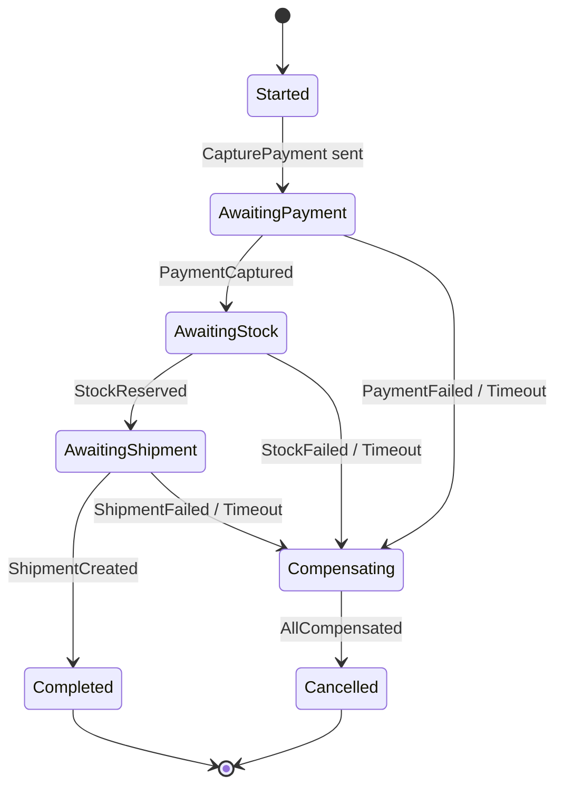

Dos disciplinas de implementación separan un gestor de procesos robusto de uno frágil.

**Persistir el estado de la saga en cada transición.** El gestor de procesos es en sí mismo un agregado — y todo lo del Capítulo 6 aplica. Su estado debe sobrevivir a un fallo. Cuando el orquestador reinicia, rehidrata cada saga en vuelo desde su estado persistido y reanuda exactamente donde se quedó. Un gestor de procesos que mantiene el estado de la saga solo en memoria huérfanará, en el primer reinicio del pod, cada pedido en vuelo. Esto no es hipotético; es el error de saga más común en producción.

**Tratar los timeouts como estados de primera clase, no como ocurrencias tardías.** En un mundo síncrono, una llamada colgada lanza una excepción. En una saga, un paso que nunca responde simplemente... espera, para siempre, silenciosamente. El gestor de procesos debe establecer un temporizador en cada paso pendiente. Si `PaymentCaptured` no llega dentro del plazo, el timeout es un *evento* que transiciona la máquina de estados — usualmente hacia la compensación. Los procesos de larga duración viven y mueren por su manejo de la respuesta que nunca llega.

> **Pro Tip:** Resista el impulso de codificar gestores de procesos a mano con condicionales anidados y flags booleanos (`paymentDone`, `stockDone`). Ese estilo se deteriora en el instante en que aparece un cuarto paso. Una máquina de estados explícita — una tabla de (estado actual, evento) → (siguiente estado, acción) — permanece legible con diez estados y es directamente testeable sin ninguna infraestructura.

Muchos equipos recurren a un motor de workflow aquí — Temporal, AWS Step Functions, Camunda — precisamente porque estas herramientas proporcionan estado duradero, temporizadores y reintentos de forma nativa. Es una elección razonable. Pero comprenda lo que le dan: una máquina de estados persistida y gestionada. El patrón es el mismo ya sea que lo implemente a mano o lo adquiera.

<details>
<summary>💡 Nota del Experto</summary>

El texto recomienda Temporal, AWS Step Functions y Camunda como opciones razonables, lo cual es preciso. Sin embargo, sus modelos de durabilidad difieren de maneras que emergen bajo fallos: Temporal persiste un historial de eventos completo y seguro para replay en una base de datos (Postgres o Cassandra) y reconstruye el estado del workflow reproduciendo ese historial — un fallo a mitad de paso reproduce todas las actividades anteriores al reiniciar. AWS Step Functions almacena el estado de ejecución en su propio almacén gestionado pero impone límites estrictos (25,000 eventos de historial por ejecución) que afectan los procesos de larga duración que abarcan semanas. Camunda 8 utiliza el log replicado de Zeebe. Los equipos que seleccionan una de estas herramientas basándose únicamente en la experiencia del desarrollador, y luego alcanzan un límite de historial de ejecución o descubren que Temporal requiere operar su propio clúster de base de datos, enfrentan migraciones costosas. Evalúe el modelo de durabilidad y la huella operacional antes de comprometerse.
</details>

<details>
<summary>💡 Nota del Experto</summary>

Un antipatrón común cuando los equipos adoptan motores de workflow es codificar reglas de negocio dentro del propio orquestador — ramas condicionales basadas en el nivel del cliente, lógica de precios, verificaciones de cumplimiento — convirtiéndolo en un "God Workflow". El orquestador debe emitir comandos y recibir respuestas; debe contener solo flujo de control (secuencia, ramificación en tipo de respuesta, timeout). Las reglas de negocio pertenecen a los servicios que ejecutan los comandos. Cuando el orquestador crece más allá de unas pocas centenas de líneas de lógica de control, se vuelve tan difícil de cambiar como el monolito que la saga reemplazó. La disciplina es: si una condición de rama requiere conocimiento del dominio, pertenece a un servicio, no al coordinador de la saga.
</details>

## El Teorema CAP Aplicado a Flujos de Eventos

Todo en este capítulo es consecuencia de un teorema, así que hay que hacerlo explícito. El **teorema CAP** establece que un sistema distribuido, cuando una **partición** (P) de red lo divide, puede preservar ya sea **consistencia** (C) — cada nodo ve los mismos datos — o **disponibilidad** (A) — cada solicitud obtiene una respuesta — pero no ambas. Las particiones no son opcionales; las redes fallan. Así que la elección real no es "CA versus algo." Cuando ocurre la partición, se elige C o A.

Las transacciones distribuidas y 2PC son la elección **CP**: bajo una partición, se niegan a continuar para mantener los datos consistentes. El pedido simplemente falla. Las sagas son la elección **AP**: bajo una partición, cada transacción local aún confirma, el sistema permanece disponible, y la consistencia se restaura posteriormente a través del flujo de eventos y compensaciones. **Una saga es, en su núcleo, una apuesta arquitectónica de que la disponibilidad importa más que la consistencia instantánea** — y para la mayoría de los procesos de negocio, esa apuesta es correcta.

Esto reencuadra la consistencia eventual de una limitación a una posición deliberada. No se está conformando con consistencia débil porque las sagas no pueden hacerlo mejor. Se está *eligiendo* disponibilidad, y la consistencia eventual es la forma disciplinada de honrar esa elección mientras aún se converge a un estado final correcto.

**Figura 7.4** — Cuando ocurre una partición de red, el sistema debe elegir entre bloquear la operación para preservar la consistencia (CP — la ruta 2PC) o confirmar localmente para permanecer disponible y converger después (AP — la ruta de saga), y este diagrama hace explícito que las sagas no son una solución alternativa sino una elección arquitectónica deliberada con consecuencias de negocio predecibles.

```mermaid
flowchart TD
    A[Cross-Service Business Operation] --> B{Network Partition Detected?}
    B -->|No| N[Proceed Normally]
    B -->|Yes| D{CAP Choice}
    D -->|Choose Consistency - CP| E[Block — Wait for All Participants]
    E --> F[2PC Coordinator Holds Locks]
    F --> G[Operation Fails\nData remains consistent\nBusiness request rejected]
    D -->|Choose Availability - AP| H[Commit Locally per Service]
    H --> I[Each Service Stays Available\nSaga Continues]
    I --> J[Eventual Convergence\nvia Events and Compensations\nBusiness request accepted]
```

Un matiz que vale la pena interiorizar, y es donde los arquitectos senior ganan su título. CAP no es una propiedad de todo el sistema; es una propiedad de cada *operación*. Cargar un pago podría demandar estrictez similar a CP dentro del propio límite del servicio de pagos — una única transacción ACID, sin ambigüedad sobre el dinero. Coordinar ese pago con inventario y envío a través de servicios es AP — una saga. Las arquitecturas maduras no son uniformemente consistentes o uniformemente disponibles. Son fuertemente consistentes *dentro* de cada límite de servicio y eventualmente consistentes *a través* de límites, con las sagas como el puente entre los dos regímenes.

<details>
<summary>⚠️ Nota Crítica</summary>

El teorema CAP se presenta como un marco completo y actual para las decisiones de consistencia distribuida, pero sus limitaciones prácticas están bien establecidas. El propio Eric Brewer reconoció en su retrospectiva de 2012 ("CAP Twelve Years Later: How the 'Rules' Have Changed," IEEE Computer) que el encuadre binario del teorema oscurece más de lo que revela. El teorema PACELC (Abadi, 2012) — que extiende CAP para abordar el compromiso latencia/consistencia que existe *incluso cuando no hay partición* — es el modelo más operacionalmente relevante para los arquitectos que diseñan sistemas dirigidos por eventos, donde la pregunta cotidiana no es "¿qué sucede durante una partición" sino "¿cuál es el costo de latencia de una consistencia más fuerte cuando la red está sana?" Presentar CAP sin este contexto lleva a los arquitectos senior a usarlo como un instrumento contundente al evaluar el comportamiento del sistema fuera de escenarios de fallo, que es el caso común.

**Corrección sugerida:** Agregar un cuadro lateral "Más allá de CAP" señalando: (1) la "C" de CAP significa específicamente linearizabilidad, no todos los modelos de consistencia; (2) el modelo PACELC extiende el análisis a la dimensión latencia/consistencia bajo operación normal; (3) la retrospectiva de Brewer de 2012 recomienda tratar el compromiso como continuo en lugar de binario. Esto posiciona al lector para leer la documentación de proveedores con precisión.
</details>

## Conclusiones Clave

- **Las transacciones ACID distribuidas no escalan.** El commit en dos fases mantiene bloqueos a través de la red, se bloquea ante fallos del coordinador y multiplica la fragilidad de sus servicios en un único punto de fallo. Rechácelo para procesos de negocio entre servicios.
- **Una saga es una secuencia de transacciones locales coordinadas por eventos, revertidas por compensación, no por rollback.** Acepta la consistencia eventual para preservar la disponibilidad y la independencia de los servicios.
- **Coreografíe flujos cortos y estables; orqueste los complejos o con ramificaciones.** La coreografía desacopla pero oculta el proceso; la orquestación centraliza la lógica y hace visible el flujo. Más allá de tres o cuatro pasos, prefiera la orquestación.
- **Las compensaciones son nuevas acciones de negocio, no deshechos técnicos.** Clasifique cada paso como compensable, pivote o reintentable, y ordene la saga para que la irreversibilidad llegue al final.
- **Un gestor de procesos es una máquina de estados persistida.** Persista el estado en cada transición y trate los timeouts como eventos de primera clase, o el primer reinicio del pod huérfanará sus sagas en vuelo.
- **Las sagas son la elección AP del teorema CAP.** Consistencia fuerte dentro de cada límite de servicio, consistencia eventual a través de límites, con la saga como el puente.

## Qué Sigue

Las sagas dependen de eventos cuyo significado permanece estable a través de servicios y a través del tiempo — lo que plantea el problema que el Capítulo 8 enfrenta de frente: cómo evolucionar esquemas y contratos de eventos sin romper los consumidores y las sagas de larga duración que dependen de ellos.

<!-- ASSEMBLY COMPLETE
  Chapter: Consistency, Sagas, and Long-Running Processes
  Code blocks resolved: 2 / 2
  Diagrams resolved: 4 / 4
  Expert callouts (inline): 3
  Expert callouts (collapsed): 4
  Critical callouts (inline): 1
  Critical callouts (collapsed): 3
  Unresolved markers: 0
-->


# Chapter 8: Schema Evolution and Event Versioning

## Planteamiento del Problema Inicial

El Capítulo 7 dejó al lector con un sistema cuya verdad está distribuida entre servicios que convergen con el tiempo a través de sagas y compensaciones. El Capítulo 6 hizo una promesa aún más fuerte: con Event Sourcing (almacenamiento de eventos), cada evento se conserva para siempre. Esa promesa ahora presenta su factura. Una API de request-response puede deprecar un campo en un trimestre y forzar a todos los consumidores a actualizarse. Un event store no puede. Un evento escrito en 2021 será leído en 2027, por un consumidor escrito en 2025, ejecutando código que nadie del equipo original recuerda. El evento no es un mensaje transitorio; es un **contrato persistido con el futuro**. Así que la verdadera pregunta de este capítulo es incómoda: ¿cómo cambia un arquitecto la forma de un hecho que ya ocurrió, está almacenado millones de veces y es consumido por equipos que nunca conoció? Hacerlo mal convierte cada despliegue en un evento coordinado, multi-equipo y de alto riesgo. Hacerlo bien permite que los equipos evolucionen sus contratos de forma independiente, a su propio ritmo, sin romper ni un solo consumidor. Este capítulo trata de conseguir esa independencia — y de la única decisión de política que, si se omite, garantiza silenciosamente lo contrario.

## Compatibilidad Hacia Atrás y Hacia Adelante

Toda conversación sobre evolución de esquemas (schema evolution) se reduce eventualmente a dos palabras: dirección de **compatibilidad** (compatibility). Confundirlas es el error más común — y más costoso — en este dominio, por lo que deben definirse con precisión y nunca volver a mezclarse.

**Backward compatibility** (compatibilidad hacia atrás) significa que un *consumidor nuevo* puede leer *eventos antiguos*. Se cambió el esquema; un consumidor que ejecuta el nuevo esquema sigue entendiendo datos escritos bajo el antiguo. Esta es la dirección que Event Sourcing exige, porque el event store está lleno de eventos antiguos que serán reproducidos indefinidamente.

**Forward compatibility** (compatibilidad hacia adelante) significa que un *consumidor antiguo* puede leer *eventos nuevos*. Se cambió el esquema; un consumidor que aún ejecuta la versión antigua tolera datos escritos bajo la nueva, típicamente ignorando lo que no reconoce. Esta es la dirección que la integración pub/sub exige, porque no es posible actualizar todos los consumidores en el mismo instante que se actualiza el productor.

**Full compatibility** (compatibilidad total) es ambas a la vez. Es la más estricta y la más segura, y es el objetivo al que muchos registros maduros aspiran mediante configuración explícita.

El beneficio práctico es un conjunto de reglas simple sobre qué está permitido cambiar. Los cambios seguros son casi siempre aditivos.

**Figura 8.1 — Matriz de decisión de compatibilidad de cambios de esquema**

```mermaid
flowchart LR
    subgraph FULL["Full-Safe — Backward AND Forward"]
        F1["Add optional field with default"]
        F2["Widen type — int to long"]
    end

    subgraph BACK["Backward-Safe Only\n(new consumer reads old events)"]
        B1["Remove optional field\n(new schema supplies default)"]
    end

    subgraph FWD["Forward-Safe Only\n(old consumer reads new events)"]
        V1["Add required field — no default\n(old consumer ignores unknown fields)"]
    end

    subgraph UNSAFE["Never Safe — Breaks Both Directions"]
        U1["Rename field\n= remove + add — fails both ways"]
        U2["Narrow type — long to int\n(truncation risk)"]
        U3["Change field meaning\n(semantic breakage)"]
    end

    FULL -->|"Safe to ship anytime"| OK(["Deploy freely"])
    BACK -->|"Roll consumers forward first"| WARN(["Coordinate rollout"])
    FWD -->|"Breaks event replays"| WARN2(["Block for Event Sourcing"])
    UNSAFE -->|"Registry must reject"| BLOCK(["Build fails"])
```

*Este diagrama clasifica los cambios de esquema más comunes en cuatro grupos de seguridad, dejando inmediatamente claro cuáles pueden desplegarse sin coordinación con los consumidores. Comprender estos agrupamientos es la base de una evolución disciplinada de esquemas: solo los cambios full-safe pueden desplegarse en cualquier momento sin riesgo.*

Nótese la trampa oculta en esa matriz. Agregar un campo **required** (requerido) rompe la backward compatibility, porque los eventos antiguos simplemente no lo contienen. Eliminar un campo rompe la forward compatibility, porque los consumidores antiguos aún lo esperan. Y un renombrado no es una operación — es un delete más un add, por lo que falla en ambos frentes. La disciplina, entonces, es aburrida por diseño: preferir campos opcionales, siempre proporcionar valores por defecto, y tratar "required" como una palabra que debe justificarse en una revisión.

**Listing 8.1 — Evolución segura de esquema Avro: adición de un campo opcional con valor por defecto null**

Este ejemplo muestra dos versiones de esquema Avro para un evento `OrderPlaced`. Agregar un campo opcional con default null logra full compatibility: la resolución de esquemas reader/writer de Avro rellena el valor por defecto para eventos antiguos (backward), y los campos más nuevos ausentes en el esquema del reader simplemente son proyectados (forward).

```python
# Schema evolution: safe addition of an optional field with a null default
# Demonstrates both backward and forward compatibility using Avro-style schemas

from typing import Any

# v1 schema: original OrderPlaced event (no coupon support yet)
ORDER_PLACED_V1: dict[str, Any] = {
    "type": "record",
    "name": "OrderPlaced",
    "namespace": "com.example.orders",
    "doc": "An order was placed by a customer.",
    "fields": [
        {"name": "orderId",    "type": "string"},
        {"name": "customerId", "type": "string"},
        {"name": "totalCents", "type": "long"},
    ],
}

# v2 schema: adds optional couponCode as a null-first union (default = null)
ORDER_PLACED_V2: dict[str, Any] = {
    "type": "record",
    "name": "OrderPlaced",
    "namespace": "com.example.orders",
    "doc": "An order was placed by a customer.",
    "fields": [
        {"name": "orderId",    "type": "string"},
        {"name": "customerId", "type": "string"},
        {"name": "totalCents", "type": "long"},
        # null-first union means the declared default (None/null) is valid.
        # Avro requires that the default value matches the first type in the union.
        {
            "name": "couponCode",
            "type": ["null", "string"],  # null-first union
            "default": None,             # Python None serialises as Avro null
            "doc": "Discount coupon applied at checkout, or null if none.",
        },
    ],
}

# --- Compatibility analysis ---
#
# BACKWARD-COMPATIBLE (new consumer reads old v1 event):
#   A v2 consumer deserialising a v1 event finds no couponCode bytes.
#   Avro reader/writer schema resolution fills in the declared default: null.
#   The v2 consumer proceeds without error. ✓
#
# FORWARD-COMPATIBLE (old consumer reads new v2 event):
#   A v1 consumer deserialising a v2 event encounters the couponCode bytes.
#   Avro projection: writer fields absent from the reader schema are skipped.
#   The v1 consumer proceeds without error. ✓
#
# RESULT: FULL compatibility — safe in both directions.


def demonstrate_compatibility() -> None:
    """Simulate reader/writer schema resolution in plain Python dicts."""
    import json

    # v1 event as it exists in the store — no couponCode field
    v1_payload: dict[str, Any] = {
        "orderId": "ord-001",
        "customerId": "cust-42",
        "totalCents": 4999,
    }

    # v2 consumer view: Avro fills in the default for absent fields
    def read_as_v2(payload: dict[str, Any]) -> dict[str, Any]:
        return {**{"couponCode": None}, **payload}  # default applied if key missing

    # v1 consumer view: extra fields in a v2 payload are projected away
    v1_field_names = {f["name"] for f in ORDER_PLACED_V1["fields"]}

    def read_as_v1(payload: dict[str, Any]) -> dict[str, Any]:
        return {k: v for k, v in payload.items() if k in v1_field_names}

    # v2 event as a newer producer would write it
    v2_payload: dict[str, Any] = {
        "orderId": "ord-002",
        "customerId": "cust-99",
        "totalCents": 2500,
        "couponCode": "SAVE10",
    }

    print("v2 consumer reads v1 event:", json.dumps(read_as_v2(v1_payload)))
    print("v1 consumer reads v2 event:", json.dumps(read_as_v1(v2_payload)))


if __name__ == "__main__":
    demonstrate_compatibility()
```

Una distinción más que los ingenieros senior confunden habitualmente: la compatibilidad es una propiedad del *par de esquemas*, no del evento. Un mismo cambio puede ser backward-compatible y forward-incompatible al mismo tiempo. Siempre preguntar "¿compatible en qué dirección, para quién?" antes de aprobar cualquier cambio.

> 💡 **Nota del Experto:** El texto afirma que la full compatibility "es el objetivo al que apuntan por defecto la mayoría de los registros maduros". Esto es inexacto y debe corregirse antes de la publicación. Confluent Schema Registry — el estándar de facto en la industria — tiene por defecto compatibilidad **BACKWARD**, no FULL. AWS Glue Schema Registry también usa BACKWARD_ALL por defecto. FULL compatibility es una elección explícita, no un valor por defecto, precisamente porque prohíbe la eliminación de campos e impone restricciones que muchos equipos no pueden cumplir al inicio del ciclo de vida de un producto. Publicar la afirmación tal como está redactada llevará a los profesionales a configurar mal los registros, y luego a confundirse cuando los valores por defecto reales contradigan lo que indica el libro.

<details>
<summary>💡 Nota del Experto</summary>

El texto explica qué cambios son seguros e inseguros, pero no nombra el patrón **Tolerant Reader** — la disciplina del lado del consumidor que es la implementación práctica de la forward compatibility. Un tolerant reader deserializa únicamente los campos que necesita explícitamente y descarta todo lo demás sin errores, en lugar de fallar ante campos desconocidos o faltantes. Esta es la disciplina complementaria a los cambios exclusivamente aditivos del productor: el productor agrega campos de forma segura solo si los consumidores están escritos para tolerarlos. En la práctica, muchos frameworks de deserialización (en especial Jackson con `FAIL_ON_UNKNOWN_PROPERTIES` que por defecto es false en versiones recientes, o la proyección de esquemas de Avro) implementan esto automáticamente, pero los equipos que usan bibliotecas de validación estricta o parsers escritos a mano deben aplicarlo explícitamente en las revisiones de código. Nombrar el patrón le da a los equipos vocabulario para usarlo en documentos de estándares y listas de verificación de revisión.
</details>

> ⚠️ **Nota Crítica:** El texto afirma que FULL compatibility "es el objetivo al que apuntan por defecto la mayoría de los registros maduros". Esto es factualmente incorrecto. Confluent Schema Registry — el registro dominante en sistemas basados en Kafka y la implementación de referencia de facto — usa por defecto `BACKWARD`, no `FULL`. AWS Glue Schema Registry también usa `BACKWARD_ALL` por defecto. Ningún registro ampliamente desplegado usa `FULL` por defecto. Un arquitecto que lea esta afirmación y luego abra la interfaz de administración de su registro encontrará inmediatamente una contradicción, lo que socava la confianza en todo el capítulo. Reemplazar la oración con la declaración precisa: la mayoría de los registros maduros usan `BACKWARD` (Confluent) o `BACKWARD_ALL` (AWS Glue) por defecto. Aclarar que `FULL` debe configurarse explícitamente y explicar el compromiso: impide la eliminación de campos, lo que genera acumulación de esquemas con el tiempo, pero elimina toda una clase de roturas en los consumidores.

## Schema Registry y Formatos (Avro, JSON Schema, Protobuf)

Las reglas no tienen valor si nadie las hace cumplir. Un **schema registry** (registro de esquemas) es el componente que almacena el esquema canónico de cada tipo de evento, le asigna una versión y — esta es la parte importante — *rechaza* registrar una nueva versión que viole la regla de compatibilidad configurada. Convierte la compatibilidad de una esperanza en la revisión de código en una barrera en tiempo de compilación.

La mecánica es sencilla. El productor registra un esquema y recibe a cambio un ID numérico. Publica eventos etiquetados con ese ID en lugar del esquema completo. El consumidor lee el ID, obtiene el esquema correspondiente del registro (y lo almacena en caché), y deserializa. Dos beneficios surgen de inmediato: los eventos en tránsito son pequeños y ningún consumidor puede adivinar el esquema — siempre resuelve exactamente el que usó el productor.

**Figura 8.2 — Secuencia de interacción con el schema registry**

```mermaid
sequenceDiagram
    participant P as Producer
    participant SR as Schema Registry
    participant BR as Broker
    participant C as Consumer

    P->>SR: Submit candidate schema
    alt Schema is compatible
        SR-->>P: Return schema ID
        P->>BR: Publish event (schema ID + binary payload)
        C->>BR: Read message
        C->>SR: Fetch schema by ID (cache miss)
        SR-->>C: Return schema definition
        C->>C: Deserialize event using schema
    else Schema violates compatibility rule
        SR-->>P: Reject — compatibility violation
        note over P: Build fails on producer side
    end
```

*Este diagrama de secuencia muestra cómo un schema registry convierte una política de revisión de código en una barrera estricta en tiempo de compilación: los esquemas incompatibles son rechazados antes de que un solo evento llegue al broker. También se ilustra el formato de transmisión basado en ID, mostrando cómo los consumidores siempre resuelven exactamente el esquema que usó el productor — eliminando las suposiciones en la deserialización.*

El registro es neutral en cuanto al formato en concepto, pero la elección del formato de serialización es en sí misma una decisión de diseño con consecuencias reales. Los tres que dominan los sistemas cloud-native presentan distintos compromisos.

| Formato | Ubicación del esquema | Modelo de evolución | Legible por humanos | Mejor opción |
|---|---|---|---|---|
| **Avro** | Externo, resuelto por ID | Resolución de esquemas reader/writer — historia de evolución más sólida | No (binario) | Streams de eventos Kafka, event stores |
| **Protobuf** | Compilado en el código (números de campo) | Basado en números de campo; agregar/reservar, nunca reutilizar números | No (binario) | gRPC, contratos internos de alto throughput |
| **JSON Schema** | Externo o inline | Aditivo con defaults; centrado en validación | Sí (texto) | Eventos públicos/de socios, prioridad en la depurabilidad |

**Avro** merece la atención del arquitecto en sistemas con Event Sourcing por una característica: deserializa usando *tanto* el esquema del writer (lo que produjo el evento) como el esquema del reader (lo que el consumidor espera), reconciliando la diferencia automáticamente. Esa separación reader/writer es exactamente la maquinaria de backward compatibility que Event Sourcing necesita, integrada en el formato.

**Protobuf** codifica los campos por número, no por nombre, por lo que renombrar un campo no tiene costo en el wire — pero reutilizar un número de campo retirado es catastrófico, mapeando silenciosamente bytes antiguos a un nuevo significado. La regla es absoluta: **reservar** los números de campo eliminados, nunca reciclarlos.

**JSON Schema** ofrece legibilidad y depuración sencilla a costa de tamaño y garantías más débiles. Para eventos que cruzan el límite de una empresa hacia un socio que los inspeccionará visualmente, ese compromiso suele ser correcto.

No hay un ganador universal. Los streams internos de la plataforma se inclinan hacia Avro o Protobuf; los contratos que se entregan a externos se inclinan hacia JSON. Lo que no es negociable es que *algún* registro aplique *alguna* política.

<details>
<summary>💡 Nota del Experto</summary>

El texto explica que los productores etiquetan los eventos con un schema ID, pero omite el detalle del formato en el wire que hace que esto sea interoperable en la práctica. El formato wire de Confluent — ahora un estándar de facto adoptado por AWS MSK, Confluent Cloud y la mayoría de las herramientas adyacentes a Kafka — es: `0x00` (magic byte) + schema ID de 4 bytes big-endian + payload serializado. Cualquier consumidor no-Kafka (un bridge de webhook HTTP, un pipeline CDC, un consumidor Java legacy) debe entender este encuadre antes de poder siquiera comenzar la deserialización. Los equipos que tratan el schema ID como un detalle interno lo descubren de la manera difícil cuando incorporan su primer consumidor externo o poliglota. Los arquitectos deben documentar explícitamente este contrato de wire y probar la deserialización desde al menos un cliente no-JVM antes del go-live.
</details>

<details>
<summary>💡 Nota del Experto</summary>

El schema registry se menciona como una barrera en tiempo de compilación, pero no se aborda su riesgo operacional como dependencia en tiempo de ejecución. En producción, cada consumidor realiza una consulta al registro en caso de cache miss la primera vez que encuentra un nuevo schema ID. Si el registro no está disponible, un consumidor que aún no ha cacheado ese esquema fallará al deserializar. La mitigación estándar es una **caché local de esquemas en disco** que sobrevive a la caída del registro — el cliente Java de Confluent la soporta mediante la configuración de `SchemaRegistryClient` cache, pero no está habilitada por defecto. Los equipos que despliegan el registro como instancia única sin HA, o que no siembran la caché local antes de desplegar los consumidores, tratan un reinicio rutinario del registro como un incidente en producción. Tratar el registro con el mismo SLA de disponibilidad que el broker en sí.
</details>

<details>
<summary>⚠️ Nota Crítica</summary>

La sección de Protobuf afirma que "renombrar un campo no tiene costo en el wire". Aunque esto es cierto a nivel de codificación binaria (los campos están codificados por número, no por nombre), es engañoso en la práctica para el público objetivo. Renombrar un campo de Protobuf cambia cada API de cliente generada — cada servicio que importa el archivo `.proto` debe recompilar y actualizar sus call sites. Para un contrato interno compartido con muchos consumidores, un renombrado desencadena un despliegue coordinado de código generado en todos los consumidores, que es exactamente el problema de acoplamiento que el capítulo busca evitar. Presentar esto como "no tiene costo" subestima el impacto operacional. Matizar la afirmación: "renombrar no tiene costo en el *formato wire*, pero el código generado de cada consumidor cambia y debe recompilarse y desplegarse". Agregar una nota de que esto convierte el renombrado en una preocupación logística incluso cuando es seguro a nivel de wire, en particular para contratos ampliamente compartidos.
</details>

## Upcasting y Versionado de Eventos Persistidos

Las reglas de compatibilidad mantienen la seguridad siempre que cada cambio sea aditivo. La realidad no es tan amable. Eventualmente un concepto de negocio cambia genuinamente de forma — un único campo `name` debe convertirse en `firstName` y `lastName`, o un monto almacenado como float debe convertirse en un entero de unidades menores. Ninguna regla aditiva cubre esto, y no es posible reescribir la historia: los eventos antiguos son hechos inmutables, ya persistidos, posiblemente en millones.

La respuesta es **upcasting** (promoción de versiones): transformar un evento antiguo al esquema actual *en el momento de la lectura*, en memoria, en su camino desde el store hacia la aplicación. Los bytes almacenados nunca cambian. Un componente en el pipeline de deserialización detecta la versión antigua y aplica una función que lo proyecta hacia la nueva forma. La lógica de dominio solo ve la última versión y permanece ajena al hecho de que existen cinco formatos históricos por debajo.

**Listing 8.2 — Pipeline de upcaster: promover eventos versionados al esquema actual en tiempo de lectura**

Este ejemplo implementa un pipeline de upcaster versionado como un registro basado en decoradores. Cada upcaster promueve exactamente una versión hacia adelante; el pipeline los encadena automáticamente. Los bytes almacenados nunca se mutan — la transformación ocurre en tiempo de lectura, en memoria. El handler de dominio está escrito intencionalmente conociendo solo `CustomerRegisteredV2`.

```python
# Upcaster pipeline: promote persisted events to the current schema at read time.
# Stored bytes are never modified; the upgrade is purely in-memory on the read path.
# Time complexity: O(n) per event, where n = number of version steps required.

from __future__ import annotations

import dataclasses
from collections.abc import Callable
from typing import Any

UpcasterKey = tuple[str, int]          # (event_type, from_version)
UpcasterFn  = Callable[[dict[str, Any]], dict[str, Any]]


class UpcasterPipeline:
    """Registry and executor of upcaster functions keyed by (event_type, from_version).

    Each registered upcaster promotes one version forward. The pipeline walks
    the chain until no further upcaster is registered for the current version.
    """

    def __init__(self) -> None:
        self._registry: dict[UpcasterKey, UpcasterFn] = {}

    def register(
        self, event_type: str, from_version: int
    ) -> Callable[[UpcasterFn], UpcasterFn]:
        """Decorator: register a function as the upcaster for (event_type, from_version)."""
        def decorator(fn: UpcasterFn) -> UpcasterFn:
            self._registry[(event_type, from_version)] = fn
            return fn
        return decorator

    def upcast(self, raw: dict[str, Any]) -> dict[str, Any]:
        """Walk the upcaster chain until the payload reaches the latest version."""
        payload = dict(raw)  # shallow copy — original dict (stored bytes) is untouched
        event_type: str = payload["event_type"]

        while (key := (event_type, payload["version"])) in self._registry:
            payload = self._registry[key](payload)

        return payload


# Singleton pipeline shared across the read path
pipeline = UpcasterPipeline()


# ── Upcaster: CustomerRegistered v1 → v2 ──────────────────────────────────────
# Business change: the single denormalised fullName field was split into
# firstName and lastName to support proper sorting and personalisation.

@pipeline.register("CustomerRegistered", from_version=1)
def upcast_customer_registered_v1_to_v2(payload: dict[str, Any]) -> dict[str, Any]:
    full_name: str = payload["full_name"]
    first, _, last = full_name.partition(" ")   # partition on first space only
    return {
        "event_type":  payload["event_type"],
        "version":     2,                        # bumped — v2 upcaster can now run if needed
        "customer_id": payload["customer_id"],
        "first_name":  first,
        "last_name":   last or "",
        # full_name is intentionally absent — it no longer exists in v2
    }


# ── Current domain schema ──────────────────────────────────────────────────────

@dataclasses.dataclass(frozen=True)
class CustomerRegisteredV2:
    event_type:  str
    version:     int
    customer_id: str
    first_name:  str
    last_name:   str


# ── Domain handler ─────────────────────────────────────────────────────────────
# This handler knows nothing about v1. It only works with CustomerRegisteredV2.

def handle_customer_registered(event: CustomerRegisteredV2) -> None:
    print(
        f"[handler] Welcome, {event.first_name} {event.last_name}!"
        f" (customer_id={event.customer_id}, schema_version={event.version})"
    )


# ── Read-path orchestration ────────────────────────────────────────────────────

def load_and_dispatch(raw: dict[str, Any]) -> None:
    """Read a stored event payload, upcast transparently, dispatch to handler."""
    current = pipeline.upcast(raw)          # v1 is promoted; v2+ passes through
    event = CustomerRegisteredV2(**current)
    handle_customer_registered(event)


if __name__ == "__main__":
    # Simulate a v1 event written to the event store years ago
    stored_v1: dict[str, Any] = {
        "event_type":  "CustomerRegistered",
        "version":     1,
        "customer_id": "cust-007",
        "full_name":   "Ada Lovelace",     # old single-field schema
    }

    # Simulate a v2 event written after the schema change
    stored_v2: dict[str, Any] = {
        "event_type":  "CustomerRegistered",
        "version":     2,
        "customer_id": "cust-008",
        "first_name":  "Grace",
        "last_name":   "Hopper",
    }

    load_and_dispatch(stored_v1)  # upcasted v1 → v2 transparently
    load_and_dispatch(stored_v2)  # already current; passes through unchanged
```

La cadena de upcasters es el patrón que escala esto. Cada upcaster promueve exactamente una versión hacia adelante — v1→v2, v2→v3 — y el pipeline los ejecuta en secuencia. Un evento v1 en disco pasa por ambos upcasters y llega como v3. Esto mantiene cada transformación pequeña, independientemente testeable y honesta respecto a exactamente qué cambio representa.

**Figura 8.3 — Diagrama de flujo del pipeline de upcaster**

```mermaid
flowchart TD
    STORE["Event Store\n(immutable — bytes never changed)"]
    STORE -->|read raw bytes| A["Stored Event + Version Tag"]
    A --> VER{Check version}

    VER -->|v1| U1["Upcaster v1 → v2\nsplit fullName into firstName + lastName"]
    VER -->|v2| U2["Upcaster v2 → v3\nconvert amount float to integer minor units"]
    VER -->|v3| PT["Pass Through\nno transformation needed"]

    U1 --> U2
    U2 --> CURR["Current Schema Event — v3"]
    PT --> CURR

    CURR --> DH["Domain Handler\n(sees only v3 — always)"]
```

*Este diagrama de flujo ilustra cómo una cadena de upcasters promueve cualquier versión histórica de un evento al esquema actual en tiempo de lectura, sin tocar nunca los bytes almacenados. Cada upcaster transforma exactamente un paso de versión, manteniendo las transformaciones individuales pequeñas, testeables y razonables de forma independiente — mientras el handler de dominio permanece ajeno a que existen múltiples formatos históricos.*

Dos disciplinas hacen que el upcasting sea sostenible en lugar de una carga creciente. Primero, **cada evento lleva un número de versión explícito** en sus metadatos desde el primer día — retrofitar el versionado a un store sin versiones es doloroso, así que hay que pagar este costo por adelantado aunque la v1 sea todo lo que se tiene. Segundo, el upcasting no es la *única* opción para migraciones grandes. Cuando una cadena de upcasters se vuelve difícil de manejar, se puede **reescribir el stream** en uno nuevo bajo el nuevo esquema (una migración "copy-and-transform"), dejando el stream antiguo como un archivo inmutable. El upcasting es más barato día a día; la reescritura del stream es más limpia a largo plazo. La mayoría de los sistemas usan ambas, y elegir entre ellas es un juicio arquitectónico genuino, no un valor por defecto.

Resistir la tentación de "simplemente corregir los datos" con una actualización in-place del store. Eso destruye la única propiedad — una historia inmutable y auditable — que justificó Event Sourcing en primer lugar.

<details>
<summary>💡 Nota del Experto</summary>

A escala de producción, una cadena de upcasters interactúa peligrosamente con la reconstrucción de agregados en Event Sourcing. Reproducir un stream de 500k eventos a través de incluso dos upcasters por evento agrega un tiempo significativo de CPU y clock durante reinicios en frío o reconstrucciones de agregados desde cero. La mitigación estándar — **aggregate snapshots** — debe co-diseñarse con la estrategia de upcasting: un snapshot almacena el estado del agregado completamente promovido a la versión actual, de modo que las reproducciones solo procesan eventos *desde* el último snapshot. Si el snapshotting se agrega como una idea de última hora después de que la cadena de upcasters ya está en su lugar, los equipos descubren que los snapshots antiguos pueden ellos mismos necesitar versionado y upcasting, creando un problema recursivo. Tanto el versionado como el snapshotting deben diseñarse juntos desde el principio, no secuencialmente.
</details>

<details>
<summary>⚠️ Nota Crítica</summary>

El patrón de cadena de upcasters se presenta enteramente en el camino feliz. No hay discusión sobre qué ocurre cuando un upcaster lanza una excepción o produce una salida que falla la validación posterior. En un sistema event-sourced, un upcaster defectuoso no solo falla un mensaje — vuelve ilegible toda la historia del agregado, bloqueando todo el procesamiento de comandos para ese agregado hasta que el bug sea corregido y redespliegado. Este es uno de los modos de falla operacionalmente más peligrosos en sistemas event-sourced y está completamente ausente del texto. Los upcasters deben ser testeados contra un corpus de eventos históricos reales antes del despliegue; un upcaster fallido debería mostrar un error claro con el payload del evento almacenado y la versión, no corromper silenciosamente el estado; considerar envolver el pipeline en un fallback que exponga el evento raw para triaje en lugar de hacer crashear completamente el lado de lectura.
</details>

## Contratos, Consumer-Driven Contracts y Gobernanza

Todo lo anterior es mecanismo. La parte más difícil de la evolución de esquemas no es técnica; es organizacional. Un evento que cruza un bounded context (el Capítulo 2 enmarcó los eventos como contratos de propiedad) es una promesa de un equipo productor hacia equipos consumidores que pueden estar en otros departamentos, otras zonas horarias, otras líneas de reporte. El registro hace cumplir la compatibilidad sintáctica. No puede decirte *quién está consumiendo realmente qué*, y por lo tanto no puede decirte si un cambio técnicamente compatible es *semánticamente* seguro de desplegar.

Aquí es donde los **consumer-driven contracts** (CDC — contratos dirigidos por el consumidor) ganan su lugar. La idea invierte la dirección habitual de la autoridad. En lugar de que el productor declare "aquí está mi esquema, adáptate a él", cada consumidor publica un contrato que indica exactamente los campos y formas *de los que depende*. El pipeline de construcción del productor verifica su esquema contra la unión de todos los contratos del consumidor. Si un cambio propuesto rompe las expectativas declaradas de cualquier consumidor, el pipeline del productor falla — antes del despliegue, del lado del productor, donde se originó el cambio.

**Figura 8.4 — Flujo de trabajo de consumer-driven contracts**

```mermaid
flowchart TD
    CA["Consumer A\npublishes contract\n(expected fields + types)"]
    CB["Consumer B\npublishes contract\n(expected fields + types)"]

    CA -->|upload| REPO["Shared Contract Repository\n(contract broker)"]
    CB -->|upload| REPO

    REPO -->|pull all contracts| CI["Producer CI Pipeline\n(candidate schema)"]

    CI --> CHK{Candidate schema\nsatisfies all contracts?}
    CHK -->|Yes — all consumers pass| PASS["Build Passes\nProduce deploys safely"]
    CHK -->|No — contract violated| FAIL["Build Fails\nProducer must fix schema\nbefore deployment"]

    subgraph CONTRAST["Direction of Authority"]
        PD["Producer-driven\nschema pushed down to consumers"]
        CDC["Consumer-driven\ncontracts pulled up by producer"]
    end
```

*Este diagrama muestra cómo los consumer-driven contracts invierten la relación de autoridad: en lugar de que el productor declare un esquema y lo empuje hacia abajo, cada consumidor establece lo que necesita y el propio pipeline CI del productor es responsable de satisfacer todos ellos. Este es el mecanismo que detecta los cambios semánticamente disruptivos que un schema registry — que no tiene conocimiento de los consumidores reales — no puede detectar.*

La distinción entre un schema registry y los consumer-driven contracts vale la pena enunciarla claramente, porque los equipos suelen asumir que uno reemplaza al otro.

| Preocupación | Schema registry | Consumer-driven contracts |
|---|---|---|
| Pregunta respondida | "¿Es este cambio estructuralmente compatible?" | "¿Se rompe algún consumidor real?" |
| Conoce a los consumidores | No | Sí, explícitamente |
| Punto de aplicación | Registro del esquema | Build CI del productor |
| Detecta uso semántico incorrecto | No | Parcialmente (solo expectativas declaradas) |

Son capas complementarias, no competidoras. El registro es la barrera rápida y gruesa; CDC es la más lenta y consciente del consumidor.

Alrededor de ambas está la **gobernanza**: las políticas que hacen que la evolución sea predecible en toda una organización. La gobernanza efectiva es más liviana de lo que los equipos temen y consiste en unas pocas reglas duraderas. Asignar a cada tipo de evento un único equipo propietario. Exigir un modo de compatibilidad explícito por stream de eventos, registrado y visible. Requerir que la deprecación se anuncie con un plazo y una métrica que demuestre que la versión antigua ya no se lee antes de retirarla. Versionar en metadatos, nunca mutando payloads. La gobernanza no es un comité que frena a los equipos; es el pequeño conjunto de acuerdos que permite a los equipos moverse *sin* coordinar cada lanzamiento.

<details>
<summary>💡 Nota del Experto</summary>

El texto describe los consumer-driven contracts conceptualmente pero no nombra las herramientas, lo cual importa para los profesionales. **Pact** (pact.io) es la implementación open-source dominante: los consumidores escriben archivos Pact expresando las interacciones de las que dependen, un **Pact Broker** (o PactFlow para SaaS) los almacena, y el pipeline CI del productor ejecuta `can-i-deploy` contra el broker antes de cualquier lanzamiento. La disciplina crítica de producción que el texto no menciona son los **pending pacts y WIP pacts** — el mecanismo de Pact para introducir nuevos contratos de consumidor sin bloquear inmediatamente el build del productor durante el período de negociación inicial. Sin este mecanismo, incorporar un nuevo consumidor se convierte en un congelamiento coordinado entre ambos equipos. Los arquitectos senior que evalúen CDC deben valorar específicamente si la herramienta elegida soporta este modo de despliegue gradual.
</details>

<details>
<summary>💡 Nota del Experto</summary>

El texto recomienda "deprecación respaldada por métricas" antes de retirar versiones antiguas de esquemas, que es el principio correcto, pero vale la pena nombrar explícitamente la brecha de medición en la práctica. Las métricas del schema registry indican si una *versión* de esquema está siendo registrada o consultada — no indican si un *campo* específico dentro de esa versión está siendo usado por los consumidores posteriores. Un consumidor puede consultar el esquema v3 mientras solo lee el campo `orderId` e ignora `couponCode`. Si `couponCode` es el campo que se desea eliminar, los conteos de consultas dan una falsa confianza. La métrica más segura es la **telemetría de campo a nivel del consumidor**: deserialización instrumentada que registra qué campos se acceden por grupo de consumidor. Pocos equipos implementan esto, pero los que han pasado por un incidente doloroso de eliminación de campo casi siempre lo agregan después.
</details>

<details>
<summary>⚠️ Nota Crítica</summary>

La sección de consumer-driven contracts (CDC) presenta el patrón como una red de seguridad confiable con poco reconocimiento de su principal modo de fallo organizacional: CDC solo funciona cuando cada consumidor mantiene y publica activamente su contrato. En la práctica, lograr una participación del 100% es difícil — los equipos posponen las actualizaciones de contratos, se incorporan nuevos consumidores sin contratos, y los consumidores legacy son olvidados. Un build CI de productor que pasa contra la unión de los contratos *publicados* puede aún romper un consumidor no publicado. El texto implica que CDC responde "¿se rompe algún consumidor real?" pero la respuesta honesta es "¿se rompe algún consumidor real *que publicó un contrato*?" — una garantía más débil que la que sugiere la tabla. La garantía está acotada por la participación — un equipo consumidor que nunca publica un contrato no obtiene protección. CDC debe combinarse con un registro de consumidores conocidos y una lista de verificación de incorporación que haga obligatoria la publicación del contrato.
</details>

## La Trampa de la Política Ausente

El error más dañino en todo este capítulo no es un mal cambio de esquema. Es la *ausencia de una política de compatibilidad declarada*. Esto merece su propia sección porque falla silenciosamente y casi siempre se descubre demasiado tarde.

Un sistema sin política no anuncia el problema. Todo funciona — hasta que el primer cambio genuinamente disruptivo se despliega, un consumidor a tres equipos de distancia deserializa basura, y un incidente de producción se remonta a un campo que alguien "limpió" meses antes. Como no había ninguna barrera, nada lo detuvo. Como los eventos son persistidos, el veneno está ahora en el store permanentemente, y cada reproducción lo vuelve a disparar.

La solución es asombrosamente barata en relación con el daño que previene: **elegir un modo de compatibilidad por defecto antes de que se envíe el primer evento**, y hacer que el registro lo aplique. `BACKWARD` es el valor por defecto sensato para la mayoría de los sistemas event-sourced; `FULL` si se puede asumir la disciplina. Esa única decisión, tomada temprano, convierte toda una clase de incidentes de producción entre equipos en fallos en tiempo de compilación en el escritorio de quien los causó.

> 💡 **Nota del Experto:** El texto identifica correctamente la ausencia de una política declarada como el error más dañino, pero no distingue entre dos modos de fallo que requieren diferentes remedios. El primero es un equipo greenfield sin ningún registro — la solución es sencilla: levantar un registro, elegir BACKWARD, aplicarlo. El segundo caso, más doloroso, es un sistema en ejecución donde los eventos se han enviado durante meses sin un registro, y ahora se está implementando uno de forma retroactiva. En este caso, el registro inicial del esquema debe tratarse como una auditoría de **línea base de compatibilidad**, no como una importación simple: cada esquema existente debe revisarse manualmente antes de registrarse, porque la primera verificación de compatibilidad del registro se realizará contra lo que se declare como v1. Los equipos que importan en bloque esquemas existentes sin revisión frecuentemente descubren que sus esquemas "estables" ya contienen patrones (campos required no documentados, coerciones de tipo implícitas) que fallarían una verificación BACKWARD, requiriendo la remediación inmediata de los consumidores en producción antes de que el registro pueda aplicarse.

## Conclusiones Clave

- **La compatibilidad tiene una dirección.** Backward = el nuevo consumidor lee eventos antiguos (Event Sourcing necesita esto); forward = el consumidor antiguo lee eventos nuevos (pub/sub lo necesita); full = ambas. Siempre preguntar "¿compatible en qué dirección, para quién?"
- **Aditivo-únicamente es el camino seguro.** Agregar campos opcionales con defaults; nunca renombrar in-place, agregar campos required sin defaults, ni reutilizar un número de campo Protobuf retirado.
- **Un schema registry convierte la política en una barrera en tiempo de compilación.** Rechaza esquemas incompatibles antes de que se despleguen; la resolución reader/writer de Avro lo hace especialmente sólido para event stores.
- **Upcast, no mutar.** Transformar eventos persistidos antiguos al esquema actual en tiempo de lectura mediante una cadena de upcasters versionada; versionar cada evento en metadatos desde el primer día.
- **El registro responde "¿es estructuralmente compatible?"; los consumer-driven contracts responden "¿se rompe algún consumidor real?"** Se necesitan ambos, más gobernanza ligera: un propietario por tipo de evento, un modo de compatibilidad explícito y deprecación respaldada por métricas.
- **No tener política de compatibilidad es la trampa.** Elegir un modo por defecto (BACKWARD o FULL) y aplicarlo antes de que se envíe el primer evento.

## Qué Sigue

Con contratos que pueden evolucionar de forma segura, el Capítulo 9 aborda la realidad operacional de ejecutar estos sistemas — observar, rastrear y depurar flujos de eventos cuyo flujo de control es implícito y está distribuido entre servicios desacoplados.

<!-- ASSEMBLY COMPLETE
  Chapter: Schema Evolution and Event Versioning
  Code blocks resolved: 2 / 2
  Diagrams resolved: 4 / 4
  Expert callouts (inline): 2
  Expert callouts (collapsed): 6
  Critical callouts (inline): 1
  Critical callouts (collapsed): 3
  Unresolved markers: 0
-->


# Capítulo 9: Observabilidad, Depuración y Operaciones

## Planteamiento del Problema Inicial

El Capítulo 8 le proporcionó la disciplina para evolucionar esquemas de eventos sin romper consumidores, y añadió metadatos de versionado a cada evento. Ahora aparece un problema diferente en producción. Un cliente se queja de que un pedido fue cobrado dos veces pero el correo de confirmación nunca llegó. En un sistema sincrónico, abriría un stack trace y seguiría la cadena de llamadas de arriba a abajo. En un sistema event-driven (orientado a eventos), no hay stack trace. El servicio de pagos publicó un hecho. Tres consumidores reaccionaron de forma independiente. Uno de ellos publicó otro hecho. Se suponía que el servicio de correo estaba escuchando, pero no ocurrió nada. ¿Por dónde se empieza?

Este es el dolor operacional central de la Event-Driven Architecture (arquitectura orientada a eventos): **el flujo de control es implícito**. Ningún servicio individual conoce la historia completa, porque el desacoplamiento — la propiedad misma por la que pagó en el Capítulo 1 — oculta la cadena causal. Este capítulo le proporciona las herramientas para hacer visible esa cadena oculta nuevamente. Aprenderá a rastrear una solicitud a través de servicios desacoplados, a medir si los consumidores están al día, a depurar flujos que no tienen call stack, y a operar la maquinaria de fallos — dead-letter queues y reprocesamiento — sin empeorar las cosas. Estos no son extras opcionales. En un sistema distribuido, la observabilidad es un requisito arquitectónico de primera clase, no algo que se añade después de un incidente.

## Rastreo Distribuido e IDs de Correlación/Causalidad

Comencemos con la idea más importante de este capítulo. Para reconstruir una historia a partir de eventos desacoplados, debe transportar identidad a través de todo el flujo. Dos IDs realizan este trabajo, y no son lo mismo.

Un **correlation ID** (ID de correlación) es un identificador único compartido por cada evento que pertenece a la misma transacción de negocio lógica. Se genera una vez, en el borde — cuando se realiza el pedido — y se copia sin cambios en cada evento resultante, sin importar cuántos servicios toque el flujo. Filtrar sus logs por un correlation ID le da la historia completa de ese pedido.

Un **causation ID** (ID de causalidad) responde a una pregunta más acotada: *¿qué evento específico causó directamente este?* El causation ID de cada evento es el message ID de su padre inmediato. Mientras que el correlation ID agrupa todo el árbol, el causation ID reconstruye las aristas exactas padre-hijo de ese árbol. Con ambos, puede reconstruir no solo *qué* ocurrió sino *en qué orden causal*.

La regla es simple y absoluta: **todo consumidor que produce un nuevo evento copia el correlation ID y establece el causation ID al ID del evento padre.** Omitir esto en un consumidor rompe la cadena allí.

**Envelope de Mensaje con Campos de Trazabilidad y Patrón de Construcción de Eventos Hijos**

```python
# Message envelope with traceability fields and child-event construction pattern
from __future__ import annotations

import uuid
from dataclasses import dataclass, field
from datetime import datetime, timezone


@dataclass(frozen=True)
class EventEnvelope:
    """Immutable wrapper carried by every event through the system."""
    message_id: str                     # unique ID for this specific event
    event_type: str                     # e.g. "order.placed", "payment.captured"
    event_version: str                  # schema version, e.g. "1.0"
    payload: dict                       # domain-specific body
    correlation_id: str                 # shared by all events in one business transaction
    causation_id: str                   # message_id of the direct parent event
    timestamp: str = field(
        default_factory=lambda: datetime.now(timezone.utc).isoformat()
    )

    @staticmethod
    def create_root(event_type: str, event_version: str, payload: dict) -> "EventEnvelope":
        """Create the first event in a flow; its own ID seeds the correlation chain."""
        new_id = str(uuid.uuid4())
        return EventEnvelope(
            message_id=new_id,
            event_type=event_type,
            event_version=event_version,
            payload=payload,
            correlation_id=new_id,   # root event is its own correlation anchor
            causation_id=new_id,     # no parent, so self-reference by convention
        )

    def spawn_child(self, event_type: str, event_version: str, payload: dict) -> "EventEnvelope":
        """Produce a child event: copy correlation_id, set causation_id to this event's ID."""
        return EventEnvelope(
            message_id=str(uuid.uuid4()),
            event_type=event_type,
            event_version=event_version,
            payload=payload,
            correlation_id=self.correlation_id,  # unchanged — same business transaction
            causation_id=self.message_id,        # direct parent is this event
        )


# --- Consumer handler example ---

def handle_order_placed(parent: EventEnvelope, publisher) -> None:
    """
    Payment consumer: receives OrderPlaced, performs capture, emits PaymentCaptured.
    Demonstrates the mandatory ID-propagation rule.
    """
    order_id = parent.payload["order_id"]
    amount = parent.payload["amount"]

    # ... domain logic: charge the card ...
    charge_result = {"charge_id": "ch_abc123", "status": "captured"}

    # Construct child event — correlation_id copied, causation_id = parent.message_id
    child_event = parent.spawn_child(
        event_type="payment.captured",
        event_version="1.0",
        payload={
            "order_id": order_id,
            "amount": amount,
            "charge_id": charge_result["charge_id"],
        },
    )

    publisher.publish(topic="payments", event=child_event)
```

Estos IDs son lo que hace posible el **distributed tracing** (rastreo distribuido). El rastreo distribuido es la práctica de seguir una solicitud a medida que cruza límites de servicio, representando el recorrido como un **trace** (la solicitud completa) compuesto por **spans** (unidades individuales de trabajo). El estándar abierto es **OpenTelemetry**, que propaga un contexto de traza a través de cabeceras de mensajes. La sutileza importante para EDA: en una llamada sincrónica el span padre aún está abierto cuando el hijo se ejecuta, pero con mensajería asíncrona el padre ya ha retornado. Por tanto, su instrumentación debe vincular spans a través de **span links** en lugar de anidamiento simple padre-hijo, de modo que el salto por el broker quede preservado en la traza.

**Flujo de IDs de Correlación y Causalidad con Spans de Rastreo Distribuido**

```mermaid
sequenceDiagram
    participant GW as API Gateway
    participant BR as Broker
    participant PAY as Payment Service
    participant EMAIL as Email Service

    GW->>BR: OrderPlaced<br/>msg_id=M1, corr=C1, cause=—
    Note over GW,BR: Trace Span S1

    BR->>PAY: OrderPlaced<br/>msg_id=M1, corr=C1, cause=—
    Note over BR,PAY: Span S2 (linked to S1)

    PAY->>BR: PaymentCaptured<br/>msg_id=M2, corr=C1, cause=M1
    Note over PAY,BR: Trace Span S3

    BR->>EMAIL: PaymentCaptured<br/>msg_id=M2, corr=C1, cause=M1
    Note over BR,EMAIL: Span S4 (linked to S3)

    EMAIL-->>BR: Ack (EmailSent)
    Note over EMAIL,BR: Span S4 ends
```

*Este diagrama muestra cómo un único correlation ID se hila a través de cada servicio en un flujo asíncrono mientras los causation IDs preservan la relación padre-hijo en cada salto. Ilustra por qué ambos IDs son necesarios: la correlación agrupa toda la transacción, y la causalidad reconstruye el orden causal exacto, permitiendo el rastreo distribuido a través de saltos de broker mediante span links.*

Consejo profesional: genere el correlation ID lo antes posible — idealmente en el API gateway o el primer punto de entrada sincrónico — y rechace cualquier evento interno que llegue sin uno. Un evento sin correlation ID es un evento que no podrá depurar más adelante.

> 💡 **Nota del Experto:** El texto recomienda correctamente vincular spans asíncronos a través de span links de OpenTelemetry en lugar de anidamiento padre-hijo, pero en la práctica la mayoría de los backends de observabilidad — Jaeger, Zipkin, e incluso algunas configuraciones del agente Datadog — tienen soporte parcial o inconsistente para span links en sus versiones estables actuales. Los equipos que dependen de span links para flujos fan-out frecuentemente descubren que sus trazas se renderizan como fragmentos desconectados en la UI, haciendo invisible la causalidad fan-out. El workaround en producción es propagaar la cabecera W3C `traceparent` (definida en la W3C Trace Context Recommendation, https://www.w3.org/TR/trace-context/) a través de cada cabecera de mensaje y tratar los saltos asíncronos como relaciones FOLLOWS_FROM, luego cruzar referencias por correlation ID en consultas de logs hasta que el soporte del backend madure. Elija su backend de rastreo conociendo esta limitación antes de diseñar su contrato de instrumentación.

<details>
<summary>💡 Nota del Experto</summary>
Un error común en la capa del API gateway es reutilizar directamente la cabecera HTTP entrante `X-Request-ID` o `X-B3-TraceId` como correlation ID. Estas cabeceras son generadas por load balancers y proxies en formatos que varían entre proveedores — cadenas hexadecimales, IDs cortos, o codificación específica del proveedor — y las consultas de agregación de logs downstream frecuentemente fallan cuando encuentran valores no-UUID mezclados con correlation IDs UUID de servicios internos. La mejor práctica: genere siempre un UUID v4 fresco en el límite del dominio (el primer servicio propietario de la transacción de negocio) y úselo exclusivamente como correlation ID. Almacene el HTTP trace ID originante como un campo separado `http_trace_id` para depuración a nivel HTTP, pero nunca confunda los dos.
</details>

<details>
<summary>⚠️ Nota Crítica</summary>
El texto afirma "La regla es simple y absoluta: todo consumidor que produce un nuevo evento copia el correlation ID y establece el causation ID al ID del evento padre." Esto colapsa por completo en escenarios fan-in, que son comunes en sistemas EDA reales. Cuando un consumidor de saga o agregación emite un evento de salida solo después de recibir dos o más eventos upstream independientes (por ejemplo, tanto un `PaymentCaptured` como un `InventoryReserved` deben llegar antes de que se publique `OrderFulfilled`), no hay un único evento padre que establecer como causation ID. Elegir uno arbitrariamente pierde la mitad del grafo causal; el otro padre simplemente desaparece de la traza. La regla no es absoluta — solo es correcta para topologías fan-out (un padre, muchos hijos). En patrones fan-in como las sagas, lleve todos los IDs de eventos contribuyentes en una lista `causation_ids`, o vincule múltiples spans mediante span links de OpenTelemetry.
</details>

<details>
<summary>⚠️ Nota Crítica</summary>
El consejo profesional aconseja "rechazar cualquier evento interno que llegue sin [un correlation ID]." Aplicada literalmente, esta regla rompe una clase entera de eventos legítimos: los producidos por trabajos programados, pipelines disparados por cron, automatización de infraestructura, capturas CDC de bases de datos, y scripts de migración de datos. Ninguno de estos se origina de una solicitud de borde, por lo que no tienen ningún correlation ID natural que heredar. Rechazarlos detiene los consumidores que dependen de ellos sin producir ningún error accionable para el operador. La regla matizada: los eventos sintéticos (programados, generados por el sistema, o de origen CDC) deben generar su propio correlation ID raíz en el punto de emisión, documentado como una transacción originada por el sistema. La regla de rechazo se aplica a eventos que afirman ser parte de una transacción de negocio existente pero no llevan ID — no a todos los eventos universalmente.
</details>

## Lag, Rendimiento y Métricas de Salud del Consumidor

El rastreo le cuenta la historia de una solicitud. Las métricas le dicen el estado de salud del sistema completo. En sistemas event-driven, la métrica más valiosa es el **consumer lag** (retraso del consumidor).

El **consumer lag** es la brecha entre el último offset que un productor ha escrito en una partición y el último offset que un consumer group (grupo de consumidores) ha procesado. En un broker basado en log como Kafka, se mide en mensajes. En un broker basado en cola, la señal equivalente es la profundidad de la cola o la antigüedad del mensaje no confirmado más antiguo. El lag es el equivalente en sistemas distribuidos de una pila de tareas pendientes creciente: una pila pequeña y estable está bien, pero una pila que crece sin límite significa que el consumidor nunca podrá ponerse al día.

Observe cómo el lag se comporta con el tiempo, porque la tendencia importa más que el valor.

| Patrón de lag | Qué significa | Acción |
|---|---|---|
| Bajo y plano | El consumidor sigue el ritmo de los productores | Saludable; sin acción |
| Diente de sierra (sube, se drena) | Tráfico en ráfagas, el consumidor se recupera | Normal; verificar que el pico se drena completamente |
| Subiendo constantemente | El consumidor es más lento que el productor | Escalar consumidores u optimizar el handler |
| Plano pero alto, sin drenarse | Consumidor probablemente bloqueado o en crash-loop | Investigar poison message inmediatamente |

El lag por sí solo no es suficiente. Combínelo con **throughput** (eventos procesados por segundo) y **processing latency** (tiempo desde la recepción del evento hasta la finalización). Juntos distinguen dos fallos muy diferentes: un lag creciente con alto throughput significa que simplemente está abrumado por volumen, mientras que un lag creciente con *cero* throughput significa que el consumidor se ha detenido por completo — frecuentemente atascado en un solo mensaje que no puede ni procesar ni liberar.

**Árbol de Decisión para Diagnóstico de Consumer Lag**

```mermaid
flowchart TD
    A[Rising Consumer Lag Detected] --> B{Throughput near zero?}

    B -->|Yes - consumer stuck| C[Suspect poison message]
    C --> D[Inspect DLQ for failed messages]
    D --> E[Apply bounded retries + DLQ routing]
    E --> F[Partition unblocked — lag resumes draining]

    B -->|No - throughput is high| G{Does lag drain during off-peak?}
    G -->|Yes - bursty traffic| H[Normal burst pattern]
    H --> I[Verify peak lag fully drains]
    G -->|No - lag keeps climbing| J[Consumer slower than producer]
    J --> K{Handler optimization feasible?}
    K -->|Yes| L[Optimize consumer handler]
    K -->|No| M[Scale out consumer instances]
```

*Este árbol de decisión ofrece a los ingenieros de guardia un camino estructurado desde una alerta de lag creciente hasta una acción concreta, distinguiendo los dos modos de fallo fundamentalmente diferentes — un consumidor que está abrumado versus uno que está completamente bloqueado — porque la solución para cada uno es diferente y aplicar la solución incorrecta desperdicia tiempo crítico de incidente.*

Alerte sobre la *tendencia y antigüedad* del lag, no sobre un número absoluto fijo. Un umbral de "10.000 mensajes" no tiene sentido sin conocer el throughput; diez mil mensajes a cien mil por segundo es una décima de segundo de retraso, pero el mismo número a diez por segundo es un cuarto de hora de interrupción. Alertar sobre la antigüedad del mensaje no procesado más antiguo expresa el impacto de negocio directamente.

> 💡 **Nota del Experto:** El texto distingue correctamente "abrumado" (alto throughput, lag creciente) de "bloqueado" (cero throughput, lag creciente), pero monitorea el throughput agregado del consumer group, lo que enmascara un modo de fallo crítico en producción. Un consumer group que procesa mensajes de diez particiones puede mostrar throughput agregado no nulo mientras una partición está completamente bloqueada en la cabecera de línea por un poison message. La métrica agregada nunca llega a cero, por lo que la alarma de "bloqueado" nunca se dispara, sin embargo esa partición acumula lag indefinidamente. La postura correcta de monitoreo es rastrear el lag y el throughput a nivel de **partición individual**, no solo a nivel del consumer group. La API de Consumer Group de Kafka expone offsets por partición; herramientas como Burrow de LinkedIn (https://github.com/linkedin/Burrow) y el Kafka Lag Exporter evalúan el estado de lag por partición de forma separada, que es cómo los equipos de producción detectan bloqueos de partición individual que los dashboards agregados ocultan.

<details>
<summary>💡 Nota del Experto</summary>
El texto recomienda correctamente alertar sobre la antigüedad del mensaje no procesado más antiguo en lugar del recuento absoluto de lag, pero no aborda cómo obtener esta métrica en la práctica, donde los equipos frecuentemente se quedan atascados. La API nativa de consumer group de Kafka reporta offsets confirmados y offsets de fin de log pero no expone marcas de tiempo de mensajes directamente en forma de antigüedad de lag. AWS MSK expone una métrica de CloudWatch llamada `EstimatedMaxTimeLag` que proporciona directamente el lag basado en antigüedad para clústeres MSK. Para Kafka autogestionado, Burrow calcula el estado del consumer group usando una ventana deslizante de velocidad de lag en lugar de una instantánea única, lo que convierte naturalmente el lag en una señal de dominio temporal. Los equipos que monitorean solo `kafka_consumer_group_lag` (la métrica de conteo raw de JMX o el exportador de Kafka) perderán completamente la señal de antigüedad a menos que agreguen explícitamente una de estas herramientas o la calculen ellos mismos a partir del índice de marcas de tiempo de la partición.
</details>

## Depuración de Flujos de Eventos Asíncronos

Ahora combine los dos. Cuando llega un incidente, raramente tiene una excepción clara apuntando a una línea. Tiene un síntoma — un correo faltante, un cargo duplicado — y debe trabajar hacia atrás a través de un flujo invisible. Siga un procedimiento disciplinado en lugar de adivinar.

1. **Ancle en el correlation ID.** Encuentre el ID de la transacción afectada desde cualquier evento conocido, línea de log, o referencia visible al usuario. Esta es su clave para todo lo demás.
2. **Reconstruya el árbol.** Consulte su agregación de logs para cada evento y entrada de log que lleve ese correlation ID, luego ordénelos por causation ID para reconstruir la cadena causal exacta. Esto le muestra cuál fue el último evento que se disparó.
3. **Encuentre el enlace roto.** El fallo está casi siempre en el primer *eslabón faltante* — el evento que debería haberse producido o consumido pero no lo fue. Si existe `PaymentCaptured` pero ningún `EmailRequested` lo siguió, su fallo está en el consumidor de correo o en su suscripción, no en el pago.
4. **Inspeccione el consumidor sospechoso.** Verifique su lag, su tasa de errores, y su dead-letter queue para ese mensaje. Un mensaje en el DLQ es su prueba irrefutable.

**Consulta de Incidente en Agregación de Logs: Reconstruir la Cadena Causal para un Correlation ID**

```python
# Log-aggregation incident query: reconstruct the causal chain for one correlation_id
from __future__ import annotations

from dataclasses import dataclass
from typing import Any

# --- Generic SQL query (ANSI-compatible; paste directly into Athena / BigQuery / ClickHouse) ---
INCIDENT_QUERY = """
SELECT
    timestamp,
    event_type,
    service,
    message_id,
    causation_id,
    correlation_id,
    COALESCE(status, 'unknown') AS status
FROM event_log
WHERE correlation_id = :correlation_id
ORDER BY timestamp ASC;
"""
# Note: replace :correlation_id with $1 / ? / %(correlation_id)s depending on your driver.


@dataclass
class EventRow:
    timestamp: str
    event_type: str
    service: str
    message_id: str
    causation_id: str
    correlation_id: str
    status: str


def fetch_causal_chain(
    connection,           # any PEP 249-compatible DB connection
    correlation_id: str,
) -> list[EventRow]:
    """
    Run the incident query and return rows ordered by timestamp.
    Each row's causation_id points to its parent message_id,
    giving you the exact causal tree without relying on wall-clock order.
    """
    cursor = connection.cursor()
    cursor.execute(
        INCIDENT_QUERY.replace(":correlation_id", "%s"),  # adapt placeholder per driver
        (correlation_id,),
    )
    rows = [EventRow(*row) for row in cursor.fetchall()]
    return rows


def print_causal_tree(rows: list[EventRow]) -> None:
    """
    Pretty-print the chain; highlight any gap where causation_id has no matching message_id.
    The first missing link is almost always where the incident occurred.
    """
    known_ids = {r.message_id for r in rows}
    print(f"{'TIMESTAMP':<30} {'EVENT TYPE':<30} {'SERVICE':<20} {'STATUS':<12} NOTE")
    print("-" * 100)
    for row in rows:
        gap_flag = ""
        # Flag the root event and any orphaned causation reference
        if row.causation_id not in known_ids and row.causation_id != row.message_id:
            gap_flag = "  <-- BROKEN LINK (parent not in trace)"
        print(
            f"{row.timestamp:<30} {row.event_type:<30} {row.service:<20} {row.status:<12}{gap_flag}"
        )
```

Dos advertencias surgidas de la experiencia. Primero, **los timestamps de reloj de pared mienten** entre máquinas. El desfase de reloj entre servicios significa que no puede confiar en el ordenamiento por timestamp solo; confíe en la cadena de causalidad, que codifica causalidad real. Segundo, resista el impulso de razonar sobre el flujo desde su diagrama de arquitectura. El diagrama muestra el flujo que *diseñó*; la traza de correlación muestra el flujo que *realmente ocurrió*. Cuando no coinciden, la traza tiene razón, y la brecha entre ellos es generalmente el bug.

<details>
<summary>💡 Nota del Experto</summary>
El texto advierte que los timestamps de reloj de pared mienten debido al desfase de reloj, lo cual es correcto. Vale la pena establecer explícitamente la magnitud práctica: en entornos cloud, incluso con NTP configurado, el desfase de reloj entre hosts de 50–200 milisegundos es común, y en despliegues Kubernetes en contenedores donde la sincronización NTP del host está mal configurada o el reloj del kubelet no se propaga correctamente a los contenedores, el desfase puede alcanzar varios segundos. Para cualquier flujo de eventos donde el ordenamiento importe, almacene el **número de secuencia asignado por el broker o el partition offset** junto al evento en su almacén de logs y úselo como clave de ordenamiento autoritativa. El broker es el único escritor en su propia secuencia de offsets y por tanto el único ancla de ordenamiento verdaderamente monótono entre servicios. El causation ID le da la forma del árbol causal; el broker offset le da la secuencia física dentro de una partición. Juntos eliminan completamente la ambigüedad de timestamp.
</details>

## Dead-Letter Queues y Reprocesamiento Operacional

El Capítulo 4 introdujo la **dead-letter queue (DLQ)** — un destino separado donde un broker aparca mensajes que no pudieron ser procesados después de agotar sus reintentos. Allí la tratamos como una red de seguridad. Aquí la tratamos como algo que debe operar activamente, porque un DLQ desatendido es uno de los fallos silenciosos más comunes en EDA en producción.

Un DLQ no es un basurero. Es una *cola de trabajo pendiente que requiere juicio humano o automatizado*. Cada mensaje en él representa un hecho de negocio que no tomó efecto: un pago no registrado, un pedido no enviado. Dejado solo, el DLQ se convierte en un cementerio de eventos de negocio perdidos que nadie descubre hasta que un cliente se queja. Por tanto: **alerte cuando la profundidad del DLQ sea mayor que cero.** Un DLQ no vacío es siempre un incidente, aunque sea pequeño.

El reprocesamiento — mover mensajes del DLQ de vuelta al flujo principal — es donde los operadores causan interrupciones secundarias si no son cuidadosos. Siga estas reglas.

- **Corrija la causa antes de reprocesar.** Reproducir un mensaje en el mismo consumidor roto simplemente lo envía de vuelta al DLQ. Despliegue la corrección primero.
- **El reprocesamiento exige idempotencia.** Por eso los consumidores idempotentes del Capítulo 4 importan operacionalmente. Un mensaje puede haber parcialmente tenido éxito antes de fallar; reproducirlo no debe cobrar doble. Sin idempotencia, el reprocesamiento es inseguro.
- **Preserve los metadatos originales.** Reprocese con los IDs de correlación y causalidad *originales*, no con nuevos, o separará el mensaje de su historia y perderá la trazabilidad.
- **Reprocese en lotes controlados.** Drenar diez mil mensajes del DLQ a velocidad total puede abrumar a un downstream que apenas se está recuperando. Regule la reproducción.

**Flujo de Trabajo de Reprocesamiento Seguro de DLQ**

```mermaid
flowchart TD
    A[DLQ Alert: depth gt 0] --> B[Inspect DLQ messages]
    B --> C[Identify root cause]
    C --> D[Deploy fix to consumer]
    D --> E{Consumer idempotent?}

    E -->|No| F[Implement idempotency guard]
    F --> G[Replay messages in throttled batches]
    E -->|Yes| G

    G --> H[Preserve original corr_id and cause_id]
    H --> I[Monitor consumer lag during replay]
    I --> J{Lag stable or decreasing?}

    J -->|Yes| K[Continue replay until DLQ empty]
    K --> L[Incident resolved]
    J -->|No| M[Pause replay]
    M --> N[Investigate downstream health]
    N --> G
```

*Este diagrama de flujo captura el procedimiento de reprocesamiento seguro que evita que los operadores desencadenen interrupciones secundarias al drenar un DLQ. Enfatiza el orden obligatorio de operaciones — corregir primero, verificar la idempotencia, luego reproducir en lotes controlados — porque omitir cualquier paso puede convertir una recuperación en un segundo incidente.*

Consejo profesional: adjunte un `dead_letter_reason` y un recuento de reintentos a cada mensaje del DLQ. Cuando abra el DLQ durante un incidente, quiere saber el *por qué* de inmediato, no un payload crudo que debe aplicar ingeniería inversa bajo presión.

> 💡 **Nota del Experto:** El texto afirma "alerte cuando la profundidad del DLQ sea mayor que cero — un DLQ no vacío es siempre un incidente, aunque sea pequeño." Esta regla es correcta e importante para equipos en sus inicios con EDA, pero a escala produce fatiga de alertas que lleva a los operadores a empezar a silenciar las alertas de DLQ por completo — el efecto contrario al deseado. El escenario de alto volumen: durante despliegues progresivos donde se están introduciendo nuevas versiones de esquema, los consumidores que ejecutan código antiguo pueden fallar transitoriamente al deserializar eventos de nueva versión y enviarlos al DLQ; esta es una condición esperada y temporal, no un incidente con impacto de negocio. El refinamiento maduro en producción es alertar sobre la **tasa de crecimiento del DLQ** (mensajes por minuto) y sobre la **antigüedad de mensajes del DLQ que supere su ventana de SLA de negocio** (por ejemplo, más de 15 minutos para un flujo de pago), en lugar del número absoluto mayor que cero. El principio — cada mensaje del DLQ representa un hecho de negocio que no ha tomado efecto — es correcto; la expresión de alerta debe codificar la urgencia de negocio, no solo la existencia.

> ⚠️ **Nota Crítica:** "Alerte cuando la profundidad del DLQ sea mayor que cero. Un DLQ no vacío es siempre un incidente, aunque sea pequeño." En sistemas de producción de alto volumen, esta prescripción es operacionalmente dañina. A escala, fallos transitorios aislados por timeouts de terceros, breve indisponibilidad downstream, o contratiempos de infraestructura rutinariamente depositarán uno o dos mensajes en el DLQ antes de la recuperación automática. Alertar sobre cualquier mensaje único crea fatiga de alertas crónica, lo que lleva a los ingenieros de guardia a comenzar a suprimir las alertas de DLQ — exactamente lo contrario del comportamiento deseado. El umbral absoluto tampoco tiene en cuenta las entradas del DLQ ya evaluadas y reconocidas que esperan una ventana de reproducción planificada. Reemplace la regla absoluta con una política graduada: alerte inmediatamente sobre la *tasa* del DLQ (nuevos mensajes por minuto por encima de una línea base) y sobre mensajes del DLQ que han estado sin reconocer más allá de un SLO basado en tiempo (por ejemplo, 30 minutos sin evaluación). Reserve una alerta de "profundidad > 0" para sistemas donde el DLQ debería estar ordinariamente vacío por contrato, y márquela como una elección de configuración, no como una regla universal.

> 💡 **Nota del Experto:** El texto instruye a los operadores a "preservar los metadatos originales" durante el reprocesamiento, lo que incluye los IDs de correlación y causalidad. Una dimensión de los metadatos originales que comúnmente se pasa por alto es la **clave de enrutamiento del mensaje** — en Kafka es la partition key, en RabbitMQ la routing key, en colas FIFO de SQS el message group ID. Cuando los operadores drenan un DLQ usando una herramienta de reproducción genérica o un script simple de re-publicación, es fácil re-publicar sin la partition key original, haciendo que el mensaje reproducido aterrice en una partición diferente a la original. Esto rompe las garantías de ordenamiento para todos los consumidores downstream que dependen del ordenamiento a nivel de partición, y puede causar errores de lógica de negocio (por ejemplo, un consumidor de máquina de estados que procesa eventos para un order ID siempre en la misma partición ahora ve eventos fuera de secuencia). Cualquier herramienta de reprocesamiento debe extraer y re-aplicar explícitamente la clave de enrutamiento original del envelope del mensaje DLQ.

<details>
<summary>⚠️ Nota Crítica</summary>
La regla "Preserve los metadatos originales — reprocese con los IDs de correlación y causalidad originales, no con nuevos" es sólida en la capa de aplicación, pero falla silenciosamente cuando se usan mecanismos DLQ nativos del broker. El redrive de dead-letter de AWS SQS, la resubmisión de dead-letter de Azure Service Bus, y características similares del broker reasignan un nuevo MessageId a nivel de broker al mensaje re-encolado independientemente del payload de la aplicación. Cualquier consumidor o instrumentación que lee causation/correlation del identificador de mensaje nativo del broker — en lugar de cabeceras definidas a nivel de aplicación — recibirá silenciosamente un ID nuevo y sin raíz y producirá una traza rota, incluso aunque el envelope de aplicación parezca correcto. Siempre embeba los IDs de correlación y causalidad en el cuerpo del mensaje o en cabeceras definidas por la aplicación (no en campos nativos del broker), y verifique que todos los consumidores lean de esos campos de aplicación en lugar de los metadatos del broker.
</details>

## Poison Messages y Estrategias de Contención

Algunos mensajes nunca pueden procesarse con éxito, sin importar cuántas veces se reintenten. Este es el **poison message** (mensaje veneno) — un evento cuyo contenido desencadena un fallo determinístico en el consumidor cada vez. La causa clásica es un payload malformado o inesperado: un campo nulo al que el handler hace dereference, un esquema que el consumidor no puede deserializar, un valor que viola un invariante.

El peligro es específico y severo. En una partición *ordenada*, un poison message es un **head-of-line blocking** (bloqueo en la cabecera de línea): porque el consumidor debe procesar mensajes en orden y no puede pasar este, todos los mensajes detrás de él también están bloqueados. Un evento malo puede congelar una partición entera. Esta es exactamente la firma de lag "plano pero alto, sin drenarse" mencionada anteriormente — un consumidor bloqueado en crash-loop sobre un único mensaje mientras miles se acumulan detrás de él.

La contención descansa en tres mecanismos trabajando juntos.

1. **Reintentos acotados con backoff.** Nunca reintente un poison message infinitamente. Después de un pequeño número de intentos con retraso creciente, desista de él y enrútelo al DLQ. El reintento infinito convierte un mensaje malo en una interrupción permanente.
2. **Enrutar al DLQ para desbloquear la partición.** Mover el poison message a un lado permite que el consumidor avance y procese los mensajes saludables encolados detrás de él. El DLQ es lo que convierte un bloqueo de todo el sistema en un único fallo aislado.
3. **Validar en el borde.** El poison message más barato es el que rechaza antes de que entre al flujo. La validación de esquema en la ingesta — el registry del Capítulo 8 — captura la mayoría de los payloads malformados antes de que puedan envenenar algo downstream.

**Bucle de Consumidor con Reintentos Acotados y Enrutamiento a DLQ para Prevenir Head-of-Line Blocking**

```python
# Bounded-retry consumer loop with DLQ routing to prevent head-of-line blocking
from __future__ import annotations

import logging
import time
from dataclasses import dataclass
from typing import Callable

logger = logging.getLogger(__name__)

MAX_ATTEMPTS = 3          # after this many failures the message is a confirmed poison message
BASE_BACKOFF_SECONDS = 1  # initial retry delay; doubles on each attempt


@dataclass
class MessageContext:
    """Thin wrapper around a broker message carrying the envelope and ack handle."""
    envelope: "EventEnvelope"   # from the envelope example above
    raw_payload: bytes
    ack: Callable[[], None]     # callable that commits the offset / deletes from queue
    nack: Callable[[], None]    # callable that returns the message for immediate retry


def process_with_dlq_fallback(
    ctx: MessageContext,
    handler: Callable[["EventEnvelope"], None],
    dlq_publisher,
    dlq_topic: str,
) -> None:
    """
    Attempt to process a message up to MAX_ATTEMPTS times with exponential backoff.
    On final failure, publish to the DLQ with diagnostic metadata and acknowledge
    the original so the partition advances past the poison message.
    """
    last_exception: Exception | None = None

    for attempt in range(1, MAX_ATTEMPTS + 1):
        try:
            handler(ctx.envelope)
            ctx.ack()   # success — commit the offset; we are done
            return

        except Exception as exc:  # noqa: BLE001  (intentional broad catch for poison detection)
            last_exception = exc
            logger.warning(
                "Handler failed (attempt %d/%d) for message_id=%s: %s",
                attempt,
                MAX_ATTEMPTS,
                ctx.envelope.message_id,
                exc,
            )
            if attempt < MAX_ATTEMPTS:
                backoff = BASE_BACKOFF_SECONDS * (2 ** (attempt - 1))  # 1s, 2s, 4s …
                time.sleep(backoff)

    # All attempts exhausted — this is a poison message.
    # Publish to DLQ *before* acking so the message is never silently dropped.
    dead_letter_payload = {
        "original_message_id": ctx.envelope.message_id,
        "original_event_type": ctx.envelope.event_type,
        "original_payload": ctx.envelope.payload,
        "correlation_id": ctx.envelope.correlation_id,   # preserve for traceability
        "causation_id": ctx.envelope.causation_id,       # preserve causal link
        "dead_letter_reason": str(last_exception),
        "retry_count": MAX_ATTEMPTS,
    }

    try:
        dlq_publisher.publish(topic=dlq_topic, payload=dead_letter_payload)
        logger.error(
            "Poison message routed to DLQ after %d attempts: message_id=%s reason=%s",
            MAX_ATTEMPTS,
            ctx.envelope.message_id,
            last_exception,
        )
    except Exception as dlq_exc:  # noqa: BLE001
        # DLQ publish failed — log loudly but still ack to avoid infinite head-of-line block.
        # An alert on DLQ publish errors must exist so this situation is never silent.
        logger.critical(
            "CRITICAL: DLQ publish failed for message_id=%s. Acknowledging anyway to unblock "
            "partition. Manual recovery required. dlq_error=%s original_error=%s",
            ctx.envelope.message_id,
            dlq_exc,
            last_exception,
        )

    # Acknowledge the original message so the partition advances past the poison message.
    # This is the key step that converts a system-wide stall into an isolated DLQ entry.
    ctx.ack()
```

La lección arquitectónica es fallar *rápido y lateralmente*, nunca *lento y hacia adelante*. Un poison message debe detectarse rápidamente, sacarse del camino caliente de inmediato, y preservarse para revisión humana posterior — no reintentarse para siempre de una manera que bloquee el tráfico saludable.

<details>
<summary>💡 Nota del Experto</summary>
El texto recomienda "validación de esquema en la ingesta" a través del registry como la principal defensa en el borde. En producción, la validación de esquema en el límite del broker (por ejemplo, Confluent Schema Registry con compatibilidad `FULL_TRANSITIVE` o AWS Glue Schema Registry con modo estricto) captura violaciones de contrato estructurales, pero no captura **poison messages semánticos** — eventos que son estructuralmente válidos según el esquema pero contienen valores que desencadenan fallos determinísticos en consumidores específicos: un ID de producto que existe en el esquema como una cadena no nula pero hace referencia a un registro eliminado, una cantidad numérica de cero que causa una división por cero en un cálculo de comisión, o un timestamp en formato ISO-8601 técnicamente válido que está en el futuro lejano y rompe una consulta de ventana de fechas. Estos pasan la validación de esquema y van directamente al DLQ. La capa defensiva para los poisons semánticos es la **validación de entrada a nivel del consumidor al inicio del handler** — cláusulas de guardia que verifican invariantes de dominio antes de que se ejecute cualquier lógica de negocio — combinada con un código de error claro en el campo `dead_letter_reason` que distingue los fallos semánticos de los fallos de infraestructura, permitiendo a los operadores evaluar el contenido del DLQ de un vistazo.
</details>

<details>
<summary>⚠️ Nota Crítica</summary>
El texto afirma "La validación de esquema en la ingesta — el registry del Capítulo 8 — captura la mayoría de los payloads malformados antes de que puedan envenenar algo downstream." Esto sobrevalora significativamente la cobertura de la validación de esquema. Los registries de esquema validan la conformidad estructural (tipos de campo, campos requeridos, valores permitidos de un enum). No capturan los poison messages más comunes en el mundo real: un entero sintácticamente válido que causa una división por cero en una regla de negocio, un valor nulo en un campo opcional que el consumidor desreferencia sin una guardia, una fecha en el pasado que viola un invariante asumido como inexistente, o un ID de cliente válido que ya no existe en la base de datos y causa un fallo en una búsqueda de clave foránea. Estos fallos semánticos son la fuente dominante de poison messages en sistemas EDA maduros, y la validación de esquema no hace nada para prevenirlos. Reencuadre: "La validación de esquema elimina la malformación *estructural* — el tipo incorrecto, campos requeridos faltantes — pero no los fallos semánticos, que son la fuente más común en el mundo real de poison messages." La validación semántica (guardias de reglas de negocio, verificaciones de nulos, verificaciones de existencia antes de desreferenciar) debe implementarse dentro del handler del consumidor, y try/catch con reintentos acotados sigue siendo la última línea de defensa para fallos que la validación de esquema no puede predecir.
</details>

## Conclusiones Clave

- **Los correlation IDs agrupan una transacción de negocio completa; los causation IDs reconstruyen la cadena causal exacta padre-hijo.** Todo consumidor productor debe copiar el correlation ID y establecer el causation ID al message ID de su padre, o la traza se rompe.
- **El consumer lag es su señal de salud primaria.** Alerte sobre su tendencia y sobre la antigüedad del mensaje no procesado más antiguo, y combínelo con el throughput para distinguir "abrumado" de "bloqueado."
- **Depure hacia atrás desde el correlation ID, no desde el diagrama de arquitectura.** Confíe en la cadena de causalidad sobre los timestamps de reloj de pared, y busque el primer eslabón faltante.
- **Un DLQ no vacío es siempre un incidente.** Corrija la causa raíz primero, confíe en la idempotencia, preserve los metadatos originales, y reprocese en lotes regulados.
- **Los poison messages causan head-of-line blocking.** Contóngalos con reintentos acotados, enrutamiento al DLQ para desbloquear la partición, y validación en el borde para mantenerlos fuera por completo.

## Qué Sigue

Con la observabilidad y las operaciones bajo control, el Capítulo 10 consolida todo el libro a través de casos de estudio reales de fintech y e-commerce, un mapa de decisión de trade-offs, y un catálogo de los errores más comunes al adoptar arquitecturas orientadas a eventos.

<!-- ASSEMBLY COMPLETE
  Chapter: Observability, Debugging, and Operations
  Code blocks resolved: 3 / 3
  Diagrams resolved: 3 / 3
  Expert callouts (inline): 4
  Expert callouts (collapsed): 4
  Critical callouts (inline): 2
  Critical callouts (collapsed): 3
  Unresolved markers: 0
-->


# Capítulo 10: Casos Reales, Trade-offs y Errores Comunes

## Planteamiento del Problema Inicial

Nueve capítulos te han entregado una caja de herramientas. Ahora sabes qué es un evento, cómo modelarlo como un hecho de dominio, cómo transportarlo a través de brokers y logs, cómo garantizar la entrega, cómo separar lecturas de escrituras con CQRS, cómo almacenar el historial con Event Sourcing (almacenamiento de eventos), cómo coordinar trabajos de larga duración con sagas, cómo evolucionar esquemas y cómo operar todo el sistema en producción. Pero una caja de herramientas es peligrosa en manos equivocadas. El error más costoso en la arquitectura basada en eventos no es un bug — es adoptar un patrón que resuelve un problema que no tienes. Este capítulo final cambia la pregunta. En lugar de preguntar "¿cómo uso este patrón?", pregunta "¿debería usarlo del todo, y qué le sucede a la organización cuando lo hago?" Recorreremos dos formas reales de sistemas — un libro mayor de fintech y un checkout de e-commerce — y observaremos cómo las decisiones producen consecuencias. Luego catalogaremos los anti-patrones que se repiten entre equipos, examinaremos la trampa seductora de adoptar Event Sourcing, CQRS y sagas todos a la vez, mapearemos las rutas de migración hacia y desde Event Sourcing, y terminaremos con el marco de decisión que debe regir cada elección que hagas. Aquí es donde el libro se gana su subtítulo.

## Casos de Estudio en Fintech y E-commerce

Los patrones son abstractos. Las consecuencias son concretas. Dos industrias exponen los trade-offs de la arquitectura basada en eventos con una claridad inusual, porque sus modos de fallo son visibles y costosos.

Considera un **libro mayor de fintech** — el sistema central que registra los movimientos de dinero para un banco digital. El dinero tiene una propiedad innegociable: cada saldo debe ser explicable. Un regulador o un cliente puede preguntar "¿por qué este número es el que es?", y "la base de datos lo dice" no es una respuesta aceptable. Este es exactamente el problema para el que fue construido Event Sourcing. El libro mayor almacena cada evento `FundsDeposited`, `FundsWithdrawn` y `TransferSettled` como un hecho inmutable. El saldo actual es una proyección — un **read model** (modelo de lectura) reconstruido reproduciendo el flujo de eventos. Cuando llega un auditor, el historial *es* la pista de auditoría. No hay nada que reconstruir porque nada fue destruido. Aquí, Event Sourcing no es sobreingeniería; es la forma más económica de cumplir un requisito estricto.

El **checkout** de e-commerce cuenta una historia diferente. Un cliente realiza un pedido, y detrás de ese único clic hay reserva de inventario, autorización de pago, puntuación antifraude y envío. Ninguna base de datos única posee todo eso. Estos servicios viven en **bounded contexts** (contextos delimitados) separados, y una transacción ACID distribuida entre ellos es impráctica. Este es territorio de sagas. El pedido se convierte en una **saga** coordinada por un **process manager** (gestor de procesos), con **compensating transactions** (transacciones compensatorias) listas para liberar inventario o reembolsar un cargo si un paso posterior falla.

Los dos casos comparten ADN pero divergen en énfasis, como muestra la tabla a continuación.

| Preocupación | Libro Mayor Fintech | Checkout E-commerce |
|---|---|---|
| Motor principal | Auditabilidad y corrección | Disponibilidad y coordinación |
| Patrón dominante | Event Sourcing | Saga + process manager |
| Postura de consistencia | El historial es la fuente de verdad | Consistencia eventual, compensaciones |
| Costo de un evento perdido | Catastrófico (dinero) | Recuperable (reintentar o compensar) |
| Read model | Proyección de saldo reconstruida | Proyección de estado de pedido |

*Estos dos subgrafos contrastan el patrón dominante para cada dominio: el libro mayor de fintech usa Event Sourcing para construir un historial auditable e inmutable que impulsa una proyección de saldo, mientras que el checkout de e-commerce usa una saga con transacciones compensatorias para coordinar entre bounded contexts cuando algún paso falla.*

```mermaid
flowchart TD
    subgraph Fintech["Fintech Ledger — Event Sourcing"]
        FD[FundsDeposited] --> ES[(Event Store)]
        FW[FundsWithdrawn] --> ES
        TS[TransferSettled] --> ES
        ES --> BP[Balance Projection]
        BP --> AT[Audit Trail]
    end

    subgraph Ecommerce["E-commerce Checkout — Saga"]
        OP[OrderPlaced] --> IR[Reserve Inventory]
        IR --> PA[Authorize Payment]
        PA --> SH[Schedule Shipping]
        PA -->|Payment fails| CI[Compensate: Release Inventory]
        SH -->|Shipping fails| RP[Compensate: Refund Payment]
        RP --> CI
    end
```

Observa lo que ninguno de los dos casos hizo. El equipo de fintech no añadió sagas a cada actualización interna de saldo. El equipo de e-commerce no aplicó Event Sourcing al carrito de compras, que es desechable por naturaleza. Cada equipo aplicó un patrón donde se pagó por sí mismo y resistió el impulso de aplicarlo en todas partes. Esa contención es la verdadera lección, y configura los fallos que examinamos a continuación.

> 💡 **Nota del Experto:** El ejemplo del libro mayor de fintech motiva correctamente Event Sourcing para auditabilidad, pero omite una restricción crítica de producción: a medida que un agregado acumula decenas de miles de eventos — algo común en cuentas activas tras 2–3 años — reproducir el flujo completo en cada lectura se vuelve prohibitivo. Los sistemas de Event Sourcing en producción a escala requieren universalmente una **estrategia de snapshots** (instantáneas): persistir periódicamente el estado proyectado como un punto de control para que la reproducción comience desde el snapshot más cercano en lugar del evento cero. Sin snapshots, la latencia de lectura para agregados de alta frecuencia crece linealmente con la antigüedad de la cuenta y puede cruzar los umbrales de SLA a los pocos meses de la puesta en marcha. Los equipos que descubren esto tarde se ven obligados a realizar una migración de snapshots de emergencia bajo carga de producción.

<details>
<summary>💡 Nota del Experto</summary>
La sección sobre la saga del checkout de e-commerce es precisa, pero omite un modo de fallo de producción que vale la pena nombrar: la **tormenta de rollback de saga**. Cuando una compensación de etapa tardía se activa en alto volumen — por ejemplo, un servicio de envío rechaza un pedido después de que el pago ya fue capturado — los eventos compensatorios `RefundPayment` y `ReleaseInventory` llegan a los servicios upstream como una ráfaga. En los picos de checkout (Black Friday, ventas flash), la ráfaga de compensación puede sobrepasar los límites de tasa del proveedor de pagos o la capacidad del servicio de inventario, causando una segunda ola de fallos que se propaga en cascada por la saga. Los equipos que operan a escala añaden backpressure y presupuestos de reintento con retroceso exponencial específicamente para la ruta de compensación, tratándola como una clase de tráfico separada del camino feliz.
</details>

<details>
<summary>⚠️ Nota Crítica</summary>
El texto afirma que Event Sourcing es "la forma más económica de cumplir" el requisito de auditabilidad de un libro mayor de fintech, sin comparación con alternativas. Las tablas de log de auditoría de solo inserción (una tabla audit_log separada que es solo INSERT y NUNCA se actualiza), Change Data Capture (CDC) con Debezium escribiendo en un sink inmutable, y servicios de auditoría de propósito específico (al estilo de AWS CloudTrail) satisfacen el mismo requisito de auditabilidad a una fracción de la complejidad operacional. Para muchos equipos, una tabla de auditoría de solo inserción es la solución más económica y mantenible. Presentar Event Sourcing como la respuesta correcta por defecto a "necesitas auditabilidad" es precisamente la trampa de sobre-adopción contra la que el capítulo advierte.
</details>

<details>
<summary>⚠️ Nota Crítica</summary>
La sección del checkout de e-commerce presenta el ACID distribuido como "impráctica" como una afirmación universal, sin reconocer que las bases de datos modernas distribuidas globalmente (Google Spanner, CockroachDB, YugabyteDB, AWS Aurora Global Database con aislamiento serializable) sí proporcionan semántica ACID distribuida. Para una audiencia objetivo de arquitectos senior, descartar categóricamente el ACID distribuido puede producir una sobredependencia de las sagas incluso en casos donde una base de datos fuertemente consistente que satisfaga los requisitos de todos los servicios es la opción más simple y segura.
</details>

<details>
<summary>⚠️ Nota Crítica</summary>
El carrito de compras se describe como "desechable por naturaleza", lo que implícitamente avala la decisión de no aplicar Event Sourcing. Si bien desaconsejar el Event Sourcing del carrito es un consejo correcto, caracterizarlo como desechable es una simplificación excesiva que no coincide con los requisitos reales del e-commerce. La recuperación de carritos abandonados, la auditoría del derecho al borrado del GDPR sobre el contenido del carrito, el snapshotting de jurisdicción fiscal y las funciones de lista de deseos/guardar para después requieren un estado de carrito duradero y consultable. El enfoque puede llevar a los lectores a invertir insuficientemente en el diseño de la persistencia del carrito bajo el supuesto de que es inherentemente desechable.
</details>

## Catálogo de Anti-Patrones y Errores Recurrentes

Los fallos en los sistemas basados en eventos son notablemente repetitivos. Los mismos errores aparecen en empresas, equipos y tecnologías. Catalogarlos te permite reconocer un olor antes de que se convierta en una interrupción del servicio. Aquí están los errores recurrentes, cada uno vinculado a los capítulos que te armaron contra ellos.

- **El evento como comando disfrazado.** Un mensaje llamado `SendEmail` o `UpdateInventory` no es un evento — es un comando con disfraz. Los eventos reales describen hechos del pasado (`OrderPlaced`), no instrucciones para el futuro. Confundir los dos reconstruye el acoplamiento temporal que EDA pretendía eliminar (Capítulos 1 y 2).
- **Ruido técnico como eventos de dominio.** Publicar `RowInserted` o `CacheInvalidated` inunda el sistema con hechos que ninguna capacidad de negocio le importa. Los eventos deben expresar cambios de negocio significativos, no mecánicas de base de datos (Capítulo 2).
- **El monolito distribuido.** Los servicios se comunican mediante eventos pero permanecen tan fuertemente acoplados que ninguno puede desplegarse independientemente. Un esquema compartido y versionado sincrónicamente entre cada servicio recrea el monolito con latencia de red añadida (Capítulos 2 y 8).
- **Asumir entrega exactly-once.** Construir consumidores que fallan cuando un mensaje llega dos veces. Bajo la entrega **at-least-once** — el valor predeterminado realista — los duplicados están garantizados. Los consumidores no idempotentes son una bomba de tiempo (Capítulo 4).
- **La cola de mensajes muertos ignorada.** Tratar la **DLQ** como un vertedero en lugar de una cola de trabajo. Una DLQ no vacía es un incidente, no una métrica que se consulta trimestralmente (Capítulo 9).
- **Evolución de esquemas por esperanza.** Enviar un cambio incompatible a un contrato de evento y descubrir los consumidores downstream solo cuando fallan. No tener política de compatibilidad significa que cada cambio de productor es un riesgo (Capítulo 8).

*Este mapa de diagnóstico muestra los seis anti-patrones más comunes en sistemas basados en eventos, su causa raíz estructural y el patrón correctivo — permitiendo que un equipo que hereda un sistema desconocido identifique deuda arquitectónica antes de leer la lógica de negocio.*

```mermaid
flowchart LR
    AP1["Symptom: SendEmail event"] -->|Root cause: Command as event| FX1["Fix: Past-tense fact — EmailSent"]
    AP2["Symptom: RowInserted published"] -->|Root cause: Technical noise| FX2["Fix: Business-meaningful events only"]
    AP3["Symptom: Shared schema, lockstep deploy"] -->|Root cause: Distributed monolith| FX3["Fix: Schema registry + compatibility policy"]
    AP4["Symptom: Breaks on duplicate message"] -->|Root cause: Assumes exactly-once| FX4["Fix: Idempotent consumer design"]
    AP5["Symptom: DLQ never actioned"] -->|Root cause: DLQ as landfill| FX5["Fix: Alert on non-empty DLQ"]
    AP6["Symptom: Consumers crash on deploy"] -->|Root cause: No compatibility strategy| FX6["Fix: Schema evolution contracts"]
```

**Consejo Pro:** Cuando heredas un sistema basado en eventos desconocido, audítalo contra esta lista antes de leer una línea de lógica de negocio. Los anti-patrones revelan la salud de un sistema más rápido que cualquier dashboard. Un equipo que nombró sus eventos como comandos e ignora su DLQ tiene deuda arquitectónica que ninguna cantidad de escalado podrá solucionar.

> 💡 **Nota del Experto:** El anti-patrón "asumir entrega exactly-once" está correctamente identificado, pero hay un malentendido específico y recurrente que el texto no aborda: los ingenieros que habilitan la **exactly-once semantics (EOS)** de Kafka mediante productores transaccionales y consumidores idempotentes creen que han eliminado el requisito de idempotencia en el lado del consumidor. Esto es incorrecto. El EOS de Kafka garantiza que cada mensaje se escribe y lee desde el log de Kafka exactamente una vez; no ofrece ninguna garantía sobre los efectos secundarios del procesamiento del consumidor — las escrituras en bases de datos, las llamadas HTTP downstream, las mutaciones de archivos o las invocaciones de API externas están completamente fuera del alcance del EOS. Un consumidor que llama a una API de pagos externa o escribe en una base de datos relacional sigue siendo totalmente responsable de la idempotencia. Equipos han enviado a producción consumidores "habilitados con EOS" que cobran doble a los clientes porque confundieron la deduplicación a nivel del broker con el procesamiento exactly-once de extremo a extremo.

<details>
<summary>💡 Nota del Experto</summary>
El anti-patrón del monolito distribuido podría hacerse más específico con un disparador organizacional concreto que los equipos pasan por alto: usar un **schema registry compartido con releases sincronizados**. Los equipos adoptan correctamente Confluent Schema Registry o AWS Glue Schema Registry, pero luego gestionan todas las versiones de esquema en un monorepo único con un pipeline de releases unificado — lo que requiere que los propietarios de esquemas y todos los equipos consumidores coordinen cada ciclo de release. Esto recrea el tren de releases centralizado del monolito en la capa de esquemas, incluso cuando los servicios en sí mismos son independientemente desplegables. La señal es un tablero de sprint con historias de "congelación de esquemas" bloqueando trabajo de funcionalidades no relacionadas.
</details>

<details>
<summary>⚠️ Nota Crítica</summary>
El anti-patrón para "Asumir entrega exactly-once" afirma que "bajo la entrega at-least-once — el valor predeterminado realista — los duplicados están garantizados." La palabra "garantizados" es técnicamente incorrecta: la entrega at-least-once significa que un mensaje será entregado al menos una vez, lo que hace que los duplicados sean posibles y probables bajo condiciones de fallo, pero no garantizados en cada ejecución. Decir que están garantizados implica que cada mensaje llegará más de una vez, lo cual es falso y podría llevar a los ingenieros a añadir sobrecarga de deduplicación innecesaria en rutas de bajo volumen y bajo fallo, mientras que la lección real — que la idempotencia debe diseñarse independientemente de la tasa de duplicados observada — es correcta.
</details>

## Adopción Prematura de ES, CQRS y Saga Combinados

Hay un fallo específico tan común y tan dañino que merece su propia sección: adoptar **Event Sourcing**, **CQRS** y **sagas** juntos, desde el primer día, en un proyecto greenfield. Los equipos hacen esto porque los patrones se presentan juntos en conferencias y parecen formar un todo coherente. Forman un todo coherente — para el pequeño conjunto de sistemas que genuinamente necesitan los tres.

La seducción es comprensible. Event Sourcing te da historial. CQRS te da modelos de lectura limpios. Las sagas te dan coordinación distribuida. Combinados, parecen la arquitectura "correcta" moderna. Pero cada patrón conlleva un impuesto permanente, y los impuestos se acumulan.

Event Sourcing significa que nunca puedes simplemente hacer `UPDATE` a una fila; cada cambio de estado requiere un evento, una proyección y una estrategia de versionado para eventos que sobrevivirán al código que los escribió. CQRS significa que cada modelo de lectura es eventualmente consistente, por lo que tu interfaz de usuario debe manejar la brecha entre una escritura y su efecto visible. Las sagas significan que cada proceso de múltiples pasos necesita transacciones compensatorias diseñadas y un process manager para rastrear el estado. Adopta los tres antes de haber demostrado que necesitas alguno de ellos, y habrás construido un sistema donde un ingeniero junior no puede añadir un campo sin tocar un esquema de evento, una proyección, un upcaster y posiblemente un paso de saga.

La tabla a continuación contrasta la promesa con la realidad operacional.

| Patrón | Lo que promete | Lo que cuesta, permanentemente |
|---|---|---|
| Event Sourcing | Historial completo, auditoría perfecta | Versionado, upcasting, sin ediciones en su lugar |
| CQRS | Lecturas optimizadas, consultas escalables | Consistencia eventual, mantenimiento de proyecciones |
| Saga | Coordinación sin ACID distribuido | Lógica de compensación, seguimiento de estado, razonamiento de fallos parciales |

La secuencia correcta es sustractiva, no aditiva. Comienza con lo más simple que funcione — a menudo un servicio bien estructurado con una base de datos normal y unos pocos eventos de integración. Introduce CQRS solo cuando las formas de lectura y escritura realmente diverjan. Introduce Event Sourcing solo cuando el historial sea un requisito estricto, como en el libro mayor de fintech. Introduce sagas solo cuando un proceso de negocio realmente abarque bounded contexts. Cada patrón debe ganarse su lugar resolviendo un problema que puedas nombrar. Si no puedes nombrar el problema, aún no lo tienes.

<details>
<summary>💡 Nota del Experto</summary>
El texto describe correctamente los impuestos técnicos de combinar los tres patrones, pero el impuesto organizacional es igualmente significativo y a menudo se siente primero. En un sistema con Event Sourcing, CQRS y sagas todos activos, un incidente P1 requiere que un ingeniero razone simultáneamente en cuatro capas distintas: el flujo de eventos (¿qué ocurrió?), el estado de la proyección (¿qué calculó?), el estado de la saga (¿en qué paso está el proceso?) y el log de compensación (¿qué se revirtió?). El tiempo medio de diagnóstico se dispara. Los equipos informan que incorporar a un nuevo ingeniero al debugging de pila completa en este entorno tarda 6–9 meses en lugar de las 4–6 semanas típicas de un sistema basado en servicios. La complejidad no es solo un problema de código — es una restricción de contratación y un riesgo de dependencia de personas clave.
</details>

## Migrar hacia y desde Event Sourcing

Event Sourcing es la decisión de mayor compromiso en este libro, por lo que sus dos direcciones de migración merecen mapas explícitos. La mayoría de los equipos se centra en cómo entrar. Los equipos maduros también saben cómo salir.

**Migrar a Event Sourcing** desde un sistema basado en estado es un procedimiento controlado, no una reescritura:

1. **Identifica el agregado** cuyo historial importa — la cuenta, el pedido, la póliza. No apliques Event Sourcing a todo el sistema; aplícalo a la parte con un requisito de auditoría o temporal.
2. **Modela los eventos** que habrían producido el estado actual. Esto es trabajo de dominio, no trabajo de base de datos; te obliga a nombrar los hechos que tus tablas CRUD descartaron silenciosamente.
3. **Siembra el event store** con un evento `Migrated` o `Initialized` que capture el estado actual como un hecho inicial. El historial anterior al corte se pierde, y eso es aceptable — comienzas a registrar hechos desde ahora.
4. **Ejecuta escritura dual o proyecciones sombra** para validar que reproducir los eventos reproduce el estado que mantiene el sistema heredado, antes de cortar las lecturas.
5. **Cambia las lecturas a la proyección**, luego retira la ruta de escritura heredada una vez establecida la confianza.

*Esta secuencia traza la migración controlada en cinco etapas desde un sistema basado en estado a Event Sourcing — sembrando un hecho inicial, ejecutando proyecciones sombra en paralelo con el sistema heredado para validar la corrección, y solo entonces cambiando las lecturas a la nueva proyección y retirando la ruta de escritura heredada.*

```mermaid
sequenceDiagram
    participant App as Application
    participant Legacy as Legacy State DB
    participant ES as Event Store
    participant Proj as Shadow Projection

    App->>Legacy: Read current state
    App->>ES: Append Initialized event (snapshot of current state)

    loop Dual-write phase
        App->>Legacy: Write state change (legacy path)
        App->>ES: Append domain event (new path)
        ES->>Proj: Replay events
        Proj-->>App: Compare projection vs Legacy state
    end

    App->>App: Validation passed — cutover reads to Projection
    App->>Legacy: Retire legacy write path
```

**Migrar fuera de Event Sourcing** es más raro pero no una derrota. A veces un equipo descubre que un componente fue sometido a Event Sourcing por entusiasmo, no por necesidad, y el impuesto de versionado supera cualquier beneficio. La salida es sencilla precisamente porque el estado actual siempre es derivable: construye la proyección final, persístela como estado ordinario en una tabla convencional, apunta las lecturas y escrituras a esa tabla, y archiva el event store como un registro histórico frío. Conservas el historial para cumplimiento sin pagar el impuesto en tiempo de ejecución de reconstruirlo. La capacidad de salir limpiamente es en sí misma un argumento para adoptar deliberadamente — una decisión reversible es una decisión más segura.

> 💡 **Nota del Experto:** El paso 4 del procedimiento de migración — "ejecutar escritura dual o proyecciones sombra" — pasa por alto un problema crítico de atomicidad. Escribir dualmente en una base de datos de estado heredada y en un event store en la misma transacción de aplicación no es atómico a menos que ambos estén en el mismo límite ACID, lo que típicamente no es el caso. Un fallo entre la escritura en la base de datos y el append en el event store deja los dos sistemas inconsistentes. El enfoque seguro para producción es el **patrón transactional outbox**: escribir el evento en una tabla de outbox local en la misma transacción que la actualización de estado, luego retransmitirlo de forma asíncrona al event store mediante CDC (Change Data Capture, por ejemplo, Debezium) o un proceso de relay dedicado. Los equipos que omiten este paso descubren inconsistencias solo durante pruebas de inyección de fallos o, peor aún, durante un incidente de producción real.

> 💡 **Nota del Experto:** El paso 3 afirma que "el historial anterior al corte se pierde, y eso es aceptable." Esta afirmación requiere una calificación estricta para las industrias reguladas — precisamente el contexto fintech que el capítulo usa como caso de estudio principal. Bajo SOX, PCI-DSS y los requisitos de retención de datos de la mayoría de los reguladores bancarios, el estado histórico de las transacciones debe ser auditable durante 5–7 años. "Sembrar con un evento Initialized" satisface el requisito en adelante, pero no satisface las auditorías retrospectivas del período pre-migración. Los equipos regulados deben (a) migrar los registros CRUD históricos a eventos sintéticos en el momento del corte, (b) mantener el sistema heredado en modo de solo lectura como archivo durante la ventana de retención, o (c) exportar instantáneas del estado histórico a un almacenamiento frío compatible. Tratar el historial pre-corte como una pérdida aceptable sin verificar las obligaciones regulatorias es un riesgo de auditoría, no solo un trade-off técnico.

> ⚠️ **Nota Crítica:** El paso 3 de la guía de migración afirma "El historial anterior al corte se pierde, y eso es aceptable." Esta afirmación está directamente contradicha por el caso de estudio del libro mayor de fintech introducido dos secciones antes, donde el motor principal es la auditabilidad y el requisito declarado es que "cada saldo debe ser explicable." Los reguladores (PCI-DSS, SOX, FCA, BACEN) exigen rutinariamente historial de transacciones de varios años, y una estrategia de migración que descarte el estado pre-corte sería no conforme en precisamente el dominio que el capítulo usa como historia de éxito canónica. Un arquitecto senior que lea esto en un contexto de industria regulada puede seguir este consejo y producir un plan de migración legalmente no conforme.

<details>
<summary>⚠️ Nota Crítica</summary>
La salida de Event Sourcing se describe como "sencilla" porque "el estado actual siempre es derivable." Esto pasa por alto tres modos de fallo significativos que los profesionales senior encuentran regularmente: (1) bugs de proyección que han acumulado silenciosamente estado incorrecto durante miles de reproducciones, lo que significa que la proyección "final" puede no reflejar la realidad; (2) volumen del event store — un sistema con cientos de millones de eventos puede tardar horas o días en reproducirse en una instantánea final, haciendo que un corte limpio sea operacionalmente complejo; y (3) flujos de eventos incompletos o corruptos donde los vacíos o fallos de deserialización significan que el estado actual no es completamente derivable. Llamar "sencilla" a la salida subestima la diligencia debida requerida.
</details>

## Marco de Decisión: Cuándo No Usar Cada Patrón

Todo el libro converge aquí. Cada patrón tiene una pregunta espejo: no "¿cuándo uso esto?" sino "¿cuándo lo rechazo?" El rechazo es la habilidad más infrautilizada del arquitecto senior. El marco a continuación está deliberadamente formulado como prohibiciones, porque el valor predeterminado siempre debe ser la opción más simple hasta que un requisito concreto fuerce la opción compleja.

| Patrón | NO lo uses cuando... | Prefiere en cambio |
|---|---|---|
| Event-Driven Architecture | El flujo de trabajo es una solicitud simple y sincrónica que necesita una respuesta inmediata | Llamada directa request-response |
| Event Sourcing | No tienes requisito de auditoría, temporal o de reproducción | Persistencia basada en estado (CRUD) |
| CQRS | Los modelos de lectura y escritura tienen la misma forma | Un único modelo compartido |
| Saga | La transacción vive dentro de un único bounded context | Una transacción ACID local |
| Choreography | El proceso tiene muchos pasos y necesita visibilidad central | Orchestration con un process manager |
| Orchestration | Dos servicios necesitan acoplamiento suelto e independiente | Choreography mediante eventos |

*Este árbol de decisión operacionaliza el marco de rechazo del libro — asumiendo siempre la opción más simple como predeterminada e introduciendo cada patrón solo cuando un requisito concreto y nombrado no puede satisfacerse sin él.*

```mermaid
flowchart TD
    A{Concrete requirement\nidentified?} -->|No| B[Use simpler default\nCRUD / request-response]
    A -->|Yes| C{Audit, replay,\nor temporal query needed?}
    C -->|Yes| D[Event Sourcing]
    C -->|No| E{Process spans multiple\nbounded contexts?}
    E -->|Yes| F{Central visibility\nor complex flow?}
    F -->|Yes| G[Saga + Orchestration\nprocess manager]
    F -->|No| H[Saga + Choreography\nvia events]
    E -->|No| I{Read and write shapes\ngenuinely differ?}
    I -->|Yes| J[CQRS]
    I -->|No| K{Async decoupling\nrequired?}
    K -->|Yes| L[Event-Driven Architecture]
    K -->|No| M[Direct request-response call]
```

El principio unificador es el **acoplamiento como presupuesto**. Cada patrón en este libro intercambia un tipo de acoplamiento por otro. EDA intercambia acoplamiento temporal por consistencia eventual. CQRS intercambia un único modelo por dos modelos mantenidos en sincronía. Las sagas intercambian garantías ACID por lógica de compensación. No obtienes desacoplamiento gratis; lo pagas en complejidad, y esa complejidad es permanente. Un arquitecto senior gasta el presupuesto de acoplamiento solo donde el retorno es real.

Ese es el hilo que recorre los diez capítulos. Los eventos son hechos inmutables. El desacoplamiento es poderoso pero no gratuito. La consistencia es un espectro en el que eliges un punto, no un binario que se activa. La entrega es at-least-once, por lo que la idempotencia no es opcional. El historial es un requisito que debe justificarse, no un valor predeterminado que se asume. Los patrones son herramientas, y las herramientas se eligen en función de los problemas. Si no internalizas nada más, internaliza esto: el objetivo nunca fue construir un sistema basado en eventos. El objetivo era resolver un problema de negocio, y la arquitectura basada en eventos es un medio para ese fin — poderosa cuando el problema la exige, y sobreingeniería costosa cuando no lo hace. Elige deliberadamente, y la caja de herramientas te sirve a ti en lugar de al revés.

<details>
<summary>💡 Nota del Experto</summary>
La tabla de decisión recomienda choreography cuando "dos servicios necesitan acoplamiento suelto e independiente", lo que implica un límite de dos servicios donde la orchestration aún no está justificada. En la práctica, el umbral es más una función de la **observabilidad** que del número de participantes. La choreography con incluso tres o cuatro servicios crea una máquina de estado distribuida implícita donde ningún componente conoce el estado general del proceso, lo que hace que el diagnóstico de incidentes y los informes a nivel de negocio (por ejemplo, "¿cuántos pedidos están atascados entre el pago y el envío ahora mismo?") sean extremadamente difíciles. La regla empírica operacional usada a escala: si una parte interesada del negocio o un SRE necesita hacer una pregunta sobre el estado del proceso entre servicios más de una vez por trimestre, ese proceso necesita un orquestador. La choreography debe reservarse para fan-out de disparar y olvidar donde el publicador genuinamente no le importa lo que los consumidores hacen con el evento.
</details>

## Conclusiones Clave

- Los sistemas reales aplican un patrón donde se paga por sí mismo y resisten aplicarlo en todas partes; el libro mayor de fintech necesita Event Sourcing, el checkout de e-commerce necesita sagas, y ninguno necesita ambos.
- Los anti-patrones se repiten de forma predecible — eventos disfrazados como comandos, DLQs ignoradas, suposiciones de exactly-once y cambios de esquema incompatibles — y reconocer el olor es más rápido que cualquier dashboard.
- Adoptar Event Sourcing, CQRS y sagas juntos desde el primer día es la trampa de optimización prematura más costosa; la secuencia correcta es sustractiva, añadiendo cada patrón solo cuando un problema nombrado lo exige.
- La migración a Event Sourcing es un procedimiento controlado y por etapas, y la migración fuera es limpia porque el estado actual siempre es derivable — la reversibilidad es una razón para adoptar deliberadamente.
- Cada patrón intercambia un acoplamiento por otro; gasta el presupuesto de acoplamiento solo donde el retorno es concreto, y asume la opción más simple como predeterminada hasta que un requisito real fuerce la complejidad.

## Qué Sigue

Esto concluye el libro — ahora posees tanto los patrones como, más importante aún, el juicio para saber cuándo rechazarlos.

<!-- ASSEMBLY COMPLETE
  Chapter: Real-World Cases, Trade-offs, and Pitfalls
  Code blocks resolved: 0 / 0
  Diagrams resolved: 4 / 4
  Expert callouts (inline): 4
  Expert callouts (collapsed): 4
  Critical callouts (inline): 1
  Critical callouts (collapsed): 5
  Unresolved markers: 0
-->

