# Book Metadata
- Topic: Event-Driven Architecture (Arquitetura Baseada em Eventos)
- Audience: Software architects and senior back-end engineers
- Market Context: One of the most frequently cited skills in senior engineering roles; authoritative English-language material is abundant, but this book targets Portuguese-speaking senior practitioners who need depth, trade-offs, and real-world cases — not a translation.
- Focus: Event-Driven Architecture, CQRS, Event Sourcing, real-world cases, trade-offs and pitfalls
- Primary Language: English (source); translations: pt-BR, es
- Chapters: 10
- Depth: standard
- Code Language: python
- Code Style: working-code
- Additional Languages: none
- Slug: arquitetura-baseada-em-eventos
- Created: 2026-09-01

---


# Capítulo 1: Fundamentos da Arquitetura Baseada em Eventos

## Declaração do Problema Inicial

A maioria dos sistemas distribuídos falha não porque um único serviço é lento, mas porque cada serviço espera pelo outro. Um serviço de pagamento chama o estoque, que chama o envio, que chama as notificações, e o cliente fica olhando para um ícone de carregamento enquanto uma cadeia de chamadas síncronas decide o seu destino. Quando um elo degrada, toda a cadeia degrada com ele. Essa é a patologia do **acoplamento temporal** (temporal coupling): dois componentes precisam estar ativos, acessíveis e responsivos ao mesmo instante para que a interação seja bem-sucedida. Arquitetos sênior conhecem bem essa dor. Ela se manifesta como timeouts em cascata, tempestades de retentativas e o alerta das 3 da manhã em que uma falha downstream derrubou todo o pipeline de pedidos. A Event-Driven Architecture (EDA) não é um rótulo fashionista para filas de mensagens. É uma inversão deliberada de quem espera por quem. Este capítulo define o átomo dessa inversão — o **evento** — e constrói o vocabulário necessário para raciocinar com precisão sobre acoplamento. É opinativo de propósito: EDA é poderosa e também frequentemente mal aplicada. Ao final, você saberá tanto quando ela justifica sua complexidade quanto quando é puro over-engineering.

## O Evento como um Fato Imutável do Passado

Comece pela definição, pois tudo o mais depende dela. Um **evento** é um registro imutável de algo que já aconteceu. `OrderPlaced`, `PaymentCaptured`, `ShipmentDispatched` — cada um nomeia um fato no passado, e cada um é inalterável após ser emitido. Você não pode desfazer um pedido assim como não pode destocar um sino. Se a realidade mudar depois, você emite um novo evento (`OrderCancelled`); não edita o antigo.

Essa imutabilidade não é uma preferência estilística. É a propriedade que torna os eventos seguros para replicar, reproduzir e distribuir a consumidores que o produtor jamais conheceu.

A distinção que confunde engenheiros experientes é **evento versus comando versus mensagem**. Não são sinônimos, e confundi-los corrompe o seu design.

| Conceito | Direção | Intenção | Acoplamento com o receptor |
|---------|-----------|--------|----------------------|
| **Command** | Remetente → um receptor | "Faça isto" (imperativo, futuro) | Remetente conhece e espera um handler |
| **Event** | Produtor → N consumidores | "Isso aconteceu" (declarativo, passado) | Produtor não sabe nada sobre os consumidores |
| **Message** | — | O envelope de transporte | Nenhum; carrega comandos ou eventos |

Um **command** expressa intenção e espera execução: `CapturePayment` exige que algum handler específico aja. Pode ser rejeitado. Um **event** expressa um fato e não espera nada: `PaymentCaptured` simplesmente anuncia a realidade a quem se importar. Uma **message** não é nenhum dos dois — é o envelope no fio que carrega um ou outro.

A virada mental é a propriedade da consequência. O remetente de um comando possui o resultado e aguarda por ele. O produtor de um evento abre mão totalmente do resultado; as consequências pertencem aos consumidores. Essa única mudança é a semente do desacoplamento.

Comandos e eventos diferem fundamentalmente em intenção e acoplamento: um comando visa um receptor específico e exige resposta, enquanto um evento transmite um fato para qualquer número de consumidores independentes que podem ou não existir no momento da publicação. Compreender esse contraste é o primeiro passo para evitar o erro de design de publicar comandos disfarçados de eventos.

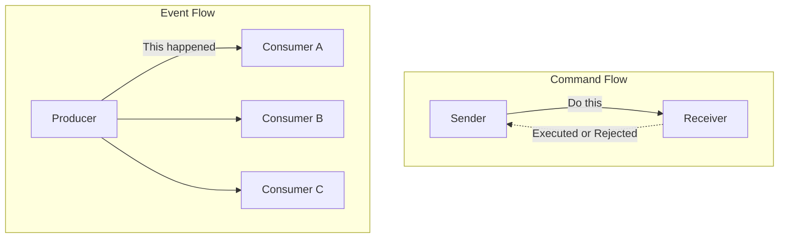

A disciplina de nomenclatura decorre diretamente disso. Eventos são nomeados no passado porque são fatos do passado. Uma fila chamada `order-processing` é um sinal de alerta; um stream chamado `orders.placed` é um fato. Se sua equipe está publicando algo nomeado no imperativo — `SendEmail` — você tem um comando se disfarçando de evento, e a mentira de design vai aflorar mais tarde como acoplamento que você não pretendia criar.

## Acoplamento Temporal, Espacial e de Fluxo

Acoplamento é a moeda da arquitetura e vem em mais denominações do que a maioria dos diagramas admite. Para avaliar EDA com honestidade, separe três eixos distintos.

**Acoplamento temporal** (temporal coupling) significa que ambas as partes precisam estar disponíveis ao mesmo tempo. Em uma chamada HTTP síncrona, se o receptor estiver fora do ar, o chamador falha agora. A comunicação orientada a eventos quebra esse eixo: o produtor emite e segue em frente; o consumidor processa quando estiver pronto, mesmo minutos depois. O broker absorve a lacuna.

**Acoplamento espacial** (spatial coupling), também chamado de acoplamento de localização ou referência, significa que o chamador precisa conhecer a identidade e o endereço do receptor. O Serviço A mantém uma URL ou um stub de cliente para o Serviço B. Mude a localização de B e A quebra. Publicar em um tópico quebra esse eixo: o produtor conhece o tópico, não os assinantes. Novos consumidores se conectam sem que o produtor jamais saiba seus nomes.

**Acoplamento de fluxo** (flow coupling) significa que um componente conhece a sequência de etapas que o outro deve executar, incorporando o fluxo de trabalho no chamador. Quando o order-service orquestra pagamento, depois estoque, depois envio em uma sequência fixa, ele é dono do fluxo de negócio. A coreografia de eventos pode inverter isso — cada serviço reage a fatos e emite os seus próprios —, embora, como capítulos posteriores mostram, mover o fluxo para fora do código não o elimina; apenas o reloca no comportamento emergente do sistema.

| Eixo de acoplamento | Request-response síncrono | Orientado a eventos |
|---------------|------------------------------|--------------|
| **Temporal** | Ambos ativos simultaneamente | Desacoplado via broker |
| **Espacial** | Chamador conhece o endereço do receptor | Produtor conhece apenas o tópico |
| **Fluxo** | Chamador é dono da sequência | Distribuído entre os reatores |

O insight crítico para uma audiência sênior: EDA não elimina o acoplamento. Ele troca acoplamento explícito em tempo de compilação por acoplamento implícito em tempo de execução. Você ganha independência em implantação e disponibilidade. Você paga com um fluxo de controle que nenhum arquivo descreve sozinho. Se essa troca vale a pena é a questão central deste livro.

<details>
<summary>💡 Nota do Especialista</summary>

O framework de acoplamento em três eixos (temporal, espacial, de fluxo) é preciso, mas omite um quarto eixo que emerge como dominante em sistemas EDA maduros: o **acoplamento semântico** (também chamado de acoplamento de dados ou conteúdo). Os consumidores dependem não apenas de se um produtor está acessível, mas da estrutura precisa e do significado do payload do evento. Um consumidor que faz pattern-matching em `order.status == "CONFIRMED"` está semanticamente acoplado a esse nome de campo, a essa enumeração e à regra de negócio que determina quando CONFIRMED é emitido. A EDA remove a necessidade de chamar o produtor, mas não remove a necessidade de concordar sobre o que o evento *significa*. Esse eixo é o que torna a governança de esquemas de eventos inegociável em ambientes multitimes — o contrato semântico implícito é mais difícil de descobrir e negociar do que uma definição de API REST, porque está distribuído por todas as bases de código dos consumidores.
</details>

<details>
<summary>⚠️ Nota Crítica</summary>

A tabela de acoplamento lista o acoplamento de fluxo em sistemas orientados a eventos como "Distribuído entre os reatores", e o texto descreve apenas a coreografia como a alternativa EDA à orquestração. Isso conflate um padrão (coreografia) com todo o paradigma. EDA baseada em orquestração — orquestradores de Saga, AWS Step Functions, Azure Durable Functions, Temporal — centraliza o controle de fluxo explicitamente enquanto ainda usa eventos assíncronos entre os passos. Um arquiteto sênior avaliando EDA para transações de negócio de longa duração vai recorrer à orquestração precisamente porque a coreografia distribuída dificulta o raciocínio sobre o fluxo geral. Apresentar o acoplamento de fluxo como sempre "distribuído" deturpa o espaço de design e poderia levar profissionais a adotar coreografia quando um orquestrador é a ferramenta mais adequada.
</details>

## Request-Response Versus Comunicação Assíncrona

O modelo **request-response** é o padrão porque mapeia como pensamos: faça uma pergunta, espere a resposta. É síncrono, bloqueante e lindamente fácil de depurar — o stack trace conta a história completa. Para uma leitura pela qual um usuário está ativamente esperando, geralmente é a ferramenta certa. Não deixe ninguém te envergonhar por usar uma chamada síncrona onde ela é adequada.

Sua fraqueza é a matemática de disponibilidade. Encadeie cinco serviços síncronos, cada um com 99,9% de uptime, e a disponibilidade composta é aproximadamente 99,9% elevado à quinta potência — cerca de 99,5%. Cada dependência que você adiciona a um caminho síncrono multiplica o risco e a latência. O sistema é apenas tão disponível quanto o produto de suas partes.

A **comunicação assíncrona** desacopla a requisição do resultado. O produtor entrega um fato a um broker e retorna imediatamente; os consumidores agem conforme seu próprio cronograma. Uma falha de consumidor não se propaga mais para upstream — as mensagens aguardam no log. A disponibilidade se torna resiliência aditiva em vez de fragilidade multiplicativa.

Este diagrama torna concreto o custo de disponibilidade das cadeias síncronas: um único serviço com falha cascateia timeouts de volta ao chamador, enquanto um fluxo assíncrono mediado por broker absorve a falha ao tamponar as mensagens, permitindo que o cliente receba um acknowledgment imediatamente e que os consumidores saudáveis continuem processando de forma independente.

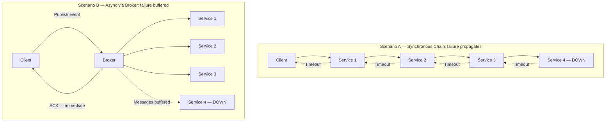

O custo é real e deve ser declarado com clareza. Você abre mão da resposta imediata e linear. Você herda consistência eventual, chegada fora de ordem, entrega duplicada e depuração entre limites de processo. O stack trace não conta mais a história completa. Os Capítulos 4, 7 e 9 são dedicados inteiramente a domar esses custos — o que por si só é um sinal de quanto eles importam.

> 💡 **Nota do Especialista:** O texto enquadra corretamente a comunicação assíncrona como a conversão de "fragilidade multiplicativa em resiliência aditiva", mas isso só se sustenta quando o próprio broker atinge alta disponibilidade genuína. Em muitas implantações em estágio inicial ou otimizadas por custo — um único cluster Kafka em uma zona de disponibilidade, um RabbitMQ gerenciado sem standby — as equipes simplesmente realocaram o ponto único de falha para o broker. A afirmação de resiliência só se torna verdadeira com replicação de broker multi-AZ (Kafka MirrorMaker 2, MSK Multi-AZ, Confluent Replication), alertas baseados em lag e retry do lado do consumidor com dead-letter queues. Arquitetos sênior devem auditar a HA do broker antes de aceitar a promessa de "resiliência tamponada" pelo valor de face; caso contrário, a primeira falha de broker produz um incidente mais grave do que qualquer cadeia síncrona jamais produziria.

<details>
<summary>⚠️ Nota Crítica</summary>

A aritmética de disponibilidade (99,9%^5 ≈ 99,5%) pressupõe implicitamente que as falhas de serviço são estatisticamente independentes. Na prática, serviços que compartilham um cluster de banco de dados, uma VPC, uma zona de disponibilidade de nuvem ou uma dependência comum (por exemplo, um secrets manager ou um service mesh control plane) têm modos de falha correlacionados. Quando as falhas são correlacionadas, a disponibilidade composta real pode ser significativamente pior do que o modelo de independência prevê, o que enfraquece o argumento do capítulo. Apresentar isso como uma fórmula multiplicativa limpa sem a ressalva de independência superestima a precisão da estimativa e pode induzir profissionais ao erro — tanto na super-confiança (em sistemas com falha correlacionada) quanto na sub-confiança (em sistemas com forte isolamento de blast radius).
</details>

<details>
<summary>⚠️ Nota Crítica</summary>

A afirmação "uma falha de consumidor não se propaga mais para upstream — as mensagens aguardam no log" é apresentada como uma propriedade incondicional da comunicação assíncrona mediada por broker. Isso só é verdade dentro da janela de retenção e da capacidade de armazenamento do broker. Se um consumidor ficar offline por mais tempo do que o período de retenção configurado (por exemplo, o `log.retention.hours` padrão do Kafka ou uma profundidade de fila SQS finita sob carga sustentada), as mensagens são descartadas ou sobrescritas. Para arquitetos sênior projetando sistemas de produção, essa distinção é operacionalmente crítica: a escolha da política de retenção, o monitoramento de consumer lag e a estratégia de dead-letter são todas decisões de design estruturais que o texto passa por cima.
</details>

## Os Quatro Estilos de Evento: Notificação e Transferência de Estado

A taxonomia de quatro estilos de eventos de Martin Fowler é a ferramenta mais precisa para alinhar uma equipe sobre o que "usar eventos" realmente significa. Dois estilos dominam a prática, e a escolha entre eles é uma decisão de design concreta com consequências concretas.

**Event Notification** (notificação de evento) carrega o fato básico e pouco mais: um ID, um tipo, um timestamp. `OrderPlaced { orderId: 4471 }`. O consumidor que precisar de mais deve retornar ao produtor para buscar detalhes. Isso mantém os eventos pequenos e os payloads estáveis, mas reintroduz acoplamento espacial e temporal pelo callback, e pode gerar uma tempestade de tráfego de leitura de volta à fonte.

**Event-Carried State Transfer** (transferência de estado via evento) coloca os dados relevantes dentro do evento: as linhas do pedido, o cliente, os totais. O consumidor não precisa de callback; mantém sua própria réplica do que lhe importa. Isso maximiza o desacoplamento e a disponibilidade — o consumidor funciona mesmo quando o produtor está fora do ar —, ao preço de payloads maiores, duplicação de dados entre serviços e a disciplina de manter réplicas coerentes.

Os dois estilos restantes, **Event Sourcing** (armazenamento de eventos) (estado como um log de eventos) e **CQRS** (segregação dos modelos de leitura e escrita), são os padrões arquiteturais profundos que este livro disseca nos Capítulos 5 e 6. Trate-os como avançados; não os use para resolver um problema de notificação.

| Estilo | Payload | Consumidor precisa de callback? | Principal trade-off |
|-------|---------|--------------------------|-------------------|
| **Notification** | Mínimo (ID + tipo) | Sim, para buscar detalhes | Eventos pequenos, mas acoplamento de callback |
| **State Transfer** | Estado relevante completo | Não | Autonomia, mas duplicação |
| **Event Sourcing** | Os eventos *são* o estado | N/A | Histórico completo, alta complexidade |
| **CQRS** | Modelos de leitura/escrita separados | N/A | Escalabilidade de leitura, modelos duplos |

Um padrão pragmático para microsserviços corporativos: comece com Event-Carried State Transfer para integração entre bounded contexts, para que os consumidores permaneçam autônomos, e reserve os padrões mais pesados para problemas que genuinamente os exigem.

> 💡 **Nota do Especialista:** O Event-Carried State Transfer maximiza a autonomia do consumidor, mas pressupõe silenciosamente estabilidade de esquema. Na prática, uma vez que eventos fat estão em produção, o esquema do evento se torna um contrato implícito de API distribuída que os produtores regularmente quebram — adicionando campos obrigatórios, renomeando propriedades, alterando tipos de dados. Sem um schema registry impondo um modo de compatibilidade (Confluent Schema Registry com compatibilidade BACKWARD ou FULL, AWS Glue Schema Registry ou Apicurio), um único deploy de produtor pode derrubar todos os consumidores downstream simultaneamente em tempo de execução sem nenhum aviso em tempo de compilação. A disciplina de evolução de esquemas — estratégias de versionamento, contratos de compatibilidade Avro/Protobuf/JSON Schema e janelas de migração com publicação dupla — merece igual destaque ao trade-off de payload "fat vs thin" introduzido aqui, pois é o modo de falha operacional número 1 que as equipes encontram após adotar o Event-Carried State Transfer.

> ⚠️ **Nota Crítica:** O texto recomenda Event-Carried State Transfer (ECST) como o "padrão pragmático para microsserviços corporativos" sem reconhecer que incorporar estado (especialmente PII) dentro de eventos cria séria exposição à LGPD/GDPR e à governança de dados. Uma vez que um evento contendo nome do cliente, e-mail ou dados de pagamento é replicado para N consumidores, atender a uma solicitação de direito ao esquecimento torna-se operacionalmente complexo ou tecnicamente impossível sem reconstruir as projeções dos consumidores. Para arquitetos sênior que operam em ambientes corporativos regulados — exatamente o público deste livro — seguir esse padrão sem qualificação pode produzir uma bomba-relógio de conformidade extremamente cara de desfazer posteriormente.

<details>
<summary>💡 Nota do Especialista</summary>

O padrão pragmático — "comece com Event-Carried State Transfer para integração entre contextos" — requer um qualificador crítico para sistemas corporativos que lidam com dados pessoais. Eventos fat que carregam PII de clientes (nome, e-mail, tokens de pagamento, dados comportamentais) e são replicados para N consumidores em N bancos de dados criam exposição significativa ao Artigo 17 do GDPR (direito ao esquecimento) e à residência de dados. Quando um cliente solicita exclusão, você deve identificar e expurgar cada réplica em cada data store de cada consumidor, o que se torna um pesadelo operacional à medida que a contagem de consumidores cresce. Padrões de produção para eventos fat conformes incluem: (1) emitir apenas identificadores pseudonimizados no evento com PII buscada via um data vault controlado, ou (2) criptografar payloads por cliente com uma chave armazenada em um serviço de gerenciamento de chaves — revogar a chave efetivamente apaga os dados em todas as réplicas. Equipes em setores regulados devem validar esse trade-off antes de adotar o Event-Carried State Transfer como padrão universal.
</details>

## Critérios de Decisão: Quando Adotar e Quando Evitar

Opiniões sem critérios são apenas preferências. Aqui está o checklist.

**Adote EDA quando** vários destes se aplicam:
1. Produtores e consumidores precisam escalar, implantar e falhar de forma independente.
2. Um fato naturalmente desencadeia muitas reações (fan-out para consumidores que você não consegue enumerar hoje).
3. O negócio tolera — ou ativamente deseja — consistência eventual.
4. Picos requerem tamponamento, para que um broker possa absorver picos de carga que o downstream não suporta.
5. Novas capacidades devem se conectar a fluxos existentes sem modificar o produtor.

**Evite EDA quando** qualquer um destes domina:
1. A interação é uma leitura síncrona pela qual um usuário está esperando agora.
2. Você precisa de uma resposta imediata e fortemente consistente (muitas autorizações financeiras exigem isso).
3. O sistema é um monólito pequeno ou alguns poucos serviços com um fluxo estável e bem compreendido.
4. Sua equipe não tem a maturidade operacional para rastreamento distribuído, governança de esquemas e idempotência — as disciplinas que o restante deste livro ensina.

Esta função codifica o checklist de adoção do capítulo em uma regra executável: ela permite que as equipes raciocinem sobre o estilo arquitetural de forma sistemática em vez de apenas intuitiva, e torna o portão de maturidade explícito — prevenindo a adoção prematura de EDA, o modo de falha que o capítulo chama de erro mais caro.

```python
# Decision function: maps system context flags to an architectural style recommendation
from dataclasses import dataclass


@dataclass(frozen=True)
class ArchitectureContext:
    """Captures the boolean flags that drive the EDA adoption decision."""
    needs_immediate_answer: bool          # user or system is blocked waiting for a synchronous result
    requires_strong_consistency: bool     # e.g. financial authorization — cannot tolerate stale reads
    independent_scaling: bool             # producers and consumers must scale and deploy independently
    fan_out: bool                         # one fact triggers reactions in multiple, possibly unknown, consumers
    tolerates_eventual_consistency: bool  # business domain accepts that replicas converge, not instantly
    operational_maturity: bool            # team can operate distributed tracing, schema governance, idempotency


def recommend_architecture(ctx: ArchitectureContext) -> str:
    """
    Returns one of three recommendations based on the context flags.

    Rules applied in priority order:
      1. Hard blockers for EDA → synchronous is safer
      2. Missing operational maturity → reconsider before committing
      3. Sufficient EDA signals present → prefer event-driven
      4. Default → synchronous (the simpler, more honest choice)
    """

    # Hard blockers: situations where synchronous request-response is clearly correct
    if ctx.needs_immediate_answer or ctx.requires_strong_consistency:
        return "prefer synchronous request-response"

    # Operational gate: EDA complexity is not free — check the team can absorb it
    eda_signals = sum([
        ctx.independent_scaling,
        ctx.fan_out,
        ctx.tolerates_eventual_consistency,
    ])

    if eda_signals >= 2 and not ctx.operational_maturity:
        return "reconsider — insufficient maturity for EDA"

    # Positive case: multiple EDA drivers present and team is ready
    if eda_signals >= 2 and ctx.operational_maturity:
        return "prefer event-driven"

    # Default: absent strong distribution pressures, synchronous is the honest choice
    return "prefer synchronous request-response"


# --- Example usage ---

if __name__ == "__main__":
    # Scenario A: checkout flow — user is waiting, payment requires strong consistency
    checkout = ArchitectureContext(
        needs_immediate_answer=True,
        requires_strong_consistency=True,
        independent_scaling=False,
        fan_out=False,
        tolerates_eventual_consistency=False,
        operational_maturity=True,
    )
    print(recommend_architecture(checkout))
    # Output: prefer synchronous request-response

    # Scenario B: order placed, triggers inventory + notifications + analytics
    order_placed = ArchitectureContext(
        needs_immediate_answer=False,
        requires_strong_consistency=False,
        independent_scaling=True,
        fan_out=True,
        tolerates_eventual_consistency=True,
        operational_maturity=True,
    )
    print(recommend_architecture(order_placed))
    # Output: prefer event-driven

    # Scenario C: team is new to distributed systems — maturity gate fires
    greenfield_low_maturity = ArchitectureContext(
        needs_immediate_answer=False,
        requires_strong_consistency=False,
        independent_scaling=True,
        fan_out=True,
        tolerates_eventual_consistency=True,
        operational_maturity=False,  # missing: tracing, schema governance, idempotency
    )
    print(recommend_architecture(greenfield_low_maturity))
    # Output: reconsider — insufficient maturity for EDA
```

O modo de falha mais temível é a adoção prematura. Envolver um aplicativo CRUD de dois serviços com Kafka não o torna resiliente; torna-o um sistema distribuído com toda a dor de depuração e nenhum dos benefícios. EDA é uma resposta a pressões genuínas de distribuição, escala e independência. Na ausência dessas pressões, um serviço síncrono bem estruturado é a escolha de engenharia mais honesta. Recorra a eventos quando o problema for assíncrono por natureza — não para parecer moderno.

<details>
<summary>💡 Nota do Especialista</summary>

O critério "evitar EDA" que referencia "maturidade operacional" é o portão correto, mas deixá-lo indefinido permite que as equipes se autocertifiquem incorretamente. Na prática, as operações mínimas viáveis de EDA exigem pelo menos: (1) rastreamento distribuído com IDs de correlação propagados por todos os produtores e consumidores — OpenTelemetry com um header W3C TraceContext injetado nos metadados do evento é o padrão atual da indústria; (2) dead-letter queues em todos os consumidores com alertas sobre a profundidade da DLQ, não apenas sobre o consumer lag; (3) um schema registry com modos de compatibilidade impostos conforme descrito acima; e (4) chaves de idempotência em todos os handlers de consumidores, documentadas e testadas, porque entrega duplicada não é um caso extremo — é garantida por brokers com semântica at-least-once. Uma equipe que não consegue demonstrar todas as quatro capacidades em um ambiente inferior deve adiar a adoção de EDA independentemente de quão fortes sejam as pressões de escala e fan-out.
</details>

## Principais Conclusões

- Um **evento** é um fato imutável do passado; um **command** é uma intenção de agir; uma **message** é apenas o envelope. Confundi-los corrompe o design.
- O acoplamento tem três eixos — **temporal**, **espacial** e **de fluxo**. EDA afrouxa os três, mas substitui acoplamento explícito por acoplamento implícito em tempo de execução, em vez de eliminá-lo.
- A disponibilidade síncrona é multiplicativa e frágil ao longo de uma cadeia; a comunicação assíncrona mediada por broker converte isso em resiliência tamponada — ao custo de consistência eventual e depuração mais difícil.
- **Event Notification** mantém os eventos pequenos, mas reintroduz acoplamento de callback; **Event-Carried State Transfer** maximiza a autonomia do consumidor por meio de duplicação de dados. Prefira o segundo como padrão para integração entre contextos.
- Adote EDA para escalabilidade independente, fan-out e tamponamento de carga; evite-a para leituras síncronas, necessidades de forte consistência e equipes sem maturidade operacional. A adoção prematura é o erro mais caro.

## O Que Vem a Seguir

Com o átomo definido, o Capítulo 2 se volta ao design de eventos que expressam fatos de negócio significativos — usando Domain-Driven Design e Event Storming para evitar a publicação de ruído técnico como se fosse um evento de domínio.

<!-- ASSEMBLY COMPLETE
  Chapter: Foundations of Event-Driven Architecture
  Code blocks resolved: 1 / 1
  Diagrams resolved: 2 / 2
  Expert callouts (inline): 2
  Expert callouts (collapsed): 3
  Critical callouts (inline): 1
  Critical callouts (collapsed): 3
  Unresolved markers: 0
-->


# Capítulo 2: Modelando Eventos como Fatos do Domínio

## Declaração do Problema Inicial

O Capítulo 1 definiu um evento como um fato imutável do passado e nos deu um vocabulário compartilhado: eixos de acoplamento, estilos de evento e Event-Carried State Transfer (transferência de estado transportada pelo evento) como padrão para integração entre contextos. Mas uma definição não diz *quais* fatos merecem se tornar eventos. É aqui que a maioria dos sistemas orientados a eventos apodrece silenciosamente. Uma equipe conecta um broker à sua stack e, em poucos meses, os tópicos estão inundados com `RowInserted`, `CacheInvalidated` e `UserEntityUpdated`. Nenhum desses termos significa algo para o negócio. São resíduos técnicos disfarçados de conhecimento de domínio, e todo consumidor que os assina herda o schema do banco de dados do produtor como um contrato de fato. O problema que este capítulo resolve é a disciplina na modelagem: como projetar eventos que carregam significado genuíno de negócio, que sobrevivem a refatorações e que permitem que equipes independentes se integrem sem interferir umas nas outras. O trabalho do arquiteto sênior aqui não é publicar mais eventos — é publicar os *certos*, com nomes que soam como frases que um especialista de domínio falaria. Errar nisso e nenhuma quantidade de tuning no Kafka salvará a arquitetura.

## Eventos de Domínio Versus Eventos de Integração

A distinção mais útil na modelagem de eventos é entre **eventos de domínio** (domain events) e **eventos de integração** (integration events). Eles parecem idênticos no wire — ambos são fatos imutáveis — mas servem a audiências diferentes e obedecem a regras distintas.

Um **evento de domínio** é um fato que importa *dentro* de um único contexto delimitado (bounded context). Ele é expresso na linguagem ubíqua (ubiquitous language) daquele contexto e muitas vezes é consumido pelo mesmo serviço que o produziu, ou por componentes intimamente relacionados dentro do limite da mesma equipe. `OrderPlaced`, `PaymentDeclined`, `SeatReserved` — esses descrevem algo que um stakeholder de negócio se importa. Eventos de domínio são ricos; podem referenciar agregados internos livremente porque todos que os leem compartilham o mesmo modelo.

Um **evento de integração** é um fato publicado *além* de um limite de contexto delimitado, destinado a outras equipes e outros serviços. É um contrato deliberado e público. Por cruzar um limite, não deve vazar estrutura interna. Um evento de integração é uma tradução — uma projeção enxuta e estabilizada de um ou mais eventos de domínio em uma forma da qual o mundo exterior pode depender.

A tabela abaixo torna o contraste concreto.

| Aspecto | Evento de Domínio | Evento de Integração |
|---------|-------------------|----------------------|
| Audiência | Dentro de um único contexto delimitado | Outros contextos e equipes |
| Linguagem | Linguagem ubíqua completa | Vocabulário público estável |
| Payload | Rico, referencia agregados | Mínimo, autocontido |
| Acoplamento | Interno, por design | Fraco, contratual |
| Vida útil | Muda com o modelo | Muda apenas via versionamento |
| Consequência do vazamento | Refatoração local | Quebra consumidores externos |

A regra decorre diretamente: **nunca publique um evento de domínio bruto além de um limite de contexto.** Traduza-o primeiro. No momento em que uma equipe externa assina seu `OrderAggregateUpdated` interno, seu banco de dados torna-se a API deles, e você perdeu a liberdade de refatorar. Essa etapa de tradução não é burocracia — é a costura que mantém as equipes independentes.

*Um evento de domínio produzido dentro de um contexto delimitado deve ser traduzido em um evento de integração antes de cruzar o limite do contexto; essa costura preserva a liberdade de cada equipe de refatorar seu modelo interno de forma independente.*

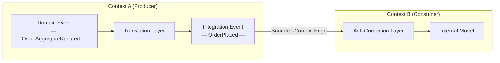

> 💡 **Nota do Especialista:** A etapa de tradução de evento de domínio para evento de integração não é apenas uma disciplina de modelagem — é um limite de confiabilidade que requer um mecanismo de entrega explícito. Em sistemas de produção, o modo de falha mais comum é: o evento de domínio é capturado em memória ou em um listener da camada de aplicação, a tradução é executada de forma síncrona, e a publicação no broker falha ou o processo falha entre o commit no banco de dados e a escrita no broker. A correção padrão da indústria é o **padrão Transactional Outbox**: escrever o evento de integração de saída em uma tabela `outbox` dentro da mesma transação ACID que muta o agregado, e depois repassar de forma assíncrona. Sem isso, o limite de tradução que protege seus consumidores do seu schema é em si uma fonte de bugs de consistência fantasma extremamente difíceis de reproduzir em ambientes de teste.

<details>
<summary>⚠️ Nota Crítica</summary>
A tabela rotula o acoplamento de evento de domínio como "Interno, por design." Isso é enganoso e arrisca confundir arquitetos sênior. Eventos de domínio dentro de um contexto delimitado são precisamente um mecanismo de *desacoplamento*: um agregado Order levanta `OrderPlaced` para que outros serviços de domínio (reserva de estoque, envio de e-mail) possam reagir sem que o agregado os chame diretamente. "Estreito" é impreciso; o enquadramento correto é "interno — o limite do contrato não se aplica." Descrever o acoplamento intra-contexto como "estreito por design" poderia levar os leitores a resistir a eventos de domínio dentro de seu próprio contexto, frustrando o propósito deles.

**Correção sugerida:** Substitua "Estreito, por design" na linha de Acoplamento por "Interno — sem limite de contrato; consumidores compartilham o mesmo modelo." Acrescente uma frase observando que eventos de domínio *habilitam* o acoplamento fraco dentro de um contexto entre agregados e serviços de domínio.
</details>

<details>
<summary>⚠️ Nota Crítica</summary>
O texto apresenta a etapa de tradução ("nunca publique um evento de domínio bruto além de um limite de contexto — traduza-o primeiro") como uma regra de design sem abordar o mecanismo de confiabilidade que torna essa regra segura de seguir. A tradução de evento de domínio para evento de integração normalmente é feita dentro da mesma transação ou via padrão outbox; se for feita por um processo ou handler separado, a própria tradução pode falhar silenciosamente, produzindo duplicatas ou eventos perdidos. Para arquitetos sênior, a regra "traduza primeiro" está incompleta sem reconhecer que o *como* da tradução confiável é não trivial e é a origem da maioria dos bugs de integração no mundo real. Adiar isso completamente para o Capítulo 3 deixa uma lacuna perigosa exatamente no momento em que o leitor está decidindo adotar o padrão.

**Correção sugerida:** Adicione um ou dois parágrafos de destaque reconhecendo que a tradução confiável requer uma garantia de atomicidade (por exemplo, outbox transacional ou event sourcing), e faça uma referência antecipada ao capítulo específico onde isso é tratado, para que os leitores saibam que a lacuna é intencional e não foi desconsiderada.
</details>

## Event Storming como Técnica de Descoberta

Você não consegue modelar eventos bem olhando fixamente para um schema de banco de dados. Os eventos devem ser *descobertos* a partir do negócio, e a técnica mais rápida para essa descoberta é o **Event Storming** — um workshop colaborativo inventado por Alberto Brandolini. Ele coloca especialistas de domínio e engenheiros diante do mesmo painel e faz uma pergunta: o que acontece neste negócio?

A mecânica é deliberadamente de baixa tecnologia. Os participantes escrevem fatos em post-its laranjas, formulados no passado, e os colocam em uma linha do tempo. `OrderPlaced` vai para cima, depois `PaymentAuthorized`, depois `OrderShipped`. Quando os post-its laranjas param de fluir, outras cores entram: azul para comandos que acionam eventos, amarelo para agregados, rosa para sistemas externos e roxo para políticas ("sempre que *isso* acontece, faça *aquilo*"). O painel torna-se um mapa do processo de negócio antes que uma única classe seja escrita.

Três sinais de uma sessão de Event Storming moldam diretamente sua arquitetura:

1. **Clusters de eventos** em torno do mesmo agregado revelam um contexto delimitado. Onde a linguagem muda — onde "order" começa a significar algo diferente — você encontrou um limite.
2. **Hotspots**, marcados com post-its vermelhos, expõem discordâncias ou desconhecidos. Essas são as partes arriscadas do domínio e merecem maior atenção de design.
3. **Eventos pivotais** — aqueles aos quais todos os stakeholders apontam — são seus verdadeiros eventos de integração, os fatos que outros contextos irão querer.

*Uma linha do tempo de Event Storming mapeia fatos de negócio no passado da esquerda para a direita, revelando comandos, agregados e políticas; o ponto onde a linguagem ubíqua muda marca um limite de contexto delimitado e sinaliza um candidato a evento de integração.*

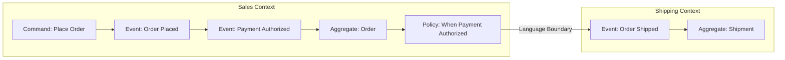

O ganho é que os eventos emergem da linguagem do negócio, não do formato de uma tabela. Quando um especialista de domínio acena para `PaymentDeclined` e balança a cabeça para `UserRecordUpdated`, ele está fazendo sua revisão de nomenclatura de graça. Execute o workshop antes de projetar schemas, não depois.

<details>
<summary>💡 Nota do Especialista</summary>
Alberto Brandolini define três níveis de Event Storming — **Big Picture**, **Process Modeling** e **Software Design** — mas a maioria das equipes executa apenas o primeiro e chama de suficiente. A sessão Big Picture produz o mapa de limites e os eventos pivotais descritos no texto. O Process Modeling (uma sessão separada e menor) é onde comandos, atores, read models e políticas são refinados por subprocesso: esse é o nível que produz o design de agregado e comando que alimenta diretamente o código. Parar no Big Picture deixa uma lacuna de tradução significativa entre o painel do workshop e o primeiro rascunho de schema, que os engenheiros tipicamente preenchem revertendo para eventos moldados pelo banco de dados — o exato anti-padrão contra o qual o Capítulo 2 alerta.
</details>

<details>
<summary>💡 Nota do Especialista</summary>
Na prática, os hotspots do Event Storming (post-its vermelhos) são tão frequentemente organizacionais quanto técnicos. Um hotspot persistente onde especialistas de domínio não conseguem concordar com um termo é frequentemente um sinal de tensão da **Lei de Conway**: duas equipes compartilham a propriedade de um conceito e desenvolveram modelos diferentes. Tratá-los como problemas puramente técnicos de modelagem leva a compromissos frágeis. A resposta mais eficaz é levantar a questão organizacional de propriedade explicitamente — qual equipe é dona da definição desse agregado? — e deixar essa decisão guiar o limite do contexto delimitado, em vez de buscar um meio-termo linguístico que nenhuma das equipes irá efetivamente manter.
</details>

<details>
<summary>⚠️ Nota Crítica</summary>
O Event Storming é apresentado como uma técnica diretamente acessível: "os participantes escrevem fatos em post-its laranjas" e o painel "torna-se um mapa do processo de negócio antes que uma única classe seja escrita." Isso obscurece os pré-requisitos organizacionais e de facilitação substanciais. Sem um facilitador experiente, as sessões costumam entrar em colapso devido a jargão técnico, explosão de escopo ou agendas políticas concorrentes entre departamentos. Os especialistas de domínio precisam estar dispostos e disponíveis — uma restrição que muitas vezes é a parte mais difícil em ambientes corporativos. Apresentar a técnica como de baixo esforço ("deliberadamente de baixa tecnologia") sem reconhecer a complexidade de facilitação pode fazer com que as equipes conduzam sessões mal estruturadas, produzam mapas de eventos enganosos e culpem a técnica em vez da execução.

**Correção sugerida:** Acrescente um parágrafo curto observando que o Event Storming eficaz requer um facilitador qualificado e neutro (idealmente experiente com DDD), especialistas de domínio preparados com autoridade para descrever o negócio (não apenas desenvolvedores descrevendo o que o sistema faz), e um compromisso de tempo de pelo menos um dia completo por processo principal. Recomende "Introducing EventStorming" de Brandolini como referência para detalhes de facilitação.
</details>

## Contextos Delimitados e Contratos de Evento Entre Equipes

Um **contexto delimitado** é o escopo dentro do qual um modelo e sua linguagem ubíqua são consistentes. "Customer" no contexto de Sales não é o mesmo "Customer" no contexto de Billing, mesmo que ambos se refiram à mesma pessoa. Os eventos são como esses contextos se comunicam sem fundir seus modelos — e isso torna cada evento publicado um **contrato**.

Tratar eventos como contratos muda a forma de gerenciá-los. Um contrato tem um dono (a equipe produtora), uma especificação (o schema) e consumidores que constroem com base nele. Uma vez que alguém depende do seu evento de integração, você não pode alterar silenciosamente sua forma. Por isso organizações maduras adotam **contratos orientados ao consumidor** (consumer-driven contracts): os consumidores publicam as expectativas que têm, e o pipeline do produtor verifica que as mudanças não as quebram. Retornamos à evolução de schema em profundidade no Capítulo 8, mas a decisão de modelagem começa aqui — um evento de integração bem modelado é aquele cujo significado é estável o suficiente para que mudanças exijam versionamento explícito e migração coordenada dos consumidores — não mutação silenciosa do schema.

O limite anticorrupção (Anti-Corruption Layer) é o mecanismo prático. Quando o Contexto B consome um evento do Contexto A, ele traduz o vocabulário de A para seu próprio modelo na borda, em vez de deixar os conceitos de A se espalharem internamente. Isso mantém os dois modelos livres para evoluir. O evento é o fio entre eles; as camadas de tradução em cada lado são o isolamento.

**Dica Pro:** Atribua a cada evento de integração uma única equipe proprietária e registre isso em um catálogo descobrível. Um evento sem dono é um evento que ninguém pode alterar com segurança — e que ninguém se atreve a deletar.

<details>
<summary>💡 Nota do Especialista</summary>
O texto corretamente introduz os contratos orientados ao consumidor como o mecanismo para evoluir com segurança os eventos de integração, mas a lacuna de ferramental vale ser nomeada para os profissionais prontos para implementá-lo. Para sistemas de eventos assíncronos, o **Pact** (pact.io) é o framework de teste de contrato orientado ao consumidor mais amplamente adotado e tem suporte de primeira classe para contratos de mensagem a partir da v4. A imposição de contratos via schema registry (Confluent Schema Registry com modos de compatibilidade, ou AWS Glue Schema Registry) trata da evolução estrutural, mas não da compatibilidade semântica — o Pact cobre o segundo. Uma camada complementar é o **AsyncAPI 3.0**, agora a especificação dominante para documentar contratos de eventos assíncronos, equivalente ao OpenAPI para REST; integra-se com schema registries e alimenta catálogos de descobribilidade como o Backstage.
</details>

> 💡 **Nota do Especialista:** O texto corretamente posiciona o limite anticorrupção na borda do contexto, mas as equipes frequentemente o implementam no lugar errado. Em um sistema de eventos assíncrono, o ACL vive **dentro do handler de eventos do serviço consumidor ou em um processo transformador dedicado** — não no broker, não em uma camada de middleware compartilhada. Tentativas de implementar um "ACL centralizado" no nível do broker (via topologia do Kafka Streams ou um intermediário no estilo ESB) reconstituem o hub de integração que a arquitetura orientada a eventos foi criada para eliminar, e criam um componente mutável compartilhado do qual toda equipe depende. Cada consumidor é dono de sua própria tradução; é isso que os mantém implantáveis de forma independente.

<details>
<summary>⚠️ Nota Crítica</summary>
O texto afirma que "um evento de integração bem modelado é aquele cujo significado é estável o suficiente para ser prometido indefinidamente." Esse é um padrão irrealista e potencialmente prejudicial para a maioria dos domínios de negócio. O significado de negócio muda: regulamentações se alteram, produtos são descontinuados, fusões redefinem "customer." O enquadramento correto é que eventos de integração devem ser *estáveis o suficiente para que mudanças exijam versionamento explícito em vez de ruptura silenciosa* — não estáveis indefinidamente. Prometer estabilidade indefinida poderia fazer com que as equipes super-engenheirassem os eventos na tentativa de antecipar todos os significados futuros, resultando em schemas sobrecarregados e excessivamente genéricos que são mais difíceis de evoluir do que schemas versionados bem delimitados.

**Correção sugerida:** Substitua "estável o suficiente para ser prometido indefinidamente" por "estável o suficiente para que mudanças exijam versionamento explícito e migração coordenada dos consumidores — não mutação silenciosa do schema." Observe brevemente que a evolução do domínio de negócio torna a estabilidade indefinida uma ficção; um bom design de evento minimiza a *frequência* de mudanças radicais, não sua possibilidade.
</details>

## Granularidade e Convenções de Nomenclatura de Eventos

A granularidade é onde as boas intenções produzem sistemas ruins. Muito granular, e um evento inflado força cada consumidor a analisar campos de que não precisa. Muito fino, e os consumidores precisam remontar um fato de negócio a partir de uma tempestade de fragmentos, reintroduzindo exatamente o acoplamento que os eventos deveriam eliminar.

A heurística orientadora: **modele eventos na granularidade de uma decisão de negócio, não de uma mutação de dados.** `OrderPlaced` é uma decisão. `OrderTotalColumnUpdated` é uma mutação. Se um fato só faz sentido para alguém que conhece sua definição de tabela, é muito fino e provavelmente não é um evento de domínio de forma alguma.

A nomenclatura carrega tanto peso quanto a granularidade. Siga estas regras sem exceção:

- **Sempre no passado.** Um evento registra algo que já aconteceu: `InvoiceIssued`, não `IssueInvoice` (isso é um comando) e não `InvoiceIssue`.
- **Linguagem de negócio, não linguagem técnica.** `PaymentCaptured` é melhor que `PaymentServiceApiCallSucceeded`.
- **Nomeie o fato, não o handler.** `SubscriptionCancelled`, não `SendCancellationEmail` — o segundo nomeia uma reação, acoplando o evento à intenção de um consumidor.
- **Inclua o agregado, seja específico.** `CartCheckedOut` informa o sujeito e o fato em duas palavras.

*Ambas as definições abaixo são dataclasses Python publicáveis. `OrderPlaced` captura uma decisão de negócio em vocabulário que um especialista de domínio reconhece; `OrderTableRowChanged` expõe detalhes brutos de persistência que acoplam cada consumidor ao schema do banco de dados do produtor.*

```python
# Contrasting event schemas: durable business contract vs. technical noise
# O(1) — schema definition; no algorithmic complexity

from __future__ import annotations

import uuid
from dataclasses import dataclass, field
from datetime import datetime
from decimal import Decimal
from enum import StrEnum


# ---------------------------------------------------------------------------
# GOOD: OrderPlaced — a durable integration event
#
# Why this works as a contract:
#   • Named in the past tense using ubiquitous language ("Placed")
#   • Carries only stable business facts; no internal aggregate IDs leak out
#   • A non-technical domain expert can read every field and understand it
#   • Consumers depend on *meaning*, not on the producer's table structure
#   • Adding a new field (non-breaking) or renaming an existing one (versioned)
#     is a deliberate, announced change — not a silent side-effect of a migration
# ---------------------------------------------------------------------------

class Currency(StrEnum):
    USD = "USD"
    EUR = "EUR"
    BRL = "BRL"


@dataclass(frozen=True)          # frozen=True enforces immutability
class OrderLineItem:
    product_id: str              # public product catalog ID (stable reference)
    product_name: str            # denormalized for self-containment
    quantity: int
    unit_price: Decimal
    currency: Currency


@dataclass(frozen=True)
class OrderPlaced:
    """
    Integration event: a customer has placed an order.

    This is the canonical fact other bounded contexts depend on.
    Billing uses it to initiate payment; Fulfillment uses it to reserve stock.
    Neither context needs to know which database table stored the order.
    """
    event_id: str = field(default_factory=lambda: str(uuid.uuid4()))
    occurred_at: datetime = field(default_factory=datetime.utcnow)

    # --- Business payload (stable, meaningful fields) ---
    order_id: str = ""           # public order reference, not a DB primary key
    customer_id: str = ""        # stable external customer identifier
    channel: str = ""            # "web", "mobile", "api" — business channel
    items: tuple[OrderLineItem, ...] = field(default_factory=tuple)
    total_amount: Decimal = Decimal("0.00")
    currency: Currency = Currency.USD
    shipping_address_country: str = ""   # country code (ISO 3166-1 alpha-2)


# ---------------------------------------------------------------------------
# BAD: OrderTableRowChanged — technical noise masquerading as a domain event
#
# Why this is an anti-pattern:
#   • The name describes a persistence mechanism ("TableRow"), not a business fact
#   • `changed_columns` leaks the producer's schema; consumers must understand
#     column names to extract any meaning — their code now mirrors the DB schema
#   • A non-technical domain expert cannot tell whether anything meaningful
#     happened: a retry, a migration, or a real business decision all look the same
#   • When the producer renames a column or splits a table, all consumers break
#     silently — this is the hidden cost of technical noise
# ---------------------------------------------------------------------------

@dataclass(frozen=True)
class ColumnDiff:
    column_name: str             # raw DB column name — a leaking implementation detail
    old_value: object
    new_value: object


@dataclass(frozen=True)
class OrderTableRowChanged:
    """
    Anti-pattern: publishes a raw persistence event as though it were a domain fact.

    Consumers cannot determine business intent from column diffs.
    Did the user cancel? Did a background job fix a typo? Was it a no-op write?
    This event answers none of those questions.
    """
    event_id: str = field(default_factory=lambda: str(uuid.uuid4()))
    occurred_at: datetime = field(default_factory=datetime.utcnow)

    # --- Technical payload (unstable, leaks internal schema) ---
    table_name: str = "orders"           # couples consumers to the DB table name
    row_pk: int = 0                      # exposes the surrogate database primary key
    changed_columns: tuple[ColumnDiff, ...] = field(default_factory=tuple)
    transaction_id: str = ""             # DB transaction detail — irrelevant to consumers
    orm_version: int = 0                 # ORM optimistic-lock version — internal noise


# ---------------------------------------------------------------------------
# Demonstration: the same business fact expressed in both styles
# ---------------------------------------------------------------------------

def demo() -> None:
    item = OrderLineItem(
        product_id="PROD-7821",
        product_name="Wireless Keyboard",
        quantity=2,
        unit_price=Decimal("49.99"),
        currency=Currency.USD,
    )

    # Meaningful: any consumer knows exactly what happened
    good_event = OrderPlaced(
        order_id="ORD-20240901-00042",
        customer_id="CUST-8814",
        channel="web",
        items=(item,),
        total_amount=Decimal("99.98"),
        currency=Currency.USD,
        shipping_address_country="US",
    )

    # Noisy: consumers must reverse-engineer business meaning from column diffs
    bad_event = OrderTableRowChanged(
        table_name="orders",
        row_pk=100042,
        changed_columns=(
            ColumnDiff("status_cd", "DRAFT", "CONFIRMED"),    # what does "CONFIRMED" mean?
            ColumnDiff("upd_ts", "2024-09-01T10:00:00", "2024-09-01T10:00:01"),
            ColumnDiff("orm_ver", 3, 4),                      # pure internal noise
        ),
    )

    print("Good event type :", type(good_event).__name__)     # OrderPlaced
    print("Good event items:", len(good_event.items))         # 2 items
    print()
    print("Bad event type  :", type(bad_event).__name__)      # OrderTableRowChanged
    print("Bad event cols  :", [c.column_name for c in bad_event.changed_columns])


if __name__ == "__main__":
    demo()
```

Um bom nome é uma revisão de design por si só. Se um especialista de domínio não consegue entender seu evento apenas pelo nome, o modelo está errado — renomeie-o antes de publicá-lo.

> 💡 **Nota do Especialista:** O texto alerta contra eventos muito detalhados (mutações), mas a falha oposta é igualmente perigosa em produção e recebe menos atenção: eventos muito granulares criam **pressão evolutiva em direção a payloads tudo-em-um**. À medida que novos consumidores chegam, cada um precisa de um campo que o evento existente não carrega. O caminho de menor resistência é continuar adicionando campos ao evento granular único. Em 18 meses, `OrderPlaced` carrega 60 campos, metade dos quais são nulos para qualquer consumidor específico, e o schema tornou-se um banco de dados compartilhado de fato entre equipes. A mitigação é modelar na granularidade da decisão de negócio, mas depois auditar deliberadamente quais campos cada consumidor declarado realmente usa — consumidores de zero campos são um sinal de que o limite do evento está errado.

<details>
<summary>⚠️ Nota Crítica</summary>
A discussão sobre granularidade está ausente do trade-off crítico entre eventos gordos e finos que todo arquiteto sênior deve decidir no momento do design. Eventos gordos (carregando o estado completo do agregado) tornam os consumidores autossuficientes, mas aumentam o tamanho do payload, podem vazar detalhes do modelo interno e dificultam o controle do que constitui uma mudança "significativa". Eventos finos (carregando apenas o ID ou um diff mínimo) mantêm os payloads pequenos, mas forçam os consumidores a fazer uma chamada de consulta síncrona para obter o estado necessário, reintroduzindo acoplamento temporal e uma dependência potencial de disponibilidade. Para uma audiência de engenheiros e arquitetos sênior, apresentar a granularidade apenas como "decisão de negócio versus mutação de dados" deixa de fora a decisão de design mais consequente no nível do schema.

**Correção sugerida:** Adicione uma subseção ou destaque cobrindo o espectro gordo/fino: eventos gordos favorecem a autonomia do consumidor ao custo do tamanho do payload e da exposição do modelo; eventos finos reduzem o payload e a exposição, mas podem forçar os consumidores a fazer consultas síncronas. Faça referência ao Event-Carried State Transfer (do Capítulo 1) como o padrão recomendado para integração entre contextos, e observe que eventos finos são preferíveis quando o tamanho do payload ou a sensibilidade do modelo é uma preocupação dentro de um contexto.
</details>

## Ruído Técnico como Anti-Padrão de Modelagem

A falha mais comum em sistemas orientados a eventos é o **ruído técnico**: publicar eventos de infraestrutura e persistência como se fossem fatos de domínio. `EntitySaved`, `KafkaOffsetCommitted`, `CacheEvicted`, `FieldXChanged`. Esses eventos descrevem como o software funciona, não o que o negócio fez.

O ruído técnico é corrosivo por três razões. Primeiro, ele acopla os consumidores à sua implementação — os assinantes agora dependem da cadência de salvamento do seu ORM ou da sua estratégia de cache. Segundo, ele destrói o sinal: eventos de negócio reais se afogam em uma enxurrada de ruído mecânico, e os consumidores não conseguem distinguir quais eventos importam. Terceiro, ele mente. Um evento `EntityUpdated` afirma que um fato de negócio ocorreu quando muitas vezes nada significativo aconteceu — uma tentativa, uma migração ou uma escrita sem efeito.

O teste é simples e implacável: **um especialista de domínio não técnico conseguiria dizer este evento em voz alta e dar sentido a ele?** "O pedido foi feito" passa. "A linha foi atualizada" falha. Se a resposta for não, você está olhando para ruído técnico, e ele não pertence a um tópico de domínio.

*Misturar ruído técnico em tópicos de domínio inunda os consumidores com sinais irrelevantes, tornando impossível distinguir fatos de negócio reais de artefatos de implementação; manter os tópicos de domínio limpos preserva o stream como um registro de negócio confiável.*

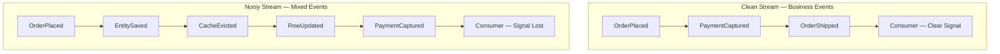

Isso não significa que eventos técnicos não têm valor. Sinais operacionais e de infraestrutura são legítimos — para monitoramento, métricas e depuração, assunto que o Capítulo 9 aborda. O pecado não é produzi-los; é publicá-los nos mesmos canais de domínio que outras equipes tratam como fonte da verdade de negócio. Mantenha os dois streams separados. Seus tópicos de domínio são um registro de negócio, e um registro com entradas falsas é pior do que nenhum registro.

> 💡 **Nota do Especialista:** A fonte mais comum de ruído técnico em produção que os profissionais encontram são **pipelines de Change Data Capture (CDC) publicando diretamente em tópicos de domínio**. Ferramentas como o Debezium capturam mudanças no nível de linha do log de transações do banco de dados e emitem eventos como `INSERT/UPDATE na tabela orders com deltas de coluna` — que é precisamente o anti-padrão `OrderTableRowChanged` descrito no texto. O modo de falha é que as equipes tratam o CDC como a camada de publicação de eventos, ignorando completamente a modelagem de domínio. A arquitetura correta é usar o CDC como um **relay de outbox** (lendo de uma tabela `outbox` ou `domain_events` escrita pela aplicação) em vez de capturar mutações brutas de tabela. Se você vir tópicos do Debezium nomeados após tabelas de banco de dados fluindo diretamente para consumidores, está olhando para ruído técnico em escala industrial.

## Principais Conclusões

- **Eventos de domínio** vivem dentro de um único contexto delimitado; **eventos de integração** são contratos públicos deliberados. Nunca publique um evento de domínio bruto além de um limite — traduza-o primeiro.
- O **Event Storming** descobre eventos a partir da linguagem do negócio, expondo contextos delimitados, hotspots e os fatos pivotais que se tornam eventos de integração.
- Todo evento publicado é um **contrato** com um dono, um schema e consumidores; os limites anticorrupção mantêm os modelos do produtor e do consumidor independentes.
- Modele eventos na granularidade de uma **decisão de negócio**, nomeie-os no **passado** usando linguagem ubíqua e nomeie o fato em vez do handler.
- O **ruído técnico** — eventos de persistência e infraestrutura disfarçados de fatos de domínio — acopla os consumidores à sua implementação e afoga o sinal real. Aplique o teste do especialista de domínio.

## O Que Vem a Seguir

Com eventos bem modelados em mãos, o Capítulo 3 examina como esses eventos realmente fluem — comparando topologias de broker e mediador, coreografia versus orquestração, e as tecnologias de mensageria que transportam seus fatos de domínio por todo o sistema.

<!-- ASSEMBLY COMPLETE
  Chapter: Modeling Events as Domain Facts
  Code blocks resolved: 1 / 1
  Diagrams resolved: 3 / 3
  Expert callouts (inline): 4
  Expert callouts (collapsed): 3
  Critical callouts (inline): 0
  Critical callouts (collapsed): 4
  Unresolved markers: 0
-->


# Capítulo 3: Topologias e Infraestrutura de Mensageria

## Declaração do Problema Inicial

O Capítulo 2 ensinou como modelar eventos como fatos de negócio genuínos e tratar cada evento publicado como um contrato de propriedade. Mas um evento bem modelado é inerte até que algo o mova do serviço que o produziu para os serviços que se importam com ele. Esse "algo" é a sua infraestrutura de mensageria (messaging infrastructure), e escolhê-la é uma das decisões de maior alavancagem e mais difíceis de reverter em um sistema orientado a eventos. Escolha a topologia errada e você passará os próximos dois anos brigando com seu próprio middleware: repetindo eventos que não podem ser repetidos, ordenando mensagens que nunca foram ordenadas e depurando um fluxo de controle que não existe em nenhum lugar da sua base de código. Arquitetos sênior não podem ser vagos aqui. A distinção entre um log distribuído e uma fila não é trivialidade acadêmica; ela determina se você pode reconstruir um modelo de leitura do zero, se um consumidor lento bloqueia um rápido, e se "adicionar outro consumidor" é uma mudança de configuração ou um redesign. Este capítulo mapeia as duas famílias de topologia, os dois modelos de coordenação e os três arquétipos tecnológicos que você encontrará de fato em produção. Ao final, você deve ser capaz de defender uma escolha, não apenas nomeá-la.

## Topologia de Broker Versus Topologia de Mediador

Todo sistema orientado a eventos se encaixa em um de dois padrões estruturais, e a diferença está em onde vive o fluxo de controle. Em uma **topologia de broker** (broker topology), não há coordenador central. Cada serviço publica eventos e subscreve os eventos de que precisa, reagindo de forma autônoma. O processo de negócio é uma propriedade emergente de muitas reações independentes. Ninguém possui o fluxo de ponta a ponta; ele existe apenas como a soma das decisões locais. Este é o padrão que confere à EDA (Arquitetura Dirigida por Eventos) seu famoso desacoplamento e seu igualmente famoso problema de rastreabilidade.

Em uma **topologia de mediador** (mediator topology), um componente central, o **mediador** ou **orquestrador**, possui o processo. Ele recebe um evento de disparo, depois emite comandos para serviços participantes em uma sequência deliberada, rastreando o estado do fluxo de trabalho à medida que avança. O mediador sabe qual etapa vem a seguir, o que fazer quando uma etapa falha e quando o processo está completo. O fluxo é explícito e reside em um único lugar que você pode ler.

O trade-off é exatamente o ponto central. A topologia de broker maximiza o desacoplamento e o throughput, mas dispersa o processo pelos serviços, tornando difícil responder "por que este pedido ficou travado?" A topologia de mediador centraliza a visibilidade e o tratamento de erros, mas reintroduz uma dependência de coordenação e um possível gargalo. Nenhuma das duas está correta em abstrato.

*Diagrama: Topologia de Broker versus Topologia de Mediador — contrastando o fluxo de controle emergente e descentralizado com a coordenação deliberada e centralizada.*

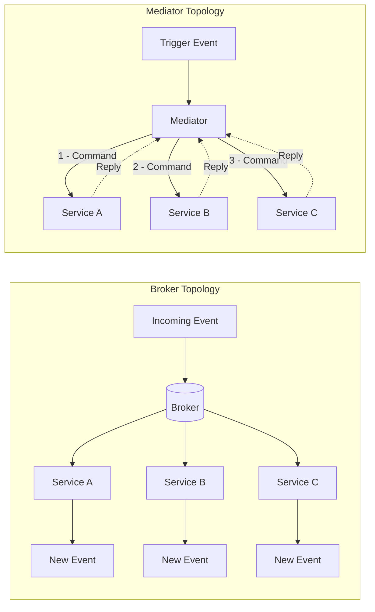

Uma heurística útil: use a topologia de broker para reações simples, majoritariamente independentes, onde o trabalho de cada assinante é autocontido. Recorra a um mediador quando o processo tiver etapas reais, restrições de ordenação e lógica de compensação que alguém precise possuir. Formalizaremos o mediador como um gerenciador de processo de saga no Capítulo 7; aqui é suficiente reconhecer a escolha estrutural.

<details>
<summary>💡 Nota do Especialista</summary>

O texto identifica corretamente o mediador como um possível gargalo, mas na prática o risco de produção mais perigoso é o raio de explosão (blast radius), não o throughput. Motores de workflow modernos (AWS Step Functions, Temporal, Conductor) escalam horizontalmente e raramente sofrem limitações de CPU ou throughput. O perigo real é que um bug na lógica de negócio do orquestrador — ou um deployment defeituoso que corrompe o estado do workflow — afeta simultaneamente todas as instâncias em execução de todos os tipos de workflow gerenciados por aquele orquestrador. As equipes mitigam isso com versionamento de workflow (a API de versionamento do Temporal, versões de state machine do Step Functions), deployment canário rigoroso de mudanças no orquestrador, e separação das definições de workflow por fronteira de domínio, de modo que um defeito nos workflows de Order não possa corromper workflows de Payment.
</details>

<details>
<summary>⚠️ Nota Crítica</summary>

O texto abre com "todo sistema orientado a eventos se encaixa em um de dois padrões estruturais" e constrói todo o framework de topologia sobre o binário broker/mediador. Na prática, grandes sistemas de produção rotineiramente combinam ambos: eventos de domínio fluem por um broker enquanto sagas entre domínios são orquestradas via mediador, frequentemente dentro do mesmo deployment. Apresentar a escolha como mutuamente exclusiva no nível do sistema leva arquitetos a uma decisão falsa de "ou um ou outro" no momento da arquitetura, quando a pergunta real é "qual topologia por fronteira de processo?" O enquadramento binário é pedagogicamente conveniente, mas ativamente enganoso para profissionais sênior que projetam sistemas com workflows heterogêneos.
</details>

## Coreografia Versus Orquestração

Broker e mediador são termos estruturais; **coreografia** (choreography) e **orquestração** (orchestration) são os modelos comportamentais de coordenação que se mapeiam sobre eles. Eles são frequentemente usados como sinônimos das topologias, e para fins práticos o mapeamento se sustenta: coreografia é como uma topologia de broker coordena, orquestração é como uma topologia de mediador coordena.

Na **coreografia**, cada serviço reage a eventos e emite novos eventos sem ser instruído por nenhuma autoridade central. Pense em dançarinos que conhecem seus próprios passos e deixas; a dança emerge de todos reagindo à música e uns aos outros. Não há maestro. Um evento `OrderPlaced` dispara o serviço de pagamento, cujo evento `PaymentCaptured` dispara o serviço de envio, e assim por diante. O fluxo é uma cadeia de reações.

Na **orquestração**, um maestro, o orquestrador, dirige explicitamente cada participante. Ele envia um comando "capturar pagamento", aguarda o resultado, depois envia um comando "reservar estoque". Os participantes não precisam saber nada uns sobre os outros; eles apenas sabem como obedecer comandos e reportar resultados.

A tensão é visibilidade versus autonomia. A coreografia mantém os serviços maximamente independentes, mas oculta o processo; para entender o fluxo completo você deve rastrear eventos por muitos serviços. A orquestração torna o processo legível e centraliza o tratamento de falhas, mas acopla os participantes ao orquestrador e cria um componente que deve escalar e permanecer disponível.

| Dimensão | Coreografia | Orquestração |
|---|---|---|
| Fluxo de controle | Distribuído, emergente | Centralizado, explícito |
| Acoplamento | Mínimo | Maior (ao orquestrador) |
| Visibilidade do processo | Baixa, deve ser rastreada | Excelente, reside em um único lugar |
| Tratamento de falhas | Cada serviço, localmente | O orquestrador possui |
| Melhor adequação | Poucos passos, reações autônomas | Muitos passos, ordenação, compensação |

A posição opinativa: adote coreografia por padrão para um número pequeno de etapas, e mude para orquestração no momento em que o processo ultrapassar cerca de quatro etapas ou exigir compensação. Equipes inexperientes tendem a sobre-orquestrar por desejo de controle; equipes excessivamente desacopladas coreografam fluxos tão complexos que ninguém consegue explicá-los. Ambos são modos de falha.

<details>
<summary>💡 Nota do Especialista</summary>

O texto enquadra a escolha como aplicável ao sistema como um todo, mas as arquiteturas de produção mais resilientes aplicam ambos os modelos simultaneamente em diferentes níveis de granularidade. O padrão canônico: use orquestração dentro de um contexto delimitado (bounded context) — um gerenciador de processo de saga possui workflows de múltiplas etapas dentro do domínio de Payment — e use coreografia entre contextos delimitados (Payment publica `PaymentCaptured`; Fulfillment assina sem saber que Payment existe). Isso se alinha com o princípio de contexto delimitado autônomo do DDD e evita que o orquestrador acumule conhecimento entre domínios que colapse a fronteira. Equipes que perdem esse ponto frequentemente constroem um "orquestrador deus" que acaba conhecendo cada serviço, recriando o acoplamento que tentavam eliminar.
</details>

<details>
<summary>⚠️ Nota Crítica</summary>

O texto oferece "mude para orquestração no momento em que o processo ultrapassar cerca de quatro etapas" como um limiar opinativo mas acionável. Esse número não tem base empírica e é altamente dependente do contexto. Fluxos de duas etapas com sistemas de pagamento externos e requisitos de compensação regulatória frequentemente exigem um mediador; pipelines de dados internos de oito etapas com serviços totalmente autônomos e observabilidade madura podem operar com segurança como coreografia. As variáveis relevantes não são a contagem de etapas, mas: se compensação é necessária (sagas), se o processo tem um proprietário de negócio que precisa de uma trilha de auditoria, que ferramentas de observabilidade estão disponíveis e se os serviços são deployáveis de forma autônoma. Apresentar uma contagem de etapas como o limiar de decisão fará com que equipes classifiquem erroneamente seus workflows.
</details>

## Log Distribuído Versus Fila

Agora à própria infraestrutura. A distinção técnica mais consequente em mensageria é entre uma **fila** (queue) e um **log distribuído** (distributed log), porque ela determina o que você pode e não pode fazer com eventos após serem consumidos.

Uma **fila de mensagens** tradicional, como RabbitMQ ou Amazon SQS, trata uma mensagem como um item de trabalho a ser consumido e destruído. Um produtor coloca uma mensagem na fila; um consumidor a retira; uma vez confirmada, a mensagem desaparece. Filas se destacam na distribuição de trabalho: muitos consumidores concorrentes puxam da mesma fila, e cada mensagem é tratada por exatamente um deles. Este é o padrão de **consumidores concorrentes** (competing consumers), ideal para distribuição de tarefas onde mensagens são comandos transitórios para realizar trabalho.

Um **log distribuído**, exemplificado pelo Apache Kafka, trata eventos como uma sequência durável e somente de acréscimo (append-only). Consumir um evento não o exclui. Cada consumidor rastreia sua própria posição, o **offset** (deslocamento), no log e lê adiante no seu próprio ritmo. O log retém eventos por um período configurado independentemente de quem os leu. Isso muda tudo a seguir: um novo consumidor pode se juntar e ler todo o histórico desde o início, e um consumidor existente pode retroceder e reprocessar.

*Diagrama: Fila versus Log Distribuído — mensagens são destruídas ao consumo em uma fila; grupos de consumidores independentes mantêm seus próprios offsets em um log durável.*

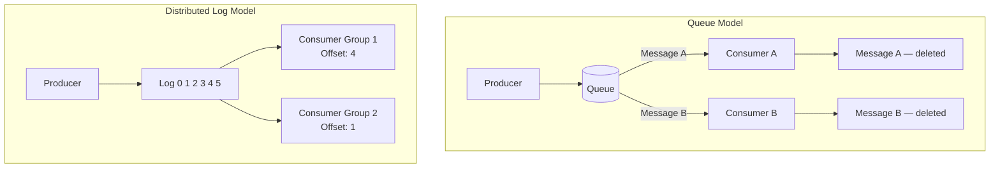

A distinção não é "qual é melhor", mas "qual modelo atende à sua necessidade". Se a mensagem é um comando transitório consumido uma única vez, uma fila é mais simples e barata. Se o evento é um fato durável de que múltiplos consumidores independentes precisam — agora e no futuro — e que você pode precisar repetir, o log é a ferramenta certa. Note como isso ecoa o Capítulo 2: fatos duráveis querem um log; itens de trabalho transitórios querem uma fila.

<details>
<summary>💡 Nota do Especialista</summary>

O enquadramento binário de log versus fila, embora pedagogicamente útil, subestima o quanto essa fronteira se deslocou. O RabbitMQ 3.9 (2021) introduziu Streams, uma abstração de log durável, somente de acréscimo e repetível incorporada ao broker, com semânticas de rastreamento de offset de consumidor quase idênticas às do Kafka. Equipes que avaliam RabbitMQ para novas cargas de trabalho de EDA devem avaliar Streams antes de descartá-lo como uma ferramenta exclusiva de fila. Os diferenciadores relevantes entre Kafka e RabbitMQ Streams neste ponto são a maturidade do ecossistema, os controles de paralelismo mais ricos do Kafka em nível de partição e o panorama de serviços gerenciados (MSK, Confluent Cloud), não a capacidade fundamental de replay.
</details>

## Publish/Subscribe, Partições e Grupos de Consumidores

Três mecanismos fazem o modelo de log funcionar em escala, e engenheiros sênior devem entender todos os três com precisão.

**Publish/subscribe** (pub/sub) significa que um produtor publica em um **tópico** (topic) e qualquer número de assinantes recebe uma cópia. Isso é fan-out: um evento, muitos leitores independentes. Contrasta com o enfileiramento ponto a ponto, onde uma mensagem vai para um único consumidor. Em termos de nuvem, o Amazon SNS é um serviço de fan-out pub/sub e o SQS é uma fila; o padrão comum SNS-to-SQS combina deliberadamente ambos, usando SNS para distribuir um evento para várias filas SQS, de modo que cada serviço downstream receba sua própria cópia privada para consumir no seu próprio ritmo.

**Partições** (partitions) são como um log escala horizontalmente e preserva a ordem. Um tópico é dividido em partições, e cada evento é roteado para uma partição por uma **chave de partição** (partition key), tipicamente um ID de entidade como `orderId`. O Kafka garante ordenação apenas dentro de uma partição, nunca entre partições. Esta é a regra que pega equipes de surpresa: se a ordem global importa, você está limitado a uma partição e, portanto, sem paralelismo — então você deliberadamente escolhe uma chave que mantém eventos causalmente relacionados juntos, enquanto permite que entidades não relacionadas se distribuam entre partições para throughput.

*Exemplo de código: Produtor Kafka chaveando eventos por `orderId` para impor afinidade de partição por pedido — todos os eventos para o mesmo pedido chegam na mesma partição; eventos para pedidos diferentes se distribuem entre partições para throughput.*

```python
# Kafka producer keying events by orderId to enforce per-order partition affinity
# Requires: pip install confluent-kafka
from __future__ import annotations

import json
from dataclasses import dataclass, field
from typing import Any

from confluent_kafka import Producer
from confluent_kafka.error import KafkaError

BROKER = "localhost:9092"
TOPIC = "order-events"


@dataclass
class OrderEvent:
    order_id: str
    event_type: str       # e.g. "OrderPlaced", "OrderShipped"
    payload: dict[str, Any] = field(default_factory=dict)

    def to_json(self) -> bytes:
        return json.dumps(
            {"type": self.event_type, "orderId": self.order_id, "payload": self.payload}
        ).encode("utf-8")


def _delivery_report(err: KafkaError | None, msg: Any) -> None:
    """Callback invoked once the broker acknowledges (or rejects) each message."""
    if err:
        print(f"[FAILED] {err}")
    else:
        # partition() and offset() confirm exactly where the event was stored
        print(f"[OK] type={json.loads(msg.value())['type']} "
              f"partition={msg.partition()} offset={msg.offset()}")


def publish_order_event(producer: Producer, event: OrderEvent) -> None:
    """Publish one order event.

    The `key` argument is the partition key.  Kafka's default partitioner applies
    a consistent hash over the key bytes, so the same orderId always maps to the
    same partition — guaranteeing that OrderPlaced arrives before OrderShipped
    for every individual order, regardless of broker load or producer restarts.
    """
    producer.produce(
        topic=TOPIC,
        key=event.order_id,           # partition key — same orderId → same partition
        value=event.to_json(),
        callback=_delivery_report,
    )
    producer.poll(0)  # flush delivery callbacks without blocking the caller


def main() -> None:
    producer = Producer({"bootstrap.servers": BROKER})

    # Two events for order-42 → same partition; OrderPlaced is always before OrderShipped
    publish_order_event(producer, OrderEvent("order-42", "OrderPlaced",  {"customerId": "cust-7", "total": 149.99}))
    publish_order_event(producer, OrderEvent("order-42", "OrderShipped", {"trackingId": "TRK-001"}))

    # A concurrent event for order-99 → likely a different partition; no ordering constraint
    # relative to order-42, but full parallelism across partitions is preserved
    publish_order_event(producer, OrderEvent("order-99", "OrderPlaced", {"customerId": "cust-3", "total": 59.00}))

    producer.flush()  # block until all in-flight messages are acknowledged or fail


if __name__ == "__main__":
    main()
```

**Grupos de consumidores** (consumer groups) coordenam o consumo paralelo sem duplicação. Consumidores que compartilham um ID de grupo dividem as partições entre si; cada partição é lida por exatamente um consumidor do grupo, fornecendo paralelismo de consumidores concorrentes dentro do modelo de log. Enquanto isso, um grupo diferente lendo o mesmo tópico recebe sua própria cópia completa do stream. Esta é a unificação elegante: dentro de um grupo você obtém distribuição de trabalho como em uma fila; entre grupos você obtém fan-out como em pub/sub — tudo a partir do mesmo log durável.

> 💡 **Nota do Especialista:** O texto afirma corretamente que a ordenação é garantida apenas dentro de uma partição e que a chave de partição deve manter eventos causalmente relacionados juntos. O que não é dito — e o que rotineiramente causa incidentes de produção — é o problema de partição quente (hot-partition): se um pequeno número de chaves (um ID de comerciante de alto volume, um produto viral) responde por uma grande parcela dos eventos, essas partições recebem pressão de escrita desproporcional e o lag se acumula nos consumidores atribuídos a elas, enquanto outras partições ficam ociosas. A correção ingênua de mudar para uma chave composta (por exemplo, `merchantId + orderId`) restaura a distribuição, mas quebra a garantia de ordem causal entre pedidos daquele comerciante. As equipes devem analisar a cardinalidade das chaves antes de entrar em produção. Quando situações reais de hot-key são inevitáveis, uma mitigação comum é o salting de chave com um sufixo aleatório delimitado (por exemplo, `orderId-0` até `orderId-N`) combinado com uma etapa de merge, aceitando que a ordenação é coordenada no consumidor em vez de garantida pelo broker.

> 💡 **Nota do Especialista:** O texto explica grupos de consumidores com clareza, mas não sinaliza o risco de rebalanceamento. No protocolo de rebalanceamento ansioso (eager rebalancing) original do Kafka, toda vez que um consumidor entra, sai ou falha, o grupo inteiro para de processar e reatribui todas as partições — uma pausa de parada total que pode variar de segundos a dezenas de segundos dependendo dos timeouts de sessão e da contagem de partições. Sob entrega `at-least-once`, essa janela também produz duplicatas, porque registros em andamento são reentregues aos consumidores recém-atribuídos. O Kafka 2.4 introduziu o Incremental Cooperative Rebalancing (a estratégia de atribuição `CooperativeStickyAssignor`), que transfere apenas as partições que precisam ser movidas, deixando o restante sendo consumido ativamente. Este não é o padrão em muitas versões de cliente, então deployments de produção devem configurar explicitamente `partition.assignment.strategy=CooperativeStickyAssignor` e ajustar `session.timeout.ms` e `heartbeat.interval.ms` deliberadamente. Ignorar isso é uma fonte comum de misteriosas quedas de lag durante deployments de rotina.

## Retenção, Replay e Reprocessamento

O superpoder definidor do log é que os eventos persistem após o consumo, e é aqui que o log justifica seu custo. **Retenção** (retention) é a política que governa por quanto tempo os eventos são mantidos — por tempo (por exemplo, sete dias) ou por tamanho, ou indefinidamente via **compactação de log** (log compaction), que mantém o evento mais recente por chave para sempre. A retenção é uma decisão arquitetural de primeira classe, não um padrão a ser aceito cegamente, porque ela define o limite do histórico que você pode acessar.

**Replay** é a leitura de eventos históricos novamente, reiniciando o offset de um consumidor para trás. **Reprocessamento** é a aplicação do replay: você deploya uma nova versão de uma projeção, redefine seu grupo de consumidores para o offset zero e reconstrói todo o seu estado a partir do histórico. Essa capacidade é o que torna Event Sourcing e CQRS práticos, e ambos dependem dela nos capítulos seguintes. Com uma fila, nada disso existe; uma vez que uma mensagem é confirmada, ela desaparece, então um bug que corrompe um modelo de leitura é irrecuperável a partir da camada de mensageria.

Essa única capacidade é o argumento mais forte para um log em vez de uma fila em sistemas orientados a fatos, e a razão pela qual o Kafka ancora tantas plataformas orientadas a eventos. Mas não é gratuita. A retenção tem custo de armazenamento, o replay pode inundar sistemas downstream se não for limitado, e o reprocessamento exige que os consumidores sejam idempotentes, porque eventos repetidos serão vistos novamente. Esse requisito de idempotência não é opcional, e é exatamente o assunto do Capítulo 4.

Com os mecanismos estabelecidos, a escolha de tecnologia se torna um exercício de mapeamento em vez de um concurso de popularidade.

*Diagrama: Fluxograma de decisão de seleção de tecnologia — das semânticas da mensagem ao arquétipo de infraestrutura apropriado.*

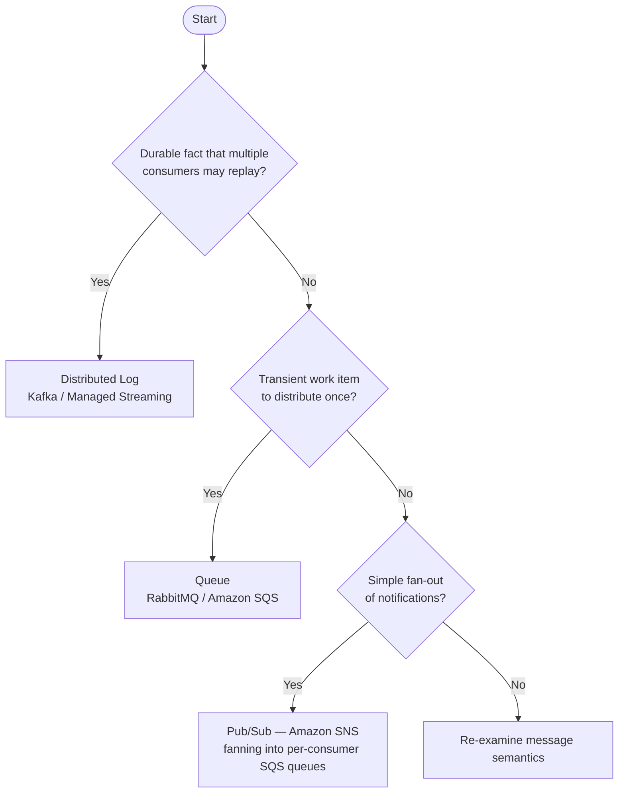

> 💡 **Nota do Especialista:** O replay é a capacidade mais poderosa do log, mas introduz um modo de falha que o texto não cobre: evolução de schema. Eventos escritos meses ou anos atrás carregam versões mais antigas de schema. Quando um consumidor é redefinido para o offset zero e processa esse histórico, seu deserializador atual deve ser compatível com versões anteriores de cada versão de schema que encontrar — não apenas com a versão atual. Sem um registro de schema (Confluent Schema Registry ou AWS Glue Schema Registry) impondo uma política de compatibilidade (tipicamente BACKWARD ou FULL), um job de reprocessamento falhará no meio do histórico na primeira mudança de schema incompatível — geralmente descoberta em uma janela de recuperação de incidente sob alta pressão. A regra prática: trate o registro no schema registry e a imposição de compatibilidade como um pré-requisito para habilitar replay em produção, não como um complemento posterior.

<details>
<summary>💡 Nota do Especialista</summary>

O texto define com precisão a compactação de log como manter o evento mais recente por chave para sempre, o que está correto. A nuance que vale acrescentar é que tópicos com log compactado são incompatíveis com Event Sourcing completo. Event Sourcing requer cada evento de uma entidade, não apenas o valor mais recente; a compactação descarta eventos intermediários, o que significa que você pode derivar o estado atual, mas não pode reconstruir a trilha de auditoria nem consultas de viagem no tempo. A compactação de log é apropriada para tópicos de changelog (CDC, materialização de KTable) e não para agregados event-sourced, onde retenção infinita ou arquivamento externo de event store (DynamoDB, EventStoreDB) é a estratégia correta. Equipes que habilitam compactação em um tópico event-sourced descobrem a perda de dados somente quando tentam um replay completo.
</details>

> ⚠️ **Nota Crítica:** O texto afirma que a compactação de log "mantém o evento mais recente por chave para sempre" e a apresenta como uma opção de retenção ao lado de políticas baseadas em tempo ou tamanho — mas isso confunde dois objetivos incompatíveis. A compactação de log é uma estratégia de compactação que ativamente deleta todos os eventos intermediários de uma determinada chave, retendo apenas o valor mais recente. Uma equipe que habilita compactação em um tópico e depois tenta um replay completo para reconstruir uma projeção receberá silenciosamente um histórico truncado: cada transição de estado intermediária para cada entidade está perdida. A frase "mantém o evento mais recente por chave para sempre" é tecnicamente precisa para o registro sobrevivente, mas implica durabilidade do histórico em vez de sua destruição. Para um capítulo cujo argumento central para escolher um log em vez de uma fila repousa sobre replay e reprocessamento, recomendar compactação sem um aviso explícito sobre o que ela apaga mina diretamente a tese central do capítulo. **Correção sugerida:** Adicione um destaque explícito de que a compactação de log é incompatível com replay de histórico de eventos. Reserve-a para casos de uso de changelog (manutenção do estado atual por chave, como em visões materializadas do Kafka Streams ou KTables), e sinalize que sistemas event-sourced devem usar retenção baseada em tempo ou tamanho com janelas infinitas ou muito longas — nunca compactação em tópicos que carregam fatos.

<details>
<summary>⚠️ Nota Crítica</summary>

O texto afirma corretamente que o reprocessamento "exige que os consumidores sejam idempotentes, porque eventos repetidos serão vistos novamente" — mas a idempotência nas próprias gravações de dados do consumidor é apenas uma camada do problema. Qualquer consumidor que desencadeia efeitos colaterais externos durante o processamento (enviar um e-mail, chamar um gateway de pagamento, invocar um webhook, publicar uma notificação para um sistema externo) reexecutará esses efeitos colaterais no replay, a menos que sejam deduplicados independentemente na fronteira externa. Esse modo de falha é extremamente comum e causa incidentes reais de produção: repetir seis meses de eventos `OrderPlaced` reenvia e-mails de confirmação a clientes e recarrega métodos de pagamento. O texto adia todos os detalhes de idempotência para o Capítulo 4, mas engenheiros sênior lendo este capítulo precisam de pelo menos uma frase de aviso de que efeitos colaterais externos são um problema separado e mais difícil do que gravações de armazenamento idempotentes.
</details>

<details>
<summary>⚠️ Nota Crítica</summary>

O capítulo argumenta fortemente em favor do replay e reprocessamento como a vantagem decisiva do log, mas nunca aborda a evolução de schema — provavelmente o maior risco operacional em logs de longa duração. Se um tópico retém eventos por dois anos, consumidores que realizam replay completo encontrarão eventos serializados sob schemas que antecedem múltiplas mudanças incompatíveis. Avro, Protobuf e JSON Schema todos possuem regras de compatibilidade, mas impô-las, manter um schema registry e escrever deserializadores de consumidor que lidam com formas antigas e novas é não trivial. Uma equipe que deploya um novo consumidor, redefine para o offset zero e encontra um evento de três anos atrás em um schema Avro obsoleto obterá uma exceção de desserialização e um grupo de consumidores paralisado. Para uma audiência de arquitetos sênior, tratar o replay como simples enquanto omite a evolução de schema é uma lacuna significativa.
</details>

## Principais Conclusões

- **Topologia é uma decisão de fluxo de controle.** A topologia de broker desacopla, mas dispersa o processo; a topologia de mediador centraliza a visibilidade ao custo de uma dependência de coordenação. Coreografia e orquestração são os modelos comportamentais que se mapeiam sobre elas.
- **Fila e log são ferramentas fundamentalmente diferentes.** Uma fila destrói mensagens ao consumo e distribui trabalho; um log distribuído retém eventos e permite que consumidores independentes leiam, retrocedam e repitam.
- **Partições preservam a ordem apenas dentro de uma partição.** Escolha uma chave de partição que mantenha eventos causalmente relacionados juntos; ordenação global custa paralelismo.
- **Grupos de consumidores unificam as semânticas de fila e pub/sub.** Dentro de um grupo você obtém paralelismo de consumidores concorrentes; entre grupos você obtém fan-out — tudo a partir de um único log.
- **Retenção e replay são a vantagem decisiva do log** e o alicerce do Event Sourcing e do CQRS, mas exigem consumidores idempotentes e uma política de retenção deliberada.

## O Que Vem a Seguir

O replay garante que os consumidores verão o mesmo evento mais de uma vez, então o Capítulo 4 enfrenta diretamente as garantias de entrega e mostra como construir consumidores idempotentes sob entrega at-least-once.

<!-- ASSEMBLY COMPLETE
  Chapter: Topologies and Messaging Infrastructure
  Code blocks resolved: 1 / 1
  Diagrams resolved: 3 / 3
  Expert callouts (inline): 3
  Expert callouts (collapsed): 4
  Critical callouts (inline): 1
  Critical callouts (collapsed): 4
  Unresolved markers: 0
-->


# Capítulo 4: Garantias de Entrega e Idempotência

## Problema Inicial

O Capítulo 3 terminou com uma promessa e um aviso. O log distribuído permite que você reproduza o histórico — reprocesse milhões de eventos passados para reconstruir um modelo de leitura ou corrigir um bug. Mas a reprodução só funciona se reprocessar o mesmo evento duas vezes produzir o mesmo resultado que processá-lo uma única vez. Essa propriedade é chamada de **idempotência** (idempotency), e sem ela a reprodução corrompe os dados em vez de repará-los.

Isso não é um caso extremo. Sob a garantia de entrega mais comum em sistemas de produção, **todo consumidor eventualmente receberá uma mensagem duplicada**. Um timeout de rede, uma nova tentativa do broker, uma falha do consumidor após processar, mas antes de confirmar o recebimento — qualquer um desses eventos produz uma mensagem que o consumidor já recebeu. Se o seu handler cobra um cartão de crédito, envia um e-mail ou decrementa o estoque, uma duplicata representa uma perda financeira ou de reputação real.

Engenheiros seniores frequentemente recorrem a uma saída de emergência reconfortante: "entrega exatamente uma vez" (exactly-once delivery). Eles presumem que um recurso do broker ou uma opção de configuração de um serviço cloud faz o problema desaparecer. Não faz. Este capítulo desmistifica as três semânticas de entrega, explica precisamente por que "exactly-once" é o termo mais mal compreendido em sistemas distribuídos e apresenta os padrões concretos — chaves de deduplicação, o Transactional Outbox, filas de mensagens mortas — que tornam a correção alcançável. O objetivo é que as duplicatas deixem de ser uma ameaça e se tornem um não-evento.

## Semânticas At-Most-Once, At-Least-Once e Exactly-Once

Uma **garantia de entrega** (delivery guarantee) descreve o que o sistema de mensageria promete sobre quantas vezes um consumidor observa cada mensagem. Existem três níveis, e a diferença entre eles se resume a *quando* o consumidor confirma o recebimento.

Um **acknowledgment** (ack) é o sinal que um consumidor envia de volta ao broker para dizer "terminei com essa mensagem; você pode parar de rastreá-la." A ordem de *processar* e *confirmar* determina a garantia.

- **At-most-once** (no máximo uma vez): confirma primeiro, depois processa. Se o consumidor falhar após confirmar, mas antes de terminar, a mensagem é perdida. Zero ou uma entrega. Rápido, com perda, aceitável apenas para dados descartáveis como amostras de métricas ou telemetria não crítica.
- **At-least-once** (pelo menos uma vez): processa primeiro, depois confirma. Se o consumidor falhar após processar, mas antes de confirmar, o broker reenvia. Uma ou mais entregas. Nunca perde uma mensagem, mas garante duplicatas. Este é o padrão no Kafka, SQS e RabbitMQ.
- **Exactly-once** (exatamente uma vez): o santo graal — uma entrega, sem perda, sem duplicação.

**Figura 4.1 — At-Most-Once vs At-Least-Once: cenários de falha**

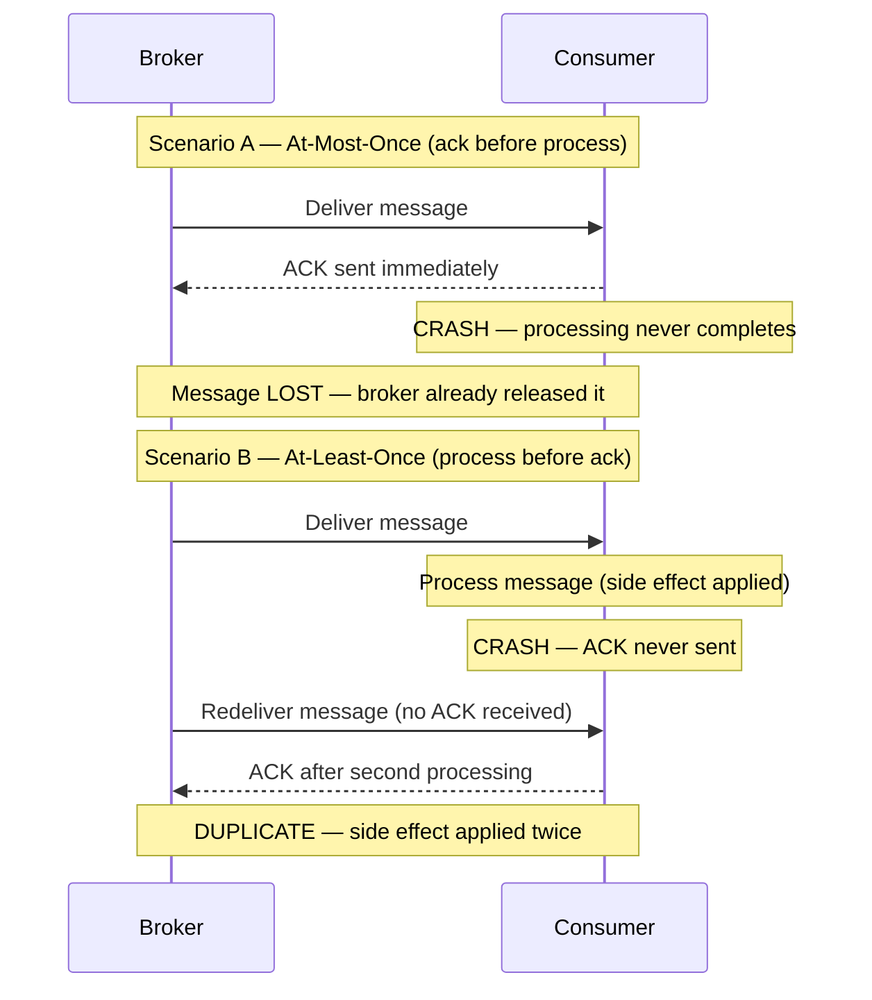

A tabela abaixo é o modelo mental a ser mantido.

**Listing 4.1 — Tabela de referência de semânticas de entrega como dataclasses tipadas**

```python
# Delivery-semantics reference table as typed dataclasses
from dataclasses import dataclass
from typing import Literal

@dataclass(frozen=True)
class DeliverySemantics:
    name: str
    ack_ordering: str            # when the ack is sent relative to processing
    on_crash: str                # what happens if the consumer crashes mid-flight
    duplicates_possible: bool
    message_loss_possible: bool
    typical_use_case: str

DELIVERY_SEMANTICS: list[DeliverySemantics] = [
    DeliverySemantics(
        name="at-most-once",
        ack_ordering="ack BEFORE process",
        on_crash="message is lost — broker already removed it",
        duplicates_possible=False,
        message_loss_possible=True,
        typical_use_case="metrics samples, non-critical telemetry",
    ),
    DeliverySemantics(
        name="at-least-once",
        ack_ordering="ack AFTER process",
        on_crash="broker redelivers — consumer sees it again",
        duplicates_possible=True,
        message_loss_possible=False,
        typical_use_case="default in Kafka, SQS, RabbitMQ; requires idempotent consumers",
    ),
    DeliverySemantics(
        name="exactly-once (processing)",
        ack_ordering="atomic commit covering both effect and ack",
        on_crash="transaction rolls back; redelivered message is a no-op",
        duplicates_possible=False,   # at the effect level, not at the wire level
        message_loss_possible=False,
        typical_use_case="Kafka Streams read-process-write within Kafka topology only",
    ),
]

# Quick display helper — useful in notebooks or during architecture reviews
if __name__ == "__main__":
    header = f"{'Semantic':<22} {'Ack order':<22} {'Dups?':<7} {'Loss?':<7} {'Use case'}"
    print(header)
    print("-" * len(header))
    for s in DELIVERY_SEMANTICS:
        print(
            f"{s.name:<22} {s.ack_ordering:<22} "
            f"{'yes' if s.duplicates_possible else 'no':<7} "
            f"{'yes' if s.message_loss_possible else 'no':<7} "
            f"{s.typical_use_case}"
        )
```

Agora, sobre o equívoco. **A entrega truly exactly-once por uma rede é impossível.** Isso decorre do Problema dos Dois Generais: duas partes que se comunicam por um canal não confiável nunca podem ter certeza de que a outra recebeu a mensagem final. Um remetente que não recebe um ack não consegue distinguir "mensagem perdida" de "ack perdido" — então deve reenviar (arriscando uma duplicata) ou desistir (arriscando a perda). Nenhum protocolo escapa disso.

O que os fornecedores vendem como "exactly-once" é na verdade **processamento *exactly-once***, não entrega. A mensagem pode ser *entregue* muitas vezes, mas o sistema produz o *efeito* apenas uma vez. A semântica exactly-once do Kafka funciona dessa forma: combina entrega at-least-once com produtores idempotentes e escritas transacionais que estão delimitadas **dentro do Kafka** — um loop de leitura-processamento-escrita cuja saída é outro tópico Kafka. No momento em que seu efeito colateral sai dessa fronteira — um banco de dados, um gateway de pagamento, um e-mail — a transação do Kafka não pode cobri-lo. Você está de volta ao at-least-once, e a correção passa a ser *sua* responsabilidade.

A conclusão opinativa: **projete todo consumidor para at-least-once.** Trate exactly-once como um termo de marketing para uma otimização estreita e interna ao broker. Se sua arquitetura depende de mensagens que nunca se duplicam, ela já está quebrada.

> ⚠️ **Nota Crítica:** O texto afirma que at-least-once é "o padrão no Kafka, SQS e RabbitMQ." Para o Kafka, isso é impreciso. O padrão real do Kafka fora da caixa é `enable.auto.commit=true` com um intervalo de auto-commit de 5 segundos. Sob essa configuração, se o temporizador periódico de auto-commit disparar enquanto um lote está sendo processado e o consumidor subsequentemente falhar, essas mensagens em trânsito não serão reentregues — esse é um comportamento at-most-once, não at-least-once. Alcançar at-least-once verdadeiro no Kafka requer configuração explícita: `enable.auto.commit=false` com um commit manual emitido somente após o processamento de cada lote ter sido concluído. Um engenheiro sênior que leia este capítulo poderia concluir que o Kafka o protege contra perda de mensagens por padrão e pular a configuração de commit necessária em sistemas de produção. Qualifique a afirmação sobre o Kafka: "At-least-once é o padrão efetivo no SQS e RabbitMQ, e é alcançável no Kafka quando o commit manual (`enable.auto.commit=false`) está configurado. O auto-commit padrão do Kafka pode produzir comportamento at-most-once em cenários de falha e não deve ser usado para entrega sem perda sem configuração explícita."

> 💡 **Nota do Especialista:** O texto enquadra corretamente a semântica exactly-once (EOS) do Kafka como interna ao broker, mas subestima duas restrições críticas de produção que arquitetos rotineiramente descobrem tarde demais. Primeiro, habilitar EOS requer `enable.idempotence=true` mais produtores transacionais (`transactional.id`) e tem um custo mensurável de throughput — benchmarks do Confluent consistentemente mostram redução de 5–15% no throughput de escrita sob alta carga, porque cada lote requer um protocolo de duas fases com o coordenador de transações do broker. Segundo, o EOS do Kafka é invalidado no momento em que um efeito colateral externo é introduzido — mas a invalidação é silenciosa. Não há exceção, nenhum aviso e nenhum rollback de transação do sistema externo. Equipes que habilitam EOS em seus clientes Kafka e depois chamam um endpoint HTTP dentro do mesmo handler acreditam estar protegidas; não estão. O modelo mental correto é: EOS = commit atômico de offset Kafka + escrita atômica em tópico Kafka, nada mais.

## Idempotência do Consumidor e Chaves de Deduplicação

Uma operação é **idempotente** quando aplicá-la múltiplas vezes produz o mesmo resultado que aplicá-la uma vez. Definir um valor (`status = SHIPPED`) é naturalmente idempotente. Incrementar um valor (`balance = balance - 10`) não é — execute-o duas vezes e você cobrou o dobro.

Como duplicatas são garantidas, o consumidor deve detectá-las e descartá-las. A ferramenta é uma **chave de deduplicação** (deduplication key): um identificador estável e único carregado pelo evento que permite ao consumidor reconhecer uma mensagem que já foi tratada. O produtor deve gerar essa chave uma vez e anexá-la ao evento; nunca a derive do horário de chegada ou de um valor aleatório no consumidor.

Dois padrões dominam.

**1. A verificação de idempotência (dedup store).** Antes de processar, o consumidor verifica se a chave já existe em um armazenamento de IDs processados. Se presente, confirma e pula. Se ausente, processa e registra a chave. Isso funciona para efeitos colaterais que não podem ser tornados naturalmente idempotentes, como chamar uma API de pagamento externa.

**Listing 4.2 — Consumidor idempotente: dedup store + efeito colateral em uma única transação atômica**

```python
# Idempotent consumer: dedup store + side effect in a single atomic transaction
import sqlite3
import uuid
from dataclasses import dataclass


@dataclass
class Message:
    event_id: str       # stable, producer-assigned deduplication key
    payload: dict


class DuplicateEventError(Exception):
    """Raised when the event has already been processed."""


def process_payment(conn: sqlite3.Connection, payload: dict) -> None:
    """Business side effect: record payment. Runs INSIDE the same transaction."""
    conn.execute(
        "INSERT INTO payments (payment_id, amount) VALUES (?, ?)",
        (payload["payment_id"], payload["amount"]),
    )


def handle_message(conn: sqlite3.Connection, message: Message) -> None:
    """
    Idempotent message handler.

    CRITICAL RACE WINDOW:
    If we record the dedup key BEFORE the side effect and crash, the
    redelivery is silently skipped — silent loss.
    If we record the key AFTER the side effect and crash in between,
    redelivery re-executes the side effect — duplicate.
    Solution: both writes share a SINGLE local transaction so they
    commit or roll back together.
    """
    try:
        # BEGIN TRANSACTION (implicit on first DML in sqlite3 connection)
        conn.execute(
            # UNIQUE constraint on event_id enforces exactly-once semantics
            "INSERT INTO processed_events (event_id) VALUES (?)",
            (message.event_id,),
        )
    except sqlite3.IntegrityError:
        # Unique-constraint violation → already processed; safe to ack and skip
        print(f"[SKIP] Duplicate event {message.event_id}")
        return

    # Side effect and dedup record commit atomically — the race window is closed
    process_payment(conn, message.payload)
    conn.commit()
    print(f"[OK]   Processed event {message.event_id}")


# --- Bootstrap schema (run once at startup) ---
def bootstrap(conn: sqlite3.Connection) -> None:
    conn.executescript("""
        CREATE TABLE IF NOT EXISTS processed_events (
            event_id TEXT PRIMARY KEY
        );
        CREATE TABLE IF NOT EXISTS payments (
            payment_id TEXT PRIMARY KEY,
            amount     REAL NOT NULL
        );
    """)


if __name__ == "__main__":
    conn = sqlite3.connect(":memory:")
    bootstrap(conn)

    msg = Message(
        event_id=str(uuid.uuid4()),
        payload={"payment_id": "pay-001", "amount": 49.99},
    )

    handle_message(conn, msg)   # → [OK]   Processed ...
    handle_message(conn, msg)   # → [SKIP] Duplicate ... (redelivery simulation)
```

Existe uma condição de corrida sutil. Se o consumidor registrar a chave *antes* do efeito colateral e então falhar, a mensagem reenviada será pulada e o efeito colateral nunca acontecerá — perda silenciosa. Se registrar a chave *depois* do efeito colateral e falhar no meio do caminho, o reenvio reprocessa — uma duplicata. A solução limpa é tornar o registro de deduplicação e a escrita do negócio **atômicos**, confirmados na mesma transação de banco de dados local. Voltamos a essa ideia com o Outbox.

**2. Idempotência natural via upsert.** Quando o efeito colateral é uma escrita em banco de dados que você controla, modele-o de forma que reaplicá-lo seja inofensivo. Um **upsert** com chave no identificador do evento — inserir se novo, sobrescrever se presente — torna o reprocessamento seguro por construção. É por isso que a transferência de estado carregada por eventos (Capítulo 1) combina tão bem com consumidores idempotentes: o evento contém o novo estado completo, e o consumidor simplesmente o grava.

Dica Profissional: prefira idempotência natural a uma dedup store sempre que o domínio permitir. Uma dedup store adiciona uma consulta, uma escrita e uma política de retenção — você deve eventualmente expirar chaves antigas ou a tabela crescerá sem limite. Um upsert não carrega nenhum desse peso operacional.

> 💡 **Nota do Especialista:** O texto avisa corretamente que a retenção de chaves de deduplicação não pode crescer sem limite, mas não fornece a fórmula para a janela de retenção mínima segura — que é onde as equipes silenciosamente introduzem perda de dados. A retenção mínima deve ser: `max_redelivery_window = message_visibility_timeout x max_receive_count`. Para SQS com um visibility timeout de 12 horas e uma contagem máxima de recebimento de 10, isso é no mínimo 120 horas. No Kafka, o equivalente é o `retention.ms` do tópico de retry multiplicado pelo lag máximo de reinicialização do consumidor. Equipes comumente definem um TTL fixo de 24 horas por intuição. Se um evento de lag de broker Kafka mantiver uma mensagem em um tópico de retry por 36 horas antes de ser reenviada, a entrada na dedup store já expirou e o handler reprocessa a mensagem como nova — uma duplicata silenciosa e intermitente sem stack trace.

<details>
<summary>💡 Nota do Especialista</summary>
A dedup store é uma dependência com estado e deve ser projetada com o mesmo nível de disponibilidade e consistência que o banco de dados de negócio primário. Na prática, equipes comumente recorrem a uma instância Redis compartilhada porque é rápida, e então a implantam sem persistência (`appendonly no`) ou com um único nó. Quando o Redis fica indisponível — uma reinicialização progressiva durante a aplicação de patches, um failover de sentinel — o consumidor passa a processar toda mensagem como se fosse nova. A dedup store silenciosamente para de proteger. A postura mínima de produção é Redis com persistência AOF habilitada e uma configuração replicada de Sentinel ou Cluster. Se a verificação de deduplicação e a escrita de negócio estiverem unificadas na mesma transação relacional (como o texto recomenda), essa preocupação desaparece — o que é o argumento mais forte para a abordagem de transação unificada em vez de um cache separado.
</details>

<details>
<summary>⚠️ Nota Crítica</summary>
O texto introduz a dedup store como o padrão para "efeitos colaterais que não podem ser tornados naturalmente idempotentes, como chamar uma API de pagamento externa," e então propõe corrigir a condição de corrida tornando "o registro de deduplicação e a escrita de negócio atômicos, confirmados na mesma transação de banco de dados local." Essas duas afirmações estão em contradição direta. Uma transação de banco de dados local cobre apenas escritas em banco de dados local. Uma chamada de API de pagamento externa — o exemplo motivador declarado — não pode participar dessa transação. Se o consumidor escrever a chave de deduplicação no banco de dados local, confirmar e então falhar antes de chamar a API de pagamento, a verificação de deduplicação impedirá que a chamada seja retentada. Se chamar a API de pagamento primeiro e falhar antes de escrever a chave de deduplicação, a chamada é duplicada. A correção por transação atômica é válida apenas quando o efeito colateral é ele mesmo uma escrita em banco de dados local; ela não resolve o problema para chamadas de serviços externos. Divida a discussão: (1) Quando o efeito colateral é uma escrita em banco de dados local, use uma transação atômica cobrindo tanto a escrita de negócio quanto a chave de deduplicação. (2) Quando o efeito colateral é uma chamada externa, reconheça que nenhuma transação local pode ajudar — as únicas estratégias sólidas são tornar a API externa em si idempotente (passando o event ID como chave de idempotência, uma capacidade oferecida pelo Stripe, Braintree e outros), ou aceitar a duplicata rara e construir lógica compensatória downstream.
</details>

## Ordenação de Mensagens e Particionamento

A idempotência lida com *duplicatas*. Ela não lida com chegadas *fora de ordem*, e as duas são fáceis de confundir. Lembre-se do Capítulo 3 que um log distribuído garante ordem **apenas dentro de uma partição**, selecionada pela **chave de partição** (partition key). Entre partições, todas as apostas são canceladas.

Isso importa porque muitas operações de negócio são sensíveis à ordem. Considere três eventos para uma conta: `AccountOpened`, `Deposited`, `Withdrawn`. Processe o saque antes do depósito e você pode rejeitar uma transação válida. A correção é rotear todos os eventos de uma determinada entidade para a mesma partição usando uma chave de partição estável — aqui, o ID da conta. Mesma chave, mesma partição, ordem garantida.

**Figura 4.2 — Particionamento por accountId: ordem por conta com grupo de consumidores em paralelo**

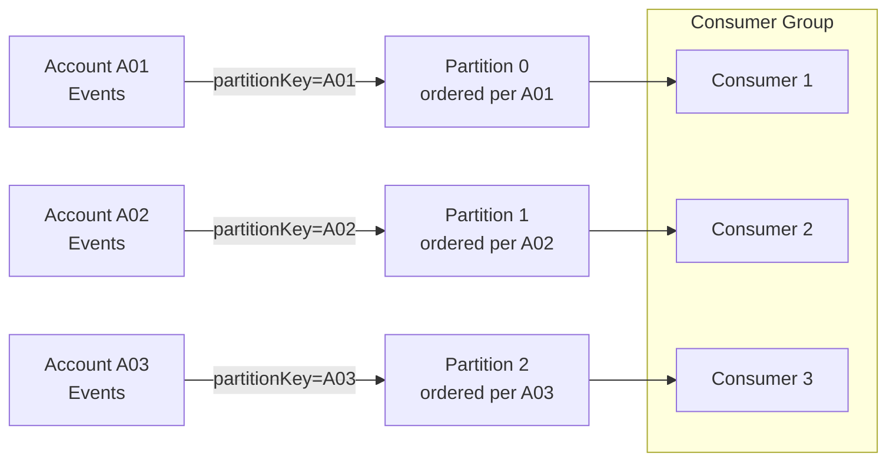

Mas a ordenação tem um custo, e esta é a tensão que todo arquiteto deve avaliar:

- Uma chave de partição **estreita** (poucos valores distintos) preserva a ordem em grandes grupos de eventos, mas concentra a carga em poucas partições, limitando o paralelismo.
- Uma chave de partição **ampla** (muitos valores distintos, como um ID por entidade) distribui a carga e maximiza o throughput, mas garante ordem apenas dentro de cada pequeno grupo.

Não há ordenação *entre* chaves. Escolha a chave na granularidade em que a ordem realmente importa para o negócio — geralmente o agregado (a conta, o pedido, o envio), não o sistema inteiro.

Um complemento defensivo é a **idempotência ciente de versão** (version-aware idempotency). Carimbe cada evento com uma versão monotonicamente crescente por entidade. O consumidor armazena a última versão que aplicou e rejeita qualquer evento cuja versão seja menor ou igual ao que já foi visto. Isso torna o consumidor robusto tanto contra duplicatas *quanto* contra reentregas obsoletas fora de ordem em um único mecanismo.

**Listing 4.3 — Consumidor ciente de versão: rejeita duplicatas e reentregas obsoletas fora de ordem**

```python
# Version-aware consumer: rejects duplicates AND stale out-of-order redeliveries
# Time complexity: O(1) per message (single indexed lookup by entity_id)
import sqlite3
from dataclasses import dataclass


@dataclass
class VersionedEvent:
    event_id: str
    entity_id: str   # e.g. account_id — determines partition key
    version: int     # monotonically increasing per entity; producer assigns this
    payload: dict


class StaleEventError(Exception):
    """Raised when the incoming version is not strictly greater than stored."""


def apply_event(conn: sqlite3.Connection, event: VersionedEvent) -> None:
    """Business state update — called only when the version advances."""
    conn.execute(
        """
        INSERT INTO account_state (entity_id, balance, last_version)
        VALUES (:entity_id, :balance, :version)
        ON CONFLICT (entity_id) DO UPDATE
          SET balance      = :balance,
              last_version = :version
        """,
        {
            "entity_id": event.entity_id,
            "balance": event.payload.get("balance"),
            "version": event.version,
        },
    )


def handle_versioned_event(conn: sqlite3.Connection, event: VersionedEvent) -> None:
    """
    Version gate: apply the event only if its version strictly exceeds
    the last stored version for this entity.
    Handles duplicates (same version re-delivered) and
    stale redeliveries (older version arriving after a newer one).
    """
    row = conn.execute(
        "SELECT last_version FROM account_state WHERE entity_id = ?",
        (event.entity_id,),
    ).fetchone()

    stored_version: int = row[0] if row else -1  # -1 → entity never seen before

    if event.version <= stored_version:
        # Duplicate or stale out-of-order redelivery — safe to discard
        print(
            f"[DISCARD] entity={event.entity_id} "
            f"incoming_v={event.version} stored_v={stored_version}"
        )
        return

    apply_event(conn, event)
    conn.commit()
    print(
        f"[APPLIED] entity={event.entity_id} "
        f"v{stored_version} -> v{event.version}"
    )


# --- Bootstrap ---
def bootstrap(conn: sqlite3.Connection) -> None:
    conn.execute("""
        CREATE TABLE IF NOT EXISTS account_state (
            entity_id    TEXT PRIMARY KEY,
            balance      REAL NOT NULL DEFAULT 0,
            last_version INTEGER NOT NULL DEFAULT -1
        )
    """)


if __name__ == "__main__":
    conn = sqlite3.connect(":memory:")
    bootstrap(conn)

    events = [
        VersionedEvent("e1", "acct-42", version=1, payload={"balance": 100.0}),
        VersionedEvent("e2", "acct-42", version=2, payload={"balance": 90.0}),
        VersionedEvent("e2", "acct-42", version=2, payload={"balance": 90.0}),  # duplicate
        VersionedEvent("e1", "acct-42", version=1, payload={"balance": 100.0}), # stale
        VersionedEvent("e3", "acct-42", version=3, payload={"balance": 150.0}),
    ]

    for ev in events:
        handle_versioned_event(conn, ev)
```

Orientação opinativa: não tente impor ordenação global em todo o seu fluxo de eventos. Isso destrói a escalabilidade que fez você escolher um log em primeiro lugar. Ordene por agregado; tolere desordem em todo o resto.

<details>
<summary>💡 Nota do Especialista</summary>
A idempotência ciente de versão usando um número de versão monotonicamente crescente por entidade é sólida quando um único produtor detém o ciclo de vida da entidade. Ela quebra em padrões comuns de múltiplos produtores — por exemplo, quando vários serviços podem emitir eventos independentemente para o mesmo agregado (um pedido atualizado tanto pelo serviço de fulfillment quanto pelo serviço de pagamentos). Coordenar um contador de sequência global entre produtores cria acoplamento e um problema de coordenação distribuída. A solução padrão da indústria é empurrar a aplicação de versão para o banco de dados via optimistic locking: o consumidor executa uma atualização condicional `WHERE current_version = N - 1` e trata zero linhas afetadas como um evento duplicado ou obsoleto, fazendo uma nova tentativa ou descartando conforme o caso. É assim que o Axon Framework e o EventStoreDB implementam a aplicação de sequência na fronteira do agregado sem exigir coordenação entre produtores.
</details>

<details>
<summary>💡 Nota do Especialista</summary>
O problema de hotspot de partição é subestimado nas discussões sobre seleção de chave de partição, e é agudo em sistemas SaaS multi-tenant. Se a chave de partição for o ID do tenant e um único tenant representar 40% do volume de tráfego (um padrão comum em contratos empresariais), os eventos desse tenant se concentram em uma ou poucas partições. O paralelismo do grupo de consumidores é limitado pela contagem de partições, então partições quentes criam um gargalo de processamento que nenhuma quantidade de escalonamento horizontal de consumidores pode resolver sem um aumento na contagem de partições — o que requer uma reconstrução do tópico Kafka ou um stream de reparticionamento. Projete a chave de partição na granularidade onde a ordem importa (ID do agregado, não ID do tenant), e use um mecanismo separado de fan-out se o isolamento por tenant for um requisito.
</details>

<details>
<summary>⚠️ Nota Crítica</summary>
O mecanismo de idempotência ciente de versão (aplicar somente se `incoming_version > stored_version`, caso contrário descartar) silenciosamente cria perda permanente de evento quando ocorre uma lacuna de versão. Se um consumidor aplicou a versão 3 e a versão 4 nunca foi entregue (descartada, expirada, enviada para DLQ), então a versão 5 chega: a verificação `5 > 3` passa e a versão 5 é aplicada, pulando permanentemente a transição de estado da versão 4. O sistema agora está em um estado inconsistente sem nenhum sinal de erro. O texto apresenta o padrão como robustez contra "duplicatas e reentregas obsoletas" sem notar que implicitamente assume entrega sem lacunas — uma suposição que contradiz a realidade at-least-once-with-DLQ descrita em outras partes do mesmo capítulo. Adicione uma proteção contra lacunas de versão: "O padrão de verificação de versão requer uma sequência monotonicamente sem lacunas por entidade para ser seguro. Complemente-o com uma etapa de detecção de lacunas: se `incoming_version > stored_version + 1`, o consumidor deve estacionar a mensagem (por exemplo, uma fila de retry) ou emitir um alerta em vez de aplicá-la silenciosamente. Na prática, combine verificações de versão com atribuição de sequência exactly-once no produtor — tipicamente usando um contador de optimistic lock na própria linha do agregado."
</details>

## O Padrão Transactional Outbox e o Problema de Dual-Write

Tudo até agora protege o *consumidor*. Mas o *produtor* tem seu próprio modo de falha, e é uma das fontes mais comuns de perda silenciosa de dados em sistemas orientados a eventos: o **problema de dual-write** (escrita dupla).

Um serviço geralmente precisa fazer duas coisas ao lidar com um comando: atualizar seu próprio banco de dados e publicar um evento. Esses são dois sistemas separados — um banco de dados e um broker — sem transação compartilhada. Quatro sequências são possíveis, e duas delas são corrompidas:

1. Escrever no banco de dados, publicar o evento — ambos têm sucesso. Correto.
2. Escrever no banco de dados, depois falhar antes de publicar — estado alterado, mas nenhum evento. Os consumidores nunca ficam sabendo. **Evento perdido.**
3. Publicar o evento, depois falhar antes de escrever no banco de dados — consumidores agem sobre um fato que nunca se tornou verdadeiro. **Evento fantasma.**
4. Nenhum acontece. Correto (nada mudou).

Não é possível fazer dois sistemas independentes confirmarem atomicamente sem uma transação distribuída, e transações distribuídas (two-phase commit) são exatamente o que abandonamos em arquiteturas cloud-native por seu custo e fragilidade.

**Figura 4.3 — A lacuna de falha de dual-write: banco de dados confirmou, publicação no broker nunca acontece**

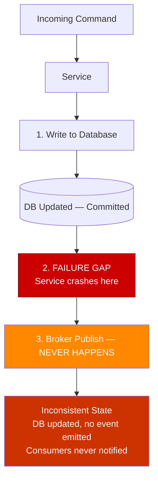

O padrão **Transactional Outbox** resolve isso de forma elegante. Em vez de escrever no banco de dados *e* no broker, o serviço escreve apenas no banco de dados. Na **mesma transação local** que atualiza as tabelas de negócio, ele também insere o evento em uma **tabela outbox** nesse mesmo banco de dados. Como é uma transação em um único banco de dados, é atômica: ou tanto a mudança de estado quanto a linha do outbox são confirmadas, ou nenhuma delas é. O problema de dual-write desaparece.

Um processo separado então lê as linhas não publicadas do outbox e as publica no broker, marcando cada uma como enviada. Esse processo opera **at-least-once** — se falhar após publicar, mas antes de marcar uma linha, ele republica ao reiniciar. O que é exatamente por isso que os consumidores devem ser idempotentes. O Outbox não elimina duplicatas; ele garante *nenhuma perda*, e transfere a deduplicação para o consumidor, onde já construímos defesas para isso.

**Listing 4.4 — Transactional Outbox: uma única confirmação atômica cobre o registro de negócio e a linha do outbox**

```python
# Transactional Outbox: one atomic commit covers business record + outbox row
import json
import sqlite3
import uuid
from dataclasses import dataclass, field
from datetime import datetime, timezone


@dataclass
class Order:
    order_id: str
    customer_id: str
    total_amount: float
    status: str = "PLACED"


@dataclass
class OutboxRow:
    event_id: str = field(default_factory=lambda: str(uuid.uuid4()))
    aggregate_type: str = "Order"
    event_type: str = "OrderPlaced"
    payload: dict = field(default_factory=dict)
    created_at: str = field(
        default_factory=lambda: datetime.now(timezone.utc).isoformat()
    )
    published: bool = False


def place_order(conn: sqlite3.Connection, order: Order) -> OutboxRow:
    """
    ── COMMIT BOUNDARY ──────────────────────────────────────────────────
    Both the orders INSERT and the outbox INSERT execute in the SAME
    local transaction. Either both commit or both roll back — no dual-write
    problem, no phantom events, no lost events.
    ─────────────────────────────────────────────────────────────────────
    """
    outbox_row = OutboxRow(
        aggregate_type="Order",
        event_type="OrderPlaced",
        payload={
            "order_id": order.order_id,
            "customer_id": order.customer_id,
            "total_amount": order.total_amount,
            "status": order.status,
        },
    )

    # ── BEGIN implicit transaction ──
    conn.execute(
        "INSERT INTO orders (order_id, customer_id, total_amount, status) "
        "VALUES (?, ?, ?, ?)",
        (order.order_id, order.customer_id, order.total_amount, order.status),
    )
    conn.execute(
        "INSERT INTO outbox (event_id, aggregate_type, event_type, payload, created_at, published) "
        "VALUES (?, ?, ?, ?, ?, ?)",
        (
            outbox_row.event_id,
            outbox_row.aggregate_type,
            outbox_row.event_type,
            json.dumps(outbox_row.payload),   # serialized event carried to broker
            outbox_row.created_at,
            False,
        ),
    )
    conn.commit()  # ── COMMIT: both rows land together or neither does ──

    print(f"[COMMITTED] order={order.order_id}  outbox_event={outbox_row.event_id}")
    return outbox_row


def relay_unpublished(conn: sqlite3.Connection) -> None:
    """
    Outbox relay (runs in a separate process/thread).
    Operates at-least-once: if it crashes after publish but before marking
    the row as published, it will republish on next run — consumers must be
    idempotent (event_id is the deduplication key).
    """
    rows = conn.execute(
        "SELECT event_id, event_type, payload FROM outbox WHERE published = 0"
    ).fetchall()

    for event_id, event_type, payload in rows:
        # Simulate broker publish (replace with real broker SDK call)
        print(f"[RELAY -> BROKER] event_id={event_id} type={event_type}")
        conn.execute(
            "UPDATE outbox SET published = 1 WHERE event_id = ?", (event_id,)
        )
        conn.commit()


# --- Bootstrap ---
def bootstrap(conn: sqlite3.Connection) -> None:
    conn.executescript("""
        CREATE TABLE IF NOT EXISTS orders (
            order_id     TEXT PRIMARY KEY,
            customer_id  TEXT NOT NULL,
            total_amount REAL NOT NULL,
            status       TEXT NOT NULL
        );
        CREATE TABLE IF NOT EXISTS outbox (
            event_id       TEXT PRIMARY KEY,
            aggregate_type TEXT NOT NULL,
            event_type     TEXT NOT NULL,
            payload        TEXT NOT NULL,   -- JSON
            created_at     TEXT NOT NULL,
            published      INTEGER NOT NULL DEFAULT 0
        );
    """)


if __name__ == "__main__":
    conn = sqlite3.connect(":memory:")
    bootstrap(conn)

    order = Order(
        order_id=str(uuid.uuid4()),
        customer_id="cust-7",
        total_amount=129.90,
    )
    place_order(conn, order)
    relay_unpublished(conn)
```

Dois mecanismos conduzem o relay do outbox. **Polling** consulta a tabela em um intervalo — simples, portátil, mas adiciona latência e carga no banco de dados. **Change Data Capture (CDC)** acompanha o log de transações do banco de dados (via ferramentas como Debezium) e transmite novas linhas do outbox para o broker em tempo quase real, sem sobrecarga de polling. CDC é a escolha mais escalável para sistemas de alto volume; polling é perfeitamente adequado para a maioria.

Dica Profissional: o event ID gravado na linha do outbox é a mesma chave de deduplicação que o consumidor usa. Projete os dois juntos. O Outbox do produtor e a verificação de deduplicação do consumidor são duas metades de um único contrato de correção ponta a ponta.

> 💡 **Nota do Especialista:** CDC via Debezium é a escolha correta para alto throughput, mas requer permissões em nível de banco de dados que DBAs corporativos frequentemente restringem e que ofertas PaaS (Amazon RDS, Azure Database for PostgreSQL Flexible Server) expõem apenas sob configurações específicas. Especificamente: o acesso ao binlog do MySQL requer os grants `REPLICATION SLAVE` e `REPLICATION CLIENT`, e `binlog_format=ROW` deve ser definido no nível do servidor. A replicação lógica do PostgreSQL requer a role `REPLICATION` e um replication slot, e o RDS impõe um limite rígido de 20 replication slots que conta contra todos os consumidores. Equipes rotineiramente descobrem essa restrição durante UAT ou cutover de produção, não durante o design. O fallback para polling está sempre disponível, mas a decisão arquitetural deve ser tomada com pleno conhecimento dos requisitos de permissão no ambiente alvo — não adiada para o dia da implantação.

<details>
<summary>⚠️ Nota Crítica</summary>
O Transactional Outbox é apresentado como solução para o problema de dual-write, mas introduz uma nova dependência operacionalmente significativa que não é reconhecida: o processo de relay do outbox. Seja implementado como um loop de polling ou um conector CDC Debezium, esse relay é um processo separado que pode falhar, atrasar ou ficar indisponível. Enquanto a tabela do outbox acumula linhas, os consumidores downstream não recebem nenhum evento — um cenário que é funcionalmente equivalente ao problema de "evento perdido" que o padrão pretendia resolver, exceto que agora é uma interrupção do processo de relay em vez de uma falha de serviço causando o atraso. Para CDC especificamente, conectores Debezium são sensíveis a mudanças de schema de banco de dados (um `ALTER TABLE` em uma tabela capturada pode parar o conector) e requerem sua própria implantação de alta disponibilidade. O texto descreve CDC como "a escolha mais escalável" sem expor nenhuma dessas cargas operacionais. Adicione um parágrafo sobre confiabilidade do relay: "O relay do outbox é um componente necessário para a correção do padrão. Trate-o com a mesma disciplina operacional que o próprio serviço: implante-o com redundância, monitore seu lag (a idade da linha do outbox não publicada mais antiga) e alerte quando esse lag exceder seu SLA. Para CDC com Debezium, planeje procedimentos de mudança de schema que pausem e retomem com segurança o conector, e armazene os offsets do conector em um armazenamento durável em vez de na memória."
</details>

<details>
<summary>⚠️ Nota Crítica</summary>
O padrão Outbox conforme descrito não preserva a ordenação entre transações concorrentes de múltiplas instâncias de aplicação. Considere duas requisições concorrentes A e B: A inicia sua transação primeiro (insere linha do outbox com `id=100`), B inicia levemente depois (insere linha do outbox com `id=101`), mas B confirma primeiro. O relay pega a linha 101 e publica o evento de B. A então confirma, e a linha 100 é publicada por último. Consumidores que dependem de entrega em ordem de inserção agora observam o evento de B antes do de A — violando a garantia de ordenação que a seção anterior do capítulo construiu. Essa lacuna existe tanto para relays baseados em polling quanto para relays baseados em CDC (CDC lê transações confirmadas, não a ordem de início). O texto não menciona esse modo de falha. Observe a limitação explicitamente: "O Outbox garante entrega sem perda, não ordenação global estrita entre requisições concorrentes. Para casos de uso que exigem ordenação estrita, imponha acesso de escritor único por agregado (por exemplo, serialize comandos por meio de uma fila ou um database advisory lock por ID de entidade), ou aceite que o Outbox fornece ordenação por entidade apenas quando escritas para a mesma entidade são serializadas upstream."
</details>

## Filas de Mensagens Mortas e Políticas de Retry

Idempotência e Outbox assumem que as mensagens eventualmente têm sucesso. Algumas nunca terão. Um payload malformado, uma incompatibilidade permanente de schema ou uma regra de negócio que sempre rejeita a mensagem cria uma **mensagem envenenada** (poison message) — uma que falha independentemente de quantas vezes seja tentada novamente. Sob at-least-once, um broker ingênuo a reenvia para sempre, bloqueando a partição ou privando o consumidor. Isso é uma interrupção autoinfligida.

A ferramenta de contenção é uma **dead-letter queue (DLQ)**: uma fila separada onde as mensagens são movidas após esgotar seu orçamento de retentativas. A DLQ isola a mensagem envenenada para que o fluxo saudável continue fluindo, e preserva a mensagem falha para inspeção e reprocessamento manual em vez de descartá-la.

Uma **política de retry** (política de retentativa) sólida distingue duas classes de falha:

- **Falhas transitórias** — um timeout, uma dependência com throttling, uma breve falha de rede. Essas merecem retentativas, idealmente com **exponential backoff** (atrasos crescentes: 1s, 2s, 4s, 8s) e **jitter** (aleatorização) para evitar uma horda trovejante de retentativas sincronizadas atingindo um serviço em recuperação.
- **Falhas permanentes** — um erro de validação, uma mensagem não parseável. Tentar novamente é inútil; roteie-as para a DLQ imediatamente. Desperdiçar um orçamento de retentativas em uma mensagem que nunca pode ter sucesso apenas atrasa o inevitável.

**Listing 4.5 — Política de retry: exponential backoff com jitter para erros transitórios; DLQ imediata para permanentes**

```python
# Retry policy: exponential backoff with jitter for transient errors; immediate DLQ for permanent
import random
import time
import logging
from dataclasses import dataclass
from typing import Callable

logger = logging.getLogger(__name__)


# ── Failure taxonomy ──────────────────────────────────────────────────────────

class TransientError(Exception):
    """Temporary failure — worth retrying (timeout, throttle, network blip)."""


class PermanentError(Exception):
    """Unrecoverable failure — retrying is pointless (bad schema, invalid payload)."""


# ── Retry policy configuration ────────────────────────────────────────────────

@dataclass
class RetryPolicy:
    max_attempts: int = 5          # total delivery attempts before dead-lettering
    base_delay_seconds: float = 1.0
    max_delay_seconds: float = 30.0
    jitter_factor: float = 0.3     # ±30 % randomization to spread retry waves


def _backoff_delay(attempt: int, policy: RetryPolicy) -> float:
    """Exponential backoff: base * 2^attempt, capped, then jittered."""
    delay = min(
        policy.base_delay_seconds * (2 ** attempt),
        policy.max_delay_seconds,
    )
    # Jitter: multiply by a random factor in [1 - jitter, 1 + jitter]
    jitter = 1.0 + policy.jitter_factor * (2 * random.random() - 1)
    return delay * jitter


def send_to_dlq(message: dict, reason: str) -> None:
    """Dead-letter the message — triggers an alert in production monitoring."""
    logger.error(
        "DLQ: message dead-lettered",
        extra={"event_id": message.get("event_id"), "reason": reason},
    )
    # Replace with real DLQ publish (SQS redrive, Kafka DLQ topic, etc.)


def process_with_retry(
    message: dict,
    handler: Callable[[dict], None],
    policy: RetryPolicy | None = None,
) -> None:
    """
    Drive a message handler through the retry policy.

    - PermanentError  → dead-letter immediately, no retries wasted
    - TransientError  → retry up to max_attempts with exponential backoff + jitter
    - Exceeded budget → dead-letter with the last exception as reason
    """
    if policy is None:
        policy = RetryPolicy()

    for attempt in range(policy.max_attempts):
        try:
            handler(message)
            return  # success — done
        except PermanentError as exc:
            # Retrying a permanent error is pointless; route to DLQ immediately
            send_to_dlq(message, reason=f"PermanentError: {exc}")
            return
        except TransientError as exc:
            if attempt + 1 == policy.max_attempts:
                # Retry budget exhausted — dead-letter
                send_to_dlq(message, reason=f"TransientError after {policy.max_attempts} attempts: {exc}")
                return
            delay = _backoff_delay(attempt, policy)
            logger.warning(
                "Transient failure, retrying",
                extra={"attempt": attempt + 1, "delay_s": round(delay, 2), "error": str(exc)},
            )
            time.sleep(delay)


# ── Example usage ─────────────────────────────────────────────────────────────

if __name__ == "__main__":
    logging.basicConfig(level=logging.INFO)

    call_count = 0

    def flaky_handler(msg: dict) -> None:
        """Simulates two transient failures then success."""
        global call_count
        call_count += 1
        if call_count < 3:
            raise TransientError("downstream timeout")
        print(f"[PROCESSED] event_id={msg['event_id']}")

    def bad_handler(msg: dict) -> None:
        raise PermanentError("schema validation failed: missing required field 'amount'")

    policy = RetryPolicy(max_attempts=5, base_delay_seconds=0.05)  # fast for demo

    process_with_retry({"event_id": "ev-001"}, flaky_handler, policy)
    process_with_retry({"event_id": "ev-002"}, bad_handler, policy)
```

Defina uma **contagem máxima de recebimento** — o número de tentativas de entrega antes de a mensagem ser enviada para a DLQ. No SQS, isso é uma política de redrive nativa; no Kafka, é tipicamente implementado com tópicos de retry e um tópico DLQ final. Escolha a contagem deliberadamente: muito baixa e falhas transitórias perdem mensagens para a DLQ; muito alta e uma mensagem envenenada fica girando por minutos antes da quarentena.

Criticamente, a DLQ não é uma lata de lixo. Uma mensagem chegando lá é um **sinal operacional** que exige um alerta. O Capítulo 9 trata o monitoramento de DLQ e o reprocessamento seguro em profundidade; por ora, a regra é simples: **uma DLQ não monitorada é um buffer silencioso de perda de dados.** Cada mensagem que entra nela representa um fato de negócio que seu sistema falhou em honrar.

> ⚠️ **Nota Crítica:** O texto avisa que uma mensagem envenenada "fica girando por minutos antes da quarentena," mas no Kafka essa é uma subestimação grave da consequência. O Kafka garante ordem dentro de uma partição; um consumidor não avança além de um offset com falha até que a mensagem seja processada com sucesso ou ignorada manualmente. Uma mensagem envenenada com um orçamento generoso de retentativas (por exemplo, 10 tentativas × exponential backoff chegando a 512s) pode bloquear todas as mensagens subsequentes em uma partição inteira por horas, fazendo o lag do grupo de consumidores crescer sem limite para essa partição. Ao contrário do SQS ou RabbitMQ, não existe mecanismo nativo para estacionar uma única mensagem Kafka no meio do fluxo e continuar consumindo — o padrão de tópico de retry deve ser deliberadamente projetado. O texto descreve isso como um inconveniente de tempo em vez de uma potencial interrupção em toda a partição, o que poderia levar arquitetos a subestimar as salvaguardas necessárias. Adicione um callout específico do Kafka: "Em um consumidor Kafka com ordenação por partição, uma mensagem envenenada é singularmente perigosa — ela paralisa o progresso em toda a partição até ser esgotada. O padrão de tópico de retry (uma cadeia separada de tópicos retry-1, retry-2, … DLQ) existe precisamente para permitir que a partição principal avance. Se seu sistema usa Kafka com garantias de ordenação, implemente tópicos de retry desde o início, não como uma reflexão tardia."

> 💡 **Nota do Especialista:** O texto distingue corretamente falhas transitórias de permanentes, mas omite um modo de falha crítico de produção que fica entre os dois: a reentrega em nível de infraestrutura que ocorre antes que qualquer política de retry em nível de aplicação seja acionada. No SQS, se o `VisibilityTimeout` for menor do que o tempo de processamento de uma mensagem, o broker torna a mensagem visível novamente enquanto o primeiro consumidor ainda está processando — causando entrega dupla simultânea para duas instâncias diferentes de consumidor. Nenhuma instância vê um erro em nível de aplicação; ambas processam com sucesso e ambas confirmam. O resultado é uma duplicata que contorna a dedup store se ambas as leituras ocorrerem antes que qualquer escrita seja confirmada. A regra segura é: defina o `VisibilityTimeout` para pelo menos 6x a latência de processamento no percentil P99, e monitore a métrica CloudWatch `ApproximateNumberOfMessagesNotVisible` para detectar eventos de entrega simultânea. No Kafka, a falha análoga é um timeout de sessão causando rebalanceamento de partição durante o processamento, que reenvia a partir do último offset confirmado.

## Principais Conclusões

- **At-least-once é o padrão realista.** A entrega truly exactly-once por uma rede é impossível (Problema dos Dois Generais); o que os fornecedores vendem é processamento exactly-once, limitado ao interior do broker e nulo no momento em que um efeito colateral toca um sistema externo.
- **Duplicatas são garantidas, portanto os consumidores devem ser idempotentes.** Use idempotência natural (upserts com chave no event ID) onde o domínio permite, e uma dedup store com chave de deduplicação onde os efeitos colaterais são externos.
- **Ordem é uma garantia com escopo de partição.** Roteie eventos sensíveis à ordem de um agregado para uma partição via chave de partição estável, e use números de versão por entidade para rejeitar entregas obsoletas ou duplicadas.
- **O Transactional Outbox derrota o problema de dual-write** ao confirmar a mudança de estado e o evento atomicamente em um banco de dados, e então relaying para o broker at-least-once — o que é por isso que a idempotência do consumidor é inegociável.
- **Dead-letter queues contêm mensagens envenenadas.** Tente novamente falhas transitórias com exponential backoff e jitter; envie falhas permanentes imediatamente para DLQ; e alerte em toda chegada à DLQ.

## O Que Vem a Seguir

Com entrega confiável e processamento idempotente estabelecidos, o Capítulo 5 se volta para a estrutura — introduzindo CQRS para separar o caminho de escrita do caminho de leitura e resolver a incompatibilidade de forma entre como os dados são armazenados e como são consultados.

<!-- ASSEMBLY COMPLETE
  Chapter: Delivery Guarantees and Idempotency
  Code blocks resolved: 5 / 5
  Diagrams resolved: 3 / 3
  Expert callouts (inline): 4
  Expert callouts (collapsed): 3
  Critical callouts (inline): 2
  Critical callouts (collapsed): 4
  Unresolved markers: 0
-->


# Capítulo 5: CQRS — Separando Leituras e Escritas

## Declaração do Problema Inicial

O Capítulo 4 deixou o caminho de escrita em boa forma. Eventos fluem com entrega at-least-once, consumidores são idempotentes e o Transactional Outbox publica com confiabilidade. Mas uma pergunta persistente permanece: uma vez que esses eventos remodelaram o estado do seu sistema, como alguém *lê* esse estado de forma eficiente? Uma única tabela otimizada para impor invariantes na escrita quase nunca é a mesma tabela que você deseja consultar para um dashboard, uma tela de busca ou um feed mobile. Essa é a tensão que o **Command Query Responsibility Segregation (CQRS)** foi criado para resolver.

CQRS é um dos padrões mais mal compreendidos no conjunto de ferramentas orientado a eventos. Algumas equipes o tratam como um companheiro obrigatório do Event Sourcing (armazenamento de eventos). Outras o aplicam reflexivamente em todo microserviço e se afogam em complexidade acidental. Nenhum reflexo está correto. CQRS é uma resposta direcionada a um problema estrutural específico — a incompatibilidade entre o formato dos dados que você escreve e o formato que você lê. Este capítulo define esse problema com precisão, mostra como separar os dois caminhos, ensina a construir modelos de leitura a partir de eventos, confronta honestamente o custo de consistência e — o mais importante para um público sênior — traça uma linha clara sobre quando CQRS é simplesmente engenharia excessiva.

## O Problema de Incompatibilidade de Formato

Todo sistema persistente serve a dois trabalhos fundamentalmente diferentes. De um lado, aceita mudanças e deve proteger regras de negócio — uma conta não pode ficar negativa, um pedido não pode ser enviado duas vezes. Do outro lado, responde a perguntas — mostre-me o histórico de pedidos deste cliente, classifique produtos por receita, liste faturas em aberto. Esses dois trabalhos puxam o modelo de dados em direções opostas.

O lado da escrita quer **normalização** (normalização). Tabelas normalizadas evitam anomalias, impõem integridade referencial e mantêm invariantes locais a um único agregado. O lado da leitura quer **desnormalização** (desnormalização). Uma tela de consulta quer tudo o que precisa pré-unido, achatado e indexado para o padrão de acesso exato que serve. Forçar os dois trabalhos em um único esquema significa que nenhum recebe o que precisa. Este é o **problema de incompatibilidade de formato**: a estrutura ótima para validar uma mudança difere da estrutura ótima para responder a uma pergunta.

Considere um serviço de pedidos de e-commerce corporativo. O modelo de escrita é um agregado `Order` organizado com itens de linha, impondo que os totais se reconciliem e o estoque esteja reservado. Agora o negócio pede uma tela mostrando, por cliente, seus últimos dez pedidos com miniaturas de produtos, status de envio e uma figura de valor vitalício acumulado. Servir isso a partir do esquema de escrita normalizado significa uma junção de múltiplas tabelas executada a cada carregamento de página, competindo por locks com as próprias transações que realizam pedidos.

**Figura 5.1 — Modelo de Escrita vs Modelo de Leitura: a ponte de projeção**

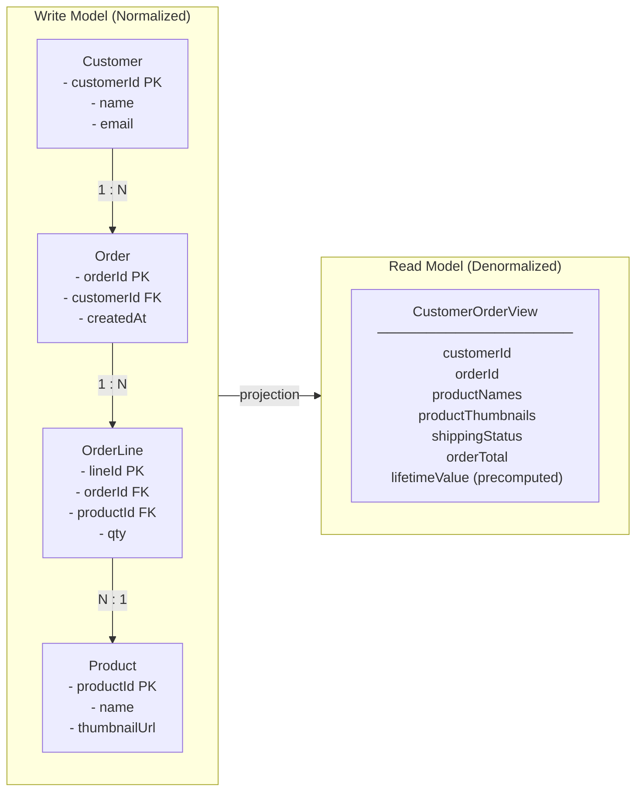

*O modelo de escrita (esquerda) mantém os dados normalizados em quatro tabelas para impor invariantes e evitar anomalias; o modelo de leitura (direita) achata essas tabelas em um único documento pré-otimizado para a tela de consulta. A seta "projection" entre eles representa o processo orientado a eventos que deriva continuamente o formato de leitura a partir dos eventos do lado da escrita — este é o núcleo estrutural do CQRS.*

A solução ingênua é continuar adicionando índices e réplicas de leitura ao modelo único. Isso compra tempo, mas não uma saída. Índices otimizados para leitura atrasam escritas; consultas de relatórios pesados disputam com a carga transacional; e o esquema se calcifica porque deve satisfazer todos os consumidores ao mesmo tempo. CQRS propõe um corte mais limpo: pare de fingir que um modelo pode ser os dois. Deixe o lado da escrita permanecer enxuto e orientado por regras, e derive os formatos de leitura necessários como estruturas separadas e criadas especificamente.

<details>
<summary>⚠️ Nota Crítica</summary>

"A solução ingênua é continuar adicionando índices e réplicas de leitura ao modelo único. Isso compra tempo, mas não uma saída." Isso enquadra réplicas de leitura e visões materializadas como apenas uma solução provisória, implicando que são soluções de longo prazo inadequadas. Para uma classe significativa de sistemas reais — razões moderadas de leitura/escrita, diversidade de consultas delimitada, padrões de acesso previsíveis — uma réplica de leitura bem mantida com uma visão materializada é uma solução permanente totalmente adequada, não um degrau rumo ao CQRS. O texto não reconhece isso, potencialmente empurrando arquitetos em direção a complexidade desnecessária quando a solução simples seria suficiente. Isso está em tensão com a própria seção "Quando CQRS É Engenharia Excessiva" do capítulo, que argumenta exatamente o oposto.

**Correção sugerida:** Qualifique a afirmação: "Para sistemas com formatos de consulta diversos, imprevisíveis ou divergentes, índices e réplicas de leitura compram tempo, mas não uma saída. Para sistemas com um conjunto estável e delimitado de consultas, uma réplica de leitura cuidadosamente mantida com uma visão materializada é frequentemente a resposta permanente correta e deve ser avaliada antes de adotar CQRS."
</details>

## Separação de Comandos e Consultas

O nome diz tudo. Um **command** (comando) é uma instrução para mudar estado — `PlaceOrder`, `CancelReservation`, `ApplyDiscount`. Uma **query** (consulta) é uma solicitação para retornar estado sem alterá-lo — `GetOrderHistory`, `FindUnpaidInvoices`. CQRS insiste que essas duas responsabilidades vivam em **modelos separados**, e frequentemente em infraestrutura completamente separada.

Esta é uma generalização deliberada do princípio mais antigo **Command Query Separation (CQS)**, que simplesmente dizia que um único método deveria ou mudar estado ou retorná-lo, nunca os dois. CQRS eleva essa ideia do nível do método para o nível arquitetural: um modelo trata o caminho de comando, um modelo diferente trata o caminho de consulta.

O caminho de comando processa uma intenção, valida-a contra as regras de negócio e — em caso de sucesso — muta o estado autoritativo e emite um evento de domínio. Esse caminho retorna quase nada ao chamador; frequentemente apenas um reconhecimento ou um identificador. O caminho de consulta nunca toca o armazenamento de escrita autoritativo. Ele lê de um ou mais **read models** (modelos de leitura) construídos especificamente para as perguntas sendo feitas.

> ⚠️ **Nota Crítica:** O texto afirma categoricamente que "o caminho de consulta nunca toca o armazenamento de escrita autoritativo", mas a seção "Consistência Entre o Lado da Escrita e o Lado da Leitura" corretamente aconselha a "manter as leituras críticas a invariantes próximas ao modelo de escrita". Essas duas afirmações se contradizem diretamente. Um arquiteto sênior que lê o Capítulo 5 em sequência internalizará uma regra absoluta na primeira seção e encontrará uma exceção três seções depois sem reconhecimento de que ela reverte a regra anterior. Essa ambiguidade pode causar má aplicação: equipes podem implementar uma política estrita de "nunca ler do armazenamento de escrita" e então ser incapazes de servir as leituras fortemente consistentes que seu domínio realmente exige sem uma reescrita completa. **Correção sugerida:** Remova a palavra "nunca" da descrição do caminho de consulta em Separação de Comandos e Consultas e qualifique a afirmação: "No caso geral, o caminho de consulta lê de modelos de leitura criados especificamente; a Seção X identifica a exceção para consultas fortemente consistentes e críticas a invariantes que legitimamente permanecem no armazenamento de escrita." Isso reconhece a realidade híbrida desde o início e remove a contradição.

**Listagem 5.1 — Caminho de escrita vs caminho de leitura do CQRS: dois modelos independentes sem armazenamento compartilhado**

```python
# CQRS write path vs read path — two independent models with no shared store
# O(1) write (single aggregate), O(1) read (indexed flat table)

from __future__ import annotations

from dataclasses import dataclass, field
from datetime import datetime, timezone
from typing import Protocol
from uuid import UUID, uuid4


# ---------------------------------------------------------------------------
# Shared value types (identifiers only — no business logic shared)
# ---------------------------------------------------------------------------

@dataclass(frozen=True)
class OrderId:
    value: UUID = field(default_factory=uuid4)


# ---------------------------------------------------------------------------
# COMMAND SIDE — intent, invariants, persistence, event emission
# ---------------------------------------------------------------------------

@dataclass(frozen=True)
class PlaceOrderCommand:
    customer_id: UUID
    items: list[dict]   # [{"product_id": UUID, "quantity": int, "unit_price": float}]


@dataclass(frozen=True)
class OrderPlacedEvent:
    order_id: UUID
    customer_id: UUID
    items: list[dict]
    total_amount: float
    placed_at: datetime
    event_id: UUID = field(default_factory=uuid4)  # used by projections for idempotency


class OrderCommandHandler:
    """Enforces write-side invariants; returns only OrderId — no read data leaks back."""

    def __init__(self, order_repo: OrderRepository, publisher: EventPublisher) -> None:
        self._repo = order_repo
        self._publisher = publisher

    def handle(self, cmd: PlaceOrderCommand) -> OrderId:
        if not cmd.items:
            raise ValueError("An order must contain at least one line item")

        total = sum(i["quantity"] * i["unit_price"] for i in cmd.items)
        if total <= 0:
            raise ValueError("Order total must be positive")

        order_id = OrderId()
        self._repo.save(order_id, cmd)   # persist write aggregate

        self._publisher.publish(OrderPlacedEvent(
            order_id=order_id.value,
            customer_id=cmd.customer_id,
            items=cmd.items,
            total_amount=total,
            placed_at=datetime.now(tz=timezone.utc),
        ))

        return order_id   # ← caller receives only the identifier


# ---------------------------------------------------------------------------
# QUERY SIDE — denormalized DTO, separate store, no write model contact
# ---------------------------------------------------------------------------

@dataclass
class CustomerOrderSummary:
    """Fully-denormalized view: prejoined, precomputed — shaped for the UI."""
    order_id: UUID
    customer_id: UUID
    status: str
    total_amount: float
    item_count: int
    placed_at: datetime
    shipped_at: datetime | None = None


class OrderQueryService:
    """Reads from the dedicated read store only — independent of write infrastructure."""

    def __init__(self, read_store: ReadStore) -> None:
        self._store = read_store

    def get_customer_orders(
        self, customer_id: UUID, *, limit: int = 10
    ) -> list[CustomerOrderSummary]:
        # Single flat query — no joins, no lock contention with write transactions
        rows = self._store.query(
            "SELECT * FROM customer_order_view "
            "WHERE customer_id = %s ORDER BY placed_at DESC LIMIT %s",
            (customer_id, limit),
        )
        return [CustomerOrderSummary(**row) for row in rows]


# ---------------------------------------------------------------------------
# Infrastructure protocols (injected; not shared between command and query)
# ---------------------------------------------------------------------------

class OrderRepository(Protocol):
    def save(self, order_id: OrderId, cmd: PlaceOrderCommand) -> None: ...

class EventPublisher(Protocol):
    def publish(self, event: OrderPlacedEvent) -> None: ...

class ReadStore(Protocol):
    def query(self, sql: str, params: tuple) -> list[dict]: ...
```

*O command handler (manipulador de comando) possui o caminho de escrita: impõe invariantes, persiste o agregado e emite um evento de domínio — retornando apenas um `OrderId` ao chamador. O query service (serviço de consulta) possui o caminho de leitura: lê exclusivamente de um armazenamento desnormalizado pré-projetado e retorna um DTO totalmente populado, sem jamais tocar o modelo de escrita.*

Observe o que essa separação desbloqueia. Os dois lados podem escalar de forma independente — o tráfego de leitura na maioria dos sistemas corporativos supera o tráfego de escrita em uma ordem de grandeza, então você pode adicionar réplicas de leitura ou nós de consulta sem tocar na capacidade de escrita. Eles podem usar diferentes engines de armazenamento: um armazenamento relacional para escritas transacionais, um armazenamento de documentos ou índice de busca para leituras. E podem evoluir em cronogramas independentes, porque uma nova tela de consulta significa adicionar um modelo de leitura, não migrar o esquema de escrita.

A troca é igualmente clara. Você agora mantém dois modelos e a maquinaria que os mantém alinhados. Essa maquinaria é onde os eventos reentram na história e onde o padrão ganha ou perde seu valor.

<details>
<summary>💡 Nota do Especialista</summary>

Um conflito de design comum surge quando equipes de UX assumem que o caminho de comando deve retornar um estado rico pós-mutação — o pedido atualizado, o novo saldo da conta. O contrato correto do CQRS é mais estrito: o command handler retorna **erros de validação e códigos de falha** síncronos (o usuário deve saber imediatamente se sua intenção foi rejeitada), mas em caso de sucesso retorna apenas um identificador ou token causal — nunca o formato de leitura mutado. Retornar dados do lado da consulta a partir do caminho de comando reintroduz o acoplamento que o CQRS foi projetado para cortar e força o command handler a consultar o modelo de leitura ou reler o armazenamento de escrita. Equipes que borram essa fronteira acabam com um "híbrido comando-consulta" que herda a complexidade de ambos os modelos sem o benefício de escalabilidade de nenhum.
</details>

<details>
<summary>⚠️ Nota Crítica</summary>

"O caminho de comando retorna quase nada ao chamador; frequentemente apenas um reconhecimento ou um identificador" é apresentado como um fato arquitetural em vez de uma escolha de design contestada. Retornar apenas um ID força uma segunda viagem de ida e volta obrigatória para recuperar o recurso criado ou atualizado — um custo real de latência e UX, especialmente em conexões móveis de alta latência ou internacionais. Muitos sistemas CQRS amplamente implementados (incluindo os construídos sobre Axon, MediatR e frameworks similares) retornam rotineiramente um DTO de resultado dos command handlers sem violar a semântica do CQRS. O texto não reconhece isso como uma troca; lê-se como uma prescrição.

**Correção sugerida:** Reencadre a afirmação como uma convenção comum em vez de uma regra: "Uma convenção comum é retornar apenas um identificador ou reconhecimento do caminho de comando; algumas equipes retornam um DTO de resultado leve para evitar uma viagem de ida e volta extra. Ambas são válidas — o princípio é que o command handler não deve ler do modelo de leitura do lado da consulta para compor sua resposta."
</details>

## Modelos de Leitura e Projeções Orientadas a Eventos

Como os dados cruzam do lado da escrita para o lado da leitura? Por meio de eventos. Toda vez que o caminho de comando confirma uma mudança, ele emite um evento de domínio — exatamente os eventos que o Capítulo 2 ensinou a modelar e o Capítulo 4 ensinou a entregar com confiabilidade. Uma **projection** (projeção) é o componente que consome esses eventos e atualiza um modelo de leitura para refleti-los.

Pense em uma projeção como um consumidor pequeno e dedicado com um único trabalho: traduzir um fluxo de fatos em um formato otimizado para uma consulta específica. Quando um evento `OrderPlaced` chega, a projeção insere ou atualiza uma linha na `CustomerOrderView`. Quando `OrderShipped` chega, ela altera o campo de status. O modelo de leitura nunca é escrito manualmente; ele é *derivado*, inteiramente e repetidamente, do fluxo de eventos.

**Figura 5.2 — Fan-out do caminho de comando para projeções independentes de armazenamento de leitura**

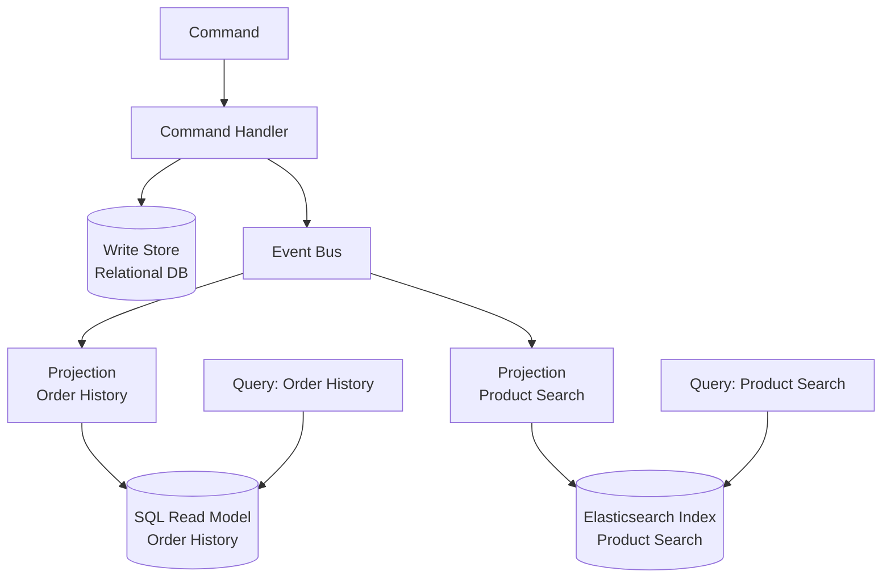

*Este diagrama mostra como os eventos produzidos pelo caminho de comando se ramificam para projeções criadas especificamente, cada uma mantendo seu próprio armazenamento de leitura otimizado para um padrão de consulta específico. Ele ilustra por que o CQRS permite que os lados de leitura e escrita usem diferentes engines de armazenamento e escalem de forma independente.*

Este design tem uma propriedade que arquitetos sêniores devem apreciar: modelos de leitura são **descartáveis e reconstruíveis**. Como uma projeção é uma função pura do fluxo de eventos, você pode excluir um modelo de leitura e reconstruí-lo reproduzindo eventos desde o início. Precisa de um formato de consulta totalmente novo para uma funcionalidade que será lançada no próximo trimestre? Escreva uma nova projeção, reproduza o histórico através dela, e você terá um modelo de leitura totalmente populado sem uma migração de dados arriscada. Essa reconstruibilidade é o argumento prático mais forte para combinar CQRS com o log de eventos, e ela antecipa o Event Sourcing no Capítulo 6.

**Listagem 5.2 — Projeção de eventos idempotente: upserts em um modelo de leitura desnormalizado a partir do fluxo de eventos**

```python
# Idempotent event projection — upserts a denormalized read model from the event stream
# At-least-once delivery safe: duplicate events are detected and skipped

from __future__ import annotations

from dataclasses import dataclass
from datetime import datetime, timezone
from typing import Protocol
from uuid import UUID


# ---------------------------------------------------------------------------
# Domain events consumed by this projection
# (emitted by the command side — identical to what the write handler published)
# ---------------------------------------------------------------------------

@dataclass(frozen=True)
class OrderPlaced:
    event_id: UUID
    order_id: UUID
    customer_id: UUID
    items: list[dict]   # [{"product_id": UUID, "quantity": int, "unit_price": float}]
    total_amount: float
    placed_at: datetime

@dataclass(frozen=True)
class OrderShipped:
    event_id: UUID
    order_id: UUID
    shipped_at: datetime

@dataclass(frozen=True)
class OrderCancelled:
    event_id: UUID
    order_id: UUID
    cancelled_at: datetime


# ---------------------------------------------------------------------------
# Projection handler
# ---------------------------------------------------------------------------

class CustomerOrderViewProjection:
    """
    Maintains the customer_order_view read table.

    Idempotency strategy: each row stores `last_applied_event_id`.
    Before applying any event, the handler checks whether that event_id
    was already applied — duplicates are silently skipped (Chapter 4 pattern).
    """

    def __init__(self, view_store: ViewStore) -> None:
        self._store = view_store

    # ------------------------------------------------------------------
    # Event handlers (one per subscribed event type)
    # ------------------------------------------------------------------

    def on_order_placed(self, event: OrderPlaced) -> None:
        if self._already_applied(event.order_id, event.event_id):
            return   # at-least-once: safe to skip duplicate

        self._store.upsert(
            table="customer_order_view",
            key={"order_id": event.order_id},
            values={
                "customer_id": event.customer_id,
                "status": "placed",
                "total_amount": event.total_amount,
                "item_count": len(event.items),
                "placed_at": event.placed_at,
                "shipped_at": None,
                "last_applied_event_id": event.event_id,
            },
        )

    def on_order_shipped(self, event: OrderShipped) -> None:
        if self._already_applied(event.order_id, event.event_id):
            return

        self._store.upsert(
            table="customer_order_view",
            key={"order_id": event.order_id},
            values={
                "status": "shipped",
                "shipped_at": event.shipped_at,
                "last_applied_event_id": event.event_id,
            },
        )

    def on_order_cancelled(self, event: OrderCancelled) -> None:
        if self._already_applied(event.order_id, event.event_id):
            return

        self._store.upsert(
            table="customer_order_view",
            key={"order_id": event.order_id},
            values={
                "status": "cancelled",
                "last_applied_event_id": event.event_id,
            },
        )

    # ------------------------------------------------------------------
    # Internal helpers
    # ------------------------------------------------------------------

    def _already_applied(self, order_id: UUID, event_id: UUID) -> bool:
        """Return True if this exact event was already written to the view."""
        row = self._store.fetch_one(
            "SELECT last_applied_event_id FROM customer_order_view "
            "WHERE order_id = %s",
            (order_id,),
        )
        if row is None:
            return False
        return row["last_applied_event_id"] == event_id


# ---------------------------------------------------------------------------
# Infrastructure protocol (injected — decouples projection from DB driver)
# ---------------------------------------------------------------------------

class ViewStore(Protocol):
    def upsert(self, table: str, key: dict, values: dict) -> None:
        """INSERT … ON CONFLICT DO UPDATE or equivalent for the target engine."""
        ...

    def fetch_one(self, sql: str, params: tuple) -> dict | None: ...
```

*A projeção é a ponte entre o lado da escrita e o lado da leitura: ela consome eventos de domínio e aplica upserts determinísticos na `customer_order_view` desnormalizada. A idempotência é garantida rastreando o `last_applied_event_id` por linha, tornando a entrega repetida do mesmo evento uma operação segura sem efeito.*

Uma palavra de disciplina: projeções devem ser **idempotentes**, exatamente pelas razões estabelecidas no Capítulo 4. A entrega é at-least-once, portanto o mesmo evento `OrderShipped` pode chegar duas vezes. Uma projeção que incrementa um contador cegamente vai derivar. Use upserts com chave no identificador do agregado, ou rastreie a última versão de evento aplicada por visão, e as duplicatas se tornam inofensivas. Trate o modelo de leitura como um alvo de reprodução determinístico, nunca como um lugar para acumular efeitos colaterais.

> 💡 **Nota do Especialista:** O texto apresenta corretamente a reconstruibilidade do modelo de leitura como uma vantagem prática, mas omite o custo operacional que surpreende cada equipe na primeira vez que o exercita em produção. Reproduzir milhões de eventos por meio de uma projeção não é instantâneo — um log de eventos maduro pode conter centenas de milhões de eventos, e uma reprodução ingênua de thread único pode levar horas ou dias. Sistemas de nível de produção lidam com isso com checkpoints de snapshot (snapshots materializados periódicos do estado da projeção em uma determinada posição de evento), reprodução paralela particionada em segmentos do fluxo de eventos e uma estratégia de "projeção sombra": a nova projeção é construída paralelamente enquanto a antiga continua servindo tráfego, e o tráfego é transferido apenas quando a sombra alcança a posição ao vivo. Equipes que tratam "apenas reproduzir desde o início" como uma saída sem custo descobrem da pior maneira que é uma operação de manutenção que requer planejamento, capacidade e um runbook testado.

<details>
<summary>💡 Nota do Especialista</summary>

O versionamento de projeções é a parte silenciosamente perigosa de sistemas CQRS de longa duração. Quando a lógica de uma projeção muda — um novo campo calculado, uma coluna renomeada, uma agregação alterada — o modelo de leitura construído sob a lógica antiga é invalidado. O padrão da indústria é versionar projeções explicitamente (por exemplo, `CustomerOrderView_v1`, `CustomerOrderView_v2`), executar ambas simultaneamente até que a nova versão se atualize completamente e, em seguida, trocar atomicamente o alvo de leitura do query service e descomissionar a versão antiga. Frameworks como Axon Framework e EventStoreDB fornecem primitivas de versionamento de projeções; implementar o seu próprio requer um registro de projeções e um harness de reprodução controlado. Equipes que ignoram essa disciplina acabam com deriva silenciosa de dados ao corrigir projeções no lugar sem reconstruir — um modelo de leitura que não mais representa fielmente o fluxo de eventos.
</details>

<details>
<summary>💡 Nota do Especialista</summary>

As chaves de idempotência de projeção merecem mais precisão do que "ID de evento ou versão por visão." Em sistemas baseados em broker (Kafka, Kinesis), a tentação é usar o offset de partição do broker como chave de idempotência. Isso é frágil: offsets podem ser reatribuídos após compactação de tópico, rebalanceamento de partição ou recriação de tópico durante recuperação de desastre. A escolha robusta é o **UUID próprio do evento de domínio ou a versão do agregado**, que é estável entre mudanças de infraestrutura. Concretamente, a tabela de projeção deve conter uma coluna `last_applied_event_id`; um upsert só é executado quando o ID do evento recebido é diferente. Isso torna a projeção resiliente a eventos de infraestrutura do broker que a equipe controla separadamente da semântica do domínio.
</details>

<details>
<summary>⚠️ Nota Crítica</summary>

O texto diz "Escreva uma nova projeção, reproduza o histórico através dela, e você terá um modelo de leitura totalmente populado sem uma migração de dados arriscada." Isso é verdade apenas quando o histórico de eventos é curto, os esquemas de eventos foram mantidos estáveis e as projeções não dependem de estado externo. Em sistemas de produção: (1) eventos publicados anos atrás podem carregar nomes de campo diferentes, campos ausentes ou semântica obsoleta — exigindo upcasters versionados antes que a reprodução seja correta; (2) reproduzir bilhões de eventos leva horas a dias, o que pode ser operacionalmente inaceitável; (3) projeções que chamam serviços externos (APIs de preços, serviços de enriquecimento) no momento da projeção não podem ser fielmente reconstruídas porque esse estado externo pode ter mudado ou sido descomissionado. Apresentar a reconstruibilidade como um ponto forte sem qualificação engana o público-alvo sobre os custos operacionais reais.

**Correção sugerida:** Adicione um parágrafo após a afirmação "descartáveis e reconstruíveis" que delimita a garantia: a reconstruibilidade é válida quando os eventos carregam payloads autocontidos e com versão estável e as projeções são funções puras do fluxo de eventos. Sinalize a evolução do esquema de eventos (e a necessidade de upcasters), os limites de throughput de reprodução em escala e o antipadrão de projeções com efeitos colaterais externos como condições que comprometem a garantia.
</details>

## Consistência Entre o Lado da Escrita e o Lado da Leitura

Aqui está o fato que decide se o CQRS se encaixa: o lado da leitura é **eventualmente consistente** com o lado da escrita. Um comando é confirmado e seu evento é publicado, mas a projeção processa esse evento um momento depois — milissegundos geralmente, segundos sob carga, mais tempo se um consumidor estiver atrasado ou se recuperando. Durante essa janela, uma consulta pode retornar estado que ainda não reflete a mudança que o usuário acabou de fazer. Isso é **replication lag** (atraso de replicação), e não é um bug que você pode eliminar; é o preço estrutural de separar os modelos.

O sintoma clássico é a violação de **read-your-own-writes** (leia suas próprias escritas). Um usuário cancela um pedido, a tela atualiza, e o pedido ainda aparece como ativo porque o evento de cancelamento ainda não foi projetado. Os usuários experimentam isso como o sistema "perdendo" sua ação. Você deve projetar isso deliberadamente em vez de esperar que nunca aconteça.

A tabela abaixo apresenta as mitigações práticas e seus custos.

| Técnica | Como funciona | Custo / ressalva |
|---|---|---|
| Aceitar o atraso | Mostrar estado eventual; adicionar uma dica sutil "processando…" na UI | Mais simples; viável apenas onde a desatualização é tolerável |
| Atualização otimista da UI | O cliente renderiza o resultado esperado localmente após um comando | A UI pode divergir da verdade do servidor em caso de falha |
| Roteamento read-your-writes | Rotear as leituras de um usuário para o modelo de escrita brevemente após seu comando | Reintroduz a carga de leitura do lado da escrita que você tentou eliminar |
| Verificação de versão / token | O comando retorna uma versão; a consulta aguarda até que o modelo de leitura a alcance | Adiciona latência e complexidade de coordenação |

**Figura 5.3 — Janela de consistência eventual: leitura desatualizada imediatamente após confirmação do comando**

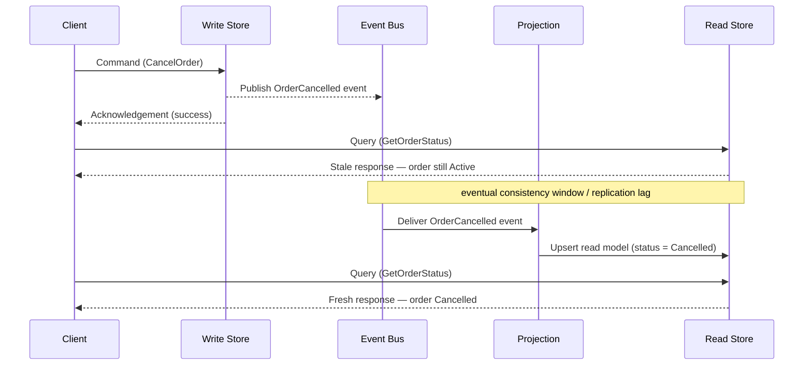

*Este diagrama de sequência torna visível o custo de consistência eventual do CQRS: uma consulta emitida imediatamente após um comando bem-sucedido pode retornar dados desatualizados porque a projeção ainda não processou o evento. Entender essa janela — e a tolerância do negócio a ela — é a decisão de design chave ao adotar CQRS.*

A pergunta central é de **tolerância do negócio**, não de tecnologia. Pergunte, para cada consulta: quão desatualizado pode estar esse dado antes de causar dano real? Uma visão de catálogo de produtos pode atrasar segundos sem consequência alguma. Uma verificação de saldo de conta que autoriza um saque não pode — e esse é um forte sinal para manter essa leitura específica no modelo de escrita fortemente consistente, mesmo em um sistema CQRS de outra forma. CQRS não força *toda* leitura no caminho de consistência eventual. Mantenha as leituras críticas a invariantes próximas ao modelo de escrita e reserve projeções para as cargas de trabalho de relatórios, busca e exibição que dominam o volume, mas toleram atraso.

> 💡 **Nota do Especialista:** A linha "verificação de versão / token" na tabela de consistência subestima como esse padrão é implementado em escala. A forma correta de produção é um **token de consistência causal**: o command handler retorna um token opaco codificando a posição de sequência do evento (por exemplo, um offset global no Kafka, uma revisão de stream no EventStoreDB). O cliente passa esse token na próxima leitura; o query service bloqueia ou faz novas tentativas internamente até que a marca d'água da projeção tenha avançado além do token, e então responde. Isso fornece read-your-own-writes sem jamais tocar o modelo de escrita. AWS AppSync, ksqlDB da Confluent e EventStoreDB todos expõem variantes disso sob nomes como "read-at-revision" ou "after-position." O detalhe de produção chave é que o query service deve expor um código de resposta "ainda não" (HTTP 202 Accepted ou um payload estruturado de retry-after) em vez de retornar silenciosamente dados desatualizados — caso contrário, o cliente não consegue distinguir "o sistema se atualizou" de "a projeção está atrasada."

<details>
<summary>⚠️ Nota Crítica</summary>

O texto caracteriza o replication lag como "milissegundos geralmente, segundos sob carga" — enquadrando-o como uma janela estreita e recuperável. Isso omite o cenário de modo de falha que molda o design de SLA: um consumidor de projeção travado, um evento envenenado causando reprocessamento repetido ou um rebalanceamento de grupo de consumidores do Kafka pode paralisar uma projeção por minutos ou horas, não segundos. Para um público sênior projetando SLAs de produção e estratégias de alertas, a cauda do modo de falha importa mais do que a média do caminho feliz. Citar apenas a latência do caminho feliz convida à subestimação da engenharia de monitoramento, tratamento de dead-letter e alertas de saúde do consumidor.

**Correção sugerida:** Estenda a caracterização do atraso para incluir a cauda de falha: "milissegundos no estado estacionário, segundos sob carga — mas um consumidor de projeção travado ou em loop de falha pode pausar as atualizações por minutos a horas, tornando o monitoramento de atraso de projeção e os alertas uma preocupação operacional de primeira classe, não uma reflexão tardia."
</details>

## Quando CQRS É Engenharia Excessiva

Agora a parte opinativa, e a razão pela qual este capítulo existe. CQRS é uma ferramenta especializada, não uma arquitetura padrão. Aplicado onde não é necessário, ele fabrica complexidade que assombrará a equipe por anos. O trabalho de um arquiteto sênior é reconhecer a diferença antes de escrever a primeira linha de código.

CQRS é **engenharia excessiva** quando seus modelos de leitura e escrita têm essencialmente o mesmo formato. Se uma entidade CRUD simples — um perfil de cliente, um registro de configuração, uma tabela de referência — é escrita e lida por meio de estruturas quase idênticas, não há incompatibilidade de formato para resolver. Dividi-la em dois modelos e uma projeção adiciona uma peça em movimento, uma janela de consistência eventual e um fardo operacional sem resolver nenhum problema real. Uma tabela bem indexada, talvez com uma réplica de leitura, é a resposta correta e sem glamour.

Fique atento a esses sinais de alerta de que CQRS é a escolha errada:

1. **O domínio é CRUD simples.** Os dados são criados, lidos, atualizados e excluídos sem comportamento rico e sem formatos de consulta que divirjam do formato de escrita.
2. **Os volumes de leitura e escrita são comparáveis e modestos.** O benefício de escalonamento independente é o principal ganho; com tráfego balanceado e baixo, há pouco a ganhar.
3. **A equipe não tem maturidade operacional para assincronicidade.** CQRS significa monitorar o atraso de projeção, tratar reproduções e depurar consistência eventual. Sem esse músculo, você herda um sistema sobre o qual não consegue raciocinar.
4. **As partes interessadas não podem tolerar qualquer desatualização.** Se toda leitura deve ser imediatamente consistente, você está lutando contra a mecânica central do padrão e não deveria adotá-lo.

**Dica Pro:** Adote CQRS no nível do *agregado* ou do *bounded context* (contexto delimitado), nunca como uma regra geral para todo o sistema. A maioria dos sistemas reais é híbrida — alguns contextos de alto valor justificam CQRS completo com projeções, enquanto a maioria permanece em CRUD confortável. Aplicar o padrão seletivamente é a marca do julgamento; aplicá-lo em todo lugar é a marca do dogma.

A heurística honesta: alcance o CQRS quando uma incompatibilidade de formato genuína, uma grande assimetria de leitura/escrita ou a necessidade de muitos modelos de leitura divergentes tornam um único modelo doloroso — e apenas então. Se você não consegue nomear a dor específica, ainda não tem razão para pagar o preço.

<details>
<summary>💡 Nota do Especialista</summary>

Na prática, o caminho de adoção mais seguro é incremental em vez de antecipado. Uma equipe que introduz CQRS desde o primeiro dia em um domínio não testado quase sempre o aplica em excesso — os bounded contexts são especulativos, os formatos de consulta são desconhecidos e as projeções que são construídas acabam espelhando o modelo de escrita de qualquer forma. A abordagem validada em campo é começar com um modelo compartilhado sob uma réplica de leitura, instrumentar padrões de consulta, identificar os dois ou três formatos de leitura que genuinamente divergem do modelo de escrita sob carga real e extrair apenas esses em projeções. Esse caminho de "migrar pela dor" é dramaticamente menos arriscado do que projetar CQRS antecipadamente, e mantém a maior parte da base de código no regime CRUD mais simples até que evidências reais justifiquem o custo.
</details>

<details>
<summary>💡 Nota do Especialista</summary>

Os sinais de alerta do texto são sólidos, mas um modo de falha comum em ambientes corporativos com microserviços intensivos está faltando: projeções entre streams. Quando os agregados de domínio são particionados de forma muito granular — serviços separados para Order, OrderLine e Fulfillment — as projeções para telas de UI devem unir eventos de múltiplos streams. Isso é efetivamente uma junção distribuída, e introduz um risco de consistência secundário: a projeção para uma CustomerOrderView pode receber OrderPlaced do stream A antes do FulfillmentScheduled correlacionado do stream B, exigindo lógica de buffering, timeout e compensação para eventos que nunca chegam. Nesse ponto, a projeção não é mais um consumidor simples, mas um mecanismo de correlação com estado. Isso é um forte sinal de que os bounded contexts foram desenhados incorretamente, em vez de que o CQRS deveria ser estendido para lidar com a complexidade.
</details>

## Principais Conclusões

- O **problema de incompatibilidade de formato** é a razão de existir do CQRS: o modelo normalizado que impõe invariantes do lado da escrita raramente é o formato desnormalizado que serve leituras de forma eficiente.
- CQRS separa o **caminho de comando** (muda estado, emite eventos, retorna pouco) do **caminho de consulta** (lê modelos de leitura criados especificamente, nunca toca o armazenamento de escrita), permitindo que cada um escale e evolua de forma independente.
- **Projeções** são consumidores de eventos idempotentes que derivam modelos de leitura do fluxo de eventos, tornando os modelos de leitura descartáveis e reconstruíveis por reprodução.
- O lado da leitura é **eventualmente consistente**; replication lag e read-your-own-writes são custos estruturais para os quais se deve projetar, não bugs a serem corrigidos. Combine cada leitura com a tolerância de negócio para desatualização.
- CQRS é **engenharia excessiva** para CRUD simples com formatos de leitura/escrita correspondentes. Adote-o por agregado ou bounded context, apenas onde uma dor concreta justifica a complexidade adicionada.

## O Que Vem a Seguir

Modelos de leitura reconstruíveis sugeriram uma ideia mais profunda — armazenar estado como os próprios eventos; o Capítulo 6 torna esse salto explícito com Event Sourcing.

<!-- ASSEMBLY COMPLETE
  Chapter: CQRS — Separating Reads and Writes
  Code blocks resolved: 2 / 2
  Diagrams resolved: 3 / 3
  Expert callouts (inline): 2
  Expert callouts (collapsed): 5
  Critical callouts (inline): 1
  Critical callouts (collapsed): 4
  Unresolved markers: 0
-->


# Capítulo 6: Event Sourcing — Estado como uma Sequência de Eventos

## Declaração do Problema Inicial

O Capítulo 5 deixou um fio solto. Ele mostrou que os modelos de leitura são descartáveis — você pode jogá-los fora e reconstruí-los reproduzindo eventos. Essa afirmação assumiu silenciosamente algo que nunca justificamos: que os eventos ainda existem em algum lugar, em ordem, para sempre. Se as projeções podem ser reconstruídas a partir de um log de eventos, então esse log, e não o modelo de leitura, é a real fonte da verdade.

Este capítulo formaliza essa ideia. **Event Sourcing (armazenamento baseado em eventos)** é o padrão em que o estado autoritativo de uma entidade não é uma linha que você atualiza, mas a sequência completa e ordenada de eventos que aconteceram com ela. Você não armazena o saldo atual de uma conta. Você armazena cada depósito e cada saque, e calcula o saldo quando precisar.

Para arquitetos sênior, o apelo é óbvio e o perigo é sutil. O Event Sourcing fornece uma trilha de auditoria perfeita, consultas temporais e poder de depuração que sistemas tradicionais não conseguem igualar. Ele também impõe restrições que duram por toda a vida do sistema — schemas que você nunca pode deletar completamente, um modelo mental que toda a sua equipe deve compartilhar, e custos operacionais que só aparecem no terceiro ano. Este capítulo ensina ambos os lados com honestidade.

## O Problema da Verdade e da História

Sistemas tradicionais têm um problema de memória: eles esquecem. Considere uma tabela bancária clássica com uma única coluna `balance`. Quando um cliente saca dinheiro, você executa um `UPDATE` e o saldo anterior se vai. O banco de dados agora contém um fato — "o saldo é 500" — mas destruiu o histórico que o produziu.

Este é o **problema da verdade e da história**: um sistema que armazena apenas o estado atual pode responder *o que é verdade agora*, mas não *como se tornou verdade*. Na maior parte do tempo ninguém faz a segunda pergunta. Então um auditor, um regulador ou um cliente insatisfeito o faz, e a resposta é um encolher de ombros.

Considere o que o modelo de atualização in-place descarta em cada execução.

*Figura: Comparação lado a lado do armazenamento orientado a estado versus armazenamento com Event Sourcing — o modelo orientado a estado sobrescreve o histórico em cada UPDATE, enquanto o modelo com Event Sourcing deriva o saldo atual de um log imutável somente para adição.*

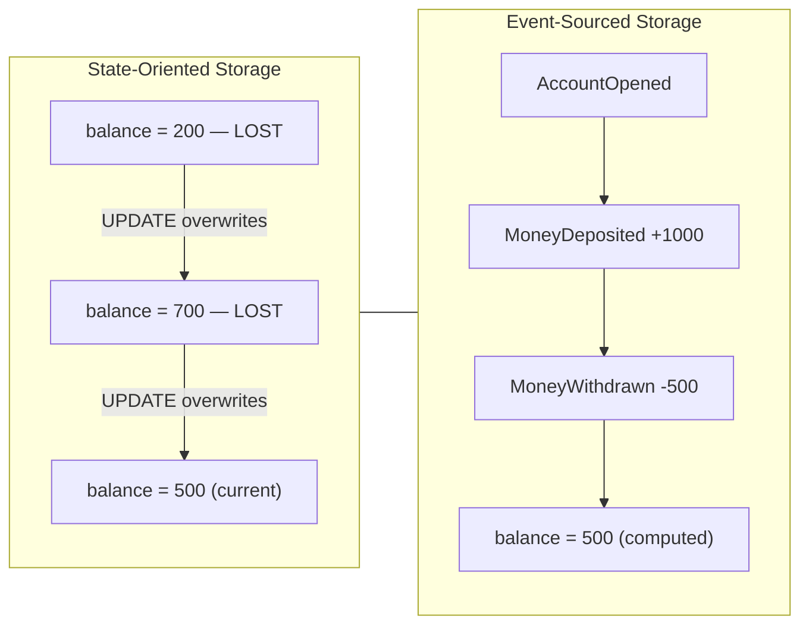

A abordagem orientada a estado otimiza o presente à custa do passado. O Event Sourcing inverte essa prioridade. Ele trata cada **evento** — um fato imutável do passado, exatamente como definido no Capítulo 1 — como a unidade durável de verdade. O estado atual se torna um *valor derivado*, recalculado sob demanda a partir dos eventos.

A consequência é estratégica, não apenas técnica. Em um sistema orientado a estado, o histórico é uma reflexão tardia que você adiciona com tabelas de auditoria e triggers, e essas tabelas de auditoria estão sempre ligeiramente erradas. Em um sistema com Event Sourcing, o histórico *é* o modelo de armazenamento. Você não pode ter um histórico incorreto, porque o histórico é a única coisa que você escreveu. A exatidão da trilha de auditoria deixa de ser um recurso que você mantém e se torna uma propriedade da arquitetura.

Esse é o acordo que o padrão oferece: você abre mão da conveniência de ler o estado atual diretamente, e em troca nunca perde um fato.

> ⚠️ **Nota Crítica:** O texto afirma "você não pode ter um histórico incorreto, porque o histórico é a única coisa que você escreveu" e enquadra a exatidão da trilha de auditoria como "uma propriedade da arquitetura." Essa é uma generalização consequente e exagerada. Bugs na camada de aplicação — emitir um evento `MoneyWithdrawn` com o valor errado, escrever no ID de stream errado, ou disparar um manipulador de comando duas vezes — produzem eventos incorretos que são persistidos permanentemente com a mesma garantia de imutabilidade que os eventos corretos. O event store garante append-only e ordenação, não a exatidão do domínio. Um engenheiro sênior que internaliza essa afirmação pode perigosamente desprioritizar os testes de exatidão do manipulador de comando e os controles de idempotência, com base na crença de que "o store garante a exatidão." A arquitetura garante que cada evento escrito é preservado de forma durável exatamente como foi escrito, eliminando sobrescritas acidentais — mas a exatidão do que é escrito permanece inteiramente responsabilidade da aplicação. Manipuladores de comando idempotentes e guardas de entrega at-least-once são essenciais para evitar que eventos duplicados ou incorretos se tornem fatos permanentes.

<details>
<summary>💡 Nota do Especialista</summary>
O texto descarta corretamente as tabelas de auditoria como "sempre ligeiramente erradas", mas os modos de falha vão mais fundo do que a maioria das equipes espera. Triggers de auditoria não capturam estados intermediários dentro de transações com múltiplos comandos — se uma stored procedure atualiza três linhas e dispara um trigger por linha, o log do trigger registra as alterações individuais de cada linha, mas não a intenção de negócio única que as causou. Mais insidiosamente, quando o schema muda (uma coluna é renomeada ou removida), a definição do trigger silenciosamente quebra ou começa a registrar null para esse campo, sem que nenhum erro seja levantado. As equipes descobrem isso apenas durante uma auditoria, meses depois, quando o log tem uma lacuna sistemática que ninguém notou. O Event Sourcing evita isso completamente porque a intenção — o evento de negócio — é o que é escrito, não a mutação da linha.
</details>

## O Event Store e o Log Somente para Adição

O banco de dados que armazena esses eventos é chamado de **event store (armazém de eventos)**. Não é uma tabela de uso geral na qual você simplesmente insere dados — é um log especializado com duas regras que definem todo o padrão.

Primeiro, o event store é **append-only (somente para adição)**. Você pode adicionar eventos ao final. Você nunca pode atualizar ou deletar um evento já escrito. Um evento registra algo que aconteceu, e o passado não muda. Este é o mesmo princípio de imutabilidade do Capítulo 1, agora aplicado na camada de persistência.

Segundo, os eventos são agrupados em **streams (fluxos)**. Um stream é a sequência ordenada de todos os eventos de uma entidade — por exemplo, todos os eventos da conta `acc-123`. O stream é a unidade de consistência e a unidade de reconstrução.

Um schema mínimo de event store precisa apenas de algumas colunas para aplicar essas regras.

*Código: DDL SQL para uma tabela mínima de event store — `global_position` fornece uma ordem total monotônica em todos os streams; `UNIQUE (stream_id, version)` garante a ordenação por stream e funciona como guarda de concorrência otimista sem bloqueio no nível da aplicação.*

```python
# ⚠️ LANGUAGE MISMATCH: original was sql, regenerated as python
# Python 3.10+ — event store schema setup using psycopg2
# global_position provides monotone total order across all streams;
# UNIQUE (stream_id, version) enforces per-stream ordering and acts as the
# optimistic concurrency guard with no application-level locking.

import psycopg2

_CREATE_TABLE = """
CREATE TABLE IF NOT EXISTS event_store (
    global_position  BIGSERIAL    PRIMARY KEY,
    stream_id        TEXT         NOT NULL,
    version          INTEGER      NOT NULL,
    event_type       TEXT         NOT NULL,
    payload          JSONB        NOT NULL,
    metadata         JSONB        NOT NULL DEFAULT '{}',
    occurred_at      TIMESTAMPTZ  NOT NULL DEFAULT now(),

    CONSTRAINT uq_stream_version UNIQUE (stream_id, version)
);
"""

_CREATE_INDEX_STREAM = """
CREATE INDEX IF NOT EXISTS idx_event_store_stream
    ON event_store (stream_id, version ASC);
"""

_CREATE_INDEX_GLOBAL = """
CREATE INDEX IF NOT EXISTS idx_event_store_global
    ON event_store (global_position ASC);
"""


def setup_event_store(conn) -> None:
    """
    Create the event_store table and supporting indexes if they do not exist.
    Safe to call on an already-initialised database (uses IF NOT EXISTS).

    Fast stream replay: idx_event_store_stream fetches all events for a stream
    in version order. Subscription catch-up: idx_event_store_global lets
    consumers track their last-seen global_position.
    """
    with conn:
        with conn.cursor() as cur:
            cur.execute(_CREATE_TABLE)
            cur.execute(_CREATE_INDEX_STREAM)
            cur.execute(_CREATE_INDEX_GLOBAL)
```

A coluna `version` é a heroína silenciosa desse schema. Ela numera os eventos dentro de um stream: 1, 2, 3, e assim por diante. A restrição `UNIQUE (stream_id, version)` faz dois trabalhos ao mesmo tempo. Ela garante uma ordem total dentro de cada stream e oferece **controle de concorrência otimista** de forma gratuita.

Veja como a verificação de concorrência funciona. Quando um manipulador de comando carrega um stream, ele observa a versão máxima atual — digamos, 7. Ele processa o comando e tenta adicionar um novo evento como versão 8. Se outro processo já escreveu a versão 8 nesse meio-tempo, a restrição única rejeita a inserção. O manipulador sabe que sua decisão foi baseada em dados desatualizados e tenta novamente. Sem bloqueios, sem espera — apenas uma restrição fazendo seu trabalho.

*Código: Adição com concorrência otimista — lança `ConcurrencyConflictError` quando outro escritor já reivindicou a versão esperada; o chamador deve recarregar o stream e tentar novamente o comando.*

```python
# Python 3.10+ — optimistic concurrency append using psycopg2 and PostgreSQL
# Raises ConcurrencyConflictError when another writer has already claimed the expected version.

from __future__ import annotations

import json
from dataclasses import dataclass, field
from typing import Any

import psycopg2
from psycopg2 import errors as pg_errors


@dataclass
class EventRecord:
    stream_id:  str
    event_type: str
    payload:    dict[str, Any]
    metadata:   dict[str, Any] = field(default_factory=dict)


class ConcurrencyConflictError(Exception):
    """Raised when another writer already appended at the expected version.
    The caller should reload the stream and retry the command."""


def append_events(
    conn,
    stream_id:        str,
    events:           list[EventRecord],
    expected_version: int,          # highest version seen when the command was loaded
) -> None:
    """
    Appends `events` to `stream_id` starting at expected_version + 1.
    All inserts run inside a single transaction; a unique-constraint violation
    signals a concurrent write and triggers a rollback.
    """
    with conn:                       # psycopg2 context manager: commit or rollback
        with conn.cursor() as cur:
            for offset, event in enumerate(events):
                next_version = expected_version + 1 + offset  # 1-based, increments per event

                try:
                    cur.execute(
                        """
                        INSERT INTO event_store
                            (stream_id, version, event_type, payload, metadata)
                        VALUES (%s, %s, %s, %s::jsonb, %s::jsonb)
                        """,
                        (
                            stream_id,
                            next_version,
                            event.event_type,
                            json.dumps(event.payload),
                            json.dumps(event.metadata),
                        ),
                    )
                except pg_errors.UniqueViolation:
                    # Another process already wrote at this version; the caller must retry.
                    raise ConcurrencyConflictError(
                        f"Concurrency conflict on stream '{stream_id}': "
                        f"expected version {expected_version} is stale. Reload and retry."
                    )
```

Uma palavra de realismo para arquitetos que escolhem infraestrutura. Você pode construir um event store em um PostgreSQL simples, e para muitos sistemas corporativos você deveria — a familiaridade operacional vale mais do que qualquer recurso especializado. Stores com propósito específico como EventStoreDB ou Axon Server, ou primitivas em nuvem como DynamoDB com um design de chave de partição mais chave de ordenação, adicionam ferramental de subscription e projeção. Mas nenhum deles muda as duas regras acima. Append-only e ordenado por stream são o jogo inteiro.

> 💡 **Nota do Especialista:** A coluna `global_position` no schema é fácil de implementar incorretamente no PostgreSQL com um `BIGSERIAL` ou `SEQUENCE`, criando um risco silencioso em produção. Sequências no PostgreSQL são não-transacionais por design: se uma transação insere um evento e em seguida faz rollback, o valor da sequência é consumido e não reutilizado. Consumidores que leem `global_position` em ordem verão lacunas (por exemplo, posições 1, 2, 4 — a posição 3 foi um insert com rollback) e devem decidir se uma lacuna significa "ainda não confirmado" ou "permanentemente ausente." A correção padrão em produção é usar uma abordagem de captura de dados de alterações baseada em replication slot (por exemplo, `pg_logical`) ou rastrear a ordem global por meio de uma tabela de contador separada com proteção de bloqueio, descarregada apenas no commit. O EventStoreDB contorna isso ao gerenciar a atribuição de posições dentro de seu próprio log de transações. Escolha sua infraestrutura sabendo que esse problema de lacuna existe em stores SQL simples.

<details>
<summary>💡 Nota do Especialista</summary>
Ao comparar EventStoreDB com um store PostgreSQL feito internamente, o diferenciador prático para empresas é a semântica de subscription, não o armazenamento. As subscriptions persistentes do EventStoreDB suportam um modelo de consumidor concorrente por grupo nativamente, mas o mecanismo de projeção deles (historicamente projeções server-side baseadas em JavaScript) introduz uma carga operacional — um segundo runtime para monitorar, versionar e depurar — que a maioria das equipes corporativas subestima. Para organizações que já padronizaram no Kafka, tratar o event store como o log append-only autoritativo e o Kafka como a camada de subscription/fan-out é um híbrido comum que preserva a familiaridade. As duas camadas têm garantias diferentes (adição exactly-once versus entrega at-least-once) e devem ser conectadas de acordo.
</details>

<details>
<summary>⚠️ Nota Crítica</summary>
A afirmação "sem bloqueios, sem espera — apenas uma restrição fazendo seu trabalho" exagera o benefício da concorrência otimista sob contenção. Em cenários de escrita de alta taxa de transferência em um único stream de agregado — por exemplo, uma conta compartilhada recebendo eventos de pagamento concorrentes — cada escritor em conflito vai tentar novamente. Sob contenção sustentada, isso degrada para serialização efetiva: todos os escritores giram, recarregam o stream, reprocessam o comando e tentam novamente a inserção. Tempestades de tentativas podem ser piores do que uma fila justa com um único bloqueio, e a aplicação deve limitar as tentativas e tratar erros persistentes de conflito de concorrência. Esse modo de falha é invisível no caminho feliz, mas relevante em produção. A concorrência otimista funciona melhor quando escritores conflitantes no mesmo stream são raros. Para streams quentes, considere deduplicação de comandos no nível do manipulador, particionamento de stream ou estratégias de bloqueio explícito, e sempre proteja contra tentativas ilimitadas com uma contagem máxima de retentativas e backoff.
</details>

## Reconstrução de Estado e Agregados

Se você nunca armazena o estado atual, como o obtém? Você o calcula. O processo é chamado de **reconstrução (reconstruction)** ou **reidratação (rehydration)**: você lê o stream do início e aplica cada evento, em ordem, a um objeto fresco na memória. Esse objeto é o **agregado (aggregate)** — o limite de consistência do Domain-Driven Design que detém as regras de negócio de uma entidade.

A reconstrução é um fold (dobra). Você começa com um agregado vazio e, evento por evento, dobra cada fato no estado do agregado.

*Código: Agregado de conta com separação estrita de comando/apply — `rehydrate()` dobra o stream de eventos completo em um agregado ativo em O(n) no comprimento do stream.*

```python
# Python 3.10+ — Account aggregate with strict command / apply separation
# rehydrate() folds the full event stream into a live aggregate; O(n) in stream length.

from __future__ import annotations

from dataclasses import dataclass, field
from typing import Union


# ---------------------------------------------------------------------------
# Immutable event types — historical facts, never mutated after creation
# ---------------------------------------------------------------------------

@dataclass(frozen=True)
class AccountOpened:
    account_id: str
    owner:      str

@dataclass(frozen=True)
class MoneyDeposited:
    account_id: str
    amount:     int  # in cents; always positive

@dataclass(frozen=True)
class MoneyWithdrawn:
    account_id: str
    amount:     int  # in cents; always positive

DomainEvent = Union[AccountOpened, MoneyDeposited, MoneyWithdrawn]


# ---------------------------------------------------------------------------
# Aggregate
# ---------------------------------------------------------------------------

@dataclass
class Account:
    account_id: str  = ""
    owner:      str  = ""
    balance:    int  = 0    # in cents
    version:    int  = 0
    _pending:   list[DomainEvent] = field(default_factory=list, repr=False)

    # ---- Command methods: validate invariants, then record a new event ----

    @classmethod
    def open(cls, account_id: str, owner: str) -> "Account":
        """Command: open a new account."""
        aggregate = cls()
        aggregate._record(AccountOpened(account_id=account_id, owner=owner))
        return aggregate

    def deposit(self, amount: int) -> None:
        """Command: credit the account."""
        if amount <= 0:
            raise ValueError(f"Deposit amount must be positive, got {amount}.")
        self._record(MoneyDeposited(account_id=self.account_id, amount=amount))

    def withdraw(self, amount: int) -> None:
        """Command: debit the account; rejects if funds are insufficient."""
        if amount <= 0:
            raise ValueError(f"Withdrawal amount must be positive, got {amount}.")
        if amount > self.balance:
            raise ValueError(
                f"Insufficient funds: balance={self.balance} cents, requested={amount} cents."
            )
        self._record(MoneyWithdrawn(account_id=self.account_id, amount=amount))

    # ---- Apply methods: pure state mutation — NO validation, NEVER reject ----

    def _apply(self, event: DomainEvent) -> None:
        """Mutate in-memory state from an already-decided event. Must never raise."""
        match event:
            case AccountOpened(account_id=aid, owner=owner):
                self.account_id = aid
                self.owner      = owner
                self.balance    = 0
            case MoneyDeposited(amount=amount):
                self.balance += amount
            case MoneyWithdrawn(amount=amount):
                self.balance -= amount

    def _record(self, event: DomainEvent) -> None:
        """Apply a new event to in-memory state and stage it for persistence."""
        self._apply(event)
        self._pending.append(event)

    # ---- Rehydration: reconstruct from a stored event stream ----

    @classmethod
    def rehydrate(cls, events: list[DomainEvent]) -> "Account":
        """
        Fold a complete event stream into a live Account aggregate.
        Time complexity: O(n) where n = len(events).
        """
        aggregate = cls()
        for i, event in enumerate(events, start=1):
            aggregate._apply(event)  # apply history — no validation
            aggregate.version = i    # track stream position for optimistic concurrency
        return aggregate
```

Observe a disciplina que isso impõe. Existem exatamente dois tipos de métodos no agregado, e confundi-los é o bug mais comum no Event Sourcing.

1. **Métodos de comando** (por exemplo, `withdraw`) contêm as regras de negócio. Eles validam invariantes — "você não pode sacar mais do que o saldo" — e, se a regra for mantida, eles *produzem um novo evento*. Eles decidem o que deve acontecer.
2. **Métodos de apply** (por exemplo, `applyMoneyWithdrawn`) não contêm nenhuma lógica de negócio. Eles apenas mutam o estado na memória a partir de um evento que *já aconteceu*. Eles registram o que de fato aconteceu.

A regra é absoluta: **métodos de apply nunca devem rejeitar um evento ou conter validação.** O evento é um fato histórico. Recusar-se a aplicá-lo durante a reconstrução significaria recusar-se a reconhecer o passado, e o estado reconstruído divergiria silenciosamente da realidade. Toda validação vive nos métodos de comando, antes de o evento existir.

*Figura: Diagrama de sequência de uma escrita — desde o carregamento do stream até a reidratação do agregado, validação de invariantes e adição com controle de concorrência otimista, mostrando onde a validação vive e onde o guarda de concorrência da restrição única dispara.*

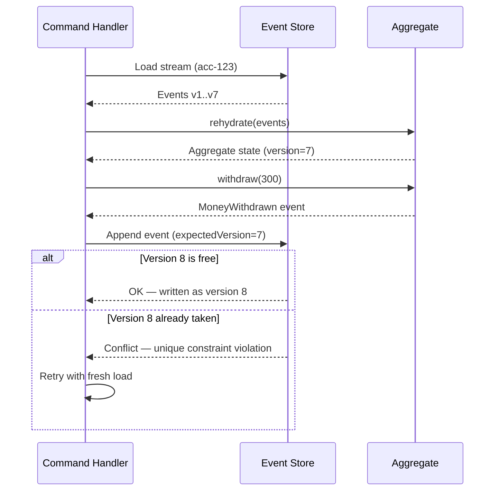

É aqui que o Event Sourcing e o CQRS (Segregação de Responsabilidade de Comando e Consulta) do Capítulo 5 se encaixam. O lado de comando reconstrói o agregado para tomar uma decisão e emite um evento. Esse mesmo evento alimenta as projeções que constroem os modelos de leitura. Um evento, escrito uma vez, serve tanto para a verdade quanto para a consulta. O log de eventos se torna a fonte única a partir da qual os modelos de leitura descartáveis do CQRS são reconstruídos.

<details>
<summary>💡 Nota do Especialista</summary>
O texto descreve os métodos de comando como métodos que "produzem um novo evento", mas o padrão de implementação padrão adiciona um detalhe estrutural que muda como o agregado interage com seu repositório: o agregado mantém uma lista interna de "eventos não confirmados." Quando um método de comando decide aceitar uma ação de negócio, ele chama seu próprio `apply()` internamente — para atualizar o estado na memória imediatamente — e anexa o evento a essa lista não confirmada. O repositório, após chamar o comando, lê a lista não confirmada, anexa esses eventos ao store na versão esperada e então limpa a lista. Esse design em duas fases (apply agora, descarregar depois) é por que os métodos de comando podem encadear decisões dentro de uma única unidade de trabalho e por que o agregado nunca sabe sobre o banco de dados. Omitir esse padrão leva equipes a recarregar o agregado entre comandos na mesma requisição ou a chamar `apply()` duas vezes (uma no comando, outra durante a reconstrução), causando bugs de dupla mutação.
</details>

<details>
<summary>⚠️ Nota Crítica</summary>
A regra "métodos de apply nunca devem rejeitar um evento ou conter validação" é descrita como absoluta, mas não aborda o cenário de compatibilidade futura onde um agregado encontra um tipo de evento introduzido por uma versão mais nova da aplicação que o código atual não reconhece. Ignorar silenciosamente tipos de evento desconhecidos durante a reidratação pode produzir um estado na memória sutilmente errado; falhar completamente em tipos desconhecidos quebra a reconstrução inteiramente. Isso é um problema operacional real durante deploys contínuos e migrações de schema. Os métodos de apply não devem rejeitar eventos *conhecidos* nem aplicar validação de negócio a eles. Para tipos de evento desconhecidos ou não reconhecidos, a estratégia recomendada é ignorar e registrar em log com uma verificação de consciência de versão. O Capítulo 8 trata formalmente do versionamento de schema.
</details>

## Snapshots e Otimização de Replay

A reconstrução tem uma falha óbvia, e todo cético a identifica imediatamente. Se uma conta acumulou 200.000 eventos ao longo de dez anos, você deve ler e dobrar todos esses 200.000 eventos cada vez que alguém verificar o saldo? Nesse volume, a reconstrução transforma uma operação de milissegundos em uma de vários segundos.

A resposta é o **snapshot (instantâneo)**. Um snapshot é uma cópia em cache do estado do agregado em uma versão específica — um checkpoint que diz "na versão 50.000, o saldo era 12.340." A reconstrução então muda: carregue o snapshot mais recente, depois reproduza apenas os eventos que vieram *depois* dele.

*Código: Reidratação baseada em snapshot com fallback para replay completo — o snapshot é uma otimização descartável; deletar todos os snapshots deve deixar o comportamento inalterado.*

```python
# Python 3.10+ — snapshot-based rehydration with full-replay fallback
# Snapshot is a disposable optimisation; deleting all snapshots must leave behaviour unchanged.

from __future__ import annotations

import json
from dataclasses import dataclass
from typing import Any, Optional

# Re-uses Account, DomainEvent defined in the aggregate example above.


# ---------------------------------------------------------------------------
# Snapshot data contract
# ---------------------------------------------------------------------------

@dataclass
class Snapshot:
    stream_id: str
    version:   int            # aggregate version at time the snapshot was taken
    state:     dict[str, Any] # serialised aggregate fields (excludes _pending)


# ---------------------------------------------------------------------------
# Storage helpers — replace with real persistence in production
# ---------------------------------------------------------------------------

def load_latest_snapshot(stream_id: str) -> Optional[Snapshot]:
    """Return the most recent snapshot for the stream, or None if none exists."""
    raise NotImplementedError  # implement against your snapshot store


def load_events_after_version(stream_id: str, after_version: int) -> list[DomainEvent]:
    """Return events where version > after_version, ordered ascending by version."""
    raise NotImplementedError  # implement against the event_store table


# ---------------------------------------------------------------------------
# Rehydration with snapshot shortcut
# ---------------------------------------------------------------------------

def rehydrate_from_snapshot(stream_id: str) -> Account:
    """
    Reconstruct an Account aggregate, using a snapshot when available.

    Steps:
      1. Load the most recent snapshot for the stream.
      2. If found: restore aggregate state from the snapshot, then replay
         only the events written after snapshot.version.
      3. If not found: fall back to full replay from the start of the stream.

    The snapshot is purely an optimisation — deleting it produces the same
    aggregate state, just more slowly.
    """
    snapshot: Optional[Snapshot] = load_latest_snapshot(stream_id)

    if snapshot is not None:
        # Fast path: restore from checkpoint, then apply the delta only
        aggregate = Account(
            account_id=snapshot.state["account_id"],
            owner=snapshot.state["owner"],
            balance=snapshot.state["balance"],
        )
        aggregate.version = snapshot.version
        delta_events = load_events_after_version(stream_id, after_version=snapshot.version)
    else:
        # Slow path: no snapshot exists — replay the full stream from scratch
        aggregate = Account()
        delta_events = load_events_after_version(stream_id, after_version=0)

    # Fold the delta (or full stream) onto the aggregate state
    for event in delta_events:
        aggregate._apply(event)   # pure mutation, no validation
        aggregate.version += 1

    return aggregate


def maybe_take_snapshot(aggregate: Account, interval: int = 100) -> Optional[Snapshot]:
    """
    Policy: create a new snapshot every `interval` events.
    Caller is responsible for persisting the returned snapshot.
    Returns None when the version does not fall on a snapshot boundary.
    """
    if aggregate.version > 0 and aggregate.version % interval == 0:
        return Snapshot(
            stream_id=aggregate.account_id,
            version=aggregate.version,
            state={
                "account_id": aggregate.account_id,
                "owner":      aggregate.owner,
                "balance":    aggregate.balance,
            },
        )
    return None
```

Dois pontos de design separam uma estratégia de snapshot que funciona de uma quebrada.

- **Um snapshot é uma otimização derivada, nunca uma fonte de verdade.** Você deve ser capaz de deletar cada snapshot no sistema e reconstruí-los todos apenas a partir dos eventos. Se deletar snapshots perder dados, você reintroduziu acidentalmente o modelo orientado a estado que estava tentando evitar.
- **Crie snapshots em uma cadência, não em cada escrita.** Uma política comum é um snapshot a cada *N* eventos por stream — digamos, a cada 100. O número é um parâmetro de ajuste, não uma constante.

A tabela a seguir enquadra o trade-off que você está efetivamente ajustando.

| Frequência de snapshot | Custo de replay por carregamento | Overhead de armazenamento e escrita | Melhor adequação |
|---|---|---|---|
| Nunca (replay puro) | Cresce sem limite | Nenhum | Streams curtos, baixas contagens de eventos |
| A cada N eventos (ex: 100) | Limitado, pequeno | Moderado | A maioria dos sistemas em produção |
| A cada evento | Próximo de zero | Alto; aproxima-se do armazenamento de estado | Quase nunca — um code smell |

A última linha merece uma **Dica Pro**. Se seu instinto é criar snapshot em cada escrita individual, pare. Você reconstruiu um banco de dados de atualização in-place com passos extras e pior desempenho. O ponto dos snapshots é tornar o replay *aceitável*, não eliminá-lo. Recorra a snapshots apenas quando a medição provar que a reconstrução é muito lenta — e para agregados com vida curta e poucos eventos, talvez você nunca precise deles.

> 💡 **Nota do Especialista:** Um bug em qualquer método `apply()` que passa despercebido por semanas vai corromper silenciosamente cada snapshot gerado durante esse período. Quando o bug é corrigido, a lógica de apply corrigida produz um estado na memória diferente do que o snapshot armazenado reflete, e a reconstrução que começa a partir de um snapshot desatualizado produzirá resultados errados sem gerar um erro — o snapshot corrompido é um JSON estruturalmente válido. A correção em produção é anexar um `snapshot_schema_version` (um inteiro que você incrementa sempre que a lógica de apply muda de semântica) a cada linha de snapshot. No carregamento, se `snapshot_schema_version` não corresponder à versão atual do código, descarte o snapshot e faça fallback para replay completo. Isso adiciona uma constante de configuração e uma comparação, mas torna a invalidação de snapshots automática e segura durante os deploys.

<details>
<summary>💡 Nota do Especialista</summary>
O texto enquadra o snapshotting como um parâmetro de ajuste na leitura, mas ele importa igualmente no caminho de escrita. Uma implementação ingênua cria um snapshot de forma síncrona dentro da mesma transação que adiciona o evento — dobrando a latência de escrita a cada N-ésimo evento. Sistemas em produção quase universalmente tornam o snapshotting assíncrono: um worker em background (ou uma projeção que lê o stream de eventos) detecta que um stream avançou além de um limite e escreve o snapshot fora de banda. O caminho de comando permanece rápido e previsível; o snapshot pode atrasar alguns segundos, o que é aceitável porque a reconstrução sempre volta ao replay se um snapshot estiver ausente ou desatualizado.
</details>

<details>
<summary>⚠️ Nota Crítica</summary>
A discussão sobre estratégia de snapshot omite uma questão operacional crítica: quem escreve o snapshot e o que acontece se essa escrita falhar? Se o manipulador de comando escreve o snapshot de forma síncrona após adicionar um evento, uma falha na escrita do snapshot não deve ser tratada como uma falha do comando — ou o processamento do comando se torna não confiável. Se os snapshots são escritos por um processo assíncrono em background, há uma janela em que o store de snapshots está desatualizado ou vazio e o replay completo é silenciosamente necessário. Os snapshots devem ser escritos como operações de melhor esforço, não transacionais, que nunca bloqueiam nem falham o pipeline de comando. O código deve sempre fazer fallback para replay completo se um snapshot estiver faltando ou sua versão não estiver presente no event store, tratando o snapshot como um cache consultivo em vez de uma dependência obrigatória.
</details>

## Custos de Longo Prazo e Restrições de Design

O Event Sourcing não é uma técnica que você experimenta por um sprint e abandona de forma limpa. Uma vez que eventos reais se acumulam, o padrão se torna estruturalmente crítico, e seus custos são estruturais. Um arquiteto honesto os avalia antes de adotar, não depois.

**Eventos são permanentes, então seus schemas são permanentes.** Uma linha que você não gosta mais pode ser migrada com um `ALTER TABLE`. Um evento escrito em 2024 ainda será lido durante a reconstrução em 2030, exatamente como foi escrito. Você não pode migrar o passado. Você acomoda formatos antigos por meio de versionamento e upcasting — o tema completo do Capítulo 8 — e essa disciplina é obrigatória, não opcional.

**Deleção se torna um problema real de design.** Regulamentações como o GDPR concedem um direito ao apagamento, que colide diretamente com um log imutável e somente para adição. Você não pode simplesmente deletar os eventos. A resposta padrão é o **crypto-shredding (destruição criptográfica)**: criptografe os dados pessoais por sujeito e delete a chave para tornar os dados irrecuperáveis. Isso deve ser projetado desde o primeiro evento, porque você não pode adicionar criptografia retroativamente a fatos já escritos em texto claro.

**Consultar o estado atual requer o lado de leitura.** Como o estado é derivado, você não pode escrever um simples `SELECT balance FROM accounts`. Você precisa de projeções e modelos de leitura — que é precisamente por que o Event Sourcing e o CQRS são tão frequentemente adotados juntos. Escolher o Event Sourcing efetivamente o compromete com o caminho de leitura do CQRS do Capítulo 5.

*Figura: Fluxograma de decisão para adotar o Event Sourcing — direciona para a adoção apenas quando todas as quatro condições qualificadoras são atendidas e para alternativas mais leves caso contrário.*

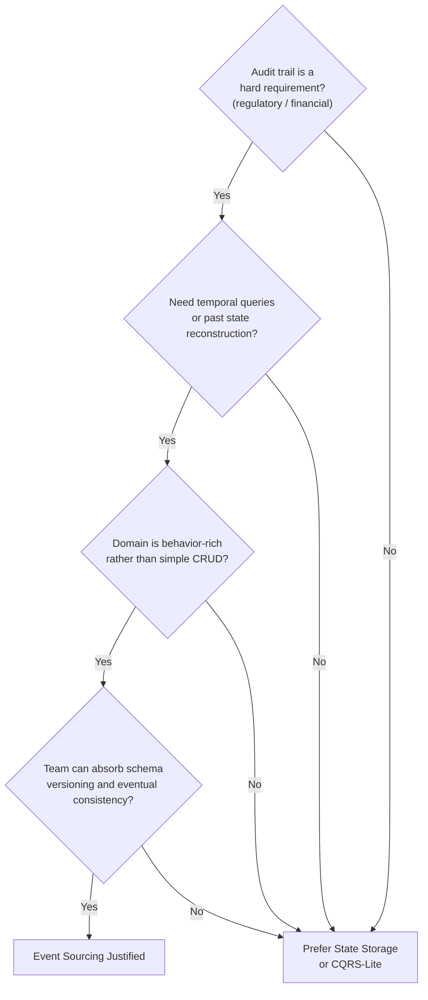

A orientação direta para arquitetos sênior: o Event Sourcing justifica seu custo em domínios onde o histórico é intrinsecamente valioso — razões contábeis, negociações, seguros, prontuários médicos, ciclos de vida de pedidos — e onde o negócio genuinamente pergunta *como chegamos até aqui*. Para um domínio com formato CRUD cujos usuários nunca perguntam sobre o passado, é over-engineering com uma cauda de manutenção de uma década. Adote-o onde a trilha de auditoria é o produto, não onde é uma novidade.

> 💡 **Nota do Especialista:** O crypto-shredding como descrito está correto, mas subestima uma restrição crítica de implementação: o escopo do que deve ser criptografado é mais amplo do que a maioria das equipes antecipa. Dados pessoais não podem aparecer em nenhum lugar fora do payload criptografado — nem no nome do tipo de evento, nem em campos de metadados (IDs de correlação, strings de user-agent, endereços IP registrados como metadados), nem em IDs de stream que codificam um nome de usuário ou e-mail. Um ID de stream `user-john.doe@example.com` não pode ser destruído criptograficamente; o próprio identificador é dado pessoal e persistirá em cada cabeçalho de evento, cada linha de snapshot e cada linha de projeção para sempre. A disciplina arquitetural é usar identificadores opacos e substitutos (UUIDs) como IDs de stream desde o primeiro dia e armazenar uma chave de criptografia separada por sujeito de dados em um serviço dedicado de gerenciamento de chaves (AWS KMS, HashiCorp Vault) antes de escrever o primeiro evento. Retrofitar isso em um event store existente é efetivamente impossível sem reescrever o histórico, o que o padrão proíbe.

<details>
<summary>⚠️ Nota Crítica</summary>
O texto cita prontuários médicos como um domínio canônico onde o Event Sourcing "justifica seu custo" porque o histórico é intrinsecamente valioso. Este é o mesmo domínio onde a HIPAA e o GDPR criam uma obrigação de direito ao apagamento e onde a correção de dados (emenda de uma entrada clínica) é um requisito operacional de rotina. A imutabilidade do Event Sourcing está em tensão direta com ambos. O crypto-shredding trata do apagamento por GDPR em princípio, mas a correção clínica — onde um evento de diagnóstico errado deve ser emendado, não apenas substituído — requer eventos compensatórios e lógica cuidadosa de modelo de leitura para apresentar o estado correto. Apresentar prontuários médicos como uma adequação direta ao Event Sourcing sem essa ressalva poderia levar um leitor a subestimar a complexidade regulatória. Domínios regulamentados que exigem workflows de correção ou apagamento demandam design explícito: eventos compensatórios para correções, crypto-shredding para deleção, e modelos de leitura que apresentam corretamente apenas o registro atual autoritativo. Razões contábeis e ciclos de vida de pedidos são exemplos canônicos mais adequados, pois esses domínios têm os requisitos de deleção mais fracos.
</details>

## Principais Conclusões

- O Event Sourcing armazena cada evento de mudança de estado como fato imutável e deriva o estado atual por replay, resolvendo o problema da verdade e da história que sistemas de atualização in-place criam ao esquecer o passado.
- O **event store** é append-only e organizado em **streams** por entidade; uma restrição `UNIQUE (stream_id, version)` garante tanto a ordenação quanto a concorrência otimista sem bloqueio.
- Os agregados são **reidratados** dobrando eventos em ordem; os métodos de comando validam invariantes e emitem eventos, enquanto os métodos de apply apenas mutam o estado e nunca devem rejeitar um fato.
- **Snapshots** limitam o custo de replay fazendo checkpoint do estado a cada N eventos, mas são otimizações descartáveis — nunca uma fonte de verdade, e nunca criados em cada escrita.
- Os custos são schemas permanentes, deleção difícil (crypto-shredding) e um lado de leitura obrigatório; adote o Event Sourcing apenas onde o histórico é genuinamente valioso para o negócio.

## O Que Vem a Seguir

O Capítulo 7 confronta o que acontece quando um único processo de negócio abrange múltiplos agregados e serviços, introduzindo sagas para coordenar transações sob consistência eventual em vez de ACID distribuído.

<!-- ASSEMBLY COMPLETE
  Chapter: Event Sourcing — State as a Sequence of Events
  Code blocks resolved: 4 / 4
  Diagrams resolved: 3 / 3
  Expert callouts (inline): 3
  Expert callouts (collapsed): 4
  Critical callouts (inline): 1
  Critical callouts (collapsed): 4
  Unresolved markers: 0
-->


# Capítulo 7: Consistência, Sagas e Processos de Longa Duração

## Problema de Abertura

O Capítulo 6 deixou o lado de escrita resolvido: o estado é um log imutável de eventos, e a verdade reside no event store (armazenamento de eventos). Mas aquele capítulo assumiu silenciosamente uma fronteira confortável — um agregado, um stream, uma transação. Os processos de negócio reais não são tão educados. Realizar um pedido envolve estoque, pagamento e entrega. Integrar um cliente envolve identidade, faturamento e conformidade. Cada um desses elementos vive em um serviço diferente, atrás de um banco de dados diferente, pertencente a uma equipe diferente.

Aqui está a questão desconfortável que este capítulo responde: **como você mantém três serviços consistentes quando não pode envolvê-los em uma única transação?** O instinto clássico — uma transação distribuída que bloqueia os três e confirma atomicamente — soa correto e está quase sempre errado em um sistema cloud-native. Ele acopla disponibilidade, penaliza a latência e falha de formas difíceis de raciocinar.

A alternativa é a **saga**: uma sequência de transações locais, cada uma confirmando independentemente, coordenadas por eventos, e revertidas não por rollback, mas por *compensação*. As sagas trocam a ilusão de consistência global instantânea por algo honesto e operável: **consistência eventual** (eventual consistency). Este capítulo mostra como as sagas funcionam, quando coreografá-las e quando orquestrá-las, como projetar compensações que realmente desfazem efeitos de negócio, e como o teorema CAP governa silenciosamente cada uma dessas escolhas.

## Consistência Eventual Versus Consistência Forte

Comece com a palavra que todo arquiteto usa e poucos definem com precisão. **Consistência forte** (strong consistency) significa que, uma vez concluída uma escrita, toda leitura subsequente — de qualquer lugar — verá essa escrita. O sistema se comporta como se houvesse uma única cópia dos dados e um único relógio. Essa é a garantia que uma transação ACID local fornece dentro de um banco de dados.

**Consistência eventual** (eventual consistency) faz uma promessa mais fraca: se as escritas pararem, todas as réplicas e visões derivadas *eventualmente* convergirão para o mesmo valor. Entre a escrita e essa convergência, existe uma janela na qual diferentes partes do sistema discordam. Essa janela não é um bug. É o preço de manter os serviços independentes e disponíveis.

O erro é tratar a consistência eventual como "consistência forte, porém desleixada." É um modelo diferente com regras diferentes. Você não pergunta "os dados são consistentes?" Você pergunta "qual é a desatualização máxima que o negócio pode tolerar e o que acontece dentro dessa janela?"

Considere uma analogia familiar. Quando você transfere dinheiro entre bancos, o saldo do remetente cai imediatamente, mas o destinatário não vê nada por horas ou dias. O dinheiro está, por um tempo, *em trânsito* — invisível em qualquer lugar. O sistema bancário é eventualmente consistente por design, e funciona porque o negócio definiu estados intermediários explícitos ("pendente," "liquidado") e regras para cada um. Essa é a disciplina que a consistência eventual exige.

**Figura 7.1** — O two-phase commit (confirmação em duas fases) força todos os participantes a bloquear e confirmar atomicamente, criando uma única janela de tudo-ou-nada; uma saga permite que cada serviço confirme localmente em sequência, aceitando uma janela de inconsistência visível entre as etapas que se fecha conforme os eventos se propagam para frente.

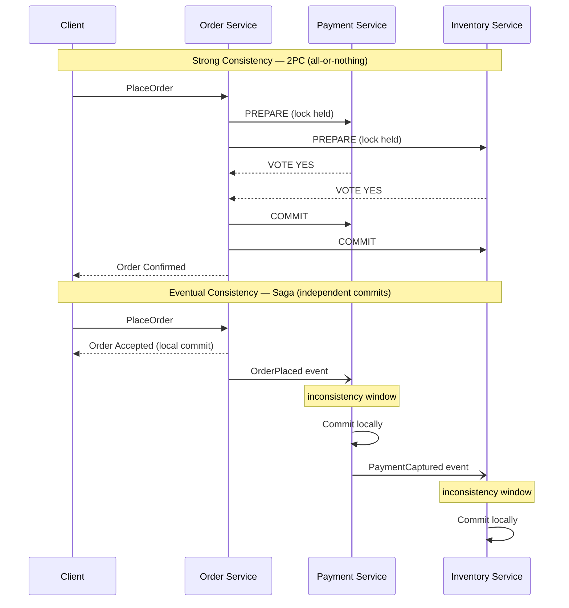

A tabela abaixo aprofunda o contraste.

| Dimensão | Consistência forte | Consistência eventual |
|---|---|---|
| Leitura após escrita | Sempre atual | Atual *eventualmente* |
| Escopo | Banco de dados único / transação | Múltiplos serviços |
| Disponibilidade sob partição | Sacrificada | Preservada |
| Latência | Maior (coordenação) | Menor (confirmações locais) |
| Modo de falha | Tudo-ou-nada | Parcial, depois reconciliado |
| Custo de raciocínio | Baixo | Alto — estados intermediários importam |

A conclusão sênior: **a consistência eventual não é um compromisso aceito com relutância; é a suposição habilitante de serviços independentes.** No momento em que você exige consistência forte entre fronteiras de serviços, você reacoplou os serviços que passou dos Capítulos 1 a 6 desacoplando.

<details>
<summary>💡 Nota do Especialista</summary>

O texto apresenta a consistência como binária (forte vs. eventual), o que é pedagogicamente útil, mas pode levar arquitetos a projetar em excesso. Na prática, muitos requisitos de UX e API precisam apenas de consistência "read-your-writes" (causal) — o usuário que acabou de criar um recurso pode vê-lo na próxima requisição, mas outros usuários verem uma visão ligeiramente desatualizada é aceitável. Isso é mais fraco que a consistência forte, mas mais forte que a consistência eventual pura. Projetar para read-your-writes frequentemente elimina a necessidade de chamadas síncronas entre serviços: redirecione o usuário para a URL canônica do recurso recém-criado imediatamente após a confirmação local, e confie na propagação de eventos para todos os outros. Distinguir "de qual nível de consistência esta ação do usuário realmente precisa?" evita a resposta de joelho de adicionar chamadas síncronas para alcançar consistência forte onde a causal seria suficiente.
</details>

## Por Que Transações ACID Distribuídas Falham

Antes das sagas, preste atenção ao padrão que elas substituem. A resposta do livro didático para consistência entre múltiplos serviços é o **two-phase commit** (2PC): um coordenador pede a cada participante que *prepare*, aguarda que todos votem sim, depois diz a todos para *confirmar*. Se algum participante votar não, todos abortam. No papel, atomicidade entre serviços.

Na prática, o 2PC possui três propriedades fatais para sistemas cloud-native.

Primeiro, **ele mantém bloqueios pela rede.** Entre prepare e commit, cada participante mantém suas linhas bloqueadas, aguardando o coordenador. Uma rede lenta ou um serviço distante transforma um bloqueio de milissegundos em um de vários segundos, colapsando o throughput.

Segundo, **é um protocolo bloqueante.** Se o coordenador falhar após os participantes votarem sim, mas antes de transmitir a decisão, os participantes ficam presos — bloqueados, incertos, incapazes de proceder ou abortar com segurança. Esse é o conhecido estado "in-doubt", e recuperar-se dele é operacionalmente miserável.

Terceiro, **ele acopla disponibilidade.** Uma transação só tem sucesso se *todos* os participantes estiverem ativos ao mesmo tempo. Cinco serviços com 99,9% de disponibilidade cada resultam em aproximadamente 99,5% combinados — você multiplicou sua fragilidade. Isso viola diretamente a independência que torna os microsserviços valiosos.

**Listing 7.1** — Este exemplo simula um coordenador 2PC conduzindo três serviços pelas fases de prepare e commit. O flag `simulate_crash_after_prepare` demonstra a janela in-doubt: os participantes já votaram sim e mantêm seus bloqueios, mas o coordenador ainda não transmitiu a decisão — deixando o sistema em um estado irresolvível até intervenção manual ou um protocolo de recuperação.

```python
# O(n) per phase where n = number of participants; locks held across both phases are the core hazard
from __future__ import annotations

import enum
from dataclasses import dataclass


class VoteResult(enum.Enum):
    YES = "yes"
    NO = "no"


class CoordinatorState(enum.Enum):
    IDLE = "IDLE"
    PREPARING = "PREPARING"
    COMMITTED = "COMMITTED"
    ABORTED = "ABORTED"
    IN_DOUBT = "IN_DOUBT"  # coordinator crashed after votes, before broadcasting the decision


@dataclass
class Participant:
    """Represents one service participating in the distributed transaction."""
    name: str
    vote: VoteResult = VoteResult.YES
    locked: bool = False   # True while row locks are held during the prepare phase
    committed: bool = False

    def prepare(self) -> VoteResult:
        # Participant locks its rows and signals readiness; lock is NOT released until phase 2
        self.locked = True
        return self.vote

    def commit(self) -> None:
        self.locked = False
        self.committed = True

    def abort(self) -> None:
        self.locked = False
        self.committed = False


class TwoPhaseCommitCoordinator:
    """Drives the two phases; exposes the crash-induced in-doubt scenario."""

    def __init__(self, participants: list[Participant]) -> None:
        self.participants = participants
        self.state = CoordinatorState.IDLE
        self._votes: dict[str, VoteResult] = {}

    def run(self, simulate_crash_after_prepare: bool = False) -> CoordinatorState:
        # ── Phase 1 — Prepare ───────────────────────────────────────────────
        # Coordinator asks every participant to vote; each locks its rows.
        self.state = CoordinatorState.PREPARING
        for p in self.participants:
            vote = p.prepare()
            self._votes[p.name] = vote
            print(f"  {p.name:20s}  voted {vote.value:3s}  locked={p.locked}")

        all_yes = all(v == VoteResult.YES for v in self._votes.values())

        if simulate_crash_after_prepare:
            # The coordinator dies here. Participants hold locks and cannot safely
            # commit or abort on their own — the "in-doubt" blocking window begins.
            self.state = CoordinatorState.IN_DOUBT
            stuck = [p.name for p in self.participants if p.locked]
            print(f"\n  *** COORDINATOR CRASHED — in-doubt participants (locks held): {stuck} ***")
            print("  Recovery requires the coordinator to restart and re-broadcast its decision.")
            return self.state

        # ── Phase 2 — Commit or Abort ────────────────────────────────────────
        # Only reached if the coordinator survived; broadcasts a single uniform decision.
        if all_yes:
            for p in self.participants:
                p.commit()
            self.state = CoordinatorState.COMMITTED
        else:
            for p in self.participants:
                p.abort()
            self.state = CoordinatorState.ABORTED

        return self.state


# ── Demo ─────────────────────────────────────────────────────────────────────
if __name__ == "__main__":
    print("=== Happy path: all participants vote YES ===")
    services = [Participant("OrderSvc"), Participant("PaymentSvc"), Participant("InventorySvc")]
    result = TwoPhaseCommitCoordinator(services).run()
    print(f"Coordinator final state: {result.value}\n")

    print("=== Crash scenario: coordinator dies after phase 1 ===")
    services = [Participant("OrderSvc"), Participant("PaymentSvc"), Participant("InventorySvc")]
    result = TwoPhaseCommitCoordinator(services).run(simulate_crash_after_prepare=True)
    print(f"Coordinator final state: {result.value}")
    # Expected output:
    #   *** COORDINATOR CRASHED — in-doubt participants (locks held): ['OrderSvc', 'PaymentSvc', 'InventorySvc'] ***
```

Há uma verdade mais profunda aqui, e é o teorema CAP, ao qual retornaremos no final do capítulo: quando uma partição de rede divide seus serviços, o 2PC escolhe consistência ao se recusar a prosseguir. Para a maioria dos processos de negócio — pedidos, reservas, cadastros — recusar-se a prosseguir é a resposta errada. O negócio prefere aceitar o pedido agora e reconciliar depois. Essa preferência *é* a escolha por uma saga.

> 💡 **Nota do Especialista:** O texto identifica corretamente o 2PC como o padrão a ser substituído, mas perde uma armadilha corporativa generalizada: transações XA (JTA no Jakarta EE, `@Transactional` do Spring abrangendo múltiplos beans `DataSource` ou `ConnectionFactory`, e MSDTC no .NET) são 2PC disfarçados. Muitas equipes acreditam que não estão usando ACID distribuído até rastrear um incidente em produção e encontrar um coordenador XA mantendo bloqueios silenciosamente entre um banco de dados e um broker de mensagens. O sinal é um `javax.transaction.UserTransaction` ou `ChainedTransactionManager` na árvore de dependências. Audite seu grafo de dependências antes de declarar que eliminou o 2PC de um caminho de migração legado.

<details>
<summary>⚠️ Nota Crítica</summary>

O capítulo enquadra o 2PC como uma escolha puramente "CP" — um sistema que sacrifica disponibilidade em troca de consistência quando ocorre uma partição. Isso é uma simplificação excessiva que o próprio estado in-doubt já refuta dentro da mesma seção. Quando o coordenador falha após os participantes terem votado *sim*, mas antes de a decisão de commit ser transmitida, os participantes ficam bloqueados e incertos — não podem confirmar nem abortar com segurança. O sistema nesse ponto não é nem disponível *nem* consistente: está travado. O 2PC não garante C de forma confiável sob falha do coordenador; ele garante que nenhum commit incorreto aconteça, o que não é o mesmo que fornecer uma leitura consistente. A caracterização CAP do 2PC como CP é uma abreviação útil para o trade-off de tolerância a partições, mas apresentá-la sem a ressalva de que a garantia "C" se degrada sob falha do coordenador é enganosa para profissionais que avaliam modos de falha.

**Correção sugerida:** Qualifique a caracterização CP: "O 2PC é tipicamente descrito como CP, mas a garantia é mais precisamente 'nenhum commit incorreto' — sob falha do coordenador, participantes in-doubt não alcançam nem disponibilidade nem um estado consistente garantido. O custo real do 2PC não é apenas a perda de disponibilidade sob partições, mas a perda de recuperabilidade sob falhas do coordenador."
</details>

## Sagas Coreografadas Versus Orquestradas

Uma **saga** é uma sequência de transações locais onde cada etapa publica um evento que aciona a próxima. Se uma etapa falha, a saga executa **transações compensatórias** para desfazer as etapas concluídas. Há duas formas de conectar as etapas, e a distinção — primeiro encontrada no Capítulo 3 como uma topologia, agora aplicada especificamente a sagas — define como você operará o sistema.

Em uma **saga coreografada** (choreographed saga), não há coordenador central. Cada serviço escuta eventos, realiza seu trabalho local e emite seu próprio evento. O serviço Order publica `OrderPlaced`; o serviço Payment reage, cobra o cartão e publica `PaymentCaptured`; o serviço Inventory reage *a isso* e reserva o estoque. O fluxo vive nas reações. Nenhum componente único conhece todo o processo.

Em uma **saga orquestrada** (orchestrated saga), um coordenador dedicado — o **orquestrador** — é dono do processo. Ele envia comandos explícitos (`CapturePayment`, `ReserveStock`), aguarda respostas e decide a próxima etapa. O Order Orchestrator conhece cada etapa, cada falha possível e cada compensação. O fluxo vive em um único lugar.

**Figura 7.2** — A coreografia conecta serviços por meio de uma cadeia de eventos reativos sem um coordenador único, enquanto a orquestração coloca toda a lógica do processo em um orquestrador explícito que emite comandos e aguarda respostas — entender esse trade-off determina quão visível e manutenível o fluxo da saga será à medida que a complexidade cresce.

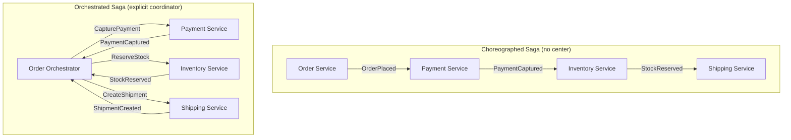

O trade-off é real e diz respeito a *onde a lógica do processo reside*.

| Fator | Coreografia | Orquestração |
|---|---|---|
| Acoplamento | Baixo — serviços conhecem apenas eventos | Maior — orquestrador conhece todas as etapas |
| Visibilidade | Fraca — fluxo é implícito | Excelente — fluxo é explícito em um lugar |
| Adicionar uma etapa | Tocar múltiplos serviços | Tocar o orquestrador |
| Risco de ciclos | Alto — eventos disparando eventos | Baixo — comandos são direcionados |
| Melhor para | Fluxos curtos, 2 a 4 etapas | Fluxos complexos, muitas ramificações |
| Depuração | Difícil — sem narrativa única | Mais fácil — um único estado a inspecionar |

Aqui está a orientação opinativa. **Use coreografia para fluxos curtos e estáveis** onde as reações são óbvias e improváveis de mudar. O desacoplamento é genuíno e a simplicidade é real. Mas **assim que uma saga ultrapassa três ou quatro etapas, ou adquire ramificações condicionais, recorra à orquestração.** Sagas coreografadas em escala se tornam "espaguete de eventos" — ninguém consegue dizer o que o processo faz sem rastrear eventos por seis serviços. O fluxo de controle implícito que torna a coreografia elegante em pequena escala a torna impossível de manter em grande escala. Prefira o entediante, porém visível, orquestrador.

> 💡 **Nota do Especialista:** O texto alerta corretamente sobre o "espaguete de eventos" na coreografia, mas a dependência de confiabilidade na publicação transacional de eventos merece igual ênfase. Em uma saga coreografada, se um serviço confirma sua transação local no banco de dados, mas falha antes de publicar o evento downstream, a saga estagna silenciosamente — sem exceção, sem alerta, sem próxima etapa. O Outbox Pattern (gravar o evento em uma tabela `outbox` local na mesma transação ACID e fazê-la poll com um relay) não é opcional para sagas coreografadas em produção; é o mecanismo que torna a coreografia confiável. Sem ele, a vantagem de desacoplamento é comprometida por uma lacuna de confiabilidade oculta. Se este capítulo faz referência ao Outbox Pattern de um capítulo anterior, torne essa dependência explícita aqui.

<details>
<summary>💡 Nota do Especialista</summary>

A estratégia de testes diverge acentuadamente entre as duas topologias, e isso molda a velocidade das equipes na prática. Sagas coreografadas requerem contract testing entre fronteiras de serviços (Pact, Spring Cloud Contract) para verificar que um evento publicado pelo Serviço A realmente satisfaz o schema do consumidor do Serviço B — sem isso, integrações quebram silenciosamente quando um campo é renomeado. Sagas orquestradas podem ser testadas unitariamente em isolamento: simule os canais de comando downstream, alimente eventos de resposta, asserte transições de estado. O conjunto de testes do orquestrador se torna a documentação viva da saga. Equipes que escolhem orquestração por visibilidade frequentemente subestimam que isso também lhes dá uma superfície de teste dramaticamente mais simples — um ponto que vale ressaltar para arquitetos que preferem coreografia por razões ideológicas.
</details>

## Transações Compensatórias e Rollback Semântico

O coração da saga é o que acontece quando a quarta etapa falha após as etapas um a três terem sido concluídas com sucesso. Não há `ROLLBACK` — essas transações já foram confirmadas, em outros bancos de dados, possivelmente horas atrás. Em vez disso, a saga executa **transações compensatórias**: novas transações que semanticamente desfazem o efeito das concluídas.

A palavra crítica é **semanticamente**. Uma compensação não é uma reversão técnica para um estado anterior; é uma *nova ação de negócio* que contrabalança uma anterior. Você não descobra um cartão de crédito — você *emite um reembolso*. Você não desfaz o envio de um e-mail — você *envia uma correção*. Você não exclui um registro de remessa — você *cancela a remessa*. A ação compensatória é em si um fato real, registrado e que avança para frente.

**Listing 7.2** — Este exemplo implementa o núcleo de execução de saga agnóstico à coreografia: cada `SagaStep` agrupa uma ação avançada com sua compensação semântica. Quando qualquer etapa lança uma exceção, o executor desfaz apenas as etapas já concluídas em ordem estritamente inversa — garantindo que os efeitos sejam desfeitos em uma sequência sensata de negócio. As ações compensatórias são novos fatos de negócio (reembolso, liberação, cancelamento), nunca desfazimentos brutos do banco de dados.

```python
# Saga execution — O(n) forward, O(k) compensation where k = steps completed before failure
from __future__ import annotations

import enum
from dataclasses import dataclass, field
from typing import Callable


class StepStatus(enum.Enum):
    PENDING = "pending"
    COMPLETED = "completed"
    COMPENSATED = "compensated"
    FAILED = "failed"


@dataclass
class SagaStep:
    """Pairs a forward business action with its semantic compensation."""
    name: str
    action: Callable[[], None]
    compensation: Callable[[], None]
    status: StepStatus = field(default=StepStatus.PENDING, init=False)


class OrderSaga:
    """
    Executes an order saga: ReserveStock → CapturePayment → CreateShipment.
    On any failure, compensates completed steps in reverse order.
    """

    def __init__(self, order_id: str) -> None:
        self.order_id = order_id
        # Steps are declared in the intended execution order.
        # Compensations are the semantic inverse — a refund, not an un-charge.
        self.steps: list[SagaStep] = [
            SagaStep("ReserveStock",   self._reserve_stock,   self._release_stock),
            SagaStep("CapturePayment", self._capture_payment, self._refund_payment),
            SagaStep("CreateShipment", self._create_shipment, self._cancel_shipment),
        ]

    # ── Forward actions ───────────────────────────────────────────────────────

    def _reserve_stock(self) -> None:
        print(f"  [ReserveStock]   stock reserved   order={self.order_id}")

    def _capture_payment(self) -> None:
        print(f"  [CapturePayment] charging card     order={self.order_id}")
        # Simulate a transient infrastructure failure mid-saga
        raise RuntimeError("Payment gateway timeout — no charge was made")

    def _create_shipment(self) -> None:
        print(f"  [CreateShipment] shipment created  order={self.order_id}")

    # ── Compensating actions — semantic reversals, each a new business fact ──

    def _release_stock(self) -> None:
        # Idempotent: check a compensation key in production to guard against double-release
        print(f"  [ReleaseStock]   stock released    order={self.order_id}")

    def _refund_payment(self) -> None:
        # Issues a refund record, not a deletion of the charge attempt
        print(f"  [RefundPayment]  refund issued     order={self.order_id}")

    def _cancel_shipment(self) -> None:
        print(f"  [CancelShipment] shipment cancelled order={self.order_id}")

    # ── Saga runner ───────────────────────────────────────────────────────────

    def execute(self) -> bool:
        """
        Run forward steps in order. On the first failure, compensate every
        previously completed step in reverse order (LIFO), then return False.
        """
        completed: list[SagaStep] = []

        for step in self.steps:
            try:
                step.action()
                step.status = StepStatus.COMPLETED
                completed.append(step)
            except Exception as exc:
                step.status = StepStatus.FAILED
                print(f"\n  Step '{step.name}' failed: {exc}")
                print("  Compensating completed steps in reverse order...")
                # Reverse-order compensation ensures effects unwind in a sensible sequence
                for done in reversed(completed):
                    done.compensation()
                    done.status = StepStatus.COMPENSATED
                return False

        return True


# ── Demo ─────────────────────────────────────────────────────────────────────
if __name__ == "__main__":
    print("=== Order Saga: ReserveStock succeeds, CapturePayment fails ===\n")
    saga = OrderSaga(order_id="ORD-42")
    success = saga.execute()

    print(f"\nSaga result: {'completed' if success else 'compensated'}")
    for step in saga.steps:
        print(f"  {step.name:20s}  {step.status.value}")
    # Expected output:
    #   [ReserveStock]   stock reserved   order=ORD-42
    #   [CapturePayment] charging card     order=ORD-42
    #   Step 'CapturePayment' failed: Payment gateway timeout — no charge was made
    #   Compensating completed steps in reverse order...
    #   [ReleaseStock]   stock released    order=ORD-42
    #   Saga result: compensated
    #   ReserveStock          compensated
    #   CapturePayment        failed
    #   CreateShipment        pending
```

Três propriedades tornam as compensações confiáveis, e cada uma mapeia para uma regra de design.

1. **Compensações devem ser idempotentes.** Um comando de reembolso pode ser entregue mais de uma vez sob entrega at-least-once (Capítulo 4). Reemiti-lo não deve reembolsar duas vezes. Use uma chave de compensação e verifique "já foi compensado?" antes de agir.

2. **Compensações devem ser seguras com relação à ordenação.** Execute-as em ordem inversa às etapas avançadas, para que os efeitos sejam desfeitos em uma sequência sensata — libere o estoque que você reservou, reembolse o pagamento que você capturou.

3. **Algumas ações não podem ser compensadas — então ordene a saga em torno delas.** Você não pode desfazer o lançamento de um míssil ou desfazer o envio de um pacote físico. Essas são **transações pivot**: após o pivot, a saga só pode avançar. A regra de design é colocar todas as etapas *compensáveis* antes do pivot e todas as etapas *retriable* (com garantia de eventual sucesso) depois dele. Estruture a saga para que a etapa irreversível aconteça por último, uma vez que tudo o que é reversível já tenha sido bem-sucedido.

Essa taxonomia — compensável, pivot, retriable — é o modelo mental mais útil para projetar sagas. Classifique cada etapa e depois as ordene para que a falha seja sempre totalmente reversível ou garantida de completar.

> **Dica Pro:** A compensação não é tratamento de erros adicionado depois. É metade do processo de negócio. Se você não consegue descrever como desfazer uma etapa em termos de negócio, você ainda não entende a etapa. Modele a compensação ao mesmo tempo que modela a ação avançada — na mesma sessão de Event Storming do Capítulo 2.

> 💡 **Nota do Especialista:** O texto estabelece que as compensações devem ser idempotentes, mas não aborda o caso em que a própria compensação falha — e esse é um dos cenários operacionalmente mais perigosos em sagas de produção. Um comando `RefundPayment` pode ser rejeitado por um processador de pagamentos downstream que está temporariamente fora do ar, ou recusado porque o cartão foi cancelado. Quando a transação compensatória não pode ser entregue ou é rejeitada, a saga fica presa em um estado parcialmente compensado sem caminho de resolução automática. Sistemas de produção devem modelar isso explicitamente: um estado terminal `CompensationFailed` respaldado por uma dead-letter queue, uma regra de alertas e um playbook de remediação manual. Em indústrias regulamentadas (serviços financeiros, saúde), esse estado também deve acionar um evento de conformidade. Equipes que omitem esse estado o descobrem de qualquer forma — simplesmente não conseguem observá-lo ou agir sobre ele.

> ⚠️ **Nota Crítica:** A seção inteira sobre compensações descreve uma única instância de saga em isolamento. Ela nunca aborda o *problema de isolamento da saga*: porque cada transação local confirma independentemente e os estados intermediários da saga são totalmente visíveis para outras transações concorrentes, as sagas sofrem de fenômenos que o isolamento ACID previne — especificamente leituras sujas e atualizações perdidas. Um processo concorrente lendo o registro de pedido entre `PaymentCaptured` e `ShipmentCreated` vê um estado que pode ser compensado posteriormente. Dependendo do que ele faz com esses dados, a compensação pode ser insuficiente para restaurar a correção global. O artigo original de Garcia-Molina de 1987 introduzindo sagas identificou explicitamente essa limitação, e "Microservices Patterns" de Chris Richardson (a referência canônica para profissionais) dedica uma seção completa a contramedidas: semantic locks, commutative updates, pessimistic views e re-read values. Para uma audiência de arquitetos sêniors projetando sistemas de processamento de pedidos de alta concorrência, omitir isso é uma lacuna material — é a fonte mais comum de corrupção sutil de dados em implementações de sagas em produção.

<details>
<summary>⚠️ Nota Crítica</summary>

A Propriedade 2 afirma "Compensações devem ser seguras com relação à comutatividade de ordenação." Esse é um erro de terminologia que contradiz diretamente o conselho que se segue. *Comutatividade* significa que a ordem das operações não importa — se as compensações fossem comutativas, não haveria necessidade de executá-las em ordem inversa. O texto então instrui imediatamente o leitor a executar compensações em ordem inversa, o que é o *oposto* de um requisito de comutatividade. O que a propriedade realmente requer é uma ordenação estritamente *sequencial* inversa: cada compensação deve ser aplicada em sequência inversa em relação às etapas avançadas. Chamar isso de "comutativo-seguro" confundirá qualquer engenheiro que conheça o termo.

**Correção sugerida:** Substitua "Compensações devem ser comutativo-seguras com relação à ordenação" por "Compensações devem ser aplicadas em sequência estritamente inversa: desfaça a última etapa confirmada primeiro." Esclareça que comutatividade significaria que a ordem é irrelevante, o que é o oposto da restrição aqui.
</details>

## Gerenciadores de Processo e Máquinas de Estado

Um orquestrador que apenas encaminha comandos é superficial. Um orquestrador real deve lembrar: quais etapas foram concluídas, quais estão pendentes, o que fazer em cada resposta, quando atingir o timeout e quando começar a compensar. Esse coordenador com estado tem um nome — o **gerenciador de processo** (process manager) — e sua implementação mais confiável é uma **máquina de estado** (state machine) explícita.

Um gerenciador de processo é um componente que recebe eventos, mantém o estado de uma única instância de saga e decide o próximo comando com base nesse estado. Modele-o como um conjunto finito de estados com transições definidas: `AwaitingPayment → AwaitingStock → AwaitingShipment → Completed`, com arestas de falha ramificando-se em `Compensating → Cancelled`. Cada evento de entrada avança o estado ou aciona compensação. Nada acontece implicitamente.

**Figura 7.3** — Esta máquina de estado captura cada estado observável de uma saga de pedido em voo e torna explícitas as transições do caminho feliz e dos caminhos de compensação — persistir esse estado em cada transição é o que permite ao gerenciador de processo sobreviver a falhas e retomar sem abandonar pedidos em voo.

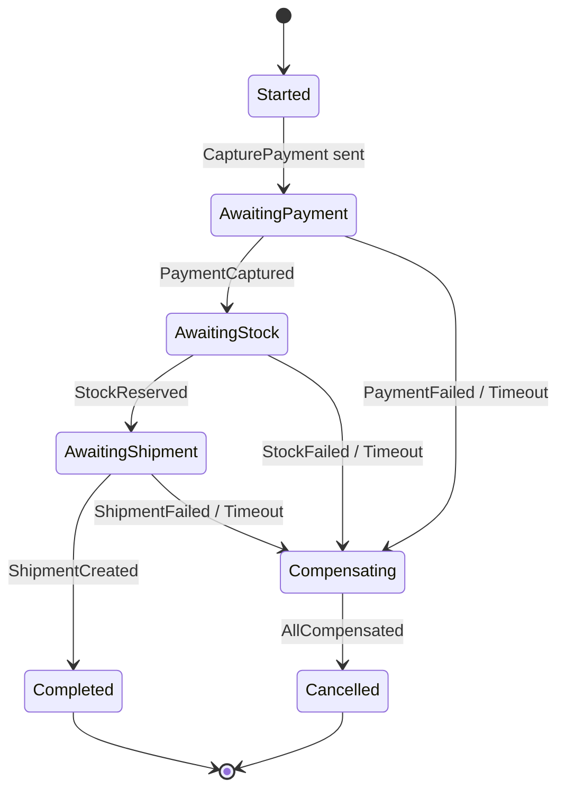

Duas disciplinas de implementação separam um gerenciador de processo robusto de um frágil.

**Persista o estado da saga em cada transição.** O gerenciador de processo é em si um agregado — e tudo do Capítulo 6 se aplica. Seu estado deve sobreviver a uma falha. Quando o orquestrador reiniciar, ele reidrata cada saga em voo a partir de seu estado persistido e retoma exatamente de onde parou. Um gerenciador de processo que mantém o estado da saga apenas em memória irá, no primeiro reinício do pod, abandonar todos os pedidos em voo. Isso não é hipotético; é o bug de saga mais comum em produção.

**Trate timeouts como estados de primeira classe, não como reflexões posteriores.** Em um mundo síncrono, uma chamada travada lança uma exceção. Em uma saga, uma etapa que nunca responde simplesmente... aguarda, para sempre, silenciosamente. O gerenciador de processo deve definir um timer em cada etapa pendente. Se `PaymentCaptured` não chegar dentro do prazo, o timeout é um *evento* que faz a transição da máquina de estado — geralmente para compensação. Processos de longa duração vivem e morrem pelo tratamento da resposta que nunca chega.

> **Dica Pro:** Resista à tentação de codificar gerenciadores de processo manualmente com condicionais aninhados e flags booleanas (`paymentDone`, `stockDone`). Esse estilo apodrece no instante em que uma quarta etapa aparece. Uma máquina de estado explícita — uma tabela de (estado atual, evento) → (próximo estado, ação) — permanece legível com dez estados e é diretamente testável sem qualquer infraestrutura.

Muitas equipes recorrem a um motor de workflow aqui — Temporal, AWS Step Functions, Camunda — precisamente porque essas ferramentas fornecem estado durável, timers e retries prontos para uso. Essa é uma escolha razoável. Mas entenda o que eles lhe oferecem: uma máquina de estado persistente e gerenciada. O padrão é o mesmo, quer você implemente do zero ou compre a solução.

<details>
<summary>💡 Nota do Especialista</summary>

O texto recomenda Temporal, AWS Step Functions e Camunda como escolhas razoáveis, o que é preciso. No entanto, seus modelos de durabilidade diferem de formas que surgem sob falha: o Temporal persiste um histórico de eventos completo e safe para replay em um banco de dados (Postgres ou Cassandra) e reconstrói o estado do workflow repetindo esse histórico — uma falha no meio de uma etapa reproduz todas as atividades anteriores ao reiniciar. O AWS Step Functions armazena o estado de execução em seu próprio armazenamento gerenciado, mas impõe limites rígidos (25.000 eventos de histórico por execução) que afetam processos de longa duração que se estendem por semanas. O Camunda 8 usa o log replicado do Zeebe. Equipes que selecionam uma dessas ferramentas com base apenas na experiência do desenvolvedor, e depois atingem um limite de histórico de execução ou descobrem que o Temporal requer operar seu próprio cluster de banco de dados, enfrentam migrações custosas. Avalie o modelo de durabilidade e o footprint operacional antes de se comprometer.
</details>

<details>
<summary>💡 Nota do Especialista</summary>

Um anti-padrão comum quando equipes adotam motores de workflow é codificar regras de negócio dentro do próprio orquestrador — ramificações condicionais baseadas em tier do cliente, lógica de precificação, verificações de conformidade — transformando-o em um "God Workflow." O orquestrador deve emitir comandos e receber respostas; deve conter apenas fluxo de controle (sequência, ramificação no tipo de resposta, timeout). Regras de negócio pertencem aos serviços que executam os comandos. Quando o orquestrador cresce além de algumas centenas de linhas de lógica de controle, torna-se tão difícil de mudar quanto o monólito que a saga substituiu. A disciplina é: se uma condição de ramificação requer conhecimento de domínio, ela pertence a um serviço, não ao coordenador da saga.
</details>

## Teorema CAP Aplicado a Fluxos de Eventos

Tudo neste capítulo é consequência de um teorema, então torne-o explícito. O **teorema CAP** afirma que um sistema distribuído, quando uma **partição** (P) de rede o divide, pode preservar ou **consistência** (C) — todos os nós veem os mesmos dados — ou **disponibilidade** (A) — toda requisição recebe uma resposta — mas não ambas. Partições não são opcionais; redes falham. Então a escolha real *não* é "CA versus algo." Quando a partição acontece, você escolhe C ou A.

Transações distribuídas e 2PC são a escolha **CP**: sob uma partição, recusam-se a prosseguir para manter os dados consistentes. O pedido simplesmente falha. Sagas são a escolha **AP**: sob uma partição, cada transação local ainda confirma, o sistema permanece disponível e a consistência é restaurada depois pelo fluxo de eventos e compensações. **Uma saga é, em sua essência, uma aposta arquitetural de que a disponibilidade importa mais do que a consistência instantânea** — e para a maioria dos processos de negócio, essa aposta está correta.

Isso reformula a consistência eventual de uma limitação em uma posição deliberada. Você não está se conformando com consistência fraca porque as sagas não conseguem fazer melhor. Você está *escolhendo* disponibilidade, e a consistência eventual é a maneira disciplinada de honrar essa escolha enquanto ainda converge para um estado final correto.

**Figura 7.4** — Quando ocorre uma partição de rede, o sistema deve escolher entre bloquear a operação para preservar a consistência (CP — o caminho do 2PC) ou confirmar localmente para permanecer disponível e convergir depois (AP — o caminho da saga), e este diagrama torna explícito que sagas não são uma solução paliativa, mas uma escolha arquitetural deliberada com consequências de negócio previsíveis.

```mermaid
flowchart TD
    A[Cross-Service Business Operation] --> B{Network Partition Detected?}
    B -->|No| N[Proceed Normally]
    B -->|Yes| D{CAP Choice}
    D -->|Choose Consistency - CP| E[Block — Wait for All Participants]
    E --> F[2PC Coordinator Holds Locks]
    F --> G[Operation Fails\nData remains consistent\nBusiness request rejected]
    D -->|Choose Availability - AP| H[Commit Locally per Service]
    H --> I[Each Service Stays Available\nSaga Continues]
    I --> J[Eventual Convergence\nvia Events and Compensations\nBusiness request accepted]
```

Uma nuance que vale internalizar, e é onde arquitetos sêniors ganham seu título. O CAP não é uma propriedade do seu sistema inteiro; é uma propriedade de cada *operação*. Cobrar um pagamento pode exigir rigor semelhante ao CP dentro da própria fronteira do serviço de pagamento — uma única transação ACID, sem ambiguidade sobre dinheiro. Coordenar esse pagamento com estoque e entrega entre serviços é AP — uma saga. Arquiteturas maduras não são uniformemente consistentes ou uniformemente disponíveis. Elas são fortemente consistentes *dentro* de cada fronteira de serviço e eventualmente consistentes *entre* fronteiras, com as sagas como a ponte entre os dois regimes.

<details>
<summary>⚠️ Nota Crítica</summary>

O teorema CAP é apresentado como um framework completo e atual para decisões de consistência distribuída, mas suas limitações práticas são bem estabelecidas. O próprio Eric Brewer reconheceu em sua retrospectiva de 2012 ("CAP Twelve Years Later: How the 'Rules' Have Changed," IEEE Computer) que o enquadramento binário do teorema obscurece mais do que revela. O teorema PACELC (Abadi, 2012) — que estende o CAP para abordar o trade-off latência/consistência que existe *mesmo quando não há partição* — é o modelo operacionalmente mais relevante para arquitetos projetando sistemas orientados a eventos, onde a questão cotidiana não é "o que acontece durante uma partição", mas "qual é o custo de latência de uma consistência mais forte quando a rede está saudável." Apresentar o CAP sem esse contexto leva arquitetos sêniors a usá-lo como um instrumento contundente ao avaliar o comportamento do sistema fora dos cenários de falha, que é o caso comum.

**Correção sugerida:** Adicione uma barra lateral "Beyond CAP" (Além do CAP) observando: (1) o "C" do CAP significa especificamente linearizabilidade, não todos os modelos de consistência; (2) o modelo PACELC estende a análise para a dimensão latência/consistência sob operação normal; (3) a retrospectiva de Brewer de 2012 recomenda tratar o trade-off como contínuo em vez de binário. Isso posiciona o leitor para ler a documentação de fornecedores com precisão.
</details>

## Principais Conclusões

- **Transações ACID distribuídas não escalam.** O two-phase commit mantém bloqueios pela rede, bloqueia sob falha do coordenador e multiplica a fragilidade de seus serviços em um único ponto de falha. Rejeite-o para processos de negócio entre serviços.
- **Uma saga é uma sequência de transações locais coordenadas por eventos, revertida por compensação, não por rollback.** Ela aceita consistência eventual para preservar disponibilidade e independência dos serviços.
- **Coreografe fluxos curtos e estáveis; orquestre os complexos ou com ramificações.** A coreografia desacopla, mas oculta o processo; a orquestração centraliza a lógica e torna o fluxo visível. Além de três ou quatro etapas, prefira a orquestração.
- **Compensações são novas ações de negócio, não desfazimentos técnicos.** Classifique cada etapa como compensável, pivot ou retriable, e ordene a saga para que a irreversibilidade venha por último.
- **Um gerenciador de processo é uma máquina de estado persistente.** Persista o estado em cada transição e trate timeouts como eventos de primeira classe, ou o primeiro reinício do pod abandonará suas sagas em voo.
- **Sagas são a escolha AP do teorema CAP.** Consistência forte dentro de cada fronteira de serviço, consistência eventual entre fronteiras, com a saga como a ponte.

## O Que Vem a Seguir

As sagas dependem de eventos cujo significado permanece estável entre serviços e ao longo do tempo — o que levanta o problema que o Capítulo 8 enfrenta diretamente: como evoluir schemas e contratos de eventos sem quebrar os consumidores e as sagas de longa duração que dependem deles.

<!-- ASSEMBLY COMPLETE
  Chapter: Consistency, Sagas, and Long-Running Processes
  Code blocks resolved: 2 / 2
  Diagrams resolved: 4 / 4
  Expert callouts (inline): 3
  Expert callouts (collapsed): 4
  Critical callouts (inline): 1
  Critical callouts (collapsed): 3
  Unresolved markers: 0
-->


# Capítulo 8: Evolução de Schema e Versionamento de Eventos

## Declaração do Problema Inicial

O Capítulo 7 deixou o leitor com um sistema cuja verdade está distribuída entre serviços que convergem ao longo do tempo por meio de sagas e compensações. O Capítulo 6 fez uma promessa ainda mais pesada: com Event Sourcing (armazenamento de eventos), cada evento é guardado para sempre. Essa promessa agora apresenta sua conta. Uma API de request-response pode deprecar um campo em um trimestre e forçar todos os chamadores a atualizar. Um event store não pode. Um evento escrito em 2021 será lido em 2027, por um consumidor escrito em 2025, executando código que ninguém no time original se lembra. O evento não é uma mensagem transitória; é um **contrato persistido com o futuro**. Portanto, a verdadeira questão deste capítulo é desconfortável: como um arquiteto muda a forma de um fato que já aconteceu, está armazenado milhões de vezes, e é consumido por equipes que ele nunca conheceu? Errar aqui e cada implantação se torna um evento coordenado, entre equipes, de alto risco. Acertar e as equipes evoluem seus contratos de forma independente, no próprio ritmo, sem um único consumidor quebrado. Este capítulo trata de conquistar essa independência — e sobre a única decisão de política que, se pulada, silenciosamente garante o oposto.

## Compatibilidade Retroativa e Prospectiva

Toda conversa sobre evolução de schema eventualmente se reduz a duas palavras: direção de **compatibilidade**. Confundi-las é o erro mais comum — e mais caro — neste domínio, portanto defina-as com precisão e nunca as misture novamente.

**Compatibilidade retroativa** (backward compatibility) significa que um *novo consumidor* pode ler *eventos antigos*. Você alterou o schema; um consumidor rodando o novo schema ainda entende dados escritos sob o antigo. Essa é a direção que o Event Sourcing exige, porque seu event store está cheio de eventos antigos que serão reexecutados para sempre.

**Compatibilidade prospectiva** (forward compatibility) significa que um *consumidor antigo* pode ler *eventos novos*. Você alterou o schema; um consumidor ainda rodando a versão antiga tolera dados escritos sob a nova, geralmente ignorando o que não reconhece. Essa é a direção que a integração pub/sub exige, porque você não pode atualizar todos os consumidores no mesmo instante em que atualiza o produtor.

**Compatibilidade total** (full compatibility) é ambas ao mesmo tempo. É a mais restrita e a mais segura, e é o alvo para o qual a maioria dos registries maduros permite configurar.

O resultado prático é um conjunto simples de regras sobre o que uma mudança tem permissão de fazer. As mudanças seguras são quase sempre aditivas.

**Figura 8.1 — Matriz de decisão de compatibilidade para mudanças de schema**

```mermaid
flowchart LR
    subgraph FULL["Full-Safe — Backward AND Forward"]
        F1["Add optional field with default"]
        F2["Widen type — int to long"]
    end

    subgraph BACK["Backward-Safe Only\n(new consumer reads old events)"]
        B1["Remove optional field\n(new schema supplies default)"]
    end

    subgraph FWD["Forward-Safe Only\n(old consumer reads new events)"]
        V1["Add required field — no default\n(old consumer ignores unknown fields)"]
    end

    subgraph UNSAFE["Never Safe — Breaks Both Directions"]
        U1["Rename field\n= remove + add — fails both ways"]
        U2["Narrow type — long to int\n(truncation risk)"]
        U3["Change field meaning\n(semantic breakage)"]
    end

    FULL -->|"Safe to ship anytime"| OK(["Deploy freely"])
    BACK -->|"Roll consumers forward first"| WARN(["Coordinate rollout"])
    FWD -->|"Breaks event replays"| WARN2(["Block for Event Sourcing"])
    UNSAFE -->|"Registry must reject"| BLOCK(["Build fails"])
```

*Este diagrama classifica mudanças comuns de schema em quatro grupos de segurança, deixando imediatamente claro quais operações são seguras para enviar sem coordenação com os consumidores. Entender esses agrupamentos é a base da evolução disciplinada de schema: apenas mudanças totalmente seguras (full-safe) podem ser implantadas a qualquer momento sem risco.*

Observe a armadilha escondida nessa matriz. Adicionar um campo **obrigatório** (required) quebra a compatibilidade retroativa, porque eventos antigos simplesmente não o carregam. Remover um campo quebra a compatibilidade prospectiva, porque consumidores antigos ainda o esperam. E uma renomeação não é uma operação — é uma exclusão mais uma adição, portanto falha nos dois lados. A disciplina, então, é intencionalmente entediante: prefira campos opcionais, sempre forneça defaults, e trate "required" como uma palavra que você precisa justificar em uma revisão.

**Listagem 8.1 — Evolução segura de schema Avro: adicionando um campo opcional com default nulo**

Este exemplo mostra duas versões de schema Avro para um evento `OrderPlaced`. Adicionar um campo opcional com default nulo alcança compatibilidade total: a resolução reader/writer do Avro preenche o default para eventos antigos (retroativa), e campos mais novos ausentes no schema do leitor são simplesmente projetados para fora (prospectiva).

```python
# Schema evolution: safe addition of an optional field with a null default
# Demonstrates both backward and forward compatibility using Avro-style schemas

from typing import Any

# v1 schema: original OrderPlaced event (no coupon support yet)
ORDER_PLACED_V1: dict[str, Any] = {
    "type": "record",
    "name": "OrderPlaced",
    "namespace": "com.example.orders",
    "doc": "An order was placed by a customer.",
    "fields": [
        {"name": "orderId",    "type": "string"},
        {"name": "customerId", "type": "string"},
        {"name": "totalCents", "type": "long"},
    ],
}

# v2 schema: adds optional couponCode as a null-first union (default = null)
ORDER_PLACED_V2: dict[str, Any] = {
    "type": "record",
    "name": "OrderPlaced",
    "namespace": "com.example.orders",
    "doc": "An order was placed by a customer.",
    "fields": [
        {"name": "orderId",    "type": "string"},
        {"name": "customerId", "type": "string"},
        {"name": "totalCents", "type": "long"},
        # null-first union means the declared default (None/null) is valid.
        # Avro requires that the default value matches the first type in the union.
        {
            "name": "couponCode",
            "type": ["null", "string"],  # null-first union
            "default": None,             # Python None serialises as Avro null
            "doc": "Discount coupon applied at checkout, or null if none.",
        },
    ],
}

# --- Compatibility analysis ---
#
# BACKWARD-COMPATIBLE (new consumer reads old v1 event):
#   A v2 consumer deserialising a v1 event finds no couponCode bytes.
#   Avro reader/writer schema resolution fills in the declared default: null.
#   The v2 consumer proceeds without error. ✓
#
# FORWARD-COMPATIBLE (old consumer reads new v2 event):
#   A v1 consumer deserialising a v2 event encounters the couponCode bytes.
#   Avro projection: writer fields absent from the reader schema are skipped.
#   The v1 consumer proceeds without error. ✓
#
# RESULT: FULL compatibility — safe in both directions.


def demonstrate_compatibility() -> None:
    """Simulate reader/writer schema resolution in plain Python dicts."""
    import json

    # v1 event as it exists in the store — no couponCode field
    v1_payload: dict[str, Any] = {
        "orderId": "ord-001",
        "customerId": "cust-42",
        "totalCents": 4999,
    }

    # v2 consumer view: Avro fills in the default for absent fields
    def read_as_v2(payload: dict[str, Any]) -> dict[str, Any]:
        return {**{"couponCode": None}, **payload}  # default applied if key missing

    # v1 consumer view: extra fields in a v2 payload are projected away
    v1_field_names = {f["name"] for f in ORDER_PLACED_V1["fields"]}

    def read_as_v1(payload: dict[str, Any]) -> dict[str, Any]:
        return {k: v for k, v in payload.items() if k in v1_field_names}

    # v2 event as a newer producer would write it
    v2_payload: dict[str, Any] = {
        "orderId": "ord-002",
        "customerId": "cust-99",
        "totalCents": 2500,
        "couponCode": "SAVE10",
    }

    print("v2 consumer reads v1 event:", json.dumps(read_as_v2(v1_payload)))
    print("v1 consumer reads v2 event:", json.dumps(read_as_v1(v2_payload)))


if __name__ == "__main__":
    demonstrate_compatibility()
```

Mais uma distinção que engenheiros seniores rotineiramente confundem: compatibilidade é uma propriedade do *par de schemas*, não do evento. Uma única mudança pode ser retrocompatível e prospectivamente incompatível ao mesmo tempo. Sempre pergunte "compatível em qual direção, para quem?" antes de aprovar qualquer coisa.

> 💡 **Nota do Especialista:** O texto afirma que compatibilidade total "é o alvo para o qual a maioria dos registries maduros usa como padrão." Isso é impreciso e deve ser corrigido antes da publicação. O Confluent Schema Registry — o padrão de fato da indústria — usa **BACKWARD** como padrão, não FULL. O AWS Glue Schema Registry também usa BACKWARD_ALL como padrão. FULL é uma escolha opt-in, não um padrão, precisamente porque proíbe a remoção de campos e impõe restrições que muitas equipes não conseguem cumprir no início do ciclo de vida de um produto. Publicar a afirmação como está fará com que profissionais configurem registries incorretamente, e depois fiquem confusos quando os padrões reais contradisserem o livro.

<details>
<summary>💡 Nota do Especialista</summary>

O texto cobre quais mudanças são seguras e inseguras, mas não nomeia o padrão **Tolerant Reader** — a disciplina do lado do consumidor que é a implementação prática da compatibilidade prospectiva. Um leitor tolerante desserializa apenas os campos de que explicitamente precisa e descarta todo o resto sem erro, em vez de falhar em campos não reconhecidos ou ausentes. Essa é a disciplina complementar às mudanças somente aditivas do produtor: o produtor adiciona campos com segurança apenas se os consumidores estiverem escritos para tolerá-los. Na prática, muitos frameworks de desserialização (especialmente Jackson com `FAIL_ON_UNKNOWN_PROPERTIES` com padrão false em versões recentes, ou a projeção de schema do Avro) implementam isso automaticamente, mas equipes que usam bibliotecas de validação rígidas ou parsers escritos manualmente devem impor isso explicitamente na revisão de código. Nomear o padrão dá às equipes um vocabulário para usar em documentos de padrões e checklists de revisão.
</details>

> ⚠️ **Nota Crítica:** O texto afirma que compatibilidade total "é o alvo para o qual a maioria dos registries maduros usa como padrão." Isso é factualmente incorreto. O Confluent Schema Registry — o registry dominante em sistemas baseados em Kafka e a implementação de referência de fato — usa `BACKWARD` como padrão, não `FULL`. O AWS Glue Schema Registry também usa `BACKWARD_ALL` como padrão. Nenhum registry amplamente implantado usa `FULL` por padrão. Um arquiteto que leia essa afirmação e então abra a interface de administração do seu registry encontrará imediatamente uma contradição, o que mina a confiança em todo o capítulo. Substitua a frase pela declaração precisa: a maioria dos registries maduros usa `BACKWARD` (Confluent) ou `BACKWARD_ALL` (AWS Glue) como padrão. Esclareça que `FULL` deve ser configurado explicitamente e explique o trade-off: impede a remoção de campos, o que causa inchaço do schema ao longo do tempo, mas elimina toda uma classe de quebras em consumidores.

## Schema Registry e Formatos (Avro, JSON Schema, Protobuf)

Regras não têm valor se ninguém as aplica. Um **schema registry** é o componente que armazena o schema canônico para cada tipo de evento, atribui uma versão e — esta é a parte que importa — *recusa* registrar uma nova versão que viole a regra de compatibilidade configurada. Ele transforma a compatibilidade de uma esperança na revisão de código em uma barreira em tempo de build.

A mecânica é direta. O produtor registra um schema e recebe de volta um ID numérico. Ele publica eventos marcados com esse ID em vez do schema completo. O consumidor lê o ID, busca o schema correspondente no registry (e o armazena em cache), e desserializa. Dois benefícios surgem imediatamente: os eventos no wire são pequenos, e nenhum consumidor pode jamais adivinhar o schema — ele sempre resolve exatamente aquele que o produtor usou.

**Figura 8.2 — Sequência de interação com o schema registry**

```mermaid
sequenceDiagram
    participant P as Producer
    participant SR as Schema Registry
    participant BR as Broker
    participant C as Consumer

    P->>SR: Submit candidate schema
    alt Schema is compatible
        SR-->>P: Return schema ID
        P->>BR: Publish event (schema ID + binary payload)
        C->>BR: Read message
        C->>SR: Fetch schema by ID (cache miss)
        SR-->>C: Return schema definition
        C->>C: Deserialize event using schema
    else Schema violates compatibility rule
        SR-->>P: Reject — compatibility violation
        note over P: Build fails on producer side
    end
```

*Este diagrama de sequência mostra como um schema registry converte uma política de revisão de código em uma barreira rígida em tempo de build: schemas incompatíveis são rejeitados antes que um único evento chegue ao broker. O formato wire baseado em ID também é mostrado, ilustrando como os consumidores sempre resolvem o schema exato que o produtor usou — eliminando suposições na desserialização.*

O registry é neutro quanto ao formato em termos conceituais, mas a escolha do formato de serialização é em si uma decisão de design com consequências reais. Os três que dominam os sistemas cloud-native apresentam trade-offs diferentes.

| Formato | Localização do schema | Modelo de evolução | Legível por humanos | Melhor uso |
|---|---|---|---|---|
| **Avro** | Externo, resolvido por ID | Resolução reader/writer — história de evolução mais robusta | Não (binário) | Streams de eventos Kafka, event stores |
| **Protobuf** | Compilado no código (números de campo) | Baseado em número de campo; adicione/reserve, nunca reutilize números | Não (binário) | gRPC, contratos internos de alto throughput |
| **JSON Schema** | Externo ou inline | Aditivo com defaults; centrado em validação | Sim (texto) | Eventos públicos/parceiros, depurabilidade em primeiro lugar |

**Avro** merece a atenção do arquiteto em sistemas baseados em Event Sourcing por causa de uma funcionalidade: ele desserializa usando *tanto* o schema do escritor (o que produziu o evento) *quanto* o schema do leitor (o que o consumidor espera), reconciliando a diferença automaticamente. Essa divisão reader/writer é exatamente a maquinaria de compatibilidade retroativa que o Event Sourcing precisa, embutida no formato.

**Protobuf** codifica campos por número, não por nome, portanto renomear um campo não tem custo no wire — mas reutilizar um número de campo retirado é catastrófico, mapeando silenciosamente bytes antigos para um novo significado. A regra é absoluta: **reserve** números de campo excluídos, nunca os recicle.

**JSON Schema** compra legibilidade e depuração sem dor ao custo de tamanho e garantias mais fracas. Para eventos que cruzam uma fronteira de empresa para um parceiro que os inspecionará manualmente, essa troca frequentemente é a correta.

Não há um vencedor universal. Streams internos à sua plataforma tendem a usar Avro ou Protobuf; contratos que você entrega a externos tendem a usar JSON. O que não é negociável é que *algum* registry aplique *alguma* política.

<details>
<summary>💡 Nota do Especialista</summary>

O texto explica que os produtores marcam eventos com um schema ID, mas omite o detalhe do formato wire que torna isso interoperável na prática. O formato wire do Confluent — agora um padrão de fato adotado por AWS MSK, Confluent Cloud e a maioria das ferramentas adjacentes ao Kafka — é: `0x00` (magic byte) + ID de schema big-endian de 4 bytes + payload serializado. Qualquer consumidor não-Kafka (uma ponte de webhook HTTP, um pipeline CDC, um consumidor Java legado) deve entender esse enquadramento antes mesmo de começar a desserialização. Equipes que tratam o schema ID como um detalhe interno descobrem isso da maneira difícil quando integram seu primeiro consumidor externo ou poliglota. Arquitetos devem documentar esse contrato wire explicitamente e testar a desserialização de pelo menos um cliente não-JVM antes de entrar em produção.
</details>

<details>
<summary>💡 Nota do Especialista</summary>

O schema registry é mencionado como uma barreira em tempo de build, mas seu risco operacional como dependência em tempo de execução não é abordado. Em produção, todo consumidor realiza uma busca de cache miss no registry no primeiro contato com um novo schema ID. Se o registry estiver indisponível, um consumidor que ainda não armazenou em cache esse schema falhará ao desserializar. A mitigação padrão é um **cache de schema local em disco** que sobrevive à indisponibilidade do registry — o cliente Java do Confluent suporta isso via configuração de `SchemaRegistryClient` cache, mas não está ativado por padrão. Equipes que implantam o registry como uma única instância sem HA, ou que não pré-carregam o cache local antes de implantar os consumidores, tratam uma reinicialização rotineira do registry como um incidente de produção. Trate o registry com o mesmo SLA de disponibilidade que o broker em si.
</details>

<details>
<summary>⚠️ Nota Crítica</summary>

A seção sobre Protobuf afirma que "renomear um campo não tem custo no wire." Embora verdadeiro no nível de codificação binária (campos são identificados por número, não por nome), isso é enganoso na prática para o público-alvo. Renomear um campo Protobuf muda toda API de cliente gerada — todo serviço que importa o arquivo `.proto` deve recompilar e atualizar seus call sites. Para um contrato interno compartilhado com muitos consumidores, uma renomeação desencadeia uma implantação coordenada de código gerado em todos os consumidores, que é exatamente o problema de acoplamento que o capítulo busca evitar. Apresentar isso como "não tem custo" subestima o impacto operacional. Qualifique a afirmação: "renomear não tem custo no *formato wire*, mas o código gerado de todo consumidor muda e deve ser recompilado e reimplantado." Adicione uma observação de que isso torna a renomeação uma preocupação logística mesmo quando é segura no wire, especialmente para contratos amplamente compartilhados.
</details>

## Upcasting e Versionamento de Eventos Persistidos

As regras de compatibilidade mantêm você seguro enquanto cada mudança for aditiva. A realidade não é tão gentil. Eventualmente um conceito de negócio genuinamente muda de forma — um único campo `name` deve se tornar `firstName` e `lastName`, ou um valor armazenado como float deve se tornar um inteiro de unidades menores. Nenhuma regra aditiva cobre isso, e você não pode reescrever a história: os eventos antigos são fatos imutáveis, já persistidos, possivelmente por milhões.

A resposta é o **upcasting**: transformar um evento antigo no schema atual *no momento da leitura*, em memória, no caminho do store para a aplicação. Os bytes armazenados nunca mudam. Um componente no pipeline de desserialização detecta a versão antiga e aplica uma função que o mapeia adiante para a nova forma. Sua lógica de domínio sempre vê apenas a versão mais recente e permanece alegremente inconsciente de que cinco formatos históricos existem por baixo dela.

**Listagem 8.2 — Pipeline de upcaster: promovendo eventos versionados para o schema atual no momento da leitura**

Este exemplo implementa um pipeline de upcaster versionado como um registry baseado em decorators. Cada upcaster promove exatamente uma versão adiante; o pipeline os encadeia automaticamente. Os bytes armazenados nunca são mutados — a transformação ocorre no momento da leitura, em memória. O handler de domínio é intencionalmente escrito conhecendo apenas `CustomerRegisteredV2`.

```python
# Upcaster pipeline: promote persisted events to the current schema at read time.
# Stored bytes are never modified; the upgrade is purely in-memory on the read path.
# Time complexity: O(n) per event, where n = number of version steps required.

from __future__ import annotations

import dataclasses
from collections.abc import Callable
from typing import Any

UpcasterKey = tuple[str, int]          # (event_type, from_version)
UpcasterFn  = Callable[[dict[str, Any]], dict[str, Any]]


class UpcasterPipeline:
    """Registry and executor of upcaster functions keyed by (event_type, from_version).

    Each registered upcaster promotes one version forward. The pipeline walks
    the chain until no further upcaster is registered for the current version.
    """

    def __init__(self) -> None:
        self._registry: dict[UpcasterKey, UpcasterFn] = {}

    def register(
        self, event_type: str, from_version: int
    ) -> Callable[[UpcasterFn], UpcasterFn]:
        """Decorator: register a function as the upcaster for (event_type, from_version)."""
        def decorator(fn: UpcasterFn) -> UpcasterFn:
            self._registry[(event_type, from_version)] = fn
            return fn
        return decorator

    def upcast(self, raw: dict[str, Any]) -> dict[str, Any]:
        """Walk the upcaster chain until the payload reaches the latest version."""
        payload = dict(raw)  # shallow copy — original dict (stored bytes) is untouched
        event_type: str = payload["event_type"]

        while (key := (event_type, payload["version"])) in self._registry:
            payload = self._registry[key](payload)

        return payload


# Singleton pipeline shared across the read path
pipeline = UpcasterPipeline()


# ── Upcaster: CustomerRegistered v1 → v2 ──────────────────────────────────────
# Business change: the single denormalised fullName field was split into
# firstName and lastName to support proper sorting and personalisation.

@pipeline.register("CustomerRegistered", from_version=1)
def upcast_customer_registered_v1_to_v2(payload: dict[str, Any]) -> dict[str, Any]:
    full_name: str = payload["full_name"]
    first, _, last = full_name.partition(" ")   # partition on first space only
    return {
        "event_type":  payload["event_type"],
        "version":     2,                        # bumped — v2 upcaster can now run if needed
        "customer_id": payload["customer_id"],
        "first_name":  first,
        "last_name":   last or "",
        # full_name is intentionally absent — it no longer exists in v2
    }


# ── Current domain schema ──────────────────────────────────────────────────────

@dataclasses.dataclass(frozen=True)
class CustomerRegisteredV2:
    event_type:  str
    version:     int
    customer_id: str
    first_name:  str
    last_name:   str


# ── Domain handler ─────────────────────────────────────────────────────────────
# This handler knows nothing about v1. It only works with CustomerRegisteredV2.

def handle_customer_registered(event: CustomerRegisteredV2) -> None:
    print(
        f"[handler] Welcome, {event.first_name} {event.last_name}!"
        f" (customer_id={event.customer_id}, schema_version={event.version})"
    )


# ── Read-path orchestration ────────────────────────────────────────────────────

def load_and_dispatch(raw: dict[str, Any]) -> None:
    """Read a stored event payload, upcast transparently, dispatch to handler."""
    current = pipeline.upcast(raw)          # v1 is promoted; v2+ passes through
    event = CustomerRegisteredV2(**current)
    handle_customer_registered(event)


if __name__ == "__main__":
    # Simulate a v1 event written to the event store years ago
    stored_v1: dict[str, Any] = {
        "event_type":  "CustomerRegistered",
        "version":     1,
        "customer_id": "cust-007",
        "full_name":   "Ada Lovelace",     # old single-field schema
    }

    # Simulate a v2 event written after the schema change
    stored_v2: dict[str, Any] = {
        "event_type":  "CustomerRegistered",
        "version":     2,
        "customer_id": "cust-008",
        "first_name":  "Grace",
        "last_name":   "Hopper",
    }

    load_and_dispatch(stored_v1)  # upcasted v1 → v2 transparently
    load_and_dispatch(stored_v2)  # already current; passes through unchanged
```

A cadeia de upcasters é o padrão que escala isso. Cada upcaster promove exatamente uma versão adiante — v1→v2, v2→v3 — e o pipeline os executa em sequência. Um evento v1 em disco passa por ambos os upcasters e chega como v3. Isso mantém cada transformação pequena, independentemente testável e honesta sobre exatamente qual mudança ela representa.

**Figura 8.3 — Fluxograma do pipeline de upcaster**

```mermaid
flowchart TD
    STORE["Event Store\n(immutable — bytes never changed)"]
    STORE -->|read raw bytes| A["Stored Event + Version Tag"]
    A --> VER{Check version}

    VER -->|v1| U1["Upcaster v1 → v2\nsplit fullName into firstName + lastName"]
    VER -->|v2| U2["Upcaster v2 → v3\nconvert amount float to integer minor units"]
    VER -->|v3| PT["Pass Through\nno transformation needed"]

    U1 --> U2
    U2 --> CURR["Current Schema Event — v3"]
    PT --> CURR

    CURR --> DH["Domain Handler\n(sees only v3 — always)"]
```

*Este fluxograma ilustra como uma cadeia de upcasters promove qualquer versão histórica de evento para o schema atual no momento da leitura, sem nunca tocar nos bytes armazenados. Cada upcaster transforma exatamente um passo de versão, mantendo as transformações individuais pequenas, testáveis e razoadas de forma independente — enquanto o handler de domínio permanece inconsciente de que múltiplos formatos históricos existem.*

Duas disciplinas tornam o upcasting sustentável em vez de um custo crescente. Primeiro, **todo evento carrega um número de versão explícito** em seus metadados desde o primeiro dia — retrofitar o versionamento em um store sem versão é doloroso, portanto pague esse custo antecipadamente mesmo quando v1 é tudo que você tem. Segundo, upcasting não é a *única* opção para grandes migrações. Quando uma cadeia de upcasters cresce de forma incontrolável, você pode **reescrever o stream** para um novo sob o novo schema (uma migração "copiar e transformar"), deixando o stream antigo como um arquivo imutável. Upcasting é mais barato no dia a dia; reescrita de stream é mais limpa a longo prazo. A maioria dos sistemas usa ambos, e escolher entre eles é um julgamento arquitetural genuíno, não um padrão.

Resista à tentação de "simplesmente corrigir os dados" com uma atualização in-place no store. Isso destrói a única propriedade — uma história imutável e auditável — que justificou o Event Sourcing em primeiro lugar.

<details>
<summary>💡 Nota do Especialista</summary>

Em escala de produção, uma cadeia de upcasters interage de forma perigosa com a reconstrução de aggregates do Event Sourcing. Reproduzir um stream de 500k eventos através de mesmo dois upcasters por evento adiciona tempo significativo de CPU e wall-clock durante reinicializações a frio ou reconstruções de aggregates do zero. A mitigação padrão — **snapshots de aggregate** — deve ser co-projetada com a estratégia de upcasting: um snapshot armazena um estado de aggregate totalmente atualizado na versão atual, de modo que as reproduções processem apenas eventos *após* o último snapshot. Se o snapshotting for adicionado como uma reflexão tardia depois que a cadeia de upcasters já estiver em vigor, as equipes descobrem que snapshots antigos podem eles próprios precisar de versionamento e upcasting, criando um problema recursivo. Versionamento e snapshotting devem ser projetados juntos desde o início, não sequencialmente.
</details>

<details>
<summary>⚠️ Nota Crítica</summary>

O padrão de cadeia de upcasters é apresentado inteiramente no caminho feliz. Não há discussão sobre o que acontece quando um upcaster lança uma exceção ou produz uma saída que falha na validação downstream. Em um sistema baseado em Event Sourcing, um upcaster defeituoso não falha apenas em uma mensagem — ele torna toda a história do aggregate ilegível, bloqueando todo o processamento de comandos para aquele aggregate até que o bug seja corrigido e reimplantado. Este é um dos modos de falha operacionalmente mais perigosos em sistemas baseados em Event Sourcing e está completamente ausente do texto. Upcasters devem ser testados contra um corpus de eventos históricos reais antes da implantação; um upcaster com falha deve exibir um erro claro com o payload do evento armazenado e a versão, não corromper silenciosamente o estado; considere encapsular o pipeline em um fallback que expõe o evento bruto para triagem em vez de travar completamente o lado de leitura.
</details>

## Contratos, Contratos Orientados ao Consumidor e Governança

Tudo até aqui é mecanismo. A parte mais difícil da evolução de schema não é técnica; é organizacional. Um evento que cruza um bounded context (o Capítulo 2 enquadrou eventos como contratos pertencentes a alguém) é uma promessa de uma equipe produtora para equipes consumidoras que podem estar em outros departamentos, outros fusos horários, outras linhas de reporte. O registry aplica compatibilidade sintática. Ele não pode dizer *quem está realmente consumindo o quê*, e portanto não pode dizer se uma mudança tecnicamente compatível é *semanticamente* segura para ser enviada.

É aqui que os **contratos orientados ao consumidor** (consumer-driven contracts — CDC) ganham seu lugar. A ideia inverte a direção habitual de autoridade. Em vez de o produtor declarar "aqui está meu schema, adapte-se a ele," cada consumidor publica um contrato declarando exatamente os campos e formas de que *ele* depende. O build do produtor então verifica seu schema contra a união de todos os contratos dos consumidores. Se uma mudança proposta quebrar as expectativas declaradas de qualquer consumidor, o pipeline do produtor falha — antes da implantação, no lado do produtor, onde a mudança se originou.

**Figura 8.4 — Fluxo de trabalho de contratos orientados ao consumidor**

```mermaid
flowchart TD
    CA["Consumer A\npublishes contract\n(expected fields + types)"]
    CB["Consumer B\npublishes contract\n(expected fields + types)"]

    CA -->|upload| REPO["Shared Contract Repository\n(contract broker)"]
    CB -->|upload| REPO

    REPO -->|pull all contracts| CI["Producer CI Pipeline\n(candidate schema)"]

    CI --> CHK{Candidate schema\nsatisfies all contracts?}
    CHK -->|Yes — all consumers pass| PASS["Build Passes\nProduce deploys safely"]
    CHK -->|No — contract violated| FAIL["Build Fails\nProducer must fix schema\nbefore deployment"]

    subgraph CONTRAST["Direction of Authority"]
        PD["Producer-driven\nschema pushed down to consumers"]
        CDC["Consumer-driven\ncontracts pulled up by producer"]
    end
```

*Este diagrama mostra como os contratos orientados ao consumidor invertem a relação de autoridade: em vez de o produtor declarar um schema e empurrá-lo para baixo, cada consumidor declara o que precisa e o próprio pipeline de CI do produtor é responsável por satisfazer todos eles. Este é o mecanismo que captura mudanças semanticamente quebradas que um schema registry — que não tem conhecimento dos consumidores reais — não consegue detectar.*

A distinção entre um schema registry e contratos orientados ao consumidor vale ser declarada claramente, porque as equipes frequentemente assumem que um substitui o outro.

| Preocupação | Schema registry | Contratos orientados ao consumidor |
|---|---|---|
| Pergunta respondida | "Esta mudança é estruturalmente compatível?" | "Algum consumidor real realmente quebra?" |
| Conhece os consumidores | Não | Sim, explicitamente |
| Ponto de aplicação | Registro do schema | Build de CI do produtor |
| Captura uso semântico incorreto | Não | Parcialmente (apenas expectativas declaradas) |

Eles são camadas complementares, não concorrentes. O registry é a barreira rápida e grosseira; CDC é a mais lenta e consciente dos consumidores.

Em torno de ambos fica a **governança**: as políticas que tornam a evolução previsível em uma organização. A governança eficaz é mais leve do que as equipes temem e consiste em algumas regras duradouras. Atribua a cada tipo de evento uma única equipe responsável. Exija um modo de compatibilidade explícito por stream de eventos, registrado e visível. Exija que a depreciação seja anunciada com uma linha do tempo e uma métrica provando que a versão antiga não está mais sendo lida antes de ser retirada. Versione em metadados, nunca mutando payloads. Governança não é um comitê que desacelera as equipes; é o pequeno conjunto de acordos que permite que as equipes se movam *sem* coordenar cada release.

<details>
<summary>💡 Nota do Especialista</summary>

O texto descreve contratos orientados ao consumidor conceitualmente, mas não nomeia as ferramentas, o que importa para profissionais. **Pact** (pact.io) é a implementação open-source dominante: consumidores escrevem arquivos Pact expressando as interações de que dependem, um **Pact Broker** (ou PactFlow para SaaS) os armazena, e o pipeline de CI do produtor executa `can-i-deploy` contra o broker antes de qualquer release. A disciplina crítica de produção que o texto não menciona são os **pending pacts e WIP pacts** — o mecanismo do Pact para introduzir novos contratos de consumidor sem bloquear imediatamente o build do produtor durante o período de negociação inicial. Sem esse mecanismo, integrar um novo consumidor se torna um congelamento coordenado entre as duas equipes. Arquitetos seniores avaliando CDC devem avaliar especificamente se a ferramenta escolhida suporta esse modo de rollout gradual.
</details>

<details>
<summary>💡 Nota do Especialista</summary>

O texto recomenda "depreciação baseada em métricas" antes de retirar versões antigas de schema, que é o princípio correto, mas vale nomear explicitamente a lacuna de medição na prática. As métricas do schema registry indicam se uma *versão* do schema está sendo registrada ou buscada — elas não informam se um *campo* específico dentro dessa versão está sendo usado por consumidores downstream. Um consumidor pode buscar o schema v3 enquanto lê apenas o campo `orderId` e ignora `couponCode`. Se `couponCode` for o campo que você quer remover, as contagens de busca dão uma falsa confiança. A métrica mais segura é a **telemetria de nível de campo do lado do consumidor**: desserialização instrumentada que registra quais campos são acessados por grupo de consumidor. Poucas equipes implementam isso, mas aquelas que passaram por um incidente doloroso de remoção de campo quase sempre o adicionam depois.
</details>

<details>
<summary>⚠️ Nota Crítica</summary>

A seção de contratos orientados ao consumidor (CDC) apresenta o padrão como uma rede de segurança confiável com pouco reconhecimento de seu modo de falha organizacional primário: CDC só funciona quando cada consumidor mantém e publica ativamente seu contrato. Na prática, obter 100% de participação é difícil — equipes desprioritizam atualizações de contratos, novos consumidores são integrados sem contratos, e consumidores legados são esquecidos. Um build de CI do produtor que passa contra a união de contratos *publicados* ainda pode quebrar um consumidor não publicado. O texto implica que CDC responde "algum consumidor real realmente quebra?" mas a resposta honesta é "algum consumidor real *que publicou um contrato* quebra?" — uma garantia mais fraca do que a tabela sugere. A garantia é limitada pela participação — uma equipe consumidora que nunca publica um contrato não recebe proteção. CDC deve ser combinado com um registro de consumidores conhecidos e um checklist de integração que torna a publicação de contratos obrigatória.
</details>

## A Armadilha da Política Ausente

O único erro mais prejudicial em todo este capítulo não é uma má mudança de schema. É a *ausência de uma política de compatibilidade declarada*. Isso merece sua própria seção porque falha silenciosamente e é quase sempre descoberto tarde demais.

Um sistema sem uma política não anuncia o problema. Tudo funciona — até que a primeira mudança genuinamente quebradora é enviada, um consumidor de três equipes de distância desserializa lixo, e um incidente de produção rastreia até um campo que alguém "limpou" meses antes. Como não havia barreira, nada a impediu. Como os eventos são persistidos, o veneno agora está permanentemente no store, e toda reprodução o dispara novamente.

A correção é embaraçosamente barata em relação ao dano que previne: **escolha um modo de compatibilidade padrão antes que seu primeiro evento seja enviado**, e faça o registry aplicá-lo. `BACKWARD` é o padrão sensato para a maioria dos sistemas baseados em Event Sourcing; `FULL` se você puder arcar com a disciplina. Essa única decisão, tomada cedo, converte toda uma classe de incidentes de produção entre equipes em falhas em tempo de build na mesa da pessoa que os causou.

> 💡 **Nota do Especialista:** O texto identifica corretamente a ausência de uma política declarada como o erro mais prejudicial, mas não distingue entre dois modos de falha que requerem remediação diferente. O primeiro é uma equipe greenfield sem registry algum — a correção é direta: configure um registry, escolha BACKWARD, aplique-o. O segundo, caso mais doloroso, é um sistema em execução onde eventos foram enviados por meses sem um registry, e um registry está agora sendo retrofitado. Neste caso, o registro inicial do schema deve ser tratado como uma auditoria de **baseline de compatibilidade**, não como uma importação simples: cada schema existente deve ser revisado manualmente antes de ser registrado, porque a primeira verificação de compatibilidade do registry será contra o que você declarar como v1. Equipes que importam em massa schemas existentes sem revisão frequentemente descobrem que seus schemas "estáveis" já contêm padrões (campos obrigatórios não documentados, coerções de tipo implícitas) que falhariam em uma verificação BACKWARD, exigindo remediação imediata de consumidores ativos antes que o registry possa ser aplicado.

## Principais Conclusões

- **Compatibilidade tem uma direção.** Retroativa = novo consumidor lê eventos antigos (Event Sourcing precisa disso); prospectiva = consumidor antigo lê eventos novos (pub/sub precisa disso); total = ambas. Sempre pergunte "compatível em qual direção, para quem?"
- **Somente aditivo é o caminho seguro.** Adicione campos opcionais com defaults; nunca renomeie in-place, adicione campos obrigatórios sem defaults, ou reutilize um número de campo Protobuf retirado.
- **Um schema registry transforma política em uma barreira em tempo de build.** Ele rejeita schemas incompatíveis antes de serem enviados; a resolução reader/writer do Avro o torna especialmente robusto para event stores.
- **Faça upcasting, não mutação.** Transforme eventos antigos persistidos para o schema atual no momento da leitura por meio de uma cadeia de upcasters versionados; versione todo evento em metadados desde o primeiro dia.
- **O registry responde "é estruturalmente compatível?"; contratos orientados ao consumidor respondem "algum consumidor real quebra?"** Você precisa de ambos, mais governança leve: um responsável por tipo de evento, um modo de compatibilidade explícito, e depreciação baseada em métricas.
- **Nenhuma política de compatibilidade é a armadilha.** Escolha um modo padrão (BACKWARD ou FULL) e aplique-o antes de seu primeiro evento ser enviado.

## O Que Vem a Seguir

Com contratos que podem evoluir com segurança estabelecidos, o Capítulo 9 volta-se para a realidade operacional de executar esses sistemas — observando, rastreando e depurando fluxos de eventos cujo fluxo de controle é implícito e distribuído por serviços desacoplados.

<!-- ASSEMBLY COMPLETE
  Chapter: Schema Evolution and Event Versioning
  Code blocks resolved: 2 / 2
  Diagrams resolved: 4 / 4
  Expert callouts (inline): 2
  Expert callouts (collapsed): 6
  Critical callouts (inline): 1
  Critical callouts (collapsed): 3
  Unresolved markers: 0
-->


# Capítulo 9: Observabilidade, Depuração e Operações

## Declaração do Problema Inicial

O Capítulo 8 trouxe a disciplina de evoluir schemas de eventos sem quebrar consumidores, adicionando metadados de versionamento a cada evento. Agora um problema diferente aparece em produção. Um cliente reclama que um pedido foi cobrado duas vezes, mas o e-mail de confirmação nunca chegou. Em um sistema síncrono, você abriria um stack trace e seguiria a cadeia de chamadas do início ao fim. Em um sistema orientado a eventos, não há stack trace. O serviço de pagamento publicou um fato. Três consumidores reagiram de forma independente. Um deles publicou outro fato. O serviço de e-mail deveria estar ouvindo, mas nada aconteceu. Por onde você começa?

Esta é a dor operacional central da Arquitetura Orientada a Eventos (Event-Driven Architecture): **o fluxo de controle é implícito**. Nenhum serviço isolado conhece a história completa, porque o desacoplamento — a propriedade exata pela qual você pagou no Capítulo 1 — oculta a cadeia causal. Este capítulo fornece as ferramentas para tornar essa cadeia oculta visível novamente. Você aprenderá como rastrear uma requisição entre serviços desacoplados, como medir se os consumidores estão acompanhando o ritmo, como depurar fluxos que não possuem call stack, e como operar a maquinaria de falhas — filas de mensagens mortas e reprocessamento — sem piorar as coisas. Estes não são extras opcionais. Em um sistema distribuído, observabilidade é um requisito arquitetural de primeira classe, não algo que se adiciona depois de um incidente.

## Rastreamento Distribuído e IDs de Correlação/Causalidade

Vamos começar com a ideia mais importante deste capítulo. Para reconstruir uma história a partir de eventos desacoplados, você deve carregar identidade por todo o fluxo. Dois IDs fazem esse trabalho, e eles não são a mesma coisa.

Um **correlation ID** (ID de correlação) é um identificador único compartilhado por todo evento que pertence à mesma transação de negócio lógica. Ele é gerado uma única vez, na borda — quando o pedido é realizado — e copiado sem alteração para cada evento resultante, independentemente de quantos serviços o fluxo atravesse. Filtrar seus logs por um correlation ID fornece a história completa daquele pedido.

Um **causation ID** (ID de causalidade) responde a uma pergunta mais específica: *qual evento específico causou diretamente este?* O causation ID de cada evento é o message ID de seu pai imediato. Onde o correlation ID agrupa toda a árvore, o causation ID reconstrói as arestas exatas pai-filho dessa árvore. Com ambos, você pode reconstruir não apenas *o que* aconteceu, mas *em que ordem causal*.

A regra é simples e absoluta: **todo consumidor que produz um novo evento copia o correlation ID e define o causation ID como o ID do evento pai.** Esquecer isso em um único consumidor e a cadeia se rompe ali.

**Envelope de Mensagem com Campos de Rastreabilidade e Padrão de Construção de Evento-Filho**

```python
# Message envelope with traceability fields and child-event construction pattern
from __future__ import annotations

import uuid
from dataclasses import dataclass, field
from datetime import datetime, timezone


@dataclass(frozen=True)
class EventEnvelope:
    """Immutable wrapper carried by every event through the system."""
    message_id: str                     # unique ID for this specific event
    event_type: str                     # e.g. "order.placed", "payment.captured"
    event_version: str                  # schema version, e.g. "1.0"
    payload: dict                       # domain-specific body
    correlation_id: str                 # shared by all events in one business transaction
    causation_id: str                   # message_id of the direct parent event
    timestamp: str = field(
        default_factory=lambda: datetime.now(timezone.utc).isoformat()
    )

    @staticmethod
    def create_root(event_type: str, event_version: str, payload: dict) -> "EventEnvelope":
        """Create the first event in a flow; its own ID seeds the correlation chain."""
        new_id = str(uuid.uuid4())
        return EventEnvelope(
            message_id=new_id,
            event_type=event_type,
            event_version=event_version,
            payload=payload,
            correlation_id=new_id,   # root event is its own correlation anchor
            causation_id=new_id,     # no parent, so self-reference by convention
        )

    def spawn_child(self, event_type: str, event_version: str, payload: dict) -> "EventEnvelope":
        """Produce a child event: copy correlation_id, set causation_id to this event's ID."""
        return EventEnvelope(
            message_id=str(uuid.uuid4()),
            event_type=event_type,
            event_version=event_version,
            payload=payload,
            correlation_id=self.correlation_id,  # unchanged — same business transaction
            causation_id=self.message_id,        # direct parent is this event
        )


# --- Consumer handler example ---

def handle_order_placed(parent: EventEnvelope, publisher) -> None:
    """
    Payment consumer: receives OrderPlaced, performs capture, emits PaymentCaptured.
    Demonstrates the mandatory ID-propagation rule.
    """
    order_id = parent.payload["order_id"]
    amount = parent.payload["amount"]

    # ... domain logic: charge the card ...
    charge_result = {"charge_id": "ch_abc123", "status": "captured"}

    # Construct child event — correlation_id copied, causation_id = parent.message_id
    child_event = parent.spawn_child(
        event_type="payment.captured",
        event_version="1.0",
        payload={
            "order_id": order_id,
            "amount": amount,
            "charge_id": charge_result["charge_id"],
        },
    )

    publisher.publish(topic="payments", event=child_event)
```

Esses IDs são o que torna o **rastreamento distribuído** (distributed tracing) possível. Rastreamento distribuído é a prática de seguir uma requisição enquanto ela cruza fronteiras de serviços, representando a jornada como um **trace** (a requisição completa) composto por **spans** (unidades individuais de trabalho). O padrão aberto é o **OpenTelemetry**, que propaga um contexto de trace através de headers de mensagens. A sutileza importante para EDA: em uma chamada síncrona o span pai ainda está aberto quando o filho executa, mas com mensageria assíncrona o pai já retornou. Sua instrumentação deve, portanto, vincular spans por meio de **span links** em vez de aninhamento simples pai-filho, para que o salto pelo broker seja preservado no trace.

**Fluxo de IDs de Correlação e Causalidade com Spans de Rastreamento Distribuído**

```mermaid
sequenceDiagram
    participant GW as API Gateway
    participant BR as Broker
    participant PAY as Payment Service
    participant EMAIL as Email Service

    GW->>BR: OrderPlaced<br/>msg_id=M1, corr=C1, cause=—
    Note over GW,BR: Trace Span S1

    BR->>PAY: OrderPlaced<br/>msg_id=M1, corr=C1, cause=—
    Note over BR,PAY: Span S2 (linked to S1)

    PAY->>BR: PaymentCaptured<br/>msg_id=M2, corr=C1, cause=M1
    Note over PAY,BR: Trace Span S3

    BR->>EMAIL: PaymentCaptured<br/>msg_id=M2, corr=C1, cause=M1
    Note over BR,EMAIL: Span S4 (linked to S3)

    EMAIL-->>BR: Ack (EmailSent)
    Note over EMAIL,BR: Span S4 ends
```

*Este diagrama mostra como um único correlation ID percorre todos os serviços em um fluxo assíncrono, enquanto os causation IDs preservam a relação pai-filho em cada salto. Ele ilustra por que ambos os IDs são necessários: correlação agrupa toda a transação, e causalidade reconstrói a ordem causal exata, habilitando o rastreamento distribuído entre saltos pelo broker via span links.*

Dica de Especialista: gere o correlation ID o mais cedo possível — idealmente no API gateway ou no primeiro ponto de entrada síncrono — e rejeite qualquer evento interno que chegue sem um. Um evento sem correlation ID é um evento que você não poderá depurar mais tarde.

> 💡 **Nota do Especialista:** O texto recomenda corretamente vincular spans assíncronos por meio de span links do OpenTelemetry em vez de aninhamento pai-filho, mas na prática a maioria dos backends de observabilidade — Jaeger, Zipkin e até algumas configurações do agente Datadog — tem suporte parcial ou inconsistente para span links em suas versões estáveis atuais. Equipes que dependem de span links para fluxos fan-out frequentemente descobrem que seus traces são renderizados como fragmentos desconectados na interface, tornando a causalidade de fan-out invisível. O contorno utilizado em campo é propagar o header W3C `traceparent` (definido na W3C Trace Context Recommendation, https://www.w3.org/TR/trace-context/) por cada header de mensagem e tratar saltos assíncronos como relacionamentos FOLLOWS_FROM, depois fazer referência cruzada por correlation ID em consultas de log até que o suporte do backend amadureça. Escolha seu backend de tracing conhecendo essa limitação antes de projetar seu contrato de instrumentação.

<details>
<summary>💡 Nota do Especialista</summary>
Um erro comum na camada do API gateway é reutilizar o header HTTP de entrada `X-Request-ID` ou `X-B3-TraceId` diretamente como correlation ID. Esses headers são gerados por load balancers e proxies em formatos que variam entre fornecedores — strings hexadecimais, IDs curtos ou codificação proprietária — e consultas de agregação de logs frequentemente falham ao encontrar valores não-UUID misturados com correlation IDs em formato UUID de serviços internos. Melhor prática: sempre gere um UUID v4 novo na fronteira do domínio (o primeiro serviço que detém a transação de negócio) e use-o exclusivamente como correlation ID. Armazene o trace ID HTTP de origem como um campo separado `http_trace_id` para depuração em nível HTTP, mas nunca os confunda.
</details>

<details>
<summary>⚠️ Nota Crítica</summary>
O texto afirma "A regra é simples e absoluta: todo consumidor que produz um novo evento copia o correlation ID e define o causation ID como o ID do evento pai." Isso colapsa completamente em cenários fan-in, que são comuns em sistemas EDA reais. Quando um consumidor de saga ou agregação emite um evento de saída apenas após receber dois ou mais eventos upstream independentes (por exemplo, tanto um `PaymentCaptured` quanto um `InventoryReserved` devem chegar antes que `OrderFulfilled` seja publicado), não há um único evento pai para definir como causation ID. Escolher um arbitrariamente perde metade do grafo causal; o outro pai simplesmente desaparece do trace. A regra não é absoluta — ela é correta apenas para topologias fan-out (um pai, muitos filhos). Em padrões fan-in como sagas, carregue todos os IDs de eventos contribuintes em uma lista `causation_ids`, ou vincule múltiplos spans via span links do OpenTelemetry.
</details>

<details>
<summary>⚠️ Nota Crítica</summary>
A Dica de Especialista aconselha "rejeitar qualquer evento interno que chegue sem [um correlation ID]." Aplicada literalmente, esta regra quebra toda uma classe de eventos legítimos: aqueles produzidos por jobs agendados, pipelines disparados por cron, automação de infraestrutura, capturas CDC de banco de dados e scripts de migração de dados. Nenhum desses se origina de uma requisição de borda, portanto não têm um correlation ID natural para herdar. Rejeitá-los paralisa os consumidores que dependem deles sem produzir nenhum erro acionável para o operador. A regra qualificada: eventos sintéticos (agendados, gerados pelo sistema ou originados de CDC) devem gerar seu próprio correlation ID raiz no ponto de emissão, documentado como uma transação originada pelo sistema. A regra de rejeição se aplica a eventos que afirmam fazer parte de uma transação de negócio existente mas não carregam um ID — não a todos os eventos universalmente.
</details>

## Lag, Throughput e Métricas de Saúde do Consumidor

O rastreamento conta a história de uma requisição. As métricas contam a saúde de todo o sistema. Em sistemas orientados a eventos, a métrica mais valiosa é o **consumer lag** (atraso do consumidor).

**Consumer lag** é a diferença entre o offset mais recente que um produtor escreveu em uma partição e o offset mais recente que um grupo de consumidores processou. Em um broker baseado em log como o Kafka, é medido em mensagens. Em um broker baseado em fila, o sinal equivalente é a profundidade da fila ou a idade da mensagem não reconhecida mais antiga. Lag é o equivalente em sistemas distribuídos de uma pilha de tarefas crescente: uma pilha pequena e estável é normal, mas uma pilha que cresce sem limite significa que o consumidor nunca vai se recuperar.

Observe como o lag se comporta ao longo do tempo, porque a tendência importa mais do que o valor.

| Padrão de lag | O que significa | Ação |
|---|---|---|
| Baixo e estável | Consumidor acompanha os produtores | Saudável; nenhuma ação |
| Dente de serra (sobe, drena) | Tráfego em rajadas, consumidor se recupera | Normal; verificar se o pico drena completamente |
| Subindo constantemente | Consumidor é mais lento que o produtor | Escalar consumidores horizontalmente ou otimizar o handler |
| Estável mas alto, sem drenagem | Consumidor provavelmente travado ou em crash-loop | Investigar mensagem envenenada imediatamente |

Lag sozinho não é suficiente. Combine-o com **throughput** (eventos processados por segundo) e **latência de processamento** (tempo desde o recebimento do evento até a conclusão). Juntos eles distinguem duas falhas muito diferentes: lag crescente com alto throughput significa que você está simplesmente sobrecarregado por volume, enquanto lag crescente com *zero* throughput significa que o consumidor parou completamente — frequentemente travado em uma única mensagem que não consegue processar nem liberar.

**Árvore de Decisão para Diagnóstico de Consumer Lag**

```mermaid
flowchart TD
    A[Rising Consumer Lag Detected] --> B{Throughput near zero?}

    B -->|Yes - consumer stuck| C[Suspect poison message]
    C --> D[Inspect DLQ for failed messages]
    D --> E[Apply bounded retries + DLQ routing]
    E --> F[Partition unblocked — lag resumes draining]

    B -->|No - throughput is high| G{Does lag drain during off-peak?}
    G -->|Yes - bursty traffic| H[Normal burst pattern]
    H --> I[Verify peak lag fully drains]
    G -->|No - lag keeps climbing| J[Consumer slower than producer]
    J --> K{Handler optimization feasible?}
    K -->|Yes| L[Optimize consumer handler]
    K -->|No| M[Scale out consumer instances]
```

*Esta árvore de decisão fornece aos engenheiros de plantão um caminho estruturado de um alerta de lag crescente a uma ação concreta, distinguindo os dois modos de falha fundamentalmente diferentes — um consumidor sobrecarregado versus um completamente travado — porque a solução para cada um é diferente e aplicar a correção errada desperdiça tempo crítico de incidente.*

Alerte sobre *tendência e idade* do lag, não sobre um número absoluto fixo. Um limite de "10.000 mensagens" não tem sentido sem conhecer o throughput; dez mil mensagens a cem mil por segundo é um décimo de segundo de atraso, mas o mesmo número a dez por segundo é um quarto de hora de indisponibilidade. Alertar sobre a idade da mensagem não processada mais antiga expressa diretamente o impacto no negócio.

> 💡 **Nota do Especialista:** O texto distingue corretamente "sobrecarregado" (alto throughput, lag crescente) de "travado" (zero throughput, lag crescente), mas monitora o throughput agregado do grupo de consumidores, o que oculta um modo de falha crítico em produção. Um grupo de consumidores processando mensagens de dez partições pode mostrar throughput agregado diferente de zero enquanto uma partição está completamente bloqueada por head-of-line por uma mensagem envenenada. A métrica agregada nunca atinge zero, então o alarme de "travado" nunca dispara, mas aquela partição acumula lag indefinidamente. A postura correta de monitoramento é rastrear lag e throughput no nível **por partição**, não apenas no nível do grupo de consumidores. A API Consumer Group do Kafka expõe offsets por partição; ferramentas como o Burrow da LinkedIn (https://github.com/linkedin/Burrow) e o Kafka Lag Exporter avaliam a saúde do lag por partição separadamente, que é como as equipes de produção identificam paralisações de partição única que os dashboards agregados ocultam.

<details>
<summary>💡 Nota do Especialista</summary>
O texto recomenda corretamente alertar sobre a idade da mensagem não processada mais antiga em vez do número absoluto de lag, mas não aborda como obter essa métrica na prática, onde equipes frequentemente ficam presas. A API nativa do Kafka para grupos de consumidores reporta offsets confirmados e offsets de fim de log, mas não expõe carimbos de tempo de mensagens diretamente em forma de lag por idade. O AWS MSK expõe uma métrica do CloudWatch chamada `EstimatedMaxTimeLag` que fornece o lag baseado em idade para clusters MSK diretamente. Para Kafka gerenciado pelo próprio time, o Burrow calcula a saúde do grupo de consumidores usando uma janela deslizante de velocidade de lag em vez de um único snapshot, o que naturalmente converte o lag em um sinal no domínio do tempo. Equipes que monitoram apenas `kafka_consumer_group_lag` (a métrica de contagem bruta do JMX ou do exportador Kafka) perderão completamente o sinal de idade a menos que adicionem explicitamente uma dessas ferramentas ou o calculem por conta própria.
</details>

## Depurando Fluxos de Eventos Assíncronos

Agora combine os dois. Quando um incidente acontece, você raramente tem uma exceção clara apontando para uma linha. Você tem um sintoma — um e-mail ausente, uma cobrança duplicada — e deve trabalhar retroativamente por um fluxo invisível. Siga um procedimento disciplinado em vez de adivinhar.

1. **Ancore no correlation ID.** Encontre o ID para a transação afetada a partir de qualquer evento conhecido, linha de log ou referência voltada ao usuário. Esta é a sua chave para todo o resto.
2. **Reconstrua a árvore.** Consulte sua agregação de logs por cada evento e entrada de log carregando aquele correlation ID, depois ordene-os por causation ID para reconstruir a cadeia causal exata. Isso mostra qual evento foi o último a disparar.
3. **Encontre a aresta quebrada.** A falha está quase sempre no primeiro *elo ausente* — o evento que deveria ter sido produzido ou consumido mas não foi. Se `PaymentCaptured` existe mas nenhum `EmailRequested` se seguiu, sua falha está no consumidor de e-mail ou em sua assinatura, não no pagamento.
4. **Inspecione o consumidor suspeito.** Verifique seu lag, sua taxa de erros e sua dead-letter queue para aquela mensagem. Uma mensagem na DLQ é a sua prova concreta.

**Consulta de Incidente na Agregação de Logs: Reconstruir a Cadeia Causal para um Correlation ID**

```python
# Log-aggregation incident query: reconstruct the causal chain for one correlation_id
from __future__ import annotations

from dataclasses import dataclass
from typing import Any

# --- Generic SQL query (ANSI-compatible; paste directly into Athena / BigQuery / ClickHouse) ---
INCIDENT_QUERY = """
SELECT
    timestamp,
    event_type,
    service,
    message_id,
    causation_id,
    correlation_id,
    COALESCE(status, 'unknown') AS status
FROM event_log
WHERE correlation_id = :correlation_id
ORDER BY timestamp ASC;
"""
# Note: replace :correlation_id with $1 / ? / %(correlation_id)s depending on your driver.


@dataclass
class EventRow:
    timestamp: str
    event_type: str
    service: str
    message_id: str
    causation_id: str
    correlation_id: str
    status: str


def fetch_causal_chain(
    connection,           # any PEP 249-compatible DB connection
    correlation_id: str,
) -> list[EventRow]:
    """
    Run the incident query and return rows ordered by timestamp.
    Each row's causation_id points to its parent message_id,
    giving you the exact causal tree without relying on wall-clock order.
    """
    cursor = connection.cursor()
    cursor.execute(
        INCIDENT_QUERY.replace(":correlation_id", "%s"),  # adapt placeholder per driver
        (correlation_id,),
    )
    rows = [EventRow(*row) for row in cursor.fetchall()]
    return rows


def print_causal_tree(rows: list[EventRow]) -> None:
    """
    Pretty-print the chain; highlight any gap where causation_id has no matching message_id.
    The first missing link is almost always where the incident occurred.
    """
    known_ids = {r.message_id for r in rows}
    print(f"{'TIMESTAMP':<30} {'EVENT TYPE':<30} {'SERVICE':<20} {'STATUS':<12} NOTE")
    print("-" * 100)
    for row in rows:
        gap_flag = ""
        # Flag the root event and any orphaned causation reference
        if row.causation_id not in known_ids and row.causation_id != row.message_id:
            gap_flag = "  <-- BROKEN LINK (parent not in trace)"
        print(
            f"{row.timestamp:<30} {row.event_type:<30} {row.service:<20} {row.status:<12}{gap_flag}"
        )
```

Dois avisos conquistados na prática. Primeiro, **carimbos de tempo do relógio de parede mentem** entre máquinas. A diferença de clock skew entre serviços significa que você não pode confiar na ordenação por timestamp isoladamente; confie na cadeia de causalidade, que codifica a causalidade real. Segundo, resista ao impulso de raciocinar sobre o fluxo a partir do seu diagrama de arquitetura. O diagrama mostra o fluxo que você *projetou*; o trace de correlação mostra o fluxo que *realmente aconteceu*. Quando eles discordam, o trace está certo, e a diferença entre eles geralmente é o bug.

<details>
<summary>💡 Nota do Especialista</summary>
O texto avisa que os carimbos de tempo do relógio de parede mentem devido ao clock skew, o que é correto. A magnitude prática vale ser declarada explicitamente: em ambientes de nuvem, mesmo com NTP configurado, clock skew entre hosts de 50–200 milissegundos é comum, e em implantações Kubernetes conteinerizadas onde a sincronização NTP do host está mal configurada ou o clock do kubelet não é propagado corretamente para os containers, o skew pode chegar a vários segundos. Para qualquer fluxo de eventos onde a ordenação importa, armazene o **número de sequência atribuído pelo broker ou offset de partição** junto ao evento em seu armazenamento de logs e use-o como chave de ordenação autoritativa. O broker é o único escritor em sua própria sequência de offsets e, portanto, a única âncora de ordenação verdadeiramente monotônica entre serviços. O causation ID fornece o formato da árvore causal; o offset do broker fornece a sequência física dentro de uma partição. Juntos, eliminam completamente a ambiguidade de timestamp.
</details>

## Filas de Mensagens Mortas e Reprocessamento Operacional

O Capítulo 4 introduziu a **dead-letter queue (DLQ)** — um destino separado onde um broker estaciona mensagens que não puderam ser processadas após esgotar suas tentativas. Lá a tratamos como uma rede de segurança. Aqui a tratamos como algo que você deve operar ativamente, porque uma DLQ sem atenção é uma das falhas silenciosas mais comuns em EDA em produção.

Uma DLQ não é uma lata de lixo. É uma *fila de trabalho pendente que requer julgamento humano ou automatizado.* Cada mensagem nela representa um fato de negócio que não produziu efeito: um pagamento não registrado, um pedido não enviado. Deixada sozinha, a DLQ torna-se um cemitério de eventos de negócio perdidos que ninguém descobre até que um cliente reclame. Portanto: **alerte quando a profundidade da DLQ for maior que zero.** Uma DLQ não vazia é sempre um incidente, mesmo que pequeno.

Reprocessamento — mover mensagens da DLQ de volta para o fluxo principal — é onde operadores causam interrupções secundárias se não forem cuidadosos. Siga estas regras.

- **Corrija a causa antes de reprocessar.** Reenviar uma mensagem para o mesmo consumidor quebrado apenas a envia de volta para a DLQ. Implante a correção primeiro.
- **Reprocessamento exige idempotência.** É por isso que os consumidores idempotentes do Capítulo 4 são importantes operacionalmente. Uma mensagem pode ter parcialmente tido sucesso antes de falhar; repeti-la não deve gerar cobrança dupla. Sem idempotência, o reprocessamento é inseguro.
- **Preserve os metadados originais.** Reprocesse com os correlation e causation IDs *originais*, não com novos, ou você desconecta a mensagem de seu histórico e perde a rastreabilidade.
- **Reprocesse em lotes controlados.** Drenar dez mil mensagens da DLQ em velocidade total pode sobrecarregar um downstream que está apenas se recuperando. Limite a velocidade do replay.

**Fluxo de Trabalho Seguro de Reprocessamento de DLQ**

```mermaid
flowchart TD
    A[DLQ Alert: depth gt 0] --> B[Inspect DLQ messages]
    B --> C[Identify root cause]
    C --> D[Deploy fix to consumer]
    D --> E{Consumer idempotent?}

    E -->|No| F[Implement idempotency guard]
    F --> G[Replay messages in throttled batches]
    E -->|Yes| G

    G --> H[Preserve original corr_id and cause_id]
    H --> I[Monitor consumer lag during replay]
    I --> J{Lag stable or decreasing?}

    J -->|Yes| K[Continue replay until DLQ empty]
    K --> L[Incident resolved]
    J -->|No| M[Pause replay]
    M --> N[Investigate downstream health]
    N --> G
```

*Este fluxograma captura o procedimento de reprocessamento seguro que impede operadores de desencadear interrupções secundárias ao drenar uma DLQ. Ele enfatiza a ordem obrigatória de operações — corrigir primeiro, verificar idempotência, depois fazer replay em lotes controlados — porque pular qualquer etapa pode transformar uma recuperação em um segundo incidente.*

Dica de Especialista: anexe um `dead_letter_reason` e uma contagem de tentativas a cada mensagem da DLQ. Quando você abre a DLQ durante um incidente, você quer o *porquê* imediatamente, não um payload bruto que você precisa fazer engenharia reversa sob pressão.

> 💡 **Nota do Especialista:** O texto afirma "alerte quando a profundidade da DLQ for maior que zero — uma DLQ não vazia é sempre um incidente, mesmo que pequeno." Esta regra é correta e importante para equipes no início de sua jornada com EDA, mas em escala produz fadiga de alertas que leva operadores a começar a silenciar alertas de DLQ — o efeito oposto ao pretendido. O cenário de alto volume: durante implantações rolling onde novas versões de schema estão sendo introduzidas, consumidores executando código antigo podem falhar transitoriamente ao deserializar eventos de nova versão e enviá-los para a DLQ; esta é uma condição esperada e temporária, não um incidente que impacta o negócio. O refinamento em produção madura é alertar sobre a **taxa de crescimento da DLQ** (mensagens por minuto) e sobre a **idade das mensagens na DLQ excedendo sua janela de SLA de negócio** (por exemplo, mais antigas que 15 minutos para um fluxo de pagamento), em vez de profundidade absoluta acima de zero. O princípio — toda mensagem na DLQ representa um fato de negócio que não produziu efeito — é correto; a expressão de alerta deve codificar a urgência do negócio, não apenas a existência.

> ⚠️ **Nota Crítica:** "Alerte quando a profundidade da DLQ for maior que zero. Uma DLQ não vazia é sempre um incidente, mesmo que pequeno." Em sistemas de produção de alto volume esta prescrição é operacionalmente prejudicial. Em escala, falhas transitórias isoladas de timeouts de terceiros, breve indisponibilidade de downstream, ou falhas de infraestrutura rotineiramente depositarão uma ou duas mensagens na DLQ antes da auto-recuperação. Alertar em qualquer mensagem única cria fadiga de alertas crônica, o que leva engenheiros de plantão a começar a suprimir alertas de DLQ — exatamente o oposto do comportamento desejado. O limite absoluto também não considera entradas da DLQ já triadas e reconhecidas aguardando uma janela de replay planejada. Substitua a regra absoluta por uma política graduada: alerte imediatamente sobre a *taxa* da DLQ (novas mensagens por minuto acima de uma linha de base) e sobre mensagens na DLQ que estão não reconhecidas além de um SLO baseado em tempo (por exemplo, 30 minutos sem triagem). Reserve um alerta de "profundidade > 0" para sistemas onde a DLQ normalmente deveria estar vazia por contrato, e marque isso como uma escolha de configuração, não uma regra universal.

> 💡 **Nota do Especialista:** O texto instrui operadores a "preservar os metadados originais" durante o reprocessamento, o que inclui correlation e causation IDs. Uma dimensão frequentemente esquecida dos metadados originais é a **chave de roteamento da mensagem** — no Kafka é a chave de partição, no RabbitMQ é a routing key, nas filas FIFO do SQS é o message group ID. Quando operadores drenam uma DLQ usando uma ferramenta de replay genérica ou um simples script de re-publicação, é fácil republicar sem a chave de partição original, fazendo com que a mensagem reprocessada caia em uma partição diferente da original. Isso quebra as garantias de ordenação para todos os consumidores downstream que dependem de ordenação no nível de partição, e pode causar erros de lógica de negócio (por exemplo, um consumidor de máquina de estados que processa eventos para um determinado ID de pedido sempre na mesma partição agora vê eventos fora de sequência). Qualquer ferramenta de reprocessamento deve extrair explicitamente e reaplicar a chave de roteamento original do envelope de mensagem da DLQ.

<details>
<summary>⚠️ Nota Crítica</summary>
A regra "Preserve os metadados originais — reprocesse com os correlation e causation IDs originais, não com novos" é sólida na camada de aplicação, mas falha silenciosamente ao usar mecanismos nativos de redirecionamento de DLQ do broker. O redirecionamento de dead-letter do AWS SQS, a resubmissão de dead-letter do Azure Service Bus, e recursos similares do broker reatribuem um novo MessageId em nível de broker à mensagem reenfileirada, independentemente do payload da aplicação. Qualquer consumidor ou instrumentação que lê causation/correlation do identificador de mensagem nativo do broker — em vez de dos headers definidos pela aplicação — receberá silenciosamente um ID novo e sem raiz e produzirá um trace quebrado, mesmo que o envelope da aplicação pareça correto. Sempre incorpore correlation e causation IDs no corpo da mensagem ou em headers definidos pela aplicação (não em campos nativos do broker), e verifique se todos os consumidores leem desses campos de aplicação em vez de dos metadados do broker.
</details>

## Mensagens Envenenadas e Estratégias de Contenção

Algumas mensagens nunca podem ser processadas com sucesso, independentemente de quantas vezes você tente novamente. Esta é a **mensagem envenenada** (poison message) — um evento cujo conteúdo desencadeia uma falha determinística no consumidor todas as vezes. A causa clássica é um payload malformado ou inesperado: um campo nulo que o handler desreferencia, um schema que o consumidor não consegue deserializar, um valor que viola um invariante.

O perigo é específico e severo. Em uma partição *ordenada*, uma mensagem envenenada causa **bloqueio head-of-line**: porque o consumidor deve processar mensagens em ordem e não consegue passar por esta, cada mensagem atrás dela também está presa. Um único evento ruim pode congelar uma partição inteira. Esta é exatamente a assinatura de lag "estável mas alto, sem drenagem" mencionada anteriormente — um consumidor preso em crash-loop em uma única mensagem enquanto milhares se acumulam atrás dela.

A contenção repousa em três mecanismos trabalhando juntos.

1. **Tentativas limitadas com backoff.** Nunca tente processar uma mensagem envenenada infinitamente. Após um pequeno número de tentativas com atraso crescente, desista dela e roteie-a para a DLQ. Retry infinito transforma uma mensagem ruim em uma interrupção permanente.
2. **Rotear para a DLQ para desbloquear a partição.** Mover a mensagem envenenada para o lado permite que o consumidor avance e processe as mensagens saudáveis enfileiradas atrás dela. A DLQ é o que converte uma paralisação de todo o sistema em uma única falha isolada.
3. **Validar na borda.** A mensagem envenenada mais barata é aquela que você rejeita antes de entrar no fluxo. A validação de schema na ingestão — o registry do Capítulo 8 — captura a maioria dos payloads malformados antes que possam envenenar qualquer coisa downstream.

**Loop de Consumidor com Tentativas Limitadas e Roteamento para DLQ para Prevenir Bloqueio Head-of-Line**

```python
# Bounded-retry consumer loop with DLQ routing to prevent head-of-line blocking
from __future__ import annotations

import logging
import time
from dataclasses import dataclass
from typing import Callable

logger = logging.getLogger(__name__)

MAX_ATTEMPTS = 3          # after this many failures the message is a confirmed poison message
BASE_BACKOFF_SECONDS = 1  # initial retry delay; doubles on each attempt


@dataclass
class MessageContext:
    """Thin wrapper around a broker message carrying the envelope and ack handle."""
    envelope: "EventEnvelope"   # from the envelope example above
    raw_payload: bytes
    ack: Callable[[], None]     # callable that commits the offset / deletes from queue
    nack: Callable[[], None]    # callable that returns the message for immediate retry


def process_with_dlq_fallback(
    ctx: MessageContext,
    handler: Callable[["EventEnvelope"], None],
    dlq_publisher,
    dlq_topic: str,
) -> None:
    """
    Attempt to process a message up to MAX_ATTEMPTS times with exponential backoff.
    On final failure, publish to the DLQ with diagnostic metadata and acknowledge
    the original so the partition advances past the poison message.
    """
    last_exception: Exception | None = None

    for attempt in range(1, MAX_ATTEMPTS + 1):
        try:
            handler(ctx.envelope)
            ctx.ack()   # success — commit the offset; we are done
            return

        except Exception as exc:  # noqa: BLE001  (intentional broad catch for poison detection)
            last_exception = exc
            logger.warning(
                "Handler failed (attempt %d/%d) for message_id=%s: %s",
                attempt,
                MAX_ATTEMPTS,
                ctx.envelope.message_id,
                exc,
            )
            if attempt < MAX_ATTEMPTS:
                backoff = BASE_BACKOFF_SECONDS * (2 ** (attempt - 1))  # 1s, 2s, 4s …
                time.sleep(backoff)

    # All attempts exhausted — this is a poison message.
    # Publish to DLQ *before* acking so the message is never silently dropped.
    dead_letter_payload = {
        "original_message_id": ctx.envelope.message_id,
        "original_event_type": ctx.envelope.event_type,
        "original_payload": ctx.envelope.payload,
        "correlation_id": ctx.envelope.correlation_id,   # preserve for traceability
        "causation_id": ctx.envelope.causation_id,       # preserve causal link
        "dead_letter_reason": str(last_exception),
        "retry_count": MAX_ATTEMPTS,
    }

    try:
        dlq_publisher.publish(topic=dlq_topic, payload=dead_letter_payload)
        logger.error(
            "Poison message routed to DLQ after %d attempts: message_id=%s reason=%s",
            MAX_ATTEMPTS,
            ctx.envelope.message_id,
            last_exception,
        )
    except Exception as dlq_exc:  # noqa: BLE001
        # DLQ publish failed — log loudly but still ack to avoid infinite head-of-line block.
        # An alert on DLQ publish errors must exist so this situation is never silent.
        logger.critical(
            "CRITICAL: DLQ publish failed for message_id=%s. Acknowledging anyway to unblock "
            "partition. Manual recovery required. dlq_error=%s original_error=%s",
            ctx.envelope.message_id,
            dlq_exc,
            last_exception,
        )

    # Acknowledge the original message so the partition advances past the poison message.
    # This is the key step that converts a system-wide stall into an isolated DLQ entry.
    ctx.ack()
```

A lição arquitetural é falhar *rápido e lateralmente*, nunca *devagar e para frente*. Uma mensagem envenenada deve ser detectada rapidamente, removida do caminho crítico imediatamente, e preservada para revisão humana posterior — não reprocessada eternamente de uma forma que bloqueie tráfego saudável.

<details>
<summary>💡 Nota do Especialista</summary>
O texto recomenda "validação de schema na ingestão" via o registry como a principal defesa de borda. Em produção, a validação de schema na fronteira do broker (por exemplo, Confluent Schema Registry com compatibilidade `FULL_TRANSITIVE` ou AWS Glue Schema Registry no modo estrito) captura violações de contrato estrutural, mas não captura **mensagens envenenadas semânticas** — eventos que são estruturalmente válidos contra o schema, mas contêm valores que desencadeiam falhas determinísticas em consumidores específicos: um ID de produto que existe no schema como uma string não nula, mas se refere a um registro deletado; um valor numérico zero que causa uma divisão por zero em um cálculo de comissão; ou um timestamp em formato ISO-8601 tecnicamente válido que está no futuro distante e quebra uma consulta de janelamento de datas. Estes passam na validação de schema e vão direto para a DLQ. A camada defensiva para mensagens envenenadas semânticas é a **validação de entrada no nível do consumidor no início do handler** — cláusulas de guarda que verificam invariantes de domínio antes de qualquer lógica de negócio ser executada — combinada com um código de erro claro no campo `dead_letter_reason` que distingue falhas semânticas de falhas de infraestrutura, permitindo que operadores façam triagem do conteúdo da DLQ de relance.
</details>

<details>
<summary>⚠️ Nota Crítica</summary>
O texto afirma "Schema validation at ingestion — the registry from Chapter 8 — catches most malformed payloads before they can poison anything downstream." Isso superestima significativamente a cobertura da validação de schema. Os registries de schema validam conformidade estrutural (tipos de campo, campos obrigatórios, valores permitidos de um enum). Eles não capturam as mensagens envenenadas mais comuns do mundo real: um inteiro sintaticamente válido que causa divisão por zero em uma regra de negócio; um valor nulo em um campo opcional que o consumidor desreferencia sem uma guarda; uma data no passado que viola um invariante que se assume nunca ocorrer; ou um ID de cliente válido que não existe mais no banco de dados e causa uma falha de busca por chave estrangeira. Estas falhas semânticas são a fonte dominante de mensagens envenenadas em sistemas EDA maduros, e a validação de schema não faz nada para preveni-las. Reformule: "A validação de schema elimina malformação *estrutural* — o tipo errado, campos obrigatórios ausentes — mas não falhas semânticas, que são a fonte mais comum de mensagens envenenadas no mundo real." A validação semântica (guardas de regra de negócio, verificações de nulo, verificações de existência antes de desreferenciar) deve ser implementada dentro do handler do consumidor, e try/catch com tentativas limitadas permanece a última linha de defesa para falhas que a validação de schema não pode prever.
</details>

## Principais Conclusões

- **Correlation IDs agrupam uma transação de negócio inteira; causation IDs reconstroem a cadeia causal exata pai-filho.** Todo consumidor produtor deve copiar o correlation ID e definir o causation ID como o message ID de seu pai, ou o trace se rompe.
- **Consumer lag é seu principal sinal de saúde.** Alerte sobre sua tendência e sobre a idade da mensagem não processada mais antiga, e combine-o com throughput para distinguir "sobrecarregado" de "travado".
- **Depure retroativamente a partir do correlation ID, não do diagrama de arquitetura.** Confie na cadeia de causalidade em vez dos carimbos de tempo do relógio de parede, e procure o primeiro elo ausente.
- **Uma DLQ não vazia é sempre um incidente.** Corrija a causa raiz primeiro, dependa de idempotência, preserve os metadados originais e reprocesse em lotes com limitação de velocidade.
- **Mensagens envenenadas causam bloqueio head-of-line.** Contenha-as com tentativas limitadas, roteamento para DLQ para desbloquear a partição, e validação de borda para mantê-las completamente fora do fluxo.

## O Que Vem a Seguir

Com observabilidade e operações sob controle, o Capítulo 10 consolida o livro inteiro por meio de estudos de caso reais de fintech e e-commerce, um mapa de decisão de trade-offs, e um catálogo dos erros mais comuns na adoção de arquiteturas orientadas a eventos.

<!-- ASSEMBLY COMPLETE
  Chapter: Observability, Debugging, and Operations
  Code blocks resolved: 3 / 3
  Diagrams resolved: 3 / 3
  Expert callouts (inline): 4
  Expert callouts (collapsed): 4
  Critical callouts (inline): 2
  Critical callouts (collapsed): 3
  Unresolved markers: 0
-->


# Capítulo 10: Casos Reais, Trade-offs e Armadilhas

## Declaração do Problema Inicial

Nove capítulos colocaram em suas mãos uma caixa de ferramentas. Você agora sabe o que é um evento, como modelá-lo como um fato de domínio, como movê-lo por brokers e logs, como garantir a entrega, como separar leituras de escritas com CQRS (separação de responsabilidade entre consulta e comando), como armazenar histórico com Event Sourcing (armazenamento de eventos), como coordenar trabalhos de longa duração com sagas, como evoluir schemas, e como operar tudo isso em produção. Mas uma caixa de ferramentas é perigosa nas mãos erradas. O erro mais caro em arquitetura orientada a eventos não é um bug — é adotar um padrão que resolve um problema que você não tem. Este capítulo final muda a pergunta. Em vez de perguntar "como uso esse padrão?", ele pergunta "devo usá-lo, e o que acontece com a organização quando o faço?" Vamos percorrer dois formatos reais de sistema — um ledger (livro-razão) de fintech e um checkout de e-commerce — e observar como decisões produzem consequências. Em seguida, catalogaremos os anti-padrões que se repetem entre equipes, examinaremos a armadilha sedutora de adotar Event Sourcing, CQRS e sagas de uma só vez, mapearemos os caminhos de migração para dentro e para fora do Event Sourcing, e terminaremos com o framework de decisão que deve governar cada escolha que você fizer. É aqui que o livro justifica seu subtítulo.

## Estudos de Caso em Fintech e E-commerce

Padrões são abstratos. Consequências são concretas. Dois setores expõem os trade-offs da arquitetura orientada a eventos com clareza incomum, porque seus modos de falha são visíveis e custosos.

Considere um **ledger de fintech** — o sistema central que registra movimentações financeiras para um banco digital. Dinheiro tem uma propriedade inegociável: todo saldo deve ser explicável. Um regulador ou um cliente pode perguntar "por que este número é o que é?", e "o banco de dados diz assim" não é uma resposta aceitável. Esse é exatamente o problema para o qual o Event Sourcing foi criado. O ledger armazena cada evento `FundsDeposited`, `FundsWithdrawn` e `TransferSettled` como um fato imutável. O saldo atual é uma projeção — um **modelo de leitura** reconstruído ao reproduzir o stream de eventos. Quando um auditor chega, o histórico *é* a trilha de auditoria. Não há nada a reconstruir porque nada foi jamais destruído. Aqui, o Event Sourcing não é engenharia excessiva; é o modo mais barato de atender a um requisito rígido.

O **checkout** de e-commerce conta uma história diferente. Um cliente faz um pedido, e por trás desse único clique existem reserva de estoque, autorização de pagamento, pontuação antifraude e envio. Nenhum banco de dados único é dono de tudo isso. Esses serviços vivem em **bounded contexts** (contextos delimitados) separados, e uma transação ACID distribuída entre eles é impraticável. Este é território de saga. O pedido se torna uma **saga** coordenada por um **process manager** (gerenciador de processo), com **compensating transactions** (transações compensatórias) prontas para liberar o estoque ou reembolsar uma cobrança caso uma etapa posterior falhe.

Os dois casos compartilham DNA, mas divergem na ênfase, como a tabela abaixo mostra.

| Preocupação | Ledger de Fintech | Checkout de E-commerce |
|---|---|---|
| Motivador principal | Auditabilidade e correção | Disponibilidade e coordenação |
| Padrão dominante | Event Sourcing | Saga + process manager |
| Postura de consistência | Histórico é a fonte da verdade | Consistência eventual, compensações |
| Custo de um evento perdido | Catastrófico (dinheiro) | Recuperável (retry ou compensar) |
| Modelo de leitura | Projeção de saldo reconstruída | Projeção de status do pedido |

*Estes dois subgrafos contrastam o padrão dominante para cada domínio: o ledger de fintech usa Event Sourcing para construir um histórico auditável e imutável que alimenta uma projeção de saldo, enquanto o checkout de e-commerce usa uma saga com transações compensatórias para coordenar entre bounded contexts quando qualquer etapa falha.*

```mermaid
flowchart TD
    subgraph Fintech["Fintech Ledger — Event Sourcing"]
        FD[FundsDeposited] --> ES[(Event Store)]
        FW[FundsWithdrawn] --> ES
        TS[TransferSettled] --> ES
        ES --> BP[Balance Projection]
        BP --> AT[Audit Trail]
    end

    subgraph Ecommerce["E-commerce Checkout — Saga"]
        OP[OrderPlaced] --> IR[Reserve Inventory]
        IR --> PA[Authorize Payment]
        PA --> SH[Schedule Shipping]
        PA -->|Payment fails| CI[Compensate: Release Inventory]
        SH -->|Shipping fails| RP[Compensate: Refund Payment]
        RP --> CI
    end
```

Observe o que nenhum dos casos fez. A equipe de fintech não acoplou sagas a cada atualização interna de saldo. A equipe de e-commerce não usou Event Sourcing no carrinho de compras, que é descartável por natureza. Cada equipe aplicou um padrão onde ele se pagava e resistiu ao impulso de aplicá-lo em todo lugar. Essa contenção é a lição real, e ela prepara o terreno para as falhas que examinaremos a seguir.

> 💡 **Nota do Especialista:** O exemplo do ledger de fintech motiva corretamente o Event Sourcing para auditabilidade, mas omite uma restrição crítica de produção: à medida que um agregado acumula dezenas de milhares de eventos — comum para contas ativas após 2–3 anos — reproduzir o stream completo a cada leitura torna-se proibitivo. Sistemas de Event Sourcing em produção em escala exigem universalmente uma **estratégia de snapshot** (instantâneo): persistir periodicamente o estado projetado como um checkpoint, para que a reprodução comece a partir do snapshot mais próximo em vez do evento zero. Sem snapshots, a latência de leitura para agregados de alta frequência cresce linearmente com a idade da conta e pode cruzar os limites de SLA poucos meses após o lançamento. Equipes que descobrem isso tarde são forçadas a uma migração emergencial de snapshots sob carga de produção.

<details>
<summary>💡 Nota do Especialista</summary>
A seção de saga do checkout de e-commerce é precisa, mas omite um modo de falha em produção que merece ser nomeado: a **tempestade de rollback de saga**. Quando uma compensação de estágio tardio dispara em alto volume — por exemplo, um serviço de envio rejeita um pedido depois que o pagamento já foi capturado — os eventos compensatórios `RefundPayment` e `ReleaseInventory` chegam aos serviços anteriores como uma rajada. Nos picos de checkout (Black Friday, flash sales), a rajada de compensação pode sobrecarregar os limites de taxa do provedor de pagamento ou a capacidade do serviço de estoque, causando uma segunda onda de falhas que se propaga de volta pela saga. Equipes que operam em escala adicionam backpressure e orçamentos de retry com backoff exponencial especificamente para o caminho de compensação, tratando-o como uma classe de tráfego separada do caminho feliz.
</details>

<details>
<summary>⚠️ Nota Crítica</summary>
O texto afirma que Event Sourcing é "o modo mais barato de atender" ao requisito de auditabilidade de um ledger de fintech, sem comparação com alternativas. Tabelas de log de auditoria append-only (uma tabela audit_log separada que é somente INSERT e NUNCA atualizada), Change Data Capture (CDC) com Debezium escrevendo em um sink imutável, e serviços de auditoria específicos (no estilo do AWS CloudTrail) atendem ao mesmo requisito de auditabilidade com uma fração da complexidade operacional. Para muitas equipes, uma tabela de auditoria append-only é a solução mais barata e sustentável. Apresentar o Event Sourcing como a resposta correta por padrão para "você precisa de auditabilidade" é exatamente a armadilha de adoção excessiva contra a qual o capítulo adverte.
</details>

<details>
<summary>⚠️ Nota Crítica</summary>
A seção de checkout de e-commerce apresenta o ACID distribuído como "impraticável" como uma afirmação universal, sem reconhecer que bancos de dados modernos globalmente distribuídos (Google Spanner, CockroachDB, YugabyteDB, AWS Aurora Global Database com isolamento serializável) oferecem semântica ACID distribuída. Para um público-alvo de arquitetos sêniores, descartar o ACID distribuído categoricamente pode produzir dependência excessiva de sagas mesmo em casos onde um banco de dados fortemente consistente satisfazendo os requisitos de todos os serviços é a escolha mais simples e segura.
</details>

<details>
<summary>⚠️ Nota Crítica</summary>
O carrinho de compras é descrito como "descartável por natureza", endossando implicitamente a decisão de não usá-lo com Event Sourcing. Embora desencorajar o Event Sourcing no carrinho seja um conselho correto, caracterizar carrinhos como descartáveis é uma simplificação excessiva que não corresponde aos requisitos reais do e-commerce. Recuperação de carrinho abandonado, auditoria de direito ao apagamento GDPR sobre conteúdo do carrinho, snapshot de jurisdição fiscal e recursos de lista de desejos/salvar para depois — todos requerem estado de carrinho durável e consultável. O enquadramento pode levar os leitores a investir insuficientemente no design de persistência do carrinho com base na suposição de que ele é inerentemente descartável.
</details>

## Catálogo de Anti-Padrões e Armadilhas Recorrentes

Falhas em sistemas orientados a eventos são notavelmente repetitivas. Os mesmos erros aparecem em empresas, equipes e tecnologias diferentes. Catalogá-los permite reconhecer o sintoma antes que ele se torne uma indisponibilidade. Aqui estão as armadilhas recorrentes, cada uma ligada aos capítulos que o armaram contra elas.

- **O evento como comando disfarçado.** Uma mensagem chamada `SendEmail` ou `UpdateInventory` não é um evento — é um comando com uma fantasia. Eventos reais descrevem fatos do passado (`OrderPlaced`), não instruções para o futuro. Confundir os dois reconstrói o acoplamento temporal que a EDA (arquitetura orientada a eventos) foi projetada para remover (Capítulos 1 e 2).
- **Ruído técnico como eventos de domínio.** Publicar `RowInserted` ou `CacheInvalidated` inunda o sistema com fatos que nenhuma capacidade de negócio se importa. Eventos devem expressar mudanças de negócio significativas, não mecânica de banco de dados (Capítulo 2).
- **O monolito distribuído.** Serviços se comunicam por eventos mas permanecem tão fortemente acoplados que nenhum pode fazer deploy de forma independente. Um schema compartilhado e versionado de forma síncrona entre todos os serviços recria o monolito com latência de rede adicionada (Capítulos 2 e 8).
- **Assumir entrega exatamente uma vez.** Construir consumidores que quebram quando uma mensagem chega duas vezes. Com entrega **at-least-once** (pelo menos uma vez) — o padrão realista — duplicatas são garantidas. Consumidores não idempotentes são uma bomba-relógio (Capítulo 4).
- **A fila de mensagens mortas ignorada.** Tratar a **DLQ** (dead-letter queue) como um depósito em vez de uma fila de trabalho. Uma DLQ não vazia é um incidente, não uma métrica para ser observada trimestralmente (Capítulo 9).
- **Evolução de schema pela esperança.** Lançar uma mudança incompatível em um contrato de evento e descobrir os consumidores afetados somente quando eles travam. Nenhuma política de compatibilidade significa que cada mudança de produtor é uma aposta (Capítulo 8).

*Este mapa de diagnóstico expõe os seis anti-padrões orientados a eventos mais comuns, sua causa raiz estrutural e o padrão corretivo — permitindo que uma equipe que herda um sistema desconhecido identifique dívida arquitetural antes de ler a lógica de negócio.*

```mermaid
flowchart LR
    AP1["Symptom: SendEmail event"] -->|Root cause: Command as event| FX1["Fix: Past-tense fact — EmailSent"]
    AP2["Symptom: RowInserted published"] -->|Root cause: Technical noise| FX2["Fix: Business-meaningful events only"]
    AP3["Symptom: Shared schema, lockstep deploy"] -->|Root cause: Distributed monolith| FX3["Fix: Schema registry + compatibility policy"]
    AP4["Symptom: Breaks on duplicate message"] -->|Root cause: Assumes exactly-once| FX4["Fix: Idempotent consumer design"]
    AP5["Symptom: DLQ never actioned"] -->|Root cause: DLQ as landfill| FX5["Fix: Alert on non-empty DLQ"]
    AP6["Symptom: Consumers crash on deploy"] -->|Root cause: No compatibility strategy| FX6["Fix: Schema evolution contracts"]
```

**Dica Pro:** Quando você herda um sistema orientado a eventos desconhecido, audite-o com base nessa lista antes de ler uma linha de lógica de negócio. Os anti-padrões revelam a saúde de um sistema mais rapidamente do que qualquer dashboard. Uma equipe que nomeou seus eventos como comandos e ignora sua DLQ tem dívida arquitetural que nenhuma quantidade de escalabilidade resolverá.

> 💡 **Nota do Especialista:** O anti-padrão "assumir entrega exatamente uma vez" é identificado corretamente, mas há um equívoco específico e recorrente que o texto não aborda: engenheiros que habilitam a **semântica exactly-once (EOS)** do Kafka via produtores transacionais e consumidores idempotentes acreditam ter eliminado o requisito de idempotência no lado do consumidor. Isso está errado. O EOS do Kafka garante que cada mensagem seja escrita e lida do log do Kafka exatamente uma vez; ele não faz nenhuma garantia sobre os efeitos colaterais do processamento do consumidor — escritas em banco de dados, chamadas HTTP downstream, mutações de arquivo ou invocações de API externa estão completamente fora do escopo do EOS. Um consumidor que chama uma API de pagamento externa ou escreve em um banco de dados relacional ainda é totalmente responsável pela idempotência. Equipes lançaram consumidores "habilitados para EOS" que cobraram clientes em duplicidade porque confundiram deduplicação no nível do broker com processamento exatamente uma vez de ponta a ponta.

<details>
<summary>💡 Nota do Especialista</summary>
O anti-padrão de monolito distribuído poderia ser mais específico com um gatilho organizacional concreto que as equipes costumam perder: o uso de um **schema registry compartilhado com releases sincronizados**. As equipes adotam o Confluent Schema Registry ou o AWS Glue Schema Registry corretamente, mas então gerenciam todas as versões de schema em um monorepo único com um pipeline de release unificado — exigindo que os proprietários do schema e todas as equipes de consumidores coordenem cada ciclo de release. Isso recria o trem de release centralizado do monolito na camada de schema, mesmo quando os serviços em si são implantáveis de forma independente. O sinal revelador é um quadro de sprint com histórias de "congelamento de schema" bloqueando trabalho de funcionalidades não relacionadas.
</details>

<details>
<summary>⚠️ Nota Crítica</summary>
O anti-padrão "Assumir entrega exatamente uma vez" afirma que "com entrega at-least-once — o padrão realista — duplicatas são garantidas." A palavra "garantidas" está tecnicamente errada: entrega at-least-once significa que uma mensagem será entregue pelo menos uma vez, o que torna duplicatas possíveis e prováveis sob condições de falha, mas não garantidas em toda execução. Dizer que são garantidas implica que toda mensagem chegará mais de uma vez, o que é falso e poderia levar engenheiros a adicionar overhead de deduplicação desnecessário em caminhos de baixo volume e baixa falha, enquanto a lição real — que a idempotência deve ser projetada independentemente da taxa de duplicatas observada — é válida.
</details>

## Adoção Prematura de ES, CQRS e Saga em Conjunto

Há uma falha específica tão comum e tão prejudicial que merece sua própria seção: adotar **Event Sourcing**, **CQRS** e **sagas** juntos, desde o primeiro dia, em um projeto greenfield. As equipes fazem isso porque os padrões são apresentados juntos em palestras de conferências e parecem formar um conjunto coerente. Eles de fato formam um conjunto coerente — para o pequeno conjunto de sistemas que genuinamente precisam dos três.

A sedução é compreensível. O Event Sourcing oferece histórico. O CQRS oferece modelos de leitura limpos. As sagas oferecem coordenação distribuída. Combinados, parecem a arquitetura moderna "correta". Mas cada padrão carrega um imposto permanente, e os impostos se acumulam.

Event Sourcing significa que você nunca pode simplesmente fazer `UPDATE` em uma linha; toda mudança de estado requer um evento, uma projeção e uma estratégia de versionamento para eventos que sobreviverão ao código que os escreveu. CQRS significa que todo modelo de leitura é eventualmente consistente, portanto sua UI deve lidar com a lacuna entre uma escrita e seu efeito visível. Sagas significam que todo processo de múltiplas etapas precisa de transações compensatórias projetadas e um process manager para rastrear o estado. Adote os três antes de ter provado que precisa de qualquer um deles, e você construiu um sistema onde um engenheiro júnior não consegue adicionar um campo sem tocar em um schema de evento, uma projeção, um upcaster e possivelmente uma etapa de saga.

A tabela abaixo contrasta a promessa com a realidade operacional.

| Padrão | O que promete | O que custa, permanentemente |
|---|---|---|
| Event Sourcing | Histórico completo, auditoria perfeita | Versionamento, upcasting, sem edições in-place |
| CQRS | Leituras otimizadas, consultas escaláveis | Consistência eventual, manutenção de projeções |
| Saga | Coordenação sem ACID distribuído | Lógica de compensação, rastreamento de estado, raciocínio sobre falhas parciais |

A sequência correta é subtrativa, não aditiva. Comece com a coisa mais simples que funciona — muitas vezes um serviço bem estruturado com um banco de dados normal e alguns eventos de integração. Introduza CQRS somente quando as formas de leitura e escrita genuinamente divergem. Introduza Event Sourcing somente quando o histórico é um requisito rígido, como no ledger de fintech. Introduza sagas somente quando um processo de negócio realmente abrange bounded contexts. Cada padrão deve ganhar seu lugar resolvendo um problema que você consegue nomear. Se você não consegue nomear o problema, você ainda não o tem.

<details>
<summary>💡 Nota do Especialista</summary>
O texto descreve corretamente os impostos técnicos de combinar os três padrões, mas o imposto organizacional é igualmente significativo e muitas vezes aparece primeiro. Em um sistema com Event Sourcing, CQRS e sagas todos ativos, um único incidente P1 exige que um engenheiro raciocine simultaneamente em quatro camadas distintas: o stream de eventos (o que aconteceu?), o estado da projeção (o que foi computado?), o estado da saga (em qual etapa está o processo?) e o log de compensação (o que foi revertido?). O tempo médio de diagnóstico aumenta drasticamente. Equipes relatam que integrar um novo engenheiro para depuração full-stack neste ambiente leva 6–9 meses em vez das 4–6 semanas típicas de um sistema baseado em serviços. A complexidade não é apenas um problema de código — é uma restrição de contratação e um risco de concentração de conhecimento.
</details>

## Migrando para e do Event Sourcing

Event Sourcing é a decisão de maior comprometimento neste livro, portanto suas duas direções de migração merecem mapas explícitos. A maioria das equipes se concentra em como entrar. As equipes maduras também sabem como sair.

**Migrando para Event Sourcing** a partir de um sistema baseado em estado é um procedimento controlado, não uma reescrita:

1. **Identifique o agregado** cujo histórico importa — a conta, o pedido, a apólice. Não aplique Event Sourcing a todo o sistema; aplique à parte com um requisito de auditoria ou temporal.
2. **Modele os eventos** que teriam produzido o estado atual. Este é um trabalho de domínio, não de banco de dados; ele força você a nomear os fatos que suas tabelas CRUD descartaram silenciosamente.
3. **Popule o event store** com um evento `Migrated` ou `Initialized` que capture o estado atual como um fato inicial. O histórico antigo anterior ao corte é perdido, e isso é aceitável — você começa a registrar fatos a partir de agora.
4. **Execute dual-write ou shadow projections** (projeções paralelas de sombra) para validar que reproduzir os eventos reproduz o estado que o sistema legado mantém, antes de cortar as leituras.
5. **Transfira as leituras para a projeção**, depois encerre o caminho de escrita legado assim que a confiança estiver estabelecida.

*Esta sequência traça a migração controlada de cinco etapas de um sistema baseado em estado para Event Sourcing — populando um fato inicial, executando projeções paralelas de sombra com o sistema legado para validar a correção, e somente então transferindo as leituras para a nova projeção e encerrando o caminho de escrita legado.*

```mermaid
sequenceDiagram
    participant App as Application
    participant Legacy as Legacy State DB
    participant ES as Event Store
    participant Proj as Shadow Projection

    App->>Legacy: Read current state
    App->>ES: Append Initialized event (snapshot of current state)

    loop Dual-write phase
        App->>Legacy: Write state change (legacy path)
        App->>ES: Append domain event (new path)
        ES->>Proj: Replay events
        Proj-->>App: Compare projection vs Legacy state
    end

    App->>App: Validation passed — cutover reads to Projection
    App->>Legacy: Retire legacy write path
```

**Migrando para fora do Event Sourcing** é mais raro, mas não é uma derrota. Às vezes uma equipe descobre que um componente foi usado com Event Sourcing por entusiasmo, não por necessidade, e o imposto do versionamento supera qualquer benefício. A saída é direta exatamente porque o estado atual é sempre derivável: construa a projeção final, persista-a como estado ordinário em uma tabela convencional, aponte leituras e escritas para essa tabela, e arquive o event store como um registro histórico frio. Você mantém o histórico para conformidade sem pagar o imposto de tempo de execução de reconstruí-lo. A capacidade de sair de forma limpa é em si mesma um argumento para adotar deliberadamente — uma decisão reversível é uma decisão mais segura.

> 💡 **Nota do Especialista:** A etapa 4 do procedimento de migração — "execute dual-write ou shadow projections" — glosa sobre um problema crítico de atomicidade. Fazer dual-write em um banco de dados de estado legado e em um event store na mesma transação de aplicação não é atômico, a menos que ambos estejam no mesmo limite ACID, o que tipicamente não é o caso. Uma falha entre a escrita no banco de dados e o append no event store deixa os dois sistemas inconsistentes. A abordagem segura para produção é o **padrão transactional outbox**: escrever o evento em uma tabela de outbox local na mesma transação que a atualização de estado, então retransmiti-lo assincronamente para o event store via CDC (Change Data Capture, ex.: Debezium) ou um processo de relay dedicado. Equipes que pulam essa etapa descobrem inconsistências somente em testes de injeção de falhas ou, pior, durante um incidente real de produção.

> 💡 **Nota do Especialista:** A etapa 3 afirma que "o histórico antigo anterior ao corte é perdido, e isso é aceitável." Esta afirmação requer uma qualificação rígida para setores regulamentados — precisamente o contexto de fintech que o capítulo usa como seu estudo de caso principal. Sob SOX, PCI-DSS e os requisitos de retenção de dados da maioria dos reguladores bancários, o estado histórico de transações deve ser auditável por 5–7 anos. "Popular com um evento Initialized" satisfaz o requisito daqui para frente, mas não satisfaz auditorias retroativas para o período pré-migração. Equipes regulamentadas devem (a) migrar registros CRUD históricos para eventos sintéticos no corte, (b) manter o sistema legado em modo somente leitura como arquivo pelo período de retenção, ou (c) exportar snapshots de estado histórico para um armazenamento frio em conformidade. Tratar o histórico pré-corte como perda aceitável sem verificar as obrigações regulatórias é um risco de auditoria, não apenas um trade-off técnico.

> ⚠️ **Nota Crítica:** A etapa 3 do guia de migração afirma "O histórico antigo anterior ao corte é perdido, e isso é aceitável." Essa afirmação é diretamente contraditada pelo estudo de caso do ledger de fintech introduzido apenas duas seções antes, onde o motivador principal é auditabilidade e o requisito declarado é que "todo saldo deve ser explicável." Reguladores (PCI-DSS, SOX, FCA, BACEN) rotineiramente exigem histórico de transações de vários anos, e uma estratégia de migração que descarta o estado pré-corte seria não-conforme precisamente no domínio que o capítulo usa como sua história de sucesso canônica. Um arquiteto sênior lendo isso em um contexto de setor regulamentado pode seguir esse conselho e produzir um plano de migração legalmente não-conforme.

<details>
<summary>⚠️ Nota Crítica</summary>
A saída do Event Sourcing é descrita como "direta" porque "o estado atual é sempre derivável." Isso glosa sobre três modos de falha significativos que praticantes experientes encontram regularmente: (1) bugs de projeção que acumularam silenciosamente estado incorreto ao longo de milhares de reproduções, o que significa que a projeção "final" pode não refletir a realidade; (2) volume do event store — um sistema com centenas de milhões de eventos pode levar horas ou dias para reproduzir em um snapshot final, tornando um corte limpo operacionalmente complexo; e (3) streams de eventos incompletos ou corrompidos onde lacunas ou falhas de desserialização significam que o estado atual não é totalmente derivável. Chamar a saída de "direta" subestima a due diligence necessária.
</details>

## Framework de Decisão: Quando Não Usar Cada Padrão

Todo o livro converge aqui. Cada padrão tem uma pergunta espelhada: não "quando uso isso?", mas "quando recuso?" A recusa é a habilidade mais subutilizada do arquiteto sênior. O framework abaixo é deliberadamente formulado como proibições, porque o padrão deve ser sempre a opção mais simples até que um requisito concreto force o complexo.

| Padrão | NÃO use quando... | Prefira em vez disso |
|---|---|---|
| Arquitetura Orientada a Eventos | O fluxo de trabalho é uma solicitação simples e síncrona que precisa de uma resposta imediata | Chamada direta de request-response |
| Event Sourcing | Você não tem requisito de auditoria, temporal ou de replay | Persistência baseada em estado (CRUD) |
| CQRS | Os modelos de leitura e escrita têm a mesma forma | Um único modelo compartilhado |
| Saga | A transação vive dentro de um único bounded context | Uma transação ACID local |
| Choreography | O processo tem muitas etapas e precisa de visibilidade central | Orchestration com um process manager |
| Orchestration | Dois serviços precisam de acoplamento frouxo e independente | Choreography via eventos |

*Esta árvore de decisão operacionaliza o framework de recusa do livro — sempre defaultando para a opção mais simples e introduzindo cada padrão apenas quando um requisito concreto e nomeado não puder ser atendido sem ele.*

```mermaid
flowchart TD
    A{Concrete requirement\nidentified?} -->|No| B[Use simpler default\nCRUD / request-response]
    A -->|Yes| C{Audit, replay,\nor temporal query needed?}
    C -->|Yes| D[Event Sourcing]
    C -->|No| E{Process spans multiple\nbounded contexts?}
    E -->|Yes| F{Central visibility\nor complex flow?}
    F -->|Yes| G[Saga + Orchestration\nprocess manager]
    F -->|No| H[Saga + Choreography\nvia events]
    E -->|No| I{Read and write shapes\ngenuinely differ?}
    I -->|Yes| J[CQRS]
    I -->|No| K{Async decoupling\nrequired?}
    K -->|Yes| L[Event-Driven Architecture]
    K -->|No| M[Direct request-response call]
```

O princípio unificador é o **acoplamento como orçamento**. Cada padrão neste livro troca um tipo de acoplamento por outro. A EDA troca acoplamento temporal por consistência eventual. O CQRS troca um único modelo por dois modelos mantidos em sincronia. As sagas trocam garantias ACID por lógica de compensação. Você não obtém desacoplamento de graça; você paga em complexidade, e essa complexidade é permanente. Um arquiteto sênior gasta o orçamento de acoplamento somente onde o retorno é real.

Esse é o fio que percorre todos os dez capítulos. Eventos são fatos imutáveis. Desacoplamento é poderoso, mas não é gratuito. Consistência é um espectro no qual você escolhe um ponto, não um binário que você ativa ou desativa. A entrega é at-least-once, portanto a idempotência não é opcional. Histórico é um requisito a ser justificado, não um padrão a ser assumido. Os padrões são ferramentas, e ferramentas são escolhidas em função de problemas. Se você não interiorizar nada mais, interiorize isto: o objetivo nunca foi construir um sistema orientado a eventos. O objetivo era resolver um problema de negócio, e a arquitetura orientada a eventos é um dos meios para esse fim — poderosa quando o problema a exige, e engenharia excessiva cara quando não o exige. Escolha deliberadamente, e a caixa de ferramentas servirá a você, e não o contrário.

<details>
<summary>💡 Nota do Especialista</summary>
A tabela de decisão recomenda choreography quando "dois serviços precisam de acoplamento frouxo e independente", implicando um limite de dois serviços onde a orquestração ainda não se justifica. Na prática, o limiar é mais uma função de **observabilidade** do que de contagem de participantes. Choreography com apenas três ou quatro serviços cria uma máquina de estado distribuída implícita sem um componente único que conhece o estado geral do processo, tornando o diagnóstico de incidentes e relatórios de nível de negócio (ex.: "quantos pedidos estão presos entre pagamento e envio agora?") extremamente difíceis. A regra prática operacional usada em escala: se um stakeholder de negócio ou SRE precisar fazer uma pergunta entre serviços sobre o estado do processo mais de uma vez por trimestre, esse processo precisa de um orquestrador. Choreography deve ser reservada para fan-out fire-and-forget onde o publicador genuinamente não se importa com o que os consumidores fazem com o evento.
</details>

## Principais Conclusões

- Sistemas reais aplicam um padrão onde ele se paga e resistem a aplicá-lo em todo lugar; o ledger de fintech precisa de Event Sourcing, o checkout de e-commerce precisa de sagas, e nenhum dos dois precisa de ambos.
- Anti-padrões se repetem de forma previsível — eventos disfarçados de comandos, DLQs ignoradas, suposições de exatamente uma vez e mudanças de schema incompatíveis — e reconhecer o sintoma é mais rápido do que qualquer dashboard.
- Adotar Event Sourcing, CQRS e sagas juntos desde o primeiro dia é a armadilha de otimização prematura mais cara; a sequência correta é subtrativa, adicionando cada padrão somente quando um problema nomeado o exige.
- A migração para Event Sourcing é um procedimento controlado e em etapas, e a migração para fora é limpa porque o estado atual é sempre derivável — a reversibilidade é um motivo para adotar deliberadamente.
- Cada padrão troca um acoplamento por outro; gaste o orçamento de acoplamento somente onde o retorno é concreto, e mantenha como padrão a opção mais simples até que um requisito real force a complexidade.

## O Que Vem a Seguir

Este é o fim do livro — você agora possui tanto os padrões quanto, mais importante, o julgamento para saber quando recusá-los.

<!-- ASSEMBLY COMPLETE
  Chapter: Real-World Cases, Trade-offs, and Pitfalls
  Code blocks resolved: 0 / 0
  Diagrams resolved: 4 / 4
  Expert callouts (inline): 4
  Expert callouts (collapsed): 4
  Critical callouts (inline): 1
  Critical callouts (collapsed): 5
  Unresolved markers: 0
-->

