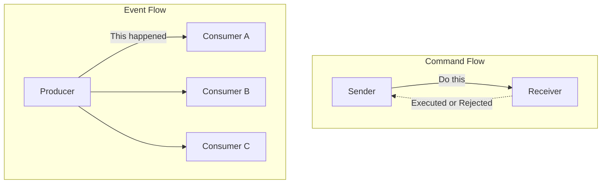
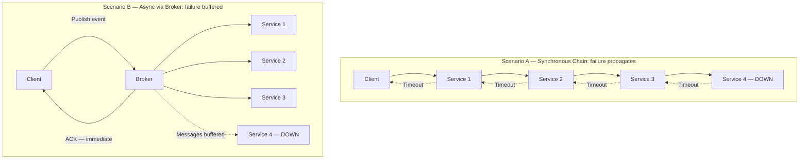

# Chapter 1: Foundations of Event-Driven Architecture

## Opening Problem Statement

Most distributed systems fail not because a single service is slow, but because every service waits on another. A payment service calls inventory, which calls shipping, which calls notifications, and the customer stares at a spinner while a chain of synchronous calls decides their fate. When one link degrades, the whole chain degrades with it. This is the pathology of **temporal coupling**: two components must be alive, reachable, and responsive at the same instant for the interaction to succeed. Senior architects know this pain intimately. It shows up as cascading timeouts, retry storms, and the 3 a.m. page where a downstream failure took the entire order pipeline offline. Event-Driven Architecture (EDA) is not a fashionable label for message queues. It is a deliberate inversion of who waits for whom. This chapter defines the atom of that inversion — the **event** — and builds the vocabulary you need to reason precisely about coupling. It is opinionated on purpose: EDA is powerful, and it is also frequently misapplied. By the end, you will know both when it earns its complexity and when it is pure over-engineering.

## The Event as an Immutable Fact of the Past

Start with the definition, because everything else depends on it. An **event** is an immutable record of something that has already happened. `OrderPlaced`, `PaymentCaptured`, `ShipmentDispatched` — each names a fact in the past tense, and each is unchangeable once emitted. You cannot un-place an order any more than you can un-ring a bell. If reality changes later, you emit a new event (`OrderCancelled`), you do not edit the old one.

This immutability is not a stylistic preference. It is the property that makes events safe to replicate, replay, and fan out to consumers the producer has never heard of.

The distinction that trips up experienced engineers is **event versus command versus message**. They are not synonyms, and conflating them corrupts your design.

| Concept | Direction | Intent | Coupling to receiver |
|---------|-----------|--------|----------------------|
| **Command** | Sender → one receiver | "Do this" (imperative, future) | Sender knows and expects a handler |
| **Event** | Producer → N consumers | "This happened" (declarative, past) | Producer knows nothing about consumers |
| **Message** | — | The transport envelope | Neither; it carries commands or events |

A **command** expresses intent and expects execution: `CapturePayment` demands that some specific handler act. It can be rejected. An **event** expresses a fact and expects nothing: `PaymentCaptured` simply announces reality to whoever cares. A **message** is neither — it is the envelope on the wire that happens to carry one or the other.

The mental flip is ownership of consequence. A command's sender owns the outcome and waits for it. An event's producer disowns the outcome entirely; consequences belong to the consumers. That single shift is the seed of decoupling.

Commands and events differ fundamentally in intent and coupling: a command targets one specific receiver and demands a response, while an event broadcasts a fact to any number of independent consumers who may or may not exist at publish time. Understanding this contrast is the first step to avoiding the design mistake of publishing commands disguised as events.



Naming discipline follows directly. Events are named in the past tense because they are facts of the past. A queue named `order-processing` is a smell; a stream named `orders.placed` is a fact. If your team is publishing something named in the imperative — `SendEmail` — you have a command masquerading as an event, and the design lie will surface later as coupling you did not intend to create.

## Temporal, Spatial, and Flow Coupling

Coupling is the currency of architecture, and it comes in more denominations than most diagrams admit. To evaluate EDA honestly, separate three distinct axes.

**Temporal coupling** means both parties must be available at the same time. In a synchronous HTTP call, if the callee is down, the caller fails now. Event-driven communication breaks this axis: the producer emits and moves on; the consumer processes whenever it is ready, even minutes later. The broker absorbs the gap.

**Spatial coupling** (also called location or reference coupling) means the caller must know the identity and address of the callee. Service A holds a URL or a client stub for Service B. Change B's location and A breaks. Publishing to a topic breaks this axis: the producer knows the topic, not the subscribers. New consumers attach without the producer ever learning their names.

**Flow coupling** means one component knows the sequence of steps the other must perform, embedding the workflow into the caller. When order-service orchestrates payment, then inventory, then shipping in a fixed sequence, it owns the business flow. Event choreography can invert this — each service reacts to facts and emits its own — though, as later chapters show, moving the flow out of code does not delete it; it relocates it into the emergent behavior of the system.

| Coupling axis | Synchronous request-response | Event-driven |
|---------------|------------------------------|--------------|
| **Temporal** | Both alive simultaneously | Decoupled via broker |
| **Spatial** | Caller knows callee address | Producer knows only the topic |
| **Flow** | Caller owns the sequence | Distributed across reactors |

The critical insight for a senior audience: EDA does not eliminate coupling. It trades explicit, compile-time coupling for implicit, runtime coupling. You gain independence in deployment and availability. You pay with a control flow that no single file describes. Whether that trade is worth it is the central question of this book.

<details>
<summary>💡 Expert Note</summary>

The three-axis coupling framework (temporal, spatial, flow) is accurate but omits a fourth axis that emerges as dominant in mature EDA systems: **semantic coupling** (also called data or content coupling). Consumers depend not just on whether a producer is reachable, but on the precise structure and meaning of the event payload. A consumer that pattern-matches on `order.status == "CONFIRMED"` is semantically coupled to that field name, that enumeration, and the business rule that determines when CONFIRMED is emitted. EDA removes the need to call the producer, but it does not remove the need to agree on what the event *means*. This axis is what makes event schema governance non-negotiable in multi-team environments — the implicit semantic contract is harder to discover and negotiate than a REST API definition because it is distributed across every consumer codebase.
</details>

<details>
<summary>⚠️ Critical Note</summary>

The coupling table lists Flow coupling in event-driven systems as "Distributed across reactors," and the prose only describes choreography as the EDA alternative to orchestration. This conflates one pattern (choreography) with the whole paradigm. Orchestration-based EDA — Saga orchestrators, AWS Step Functions, Azure Durable Functions, Temporal — centralizes flow control explicitly while still using asynchronous events between steps. A senior architect evaluating EDA for long-running business transactions will reach for orchestration precisely because distributed choreography makes it hard to reason about the overall flow. Presenting flow coupling as always "distributed" misrepresents the design space and could push practitioners toward choreography when an orchestrator is the more appropriate tool.
</details>

## Request-Response Versus Asynchronous Communication

The **request-response** model is the default because it maps to how we think: ask a question, wait for the answer. It is synchronous, blocking, and beautifully easy to debug — the stack trace tells the whole story. For a read that a user is actively waiting on, it is usually the right tool. Do not let anyone shame you out of a synchronous call where one belongs.

Its weakness is availability math. Chain five synchronous services, each with 99.9% uptime, and the composite availability is roughly 99.9% to the fifth power — about 99.5%. Every dependency you add to a synchronous path multiplies risk and latency. The system is only as available as the product of its parts.

**Asynchronous communication** decouples the request from the result. The producer hands a fact to a broker and returns immediately; consumers act on their own schedule. A consumer outage no longer propagates upstream — messages wait in the log. Availability becomes additive resilience rather than multiplicative fragility.

This diagram makes the availability cost of synchronous chains concrete: a single failing service cascades timeouts all the way back to the caller, whereas a broker-mediated async flow absorbs the failure by buffering messages, allowing the client to receive an acknowledgment immediately and the healthy consumers to continue processing independently.



The cost is real and must be stated plainly. You surrender the immediate, linear answer. You inherit eventual consistency, out-of-order arrival, duplicate delivery, and debugging across process boundaries. The stack trace no longer tells the whole story. Chapters 4, 7, and 9 are dedicated entirely to taming these costs, which is itself a signal of how much they matter.

> 💡 **Expert Note:** The prose correctly frames async communication as converting "multiplicative fragility to additive resilience," but this holds only when the broker itself achieves genuine high availability. In many early-stage or cost-optimized deployments — a single Kafka cluster in one availability zone, a managed RabbitMQ with no standby — teams have simply relocated the single point of failure to the broker. The resilience claim becomes true only with multi-AZ broker replication (Kafka MirrorMaker 2, MSK Multi-AZ, Confluent Replication), lag-based alerting, and consumer-side retry with dead-letter queues. Senior architects must audit broker HA before accepting the "buffered resilience" promise at face value; otherwise the first broker outage produces a harder incident than any synchronous chain would have.

<details>
<summary>⚠️ Critical Note</summary>

The availability arithmetic (99.9%^5 ≈ 99.5%) implicitly assumes that service failures are statistically independent. In practice, services that share a database cluster, a VPC, a cloud availability zone, or a common dependency (e.g., a secrets manager or a service mesh control plane) have correlated failure modes. When failures are correlated, the real composite availability can be significantly worse than the independence model predicts, which cuts against the chapter's argument. Presenting this as a clean multiplicative formula without the independence caveat overstates the precision of the estimate and could mislead practitioners into being either over-confident (in systems with correlated failure) or under-confident (in systems with strong blast-radius isolation).
</details>

<details>
<summary>⚠️ Critical Note</summary>

The claim "a consumer outage no longer propagates upstream — messages wait in the log" is presented as an unconditional property of asynchronous, broker-mediated communication. This is only true within the broker's retention window and storage capacity. If a consumer is offline longer than the configured retention period (e.g., Kafka's default `log.retention.hours` or a finite SQS queue depth under sustained load), messages are dropped or overwritten. For senior architects designing production systems, this distinction is operationally critical: the choice of retention policy, consumer lag monitoring, and dead-letter strategy are all load-bearing design decisions that the prose glosses over.
</details>

## The Four Event Styles: Notification and State Transfer

Martin Fowler's taxonomy of four event styles is the sharpest tool for aligning a team on what "using events" actually means. Two styles dominate practice, and choosing between them is a concrete design decision with concrete consequences.

**Event Notification** carries the bare fact and little else: an ID, a type, a timestamp. `OrderPlaced { orderId: 4471 }`. The consumer that needs more must call back to the producer to fetch details. This keeps events tiny and payloads stable, but it reintroduces spatial and temporal coupling through the callback, and it can generate a storm of read traffic back to the source.

**Event-Carried State Transfer** puts the relevant data inside the event: the order lines, the customer, the totals. The consumer needs no callback; it holds its own replica of what it cares about. This maximizes decoupling and availability — the consumer works even when the producer is down — at the price of larger payloads, data duplication across services, and the discipline of keeping replicas coherent.

The remaining two styles, **Event Sourcing** (state as a log of events) and **CQRS** (segregating the read and write models), are the deep architectural patterns this book spends Chapters 5 and 6 dissecting. Treat them as advanced; do not reach for them to solve a notification problem.

| Style | Payload | Consumer needs callback? | Primary trade-off |
|-------|---------|--------------------------|-------------------|
| **Notification** | Minimal (ID + type) | Yes, to fetch details | Small events, but callback coupling |
| **State Transfer** | Full relevant state | No | Autonomy, but duplication |
| **Event Sourcing** | The events *are* the state | N/A | Full history, high complexity |
| **CQRS** | Separate read/write models | N/A | Read scalability, dual models |

A pragmatic default for corporate microservices: start with Event-Carried State Transfer for integration between bounded contexts, so consumers stay autonomous, and reserve the heavier patterns for problems that genuinely demand them.

> 💡 **Expert Note:** Event-Carried State Transfer maximizes consumer autonomy, but it silently assumes schema stability. In practice, once fat events are in production, the event schema becomes an implicit distributed API contract that producers regularly break — adding required fields, renaming properties, changing data types. Without a schema registry enforcing a compatibility mode (Confluent Schema Registry with BACKWARD or FULL compatibility, AWS Glue Schema Registry, or Apicurio), a single producer deploy can crash every downstream consumer simultaneously at runtime with no compile-time warning. The discipline of schema evolution — versioning strategies, Avro/Protobuf/JSON Schema compatibility contracts, and dual-publish migration windows — deserves equal billing with the "fat vs thin" payload trade-off introduced here, as it is the #1 operational failure mode teams hit after adopting Event-Carried State Transfer.

> ⚠️ **Critical Note:** The prose recommends Event-Carried State Transfer (ECST) as the "pragmatic default for corporate microservices" without acknowledging that embedding state (especially PII) inside events creates serious GDPR and data-governance exposure. Once an event containing customer name, email, or payment data is replicated to N consumers, satisfying a right-to-erasure request becomes operationally complex or technically impossible without rebuilding consumer projections. For senior architects operating in regulated enterprise environments — the exact audience of this book — following this default without qualification could produce a compliance landmine that is extremely expensive to unwind after the fact.

<details>
<summary>💡 Expert Note</summary>

The pragmatic default — "start with Event-Carried State Transfer for cross-context integration" — requires a critical qualifier for corporate systems handling personal data. Fat events that carry customer PII (name, email, payment tokens, behavioral data) and are replicated to N consumers across N databases create significant GDPR Article 17 (right to erasure) and data residency exposure. When a customer requests deletion, you must identify and purge every replica in every consumer data store, which becomes an operational nightmare as the consumer count grows. Production patterns for compliant fat events include: (1) emitting only pseudonymous identifiers in the event with PII fetched via a controlled data vault, or (2) encrypting per-customer payloads with a key stored in a key-management service — revoking the key effectively erases the data in all replicas. Teams in regulated industries should validate this trade-off before adopting Event-Carried State Transfer as a blanket default.
</details>

## Decision Criteria: When to Adopt and When to Avoid

Opinions without criteria are just preferences. Here is the checklist.

**Adopt EDA when** several of these hold:
1. Producers and consumers must scale, deploy, and fail independently.
2. One fact naturally triggers many reactions (fan-out to consumers you cannot enumerate today).
3. The business tolerates — or actively wants — eventual consistency.
4. Peaks require buffering, so a broker can absorb load spikes the downstream cannot.
5. New capabilities should attach to existing flows without modifying the producer.

**Avoid EDA when** any of these dominate:
1. The interaction is a synchronous read a user is waiting on right now.
2. You need a strongly consistent, immediate answer (many financial authorizations do).
3. The system is a small monolith or a handful of services with a stable, well-understood flow.
4. Your team lacks the operational maturity for tracing, schema governance, and idempotency — the disciplines the rest of this book teaches.

This function encodes the adoption checklist from the chapter into an executable rule:
it allows teams to reason about architectural style systematically rather than by intuition alone,
and makes the maturity gate explicit — preventing premature EDA adoption, the failure mode the
chapter calls the most expensive mistake.

```python
# Decision function: maps system context flags to an architectural style recommendation
from dataclasses import dataclass


@dataclass(frozen=True)
class ArchitectureContext:
    """Captures the boolean flags that drive the EDA adoption decision."""
    needs_immediate_answer: bool          # user or system is blocked waiting for a synchronous result
    requires_strong_consistency: bool     # e.g. financial authorization — cannot tolerate stale reads
    independent_scaling: bool             # producers and consumers must scale and deploy independently
    fan_out: bool                         # one fact triggers reactions in multiple, possibly unknown, consumers
    tolerates_eventual_consistency: bool  # business domain accepts that replicas converge, not instantly
    operational_maturity: bool            # team can operate distributed tracing, schema governance, idempotency


def recommend_architecture(ctx: ArchitectureContext) -> str:
    """
    Returns one of three recommendations based on the context flags.

    Rules applied in priority order:
      1. Hard blockers for EDA → synchronous is safer
      2. Missing operational maturity → reconsider before committing
      3. Sufficient EDA signals present → prefer event-driven
      4. Default → synchronous (the simpler, more honest choice)
    """

    # Hard blockers: situations where synchronous request-response is clearly correct
    if ctx.needs_immediate_answer or ctx.requires_strong_consistency:
        return "prefer synchronous request-response"

    # Operational gate: EDA complexity is not free — check the team can absorb it
    eda_signals = sum([
        ctx.independent_scaling,
        ctx.fan_out,
        ctx.tolerates_eventual_consistency,
    ])

    if eda_signals >= 2 and not ctx.operational_maturity:
        return "reconsider — insufficient maturity for EDA"

    # Positive case: multiple EDA drivers present and team is ready
    if eda_signals >= 2 and ctx.operational_maturity:
        return "prefer event-driven"

    # Default: absent strong distribution pressures, synchronous is the honest choice
    return "prefer synchronous request-response"


# --- Example usage ---

if __name__ == "__main__":
    # Scenario A: checkout flow — user is waiting, payment requires strong consistency
    checkout = ArchitectureContext(
        needs_immediate_answer=True,
        requires_strong_consistency=True,
        independent_scaling=False,
        fan_out=False,
        tolerates_eventual_consistency=False,
        operational_maturity=True,
    )
    print(recommend_architecture(checkout))
    # Output: prefer synchronous request-response

    # Scenario B: order placed, triggers inventory + notifications + analytics
    order_placed = ArchitectureContext(
        needs_immediate_answer=False,
        requires_strong_consistency=False,
        independent_scaling=True,
        fan_out=True,
        tolerates_eventual_consistency=True,
        operational_maturity=True,
    )
    print(recommend_architecture(order_placed))
    # Output: prefer event-driven

    # Scenario C: team is new to distributed systems — maturity gate fires
    greenfield_low_maturity = ArchitectureContext(
        needs_immediate_answer=False,
        requires_strong_consistency=False,
        independent_scaling=True,
        fan_out=True,
        tolerates_eventual_consistency=True,
        operational_maturity=False,  # missing: tracing, schema governance, idempotency
    )
    print(recommend_architecture(greenfield_low_maturity))
    # Output: reconsider — insufficient maturity for EDA
```

The failure mode to fear most is premature adoption. Wrapping a two-service CRUD app in Kafka does not make it resilient; it makes it a distributed system with all the debugging pain and none of the payoff. EDA is a response to genuine distribution, scale, and independence pressures. Absent those pressures, a well-factored synchronous service is the more honest engineering choice. Reach for events when the problem is asynchronous by nature — not to appear modern.

<details>
<summary>💡 Expert Note</summary>

The "avoid EDA" criterion that references "operational maturity" is the right gate, but leaving it undefined lets teams self-certify incorrectly. In practice, minimum viable EDA operations requires at least: (1) distributed tracing with propagated correlation IDs across all producers and consumers — OpenTelemetry with a W3C TraceContext header injected into event metadata is the current industry standard; (2) dead-letter queues on every consumer with alerting on DLQ depth, not just on consumer lag; (3) a schema registry with enforced compatibility modes as described above; and (4) idempotency keys on all consumer handlers, documented and tested, because duplicate delivery is not an edge case — it is guaranteed by at-least-once brokers. A team that cannot demonstrate all four capabilities in a lower environment should defer EDA adoption regardless of how strong the scale and fan-out pressures are.
</details>

## Key Takeaways

- An **event** is an immutable fact of the past; a **command** is an intent to act; a **message** is only the envelope. Conflating them corrupts the design.
- Coupling has three axes — **temporal**, **spatial**, and **flow**. EDA loosens all three but replaces explicit coupling with implicit, runtime coupling rather than eliminating it.
- Synchronous availability is multiplicative and fragile across a chain; asynchronous, broker-mediated communication converts that into buffered resilience — at the cost of eventual consistency and harder debugging.
- **Event Notification** keeps events tiny but reintroduces callback coupling; **Event-Carried State Transfer** maximizes consumer autonomy through data duplication. Prefer the latter as the default for cross-context integration.
- Adopt EDA for independent scaling, fan-out, and load buffering; avoid it for synchronous reads, strong-consistency needs, and teams without operational maturity. Premature adoption is the most expensive mistake.

## What's Next

With the atom defined, Chapter 2 turns to designing events that express meaningful business facts — using Domain-Driven Design and Event Storming to avoid publishing technical noise as if it were a domain event.

<!-- ASSEMBLY COMPLETE
  Chapter: Foundations of Event-Driven Architecture
  Code blocks resolved: 1 / 1
  Diagrams resolved: 2 / 2
  Expert callouts (inline): 2
  Expert callouts (collapsed): 3
  Critical callouts (inline): 1
  Critical callouts (collapsed): 3
  Unresolved markers: 0
-->
