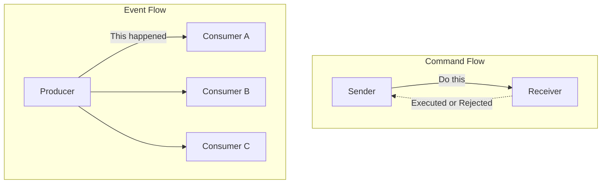
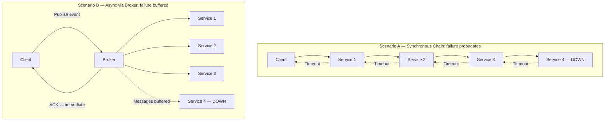

# Chapter 1: Foundations of Event-Driven Architecture

## Declaración del Problema Inicial

La mayoría de los sistemas distribuidos fallan no porque un servicio sea lento, sino porque cada servicio espera a otro. Un servicio de pagos llama a inventario, que llama a envíos, que llama a notificaciones, y el cliente mira un spinner mientras una cadena de llamadas síncronas decide su destino. Cuando un eslabón se degrada, toda la cadena se degrada con él. Esta es la patología del **acoplamiento temporal** (temporal coupling): dos componentes deben estar vivos, alcanzables y responsivos en el mismo instante para que la interacción tenga éxito. Los arquitectos senior conocen bien este dolor. Se manifiesta como timeouts en cascada, tormentas de reintentos y la llamada de las 3 a.m. en la que un fallo en un servicio descendente dejó toda la pipeline de pedidos fuera de línea. Event-Driven Architecture (EDA) no es una etiqueta de moda para colas de mensajes. Es una inversión deliberada de quién espera a quién. Este capítulo define el átomo de esa inversión — el **evento** — y construye el vocabulario que necesitas para razonar con precisión sobre el acoplamiento. Es deliberadamente opinionado: EDA es poderoso, y también se aplica mal con frecuencia. Al final, sabrás tanto cuándo justifica su complejidad como cuándo es pura sobreingeniería.

## El Evento como un Hecho Inmutable del Pasado

Comencemos con la definición, porque todo lo demás depende de ella. Un **evento** es un registro inmutable de algo que ya ocurrió. `OrderPlaced`, `PaymentCaptured`, `ShipmentDispatched` — cada uno nombra un hecho en tiempo pasado, y cada uno es inmutable una vez emitido. No puedes deshacer un pedido del mismo modo que no puedes des-tocar una campana. Si la realidad cambia después, emites un nuevo evento (`OrderCancelled`), no editas el antiguo.

Esta inmutabilidad no es una preferencia estilística. Es la propiedad que hace que los eventos sean seguros para replicar, reproducir y distribuir a consumidores que el productor nunca conoció.

La distinción que confunde a los ingenieros experimentados es **evento versus comando versus mensaje**. No son sinónimos, y confundirlos corrompe tu diseño.

| Concepto | Dirección | Intención | Acoplamiento al receptor |
|---------|-----------|--------|----------------------|
| **Command** | Emisor → un receptor | "Haz esto" (imperativo, futuro) | El emisor conoce y espera un handler |
| **Event** | Productor → N consumidores | "Esto ocurrió" (declarativo, pasado) | El productor no sabe nada sobre los consumidores |
| **Message** | — | El sobre de transporte | Ninguno; transporta comandos o eventos |

Un **command** expresa intención y espera ejecución: `CapturePayment` exige que algún handler específico actúe. Puede ser rechazado. Un **event** expresa un hecho y no espera nada: `PaymentCaptured` simplemente anuncia la realidad a quien le interese. Un **message** no es ninguno de los dos — es el sobre en el cable que lleva uno u otro.

El cambio mental es la propiedad de la consecuencia. El emisor de un command es dueño del resultado y lo espera. El productor de un event desposee completamente el resultado; las consecuencias pertenecen a los consumidores. Ese único cambio es la semilla del desacoplamiento.

Los commands y los events difieren fundamentalmente en intención y acoplamiento: un command apunta a un receptor específico y exige una respuesta, mientras que un event transmite un hecho a cualquier número de consumidores independientes que pueden o no existir en el momento de la publicación. Comprender este contraste es el primer paso para evitar el error de diseño de publicar commands disfrazados de events.



La disciplina de nomenclatura se deriva directamente de esto. Los eventos se nombran en tiempo pasado porque son hechos del pasado. Una cola llamada `order-processing` es un indicio de problema; un stream llamado `orders.placed` es un hecho. Si tu equipo está publicando algo nombrado en imperativo — `SendEmail` — tienes un command disfrazado de event, y la mentira de diseño se manifestará más tarde como acoplamiento que no pretendías crear.

## Acoplamiento Temporal, Espacial y de Flujo

El acoplamiento es la moneda de la arquitectura, y viene en más denominaciones de las que la mayoría de los diagramas admite. Para evaluar EDA honestamente, separa tres ejes distintos.

El **acoplamiento temporal** significa que ambas partes deben estar disponibles al mismo tiempo. En una llamada HTTP síncrona, si el destinatario está caído, el llamador falla ahora. La comunicación orientada a eventos rompe este eje: el productor emite y continúa; el consumidor procesa cuando esté listo, incluso minutos después. El broker absorbe la brecha.

El **acoplamiento espacial** (también llamado acoplamiento de ubicación o referencia) significa que el llamador debe conocer la identidad y la dirección del destinatario. El Servicio A mantiene una URL o un stub de cliente para el Servicio B. Cambia la ubicación de B y A se rompe. Publicar en un topic rompe este eje: el productor conoce el topic, no los suscriptores. Nuevos consumidores se conectan sin que el productor aprenda nunca sus nombres.

El **acoplamiento de flujo** significa que un componente conoce la secuencia de pasos que el otro debe realizar, incrustando el flujo de trabajo en el llamador. Cuando order-service orquesta pago, luego inventario, luego envío en una secuencia fija, posee el flujo de negocio. La coreografía de eventos puede invertir esto — cada servicio reacciona a hechos y emite los suyos propios — aunque, como muestran los capítulos posteriores, mover el flujo fuera del código no lo elimina; lo reubica en el comportamiento emergente del sistema.

| Eje de acoplamiento | Request-response síncrono | Event-driven |
|---------------|------------------------------|--------------|
| **Temporal** | Ambos vivos simultáneamente | Desacoplado vía broker |
| **Espacial** | El llamador conoce la dirección del destinatario | El productor conoce solo el topic |
| **Flujo** | El llamador posee la secuencia | Distribuido entre reactores |

La visión crítica para una audiencia senior: EDA no elimina el acoplamiento. Intercambia acoplamiento explícito en tiempo de compilación por acoplamiento implícito en tiempo de ejecución. Ganas independencia en despliegue y disponibilidad. Pagas con un flujo de control que ningún archivo describe de forma completa. Si ese intercambio vale la pena es la pregunta central de este libro.

<details>
<summary>💡 Nota del Experto</summary>

El marco de acoplamiento de tres ejes (temporal, espacial, de flujo) es preciso pero omite un cuarto eje que emerge como dominante en sistemas EDA maduros: el **acoplamiento semántico** (también llamado acoplamiento de datos o de contenido). Los consumidores dependen no solo de si un productor es alcanzable, sino de la estructura y el significado precisos del payload del evento. Un consumidor que hace pattern-matching sobre `order.status == "CONFIRMED"` está semánticamente acoplado a ese nombre de campo, esa enumeración y la regla de negocio que determina cuándo se emite CONFIRMED. EDA elimina la necesidad de llamar al productor, pero no elimina la necesidad de acordar qué *significa* el evento. Este eje es lo que hace que la gobernanza de esquemas de eventos sea innegociable en entornos de múltiples equipos — el contrato semántico implícito es más difícil de descubrir y negociar que una definición de API REST porque está distribuido en cada codebase de consumidores.
</details>

<details>
<summary>⚠️ Nota Crítica</summary>

La tabla de acoplamiento lista el acoplamiento de Flujo en sistemas event-driven como "Distribuido entre reactores", y el texto solo describe la coreografía como la alternativa EDA a la orquestación. Esto conflaciona un patrón (coreografía) con todo el paradigma. EDA basada en orquestación — orquestadores de Saga, AWS Step Functions, Azure Durable Functions, Temporal — centraliza el control de flujo explícitamente mientras sigue usando eventos asíncronos entre pasos. Un arquitecto senior que evalúa EDA para transacciones de negocio de larga duración recurrirá a la orquestación precisamente porque la coreografía distribuida dificulta el razonamiento sobre el flujo general. Presentar el acoplamiento de flujo como siempre "distribuido" tergiversa el espacio de diseño y podría llevar a los profesionales hacia la coreografía cuando un orquestador es la herramienta más apropiada.
</details>

## Request-Response Versus Comunicación Asíncrona

El modelo **request-response** es el predeterminado porque se mapea a cómo pensamos: hacer una pregunta, esperar la respuesta. Es síncrono, bloqueante y maravillosamente fácil de depurar — el stack trace cuenta toda la historia. Para una lectura que un usuario está esperando activamente, generalmente es la herramienta correcta. No permitas que nadie te avergüence por usar una llamada síncrona donde corresponde.

Su debilidad es la aritmética de disponibilidad. Encadena cinco servicios síncronos, cada uno con 99.9% de uptime, y la disponibilidad compuesta es aproximadamente 99.9% elevado a la quinta potencia — alrededor del 99.5%. Cada dependencia que agregas a una ruta síncrona multiplica el riesgo y la latencia. El sistema es tan disponible como el producto de sus partes.

La **comunicación asíncrona** desacopla la solicitud del resultado. El productor entrega un hecho a un broker y regresa de inmediato; los consumidores actúan según su propio horario. Una interrupción del consumidor ya no se propaga aguas arriba — los mensajes esperan en el log. La disponibilidad se convierte en resiliencia aditiva en lugar de fragilidad multiplicativa.

Este diagrama hace concreto el costo de disponibilidad de las cadenas síncronas: un único servicio fallido propaga timeouts hasta el llamador, mientras que un flujo async mediado por broker absorbe el fallo almacenando mensajes en buffer, permitiendo al cliente recibir un acuse de recibo inmediatamente y que los consumidores sanos continúen procesando de forma independiente.



El costo es real y debe expresarse con claridad. Renuncias a la respuesta inmediata y lineal. Heredas consistencia eventual, llegada desordenada, entrega duplicada y depuración a través de límites de proceso. El stack trace ya no cuenta toda la historia. Los capítulos 4, 7 y 9 están dedicados íntegramente a domar estos costos, lo cual es en sí mismo una señal de cuánto importan.

> 💡 **Nota del Experto:** El texto enmarca correctamente la comunicación async como la conversión de "fragilidad multiplicativa en resiliencia aditiva", pero esto solo se sostiene cuando el broker en sí mismo alcanza una alta disponibilidad genuina. En muchos despliegues de etapa temprana u optimizados en costo — un único clúster de Kafka en una zona de disponibilidad, un RabbitMQ administrado sin standby — los equipos simplemente han reubicado el punto único de fallo en el broker. La afirmación de resiliencia solo se vuelve verdadera con replicación multi-AZ del broker (Kafka MirrorMaker 2, MSK Multi-AZ, Confluent Replication), alertas basadas en lag, y reintentos del lado del consumidor con dead-letter queues. Los arquitectos senior deben auditar la HA del broker antes de aceptar la promesa de "resiliencia en buffer" a valor nominal; de lo contrario, la primera interrupción del broker produce un incidente más difícil que cualquier cadena síncrona.

<details>
<summary>⚠️ Nota Crítica</summary>

La aritmética de disponibilidad (99.9%^5 ≈ 99.5%) asume implícitamente que los fallos de los servicios son estadísticamente independientes. En la práctica, los servicios que comparten un clúster de base de datos, una VPC, una zona de disponibilidad en la nube o una dependencia común (por ejemplo, un secrets manager o un control plane de service mesh) tienen modos de fallo correlacionados. Cuando los fallos están correlacionados, la disponibilidad compuesta real puede ser significativamente peor de lo que predice el modelo de independencia, lo que va en contra del argumento del capítulo. Presentar esto como una fórmula multiplicativa limpia sin la advertencia de independencia exagera la precisión de la estimación y podría llevar a los profesionales a tener exceso de confianza (en sistemas con fallos correlacionados) o falta de confianza (en sistemas con un fuerte aislamiento de blast radius).
</details>

<details>
<summary>⚠️ Nota Crítica</summary>

La afirmación "una interrupción del consumidor ya no se propaga aguas arriba — los mensajes esperan en el log" se presenta como una propiedad incondicional de la comunicación asíncrona mediada por broker. Esto solo es cierto dentro de la ventana de retención y la capacidad de almacenamiento del broker. Si un consumidor está fuera de línea por más tiempo que el período de retención configurado (por ejemplo, el `log.retention.hours` predeterminado de Kafka o una profundidad finita de cola SQS bajo carga sostenida), los mensajes se descartan o se sobreescriben. Para los arquitectos senior que diseñan sistemas de producción, esta distinción es operacionalmente crítica: la elección de la política de retención, el monitoreo del consumer lag y la estrategia de dead-letter son todas decisiones de diseño estructurales que el texto pasa por alto.
</details>

## Los Cuatro Estilos de Eventos: Notificación y Transferencia de Estado

La taxonomía de cuatro estilos de eventos de Martin Fowler es la herramienta más precisa para alinear a un equipo sobre lo que realmente significa "usar eventos". Dos estilos dominan la práctica, y elegir entre ellos es una decisión de diseño concreta con consecuencias concretas.

**Event Notification** (notificación de evento) lleva el hecho básico y poco más: un ID, un tipo, un timestamp. `OrderPlaced { orderId: 4471 }`. El consumidor que necesita más debe volver a llamar al productor para obtener los detalles. Esto mantiene los eventos pequeños y los payloads estables, pero reintroduce el acoplamiento espacial y temporal a través del callback, y puede generar una tormenta de tráfico de lectura de vuelta a la fuente.

**Event-Carried State Transfer** (transferencia de estado llevada por el evento) pone los datos relevantes dentro del evento: las líneas del pedido, el cliente, los totales. El consumidor no necesita ningún callback; mantiene su propia réplica de lo que le importa. Esto maximiza el desacoplamiento y la disponibilidad — el consumidor funciona incluso cuando el productor está caído — al precio de payloads más grandes, duplicación de datos entre servicios y la disciplina de mantener las réplicas coherentes.

Los dos estilos restantes, **Event Sourcing** (almacenamiento de eventos) (el estado como un log de eventos) y **CQRS** (segregación de los modelos de lectura y escritura), son los patrones arquitectónicos profundos que este libro disecciona en los Capítulos 5 y 6. Tratalos como avanzados; no los uses para resolver un problema de notificación.

| Estilo | Payload | ¿El consumidor necesita callback? | Trade-off principal |
|-------|---------|--------------------------|-------------------|
| **Notification** | Mínimo (ID + tipo) | Sí, para obtener detalles | Eventos pequeños, pero acoplamiento de callback |
| **State Transfer** | Estado relevante completo | No | Autonomía, pero duplicación |
| **Event Sourcing** | Los eventos *son* el estado | N/A | Historial completo, alta complejidad |
| **CQRS** | Modelos de lectura/escritura separados | N/A | Escalabilidad de lectura, modelos duales |

Un valor predeterminado pragmático para microservicios corporativos: comienza con Event-Carried State Transfer para la integración entre bounded contexts, para que los consumidores permanezcan autónomos, y reserva los patrones más pesados para problemas que genuinamente los requieran.

> 💡 **Nota del Experto:** Event-Carried State Transfer maximiza la autonomía del consumidor, pero asume silenciosamente la estabilidad del esquema. En la práctica, una vez que los fat events están en producción, el esquema del evento se convierte en un contrato de API distribuido implícito que los productores rompen regularmente — agregando campos requeridos, renombrando propiedades, cambiando tipos de datos. Sin un schema registry que aplique un modo de compatibilidad (Confluent Schema Registry con compatibilidad BACKWARD o FULL, AWS Glue Schema Registry, o Apicurio), un único despliegue del productor puede crashear todos los consumidores descendentes simultáneamente en tiempo de ejecución sin ninguna advertencia en tiempo de compilación. La disciplina de evolución de esquemas — estrategias de versionado, contratos de compatibilidad Avro/Protobuf/JSON Schema y ventanas de migración de publicación dual — merece igual protagonismo que el trade-off de payload "fat vs thin" introducido aquí, ya que es el modo de fallo operacional número 1 que los equipos encuentran después de adoptar Event-Carried State Transfer.

> ⚠️ **Nota Crítica:** El texto recomienda Event-Carried State Transfer (ECST) como el "valor predeterminado pragmático para microservicios corporativos" sin reconocer que incrustar estado (especialmente PII) dentro de eventos crea una exposición seria al RGPD y a la gobernanza de datos. Una vez que un evento que contiene nombre de cliente, correo electrónico o datos de pago se replica a N consumidores, satisfacer una solicitud de derecho al olvido se vuelve operacionalmente complejo o técnicamente imposible sin reconstruir las proyecciones de los consumidores. Para los arquitectos senior que operan en entornos empresariales regulados — la audiencia exacta de este libro — seguir este valor predeterminado sin calificación podría producir una mina de cumplimiento que es extremadamente costosa de deshacer a posteriori.

<details>
<summary>💡 Nota del Experto</summary>

El valor predeterminado pragmático — "comenzar con Event-Carried State Transfer para la integración entre contextos" — requiere un calificador crítico para los sistemas corporativos que manejan datos personales. Los fat events que llevan PII de clientes (nombre, correo electrónico, tokens de pago, datos de comportamiento) y se replican a N consumidores en N bases de datos crean una exposición significativa al Artículo 17 del RGPD (derecho de supresión) y a la residencia de datos. Cuando un cliente solicita la eliminación, debes identificar y purgar cada réplica en cada almacén de datos de cada consumidor, lo que se convierte en una pesadilla operacional a medida que crece el número de consumidores. Los patrones de producción para fat events conformes incluyen: (1) emitir solo identificadores pseudónimos en el evento con PII obtenida a través de un data vault controlado, o (2) cifrar los payloads por cliente con una clave almacenada en un key-management service — revocar la clave elimina efectivamente los datos en todas las réplicas. Los equipos en industrias reguladas deben validar este trade-off antes de adoptar Event-Carried State Transfer como valor predeterminado general.
</details>

## Criterios de Decisión: Cuándo Adoptar y Cuándo Evitar

Las opiniones sin criterios son solo preferencias. Aquí está la lista de verificación.

**Adopta EDA cuando** varios de estos aplican:
1. Los productores y consumidores deben escalar, desplegarse y fallar de forma independiente.
2. Un hecho desencadena naturalmente muchas reacciones (fan-out a consumidores que no puedes enumerar hoy).
3. El negocio tolera — o quiere activamente — consistencia eventual.
4. Los picos requieren almacenamiento en buffer, para que un broker pueda absorber picos de carga que el downstream no puede.
5. Las nuevas capacidades deben conectarse a los flujos existentes sin modificar al productor.

**Evita EDA cuando** alguno de estos domina:
1. La interacción es una lectura síncrona que un usuario está esperando ahora mismo.
2. Necesitas una respuesta inmediata y fuertemente consistente (muchas autorizaciones financieras requieren esto).
3. El sistema es un monolito pequeño o un puñado de servicios con un flujo estable y bien entendido.
4. Tu equipo carece de la madurez operacional para tracing, gobernanza de esquemas e idempotencia — las disciplinas que el resto de este libro enseña.

Esta función codifica la lista de verificación de adopción del capítulo en una regla ejecutable: permite a los equipos razonar sobre el estilo arquitectónico de forma sistemática en lugar de por intuición sola, y hace explícita la barrera de madurez — evitando la adopción prematura de EDA, el modo de fallo que el capítulo llama el error más costoso.

```python
# Decision function: maps system context flags to an architectural style recommendation
from dataclasses import dataclass


@dataclass(frozen=True)
class ArchitectureContext:
    """Captures the boolean flags that drive the EDA adoption decision."""
    needs_immediate_answer: bool          # user or system is blocked waiting for a synchronous result
    requires_strong_consistency: bool     # e.g. financial authorization — cannot tolerate stale reads
    independent_scaling: bool             # producers and consumers must scale and deploy independently
    fan_out: bool                         # one fact triggers reactions in multiple, possibly unknown, consumers
    tolerates_eventual_consistency: bool  # business domain accepts that replicas converge, not instantly
    operational_maturity: bool            # team can operate distributed tracing, schema governance, idempotency


def recommend_architecture(ctx: ArchitectureContext) -> str:
    """
    Returns one of three recommendations based on the context flags.

    Rules applied in priority order:
      1. Hard blockers for EDA → synchronous is safer
      2. Missing operational maturity → reconsider before committing
      3. Sufficient EDA signals present → prefer event-driven
      4. Default → synchronous (the simpler, more honest choice)
    """

    # Hard blockers: situations where synchronous request-response is clearly correct
    if ctx.needs_immediate_answer or ctx.requires_strong_consistency:
        return "prefer synchronous request-response"

    # Operational gate: EDA complexity is not free — check the team can absorb it
    eda_signals = sum([
        ctx.independent_scaling,
        ctx.fan_out,
        ctx.tolerates_eventual_consistency,
    ])

    if eda_signals >= 2 and not ctx.operational_maturity:
        return "reconsider — insufficient maturity for EDA"

    # Positive case: multiple EDA drivers present and team is ready
    if eda_signals >= 2 and ctx.operational_maturity:
        return "prefer event-driven"

    # Default: absent strong distribution pressures, synchronous is the honest choice
    return "prefer synchronous request-response"


# --- Example usage ---

if __name__ == "__main__":
    # Scenario A: checkout flow — user is waiting, payment requires strong consistency
    checkout = ArchitectureContext(
        needs_immediate_answer=True,
        requires_strong_consistency=True,
        independent_scaling=False,
        fan_out=False,
        tolerates_eventual_consistency=False,
        operational_maturity=True,
    )
    print(recommend_architecture(checkout))
    # Output: prefer synchronous request-response

    # Scenario B: order placed, triggers inventory + notifications + analytics
    order_placed = ArchitectureContext(
        needs_immediate_answer=False,
        requires_strong_consistency=False,
        independent_scaling=True,
        fan_out=True,
        tolerates_eventual_consistency=True,
        operational_maturity=True,
    )
    print(recommend_architecture(order_placed))
    # Output: prefer event-driven

    # Scenario C: team is new to distributed systems — maturity gate fires
    greenfield_low_maturity = ArchitectureContext(
        needs_immediate_answer=False,
        requires_strong_consistency=False,
        independent_scaling=True,
        fan_out=True,
        tolerates_eventual_consistency=True,
        operational_maturity=False,  # missing: tracing, schema governance, idempotency
    )
    print(recommend_architecture(greenfield_low_maturity))
    # Output: reconsider — insufficient maturity for EDA
```

El modo de fallo que más hay que temer es la adopción prematura. Envolver una aplicación CRUD de dos servicios en Kafka no la hace resiliente; la convierte en un sistema distribuido con todo el dolor de depuración y ninguno de los beneficios. EDA es una respuesta a presiones genuinas de distribución, escala e independencia. Sin esas presiones, un servicio síncrono bien estructurado es la elección de ingeniería más honesta. Recurre a los eventos cuando el problema es asíncrono por naturaleza — no para parecer moderno.

<details>
<summary>💡 Nota del Experto</summary>

El criterio "evitar EDA" que hace referencia a la "madurez operacional" es la barrera correcta, pero dejarlo sin definir permite que los equipos se autocertifiquen incorrectamente. En la práctica, las operaciones mínimas viables de EDA requieren al menos: (1) distributed tracing con IDs de correlación propagados en todos los productores y consumidores — OpenTelemetry con un header W3C TraceContext inyectado en los metadatos del evento es el estándar actual de la industria; (2) dead-letter queues en cada consumidor con alertas sobre la profundidad de la DLQ, no solo sobre el consumer lag; (3) un schema registry con modos de compatibilidad aplicados como se describe anteriormente; y (4) claves de idempotencia en todos los handlers de consumidores, documentadas y probadas, porque la entrega duplicada no es un caso extremo — está garantizada por los brokers at-least-once. Un equipo que no puede demostrar las cuatro capacidades en un entorno inferior debe aplazar la adopción de EDA independientemente de cuán fuertes sean las presiones de escala y fan-out.
</details>

## Conclusiones Clave

- Un **event** es un hecho inmutable del pasado; un **command** es una intención de actuar; un **message** es solo el sobre. Confundirlos corrompe el diseño.
- El acoplamiento tiene tres ejes — **temporal**, **espacial** y **de flujo**. EDA afloja los tres, pero reemplaza el acoplamiento explícito por acoplamiento implícito en tiempo de ejecución en lugar de eliminarlo.
- La disponibilidad síncrona es multiplicativa y frágil a lo largo de una cadena; la comunicación asíncrona mediada por broker convierte eso en resiliencia con buffer — al costo de consistencia eventual y depuración más difícil.
- **Event Notification** mantiene los eventos pequeños pero reintroduce el acoplamiento de callback; **Event-Carried State Transfer** maximiza la autonomía del consumidor mediante la duplicación de datos. Prefiere este último como valor predeterminado para la integración entre contextos.
- Adopta EDA para escala independiente, fan-out y almacenamiento de carga en buffer; evítalo para lecturas síncronas, necesidades de consistencia fuerte y equipos sin madurez operacional. La adopción prematura es el error más costoso.

## Qué Sigue

Con el átomo definido, el Capítulo 2 se centra en diseñar eventos que expresen hechos de negocio significativos — usando Domain-Driven Design y Event Storming para evitar publicar ruido técnico como si fuera un evento de dominio.

<!-- ASSEMBLY COMPLETE
  Chapter: Foundations of Event-Driven Architecture
  Code blocks resolved: 1 / 1
  Diagrams resolved: 2 / 2
  Expert callouts (inline): 2
  Expert callouts (collapsed): 3
  Critical callouts (inline): 1
  Critical callouts (collapsed): 3
  Unresolved markers: 0
-->
