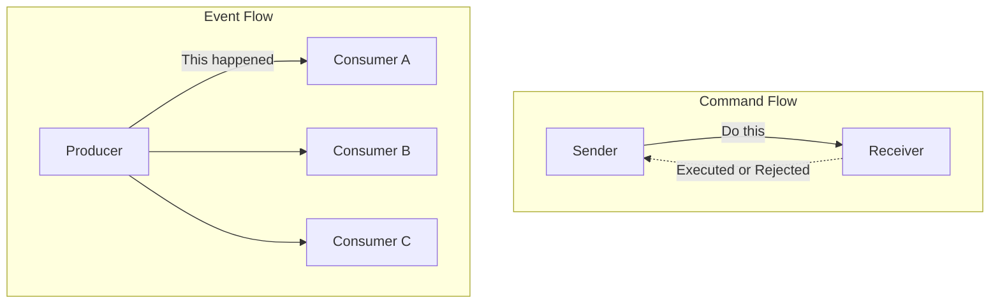
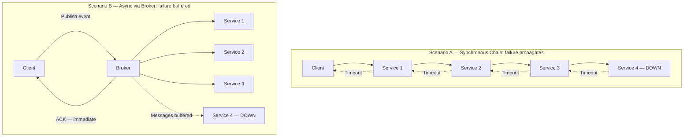

# Capítulo 1: Fundamentos da Arquitetura Baseada em Eventos

## Declaração do Problema Inicial

A maioria dos sistemas distribuídos falha não porque um único serviço é lento, mas porque cada serviço espera pelo outro. Um serviço de pagamento chama o estoque, que chama o envio, que chama as notificações, e o cliente fica olhando para um ícone de carregamento enquanto uma cadeia de chamadas síncronas decide o seu destino. Quando um elo degrada, toda a cadeia degrada com ele. Essa é a patologia do **acoplamento temporal** (temporal coupling): dois componentes precisam estar ativos, acessíveis e responsivos ao mesmo instante para que a interação seja bem-sucedida. Arquitetos sênior conhecem bem essa dor. Ela se manifesta como timeouts em cascata, tempestades de retentativas e o alerta das 3 da manhã em que uma falha downstream derrubou todo o pipeline de pedidos. A Event-Driven Architecture (EDA) não é um rótulo fashionista para filas de mensagens. É uma inversão deliberada de quem espera por quem. Este capítulo define o átomo dessa inversão — o **evento** — e constrói o vocabulário necessário para raciocinar com precisão sobre acoplamento. É opinativo de propósito: EDA é poderosa e também frequentemente mal aplicada. Ao final, você saberá tanto quando ela justifica sua complexidade quanto quando é puro over-engineering.

## O Evento como um Fato Imutável do Passado

Comece pela definição, pois tudo o mais depende dela. Um **evento** é um registro imutável de algo que já aconteceu. `OrderPlaced`, `PaymentCaptured`, `ShipmentDispatched` — cada um nomeia um fato no passado, e cada um é inalterável após ser emitido. Você não pode desfazer um pedido assim como não pode destocar um sino. Se a realidade mudar depois, você emite um novo evento (`OrderCancelled`); não edita o antigo.

Essa imutabilidade não é uma preferência estilística. É a propriedade que torna os eventos seguros para replicar, reproduzir e distribuir a consumidores que o produtor jamais conheceu.

A distinção que confunde engenheiros experientes é **evento versus comando versus mensagem**. Não são sinônimos, e confundi-los corrompe o seu design.

| Conceito | Direção | Intenção | Acoplamento com o receptor |
|---------|-----------|--------|----------------------|
| **Command** | Remetente → um receptor | "Faça isto" (imperativo, futuro) | Remetente conhece e espera um handler |
| **Event** | Produtor → N consumidores | "Isso aconteceu" (declarativo, passado) | Produtor não sabe nada sobre os consumidores |
| **Message** | — | O envelope de transporte | Nenhum; carrega comandos ou eventos |

Um **command** expressa intenção e espera execução: `CapturePayment` exige que algum handler específico aja. Pode ser rejeitado. Um **event** expressa um fato e não espera nada: `PaymentCaptured` simplesmente anuncia a realidade a quem se importar. Uma **message** não é nenhum dos dois — é o envelope no fio que carrega um ou outro.

A virada mental é a propriedade da consequência. O remetente de um comando possui o resultado e aguarda por ele. O produtor de um evento abre mão totalmente do resultado; as consequências pertencem aos consumidores. Essa única mudança é a semente do desacoplamento.

Comandos e eventos diferem fundamentalmente em intenção e acoplamento: um comando visa um receptor específico e exige resposta, enquanto um evento transmite um fato para qualquer número de consumidores independentes que podem ou não existir no momento da publicação. Compreender esse contraste é o primeiro passo para evitar o erro de design de publicar comandos disfarçados de eventos.



A disciplina de nomenclatura decorre diretamente disso. Eventos são nomeados no passado porque são fatos do passado. Uma fila chamada `order-processing` é um sinal de alerta; um stream chamado `orders.placed` é um fato. Se sua equipe está publicando algo nomeado no imperativo — `SendEmail` — você tem um comando se disfarçando de evento, e a mentira de design vai aflorar mais tarde como acoplamento que você não pretendia criar.

## Acoplamento Temporal, Espacial e de Fluxo

Acoplamento é a moeda da arquitetura e vem em mais denominações do que a maioria dos diagramas admite. Para avaliar EDA com honestidade, separe três eixos distintos.

**Acoplamento temporal** (temporal coupling) significa que ambas as partes precisam estar disponíveis ao mesmo tempo. Em uma chamada HTTP síncrona, se o receptor estiver fora do ar, o chamador falha agora. A comunicação orientada a eventos quebra esse eixo: o produtor emite e segue em frente; o consumidor processa quando estiver pronto, mesmo minutos depois. O broker absorve a lacuna.

**Acoplamento espacial** (spatial coupling), também chamado de acoplamento de localização ou referência, significa que o chamador precisa conhecer a identidade e o endereço do receptor. O Serviço A mantém uma URL ou um stub de cliente para o Serviço B. Mude a localização de B e A quebra. Publicar em um tópico quebra esse eixo: o produtor conhece o tópico, não os assinantes. Novos consumidores se conectam sem que o produtor jamais saiba seus nomes.

**Acoplamento de fluxo** (flow coupling) significa que um componente conhece a sequência de etapas que o outro deve executar, incorporando o fluxo de trabalho no chamador. Quando o order-service orquestra pagamento, depois estoque, depois envio em uma sequência fixa, ele é dono do fluxo de negócio. A coreografia de eventos pode inverter isso — cada serviço reage a fatos e emite os seus próprios —, embora, como capítulos posteriores mostram, mover o fluxo para fora do código não o elimina; apenas o reloca no comportamento emergente do sistema.

| Eixo de acoplamento | Request-response síncrono | Orientado a eventos |
|---------------|------------------------------|--------------|
| **Temporal** | Ambos ativos simultaneamente | Desacoplado via broker |
| **Espacial** | Chamador conhece o endereço do receptor | Produtor conhece apenas o tópico |
| **Fluxo** | Chamador é dono da sequência | Distribuído entre os reatores |

O insight crítico para uma audiência sênior: EDA não elimina o acoplamento. Ele troca acoplamento explícito em tempo de compilação por acoplamento implícito em tempo de execução. Você ganha independência em implantação e disponibilidade. Você paga com um fluxo de controle que nenhum arquivo descreve sozinho. Se essa troca vale a pena é a questão central deste livro.

<details>
<summary>💡 Nota do Especialista</summary>

O framework de acoplamento em três eixos (temporal, espacial, de fluxo) é preciso, mas omite um quarto eixo que emerge como dominante em sistemas EDA maduros: o **acoplamento semântico** (também chamado de acoplamento de dados ou conteúdo). Os consumidores dependem não apenas de se um produtor está acessível, mas da estrutura precisa e do significado do payload do evento. Um consumidor que faz pattern-matching em `order.status == "CONFIRMED"` está semanticamente acoplado a esse nome de campo, a essa enumeração e à regra de negócio que determina quando CONFIRMED é emitido. A EDA remove a necessidade de chamar o produtor, mas não remove a necessidade de concordar sobre o que o evento *significa*. Esse eixo é o que torna a governança de esquemas de eventos inegociável em ambientes multitimes — o contrato semântico implícito é mais difícil de descobrir e negociar do que uma definição de API REST, porque está distribuído por todas as bases de código dos consumidores.
</details>

<details>
<summary>⚠️ Nota Crítica</summary>

A tabela de acoplamento lista o acoplamento de fluxo em sistemas orientados a eventos como "Distribuído entre os reatores", e o texto descreve apenas a coreografia como a alternativa EDA à orquestração. Isso conflate um padrão (coreografia) com todo o paradigma. EDA baseada em orquestração — orquestradores de Saga, AWS Step Functions, Azure Durable Functions, Temporal — centraliza o controle de fluxo explicitamente enquanto ainda usa eventos assíncronos entre os passos. Um arquiteto sênior avaliando EDA para transações de negócio de longa duração vai recorrer à orquestração precisamente porque a coreografia distribuída dificulta o raciocínio sobre o fluxo geral. Apresentar o acoplamento de fluxo como sempre "distribuído" deturpa o espaço de design e poderia levar profissionais a adotar coreografia quando um orquestrador é a ferramenta mais adequada.
</details>

## Request-Response Versus Comunicação Assíncrona

O modelo **request-response** é o padrão porque mapeia como pensamos: faça uma pergunta, espere a resposta. É síncrono, bloqueante e lindamente fácil de depurar — o stack trace conta a história completa. Para uma leitura pela qual um usuário está ativamente esperando, geralmente é a ferramenta certa. Não deixe ninguém te envergonhar por usar uma chamada síncrona onde ela é adequada.

Sua fraqueza é a matemática de disponibilidade. Encadeie cinco serviços síncronos, cada um com 99,9% de uptime, e a disponibilidade composta é aproximadamente 99,9% elevado à quinta potência — cerca de 99,5%. Cada dependência que você adiciona a um caminho síncrono multiplica o risco e a latência. O sistema é apenas tão disponível quanto o produto de suas partes.

A **comunicação assíncrona** desacopla a requisição do resultado. O produtor entrega um fato a um broker e retorna imediatamente; os consumidores agem conforme seu próprio cronograma. Uma falha de consumidor não se propaga mais para upstream — as mensagens aguardam no log. A disponibilidade se torna resiliência aditiva em vez de fragilidade multiplicativa.

Este diagrama torna concreto o custo de disponibilidade das cadeias síncronas: um único serviço com falha cascateia timeouts de volta ao chamador, enquanto um fluxo assíncrono mediado por broker absorve a falha ao tamponar as mensagens, permitindo que o cliente receba um acknowledgment imediatamente e que os consumidores saudáveis continuem processando de forma independente.



O custo é real e deve ser declarado com clareza. Você abre mão da resposta imediata e linear. Você herda consistência eventual, chegada fora de ordem, entrega duplicada e depuração entre limites de processo. O stack trace não conta mais a história completa. Os Capítulos 4, 7 e 9 são dedicados inteiramente a domar esses custos — o que por si só é um sinal de quanto eles importam.

> 💡 **Nota do Especialista:** O texto enquadra corretamente a comunicação assíncrona como a conversão de "fragilidade multiplicativa em resiliência aditiva", mas isso só se sustenta quando o próprio broker atinge alta disponibilidade genuína. Em muitas implantações em estágio inicial ou otimizadas por custo — um único cluster Kafka em uma zona de disponibilidade, um RabbitMQ gerenciado sem standby — as equipes simplesmente realocaram o ponto único de falha para o broker. A afirmação de resiliência só se torna verdadeira com replicação de broker multi-AZ (Kafka MirrorMaker 2, MSK Multi-AZ, Confluent Replication), alertas baseados em lag e retry do lado do consumidor com dead-letter queues. Arquitetos sênior devem auditar a HA do broker antes de aceitar a promessa de "resiliência tamponada" pelo valor de face; caso contrário, a primeira falha de broker produz um incidente mais grave do que qualquer cadeia síncrona jamais produziria.

<details>
<summary>⚠️ Nota Crítica</summary>

A aritmética de disponibilidade (99,9%^5 ≈ 99,5%) pressupõe implicitamente que as falhas de serviço são estatisticamente independentes. Na prática, serviços que compartilham um cluster de banco de dados, uma VPC, uma zona de disponibilidade de nuvem ou uma dependência comum (por exemplo, um secrets manager ou um service mesh control plane) têm modos de falha correlacionados. Quando as falhas são correlacionadas, a disponibilidade composta real pode ser significativamente pior do que o modelo de independência prevê, o que enfraquece o argumento do capítulo. Apresentar isso como uma fórmula multiplicativa limpa sem a ressalva de independência superestima a precisão da estimativa e pode induzir profissionais ao erro — tanto na super-confiança (em sistemas com falha correlacionada) quanto na sub-confiança (em sistemas com forte isolamento de blast radius).
</details>

<details>
<summary>⚠️ Nota Crítica</summary>

A afirmação "uma falha de consumidor não se propaga mais para upstream — as mensagens aguardam no log" é apresentada como uma propriedade incondicional da comunicação assíncrona mediada por broker. Isso só é verdade dentro da janela de retenção e da capacidade de armazenamento do broker. Se um consumidor ficar offline por mais tempo do que o período de retenção configurado (por exemplo, o `log.retention.hours` padrão do Kafka ou uma profundidade de fila SQS finita sob carga sustentada), as mensagens são descartadas ou sobrescritas. Para arquitetos sênior projetando sistemas de produção, essa distinção é operacionalmente crítica: a escolha da política de retenção, o monitoramento de consumer lag e a estratégia de dead-letter são todas decisões de design estruturais que o texto passa por cima.
</details>

## Os Quatro Estilos de Evento: Notificação e Transferência de Estado

A taxonomia de quatro estilos de eventos de Martin Fowler é a ferramenta mais precisa para alinhar uma equipe sobre o que "usar eventos" realmente significa. Dois estilos dominam a prática, e a escolha entre eles é uma decisão de design concreta com consequências concretas.

**Event Notification** (notificação de evento) carrega o fato básico e pouco mais: um ID, um tipo, um timestamp. `OrderPlaced { orderId: 4471 }`. O consumidor que precisar de mais deve retornar ao produtor para buscar detalhes. Isso mantém os eventos pequenos e os payloads estáveis, mas reintroduz acoplamento espacial e temporal pelo callback, e pode gerar uma tempestade de tráfego de leitura de volta à fonte.

**Event-Carried State Transfer** (transferência de estado via evento) coloca os dados relevantes dentro do evento: as linhas do pedido, o cliente, os totais. O consumidor não precisa de callback; mantém sua própria réplica do que lhe importa. Isso maximiza o desacoplamento e a disponibilidade — o consumidor funciona mesmo quando o produtor está fora do ar —, ao preço de payloads maiores, duplicação de dados entre serviços e a disciplina de manter réplicas coerentes.

Os dois estilos restantes, **Event Sourcing** (armazenamento de eventos) (estado como um log de eventos) e **CQRS** (segregação dos modelos de leitura e escrita), são os padrões arquiteturais profundos que este livro disseca nos Capítulos 5 e 6. Trate-os como avançados; não os use para resolver um problema de notificação.

| Estilo | Payload | Consumidor precisa de callback? | Principal trade-off |
|-------|---------|--------------------------|-------------------|
| **Notification** | Mínimo (ID + tipo) | Sim, para buscar detalhes | Eventos pequenos, mas acoplamento de callback |
| **State Transfer** | Estado relevante completo | Não | Autonomia, mas duplicação |
| **Event Sourcing** | Os eventos *são* o estado | N/A | Histórico completo, alta complexidade |
| **CQRS** | Modelos de leitura/escrita separados | N/A | Escalabilidade de leitura, modelos duplos |

Um padrão pragmático para microsserviços corporativos: comece com Event-Carried State Transfer para integração entre bounded contexts, para que os consumidores permaneçam autônomos, e reserve os padrões mais pesados para problemas que genuinamente os exigem.

> 💡 **Nota do Especialista:** O Event-Carried State Transfer maximiza a autonomia do consumidor, mas pressupõe silenciosamente estabilidade de esquema. Na prática, uma vez que eventos fat estão em produção, o esquema do evento se torna um contrato implícito de API distribuída que os produtores regularmente quebram — adicionando campos obrigatórios, renomeando propriedades, alterando tipos de dados. Sem um schema registry impondo um modo de compatibilidade (Confluent Schema Registry com compatibilidade BACKWARD ou FULL, AWS Glue Schema Registry ou Apicurio), um único deploy de produtor pode derrubar todos os consumidores downstream simultaneamente em tempo de execução sem nenhum aviso em tempo de compilação. A disciplina de evolução de esquemas — estratégias de versionamento, contratos de compatibilidade Avro/Protobuf/JSON Schema e janelas de migração com publicação dupla — merece igual destaque ao trade-off de payload "fat vs thin" introduzido aqui, pois é o modo de falha operacional número 1 que as equipes encontram após adotar o Event-Carried State Transfer.

> ⚠️ **Nota Crítica:** O texto recomenda Event-Carried State Transfer (ECST) como o "padrão pragmático para microsserviços corporativos" sem reconhecer que incorporar estado (especialmente PII) dentro de eventos cria séria exposição à LGPD/GDPR e à governança de dados. Uma vez que um evento contendo nome do cliente, e-mail ou dados de pagamento é replicado para N consumidores, atender a uma solicitação de direito ao esquecimento torna-se operacionalmente complexo ou tecnicamente impossível sem reconstruir as projeções dos consumidores. Para arquitetos sênior que operam em ambientes corporativos regulados — exatamente o público deste livro — seguir esse padrão sem qualificação pode produzir uma bomba-relógio de conformidade extremamente cara de desfazer posteriormente.

<details>
<summary>💡 Nota do Especialista</summary>

O padrão pragmático — "comece com Event-Carried State Transfer para integração entre contextos" — requer um qualificador crítico para sistemas corporativos que lidam com dados pessoais. Eventos fat que carregam PII de clientes (nome, e-mail, tokens de pagamento, dados comportamentais) e são replicados para N consumidores em N bancos de dados criam exposição significativa ao Artigo 17 do GDPR (direito ao esquecimento) e à residência de dados. Quando um cliente solicita exclusão, você deve identificar e expurgar cada réplica em cada data store de cada consumidor, o que se torna um pesadelo operacional à medida que a contagem de consumidores cresce. Padrões de produção para eventos fat conformes incluem: (1) emitir apenas identificadores pseudonimizados no evento com PII buscada via um data vault controlado, ou (2) criptografar payloads por cliente com uma chave armazenada em um serviço de gerenciamento de chaves — revogar a chave efetivamente apaga os dados em todas as réplicas. Equipes em setores regulados devem validar esse trade-off antes de adotar o Event-Carried State Transfer como padrão universal.
</details>

## Critérios de Decisão: Quando Adotar e Quando Evitar

Opiniões sem critérios são apenas preferências. Aqui está o checklist.

**Adote EDA quando** vários destes se aplicam:
1. Produtores e consumidores precisam escalar, implantar e falhar de forma independente.
2. Um fato naturalmente desencadeia muitas reações (fan-out para consumidores que você não consegue enumerar hoje).
3. O negócio tolera — ou ativamente deseja — consistência eventual.
4. Picos requerem tamponamento, para que um broker possa absorver picos de carga que o downstream não suporta.
5. Novas capacidades devem se conectar a fluxos existentes sem modificar o produtor.

**Evite EDA quando** qualquer um destes domina:
1. A interação é uma leitura síncrona pela qual um usuário está esperando agora.
2. Você precisa de uma resposta imediata e fortemente consistente (muitas autorizações financeiras exigem isso).
3. O sistema é um monólito pequeno ou alguns poucos serviços com um fluxo estável e bem compreendido.
4. Sua equipe não tem a maturidade operacional para rastreamento distribuído, governança de esquemas e idempotência — as disciplinas que o restante deste livro ensina.

Esta função codifica o checklist de adoção do capítulo em uma regra executável: ela permite que as equipes raciocinem sobre o estilo arquitetural de forma sistemática em vez de apenas intuitiva, e torna o portão de maturidade explícito — prevenindo a adoção prematura de EDA, o modo de falha que o capítulo chama de erro mais caro.

```python
# Decision function: maps system context flags to an architectural style recommendation
from dataclasses import dataclass


@dataclass(frozen=True)
class ArchitectureContext:
    """Captures the boolean flags that drive the EDA adoption decision."""
    needs_immediate_answer: bool          # user or system is blocked waiting for a synchronous result
    requires_strong_consistency: bool     # e.g. financial authorization — cannot tolerate stale reads
    independent_scaling: bool             # producers and consumers must scale and deploy independently
    fan_out: bool                         # one fact triggers reactions in multiple, possibly unknown, consumers
    tolerates_eventual_consistency: bool  # business domain accepts that replicas converge, not instantly
    operational_maturity: bool            # team can operate distributed tracing, schema governance, idempotency


def recommend_architecture(ctx: ArchitectureContext) -> str:
    """
    Returns one of three recommendations based on the context flags.

    Rules applied in priority order:
      1. Hard blockers for EDA → synchronous is safer
      2. Missing operational maturity → reconsider before committing
      3. Sufficient EDA signals present → prefer event-driven
      4. Default → synchronous (the simpler, more honest choice)
    """

    # Hard blockers: situations where synchronous request-response is clearly correct
    if ctx.needs_immediate_answer or ctx.requires_strong_consistency:
        return "prefer synchronous request-response"

    # Operational gate: EDA complexity is not free — check the team can absorb it
    eda_signals = sum([
        ctx.independent_scaling,
        ctx.fan_out,
        ctx.tolerates_eventual_consistency,
    ])

    if eda_signals >= 2 and not ctx.operational_maturity:
        return "reconsider — insufficient maturity for EDA"

    # Positive case: multiple EDA drivers present and team is ready
    if eda_signals >= 2 and ctx.operational_maturity:
        return "prefer event-driven"

    # Default: absent strong distribution pressures, synchronous is the honest choice
    return "prefer synchronous request-response"


# --- Example usage ---

if __name__ == "__main__":
    # Scenario A: checkout flow — user is waiting, payment requires strong consistency
    checkout = ArchitectureContext(
        needs_immediate_answer=True,
        requires_strong_consistency=True,
        independent_scaling=False,
        fan_out=False,
        tolerates_eventual_consistency=False,
        operational_maturity=True,
    )
    print(recommend_architecture(checkout))
    # Output: prefer synchronous request-response

    # Scenario B: order placed, triggers inventory + notifications + analytics
    order_placed = ArchitectureContext(
        needs_immediate_answer=False,
        requires_strong_consistency=False,
        independent_scaling=True,
        fan_out=True,
        tolerates_eventual_consistency=True,
        operational_maturity=True,
    )
    print(recommend_architecture(order_placed))
    # Output: prefer event-driven

    # Scenario C: team is new to distributed systems — maturity gate fires
    greenfield_low_maturity = ArchitectureContext(
        needs_immediate_answer=False,
        requires_strong_consistency=False,
        independent_scaling=True,
        fan_out=True,
        tolerates_eventual_consistency=True,
        operational_maturity=False,  # missing: tracing, schema governance, idempotency
    )
    print(recommend_architecture(greenfield_low_maturity))
    # Output: reconsider — insufficient maturity for EDA
```

O modo de falha mais temível é a adoção prematura. Envolver um aplicativo CRUD de dois serviços com Kafka não o torna resiliente; torna-o um sistema distribuído com toda a dor de depuração e nenhum dos benefícios. EDA é uma resposta a pressões genuínas de distribuição, escala e independência. Na ausência dessas pressões, um serviço síncrono bem estruturado é a escolha de engenharia mais honesta. Recorra a eventos quando o problema for assíncrono por natureza — não para parecer moderno.

<details>
<summary>💡 Nota do Especialista</summary>

O critério "evitar EDA" que referencia "maturidade operacional" é o portão correto, mas deixá-lo indefinido permite que as equipes se autocertifiquem incorretamente. Na prática, as operações mínimas viáveis de EDA exigem pelo menos: (1) rastreamento distribuído com IDs de correlação propagados por todos os produtores e consumidores — OpenTelemetry com um header W3C TraceContext injetado nos metadados do evento é o padrão atual da indústria; (2) dead-letter queues em todos os consumidores com alertas sobre a profundidade da DLQ, não apenas sobre o consumer lag; (3) um schema registry com modos de compatibilidade impostos conforme descrito acima; e (4) chaves de idempotência em todos os handlers de consumidores, documentadas e testadas, porque entrega duplicada não é um caso extremo — é garantida por brokers com semântica at-least-once. Uma equipe que não consegue demonstrar todas as quatro capacidades em um ambiente inferior deve adiar a adoção de EDA independentemente de quão fortes sejam as pressões de escala e fan-out.
</details>

## Principais Conclusões

- Um **evento** é um fato imutável do passado; um **command** é uma intenção de agir; uma **message** é apenas o envelope. Confundi-los corrompe o design.
- O acoplamento tem três eixos — **temporal**, **espacial** e **de fluxo**. EDA afrouxa os três, mas substitui acoplamento explícito por acoplamento implícito em tempo de execução, em vez de eliminá-lo.
- A disponibilidade síncrona é multiplicativa e frágil ao longo de uma cadeia; a comunicação assíncrona mediada por broker converte isso em resiliência tamponada — ao custo de consistência eventual e depuração mais difícil.
- **Event Notification** mantém os eventos pequenos, mas reintroduz acoplamento de callback; **Event-Carried State Transfer** maximiza a autonomia do consumidor por meio de duplicação de dados. Prefira o segundo como padrão para integração entre contextos.
- Adote EDA para escalabilidade independente, fan-out e tamponamento de carga; evite-a para leituras síncronas, necessidades de forte consistência e equipes sem maturidade operacional. A adoção prematura é o erro mais caro.

## O Que Vem a Seguir

Com o átomo definido, o Capítulo 2 se volta ao design de eventos que expressam fatos de negócio significativos — usando Domain-Driven Design e Event Storming para evitar a publicação de ruído técnico como se fosse um evento de domínio.

<!-- ASSEMBLY COMPLETE
  Chapter: Foundations of Event-Driven Architecture
  Code blocks resolved: 1 / 1
  Diagrams resolved: 2 / 2
  Expert callouts (inline): 2
  Expert callouts (collapsed): 3
  Critical callouts (inline): 1
  Critical callouts (collapsed): 3
  Unresolved markers: 0
-->
