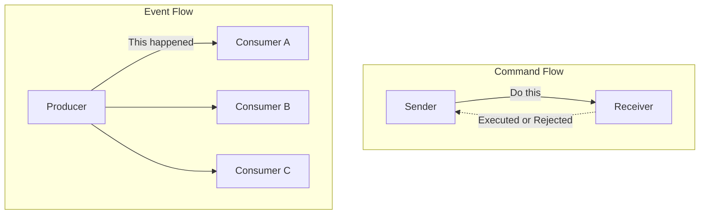
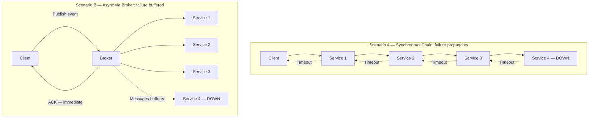

## Diagrams — Foundations of Event-Driven Architecture

### A side-by-side comparison (flowchart) contrasting a command flow — one sender arrow to one receiver labeled "expects execution, can be rejected" — versus an event flow — one producer fanning out to three independent consumers labeled "announces a fact, expects nothing".

Commands and events differ fundamentally in intent and coupling: a command targets one specific receiver and demands a response, while an event broadcasts a fact to any number of independent consumers who may or may not exist at publish time. Understanding this contrast is the first step to avoiding the design mistake of publishing commands disguised as events.

---

### A sequence diagram contrasting two scenarios. Top: synchronous chain of five services where a failure at service 4 propagates a timeout back to the client. Bottom: the same actors communicating through a broker, where service 4 being down leaves messages buffered and the client already acknowledged.

This diagram makes the availability cost of synchronous chains concrete: a single failing service cascades timeouts all the way back to the caller, whereas a broker-mediated async flow absorbs the failure by buffering messages, allowing the client to receive an acknowledgment immediately and the healthy consumers to continue processing independently.

---
