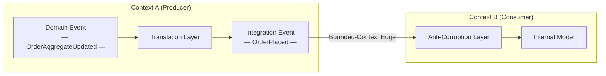
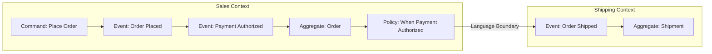
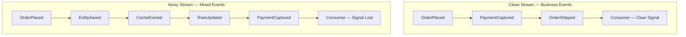

# Chapter 2: Modeling Events as Domain Facts

## Opening Problem Statement

Chapter 1 defined an event as an immutable fact of the past and gave us a shared vocabulary: coupling axes, event styles, and Event-Carried State Transfer as the default for cross-context integration. But a definition does not tell you *which* facts deserve to become events. This is where most event-driven systems quietly rot. A team wires a broker into their stack, and within months the topics are flooded with `RowInserted`, `CacheInvalidated`, and `UserEntityUpdated`. None of these mean anything to the business. They are technical exhaust dressed up as domain knowledge, and every consumer that subscribes to them inherits the producer's database schema as a de facto contract. The problem this chapter solves is discipline in modeling: how to design events that carry genuine business meaning, that survive refactoring, and that let independent teams integrate without stepping on each other. The senior architect's job here is not to publish more events — it is to publish the *right* ones, with names that read like sentences a domain expert would speak. Get this wrong and no amount of Kafka tuning will save the architecture.

## Domain Events Versus Integration Events

The single most useful distinction in event modeling is between **domain events** and **integration events**. They look identical on the wire — both are immutable facts — but they serve different audiences and obey different rules.

A **domain event** is a fact that matters *inside* a single bounded context. It is expressed in that context's ubiquitous language and is often consumed by the same service that produced it, or by tightly related components within the same team's boundary. `OrderPlaced`, `PaymentDeclined`, `SeatReserved` — these describe something a business stakeholder cares about. Domain events are rich; they can reference internal aggregates freely because everyone who reads them shares the same model.

An **integration event** is a fact published *across* a bounded-context boundary, intended for other teams and other services. It is a deliberate, public contract. Because it crosses a boundary, it must not leak internal structure. An integration event is a translation — a stripped, stabilized projection of one or more domain events into a shape the outside world can depend on.

The table below makes the contrast concrete.

| Aspect | Domain Event | Integration Event |
|--------|--------------|-------------------|
| Audience | Inside one bounded context | Other contexts and teams |
| Language | Full ubiquitous language | Stable public vocabulary |
| Payload | Rich, references aggregates | Minimal, self-contained |
| Coupling | Tight, by design | Loose, contractual |
| Lifespan | Changes with the model | Changes only via versioning |
| Failure of leaking | Local refactor | Breaks external consumers |

The rule follows directly: **never publish a raw domain event across a context boundary.** Translate it first. The moment an external team subscribes to your internal `OrderAggregateUpdated`, your database becomes their API, and you have lost the freedom to refactor. This translation step is not bureaucracy — it is the seam that keeps teams independent.

*A domain event produced inside a bounded context must be translated into an integration event before it crosses the context boundary; this seam preserves each team's freedom to refactor their internal model independently.*



> 💡 **Expert Note:** The translation step from domain event to integration event is not just a modeling discipline — it is a reliability boundary that requires an explicit delivery mechanism. In production systems, the most common failure mode is: domain event is captured in memory or in an application-layer listener, the translation runs synchronously, and the publish to the broker fails or the process crashes between the database commit and the broker write. The industry-standard fix is the **Transactional Outbox pattern**: write the outgoing integration event to an `outbox` table in the same ACID transaction that mutates the aggregate, then relay asynchronously. Without this, the translation boundary that protects your consumers from your schema is itself a source of phantom consistency bugs that are extremely hard to reproduce in test environments.

<details>
<summary>⚠️ Critical Note</summary>
The table labels domain event coupling as "Tight, by design." This is misleading and risks confusing senior architects. Domain events within a bounded context are precisely a *decoupling* mechanism: an Order aggregate raises `OrderPlaced` so that other domain services (inventory reservation, email dispatch) can react without the aggregate calling them directly. "Tight" is inaccurate; the correct framing is "internal — boundary does not apply." Describing intra-context coupling as "tight by design" could lead readers to resist domain events inside their own context, defeating their purpose.

**Suggested fix:** Replace "Tight, by design" in the Coupling row with "Internal — no contract boundary; consumers share the same model." Add a sentence noting that domain events *enable* loose coupling within a context between aggregates and domain services.
</details>

<details>
<summary>⚠️ Critical Note</summary>
The prose presents the translation step ("never publish a raw domain event across a context boundary — translate it first") as a design rule without addressing the reliability mechanism that makes this rule safe to follow. The translation from domain event to integration event is typically done inside the same transaction or via an outbox pattern; if it is done by a separate process or handler, the translation itself can fail silently, producing either duplicates or lost events. For senior architects, the "translate it first" rule is incomplete without acknowledging that the *how* of reliable translation is non-trivial and is the source of most real-world integration bugs. Deferring this entirely to Chapter 3 leaves a dangerous gap at the exact moment the reader is deciding to adopt the pattern.

**Suggested fix:** Add a one- or two-sentence callout acknowledging that reliable translation requires an atomicity guarantee (e.g., transactional outbox or event sourcing), and forward-reference the specific chapter where this is addressed so readers know the gap is intentional, not overlooked.
</details>

## Event Storming as a Discovery Technique

You cannot model events well by staring at a database schema. Events must be *discovered* from the business, and the fastest technique for that discovery is **Event Storming** — a collaborative workshop invented by Alberto Brandolini. It puts domain experts and engineers at the same wall and asks one question: what happens in this business?

The mechanics are deliberately low-tech. Participants write facts on orange sticky notes, phrased in the past tense, and place them on a timeline. `OrderPlaced` goes up, then `PaymentAuthorized`, then `OrderShipped`. When the orange notes stop flowing, other colors enter: blue for commands that trigger events, yellow for aggregates, pink for external systems, and purple for policies ("whenever *this* happens, do *that*"). The wall becomes a map of the business process before a single class is written.

Three signals from an Event Storming session directly shape your architecture:

1. **Clusters of events** around the same aggregate reveal a bounded context. Where the language shifts — where "order" starts meaning something different — you have found a boundary.
2. **Hotspots**, marked with red notes, expose disagreement or unknowns. These are the risky parts of the domain and deserve the most design attention.
3. **Pivotal events** — the ones every stakeholder points to — are your true integration events, the facts other contexts will want.

*An Event Storming timeline maps business facts in past tense from left to right, surfacing commands, aggregates, and policies; the point where the ubiquitous language shifts marks a bounded-context boundary and signals a candidate integration event.*



The payoff is that events emerge from the language of the business, not from the shape of a table. When a domain expert nods at `PaymentDeclined` and shakes their head at `UserRecordUpdated`, they are doing your naming review for free. Run the workshop before you design schemas, not after.

<details>
<summary>💡 Expert Note</summary>
Alberto Brandolini defines three levels of Event Storming — **Big Picture**, **Process Modeling**, and **Software Design** — but most teams run only the first and call it done. The Big Picture session produces the boundary map and pivotal events described in the prose. Process Modeling (a separate, smaller session) is where commands, actors, read models, and policies are refined per sub-process: this is the level that produces the aggregate and command design that feeds directly into code. Stopping at Big Picture leaves a significant translation gap between the workshop wall and the first schema draft, which engineers typically fill by reverting to database-shaped events — the exact anti-pattern Chapter 2 warns against.
</details>

<details>
<summary>💡 Expert Note</summary>
In practice, Event Storming hotspots (red notes) are as often organizational as they are technical. A persistent hotspot where domain experts cannot agree on a term is frequently a signal of **Conway's Law** tension: two teams share ownership of a concept and have evolved different models. Treating these as purely technical modeling problems leads to fragile compromises. The more effective response is to surface the organizational ownership question explicitly — which team owns the definition of this aggregate? — and let that decision drive the bounded-context boundary, rather than searching for a linguistic middle ground that neither team will actually maintain.
</details>

<details>
<summary>⚠️ Critical Note</summary>
Event Storming is presented as a straightforwardly accessible technique: "participants write facts on orange sticky notes" and the wall "becomes a map of the business process before a single class is written." This glosses over the substantial organizational and facilitation prerequisites. Without an experienced facilitator, sessions routinely collapse into technical jargon, scope explosion, or competing political agendas between departments. Domain experts must be willing and available — a constraint that is often the hardest part in enterprise settings. Presenting the technique as low-effort ("deliberately low-tech") without acknowledging facilitation complexity could cause teams to run poorly structured sessions, produce misleading event maps, and blame the technique rather than the execution.

**Suggested fix:** Add a short paragraph noting that effective Event Storming requires a skilled, neutral facilitator (ideally experienced with DDD), prepared domain experts who have authority to describe the business (not just developers describing what the system does), and a time commitment of at least a full day per major process. Recommend Brandolini's "Introducing EventStorming" as the reference for facilitation details.
</details>

## Bounded Contexts and Event Contracts Between Teams

A **bounded context** is the scope within which a model and its ubiquitous language are consistent. "Customer" in the Sales context is not the same "Customer" in the Billing context, even if both map to the same person. Events are how these contexts talk without merging their models — and that makes every published event a **contract**.

Treating events as contracts changes how you manage them. A contract has an owner (the producing team), a specification (the schema), and consumers who build against it. Once someone depends on your integration event, you cannot silently change its shape. This is why mature organizations adopt **consumer-driven contracts**: consumers publish the expectations they hold, and the producer's pipeline verifies that changes do not break them. We return to schema evolution in depth in Chapter 8, but the modeling decision starts here — a well-modeled integration event is one whose meaning is stable enough to promise indefinitely.

The anti-corruption boundary is the practical mechanism. When Context B consumes an event from Context A, it translates A's vocabulary into its own model at the edge, rather than letting A's concepts spread inside. This keeps the two models free to evolve. The event is the wire between them; the translation layers on each side are the insulation.

**Pro Tip:** Assign every integration event a single owning team and record it in a discoverable catalog. An event with no owner is an event no one can safely change — and one that no one dares to delete.

<details>
<summary>💡 Expert Note</summary>
The prose correctly introduces consumer-driven contracts as the mechanism for safely evolving integration events, but the tooling gap is worth naming for practitioners ready to implement it. For asynchronous event systems, **Pact** (pact.io) is the most widely adopted consumer-driven contract testing framework and has first-class support for message contracts as of v4. Schema registry contract enforcement (Confluent Schema Registry with compatibility modes, or AWS Glue Schema Registry) handles structural evolution but not semantic compatibility — Pact covers the latter. A complementary layer is **AsyncAPI 3.0**, now the dominant spec for documenting async event contracts, equivalent to OpenAPI for REST; it integrates with schema registries and feeds discoverability catalogs such as Backstage.
</details>

> 💡 **Expert Note:** The prose correctly places the anti-corruption boundary at the context edge, but teams frequently misplace the implementation of it. In an asynchronous event system, the ACL lives **inside the consuming service's event handler or a dedicated transformer process** — not in the broker, not in a shared middleware layer. Attempts to implement a "centralized ACL" at the broker level (via Kafka Streams topology or an ESB-style intermediary) reconstitute the integration hub that event-driven architecture was meant to eliminate, and create a shared-mutable component that every team depends on. Each consumer owns its own translation; that is what keeps them independently deployable.

<details>
<summary>⚠️ Critical Note</summary>
The prose states that "a well-modeled integration event is one whose meaning is stable enough to promise indefinitely." This is an unrealistic and potentially harmful standard for most business domains. Business meaning changes: regulations shift, products are discontinued, mergers redefine "customer." The correct framing is that integration events should be *stable enough to require explicit versioning rather than silent breakage* — not stable indefinitely. Promising indefinite stability could cause teams to over-engineer events in an attempt to anticipate all future meanings, resulting in bloated, over-generic schemas that are harder to evolve than well-scoped versioned ones.

**Suggested fix:** Replace "stable enough to promise indefinitely" with "stable enough that changes require explicit versioning and coordinated consumer migration — not silent schema mutation." Briefly note that business domain evolution makes indefinite stability a fiction; good event design minimizes the *frequency* of breaking changes, not their possibility.
</details>

## Granularity and Event Naming Conventions

Granularity is where good intentions produce bad systems. Too coarse, and one bloated event forces every consumer to parse fields they do not need. Too fine, and consumers must reassemble a business fact from a storm of fragments, reintroducing exactly the coupling events were meant to remove.

The guiding heuristic: **model events at the granularity of a business decision, not a data mutation.** `OrderPlaced` is a decision. `OrderTotalColumnUpdated` is a mutation. If a fact only makes sense to someone holding your table definition, it is too fine and probably not a domain event at all.

Naming carries as much weight as granularity. Follow these rules without exception:

- **Past tense, always.** An event records something that already happened: `InvoiceIssued`, not `IssueInvoice` (that is a command) and not `InvoiceIssue`.
- **Business language, not technical language.** `PaymentCaptured` beats `PaymentServiceApiCallSucceeded`.
- **Name the fact, not the handler.** `SubscriptionCancelled`, not `SendCancellationEmail` — the latter names a reaction, coupling the event to one consumer's intent.
- **Include the aggregate, keep it specific.** `CartCheckedOut` tells you the subject and the fact in two words.

*Both definitions below are publishable Python dataclasses. `OrderPlaced` captures a business decision in vocabulary a domain expert recognizes; `OrderTableRowChanged` exposes raw persistence details that couple every consumer to the producer's database schema.*

```python
# Contrasting event schemas: durable business contract vs. technical noise
# O(1) — schema definition; no algorithmic complexity

from __future__ import annotations

import uuid
from dataclasses import dataclass, field
from datetime import datetime
from decimal import Decimal
from enum import StrEnum


# ---------------------------------------------------------------------------
# GOOD: OrderPlaced — a durable integration event
#
# Why this works as a contract:
#   • Named in the past tense using ubiquitous language ("Placed")
#   • Carries only stable business facts; no internal aggregate IDs leak out
#   • A non-technical domain expert can read every field and understand it
#   • Consumers depend on *meaning*, not on the producer's table structure
#   • Adding a new field (non-breaking) or renaming an existing one (versioned)
#     is a deliberate, announced change — not a silent side-effect of a migration
# ---------------------------------------------------------------------------

class Currency(StrEnum):
    USD = "USD"
    EUR = "EUR"
    BRL = "BRL"


@dataclass(frozen=True)          # frozen=True enforces immutability
class OrderLineItem:
    product_id: str              # public product catalog ID (stable reference)
    product_name: str            # denormalized for self-containment
    quantity: int
    unit_price: Decimal
    currency: Currency


@dataclass(frozen=True)
class OrderPlaced:
    """
    Integration event: a customer has placed an order.

    This is the canonical fact other bounded contexts depend on.
    Billing uses it to initiate payment; Fulfillment uses it to reserve stock.
    Neither context needs to know which database table stored the order.
    """
    event_id: str = field(default_factory=lambda: str(uuid.uuid4()))
    occurred_at: datetime = field(default_factory=datetime.utcnow)

    # --- Business payload (stable, meaningful fields) ---
    order_id: str = ""           # public order reference, not a DB primary key
    customer_id: str = ""        # stable external customer identifier
    channel: str = ""            # "web", "mobile", "api" — business channel
    items: tuple[OrderLineItem, ...] = field(default_factory=tuple)
    total_amount: Decimal = Decimal("0.00")
    currency: Currency = Currency.USD
    shipping_address_country: str = ""   # country code (ISO 3166-1 alpha-2)


# ---------------------------------------------------------------------------
# BAD: OrderTableRowChanged — technical noise masquerading as a domain event
#
# Why this is an anti-pattern:
#   • The name describes a persistence mechanism ("TableRow"), not a business fact
#   • `changed_columns` leaks the producer's schema; consumers must understand
#     column names to extract any meaning — their code now mirrors the DB schema
#   • A non-technical domain expert cannot tell whether anything meaningful
#     happened: a retry, a migration, or a real business decision all look the same
#   • When the producer renames a column or splits a table, all consumers break
#     silently — this is the hidden cost of technical noise
# ---------------------------------------------------------------------------

@dataclass(frozen=True)
class ColumnDiff:
    column_name: str             # raw DB column name — a leaking implementation detail
    old_value: object
    new_value: object


@dataclass(frozen=True)
class OrderTableRowChanged:
    """
    Anti-pattern: publishes a raw persistence event as though it were a domain fact.

    Consumers cannot determine business intent from column diffs.
    Did the user cancel? Did a background job fix a typo? Was it a no-op write?
    This event answers none of those questions.
    """
    event_id: str = field(default_factory=lambda: str(uuid.uuid4()))
    occurred_at: datetime = field(default_factory=datetime.utcnow)

    # --- Technical payload (unstable, leaks internal schema) ---
    table_name: str = "orders"           # couples consumers to the DB table name
    row_pk: int = 0                      # exposes the surrogate database primary key
    changed_columns: tuple[ColumnDiff, ...] = field(default_factory=tuple)
    transaction_id: str = ""             # DB transaction detail — irrelevant to consumers
    orm_version: int = 0                 # ORM optimistic-lock version — internal noise


# ---------------------------------------------------------------------------
# Demonstration: the same business fact expressed in both styles
# ---------------------------------------------------------------------------

def demo() -> None:
    item = OrderLineItem(
        product_id="PROD-7821",
        product_name="Wireless Keyboard",
        quantity=2,
        unit_price=Decimal("49.99"),
        currency=Currency.USD,
    )

    # Meaningful: any consumer knows exactly what happened
    good_event = OrderPlaced(
        order_id="ORD-20240901-00042",
        customer_id="CUST-8814",
        channel="web",
        items=(item,),
        total_amount=Decimal("99.98"),
        currency=Currency.USD,
        shipping_address_country="US",
    )

    # Noisy: consumers must reverse-engineer business meaning from column diffs
    bad_event = OrderTableRowChanged(
        table_name="orders",
        row_pk=100042,
        changed_columns=(
            ColumnDiff("status_cd", "DRAFT", "CONFIRMED"),    # what does "CONFIRMED" mean?
            ColumnDiff("upd_ts", "2024-09-01T10:00:00", "2024-09-01T10:00:01"),
            ColumnDiff("orm_ver", 3, 4),                      # pure internal noise
        ),
    )

    print("Good event type :", type(good_event).__name__)     # OrderPlaced
    print("Good event items:", len(good_event.items))         # 2 items
    print()
    print("Bad event type  :", type(bad_event).__name__)      # OrderTableRowChanged
    print("Bad event cols  :", [c.column_name for c in bad_event.changed_columns])


if __name__ == "__main__":
    demo()
```

A good name is a design review in itself. If a domain expert cannot understand your event from its name alone, the model is wrong — rename it before you ship it.

> 💡 **Expert Note:** The prose warns against events that are too fine-grained (mutations), but the opposite failure is equally dangerous in production and receives less attention: events that are too coarse create **evolutionary pressure toward kitchen-sink payloads**. As new consumers arrive, each one needs a field the existing event does not carry. The path of least resistance is to keep adding fields to the single coarse event. Within 18 months, `OrderPlaced` carries 60 fields, half of which are null for any given consumer, and the schema has become a de facto shared database across teams. The mitigation is to model at business decision granularity but then deliberately audit which fields each declared consumer actually uses — zero-field consumers are a signal the event boundary is wrong.

<details>
<summary>⚠️ Critical Note</summary>
The granularity discussion is missing the critical fat-versus-thin event trade-off that every senior architect must decide at design time. Fat events (carrying full aggregate state) make consumers self-sufficient but increase payload size, may leak internal model details, and make it harder to control what constitutes a "meaningful" change. Thin events (carrying only the ID or a minimal diff) keep payloads small but force consumers to make a synchronous lookup call to fetch needed state, reintroducing temporal coupling and a potential availability dependency. For an audience of senior engineers and architects, presenting granularity only as "business decision vs. data mutation" without naming this trade-off leaves out the most consequential design decision at the schema level.

**Suggested fix:** Add a sub-section or callout covering the fat/thin spectrum: fat events favor consumer autonomy at the cost of payload size and model exposure; thin events reduce payload and exposure but can force consumers into synchronous queries. Reference Event-Carried State Transfer (from Chapter 1) as the recommended default for cross-context integration, and note that thin events are preferable when payload size or model sensitivity is a concern within a context.
</details>

## Technical Noise as a Modeling Anti-Pattern

The most common failure in event-driven systems is **technical noise**: publishing infrastructure and persistence events as though they were domain facts. `EntitySaved`, `KafkaOffsetCommitted`, `CacheEvicted`, `FieldXChanged`. These events describe how the software works, not what the business did.

Technical noise is corrosive for three reasons. First, it couples consumers to your implementation — subscribers now depend on your ORM's save cadence or your caching strategy. Second, it destroys signal: real business events drown in a flood of mechanical chatter, and consumers cannot tell which events matter. Third, it lies. An `EntityUpdated` event claims a business fact occurred when often nothing meaningful did — a retry, a migration, or a no-op write.

The test is simple and unforgiving: **could a non-technical domain expert say this event out loud and mean it?** "The order was placed" passes. "The row was updated" fails. If the answer is no, you are looking at technical noise, and it does not belong on a domain topic.

*Mixing technical noise into domain topics floods consumers with irrelevant signals, making it impossible to distinguish real business facts from implementation artifacts; keeping domain topics clean preserves the stream as a reliable business ledger.*



This does not mean technical events are worthless. Operational and infrastructure signals are legitimate — for monitoring, metrics, and debugging, which Chapter 9 covers. The sin is not producing them; it is publishing them onto the same domain channels that other teams treat as the source of business truth. Keep the two streams separate. Your domain topics are a business ledger, and a ledger with fake entries is worse than no ledger at all.

> 💡 **Expert Note:** The most common production source of technical noise that practitioners encounter is **Change Data Capture (CDC) pipelines publishing directly to domain topics**. Tools like Debezium capture row-level changes from the database transaction log and emit events such as `INSERT/UPDATE on orders table with column deltas` — which is precisely the `OrderTableRowChanged` anti-pattern the prose describes. The failure mode is that teams treat CDC as the event publishing layer, bypassing domain modeling entirely. The correct architecture is to use CDC as an **outbox relay** (reading from an `outbox` or `domain_events` table written by the application) rather than capturing raw table mutations. If you see Debezium topics named after database tables flowing directly to consumers, you are looking at technical noise at industrial scale.

## Key Takeaways

- **Domain events** live inside one bounded context; **integration events** are deliberate public contracts. Never publish a raw domain event across a boundary — translate it first.
- **Event Storming** discovers events from the business language, exposing bounded contexts, hotspots, and the pivotal facts that become integration events.
- Every published event is a **contract** with an owner, a schema, and consumers; anti-corruption boundaries keep producer and consumer models independent.
- Model events at the granularity of a **business decision**, name them in the **past tense** using ubiquitous language, and name the fact rather than the handler.
- **Technical noise** — persistence and infrastructure events masquerading as domain facts — couples consumers to your implementation and drowns real signal. Apply the domain-expert test.

## What's Next

With well-modeled events in hand, Chapter 3 examines how those events actually flow — comparing broker and mediator topologies, choreography versus orchestration, and the messaging technologies that carry your domain facts across the system.

<!-- ASSEMBLY COMPLETE
  Chapter: Modeling Events as Domain Facts
  Code blocks resolved: 1 / 1
  Diagrams resolved: 3 / 3
  Expert callouts (inline): 4
  Expert callouts (collapsed): 3
  Critical callouts (inline): 0
  Critical callouts (collapsed): 4
  Unresolved markers: 0
-->
