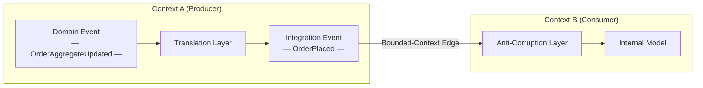
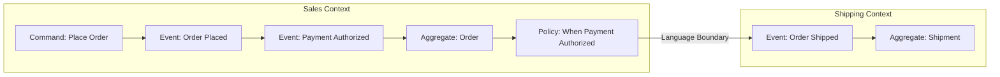
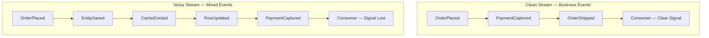

# Capítulo 2: Modelando Eventos como Hechos del Dominio

## Planteamiento del Problema Inicial

El Capítulo 1 definió un evento como un hecho inmutable del pasado y nos dio un vocabulario compartido: ejes de acoplamiento, estilos de evento y Event-Carried State Transfer (transferencia de estado transportada por eventos) como el patrón predeterminado para la integración entre contextos. Pero una definición no nos dice *qué* hechos merecen convertirse en eventos. Aquí es donde la mayoría de los sistemas orientados a eventos se degradan silenciosamente. Un equipo conecta un broker a su stack y en cuestión de meses los topics están inundados de `RowInserted`, `CacheInvalidated` y `UserEntityUpdated`. Ninguno de estos tiene significado para el negocio. Son residuos técnicos disfrazados de conocimiento del dominio, y cada consumidor que se suscribe a ellos hereda el esquema de base de datos del productor como un contrato de facto. El problema que este capítulo resuelve es la disciplina en el modelado: cómo diseñar eventos que transmitan un significado empresarial genuino, que sobrevivan a la refactorización y que permitan a equipos independientes integrarse sin interferirse entre sí. El trabajo del arquitecto senior aquí no es publicar más eventos — es publicar los *correctos*, con nombres que se lean como oraciones que un experto del dominio pronunciaría. Equivocarse en esto y ninguna cantidad de ajuste en Kafka salvará la arquitectura.

## Eventos de Dominio Versus Eventos de Integración

La distinción más útil en el modelado de eventos es entre **domain events** (eventos de dominio) e **integration events** (eventos de integración). Se ven idénticos en el cable — ambos son hechos inmutables — pero sirven a audiencias distintas y obedecen reglas diferentes.

Un **domain event** es un hecho que importa *dentro* de un único bounded context (contexto delimitado). Se expresa en el lenguaje ubicuo de ese contexto y con frecuencia es consumido por el mismo servicio que lo produjo, o por componentes estrechamente relacionados dentro de la frontera del mismo equipo. `OrderPlaced`, `PaymentDeclined`, `SeatReserved` — estos describen algo que le importa a un stakeholder del negocio. Los domain events son ricos; pueden referenciar agregados internos libremente porque todos los que los leen comparten el mismo modelo.

Un **integration event** es un hecho publicado *a través* de una frontera de bounded context, destinado a otros equipos y otros servicios. Es un contrato público deliberado. Dado que cruza una frontera, no debe filtrar estructura interna. Un integration event es una traducción — una proyección depurada y estabilizada de uno o más domain events hacia una forma en la que el mundo exterior pueda confiar.

La tabla a continuación hace el contraste concreto.

| Aspecto | Domain Event | Integration Event |
|--------|--------------|-------------------|
| Audiencia | Dentro de un bounded context | Otros contextos y equipos |
| Lenguaje | Lenguaje ubicuo completo | Vocabulario público estable |
| Payload | Rico, referencia agregados | Mínimo, autocontenido |
| Acoplamiento | Interno — sin frontera de contrato | Débil, contractual |
| Vida útil | Cambia con el modelo | Cambia solo mediante versionado |
| Consecuencia de filtrar | Refactor local | Rompe consumidores externos |

La regla se desprende directamente: **nunca publique un domain event crudo a través de una frontera de contexto.** Tradúzcalo primero. En el momento en que un equipo externo se suscribe a su `OrderAggregateUpdated` interno, su base de datos se convierte en su API y usted ha perdido la libertad de refactorizar. Este paso de traducción no es burocracia — es la costura que mantiene a los equipos independientes.

*Un domain event producido dentro de un bounded context debe ser traducido a un integration event antes de cruzar la frontera del contexto; esta costura preserva la libertad de cada equipo para refactorizar su modelo interno de forma independiente.*



> 💡 **Nota del Experto:** El paso de traducción de domain event a integration event no es solo una disciplina de modelado — es una frontera de fiabilidad que requiere un mecanismo de entrega explícito. En sistemas de producción, el modo de falla más común es: el domain event es capturado en memoria o en un listener de la capa de aplicación, la traducción se ejecuta de forma síncrona y la publicación al broker falla, o el proceso se cae entre el commit de la base de datos y la escritura en el broker. La solución estándar de la industria es el patrón **Transactional Outbox**: escribir el integration event saliente en una tabla `outbox` dentro de la misma transacción ACID que muta el agregado, y luego retransmitir de forma asíncrona. Sin esto, la frontera de traducción que protege a sus consumidores de su esquema es en sí misma una fuente de bugs de consistencia fantasma extremadamente difíciles de reproducir en entornos de prueba.

<details>
<summary>⚠️ Nota Crítica</summary>
La tabla etiqueta el acoplamiento de los domain events como "Tight, by design." Esto es engañoso y corre el riesgo de confundir a los arquitectos senior. Los domain events dentro de un bounded context son precisamente un mecanismo de *desacoplamiento*: un agregado Order lanza `OrderPlaced` para que otros servicios de dominio (reserva de inventario, envío de correo) puedan reaccionar sin que el agregado los llame directamente. "Tight" es inexacto; el encuadre correcto es "interno — la frontera no aplica." Describir el acoplamiento intra-contexto como "tight by design" podría llevar a los lectores a resistir los domain events dentro de su propio contexto, anulando su propósito.

**Corrección sugerida:** Reemplazar "Tight, by design" en la fila de Acoplamiento con "Internal — no contract boundary; consumers share the same model." Agregar una oración que indique que los domain events *habilitan* el acoplamiento débil dentro de un contexto entre agregados y servicios de dominio.
</details>

<details>
<summary>⚠️ Nota Crítica</summary>
El texto presenta el paso de traducción ("nunca publique un domain event crudo a través de una frontera de contexto — tradúzcalo primero") como una regla de diseño sin abordar el mecanismo de fiabilidad que hace seguro seguir esta regla. La traducción de domain event a integration event se realiza típicamente dentro de la misma transacción o mediante un patrón outbox; si lo realiza un proceso o handler separado, la traducción misma puede fallar silenciosamente, produciendo duplicados o eventos perdidos. Para arquitectos senior, la regla "tradúzcalo primero" está incompleta sin reconocer que el *cómo* de la traducción fiable no es trivial y es la fuente de la mayoría de los bugs de integración del mundo real. Diferir esto completamente al Capítulo 3 deja una brecha peligrosa en el momento exacto en que el lector decide adoptar el patrón.

**Corrección sugerida:** Agregar un callout de una o dos oraciones que reconozca que la traducción fiable requiere una garantía de atomicidad (por ejemplo, transactional outbox o event sourcing), y hacer referencia al capítulo específico donde esto se aborda para que los lectores sepan que la brecha es intencional, no pasada por alto.
</details>

## Event Storming como Técnica de Descubrimiento

No se pueden modelar bien los eventos mirando fijamente un esquema de base de datos. Los eventos deben *descubrirse* del negocio, y la técnica más rápida para ese descubrimiento es el **Event Storming** — un taller colaborativo inventado por Alberto Brandolini. Reúne a expertos del dominio e ingenieros frente a la misma pared y formula una pregunta: ¿qué sucede en este negocio?

La mecánica es deliberadamente de bajo nivel tecnológico. Los participantes escriben hechos en notas adhesivas naranjas, formuladas en tiempo pasado, y las colocan en una línea de tiempo. `OrderPlaced` va primero, luego `PaymentAuthorized`, luego `OrderShipped`. Cuando las notas naranjas dejan de fluir, entran otros colores: azul para comandos que desencadenan eventos, amarillo para agregados, rosa para sistemas externos y morado para políticas ("cada vez que *esto* sucede, hacer *aquello*"). La pared se convierte en un mapa del proceso empresarial antes de que se escriba una sola clase.

Tres señales de una sesión de Event Storming dan forma directamente a su arquitectura:

1. **Clusters de eventos** alrededor del mismo agregado revelan un bounded context. Donde el lenguaje cambia — donde "order" (orden) comienza a significar algo diferente — usted ha encontrado una frontera.
2. **Hotspots** (puntos calientes), marcados con notas rojas, exponen desacuerdos o incógnitas. Estas son las partes arriesgadas del dominio y merecen la mayor atención de diseño.
3. **Pivotal events** (eventos pivotales) — aquellos a los que señala cada stakeholder — son sus verdaderos integration events, los hechos que otros contextos querrán conocer.

*Una línea de tiempo de Event Storming mapea hechos del negocio en tiempo pasado de izquierda a derecha, exponiendo comandos, agregados y políticas; el punto donde el lenguaje ubicuo cambia marca una frontera de bounded context y señala un integration event candidato.*



El beneficio es que los eventos emergen del lenguaje del negocio, no de la forma de una tabla. Cuando un experto del dominio asiente ante `PaymentDeclined` y niega con la cabeza ante `UserRecordUpdated`, está haciendo su revisión de nomenclatura de forma gratuita. Realice el taller antes de diseñar esquemas, no después.

<details>
<summary>💡 Nota del Experto</summary>
Alberto Brandolini define tres niveles de Event Storming — **Big Picture**, **Process Modeling** y **Software Design** — pero la mayoría de los equipos solo ejecutan el primero y lo dan por terminado. La sesión Big Picture produce el mapa de fronteras y los eventos pivotales descritos en el texto. El Process Modeling (una sesión separada y más pequeña) es donde se refinan los comandos, actores, modelos de lectura y políticas por subproceso: este es el nivel que produce el diseño de agregados y comandos que alimenta directamente el código. Detenerse en Big Picture deja una brecha de traducción significativa entre la pared del taller y el primer borrador de esquema, que los ingenieros típicamente llenan revirtiendo a eventos con forma de base de datos — exactamente el anti-patrón contra el que advierte el Capítulo 2.
</details>

<details>
<summary>💡 Nota del Experto</summary>
En la práctica, los hotspots del Event Storming (notas rojas) son tan frecuentemente organizacionales como técnicos. Un hotspot persistente donde los expertos del dominio no pueden ponerse de acuerdo en un término es frecuentemente una señal de tensión con la **Ley de Conway**: dos equipos comparten la propiedad de un concepto y han desarrollado modelos diferentes. Tratar estos como problemas puramente técnicos de modelado conduce a compromisos frágiles. La respuesta más efectiva es sacar a la luz la pregunta de propiedad organizacional de forma explícita — ¿qué equipo es dueño de la definición de este agregado? — y dejar que esa decisión guíe la frontera del bounded context, en lugar de buscar un terreno lingüístico intermedio que ningún equipo mantendrá realmente.
</details>

<details>
<summary>⚠️ Nota Crítica</summary>
El Event Storming se presenta como una técnica francamente accesible: "los participantes escriben hechos en notas adhesivas naranjas" y la pared "se convierte en un mapa del proceso empresarial antes de que se escriba una sola clase." Esto pasa por alto los sustanciales prerrequisitos organizacionales y de facilitación. Sin un facilitador experimentado, las sesiones colapsan rutinariamente en jerga técnica, explosión del alcance o agendas políticas competidoras entre departamentos. Los expertos del dominio deben estar dispuestos y disponibles — una restricción que suele ser la parte más difícil en entornos empresariales. Presentar la técnica como de bajo esfuerzo ("deliberadamente de bajo nivel tecnológico") sin reconocer la complejidad de facilitación podría hacer que los equipos realicen sesiones mal estructuradas, produzcan mapas de eventos engañosos y culpen a la técnica en lugar de la ejecución.

**Corrección sugerida:** Agregar un párrafo breve que indique que el Event Storming efectivo requiere un facilitador hábil y neutral (idealmente con experiencia en DDD), expertos del dominio preparados que tengan autoridad para describir el negocio (no solo desarrolladores describiendo lo que hace el sistema), y un compromiso de tiempo de al menos un día completo por proceso mayor. Recomendar "Introducing EventStorming" de Brandolini como referencia para los detalles de facilitación.
</details>

## Bounded Contexts y Contratos de Eventos Entre Equipos

Un **bounded context** es el ámbito dentro del cual un modelo y su lenguaje ubicuo son consistentes. "Customer" (cliente) en el contexto de Sales (ventas) no es el mismo "Customer" en el contexto de Billing (facturación), aunque ambos mapeen a la misma persona. Los eventos son la forma en que estos contextos se comunican sin fusionar sus modelos — y eso convierte a cada evento publicado en un **contrato**.

Tratar los eventos como contratos cambia cómo se gestionan. Un contrato tiene un propietario (el equipo productor), una especificación (el esquema) y consumidores que construyen sobre él. Una vez que alguien depende de su integration event, usted no puede cambiar silenciosamente su forma. Por eso las organizaciones maduras adoptan **consumer-driven contracts** (contratos orientados al consumidor): los consumidores publican las expectativas que tienen, y el pipeline del productor verifica que los cambios no los rompan. Volvemos a la evolución de esquemas en profundidad en el Capítulo 8, pero la decisión de modelado comienza aquí — un integration event bien modelado es aquel cuyo significado es suficientemente estable como para comprometerse de forma explícita mediante versionado y migración coordinada de consumidores — no de forma silenciosa.

La frontera anti-corrupción es el mecanismo práctico. Cuando el Context B consume un evento del Context A, traduce el vocabulario de A a su propio modelo en el borde, en lugar de dejar que los conceptos de A se propaguen hacia adentro. Esto mantiene a los dos modelos libres para evolucionar. El evento es el cable entre ellos; las capas de traducción en cada lado son el aislamiento.

**Pro Tip:** Asigne a cada integration event un único equipo propietario y regístrelo en un catálogo descubrible. Un evento sin propietario es un evento que nadie puede cambiar con seguridad — y que nadie se atreve a eliminar.

<details>
<summary>💡 Nota del Experto</summary>
El texto introduce correctamente los consumer-driven contracts como el mecanismo para evolucionar de forma segura los integration events, pero vale la pena nombrar la brecha en las herramientas para los profesionales listos para implementarlo. Para sistemas de eventos asíncronos, **Pact** (pact.io) es el framework de pruebas de contratos orientados al consumidor más ampliamente adoptado y tiene soporte de primera clase para contratos de mensajes desde la v4. La aplicación de contratos mediante un registro de esquemas (Confluent Schema Registry con modos de compatibilidad, o AWS Glue Schema Registry) maneja la evolución estructural pero no la compatibilidad semántica — Pact cubre esto último. Una capa complementaria es **AsyncAPI 3.0**, ahora la especificación dominante para documentar contratos de eventos asíncronos, equivalente a OpenAPI para REST; se integra con registros de esquemas y alimenta catálogos de descubrimiento como Backstage.
</details>

> 💡 **Nota del Experto:** El texto coloca correctamente la frontera anti-corrupción en el borde del contexto, pero los equipos frecuentemente ubican mal su implementación. En un sistema de eventos asíncrono, el ACL vive **dentro del event handler del servicio consumidor o en un proceso transformador dedicado** — no en el broker, no en una capa de middleware compartida. Los intentos de implementar un "ACL centralizado" a nivel del broker (mediante una topología de Kafka Streams o un intermediario estilo ESB) reconstituyen el integration hub que la arquitectura orientada a eventos pretendía eliminar, y crean un componente mutable compartido del que depende cada equipo. Cada consumidor es dueño de su propia traducción; eso es lo que los mantiene desplegables de forma independiente.

<details>
<summary>⚠️ Nota Crítica</summary>
El texto afirma que "un integration event bien modelado es aquel cuyo significado es suficientemente estable como para prometerse indefinidamente." Este es un estándar poco realista y potencialmente dañino para la mayoría de los dominios empresariales. El significado del negocio cambia: las regulaciones se modifican, los productos se discontinúan, las fusiones redefinen "customer." El encuadre correcto es que los integration events deben ser *suficientemente estables como para requerir versionado explícito en lugar de roturas silenciosas* — no estables indefinidamente. Prometer estabilidad indefinida podría causar que los equipos sobre-ingenierien los eventos en un intento de anticipar todos los significados futuros, resultando en esquemas inflados y excesivamente genéricos que son más difíciles de evolucionar que los versionados bien delimitados.

**Corrección sugerida:** Reemplazar "stable enough to promise indefinitely" con "stable enough that changes require explicit versioning and coordinated consumer migration — not silent schema mutation." Indicar brevemente que la evolución del dominio empresarial hace que la estabilidad indefinida sea una ficción; el buen diseño de eventos minimiza la *frecuencia* de los cambios disruptivos, no su posibilidad.
</details>

## Granularidad y Convenciones de Nomenclatura de Eventos

La granularidad es donde las buenas intenciones producen malos sistemas. Demasiado gruesa, y un evento inflado obliga a cada consumidor a parsear campos que no necesita. Demasiado fina, y los consumidores deben reensamblar un hecho empresarial a partir de una tormenta de fragmentos, reintroduciendo exactamente el acoplamiento que los eventos pretendían eliminar.

La heurística guía: **modele los eventos a la granularidad de una decisión empresarial, no de una mutación de datos.** `OrderPlaced` es una decisión. `OrderTotalColumnUpdated` es una mutación. Si un hecho solo tiene sentido para alguien que conoce su definición de tabla, es demasiado fino y probablemente no es un domain event en absoluto.

La nomenclatura tiene tanto peso como la granularidad. Siga estas reglas sin excepción:

- **Tiempo pasado, siempre.** Un evento registra algo que ya sucedió: `InvoiceIssued`, no `IssueInvoice` (eso es un comando) ni `InvoiceIssue`.
- **Lenguaje del negocio, no lenguaje técnico.** `PaymentCaptured` supera a `PaymentServiceApiCallSucceeded`.
- **Nombre el hecho, no el handler.** `SubscriptionCancelled`, no `SendCancellationEmail` — este último nombra una reacción, acoplando el evento a la intención de un consumidor.
- **Incluya el agregado, sea específico.** `CartCheckedOut` le dice el sujeto y el hecho en dos palabras.

*Ambas definiciones a continuación son dataclasses de Python publicables. `OrderPlaced` captura una decisión empresarial en vocabulario que un experto del dominio reconoce; `OrderTableRowChanged` expone detalles de persistencia sin procesar que acoplan a cada consumidor al esquema de base de datos del productor.*

```python
# Contrasting event schemas: durable business contract vs. technical noise
# O(1) — schema definition; no algorithmic complexity

from __future__ import annotations

import uuid
from dataclasses import dataclass, field
from datetime import datetime
from decimal import Decimal
from enum import StrEnum


# ---------------------------------------------------------------------------
# GOOD: OrderPlaced — a durable integration event
#
# Why this works as a contract:
#   • Named in the past tense using ubiquitous language ("Placed")
#   • Carries only stable business facts; no internal aggregate IDs leak out
#   • A non-technical domain expert can read every field and understand it
#   • Consumers depend on *meaning*, not on the producer's table structure
#   • Adding a new field (non-breaking) or renaming an existing one (versioned)
#     is a deliberate, announced change — not a silent side-effect of a migration
# ---------------------------------------------------------------------------

class Currency(StrEnum):
    USD = "USD"
    EUR = "EUR"
    BRL = "BRL"


@dataclass(frozen=True)          # frozen=True enforces immutability
class OrderLineItem:
    product_id: str              # public product catalog ID (stable reference)
    product_name: str            # denormalized for self-containment
    quantity: int
    unit_price: Decimal
    currency: Currency


@dataclass(frozen=True)
class OrderPlaced:
    """
    Integration event: a customer has placed an order.

    This is the canonical fact other bounded contexts depend on.
    Billing uses it to initiate payment; Fulfillment uses it to reserve stock.
    Neither context needs to know which database table stored the order.
    """
    event_id: str = field(default_factory=lambda: str(uuid.uuid4()))
    occurred_at: datetime = field(default_factory=datetime.utcnow)

    # --- Business payload (stable, meaningful fields) ---
    order_id: str = ""           # public order reference, not a DB primary key
    customer_id: str = ""        # stable external customer identifier
    channel: str = ""            # "web", "mobile", "api" — business channel
    items: tuple[OrderLineItem, ...] = field(default_factory=tuple)
    total_amount: Decimal = Decimal("0.00")
    currency: Currency = Currency.USD
    shipping_address_country: str = ""   # country code (ISO 3166-1 alpha-2)


# ---------------------------------------------------------------------------
# BAD: OrderTableRowChanged — technical noise masquerading as a domain event
#
# Why this is an anti-pattern:
#   • The name describes a persistence mechanism ("TableRow"), not a business fact
#   • `changed_columns` leaks the producer's schema; consumers must understand
#     column names to extract any meaning — their code now mirrors the DB schema
#   • A non-technical domain expert cannot tell whether anything meaningful
#     happened: a retry, a migration, or a real business decision all look the same
#   • When the producer renames a column or splits a table, all consumers break
#     silently — this is the hidden cost of technical noise
# ---------------------------------------------------------------------------

@dataclass(frozen=True)
class ColumnDiff:
    column_name: str             # raw DB column name — a leaking implementation detail
    old_value: object
    new_value: object


@dataclass(frozen=True)
class OrderTableRowChanged:
    """
    Anti-pattern: publishes a raw persistence event as though it were a domain fact.

    Consumers cannot determine business intent from column diffs.
    Did the user cancel? Did a background job fix a typo? Was it a no-op write?
    This event answers none of those questions.
    """
    event_id: str = field(default_factory=lambda: str(uuid.uuid4()))
    occurred_at: datetime = field(default_factory=datetime.utcnow)

    # --- Technical payload (unstable, leaks internal schema) ---
    table_name: str = "orders"           # couples consumers to the DB table name
    row_pk: int = 0                      # exposes the surrogate database primary key
    changed_columns: tuple[ColumnDiff, ...] = field(default_factory=tuple)
    transaction_id: str = ""             # DB transaction detail — irrelevant to consumers
    orm_version: int = 0                 # ORM optimistic-lock version — internal noise


# ---------------------------------------------------------------------------
# Demonstration: the same business fact expressed in both styles
# ---------------------------------------------------------------------------

def demo() -> None:
    item = OrderLineItem(
        product_id="PROD-7821",
        product_name="Wireless Keyboard",
        quantity=2,
        unit_price=Decimal("49.99"),
        currency=Currency.USD,
    )

    # Meaningful: any consumer knows exactly what happened
    good_event = OrderPlaced(
        order_id="ORD-20240901-00042",
        customer_id="CUST-8814",
        channel="web",
        items=(item,),
        total_amount=Decimal("99.98"),
        currency=Currency.USD,
        shipping_address_country="US",
    )

    # Noisy: consumers must reverse-engineer business meaning from column diffs
    bad_event = OrderTableRowChanged(
        table_name="orders",
        row_pk=100042,
        changed_columns=(
            ColumnDiff("status_cd", "DRAFT", "CONFIRMED"),    # what does "CONFIRMED" mean?
            ColumnDiff("upd_ts", "2024-09-01T10:00:00", "2024-09-01T10:00:01"),
            ColumnDiff("orm_ver", 3, 4),                      # pure internal noise
        ),
    )

    print("Good event type :", type(good_event).__name__)     # OrderPlaced
    print("Good event items:", len(good_event.items))         # 2 items
    print()
    print("Bad event type  :", type(bad_event).__name__)      # OrderTableRowChanged
    print("Bad event cols  :", [c.column_name for c in bad_event.changed_columns])


if __name__ == "__main__":
    demo()
```

Un buen nombre es en sí mismo una revisión de diseño. Si un experto del dominio no puede entender su evento solo por su nombre, el modelo está mal — renómbrelo antes de desplegarlo.

> 💡 **Nota del Experto:** El texto advierte contra los eventos demasiado granulares (mutaciones), pero el fallo opuesto es igualmente peligroso en producción y recibe menos atención: los eventos demasiado gruesos crean **presión evolutiva hacia payloads de tipo "todo en uno"**. A medida que llegan nuevos consumidores, cada uno necesita un campo que el evento existente no lleva. El camino de menor resistencia es seguir agregando campos al único evento grueso. En 18 meses, `OrderPlaced` lleva 60 campos, la mitad de los cuales son nulos para cualquier consumidor dado, y el esquema se ha convertido en una base de datos compartida de facto entre equipos. La mitigación es modelar a la granularidad de la decisión empresarial, pero luego auditar deliberadamente qué campos usa realmente cada consumidor declarado — los consumidores con cero campos son una señal de que la frontera del evento está mal.

<details>
<summary>⚠️ Nota Crítica</summary>
La discusión sobre granularidad omite el trade-off crítico entre eventos fat (gruesos) y thin (delgados) que todo arquitecto senior debe decidir en tiempo de diseño. Los fat events (que llevan el estado completo del agregado) hacen a los consumidores autosuficientes pero aumentan el tamaño del payload, pueden filtrar detalles del modelo interno y dificultan controlar qué constituye un cambio "significativo". Los thin events (que llevan solo el ID o un diff mínimo) mantienen los payloads pequeños pero obligan a los consumidores a hacer una llamada síncrona de búsqueda para obtener el estado necesario, reintroduciendo acoplamiento temporal y una dependencia potencial de disponibilidad. Para una audiencia de ingenieros y arquitectos senior, presentar la granularidad solo como "decisión empresarial versus mutación de datos" sin nombrar este trade-off omite la decisión de diseño más determinante a nivel de esquema.

**Corrección sugerida:** Agregar una subsección o callout que cubra el espectro fat/thin: los fat events favorecen la autonomía del consumidor a costa del tamaño del payload y la exposición del modelo; los thin events reducen el payload y la exposición pero pueden forzar a los consumidores a realizar consultas síncronas. Hacer referencia al Event-Carried State Transfer (del Capítulo 1) como el predeterminado recomendado para la integración entre contextos, y señalar que los thin events son preferibles cuando el tamaño del payload o la sensibilidad del modelo son una preocupación dentro de un contexto.
</details>

## El Ruido Técnico como Anti-Patrón de Modelado

El fallo más común en los sistemas orientados a eventos es el **ruido técnico** (technical noise): publicar eventos de infraestructura y persistencia como si fueran hechos del dominio. `EntitySaved`, `KafkaOffsetCommitted`, `CacheEvicted`, `FieldXChanged`. Estos eventos describen cómo funciona el software, no qué hizo el negocio.

El ruido técnico es corrosivo por tres razones. Primero, acopla a los consumidores a su implementación — los suscriptores ahora dependen de la cadencia de guardado de su ORM o de su estrategia de caché. Segundo, destruye la señal: los eventos empresariales reales se ahogan en una inundación de ruido mecánico, y los consumidores no pueden distinguir qué eventos importan. Tercero, miente. Un evento `EntityUpdated` afirma que ocurrió un hecho empresarial cuando a menudo no sucedió nada significativo — un reintento, una migración o una escritura sin cambios reales.

La prueba es simple e implacable: **¿podría un experto del dominio no técnico decir este evento en voz alta y darle sentido?** "La orden fue colocada" pasa. "La fila fue actualizada" falla. Si la respuesta es no, usted está ante ruido técnico, y no pertenece a un topic de dominio.

*Mezclar ruido técnico en los topics de dominio inunda a los consumidores con señales irrelevantes, haciendo imposible distinguir hechos empresariales reales de artefactos de implementación; mantener los topics de dominio limpios preserva el stream como un libro mayor empresarial confiable.*



Esto no significa que los eventos técnicos sean inútiles. Las señales operacionales e de infraestructura son legítimas — para monitoreo, métricas y depuración, que el Capítulo 9 cubre. El pecado no es producirlos; es publicarlos en los mismos canales de dominio que otros equipos tratan como la fuente de verdad empresarial. Mantenga los dos streams separados. Sus topics de dominio son un libro mayor empresarial, y un libro mayor con entradas falsas es peor que ningún libro mayor en absoluto.

> 💡 **Nota del Experto:** La fuente de ruido técnico más común en producción que los profesionales encuentran son los **pipelines de Change Data Capture (CDC) publicando directamente a topics de dominio**. Herramientas como Debezium capturan cambios a nivel de fila desde el log de transacciones de la base de datos y emiten eventos como `INSERT/UPDATE on orders table with column deltas` — que es precisamente el anti-patrón `OrderTableRowChanged` que describe el texto. El modo de falla es que los equipos tratan el CDC como la capa de publicación de eventos, omitiendo por completo el modelado del dominio. La arquitectura correcta es usar el CDC como un **relay de outbox** (leyendo desde una tabla `outbox` o `domain_events` escrita por la aplicación) en lugar de capturar mutaciones de tablas sin procesar. Si ve topics de Debezium nombrados según tablas de base de datos fluyendo directamente a los consumidores, está ante ruido técnico a escala industrial.

## Conclusiones Clave

- Los **domain events** viven dentro de un bounded context; los **integration events** son contratos públicos deliberados. Nunca publique un domain event crudo a través de una frontera — tradúzcalo primero.
- El **Event Storming** descubre eventos desde el lenguaje del negocio, exponiendo bounded contexts, hotspots y los hechos pivotales que se convierten en integration events.
- Cada evento publicado es un **contrato** con un propietario, un esquema y consumidores; las fronteras anti-corrupción mantienen independientes los modelos del productor y del consumidor.
- Modele los eventos a la granularidad de una **decisión empresarial**, nómbrelos en **tiempo pasado** usando el lenguaje ubicuo, y nombre el hecho en lugar del handler.
- El **ruido técnico** — eventos de persistencia e infraestructura haciéndose pasar por hechos del dominio — acopla a los consumidores a su implementación y ahoga la señal real. Aplique la prueba del experto del dominio.

## Qué Sigue

Con eventos bien modelados en mano, el Capítulo 3 examina cómo fluyen realmente esos eventos — comparando topologías de broker y mediador, coreografía versus orquestación, y las tecnologías de mensajería que transportan sus hechos del dominio a través del sistema.

<!-- ASSEMBLY COMPLETE
  Chapter: Modeling Events as Domain Facts
  Code blocks resolved: 1 / 1
  Diagrams resolved: 3 / 3
  Expert callouts (inline): 4
  Expert callouts (collapsed): 3
  Critical callouts (inline): 0
  Critical callouts (collapsed): 4
  Unresolved markers: 0
-->
