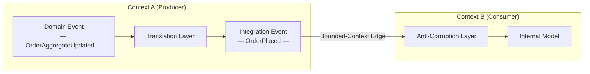
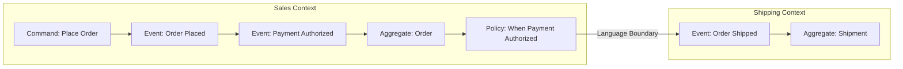
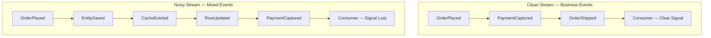

# Capítulo 2: Modelando Eventos como Fatos do Domínio

## Declaração do Problema Inicial

O Capítulo 1 definiu um evento como um fato imutável do passado e nos deu um vocabulário compartilhado: eixos de acoplamento, estilos de evento e Event-Carried State Transfer (transferência de estado transportada pelo evento) como padrão para integração entre contextos. Mas uma definição não diz *quais* fatos merecem se tornar eventos. É aqui que a maioria dos sistemas orientados a eventos apodrece silenciosamente. Uma equipe conecta um broker à sua stack e, em poucos meses, os tópicos estão inundados com `RowInserted`, `CacheInvalidated` e `UserEntityUpdated`. Nenhum desses termos significa algo para o negócio. São resíduos técnicos disfarçados de conhecimento de domínio, e todo consumidor que os assina herda o schema do banco de dados do produtor como um contrato de fato. O problema que este capítulo resolve é a disciplina na modelagem: como projetar eventos que carregam significado genuíno de negócio, que sobrevivem a refatorações e que permitem que equipes independentes se integrem sem interferir umas nas outras. O trabalho do arquiteto sênior aqui não é publicar mais eventos — é publicar os *certos*, com nomes que soam como frases que um especialista de domínio falaria. Errar nisso e nenhuma quantidade de tuning no Kafka salvará a arquitetura.

## Eventos de Domínio Versus Eventos de Integração

A distinção mais útil na modelagem de eventos é entre **eventos de domínio** (domain events) e **eventos de integração** (integration events). Eles parecem idênticos no wire — ambos são fatos imutáveis — mas servem a audiências diferentes e obedecem a regras distintas.

Um **evento de domínio** é um fato que importa *dentro* de um único contexto delimitado (bounded context). Ele é expresso na linguagem ubíqua (ubiquitous language) daquele contexto e muitas vezes é consumido pelo mesmo serviço que o produziu, ou por componentes intimamente relacionados dentro do limite da mesma equipe. `OrderPlaced`, `PaymentDeclined`, `SeatReserved` — esses descrevem algo que um stakeholder de negócio se importa. Eventos de domínio são ricos; podem referenciar agregados internos livremente porque todos que os leem compartilham o mesmo modelo.

Um **evento de integração** é um fato publicado *além* de um limite de contexto delimitado, destinado a outras equipes e outros serviços. É um contrato deliberado e público. Por cruzar um limite, não deve vazar estrutura interna. Um evento de integração é uma tradução — uma projeção enxuta e estabilizada de um ou mais eventos de domínio em uma forma da qual o mundo exterior pode depender.

A tabela abaixo torna o contraste concreto.

| Aspecto | Evento de Domínio | Evento de Integração |
|---------|-------------------|----------------------|
| Audiência | Dentro de um único contexto delimitado | Outros contextos e equipes |
| Linguagem | Linguagem ubíqua completa | Vocabulário público estável |
| Payload | Rico, referencia agregados | Mínimo, autocontido |
| Acoplamento | Interno, por design | Fraco, contratual |
| Vida útil | Muda com o modelo | Muda apenas via versionamento |
| Consequência do vazamento | Refatoração local | Quebra consumidores externos |

A regra decorre diretamente: **nunca publique um evento de domínio bruto além de um limite de contexto.** Traduza-o primeiro. No momento em que uma equipe externa assina seu `OrderAggregateUpdated` interno, seu banco de dados torna-se a API deles, e você perdeu a liberdade de refatorar. Essa etapa de tradução não é burocracia — é a costura que mantém as equipes independentes.

*Um evento de domínio produzido dentro de um contexto delimitado deve ser traduzido em um evento de integração antes de cruzar o limite do contexto; essa costura preserva a liberdade de cada equipe de refatorar seu modelo interno de forma independente.*



> 💡 **Nota do Especialista:** A etapa de tradução de evento de domínio para evento de integração não é apenas uma disciplina de modelagem — é um limite de confiabilidade que requer um mecanismo de entrega explícito. Em sistemas de produção, o modo de falha mais comum é: o evento de domínio é capturado em memória ou em um listener da camada de aplicação, a tradução é executada de forma síncrona, e a publicação no broker falha ou o processo falha entre o commit no banco de dados e a escrita no broker. A correção padrão da indústria é o **padrão Transactional Outbox**: escrever o evento de integração de saída em uma tabela `outbox` dentro da mesma transação ACID que muta o agregado, e depois repassar de forma assíncrona. Sem isso, o limite de tradução que protege seus consumidores do seu schema é em si uma fonte de bugs de consistência fantasma extremamente difíceis de reproduzir em ambientes de teste.

<details>
<summary>⚠️ Nota Crítica</summary>
A tabela rotula o acoplamento de evento de domínio como "Interno, por design." Isso é enganoso e arrisca confundir arquitetos sênior. Eventos de domínio dentro de um contexto delimitado são precisamente um mecanismo de *desacoplamento*: um agregado Order levanta `OrderPlaced` para que outros serviços de domínio (reserva de estoque, envio de e-mail) possam reagir sem que o agregado os chame diretamente. "Estreito" é impreciso; o enquadramento correto é "interno — o limite do contrato não se aplica." Descrever o acoplamento intra-contexto como "estreito por design" poderia levar os leitores a resistir a eventos de domínio dentro de seu próprio contexto, frustrando o propósito deles.

**Correção sugerida:** Substitua "Estreito, por design" na linha de Acoplamento por "Interno — sem limite de contrato; consumidores compartilham o mesmo modelo." Acrescente uma frase observando que eventos de domínio *habilitam* o acoplamento fraco dentro de um contexto entre agregados e serviços de domínio.
</details>

<details>
<summary>⚠️ Nota Crítica</summary>
O texto apresenta a etapa de tradução ("nunca publique um evento de domínio bruto além de um limite de contexto — traduza-o primeiro") como uma regra de design sem abordar o mecanismo de confiabilidade que torna essa regra segura de seguir. A tradução de evento de domínio para evento de integração normalmente é feita dentro da mesma transação ou via padrão outbox; se for feita por um processo ou handler separado, a própria tradução pode falhar silenciosamente, produzindo duplicatas ou eventos perdidos. Para arquitetos sênior, a regra "traduza primeiro" está incompleta sem reconhecer que o *como* da tradução confiável é não trivial e é a origem da maioria dos bugs de integração no mundo real. Adiar isso completamente para o Capítulo 3 deixa uma lacuna perigosa exatamente no momento em que o leitor está decidindo adotar o padrão.

**Correção sugerida:** Adicione um ou dois parágrafos de destaque reconhecendo que a tradução confiável requer uma garantia de atomicidade (por exemplo, outbox transacional ou event sourcing), e faça uma referência antecipada ao capítulo específico onde isso é tratado, para que os leitores saibam que a lacuna é intencional e não foi desconsiderada.
</details>

## Event Storming como Técnica de Descoberta

Você não consegue modelar eventos bem olhando fixamente para um schema de banco de dados. Os eventos devem ser *descobertos* a partir do negócio, e a técnica mais rápida para essa descoberta é o **Event Storming** — um workshop colaborativo inventado por Alberto Brandolini. Ele coloca especialistas de domínio e engenheiros diante do mesmo painel e faz uma pergunta: o que acontece neste negócio?

A mecânica é deliberadamente de baixa tecnologia. Os participantes escrevem fatos em post-its laranjas, formulados no passado, e os colocam em uma linha do tempo. `OrderPlaced` vai para cima, depois `PaymentAuthorized`, depois `OrderShipped`. Quando os post-its laranjas param de fluir, outras cores entram: azul para comandos que acionam eventos, amarelo para agregados, rosa para sistemas externos e roxo para políticas ("sempre que *isso* acontece, faça *aquilo*"). O painel torna-se um mapa do processo de negócio antes que uma única classe seja escrita.

Três sinais de uma sessão de Event Storming moldam diretamente sua arquitetura:

1. **Clusters de eventos** em torno do mesmo agregado revelam um contexto delimitado. Onde a linguagem muda — onde "order" começa a significar algo diferente — você encontrou um limite.
2. **Hotspots**, marcados com post-its vermelhos, expõem discordâncias ou desconhecidos. Essas são as partes arriscadas do domínio e merecem maior atenção de design.
3. **Eventos pivotais** — aqueles aos quais todos os stakeholders apontam — são seus verdadeiros eventos de integração, os fatos que outros contextos irão querer.

*Uma linha do tempo de Event Storming mapeia fatos de negócio no passado da esquerda para a direita, revelando comandos, agregados e políticas; o ponto onde a linguagem ubíqua muda marca um limite de contexto delimitado e sinaliza um candidato a evento de integração.*



O ganho é que os eventos emergem da linguagem do negócio, não do formato de uma tabela. Quando um especialista de domínio acena para `PaymentDeclined` e balança a cabeça para `UserRecordUpdated`, ele está fazendo sua revisão de nomenclatura de graça. Execute o workshop antes de projetar schemas, não depois.

<details>
<summary>💡 Nota do Especialista</summary>
Alberto Brandolini define três níveis de Event Storming — **Big Picture**, **Process Modeling** e **Software Design** — mas a maioria das equipes executa apenas o primeiro e chama de suficiente. A sessão Big Picture produz o mapa de limites e os eventos pivotais descritos no texto. O Process Modeling (uma sessão separada e menor) é onde comandos, atores, read models e políticas são refinados por subprocesso: esse é o nível que produz o design de agregado e comando que alimenta diretamente o código. Parar no Big Picture deixa uma lacuna de tradução significativa entre o painel do workshop e o primeiro rascunho de schema, que os engenheiros tipicamente preenchem revertendo para eventos moldados pelo banco de dados — o exato anti-padrão contra o qual o Capítulo 2 alerta.
</details>

<details>
<summary>💡 Nota do Especialista</summary>
Na prática, os hotspots do Event Storming (post-its vermelhos) são tão frequentemente organizacionais quanto técnicos. Um hotspot persistente onde especialistas de domínio não conseguem concordar com um termo é frequentemente um sinal de tensão da **Lei de Conway**: duas equipes compartilham a propriedade de um conceito e desenvolveram modelos diferentes. Tratá-los como problemas puramente técnicos de modelagem leva a compromissos frágeis. A resposta mais eficaz é levantar a questão organizacional de propriedade explicitamente — qual equipe é dona da definição desse agregado? — e deixar essa decisão guiar o limite do contexto delimitado, em vez de buscar um meio-termo linguístico que nenhuma das equipes irá efetivamente manter.
</details>

<details>
<summary>⚠️ Nota Crítica</summary>
O Event Storming é apresentado como uma técnica diretamente acessível: "os participantes escrevem fatos em post-its laranjas" e o painel "torna-se um mapa do processo de negócio antes que uma única classe seja escrita." Isso obscurece os pré-requisitos organizacionais e de facilitação substanciais. Sem um facilitador experiente, as sessões costumam entrar em colapso devido a jargão técnico, explosão de escopo ou agendas políticas concorrentes entre departamentos. Os especialistas de domínio precisam estar dispostos e disponíveis — uma restrição que muitas vezes é a parte mais difícil em ambientes corporativos. Apresentar a técnica como de baixo esforço ("deliberadamente de baixa tecnologia") sem reconhecer a complexidade de facilitação pode fazer com que as equipes conduzam sessões mal estruturadas, produzam mapas de eventos enganosos e culpem a técnica em vez da execução.

**Correção sugerida:** Acrescente um parágrafo curto observando que o Event Storming eficaz requer um facilitador qualificado e neutro (idealmente experiente com DDD), especialistas de domínio preparados com autoridade para descrever o negócio (não apenas desenvolvedores descrevendo o que o sistema faz), e um compromisso de tempo de pelo menos um dia completo por processo principal. Recomende "Introducing EventStorming" de Brandolini como referência para detalhes de facilitação.
</details>

## Contextos Delimitados e Contratos de Evento Entre Equipes

Um **contexto delimitado** é o escopo dentro do qual um modelo e sua linguagem ubíqua são consistentes. "Customer" no contexto de Sales não é o mesmo "Customer" no contexto de Billing, mesmo que ambos se refiram à mesma pessoa. Os eventos são como esses contextos se comunicam sem fundir seus modelos — e isso torna cada evento publicado um **contrato**.

Tratar eventos como contratos muda a forma de gerenciá-los. Um contrato tem um dono (a equipe produtora), uma especificação (o schema) e consumidores que constroem com base nele. Uma vez que alguém depende do seu evento de integração, você não pode alterar silenciosamente sua forma. Por isso organizações maduras adotam **contratos orientados ao consumidor** (consumer-driven contracts): os consumidores publicam as expectativas que têm, e o pipeline do produtor verifica que as mudanças não as quebram. Retornamos à evolução de schema em profundidade no Capítulo 8, mas a decisão de modelagem começa aqui — um evento de integração bem modelado é aquele cujo significado é estável o suficiente para que mudanças exijam versionamento explícito e migração coordenada dos consumidores — não mutação silenciosa do schema.

O limite anticorrupção (Anti-Corruption Layer) é o mecanismo prático. Quando o Contexto B consome um evento do Contexto A, ele traduz o vocabulário de A para seu próprio modelo na borda, em vez de deixar os conceitos de A se espalharem internamente. Isso mantém os dois modelos livres para evoluir. O evento é o fio entre eles; as camadas de tradução em cada lado são o isolamento.

**Dica Pro:** Atribua a cada evento de integração uma única equipe proprietária e registre isso em um catálogo descobrível. Um evento sem dono é um evento que ninguém pode alterar com segurança — e que ninguém se atreve a deletar.

<details>
<summary>💡 Nota do Especialista</summary>
O texto corretamente introduz os contratos orientados ao consumidor como o mecanismo para evoluir com segurança os eventos de integração, mas a lacuna de ferramental vale ser nomeada para os profissionais prontos para implementá-lo. Para sistemas de eventos assíncronos, o **Pact** (pact.io) é o framework de teste de contrato orientado ao consumidor mais amplamente adotado e tem suporte de primeira classe para contratos de mensagem a partir da v4. A imposição de contratos via schema registry (Confluent Schema Registry com modos de compatibilidade, ou AWS Glue Schema Registry) trata da evolução estrutural, mas não da compatibilidade semântica — o Pact cobre o segundo. Uma camada complementar é o **AsyncAPI 3.0**, agora a especificação dominante para documentar contratos de eventos assíncronos, equivalente ao OpenAPI para REST; integra-se com schema registries e alimenta catálogos de descobribilidade como o Backstage.
</details>

> 💡 **Nota do Especialista:** O texto corretamente posiciona o limite anticorrupção na borda do contexto, mas as equipes frequentemente o implementam no lugar errado. Em um sistema de eventos assíncrono, o ACL vive **dentro do handler de eventos do serviço consumidor ou em um processo transformador dedicado** — não no broker, não em uma camada de middleware compartilhada. Tentativas de implementar um "ACL centralizado" no nível do broker (via topologia do Kafka Streams ou um intermediário no estilo ESB) reconstituem o hub de integração que a arquitetura orientada a eventos foi criada para eliminar, e criam um componente mutável compartilhado do qual toda equipe depende. Cada consumidor é dono de sua própria tradução; é isso que os mantém implantáveis de forma independente.

<details>
<summary>⚠️ Nota Crítica</summary>
O texto afirma que "um evento de integração bem modelado é aquele cujo significado é estável o suficiente para ser prometido indefinidamente." Esse é um padrão irrealista e potencialmente prejudicial para a maioria dos domínios de negócio. O significado de negócio muda: regulamentações se alteram, produtos são descontinuados, fusões redefinem "customer." O enquadramento correto é que eventos de integração devem ser *estáveis o suficiente para que mudanças exijam versionamento explícito em vez de ruptura silenciosa* — não estáveis indefinidamente. Prometer estabilidade indefinida poderia fazer com que as equipes super-engenheirassem os eventos na tentativa de antecipar todos os significados futuros, resultando em schemas sobrecarregados e excessivamente genéricos que são mais difíceis de evoluir do que schemas versionados bem delimitados.

**Correção sugerida:** Substitua "estável o suficiente para ser prometido indefinidamente" por "estável o suficiente para que mudanças exijam versionamento explícito e migração coordenada dos consumidores — não mutação silenciosa do schema." Observe brevemente que a evolução do domínio de negócio torna a estabilidade indefinida uma ficção; um bom design de evento minimiza a *frequência* de mudanças radicais, não sua possibilidade.
</details>

## Granularidade e Convenções de Nomenclatura de Eventos

A granularidade é onde as boas intenções produzem sistemas ruins. Muito granular, e um evento inflado força cada consumidor a analisar campos de que não precisa. Muito fino, e os consumidores precisam remontar um fato de negócio a partir de uma tempestade de fragmentos, reintroduzindo exatamente o acoplamento que os eventos deveriam eliminar.

A heurística orientadora: **modele eventos na granularidade de uma decisão de negócio, não de uma mutação de dados.** `OrderPlaced` é uma decisão. `OrderTotalColumnUpdated` é uma mutação. Se um fato só faz sentido para alguém que conhece sua definição de tabela, é muito fino e provavelmente não é um evento de domínio de forma alguma.

A nomenclatura carrega tanto peso quanto a granularidade. Siga estas regras sem exceção:

- **Sempre no passado.** Um evento registra algo que já aconteceu: `InvoiceIssued`, não `IssueInvoice` (isso é um comando) e não `InvoiceIssue`.
- **Linguagem de negócio, não linguagem técnica.** `PaymentCaptured` é melhor que `PaymentServiceApiCallSucceeded`.
- **Nomeie o fato, não o handler.** `SubscriptionCancelled`, não `SendCancellationEmail` — o segundo nomeia uma reação, acoplando o evento à intenção de um consumidor.
- **Inclua o agregado, seja específico.** `CartCheckedOut` informa o sujeito e o fato em duas palavras.

*Ambas as definições abaixo são dataclasses Python publicáveis. `OrderPlaced` captura uma decisão de negócio em vocabulário que um especialista de domínio reconhece; `OrderTableRowChanged` expõe detalhes brutos de persistência que acoplam cada consumidor ao schema do banco de dados do produtor.*

```python
# Contrasting event schemas: durable business contract vs. technical noise
# O(1) — schema definition; no algorithmic complexity

from __future__ import annotations

import uuid
from dataclasses import dataclass, field
from datetime import datetime
from decimal import Decimal
from enum import StrEnum


# ---------------------------------------------------------------------------
# GOOD: OrderPlaced — a durable integration event
#
# Why this works as a contract:
#   • Named in the past tense using ubiquitous language ("Placed")
#   • Carries only stable business facts; no internal aggregate IDs leak out
#   • A non-technical domain expert can read every field and understand it
#   • Consumers depend on *meaning*, not on the producer's table structure
#   • Adding a new field (non-breaking) or renaming an existing one (versioned)
#     is a deliberate, announced change — not a silent side-effect of a migration
# ---------------------------------------------------------------------------

class Currency(StrEnum):
    USD = "USD"
    EUR = "EUR"
    BRL = "BRL"


@dataclass(frozen=True)          # frozen=True enforces immutability
class OrderLineItem:
    product_id: str              # public product catalog ID (stable reference)
    product_name: str            # denormalized for self-containment
    quantity: int
    unit_price: Decimal
    currency: Currency


@dataclass(frozen=True)
class OrderPlaced:
    """
    Integration event: a customer has placed an order.

    This is the canonical fact other bounded contexts depend on.
    Billing uses it to initiate payment; Fulfillment uses it to reserve stock.
    Neither context needs to know which database table stored the order.
    """
    event_id: str = field(default_factory=lambda: str(uuid.uuid4()))
    occurred_at: datetime = field(default_factory=datetime.utcnow)

    # --- Business payload (stable, meaningful fields) ---
    order_id: str = ""           # public order reference, not a DB primary key
    customer_id: str = ""        # stable external customer identifier
    channel: str = ""            # "web", "mobile", "api" — business channel
    items: tuple[OrderLineItem, ...] = field(default_factory=tuple)
    total_amount: Decimal = Decimal("0.00")
    currency: Currency = Currency.USD
    shipping_address_country: str = ""   # country code (ISO 3166-1 alpha-2)


# ---------------------------------------------------------------------------
# BAD: OrderTableRowChanged — technical noise masquerading as a domain event
#
# Why this is an anti-pattern:
#   • The name describes a persistence mechanism ("TableRow"), not a business fact
#   • `changed_columns` leaks the producer's schema; consumers must understand
#     column names to extract any meaning — their code now mirrors the DB schema
#   • A non-technical domain expert cannot tell whether anything meaningful
#     happened: a retry, a migration, or a real business decision all look the same
#   • When the producer renames a column or splits a table, all consumers break
#     silently — this is the hidden cost of technical noise
# ---------------------------------------------------------------------------

@dataclass(frozen=True)
class ColumnDiff:
    column_name: str             # raw DB column name — a leaking implementation detail
    old_value: object
    new_value: object


@dataclass(frozen=True)
class OrderTableRowChanged:
    """
    Anti-pattern: publishes a raw persistence event as though it were a domain fact.

    Consumers cannot determine business intent from column diffs.
    Did the user cancel? Did a background job fix a typo? Was it a no-op write?
    This event answers none of those questions.
    """
    event_id: str = field(default_factory=lambda: str(uuid.uuid4()))
    occurred_at: datetime = field(default_factory=datetime.utcnow)

    # --- Technical payload (unstable, leaks internal schema) ---
    table_name: str = "orders"           # couples consumers to the DB table name
    row_pk: int = 0                      # exposes the surrogate database primary key
    changed_columns: tuple[ColumnDiff, ...] = field(default_factory=tuple)
    transaction_id: str = ""             # DB transaction detail — irrelevant to consumers
    orm_version: int = 0                 # ORM optimistic-lock version — internal noise


# ---------------------------------------------------------------------------
# Demonstration: the same business fact expressed in both styles
# ---------------------------------------------------------------------------

def demo() -> None:
    item = OrderLineItem(
        product_id="PROD-7821",
        product_name="Wireless Keyboard",
        quantity=2,
        unit_price=Decimal("49.99"),
        currency=Currency.USD,
    )

    # Meaningful: any consumer knows exactly what happened
    good_event = OrderPlaced(
        order_id="ORD-20240901-00042",
        customer_id="CUST-8814",
        channel="web",
        items=(item,),
        total_amount=Decimal("99.98"),
        currency=Currency.USD,
        shipping_address_country="US",
    )

    # Noisy: consumers must reverse-engineer business meaning from column diffs
    bad_event = OrderTableRowChanged(
        table_name="orders",
        row_pk=100042,
        changed_columns=(
            ColumnDiff("status_cd", "DRAFT", "CONFIRMED"),    # what does "CONFIRMED" mean?
            ColumnDiff("upd_ts", "2024-09-01T10:00:00", "2024-09-01T10:00:01"),
            ColumnDiff("orm_ver", 3, 4),                      # pure internal noise
        ),
    )

    print("Good event type :", type(good_event).__name__)     # OrderPlaced
    print("Good event items:", len(good_event.items))         # 2 items
    print()
    print("Bad event type  :", type(bad_event).__name__)      # OrderTableRowChanged
    print("Bad event cols  :", [c.column_name for c in bad_event.changed_columns])


if __name__ == "__main__":
    demo()
```

Um bom nome é uma revisão de design por si só. Se um especialista de domínio não consegue entender seu evento apenas pelo nome, o modelo está errado — renomeie-o antes de publicá-lo.

> 💡 **Nota do Especialista:** O texto alerta contra eventos muito detalhados (mutações), mas a falha oposta é igualmente perigosa em produção e recebe menos atenção: eventos muito granulares criam **pressão evolutiva em direção a payloads tudo-em-um**. À medida que novos consumidores chegam, cada um precisa de um campo que o evento existente não carrega. O caminho de menor resistência é continuar adicionando campos ao evento granular único. Em 18 meses, `OrderPlaced` carrega 60 campos, metade dos quais são nulos para qualquer consumidor específico, e o schema tornou-se um banco de dados compartilhado de fato entre equipes. A mitigação é modelar na granularidade da decisão de negócio, mas depois auditar deliberadamente quais campos cada consumidor declarado realmente usa — consumidores de zero campos são um sinal de que o limite do evento está errado.

<details>
<summary>⚠️ Nota Crítica</summary>
A discussão sobre granularidade está ausente do trade-off crítico entre eventos gordos e finos que todo arquiteto sênior deve decidir no momento do design. Eventos gordos (carregando o estado completo do agregado) tornam os consumidores autossuficientes, mas aumentam o tamanho do payload, podem vazar detalhes do modelo interno e dificultam o controle do que constitui uma mudança "significativa". Eventos finos (carregando apenas o ID ou um diff mínimo) mantêm os payloads pequenos, mas forçam os consumidores a fazer uma chamada de consulta síncrona para obter o estado necessário, reintroduzindo acoplamento temporal e uma dependência potencial de disponibilidade. Para uma audiência de engenheiros e arquitetos sênior, apresentar a granularidade apenas como "decisão de negócio versus mutação de dados" deixa de fora a decisão de design mais consequente no nível do schema.

**Correção sugerida:** Adicione uma subseção ou destaque cobrindo o espectro gordo/fino: eventos gordos favorecem a autonomia do consumidor ao custo do tamanho do payload e da exposição do modelo; eventos finos reduzem o payload e a exposição, mas podem forçar os consumidores a fazer consultas síncronas. Faça referência ao Event-Carried State Transfer (do Capítulo 1) como o padrão recomendado para integração entre contextos, e observe que eventos finos são preferíveis quando o tamanho do payload ou a sensibilidade do modelo é uma preocupação dentro de um contexto.
</details>

## Ruído Técnico como Anti-Padrão de Modelagem

A falha mais comum em sistemas orientados a eventos é o **ruído técnico**: publicar eventos de infraestrutura e persistência como se fossem fatos de domínio. `EntitySaved`, `KafkaOffsetCommitted`, `CacheEvicted`, `FieldXChanged`. Esses eventos descrevem como o software funciona, não o que o negócio fez.

O ruído técnico é corrosivo por três razões. Primeiro, ele acopla os consumidores à sua implementação — os assinantes agora dependem da cadência de salvamento do seu ORM ou da sua estratégia de cache. Segundo, ele destrói o sinal: eventos de negócio reais se afogam em uma enxurrada de ruído mecânico, e os consumidores não conseguem distinguir quais eventos importam. Terceiro, ele mente. Um evento `EntityUpdated` afirma que um fato de negócio ocorreu quando muitas vezes nada significativo aconteceu — uma tentativa, uma migração ou uma escrita sem efeito.

O teste é simples e implacável: **um especialista de domínio não técnico conseguiria dizer este evento em voz alta e dar sentido a ele?** "O pedido foi feito" passa. "A linha foi atualizada" falha. Se a resposta for não, você está olhando para ruído técnico, e ele não pertence a um tópico de domínio.

*Misturar ruído técnico em tópicos de domínio inunda os consumidores com sinais irrelevantes, tornando impossível distinguir fatos de negócio reais de artefatos de implementação; manter os tópicos de domínio limpos preserva o stream como um registro de negócio confiável.*



Isso não significa que eventos técnicos não têm valor. Sinais operacionais e de infraestrutura são legítimos — para monitoramento, métricas e depuração, assunto que o Capítulo 9 aborda. O pecado não é produzi-los; é publicá-los nos mesmos canais de domínio que outras equipes tratam como fonte da verdade de negócio. Mantenha os dois streams separados. Seus tópicos de domínio são um registro de negócio, e um registro com entradas falsas é pior do que nenhum registro.

> 💡 **Nota do Especialista:** A fonte mais comum de ruído técnico em produção que os profissionais encontram são **pipelines de Change Data Capture (CDC) publicando diretamente em tópicos de domínio**. Ferramentas como o Debezium capturam mudanças no nível de linha do log de transações do banco de dados e emitem eventos como `INSERT/UPDATE na tabela orders com deltas de coluna` — que é precisamente o anti-padrão `OrderTableRowChanged` descrito no texto. O modo de falha é que as equipes tratam o CDC como a camada de publicação de eventos, ignorando completamente a modelagem de domínio. A arquitetura correta é usar o CDC como um **relay de outbox** (lendo de uma tabela `outbox` ou `domain_events` escrita pela aplicação) em vez de capturar mutações brutas de tabela. Se você vir tópicos do Debezium nomeados após tabelas de banco de dados fluindo diretamente para consumidores, está olhando para ruído técnico em escala industrial.

## Principais Conclusões

- **Eventos de domínio** vivem dentro de um único contexto delimitado; **eventos de integração** são contratos públicos deliberados. Nunca publique um evento de domínio bruto além de um limite — traduza-o primeiro.
- O **Event Storming** descobre eventos a partir da linguagem do negócio, expondo contextos delimitados, hotspots e os fatos pivotais que se tornam eventos de integração.
- Todo evento publicado é um **contrato** com um dono, um schema e consumidores; os limites anticorrupção mantêm os modelos do produtor e do consumidor independentes.
- Modele eventos na granularidade de uma **decisão de negócio**, nomeie-os no **passado** usando linguagem ubíqua e nomeie o fato em vez do handler.
- O **ruído técnico** — eventos de persistência e infraestrutura disfarçados de fatos de domínio — acopla os consumidores à sua implementação e afoga o sinal real. Aplique o teste do especialista de domínio.

## O Que Vem a Seguir

Com eventos bem modelados em mãos, o Capítulo 3 examina como esses eventos realmente fluem — comparando topologias de broker e mediador, coreografia versus orquestração, e as tecnologias de mensageria que transportam seus fatos de domínio por todo o sistema.

<!-- ASSEMBLY COMPLETE
  Chapter: Modeling Events as Domain Facts
  Code blocks resolved: 1 / 1
  Diagrams resolved: 3 / 3
  Expert callouts (inline): 4
  Expert callouts (collapsed): 3
  Critical callouts (inline): 0
  Critical callouts (collapsed): 4
  Unresolved markers: 0
-->
