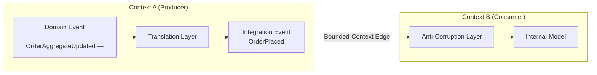
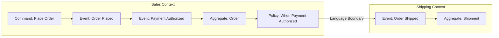
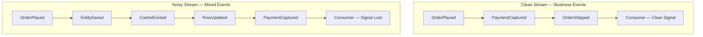

## Diagrams — Modeling Events as Domain Facts

### flowchart showing a domain event produced inside Context A, passing through a translation/anti-corruption boundary that transforms it into an integration event, which is then consumed by Context B; label the boundary as the bounded-context edge

A domain event produced inside a bounded context must be translated into an integration event before it crosses the context boundary; this seam preserves each team's freedom to refactor their internal model independently.

---

### sequence-style timeline of an Event Storming wall showing past-tense domain events left to right, with commands, aggregates, and a policy note, and a highlighted boundary where the ubiquitous language changes

An Event Storming timeline maps business facts in past tense from left to right, surfacing commands, aggregates, and policies; the point where the ubiquitous language shifts marks a bounded-context boundary and signals a candidate integration event.

---

### comparison chart contrasting a clean stream of business-meaningful events against a noisy stream polluted with persistence and infrastructure events, showing how consumers lose signal in the noisy case

Mixing technical noise into domain topics floods consumers with irrelevant signals, making it impossible to distinguish real business facts from implementation artifacts; keeping domain topics clean preserves the stream as a reliable business ledger.

---
