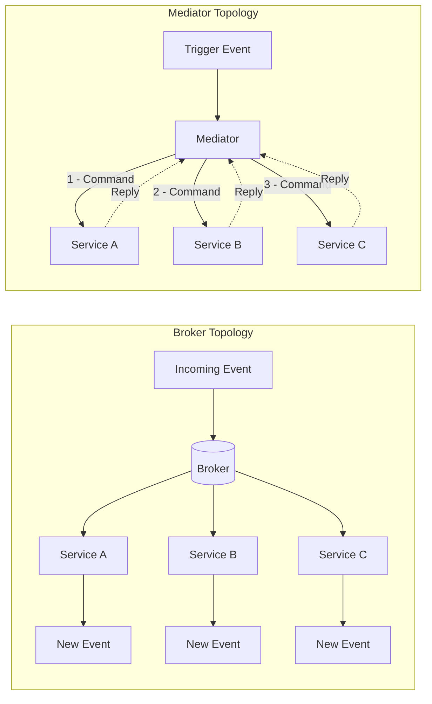
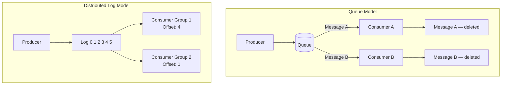
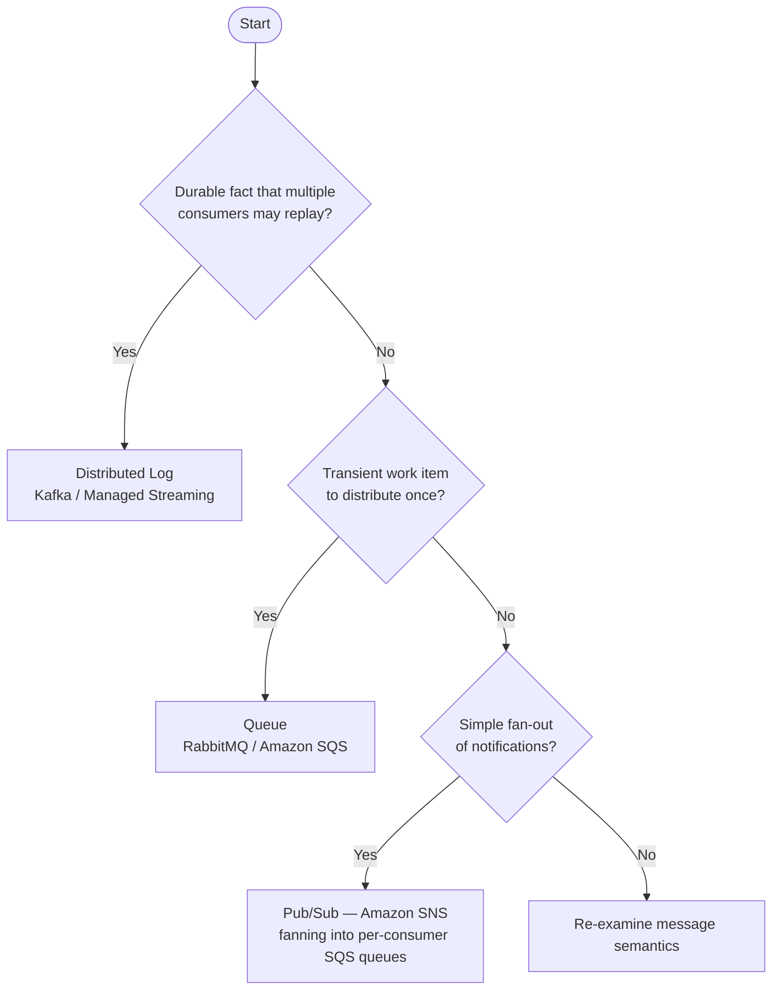

# Chapter 3: Topologies and Messaging Infrastructure

## Opening Problem Statement

Chapter 2 taught how to model events as genuine business facts and treat every published event as an owned contract. But a well-modeled event is inert until something moves it from the service that produced it to the services that care. That "something" is your messaging infrastructure, and choosing it is one of the highest-leverage, hardest-to-reverse decisions in an event-driven system. Pick the wrong topology and you will spend the next two years fighting your own middleware: replaying events that cannot be replayed, ordering messages that were never ordered, and debugging a control flow that lives nowhere in your codebase. Senior architects do not get to be vague here. The distinction between a distributed log and a queue is not academic trivia; it dictates whether you can rebuild a read model from scratch, whether a slow consumer blocks a fast one, and whether "add another consumer" is a config change or a redesign. This chapter maps the two topology families, the two coordination models, and the three technology archetypes you will actually meet in production. By the end, you should be able to defend a choice, not just name one.

## Broker Topology Versus Mediator Topology

Every event-driven system falls into one of two structural patterns, and the difference is about where the control flow lives. In a **broker topology**, there is no central coordinator. Each service publishes events and subscribes to the events it needs, then reacts on its own. The business process is an emergent property of many independent reactions. Nobody owns the end-to-end flow; it exists only as the sum of local decisions. This is the pattern that gives EDA its famous decoupling and its equally famous debuggability problem.

In a **mediator topology**, a central component, the **mediator** or **orchestrator**, owns the process. It receives a triggering event, then issues commands to participant services in a deliberate sequence, tracking the state of the workflow as it advances. The mediator knows what step comes next, what to do when a step fails, and when the process is complete. The flow is explicit and lives in one place you can read.

The trade-off is the whole point. Broker topology maximizes decoupling and throughput but scatters the process across services, making it hard to answer "why did this order get stuck?" Mediator topology centralizes visibility and error handling but reintroduces a coordination dependency and a potential bottleneck. Neither is correct in the abstract.

*Diagram: Broker Topology versus Mediator Topology — contrasting emergent, decentralized control flow against deliberate, centralized coordination.*



A useful heuristic: use broker topology for simple, mostly independent reactions where each subscriber's job is self-contained. Reach for a mediator when the process has real steps, ordering constraints, and compensation logic that someone must own. We will formalize the mediator as a saga process manager in Chapter 7; here it is enough to recognize the structural choice.

<details>
<summary>💡 Expert Note</summary>

The prose correctly identifies the mediator as a potential bottleneck, but in practice the more dangerous production risk is blast radius, not throughput. Modern workflow engines (AWS Step Functions, Temporal, Conductor) scale horizontally and are rarely CPU- or throughput-limited. The real danger is that a bug in the orchestrator's business logic, or a bad deployment that corrupts workflow state, simultaneously affects every in-flight instance of every workflow type managed by that orchestrator. Teams mitigate this with workflow versioning (Temporal's versioning API, Step Functions state machine versions), strict canary deployment of orchestrator changes, and separation of workflow definitions by domain boundary so a defect in Order workflows cannot corrupt Payment workflows.
</details>

<details>
<summary>⚠️ Critical Note</summary>

The prose opens with "every event-driven system falls into one of two structural patterns" and then builds the entire topology framework on the broker/mediator binary. In practice, large production systems routinely combine both: domain events flow over a broker while cross-domain sagas are orchestrated via a mediator, often within the same deployment. Presenting the choice as mutually exclusive at the system level leads architects toward a false either/or decision at architecture time, when the real question is "which topology per process boundary?" The binary framing is pedagogically convenient but actively misleading for senior practitioners designing systems with heterogeneous workflows.
</details>

## Choreography Versus Orchestration

Broker and mediator are structural terms; **choreography** and **orchestration** are the behavioral coordination models that map onto them. They are frequently used as synonyms for the topologies, and for practical purposes the mapping holds: choreography is how a broker topology coordinates, orchestration is how a mediator topology coordinates.

In **choreography**, each service reacts to events and emits new events without being told to by any central authority. Think of dancers who each know their own steps and cues; the dance emerges from everyone reacting to the music and to each other. There is no conductor. An `OrderPlaced` event triggers the payment service, whose `PaymentCaptured` event triggers the shipping service, and so on. The flow is a chain of reactions.

In **orchestration**, a conductor, the orchestrator, explicitly directs each participant. It sends a "capture payment" command, waits for the result, then sends a "reserve inventory" command. The participants do not need to know about each other at all; they only know how to obey commands and report outcomes.

The tension is visibility versus autonomy. Choreography keeps services maximally independent but hides the process; to understand the whole flow you must trace events across many services. Orchestration makes the process legible and centralizes failure handling but couples participants to the orchestrator and creates a component that must scale and stay available.

| Dimension | Choreography | Orchestration |
|---|---|---|
| Control flow | Distributed, emergent | Centralized, explicit |
| Coupling | Lowest | Higher (to orchestrator) |
| Process visibility | Poor, must be traced | Excellent, lives in one place |
| Failure handling | Each service, locally | Orchestrator owns it |
| Best fit | Few steps, autonomous reactions | Many steps, ordering, compensation |

The opinionated position: default to choreography for small numbers of steps, and switch to orchestration the moment the process exceeds roughly four steps or requires compensation. Junior teams tend to over-orchestrate out of a desire for control; over-decoupled teams choreograph flows so complex that no one can explain them. Both are failure modes.

<details>
<summary>💡 Expert Note</summary>

The prose frames the choice as system-wide, but the most resilient production architectures apply both models simultaneously at different granularity levels. The canonical pattern: use orchestration inside a bounded context (a saga process manager owns multi-step workflows within the Payment domain) and use choreography between bounded contexts (Payment publishes `PaymentCaptured`; Fulfillment subscribes without knowing that Payment exists). This aligns with DDD's autonomous bounded-context principle and prevents the orchestrator from accumulating cross-domain knowledge that collapses the boundary. Teams that miss this often build a "god orchestrator" that ends up knowing about every service, recreating the coupling they were trying to eliminate.
</details>

<details>
<summary>⚠️ Critical Note</summary>

The prose offers "switch to orchestration the moment the process exceeds roughly four steps" as an opinionated but actionable threshold. This number has no empirical basis and is highly context-dependent. Two-step flows with external payment systems and regulatory compensation requirements often demand a mediator; eight-step internal data pipelines with fully autonomous services and mature observability can operate safely as choreography. The relevant variables are not step count but: whether compensation is required (sagas), whether the process has a business owner who needs an audit trail, what observability tooling is in place, and whether services are autonomously deployable. Presenting a step count as the decision threshold will cause teams to misclassify their workflows.
</details>

## Distributed Log Versus Queue

Now to the infrastructure itself. The single most consequential technical distinction in messaging is between a **queue** and a **distributed log**, because it determines what you can and cannot do with events after they are consumed.

A traditional **message queue**, such as RabbitMQ or Amazon SQS, treats a message as a work item to be consumed and destroyed. A producer puts a message on the queue; a consumer takes it off; once acknowledged, the message is gone. Queues excel at distributing work: many competing consumers pull from the same queue, and each message is handled by exactly one of them. This is the **competing consumers** pattern, and it is ideal for task distribution where messages are transient commands to do work.

A **distributed log**, exemplified by Apache Kafka, treats events as an append-only, durable sequence. Consuming an event does not delete it. Each consumer tracks its own position, the **offset**, in the log and reads forward at its own pace. The log retains events for a configured period regardless of who has read them. This changes everything downstream: a new consumer can join and read the entire history from the beginning, and an existing consumer can rewind and reprocess.

*Diagram: Queue versus Distributed Log — messages are destroyed on consumption in a queue; independent consumer groups maintain their own offsets in a durable log.*



The distinction is not "which is better" but "which model fits your need." If the message is a transient command consumed once, a queue is simpler and cheaper. If the event is a durable fact that multiple independent consumers need, now and in the future, and that you may need to replay, the log is the right tool. Notice how this echoes Chapter 2: durable facts want a log; transient work items want a queue.

<details>
<summary>💡 Expert Note</summary>

The binary framing of log versus queue, while pedagogically useful, understates how much the boundary has shifted. RabbitMQ 3.9 (2021) introduced Streams, a durable, append-only, replayable log abstraction built into the broker, with consumer offset tracking semantics nearly identical to Kafka. Teams evaluating RabbitMQ for new EDA workloads should assess Streams before dismissing it as a queue-only tool. The meaningful differentiators between Kafka and RabbitMQ Streams at this point are ecosystem maturity, Kafka's richer partition-level parallelism controls, and the managed-service landscape (MSK, Confluent Cloud), not the fundamental replay capability.
</details>

## Publish/Subscribe, Partitions, and Consumer Groups

Three mechanics make the log model work at scale, and senior engineers must understand all three precisely.

**Publish/subscribe** (pub/sub) means a producer publishes to a **topic** and any number of subscribers receive a copy. This is fan-out: one event, many independent readers. It contrasts with point-to-point queuing, where one message goes to one consumer. In cloud terms, Amazon SNS is a pub/sub fan-out service and SQS is a queue; the common SNS-to-SQS pattern deliberately combines both, using SNS to fan an event out to several SQS queues so each downstream service gets its own private copy to consume at its own pace.

**Partitions** are how a log scales horizontally and preserves order. A topic is split into partitions, and each event is routed to a partition by a **partition key**, typically an entity ID such as `orderId`. Kafka guarantees ordering only within a partition, never across partitions. This is the rule that catches teams off guard: if global ordering matters you are limited to one partition and therefore no parallelism, so you deliberately choose a key that keeps causally related events together while letting unrelated entities spread across partitions for throughput.

*Code example: Kafka producer keying events by `orderId` to enforce per-order partition affinity — all events for the same order land on the same partition; events for different orders distribute across partitions for throughput.*

```python
# Kafka producer keying events by orderId to enforce per-order partition affinity
# Requires: pip install confluent-kafka
from __future__ import annotations

import json
from dataclasses import dataclass, field
from typing import Any

from confluent_kafka import Producer
from confluent_kafka.error import KafkaError

BROKER = "localhost:9092"
TOPIC = "order-events"


@dataclass
class OrderEvent:
    order_id: str
    event_type: str       # e.g. "OrderPlaced", "OrderShipped"
    payload: dict[str, Any] = field(default_factory=dict)

    def to_json(self) -> bytes:
        return json.dumps(
            {"type": self.event_type, "orderId": self.order_id, "payload": self.payload}
        ).encode("utf-8")


def _delivery_report(err: KafkaError | None, msg: Any) -> None:
    """Callback invoked once the broker acknowledges (or rejects) each message."""
    if err:
        print(f"[FAILED] {err}")
    else:
        # partition() and offset() confirm exactly where the event was stored
        print(f"[OK] type={json.loads(msg.value())['type']} "
              f"partition={msg.partition()} offset={msg.offset()}")


def publish_order_event(producer: Producer, event: OrderEvent) -> None:
    """Publish one order event.

    The `key` argument is the partition key.  Kafka's default partitioner applies
    a consistent hash over the key bytes, so the same orderId always maps to the
    same partition — guaranteeing that OrderPlaced arrives before OrderShipped
    for every individual order, regardless of broker load or producer restarts.
    """
    producer.produce(
        topic=TOPIC,
        key=event.order_id,           # partition key — same orderId → same partition
        value=event.to_json(),
        callback=_delivery_report,
    )
    producer.poll(0)  # flush delivery callbacks without blocking the caller


def main() -> None:
    producer = Producer({"bootstrap.servers": BROKER})

    # Two events for order-42 → same partition; OrderPlaced is always before OrderShipped
    publish_order_event(producer, OrderEvent("order-42", "OrderPlaced",  {"customerId": "cust-7", "total": 149.99}))
    publish_order_event(producer, OrderEvent("order-42", "OrderShipped", {"trackingId": "TRK-001"}))

    # A concurrent event for order-99 → likely a different partition; no ordering constraint
    # relative to order-42, but full parallelism across partitions is preserved
    publish_order_event(producer, OrderEvent("order-99", "OrderPlaced", {"customerId": "cust-3", "total": 59.00}))

    producer.flush()  # block until all in-flight messages are acknowledged or fail


if __name__ == "__main__":
    main()
```

**Consumer groups** coordinate parallel consumption without duplication. Consumers sharing a group ID split the partitions among themselves; each partition is read by exactly one consumer in the group, giving you competing-consumers parallelism inside the log model. Meanwhile, a different group reading the same topic gets its own full copy of the stream. This is the elegant unification: within a group you get work distribution like a queue, across groups you get fan-out like pub/sub, all from the same durable log.

> 💡 **Expert Note:** The prose correctly states that ordering is guaranteed only within a partition and that the partition key should keep causally related events together. What is not said — and what routinely causes production incidents — is the hot-partition problem: if a small number of keys (a high-volume merchant ID, a viral product) accounts for a large share of events, those partitions receive disproportionate write pressure and lag accumulates on the consumers assigned to them while other partitions sit idle. The naive fix of switching to a composite key (e.g., `merchantId + orderId`) restores distribution but breaks the causal ordering guarantee across orders for that merchant. Teams must profile key cardinality before going live. When true hot-key situations are unavoidable, a common mitigation is key salting with a bounded random suffix (e.g., `orderId-0` through `orderId-N`) combined with a merge step, accepting that ordering is coordinated in the consumer rather than guaranteed by the broker.

> 💡 **Expert Note:** The prose explains consumer groups clearly but does not flag the rebalancing hazard. In Kafka's original eager rebalancing protocol, every time a consumer joins, leaves, or crashes, the entire group stops processing and reassigns all partitions — a stop-the-world pause that can range from seconds to tens of seconds depending on session timeouts and partition count. Under `at-least-once` delivery this window also produces duplicates, because in-flight records are re-delivered to newly assigned consumers. Kafka 2.4 introduced Incremental Cooperative Rebalancing (the `CooperativeStickyAssignor` assignment strategy), which transfers only the partitions that must move, leaving the rest actively consumed. This is not the default in many client versions, so production deployments should explicitly configure `partition.assignment.strategy=CooperativeStickyAssignor` and tune `session.timeout.ms` and `heartbeat.interval.ms` deliberately. Ignoring this is a common source of mystery lag spikes during routine deployments.

## Retention, Replay, and Reprocessing

The log's defining superpower is that events persist after consumption, and this is where the log earns its cost. **Retention** is the policy governing how long events are kept, by time (for example, seven days) or by size, or indefinitely via **log compaction**, which keeps the latest event per key forever. Retention is a first-class architectural decision, not a default to accept blindly, because it sets the boundary of what history you can reach.

**Replay** is reading historical events again by resetting a consumer's offset backward. **Reprocessing** is the application of replay: you deploy a new version of a projection, reset its consumer group to offset zero, and rebuild its entire state from history. This capability is what makes Event Sourcing and CQRS practical, and both depend on it in later chapters. With a queue, none of this exists; once a message is acknowledged it is gone, so a bug that corrupts a read model is unrecoverable from the messaging layer.

This single capability is the strongest argument for a log over a queue in fact-oriented systems, and the reason Kafka anchors so many event-driven platforms. But it is not free. Retention costs storage, replay can flood downstream systems if not throttled, and reprocessing demands that consumers be idempotent, because replayed events will be seen again. That idempotency requirement is not optional, and it is exactly the subject of Chapter 4.

With the mechanics established, the technology choice becomes a mapping exercise rather than a popularity contest.

*Diagram: Technology selection decision flowchart — from message semantics to the appropriate infrastructure archetype.*



> 💡 **Expert Note:** Replay is the log's most powerful capability, but it introduces a failure mode the prose does not cover: schema evolution. Events written months or years ago carry older schema versions. When a consumer is reset to offset zero and processes that history, its current deserializer must be backward-compatible with every schema version it will encounter, not just the current one. Without a schema registry (Confluent Schema Registry or AWS Glue Schema Registry) enforcing a compatibility policy (typically BACKWARD or FULL), a reprocessing job will fail partway through history on the first breaking schema change — usually discovered in a high-pressure incident recovery window. The practical rule: treat schema registry enrollment and compatibility enforcement as a prerequisite to enabling replay in production, not an afterthought.

<details>
<summary>💡 Expert Note</summary>

The prose accurately defines log compaction as keeping the latest event per key forever, which is correct. The nuance worth adding is that log-compacted topics are incompatible with full event sourcing. Event sourcing requires every event for an entity, not just the latest value; compaction discards intermediate events, which means you can derive current state but cannot reconstruct the audit trail or time-travel queries. Log compaction is appropriate for changelog topics (CDC, KTable materialization) and not for event-sourced aggregates, where infinite retention or external event store archival (DynamoDB, EventStoreDB) is the correct strategy. Teams that enable compaction on an event-sourced topic discover the data loss only when they attempt a full replay.
</details>

> ⚠️ **Critical Note:** The prose states that log compaction "keeps the latest event per key forever" and presents it as a retention option alongside time-based or size-based policies — but this conflates two incompatible goals. Log compaction is a compaction strategy that actively deletes all intermediate events for a given key, retaining only the most recent value. A team that enables compaction on a topic and later attempts full replay to rebuild a projection will silently receive a truncated history: every intermediate state transition for each entity is gone. The phrase "keeps the latest event per key forever" is technically accurate for the surviving record, but it implies durability of history rather than destruction of it. For a chapter whose entire argument for choosing a log over a queue rests on replay and reprocessing, recommending compaction without a hard warning about what it erases directly undermines the chapter's core thesis. **Suggested fix:** Add an explicit callout that log compaction is incompatible with event-history replay. Reserve it for changelog use cases (maintaining current state per key, as in Kafka Streams materialized views or KTables), and flag that event-sourced systems should use time-based or size-based retention with infinite or very long windows, never compaction on fact-carrying topics.

<details>
<summary>⚠️ Critical Note</summary>

The prose correctly states that reprocessing "demands that consumers be idempotent, because replayed events will be seen again" — but idempotency in the consumer's own data writes is only one layer of the problem. Any consumer that triggers external side effects during processing (sending an email, calling a payment gateway, invoking a webhook, publishing a notification to an external system) will re-execute those side effects on replay unless they are independently deduped at the external boundary. This failure mode is extremely common and causes real production incidents: replaying six months of `OrderPlaced` events re-sends confirmation emails to customers and re-charges payment methods. The prose defers all idempotency detail to Chapter 4, but senior engineers reading this chapter need at least a one-sentence warning that external side effects are a separate, harder problem than idempotent storage writes.
</details>

<details>
<summary>⚠️ Critical Note</summary>

The chapter argues strongly for replay and reprocessing as the log's decisive advantage, but never addresses schema evolution — arguably the biggest operational risk in long-lived logs. If a topic retains events for two years, consumers performing full replay will encounter events serialized under schemas that predate multiple breaking changes. Avro, Protobuf, and JSON Schema all have compatibility rules, but enforcing them, maintaining a schema registry, and writing consumer deserializers that handle both old and new shapes is non-trivial. A team that deploys a new consumer, resets to offset zero, and hits a three-year-old event in a deprecated Avro schema will get a deserialization exception and a stalled consumer group. For an audience of senior architects, treating replay as straightforward while omitting schema evolution is a significant gap.
</details>

## Key Takeaways

- **Topology is a control-flow decision.** Broker topology decouples but scatters the process; mediator topology centralizes visibility at the cost of a coordination dependency. Choreography and orchestration are the behavioral models that map onto them.
- **Queue and log are fundamentally different tools.** A queue destroys messages on consumption and distributes work; a distributed log retains events and lets independent consumers read, rewind, and replay.
- **Partitions preserve order only within a partition.** Choose a partition key that keeps causally related events together; global ordering costs you parallelism.
- **Consumer groups unify queue and pub/sub semantics.** Within a group you get competing-consumers parallelism; across groups you get fan-out, all from one log.
- **Retention and replay are the log's decisive advantage** and the foundation for Event Sourcing and CQRS, but they demand idempotent consumers and deliberate retention policy.

## What's Next

Replay guarantees that consumers will see the same event more than once, so Chapter 4 confronts delivery guarantees head-on and shows how to build idempotent consumers under at-least-once delivery.

<!-- ASSEMBLY COMPLETE
  Chapter: Topologies and Messaging Infrastructure
  Code blocks resolved: 1 / 1
  Diagrams resolved: 3 / 3
  Expert callouts (inline): 3
  Expert callouts (collapsed): 4
  Critical callouts (inline): 1
  Critical callouts (collapsed): 4
  Unresolved markers: 0
-->
