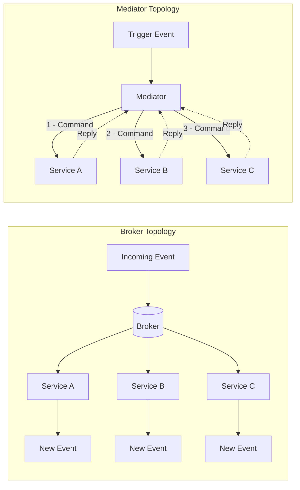
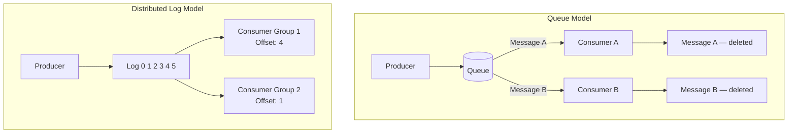
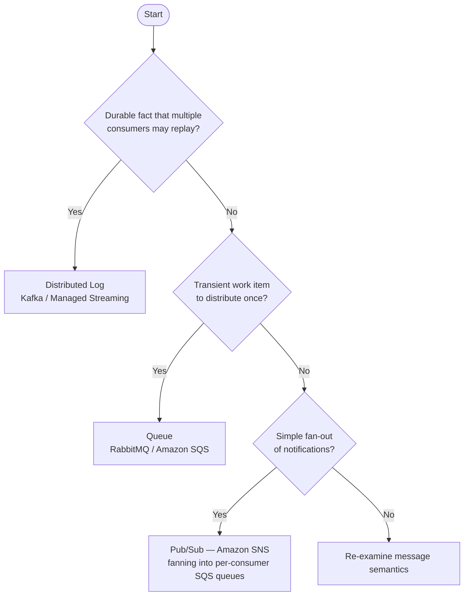

# Capítulo 3: Topologías e Infraestructura de Mensajería

## Planteamiento del Problema Inicial

El Capítulo 2 enseñó cómo modelar eventos como hechos de negocio genuinos y tratar cada evento publicado como un contrato propio. Pero un evento bien modelado es inerte hasta que algo lo mueve desde el servicio que lo produjo hasta los servicios que lo necesitan. Ese "algo" es tu infraestructura de mensajería, y elegirla es una de las decisiones de mayor impacto y más difíciles de revertir en un sistema orientado a eventos. Elige la topología equivocada y pasarás los próximos dos años luchando contra tu propio middleware: reproduciendo eventos que no pueden reproducirse, ordenando mensajes que nunca estuvieron ordenados, y depurando un flujo de control que no existe en ninguna parte de tu base de código. Los arquitectos senior no pueden darse el lujo de ser vagos aquí. La distinción entre un log distribuido y una cola no es una trivialidad académica; dicta si puedes reconstruir un modelo de lectura desde cero, si un consumidor lento bloquea a uno rápido, y si "agregar otro consumidor" es un cambio de configuración o un rediseño. Este capítulo traza las dos familias de topologías, los dos modelos de coordinación, y los tres arquetipos tecnológicos que encontrarás realmente en producción. Al final, deberías poder defender una elección, no solo nombrarla.

## Topología Broker Versus Topología Mediator

Cada sistema orientado a eventos cae en uno de dos patrones estructurales, y la diferencia radica en dónde vive el flujo de control. En una **topología broker** (broker topology), no hay un coordinador central. Cada servicio publica eventos y se suscribe a los eventos que necesita, luego reacciona por su cuenta. El proceso de negocio es una propiedad emergente de muchas reacciones independientes. Nadie es dueño del flujo de extremo a extremo; existe solo como la suma de las decisiones locales. Este es el patrón que le da a la EDA (arquitectura orientada a eventos) su famoso desacoplamiento y su igualmente famoso problema de depurabilidad.

En una **topología mediator** (mediator topology), un componente central, el **mediator** u **orquestador**, es dueño del proceso. Recibe un evento disparador, luego emite comandos a los servicios participantes en una secuencia deliberada, rastreando el estado del flujo de trabajo a medida que avanza. El mediator sabe qué paso viene a continuación, qué hacer cuando un paso falla, y cuándo el proceso está completo. El flujo es explícito y vive en un lugar que puedes leer.

El balance es todo el punto. La topología broker maximiza el desacoplamiento y el rendimiento, pero dispersa el proceso entre servicios, lo que hace difícil responder "¿por qué se atascó este pedido?" La topología mediator centraliza la visibilidad y el manejo de errores, pero reintroduce una dependencia de coordinación y un posible cuello de botella. Ninguna es correcta en abstracto.

*Diagrama: Topología Broker versus Topología Mediator — flujo de control emergente y descentralizado en contraste con la coordinación deliberada y centralizada.*



Una heurística útil: usa la topología broker para reacciones simples y mayormente independientes donde el trabajo de cada suscriptor es autocontenido. Recurre a un mediator cuando el proceso tiene pasos reales, restricciones de orden y lógica de compensación que alguien debe poseer. Formalizaremos el mediator como un gestor de procesos saga en el Capítulo 7; aquí es suficiente reconocer la elección estructural.

<details>
<summary>💡 Nota del Experto</summary>

El texto identifica correctamente el mediator como un posible cuello de botella, pero en la práctica el riesgo de producción más peligroso es el radio de impacto (blast radius), no el rendimiento. Los motores de flujo de trabajo modernos (AWS Step Functions, Temporal, Conductor) escalan horizontalmente y rara vez tienen limitaciones de CPU o rendimiento. El verdadero peligro es que un error en la lógica de negocio del orquestador, o un despliegue defectuoso que corrompe el estado del flujo de trabajo, afecta simultáneamente a todas las instancias en vuelo de cada tipo de flujo de trabajo gestionado por ese orquestador. Los equipos mitigan esto con el versionado de flujos de trabajo (la API de versionado de Temporal, las versiones de máquinas de estado de Step Functions), el despliegue canary estricto de los cambios en el orquestador, y la separación de las definiciones de flujo de trabajo por límite de dominio, de modo que un defecto en los flujos de trabajo de Order no pueda corromper los flujos de trabajo de Payment.
</details>

<details>
<summary>⚠️ Nota Crítica</summary>

El texto abre con "cada sistema orientado a eventos cae en uno de dos patrones estructurales" y luego construye todo el marco de topología sobre el binario broker/mediator. En la práctica, los grandes sistemas de producción combinan rutinariamente ambos: los eventos de dominio fluyen sobre un broker mientras las sagas entre dominios se orquestan mediante un mediator, a menudo dentro del mismo despliegue. Presentar la elección como mutuamente excluyente a nivel de sistema lleva a los arquitectos hacia una falsa decisión de uno u otro en el momento de diseño, cuando la pregunta real es "¿qué topología por límite de proceso?" El encuadre binario es pedagógicamente conveniente pero activamente engañoso para los profesionales senior que diseñan sistemas con flujos de trabajo heterogéneos.
</details>

## Coreografía Versus Orquestación

Broker y mediator son términos estructurales; la **coreografía** (choreography) y la **orquestación** (orchestration) son los modelos de coordinación conductual que se mapean sobre ellos. Frecuentemente se usan como sinónimos de las topologías, y para propósitos prácticos el mapeo es válido: la coreografía es cómo coordina una topología broker, la orquestación es cómo coordina una topología mediator.

En la **coreografía**, cada servicio reacciona a los eventos y emite nuevos eventos sin ser dirigido por ninguna autoridad central. Piensa en bailarines que cada uno conoce sus propios pasos y señales; el baile emerge de que todos reaccionan a la música y entre sí. No hay director. Un evento `OrderPlaced` desencadena el servicio de pago, cuyo evento `PaymentCaptured` desencadena el servicio de envío, y así sucesivamente. El flujo es una cadena de reacciones.

En la **orquestación**, un director, el orquestador, dirige explícitamente a cada participante. Envía un comando "capturar pago", espera el resultado, luego envía un comando "reservar inventario". Los participantes no necesitan conocerse entre sí en absoluto; solo saben cómo obedecer comandos y reportar resultados.

La tensión es visibilidad versus autonomía. La coreografía mantiene los servicios con la máxima independencia, pero oculta el proceso; para entender el flujo completo debes rastrear eventos a través de muchos servicios. La orquestación hace el proceso legible y centraliza el manejo de fallos, pero acopla a los participantes con el orquestador y crea un componente que debe escalar y mantenerse disponible.

| Dimensión | Coreografía | Orquestación |
|---|---|---|
| Flujo de control | Distribuido, emergente | Centralizado, explícito |
| Acoplamiento | Mínimo | Mayor (hacia el orquestador) |
| Visibilidad del proceso | Deficiente, debe rastrearse | Excelente, vive en un lugar |
| Manejo de fallos | Cada servicio, localmente | El orquestador lo posee |
| Mejor para | Pocos pasos, reacciones autónomas | Muchos pasos, orden, compensación |

La posición fundamentada: usa coreografía por defecto para un número pequeño de pasos, y cambia a orquestación en el momento en que el proceso supera aproximadamente cuatro pasos o requiere compensación. Los equipos junior tienden a sobre-orquestar por un deseo de control; los equipos excesivamente desacoplados coreografían flujos tan complejos que nadie puede explicarlos. Ambas son modos de fallo.

<details>
<summary>💡 Nota del Experto</summary>

El texto encuadra la elección como aplicable a todo el sistema, pero las arquitecturas de producción más resilientes aplican ambos modelos simultáneamente en diferentes niveles de granularidad. El patrón canónico: usar orquestación dentro de un bounded context (un gestor de proceso saga posee flujos de trabajo de múltiples pasos dentro del dominio de Payment) y usar coreografía entre bounded contexts (Payment publica `PaymentCaptured`; Fulfillment se suscribe sin saber que Payment existe). Esto se alinea con el principio de bounded context autónomo de DDD y evita que el orquestador acumule conocimiento entre dominios que derrumbe el límite. Los equipos que pasan por alto esto a menudo construyen un "orquestador dios" que termina conociendo todos los servicios, recreando el acoplamiento que intentaban eliminar.
</details>

<details>
<summary>⚠️ Nota Crítica</summary>

El texto ofrece "cambia a orquestación en el momento en que el proceso supera aproximadamente cuatro pasos" como un umbral con opinión pero accionable. Este número no tiene base empírica y depende en gran medida del contexto. Los flujos de dos pasos con sistemas de pago externos y requisitos de compensación regulatoria a menudo exigen un mediator; los pipelines de datos internos de ocho pasos con servicios completamente autónomos y observabilidad madura pueden operar de forma segura como coreografía. Las variables relevantes no son el conteo de pasos sino: si se requiere compensación (sagas), si el proceso tiene un propietario de negocio que necesita una pista de auditoría, qué herramientas de observabilidad están disponibles, y si los servicios son desplegables de forma autónoma. Presentar un conteo de pasos como el umbral de decisión hará que los equipos clasifiquen incorrectamente sus flujos de trabajo.
</details>

## Log Distribuido Versus Cola

Ahora a la infraestructura misma. La distinción técnica más consecuente en la mensajería es entre una **cola** (queue) y un **log distribuido** (distributed log), porque determina qué puedes y qué no puedes hacer con los eventos después de consumirlos.

Una **cola de mensajes** (message queue) tradicional, como RabbitMQ o Amazon SQS, trata un mensaje como una tarea de trabajo que se consume y destruye. Un productor coloca un mensaje en la cola; un consumidor lo extrae; una vez reconocido, el mensaje desaparece. Las colas sobresalen en la distribución de trabajo: muchos consumidores en competencia toman de la misma cola, y cada mensaje es manejado por exactamente uno de ellos. Este es el patrón de **consumidores en competencia** (competing consumers), y es ideal para la distribución de tareas donde los mensajes son comandos transitorios para realizar trabajo.

Un **log distribuido**, ejemplificado por Apache Kafka, trata los eventos como una secuencia durable de solo adición. Consumir un evento no lo elimina. Cada consumidor rastrea su propia posición, el **offset**, en el log y avanza a su propio ritmo. El log retiene los eventos durante un período configurado independientemente de quién los haya leído. Esto cambia todo lo que sigue: un nuevo consumidor puede unirse y leer todo el historial desde el principio, y un consumidor existente puede rebobinar y reprocesar.

*Diagrama: Cola versus Log Distribuido — los mensajes se destruyen al consumirse en una cola; los grupos de consumidores independientes mantienen sus propios offsets en un log durable.*



La distinción no es "cuál es mejor" sino "qué modelo se ajusta a tu necesidad." Si el mensaje es un comando transitorio consumido una sola vez, una cola es más simple y más económica. Si el evento es un hecho durable que múltiples consumidores independientes necesitan, ahora y en el futuro, y que puede que necesites reproducir, el log es la herramienta correcta. Observa cómo esto hace eco del Capítulo 2: los hechos durables quieren un log; los elementos de trabajo transitorios quieren una cola.

<details>
<summary>💡 Nota del Experto</summary>

El encuadre binario de log versus cola, aunque es pedagógicamente útil, subestima cuánto ha cambiado el límite. RabbitMQ 3.9 (2021) introdujo Streams, una abstracción de log durable, de solo adición y reproducible integrada en el broker, con semánticas de rastreo de offset del consumidor casi idénticas a Kafka. Los equipos que evalúan RabbitMQ para nuevas cargas de trabajo EDA deben evaluar Streams antes de descartarlo como una herramienta solo para colas. Los diferenciadores significativos entre Kafka y RabbitMQ Streams en este punto son la madurez del ecosistema, los controles más ricos de paralelismo a nivel de partición de Kafka, y el panorama de servicios gestionados (MSK, Confluent Cloud), no la capacidad fundamental de reproducción.
</details>

## Publish/Subscribe, Particiones y Grupos de Consumidores

Tres mecanismos hacen que el modelo de log funcione a escala, y los ingenieros senior deben entender los tres con precisión.

**Publish/subscribe** (pub/sub) significa que un productor publica en un **topic** y cualquier número de suscriptores recibe una copia. Esto es fan-out: un evento, muchos lectores independientes. Contrasta con la cola punto a punto, donde un mensaje va a un solo consumidor. En términos de nube, Amazon SNS es un servicio de fan-out pub/sub y SQS es una cola; el patrón común SNS-to-SQS combina deliberadamente ambos, usando SNS para distribuir un evento a varias colas SQS de modo que cada servicio descendente obtenga su propia copia privada para consumir a su propio ritmo.

Las **particiones** son cómo un log escala horizontalmente y preserva el orden. Un topic se divide en particiones, y cada evento se enruta a una partición mediante una **clave de partición** (partition key), típicamente un ID de entidad como `orderId`. Kafka garantiza el orden solo dentro de una partición, nunca entre particiones. Esta es la regla que toma desprevenidos a los equipos: si el orden global importa, estás limitado a una sola partición y, por lo tanto, a ningún paralelismo, por lo que deliberadamente eliges una clave que mantiene juntos los eventos causalmente relacionados mientras permite que las entidades no relacionadas se distribuyan entre particiones para maximizar el rendimiento.

*Ejemplo de código: Productor Kafka con clave de eventos por `orderId` para imponer afinidad de partición por pedido — todos los eventos para el mismo pedido caen en la misma partición; los eventos para pedidos diferentes se distribuyen entre particiones para mayor rendimiento.*

```python
# Kafka producer keying events by orderId to enforce per-order partition affinity
# Requires: pip install confluent-kafka
from __future__ import annotations

import json
from dataclasses import dataclass, field
from typing import Any

from confluent_kafka import Producer
from confluent_kafka.error import KafkaError

BROKER = "localhost:9092"
TOPIC = "order-events"


@dataclass
class OrderEvent:
    order_id: str
    event_type: str       # e.g. "OrderPlaced", "OrderShipped"
    payload: dict[str, Any] = field(default_factory=dict)

    def to_json(self) -> bytes:
        return json.dumps(
            {"type": self.event_type, "orderId": self.order_id, "payload": self.payload}
        ).encode("utf-8")


def _delivery_report(err: KafkaError | None, msg: Any) -> None:
    """Callback invoked once the broker acknowledges (or rejects) each message."""
    if err:
        print(f"[FAILED] {err}")
    else:
        # partition() and offset() confirm exactly where the event was stored
        print(f"[OK] type={json.loads(msg.value())['type']} "
              f"partition={msg.partition()} offset={msg.offset()}")


def publish_order_event(producer: Producer, event: OrderEvent) -> None:
    """Publish one order event.

    The `key` argument is the partition key.  Kafka's default partitioner applies
    a consistent hash over the key bytes, so the same orderId always maps to the
    same partition — guaranteeing that OrderPlaced arrives before OrderShipped
    for every individual order, regardless of broker load or producer restarts.
    """
    producer.produce(
        topic=TOPIC,
        key=event.order_id,           # partition key — same orderId → same partition
        value=event.to_json(),
        callback=_delivery_report,
    )
    producer.poll(0)  # flush delivery callbacks without blocking the caller


def main() -> None:
    producer = Producer({"bootstrap.servers": BROKER})

    # Two events for order-42 → same partition; OrderPlaced is always before OrderShipped
    publish_order_event(producer, OrderEvent("order-42", "OrderPlaced",  {"customerId": "cust-7", "total": 149.99}))
    publish_order_event(producer, OrderEvent("order-42", "OrderShipped", {"trackingId": "TRK-001"}))

    # A concurrent event for order-99 → likely a different partition; no ordering constraint
    # relative to order-42, but full parallelism across partitions is preserved
    publish_order_event(producer, OrderEvent("order-99", "OrderPlaced", {"customerId": "cust-3", "total": 59.00}))

    producer.flush()  # block until all in-flight messages are acknowledged or fail


if __name__ == "__main__":
    main()
```

Los **grupos de consumidores** (consumer groups) coordinan el consumo paralelo sin duplicación. Los consumidores que comparten un ID de grupo dividen las particiones entre ellos; cada partición es leída por exactamente un consumidor del grupo, lo que te brinda paralelismo de consumidores en competencia dentro del modelo de log. Mientras tanto, un grupo diferente que lee el mismo topic obtiene su propia copia completa del stream. Esta es la unificación elegante: dentro de un grupo obtienes distribución de trabajo como una cola; entre grupos obtienes fan-out como pub/sub, todo desde el mismo log durable.

> 💡 **Nota del Experto:** El texto indica correctamente que el orden está garantizado solo dentro de una partición y que la clave de partición debe mantener juntos los eventos causalmente relacionados. Lo que no se dice — y lo que rutinariamente causa incidentes en producción — es el problema de la partición caliente (hot-partition): si una pequeña cantidad de claves (un ID de comerciante de alto volumen, un producto viral) representa una gran parte de los eventos, esas particiones reciben una presión de escritura desproporcionada y el lag se acumula en los consumidores asignados a ellas mientras otras particiones permanecen inactivas. La solución ingenua de cambiar a una clave compuesta (por ejemplo, `merchantId + orderId`) restaura la distribución pero rompe la garantía de orden causal entre los pedidos de ese comerciante. Los equipos deben perfilar la cardinalidad de las claves antes de salir a producción. Cuando las situaciones de clave caliente son inevitables, una mitigación común es el salting de claves con un sufijo aleatorio acotado (por ejemplo, `orderId-0` hasta `orderId-N`) combinado con un paso de combinación, aceptando que el orden se coordina en el consumidor en lugar de estar garantizado por el broker.

> 💡 **Nota del Experto:** El texto explica los grupos de consumidores claramente, pero no señala el riesgo del rebalanceo. En el protocolo de rebalanceo eager original de Kafka, cada vez que un consumidor se une, se va o falla, todo el grupo detiene el procesamiento y reasigna todas las particiones — una pausa de parada del mundo que puede oscilar entre segundos y decenas de segundos dependiendo de los tiempos de sesión y el conteo de particiones. Bajo la entrega `at-least-once` (al menos una vez), esta ventana también produce duplicados, porque los registros en vuelo se vuelven a entregar a los consumidores recién asignados. Kafka 2.4 introdujo Incremental Cooperative Rebalancing (la estrategia de asignación `CooperativeStickyAssignor`), que transfiere solo las particiones que deben moverse, dejando el resto activamente consumido. Esto no es el valor predeterminado en muchas versiones de clientes, por lo que los despliegues en producción deben configurar explícitamente `partition.assignment.strategy=CooperativeStickyAssignor` y ajustar `session.timeout.ms` y `heartbeat.interval.ms` deliberadamente. Ignorar esto es una fuente común de misteriosos picos de lag durante los despliegues rutinarios.

## Retención, Reproducción y Reprocesamiento

El superpoder definitorio del log es que los eventos persisten después del consumo, y aquí es donde el log justifica su costo. La **retención** (retention) es la política que rige cuánto tiempo se mantienen los eventos, por tiempo (por ejemplo, siete días) o por tamaño, o indefinidamente mediante **compactación del log** (log compaction), que conserva el último evento por clave para siempre. La retención es una decisión arquitectónica de primer nivel, no un valor predeterminado que se acepta ciegamente, porque establece el límite del historial al que puedes acceder.

La **reproducción** (replay) es leer eventos históricos nuevamente restableciendo el offset de un consumidor hacia atrás. El **reprocesamiento** (reprocessing) es la aplicación de la reproducción: despliegas una nueva versión de una proyección, restableces su grupo de consumidores al offset cero, y reconstruyes su estado completo desde el historial. Esta capacidad es lo que hace prácticos el Event Sourcing (almacenamiento de eventos) y el CQRS (segregación de responsabilidades de consultas y comandos), y ambos dependen de ella en capítulos posteriores. Con una cola, nada de esto existe; una vez que un mensaje es reconocido desaparece, por lo que un error que corrompe un modelo de lectura es irrecuperable desde la capa de mensajería.

Esta única capacidad es el argumento más sólido para elegir un log sobre una cola en sistemas orientados a hechos, y la razón por la que Kafka ancla tantas plataformas orientadas a eventos. Pero no es gratuita. La retención tiene un costo de almacenamiento, la reproducción puede inundar los sistemas descendentes si no se regula, y el reprocesamiento exige que los consumidores sean idempotentes, porque los eventos reproducidos se verán nuevamente. Ese requisito de idempotencia no es opcional, y es exactamente el tema del Capítulo 4.

Con la mecánica establecida, la elección tecnológica se convierte en un ejercicio de mapeo más que en un concurso de popularidad.

*Diagrama: Diagrama de flujo de decisión para la selección de tecnología — desde la semántica del mensaje hasta el arquetipo de infraestructura apropiado.*



> 💡 **Nota del Experto:** La reproducción es la capacidad más poderosa del log, pero introduce un modo de fallo que el texto no cubre: la evolución del esquema. Los eventos escritos hace meses o años llevan versiones de esquema más antiguas. Cuando un consumidor se restablece al offset cero y procesa ese historial, su deserializador actual debe ser compatible con cada versión de esquema que encontrará, no solo con la actual. Sin un registro de esquemas (Confluent Schema Registry o AWS Glue Schema Registry) que aplique una política de compatibilidad (típicamente BACKWARD o FULL), un trabajo de reprocesamiento fallará a mitad del historial en el primer cambio de esquema que rompa la compatibilidad — normalmente descubierto en una ventana de recuperación de incidentes de alta presión. La regla práctica: tratar la inscripción en el registro de esquemas y la aplicación de compatibilidad como un requisito previo para habilitar la reproducción en producción, no como algo que se añade después.

<details>
<summary>💡 Nota del Experto</summary>

El texto define con precisión la compactación del log como conservar el último evento por clave para siempre, lo cual es correcto. El matiz que vale la pena agregar es que los topics compactados por log son incompatibles con el Event Sourcing completo. El Event Sourcing requiere cada evento para una entidad, no solo el último valor; la compactación descarta los eventos intermedios, lo que significa que puedes derivar el estado actual pero no puedes reconstruir la pista de auditoría ni las consultas de viaje en el tiempo. La compactación del log es apropiada para los topics de changelog (CDC, materialización de KTable) y no para los agregados con Event Sourcing, donde la retención infinita o el archivado externo de eventos (DynamoDB, EventStoreDB) es la estrategia correcta. Los equipos que habilitan la compactación en un topic con Event Sourcing descubren la pérdida de datos solo cuando intentan una reproducción completa.
</details>

> ⚠️ **Nota Crítica:** El texto afirma que la compactación del log "conserva el último evento por clave para siempre" y la presenta como una opción de retención junto con las políticas basadas en tiempo o tamaño — pero esto confunde dos objetivos incompatibles. La compactación del log es una estrategia de compactación que elimina activamente todos los eventos intermedios para una clave dada, conservando solo el valor más reciente. Un equipo que habilita la compactación en un topic e intenta posteriormente una reproducción completa para reconstruir una proyección recibirá silenciosamente un historial truncado: cada transición de estado intermedia para cada entidad ha desaparecido. La frase "conserva el último evento por clave para siempre" es técnicamente precisa para el registro que sobrevive, pero implica durabilidad del historial en lugar de su destrucción. Para un capítulo cuyo argumento completo a favor de elegir un log sobre una cola se basa en la reproducción y el reprocesamiento, recomendar la compactación sin una advertencia clara sobre lo que elimina socava directamente la tesis central del capítulo. **Corrección sugerida:** Agregar un aviso explícito de que la compactación del log es incompatible con la reproducción del historial de eventos. Reservarla para casos de uso de changelog (mantener el estado actual por clave, como en las vistas materializadas de Kafka Streams o KTables), e indicar que los sistemas con Event Sourcing deben usar retención basada en tiempo o tamaño con ventanas infinitas o muy largas, nunca compactación en topics que transportan hechos.

<details>
<summary>⚠️ Nota Crítica</summary>

El texto indica correctamente que el reprocesamiento "exige que los consumidores sean idempotentes, porque los eventos reproducidos se verán nuevamente" — pero la idempotencia en las escrituras de datos propias del consumidor es solo una capa del problema. Cualquier consumidor que desencadene efectos secundarios externos durante el procesamiento (enviar un correo electrónico, llamar a una pasarela de pago, invocar un webhook, publicar una notificación a un sistema externo) volverá a ejecutar esos efectos secundarios en la reproducción a menos que se dedupliquen de forma independiente en el límite externo. Este modo de fallo es extremadamente común y causa incidentes reales en producción: reproducir seis meses de eventos `OrderPlaced` reenvía correos electrónicos de confirmación a los clientes y vuelve a cobrar los métodos de pago. El texto aplaza todos los detalles de idempotencia al Capítulo 4, pero los ingenieros senior que leen este capítulo necesitan al menos una advertencia de una oración de que los efectos secundarios externos son un problema separado y más difícil que las escrituras de almacenamiento idempotentes.
</details>

<details>
<summary>⚠️ Nota Crítica</summary>

El capítulo argumenta con fuerza a favor de la reproducción y el reprocesamiento como la ventaja decisiva del log, pero nunca aborda la evolución del esquema — posiblemente el mayor riesgo operativo en logs de larga duración. Si un topic retiene eventos durante dos años, los consumidores que realicen una reproducción completa encontrarán eventos serializados bajo esquemas que preceden a múltiples cambios de ruptura. Avro, Protobuf y JSON Schema tienen reglas de compatibilidad, pero aplicarlas, mantener un registro de esquemas y escribir deserializadores de consumidores que manejen tanto formas antiguas como nuevas no es trivial. Un equipo que despliega un nuevo consumidor, lo restablece al offset cero, y encuentra un evento antiguo con un esquema Avro obsoleto obtendrá una excepción de deserialización y un grupo de consumidores bloqueado. Para una audiencia de arquitectos senior, tratar la reproducción como algo sencillo mientras se omite la evolución del esquema es una brecha significativa.
</details>

## Conclusiones Clave

- **La topología es una decisión de flujo de control.** La topología broker desacopla pero dispersa el proceso; la topología mediator centraliza la visibilidad al costo de una dependencia de coordinación. La coreografía y la orquestación son los modelos conductuales que se mapean sobre ellas.
- **La cola y el log son herramientas fundamentalmente diferentes.** Una cola destruye los mensajes al consumirlos y distribuye el trabajo; un log distribuido retiene los eventos y permite que los consumidores independientes lean, rebobinen y reproduzcan.
- **Las particiones preservan el orden solo dentro de una partición.** Elige una clave de partición que mantenga juntos los eventos causalmente relacionados; el orden global te cuesta paralelismo.
- **Los grupos de consumidores unifican la semántica de cola y pub/sub.** Dentro de un grupo obtienes paralelismo de consumidores en competencia; entre grupos obtienes fan-out, todo desde un log.
- **La retención y la reproducción son la ventaja decisiva del log** y la base para el Event Sourcing y el CQRS, pero demandan consumidores idempotentes y una política de retención deliberada.

## Qué Sigue

La reproducción garantiza que los consumidores verán el mismo evento más de una vez, por lo que el Capítulo 4 enfrenta de frente las garantías de entrega y muestra cómo construir consumidores idempotentes bajo la entrega at-least-once.

<!-- ASSEMBLY COMPLETE
  Chapter: Topologies and Messaging Infrastructure
  Code blocks resolved: 1 / 1
  Diagrams resolved: 3 / 3
  Expert callouts (inline): 3
  Expert callouts (collapsed): 4
  Critical callouts (inline): 1
  Critical callouts (collapsed): 4
  Unresolved markers: 0
-->
