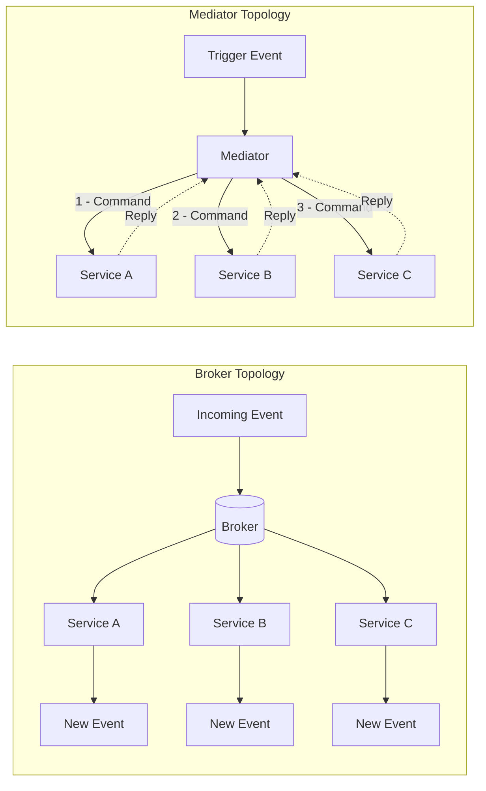
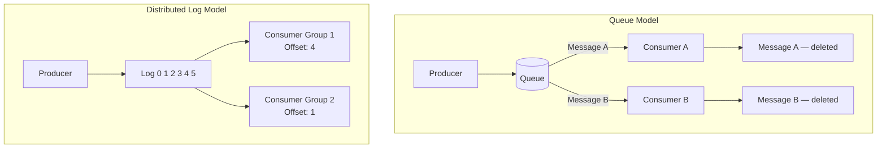
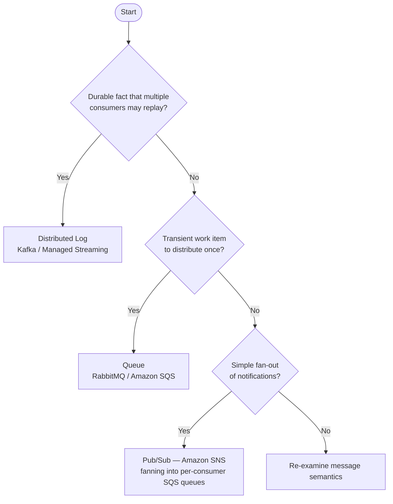

# Capítulo 3: Topologias e Infraestrutura de Mensageria

## Declaração do Problema Inicial

O Capítulo 2 ensinou como modelar eventos como fatos de negócio genuínos e tratar cada evento publicado como um contrato de propriedade. Mas um evento bem modelado é inerte até que algo o mova do serviço que o produziu para os serviços que se importam com ele. Esse "algo" é a sua infraestrutura de mensageria (messaging infrastructure), e escolhê-la é uma das decisões de maior alavancagem e mais difíceis de reverter em um sistema orientado a eventos. Escolha a topologia errada e você passará os próximos dois anos brigando com seu próprio middleware: repetindo eventos que não podem ser repetidos, ordenando mensagens que nunca foram ordenadas e depurando um fluxo de controle que não existe em nenhum lugar da sua base de código. Arquitetos sênior não podem ser vagos aqui. A distinção entre um log distribuído e uma fila não é trivialidade acadêmica; ela determina se você pode reconstruir um modelo de leitura do zero, se um consumidor lento bloqueia um rápido, e se "adicionar outro consumidor" é uma mudança de configuração ou um redesign. Este capítulo mapeia as duas famílias de topologia, os dois modelos de coordenação e os três arquétipos tecnológicos que você encontrará de fato em produção. Ao final, você deve ser capaz de defender uma escolha, não apenas nomeá-la.

## Topologia de Broker Versus Topologia de Mediador

Todo sistema orientado a eventos se encaixa em um de dois padrões estruturais, e a diferença está em onde vive o fluxo de controle. Em uma **topologia de broker** (broker topology), não há coordenador central. Cada serviço publica eventos e subscreve os eventos de que precisa, reagindo de forma autônoma. O processo de negócio é uma propriedade emergente de muitas reações independentes. Ninguém possui o fluxo de ponta a ponta; ele existe apenas como a soma das decisões locais. Este é o padrão que confere à EDA (Arquitetura Dirigida por Eventos) seu famoso desacoplamento e seu igualmente famoso problema de rastreabilidade.

Em uma **topologia de mediador** (mediator topology), um componente central, o **mediador** ou **orquestrador**, possui o processo. Ele recebe um evento de disparo, depois emite comandos para serviços participantes em uma sequência deliberada, rastreando o estado do fluxo de trabalho à medida que avança. O mediador sabe qual etapa vem a seguir, o que fazer quando uma etapa falha e quando o processo está completo. O fluxo é explícito e reside em um único lugar que você pode ler.

O trade-off é exatamente o ponto central. A topologia de broker maximiza o desacoplamento e o throughput, mas dispersa o processo pelos serviços, tornando difícil responder "por que este pedido ficou travado?" A topologia de mediador centraliza a visibilidade e o tratamento de erros, mas reintroduz uma dependência de coordenação e um possível gargalo. Nenhuma das duas está correta em abstrato.

*Diagrama: Topologia de Broker versus Topologia de Mediador — contrastando o fluxo de controle emergente e descentralizado com a coordenação deliberada e centralizada.*



Uma heurística útil: use a topologia de broker para reações simples, majoritariamente independentes, onde o trabalho de cada assinante é autocontido. Recorra a um mediador quando o processo tiver etapas reais, restrições de ordenação e lógica de compensação que alguém precise possuir. Formalizaremos o mediador como um gerenciador de processo de saga no Capítulo 7; aqui é suficiente reconhecer a escolha estrutural.

<details>
<summary>💡 Nota do Especialista</summary>

O texto identifica corretamente o mediador como um possível gargalo, mas na prática o risco de produção mais perigoso é o raio de explosão (blast radius), não o throughput. Motores de workflow modernos (AWS Step Functions, Temporal, Conductor) escalam horizontalmente e raramente sofrem limitações de CPU ou throughput. O perigo real é que um bug na lógica de negócio do orquestrador — ou um deployment defeituoso que corrompe o estado do workflow — afeta simultaneamente todas as instâncias em execução de todos os tipos de workflow gerenciados por aquele orquestrador. As equipes mitigam isso com versionamento de workflow (a API de versionamento do Temporal, versões de state machine do Step Functions), deployment canário rigoroso de mudanças no orquestrador, e separação das definições de workflow por fronteira de domínio, de modo que um defeito nos workflows de Order não possa corromper workflows de Payment.
</details>

<details>
<summary>⚠️ Nota Crítica</summary>

O texto abre com "todo sistema orientado a eventos se encaixa em um de dois padrões estruturais" e constrói todo o framework de topologia sobre o binário broker/mediador. Na prática, grandes sistemas de produção rotineiramente combinam ambos: eventos de domínio fluem por um broker enquanto sagas entre domínios são orquestradas via mediador, frequentemente dentro do mesmo deployment. Apresentar a escolha como mutuamente exclusiva no nível do sistema leva arquitetos a uma decisão falsa de "ou um ou outro" no momento da arquitetura, quando a pergunta real é "qual topologia por fronteira de processo?" O enquadramento binário é pedagogicamente conveniente, mas ativamente enganoso para profissionais sênior que projetam sistemas com workflows heterogêneos.
</details>

## Coreografia Versus Orquestração

Broker e mediador são termos estruturais; **coreografia** (choreography) e **orquestração** (orchestration) são os modelos comportamentais de coordenação que se mapeiam sobre eles. Eles são frequentemente usados como sinônimos das topologias, e para fins práticos o mapeamento se sustenta: coreografia é como uma topologia de broker coordena, orquestração é como uma topologia de mediador coordena.

Na **coreografia**, cada serviço reage a eventos e emite novos eventos sem ser instruído por nenhuma autoridade central. Pense em dançarinos que conhecem seus próprios passos e deixas; a dança emerge de todos reagindo à música e uns aos outros. Não há maestro. Um evento `OrderPlaced` dispara o serviço de pagamento, cujo evento `PaymentCaptured` dispara o serviço de envio, e assim por diante. O fluxo é uma cadeia de reações.

Na **orquestração**, um maestro, o orquestrador, dirige explicitamente cada participante. Ele envia um comando "capturar pagamento", aguarda o resultado, depois envia um comando "reservar estoque". Os participantes não precisam saber nada uns sobre os outros; eles apenas sabem como obedecer comandos e reportar resultados.

A tensão é visibilidade versus autonomia. A coreografia mantém os serviços maximamente independentes, mas oculta o processo; para entender o fluxo completo você deve rastrear eventos por muitos serviços. A orquestração torna o processo legível e centraliza o tratamento de falhas, mas acopla os participantes ao orquestrador e cria um componente que deve escalar e permanecer disponível.

| Dimensão | Coreografia | Orquestração |
|---|---|---|
| Fluxo de controle | Distribuído, emergente | Centralizado, explícito |
| Acoplamento | Mínimo | Maior (ao orquestrador) |
| Visibilidade do processo | Baixa, deve ser rastreada | Excelente, reside em um único lugar |
| Tratamento de falhas | Cada serviço, localmente | O orquestrador possui |
| Melhor adequação | Poucos passos, reações autônomas | Muitos passos, ordenação, compensação |

A posição opinativa: adote coreografia por padrão para um número pequeno de etapas, e mude para orquestração no momento em que o processo ultrapassar cerca de quatro etapas ou exigir compensação. Equipes inexperientes tendem a sobre-orquestrar por desejo de controle; equipes excessivamente desacopladas coreografam fluxos tão complexos que ninguém consegue explicá-los. Ambos são modos de falha.

<details>
<summary>💡 Nota do Especialista</summary>

O texto enquadra a escolha como aplicável ao sistema como um todo, mas as arquiteturas de produção mais resilientes aplicam ambos os modelos simultaneamente em diferentes níveis de granularidade. O padrão canônico: use orquestração dentro de um contexto delimitado (bounded context) — um gerenciador de processo de saga possui workflows de múltiplas etapas dentro do domínio de Payment — e use coreografia entre contextos delimitados (Payment publica `PaymentCaptured`; Fulfillment assina sem saber que Payment existe). Isso se alinha com o princípio de contexto delimitado autônomo do DDD e evita que o orquestrador acumule conhecimento entre domínios que colapse a fronteira. Equipes que perdem esse ponto frequentemente constroem um "orquestrador deus" que acaba conhecendo cada serviço, recriando o acoplamento que tentavam eliminar.
</details>

<details>
<summary>⚠️ Nota Crítica</summary>

O texto oferece "mude para orquestração no momento em que o processo ultrapassar cerca de quatro etapas" como um limiar opinativo mas acionável. Esse número não tem base empírica e é altamente dependente do contexto. Fluxos de duas etapas com sistemas de pagamento externos e requisitos de compensação regulatória frequentemente exigem um mediador; pipelines de dados internos de oito etapas com serviços totalmente autônomos e observabilidade madura podem operar com segurança como coreografia. As variáveis relevantes não são a contagem de etapas, mas: se compensação é necessária (sagas), se o processo tem um proprietário de negócio que precisa de uma trilha de auditoria, que ferramentas de observabilidade estão disponíveis e se os serviços são deployáveis de forma autônoma. Apresentar uma contagem de etapas como o limiar de decisão fará com que equipes classifiquem erroneamente seus workflows.
</details>

## Log Distribuído Versus Fila

Agora à própria infraestrutura. A distinção técnica mais consequente em mensageria é entre uma **fila** (queue) e um **log distribuído** (distributed log), porque ela determina o que você pode e não pode fazer com eventos após serem consumidos.

Uma **fila de mensagens** tradicional, como RabbitMQ ou Amazon SQS, trata uma mensagem como um item de trabalho a ser consumido e destruído. Um produtor coloca uma mensagem na fila; um consumidor a retira; uma vez confirmada, a mensagem desaparece. Filas se destacam na distribuição de trabalho: muitos consumidores concorrentes puxam da mesma fila, e cada mensagem é tratada por exatamente um deles. Este é o padrão de **consumidores concorrentes** (competing consumers), ideal para distribuição de tarefas onde mensagens são comandos transitórios para realizar trabalho.

Um **log distribuído**, exemplificado pelo Apache Kafka, trata eventos como uma sequência durável e somente de acréscimo (append-only). Consumir um evento não o exclui. Cada consumidor rastreia sua própria posição, o **offset** (deslocamento), no log e lê adiante no seu próprio ritmo. O log retém eventos por um período configurado independentemente de quem os leu. Isso muda tudo a seguir: um novo consumidor pode se juntar e ler todo o histórico desde o início, e um consumidor existente pode retroceder e reprocessar.

*Diagrama: Fila versus Log Distribuído — mensagens são destruídas ao consumo em uma fila; grupos de consumidores independentes mantêm seus próprios offsets em um log durável.*



A distinção não é "qual é melhor", mas "qual modelo atende à sua necessidade". Se a mensagem é um comando transitório consumido uma única vez, uma fila é mais simples e barata. Se o evento é um fato durável de que múltiplos consumidores independentes precisam — agora e no futuro — e que você pode precisar repetir, o log é a ferramenta certa. Note como isso ecoa o Capítulo 2: fatos duráveis querem um log; itens de trabalho transitórios querem uma fila.

<details>
<summary>💡 Nota do Especialista</summary>

O enquadramento binário de log versus fila, embora pedagogicamente útil, subestima o quanto essa fronteira se deslocou. O RabbitMQ 3.9 (2021) introduziu Streams, uma abstração de log durável, somente de acréscimo e repetível incorporada ao broker, com semânticas de rastreamento de offset de consumidor quase idênticas às do Kafka. Equipes que avaliam RabbitMQ para novas cargas de trabalho de EDA devem avaliar Streams antes de descartá-lo como uma ferramenta exclusiva de fila. Os diferenciadores relevantes entre Kafka e RabbitMQ Streams neste ponto são a maturidade do ecossistema, os controles de paralelismo mais ricos do Kafka em nível de partição e o panorama de serviços gerenciados (MSK, Confluent Cloud), não a capacidade fundamental de replay.
</details>

## Publish/Subscribe, Partições e Grupos de Consumidores

Três mecanismos fazem o modelo de log funcionar em escala, e engenheiros sênior devem entender todos os três com precisão.

**Publish/subscribe** (pub/sub) significa que um produtor publica em um **tópico** (topic) e qualquer número de assinantes recebe uma cópia. Isso é fan-out: um evento, muitos leitores independentes. Contrasta com o enfileiramento ponto a ponto, onde uma mensagem vai para um único consumidor. Em termos de nuvem, o Amazon SNS é um serviço de fan-out pub/sub e o SQS é uma fila; o padrão comum SNS-to-SQS combina deliberadamente ambos, usando SNS para distribuir um evento para várias filas SQS, de modo que cada serviço downstream receba sua própria cópia privada para consumir no seu próprio ritmo.

**Partições** (partitions) são como um log escala horizontalmente e preserva a ordem. Um tópico é dividido em partições, e cada evento é roteado para uma partição por uma **chave de partição** (partition key), tipicamente um ID de entidade como `orderId`. O Kafka garante ordenação apenas dentro de uma partição, nunca entre partições. Esta é a regra que pega equipes de surpresa: se a ordem global importa, você está limitado a uma partição e, portanto, sem paralelismo — então você deliberadamente escolhe uma chave que mantém eventos causalmente relacionados juntos, enquanto permite que entidades não relacionadas se distribuam entre partições para throughput.

*Exemplo de código: Produtor Kafka chaveando eventos por `orderId` para impor afinidade de partição por pedido — todos os eventos para o mesmo pedido chegam na mesma partição; eventos para pedidos diferentes se distribuem entre partições para throughput.*

```python
# Kafka producer keying events by orderId to enforce per-order partition affinity
# Requires: pip install confluent-kafka
from __future__ import annotations

import json
from dataclasses import dataclass, field
from typing import Any

from confluent_kafka import Producer
from confluent_kafka.error import KafkaError

BROKER = "localhost:9092"
TOPIC = "order-events"


@dataclass
class OrderEvent:
    order_id: str
    event_type: str       # e.g. "OrderPlaced", "OrderShipped"
    payload: dict[str, Any] = field(default_factory=dict)

    def to_json(self) -> bytes:
        return json.dumps(
            {"type": self.event_type, "orderId": self.order_id, "payload": self.payload}
        ).encode("utf-8")


def _delivery_report(err: KafkaError | None, msg: Any) -> None:
    """Callback invoked once the broker acknowledges (or rejects) each message."""
    if err:
        print(f"[FAILED] {err}")
    else:
        # partition() and offset() confirm exactly where the event was stored
        print(f"[OK] type={json.loads(msg.value())['type']} "
              f"partition={msg.partition()} offset={msg.offset()}")


def publish_order_event(producer: Producer, event: OrderEvent) -> None:
    """Publish one order event.

    The `key` argument is the partition key.  Kafka's default partitioner applies
    a consistent hash over the key bytes, so the same orderId always maps to the
    same partition — guaranteeing that OrderPlaced arrives before OrderShipped
    for every individual order, regardless of broker load or producer restarts.
    """
    producer.produce(
        topic=TOPIC,
        key=event.order_id,           # partition key — same orderId → same partition
        value=event.to_json(),
        callback=_delivery_report,
    )
    producer.poll(0)  # flush delivery callbacks without blocking the caller


def main() -> None:
    producer = Producer({"bootstrap.servers": BROKER})

    # Two events for order-42 → same partition; OrderPlaced is always before OrderShipped
    publish_order_event(producer, OrderEvent("order-42", "OrderPlaced",  {"customerId": "cust-7", "total": 149.99}))
    publish_order_event(producer, OrderEvent("order-42", "OrderShipped", {"trackingId": "TRK-001"}))

    # A concurrent event for order-99 → likely a different partition; no ordering constraint
    # relative to order-42, but full parallelism across partitions is preserved
    publish_order_event(producer, OrderEvent("order-99", "OrderPlaced", {"customerId": "cust-3", "total": 59.00}))

    producer.flush()  # block until all in-flight messages are acknowledged or fail


if __name__ == "__main__":
    main()
```

**Grupos de consumidores** (consumer groups) coordenam o consumo paralelo sem duplicação. Consumidores que compartilham um ID de grupo dividem as partições entre si; cada partição é lida por exatamente um consumidor do grupo, fornecendo paralelismo de consumidores concorrentes dentro do modelo de log. Enquanto isso, um grupo diferente lendo o mesmo tópico recebe sua própria cópia completa do stream. Esta é a unificação elegante: dentro de um grupo você obtém distribuição de trabalho como em uma fila; entre grupos você obtém fan-out como em pub/sub — tudo a partir do mesmo log durável.

> 💡 **Nota do Especialista:** O texto afirma corretamente que a ordenação é garantida apenas dentro de uma partição e que a chave de partição deve manter eventos causalmente relacionados juntos. O que não é dito — e o que rotineiramente causa incidentes de produção — é o problema de partição quente (hot-partition): se um pequeno número de chaves (um ID de comerciante de alto volume, um produto viral) responde por uma grande parcela dos eventos, essas partições recebem pressão de escrita desproporcional e o lag se acumula nos consumidores atribuídos a elas, enquanto outras partições ficam ociosas. A correção ingênua de mudar para uma chave composta (por exemplo, `merchantId + orderId`) restaura a distribuição, mas quebra a garantia de ordem causal entre pedidos daquele comerciante. As equipes devem analisar a cardinalidade das chaves antes de entrar em produção. Quando situações reais de hot-key são inevitáveis, uma mitigação comum é o salting de chave com um sufixo aleatório delimitado (por exemplo, `orderId-0` até `orderId-N`) combinado com uma etapa de merge, aceitando que a ordenação é coordenada no consumidor em vez de garantida pelo broker.

> 💡 **Nota do Especialista:** O texto explica grupos de consumidores com clareza, mas não sinaliza o risco de rebalanceamento. No protocolo de rebalanceamento ansioso (eager rebalancing) original do Kafka, toda vez que um consumidor entra, sai ou falha, o grupo inteiro para de processar e reatribui todas as partições — uma pausa de parada total que pode variar de segundos a dezenas de segundos dependendo dos timeouts de sessão e da contagem de partições. Sob entrega `at-least-once`, essa janela também produz duplicatas, porque registros em andamento são reentregues aos consumidores recém-atribuídos. O Kafka 2.4 introduziu o Incremental Cooperative Rebalancing (a estratégia de atribuição `CooperativeStickyAssignor`), que transfere apenas as partições que precisam ser movidas, deixando o restante sendo consumido ativamente. Este não é o padrão em muitas versões de cliente, então deployments de produção devem configurar explicitamente `partition.assignment.strategy=CooperativeStickyAssignor` e ajustar `session.timeout.ms` e `heartbeat.interval.ms` deliberadamente. Ignorar isso é uma fonte comum de misteriosas quedas de lag durante deployments de rotina.

## Retenção, Replay e Reprocessamento

O superpoder definidor do log é que os eventos persistem após o consumo, e é aqui que o log justifica seu custo. **Retenção** (retention) é a política que governa por quanto tempo os eventos são mantidos — por tempo (por exemplo, sete dias) ou por tamanho, ou indefinidamente via **compactação de log** (log compaction), que mantém o evento mais recente por chave para sempre. A retenção é uma decisão arquitetural de primeira classe, não um padrão a ser aceito cegamente, porque ela define o limite do histórico que você pode acessar.

**Replay** é a leitura de eventos históricos novamente, reiniciando o offset de um consumidor para trás. **Reprocessamento** é a aplicação do replay: você deploya uma nova versão de uma projeção, redefine seu grupo de consumidores para o offset zero e reconstrói todo o seu estado a partir do histórico. Essa capacidade é o que torna Event Sourcing e CQRS práticos, e ambos dependem dela nos capítulos seguintes. Com uma fila, nada disso existe; uma vez que uma mensagem é confirmada, ela desaparece, então um bug que corrompe um modelo de leitura é irrecuperável a partir da camada de mensageria.

Essa única capacidade é o argumento mais forte para um log em vez de uma fila em sistemas orientados a fatos, e a razão pela qual o Kafka ancora tantas plataformas orientadas a eventos. Mas não é gratuita. A retenção tem custo de armazenamento, o replay pode inundar sistemas downstream se não for limitado, e o reprocessamento exige que os consumidores sejam idempotentes, porque eventos repetidos serão vistos novamente. Esse requisito de idempotência não é opcional, e é exatamente o assunto do Capítulo 4.

Com os mecanismos estabelecidos, a escolha de tecnologia se torna um exercício de mapeamento em vez de um concurso de popularidade.

*Diagrama: Fluxograma de decisão de seleção de tecnologia — das semânticas da mensagem ao arquétipo de infraestrutura apropriado.*



> 💡 **Nota do Especialista:** O replay é a capacidade mais poderosa do log, mas introduz um modo de falha que o texto não cobre: evolução de schema. Eventos escritos meses ou anos atrás carregam versões mais antigas de schema. Quando um consumidor é redefinido para o offset zero e processa esse histórico, seu deserializador atual deve ser compatível com versões anteriores de cada versão de schema que encontrar — não apenas com a versão atual. Sem um registro de schema (Confluent Schema Registry ou AWS Glue Schema Registry) impondo uma política de compatibilidade (tipicamente BACKWARD ou FULL), um job de reprocessamento falhará no meio do histórico na primeira mudança de schema incompatível — geralmente descoberta em uma janela de recuperação de incidente sob alta pressão. A regra prática: trate o registro no schema registry e a imposição de compatibilidade como um pré-requisito para habilitar replay em produção, não como um complemento posterior.

<details>
<summary>💡 Nota do Especialista</summary>

O texto define com precisão a compactação de log como manter o evento mais recente por chave para sempre, o que está correto. A nuance que vale acrescentar é que tópicos com log compactado são incompatíveis com Event Sourcing completo. Event Sourcing requer cada evento de uma entidade, não apenas o valor mais recente; a compactação descarta eventos intermediários, o que significa que você pode derivar o estado atual, mas não pode reconstruir a trilha de auditoria nem consultas de viagem no tempo. A compactação de log é apropriada para tópicos de changelog (CDC, materialização de KTable) e não para agregados event-sourced, onde retenção infinita ou arquivamento externo de event store (DynamoDB, EventStoreDB) é a estratégia correta. Equipes que habilitam compactação em um tópico event-sourced descobrem a perda de dados somente quando tentam um replay completo.
</details>

> ⚠️ **Nota Crítica:** O texto afirma que a compactação de log "mantém o evento mais recente por chave para sempre" e a apresenta como uma opção de retenção ao lado de políticas baseadas em tempo ou tamanho — mas isso confunde dois objetivos incompatíveis. A compactação de log é uma estratégia de compactação que ativamente deleta todos os eventos intermediários de uma determinada chave, retendo apenas o valor mais recente. Uma equipe que habilita compactação em um tópico e depois tenta um replay completo para reconstruir uma projeção receberá silenciosamente um histórico truncado: cada transição de estado intermediária para cada entidade está perdida. A frase "mantém o evento mais recente por chave para sempre" é tecnicamente precisa para o registro sobrevivente, mas implica durabilidade do histórico em vez de sua destruição. Para um capítulo cujo argumento central para escolher um log em vez de uma fila repousa sobre replay e reprocessamento, recomendar compactação sem um aviso explícito sobre o que ela apaga mina diretamente a tese central do capítulo. **Correção sugerida:** Adicione um destaque explícito de que a compactação de log é incompatível com replay de histórico de eventos. Reserve-a para casos de uso de changelog (manutenção do estado atual por chave, como em visões materializadas do Kafka Streams ou KTables), e sinalize que sistemas event-sourced devem usar retenção baseada em tempo ou tamanho com janelas infinitas ou muito longas — nunca compactação em tópicos que carregam fatos.

<details>
<summary>⚠️ Nota Crítica</summary>

O texto afirma corretamente que o reprocessamento "exige que os consumidores sejam idempotentes, porque eventos repetidos serão vistos novamente" — mas a idempotência nas próprias gravações de dados do consumidor é apenas uma camada do problema. Qualquer consumidor que desencadeia efeitos colaterais externos durante o processamento (enviar um e-mail, chamar um gateway de pagamento, invocar um webhook, publicar uma notificação para um sistema externo) reexecutará esses efeitos colaterais no replay, a menos que sejam deduplicados independentemente na fronteira externa. Esse modo de falha é extremamente comum e causa incidentes reais de produção: repetir seis meses de eventos `OrderPlaced` reenvia e-mails de confirmação a clientes e recarrega métodos de pagamento. O texto adia todos os detalhes de idempotência para o Capítulo 4, mas engenheiros sênior lendo este capítulo precisam de pelo menos uma frase de aviso de que efeitos colaterais externos são um problema separado e mais difícil do que gravações de armazenamento idempotentes.
</details>

<details>
<summary>⚠️ Nota Crítica</summary>

O capítulo argumenta fortemente em favor do replay e reprocessamento como a vantagem decisiva do log, mas nunca aborda a evolução de schema — provavelmente o maior risco operacional em logs de longa duração. Se um tópico retém eventos por dois anos, consumidores que realizam replay completo encontrarão eventos serializados sob schemas que antecedem múltiplas mudanças incompatíveis. Avro, Protobuf e JSON Schema todos possuem regras de compatibilidade, mas impô-las, manter um schema registry e escrever deserializadores de consumidor que lidam com formas antigas e novas é não trivial. Uma equipe que deploya um novo consumidor, redefine para o offset zero e encontra um evento de três anos atrás em um schema Avro obsoleto obterá uma exceção de desserialização e um grupo de consumidores paralisado. Para uma audiência de arquitetos sênior, tratar o replay como simples enquanto omite a evolução de schema é uma lacuna significativa.
</details>

## Principais Conclusões

- **Topologia é uma decisão de fluxo de controle.** A topologia de broker desacopla, mas dispersa o processo; a topologia de mediador centraliza a visibilidade ao custo de uma dependência de coordenação. Coreografia e orquestração são os modelos comportamentais que se mapeiam sobre elas.
- **Fila e log são ferramentas fundamentalmente diferentes.** Uma fila destrói mensagens ao consumo e distribui trabalho; um log distribuído retém eventos e permite que consumidores independentes leiam, retrocedam e repitam.
- **Partições preservam a ordem apenas dentro de uma partição.** Escolha uma chave de partição que mantenha eventos causalmente relacionados juntos; ordenação global custa paralelismo.
- **Grupos de consumidores unificam as semânticas de fila e pub/sub.** Dentro de um grupo você obtém paralelismo de consumidores concorrentes; entre grupos você obtém fan-out — tudo a partir de um único log.
- **Retenção e replay são a vantagem decisiva do log** e o alicerce do Event Sourcing e do CQRS, mas exigem consumidores idempotentes e uma política de retenção deliberada.

## O Que Vem a Seguir

O replay garante que os consumidores verão o mesmo evento mais de uma vez, então o Capítulo 4 enfrenta diretamente as garantias de entrega e mostra como construir consumidores idempotentes sob entrega at-least-once.

<!-- ASSEMBLY COMPLETE
  Chapter: Topologies and Messaging Infrastructure
  Code blocks resolved: 1 / 1
  Diagrams resolved: 3 / 3
  Expert callouts (inline): 3
  Expert callouts (collapsed): 4
  Critical callouts (inline): 1
  Critical callouts (collapsed): 4
  Unresolved markers: 0
-->
