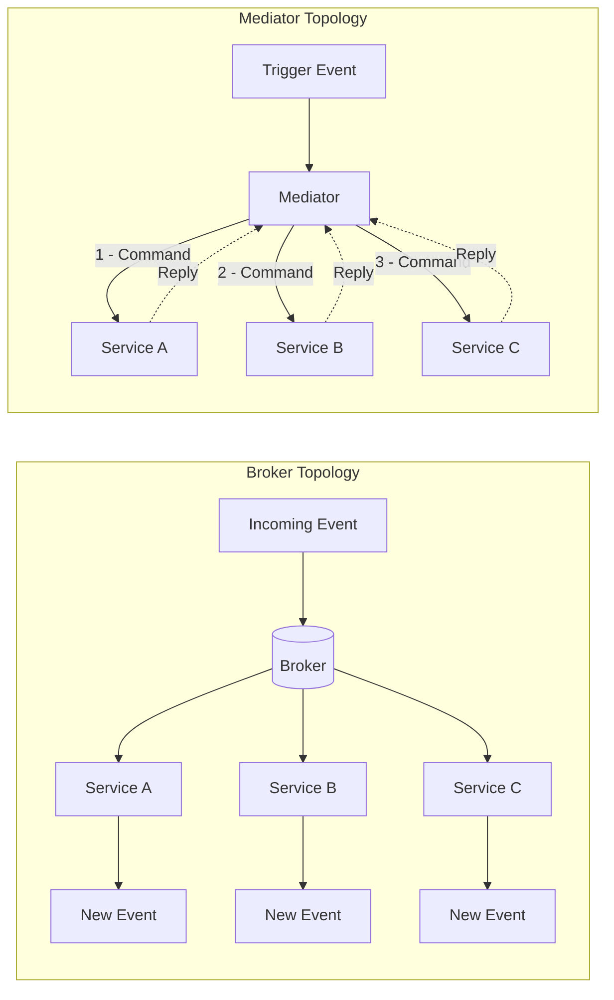
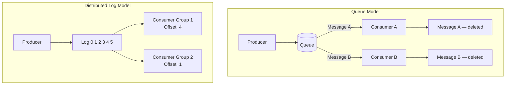
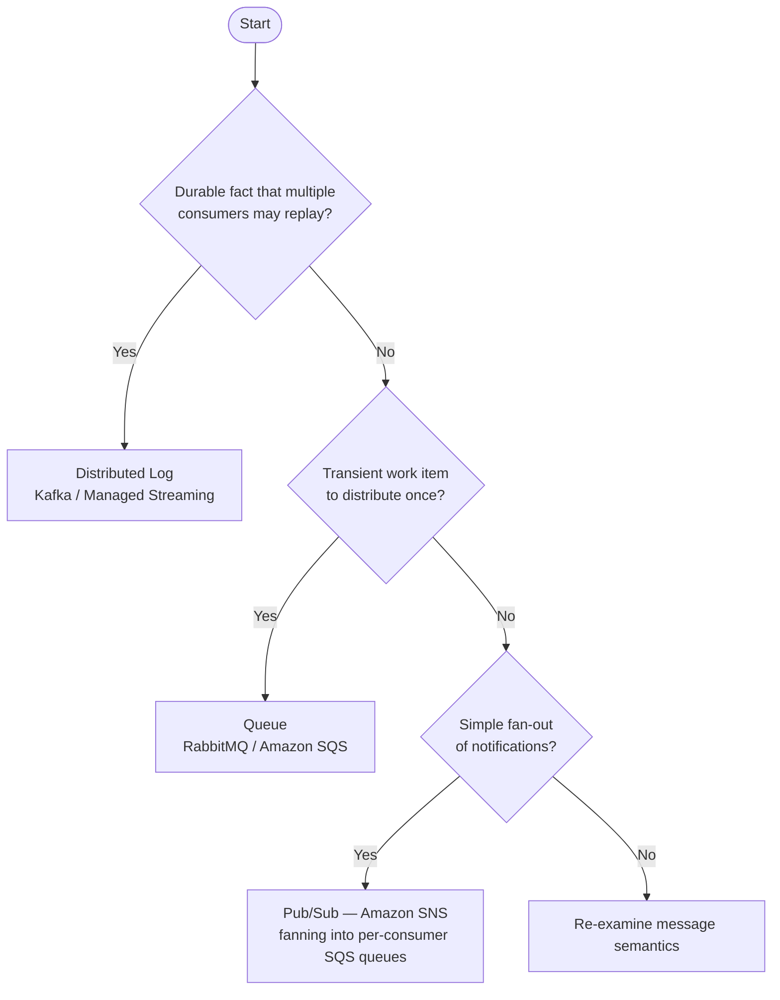

## Diagrams — Topologies and Messaging Infrastructure

### Two side-by-side flowcharts. Left labeled "Broker Topology": an event flows to a broker, and three services independently subscribe and react, each publishing further events with no central node. Right labeled "Mediator Topology": a triggering event enters a central Mediator, which issues numbered commands 1-2-3 to three services in sequence and receives replies.

This diagram contrasts the two fundamental EDA structural patterns: Broker Topology, where control flow is emergent and no single node owns the process, versus Mediator Topology, where a central coordinator drives each step in a deliberate sequence. Understanding the contrast is the prerequisite for making the topology choice a defensible architectural decision.

---

### Two contrasting diagrams. Top labeled "Queue": a producer sends messages into a queue; two competing consumers each pull different messages, and consumed messages disappear from the queue. Bottom labeled "Distributed Log": a producer appends events 0-1-2-3-4-5 to an ordered log; two independent consumer groups each maintain their own offset pointer at different positions, and no events are removed on consumption.

This diagram illustrates the single most consequential infrastructure distinction in event-driven systems: a queue destroys messages on consumption, enabling competing-consumers work distribution, while a distributed log retains the ordered event sequence, enabling independent consumer groups to read at their own pace, rewind, and replay.

---

### A decision flowchart guiding technology selection. Start: "Is the message a durable fact multiple consumers may replay?" Yes leads to "Distributed log (Kafka / managed streaming)". No leads to "Is it transient work to distribute?" which leads to "Queue (RabbitMQ / SQS)". A side branch: "Need simple fan-out of notifications?" leads to "Pub/sub (SNS) fanning into per-consumer SQS queues".

This flowchart turns the chapter's conceptual distinctions into an actionable decision tree, guiding practitioners from the nature of the message to the appropriate technology archetype. It frames technology selection as a mapping exercise rather than a popularity contest.

---
