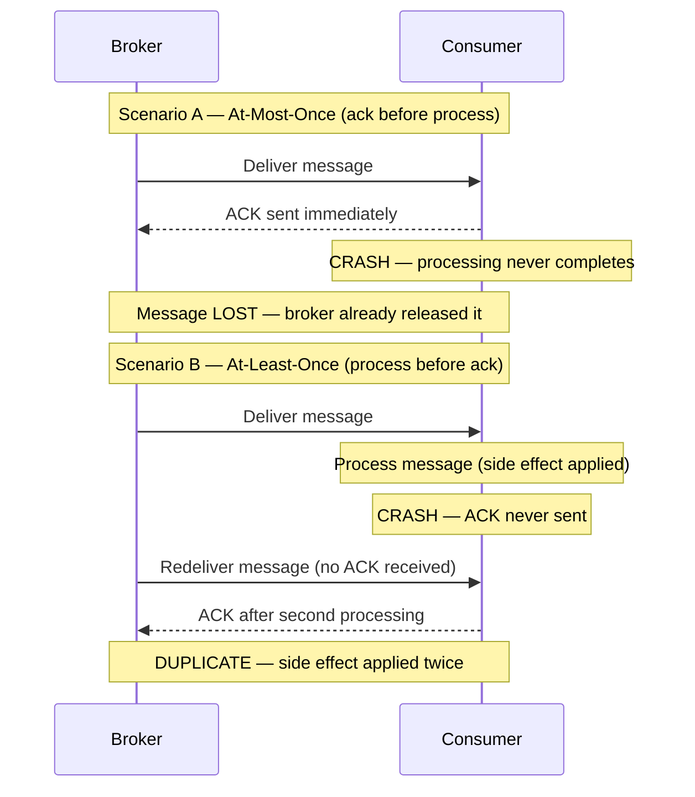
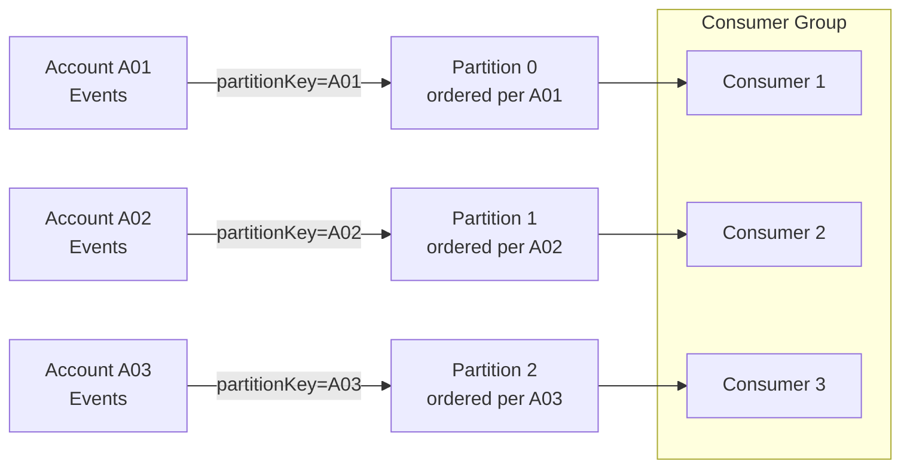
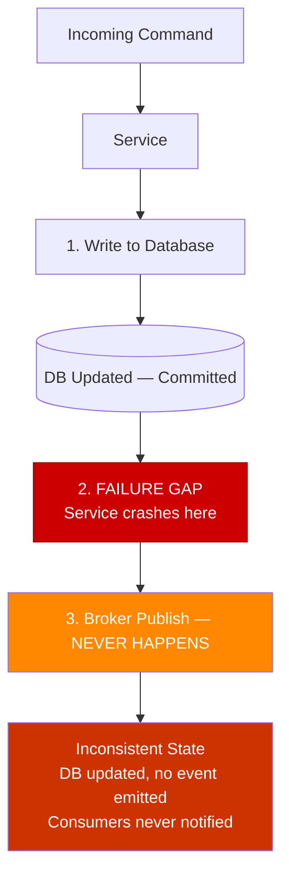

# Chapter 4: Delivery Guarantees and Idempotency

## Opening Problem Statement

Chapter 3 ended with a promise and a warning. The distributed log lets you replay history — reprocess millions of past events to rebuild a read model or fix a bug. But replay only works if reprocessing the same event twice produces the same result as processing it once. That property is called **idempotency**, and without it, replay corrupts data instead of repairing it.

This is not an edge case. Under the most common delivery guarantee in production systems, **every consumer will eventually receive a duplicate**. A network timeout, a broker retry, a consumer crash after processing but before acknowledging — any of these produces a message the consumer has already seen. If your handler charges a credit card, sends an email, or decrements inventory, a duplicate is a real financial or reputational loss.

Senior engineers frequently reach for a comforting escape hatch: "exactly-once delivery." They assume a broker feature or a cloud service flag makes the problem disappear. It does not. This chapter demystifies the three delivery semantics, explains precisely why exactly-once is the most misunderstood term in distributed systems, and gives you the concrete patterns — deduplication keys, the Transactional Outbox, dead-letter queues — that make correctness achievable. The goal is that duplicates stop being a threat and become a non-event.

## At-Most-Once, At-Least-Once, and Exactly-Once Semantics

A **delivery guarantee** describes what the messaging system promises about how many times a consumer observes each message. There are three levels, and the difference between them comes down to *when* the consumer acknowledges receipt.

An **acknowledgment** (ack) is the signal a consumer sends back to the broker to say "I am done with this message; you may stop tracking it." The ordering of *process* and *ack* determines the guarantee.

- **At-most-once**: ack first, then process. If the consumer crashes after acking but before finishing, the message is lost. Zero or one delivery. Fast, lossy, acceptable only for disposable data like metrics samples or non-critical telemetry.
- **At-least-once**: process first, then ack. If the consumer crashes after processing but before acking, the broker redelivers. One or more deliveries. Never loses a message, but guarantees duplicates. This is the default in Kafka, SQS, and RabbitMQ.
- **Exactly-once**: the holy grail — one delivery, no loss, no duplication.

**Figure 4.1 — At-Most-Once vs At-Least-Once: crash scenarios**



The table below is the mental model to keep.

**Listing 4.1 — Delivery-semantics reference table as typed dataclasses**

```python
# Delivery-semantics reference table as typed dataclasses
from dataclasses import dataclass
from typing import Literal

@dataclass(frozen=True)
class DeliverySemantics:
    name: str
    ack_ordering: str            # when the ack is sent relative to processing
    on_crash: str                # what happens if the consumer crashes mid-flight
    duplicates_possible: bool
    message_loss_possible: bool
    typical_use_case: str

DELIVERY_SEMANTICS: list[DeliverySemantics] = [
    DeliverySemantics(
        name="at-most-once",
        ack_ordering="ack BEFORE process",
        on_crash="message is lost — broker already removed it",
        duplicates_possible=False,
        message_loss_possible=True,
        typical_use_case="metrics samples, non-critical telemetry",
    ),
    DeliverySemantics(
        name="at-least-once",
        ack_ordering="ack AFTER process",
        on_crash="broker redelivers — consumer sees it again",
        duplicates_possible=True,
        message_loss_possible=False,
        typical_use_case="default in Kafka, SQS, RabbitMQ; requires idempotent consumers",
    ),
    DeliverySemantics(
        name="exactly-once (processing)",
        ack_ordering="atomic commit covering both effect and ack",
        on_crash="transaction rolls back; redelivered message is a no-op",
        duplicates_possible=False,   # at the effect level, not at the wire level
        message_loss_possible=False,
        typical_use_case="Kafka Streams read-process-write within Kafka topology only",
    ),
]

# Quick display helper — useful in notebooks or during architecture reviews
if __name__ == "__main__":
    header = f"{'Semantic':<22} {'Ack order':<22} {'Dups?':<7} {'Loss?':<7} {'Use case'}"
    print(header)
    print("-" * len(header))
    for s in DELIVERY_SEMANTICS:
        print(
            f"{s.name:<22} {s.ack_ordering:<22} "
            f"{'yes' if s.duplicates_possible else 'no':<7} "
            f"{'yes' if s.message_loss_possible else 'no':<7} "
            f"{s.typical_use_case}"
        )
```

Now for the misunderstanding. **True exactly-once delivery over a network is impossible.** This follows from the Two Generals Problem: two parties communicating over an unreliable channel can never both be certain the other received the final message. A sender that gets no ack cannot distinguish "message lost" from "ack lost," so it must either resend (risking a duplicate) or give up (risking loss). No protocol escapes this.

What vendors sell as "exactly-once" is really **exactly-once *processing***, not delivery. The message may be *delivered* many times, but the system produces the *effect* only once. Kafka's exactly-once semantics work this way: they combine at-least-once delivery with idempotent producers and transactional writes that are scoped **within Kafka** — a read-process-write loop whose output is another Kafka topic. The moment your side effect leaves that boundary — a database, a payment gateway, an email — Kafka's transaction cannot cover it. You are back to at-least-once, and correctness becomes *your* responsibility.

The opinionated takeaway: **design every consumer for at-least-once.** Treat exactly-once as a marketing term for a narrow, broker-internal optimization. If your architecture depends on messages never duplicating, it is already broken.

> ⚠️ **Critical Note:** The prose states that at-least-once is "the default in Kafka, SQS, and RabbitMQ." For Kafka this is inaccurate. Kafka's actual out-of-the-box default is `enable.auto.commit=true` with a 5-second auto-commit interval. Under this configuration, if the periodic auto-commit timer fires while a batch is being processed and the consumer subsequently crashes, those in-flight messages will not be redelivered — that is at-most-once behavior, not at-least-once. Achieving true at-least-once in Kafka requires explicit configuration: `enable.auto.commit=false` with a manual commit issued only after the processing of each batch has completed. A senior engineer reading this chapter could conclude that Kafka protects them against message loss by default and skip the necessary commit configuration in production systems. Qualify the Kafka claim: "At-least-once is the effective default in SQS and RabbitMQ, and is achievable in Kafka when manual commit (`enable.auto.commit=false`) is configured. Kafka's out-of-the-box auto-commit can produce at-most-once behavior under crash scenarios and should not be relied upon for loss-free delivery without explicit configuration."

> 💡 **Expert Note:** The prose correctly frames Kafka's exactly-once semantics (EOS) as broker-internal, but understates two production-critical constraints that architects routinely discover too late. First, enabling EOS requires `enable.idempotence=true` plus transactional producers (`transactional.id`) and carries a measurable throughput cost — Confluent benchmarks consistently show 5–15% reduction in write throughput at high load, because each batch requires a two-phase protocol with the broker's transaction coordinator. Second, Kafka EOS is invalidated the moment an external side effect is introduced — but the invalidation is silent. There is no exception, no warning, and no transaction rollback of the external system. Teams that enable EOS on their Kafka clients and then call an HTTP endpoint inside the same handler believe they are protected; they are not. The correct mental model is: EOS = atomic Kafka-offset-commit + atomic Kafka-topic-write, nothing more.

## Consumer Idempotency and Deduplication Keys

An operation is **idempotent** when applying it multiple times yields the same result as applying it once. Setting a value (`status = SHIPPED`) is naturally idempotent. Incrementing a value (`balance = balance - 10`) is not — run it twice and you have double-charged.

Since duplicates are guaranteed, the consumer must detect and discard them. The tool is a **deduplication key**: a stable, unique identifier carried by the event that lets the consumer recognize a message it has already handled. The producer must generate this key once and attach it to the event; never derive it from arrival time or a random value at the consumer.

Two patterns dominate.

**1. The idempotency check (dedup store).** Before processing, the consumer checks whether the key already exists in a store of processed IDs. If present, it acks and skips. If absent, it processes and records the key. This works for side effects that cannot be made naturally idempotent, such as calling an external payment API.

**Listing 4.2 — Idempotent consumer: dedup store + side effect in a single atomic transaction**

```python
# Idempotent consumer: dedup store + side effect in a single atomic transaction
import sqlite3
import uuid
from dataclasses import dataclass


@dataclass
class Message:
    event_id: str       # stable, producer-assigned deduplication key
    payload: dict


class DuplicateEventError(Exception):
    """Raised when the event has already been processed."""


def process_payment(conn: sqlite3.Connection, payload: dict) -> None:
    """Business side effect: record payment. Runs INSIDE the same transaction."""
    conn.execute(
        "INSERT INTO payments (payment_id, amount) VALUES (?, ?)",
        (payload["payment_id"], payload["amount"]),
    )


def handle_message(conn: sqlite3.Connection, message: Message) -> None:
    """
    Idempotent message handler.

    CRITICAL RACE WINDOW:
    If we record the dedup key BEFORE the side effect and crash, the
    redelivery is silently skipped — silent loss.
    If we record the key AFTER the side effect and crash in between,
    redelivery re-executes the side effect — duplicate.
    Solution: both writes share a SINGLE local transaction so they
    commit or roll back together.
    """
    try:
        # BEGIN TRANSACTION (implicit on first DML in sqlite3 connection)
        conn.execute(
            # UNIQUE constraint on event_id enforces exactly-once semantics
            "INSERT INTO processed_events (event_id) VALUES (?)",
            (message.event_id,),
        )
    except sqlite3.IntegrityError:
        # Unique-constraint violation → already processed; safe to ack and skip
        print(f"[SKIP] Duplicate event {message.event_id}")
        return

    # Side effect and dedup record commit atomically — the race window is closed
    process_payment(conn, message.payload)
    conn.commit()
    print(f"[OK]   Processed event {message.event_id}")


# --- Bootstrap schema (run once at startup) ---
def bootstrap(conn: sqlite3.Connection) -> None:
    conn.executescript("""
        CREATE TABLE IF NOT EXISTS processed_events (
            event_id TEXT PRIMARY KEY
        );
        CREATE TABLE IF NOT EXISTS payments (
            payment_id TEXT PRIMARY KEY,
            amount     REAL NOT NULL
        );
    """)


if __name__ == "__main__":
    conn = sqlite3.connect(":memory:")
    bootstrap(conn)

    msg = Message(
        event_id=str(uuid.uuid4()),
        payload={"payment_id": "pay-001", "amount": 49.99},
    )

    handle_message(conn, msg)   # → [OK]   Processed ...
    handle_message(conn, msg)   # → [SKIP] Duplicate ... (redelivery simulation)
```

There is a subtle race. If the consumer records the key *before* the side effect and then crashes, the redelivered message will be skipped and the side effect never happens — silent loss. If it records the key *after* the side effect and crashes in between, the redelivery reprocesses — a duplicate. The clean solution is to make the dedup record and the business write **atomic**, committed in the same local database transaction. We return to this idea with the Outbox.

**2. Natural idempotency via upsert.** When the side effect is a database write you control, model it so that reapplying it is harmless. An **upsert** keyed by the event's identifier — insert if new, overwrite if present — makes reprocessing safe by construction. This is why event-carried state transfer (Chapter 1) pairs so well with idempotent consumers: the event contains the full new state, and the consumer simply writes it.

Pro Tip: prefer natural idempotency over a dedup store whenever the domain allows it. A dedup store adds a lookup, a write, and a retention policy — you must eventually expire old keys or the table grows without bound. An upsert carries none of that operational weight.

> 💡 **Expert Note:** The prose correctly warns that dedup key retention cannot grow without bound, but does not provide the formula for the minimum safe retention window — which is where teams silently introduce data loss. The minimum retention must be: `max_redelivery_window = message_visibility_timeout x max_receive_count`. For SQS with a 12-hour visibility timeout and a max receive count of 10, that is 120 hours minimum. In Kafka, the equivalent is the `retention.ms` of the retry topic multiplied by the maximum consumer restart lag. Teams commonly set a flat 24-hour TTL by intuition. If a Kafka broker lag event holds a message in a retry topic for 36 hours before it is redelivered, the dedup store entry has already expired and the handler reprocesses it as new — a silent, intermittent duplicate with no stack trace.

<details>
<summary>💡 Expert Note</summary>
The dedup store is a stateful dependency and must be designed to the same availability and consistency tier as the primary business database. In practice, teams commonly reach for a shared Redis instance because it is fast, then deploy it without persistence (`appendonly no`) or with a single node. When Redis becomes unavailable — a rolling restart during patching, a sentinel failover — the consumer falls back to processing every message as if it were new. The dedup store silently stops protecting. The minimum production posture is Redis with AOF persistence enabled and a replicated Sentinel or Cluster setup. If the dedup check and the business write are unified in the same relational transaction (as the prose recommends), this concern disappears — which is the strongest argument for the unified-transaction approach over a separate cache.
</details>

<details>
<summary>⚠️ Critical Note</summary>
The prose introduces the dedup store as the pattern for "side effects that cannot be made naturally idempotent, such as calling an external payment API," and then proposes fixing the race condition by making "the dedup record and the business write atomic, committed in the same local database transaction." These two statements are in direct contradiction. A local database transaction covers only local database writes. An external payment API call — the stated motivating example — cannot participate in that transaction. If the consumer writes the dedup key to the local DB, commits, then crashes before calling the payment API, the dedup check will prevent the call from ever being retried. If it calls the payment API first and then crashes before writing the dedup key, the call is duplicated. The atomic-transaction fix is valid only when the side effect is itself a local database write; it does not solve the problem for external service calls. Split the discussion: (1) When the side effect is a local DB write, use an atomic transaction covering both the business write and the dedup key. (2) When the side effect is an external call, acknowledge that no local transaction can help — the only sound strategies are to make the external API itself idempotent (passing the event ID as an idempotency key, a capability offered by Stripe, Braintree, and others), or to accept the rare duplicate and build compensating logic downstream.
</details>

## Message Ordering and Partitioning

Idempotency handles *duplicates*. It does not handle *out-of-order* arrival, and the two are easy to conflate. Recall from Chapter 3 that a distributed log guarantees order **only within a partition**, selected by the **partition key**. Across partitions, all bets are off.

This matters because many business operations are order-sensitive. Consider three events for one account: `AccountOpened`, `Deposited`, `Withdrawn`. Process the withdrawal before the deposit and you may reject a valid transaction. The fix is to route all events for a given entity to the same partition by using a stable partition key — here, the account ID. Same key, same partition, guaranteed order.

**Figure 4.2 — Partitioning by accountId: per-account order with parallel consumer group**



But ordering has a cost, and it is the tension every architect must weigh:

- A **narrow** partition key (few distinct values) preserves order across large groups of events but concentrates load on few partitions, capping parallelism.
- A **wide** partition key (many distinct values, like a per-entity ID) spreads load and maximizes throughput but only guarantees order within each tiny group.

There is no ordering *across* keys. Pick the key at the granularity where order actually matters to the business — usually the aggregate (the account, the order, the shipment), not the whole system.

A defensive complement is **version-aware idempotency**. Stamp each event with a monotonically increasing version per entity. The consumer stores the last version it applied and rejects any event whose version is less than or equal to what it has already seen. This makes the consumer robust to both duplicates *and* stale out-of-order redeliveries in one mechanism.

**Listing 4.3 — Version-aware consumer: rejects duplicates and stale out-of-order redeliveries**

```python
# Version-aware consumer: rejects duplicates AND stale out-of-order redeliveries
# Time complexity: O(1) per message (single indexed lookup by entity_id)
import sqlite3
from dataclasses import dataclass


@dataclass
class VersionedEvent:
    event_id: str
    entity_id: str   # e.g. account_id — determines partition key
    version: int     # monotonically increasing per entity; producer assigns this
    payload: dict


class StaleEventError(Exception):
    """Raised when the incoming version is not strictly greater than stored."""


def apply_event(conn: sqlite3.Connection, event: VersionedEvent) -> None:
    """Business state update — called only when the version advances."""
    conn.execute(
        """
        INSERT INTO account_state (entity_id, balance, last_version)
        VALUES (:entity_id, :balance, :version)
        ON CONFLICT (entity_id) DO UPDATE
          SET balance      = :balance,
              last_version = :version
        """,
        {
            "entity_id": event.entity_id,
            "balance": event.payload.get("balance"),
            "version": event.version,
        },
    )


def handle_versioned_event(conn: sqlite3.Connection, event: VersionedEvent) -> None:
    """
    Version gate: apply the event only if its version strictly exceeds
    the last stored version for this entity.
    Handles duplicates (same version re-delivered) and
    stale redeliveries (older version arriving after a newer one).
    """
    row = conn.execute(
        "SELECT last_version FROM account_state WHERE entity_id = ?",
        (event.entity_id,),
    ).fetchone()

    stored_version: int = row[0] if row else -1  # -1 → entity never seen before

    if event.version <= stored_version:
        # Duplicate or stale out-of-order redelivery — safe to discard
        print(
            f"[DISCARD] entity={event.entity_id} "
            f"incoming_v={event.version} stored_v={stored_version}"
        )
        return

    apply_event(conn, event)
    conn.commit()
    print(
        f"[APPLIED] entity={event.entity_id} "
        f"v{stored_version} -> v{event.version}"
    )


# --- Bootstrap ---
def bootstrap(conn: sqlite3.Connection) -> None:
    conn.execute("""
        CREATE TABLE IF NOT EXISTS account_state (
            entity_id    TEXT PRIMARY KEY,
            balance      REAL NOT NULL DEFAULT 0,
            last_version INTEGER NOT NULL DEFAULT -1
        )
    """)


if __name__ == "__main__":
    conn = sqlite3.connect(":memory:")
    bootstrap(conn)

    events = [
        VersionedEvent("e1", "acct-42", version=1, payload={"balance": 100.0}),
        VersionedEvent("e2", "acct-42", version=2, payload={"balance": 90.0}),
        VersionedEvent("e2", "acct-42", version=2, payload={"balance": 90.0}),  # duplicate
        VersionedEvent("e1", "acct-42", version=1, payload={"balance": 100.0}), # stale
        VersionedEvent("e3", "acct-42", version=3, payload={"balance": 150.0}),
    ]

    for ev in events:
        handle_versioned_event(conn, ev)
```

Opinionated guidance: do not attempt to impose global ordering across your whole event stream. It destroys the scalability that made you choose a log in the first place. Order per aggregate; tolerate disorder everywhere else.

<details>
<summary>💡 Expert Note</summary>
Version-aware idempotency using a monotonically increasing per-entity version number is sound when a single producer owns the entity lifecycle. It breaks down in common multi-producer patterns — for example, when multiple services can independently emit events for the same aggregate (an order updated by both the fulfillment service and the payments service). Coordinating a global sequence counter across producers creates coupling and a distributed coordination problem. The industry-standard solution is to push version enforcement to the database via optimistic locking: the consumer performs a `WHERE current_version = N - 1` conditional update and treats zero-rows-affected as a duplicate or stale event, retrying or discarding accordingly. This is how Axon Framework and EventStoreDB implement sequence enforcement at the aggregate boundary without requiring cross-producer coordination.
</details>

<details>
<summary>💡 Expert Note</summary>
The partition hotspot problem is understated in discussions of partition key selection, and it is acute in multi-tenant SaaS systems. If the partition key is the tenant ID and a single tenant accounts for 40% of traffic volume (a common enterprise contract pattern), that tenant's events concentrate on one or a few partitions. Consumer group parallelism is bounded by partition count, so hot partitions create a processing bottleneck that no amount of horizontal consumer scaling can resolve without a partition count increase — which requires a Kafka topic rebuild or a repartition stream. Design the partition key at the granularity where order matters (aggregate ID, not tenant ID), and use a separate fan-out mechanism if per-tenant isolation is a requirement.
</details>

<details>
<summary>⚠️ Critical Note</summary>
The version-aware idempotency mechanism (apply only if `incoming_version > stored_version`, otherwise discard) silently creates permanent event loss when a version gap occurs. If a consumer has applied version 3 and version 4 is never delivered (dropped, expired, sent to DLQ), then version 5 arrives: the check `5 > 3` passes and version 5 is applied, permanently skipping version 4's state transition. The system is now in an inconsistent state with no error signal. The prose presents the pattern as robustness against "duplicates and stale redeliveries" without noting that it implicitly assumes gapless delivery — an assumption that contradicts the at-least-once-with-DLQ reality described elsewhere in the same chapter. Add a guard against version gaps: "The version-check pattern requires a monotonically gapless sequence per entity to be safe. Complement it with a gap-detection step: if `incoming_version > stored_version + 1`, the consumer should park the message (e.g., a retry queue) or emit an alert rather than silently applying it. In practice, combine version checks with exactly-once sequence assignment at the producer — typically using an optimistic-lock counter in the aggregate's own row."
</details>

## The Transactional Outbox Pattern and the Dual-Write Problem

Everything so far protects the *consumer*. But the *producer* has its own failure mode, and it is one of the most common sources of silent data loss in event-driven systems: the **dual-write problem**.

A service usually needs to do two things when handling a command: update its own database and publish an event. These are two separate systems — a database and a broker — with no shared transaction. Four sequences are possible, and two of them are corrupt:

1. Write DB, publish event — both succeed. Correct.
2. Write DB, then crash before publishing — state changed, but no event. Consumers never learn. **Lost event.**
3. Publish event, then crash before writing DB — consumers act on a fact that never became true. **Phantom event.**
4. Neither happens. Correct (nothing changed).

You cannot make two independent systems commit atomically without a distributed transaction, and distributed transactions (two-phase commit) are exactly what we abandon in cloud-native architectures for their cost and fragility.

**Figure 4.3 — The dual-write failure gap: DB committed, broker publish never happens**



The **Transactional Outbox** pattern solves this elegantly. Instead of writing to the database *and* the broker, the service writes to the database *only*. In the **same local transaction** that updates the business tables, it also inserts the event into an **outbox table** in that same database. Because it is one transaction over one database, it is atomic: either both the state change and the outbox row commit, or neither does. The dual-write problem disappears.

A separate process then reads unpublished rows from the outbox and publishes them to the broker, marking each as sent. This process operates **at-least-once** — if it crashes after publishing but before marking a row, it republishes on restart. Which is exactly why consumers must be idempotent. The Outbox does not eliminate duplicates; it guarantees *no loss*, and pushes deduplication to the consumer, where we already built defenses for it.

**Listing 4.4 — Transactional Outbox: one atomic commit covers business record and outbox row**

```python
# Transactional Outbox: one atomic commit covers business record + outbox row
import json
import sqlite3
import uuid
from dataclasses import dataclass, field
from datetime import datetime, timezone


@dataclass
class Order:
    order_id: str
    customer_id: str
    total_amount: float
    status: str = "PLACED"


@dataclass
class OutboxRow:
    event_id: str = field(default_factory=lambda: str(uuid.uuid4()))
    aggregate_type: str = "Order"
    event_type: str = "OrderPlaced"
    payload: dict = field(default_factory=dict)
    created_at: str = field(
        default_factory=lambda: datetime.now(timezone.utc).isoformat()
    )
    published: bool = False


def place_order(conn: sqlite3.Connection, order: Order) -> OutboxRow:
    """
    ── COMMIT BOUNDARY ──────────────────────────────────────────────────
    Both the orders INSERT and the outbox INSERT execute in the SAME
    local transaction. Either both commit or both roll back — no dual-write
    problem, no phantom events, no lost events.
    ─────────────────────────────────────────────────────────────────────
    """
    outbox_row = OutboxRow(
        aggregate_type="Order",
        event_type="OrderPlaced",
        payload={
            "order_id": order.order_id,
            "customer_id": order.customer_id,
            "total_amount": order.total_amount,
            "status": order.status,
        },
    )

    # ── BEGIN implicit transaction ──
    conn.execute(
        "INSERT INTO orders (order_id, customer_id, total_amount, status) "
        "VALUES (?, ?, ?, ?)",
        (order.order_id, order.customer_id, order.total_amount, order.status),
    )
    conn.execute(
        "INSERT INTO outbox (event_id, aggregate_type, event_type, payload, created_at, published) "
        "VALUES (?, ?, ?, ?, ?, ?)",
        (
            outbox_row.event_id,
            outbox_row.aggregate_type,
            outbox_row.event_type,
            json.dumps(outbox_row.payload),   # serialized event carried to broker
            outbox_row.created_at,
            False,
        ),
    )
    conn.commit()  # ── COMMIT: both rows land together or neither does ──

    print(f"[COMMITTED] order={order.order_id}  outbox_event={outbox_row.event_id}")
    return outbox_row


def relay_unpublished(conn: sqlite3.Connection) -> None:
    """
    Outbox relay (runs in a separate process/thread).
    Operates at-least-once: if it crashes after publish but before marking
    the row as published, it will republish on next run — consumers must be
    idempotent (event_id is the deduplication key).
    """
    rows = conn.execute(
        "SELECT event_id, event_type, payload FROM outbox WHERE published = 0"
    ).fetchall()

    for event_id, event_type, payload in rows:
        # Simulate broker publish (replace with real broker SDK call)
        print(f"[RELAY -> BROKER] event_id={event_id} type={event_type}")
        conn.execute(
            "UPDATE outbox SET published = 1 WHERE event_id = ?", (event_id,)
        )
        conn.commit()


# --- Bootstrap ---
def bootstrap(conn: sqlite3.Connection) -> None:
    conn.executescript("""
        CREATE TABLE IF NOT EXISTS orders (
            order_id     TEXT PRIMARY KEY,
            customer_id  TEXT NOT NULL,
            total_amount REAL NOT NULL,
            status       TEXT NOT NULL
        );
        CREATE TABLE IF NOT EXISTS outbox (
            event_id       TEXT PRIMARY KEY,
            aggregate_type TEXT NOT NULL,
            event_type     TEXT NOT NULL,
            payload        TEXT NOT NULL,   -- JSON
            created_at     TEXT NOT NULL,
            published      INTEGER NOT NULL DEFAULT 0
        );
    """)


if __name__ == "__main__":
    conn = sqlite3.connect(":memory:")
    bootstrap(conn)

    order = Order(
        order_id=str(uuid.uuid4()),
        customer_id="cust-7",
        total_amount=129.90,
    )
    place_order(conn, order)
    relay_unpublished(conn)
```

Two mechanisms drive the outbox relay. **Polling** queries the table on an interval — simple, portable, but adds latency and database load. **Change Data Capture (CDC)** tails the database transaction log (via tools like Debezium) and streams new outbox rows to the broker in near-real time, with no polling overhead. CDC is the more scalable choice for high-volume systems; polling is perfectly adequate for most.

Pro Tip: the event ID written into the outbox row is the same deduplication key the consumer uses. Design the two together. The producer's Outbox and the consumer's dedup check are two halves of one end-to-end correctness contract.

> 💡 **Expert Note:** CDC via Debezium is the correct high-throughput choice, but it requires database-level permissions that corporate DBAs frequently restrict and that PaaS offerings (Amazon RDS, Azure Database for PostgreSQL Flexible Server) expose only under specific configurations. Specifically: MySQL binlog access requires the `REPLICATION SLAVE` and `REPLICATION CLIENT` grants, and `binlog_format=ROW` must be set at the server level. PostgreSQL logical replication requires the `REPLICATION` role and a replication slot, and RDS imposes a hard limit of 20 replication slots that counts against all consumers. Teams routinely discover this constraint during UAT or production cutover, not during design. The fallback to polling is always available, but the architectural decision should be made with full knowledge of the permission requirements in the target environment — not deferred to deployment day.

<details>
<summary>⚠️ Critical Note</summary>
The Transactional Outbox is presented as solving the dual-write problem, but introduces a new operationally significant dependency that is not acknowledged: the outbox relay process. Whether implemented as a polling loop or a Debezium CDC connector, this relay is a separate process that can fail, lag, or be unavailable. While the outbox table accumulates rows, downstream consumers receive no events — a scenario that is functionally equivalent to the "lost event" problem the pattern was meant to solve, except now it is a relay-process outage rather than a service crash causing the delay. For CDC specifically, Debezium connectors are sensitive to database schema changes (an `ALTER TABLE` on a captured table can halt the connector) and require their own high-availability deployment. The prose describes CDC as "the more scalable choice" without surfacing any of this operational burden. Add a paragraph on relay reliability: "The outbox relay is a required component of the pattern's correctness. Treat it with the same operational discipline as the service itself: deploy it with redundancy, monitor its lag (the age of the oldest unpublished outbox row), and alert when that lag exceeds your SLA. For CDC with Debezium, plan for schema-change procedures that pause and safely resume the connector, and store connector offsets in a durable store rather than in-memory."
</details>

<details>
<summary>⚠️ Critical Note</summary>
The Outbox pattern as described does not preserve ordering across concurrent transactions from multiple application instances. Consider two concurrent requests A and B: A begins its transaction first (inserts outbox row with `id=100`), B begins slightly later (inserts outbox row with `id=101`), but B commits first. The relay picks up row 101 and publishes B's event. A then commits, and row 100 is published second. Consumers relying on insertion-order delivery now observe B's event before A's — violating the ordering guarantee the chapter spent the previous section building. This gap exists for polling-based relays and for CDC-based relays alike (CDC reads committed transactions, not start-order). The prose is silent on this failure mode. Note the limitation explicitly: "The Outbox guarantees delivery without loss, not strict global ordering across concurrent requests. For use cases requiring strict ordering, enforce single-writer access per aggregate (e.g., serialize commands through a queue or a database advisory lock per entity ID), or accept that the Outbox provides per-entity ordering only when writes to the same entity are serialized upstream."
</details>

## Dead-Letter Queues and Retry Policies

Idempotency and the Outbox assume messages eventually succeed. Some never will. A malformed payload, a permanent schema mismatch, or a business rule that always rejects the message creates a **poison message** — one that fails no matter how many times it is retried. Under at-least-once, a naive broker redelivers it forever, blocking the partition or starving the consumer. This is a self-inflicted outage.

The containment tool is a **dead-letter queue (DLQ)**: a separate queue where messages are moved after exhausting their retry budget. The DLQ isolates the poison message so the healthy stream keeps flowing, and preserves the failed message for inspection and manual reprocessing rather than discarding it.

A sound **retry policy** distinguishes two failure classes:

- **Transient failures** — a timeout, a throttled dependency, a brief network blip. These deserve retries, ideally with **exponential backoff** (increasing delays: 1s, 2s, 4s, 8s) and **jitter** (randomization) to avoid a thundering herd of synchronized retries hammering a recovering service.
- **Permanent failures** — a validation error, an unparseable message. Retrying is pointless; route these to the DLQ immediately. Wasting a retry budget on a message that can never succeed only delays the inevitable.

**Listing 4.5 — Retry policy: exponential backoff with jitter for transient errors; immediate DLQ for permanent**

```python
# Retry policy: exponential backoff with jitter for transient errors; immediate DLQ for permanent
import random
import time
import logging
from dataclasses import dataclass
from typing import Callable

logger = logging.getLogger(__name__)


# ── Failure taxonomy ──────────────────────────────────────────────────────────

class TransientError(Exception):
    """Temporary failure — worth retrying (timeout, throttle, network blip)."""


class PermanentError(Exception):
    """Unrecoverable failure — retrying is pointless (bad schema, invalid payload)."""


# ── Retry policy configuration ────────────────────────────────────────────────

@dataclass
class RetryPolicy:
    max_attempts: int = 5          # total delivery attempts before dead-lettering
    base_delay_seconds: float = 1.0
    max_delay_seconds: float = 30.0
    jitter_factor: float = 0.3     # ±30 % randomization to spread retry waves


def _backoff_delay(attempt: int, policy: RetryPolicy) -> float:
    """Exponential backoff: base * 2^attempt, capped, then jittered."""
    delay = min(
        policy.base_delay_seconds * (2 ** attempt),
        policy.max_delay_seconds,
    )
    # Jitter: multiply by a random factor in [1 - jitter, 1 + jitter]
    jitter = 1.0 + policy.jitter_factor * (2 * random.random() - 1)
    return delay * jitter


def send_to_dlq(message: dict, reason: str) -> None:
    """Dead-letter the message — triggers an alert in production monitoring."""
    logger.error(
        "DLQ: message dead-lettered",
        extra={"event_id": message.get("event_id"), "reason": reason},
    )
    # Replace with real DLQ publish (SQS redrive, Kafka DLQ topic, etc.)


def process_with_retry(
    message: dict,
    handler: Callable[[dict], None],
    policy: RetryPolicy | None = None,
) -> None:
    """
    Drive a message handler through the retry policy.

    - PermanentError  → dead-letter immediately, no retries wasted
    - TransientError  → retry up to max_attempts with exponential backoff + jitter
    - Exceeded budget → dead-letter with the last exception as reason
    """
    if policy is None:
        policy = RetryPolicy()

    for attempt in range(policy.max_attempts):
        try:
            handler(message)
            return  # success — done
        except PermanentError as exc:
            # Retrying a permanent error is pointless; route to DLQ immediately
            send_to_dlq(message, reason=f"PermanentError: {exc}")
            return
        except TransientError as exc:
            if attempt + 1 == policy.max_attempts:
                # Retry budget exhausted — dead-letter
                send_to_dlq(message, reason=f"TransientError after {policy.max_attempts} attempts: {exc}")
                return
            delay = _backoff_delay(attempt, policy)
            logger.warning(
                "Transient failure, retrying",
                extra={"attempt": attempt + 1, "delay_s": round(delay, 2), "error": str(exc)},
            )
            time.sleep(delay)


# ── Example usage ─────────────────────────────────────────────────────────────

if __name__ == "__main__":
    logging.basicConfig(level=logging.INFO)

    call_count = 0

    def flaky_handler(msg: dict) -> None:
        """Simulates two transient failures then success."""
        global call_count
        call_count += 1
        if call_count < 3:
            raise TransientError("downstream timeout")
        print(f"[PROCESSED] event_id={msg['event_id']}")

    def bad_handler(msg: dict) -> None:
        raise PermanentError("schema validation failed: missing required field 'amount'")

    policy = RetryPolicy(max_attempts=5, base_delay_seconds=0.05)  # fast for demo

    process_with_retry({"event_id": "ev-001"}, flaky_handler, policy)
    process_with_retry({"event_id": "ev-002"}, bad_handler, policy)
```

Set a **maximum receive count** — the number of delivery attempts before the message is dead-lettered. In SQS this is a native redrive policy; in Kafka it is typically implemented with retry topics and a final DLQ topic. Choose the count deliberately: too low and transient blips lose messages to the DLQ; too high and a poison message churns for minutes before quarantine.

Critically, the DLQ is not a garbage can. A message landing there is an **operational signal** demanding an alert. Chapter 9 treats DLQ monitoring and safe reprocessing in depth; for now, the rule is simple: **an unwatched DLQ is a silent data loss buffer.** Every message that enters it represents a business fact your system failed to honor.

> ⚠️ **Critical Note:** The prose warns that a poison message "churns for minutes before quarantine," but in Kafka this is a severe understatement of the consequence. Kafka guarantees order within a partition; a consumer does not advance past a failing offset until that message is either successfully processed or manually skipped. A poison message with a generous retry budget (e.g., 10 attempts × exponential backoff reaching 512s) can block every subsequent message in an entire partition for hours, causing consumer-group lag to grow without bound for that partition. Unlike SQS or RabbitMQ, there is no native mechanism to park a single Kafka message mid-stream and continue consuming — the retry-topic pattern must be deliberately designed in. The prose describes this as a timing nuisance rather than a potential partition-wide outage, which could lead architects to underestimate the required safeguards. Add a Kafka-specific callout: "In a partition-ordered Kafka consumer, a poison message is uniquely dangerous — it halts forward progress on the entire partition until exhausted. The retry-topic pattern (a separate retry-1, retry-2, … DLQ topic chain) exists precisely to allow the main partition to advance. If your system uses Kafka with ordering guarantees, implement retry topics from the start, not as an afterthought."

> 💡 **Expert Note:** The prose correctly distinguishes transient from permanent failures, but omits a production-critical failure mode that sits between the two: the infrastructure-level redelivery that occurs before any application-level retry policy fires. In SQS, if the `VisibilityTimeout` is shorter than the processing time for a message, the broker makes the message visible again while the first consumer is still processing it — causing concurrent dual delivery to two different consumer instances. Neither instance sees an application-level error; both process successfully and both ack. The result is a duplicate that bypasses the dedup store if both reads happen before either write commits. The safe rule is: set `VisibilityTimeout` to at least 6x the P99 processing latency, and monitor the `ApproximateNumberOfMessagesNotVisible` CloudWatch metric to detect concurrent delivery events. In Kafka, the analogous failure is a session timeout causing partition rebalance mid-processing, which re-delivers from the last committed offset.

## Key Takeaways

- **At-least-once is the realistic default.** True exactly-once *delivery* is impossible over a network (Two Generals); what vendors sell is exactly-once *processing*, scoped inside the broker and void the moment a side effect touches an external system.
- **Duplicates are guaranteed, so consumers must be idempotent.** Use natural idempotency (upserts keyed by event ID) where the domain allows, and a deduplication-key store where side effects are external.
- **Order is a partition-scoped guarantee.** Route order-sensitive events for one aggregate to one partition via a stable partition key, and use per-entity version numbers to reject stale or duplicate deliveries.
- **The Transactional Outbox defeats the dual-write problem** by committing the state change and the event atomically to one database, then relaying to the broker at-least-once — which is why the consumer's idempotency is non-negotiable.
- **Dead-letter queues contain poison messages.** Retry transient failures with exponential backoff and jitter; dead-letter permanent failures immediately; and alert on every DLQ arrival.

## What's Next

With reliable delivery and idempotent processing established, Chapter 5 turns to structure — introducing CQRS to separate the write path from the read path and resolve the shape mismatch between how data is stored and how it is queried.

<!-- ASSEMBLY COMPLETE
  Chapter: Delivery Guarantees and Idempotency
  Code blocks resolved: 5 / 5
  Diagrams resolved: 3 / 3
  Expert callouts (inline): 4
  Expert callouts (collapsed): 3
  Critical callouts (inline): 2
  Critical callouts (collapsed): 4
  Unresolved markers: 0
-->
