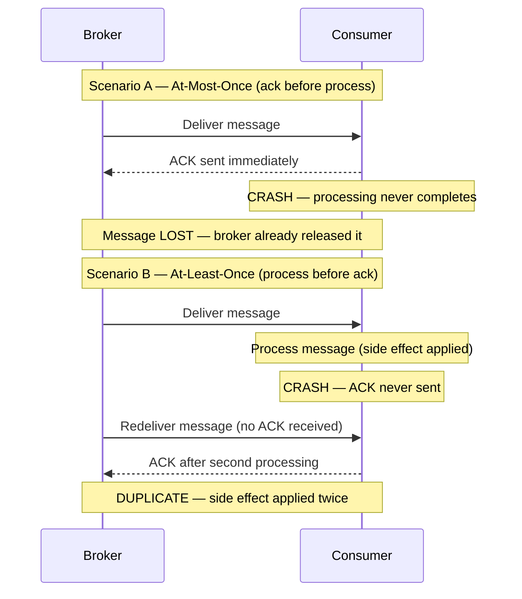
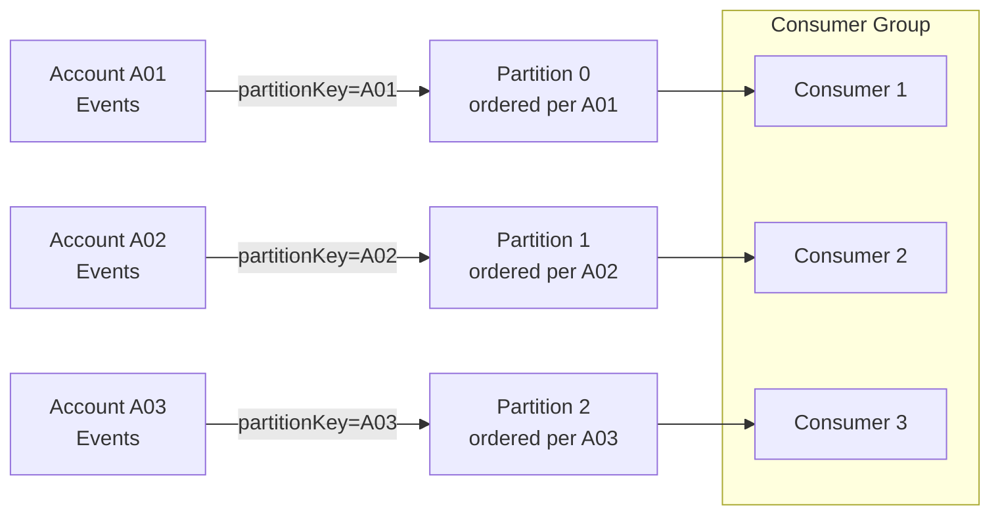
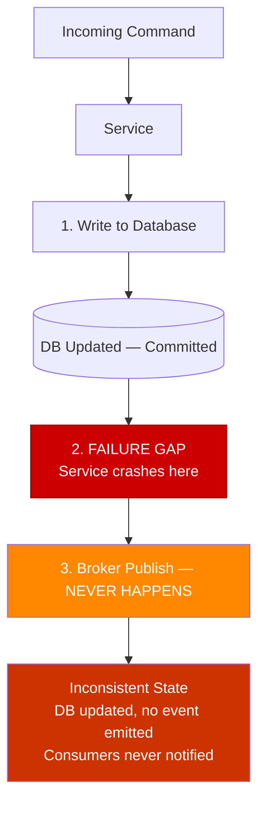

# Capítulo 4: Garantías de Entrega e Idempotencia

## Planteamiento del Problema Inicial

El Capítulo 3 terminó con una promesa y una advertencia. El log distribuido permite reproducir la historia — reprocesar millones de eventos pasados para reconstruir un modelo de lectura o corregir un error. Pero la reproducción solo funciona si reprocesar el mismo evento dos veces produce el mismo resultado que procesarlo una sola vez. Esa propiedad se llama **idempotencia (idempotency)**, y sin ella, la reproducción corrompe los datos en lugar de repararlos.

Esto no es un caso extremo. Bajo la garantía de entrega más común en sistemas productivos, **todo consumidor eventualmente recibirá un duplicado**. Un timeout de red, un reintento del broker, un consumidor que falla después de procesar pero antes de confirmar la recepción — cualquiera de estos produce un mensaje que el consumidor ya ha visto. Si tu handler cobra una tarjeta de crédito, envía un correo electrónico o decrementa el inventario, un duplicado es una pérdida financiera o reputacional real.

Los ingenieros senior frecuentemente buscan una salida reconfortante: "entrega exactamente una vez" (exactly-once delivery). Asumen que una característica del broker o un flag de un servicio en la nube hace desaparecer el problema. No es así. Este capítulo desmitifica las tres semánticas de entrega, explica con precisión por qué exactly-once es el término más malentendido en sistemas distribuidos, y te ofrece los patrones concretos — claves de deduplicación, el Transactional Outbox, las dead-letter queues — que hacen alcanzable la corrección. El objetivo es que los duplicados dejen de ser una amenaza y se conviertan en algo sin importancia.

## Semánticas At-Most-Once, At-Least-Once y Exactly-Once

Una **garantía de entrega** describe lo que el sistema de mensajería promete sobre cuántas veces un consumidor observa cada mensaje. Hay tres niveles, y la diferencia entre ellos se reduce a *cuándo* el consumidor confirma la recepción.

Un **acknowledgment** (ack) es la señal que un consumidor envía de vuelta al broker para decir "terminé con este mensaje; puedes dejar de rastrearlo." El orden de *procesar* y *ack* determina la garantía.

- **At-most-once**: ack primero, luego procesar. Si el consumidor falla después del ack pero antes de terminar, el mensaje se pierde. Cero o una entrega. Rápido, con pérdidas, aceptable solo para datos desechables como muestras de métricas o telemetría no crítica.
- **At-least-once**: procesar primero, luego ack. Si el consumidor falla después de procesar pero antes del ack, el broker reentrega. Una o más entregas. Nunca pierde un mensaje, pero garantiza duplicados. Este es el comportamiento predeterminado en Kafka, SQS y RabbitMQ.
- **Exactly-once**: el santo grial — una entrega, sin pérdidas, sin duplicados.

**Figura 4.1 — At-Most-Once vs At-Least-Once: escenarios de fallo**



La tabla a continuación es el modelo mental a retener.

**Listado 4.1 — Tabla de referencia de semánticas de entrega como dataclasses tipadas**

```python
# Delivery-semantics reference table as typed dataclasses
from dataclasses import dataclass
from typing import Literal

@dataclass(frozen=True)
class DeliverySemantics:
    name: str
    ack_ordering: str            # when the ack is sent relative to processing
    on_crash: str                # what happens if the consumer crashes mid-flight
    duplicates_possible: bool
    message_loss_possible: bool
    typical_use_case: str

DELIVERY_SEMANTICS: list[DeliverySemantics] = [
    DeliverySemantics(
        name="at-most-once",
        ack_ordering="ack BEFORE process",
        on_crash="message is lost — broker already removed it",
        duplicates_possible=False,
        message_loss_possible=True,
        typical_use_case="metrics samples, non-critical telemetry",
    ),
    DeliverySemantics(
        name="at-least-once",
        ack_ordering="ack AFTER process",
        on_crash="broker redelivers — consumer sees it again",
        duplicates_possible=True,
        message_loss_possible=False,
        typical_use_case="default in Kafka, SQS, RabbitMQ; requires idempotent consumers",
    ),
    DeliverySemantics(
        name="exactly-once (processing)",
        ack_ordering="atomic commit covering both effect and ack",
        on_crash="transaction rolls back; redelivered message is a no-op",
        duplicates_possible=False,   # at the effect level, not at the wire level
        message_loss_possible=False,
        typical_use_case="Kafka Streams read-process-write within Kafka topology only",
    ),
]

# Quick display helper — useful in notebooks or during architecture reviews
if __name__ == "__main__":
    header = f"{'Semantic':<22} {'Ack order':<22} {'Dups?':<7} {'Loss?':<7} {'Use case'}"
    print(header)
    print("-" * len(header))
    for s in DELIVERY_SEMANTICS:
        print(
            f"{s.name:<22} {s.ack_ordering:<22} "
            f"{'yes' if s.duplicates_possible else 'no':<7} "
            f"{'yes' if s.message_loss_possible else 'no':<7} "
            f"{s.typical_use_case}"
        )
```

Ahora el malentendido. **La entrega verdaderamente exactly-once sobre una red es imposible.** Esto se deriva del Problema de los Dos Generales: dos partes que se comunican a través de un canal no confiable nunca pueden tener la certeza de que la otra recibió el mensaje final. Un emisor que no recibe ack no puede distinguir "mensaje perdido" de "ack perdido", por lo que debe reenviar (arriesgando un duplicado) o rendirse (arriesgando pérdida). Ningún protocolo escapa a esto.

Lo que los proveedores venden como "exactly-once" es en realidad **exactly-once *processing*** (procesamiento exactamente una vez), no entrega. El mensaje puede ser *entregado* muchas veces, pero el sistema produce el *efecto* solo una vez. Las semánticas exactly-once de Kafka funcionan así: combinan entrega at-least-once con productores idempotentes y escrituras transaccionales que están delimitadas **dentro de Kafka** — un ciclo de leer-procesar-escribir cuya salida es otro topic de Kafka. En el momento en que tu efecto secundario (side effect) sale de esa frontera — una base de datos, una pasarela de pago, un correo electrónico — la transacción de Kafka no puede cubrirlo. Vuelves a at-least-once, y la corrección se convierte en *tu* responsabilidad.

La conclusión con opinión: **diseña cada consumidor para at-least-once.** Trata exactly-once como un término de marketing para una optimización interna del broker, estrecha y limitada. Si tu arquitectura depende de que los mensajes nunca se dupliquen, ya está rota.

> ⚠️ **Nota Crítica:** El texto afirma que at-least-once es "el comportamiento predeterminado en Kafka, SQS y RabbitMQ." Para Kafka esto es inexacto. El comportamiento predeterminado real de Kafka es `enable.auto.commit=true` con un intervalo de auto-commit de 5 segundos. Bajo esta configuración, si el temporizador de auto-commit periódico se dispara mientras se procesa un lote y el consumidor falla posteriormente, esos mensajes en vuelo no serán reentregados — eso es comportamiento at-most-once, no at-least-once. Lograr verdadero at-least-once en Kafka requiere configuración explícita: `enable.auto.commit=false` con un commit manual emitido solo después de que el procesamiento de cada lote haya completado. Un ingeniero senior que lea este capítulo podría concluir que Kafka lo protege contra la pérdida de mensajes por defecto y omitir la configuración de commit necesaria en sistemas productivos. Califica la afirmación sobre Kafka: "At-least-once es el comportamiento efectivo predeterminado en SQS y RabbitMQ, y es alcanzable en Kafka cuando se configura el commit manual (`enable.auto.commit=false`). El auto-commit predeterminado de Kafka puede producir comportamiento at-most-once bajo escenarios de fallo y no debe confiarse en él para entrega sin pérdidas sin configuración explícita."

> 💡 **Nota del Experto:** El texto enmarca correctamente las semánticas exactly-once (EOS) de Kafka como internas al broker, pero subestima dos restricciones críticas para producción que los arquitectos descubren rutinariamente demasiado tarde. Primero, habilitar EOS requiere `enable.idempotence=true` más productores transaccionales (`transactional.id`) y conlleva un costo de throughput medible — los benchmarks de Confluent muestran consistentemente una reducción del 5–15% en el throughput de escritura bajo carga alta, porque cada lote requiere un protocolo de dos fases con el coordinador de transacciones del broker. Segundo, Kafka EOS queda invalidado en el momento en que se introduce un efecto secundario externo — pero la invalidación es silenciosa. No hay excepción, no hay advertencia, y no hay rollback de transacción del sistema externo. Los equipos que habilitan EOS en sus clientes Kafka y luego llaman a un endpoint HTTP dentro del mismo handler creen estar protegidos; no lo están. El modelo mental correcto es: EOS = Kafka-offset-commit atómico + escritura atómica en topic de Kafka, nada más.

## Idempotencia del Consumidor y Claves de Deduplicación

Una operación es **idempotente** cuando aplicarla múltiples veces produce el mismo resultado que aplicarla una sola vez. Establecer un valor (`status = SHIPPED`) es naturalmente idempotente. Incrementar un valor (`balance = balance - 10`) no lo es — ejecútalo dos veces y habrás cobrado el doble.

Como los duplicados están garantizados, el consumidor debe detectarlos y descartarlos. La herramienta es una **clave de deduplicación (deduplication key)**: un identificador estable y único transportado por el evento que permite al consumidor reconocer un mensaje que ya ha manejado. El productor debe generar esta clave una vez y adjuntarla al evento; nunca la derives del tiempo de llegada ni de un valor aleatorio en el consumidor.

Dos patrones dominan.

**1. La verificación de idempotencia (dedup store).** Antes de procesar, el consumidor verifica si la clave ya existe en un almacén de IDs procesados. Si está presente, hace ack y omite. Si está ausente, procesa y registra la clave. Esto funciona para efectos secundarios que no pueden hacerse naturalmente idempotentes, como llamar a una API de pagos externa.

**Listado 4.2 — Consumidor idempotente: dedup store + efecto secundario en una única transacción atómica**

```python
# Idempotent consumer: dedup store + side effect in a single atomic transaction
import sqlite3
import uuid
from dataclasses import dataclass


@dataclass
class Message:
    event_id: str       # stable, producer-assigned deduplication key
    payload: dict


class DuplicateEventError(Exception):
    """Raised when the event has already been processed."""


def process_payment(conn: sqlite3.Connection, payload: dict) -> None:
    """Business side effect: record payment. Runs INSIDE the same transaction."""
    conn.execute(
        "INSERT INTO payments (payment_id, amount) VALUES (?, ?)",
        (payload["payment_id"], payload["amount"]),
    )


def handle_message(conn: sqlite3.Connection, message: Message) -> None:
    """
    Idempotent message handler.

    CRITICAL RACE WINDOW:
    If we record the dedup key BEFORE the side effect and crash, the
    redelivery is silently skipped — silent loss.
    If we record the key AFTER the side effect and crash in between,
    redelivery re-executes the side effect — duplicate.
    Solution: both writes share a SINGLE local transaction so they
    commit or roll back together.
    """
    try:
        # BEGIN TRANSACTION (implicit on first DML in sqlite3 connection)
        conn.execute(
            # UNIQUE constraint on event_id enforces exactly-once semantics
            "INSERT INTO processed_events (event_id) VALUES (?)",
            (message.event_id,),
        )
    except sqlite3.IntegrityError:
        # Unique-constraint violation → already processed; safe to ack and skip
        print(f"[SKIP] Duplicate event {message.event_id}")
        return

    # Side effect and dedup record commit atomically — the race window is closed
    process_payment(conn, message.payload)
    conn.commit()
    print(f"[OK]   Processed event {message.event_id}")


# --- Bootstrap schema (run once at startup) ---
def bootstrap(conn: sqlite3.Connection) -> None:
    conn.executescript("""
        CREATE TABLE IF NOT EXISTS processed_events (
            event_id TEXT PRIMARY KEY
        );
        CREATE TABLE IF NOT EXISTS payments (
            payment_id TEXT PRIMARY KEY,
            amount     REAL NOT NULL
        );
    """)


if __name__ == "__main__":
    conn = sqlite3.connect(":memory:")
    bootstrap(conn)

    msg = Message(
        event_id=str(uuid.uuid4()),
        payload={"payment_id": "pay-001", "amount": 49.99},
    )

    handle_message(conn, msg)   # → [OK]   Processed ...
    handle_message(conn, msg)   # → [SKIP] Duplicate ... (redelivery simulation)
```

Hay una condición de carrera sutil. Si el consumidor registra la clave *antes* del efecto secundario y luego falla, el mensaje reentregado será omitido y el efecto secundario nunca ocurrirá — pérdida silenciosa. Si registra la clave *después* del efecto secundario y falla en el medio, la reentrega reprocesa — un duplicado. La solución limpia es hacer que el registro de dedup y la escritura de negocio sean **atómicos**, confirmados en la misma transacción local de base de datos. Volvemos a esta idea con el Outbox.

**2. Idempotencia natural mediante upsert.** Cuando el efecto secundario es una escritura de base de datos que controlas, modélalo de manera que reaplicarlo sea inofensivo. Un **upsert** con clave en el identificador del evento — insertar si es nuevo, sobrescribir si ya existe — hace que el reprocesamiento sea seguro por construcción. Por eso la transferencia de estado transportada por eventos (event-carried state transfer, Capítulo 1) se combina tan bien con consumidores idempotentes: el evento contiene el nuevo estado completo, y el consumidor simplemente lo escribe.

Consejo profesional: prefiere la idempotencia natural sobre un dedup store siempre que el dominio lo permita. Un dedup store agrega una búsqueda, una escritura y una política de retención — eventualmente debes expirar las claves antiguas o la tabla crece sin límite. Un upsert no tiene ninguna de esa carga operacional.

> 💡 **Nota del Experto:** El texto advierte correctamente que la retención de claves de dedup no puede crecer sin límite, pero no proporciona la fórmula para la ventana de retención mínima segura — que es donde los equipos introducen silenciosamente pérdida de datos. La retención mínima debe ser: `max_redelivery_window = message_visibility_timeout x max_receive_count`. Para SQS con un visibility timeout de 12 horas y un max receive count de 10, eso es un mínimo de 120 horas. En Kafka, el equivalente es el `retention.ms` del retry topic multiplicado por el lag máximo de reinicio del consumidor. Los equipos comúnmente establecen un TTL plano de 24 horas por intuición. Si un evento de lag del broker de Kafka retiene un mensaje en un retry topic durante 36 horas antes de ser reentregado, la entrada del dedup store ya ha expirado y el handler lo reprocesa como nuevo — un duplicado silencioso e intermitente sin stack trace.

<details>
<summary>💡 Nota del Experto</summary>
El dedup store es una dependencia con estado y debe diseñarse al mismo nivel de disponibilidad y consistencia que la base de datos de negocio principal. En la práctica, los equipos suelen usar una instancia compartida de Redis porque es rápida, y luego la despliegan sin persistencia (`appendonly no`) o con un único nodo. Cuando Redis no está disponible — un reinicio progresivo durante el parcheo, un failover de sentinel — el consumidor vuelve a procesar cada mensaje como si fuera nuevo. El dedup store deja de proteger silenciosamente. La postura mínima para producción es Redis con persistencia AOF habilitada y una configuración de Sentinel o Cluster replicado. Si la verificación de dedup y la escritura de negocio están unificadas en la misma transacción relacional (como recomienda el texto), esta preocupación desaparece — lo cual es el argumento más sólido para el enfoque de transacción unificada sobre una caché separada.
</details>

<details>
<summary>⚠️ Nota Crítica</summary>
El texto introduce el dedup store como el patrón para "efectos secundarios que no pueden hacerse naturalmente idempotentes, como llamar a una API de pagos externa," y luego propone solucionar la condición de carrera haciendo "el registro de dedup y la escritura de negocio atómicos, confirmados en la misma transacción local de base de datos." Estas dos afirmaciones están en contradicción directa. Una transacción local de base de datos solo cubre escrituras locales en base de datos. Una llamada a una API de pagos externa — el ejemplo motivador declarado — no puede participar en esa transacción. Si el consumidor escribe la clave de dedup en la BD local, confirma, y luego falla antes de llamar a la API de pagos, la verificación de dedup impedirá que la llamada se reintente jamás. Si llama primero a la API de pagos y luego falla antes de escribir la clave de dedup, la llamada se duplica. La corrección mediante transacción atómica es válida solo cuando el efecto secundario es en sí mismo una escritura local en base de datos; no resuelve el problema para llamadas a servicios externos. Divide la discusión: (1) Cuando el efecto secundario es una escritura local en BD, usa una transacción atómica que cubra tanto la escritura de negocio como la clave de dedup. (2) Cuando el efecto secundario es una llamada externa, reconoce que ninguna transacción local puede ayudar — las únicas estrategias sólidas son hacer que la API externa sea en sí misma idempotente (pasando el event ID como clave de idempotencia, una capacidad que ofrecen Stripe, Braintree y otros), o aceptar el duplicado infrecuente y construir lógica de compensación aguas abajo.
</details>

## Ordenamiento de Mensajes y Particionamiento

La idempotencia maneja los *duplicados*. No maneja la llegada *desordenada*, y los dos se confunden fácilmente. Recuerda del Capítulo 3 que un log distribuido garantiza el orden **solo dentro de una partición**, seleccionada por la **clave de partición (partition key)**. Entre particiones, no hay ninguna garantía.

Esto importa porque muchas operaciones de negocio son sensibles al orden. Considera tres eventos para una cuenta: `AccountOpened`, `Deposited`, `Withdrawn`. Procesa el retiro antes del depósito y podrías rechazar una transacción válida. La solución es enrutar todos los eventos de una entidad dada a la misma partición usando una clave de partición estable — aquí, el ID de cuenta. Misma clave, misma partición, orden garantizado.

**Figura 4.2 — Particionamiento por accountId: orden por cuenta con consumer group en paralelo**



Pero el ordenamiento tiene un costo, y es la tensión que todo arquitecto debe sopesar:

- Una clave de partición **estrecha** (pocos valores distintos) preserva el orden entre grupos grandes de eventos, pero concentra la carga en pocas particiones, limitando el paralelismo.
- Una clave de partición **amplia** (muchos valores distintos, como un ID por entidad) distribuye la carga y maximiza el throughput, pero solo garantiza el orden dentro de cada pequeño grupo.

No existe ordenamiento *entre* claves. Elige la clave en la granularidad donde el orden realmente importa al negocio — generalmente el agregado (la cuenta, el pedido, el envío), no el sistema completo.

Un complemento defensivo es la **idempotencia consciente de versiones (version-aware idempotency)**. Estampa cada evento con una versión de incremento monotónico por entidad. El consumidor almacena la última versión que aplicó y rechaza cualquier evento cuya versión sea menor o igual a lo que ya ha visto. Esto hace que el consumidor sea robusto tanto a duplicados *como* a reentregas desordenadas y obsoletas en un solo mecanismo.

**Listado 4.3 — Consumidor consciente de versiones: rechaza duplicados y reentregas desordenadas obsoletas**

```python
# Version-aware consumer: rejects duplicates AND stale out-of-order redeliveries
# Time complexity: O(1) per message (single indexed lookup by entity_id)
import sqlite3
from dataclasses import dataclass


@dataclass
class VersionedEvent:
    event_id: str
    entity_id: str   # e.g. account_id — determines partition key
    version: int     # monotonically increasing per entity; producer assigns this
    payload: dict


class StaleEventError(Exception):
    """Raised when the incoming version is not strictly greater than stored."""


def apply_event(conn: sqlite3.Connection, event: VersionedEvent) -> None:
    """Business state update — called only when the version advances."""
    conn.execute(
        """
        INSERT INTO account_state (entity_id, balance, last_version)
        VALUES (:entity_id, :balance, :version)
        ON CONFLICT (entity_id) DO UPDATE
          SET balance      = :balance,
              last_version = :version
        """,
        {
            "entity_id": event.entity_id,
            "balance": event.payload.get("balance"),
            "version": event.version,
        },
    )


def handle_versioned_event(conn: sqlite3.Connection, event: VersionedEvent) -> None:
    """
    Version gate: apply the event only if its version strictly exceeds
    the last stored version for this entity.
    Handles duplicates (same version re-delivered) and
    stale redeliveries (older version arriving after a newer one).
    """
    row = conn.execute(
        "SELECT last_version FROM account_state WHERE entity_id = ?",
        (event.entity_id,),
    ).fetchone()

    stored_version: int = row[0] if row else -1  # -1 → entity never seen before

    if event.version <= stored_version:
        # Duplicate or stale out-of-order redelivery — safe to discard
        print(
            f"[DISCARD] entity={event.entity_id} "
            f"incoming_v={event.version} stored_v={stored_version}"
        )
        return

    apply_event(conn, event)
    conn.commit()
    print(
        f"[APPLIED] entity={event.entity_id} "
        f"v{stored_version} -> v{event.version}"
    )


# --- Bootstrap ---
def bootstrap(conn: sqlite3.Connection) -> None:
    conn.execute("""
        CREATE TABLE IF NOT EXISTS account_state (
            entity_id    TEXT PRIMARY KEY,
            balance      REAL NOT NULL DEFAULT 0,
            last_version INTEGER NOT NULL DEFAULT -1
        )
    """)


if __name__ == "__main__":
    conn = sqlite3.connect(":memory:")
    bootstrap(conn)

    events = [
        VersionedEvent("e1", "acct-42", version=1, payload={"balance": 100.0}),
        VersionedEvent("e2", "acct-42", version=2, payload={"balance": 90.0}),
        VersionedEvent("e2", "acct-42", version=2, payload={"balance": 90.0}),  # duplicate
        VersionedEvent("e1", "acct-42", version=1, payload={"balance": 100.0}), # stale
        VersionedEvent("e3", "acct-42", version=3, payload={"balance": 150.0}),
    ]

    for ev in events:
        handle_versioned_event(conn, ev)
```

Orientación con opinión: no intentes imponer un ordenamiento global en todo tu flujo de eventos. Destruye la escalabilidad que te llevó a elegir un log en primer lugar. Orden por agregado; tolera el desorden en todo lo demás.

<details>
<summary>💡 Nota del Experto</summary>
La idempotencia consciente de versiones usando un número de versión de incremento monotónico por entidad es sólida cuando un único productor controla el ciclo de vida de la entidad. Se rompe en patrones comunes de múltiples productores — por ejemplo, cuando múltiples servicios pueden emitir independientemente eventos para el mismo agregado (un pedido actualizado tanto por el servicio de fulfillment como por el servicio de pagos). Coordinar un contador de secuencia global entre productores crea acoplamiento y un problema de coordinación distribuida. La solución estándar de la industria es empujar la aplicación de versiones a la base de datos mediante bloqueo optimista (optimistic locking): el consumidor realiza una actualización condicional `WHERE current_version = N - 1` y trata cero filas afectadas como un evento duplicado o obsoleto, reintentando o descartando según corresponda. Así es como Axon Framework y EventStoreDB implementan la aplicación de secuencias en el límite del agregado sin requerir coordinación entre productores.
</details>

<details>
<summary>💡 Nota del Experto</summary>
El problema del hotspot de partición está subestimado en las discusiones sobre selección de clave de partición, y es agudo en sistemas SaaS multiinquilino. Si la clave de partición es el ID de inquilino y un solo inquilino representa el 40% del volumen de tráfico (un patrón común en contratos empresariales), los eventos de ese inquilino se concentran en una o pocas particiones. El paralelismo del consumer group está limitado por el conteo de particiones, por lo que las particiones calientes crean un cuello de botella de procesamiento que ninguna cantidad de escalado horizontal de consumidores puede resolver sin un aumento en el conteo de particiones — lo cual requiere reconstruir el topic de Kafka o una corriente de reparticionamiento. Diseña la clave de partición en la granularidad donde importa el orden (ID de agregado, no ID de inquilino), y usa un mecanismo de fan-out separado si el aislamiento por inquilino es un requisito.
</details>

<details>
<summary>⚠️ Nota Crítica</summary>
El mecanismo de idempotencia consciente de versiones (aplicar solo si `incoming_version > stored_version`, de lo contrario descartar) crea silenciosamente pérdida permanente de eventos cuando ocurre una brecha de versión. Si un consumidor ha aplicado la versión 3 y la versión 4 nunca se entrega (perdida, expirada, enviada a DLQ), entonces llega la versión 5: la verificación `5 > 3` pasa y se aplica la versión 5, omitiendo permanentemente la transición de estado de la versión 4. El sistema ahora está en un estado inconsistente sin señal de error. El texto presenta el patrón como robustez contra "duplicados y reentregas obsoletas" sin mencionar que implícitamente asume entrega sin brechas — una suposición que contradice la realidad de at-least-once-con-DLQ descrita en otro lugar del mismo capítulo. Agrega una protección contra brechas de versión: "El patrón de verificación de versión requiere una secuencia monotónicamente continua por entidad para ser seguro. Complémentalo con un paso de detección de brechas: si `incoming_version > stored_version + 1`, el consumidor debe aparcar el mensaje (p. ej., una cola de reintento) o emitir una alerta en lugar de aplicarlo silenciosamente. En la práctica, combina verificaciones de versión con asignación de secuencia exactamente una vez en el productor — típicamente usando un contador de bloqueo optimista en la propia fila del agregado."
</details>

## El Patrón Transactional Outbox y el Problema del Dual-Write

Todo lo anterior protege al *consumidor*. Pero el *productor* tiene su propio modo de fallo, y es una de las fuentes más comunes de pérdida silenciosa de datos en sistemas orientados a eventos: el **problema del dual-write (escritura dual)**.

Un servicio generalmente necesita hacer dos cosas al manejar un comando: actualizar su propia base de datos y publicar un evento. Estos son dos sistemas separados — una base de datos y un broker — sin transacción compartida. Cuatro secuencias son posibles, y dos de ellas son corruptas:

1. Escribe en BD, publica evento — ambos tienen éxito. Correcto.
2. Escribe en BD, luego falla antes de publicar — el estado cambió, pero no hay evento. Los consumidores nunca se enteran. **Evento perdido.**
3. Publica evento, luego falla antes de escribir en BD — los consumidores actúan sobre un hecho que nunca se hizo verdad. **Evento fantasma.**
4. Ninguno ocurre. Correcto (nada cambió).

No puedes hacer que dos sistemas independientes confirmen atómicamente sin una transacción distribuida, y las transacciones distribuidas (two-phase commit) son exactamente lo que abandonamos en arquitecturas cloud-native por su costo y fragilidad.

**Figura 4.3 — La brecha de fallo del dual-write: BD confirmada, publicación al broker nunca ocurre**



El patrón **Transactional Outbox** resuelve esto de manera elegante. En lugar de escribir en la base de datos *y* el broker, el servicio escribe solo en la base de datos. En la **misma transacción local** que actualiza las tablas de negocio, también inserta el evento en una **tabla outbox** en esa misma base de datos. Como es una transacción sobre una sola base de datos, es atómica: o bien el cambio de estado y la fila del outbox se confirman juntos, o ninguno lo hace. El problema del dual-write desaparece.

Un proceso separado luego lee las filas no publicadas del outbox y las publica en el broker, marcando cada una como enviada. Este proceso opera **at-least-once** — si falla después de publicar pero antes de marcar una fila, la vuelve a publicar al reiniciarse. Lo cual es exactamente por qué los consumidores deben ser idempotentes. El Outbox no elimina los duplicados; garantiza *ninguna pérdida*, y empuja la deduplicación al consumidor, donde ya construimos defensas para ello.

**Listado 4.4 — Transactional Outbox: un único commit atómico cubre el registro de negocio y la fila del outbox**

```python
# Transactional Outbox: one atomic commit covers business record + outbox row
import json
import sqlite3
import uuid
from dataclasses import dataclass, field
from datetime import datetime, timezone


@dataclass
class Order:
    order_id: str
    customer_id: str
    total_amount: float
    status: str = "PLACED"


@dataclass
class OutboxRow:
    event_id: str = field(default_factory=lambda: str(uuid.uuid4()))
    aggregate_type: str = "Order"
    event_type: str = "OrderPlaced"
    payload: dict = field(default_factory=dict)
    created_at: str = field(
        default_factory=lambda: datetime.now(timezone.utc).isoformat()
    )
    published: bool = False


def place_order(conn: sqlite3.Connection, order: Order) -> OutboxRow:
    """
    ── COMMIT BOUNDARY ──────────────────────────────────────────────────
    Both the orders INSERT and the outbox INSERT execute in the SAME
    local transaction. Either both commit or both roll back — no dual-write
    problem, no phantom events, no lost events.
    ─────────────────────────────────────────────────────────────────────
    """
    outbox_row = OutboxRow(
        aggregate_type="Order",
        event_type="OrderPlaced",
        payload={
            "order_id": order.order_id,
            "customer_id": order.customer_id,
            "total_amount": order.total_amount,
            "status": order.status,
        },
    )

    # ── BEGIN implicit transaction ──
    conn.execute(
        "INSERT INTO orders (order_id, customer_id, total_amount, status) "
        "VALUES (?, ?, ?, ?)",
        (order.order_id, order.customer_id, order.total_amount, order.status),
    )
    conn.execute(
        "INSERT INTO outbox (event_id, aggregate_type, event_type, payload, created_at, published) "
        "VALUES (?, ?, ?, ?, ?, ?)",
        (
            outbox_row.event_id,
            outbox_row.aggregate_type,
            outbox_row.event_type,
            json.dumps(outbox_row.payload),   # serialized event carried to broker
            outbox_row.created_at,
            False,
        ),
    )
    conn.commit()  # ── COMMIT: both rows land together or neither does ──

    print(f"[COMMITTED] order={order.order_id}  outbox_event={outbox_row.event_id}")
    return outbox_row


def relay_unpublished(conn: sqlite3.Connection) -> None:
    """
    Outbox relay (runs in a separate process/thread).
    Operates at-least-once: if it crashes after publish but before marking
    the row as published, it will republish on next run — consumers must be
    idempotent (event_id is the deduplication key).
    """
    rows = conn.execute(
        "SELECT event_id, event_type, payload FROM outbox WHERE published = 0"
    ).fetchall()

    for event_id, event_type, payload in rows:
        # Simulate broker publish (replace with real broker SDK call)
        print(f"[RELAY -> BROKER] event_id={event_id} type={event_type}")
        conn.execute(
            "UPDATE outbox SET published = 1 WHERE event_id = ?", (event_id,)
        )
        conn.commit()


# --- Bootstrap ---
def bootstrap(conn: sqlite3.Connection) -> None:
    conn.executescript("""
        CREATE TABLE IF NOT EXISTS orders (
            order_id     TEXT PRIMARY KEY,
            customer_id  TEXT NOT NULL,
            total_amount REAL NOT NULL,
            status       TEXT NOT NULL
        );
        CREATE TABLE IF NOT EXISTS outbox (
            event_id       TEXT PRIMARY KEY,
            aggregate_type TEXT NOT NULL,
            event_type     TEXT NOT NULL,
            payload        TEXT NOT NULL,   -- JSON
            created_at     TEXT NOT NULL,
            published      INTEGER NOT NULL DEFAULT 0
        );
    """)


if __name__ == "__main__":
    conn = sqlite3.connect(":memory:")
    bootstrap(conn)

    order = Order(
        order_id=str(uuid.uuid4()),
        customer_id="cust-7",
        total_amount=129.90,
    )
    place_order(conn, order)
    relay_unpublished(conn)
```

Dos mecanismos impulsan el relay del outbox. El **polling** consulta la tabla en un intervalo — simple, portable, pero agrega latencia y carga a la base de datos. **Change Data Capture (CDC)** sigue el log de transacciones de la base de datos (mediante herramientas como Debezium) y transmite nuevas filas del outbox al broker en tiempo casi real, sin sobrecarga de polling. CDC es la opción más escalable para sistemas de alto volumen; el polling es perfectamente adecuado para la mayoría.

Consejo profesional: el event ID escrito en la fila del outbox es la misma clave de deduplicación que usa el consumidor. Diseña los dos juntos. El Outbox del productor y la verificación de dedup del consumidor son dos mitades de un contrato de corrección de extremo a extremo.

> 💡 **Nota del Experto:** CDC mediante Debezium es la elección correcta para alto throughput, pero requiere permisos a nivel de base de datos que los DBAs corporativos frecuentemente restringen y que las ofertas PaaS (Amazon RDS, Azure Database for PostgreSQL Flexible Server) exponen solo bajo configuraciones específicas. Específicamente: el acceso al binlog de MySQL requiere los grants `REPLICATION SLAVE` y `REPLICATION CLIENT`, y `binlog_format=ROW` debe configurarse a nivel del servidor. La replicación lógica de PostgreSQL requiere el rol `REPLICATION` y un replication slot, y RDS impone un límite estricto de 20 replication slots que cuenta contra todos los consumidores. Los equipos descubren rutinariamente esta restricción durante UAT o el corte a producción, no durante el diseño. El fallback al polling siempre está disponible, pero la decisión arquitectónica debe tomarse con pleno conocimiento de los requisitos de permisos en el entorno objetivo — no diferirla al día del despliegue.

<details>
<summary>⚠️ Nota Crítica</summary>
El Transactional Outbox se presenta como solución al problema del dual-write, pero introduce una nueva dependencia operacionalmente significativa que no se reconoce: el proceso relay del outbox. Ya sea implementado como un bucle de polling o un conector CDC de Debezium, este relay es un proceso separado que puede fallar, retrasarse o no estar disponible. Mientras la tabla outbox acumula filas, los consumidores aguas abajo no reciben eventos — un escenario que es funcionalmente equivalente al problema de "evento perdido" que el patrón pretendía resolver, excepto que ahora es una interrupción del proceso relay en lugar de un fallo del servicio lo que causa el retraso. Para CDC específicamente, los conectores Debezium son sensibles a cambios en el esquema de la base de datos (un `ALTER TABLE` en una tabla capturada puede detener el conector) y requieren su propio despliegue de alta disponibilidad. El texto describe CDC como "la opción más escalable" sin revelar ninguna de esta carga operacional. Agrega un párrafo sobre la fiabilidad del relay: "El relay del outbox es un componente requerido de la corrección del patrón. Trátalo con la misma disciplina operacional que el servicio mismo: despliégalo con redundancia, monitorea su lag (la antigüedad de la fila del outbox no publicada más antigua) y genera alertas cuando ese lag supere tu SLA. Para CDC con Debezium, planifica procedimientos de cambio de esquema que pasen y reanuden el conector de forma segura, y almacena los offsets del conector en un almacén duradero en lugar de en memoria."
</details>

<details>
<summary>⚠️ Nota Crítica</summary>
El patrón Outbox tal como se describe no preserva el ordenamiento entre transacciones concurrentes de múltiples instancias de la aplicación. Considera dos solicitudes concurrentes A y B: A comienza su transacción primero (inserta fila del outbox con `id=100`), B comienza ligeramente después (inserta fila del outbox con `id=101`), pero B confirma primero. El relay recoge la fila 101 y publica el evento de B. Luego A confirma y la fila 100 se publica después. Los consumidores que dependen de la entrega en orden de inserción ahora observan el evento de B antes que el de A — violando la garantía de ordenamiento que el capítulo dedicó la sección anterior a construir. Esta brecha existe tanto para relays basados en polling como para relays basados en CDC (CDC lee transacciones confirmadas, no el orden de inicio). El texto guarda silencio sobre este modo de fallo. Señala la limitación explícitamente: "El Outbox garantiza entrega sin pérdidas, no ordenamiento global estricto entre solicitudes concurrentes. Para casos de uso que requieran ordenamiento estricto, impón acceso de escritura única por agregado (p. ej., serializa comandos a través de una cola o un advisory lock de base de datos por ID de entidad), o acepta que el Outbox proporciona ordenamiento por entidad solo cuando las escrituras a la misma entidad se serializan aguas arriba."
</details>

## Dead-Letter Queues y Políticas de Reintento

La idempotencia y el Outbox asumen que los mensajes eventualmente tienen éxito. Algunos nunca lo harán. Un payload malformado, una incompatibilidad permanente de esquema o una regla de negocio que siempre rechaza el mensaje crea un **mensaje envenenado (poison message)** — uno que falla sin importar cuántas veces se reintente. Bajo at-least-once, un broker ingenuo lo reentrega para siempre, bloqueando la partición o privando de recursos al consumidor. Esto es una interrupción autoinfligida.

La herramienta de contención es una **dead-letter queue (DLQ)**: una cola separada a donde se mueven los mensajes después de agotar su presupuesto de reintentos. La DLQ aísla el mensaje envenenado para que el flujo saludable siga fluyendo, y preserva el mensaje fallido para inspección y reprocesamiento manual en lugar de descartarlo.

Una **política de reintento** sólida distingue dos clases de fallos:

- **Fallos transitorios** — un timeout, una dependencia con throttling, un breve problema de red. Estos merecen reintentos, idealmente con **exponential backoff** (retrasos crecientes: 1s, 2s, 4s, 8s) y **jitter** (aleatorización) para evitar una horda atronadora de reintentos sincronizados que golpeen a un servicio en recuperación.
- **Fallos permanentes** — un error de validación, un mensaje no parseable. Reintentar no tiene sentido; enrútalos a la DLQ inmediatamente. Desperdiciar un presupuesto de reintentos en un mensaje que nunca puede tener éxito solo retrasa lo inevitable.

**Listado 4.5 — Política de reintento: exponential backoff con jitter para errores transitorios; DLQ inmediata para permanentes**

```python
# Retry policy: exponential backoff with jitter for transient errors; immediate DLQ for permanent
import random
import time
import logging
from dataclasses import dataclass
from typing import Callable

logger = logging.getLogger(__name__)


# ── Failure taxonomy ──────────────────────────────────────────────────────────

class TransientError(Exception):
    """Temporary failure — worth retrying (timeout, throttle, network blip)."""


class PermanentError(Exception):
    """Unrecoverable failure — retrying is pointless (bad schema, invalid payload)."""


# ── Retry policy configuration ────────────────────────────────────────────────

@dataclass
class RetryPolicy:
    max_attempts: int = 5          # total delivery attempts before dead-lettering
    base_delay_seconds: float = 1.0
    max_delay_seconds: float = 30.0
    jitter_factor: float = 0.3     # ±30 % randomization to spread retry waves


def _backoff_delay(attempt: int, policy: RetryPolicy) -> float:
    """Exponential backoff: base * 2^attempt, capped, then jittered."""
    delay = min(
        policy.base_delay_seconds * (2 ** attempt),
        policy.max_delay_seconds,
    )
    # Jitter: multiply by a random factor in [1 - jitter, 1 + jitter]
    jitter = 1.0 + policy.jitter_factor * (2 * random.random() - 1)
    return delay * jitter


def send_to_dlq(message: dict, reason: str) -> None:
    """Dead-letter the message — triggers an alert in production monitoring."""
    logger.error(
        "DLQ: message dead-lettered",
        extra={"event_id": message.get("event_id"), "reason": reason},
    )
    # Replace with real DLQ publish (SQS redrive, Kafka DLQ topic, etc.)


def process_with_retry(
    message: dict,
    handler: Callable[[dict], None],
    policy: RetryPolicy | None = None,
) -> None:
    """
    Drive a message handler through the retry policy.

    - PermanentError  → dead-letter immediately, no retries wasted
    - TransientError  → retry up to max_attempts with exponential backoff + jitter
    - Exceeded budget → dead-letter with the last exception as reason
    """
    if policy is None:
        policy = RetryPolicy()

    for attempt in range(policy.max_attempts):
        try:
            handler(message)
            return  # success — done
        except PermanentError as exc:
            # Retrying a permanent error is pointless; route to DLQ immediately
            send_to_dlq(message, reason=f"PermanentError: {exc}")
            return
        except TransientError as exc:
            if attempt + 1 == policy.max_attempts:
                # Retry budget exhausted — dead-letter
                send_to_dlq(message, reason=f"TransientError after {policy.max_attempts} attempts: {exc}")
                return
            delay = _backoff_delay(attempt, policy)
            logger.warning(
                "Transient failure, retrying",
                extra={"attempt": attempt + 1, "delay_s": round(delay, 2), "error": str(exc)},
            )
            time.sleep(delay)


# ── Example usage ─────────────────────────────────────────────────────────────

if __name__ == "__main__":
    logging.basicConfig(level=logging.INFO)

    call_count = 0

    def flaky_handler(msg: dict) -> None:
        """Simulates two transient failures then success."""
        global call_count
        call_count += 1
        if call_count < 3:
            raise TransientError("downstream timeout")
        print(f"[PROCESSED] event_id={msg['event_id']}")

    def bad_handler(msg: dict) -> None:
        raise PermanentError("schema validation failed: missing required field 'amount'")

    policy = RetryPolicy(max_attempts=5, base_delay_seconds=0.05)  # fast for demo

    process_with_retry({"event_id": "ev-001"}, flaky_handler, policy)
    process_with_retry({"event_id": "ev-002"}, bad_handler, policy)
```

Establece un **conteo máximo de recepciones (maximum receive count)** — el número de intentos de entrega antes de que el mensaje sea enviado a la dead-letter. En SQS esto es una política de redrive nativa; en Kafka típicamente se implementa con retry topics y un DLQ topic final. Elige el conteo deliberadamente: demasiado bajo y los problemas transitorios envían mensajes a la DLQ; demasiado alto y un mensaje envenenado da vueltas durante minutos antes de la cuarentena.

Críticamente, la DLQ no es un cubo de basura. Un mensaje que aterriza ahí es una **señal operacional** que demanda una alerta. El Capítulo 9 trata el monitoreo de DLQ y el reprocesamiento seguro en profundidad; por ahora, la regla es simple: **una DLQ no vigilada es un buffer de pérdida silenciosa de datos.** Cada mensaje que entra en ella representa un hecho de negocio que tu sistema falló en honrar.

> ⚠️ **Nota Crítica:** El texto advierte que un mensaje envenenado "da vueltas durante minutos antes de la cuarentena," pero en Kafka esto es una subestimación grave de la consecuencia. Kafka garantiza el orden dentro de una partición; un consumidor no avanza más allá de un offset fallido hasta que ese mensaje sea procesado exitosamente o saltado manualmente. Un mensaje envenenado con un presupuesto de reintentos generoso (p. ej., 10 intentos × exponential backoff alcanzando 512s) puede bloquear cada mensaje posterior en toda una partición durante horas, haciendo que el lag del consumer group crezca sin límite para esa partición. A diferencia de SQS o RabbitMQ, no hay un mecanismo nativo para aparcar un único mensaje de Kafka en medio del flujo y continuar consumiendo — el patrón de retry-topic debe diseñarse deliberadamente. El texto describe esto como un inconveniente de tiempo en lugar de una posible interrupción a nivel de toda la partición, lo que podría llevar a los arquitectos a subestimar las salvaguardas necesarias. Agrega una nota específica para Kafka: "En un consumidor Kafka con ordenamiento por partición, un mensaje envenenado es únicamente peligroso — detiene el progreso hacia adelante en toda la partición hasta agotarse. El patrón de retry-topic (una cadena separada de topics retry-1, retry-2, … DLQ) existe precisamente para permitir que la partición principal avance. Si tu sistema usa Kafka con garantías de ordenamiento, implementa retry topics desde el principio, no como una adición posterior."

> 💡 **Nota del Experto:** El texto distingue correctamente los fallos transitorios de los permanentes, pero omite un modo de fallo crítico para producción que se sitúa entre los dos: la reentrega a nivel de infraestructura que ocurre antes de que se active cualquier política de reintento a nivel de aplicación. En SQS, si el `VisibilityTimeout` es más corto que el tiempo de procesamiento de un mensaje, el broker hace el mensaje visible nuevamente mientras el primer consumidor aún lo está procesando — causando entrega dual concurrente a dos instancias de consumidor diferentes. Ninguna instancia ve un error a nivel de aplicación; ambas procesan exitosamente y ambas hacen ack. El resultado es un duplicado que elude el dedup store si ambas lecturas ocurren antes de que cualquiera de las escrituras confirme. La regla segura es: establece `VisibilityTimeout` a al menos 6 veces la latencia de procesamiento P99, y monitorea la métrica de CloudWatch `ApproximateNumberOfMessagesNotVisible` para detectar eventos de entrega concurrente. En Kafka, el fallo análogo es un timeout de sesión que causa un rebalanceo de partición durante el procesamiento, que reentrega desde el último offset confirmado.

## Conclusiones Clave

- **At-least-once es el predeterminado realista.** La entrega verdaderamente exactly-once *delivery* es imposible sobre una red (Problema de los Dos Generales); lo que los proveedores venden es exactly-once *processing*, delimitado dentro del broker y nulo en el momento en que un efecto secundario toca un sistema externo.
- **Los duplicados están garantizados, por lo que los consumidores deben ser idempotentes.** Usa idempotencia natural (upserts con clave en el event ID) donde el dominio lo permita, y un almacén de claves de deduplicación donde los efectos secundarios sean externos.
- **El orden es una garantía delimitada a la partición.** Enruta eventos sensibles al orden para un agregado a una partición mediante una clave de partición estable, y usa números de versión por entidad para rechazar entregas obsoletas o duplicadas.
- **El Transactional Outbox derrota el problema del dual-write** al confirmar el cambio de estado y el evento atómicamente en una base de datos, luego retransmitiendo al broker at-least-once — razón por la cual la idempotencia del consumidor es innegociable.
- **Las dead-letter queues contienen mensajes envenenados.** Reintenta fallos transitorios con exponential backoff y jitter; envía a la dead-letter los fallos permanentes inmediatamente; y genera alertas en cada llegada a la DLQ.

## Qué Sigue

Con la entrega confiable y el procesamiento idempotente establecidos, el Capítulo 5 se centra en la estructura — introduciendo CQRS para separar la ruta de escritura de la ruta de lectura y resolver la discrepancia entre cómo se almacenan los datos y cómo se consultan.

<!-- ASSEMBLY COMPLETE
  Chapter: Delivery Guarantees and Idempotency
  Code blocks resolved: 5 / 5
  Diagrams resolved: 3 / 3
  Expert callouts (inline): 4
  Expert callouts (collapsed): 3
  Critical callouts (inline): 2
  Critical callouts (collapsed): 4
  Unresolved markers: 0
-->
