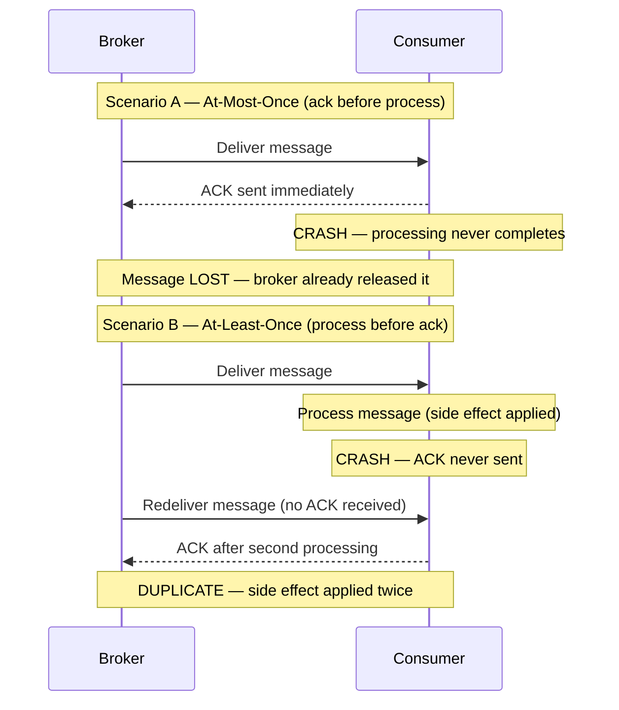
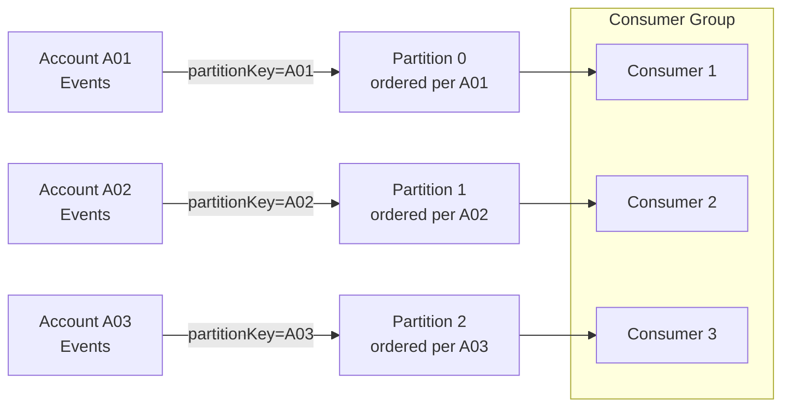
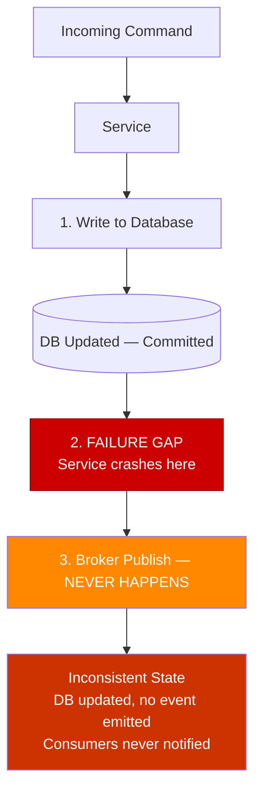

# Capítulo 4: Garantias de Entrega e Idempotência

## Problema Inicial

O Capítulo 3 terminou com uma promessa e um aviso. O log distribuído permite que você reproduza o histórico — reprocesse milhões de eventos passados para reconstruir um modelo de leitura ou corrigir um bug. Mas a reprodução só funciona se reprocessar o mesmo evento duas vezes produzir o mesmo resultado que processá-lo uma única vez. Essa propriedade é chamada de **idempotência** (idempotency), e sem ela a reprodução corrompe os dados em vez de repará-los.

Isso não é um caso extremo. Sob a garantia de entrega mais comum em sistemas de produção, **todo consumidor eventualmente receberá uma mensagem duplicada**. Um timeout de rede, uma nova tentativa do broker, uma falha do consumidor após processar, mas antes de confirmar o recebimento — qualquer um desses eventos produz uma mensagem que o consumidor já recebeu. Se o seu handler cobra um cartão de crédito, envia um e-mail ou decrementa o estoque, uma duplicata representa uma perda financeira ou de reputação real.

Engenheiros seniores frequentemente recorrem a uma saída de emergência reconfortante: "entrega exatamente uma vez" (exactly-once delivery). Eles presumem que um recurso do broker ou uma opção de configuração de um serviço cloud faz o problema desaparecer. Não faz. Este capítulo desmistifica as três semânticas de entrega, explica precisamente por que "exactly-once" é o termo mais mal compreendido em sistemas distribuídos e apresenta os padrões concretos — chaves de deduplicação, o Transactional Outbox, filas de mensagens mortas — que tornam a correção alcançável. O objetivo é que as duplicatas deixem de ser uma ameaça e se tornem um não-evento.

## Semânticas At-Most-Once, At-Least-Once e Exactly-Once

Uma **garantia de entrega** (delivery guarantee) descreve o que o sistema de mensageria promete sobre quantas vezes um consumidor observa cada mensagem. Existem três níveis, e a diferença entre eles se resume a *quando* o consumidor confirma o recebimento.

Um **acknowledgment** (ack) é o sinal que um consumidor envia de volta ao broker para dizer "terminei com essa mensagem; você pode parar de rastreá-la." A ordem de *processar* e *confirmar* determina a garantia.

- **At-most-once** (no máximo uma vez): confirma primeiro, depois processa. Se o consumidor falhar após confirmar, mas antes de terminar, a mensagem é perdida. Zero ou uma entrega. Rápido, com perda, aceitável apenas para dados descartáveis como amostras de métricas ou telemetria não crítica.
- **At-least-once** (pelo menos uma vez): processa primeiro, depois confirma. Se o consumidor falhar após processar, mas antes de confirmar, o broker reenvia. Uma ou mais entregas. Nunca perde uma mensagem, mas garante duplicatas. Este é o padrão no Kafka, SQS e RabbitMQ.
- **Exactly-once** (exatamente uma vez): o santo graal — uma entrega, sem perda, sem duplicação.

**Figura 4.1 — At-Most-Once vs At-Least-Once: cenários de falha**



A tabela abaixo é o modelo mental a ser mantido.

**Listing 4.1 — Tabela de referência de semânticas de entrega como dataclasses tipadas**

```python
# Delivery-semantics reference table as typed dataclasses
from dataclasses import dataclass
from typing import Literal

@dataclass(frozen=True)
class DeliverySemantics:
    name: str
    ack_ordering: str            # when the ack is sent relative to processing
    on_crash: str                # what happens if the consumer crashes mid-flight
    duplicates_possible: bool
    message_loss_possible: bool
    typical_use_case: str

DELIVERY_SEMANTICS: list[DeliverySemantics] = [
    DeliverySemantics(
        name="at-most-once",
        ack_ordering="ack BEFORE process",
        on_crash="message is lost — broker already removed it",
        duplicates_possible=False,
        message_loss_possible=True,
        typical_use_case="metrics samples, non-critical telemetry",
    ),
    DeliverySemantics(
        name="at-least-once",
        ack_ordering="ack AFTER process",
        on_crash="broker redelivers — consumer sees it again",
        duplicates_possible=True,
        message_loss_possible=False,
        typical_use_case="default in Kafka, SQS, RabbitMQ; requires idempotent consumers",
    ),
    DeliverySemantics(
        name="exactly-once (processing)",
        ack_ordering="atomic commit covering both effect and ack",
        on_crash="transaction rolls back; redelivered message is a no-op",
        duplicates_possible=False,   # at the effect level, not at the wire level
        message_loss_possible=False,
        typical_use_case="Kafka Streams read-process-write within Kafka topology only",
    ),
]

# Quick display helper — useful in notebooks or during architecture reviews
if __name__ == "__main__":
    header = f"{'Semantic':<22} {'Ack order':<22} {'Dups?':<7} {'Loss?':<7} {'Use case'}"
    print(header)
    print("-" * len(header))
    for s in DELIVERY_SEMANTICS:
        print(
            f"{s.name:<22} {s.ack_ordering:<22} "
            f"{'yes' if s.duplicates_possible else 'no':<7} "
            f"{'yes' if s.message_loss_possible else 'no':<7} "
            f"{s.typical_use_case}"
        )
```

Agora, sobre o equívoco. **A entrega truly exactly-once por uma rede é impossível.** Isso decorre do Problema dos Dois Generais: duas partes que se comunicam por um canal não confiável nunca podem ter certeza de que a outra recebeu a mensagem final. Um remetente que não recebe um ack não consegue distinguir "mensagem perdida" de "ack perdido" — então deve reenviar (arriscando uma duplicata) ou desistir (arriscando a perda). Nenhum protocolo escapa disso.

O que os fornecedores vendem como "exactly-once" é na verdade **processamento *exactly-once***, não entrega. A mensagem pode ser *entregue* muitas vezes, mas o sistema produz o *efeito* apenas uma vez. A semântica exactly-once do Kafka funciona dessa forma: combina entrega at-least-once com produtores idempotentes e escritas transacionais que estão delimitadas **dentro do Kafka** — um loop de leitura-processamento-escrita cuja saída é outro tópico Kafka. No momento em que seu efeito colateral sai dessa fronteira — um banco de dados, um gateway de pagamento, um e-mail — a transação do Kafka não pode cobri-lo. Você está de volta ao at-least-once, e a correção passa a ser *sua* responsabilidade.

A conclusão opinativa: **projete todo consumidor para at-least-once.** Trate exactly-once como um termo de marketing para uma otimização estreita e interna ao broker. Se sua arquitetura depende de mensagens que nunca se duplicam, ela já está quebrada.

> ⚠️ **Nota Crítica:** O texto afirma que at-least-once é "o padrão no Kafka, SQS e RabbitMQ." Para o Kafka, isso é impreciso. O padrão real do Kafka fora da caixa é `enable.auto.commit=true` com um intervalo de auto-commit de 5 segundos. Sob essa configuração, se o temporizador periódico de auto-commit disparar enquanto um lote está sendo processado e o consumidor subsequentemente falhar, essas mensagens em trânsito não serão reentregues — esse é um comportamento at-most-once, não at-least-once. Alcançar at-least-once verdadeiro no Kafka requer configuração explícita: `enable.auto.commit=false` com um commit manual emitido somente após o processamento de cada lote ter sido concluído. Um engenheiro sênior que leia este capítulo poderia concluir que o Kafka o protege contra perda de mensagens por padrão e pular a configuração de commit necessária em sistemas de produção. Qualifique a afirmação sobre o Kafka: "At-least-once é o padrão efetivo no SQS e RabbitMQ, e é alcançável no Kafka quando o commit manual (`enable.auto.commit=false`) está configurado. O auto-commit padrão do Kafka pode produzir comportamento at-most-once em cenários de falha e não deve ser usado para entrega sem perda sem configuração explícita."

> 💡 **Nota do Especialista:** O texto enquadra corretamente a semântica exactly-once (EOS) do Kafka como interna ao broker, mas subestima duas restrições críticas de produção que arquitetos rotineiramente descobrem tarde demais. Primeiro, habilitar EOS requer `enable.idempotence=true` mais produtores transacionais (`transactional.id`) e tem um custo mensurável de throughput — benchmarks do Confluent consistentemente mostram redução de 5–15% no throughput de escrita sob alta carga, porque cada lote requer um protocolo de duas fases com o coordenador de transações do broker. Segundo, o EOS do Kafka é invalidado no momento em que um efeito colateral externo é introduzido — mas a invalidação é silenciosa. Não há exceção, nenhum aviso e nenhum rollback de transação do sistema externo. Equipes que habilitam EOS em seus clientes Kafka e depois chamam um endpoint HTTP dentro do mesmo handler acreditam estar protegidas; não estão. O modelo mental correto é: EOS = commit atômico de offset Kafka + escrita atômica em tópico Kafka, nada mais.

## Idempotência do Consumidor e Chaves de Deduplicação

Uma operação é **idempotente** quando aplicá-la múltiplas vezes produz o mesmo resultado que aplicá-la uma vez. Definir um valor (`status = SHIPPED`) é naturalmente idempotente. Incrementar um valor (`balance = balance - 10`) não é — execute-o duas vezes e você cobrou o dobro.

Como duplicatas são garantidas, o consumidor deve detectá-las e descartá-las. A ferramenta é uma **chave de deduplicação** (deduplication key): um identificador estável e único carregado pelo evento que permite ao consumidor reconhecer uma mensagem que já foi tratada. O produtor deve gerar essa chave uma vez e anexá-la ao evento; nunca a derive do horário de chegada ou de um valor aleatório no consumidor.

Dois padrões dominam.

**1. A verificação de idempotência (dedup store).** Antes de processar, o consumidor verifica se a chave já existe em um armazenamento de IDs processados. Se presente, confirma e pula. Se ausente, processa e registra a chave. Isso funciona para efeitos colaterais que não podem ser tornados naturalmente idempotentes, como chamar uma API de pagamento externa.

**Listing 4.2 — Consumidor idempotente: dedup store + efeito colateral em uma única transação atômica**

```python
# Idempotent consumer: dedup store + side effect in a single atomic transaction
import sqlite3
import uuid
from dataclasses import dataclass


@dataclass
class Message:
    event_id: str       # stable, producer-assigned deduplication key
    payload: dict


class DuplicateEventError(Exception):
    """Raised when the event has already been processed."""


def process_payment(conn: sqlite3.Connection, payload: dict) -> None:
    """Business side effect: record payment. Runs INSIDE the same transaction."""
    conn.execute(
        "INSERT INTO payments (payment_id, amount) VALUES (?, ?)",
        (payload["payment_id"], payload["amount"]),
    )


def handle_message(conn: sqlite3.Connection, message: Message) -> None:
    """
    Idempotent message handler.

    CRITICAL RACE WINDOW:
    If we record the dedup key BEFORE the side effect and crash, the
    redelivery is silently skipped — silent loss.
    If we record the key AFTER the side effect and crash in between,
    redelivery re-executes the side effect — duplicate.
    Solution: both writes share a SINGLE local transaction so they
    commit or roll back together.
    """
    try:
        # BEGIN TRANSACTION (implicit on first DML in sqlite3 connection)
        conn.execute(
            # UNIQUE constraint on event_id enforces exactly-once semantics
            "INSERT INTO processed_events (event_id) VALUES (?)",
            (message.event_id,),
        )
    except sqlite3.IntegrityError:
        # Unique-constraint violation → already processed; safe to ack and skip
        print(f"[SKIP] Duplicate event {message.event_id}")
        return

    # Side effect and dedup record commit atomically — the race window is closed
    process_payment(conn, message.payload)
    conn.commit()
    print(f"[OK]   Processed event {message.event_id}")


# --- Bootstrap schema (run once at startup) ---
def bootstrap(conn: sqlite3.Connection) -> None:
    conn.executescript("""
        CREATE TABLE IF NOT EXISTS processed_events (
            event_id TEXT PRIMARY KEY
        );
        CREATE TABLE IF NOT EXISTS payments (
            payment_id TEXT PRIMARY KEY,
            amount     REAL NOT NULL
        );
    """)


if __name__ == "__main__":
    conn = sqlite3.connect(":memory:")
    bootstrap(conn)

    msg = Message(
        event_id=str(uuid.uuid4()),
        payload={"payment_id": "pay-001", "amount": 49.99},
    )

    handle_message(conn, msg)   # → [OK]   Processed ...
    handle_message(conn, msg)   # → [SKIP] Duplicate ... (redelivery simulation)
```

Existe uma condição de corrida sutil. Se o consumidor registrar a chave *antes* do efeito colateral e então falhar, a mensagem reenviada será pulada e o efeito colateral nunca acontecerá — perda silenciosa. Se registrar a chave *depois* do efeito colateral e falhar no meio do caminho, o reenvio reprocessa — uma duplicata. A solução limpa é tornar o registro de deduplicação e a escrita do negócio **atômicos**, confirmados na mesma transação de banco de dados local. Voltamos a essa ideia com o Outbox.

**2. Idempotência natural via upsert.** Quando o efeito colateral é uma escrita em banco de dados que você controla, modele-o de forma que reaplicá-lo seja inofensivo. Um **upsert** com chave no identificador do evento — inserir se novo, sobrescrever se presente — torna o reprocessamento seguro por construção. É por isso que a transferência de estado carregada por eventos (Capítulo 1) combina tão bem com consumidores idempotentes: o evento contém o novo estado completo, e o consumidor simplesmente o grava.

Dica Profissional: prefira idempotência natural a uma dedup store sempre que o domínio permitir. Uma dedup store adiciona uma consulta, uma escrita e uma política de retenção — você deve eventualmente expirar chaves antigas ou a tabela crescerá sem limite. Um upsert não carrega nenhum desse peso operacional.

> 💡 **Nota do Especialista:** O texto avisa corretamente que a retenção de chaves de deduplicação não pode crescer sem limite, mas não fornece a fórmula para a janela de retenção mínima segura — que é onde as equipes silenciosamente introduzem perda de dados. A retenção mínima deve ser: `max_redelivery_window = message_visibility_timeout x max_receive_count`. Para SQS com um visibility timeout de 12 horas e uma contagem máxima de recebimento de 10, isso é no mínimo 120 horas. No Kafka, o equivalente é o `retention.ms` do tópico de retry multiplicado pelo lag máximo de reinicialização do consumidor. Equipes comumente definem um TTL fixo de 24 horas por intuição. Se um evento de lag de broker Kafka mantiver uma mensagem em um tópico de retry por 36 horas antes de ser reenviada, a entrada na dedup store já expirou e o handler reprocessa a mensagem como nova — uma duplicata silenciosa e intermitente sem stack trace.

<details>
<summary>💡 Nota do Especialista</summary>
A dedup store é uma dependência com estado e deve ser projetada com o mesmo nível de disponibilidade e consistência que o banco de dados de negócio primário. Na prática, equipes comumente recorrem a uma instância Redis compartilhada porque é rápida, e então a implantam sem persistência (`appendonly no`) ou com um único nó. Quando o Redis fica indisponível — uma reinicialização progressiva durante a aplicação de patches, um failover de sentinel — o consumidor passa a processar toda mensagem como se fosse nova. A dedup store silenciosamente para de proteger. A postura mínima de produção é Redis com persistência AOF habilitada e uma configuração replicada de Sentinel ou Cluster. Se a verificação de deduplicação e a escrita de negócio estiverem unificadas na mesma transação relacional (como o texto recomenda), essa preocupação desaparece — o que é o argumento mais forte para a abordagem de transação unificada em vez de um cache separado.
</details>

<details>
<summary>⚠️ Nota Crítica</summary>
O texto introduz a dedup store como o padrão para "efeitos colaterais que não podem ser tornados naturalmente idempotentes, como chamar uma API de pagamento externa," e então propõe corrigir a condição de corrida tornando "o registro de deduplicação e a escrita de negócio atômicos, confirmados na mesma transação de banco de dados local." Essas duas afirmações estão em contradição direta. Uma transação de banco de dados local cobre apenas escritas em banco de dados local. Uma chamada de API de pagamento externa — o exemplo motivador declarado — não pode participar dessa transação. Se o consumidor escrever a chave de deduplicação no banco de dados local, confirmar e então falhar antes de chamar a API de pagamento, a verificação de deduplicação impedirá que a chamada seja retentada. Se chamar a API de pagamento primeiro e falhar antes de escrever a chave de deduplicação, a chamada é duplicada. A correção por transação atômica é válida apenas quando o efeito colateral é ele mesmo uma escrita em banco de dados local; ela não resolve o problema para chamadas de serviços externos. Divida a discussão: (1) Quando o efeito colateral é uma escrita em banco de dados local, use uma transação atômica cobrindo tanto a escrita de negócio quanto a chave de deduplicação. (2) Quando o efeito colateral é uma chamada externa, reconheça que nenhuma transação local pode ajudar — as únicas estratégias sólidas são tornar a API externa em si idempotente (passando o event ID como chave de idempotência, uma capacidade oferecida pelo Stripe, Braintree e outros), ou aceitar a duplicata rara e construir lógica compensatória downstream.
</details>

## Ordenação de Mensagens e Particionamento

A idempotência lida com *duplicatas*. Ela não lida com chegadas *fora de ordem*, e as duas são fáceis de confundir. Lembre-se do Capítulo 3 que um log distribuído garante ordem **apenas dentro de uma partição**, selecionada pela **chave de partição** (partition key). Entre partições, todas as apostas são canceladas.

Isso importa porque muitas operações de negócio são sensíveis à ordem. Considere três eventos para uma conta: `AccountOpened`, `Deposited`, `Withdrawn`. Processe o saque antes do depósito e você pode rejeitar uma transação válida. A correção é rotear todos os eventos de uma determinada entidade para a mesma partição usando uma chave de partição estável — aqui, o ID da conta. Mesma chave, mesma partição, ordem garantida.

**Figura 4.2 — Particionamento por accountId: ordem por conta com grupo de consumidores em paralelo**



Mas a ordenação tem um custo, e esta é a tensão que todo arquiteto deve avaliar:

- Uma chave de partição **estreita** (poucos valores distintos) preserva a ordem em grandes grupos de eventos, mas concentra a carga em poucas partições, limitando o paralelismo.
- Uma chave de partição **ampla** (muitos valores distintos, como um ID por entidade) distribui a carga e maximiza o throughput, mas garante ordem apenas dentro de cada pequeno grupo.

Não há ordenação *entre* chaves. Escolha a chave na granularidade em que a ordem realmente importa para o negócio — geralmente o agregado (a conta, o pedido, o envio), não o sistema inteiro.

Um complemento defensivo é a **idempotência ciente de versão** (version-aware idempotency). Carimbe cada evento com uma versão monotonicamente crescente por entidade. O consumidor armazena a última versão que aplicou e rejeita qualquer evento cuja versão seja menor ou igual ao que já foi visto. Isso torna o consumidor robusto tanto contra duplicatas *quanto* contra reentregas obsoletas fora de ordem em um único mecanismo.

**Listing 4.3 — Consumidor ciente de versão: rejeita duplicatas e reentregas obsoletas fora de ordem**

```python
# Version-aware consumer: rejects duplicates AND stale out-of-order redeliveries
# Time complexity: O(1) per message (single indexed lookup by entity_id)
import sqlite3
from dataclasses import dataclass


@dataclass
class VersionedEvent:
    event_id: str
    entity_id: str   # e.g. account_id — determines partition key
    version: int     # monotonically increasing per entity; producer assigns this
    payload: dict


class StaleEventError(Exception):
    """Raised when the incoming version is not strictly greater than stored."""


def apply_event(conn: sqlite3.Connection, event: VersionedEvent) -> None:
    """Business state update — called only when the version advances."""
    conn.execute(
        """
        INSERT INTO account_state (entity_id, balance, last_version)
        VALUES (:entity_id, :balance, :version)
        ON CONFLICT (entity_id) DO UPDATE
          SET balance      = :balance,
              last_version = :version
        """,
        {
            "entity_id": event.entity_id,
            "balance": event.payload.get("balance"),
            "version": event.version,
        },
    )


def handle_versioned_event(conn: sqlite3.Connection, event: VersionedEvent) -> None:
    """
    Version gate: apply the event only if its version strictly exceeds
    the last stored version for this entity.
    Handles duplicates (same version re-delivered) and
    stale redeliveries (older version arriving after a newer one).
    """
    row = conn.execute(
        "SELECT last_version FROM account_state WHERE entity_id = ?",
        (event.entity_id,),
    ).fetchone()

    stored_version: int = row[0] if row else -1  # -1 → entity never seen before

    if event.version <= stored_version:
        # Duplicate or stale out-of-order redelivery — safe to discard
        print(
            f"[DISCARD] entity={event.entity_id} "
            f"incoming_v={event.version} stored_v={stored_version}"
        )
        return

    apply_event(conn, event)
    conn.commit()
    print(
        f"[APPLIED] entity={event.entity_id} "
        f"v{stored_version} -> v{event.version}"
    )


# --- Bootstrap ---
def bootstrap(conn: sqlite3.Connection) -> None:
    conn.execute("""
        CREATE TABLE IF NOT EXISTS account_state (
            entity_id    TEXT PRIMARY KEY,
            balance      REAL NOT NULL DEFAULT 0,
            last_version INTEGER NOT NULL DEFAULT -1
        )
    """)


if __name__ == "__main__":
    conn = sqlite3.connect(":memory:")
    bootstrap(conn)

    events = [
        VersionedEvent("e1", "acct-42", version=1, payload={"balance": 100.0}),
        VersionedEvent("e2", "acct-42", version=2, payload={"balance": 90.0}),
        VersionedEvent("e2", "acct-42", version=2, payload={"balance": 90.0}),  # duplicate
        VersionedEvent("e1", "acct-42", version=1, payload={"balance": 100.0}), # stale
        VersionedEvent("e3", "acct-42", version=3, payload={"balance": 150.0}),
    ]

    for ev in events:
        handle_versioned_event(conn, ev)
```

Orientação opinativa: não tente impor ordenação global em todo o seu fluxo de eventos. Isso destrói a escalabilidade que fez você escolher um log em primeiro lugar. Ordene por agregado; tolere desordem em todo o resto.

<details>
<summary>💡 Nota do Especialista</summary>
A idempotência ciente de versão usando um número de versão monotonicamente crescente por entidade é sólida quando um único produtor detém o ciclo de vida da entidade. Ela quebra em padrões comuns de múltiplos produtores — por exemplo, quando vários serviços podem emitir eventos independentemente para o mesmo agregado (um pedido atualizado tanto pelo serviço de fulfillment quanto pelo serviço de pagamentos). Coordenar um contador de sequência global entre produtores cria acoplamento e um problema de coordenação distribuída. A solução padrão da indústria é empurrar a aplicação de versão para o banco de dados via optimistic locking: o consumidor executa uma atualização condicional `WHERE current_version = N - 1` e trata zero linhas afetadas como um evento duplicado ou obsoleto, fazendo uma nova tentativa ou descartando conforme o caso. É assim que o Axon Framework e o EventStoreDB implementam a aplicação de sequência na fronteira do agregado sem exigir coordenação entre produtores.
</details>

<details>
<summary>💡 Nota do Especialista</summary>
O problema de hotspot de partição é subestimado nas discussões sobre seleção de chave de partição, e é agudo em sistemas SaaS multi-tenant. Se a chave de partição for o ID do tenant e um único tenant representar 40% do volume de tráfego (um padrão comum em contratos empresariais), os eventos desse tenant se concentram em uma ou poucas partições. O paralelismo do grupo de consumidores é limitado pela contagem de partições, então partições quentes criam um gargalo de processamento que nenhuma quantidade de escalonamento horizontal de consumidores pode resolver sem um aumento na contagem de partições — o que requer uma reconstrução do tópico Kafka ou um stream de reparticionamento. Projete a chave de partição na granularidade onde a ordem importa (ID do agregado, não ID do tenant), e use um mecanismo separado de fan-out se o isolamento por tenant for um requisito.
</details>

<details>
<summary>⚠️ Nota Crítica</summary>
O mecanismo de idempotência ciente de versão (aplicar somente se `incoming_version > stored_version`, caso contrário descartar) silenciosamente cria perda permanente de evento quando ocorre uma lacuna de versão. Se um consumidor aplicou a versão 3 e a versão 4 nunca foi entregue (descartada, expirada, enviada para DLQ), então a versão 5 chega: a verificação `5 > 3` passa e a versão 5 é aplicada, pulando permanentemente a transição de estado da versão 4. O sistema agora está em um estado inconsistente sem nenhum sinal de erro. O texto apresenta o padrão como robustez contra "duplicatas e reentregas obsoletas" sem notar que implicitamente assume entrega sem lacunas — uma suposição que contradiz a realidade at-least-once-with-DLQ descrita em outras partes do mesmo capítulo. Adicione uma proteção contra lacunas de versão: "O padrão de verificação de versão requer uma sequência monotonicamente sem lacunas por entidade para ser seguro. Complemente-o com uma etapa de detecção de lacunas: se `incoming_version > stored_version + 1`, o consumidor deve estacionar a mensagem (por exemplo, uma fila de retry) ou emitir um alerta em vez de aplicá-la silenciosamente. Na prática, combine verificações de versão com atribuição de sequência exactly-once no produtor — tipicamente usando um contador de optimistic lock na própria linha do agregado."
</details>

## O Padrão Transactional Outbox e o Problema de Dual-Write

Tudo até agora protege o *consumidor*. Mas o *produtor* tem seu próprio modo de falha, e é uma das fontes mais comuns de perda silenciosa de dados em sistemas orientados a eventos: o **problema de dual-write** (escrita dupla).

Um serviço geralmente precisa fazer duas coisas ao lidar com um comando: atualizar seu próprio banco de dados e publicar um evento. Esses são dois sistemas separados — um banco de dados e um broker — sem transação compartilhada. Quatro sequências são possíveis, e duas delas são corrompidas:

1. Escrever no banco de dados, publicar o evento — ambos têm sucesso. Correto.
2. Escrever no banco de dados, depois falhar antes de publicar — estado alterado, mas nenhum evento. Os consumidores nunca ficam sabendo. **Evento perdido.**
3. Publicar o evento, depois falhar antes de escrever no banco de dados — consumidores agem sobre um fato que nunca se tornou verdadeiro. **Evento fantasma.**
4. Nenhum acontece. Correto (nada mudou).

Não é possível fazer dois sistemas independentes confirmarem atomicamente sem uma transação distribuída, e transações distribuídas (two-phase commit) são exatamente o que abandonamos em arquiteturas cloud-native por seu custo e fragilidade.

**Figura 4.3 — A lacuna de falha de dual-write: banco de dados confirmou, publicação no broker nunca acontece**



O padrão **Transactional Outbox** resolve isso de forma elegante. Em vez de escrever no banco de dados *e* no broker, o serviço escreve apenas no banco de dados. Na **mesma transação local** que atualiza as tabelas de negócio, ele também insere o evento em uma **tabela outbox** nesse mesmo banco de dados. Como é uma transação em um único banco de dados, é atômica: ou tanto a mudança de estado quanto a linha do outbox são confirmadas, ou nenhuma delas é. O problema de dual-write desaparece.

Um processo separado então lê as linhas não publicadas do outbox e as publica no broker, marcando cada uma como enviada. Esse processo opera **at-least-once** — se falhar após publicar, mas antes de marcar uma linha, ele republica ao reiniciar. O que é exatamente por isso que os consumidores devem ser idempotentes. O Outbox não elimina duplicatas; ele garante *nenhuma perda*, e transfere a deduplicação para o consumidor, onde já construímos defesas para isso.

**Listing 4.4 — Transactional Outbox: uma única confirmação atômica cobre o registro de negócio e a linha do outbox**

```python
# Transactional Outbox: one atomic commit covers business record + outbox row
import json
import sqlite3
import uuid
from dataclasses import dataclass, field
from datetime import datetime, timezone


@dataclass
class Order:
    order_id: str
    customer_id: str
    total_amount: float
    status: str = "PLACED"


@dataclass
class OutboxRow:
    event_id: str = field(default_factory=lambda: str(uuid.uuid4()))
    aggregate_type: str = "Order"
    event_type: str = "OrderPlaced"
    payload: dict = field(default_factory=dict)
    created_at: str = field(
        default_factory=lambda: datetime.now(timezone.utc).isoformat()
    )
    published: bool = False


def place_order(conn: sqlite3.Connection, order: Order) -> OutboxRow:
    """
    ── COMMIT BOUNDARY ──────────────────────────────────────────────────
    Both the orders INSERT and the outbox INSERT execute in the SAME
    local transaction. Either both commit or both roll back — no dual-write
    problem, no phantom events, no lost events.
    ─────────────────────────────────────────────────────────────────────
    """
    outbox_row = OutboxRow(
        aggregate_type="Order",
        event_type="OrderPlaced",
        payload={
            "order_id": order.order_id,
            "customer_id": order.customer_id,
            "total_amount": order.total_amount,
            "status": order.status,
        },
    )

    # ── BEGIN implicit transaction ──
    conn.execute(
        "INSERT INTO orders (order_id, customer_id, total_amount, status) "
        "VALUES (?, ?, ?, ?)",
        (order.order_id, order.customer_id, order.total_amount, order.status),
    )
    conn.execute(
        "INSERT INTO outbox (event_id, aggregate_type, event_type, payload, created_at, published) "
        "VALUES (?, ?, ?, ?, ?, ?)",
        (
            outbox_row.event_id,
            outbox_row.aggregate_type,
            outbox_row.event_type,
            json.dumps(outbox_row.payload),   # serialized event carried to broker
            outbox_row.created_at,
            False,
        ),
    )
    conn.commit()  # ── COMMIT: both rows land together or neither does ──

    print(f"[COMMITTED] order={order.order_id}  outbox_event={outbox_row.event_id}")
    return outbox_row


def relay_unpublished(conn: sqlite3.Connection) -> None:
    """
    Outbox relay (runs in a separate process/thread).
    Operates at-least-once: if it crashes after publish but before marking
    the row as published, it will republish on next run — consumers must be
    idempotent (event_id is the deduplication key).
    """
    rows = conn.execute(
        "SELECT event_id, event_type, payload FROM outbox WHERE published = 0"
    ).fetchall()

    for event_id, event_type, payload in rows:
        # Simulate broker publish (replace with real broker SDK call)
        print(f"[RELAY -> BROKER] event_id={event_id} type={event_type}")
        conn.execute(
            "UPDATE outbox SET published = 1 WHERE event_id = ?", (event_id,)
        )
        conn.commit()


# --- Bootstrap ---
def bootstrap(conn: sqlite3.Connection) -> None:
    conn.executescript("""
        CREATE TABLE IF NOT EXISTS orders (
            order_id     TEXT PRIMARY KEY,
            customer_id  TEXT NOT NULL,
            total_amount REAL NOT NULL,
            status       TEXT NOT NULL
        );
        CREATE TABLE IF NOT EXISTS outbox (
            event_id       TEXT PRIMARY KEY,
            aggregate_type TEXT NOT NULL,
            event_type     TEXT NOT NULL,
            payload        TEXT NOT NULL,   -- JSON
            created_at     TEXT NOT NULL,
            published      INTEGER NOT NULL DEFAULT 0
        );
    """)


if __name__ == "__main__":
    conn = sqlite3.connect(":memory:")
    bootstrap(conn)

    order = Order(
        order_id=str(uuid.uuid4()),
        customer_id="cust-7",
        total_amount=129.90,
    )
    place_order(conn, order)
    relay_unpublished(conn)
```

Dois mecanismos conduzem o relay do outbox. **Polling** consulta a tabela em um intervalo — simples, portátil, mas adiciona latência e carga no banco de dados. **Change Data Capture (CDC)** acompanha o log de transações do banco de dados (via ferramentas como Debezium) e transmite novas linhas do outbox para o broker em tempo quase real, sem sobrecarga de polling. CDC é a escolha mais escalável para sistemas de alto volume; polling é perfeitamente adequado para a maioria.

Dica Profissional: o event ID gravado na linha do outbox é a mesma chave de deduplicação que o consumidor usa. Projete os dois juntos. O Outbox do produtor e a verificação de deduplicação do consumidor são duas metades de um único contrato de correção ponta a ponta.

> 💡 **Nota do Especialista:** CDC via Debezium é a escolha correta para alto throughput, mas requer permissões em nível de banco de dados que DBAs corporativos frequentemente restringem e que ofertas PaaS (Amazon RDS, Azure Database for PostgreSQL Flexible Server) expõem apenas sob configurações específicas. Especificamente: o acesso ao binlog do MySQL requer os grants `REPLICATION SLAVE` e `REPLICATION CLIENT`, e `binlog_format=ROW` deve ser definido no nível do servidor. A replicação lógica do PostgreSQL requer a role `REPLICATION` e um replication slot, e o RDS impõe um limite rígido de 20 replication slots que conta contra todos os consumidores. Equipes rotineiramente descobrem essa restrição durante UAT ou cutover de produção, não durante o design. O fallback para polling está sempre disponível, mas a decisão arquitetural deve ser tomada com pleno conhecimento dos requisitos de permissão no ambiente alvo — não adiada para o dia da implantação.

<details>
<summary>⚠️ Nota Crítica</summary>
O Transactional Outbox é apresentado como solução para o problema de dual-write, mas introduz uma nova dependência operacionalmente significativa que não é reconhecida: o processo de relay do outbox. Seja implementado como um loop de polling ou um conector CDC Debezium, esse relay é um processo separado que pode falhar, atrasar ou ficar indisponível. Enquanto a tabela do outbox acumula linhas, os consumidores downstream não recebem nenhum evento — um cenário que é funcionalmente equivalente ao problema de "evento perdido" que o padrão pretendia resolver, exceto que agora é uma interrupção do processo de relay em vez de uma falha de serviço causando o atraso. Para CDC especificamente, conectores Debezium são sensíveis a mudanças de schema de banco de dados (um `ALTER TABLE` em uma tabela capturada pode parar o conector) e requerem sua própria implantação de alta disponibilidade. O texto descreve CDC como "a escolha mais escalável" sem expor nenhuma dessas cargas operacionais. Adicione um parágrafo sobre confiabilidade do relay: "O relay do outbox é um componente necessário para a correção do padrão. Trate-o com a mesma disciplina operacional que o próprio serviço: implante-o com redundância, monitore seu lag (a idade da linha do outbox não publicada mais antiga) e alerte quando esse lag exceder seu SLA. Para CDC com Debezium, planeje procedimentos de mudança de schema que pausem e retomem com segurança o conector, e armazene os offsets do conector em um armazenamento durável em vez de na memória."
</details>

<details>
<summary>⚠️ Nota Crítica</summary>
O padrão Outbox conforme descrito não preserva a ordenação entre transações concorrentes de múltiplas instâncias de aplicação. Considere duas requisições concorrentes A e B: A inicia sua transação primeiro (insere linha do outbox com `id=100`), B inicia levemente depois (insere linha do outbox com `id=101`), mas B confirma primeiro. O relay pega a linha 101 e publica o evento de B. A então confirma, e a linha 100 é publicada por último. Consumidores que dependem de entrega em ordem de inserção agora observam o evento de B antes do de A — violando a garantia de ordenação que a seção anterior do capítulo construiu. Essa lacuna existe tanto para relays baseados em polling quanto para relays baseados em CDC (CDC lê transações confirmadas, não a ordem de início). O texto não menciona esse modo de falha. Observe a limitação explicitamente: "O Outbox garante entrega sem perda, não ordenação global estrita entre requisições concorrentes. Para casos de uso que exigem ordenação estrita, imponha acesso de escritor único por agregado (por exemplo, serialize comandos por meio de uma fila ou um database advisory lock por ID de entidade), ou aceite que o Outbox fornece ordenação por entidade apenas quando escritas para a mesma entidade são serializadas upstream."
</details>

## Filas de Mensagens Mortas e Políticas de Retry

Idempotência e Outbox assumem que as mensagens eventualmente têm sucesso. Algumas nunca terão. Um payload malformado, uma incompatibilidade permanente de schema ou uma regra de negócio que sempre rejeita a mensagem cria uma **mensagem envenenada** (poison message) — uma que falha independentemente de quantas vezes seja tentada novamente. Sob at-least-once, um broker ingênuo a reenvia para sempre, bloqueando a partição ou privando o consumidor. Isso é uma interrupção autoinfligida.

A ferramenta de contenção é uma **dead-letter queue (DLQ)**: uma fila separada onde as mensagens são movidas após esgotar seu orçamento de retentativas. A DLQ isola a mensagem envenenada para que o fluxo saudável continue fluindo, e preserva a mensagem falha para inspeção e reprocessamento manual em vez de descartá-la.

Uma **política de retry** (política de retentativa) sólida distingue duas classes de falha:

- **Falhas transitórias** — um timeout, uma dependência com throttling, uma breve falha de rede. Essas merecem retentativas, idealmente com **exponential backoff** (atrasos crescentes: 1s, 2s, 4s, 8s) e **jitter** (aleatorização) para evitar uma horda trovejante de retentativas sincronizadas atingindo um serviço em recuperação.
- **Falhas permanentes** — um erro de validação, uma mensagem não parseável. Tentar novamente é inútil; roteie-as para a DLQ imediatamente. Desperdiçar um orçamento de retentativas em uma mensagem que nunca pode ter sucesso apenas atrasa o inevitável.

**Listing 4.5 — Política de retry: exponential backoff com jitter para erros transitórios; DLQ imediata para permanentes**

```python
# Retry policy: exponential backoff with jitter for transient errors; immediate DLQ for permanent
import random
import time
import logging
from dataclasses import dataclass
from typing import Callable

logger = logging.getLogger(__name__)


# ── Failure taxonomy ──────────────────────────────────────────────────────────

class TransientError(Exception):
    """Temporary failure — worth retrying (timeout, throttle, network blip)."""


class PermanentError(Exception):
    """Unrecoverable failure — retrying is pointless (bad schema, invalid payload)."""


# ── Retry policy configuration ────────────────────────────────────────────────

@dataclass
class RetryPolicy:
    max_attempts: int = 5          # total delivery attempts before dead-lettering
    base_delay_seconds: float = 1.0
    max_delay_seconds: float = 30.0
    jitter_factor: float = 0.3     # ±30 % randomization to spread retry waves


def _backoff_delay(attempt: int, policy: RetryPolicy) -> float:
    """Exponential backoff: base * 2^attempt, capped, then jittered."""
    delay = min(
        policy.base_delay_seconds * (2 ** attempt),
        policy.max_delay_seconds,
    )
    # Jitter: multiply by a random factor in [1 - jitter, 1 + jitter]
    jitter = 1.0 + policy.jitter_factor * (2 * random.random() - 1)
    return delay * jitter


def send_to_dlq(message: dict, reason: str) -> None:
    """Dead-letter the message — triggers an alert in production monitoring."""
    logger.error(
        "DLQ: message dead-lettered",
        extra={"event_id": message.get("event_id"), "reason": reason},
    )
    # Replace with real DLQ publish (SQS redrive, Kafka DLQ topic, etc.)


def process_with_retry(
    message: dict,
    handler: Callable[[dict], None],
    policy: RetryPolicy | None = None,
) -> None:
    """
    Drive a message handler through the retry policy.

    - PermanentError  → dead-letter immediately, no retries wasted
    - TransientError  → retry up to max_attempts with exponential backoff + jitter
    - Exceeded budget → dead-letter with the last exception as reason
    """
    if policy is None:
        policy = RetryPolicy()

    for attempt in range(policy.max_attempts):
        try:
            handler(message)
            return  # success — done
        except PermanentError as exc:
            # Retrying a permanent error is pointless; route to DLQ immediately
            send_to_dlq(message, reason=f"PermanentError: {exc}")
            return
        except TransientError as exc:
            if attempt + 1 == policy.max_attempts:
                # Retry budget exhausted — dead-letter
                send_to_dlq(message, reason=f"TransientError after {policy.max_attempts} attempts: {exc}")
                return
            delay = _backoff_delay(attempt, policy)
            logger.warning(
                "Transient failure, retrying",
                extra={"attempt": attempt + 1, "delay_s": round(delay, 2), "error": str(exc)},
            )
            time.sleep(delay)


# ── Example usage ─────────────────────────────────────────────────────────────

if __name__ == "__main__":
    logging.basicConfig(level=logging.INFO)

    call_count = 0

    def flaky_handler(msg: dict) -> None:
        """Simulates two transient failures then success."""
        global call_count
        call_count += 1
        if call_count < 3:
            raise TransientError("downstream timeout")
        print(f"[PROCESSED] event_id={msg['event_id']}")

    def bad_handler(msg: dict) -> None:
        raise PermanentError("schema validation failed: missing required field 'amount'")

    policy = RetryPolicy(max_attempts=5, base_delay_seconds=0.05)  # fast for demo

    process_with_retry({"event_id": "ev-001"}, flaky_handler, policy)
    process_with_retry({"event_id": "ev-002"}, bad_handler, policy)
```

Defina uma **contagem máxima de recebimento** — o número de tentativas de entrega antes de a mensagem ser enviada para a DLQ. No SQS, isso é uma política de redrive nativa; no Kafka, é tipicamente implementado com tópicos de retry e um tópico DLQ final. Escolha a contagem deliberadamente: muito baixa e falhas transitórias perdem mensagens para a DLQ; muito alta e uma mensagem envenenada fica girando por minutos antes da quarentena.

Criticamente, a DLQ não é uma lata de lixo. Uma mensagem chegando lá é um **sinal operacional** que exige um alerta. O Capítulo 9 trata o monitoramento de DLQ e o reprocessamento seguro em profundidade; por ora, a regra é simples: **uma DLQ não monitorada é um buffer silencioso de perda de dados.** Cada mensagem que entra nela representa um fato de negócio que seu sistema falhou em honrar.

> ⚠️ **Nota Crítica:** O texto avisa que uma mensagem envenenada "fica girando por minutos antes da quarentena," mas no Kafka essa é uma subestimação grave da consequência. O Kafka garante ordem dentro de uma partição; um consumidor não avança além de um offset com falha até que a mensagem seja processada com sucesso ou ignorada manualmente. Uma mensagem envenenada com um orçamento generoso de retentativas (por exemplo, 10 tentativas × exponential backoff chegando a 512s) pode bloquear todas as mensagens subsequentes em uma partição inteira por horas, fazendo o lag do grupo de consumidores crescer sem limite para essa partição. Ao contrário do SQS ou RabbitMQ, não existe mecanismo nativo para estacionar uma única mensagem Kafka no meio do fluxo e continuar consumindo — o padrão de tópico de retry deve ser deliberadamente projetado. O texto descreve isso como um inconveniente de tempo em vez de uma potencial interrupção em toda a partição, o que poderia levar arquitetos a subestimar as salvaguardas necessárias. Adicione um callout específico do Kafka: "Em um consumidor Kafka com ordenação por partição, uma mensagem envenenada é singularmente perigosa — ela paralisa o progresso em toda a partição até ser esgotada. O padrão de tópico de retry (uma cadeia separada de tópicos retry-1, retry-2, … DLQ) existe precisamente para permitir que a partição principal avance. Se seu sistema usa Kafka com garantias de ordenação, implemente tópicos de retry desde o início, não como uma reflexão tardia."

> 💡 **Nota do Especialista:** O texto distingue corretamente falhas transitórias de permanentes, mas omite um modo de falha crítico de produção que fica entre os dois: a reentrega em nível de infraestrutura que ocorre antes que qualquer política de retry em nível de aplicação seja acionada. No SQS, se o `VisibilityTimeout` for menor do que o tempo de processamento de uma mensagem, o broker torna a mensagem visível novamente enquanto o primeiro consumidor ainda está processando — causando entrega dupla simultânea para duas instâncias diferentes de consumidor. Nenhuma instância vê um erro em nível de aplicação; ambas processam com sucesso e ambas confirmam. O resultado é uma duplicata que contorna a dedup store se ambas as leituras ocorrerem antes que qualquer escrita seja confirmada. A regra segura é: defina o `VisibilityTimeout` para pelo menos 6x a latência de processamento no percentil P99, e monitore a métrica CloudWatch `ApproximateNumberOfMessagesNotVisible` para detectar eventos de entrega simultânea. No Kafka, a falha análoga é um timeout de sessão causando rebalanceamento de partição durante o processamento, que reenvia a partir do último offset confirmado.

## Principais Conclusões

- **At-least-once é o padrão realista.** A entrega truly exactly-once por uma rede é impossível (Problema dos Dois Generais); o que os fornecedores vendem é processamento exactly-once, limitado ao interior do broker e nulo no momento em que um efeito colateral toca um sistema externo.
- **Duplicatas são garantidas, portanto os consumidores devem ser idempotentes.** Use idempotência natural (upserts com chave no event ID) onde o domínio permite, e uma dedup store com chave de deduplicação onde os efeitos colaterais são externos.
- **Ordem é uma garantia com escopo de partição.** Roteie eventos sensíveis à ordem de um agregado para uma partição via chave de partição estável, e use números de versão por entidade para rejeitar entregas obsoletas ou duplicadas.
- **O Transactional Outbox derrota o problema de dual-write** ao confirmar a mudança de estado e o evento atomicamente em um banco de dados, e então relaying para o broker at-least-once — o que é por isso que a idempotência do consumidor é inegociável.
- **Dead-letter queues contêm mensagens envenenadas.** Tente novamente falhas transitórias com exponential backoff e jitter; envie falhas permanentes imediatamente para DLQ; e alerte em toda chegada à DLQ.

## O Que Vem a Seguir

Com entrega confiável e processamento idempotente estabelecidos, o Capítulo 5 se volta para a estrutura — introduzindo CQRS para separar o caminho de escrita do caminho de leitura e resolver a incompatibilidade de forma entre como os dados são armazenados e como são consultados.

<!-- ASSEMBLY COMPLETE
  Chapter: Delivery Guarantees and Idempotency
  Code blocks resolved: 5 / 5
  Diagrams resolved: 3 / 3
  Expert callouts (inline): 4
  Expert callouts (collapsed): 3
  Critical callouts (inline): 2
  Critical callouts (collapsed): 4
  Unresolved markers: 0
-->
