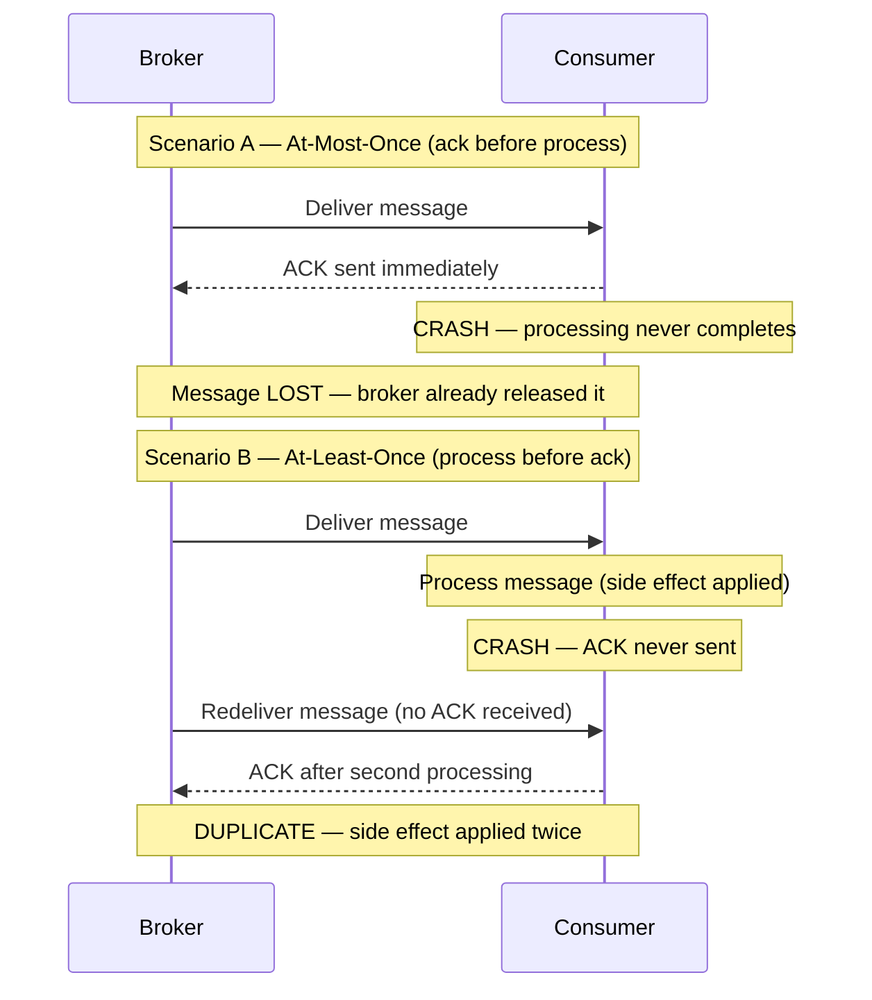
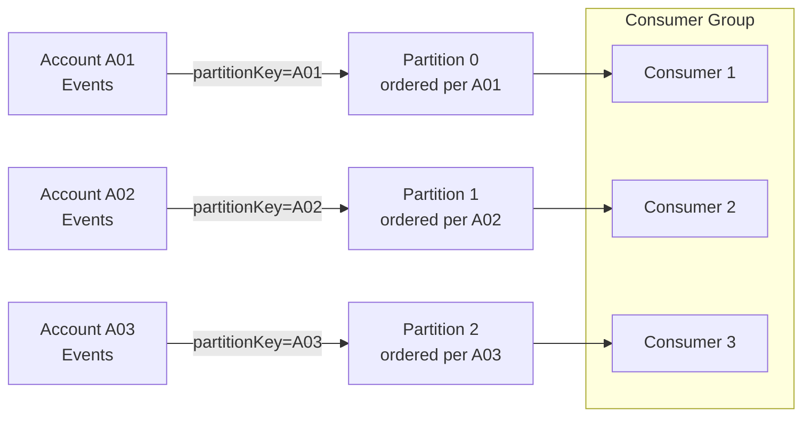
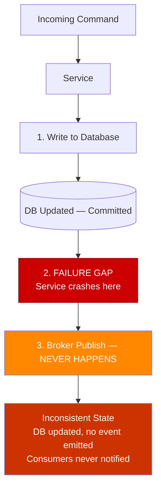

## Diagrams — Delivery Guarantees and Idempotency

### sequence diagram contrasting at-most-once (ack before process, crash loses message) and at-least-once (process before ack, crash triggers redelivery and duplicate) — show the broker, consumer, and the crash point in each

These two scenarios illustrate how the ordering of acknowledge versus process determines the delivery guarantee: acking first risks silent message loss on crash, while processing first risks duplication but never loses a message.

---

### flowchart showing a producer partitioning events by accountId — three accounts fanning into three partitions, each partition preserving per-account order, while a single consumer group competes across partitions

This diagram shows how routing events by a stable entity key (accountId) concentrates all events for one account onto one partition, preserving intra-account order while allowing parallel consumption across accounts via a consumer group.

---

### flowchart of the dual-write problem — service writes to DB, then a crash prevents the broker publish, leaving DB and broker inconsistent; annotate the failure gap

This diagram exposes the failure gap that exists when a service must write to two independent systems (database and broker) without a shared transaction: a crash between the two writes leaves state persisted in the database but no event published to consumers, silently corrupting the system's consistency.

