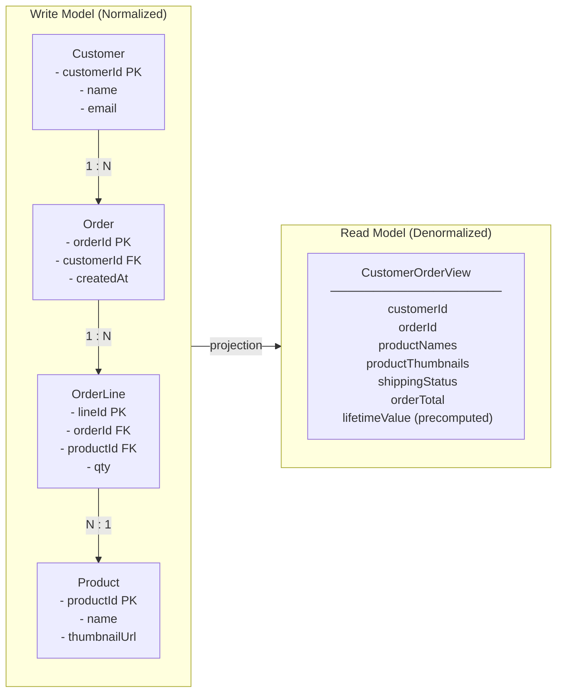
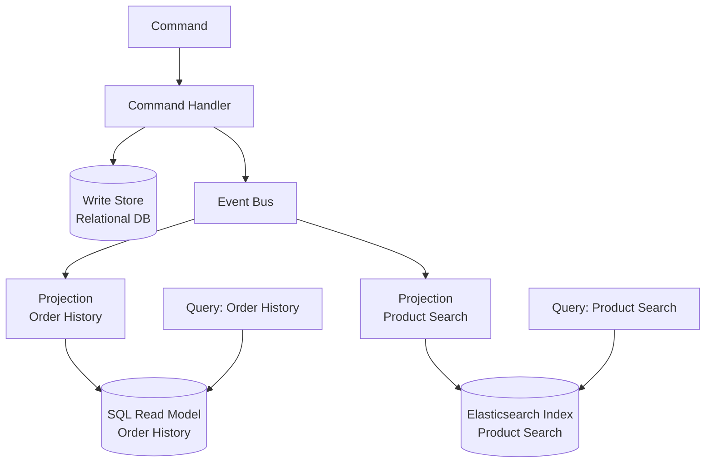
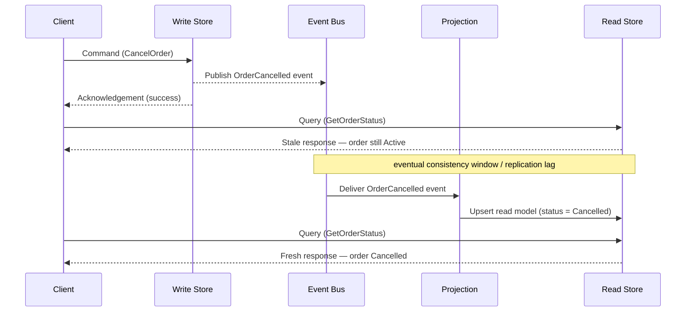

# Chapter 5: CQRS — Separating Reads and Writes

## Opening Problem Statement

Chapter 4 left the write path in good shape. Events flow at-least-once, consumers are idempotent, and the Transactional Outbox publishes reliably. But a nagging question remains: once those events have reshaped your system's state, how does anyone *read* that state efficiently? A single table optimized to enforce invariants on write is almost never the same table you want to query for a dashboard, a search screen, or a mobile feed. This is the tension **Command Query Responsibility Segregation (CQRS)** was built to resolve.

CQRS is one of the most misunderstood patterns in the event-driven toolkit. Some teams treat it as a mandatory companion to Event Sourcing. Others deploy it reflexively on every microservice and drown in accidental complexity. Neither reflex is correct. CQRS is a targeted answer to a specific structural problem — the mismatch between the shape of data you write and the shape you read. This chapter defines that problem precisely, shows how to separate the two paths, teaches you to build read models from events, confronts the consistency cost honestly, and — most importantly for a senior audience — draws a hard line around when CQRS is simply over-engineering.

## The Shape-Mismatch Problem

Every persistent system serves two fundamentally different jobs. On one side, it accepts changes and must protect business rules — an account cannot be overdrawn, an order cannot ship twice. On the other side, it answers questions — show me this customer's order history, rank products by revenue, list unpaid invoices. These two jobs pull the data model in opposite directions.

The write side wants **normalization**. Normalized tables prevent anomalies, enforce referential integrity, and keep invariants local to one aggregate. The read side wants **denormalization**. A query screen wants everything it needs pre-joined, flattened, and indexed for the exact access pattern it serves. Forcing both jobs onto one schema means neither gets what it needs. This is the **shape-mismatch problem**: the optimal structure for validating a change differs from the optimal structure for answering a question.

Consider a corporate e-commerce order service. The write model is a tidy `Order` aggregate with line items, enforcing that totals reconcile and stock is reserved. Now the business asks for a screen showing, per customer, their last ten orders with product thumbnails, shipping status, and a running lifetime-value figure. Serving that from the normalized write schema means a multi-table join executed on every page load, competing for locks with the very transactions that place orders.

**Figure 5.1 — Write Model vs Read Model: the projection bridge**



*The write model (left) keeps data normalized across four tables to enforce invariants and prevent anomalies; the read model (right) flattens those tables into a single document pre-optimized for the query screen. The "projection" arrow between them represents the event-driven process that continuously derives the read shape from write-side events — this is the structural core of CQRS.*

The naive fix is to keep bolting indexes and read replicas onto the single model. That buys time but not escape. Read-optimized indexes slow writes; heavy reporting queries contend with transactional load; and the schema calcifies because it must satisfy every consumer at once. CQRS proposes a cleaner cut: stop pretending one model can be both. Let the write side stay lean and rule-bound, and derive whatever read shapes you need as separate, purpose-built structures.

<details>
<summary>⚠️ Critical Note</summary>

"The naive fix is to keep bolting indexes and read replicas onto the single model. That buys time but not escape." This frames read replicas and materialized views as merely a stopgap, implying they are inadequate long-term solutions. For a significant class of real systems — moderate read/write ratios, bounded query diversity, predictable access patterns — a well-maintained read replica with a materialized view is a fully adequate permanent solution, not a stepping stone to CQRS. The prose does not acknowledge this, potentially pushing architects toward unnecessary complexity when the boring solution would suffice. This is in tension with the chapter's own "When CQRS Is Over-Engineering" section, which argues exactly the opposite.

**Suggested fix:** Qualify the claim: "For systems with diverse, unpredictable, or divergent query shapes, indexes and read replicas buy time but not escape. For systems with a stable, bounded set of queries, a carefully maintained read replica with a materialized view is often the correct permanent answer and should be evaluated before adopting CQRS."
</details>

## Command and Query Separation

The name says it all. A **command** is an instruction to change state — `PlaceOrder`, `CancelReservation`, `ApplyDiscount`. A **query** is a request to return state without changing it — `GetOrderHistory`, `FindUnpaidInvoices`. CQRS insists that these two responsibilities live in **separate models**, and often in separate infrastructure entirely.

This is a deliberate generalization of the older **Command Query Separation (CQS)** principle, which merely said a single method should either change state or return it, never both. CQRS lifts that idea from the method level to the architectural level: one model handles the command path, a different model handles the query path.

The command path processes an intent, validates it against business rules, and — on success — mutates the authoritative state and emits a domain event. That path returns almost nothing to the caller; frequently just an acknowledgement or an identifier. The query path never touches the authoritative write store. It reads from one or more **read models** built specifically for the questions being asked.

> ⚠️ **Critical Note:** The prose states categorically that "the query path never touches the authoritative write store," yet Section "Consistency Between Write Side and Read Side" correctly advises to "keep the invariant-critical reads close to the write model." These two statements directly contradict each other. A senior architect reading Chapter 5 in sequence will internalize an absolute rule in the first section, then encounter a carve-out three sections later without acknowledgment that it reverses the earlier rule. This ambiguity can cause misapplication: teams may implement a strict "never read from the write store" policy and then be unable to serve the strongly-consistent reads their domain actually requires without a full rework. **Suggested fix:** Remove the word "never" from the query-path description in Command and Query Separation and qualify the statement: "In the general case the query path reads from purpose-built read models; Section X identifies the exception for strongly-consistent, invariant-critical queries that legitimately stay on the write store." This acknowledges the hybrid reality from the outset and removes the contradiction.

**Listing 5.1 — CQRS write path vs read path: two independent models with no shared store**

```python
# CQRS write path vs read path — two independent models with no shared store
# O(1) write (single aggregate), O(1) read (indexed flat table)

from __future__ import annotations

from dataclasses import dataclass, field
from datetime import datetime, timezone
from typing import Protocol
from uuid import UUID, uuid4


# ---------------------------------------------------------------------------
# Shared value types (identifiers only — no business logic shared)
# ---------------------------------------------------------------------------

@dataclass(frozen=True)
class OrderId:
    value: UUID = field(default_factory=uuid4)


# ---------------------------------------------------------------------------
# COMMAND SIDE — intent, invariants, persistence, event emission
# ---------------------------------------------------------------------------

@dataclass(frozen=True)
class PlaceOrderCommand:
    customer_id: UUID
    items: list[dict]   # [{"product_id": UUID, "quantity": int, "unit_price": float}]


@dataclass(frozen=True)
class OrderPlacedEvent:
    order_id: UUID
    customer_id: UUID
    items: list[dict]
    total_amount: float
    placed_at: datetime
    event_id: UUID = field(default_factory=uuid4)  # used by projections for idempotency


class OrderCommandHandler:
    """Enforces write-side invariants; returns only OrderId — no read data leaks back."""

    def __init__(self, order_repo: OrderRepository, publisher: EventPublisher) -> None:
        self._repo = order_repo
        self._publisher = publisher

    def handle(self, cmd: PlaceOrderCommand) -> OrderId:
        if not cmd.items:
            raise ValueError("An order must contain at least one line item")

        total = sum(i["quantity"] * i["unit_price"] for i in cmd.items)
        if total <= 0:
            raise ValueError("Order total must be positive")

        order_id = OrderId()
        self._repo.save(order_id, cmd)   # persist write aggregate

        self._publisher.publish(OrderPlacedEvent(
            order_id=order_id.value,
            customer_id=cmd.customer_id,
            items=cmd.items,
            total_amount=total,
            placed_at=datetime.now(tz=timezone.utc),
        ))

        return order_id   # ← caller receives only the identifier


# ---------------------------------------------------------------------------
# QUERY SIDE — denormalized DTO, separate store, no write model contact
# ---------------------------------------------------------------------------

@dataclass
class CustomerOrderSummary:
    """Fully-denormalized view: prejoined, precomputed — shaped for the UI."""
    order_id: UUID
    customer_id: UUID
    status: str
    total_amount: float
    item_count: int
    placed_at: datetime
    shipped_at: datetime | None = None


class OrderQueryService:
    """Reads from the dedicated read store only — independent of write infrastructure."""

    def __init__(self, read_store: ReadStore) -> None:
        self._store = read_store

    def get_customer_orders(
        self, customer_id: UUID, *, limit: int = 10
    ) -> list[CustomerOrderSummary]:
        # Single flat query — no joins, no lock contention with write transactions
        rows = self._store.query(
            "SELECT * FROM customer_order_view "
            "WHERE customer_id = %s ORDER BY placed_at DESC LIMIT %s",
            (customer_id, limit),
        )
        return [CustomerOrderSummary(**row) for row in rows]


# ---------------------------------------------------------------------------
# Infrastructure protocols (injected; not shared between command and query)
# ---------------------------------------------------------------------------

class OrderRepository(Protocol):
    def save(self, order_id: OrderId, cmd: PlaceOrderCommand) -> None: ...

class EventPublisher(Protocol):
    def publish(self, event: OrderPlacedEvent) -> None: ...

class ReadStore(Protocol):
    def query(self, sql: str, params: tuple) -> list[dict]: ...
```

*The command handler owns the write path: it enforces invariants, persists the aggregate, and emits a domain event — returning only an `OrderId` to the caller. The query service owns the read path: it reads exclusively from a pre-projected, denormalized store and returns a fully-populated DTO, never touching the write model.*

Notice what this separation unlocks. The two sides can scale independently — read traffic in most corporate systems dwarfs write traffic by an order of magnitude, so you can add read replicas or query nodes without touching write capacity. They can use different storage engines: a relational store for transactional writes, a document store or search index for reads. And they can evolve on independent schedules, because a new query screen means adding a read model, not migrating the write schema.

The trade-off is equally clear. You now maintain two models and the machinery that keeps them aligned. That machinery is where events re-enter the story, and where the pattern earns or loses its keep.

<details>
<summary>💡 Expert Note</summary>

A common design conflict surfaces when UX teams assume the command path should return rich, post-mutation state — the updated order, the new account balance. The correct CQRS contract is stricter: the command handler returns synchronous **validation errors and failure codes** (the user must know immediately if their intent was rejected), but on success returns only an identifier or causal token — never the mutated read shape. Returning query-side data from the command path reintroduces the coupling CQRS was designed to sever and forces the command handler to query the read model or re-read the write store. Teams that blur this boundary end up with a "command-query hybrid" that inherits the complexity of both models without the scaling benefit of either.
</details>

<details>
<summary>⚠️ Critical Note</summary>

"The command path returns almost nothing to the caller; frequently just an acknowledgement or an identifier" is presented as an architectural fact rather than a contested design choice. Returning only an ID forces a mandatory second round-trip to retrieve the created or updated resource — a real latency and UX cost, especially over high-latency mobile or international connections. Many widely-deployed CQRS systems (including those built on Axon, MediatR, and similar frameworks) routinely return a result DTO from command handlers without violating CQRS semantics. The prose does not acknowledge this as a trade-off; it reads as a prescription.

**Suggested fix:** Reframe the statement as a common convention rather than a rule: "A common convention is to return only an identifier or acknowledgement from the command path; some teams return a lightweight result DTO to avoid an extra round-trip. Either is valid — the principle is that the command handler must not read from the query-side read model to compose its response."
</details>

## Read Models and Event-Driven Projections

How does data cross from the write side to the read side? Through events. Every time the command path commits a change, it emits a domain event — exactly the events Chapter 2 taught you to model and Chapter 4 taught you to deliver reliably. A **projection** is the component that consumes those events and updates a read model to reflect them.

Think of a projection as a small, dedicated consumer with one job: translate a stream of facts into a shape optimized for a specific query. When an `OrderPlaced` event arrives, the projection inserts or updates a row in the `CustomerOrderView`. When `OrderShipped` arrives, it flips the status field. The read model is never written to by hand; it is *derived*, entirely and repeatedly, from the event stream.

**Figure 5.2 — Command path fan-out to independent read-store projections**



*This diagram shows how events produced by the command path fan out to purpose-built projections, each maintaining its own read store optimized for a specific query pattern. It illustrates why CQRS allows the read and write sides to use different storage engines and scale independently.*

This design has a property that senior architects should savor: read models are **disposable and rebuildable**. Because a projection is a pure function of the event stream, you can delete a read model and reconstruct it by replaying events from the beginning. Need a brand-new query shape for a feature shipping next quarter? Write a new projection, replay history through it, and you have a fully-populated read model without a risky data migration. This rebuildability is the strongest practical argument for pairing CQRS with the event log, and it foreshadows Event Sourcing in Chapter 6.

**Listing 5.2 — Idempotent event projection: upserts a denormalized read model from the event stream**

```python
# Idempotent event projection — upserts a denormalized read model from the event stream
# At-least-once delivery safe: duplicate events are detected and skipped

from __future__ import annotations

from dataclasses import dataclass
from datetime import datetime, timezone
from typing import Protocol
from uuid import UUID


# ---------------------------------------------------------------------------
# Domain events consumed by this projection
# (emitted by the command side — identical to what the write handler published)
# ---------------------------------------------------------------------------

@dataclass(frozen=True)
class OrderPlaced:
    event_id: UUID
    order_id: UUID
    customer_id: UUID
    items: list[dict]   # [{"product_id": UUID, "quantity": int, "unit_price": float}]
    total_amount: float
    placed_at: datetime

@dataclass(frozen=True)
class OrderShipped:
    event_id: UUID
    order_id: UUID
    shipped_at: datetime

@dataclass(frozen=True)
class OrderCancelled:
    event_id: UUID
    order_id: UUID
    cancelled_at: datetime


# ---------------------------------------------------------------------------
# Projection handler
# ---------------------------------------------------------------------------

class CustomerOrderViewProjection:
    """
    Maintains the customer_order_view read table.

    Idempotency strategy: each row stores `last_applied_event_id`.
    Before applying any event, the handler checks whether that event_id
    was already applied — duplicates are silently skipped (Chapter 4 pattern).
    """

    def __init__(self, view_store: ViewStore) -> None:
        self._store = view_store

    # ------------------------------------------------------------------
    # Event handlers (one per subscribed event type)
    # ------------------------------------------------------------------

    def on_order_placed(self, event: OrderPlaced) -> None:
        if self._already_applied(event.order_id, event.event_id):
            return   # at-least-once: safe to skip duplicate

        self._store.upsert(
            table="customer_order_view",
            key={"order_id": event.order_id},
            values={
                "customer_id": event.customer_id,
                "status": "placed",
                "total_amount": event.total_amount,
                "item_count": len(event.items),
                "placed_at": event.placed_at,
                "shipped_at": None,
                "last_applied_event_id": event.event_id,
            },
        )

    def on_order_shipped(self, event: OrderShipped) -> None:
        if self._already_applied(event.order_id, event.event_id):
            return

        self._store.upsert(
            table="customer_order_view",
            key={"order_id": event.order_id},
            values={
                "status": "shipped",
                "shipped_at": event.shipped_at,
                "last_applied_event_id": event.event_id,
            },
        )

    def on_order_cancelled(self, event: OrderCancelled) -> None:
        if self._already_applied(event.order_id, event.event_id):
            return

        self._store.upsert(
            table="customer_order_view",
            key={"order_id": event.order_id},
            values={
                "status": "cancelled",
                "last_applied_event_id": event.event_id,
            },
        )

    # ------------------------------------------------------------------
    # Internal helpers
    # ------------------------------------------------------------------

    def _already_applied(self, order_id: UUID, event_id: UUID) -> bool:
        """Return True if this exact event was already written to the view."""
        row = self._store.fetch_one(
            "SELECT last_applied_event_id FROM customer_order_view "
            "WHERE order_id = %s",
            (order_id,),
        )
        if row is None:
            return False
        return row["last_applied_event_id"] == event_id


# ---------------------------------------------------------------------------
# Infrastructure protocol (injected — decouples projection from DB driver)
# ---------------------------------------------------------------------------

class ViewStore(Protocol):
    def upsert(self, table: str, key: dict, values: dict) -> None:
        """INSERT … ON CONFLICT DO UPDATE or equivalent for the target engine."""
        ...

    def fetch_one(self, sql: str, params: tuple) -> dict | None: ...
```

*The projection is the bridge between the write side and the read side: it consumes domain events and applies deterministic upserts to the denormalized `customer_order_view`. Idempotency is enforced by tracking the `last_applied_event_id` per row, making repeated delivery of the same event a safe no-op.*

A word of discipline: projections must be **idempotent**, for exactly the reasons Chapter 4 established. Delivery is at-least-once, so the same `OrderShipped` event may arrive twice. A projection that blindly increments a counter will drift. Use upserts keyed by the aggregate identifier, or track the last-applied event version per view, and duplicates become harmless. Treat the read model as a deterministic replay target, never as a place to accumulate side effects.

> 💡 **Expert Note:** The prose correctly presents read-model rebuildability as a practical advantage, but omits the operational cost that surprises every team the first time they exercise it in production. Replaying millions of events through a projection is not instantaneous — a mature event log can contain hundreds of millions of events, and a naive single-threaded replay can take hours or days. Production-grade systems handle this with snapshot checkpoints (periodic materialized snapshots of the projection state at a given event position), partitioned parallel replay across event-stream segments, and a "shadow projection" strategy: the new projection is built on the side while the old one continues serving traffic, and traffic is cut over only when the shadow reaches the live position. Teams that treat "just replay from the beginning" as a cost-free escape hatch discover the hard way that it is a maintenance operation requiring planning, capacity, and a tested runbook.

<details>
<summary>💡 Expert Note</summary>

Projection versioning is the quietly dangerous part of long-running CQRS systems. When a projection's logic changes — a new computed field, a renamed column, a changed aggregation — the read model built under the old logic is invalidated. The industry pattern is to version projections explicitly (e.g., `CustomerOrderView_v1`, `CustomerOrderView_v2`), run both simultaneously until the new version fully catches up, then atomically swap the query service's read target and decommission the old version. Frameworks such as Axon Framework and EventStoreDB provide projection versioning primitives; rolling your own requires a projection registry and a controlled replay harness. Teams that skip this discipline end up with silent data drift as they patch projections in place without rebuilding — a read model that no longer faithfully represents the event stream.
</details>

<details>
<summary>💡 Expert Note</summary>

Projection idempotency keys deserve more precision than "event ID or per-view version." In broker-based systems (Kafka, Kinesis), the temptation is to use the broker's partition offset as the idempotency key. This is fragile: offsets can be reassigned after topic compaction, partition rebalancing, or topic recreation during disaster recovery. The robust choice is the **domain event's own UUID or aggregate version**, which is stable across infrastructure changes. Concretely, the projection table should carry a `last_applied_event_id` column; an upsert is only executed when the incoming event ID differs. This makes the projection resilient to broker infrastructure events that the team controls separately from domain semantics.
</details>

<details>
<summary>⚠️ Critical Note</summary>

The prose says "Write a new projection, replay history through it, and you have a fully-populated read model without a risky data migration." This is true only when the event history is short, the event schemas have been kept stable, and projections do not depend on external state. In production systems: (1) events published years ago may carry different field names, missing fields, or obsolete semantics — requiring versioned upcasters before replay is correct; (2) replaying billions of events takes hours to days, which may be operationally unacceptable; (3) projections that call external services (pricing APIs, enrichment services) at projection time cannot be faithfully reconstructed because that external state may have changed or been decommissioned. Presenting rebuildability as an unqualified strength misleads the target audience about real operational costs.

**Suggested fix:** Add a paragraph after the "disposable and rebuildable" claim that scopes the guarantee: rebuildability holds when events carry self-contained, version-stable payloads and projections are pure functions of the event stream. Flag event schema evolution (and the need for upcasters), replay throughput limits at scale, and the anti-pattern of projections with external side effects as conditions that undermine the guarantee.
</details>

## Consistency Between Write Side and Read Side

Here is the fact that decides whether CQRS fits: the read side is **eventually consistent** with the write side. A command commits and its event is published, but the projection processes that event a moment later — milliseconds usually, seconds under load, longer if a consumer is lagging or recovering. During that window, a query can return state that does not yet reflect the change the user just made. This is **replication lag**, and it is not a bug you can eliminate; it is the structural price of separating the models.

The classic symptom is **read-your-own-writes** violation. A user cancels an order, the screen refreshes, and the order still shows as active because the cancellation event hasn't been projected yet. Users experience this as the system "losing" their action. You must design for it deliberately rather than hope it never happens.

The table below lays out the practical mitigations and their costs.

| Technique | How it works | Cost / caveat |
|---|---|---|
| Accept the lag | Show eventual state; add a subtle "processing…" hint in the UI | Simplest; only viable where staleness is tolerable |
| Optimistic UI update | Client renders the expected result locally after a command | UI can diverge from server truth on failure |
| Read-your-writes routing | Route a user's reads to the write model briefly after their command | Reintroduces write-side read load you tried to shed |
| Version / token check | Command returns a version; query waits until the read model reaches it | Adds latency and coordination complexity |

**Figure 5.3 — Eventual consistency window: stale read immediately after command commit**



*This sequence diagram makes the eventual-consistency cost of CQRS visible: a query issued immediately after a successful command can return stale data because the projection has not yet processed the event. Understanding this window — and the business tolerance for it — is the key design decision when adopting CQRS.*

The governing question is one of **business tolerance**, not technology. Ask, for each query: how stale can this data be before it causes real harm? A product-catalog view can lag by seconds with zero consequence. An account-balance check that gates a withdrawal cannot — and that is a strong signal to keep that specific read on the strongly-consistent write model, even in an otherwise CQRS system. CQRS does not force *every* read onto the eventual-consistency path. Keep the invariant-critical reads close to the write model and reserve projections for the reporting, search, and display workloads that dominate volume but tolerate delay.

> 💡 **Expert Note:** The "version / token check" row in the consistency table understates how this pattern is implemented at scale. The correct production form is a **causal consistency token**: the command handler returns an opaque token encoding the event sequence position (e.g., a global offset in Kafka, a stream revision in EventStoreDB). The client passes that token on its next read; the query service blocks or retries internally until the projection's watermark has advanced past the token, then responds. This provides read-your-own-writes without ever touching the write model. AWS AppSync, Confluent's ksqlDB, and EventStoreDB all expose variants of this under names like "read-at-revision" or "after-position." The key production nuance is that the query service must expose a "not yet" response code (HTTP 202 Accepted or a structured retry-after payload) rather than silently returning stale data — otherwise the client cannot distinguish "the system caught up" from "the projection is lagging."

<details>
<summary>⚠️ Critical Note</summary>

The prose characterizes replication lag as "milliseconds usually, seconds under load" — framing it as a narrow, recoverable window. This omits the failure-mode scenario that shapes SLA design: a crashed projection consumer, a poison-pill event causing repeated reprocessing, or a Kafka consumer-group rebalance can stall a projection for minutes or hours, not seconds. For a senior audience designing production SLAs and alerting strategies, the failure-mode tail matters more than the happy-path average. Quoting only the happy-path latency invites under-engineering of monitoring, dead-letter handling, and consumer health alerting.

**Suggested fix:** Extend the lag characterization to include the failure tail: "milliseconds in the steady state, seconds under load — but a stalled or crash-looping projection consumer can pause updates for minutes to hours, making projection-lag monitoring and alerting a first-class operational concern, not an afterthought."
</details>

## When CQRS Is Over-Engineering

Now the opinionated part, and the reason this chapter exists. CQRS is a specialized tool, not a default architecture. Applied where it is not needed, it manufactures complexity that will haunt the team for years. A senior architect's job is to recognize the difference before writing the first line of code.

CQRS is **over-engineering** when your read and write models have essentially the same shape. If a straightforward CRUD entity — a customer profile, a configuration record, a reference table — is written and read through nearly identical structures, there is no shape mismatch to solve. Splitting it into two models and a projection adds a moving part, an eventual-consistency window, and an operational burden while solving no actual problem. A well-indexed table, perhaps with a read replica, is the correct and boring answer.

Watch for these warning signs that CQRS is the wrong call:

1. **The domain is simple CRUD.** Data is created, read, updated, and deleted with no rich behavior and no query shapes that diverge from the write shape.
2. **Read and write volumes are comparable and modest.** The independent-scaling benefit is the main payoff; with balanced, low traffic there is little to gain.
3. **The team has no operational maturity for asynchrony.** CQRS means monitoring projection lag, handling replays, and debugging eventual consistency. Without that muscle, you inherit a system you cannot reason about.
4. **Stakeholders cannot tolerate any staleness.** If every read must be immediately consistent, you are fighting the pattern's core mechanic and should not adopt it.

**Pro Tip:** Adopt CQRS at the *aggregate* or *bounded-context* level, never as a blanket rule for the whole system. Most real systems are hybrids — a few high-value contexts justify full CQRS with projections, while the majority stay comfortable CRUD. Applying the pattern selectively is the mark of judgment; applying it everywhere is the mark of dogma.

The honest heuristic: reach for CQRS when a genuine shape mismatch, a large read/write asymmetry, or a need for many divergent read models makes a single model painful — and only then. If you cannot name the specific pain, you do not yet have a reason to pay the price.

<details>
<summary>💡 Expert Note</summary>

In practice, the safest adoption path is incremental rather than upfront. A team that introduces CQRS from day one on an untested domain almost always over-applies it — the bounded contexts are speculative, the query shapes are unknown, and the projections that get built end up mirroring the write model anyway. The field-validated approach is to start with a shared model under a read replica, instrument query patterns, identify the two or three read shapes that genuinely diverge from the write model under real load, and extract only those into projections. This "migrate from pain" path is dramatically less risky than designing CQRS upfront, and it keeps most of the codebase in the simpler CRUD regime until real evidence justifies the cost.
</details>

<details>
<summary>💡 Expert Note</summary>

The prose's warning signs are solid, but one failure mode common in microservices-heavy corporate environments is missing: cross-stream projections. When domain aggregates are partitioned too finely — separate services for Order, OrderLine, and Fulfillment — projections for UI screens must join events from multiple streams. This is effectively a distributed join, and it introduces a secondary consistency hazard: the projection for a CustomerOrderView may receive OrderPlaced from stream A before the correlated FulfillmentScheduled from stream B, requiring buffering, timeout logic, and compensating logic for events that never arrive. At that point the projection is no longer a simple consumer but a stateful correlation engine. This is a strong signal that the bounded contexts were drawn incorrectly rather than that CQRS should be extended to handle the complexity.
</details>

## Key Takeaways

- The **shape-mismatch problem** is CQRS's reason to exist: the normalized model that enforces write-side invariants is rarely the denormalized shape that serves reads efficiently.
- CQRS separates the **command path** (changes state, emits events, returns little) from the **query path** (reads purpose-built read models, never touches the write store), letting each scale and evolve independently.
- **Projections** are idempotent event consumers that derive read models from the event stream, making read models disposable and rebuildable by replay.
- The read side is **eventually consistent**; replication lag and read-your-own-writes are structural costs to be designed for, not bugs to be fixed. Match each read to its business tolerance for staleness.
- CQRS is **over-engineering** for simple CRUD with matching read/write shapes. Adopt it per aggregate or bounded context, only where a concrete pain justifies the added complexity.

## What's Next

Rebuildable read models hinted at a deeper idea — storing state as the events themselves; Chapter 6 makes that leap explicit with Event Sourcing.

<!-- ASSEMBLY COMPLETE
  Chapter: CQRS — Separating Reads and Writes
  Code blocks resolved: 2 / 2
  Diagrams resolved: 3 / 3
  Expert callouts (inline): 2
  Expert callouts (collapsed): 5
  Critical callouts (inline): 1
  Critical callouts (collapsed): 4
  Unresolved markers: 0
-->
