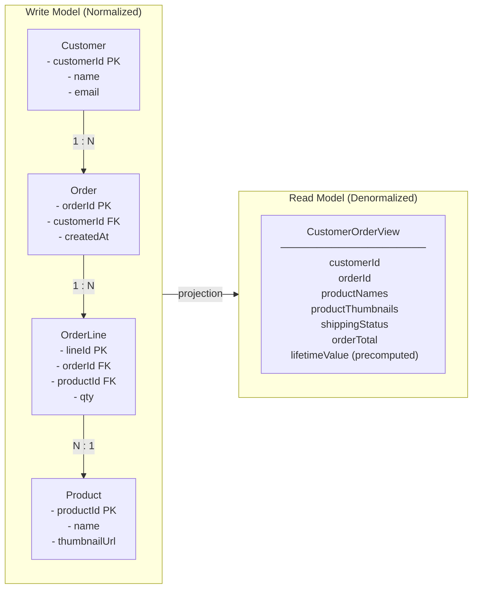
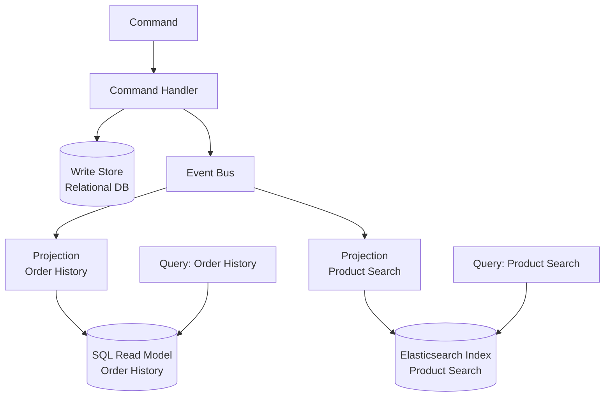
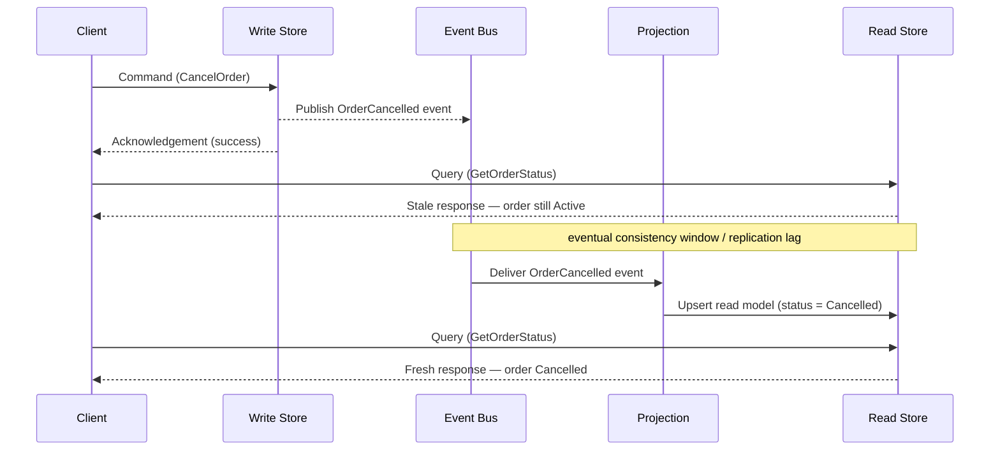

# Capítulo 5: CQRS — Separando Lecturas y Escrituras

## Planteamiento del Problema Inicial

El Capítulo 4 dejó el camino de escritura en buena forma. Los eventos fluyen al menos una vez, los consumidores son idempotentes y el Transactional Outbox publica de forma confiable. Pero queda una pregunta persistente: una vez que esos eventos han transformado el estado de tu sistema, ¿cómo puede alguien *leer* ese estado de manera eficiente? Una sola tabla optimizada para hacer cumplir invariantes en la escritura casi nunca es la misma tabla que deseas consultar para un panel de control, una pantalla de búsqueda o un feed móvil. Esa es la tensión que **Command Query Responsibility Segregation (CQRS)** fue creado para resolver.

CQRS es uno de los patrones más incomprendidos en el conjunto de herramientas orientadas a eventos. Algunos equipos lo tratan como un acompañante obligatorio de Event Sourcing. Otros lo despliegan reflexivamente en cada microservicio y se ahogan en complejidad accidental. Ningún reflejo es correcto. CQRS es una respuesta específica a un problema estructural concreto — la discrepancia entre la forma de los datos que se escriben y la forma en que se leen. Este capítulo define ese problema con precisión, muestra cómo separar los dos caminos, te enseña a construir modelos de lectura a partir de eventos, enfrenta honestamente el costo de consistencia y — lo más importante para una audiencia senior — traza una línea firme sobre cuándo CQRS es simplemente sobre-ingeniería.

## El Problema de la Discrepancia de Forma

Cada sistema persistente tiene dos trabajos fundamentalmente diferentes. Por un lado, acepta cambios y debe proteger las reglas de negocio — una cuenta no puede quedar en descubierto, un pedido no puede enviarse dos veces. Por otro lado, responde preguntas — muéstrame el historial de pedidos de este cliente, clasifica los productos por ingresos, lista las facturas impagas. Estos dos trabajos llevan el modelo de datos en direcciones opuestas.

El lado de escritura quiere **normalización** (normalization). Las tablas normalizadas previenen anomalías, hacen cumplir la integridad referencial y mantienen los invariantes localizados en un único agregado. El lado de lectura quiere **desnormalización** (denormalization). Una pantalla de consulta quiere todo lo que necesita pre-unido, aplanado e indexado para el patrón de acceso exacto que sirve. Forzar ambos trabajos a un mismo esquema significa que ninguno obtiene lo que necesita. Este es el **problema de discrepancia de forma**: la estructura óptima para validar un cambio difiere de la estructura óptima para responder una pregunta.

Considera un servicio de pedidos de e-commerce corporativo. El modelo de escritura es un agregado `Order` ordenado con líneas de artículos, que hace cumplir que los totales concuerden y el stock esté reservado. Ahora el negocio pide una pantalla que muestre, por cliente, sus últimos diez pedidos con miniaturas de productos, estado de envío y una cifra de valor de vida acumulado. Servir eso desde el esquema normalizado de escritura implica un join de múltiples tablas ejecutado en cada carga de página, compitiendo por bloqueos con las propias transacciones que realizan pedidos.

**Figura 5.1 — Modelo de Escritura vs Modelo de Lectura: el puente de proyección**



*El modelo de escritura (izquierda) mantiene los datos normalizados en cuatro tablas para hacer cumplir invariantes y prevenir anomalías; el modelo de lectura (derecha) aplana esas tablas en un único documento pre-optimizado para la pantalla de consulta. La flecha de "projection" entre ellos representa el proceso orientado a eventos que deriva continuamente la forma de lectura a partir de los eventos del lado de escritura — este es el núcleo estructural de CQRS.*

La solución ingenua es seguir añadiendo índices y réplicas de lectura al modelo único. Eso compra tiempo pero no una salida. Los índices optimizados para lectura ralentizan las escrituras; las consultas de informes pesadas compiten con la carga transaccional; y el esquema se calcifica porque debe satisfacer a todos los consumidores a la vez. CQRS propone un corte más limpio: deja de pretender que un modelo puede ser ambos. Deja que el lado de escritura permanezca liviano y orientado a reglas, y deriva las formas de lectura que necesites como estructuras separadas y especialmente construidas.

<details>
<summary>⚠️ Nota Crítica</summary>

"La solución ingenua es seguir añadiendo índices y réplicas de lectura al modelo único. Eso compra tiempo pero no una salida." Esto enmarca las réplicas de lectura y las vistas materializadas simplemente como un paliativo, implicando que son soluciones a largo plazo inadecuadas. Para una clase significativa de sistemas reales — relaciones de lectura/escritura moderadas, diversidad de consultas acotada, patrones de acceso predecibles — una réplica de lectura bien mantenida con una vista materializada es una solución permanente completamente adecuada, no un peldaño hacia CQRS. El texto no reconoce esto, empujando potencialmente a los arquitectos hacia una complejidad innecesaria cuando la solución aburrida sería suficiente. Esto está en tensión con la propia sección "Cuándo CQRS Es Sobre-Ingeniería" del capítulo, que argumenta exactamente lo contrario.

**Corrección sugerida:** Califica la afirmación: "Para sistemas con formas de consulta diversas, impredecibles o divergentes, los índices y las réplicas de lectura compran tiempo pero no una salida. Para sistemas con un conjunto estable y acotado de consultas, una réplica de lectura cuidadosamente mantenida con una vista materializada es a menudo la respuesta permanente correcta y debe evaluarse antes de adoptar CQRS."
</details>

## Separación de Comandos y Consultas

El nombre lo dice todo. Un **comando** (command) es una instrucción para cambiar el estado — `PlaceOrder`, `CancelReservation`, `ApplyDiscount`. Una **consulta** (query) es una solicitud para devolver el estado sin modificarlo — `GetOrderHistory`, `FindUnpaidInvoices`. CQRS insiste en que estas dos responsabilidades vivan en **modelos separados** y, frecuentemente, en infraestructura completamente diferente.

Esta es una generalización deliberada del principio más antiguo de **Command Query Separation (CQS)**, que simplemente decía que un único método debería o bien cambiar el estado o bien devolverlo, nunca ambas cosas. CQRS eleva esa idea del nivel de método al nivel arquitectónico: un modelo gestiona el camino de comandos, un modelo diferente gestiona el camino de consultas.

El camino de comandos procesa una intención, la valida contra las reglas de negocio y — en caso de éxito — muta el estado autoritativo y emite un evento de dominio. Ese camino devuelve casi nada al invocador; frecuentemente solo un acuse de recibo o un identificador. El camino de consultas nunca toca el almacén autoritativo de escritura. Lee de uno o más **modelos de lectura** construidos específicamente para las preguntas que se formulan.

> ⚠️ **Nota Crítica:** El texto afirma categóricamente que "el camino de consultas nunca toca el almacén autoritativo de escritura", sin embargo la sección "Consistencia Entre el Lado de Escritura y el Lado de Lectura" aconseja correctamente "mantener las lecturas críticas para los invariantes cerca del modelo de escritura." Estas dos afirmaciones se contradicen directamente. Un arquitecto senior que lea el Capítulo 5 en secuencia internalizará una regla absoluta en la primera sección y luego encontrará una excepción tres secciones más adelante sin que se reconozca que revierte la regla anterior. Esta ambigüedad puede causar una mala aplicación: los equipos pueden implementar una política estricta de "nunca leer del almacén de escritura" y luego ser incapaces de servir las lecturas con consistencia fuerte que su dominio realmente requiere sin una revisión completa. **Corrección sugerida:** Elimina la palabra "nunca" de la descripción del camino de consultas en Separación de Comandos y Consultas y califica la afirmación: "En el caso general, el camino de consultas lee de modelos de lectura construidos específicamente; la Sección X identifica la excepción para las consultas con consistencia fuerte y críticas para los invariantes que legítimamente permanecen en el almacén de escritura." Esto reconoce la realidad híbrida desde el principio y elimina la contradicción.

**Listado 5.1 — Camino de escritura vs camino de lectura en CQRS: dos modelos independientes sin almacén compartido**

```python
# CQRS write path vs read path — two independent models with no shared store
# O(1) write (single aggregate), O(1) read (indexed flat table)

from __future__ import annotations

from dataclasses import dataclass, field
from datetime import datetime, timezone
from typing import Protocol
from uuid import UUID, uuid4


# ---------------------------------------------------------------------------
# Shared value types (identifiers only — no business logic shared)
# ---------------------------------------------------------------------------

@dataclass(frozen=True)
class OrderId:
    value: UUID = field(default_factory=uuid4)


# ---------------------------------------------------------------------------
# COMMAND SIDE — intent, invariants, persistence, event emission
# ---------------------------------------------------------------------------

@dataclass(frozen=True)
class PlaceOrderCommand:
    customer_id: UUID
    items: list[dict]   # [{"product_id": UUID, "quantity": int, "unit_price": float}]


@dataclass(frozen=True)
class OrderPlacedEvent:
    order_id: UUID
    customer_id: UUID
    items: list[dict]
    total_amount: float
    placed_at: datetime
    event_id: UUID = field(default_factory=uuid4)  # used by projections for idempotency


class OrderCommandHandler:
    """Enforces write-side invariants; returns only OrderId — no read data leaks back."""

    def __init__(self, order_repo: OrderRepository, publisher: EventPublisher) -> None:
        self._repo = order_repo
        self._publisher = publisher

    def handle(self, cmd: PlaceOrderCommand) -> OrderId:
        if not cmd.items:
            raise ValueError("An order must contain at least one line item")

        total = sum(i["quantity"] * i["unit_price"] for i in cmd.items)
        if total <= 0:
            raise ValueError("Order total must be positive")

        order_id = OrderId()
        self._repo.save(order_id, cmd)   # persist write aggregate

        self._publisher.publish(OrderPlacedEvent(
            order_id=order_id.value,
            customer_id=cmd.customer_id,
            items=cmd.items,
            total_amount=total,
            placed_at=datetime.now(tz=timezone.utc),
        ))

        return order_id   # ← caller receives only the identifier


# ---------------------------------------------------------------------------
# QUERY SIDE — denormalized DTO, separate store, no write model contact
# ---------------------------------------------------------------------------

@dataclass
class CustomerOrderSummary:
    """Fully-denormalized view: prejoined, precomputed — shaped for the UI."""
    order_id: UUID
    customer_id: UUID
    status: str
    total_amount: float
    item_count: int
    placed_at: datetime
    shipped_at: datetime | None = None


class OrderQueryService:
    """Reads from the dedicated read store only — independent of write infrastructure."""

    def __init__(self, read_store: ReadStore) -> None:
        self._store = read_store

    def get_customer_orders(
        self, customer_id: UUID, *, limit: int = 10
    ) -> list[CustomerOrderSummary]:
        # Single flat query — no joins, no lock contention with write transactions
        rows = self._store.query(
            "SELECT * FROM customer_order_view "
            "WHERE customer_id = %s ORDER BY placed_at DESC LIMIT %s",
            (customer_id, limit),
        )
        return [CustomerOrderSummary(**row) for row in rows]


# ---------------------------------------------------------------------------
# Infrastructure protocols (injected; not shared between command and query)
# ---------------------------------------------------------------------------

class OrderRepository(Protocol):
    def save(self, order_id: OrderId, cmd: PlaceOrderCommand) -> None: ...

class EventPublisher(Protocol):
    def publish(self, event: OrderPlacedEvent) -> None: ...

class ReadStore(Protocol):
    def query(self, sql: str, params: tuple) -> list[dict]: ...
```

*El manejador de comandos posee el camino de escritura: hace cumplir los invariantes, persiste el agregado y emite un evento de dominio — devolviendo solo un `OrderId` al invocador. El servicio de consultas posee el camino de lectura: lee exclusivamente de un almacén desnormalizado pre-proyectado y devuelve un DTO completamente poblado, sin tocar nunca el modelo de escritura.*

Nota lo que esta separación habilita. Los dos lados pueden escalar de forma independiente — el tráfico de lectura en la mayoría de los sistemas corporativos supera al tráfico de escritura por un orden de magnitud, por lo que puedes añadir réplicas de lectura o nodos de consulta sin tocar la capacidad de escritura. Pueden usar diferentes motores de almacenamiento: un almacén relacional para escrituras transaccionales, un almacén de documentos o un índice de búsqueda para lecturas. Y pueden evolucionar en calendarios independientes, porque una nueva pantalla de consulta significa añadir un modelo de lectura, no migrar el esquema de escritura.

La contrapartida es igual de clara. Ahora mantienes dos modelos y la maquinaria que los mantiene alineados. Esa maquinaria es donde los eventos vuelven a entrar en la historia, y donde el patrón gana o pierde su valor.

<details>
<summary>💡 Nota del Experto</summary>

Un conflicto de diseño común surge cuando los equipos de UX asumen que el camino de comandos debería devolver un estado rico post-mutación — el pedido actualizado, el nuevo saldo de la cuenta. El contrato correcto de CQRS es más estricto: el manejador de comandos devuelve sincrónicamente **errores de validación y códigos de fallo** (el usuario debe saber inmediatamente si su intención fue rechazada), pero en caso de éxito devuelve solo un identificador o token causal — nunca la forma de lectura mutada. Devolver datos del lado de consultas desde el camino de comandos reintroduce el acoplamiento que CQRS fue diseñado para cortar y obliga al manejador de comandos a consultar el modelo de lectura o releer el almacén de escritura. Los equipos que difuminan este límite terminan con un "híbrido comando-consulta" que hereda la complejidad de ambos modelos sin el beneficio de escalado de ninguno.
</details>

<details>
<summary>⚠️ Nota Crítica</summary>

"El camino de comandos devuelve casi nada al invocador; frecuentemente solo un acuse de recibo o un identificador" se presenta como un hecho arquitectónico en lugar de una elección de diseño debatida. Devolver solo un ID fuerza un segundo viaje de ida y vuelta obligatorio para recuperar el recurso creado o actualizado — un costo real de latencia y UX, especialmente en conexiones móviles de alta latencia o internacionales. Muchos sistemas CQRS ampliamente desplegados (incluyendo los construidos sobre Axon, MediatR y frameworks similares) devuelven rutinariamente un DTO de resultado desde los manejadores de comandos sin violar la semántica de CQRS. El texto no reconoce esto como una contrapartida; se lee como una prescripción.

**Corrección sugerida:** Reformula la afirmación como una convención común en lugar de una regla: "Una convención común es devolver solo un identificador o acuse de recibo desde el camino de comandos; algunos equipos devuelven un DTO de resultado ligero para evitar un viaje de ida y vuelta adicional. Ambos son válidos — el principio es que el manejador de comandos no debe leer del modelo de lectura del lado de consultas para componer su respuesta."
</details>

## Modelos de Lectura y Proyecciones Orientadas a Eventos

¿Cómo cruzan los datos del lado de escritura al lado de lectura? A través de eventos. Cada vez que el camino de comandos confirma un cambio, emite un evento de dominio — exactamente los eventos que el Capítulo 2 te enseñó a modelar y el Capítulo 4 te enseñó a entregar de forma confiable. Una **proyección** (projection) es el componente que consume esos eventos y actualiza un modelo de lectura para reflejarlos.

Piensa en una proyección como un consumidor pequeño y dedicado con un solo trabajo: traducir un flujo de hechos en una forma optimizada para una consulta específica. Cuando llega un evento `OrderPlaced`, la proyección inserta o actualiza una fila en la `CustomerOrderView`. Cuando llega `OrderShipped`, cambia el campo de estado. El modelo de lectura nunca se escribe a mano; se *deriva*, completa y repetidamente, del flujo de eventos.

**Figura 5.2 — Distribución del camino de comandos a proyecciones independientes de almacén de lectura**



*Este diagrama muestra cómo los eventos producidos por el camino de comandos se distribuyen a proyecciones específicas, cada una manteniendo su propio almacén de lectura optimizado para un patrón de consulta particular. Ilustra por qué CQRS permite que los lados de lectura y escritura usen diferentes motores de almacenamiento y escalen de forma independiente.*

Este diseño tiene una propiedad que los arquitectos senior deberían apreciar: los modelos de lectura son **desechables y reconstruibles**. Como una proyección es una función pura del flujo de eventos, puedes eliminar un modelo de lectura y reconstruirlo reproduciendo los eventos desde el principio. ¿Necesitas una forma de consulta completamente nueva para una funcionalidad que se lanzará el próximo trimestre? Escribe una nueva proyección, reproduce el historial a través de ella, y tendrás un modelo de lectura completamente poblado sin una migración de datos arriesgada. Esta reconstruibilidad es el argumento práctico más sólido para combinar CQRS con el registro de eventos, y anticipa Event Sourcing en el Capítulo 6.

**Listado 5.2 — Proyección de eventos idempotente: realiza upserts en un modelo de lectura desnormalizado desde el flujo de eventos**

```python
# Idempotent event projection — upserts a denormalized read model from the event stream
# At-least-once delivery safe: duplicate events are detected and skipped

from __future__ import annotations

from dataclasses import dataclass
from datetime import datetime, timezone
from typing import Protocol
from uuid import UUID


# ---------------------------------------------------------------------------
# Domain events consumed by this projection
# (emitted by the command side — identical to what the write handler published)
# ---------------------------------------------------------------------------

@dataclass(frozen=True)
class OrderPlaced:
    event_id: UUID
    order_id: UUID
    customer_id: UUID
    items: list[dict]   # [{"product_id": UUID, "quantity": int, "unit_price": float}]
    total_amount: float
    placed_at: datetime

@dataclass(frozen=True)
class OrderShipped:
    event_id: UUID
    order_id: UUID
    shipped_at: datetime

@dataclass(frozen=True)
class OrderCancelled:
    event_id: UUID
    order_id: UUID
    cancelled_at: datetime


# ---------------------------------------------------------------------------
# Projection handler
# ---------------------------------------------------------------------------

class CustomerOrderViewProjection:
    """
    Maintains the customer_order_view read table.

    Idempotency strategy: each row stores `last_applied_event_id`.
    Before applying any event, the handler checks whether that event_id
    was already applied — duplicates are silently skipped (Chapter 4 pattern).
    """

    def __init__(self, view_store: ViewStore) -> None:
        self._store = view_store

    # ------------------------------------------------------------------
    # Event handlers (one per subscribed event type)
    # ------------------------------------------------------------------

    def on_order_placed(self, event: OrderPlaced) -> None:
        if self._already_applied(event.order_id, event.event_id):
            return   # at-least-once: safe to skip duplicate

        self._store.upsert(
            table="customer_order_view",
            key={"order_id": event.order_id},
            values={
                "customer_id": event.customer_id,
                "status": "placed",
                "total_amount": event.total_amount,
                "item_count": len(event.items),
                "placed_at": event.placed_at,
                "shipped_at": None,
                "last_applied_event_id": event.event_id,
            },
        )

    def on_order_shipped(self, event: OrderShipped) -> None:
        if self._already_applied(event.order_id, event.event_id):
            return

        self._store.upsert(
            table="customer_order_view",
            key={"order_id": event.order_id},
            values={
                "status": "shipped",
                "shipped_at": event.shipped_at,
                "last_applied_event_id": event.event_id,
            },
        )

    def on_order_cancelled(self, event: OrderCancelled) -> None:
        if self._already_applied(event.order_id, event.event_id):
            return

        self._store.upsert(
            table="customer_order_view",
            key={"order_id": event.order_id},
            values={
                "status": "cancelled",
                "last_applied_event_id": event.event_id,
            },
        )

    # ------------------------------------------------------------------
    # Internal helpers
    # ------------------------------------------------------------------

    def _already_applied(self, order_id: UUID, event_id: UUID) -> bool:
        """Return True if this exact event was already written to the view."""
        row = self._store.fetch_one(
            "SELECT last_applied_event_id FROM customer_order_view "
            "WHERE order_id = %s",
            (order_id,),
        )
        if row is None:
            return False
        return row["last_applied_event_id"] == event_id


# ---------------------------------------------------------------------------
# Infrastructure protocol (injected — decouples projection from DB driver)
# ---------------------------------------------------------------------------

class ViewStore(Protocol):
    def upsert(self, table: str, key: dict, values: dict) -> None:
        """INSERT … ON CONFLICT DO UPDATE or equivalent for the target engine."""
        ...

    def fetch_one(self, sql: str, params: tuple) -> dict | None: ...
```

*La proyección es el puente entre el lado de escritura y el lado de lectura: consume eventos de dominio y aplica upserts deterministas a la `customer_order_view` desnormalizada. La idempotencia se hace cumplir rastreando el `last_applied_event_id` por fila, haciendo que la entrega repetida del mismo evento sea un no-op seguro.*

Una nota de disciplina: las proyecciones deben ser **idempotentes**, exactamente por las razones que estableció el Capítulo 4. La entrega es al menos una vez, por lo que el mismo evento `OrderShipped` puede llegar dos veces. Una proyección que ingenuamente incrementa un contador irá a la deriva. Usa upserts con clave por el identificador del agregado, o rastrea la última versión de evento aplicada por vista, y los duplicados se vuelven inofensivos. Trata el modelo de lectura como un destino de reproducción determinista, nunca como un lugar donde acumular efectos secundarios.

> 💡 **Nota del Experto:** El texto presenta correctamente la reconstruibilidad del modelo de lectura como una ventaja práctica, pero omite el costo operacional que sorprende a cada equipo la primera vez que lo ejercen en producción. Reproducir millones de eventos a través de una proyección no es instantáneo — un registro de eventos maduro puede contener cientos de millones de eventos, y una reproducción ingenua de un solo hilo puede tomar horas o días. Los sistemas de nivel de producción manejan esto con checkpoints de instantánea (instantáneas materializadas periódicas del estado de la proyección en una posición de evento dada), reproducción paralela particionada a través de segmentos del flujo de eventos, y una estrategia de "proyección en la sombra": la nueva proyección se construye en paralelo mientras la antigua continúa sirviendo tráfico, y el tráfico se transfiere solo cuando la sombra alcanza la posición en vivo. Los equipos que tratan "simplemente reproducir desde el principio" como un escape sin costo descubren a las malas que es una operación de mantenimiento que requiere planificación, capacidad y un runbook probado.

<details>
<summary>💡 Nota del Experto</summary>

El versionado de proyecciones es la parte silenciosamente peligrosa de los sistemas CQRS de larga ejecución. Cuando la lógica de una proyección cambia — un nuevo campo calculado, una columna renombrada, una agregación modificada — el modelo de lectura construido bajo la lógica anterior queda invalidado. El patrón de la industria es versionar las proyecciones explícitamente (por ejemplo, `CustomerOrderView_v1`, `CustomerOrderView_v2`), ejecutar ambas simultáneamente hasta que la nueva versión se ponga completamente al día, luego intercambiar atómicamente el destino de lectura del servicio de consultas y desmantelar la versión antigua. Frameworks como Axon Framework y EventStoreDB proporcionan primitivas de versionado de proyecciones; construir el propio requiere un registro de proyecciones y un arnés de reproducción controlado. Los equipos que omiten esta disciplina terminan con una deriva silenciosa de datos al parchar las proyecciones en su lugar sin reconstruirlas — un modelo de lectura que ya no representa fielmente el flujo de eventos.
</details>

<details>
<summary>💡 Nota del Experto</summary>

Las claves de idempotencia de proyecciones merecen más precisión que "ID de evento o versión por vista." En sistemas basados en brokers (Kafka, Kinesis), la tentación es usar el offset de partición del broker como clave de idempotencia. Esto es frágil: los offsets pueden ser reasignados después de la compactación del topic, el rebalanceo de particiones o la recreación del topic durante la recuperación ante desastres. La elección robusta es el **UUID propio del evento de dominio o la versión del agregado**, que es estable a través de los cambios de infraestructura. Concretamente, la tabla de proyección debería llevar una columna `last_applied_event_id`; un upsert solo se ejecuta cuando el ID del evento entrante difiere. Esto hace que la proyección sea resiliente a los eventos de infraestructura del broker que el equipo controla por separado de la semántica del dominio.
</details>

<details>
<summary>⚠️ Nota Crítica</summary>

El texto dice "Escribe una nueva proyección, reproduce el historial a través de ella, y tendrás un modelo de lectura completamente poblado sin una migración de datos arriesgada." Esto solo es verdad cuando el historial de eventos es corto, los esquemas de eventos se han mantenido estables y las proyecciones no dependen de estado externo. En sistemas de producción: (1) los eventos publicados hace años pueden llevar nombres de campo diferentes, campos faltantes o semántica obsoleta — requiriendo upcasters versionados antes de que la reproducción sea correcta; (2) reproducir miles de millones de eventos lleva horas o días, lo que puede ser operacionalmente inaceptable; (3) las proyecciones que llaman a servicios externos (APIs de precios, servicios de enriquecimiento) en el momento de la proyección no pueden reconstruirse fielmente porque ese estado externo puede haber cambiado o sido desmantelado. Presentar la reconstruibilidad como una fortaleza sin calificaciones engaña a la audiencia objetivo sobre los costos operacionales reales.

**Corrección sugerida:** Añade un párrafo después de la afirmación "desechable y reconstruible" que delimite la garantía: la reconstruibilidad se mantiene cuando los eventos llevan cargas útiles autocontenidas y de versión estable y las proyecciones son funciones puras del flujo de eventos. Señala la evolución del esquema de eventos (y la necesidad de upcasters), los límites de rendimiento de reproducción a escala y el anti-patrón de proyecciones con efectos secundarios externos como condiciones que socavan la garantía.
</details>

## Consistencia Entre el Lado de Escritura y el Lado de Lectura

Aquí está el hecho que decide si CQRS encaja: el lado de lectura es **eventualmente consistente** con el lado de escritura. Un comando se confirma y su evento se publica, pero la proyección procesa ese evento un momento después — milisegundos normalmente, segundos bajo carga, más tiempo si un consumidor está rezagado o recuperándose. Durante esa ventana, una consulta puede devolver un estado que todavía no refleja el cambio que el usuario acaba de hacer. Esto es **retraso de replicación** (replication lag), y no es un error que puedas eliminar; es el precio estructural de separar los modelos.

El síntoma clásico es la violación de **read-your-own-writes**. Un usuario cancela un pedido, la pantalla se actualiza y el pedido todavía aparece como activo porque el evento de cancelación aún no ha sido proyectado. Los usuarios experimentan esto como que el sistema "pierde" su acción. Debes diseñar para ello deliberadamente en lugar de esperar que nunca ocurra.

La tabla a continuación describe las mitigaciones prácticas y sus costos.

| Técnica | Cómo funciona | Costo / advertencia |
|---|---|---|
| Aceptar el retraso | Mostrar el estado eventual; añadir una pista sutil de "procesando…" en la UI | La más simple; solo viable cuando la obsolescencia es tolerable |
| Actualización optimista de la UI | El cliente renderiza el resultado esperado localmente después de un comando | La UI puede divergir de la verdad del servidor en caso de fallo |
| Enrutamiento read-your-writes | Enrutar las lecturas de un usuario al modelo de escritura brevemente después de su comando | Reintroduce la carga de lectura del lado de escritura que intentabas reducir |
| Verificación de versión / token | El comando devuelve una versión; la consulta espera hasta que el modelo de lectura la alcance | Añade latencia y complejidad de coordinación |

**Figura 5.3 — Ventana de consistencia eventual: lectura obsoleta inmediatamente después de la confirmación del comando**



*Este diagrama de secuencia hace visible el costo de consistencia eventual de CQRS: una consulta emitida inmediatamente después de un comando exitoso puede devolver datos obsoletos porque la proyección aún no ha procesado el evento. Entender esta ventana — y la tolerancia del negocio para ella — es la decisión de diseño clave al adoptar CQRS.*

La pregunta rectora es de **tolerancia del negocio**, no de tecnología. Pregunta, para cada consulta: ¿qué tan obsoletos pueden ser estos datos antes de causar daño real? Una vista de catálogo de productos puede retrasarse segundos sin consecuencias. Una verificación de saldo de cuenta que controla un retiro no puede — y esa es una señal fuerte para mantener esa lectura específica en el modelo de escritura con consistencia fuerte, incluso en un sistema que de otro modo es CQRS. CQRS no fuerza *cada* lectura por el camino de consistencia eventual. Mantén las lecturas críticas para los invariantes cerca del modelo de escritura y reserva las proyecciones para las cargas de trabajo de informes, búsqueda y visualización que dominan en volumen pero toleran el retraso.

> 💡 **Nota del Experto:** La fila "verificación de versión / token" en la tabla de consistencia subestima cómo se implementa este patrón a escala. La forma correcta de producción es un **token de consistencia causal**: el manejador de comandos devuelve un token opaco que codifica la posición en la secuencia de eventos (por ejemplo, un offset global en Kafka, una revisión de stream en EventStoreDB). El cliente pasa ese token en su próxima lectura; el servicio de consultas bloquea o reintenta internamente hasta que el watermark de la proyección haya avanzado más allá del token y luego responde. Esto proporciona read-your-own-writes sin tocar nunca el modelo de escritura. AWS AppSync, ksqlDB de Confluent y EventStoreDB exponen variantes de esto bajo nombres como "read-at-revision" o "after-position." El matiz clave de producción es que el servicio de consultas debe exponer un código de respuesta "aún no disponible" (HTTP 202 Accepted o una carga útil estructurada de retry-after) en lugar de devolver silenciosamente datos obsoletos — de lo contrario, el cliente no puede distinguir "el sistema se puso al día" de "la proyección está rezagada."

<details>
<summary>⚠️ Nota Crítica</summary>

El texto caracteriza el retraso de replicación como "milisegundos normalmente, segundos bajo carga" — enmarcándolo como una ventana estrecha y recuperable. Esto omite el escenario de modo de fallo que da forma al diseño de SLA: un consumidor de proyección que falla, un evento envenenado que causa reprocesamiento repetido, o un rebalanceo del grupo de consumidores de Kafka puede detener una proyección por minutos u horas, no segundos. Para una audiencia senior que diseña SLAs de producción y estrategias de alertas, la cola del modo de fallo importa más que el promedio del camino feliz. Citar solo la latencia del camino feliz invita a sub-diseñar el monitoreo, el manejo de dead-letter y las alertas de salud del consumidor.

**Corrección sugerida:** Extiende la caracterización del retraso para incluir la cola del modo de fallo: "milisegundos en estado estable, segundos bajo carga — pero un consumidor de proyección detenido o en bucle de fallo puede pausar las actualizaciones por minutos a horas, haciendo del monitoreo y las alertas de retraso de proyección una preocupación operacional de primer nivel, no una ocurrencia tardía."
</details>

## Cuándo CQRS Es Sobre-Ingeniería

Ahora la parte con opinión, y la razón por la que existe este capítulo. CQRS es una herramienta especializada, no una arquitectura predeterminada. Aplicado donde no se necesita, fabrica complejidad que perseguirá al equipo durante años. El trabajo de un arquitecto senior es reconocer la diferencia antes de escribir la primera línea de código.

CQRS es **sobre-ingeniería** cuando tus modelos de lectura y escritura tienen esencialmente la misma forma. Si una entidad CRUD sencilla — un perfil de cliente, un registro de configuración, una tabla de referencia — se escribe y lee a través de estructuras casi idénticas, no hay discrepancia de forma que resolver. Dividirlo en dos modelos y una proyección añade una pieza en movimiento, una ventana de consistencia eventual y una carga operacional sin resolver ningún problema real. Una tabla bien indexada, quizás con una réplica de lectura, es la respuesta correcta y aburrida.

Presta atención a estas señales de advertencia de que CQRS es la elección incorrecta:

1. **El dominio es CRUD simple.** Los datos se crean, leen, actualizan y eliminan sin comportamiento rico y sin formas de consulta que diverjan de la forma de escritura.
2. **Los volúmenes de lectura y escritura son comparables y modestos.** El beneficio de escalado independiente es la principal recompensa; con tráfico balanceado y bajo hay poco que ganar.
3. **El equipo no tiene madurez operacional para la asincronía.** CQRS significa monitorear el retraso de proyecciones, manejar reproducciones y depurar la consistencia eventual. Sin ese músculo, heredas un sistema que no puedes razonar.
4. **Las partes interesadas no pueden tolerar ninguna obsolescencia.** Si cada lectura debe ser inmediatamente consistente, estás luchando contra la mecánica central del patrón y no deberías adoptarlo.

**Consejo Profesional:** Adopta CQRS al nivel del *agregado* o del *bounded context*, nunca como una regla general para todo el sistema. La mayoría de los sistemas reales son híbridos — algunos contextos de alto valor justifican CQRS completo con proyecciones, mientras que la mayoría permanecen como CRUD cómodo. Aplicar el patrón de forma selectiva es la marca del juicio; aplicarlo en todas partes es la marca del dogmatismo.

La heurística honesta: alcanza CQRS cuando una discrepancia de forma genuina, una gran asimetría lectura/escritura o la necesidad de muchos modelos de lectura divergentes hace que un modelo único sea doloroso — y solo entonces. Si no puedes nombrar el dolor específico, aún no tienes razón para pagar el precio.

<details>
<summary>💡 Nota del Experto</summary>

En la práctica, el camino de adopción más seguro es incremental en lugar de anticipado. Un equipo que introduce CQRS desde el primer día en un dominio no probado casi siempre lo sobre-aplica — los bounded contexts son especulativos, las formas de consulta son desconocidas y las proyecciones que se construyen terminan reflejando el modelo de escritura de todos modos. El enfoque validado en el campo es comenzar con un modelo compartido bajo una réplica de lectura, instrumentar los patrones de consulta, identificar las dos o tres formas de lectura que genuinamente divergen del modelo de escritura bajo carga real, y extraer solo esas en proyecciones. Este camino de "migrar desde el dolor" es dramáticamente menos arriesgado que diseñar CQRS de antemano, y mantiene la mayor parte de la base de código en el régimen CRUD más simple hasta que la evidencia real justifique el costo.
</details>

<details>
<summary>💡 Nota del Experto</summary>

Las señales de advertencia del texto son sólidas, pero falta un modo de fallo común en entornos corporativos con muchos microservicios: las proyecciones entre flujos. Cuando los agregados de dominio están particionados demasiado finamente — servicios separados para Order, OrderLine y Fulfillment — las proyecciones para pantallas de UI deben unir eventos de múltiples flujos. Esto es efectivamente un join distribuido, e introduce un riesgo de consistencia secundario: la proyección para una CustomerOrderView puede recibir OrderPlaced del flujo A antes del FulfillmentScheduled correlacionado del flujo B, requiriendo lógica de buffering, timeout y lógica de compensación para eventos que nunca llegan. En ese punto la proyección ya no es un consumidor simple sino un motor de correlación con estado. Esta es una señal fuerte de que los bounded contexts fueron delimitados incorrectamente en lugar de que CQRS deba extenderse para manejar la complejidad.
</details>

## Conclusiones Clave

- El **problema de discrepancia de forma** es la razón de existir de CQRS: el modelo normalizado que hace cumplir los invariantes del lado de escritura rara vez es la forma desnormalizada que sirve las lecturas de manera eficiente.
- CQRS separa el **camino de comandos** (cambia el estado, emite eventos, devuelve poco) del **camino de consultas** (lee modelos de lectura construidos específicamente, nunca toca el almacén de escritura), permitiendo que cada uno escale y evolucione de forma independiente.
- Las **proyecciones** son consumidores de eventos idempotentes que derivan modelos de lectura del flujo de eventos, haciendo que los modelos de lectura sean desechables y reconstruibles por reproducción.
- El lado de lectura es **eventualmente consistente**; el retraso de replicación y el read-your-own-writes son costos estructurales para los que hay que diseñar, no errores a corregir. Empareja cada lectura con la tolerancia de obsolescencia del negocio.
- CQRS es **sobre-ingeniería** para CRUD simple con formas de lectura/escritura coincidentes. Adóptalo por agregado o bounded context, solo donde un dolor concreto justifique la complejidad añadida.

## Qué Sigue

Los modelos de lectura reconstruibles insinuaron una idea más profunda — almacenar el estado como los propios eventos; el Capítulo 6 hace ese salto explícito con Event Sourcing.

<!-- ASSEMBLY COMPLETE
  Chapter: CQRS — Separating Reads and Writes
  Code blocks resolved: 2 / 2
  Diagrams resolved: 3 / 3
  Expert callouts (inline): 2
  Expert callouts (collapsed): 5
  Critical callouts (inline): 1
  Critical callouts (collapsed): 4
  Unresolved markers: 0
-->
