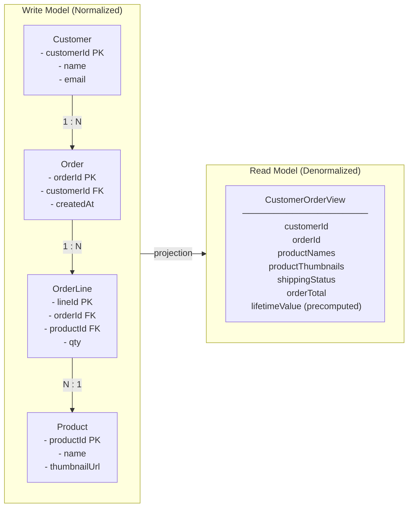
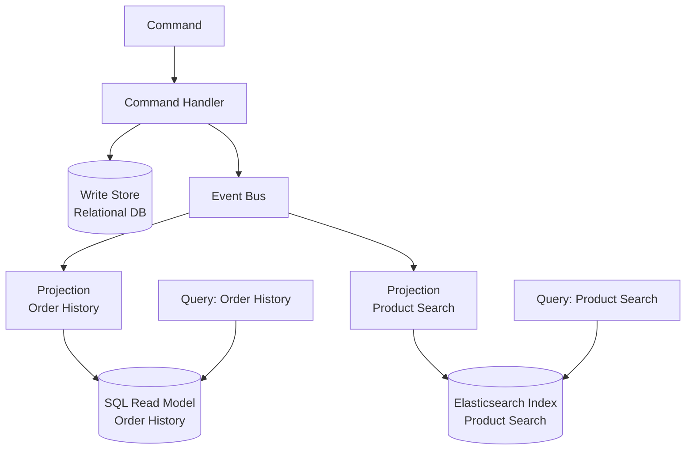
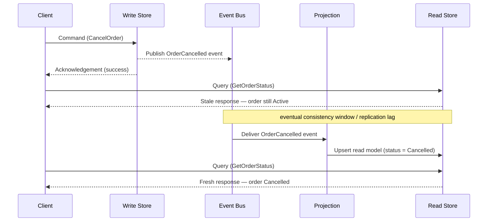

# Capítulo 5: CQRS — Separando Leituras e Escritas

## Declaração do Problema Inicial

O Capítulo 4 deixou o caminho de escrita em boa forma. Eventos fluem com entrega at-least-once, consumidores são idempotentes e o Transactional Outbox publica com confiabilidade. Mas uma pergunta persistente permanece: uma vez que esses eventos remodelaram o estado do seu sistema, como alguém *lê* esse estado de forma eficiente? Uma única tabela otimizada para impor invariantes na escrita quase nunca é a mesma tabela que você deseja consultar para um dashboard, uma tela de busca ou um feed mobile. Essa é a tensão que o **Command Query Responsibility Segregation (CQRS)** foi criado para resolver.

CQRS é um dos padrões mais mal compreendidos no conjunto de ferramentas orientado a eventos. Algumas equipes o tratam como um companheiro obrigatório do Event Sourcing (armazenamento de eventos). Outras o aplicam reflexivamente em todo microserviço e se afogam em complexidade acidental. Nenhum reflexo está correto. CQRS é uma resposta direcionada a um problema estrutural específico — a incompatibilidade entre o formato dos dados que você escreve e o formato que você lê. Este capítulo define esse problema com precisão, mostra como separar os dois caminhos, ensina a construir modelos de leitura a partir de eventos, confronta honestamente o custo de consistência e — o mais importante para um público sênior — traça uma linha clara sobre quando CQRS é simplesmente engenharia excessiva.

## O Problema de Incompatibilidade de Formato

Todo sistema persistente serve a dois trabalhos fundamentalmente diferentes. De um lado, aceita mudanças e deve proteger regras de negócio — uma conta não pode ficar negativa, um pedido não pode ser enviado duas vezes. Do outro lado, responde a perguntas — mostre-me o histórico de pedidos deste cliente, classifique produtos por receita, liste faturas em aberto. Esses dois trabalhos puxam o modelo de dados em direções opostas.

O lado da escrita quer **normalização** (normalização). Tabelas normalizadas evitam anomalias, impõem integridade referencial e mantêm invariantes locais a um único agregado. O lado da leitura quer **desnormalização** (desnormalização). Uma tela de consulta quer tudo o que precisa pré-unido, achatado e indexado para o padrão de acesso exato que serve. Forçar os dois trabalhos em um único esquema significa que nenhum recebe o que precisa. Este é o **problema de incompatibilidade de formato**: a estrutura ótima para validar uma mudança difere da estrutura ótima para responder a uma pergunta.

Considere um serviço de pedidos de e-commerce corporativo. O modelo de escrita é um agregado `Order` organizado com itens de linha, impondo que os totais se reconciliem e o estoque esteja reservado. Agora o negócio pede uma tela mostrando, por cliente, seus últimos dez pedidos com miniaturas de produtos, status de envio e uma figura de valor vitalício acumulado. Servir isso a partir do esquema de escrita normalizado significa uma junção de múltiplas tabelas executada a cada carregamento de página, competindo por locks com as próprias transações que realizam pedidos.

**Figura 5.1 — Modelo de Escrita vs Modelo de Leitura: a ponte de projeção**



*O modelo de escrita (esquerda) mantém os dados normalizados em quatro tabelas para impor invariantes e evitar anomalias; o modelo de leitura (direita) achata essas tabelas em um único documento pré-otimizado para a tela de consulta. A seta "projection" entre eles representa o processo orientado a eventos que deriva continuamente o formato de leitura a partir dos eventos do lado da escrita — este é o núcleo estrutural do CQRS.*

A solução ingênua é continuar adicionando índices e réplicas de leitura ao modelo único. Isso compra tempo, mas não uma saída. Índices otimizados para leitura atrasam escritas; consultas de relatórios pesados disputam com a carga transacional; e o esquema se calcifica porque deve satisfazer todos os consumidores ao mesmo tempo. CQRS propõe um corte mais limpo: pare de fingir que um modelo pode ser os dois. Deixe o lado da escrita permanecer enxuto e orientado por regras, e derive os formatos de leitura necessários como estruturas separadas e criadas especificamente.

<details>
<summary>⚠️ Nota Crítica</summary>

"A solução ingênua é continuar adicionando índices e réplicas de leitura ao modelo único. Isso compra tempo, mas não uma saída." Isso enquadra réplicas de leitura e visões materializadas como apenas uma solução provisória, implicando que são soluções de longo prazo inadequadas. Para uma classe significativa de sistemas reais — razões moderadas de leitura/escrita, diversidade de consultas delimitada, padrões de acesso previsíveis — uma réplica de leitura bem mantida com uma visão materializada é uma solução permanente totalmente adequada, não um degrau rumo ao CQRS. O texto não reconhece isso, potencialmente empurrando arquitetos em direção a complexidade desnecessária quando a solução simples seria suficiente. Isso está em tensão com a própria seção "Quando CQRS É Engenharia Excessiva" do capítulo, que argumenta exatamente o oposto.

**Correção sugerida:** Qualifique a afirmação: "Para sistemas com formatos de consulta diversos, imprevisíveis ou divergentes, índices e réplicas de leitura compram tempo, mas não uma saída. Para sistemas com um conjunto estável e delimitado de consultas, uma réplica de leitura cuidadosamente mantida com uma visão materializada é frequentemente a resposta permanente correta e deve ser avaliada antes de adotar CQRS."
</details>

## Separação de Comandos e Consultas

O nome diz tudo. Um **command** (comando) é uma instrução para mudar estado — `PlaceOrder`, `CancelReservation`, `ApplyDiscount`. Uma **query** (consulta) é uma solicitação para retornar estado sem alterá-lo — `GetOrderHistory`, `FindUnpaidInvoices`. CQRS insiste que essas duas responsabilidades vivam em **modelos separados**, e frequentemente em infraestrutura completamente separada.

Esta é uma generalização deliberada do princípio mais antigo **Command Query Separation (CQS)**, que simplesmente dizia que um único método deveria ou mudar estado ou retorná-lo, nunca os dois. CQRS eleva essa ideia do nível do método para o nível arquitetural: um modelo trata o caminho de comando, um modelo diferente trata o caminho de consulta.

O caminho de comando processa uma intenção, valida-a contra as regras de negócio e — em caso de sucesso — muta o estado autoritativo e emite um evento de domínio. Esse caminho retorna quase nada ao chamador; frequentemente apenas um reconhecimento ou um identificador. O caminho de consulta nunca toca o armazenamento de escrita autoritativo. Ele lê de um ou mais **read models** (modelos de leitura) construídos especificamente para as perguntas sendo feitas.

> ⚠️ **Nota Crítica:** O texto afirma categoricamente que "o caminho de consulta nunca toca o armazenamento de escrita autoritativo", mas a seção "Consistência Entre o Lado da Escrita e o Lado da Leitura" corretamente aconselha a "manter as leituras críticas a invariantes próximas ao modelo de escrita". Essas duas afirmações se contradizem diretamente. Um arquiteto sênior que lê o Capítulo 5 em sequência internalizará uma regra absoluta na primeira seção e encontrará uma exceção três seções depois sem reconhecimento de que ela reverte a regra anterior. Essa ambiguidade pode causar má aplicação: equipes podem implementar uma política estrita de "nunca ler do armazenamento de escrita" e então ser incapazes de servir as leituras fortemente consistentes que seu domínio realmente exige sem uma reescrita completa. **Correção sugerida:** Remova a palavra "nunca" da descrição do caminho de consulta em Separação de Comandos e Consultas e qualifique a afirmação: "No caso geral, o caminho de consulta lê de modelos de leitura criados especificamente; a Seção X identifica a exceção para consultas fortemente consistentes e críticas a invariantes que legitimamente permanecem no armazenamento de escrita." Isso reconhece a realidade híbrida desde o início e remove a contradição.

**Listagem 5.1 — Caminho de escrita vs caminho de leitura do CQRS: dois modelos independentes sem armazenamento compartilhado**

```python
# CQRS write path vs read path — two independent models with no shared store
# O(1) write (single aggregate), O(1) read (indexed flat table)

from __future__ import annotations

from dataclasses import dataclass, field
from datetime import datetime, timezone
from typing import Protocol
from uuid import UUID, uuid4


# ---------------------------------------------------------------------------
# Shared value types (identifiers only — no business logic shared)
# ---------------------------------------------------------------------------

@dataclass(frozen=True)
class OrderId:
    value: UUID = field(default_factory=uuid4)


# ---------------------------------------------------------------------------
# COMMAND SIDE — intent, invariants, persistence, event emission
# ---------------------------------------------------------------------------

@dataclass(frozen=True)
class PlaceOrderCommand:
    customer_id: UUID
    items: list[dict]   # [{"product_id": UUID, "quantity": int, "unit_price": float}]


@dataclass(frozen=True)
class OrderPlacedEvent:
    order_id: UUID
    customer_id: UUID
    items: list[dict]
    total_amount: float
    placed_at: datetime
    event_id: UUID = field(default_factory=uuid4)  # used by projections for idempotency


class OrderCommandHandler:
    """Enforces write-side invariants; returns only OrderId — no read data leaks back."""

    def __init__(self, order_repo: OrderRepository, publisher: EventPublisher) -> None:
        self._repo = order_repo
        self._publisher = publisher

    def handle(self, cmd: PlaceOrderCommand) -> OrderId:
        if not cmd.items:
            raise ValueError("An order must contain at least one line item")

        total = sum(i["quantity"] * i["unit_price"] for i in cmd.items)
        if total <= 0:
            raise ValueError("Order total must be positive")

        order_id = OrderId()
        self._repo.save(order_id, cmd)   # persist write aggregate

        self._publisher.publish(OrderPlacedEvent(
            order_id=order_id.value,
            customer_id=cmd.customer_id,
            items=cmd.items,
            total_amount=total,
            placed_at=datetime.now(tz=timezone.utc),
        ))

        return order_id   # ← caller receives only the identifier


# ---------------------------------------------------------------------------
# QUERY SIDE — denormalized DTO, separate store, no write model contact
# ---------------------------------------------------------------------------

@dataclass
class CustomerOrderSummary:
    """Fully-denormalized view: prejoined, precomputed — shaped for the UI."""
    order_id: UUID
    customer_id: UUID
    status: str
    total_amount: float
    item_count: int
    placed_at: datetime
    shipped_at: datetime | None = None


class OrderQueryService:
    """Reads from the dedicated read store only — independent of write infrastructure."""

    def __init__(self, read_store: ReadStore) -> None:
        self._store = read_store

    def get_customer_orders(
        self, customer_id: UUID, *, limit: int = 10
    ) -> list[CustomerOrderSummary]:
        # Single flat query — no joins, no lock contention with write transactions
        rows = self._store.query(
            "SELECT * FROM customer_order_view "
            "WHERE customer_id = %s ORDER BY placed_at DESC LIMIT %s",
            (customer_id, limit),
        )
        return [CustomerOrderSummary(**row) for row in rows]


# ---------------------------------------------------------------------------
# Infrastructure protocols (injected; not shared between command and query)
# ---------------------------------------------------------------------------

class OrderRepository(Protocol):
    def save(self, order_id: OrderId, cmd: PlaceOrderCommand) -> None: ...

class EventPublisher(Protocol):
    def publish(self, event: OrderPlacedEvent) -> None: ...

class ReadStore(Protocol):
    def query(self, sql: str, params: tuple) -> list[dict]: ...
```

*O command handler (manipulador de comando) possui o caminho de escrita: impõe invariantes, persiste o agregado e emite um evento de domínio — retornando apenas um `OrderId` ao chamador. O query service (serviço de consulta) possui o caminho de leitura: lê exclusivamente de um armazenamento desnormalizado pré-projetado e retorna um DTO totalmente populado, sem jamais tocar o modelo de escrita.*

Observe o que essa separação desbloqueia. Os dois lados podem escalar de forma independente — o tráfego de leitura na maioria dos sistemas corporativos supera o tráfego de escrita em uma ordem de grandeza, então você pode adicionar réplicas de leitura ou nós de consulta sem tocar na capacidade de escrita. Eles podem usar diferentes engines de armazenamento: um armazenamento relacional para escritas transacionais, um armazenamento de documentos ou índice de busca para leituras. E podem evoluir em cronogramas independentes, porque uma nova tela de consulta significa adicionar um modelo de leitura, não migrar o esquema de escrita.

A troca é igualmente clara. Você agora mantém dois modelos e a maquinaria que os mantém alinhados. Essa maquinaria é onde os eventos reentram na história e onde o padrão ganha ou perde seu valor.

<details>
<summary>💡 Nota do Especialista</summary>

Um conflito de design comum surge quando equipes de UX assumem que o caminho de comando deve retornar um estado rico pós-mutação — o pedido atualizado, o novo saldo da conta. O contrato correto do CQRS é mais estrito: o command handler retorna **erros de validação e códigos de falha** síncronos (o usuário deve saber imediatamente se sua intenção foi rejeitada), mas em caso de sucesso retorna apenas um identificador ou token causal — nunca o formato de leitura mutado. Retornar dados do lado da consulta a partir do caminho de comando reintroduz o acoplamento que o CQRS foi projetado para cortar e força o command handler a consultar o modelo de leitura ou reler o armazenamento de escrita. Equipes que borram essa fronteira acabam com um "híbrido comando-consulta" que herda a complexidade de ambos os modelos sem o benefício de escalabilidade de nenhum.
</details>

<details>
<summary>⚠️ Nota Crítica</summary>

"O caminho de comando retorna quase nada ao chamador; frequentemente apenas um reconhecimento ou um identificador" é apresentado como um fato arquitetural em vez de uma escolha de design contestada. Retornar apenas um ID força uma segunda viagem de ida e volta obrigatória para recuperar o recurso criado ou atualizado — um custo real de latência e UX, especialmente em conexões móveis de alta latência ou internacionais. Muitos sistemas CQRS amplamente implementados (incluindo os construídos sobre Axon, MediatR e frameworks similares) retornam rotineiramente um DTO de resultado dos command handlers sem violar a semântica do CQRS. O texto não reconhece isso como uma troca; lê-se como uma prescrição.

**Correção sugerida:** Reencadre a afirmação como uma convenção comum em vez de uma regra: "Uma convenção comum é retornar apenas um identificador ou reconhecimento do caminho de comando; algumas equipes retornam um DTO de resultado leve para evitar uma viagem de ida e volta extra. Ambas são válidas — o princípio é que o command handler não deve ler do modelo de leitura do lado da consulta para compor sua resposta."
</details>

## Modelos de Leitura e Projeções Orientadas a Eventos

Como os dados cruzam do lado da escrita para o lado da leitura? Por meio de eventos. Toda vez que o caminho de comando confirma uma mudança, ele emite um evento de domínio — exatamente os eventos que o Capítulo 2 ensinou a modelar e o Capítulo 4 ensinou a entregar com confiabilidade. Uma **projection** (projeção) é o componente que consome esses eventos e atualiza um modelo de leitura para refleti-los.

Pense em uma projeção como um consumidor pequeno e dedicado com um único trabalho: traduzir um fluxo de fatos em um formato otimizado para uma consulta específica. Quando um evento `OrderPlaced` chega, a projeção insere ou atualiza uma linha na `CustomerOrderView`. Quando `OrderShipped` chega, ela altera o campo de status. O modelo de leitura nunca é escrito manualmente; ele é *derivado*, inteiramente e repetidamente, do fluxo de eventos.

**Figura 5.2 — Fan-out do caminho de comando para projeções independentes de armazenamento de leitura**



*Este diagrama mostra como os eventos produzidos pelo caminho de comando se ramificam para projeções criadas especificamente, cada uma mantendo seu próprio armazenamento de leitura otimizado para um padrão de consulta específico. Ele ilustra por que o CQRS permite que os lados de leitura e escrita usem diferentes engines de armazenamento e escalem de forma independente.*

Este design tem uma propriedade que arquitetos sêniores devem apreciar: modelos de leitura são **descartáveis e reconstruíveis**. Como uma projeção é uma função pura do fluxo de eventos, você pode excluir um modelo de leitura e reconstruí-lo reproduzindo eventos desde o início. Precisa de um formato de consulta totalmente novo para uma funcionalidade que será lançada no próximo trimestre? Escreva uma nova projeção, reproduza o histórico através dela, e você terá um modelo de leitura totalmente populado sem uma migração de dados arriscada. Essa reconstruibilidade é o argumento prático mais forte para combinar CQRS com o log de eventos, e ela antecipa o Event Sourcing no Capítulo 6.

**Listagem 5.2 — Projeção de eventos idempotente: upserts em um modelo de leitura desnormalizado a partir do fluxo de eventos**

```python
# Idempotent event projection — upserts a denormalized read model from the event stream
# At-least-once delivery safe: duplicate events are detected and skipped

from __future__ import annotations

from dataclasses import dataclass
from datetime import datetime, timezone
from typing import Protocol
from uuid import UUID


# ---------------------------------------------------------------------------
# Domain events consumed by this projection
# (emitted by the command side — identical to what the write handler published)
# ---------------------------------------------------------------------------

@dataclass(frozen=True)
class OrderPlaced:
    event_id: UUID
    order_id: UUID
    customer_id: UUID
    items: list[dict]   # [{"product_id": UUID, "quantity": int, "unit_price": float}]
    total_amount: float
    placed_at: datetime

@dataclass(frozen=True)
class OrderShipped:
    event_id: UUID
    order_id: UUID
    shipped_at: datetime

@dataclass(frozen=True)
class OrderCancelled:
    event_id: UUID
    order_id: UUID
    cancelled_at: datetime


# ---------------------------------------------------------------------------
# Projection handler
# ---------------------------------------------------------------------------

class CustomerOrderViewProjection:
    """
    Maintains the customer_order_view read table.

    Idempotency strategy: each row stores `last_applied_event_id`.
    Before applying any event, the handler checks whether that event_id
    was already applied — duplicates are silently skipped (Chapter 4 pattern).
    """

    def __init__(self, view_store: ViewStore) -> None:
        self._store = view_store

    # ------------------------------------------------------------------
    # Event handlers (one per subscribed event type)
    # ------------------------------------------------------------------

    def on_order_placed(self, event: OrderPlaced) -> None:
        if self._already_applied(event.order_id, event.event_id):
            return   # at-least-once: safe to skip duplicate

        self._store.upsert(
            table="customer_order_view",
            key={"order_id": event.order_id},
            values={
                "customer_id": event.customer_id,
                "status": "placed",
                "total_amount": event.total_amount,
                "item_count": len(event.items),
                "placed_at": event.placed_at,
                "shipped_at": None,
                "last_applied_event_id": event.event_id,
            },
        )

    def on_order_shipped(self, event: OrderShipped) -> None:
        if self._already_applied(event.order_id, event.event_id):
            return

        self._store.upsert(
            table="customer_order_view",
            key={"order_id": event.order_id},
            values={
                "status": "shipped",
                "shipped_at": event.shipped_at,
                "last_applied_event_id": event.event_id,
            },
        )

    def on_order_cancelled(self, event: OrderCancelled) -> None:
        if self._already_applied(event.order_id, event.event_id):
            return

        self._store.upsert(
            table="customer_order_view",
            key={"order_id": event.order_id},
            values={
                "status": "cancelled",
                "last_applied_event_id": event.event_id,
            },
        )

    # ------------------------------------------------------------------
    # Internal helpers
    # ------------------------------------------------------------------

    def _already_applied(self, order_id: UUID, event_id: UUID) -> bool:
        """Return True if this exact event was already written to the view."""
        row = self._store.fetch_one(
            "SELECT last_applied_event_id FROM customer_order_view "
            "WHERE order_id = %s",
            (order_id,),
        )
        if row is None:
            return False
        return row["last_applied_event_id"] == event_id


# ---------------------------------------------------------------------------
# Infrastructure protocol (injected — decouples projection from DB driver)
# ---------------------------------------------------------------------------

class ViewStore(Protocol):
    def upsert(self, table: str, key: dict, values: dict) -> None:
        """INSERT … ON CONFLICT DO UPDATE or equivalent for the target engine."""
        ...

    def fetch_one(self, sql: str, params: tuple) -> dict | None: ...
```

*A projeção é a ponte entre o lado da escrita e o lado da leitura: ela consome eventos de domínio e aplica upserts determinísticos na `customer_order_view` desnormalizada. A idempotência é garantida rastreando o `last_applied_event_id` por linha, tornando a entrega repetida do mesmo evento uma operação segura sem efeito.*

Uma palavra de disciplina: projeções devem ser **idempotentes**, exatamente pelas razões estabelecidas no Capítulo 4. A entrega é at-least-once, portanto o mesmo evento `OrderShipped` pode chegar duas vezes. Uma projeção que incrementa um contador cegamente vai derivar. Use upserts com chave no identificador do agregado, ou rastreie a última versão de evento aplicada por visão, e as duplicatas se tornam inofensivas. Trate o modelo de leitura como um alvo de reprodução determinístico, nunca como um lugar para acumular efeitos colaterais.

> 💡 **Nota do Especialista:** O texto apresenta corretamente a reconstruibilidade do modelo de leitura como uma vantagem prática, mas omite o custo operacional que surpreende cada equipe na primeira vez que o exercita em produção. Reproduzir milhões de eventos por meio de uma projeção não é instantâneo — um log de eventos maduro pode conter centenas de milhões de eventos, e uma reprodução ingênua de thread único pode levar horas ou dias. Sistemas de nível de produção lidam com isso com checkpoints de snapshot (snapshots materializados periódicos do estado da projeção em uma determinada posição de evento), reprodução paralela particionada em segmentos do fluxo de eventos e uma estratégia de "projeção sombra": a nova projeção é construída paralelamente enquanto a antiga continua servindo tráfego, e o tráfego é transferido apenas quando a sombra alcança a posição ao vivo. Equipes que tratam "apenas reproduzir desde o início" como uma saída sem custo descobrem da pior maneira que é uma operação de manutenção que requer planejamento, capacidade e um runbook testado.

<details>
<summary>💡 Nota do Especialista</summary>

O versionamento de projeções é a parte silenciosamente perigosa de sistemas CQRS de longa duração. Quando a lógica de uma projeção muda — um novo campo calculado, uma coluna renomeada, uma agregação alterada — o modelo de leitura construído sob a lógica antiga é invalidado. O padrão da indústria é versionar projeções explicitamente (por exemplo, `CustomerOrderView_v1`, `CustomerOrderView_v2`), executar ambas simultaneamente até que a nova versão se atualize completamente e, em seguida, trocar atomicamente o alvo de leitura do query service e descomissionar a versão antiga. Frameworks como Axon Framework e EventStoreDB fornecem primitivas de versionamento de projeções; implementar o seu próprio requer um registro de projeções e um harness de reprodução controlado. Equipes que ignoram essa disciplina acabam com deriva silenciosa de dados ao corrigir projeções no lugar sem reconstruir — um modelo de leitura que não mais representa fielmente o fluxo de eventos.
</details>

<details>
<summary>💡 Nota do Especialista</summary>

As chaves de idempotência de projeção merecem mais precisão do que "ID de evento ou versão por visão." Em sistemas baseados em broker (Kafka, Kinesis), a tentação é usar o offset de partição do broker como chave de idempotência. Isso é frágil: offsets podem ser reatribuídos após compactação de tópico, rebalanceamento de partição ou recriação de tópico durante recuperação de desastre. A escolha robusta é o **UUID próprio do evento de domínio ou a versão do agregado**, que é estável entre mudanças de infraestrutura. Concretamente, a tabela de projeção deve conter uma coluna `last_applied_event_id`; um upsert só é executado quando o ID do evento recebido é diferente. Isso torna a projeção resiliente a eventos de infraestrutura do broker que a equipe controla separadamente da semântica do domínio.
</details>

<details>
<summary>⚠️ Nota Crítica</summary>

O texto diz "Escreva uma nova projeção, reproduza o histórico através dela, e você terá um modelo de leitura totalmente populado sem uma migração de dados arriscada." Isso é verdade apenas quando o histórico de eventos é curto, os esquemas de eventos foram mantidos estáveis e as projeções não dependem de estado externo. Em sistemas de produção: (1) eventos publicados anos atrás podem carregar nomes de campo diferentes, campos ausentes ou semântica obsoleta — exigindo upcasters versionados antes que a reprodução seja correta; (2) reproduzir bilhões de eventos leva horas a dias, o que pode ser operacionalmente inaceitável; (3) projeções que chamam serviços externos (APIs de preços, serviços de enriquecimento) no momento da projeção não podem ser fielmente reconstruídas porque esse estado externo pode ter mudado ou sido descomissionado. Apresentar a reconstruibilidade como um ponto forte sem qualificação engana o público-alvo sobre os custos operacionais reais.

**Correção sugerida:** Adicione um parágrafo após a afirmação "descartáveis e reconstruíveis" que delimita a garantia: a reconstruibilidade é válida quando os eventos carregam payloads autocontidos e com versão estável e as projeções são funções puras do fluxo de eventos. Sinalize a evolução do esquema de eventos (e a necessidade de upcasters), os limites de throughput de reprodução em escala e o antipadrão de projeções com efeitos colaterais externos como condições que comprometem a garantia.
</details>

## Consistência Entre o Lado da Escrita e o Lado da Leitura

Aqui está o fato que decide se o CQRS se encaixa: o lado da leitura é **eventualmente consistente** com o lado da escrita. Um comando é confirmado e seu evento é publicado, mas a projeção processa esse evento um momento depois — milissegundos geralmente, segundos sob carga, mais tempo se um consumidor estiver atrasado ou se recuperando. Durante essa janela, uma consulta pode retornar estado que ainda não reflete a mudança que o usuário acabou de fazer. Isso é **replication lag** (atraso de replicação), e não é um bug que você pode eliminar; é o preço estrutural de separar os modelos.

O sintoma clássico é a violação de **read-your-own-writes** (leia suas próprias escritas). Um usuário cancela um pedido, a tela atualiza, e o pedido ainda aparece como ativo porque o evento de cancelamento ainda não foi projetado. Os usuários experimentam isso como o sistema "perdendo" sua ação. Você deve projetar isso deliberadamente em vez de esperar que nunca aconteça.

A tabela abaixo apresenta as mitigações práticas e seus custos.

| Técnica | Como funciona | Custo / ressalva |
|---|---|---|
| Aceitar o atraso | Mostrar estado eventual; adicionar uma dica sutil "processando…" na UI | Mais simples; viável apenas onde a desatualização é tolerável |
| Atualização otimista da UI | O cliente renderiza o resultado esperado localmente após um comando | A UI pode divergir da verdade do servidor em caso de falha |
| Roteamento read-your-writes | Rotear as leituras de um usuário para o modelo de escrita brevemente após seu comando | Reintroduz a carga de leitura do lado da escrita que você tentou eliminar |
| Verificação de versão / token | O comando retorna uma versão; a consulta aguarda até que o modelo de leitura a alcance | Adiciona latência e complexidade de coordenação |

**Figura 5.3 — Janela de consistência eventual: leitura desatualizada imediatamente após confirmação do comando**



*Este diagrama de sequência torna visível o custo de consistência eventual do CQRS: uma consulta emitida imediatamente após um comando bem-sucedido pode retornar dados desatualizados porque a projeção ainda não processou o evento. Entender essa janela — e a tolerância do negócio a ela — é a decisão de design chave ao adotar CQRS.*

A pergunta central é de **tolerância do negócio**, não de tecnologia. Pergunte, para cada consulta: quão desatualizado pode estar esse dado antes de causar dano real? Uma visão de catálogo de produtos pode atrasar segundos sem consequência alguma. Uma verificação de saldo de conta que autoriza um saque não pode — e esse é um forte sinal para manter essa leitura específica no modelo de escrita fortemente consistente, mesmo em um sistema CQRS de outra forma. CQRS não força *toda* leitura no caminho de consistência eventual. Mantenha as leituras críticas a invariantes próximas ao modelo de escrita e reserve projeções para as cargas de trabalho de relatórios, busca e exibição que dominam o volume, mas toleram atraso.

> 💡 **Nota do Especialista:** A linha "verificação de versão / token" na tabela de consistência subestima como esse padrão é implementado em escala. A forma correta de produção é um **token de consistência causal**: o command handler retorna um token opaco codificando a posição de sequência do evento (por exemplo, um offset global no Kafka, uma revisão de stream no EventStoreDB). O cliente passa esse token na próxima leitura; o query service bloqueia ou faz novas tentativas internamente até que a marca d'água da projeção tenha avançado além do token, e então responde. Isso fornece read-your-own-writes sem jamais tocar o modelo de escrita. AWS AppSync, ksqlDB da Confluent e EventStoreDB todos expõem variantes disso sob nomes como "read-at-revision" ou "after-position." O detalhe de produção chave é que o query service deve expor um código de resposta "ainda não" (HTTP 202 Accepted ou um payload estruturado de retry-after) em vez de retornar silenciosamente dados desatualizados — caso contrário, o cliente não consegue distinguir "o sistema se atualizou" de "a projeção está atrasada."

<details>
<summary>⚠️ Nota Crítica</summary>

O texto caracteriza o replication lag como "milissegundos geralmente, segundos sob carga" — enquadrando-o como uma janela estreita e recuperável. Isso omite o cenário de modo de falha que molda o design de SLA: um consumidor de projeção travado, um evento envenenado causando reprocessamento repetido ou um rebalanceamento de grupo de consumidores do Kafka pode paralisar uma projeção por minutos ou horas, não segundos. Para um público sênior projetando SLAs de produção e estratégias de alertas, a cauda do modo de falha importa mais do que a média do caminho feliz. Citar apenas a latência do caminho feliz convida à subestimação da engenharia de monitoramento, tratamento de dead-letter e alertas de saúde do consumidor.

**Correção sugerida:** Estenda a caracterização do atraso para incluir a cauda de falha: "milissegundos no estado estacionário, segundos sob carga — mas um consumidor de projeção travado ou em loop de falha pode pausar as atualizações por minutos a horas, tornando o monitoramento de atraso de projeção e os alertas uma preocupação operacional de primeira classe, não uma reflexão tardia."
</details>

## Quando CQRS É Engenharia Excessiva

Agora a parte opinativa, e a razão pela qual este capítulo existe. CQRS é uma ferramenta especializada, não uma arquitetura padrão. Aplicado onde não é necessário, ele fabrica complexidade que assombrará a equipe por anos. O trabalho de um arquiteto sênior é reconhecer a diferença antes de escrever a primeira linha de código.

CQRS é **engenharia excessiva** quando seus modelos de leitura e escrita têm essencialmente o mesmo formato. Se uma entidade CRUD simples — um perfil de cliente, um registro de configuração, uma tabela de referência — é escrita e lida por meio de estruturas quase idênticas, não há incompatibilidade de formato para resolver. Dividi-la em dois modelos e uma projeção adiciona uma peça em movimento, uma janela de consistência eventual e um fardo operacional sem resolver nenhum problema real. Uma tabela bem indexada, talvez com uma réplica de leitura, é a resposta correta e sem glamour.

Fique atento a esses sinais de alerta de que CQRS é a escolha errada:

1. **O domínio é CRUD simples.** Os dados são criados, lidos, atualizados e excluídos sem comportamento rico e sem formatos de consulta que divirjam do formato de escrita.
2. **Os volumes de leitura e escrita são comparáveis e modestos.** O benefício de escalonamento independente é o principal ganho; com tráfego balanceado e baixo, há pouco a ganhar.
3. **A equipe não tem maturidade operacional para assincronicidade.** CQRS significa monitorar o atraso de projeção, tratar reproduções e depurar consistência eventual. Sem esse músculo, você herda um sistema sobre o qual não consegue raciocinar.
4. **As partes interessadas não podem tolerar qualquer desatualização.** Se toda leitura deve ser imediatamente consistente, você está lutando contra a mecânica central do padrão e não deveria adotá-lo.

**Dica Pro:** Adote CQRS no nível do *agregado* ou do *bounded context* (contexto delimitado), nunca como uma regra geral para todo o sistema. A maioria dos sistemas reais é híbrida — alguns contextos de alto valor justificam CQRS completo com projeções, enquanto a maioria permanece em CRUD confortável. Aplicar o padrão seletivamente é a marca do julgamento; aplicá-lo em todo lugar é a marca do dogma.

A heurística honesta: alcance o CQRS quando uma incompatibilidade de formato genuína, uma grande assimetria de leitura/escrita ou a necessidade de muitos modelos de leitura divergentes tornam um único modelo doloroso — e apenas então. Se você não consegue nomear a dor específica, ainda não tem razão para pagar o preço.

<details>
<summary>💡 Nota do Especialista</summary>

Na prática, o caminho de adoção mais seguro é incremental em vez de antecipado. Uma equipe que introduz CQRS desde o primeiro dia em um domínio não testado quase sempre o aplica em excesso — os bounded contexts são especulativos, os formatos de consulta são desconhecidos e as projeções que são construídas acabam espelhando o modelo de escrita de qualquer forma. A abordagem validada em campo é começar com um modelo compartilhado sob uma réplica de leitura, instrumentar padrões de consulta, identificar os dois ou três formatos de leitura que genuinamente divergem do modelo de escrita sob carga real e extrair apenas esses em projeções. Esse caminho de "migrar pela dor" é dramaticamente menos arriscado do que projetar CQRS antecipadamente, e mantém a maior parte da base de código no regime CRUD mais simples até que evidências reais justifiquem o custo.
</details>

<details>
<summary>💡 Nota do Especialista</summary>

Os sinais de alerta do texto são sólidos, mas um modo de falha comum em ambientes corporativos com microserviços intensivos está faltando: projeções entre streams. Quando os agregados de domínio são particionados de forma muito granular — serviços separados para Order, OrderLine e Fulfillment — as projeções para telas de UI devem unir eventos de múltiplos streams. Isso é efetivamente uma junção distribuída, e introduz um risco de consistência secundário: a projeção para uma CustomerOrderView pode receber OrderPlaced do stream A antes do FulfillmentScheduled correlacionado do stream B, exigindo lógica de buffering, timeout e compensação para eventos que nunca chegam. Nesse ponto, a projeção não é mais um consumidor simples, mas um mecanismo de correlação com estado. Isso é um forte sinal de que os bounded contexts foram desenhados incorretamente, em vez de que o CQRS deveria ser estendido para lidar com a complexidade.
</details>

## Principais Conclusões

- O **problema de incompatibilidade de formato** é a razão de existir do CQRS: o modelo normalizado que impõe invariantes do lado da escrita raramente é o formato desnormalizado que serve leituras de forma eficiente.
- CQRS separa o **caminho de comando** (muda estado, emite eventos, retorna pouco) do **caminho de consulta** (lê modelos de leitura criados especificamente, nunca toca o armazenamento de escrita), permitindo que cada um escale e evolua de forma independente.
- **Projeções** são consumidores de eventos idempotentes que derivam modelos de leitura do fluxo de eventos, tornando os modelos de leitura descartáveis e reconstruíveis por reprodução.
- O lado da leitura é **eventualmente consistente**; replication lag e read-your-own-writes são custos estruturais para os quais se deve projetar, não bugs a serem corrigidos. Combine cada leitura com a tolerância de negócio para desatualização.
- CQRS é **engenharia excessiva** para CRUD simples com formatos de leitura/escrita correspondentes. Adote-o por agregado ou bounded context, apenas onde uma dor concreta justifica a complexidade adicionada.

## O Que Vem a Seguir

Modelos de leitura reconstruíveis sugeriram uma ideia mais profunda — armazenar estado como os próprios eventos; o Capítulo 6 torna esse salto explícito com Event Sourcing.

<!-- ASSEMBLY COMPLETE
  Chapter: CQRS — Separating Reads and Writes
  Code blocks resolved: 2 / 2
  Diagrams resolved: 3 / 3
  Expert callouts (inline): 2
  Expert callouts (collapsed): 5
  Critical callouts (inline): 1
  Critical callouts (collapsed): 4
  Unresolved markers: 0
-->
