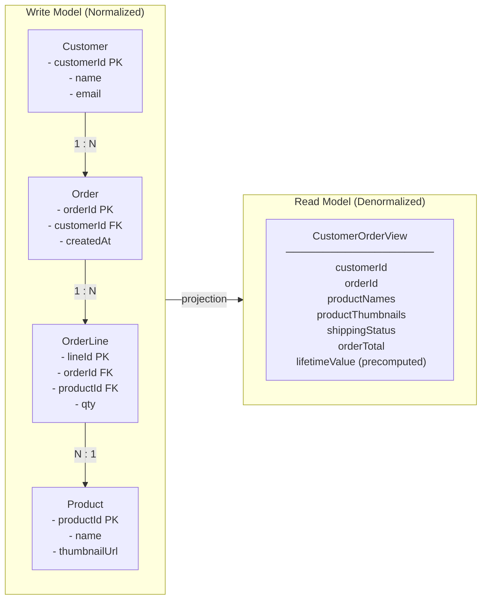
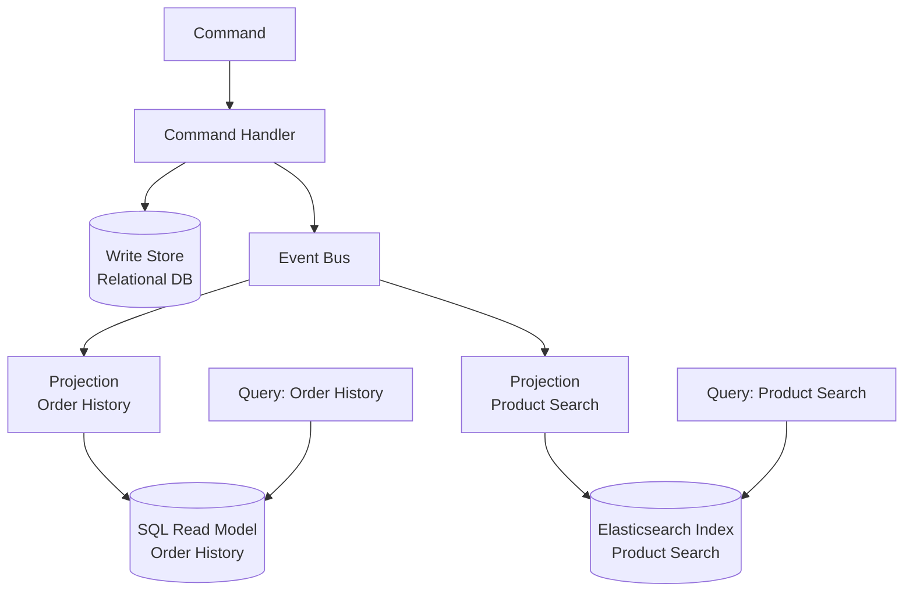
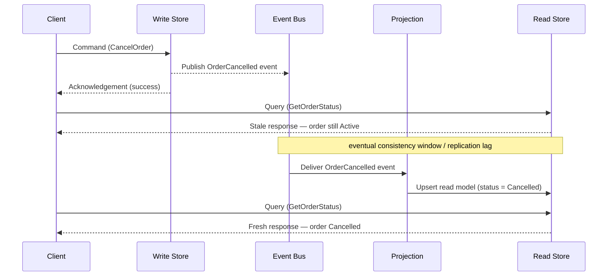

## Diagrams — CQRS — Separating Reads and Writes

### side-by-side comparison (two-column) showing a normalized write model — Order, OrderLine, Product, Customer tables with foreign keys — versus a denormalized read model — a single flat CustomerOrderView document with embedded line items and precomputed lifetime value. Label the arrow between them "projection".

The write model (left) keeps data normalized across four tables to enforce invariants and prevent anomalies; the read model (right) flattens those tables into a single document pre-optimized for the query screen. The "projection" arrow between them represents the event-driven process that continuously derives the read shape from write-side events — this is the structural core of CQRS.

---

### flowchart showing the command path (Command -> Command Handler -> Write Store) emitting an event onto an event bus, then two independent projection consumers reading from the bus and writing into two different read stores (a SQL read model for order history, an Elasticsearch index for product search). Query requests hit the read stores directly, bypassing the write store.

This diagram shows how events produced by the command path fan out to purpose-built projections, each maintaining its own read store optimized for a specific query pattern. It illustrates why CQRS allows the read and write sides to use different storage engines and scale independently.

---

### sequence diagram showing a client sending a command, the write store committing and publishing an event, the client immediately issuing a query that returns stale data, then the projection applying the event, then a second query returning fresh data. Annotate the gap between commit and projection as "eventual consistency window / replication lag".

This sequence diagram makes the eventual-consistency cost of CQRS visible: a query issued immediately after a successful command can return stale data because the projection has not yet processed the event. Understanding this window — and the business tolerance for it — is the key design decision when adopting CQRS.

---
