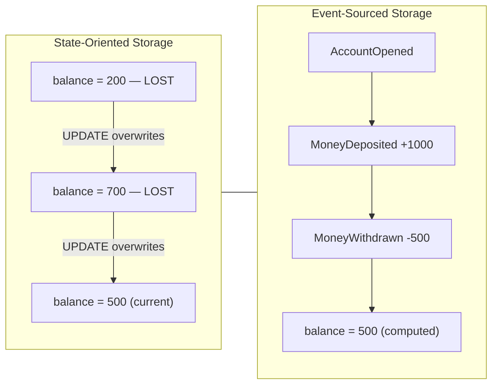
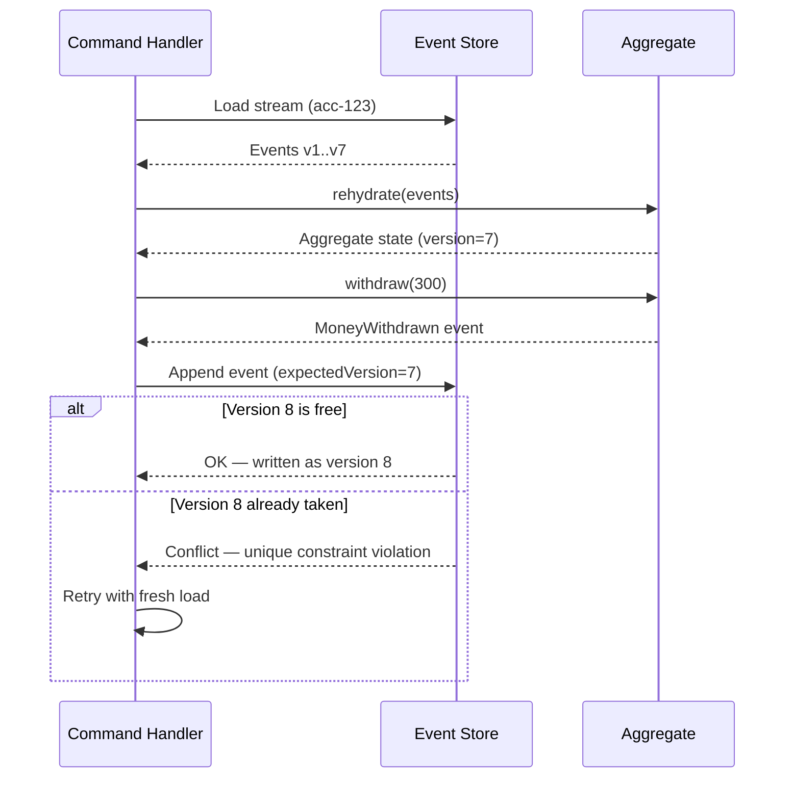
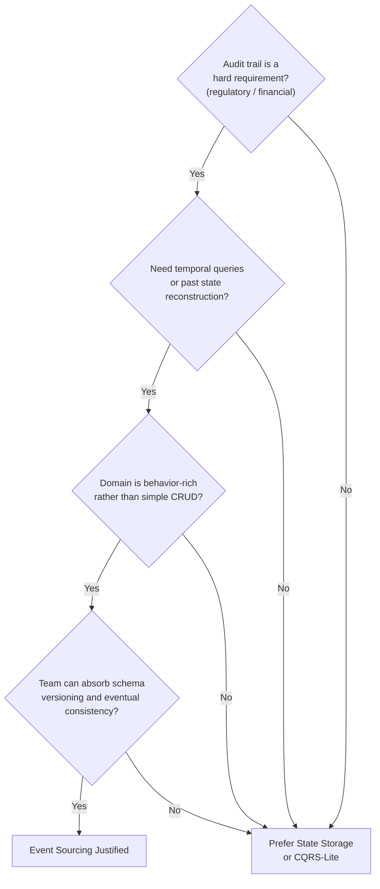

# Chapter 6: Event Sourcing — State as a Sequence of Events

## Opening Problem Statement

Chapter 5 left a loose thread. It showed that read models are disposable — you can throw them away and rebuild them by replaying events. That statement quietly assumed something we never justified: that the events still exist somewhere, in order, forever. If projections are rebuildable from an event log, then that log, and not the read model, is the real source of truth.

This chapter formalizes that idea. **Event Sourcing** is the pattern where the authoritative state of an entity is not a row you update, but the complete, ordered sequence of events that happened to it. You do not store the current balance of an account. You store every deposit and every withdrawal, and you compute the balance when you need it.

For senior architects, the appeal is obvious and the danger is subtle. Event Sourcing gives you a perfect audit trail, temporal queries, and debugging power that traditional systems cannot match. It also imposes constraints that last for the life of the system — schemas you can never fully delete, a mental model your whole team must share, and operational costs that only appear at year three. This chapter teaches both sides honestly.

## The Truth-and-History Problem

Traditional systems have a memory problem: they forget. Consider a classic banking table with a single `balance` column. When a customer withdraws money, you run an `UPDATE` and the previous balance is gone. The database now holds a fact — "the balance is 500" — but it has destroyed the history that produced it.

This is the **truth-and-history problem**: a system that stores only current state can answer *what is true now*, but not *how it became true*. Most of the time nobody asks the second question. Then an auditor, a regulator, or an angry customer does, and the answer is a shrug.

Consider what the update-in-place model throws away every time it runs.

*Figure: Side-by-side comparison of State-Oriented vs Event-Sourced storage — the state-oriented model overwrites history on each UPDATE while the event-sourced model derives the current balance from an immutable append-only log.*



The state-oriented approach optimizes for the present at the expense of the past. Event Sourcing inverts that priority. It treats each **event** — an immutable fact of the past, exactly as defined in Chapter 1 — as the durable unit of truth. Current state becomes a *derived value*, recomputed on demand from the events.

The consequence is strategic, not just technical. In a state-oriented system, history is an afterthought you bolt on with audit tables and triggers, and those audit tables are always slightly wrong. In an event-sourced system, history *is* the storage model. You cannot have incorrect history, because the history is the only thing you ever wrote. Correctness of the audit trail stops being a feature you maintain and becomes a property of the architecture.

That is the trade the pattern offers: you give up the convenience of reading current state directly, and in return you never lose a fact.

> ⚠️ **Critical Note:** The prose states "you cannot have incorrect history, because the history is the only thing you ever wrote" and frames audit-trail correctness as "a property of the architecture." This is a consequential overstatement. Application-layer bugs — emitting a `MoneyWithdrawn` event with the wrong amount, writing to the wrong stream ID, or double-firing a command handler — produce incorrect events that are permanently persisted with the same immutability guarantee as correct ones. The event store enforces append-only and ordering, not domain correctness. A senior engineer who internalizes this claim may dangerously deprioritize command-handler correctness testing and idempotency controls on the grounds that "the store guarantees correctness." The architecture guarantees that every event written is durably preserved exactly as written, eliminating accidental overwrite — but correctness of what is written remains entirely the responsibility of the application. Idempotent command handlers and at-least-once delivery guards are essential to prevent duplicate or incorrect events from becoming permanent facts.

<details>
<summary>💡 Expert Note</summary>
The prose correctly dismisses audit tables as "always slightly wrong," but the failure modes go deeper than most teams expect. Audit triggers miss intermediate states inside multi-statement transactions — if a stored procedure updates three rows and fires one trigger per row, the trigger log records individual row changes but not the single business intent that caused them. More insidiously, when the schema changes (a column is renamed or dropped), the trigger definition silently breaks or starts logging null for that field, and no error is raised. Teams discover this only during an audit, months later, when the log has a systematic gap nobody noticed. Event Sourcing avoids this entirely because the intent — the business event — is what gets written, not the row mutation.
</details>

## The Event Store and the Append-Only Log

The database that holds these events is called an **event store**. It is not a general-purpose table you happen to insert into — it is a specialized log with two rules that define the entire pattern.

First, the event store is **append-only**. You may add events to the end. You may never update or delete an event already written. An event records something that happened, and the past does not change. This is the same immutability principle from Chapter 1, now enforced at the persistence layer.

Second, events are grouped into **streams**. A stream is the ordered sequence of all events for one entity — for example, all events for account `acc-123`. The stream is the unit of consistency and the unit of reconstruction.

A minimal event store schema needs only a handful of columns to enforce these rules.

*Code: SQL DDL for a minimal event store table — `global_position` provides monotone total order across all streams; `UNIQUE (stream_id, version)` enforces per-stream ordering and acts as the optimistic concurrency guard with no application-level locking.*

```python
# ⚠️ LANGUAGE MISMATCH: original was sql, regenerated as python
# Python 3.10+ — event store schema setup using psycopg2
# global_position provides monotone total order across all streams;
# UNIQUE (stream_id, version) enforces per-stream ordering and acts as the
# optimistic concurrency guard with no application-level locking.

import psycopg2

_CREATE_TABLE = """
CREATE TABLE IF NOT EXISTS event_store (
    global_position  BIGSERIAL    PRIMARY KEY,
    stream_id        TEXT         NOT NULL,
    version          INTEGER      NOT NULL,
    event_type       TEXT         NOT NULL,
    payload          JSONB        NOT NULL,
    metadata         JSONB        NOT NULL DEFAULT '{}',
    occurred_at      TIMESTAMPTZ  NOT NULL DEFAULT now(),

    CONSTRAINT uq_stream_version UNIQUE (stream_id, version)
);
"""

_CREATE_INDEX_STREAM = """
CREATE INDEX IF NOT EXISTS idx_event_store_stream
    ON event_store (stream_id, version ASC);
"""

_CREATE_INDEX_GLOBAL = """
CREATE INDEX IF NOT EXISTS idx_event_store_global
    ON event_store (global_position ASC);
"""


def setup_event_store(conn) -> None:
    """
    Create the event_store table and supporting indexes if they do not exist.
    Safe to call on an already-initialised database (uses IF NOT EXISTS).

    Fast stream replay: idx_event_store_stream fetches all events for a stream
    in version order. Subscription catch-up: idx_event_store_global lets
    consumers track their last-seen global_position.
    """
    with conn:
        with conn.cursor() as cur:
            cur.execute(_CREATE_TABLE)
            cur.execute(_CREATE_INDEX_STREAM)
            cur.execute(_CREATE_INDEX_GLOBAL)
```

The `version` column is the quiet hero of that schema. It numbers events within a stream: 1, 2, 3, and so on. The `UNIQUE (stream_id, version)` constraint does two jobs at once. It guarantees a total order inside each stream, and it gives you **optimistic concurrency control** for free.

Here is how the concurrency check works. When a command handler loads a stream, it notes the current highest version — say, 7. It processes the command and tries to append a new event as version 8. If another process already wrote version 8 in the meantime, the unique constraint rejects the insert. The handler knows its decision was based on stale data and retries. No locks, no blocking — just a constraint doing its job.

*Code: Optimistic concurrency append — raises `ConcurrencyConflictError` when another writer has already claimed the expected version; the caller should reload the stream and retry the command.*

```python
# Python 3.10+ — optimistic concurrency append using psycopg2 and PostgreSQL
# Raises ConcurrencyConflictError when another writer has already claimed the expected version.

from __future__ import annotations

import json
from dataclasses import dataclass, field
from typing import Any

import psycopg2
from psycopg2 import errors as pg_errors


@dataclass
class EventRecord:
    stream_id:  str
    event_type: str
    payload:    dict[str, Any]
    metadata:   dict[str, Any] = field(default_factory=dict)


class ConcurrencyConflictError(Exception):
    """Raised when another writer already appended at the expected version.
    The caller should reload the stream and retry the command."""


def append_events(
    conn,
    stream_id:        str,
    events:           list[EventRecord],
    expected_version: int,          # highest version seen when the command was loaded
) -> None:
    """
    Appends `events` to `stream_id` starting at expected_version + 1.
    All inserts run inside a single transaction; a unique-constraint violation
    signals a concurrent write and triggers a rollback.
    """
    with conn:                       # psycopg2 context manager: commit or rollback
        with conn.cursor() as cur:
            for offset, event in enumerate(events):
                next_version = expected_version + 1 + offset  # 1-based, increments per event

                try:
                    cur.execute(
                        """
                        INSERT INTO event_store
                            (stream_id, version, event_type, payload, metadata)
                        VALUES (%s, %s, %s, %s::jsonb, %s::jsonb)
                        """,
                        (
                            stream_id,
                            next_version,
                            event.event_type,
                            json.dumps(event.payload),
                            json.dumps(event.metadata),
                        ),
                    )
                except pg_errors.UniqueViolation:
                    # Another process already wrote at this version; the caller must retry.
                    raise ConcurrencyConflictError(
                        f"Concurrency conflict on stream '{stream_id}': "
                        f"expected version {expected_version} is stale. Reload and retry."
                    )
```

A word of realism for architects choosing infrastructure. You can build an event store on plain PostgreSQL, and for many corporate systems you should — the operational familiarity is worth more than any specialized feature. Purpose-built stores such as EventStoreDB or Axon Server, or cloud primitives like DynamoDB with a partition-plus-sort-key design, add subscription and projection tooling. But none of them changes the two rules above. Append-only and ordered-by-stream are the whole game.

> 💡 **Expert Note:** The `global_position` column in the schema is easy to misimplement on PostgreSQL with a `BIGSERIAL` or `SEQUENCE`, creating a silent production hazard. PostgreSQL sequences are non-transactional by design: if a transaction inserts an event and then rolls back, the sequence value is consumed and not reused. Consumers reading `global_position` in order will see gaps (e.g., positions 1, 2, 4 — position 3 was a rolled-back insert) and must decide whether a gap means "not yet committed" or "permanently missing." The standard production fix is to use a replication-slot-based change-data-capture approach (e.g., `pg_logical`) or to track the global order through a separate, lock-protected counter table flushed only on commit. EventStoreDB sidesteps this by handling position assignment inside its own transaction log. Choose your infrastructure knowing this gap problem exists on plain SQL stores.

<details>
<summary>💡 Expert Note</summary>
When comparing EventStoreDB against a homegrown PostgreSQL store, the practical corporate differentiator is subscription semantics, not storage. EventStoreDB's persistent subscriptions support a competing-consumer model per group natively, but their projection engine (historically JavaScript-based server-side projections) introduces an operational burden — a second runtime to monitor, version, and debug — that most enterprise teams underestimate. For organizations already standardising on Kafka, treating the event store as the authoritative append-only log and Kafka as the subscription/fan-out layer is a common hybrid that preserves familiarity. The two layers have different guarantees (exactly-once append vs. at-least-once delivery) and must be wired accordingly.
</details>

<details>
<summary>⚠️ Critical Note</summary>
The claim "no locks, no blocking — just a constraint doing its job" overstates the benefit of optimistic concurrency under contention. In high-throughput write scenarios on a single aggregate stream — for example, a shared account receiving concurrent payment events — every conflicting writer will retry. Under sustained contention this degrades to effective serialization: all writers spin, reload the stream, reprocess the command, and retry the insert. Retry storms can be worse than a fair queue with a single lock, and the application must bound retries and handle persistent concurrency-conflict errors. This failure mode is invisible on the happy path but material in production. Optimistic concurrency works best when conflicting writers on the same stream are rare. For hot streams, consider command de-duplication at the handler level, stream partitioning, or explicit locking strategies, and always guard against unbounded retries with a max-retry count and backoff.
</details>

## State Reconstruction and Aggregates

If you never store current state, how do you get it? You compute it. The process is called **reconstruction** or **rehydration**: you read the stream from the beginning and apply each event, in order, to a fresh in-memory object. That object is the **aggregate** — the consistency boundary from Domain-Driven Design that owns the business rules for one entity.

Reconstruction is a fold. You start with an empty aggregate and, event by event, fold each fact into the aggregate's state.

*Code: Account aggregate with strict command/apply separation — `rehydrate()` folds the full event stream into a live aggregate at O(n) in stream length.*

```python
# Python 3.10+ — Account aggregate with strict command / apply separation
# rehydrate() folds the full event stream into a live aggregate; O(n) in stream length.

from __future__ import annotations

from dataclasses import dataclass, field
from typing import Union


# ---------------------------------------------------------------------------
# Immutable event types — historical facts, never mutated after creation
# ---------------------------------------------------------------------------

@dataclass(frozen=True)
class AccountOpened:
    account_id: str
    owner:      str

@dataclass(frozen=True)
class MoneyDeposited:
    account_id: str
    amount:     int  # in cents; always positive

@dataclass(frozen=True)
class MoneyWithdrawn:
    account_id: str
    amount:     int  # in cents; always positive

DomainEvent = Union[AccountOpened, MoneyDeposited, MoneyWithdrawn]


# ---------------------------------------------------------------------------
# Aggregate
# ---------------------------------------------------------------------------

@dataclass
class Account:
    account_id: str  = ""
    owner:      str  = ""
    balance:    int  = 0    # in cents
    version:    int  = 0
    _pending:   list[DomainEvent] = field(default_factory=list, repr=False)

    # ---- Command methods: validate invariants, then record a new event ----

    @classmethod
    def open(cls, account_id: str, owner: str) -> "Account":
        """Command: open a new account."""
        aggregate = cls()
        aggregate._record(AccountOpened(account_id=account_id, owner=owner))
        return aggregate

    def deposit(self, amount: int) -> None:
        """Command: credit the account."""
        if amount <= 0:
            raise ValueError(f"Deposit amount must be positive, got {amount}.")
        self._record(MoneyDeposited(account_id=self.account_id, amount=amount))

    def withdraw(self, amount: int) -> None:
        """Command: debit the account; rejects if funds are insufficient."""
        if amount <= 0:
            raise ValueError(f"Withdrawal amount must be positive, got {amount}.")
        if amount > self.balance:
            raise ValueError(
                f"Insufficient funds: balance={self.balance} cents, requested={amount} cents."
            )
        self._record(MoneyWithdrawn(account_id=self.account_id, amount=amount))

    # ---- Apply methods: pure state mutation — NO validation, NEVER reject ----

    def _apply(self, event: DomainEvent) -> None:
        """Mutate in-memory state from an already-decided event. Must never raise."""
        match event:
            case AccountOpened(account_id=aid, owner=owner):
                self.account_id = aid
                self.owner      = owner
                self.balance    = 0
            case MoneyDeposited(amount=amount):
                self.balance += amount
            case MoneyWithdrawn(amount=amount):
                self.balance -= amount

    def _record(self, event: DomainEvent) -> None:
        """Apply a new event to in-memory state and stage it for persistence."""
        self._apply(event)
        self._pending.append(event)

    # ---- Rehydration: reconstruct from a stored event stream ----

    @classmethod
    def rehydrate(cls, events: list[DomainEvent]) -> "Account":
        """
        Fold a complete event stream into a live Account aggregate.
        Time complexity: O(n) where n = len(events).
        """
        aggregate = cls()
        for i, event in enumerate(events, start=1):
            aggregate._apply(event)  # apply history — no validation
            aggregate.version = i    # track stream position for optimistic concurrency
        return aggregate
```

Notice the discipline this enforces. There are exactly two kinds of methods on the aggregate, and confusing them is the most common Event Sourcing bug.

1. **Command methods** (for example, `withdraw`) contain the business rules. They validate invariants — "you cannot withdraw more than the balance" — and, if the rule holds, they *produce a new event*. They decide what should happen.
2. **Apply methods** (for example, `applyMoneyWithdrawn`) contain no business logic at all. They only mutate in-memory state from an event that has *already happened*. They record what did happen.

The rule is absolute: **apply methods must never reject an event or contain validation.** The event is a historical fact. Refusing to apply it during reconstruction would mean refusing to acknowledge the past, and your rebuilt state would silently diverge from reality. All validation lives in command methods, before the event exists.

*Figure: Sequence diagram of a write — from stream loading through aggregate rehydration, invariant validation, and optimistic-concurrency-controlled append, showing where validation lives and where the unique-constraint concurrency guard fires.*



This is where Event Sourcing and CQRS from Chapter 5 lock together. The command side reconstructs the aggregate to make a decision and emits an event. That same event feeds the projections that build the read models. One event, written once, serves both truth and query. The event log becomes the single source that CQRS's disposable read models are rebuilt from.

<details>
<summary>💡 Expert Note</summary>
The prose describes command methods as methods that "produce a new event," but the standard implementation pattern adds a structural detail that changes how the aggregate interacts with its repository: the aggregate holds an internal list of "uncommitted events." When a command method decides to accept a business action, it calls its own `apply()` internally — to update in-memory state immediately — and appends the event to this uncommitted list. The repository, after calling the command, reads the uncommitted list, appends those events to the store at the expected version, then clears the list. This two-phase design (apply-now, flush-later) is why command methods can chain decisions within a single unit of work and why the aggregate never knows about the database. Omitting this pattern leads teams to either re-load the aggregate between commands in the same request or to call `apply()` twice (once in the command, once during reconstruction), causing double-mutation bugs.
</details>

<details>
<summary>⚠️ Critical Note</summary>
The rule "apply methods must never reject an event or contain validation" is described as absolute, but it does not address the forward-compatibility scenario where an aggregate encounters an event type introduced by a newer version of the application that the current code does not recognize. Silently ignoring unknown event types during rehydration can produce subtly wrong in-memory state; hard-failing on unknown types breaks reconstruction entirely. This is a real operational problem during rolling deployments and schema migrations. Apply methods must not reject *known* events or apply business validation to them. For unknown or unrecognized event types, the recommended strategy is ignore-and-log with a version-awareness check. Chapter 8 addresses schema versioning formally.
</details>

## Snapshots and Replay Optimization

Reconstruction has an obvious flaw, and every skeptic spots it immediately. If an account has 200,000 events accumulated over ten years, must you read and fold all 200,000 events every time someone checks the balance? At that volume, reconstruction turns a millisecond operation into a multi-second one.

The answer is the **snapshot**. A snapshot is a cached copy of the aggregate's state at a specific version — a checkpoint that says "at version 50,000, the balance was 12,340." Reconstruction then changes: load the latest snapshot, then replay only the events that came *after* it.

*Code: Snapshot-based rehydration with full-replay fallback — the snapshot is a disposable optimization; deleting all snapshots must leave behaviour unchanged.*

```python
# Python 3.10+ — snapshot-based rehydration with full-replay fallback
# Snapshot is a disposable optimisation; deleting all snapshots must leave behaviour unchanged.

from __future__ import annotations

import json
from dataclasses import dataclass
from typing import Any, Optional

# Re-uses Account, DomainEvent defined in the aggregate example above.


# ---------------------------------------------------------------------------
# Snapshot data contract
# ---------------------------------------------------------------------------

@dataclass
class Snapshot:
    stream_id: str
    version:   int            # aggregate version at time the snapshot was taken
    state:     dict[str, Any] # serialised aggregate fields (excludes _pending)


# ---------------------------------------------------------------------------
# Storage helpers — replace with real persistence in production
# ---------------------------------------------------------------------------

def load_latest_snapshot(stream_id: str) -> Optional[Snapshot]:
    """Return the most recent snapshot for the stream, or None if none exists."""
    raise NotImplementedError  # implement against your snapshot store


def load_events_after_version(stream_id: str, after_version: int) -> list[DomainEvent]:
    """Return events where version > after_version, ordered ascending by version."""
    raise NotImplementedError  # implement against the event_store table


# ---------------------------------------------------------------------------
# Rehydration with snapshot shortcut
# ---------------------------------------------------------------------------

def rehydrate_from_snapshot(stream_id: str) -> Account:
    """
    Reconstruct an Account aggregate, using a snapshot when available.

    Steps:
      1. Load the most recent snapshot for the stream.
      2. If found: restore aggregate state from the snapshot, then replay
         only the events written after snapshot.version.
      3. If not found: fall back to full replay from the start of the stream.

    The snapshot is purely an optimisation — deleting it produces the same
    aggregate state, just more slowly.
    """
    snapshot: Optional[Snapshot] = load_latest_snapshot(stream_id)

    if snapshot is not None:
        # Fast path: restore from checkpoint, then apply the delta only
        aggregate = Account(
            account_id=snapshot.state["account_id"],
            owner=snapshot.state["owner"],
            balance=snapshot.state["balance"],
        )
        aggregate.version = snapshot.version
        delta_events = load_events_after_version(stream_id, after_version=snapshot.version)
    else:
        # Slow path: no snapshot exists — replay the full stream from scratch
        aggregate = Account()
        delta_events = load_events_after_version(stream_id, after_version=0)

    # Fold the delta (or full stream) onto the aggregate state
    for event in delta_events:
        aggregate._apply(event)   # pure mutation, no validation
        aggregate.version += 1

    return aggregate


def maybe_take_snapshot(aggregate: Account, interval: int = 100) -> Optional[Snapshot]:
    """
    Policy: create a new snapshot every `interval` events.
    Caller is responsible for persisting the returned snapshot.
    Returns None when the version does not fall on a snapshot boundary.
    """
    if aggregate.version > 0 and aggregate.version % interval == 0:
        return Snapshot(
            stream_id=aggregate.account_id,
            version=aggregate.version,
            state={
                "account_id": aggregate.account_id,
                "owner":      aggregate.owner,
                "balance":    aggregate.balance,
            },
        )
    return None
```

Two design points separate a working snapshot strategy from a broken one.

- **A snapshot is a derived optimization, never a source of truth.** You must be able to delete every snapshot in the system and rebuild all of them from events alone. If deleting snapshots loses data, you have accidentally reintroduced the state-oriented model you were trying to escape.
- **Snapshot on a cadence, not on every write.** A common policy is one snapshot every *N* events per stream — say, every 100. The number is a tuning knob, not a constant.

The following table frames the trade-off you are actually tuning.

| Snapshot frequency | Replay cost per load | Storage & write overhead | Best fit |
|---|---|---|---|
| Never (pure replay) | Grows without bound | None | Short streams, low event counts |
| Every N events (e.g., 100) | Bounded, small | Moderate | Most production systems |
| Every event | Near zero | High; approaches state storage | Almost never — a code smell |

The last row is worth a **Pro Tip**. If your instinct is to snapshot on every single write, stop. You have rebuilt an update-in-place database with extra steps and worse performance. The point of snapshots is to make replay *acceptable*, not to eliminate it. Reach for snapshots only when measurement proves reconstruction is too slow — and for aggregates with short lifespans and few events, you may never need them at all.

> 💡 **Expert Note:** A bug in any `apply()` method that goes undetected for weeks will silently corrupt every snapshot generated during that period. When the bug is fixed, the corrected apply logic produces different in-memory state than the stored snapshot reflects, and reconstruction that starts from a stale snapshot will produce wrong results without raising an error — the corrupted snapshot is structurally valid JSON. The production fix is to attach a `snapshot_schema_version` (an integer you increment whenever apply logic changes semantics) to every snapshot row. On load, if `snapshot_schema_version` does not match the current code version, discard the snapshot and fall back to full replay. This adds one config constant and one comparison but makes snapshot invalidation automatic and safe during deploys.

<details>
<summary>💡 Expert Note</summary>
The prose frames snapshotting as a tuning knob on read, but it matters equally on the write path. A naive implementation takes a snapshot synchronously inside the same transaction that appends the event — doubling write latency on every Nth event. Production systems almost universally make snapshotting asynchronous: a background worker (or a projection that reads the event stream) detects that a stream has advanced past a threshold and writes the snapshot out-of-band. The command path stays fast and predictable; the snapshot may lag by a few seconds, which is acceptable because reconstruction always falls back to replay if a snapshot is absent or stale.
</details>

<details>
<summary>⚠️ Critical Note</summary>
The snapshot strategy discussion omits a critical operational question: who writes the snapshot, and what happens if that write fails? If the command handler writes the snapshot synchronously after appending an event, a snapshot write failure must not be treated as a command failure — or command processing becomes unreliable. If snapshots are written by an asynchronous background process, there is a window where the snapshot store is stale or empty and full replay is silently required. Snapshots should be written as best-effort, non-transactional operations that never block or fail the command pipeline. The code should always fall back to full replay if a snapshot is missing or its version is not present in the event store, treating the snapshot as an advisory cache rather than a required dependency.
</details>

## Long-Term Costs and Design Constraints

Event Sourcing is not a technique you try for a sprint and back out of cleanly. Once real events accumulate, the pattern becomes load-bearing, and its costs are structural. An honest architect weighs them before adopting, not after.

**Events are permanent, so their schemas are permanent.** A row you no longer like can be migrated with an `ALTER TABLE`. An event written in 2024 will still be read during reconstruction in 2030, exactly as it was written. You cannot migrate the past. You accommodate old shapes through versioning and upcasting — the entire subject of Chapter 8 — and that discipline is mandatory, not optional.

**Deletion becomes a real design problem.** Regulations such as GDPR grant a right to erasure, which collides head-on with an append-only, immutable log. You cannot simply delete the events. The standard answer is **crypto-shredding**: encrypt personal data per subject and delete the key to render the data unrecoverable. This must be designed in from the first event, because you cannot retrofit encryption onto facts already written in plaintext.

**Querying current state requires the read side.** Since state is derived, you cannot write a simple `SELECT balance FROM accounts`. You need projections and read models — which is precisely why Event Sourcing and CQRS are so often adopted together. Choosing Event Sourcing effectively commits you to the CQRS read path from Chapter 5.

*Figure: Decision flowchart for adopting Event Sourcing — routes toward adoption only when all four qualifying conditions hold and toward lighter alternatives otherwise.*



The blunt guidance for senior architects: Event Sourcing earns its keep in domains where history is intrinsically valuable — ledgers, trading, insurance, medical records, order lifecycles — and where the business genuinely asks *how did we get here*. For a CRUD-shaped domain whose users never ask about the past, it is over-engineering with a decade-long maintenance tail. Adopt it where the audit trail is the product, not where it is a novelty.

> 💡 **Expert Note:** Crypto-shredding as described is correct but understates a critical implementation constraint: the scope of what must be encrypted is wider than most teams anticipate. Personal data cannot appear anywhere outside the encrypted payload — not in the event type name, not in metadata fields (correlation IDs, user-agent strings, IP addresses logged as metadata), and not in stream IDs that encode a username or email. A stream ID of `user-john.doe@example.com` cannot be shredded; the identifier itself is personal data and will persist in every event header, every snapshot row, and every projection row forever. The architectural discipline is to use opaque, surrogate identifiers (UUIDs) as stream IDs from day one and to store a separate subject-keyed encryption key per data subject in a dedicated key management service (AWS KMS, HashiCorp Vault) before writing the first event. Retrofitting this onto an existing event store is effectively impossible without rewriting history, which the pattern prohibits.

<details>
<summary>⚠️ Critical Note</summary>
The prose cites medical records as a canonical domain where Event Sourcing "earns its keep" because history is intrinsically valuable. This is the same domain where HIPAA and GDPR create a right-to-erasure obligation and where data correction (amending a clinical entry) is a routine operational requirement. The immutability of Event Sourcing is in direct tension with both. Crypto-shredding handles GDPR erasure in principle, but clinical correction — where a misdiagnosis event must be amended, not just superseded — requires compensating events and careful read-model logic to surface the corrected state. Presenting medical records as a straightforward fit for Event Sourcing without this caveat could lead a reader to underestimate the regulatory complexity. Regulated domains requiring correction or erasure workflows demand explicit design: compensating events for corrections, crypto-shredding for deletion, and read models that correctly surface only the authoritative current record. Financial ledgers and order lifecycle are cleaner canonical examples since those domains have the weakest deletion requirements.
</details>

## Key Takeaways

- Event Sourcing stores every state-changing event as immutable fact and derives current state by replay, solving the truth-and-history problem that update-in-place systems create by forgetting the past.
- The **event store** is append-only and organized into per-entity **streams**; a `UNIQUE (stream_id, version)` constraint enforces both ordering and lock-free optimistic concurrency.
- Aggregates are **rehydrated** by folding events in order; command methods validate invariants and emit events, while apply methods only mutate state and must never reject a fact.
- **Snapshots** bound replay cost by checkpointing state every N events, but they are disposable optimizations — never a source of truth, and never taken on every write.
- The costs are permanent schemas, hard deletion (crypto-shredding), and a mandatory read side; adopt Event Sourcing only where history is genuinely valuable to the business.

## What's Next

Chapter 7 confronts what happens when a single business process spans multiple aggregates and services, introducing sagas to coordinate transactions under eventual consistency instead of distributed ACID.

<!-- ASSEMBLY COMPLETE
  Chapter: Event Sourcing — State as a Sequence of Events
  Code blocks resolved: 4 / 4
  Diagrams resolved: 3 / 3
  Expert callouts (inline): 3
  Expert callouts (collapsed): 4
  Critical callouts (inline): 1
  Critical callouts (collapsed): 4
  Unresolved markers: 0
-->
