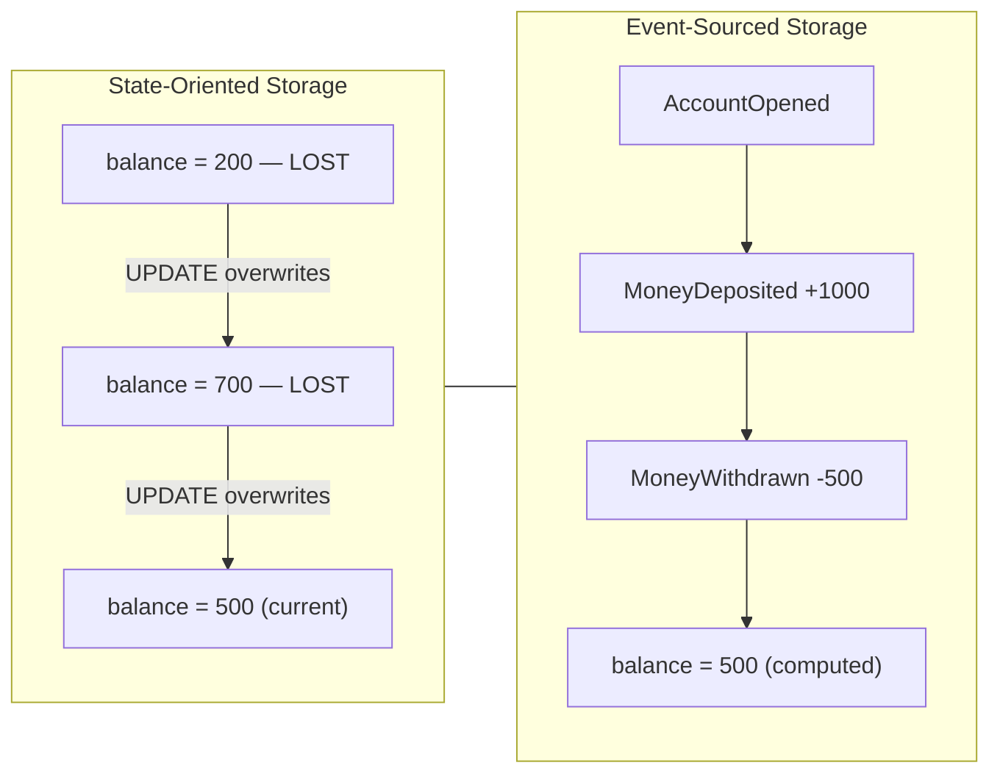
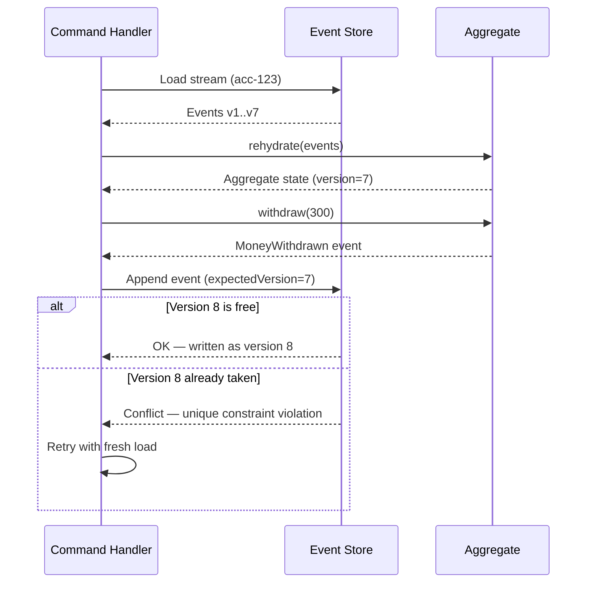
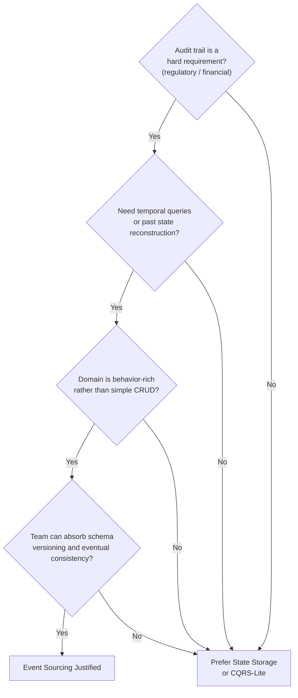

# Capítulo 6: Event Sourcing — El Estado como una Secuencia de Eventos

## Planteamiento del Problema Inicial

El Capítulo 5 dejó un hilo suelto. Mostró que los modelos de lectura son descartables — puedes eliminarlos y reconstruirlos reproduciendo eventos. Esa afirmación asumía en silencio algo que nunca justificamos: que los eventos siguen existiendo en algún lugar, en orden, para siempre. Si las proyecciones se pueden reconstruir desde un registro de eventos, entonces ese registro, y no el modelo de lectura, es la verdadera fuente de verdad.

Este capítulo formaliza esa idea. **Event Sourcing** (almacenamiento de eventos) es el patrón en el que el estado autoritativo de una entidad no es una fila que se actualiza, sino la secuencia completa y ordenada de eventos que le ocurrieron. No almacenas el saldo actual de una cuenta. Almacenas cada depósito y cada retiro, y calculas el saldo cuando lo necesitas.

Para los arquitectos senior, el atractivo es obvio y el peligro es sutil. Event Sourcing te proporciona una trazabilidad perfecta, consultas temporales y poder de depuración que los sistemas tradicionales no pueden igualar. También impone restricciones que duran toda la vida del sistema — esquemas que nunca podrás eliminar completamente, un modelo mental que todo el equipo debe compartir y costos operacionales que solo aparecen en el año tres. Este capítulo enseña ambos lados con honestidad.

## El Problema de la Verdad y la Historia

Los sistemas tradicionales tienen un problema de memoria: olvidan. Considera una tabla bancaria clásica con una sola columna `balance`. Cuando un cliente retira dinero, ejecutas un `UPDATE` y el saldo anterior desaparece. La base de datos ahora contiene un hecho — "el saldo es 500" — pero ha destruido la historia que lo produjo.

Este es el **problema de la verdad y la historia**: un sistema que solo almacena el estado actual puede responder *qué es verdad ahora*, pero no *cómo llegó a ser verdad*. La mayoría de las veces nadie hace la segunda pregunta. Entonces lo hace un auditor, un regulador o un cliente molesto, y la respuesta es un encogimiento de hombros.

Considera lo que el modelo de actualización en el lugar desecha cada vez que se ejecuta.

*Figura: Comparación lado a lado del almacenamiento orientado al estado vs. orientado a eventos — el modelo orientado al estado sobreescribe la historia en cada UPDATE, mientras que el modelo basado en eventos deriva el saldo actual de un registro inmutable de solo adición.*



El enfoque orientado al estado optimiza para el presente a expensas del pasado. Event Sourcing invierte esa prioridad. Trata cada **evento** — un hecho inmutable del pasado, exactamente como se definió en el Capítulo 1 — como la unidad duradera de verdad. El estado actual se convierte en un *valor derivado*, recalculado bajo demanda a partir de los eventos.

La consecuencia es estratégica, no solo técnica. En un sistema orientado al estado, la historia es un añadido que se implementa con tablas de auditoría y triggers, y esas tablas de auditoría siempre están ligeramente equivocadas. En un sistema basado en Event Sourcing, la historia *es* el modelo de almacenamiento. No puedes tener una historia incorrecta, porque la historia es lo único que alguna vez escribiste. La corrección del registro de auditoría deja de ser una característica que se mantiene y se convierte en una propiedad de la arquitectura.

Eso es el intercambio que ofrece el patrón: renuncias a la conveniencia de leer el estado actual directamente y, a cambio, nunca pierdes un hecho.

> ⚠️ **Nota Crítica:** El texto afirma "no puedes tener una historia incorrecta, porque la historia es lo único que alguna vez escribiste" y encuadra la corrección del registro de auditoría como "una propiedad de la arquitectura." Esto es una exageración significativa. Los errores en la capa de aplicación — emitir un evento `MoneyWithdrawn` con el monto incorrecto, escribir en el ID de flujo equivocado o disparar dos veces un manejador de comandos — producen eventos incorrectos que se persisten de forma permanente con la misma garantía de inmutabilidad que los eventos correctos. El almacén de eventos garantiza solo adición y ordenamiento, no la corrección del dominio. Un ingeniero senior que interioriza esta afirmación puede priorizar peligrosamente menos las pruebas de corrección del manejador de comandos y los controles de idempotencia bajo el argumento de que "el almacén garantiza la corrección." La arquitectura garantiza que cada evento escrito se preserve de forma duradera exactamente como fue escrito, eliminando la sobreescritura accidental — pero la corrección de lo que se escribe sigue siendo enteramente responsabilidad de la aplicación. Los manejadores de comandos idempotentes y las protecciones contra entrega al menos una vez son esenciales para evitar que eventos duplicados o incorrectos se conviertan en hechos permanentes.

<details>
<summary>💡 Nota del Experto</summary>
El texto descarta correctamente las tablas de auditoría como "siempre ligeramente equivocadas," pero los modos de fallo van más profundo de lo que la mayoría de los equipos espera. Los triggers de auditoría omiten los estados intermedios dentro de las transacciones de múltiples declaraciones — si un procedimiento almacenado actualiza tres filas y dispara un trigger por fila, el registro del trigger captura los cambios individuales de filas, pero no la única intención de negocio que los causó. Más insidiosamente, cuando cambia el esquema (se renombra o elimina una columna), la definición del trigger se rompe silenciosamente o comienza a registrar null para ese campo, sin que se genere ningún error. Los equipos descubren esto solo durante una auditoría, meses después, cuando el registro tiene una brecha sistemática que nadie notó. Event Sourcing evita esto por completo porque la intención — el evento de negocio — es lo que se escribe, no la mutación de la fila.
</details>

## El Almacén de Eventos y el Registro de Solo Adición

La base de datos que contiene estos eventos se denomina **almacén de eventos** (event store). No es una tabla de propósito general en la que simplemente insertas — es un registro especializado con dos reglas que definen todo el patrón.

Primero, el almacén de eventos es de **solo adición** (append-only). Puedes añadir eventos al final. Nunca puedes actualizar ni eliminar un evento ya escrito. Un evento registra algo que ocurrió, y el pasado no cambia. Este es el mismo principio de inmutabilidad del Capítulo 1, ahora aplicado en la capa de persistencia.

Segundo, los eventos se agrupan en **flujos** (streams). Un flujo es la secuencia ordenada de todos los eventos de una entidad — por ejemplo, todos los eventos de la cuenta `acc-123`. El flujo es la unidad de consistencia y la unidad de reconstrucción.

Un esquema mínimo de almacén de eventos solo necesita un puñado de columnas para aplicar estas reglas.

*Código: DDL SQL para una tabla mínima de almacén de eventos — `global_position` proporciona un orden total monotónico en todos los flujos; `UNIQUE (stream_id, version)` garantiza el ordenamiento por flujo y actúa como protección de concurrencia optimista sin bloqueos a nivel de aplicación.*

```python
# ⚠️ LANGUAGE MISMATCH: original was sql, regenerated as python
# Python 3.10+ — event store schema setup using psycopg2
# global_position provides monotone total order across all streams;
# UNIQUE (stream_id, version) enforces per-stream ordering and acts as the
# optimistic concurrency guard with no application-level locking.

import psycopg2

_CREATE_TABLE = """
CREATE TABLE IF NOT EXISTS event_store (
    global_position  BIGSERIAL    PRIMARY KEY,
    stream_id        TEXT         NOT NULL,
    version          INTEGER      NOT NULL,
    event_type       TEXT         NOT NULL,
    payload          JSONB        NOT NULL,
    metadata         JSONB        NOT NULL DEFAULT '{}',
    occurred_at      TIMESTAMPTZ  NOT NULL DEFAULT now(),

    CONSTRAINT uq_stream_version UNIQUE (stream_id, version)
);
"""

_CREATE_INDEX_STREAM = """
CREATE INDEX IF NOT EXISTS idx_event_store_stream
    ON event_store (stream_id, version ASC);
"""

_CREATE_INDEX_GLOBAL = """
CREATE INDEX IF NOT EXISTS idx_event_store_global
    ON event_store (global_position ASC);
"""


def setup_event_store(conn) -> None:
    """
    Create the event_store table and supporting indexes if they do not exist.
    Safe to call on an already-initialised database (uses IF NOT EXISTS).

    Fast stream replay: idx_event_store_stream fetches all events for a stream
    in version order. Subscription catch-up: idx_event_store_global lets
    consumers track their last-seen global_position.
    """
    with conn:
        with conn.cursor() as cur:
            cur.execute(_CREATE_TABLE)
            cur.execute(_CREATE_INDEX_STREAM)
            cur.execute(_CREATE_INDEX_GLOBAL)
```

La columna `version` es el héroe silencioso de ese esquema. Numera los eventos dentro de un flujo: 1, 2, 3 y así sucesivamente. La restricción `UNIQUE (stream_id, version)` realiza dos trabajos a la vez. Garantiza un orden total dentro de cada flujo y te proporciona **control de concurrencia optimista** de forma gratuita.

Así es como funciona la verificación de concurrencia. Cuando un manejador de comandos carga un flujo, anota la versión más alta actual — digamos, 7. Procesa el comando e intenta añadir un nuevo evento como versión 8. Si otro proceso ya escribió la versión 8 mientras tanto, la restricción única rechaza la inserción. El manejador sabe que su decisión se basó en datos desactualizados y reintenta. Sin bloqueos, sin espera — solo una restricción haciendo su trabajo.

*Código: Adición con concurrencia optimista — lanza `ConcurrencyConflictError` cuando otro escritor ya ha reclamado la versión esperada; el llamador debe recargar el flujo y reintentar el comando.*

```python
# Python 3.10+ — optimistic concurrency append using psycopg2 and PostgreSQL
# Raises ConcurrencyConflictError when another writer has already claimed the expected version.

from __future__ import annotations

import json
from dataclasses import dataclass, field
from typing import Any

import psycopg2
from psycopg2 import errors as pg_errors


@dataclass
class EventRecord:
    stream_id:  str
    event_type: str
    payload:    dict[str, Any]
    metadata:   dict[str, Any] = field(default_factory=dict)


class ConcurrencyConflictError(Exception):
    """Raised when another writer already appended at the expected version.
    The caller should reload the stream and retry the command."""


def append_events(
    conn,
    stream_id:        str,
    events:           list[EventRecord],
    expected_version: int,          # highest version seen when the command was loaded
) -> None:
    """
    Appends `events` to `stream_id` starting at expected_version + 1.
    All inserts run inside a single transaction; a unique-constraint violation
    signals a concurrent write and triggers a rollback.
    """
    with conn:                       # psycopg2 context manager: commit or rollback
        with conn.cursor() as cur:
            for offset, event in enumerate(events):
                next_version = expected_version + 1 + offset  # 1-based, increments per event

                try:
                    cur.execute(
                        """
                        INSERT INTO event_store
                            (stream_id, version, event_type, payload, metadata)
                        VALUES (%s, %s, %s, %s::jsonb, %s::jsonb)
                        """,
                        (
                            stream_id,
                            next_version,
                            event.event_type,
                            json.dumps(event.payload),
                            json.dumps(event.metadata),
                        ),
                    )
                except pg_errors.UniqueViolation:
                    # Another process already wrote at this version; the caller must retry.
                    raise ConcurrencyConflictError(
                        f"Concurrency conflict on stream '{stream_id}': "
                        f"expected version {expected_version} is stale. Reload and retry."
                    )
```

Una nota de realismo para los arquitectos que eligen infraestructura. Puedes construir un almacén de eventos sobre PostgreSQL simple, y para muchos sistemas corporativos deberías hacerlo — la familiaridad operacional vale más que cualquier característica especializada. Los almacenes de propósito específico como EventStoreDB o Axon Server, o primitivas en la nube como DynamoDB con un diseño de clave de partición más clave de ordenamiento, añaden herramientas de suscripción y proyección. Pero ninguno de ellos cambia las dos reglas anteriores. Solo adición y ordenado por flujo son todo el juego.

> 💡 **Nota del Experto:** La columna `global_position` en el esquema es fácil de implementar incorrectamente en PostgreSQL con un `BIGSERIAL` o `SEQUENCE`, creando un riesgo silencioso en producción. Las secuencias de PostgreSQL son no transaccionales por diseño: si una transacción inserta un evento y luego hace rollback, el valor de la secuencia se consume y no se reutiliza. Los consumidores que leen `global_position` en orden verán brechas (p. ej., posiciones 1, 2, 4 — la posición 3 fue una inserción con rollback) y deben decidir si una brecha significa "aún no confirmado" o "permanentemente faltante." La solución estándar en producción es usar un enfoque de captura de cambios de datos (CDC) basado en ranuras de replicación (p. ej., `pg_logical`) o rastrear el orden global a través de una tabla de contador separada y protegida por bloqueo que se vacía solo en el commit. EventStoreDB evita esto gestionando la asignación de posiciones dentro de su propio registro de transacciones. Elige tu infraestructura sabiendo que este problema de brechas existe en los almacenes SQL simples.

<details>
<summary>💡 Nota del Experto</summary>
Al comparar EventStoreDB con un almacén PostgreSQL hecho en casa, el diferenciador práctico corporativo es la semántica de suscripción, no el almacenamiento. Las suscripciones persistentes de EventStoreDB admiten un modelo de consumidores en competencia por grupo de forma nativa, pero su motor de proyecciones (históricamente proyecciones del lado del servidor basadas en JavaScript) introduce una carga operacional — un segundo tiempo de ejecución que monitorear, versionar y depurar — que la mayoría de los equipos empresariales subestiman. Para organizaciones que ya están estandarizando en Kafka, tratar el almacén de eventos como el registro autoritativo de solo adición y Kafka como la capa de suscripción/difusión es un híbrido común que preserva la familiaridad. Las dos capas tienen diferentes garantías (adición exactamente una vez vs. entrega al menos una vez) y deben conectarse en consecuencia.
</details>

<details>
<summary>⚠️ Nota Crítica</summary>
La afirmación "sin bloqueos, sin espera — solo una restricción haciendo su trabajo" sobreestima el beneficio de la concurrencia optimista bajo contención. En escenarios de escritura de alto rendimiento en un único flujo de agregado — por ejemplo, una cuenta compartida que recibe eventos de pago concurrentes — cada escritor en conflicto reintentará. Bajo contención sostenida, esto degrada a una serialización efectiva: todos los escritores giran, recargan el flujo, reprocesam el comando y reintentan la inserción. Las tormentas de reintentos pueden ser peores que una cola justa con un único bloqueo, y la aplicación debe limitar los reintentos y manejar los errores persistentes de conflicto de concurrencia. Este modo de fallo es invisible en el camino feliz, pero es material en producción. La concurrencia optimista funciona mejor cuando los escritores en conflicto en el mismo flujo son raros. Para flujos activos, considera la deduplicación de comandos a nivel del manejador, la partición de flujos o estrategias de bloqueo explícito, y siempre protege contra reintentos ilimitados con un recuento máximo de reintentos y retroceso exponencial.
</details>

## Reconstrucción de Estado y Agregados

Si nunca almacenas el estado actual, ¿cómo lo obtienes? Lo calculas. El proceso se denomina **reconstrucción** o **rehidratación**: lees el flujo desde el principio y aplicas cada evento, en orden, a un objeto en memoria nuevo. Ese objeto es el **agregado** (aggregate) — el límite de consistencia de Domain-Driven Design que posee las reglas de negocio de una entidad.

La reconstrucción es un pliegue (fold). Comienzas con un agregado vacío y, evento por evento, pliegas cada hecho en el estado del agregado.

*Código: Agregado Account con separación estricta de comando/aplicación — `rehydrate()` pliega el flujo completo de eventos en un agregado activo con complejidad O(n) en la longitud del flujo.*

```python
# Python 3.10+ — Account aggregate with strict command / apply separation
# rehydrate() folds the full event stream into a live aggregate; O(n) in stream length.

from __future__ import annotations

from dataclasses import dataclass, field
from typing import Union


# ---------------------------------------------------------------------------
# Immutable event types — historical facts, never mutated after creation
# ---------------------------------------------------------------------------

@dataclass(frozen=True)
class AccountOpened:
    account_id: str
    owner:      str

@dataclass(frozen=True)
class MoneyDeposited:
    account_id: str
    amount:     int  # in cents; always positive

@dataclass(frozen=True)
class MoneyWithdrawn:
    account_id: str
    amount:     int  # in cents; always positive

DomainEvent = Union[AccountOpened, MoneyDeposited, MoneyWithdrawn]


# ---------------------------------------------------------------------------
# Aggregate
# ---------------------------------------------------------------------------

@dataclass
class Account:
    account_id: str  = ""
    owner:      str  = ""
    balance:    int  = 0    # in cents
    version:    int  = 0
    _pending:   list[DomainEvent] = field(default_factory=list, repr=False)

    # ---- Command methods: validate invariants, then record a new event ----

    @classmethod
    def open(cls, account_id: str, owner: str) -> "Account":
        """Command: open a new account."""
        aggregate = cls()
        aggregate._record(AccountOpened(account_id=account_id, owner=owner))
        return aggregate

    def deposit(self, amount: int) -> None:
        """Command: credit the account."""
        if amount <= 0:
            raise ValueError(f"Deposit amount must be positive, got {amount}.")
        self._record(MoneyDeposited(account_id=self.account_id, amount=amount))

    def withdraw(self, amount: int) -> None:
        """Command: debit the account; rejects if funds are insufficient."""
        if amount <= 0:
            raise ValueError(f"Withdrawal amount must be positive, got {amount}.")
        if amount > self.balance:
            raise ValueError(
                f"Insufficient funds: balance={self.balance} cents, requested={amount} cents."
            )
        self._record(MoneyWithdrawn(account_id=self.account_id, amount=amount))

    # ---- Apply methods: pure state mutation — NO validation, NEVER reject ----

    def _apply(self, event: DomainEvent) -> None:
        """Mutate in-memory state from an already-decided event. Must never raise."""
        match event:
            case AccountOpened(account_id=aid, owner=owner):
                self.account_id = aid
                self.owner      = owner
                self.balance    = 0
            case MoneyDeposited(amount=amount):
                self.balance += amount
            case MoneyWithdrawn(amount=amount):
                self.balance -= amount

    def _record(self, event: DomainEvent) -> None:
        """Apply a new event to in-memory state and stage it for persistence."""
        self._apply(event)
        self._pending.append(event)

    # ---- Rehydration: reconstruct from a stored event stream ----

    @classmethod
    def rehydrate(cls, events: list[DomainEvent]) -> "Account":
        """
        Fold a complete event stream into a live Account aggregate.
        Time complexity: O(n) where n = len(events).
        """
        aggregate = cls()
        for i, event in enumerate(events, start=1):
            aggregate._apply(event)  # apply history — no validation
            aggregate.version = i    # track stream position for optimistic concurrency
        return aggregate
```

Observa la disciplina que esto impone. Hay exactamente dos tipos de métodos en el agregado, y confundirlos es el error más común de Event Sourcing.

1. **Los métodos de comando** (por ejemplo, `withdraw`) contienen las reglas de negocio. Validan invariantes — "no puedes retirar más que el saldo" — y, si la regla se cumple, *producen un nuevo evento*. Deciden qué debería ocurrir.
2. **Los métodos de aplicación** (por ejemplo, `applyMoneyWithdrawn`) no contienen ninguna lógica de negocio. Solo mutan el estado en memoria a partir de un evento que *ya ocurrió*. Registran lo que ocurrió.

La regla es absoluta: **los métodos de aplicación nunca deben rechazar un evento ni contener validación.** El evento es un hecho histórico. Negarse a aplicarlo durante la reconstrucción significaría negarse a reconocer el pasado, y tu estado reconstruido divergiría silenciosamente de la realidad. Toda la validación vive en los métodos de comando, antes de que exista el evento.

*Figura: Diagrama de secuencia de una escritura — desde la carga del flujo hasta la rehidratación del agregado, la validación de invariantes y la adición controlada por concurrencia optimista, mostrando dónde vive la validación y dónde actúa la protección de concurrencia por restricción única.*



Aquí es donde Event Sourcing y CQRS del Capítulo 5 se ensamblan. El lado de comandos reconstruye el agregado para tomar una decisión y emite un evento. Ese mismo evento alimenta las proyecciones que construyen los modelos de lectura. Un evento, escrito una vez, sirve tanto para la verdad como para la consulta. El registro de eventos se convierte en la única fuente de la que se reconstruyen los modelos de lectura descartables de CQRS.

<details>
<summary>💡 Nota del Experto</summary>
El texto describe los métodos de comando como métodos que "producen un nuevo evento," pero el patrón de implementación estándar añade un detalle estructural que cambia cómo el agregado interactúa con su repositorio: el agregado mantiene una lista interna de "eventos no confirmados." Cuando un método de comando decide aceptar una acción de negocio, llama a su propio `apply()` internamente — para actualizar el estado en memoria de inmediato — y añade el evento a esta lista de no confirmados. El repositorio, después de llamar al comando, lee la lista de no confirmados, añade esos eventos al almacén en la versión esperada y luego limpia la lista. Este diseño de dos fases (aplicar-ahora, vaciar-después) es la razón por la que los métodos de comando pueden encadenar decisiones dentro de una única unidad de trabajo y por la que el agregado nunca sabe nada sobre la base de datos. Omitir este patrón lleva a los equipos a recargar el agregado entre comandos en la misma solicitud o a llamar a `apply()` dos veces (una en el comando, otra durante la reconstrucción), causando errores de doble mutación.
</details>

<details>
<summary>⚠️ Nota Crítica</summary>
La regla "los métodos de aplicación nunca deben rechazar un evento ni contener validación" se describe como absoluta, pero no aborda el escenario de compatibilidad hacia adelante en el que un agregado encuentra un tipo de evento introducido por una versión más reciente de la aplicación que el código actual no reconoce. Ignorar silenciosamente los tipos de eventos desconocidos durante la rehidratación puede producir un estado en memoria sutilmente incorrecto; fallar de forma rígida en tipos desconocidos rompe la reconstrucción por completo. Este es un problema operacional real durante los despliegues en ciclos y las migraciones de esquemas. Los métodos de aplicación no deben rechazar eventos *conocidos* ni aplicarles validación de negocio. Para tipos de eventos desconocidos o no reconocidos, la estrategia recomendada es ignorar-y-registrar con una verificación de conciencia de versión. El Capítulo 8 aborda el versionado de esquemas de forma formal.
</details>

## Snapshots y Optimización de Reproducción

La reconstrucción tiene un defecto obvio que todo escéptico identifica de inmediato. Si una cuenta ha acumulado 200.000 eventos a lo largo de diez años, ¿debes leer y plegar los 200.000 eventos cada vez que alguien consulta el saldo? A ese volumen, la reconstrucción convierte una operación de milisegundos en una de varios segundos.

La respuesta es el **snapshot** (instantánea). Un snapshot es una copia en caché del estado del agregado en una versión específica — un punto de control que dice "en la versión 50.000, el saldo era 12.340." La reconstrucción cambia entonces: carga el snapshot más reciente y reproduce solo los eventos que vinieron *después* de él.

*Código: Rehidratación basada en snapshots con fallback a reproducción completa — el snapshot es una optimización descartable; eliminar todos los snapshots no debe cambiar el comportamiento.*

```python
# Python 3.10+ — snapshot-based rehydration with full-replay fallback
# Snapshot is a disposable optimisation; deleting all snapshots must leave behaviour unchanged.

from __future__ import annotations

import json
from dataclasses import dataclass
from typing import Any, Optional

# Re-uses Account, DomainEvent defined in the aggregate example above.


# ---------------------------------------------------------------------------
# Snapshot data contract
# ---------------------------------------------------------------------------

@dataclass
class Snapshot:
    stream_id: str
    version:   int            # aggregate version at time the snapshot was taken
    state:     dict[str, Any] # serialised aggregate fields (excludes _pending)


# ---------------------------------------------------------------------------
# Storage helpers — replace with real persistence in production
# ---------------------------------------------------------------------------

def load_latest_snapshot(stream_id: str) -> Optional[Snapshot]:
    """Return the most recent snapshot for the stream, or None if none exists."""
    raise NotImplementedError  # implement against your snapshot store


def load_events_after_version(stream_id: str, after_version: int) -> list[DomainEvent]:
    """Return events where version > after_version, ordered ascending by version."""
    raise NotImplementedError  # implement against the event_store table


# ---------------------------------------------------------------------------
# Rehydration with snapshot shortcut
# ---------------------------------------------------------------------------

def rehydrate_from_snapshot(stream_id: str) -> Account:
    """
    Reconstruct an Account aggregate, using a snapshot when available.

    Steps:
      1. Load the most recent snapshot for the stream.
      2. If found: restore aggregate state from the snapshot, then replay
         only the events written after snapshot.version.
      3. If not found: fall back to full replay from the start of the stream.

    The snapshot is purely an optimisation — deleting it produces the same
    aggregate state, just more slowly.
    """
    snapshot: Optional[Snapshot] = load_latest_snapshot(stream_id)

    if snapshot is not None:
        # Fast path: restore from checkpoint, then apply the delta only
        aggregate = Account(
            account_id=snapshot.state["account_id"],
            owner=snapshot.state["owner"],
            balance=snapshot.state["balance"],
        )
        aggregate.version = snapshot.version
        delta_events = load_events_after_version(stream_id, after_version=snapshot.version)
    else:
        # Slow path: no snapshot exists — replay the full stream from scratch
        aggregate = Account()
        delta_events = load_events_after_version(stream_id, after_version=0)

    # Fold the delta (or full stream) onto the aggregate state
    for event in delta_events:
        aggregate._apply(event)   # pure mutation, no validation
        aggregate.version += 1

    return aggregate


def maybe_take_snapshot(aggregate: Account, interval: int = 100) -> Optional[Snapshot]:
    """
    Policy: create a new snapshot every `interval` events.
    Caller is responsible for persisting the returned snapshot.
    Returns None when the version does not fall on a snapshot boundary.
    """
    if aggregate.version > 0 and aggregate.version % interval == 0:
        return Snapshot(
            stream_id=aggregate.account_id,
            version=aggregate.version,
            state={
                "account_id": aggregate.account_id,
                "owner":      aggregate.owner,
                "balance":    aggregate.balance,
            },
        )
    return None
```

Dos puntos de diseño separan una estrategia de snapshots funcional de una defectuosa.

- **Un snapshot es una optimización derivada, nunca una fuente de verdad.** Debes poder eliminar todos los snapshots del sistema y reconstruirlos todos a partir de los eventos. Si eliminar los snapshots pierde datos, has reintroducido accidentalmente el modelo orientado al estado del que estabas intentando escapar.
- **Toma snapshots en una cadencia, no en cada escritura.** Una política común es un snapshot cada *N* eventos por flujo — digamos, cada 100. El número es un parámetro de ajuste, no una constante.

La siguiente tabla enmarca el equilibrio que realmente estás ajustando.

| Frecuencia de snapshots | Costo de reproducción por carga | Almacenamiento y sobrecarga de escritura | Mejor ajuste |
|---|---|---|---|
| Nunca (reproducción pura) | Crece sin límite | Ninguno | Flujos cortos, pocos eventos |
| Cada N eventos (p. ej., 100) | Acotado, pequeño | Moderado | La mayoría de los sistemas en producción |
| Cada evento | Casi cero | Alto; se aproxima al almacenamiento de estado | Casi nunca — un olor a código |

La última fila merece una **Nota Pro**. Si tu instinto es tomar un snapshot en cada escritura, detente. Has reconstruido una base de datos de actualización en el lugar con pasos adicionales y peor rendimiento. El punto de los snapshots es hacer que la reproducción sea *aceptable*, no eliminarla. Recurre a los snapshots solo cuando la medición demuestre que la reconstrucción es demasiado lenta — y para los agregados con vidas cortas y pocos eventos, puede que nunca los necesites.

> 💡 **Nota del Experto:** Un error en cualquier método `apply()` que pase desapercibido durante semanas corromperá silenciosamente cada snapshot generado durante ese período. Cuando se corrija el error, la lógica de aplicación corregida produce un estado en memoria diferente al que refleja el snapshot almacenado, y la reconstrucción que comienza desde un snapshot obsoleto producirá resultados incorrectos sin generar un error — el snapshot corrupto es JSON estructuralmente válido. La solución en producción es adjuntar un `snapshot_schema_version` (un entero que incrementas cada vez que la lógica de aplicación cambia de semántica) a cada fila de snapshot. Al cargar, si `snapshot_schema_version` no coincide con la versión del código actual, descarta el snapshot y cae de nuevo a la reproducción completa. Esto añade una constante de configuración y una comparación, pero hace que la invalidación de snapshots sea automática y segura durante los despliegues.

<details>
<summary>💡 Nota del Experto</summary>
El texto enmarca los snapshots como un parámetro de ajuste en la lectura, pero importa igualmente en la ruta de escritura. Una implementación ingenua toma un snapshot de forma síncrona dentro de la misma transacción que añade el evento, duplicando la latencia de escritura en cada N-ésimo evento. Los sistemas en producción casi universalmente hacen los snapshots asíncronos: un trabajador en segundo plano (o una proyección que lee el flujo de eventos) detecta que un flujo ha avanzado más allá de un umbral y escribe el snapshot fuera de banda. La ruta de comandos se mantiene rápida y predecible; el snapshot puede retrasarse unos segundos, lo cual es aceptable porque la reconstrucción siempre cae de nuevo a la reproducción si falta un snapshot o está obsoleto.
</details>

<details>
<summary>⚠️ Nota Crítica</summary>
La discusión sobre la estrategia de snapshots omite una pregunta operacional crítica: ¿quién escribe el snapshot y qué ocurre si esa escritura falla? Si el manejador de comandos escribe el snapshot de forma síncrona después de añadir un evento, un fallo en la escritura del snapshot no debe tratarse como un fallo del comando — o el procesamiento de comandos se vuelve poco confiable. Si los snapshots son escritos por un proceso asíncrono en segundo plano, hay una ventana en la que el almacén de snapshots está obsoleto o vacío y se requiere silenciosamente la reproducción completa. Los snapshots deben escribirse como operaciones de mejor esfuerzo, no transaccionales, que nunca bloqueen ni hagan fallar el pipeline de comandos. El código siempre debe recurrir a la reproducción completa si falta un snapshot o si su versión no está presente en el almacén de eventos, tratando el snapshot como una caché informativa en lugar de una dependencia obligatoria.
</details>

## Costos a Largo Plazo y Restricciones de Diseño

Event Sourcing no es una técnica que pruebas durante un sprint y abandonas limpiamente. Una vez que se acumulan eventos reales, el patrón se vuelve estructural, y sus costos son permanentes. Un arquitecto honesto los sopesa antes de adoptarlo, no después.

**Los eventos son permanentes, por lo tanto sus esquemas son permanentes.** Una fila que ya no te gusta puede migrarse con un `ALTER TABLE`. Un evento escrito en 2024 seguirá siendo leído durante la reconstrucción en 2030, exactamente como fue escrito. No puedes migrar el pasado. Acomodas las formas antiguas mediante versionado y upcasting — todo el tema del Capítulo 8 — y esa disciplina es obligatoria, no opcional.

**La eliminación se convierte en un problema de diseño real.** Regulaciones como el GDPR otorgan el derecho al olvido, lo que choca frontalmente con un registro inmutable de solo adición. No puedes simplemente eliminar los eventos. La respuesta estándar es el **crypto-shredding** (destrucción criptográfica): cifrar los datos personales por sujeto y eliminar la clave para hacer los datos irrecuperables. Esto debe diseñarse desde el primer evento, porque no puedes retroadaptar el cifrado a hechos ya escritos en texto plano.

**Consultar el estado actual requiere el lado de lectura.** Dado que el estado es derivado, no puedes escribir un simple `SELECT balance FROM accounts`. Necesitas proyecciones y modelos de lectura — que es precisamente por qué Event Sourcing y CQRS se adoptan tan frecuentemente juntos. Elegir Event Sourcing te compromete efectivamente con la ruta de lectura CQRS del Capítulo 5.

*Figura: Diagrama de flujo de decisión para adoptar Event Sourcing — dirige hacia la adopción solo cuando se cumplen las cuatro condiciones de calificación y hacia alternativas más ligeras de lo contrario.*



La orientación directa para los arquitectos senior: Event Sourcing justifica su costo en dominios donde la historia es intrínsecamente valiosa — libros contables, operaciones bursátiles, seguros, registros médicos, ciclos de vida de pedidos — y donde el negocio genuinamente pregunta *cómo llegamos aquí*. Para un dominio con forma de CRUD cuyos usuarios nunca preguntan sobre el pasado, es sobreingeniería con una cola de mantenimiento de una década. Adóptalo donde el registro de auditoría es el producto, no donde es una novedad.

> 💡 **Nota del Experto:** El crypto-shredding tal como se describe es correcto, pero subestima una restricción de implementación crítica: el alcance de lo que debe cifrarse es más amplio de lo que la mayoría de los equipos anticipa. Los datos personales no pueden aparecer en ningún lugar fuera del payload cifrado — no en el nombre del tipo de evento, no en los campos de metadatos (IDs de correlación, cadenas de user-agent, direcciones IP registradas como metadatos), y no en los IDs de flujo que codifican un nombre de usuario o correo electrónico. Un ID de flujo de `user-john.doe@example.com` no puede ser destruido criptográficamente; el identificador en sí es un dato personal y persistirá en cada cabecera de evento, cada fila de snapshot y cada fila de proyección para siempre. La disciplina arquitectónica es usar identificadores opacos y sustitutos (UUIDs) como IDs de flujo desde el primer día y almacenar una clave de cifrado separada por sujeto de datos en un servicio dedicado de gestión de claves (AWS KMS, HashiCorp Vault) antes de escribir el primer evento. Retroadaptar esto a un almacén de eventos existente es efectivamente imposible sin reescribir la historia, lo cual el patrón prohíbe.

<details>
<summary>⚠️ Nota Crítica</summary>
El texto cita los registros médicos como un dominio canónico donde Event Sourcing "justifica su costo" porque la historia es intrínsecamente valiosa. Este es el mismo dominio donde HIPAA y GDPR crean una obligación de derecho al olvido y donde la corrección de datos (enmendar una entrada clínica) es un requisito operacional rutinario. La inmutabilidad de Event Sourcing está en tensión directa con ambos. El crypto-shredding maneja la eliminación GDPR en principio, pero la corrección clínica — donde un evento de diagnóstico erróneo debe enmendarse, no solo superponerse — requiere eventos compensatorios y lógica cuidadosa del modelo de lectura para mostrar el estado corregido. Presentar los registros médicos como un ajuste sencillo para Event Sourcing sin esta advertencia podría llevar al lector a subestimar la complejidad regulatoria. Los dominios regulados que requieren flujos de trabajo de corrección o eliminación exigen un diseño explícito: eventos compensatorios para las correcciones, crypto-shredding para la eliminación y modelos de lectura que muestren correctamente solo el registro actual autoritativo. Los libros contables financieros y el ciclo de vida de pedidos son ejemplos canónicos más limpios, ya que esos dominios tienen los requisitos de eliminación más débiles.
</details>

## Conclusiones Clave

- Event Sourcing almacena cada evento que cambia el estado como un hecho inmutable y deriva el estado actual mediante reproducción, resolviendo el problema de la verdad y la historia que crean los sistemas de actualización en el lugar al olvidar el pasado.
- El **almacén de eventos** (event store) es de solo adición y está organizado en **flujos** por entidad; una restricción `UNIQUE (stream_id, version)` garantiza tanto el ordenamiento como la concurrencia optimista sin bloqueos.
- Los agregados son **rehidratados** al plegar los eventos en orden; los métodos de comando validan invariantes y emiten eventos, mientras que los métodos de aplicación solo mutan el estado y nunca deben rechazar un hecho.
- Los **snapshots** acotan el costo de reproducción al crear puntos de control del estado cada N eventos, pero son optimizaciones descartables — nunca una fuente de verdad, y nunca tomadas en cada escritura.
- Los costos son esquemas permanentes, eliminación difícil (crypto-shredding) y un lado de lectura obligatorio; adopta Event Sourcing solo donde la historia sea genuinamente valiosa para el negocio.

## Qué Sigue

El Capítulo 7 aborda lo que ocurre cuando un único proceso de negocio abarca múltiples agregados y servicios, introduciendo sagas para coordinar transacciones bajo consistencia eventual en lugar de ACID distribuido.

<!-- ASSEMBLY COMPLETE
  Chapter: Event Sourcing — State as a Sequence of Events
  Code blocks resolved: 4 / 4
  Diagrams resolved: 3 / 3
  Expert callouts (inline): 3
  Expert callouts (collapsed): 4
  Critical callouts (inline): 1
  Critical callouts (collapsed): 4
  Unresolved markers: 0
-->
