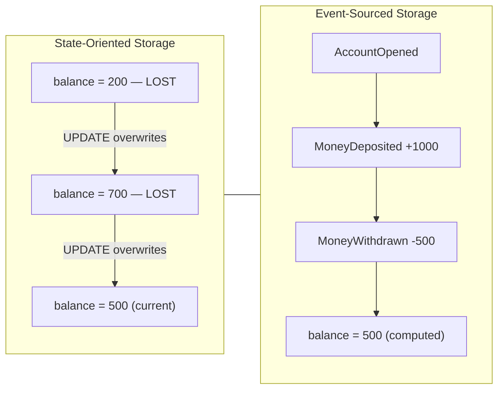
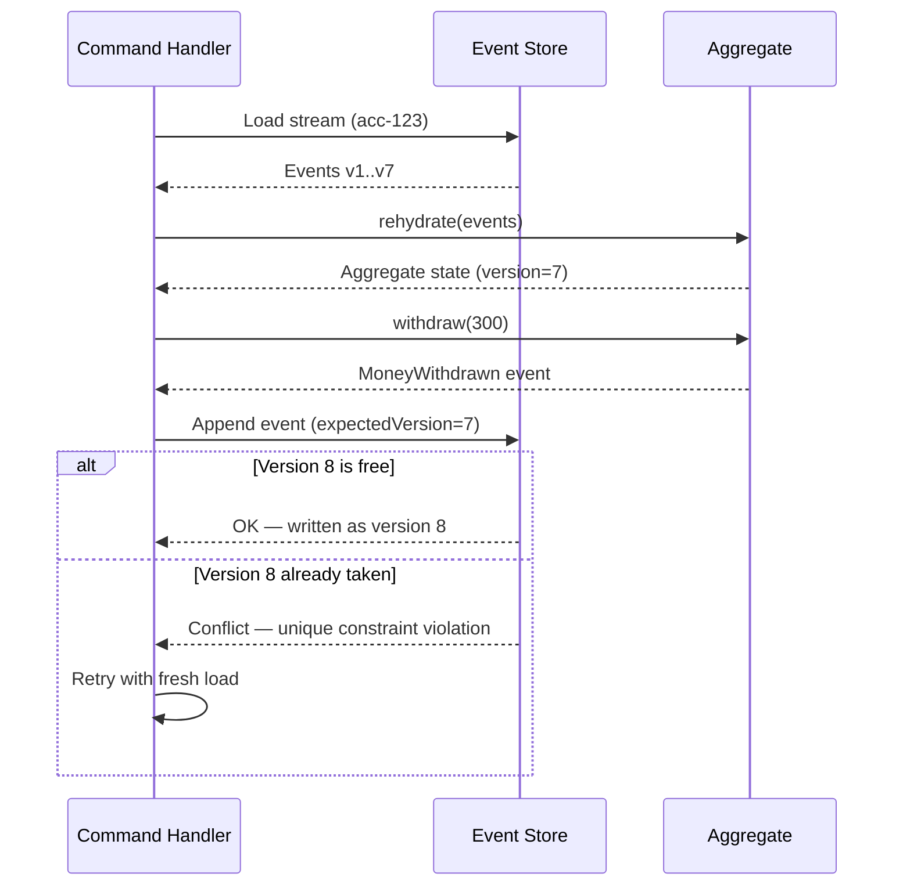
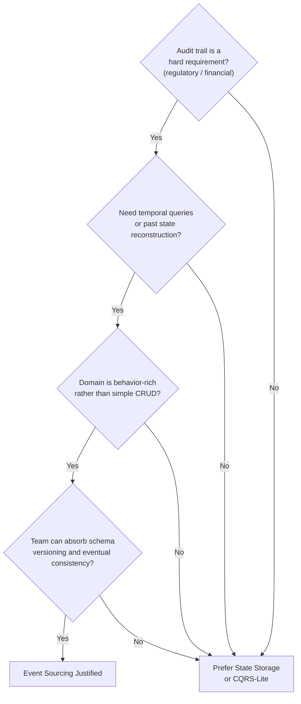

# Capítulo 6: Event Sourcing — Estado como uma Sequência de Eventos

## Declaração do Problema Inicial

O Capítulo 5 deixou um fio solto. Ele mostrou que os modelos de leitura são descartáveis — você pode jogá-los fora e reconstruí-los reproduzindo eventos. Essa afirmação assumiu silenciosamente algo que nunca justificamos: que os eventos ainda existem em algum lugar, em ordem, para sempre. Se as projeções podem ser reconstruídas a partir de um log de eventos, então esse log, e não o modelo de leitura, é a real fonte da verdade.

Este capítulo formaliza essa ideia. **Event Sourcing (armazenamento baseado em eventos)** é o padrão em que o estado autoritativo de uma entidade não é uma linha que você atualiza, mas a sequência completa e ordenada de eventos que aconteceram com ela. Você não armazena o saldo atual de uma conta. Você armazena cada depósito e cada saque, e calcula o saldo quando precisar.

Para arquitetos sênior, o apelo é óbvio e o perigo é sutil. O Event Sourcing fornece uma trilha de auditoria perfeita, consultas temporais e poder de depuração que sistemas tradicionais não conseguem igualar. Ele também impõe restrições que duram por toda a vida do sistema — schemas que você nunca pode deletar completamente, um modelo mental que toda a sua equipe deve compartilhar, e custos operacionais que só aparecem no terceiro ano. Este capítulo ensina ambos os lados com honestidade.

## O Problema da Verdade e da História

Sistemas tradicionais têm um problema de memória: eles esquecem. Considere uma tabela bancária clássica com uma única coluna `balance`. Quando um cliente saca dinheiro, você executa um `UPDATE` e o saldo anterior se vai. O banco de dados agora contém um fato — "o saldo é 500" — mas destruiu o histórico que o produziu.

Este é o **problema da verdade e da história**: um sistema que armazena apenas o estado atual pode responder *o que é verdade agora*, mas não *como se tornou verdade*. Na maior parte do tempo ninguém faz a segunda pergunta. Então um auditor, um regulador ou um cliente insatisfeito o faz, e a resposta é um encolher de ombros.

Considere o que o modelo de atualização in-place descarta em cada execução.

*Figura: Comparação lado a lado do armazenamento orientado a estado versus armazenamento com Event Sourcing — o modelo orientado a estado sobrescreve o histórico em cada UPDATE, enquanto o modelo com Event Sourcing deriva o saldo atual de um log imutável somente para adição.*



A abordagem orientada a estado otimiza o presente à custa do passado. O Event Sourcing inverte essa prioridade. Ele trata cada **evento** — um fato imutável do passado, exatamente como definido no Capítulo 1 — como a unidade durável de verdade. O estado atual se torna um *valor derivado*, recalculado sob demanda a partir dos eventos.

A consequência é estratégica, não apenas técnica. Em um sistema orientado a estado, o histórico é uma reflexão tardia que você adiciona com tabelas de auditoria e triggers, e essas tabelas de auditoria estão sempre ligeiramente erradas. Em um sistema com Event Sourcing, o histórico *é* o modelo de armazenamento. Você não pode ter um histórico incorreto, porque o histórico é a única coisa que você escreveu. A exatidão da trilha de auditoria deixa de ser um recurso que você mantém e se torna uma propriedade da arquitetura.

Esse é o acordo que o padrão oferece: você abre mão da conveniência de ler o estado atual diretamente, e em troca nunca perde um fato.

> ⚠️ **Nota Crítica:** O texto afirma "você não pode ter um histórico incorreto, porque o histórico é a única coisa que você escreveu" e enquadra a exatidão da trilha de auditoria como "uma propriedade da arquitetura." Essa é uma generalização consequente e exagerada. Bugs na camada de aplicação — emitir um evento `MoneyWithdrawn` com o valor errado, escrever no ID de stream errado, ou disparar um manipulador de comando duas vezes — produzem eventos incorretos que são persistidos permanentemente com a mesma garantia de imutabilidade que os eventos corretos. O event store garante append-only e ordenação, não a exatidão do domínio. Um engenheiro sênior que internaliza essa afirmação pode perigosamente desprioritizar os testes de exatidão do manipulador de comando e os controles de idempotência, com base na crença de que "o store garante a exatidão." A arquitetura garante que cada evento escrito é preservado de forma durável exatamente como foi escrito, eliminando sobrescritas acidentais — mas a exatidão do que é escrito permanece inteiramente responsabilidade da aplicação. Manipuladores de comando idempotentes e guardas de entrega at-least-once são essenciais para evitar que eventos duplicados ou incorretos se tornem fatos permanentes.

<details>
<summary>💡 Nota do Especialista</summary>
O texto descarta corretamente as tabelas de auditoria como "sempre ligeiramente erradas", mas os modos de falha vão mais fundo do que a maioria das equipes espera. Triggers de auditoria não capturam estados intermediários dentro de transações com múltiplos comandos — se uma stored procedure atualiza três linhas e dispara um trigger por linha, o log do trigger registra as alterações individuais de cada linha, mas não a intenção de negócio única que as causou. Mais insidiosamente, quando o schema muda (uma coluna é renomeada ou removida), a definição do trigger silenciosamente quebra ou começa a registrar null para esse campo, sem que nenhum erro seja levantado. As equipes descobrem isso apenas durante uma auditoria, meses depois, quando o log tem uma lacuna sistemática que ninguém notou. O Event Sourcing evita isso completamente porque a intenção — o evento de negócio — é o que é escrito, não a mutação da linha.
</details>

## O Event Store e o Log Somente para Adição

O banco de dados que armazena esses eventos é chamado de **event store (armazém de eventos)**. Não é uma tabela de uso geral na qual você simplesmente insere dados — é um log especializado com duas regras que definem todo o padrão.

Primeiro, o event store é **append-only (somente para adição)**. Você pode adicionar eventos ao final. Você nunca pode atualizar ou deletar um evento já escrito. Um evento registra algo que aconteceu, e o passado não muda. Este é o mesmo princípio de imutabilidade do Capítulo 1, agora aplicado na camada de persistência.

Segundo, os eventos são agrupados em **streams (fluxos)**. Um stream é a sequência ordenada de todos os eventos de uma entidade — por exemplo, todos os eventos da conta `acc-123`. O stream é a unidade de consistência e a unidade de reconstrução.

Um schema mínimo de event store precisa apenas de algumas colunas para aplicar essas regras.

*Código: DDL SQL para uma tabela mínima de event store — `global_position` fornece uma ordem total monotônica em todos os streams; `UNIQUE (stream_id, version)` garante a ordenação por stream e funciona como guarda de concorrência otimista sem bloqueio no nível da aplicação.*

```python
# ⚠️ LANGUAGE MISMATCH: original was sql, regenerated as python
# Python 3.10+ — event store schema setup using psycopg2
# global_position provides monotone total order across all streams;
# UNIQUE (stream_id, version) enforces per-stream ordering and acts as the
# optimistic concurrency guard with no application-level locking.

import psycopg2

_CREATE_TABLE = """
CREATE TABLE IF NOT EXISTS event_store (
    global_position  BIGSERIAL    PRIMARY KEY,
    stream_id        TEXT         NOT NULL,
    version          INTEGER      NOT NULL,
    event_type       TEXT         NOT NULL,
    payload          JSONB        NOT NULL,
    metadata         JSONB        NOT NULL DEFAULT '{}',
    occurred_at      TIMESTAMPTZ  NOT NULL DEFAULT now(),

    CONSTRAINT uq_stream_version UNIQUE (stream_id, version)
);
"""

_CREATE_INDEX_STREAM = """
CREATE INDEX IF NOT EXISTS idx_event_store_stream
    ON event_store (stream_id, version ASC);
"""

_CREATE_INDEX_GLOBAL = """
CREATE INDEX IF NOT EXISTS idx_event_store_global
    ON event_store (global_position ASC);
"""


def setup_event_store(conn) -> None:
    """
    Create the event_store table and supporting indexes if they do not exist.
    Safe to call on an already-initialised database (uses IF NOT EXISTS).

    Fast stream replay: idx_event_store_stream fetches all events for a stream
    in version order. Subscription catch-up: idx_event_store_global lets
    consumers track their last-seen global_position.
    """
    with conn:
        with conn.cursor() as cur:
            cur.execute(_CREATE_TABLE)
            cur.execute(_CREATE_INDEX_STREAM)
            cur.execute(_CREATE_INDEX_GLOBAL)
```

A coluna `version` é a heroína silenciosa desse schema. Ela numera os eventos dentro de um stream: 1, 2, 3, e assim por diante. A restrição `UNIQUE (stream_id, version)` faz dois trabalhos ao mesmo tempo. Ela garante uma ordem total dentro de cada stream e oferece **controle de concorrência otimista** de forma gratuita.

Veja como a verificação de concorrência funciona. Quando um manipulador de comando carrega um stream, ele observa a versão máxima atual — digamos, 7. Ele processa o comando e tenta adicionar um novo evento como versão 8. Se outro processo já escreveu a versão 8 nesse meio-tempo, a restrição única rejeita a inserção. O manipulador sabe que sua decisão foi baseada em dados desatualizados e tenta novamente. Sem bloqueios, sem espera — apenas uma restrição fazendo seu trabalho.

*Código: Adição com concorrência otimista — lança `ConcurrencyConflictError` quando outro escritor já reivindicou a versão esperada; o chamador deve recarregar o stream e tentar novamente o comando.*

```python
# Python 3.10+ — optimistic concurrency append using psycopg2 and PostgreSQL
# Raises ConcurrencyConflictError when another writer has already claimed the expected version.

from __future__ import annotations

import json
from dataclasses import dataclass, field
from typing import Any

import psycopg2
from psycopg2 import errors as pg_errors


@dataclass
class EventRecord:
    stream_id:  str
    event_type: str
    payload:    dict[str, Any]
    metadata:   dict[str, Any] = field(default_factory=dict)


class ConcurrencyConflictError(Exception):
    """Raised when another writer already appended at the expected version.
    The caller should reload the stream and retry the command."""


def append_events(
    conn,
    stream_id:        str,
    events:           list[EventRecord],
    expected_version: int,          # highest version seen when the command was loaded
) -> None:
    """
    Appends `events` to `stream_id` starting at expected_version + 1.
    All inserts run inside a single transaction; a unique-constraint violation
    signals a concurrent write and triggers a rollback.
    """
    with conn:                       # psycopg2 context manager: commit or rollback
        with conn.cursor() as cur:
            for offset, event in enumerate(events):
                next_version = expected_version + 1 + offset  # 1-based, increments per event

                try:
                    cur.execute(
                        """
                        INSERT INTO event_store
                            (stream_id, version, event_type, payload, metadata)
                        VALUES (%s, %s, %s, %s::jsonb, %s::jsonb)
                        """,
                        (
                            stream_id,
                            next_version,
                            event.event_type,
                            json.dumps(event.payload),
                            json.dumps(event.metadata),
                        ),
                    )
                except pg_errors.UniqueViolation:
                    # Another process already wrote at this version; the caller must retry.
                    raise ConcurrencyConflictError(
                        f"Concurrency conflict on stream '{stream_id}': "
                        f"expected version {expected_version} is stale. Reload and retry."
                    )
```

Uma palavra de realismo para arquitetos que escolhem infraestrutura. Você pode construir um event store em um PostgreSQL simples, e para muitos sistemas corporativos você deveria — a familiaridade operacional vale mais do que qualquer recurso especializado. Stores com propósito específico como EventStoreDB ou Axon Server, ou primitivas em nuvem como DynamoDB com um design de chave de partição mais chave de ordenação, adicionam ferramental de subscription e projeção. Mas nenhum deles muda as duas regras acima. Append-only e ordenado por stream são o jogo inteiro.

> 💡 **Nota do Especialista:** A coluna `global_position` no schema é fácil de implementar incorretamente no PostgreSQL com um `BIGSERIAL` ou `SEQUENCE`, criando um risco silencioso em produção. Sequências no PostgreSQL são não-transacionais por design: se uma transação insere um evento e em seguida faz rollback, o valor da sequência é consumido e não reutilizado. Consumidores que leem `global_position` em ordem verão lacunas (por exemplo, posições 1, 2, 4 — a posição 3 foi um insert com rollback) e devem decidir se uma lacuna significa "ainda não confirmado" ou "permanentemente ausente." A correção padrão em produção é usar uma abordagem de captura de dados de alterações baseada em replication slot (por exemplo, `pg_logical`) ou rastrear a ordem global por meio de uma tabela de contador separada com proteção de bloqueio, descarregada apenas no commit. O EventStoreDB contorna isso ao gerenciar a atribuição de posições dentro de seu próprio log de transações. Escolha sua infraestrutura sabendo que esse problema de lacuna existe em stores SQL simples.

<details>
<summary>💡 Nota do Especialista</summary>
Ao comparar EventStoreDB com um store PostgreSQL feito internamente, o diferenciador prático para empresas é a semântica de subscription, não o armazenamento. As subscriptions persistentes do EventStoreDB suportam um modelo de consumidor concorrente por grupo nativamente, mas o mecanismo de projeção deles (historicamente projeções server-side baseadas em JavaScript) introduz uma carga operacional — um segundo runtime para monitorar, versionar e depurar — que a maioria das equipes corporativas subestima. Para organizações que já padronizaram no Kafka, tratar o event store como o log append-only autoritativo e o Kafka como a camada de subscription/fan-out é um híbrido comum que preserva a familiaridade. As duas camadas têm garantias diferentes (adição exactly-once versus entrega at-least-once) e devem ser conectadas de acordo.
</details>

<details>
<summary>⚠️ Nota Crítica</summary>
A afirmação "sem bloqueios, sem espera — apenas uma restrição fazendo seu trabalho" exagera o benefício da concorrência otimista sob contenção. Em cenários de escrita de alta taxa de transferência em um único stream de agregado — por exemplo, uma conta compartilhada recebendo eventos de pagamento concorrentes — cada escritor em conflito vai tentar novamente. Sob contenção sustentada, isso degrada para serialização efetiva: todos os escritores giram, recarregam o stream, reprocessam o comando e tentam novamente a inserção. Tempestades de tentativas podem ser piores do que uma fila justa com um único bloqueio, e a aplicação deve limitar as tentativas e tratar erros persistentes de conflito de concorrência. Esse modo de falha é invisível no caminho feliz, mas relevante em produção. A concorrência otimista funciona melhor quando escritores conflitantes no mesmo stream são raros. Para streams quentes, considere deduplicação de comandos no nível do manipulador, particionamento de stream ou estratégias de bloqueio explícito, e sempre proteja contra tentativas ilimitadas com uma contagem máxima de retentativas e backoff.
</details>

## Reconstrução de Estado e Agregados

Se você nunca armazena o estado atual, como o obtém? Você o calcula. O processo é chamado de **reconstrução (reconstruction)** ou **reidratação (rehydration)**: você lê o stream do início e aplica cada evento, em ordem, a um objeto fresco na memória. Esse objeto é o **agregado (aggregate)** — o limite de consistência do Domain-Driven Design que detém as regras de negócio de uma entidade.

A reconstrução é um fold (dobra). Você começa com um agregado vazio e, evento por evento, dobra cada fato no estado do agregado.

*Código: Agregado de conta com separação estrita de comando/apply — `rehydrate()` dobra o stream de eventos completo em um agregado ativo em O(n) no comprimento do stream.*

```python
# Python 3.10+ — Account aggregate with strict command / apply separation
# rehydrate() folds the full event stream into a live aggregate; O(n) in stream length.

from __future__ import annotations

from dataclasses import dataclass, field
from typing import Union


# ---------------------------------------------------------------------------
# Immutable event types — historical facts, never mutated after creation
# ---------------------------------------------------------------------------

@dataclass(frozen=True)
class AccountOpened:
    account_id: str
    owner:      str

@dataclass(frozen=True)
class MoneyDeposited:
    account_id: str
    amount:     int  # in cents; always positive

@dataclass(frozen=True)
class MoneyWithdrawn:
    account_id: str
    amount:     int  # in cents; always positive

DomainEvent = Union[AccountOpened, MoneyDeposited, MoneyWithdrawn]


# ---------------------------------------------------------------------------
# Aggregate
# ---------------------------------------------------------------------------

@dataclass
class Account:
    account_id: str  = ""
    owner:      str  = ""
    balance:    int  = 0    # in cents
    version:    int  = 0
    _pending:   list[DomainEvent] = field(default_factory=list, repr=False)

    # ---- Command methods: validate invariants, then record a new event ----

    @classmethod
    def open(cls, account_id: str, owner: str) -> "Account":
        """Command: open a new account."""
        aggregate = cls()
        aggregate._record(AccountOpened(account_id=account_id, owner=owner))
        return aggregate

    def deposit(self, amount: int) -> None:
        """Command: credit the account."""
        if amount <= 0:
            raise ValueError(f"Deposit amount must be positive, got {amount}.")
        self._record(MoneyDeposited(account_id=self.account_id, amount=amount))

    def withdraw(self, amount: int) -> None:
        """Command: debit the account; rejects if funds are insufficient."""
        if amount <= 0:
            raise ValueError(f"Withdrawal amount must be positive, got {amount}.")
        if amount > self.balance:
            raise ValueError(
                f"Insufficient funds: balance={self.balance} cents, requested={amount} cents."
            )
        self._record(MoneyWithdrawn(account_id=self.account_id, amount=amount))

    # ---- Apply methods: pure state mutation — NO validation, NEVER reject ----

    def _apply(self, event: DomainEvent) -> None:
        """Mutate in-memory state from an already-decided event. Must never raise."""
        match event:
            case AccountOpened(account_id=aid, owner=owner):
                self.account_id = aid
                self.owner      = owner
                self.balance    = 0
            case MoneyDeposited(amount=amount):
                self.balance += amount
            case MoneyWithdrawn(amount=amount):
                self.balance -= amount

    def _record(self, event: DomainEvent) -> None:
        """Apply a new event to in-memory state and stage it for persistence."""
        self._apply(event)
        self._pending.append(event)

    # ---- Rehydration: reconstruct from a stored event stream ----

    @classmethod
    def rehydrate(cls, events: list[DomainEvent]) -> "Account":
        """
        Fold a complete event stream into a live Account aggregate.
        Time complexity: O(n) where n = len(events).
        """
        aggregate = cls()
        for i, event in enumerate(events, start=1):
            aggregate._apply(event)  # apply history — no validation
            aggregate.version = i    # track stream position for optimistic concurrency
        return aggregate
```

Observe a disciplina que isso impõe. Existem exatamente dois tipos de métodos no agregado, e confundi-los é o bug mais comum no Event Sourcing.

1. **Métodos de comando** (por exemplo, `withdraw`) contêm as regras de negócio. Eles validam invariantes — "você não pode sacar mais do que o saldo" — e, se a regra for mantida, eles *produzem um novo evento*. Eles decidem o que deve acontecer.
2. **Métodos de apply** (por exemplo, `applyMoneyWithdrawn`) não contêm nenhuma lógica de negócio. Eles apenas mutam o estado na memória a partir de um evento que *já aconteceu*. Eles registram o que de fato aconteceu.

A regra é absoluta: **métodos de apply nunca devem rejeitar um evento ou conter validação.** O evento é um fato histórico. Recusar-se a aplicá-lo durante a reconstrução significaria recusar-se a reconhecer o passado, e o estado reconstruído divergiria silenciosamente da realidade. Toda validação vive nos métodos de comando, antes de o evento existir.

*Figura: Diagrama de sequência de uma escrita — desde o carregamento do stream até a reidratação do agregado, validação de invariantes e adição com controle de concorrência otimista, mostrando onde a validação vive e onde o guarda de concorrência da restrição única dispara.*



É aqui que o Event Sourcing e o CQRS (Segregação de Responsabilidade de Comando e Consulta) do Capítulo 5 se encaixam. O lado de comando reconstrói o agregado para tomar uma decisão e emite um evento. Esse mesmo evento alimenta as projeções que constroem os modelos de leitura. Um evento, escrito uma vez, serve tanto para a verdade quanto para a consulta. O log de eventos se torna a fonte única a partir da qual os modelos de leitura descartáveis do CQRS são reconstruídos.

<details>
<summary>💡 Nota do Especialista</summary>
O texto descreve os métodos de comando como métodos que "produzem um novo evento", mas o padrão de implementação padrão adiciona um detalhe estrutural que muda como o agregado interage com seu repositório: o agregado mantém uma lista interna de "eventos não confirmados." Quando um método de comando decide aceitar uma ação de negócio, ele chama seu próprio `apply()` internamente — para atualizar o estado na memória imediatamente — e anexa o evento a essa lista não confirmada. O repositório, após chamar o comando, lê a lista não confirmada, anexa esses eventos ao store na versão esperada e então limpa a lista. Esse design em duas fases (apply agora, descarregar depois) é por que os métodos de comando podem encadear decisões dentro de uma única unidade de trabalho e por que o agregado nunca sabe sobre o banco de dados. Omitir esse padrão leva equipes a recarregar o agregado entre comandos na mesma requisição ou a chamar `apply()` duas vezes (uma no comando, outra durante a reconstrução), causando bugs de dupla mutação.
</details>

<details>
<summary>⚠️ Nota Crítica</summary>
A regra "métodos de apply nunca devem rejeitar um evento ou conter validação" é descrita como absoluta, mas não aborda o cenário de compatibilidade futura onde um agregado encontra um tipo de evento introduzido por uma versão mais nova da aplicação que o código atual não reconhece. Ignorar silenciosamente tipos de evento desconhecidos durante a reidratação pode produzir um estado na memória sutilmente errado; falhar completamente em tipos desconhecidos quebra a reconstrução inteiramente. Isso é um problema operacional real durante deploys contínuos e migrações de schema. Os métodos de apply não devem rejeitar eventos *conhecidos* nem aplicar validação de negócio a eles. Para tipos de evento desconhecidos ou não reconhecidos, a estratégia recomendada é ignorar e registrar em log com uma verificação de consciência de versão. O Capítulo 8 trata formalmente do versionamento de schema.
</details>

## Snapshots e Otimização de Replay

A reconstrução tem uma falha óbvia, e todo cético a identifica imediatamente. Se uma conta acumulou 200.000 eventos ao longo de dez anos, você deve ler e dobrar todos esses 200.000 eventos cada vez que alguém verificar o saldo? Nesse volume, a reconstrução transforma uma operação de milissegundos em uma de vários segundos.

A resposta é o **snapshot (instantâneo)**. Um snapshot é uma cópia em cache do estado do agregado em uma versão específica — um checkpoint que diz "na versão 50.000, o saldo era 12.340." A reconstrução então muda: carregue o snapshot mais recente, depois reproduza apenas os eventos que vieram *depois* dele.

*Código: Reidratação baseada em snapshot com fallback para replay completo — o snapshot é uma otimização descartável; deletar todos os snapshots deve deixar o comportamento inalterado.*

```python
# Python 3.10+ — snapshot-based rehydration with full-replay fallback
# Snapshot is a disposable optimisation; deleting all snapshots must leave behaviour unchanged.

from __future__ import annotations

import json
from dataclasses import dataclass
from typing import Any, Optional

# Re-uses Account, DomainEvent defined in the aggregate example above.


# ---------------------------------------------------------------------------
# Snapshot data contract
# ---------------------------------------------------------------------------

@dataclass
class Snapshot:
    stream_id: str
    version:   int            # aggregate version at time the snapshot was taken
    state:     dict[str, Any] # serialised aggregate fields (excludes _pending)


# ---------------------------------------------------------------------------
# Storage helpers — replace with real persistence in production
# ---------------------------------------------------------------------------

def load_latest_snapshot(stream_id: str) -> Optional[Snapshot]:
    """Return the most recent snapshot for the stream, or None if none exists."""
    raise NotImplementedError  # implement against your snapshot store


def load_events_after_version(stream_id: str, after_version: int) -> list[DomainEvent]:
    """Return events where version > after_version, ordered ascending by version."""
    raise NotImplementedError  # implement against the event_store table


# ---------------------------------------------------------------------------
# Rehydration with snapshot shortcut
# ---------------------------------------------------------------------------

def rehydrate_from_snapshot(stream_id: str) -> Account:
    """
    Reconstruct an Account aggregate, using a snapshot when available.

    Steps:
      1. Load the most recent snapshot for the stream.
      2. If found: restore aggregate state from the snapshot, then replay
         only the events written after snapshot.version.
      3. If not found: fall back to full replay from the start of the stream.

    The snapshot is purely an optimisation — deleting it produces the same
    aggregate state, just more slowly.
    """
    snapshot: Optional[Snapshot] = load_latest_snapshot(stream_id)

    if snapshot is not None:
        # Fast path: restore from checkpoint, then apply the delta only
        aggregate = Account(
            account_id=snapshot.state["account_id"],
            owner=snapshot.state["owner"],
            balance=snapshot.state["balance"],
        )
        aggregate.version = snapshot.version
        delta_events = load_events_after_version(stream_id, after_version=snapshot.version)
    else:
        # Slow path: no snapshot exists — replay the full stream from scratch
        aggregate = Account()
        delta_events = load_events_after_version(stream_id, after_version=0)

    # Fold the delta (or full stream) onto the aggregate state
    for event in delta_events:
        aggregate._apply(event)   # pure mutation, no validation
        aggregate.version += 1

    return aggregate


def maybe_take_snapshot(aggregate: Account, interval: int = 100) -> Optional[Snapshot]:
    """
    Policy: create a new snapshot every `interval` events.
    Caller is responsible for persisting the returned snapshot.
    Returns None when the version does not fall on a snapshot boundary.
    """
    if aggregate.version > 0 and aggregate.version % interval == 0:
        return Snapshot(
            stream_id=aggregate.account_id,
            version=aggregate.version,
            state={
                "account_id": aggregate.account_id,
                "owner":      aggregate.owner,
                "balance":    aggregate.balance,
            },
        )
    return None
```

Dois pontos de design separam uma estratégia de snapshot que funciona de uma quebrada.

- **Um snapshot é uma otimização derivada, nunca uma fonte de verdade.** Você deve ser capaz de deletar cada snapshot no sistema e reconstruí-los todos apenas a partir dos eventos. Se deletar snapshots perder dados, você reintroduziu acidentalmente o modelo orientado a estado que estava tentando evitar.
- **Crie snapshots em uma cadência, não em cada escrita.** Uma política comum é um snapshot a cada *N* eventos por stream — digamos, a cada 100. O número é um parâmetro de ajuste, não uma constante.

A tabela a seguir enquadra o trade-off que você está efetivamente ajustando.

| Frequência de snapshot | Custo de replay por carregamento | Overhead de armazenamento e escrita | Melhor adequação |
|---|---|---|---|
| Nunca (replay puro) | Cresce sem limite | Nenhum | Streams curtos, baixas contagens de eventos |
| A cada N eventos (ex: 100) | Limitado, pequeno | Moderado | A maioria dos sistemas em produção |
| A cada evento | Próximo de zero | Alto; aproxima-se do armazenamento de estado | Quase nunca — um code smell |

A última linha merece uma **Dica Pro**. Se seu instinto é criar snapshot em cada escrita individual, pare. Você reconstruiu um banco de dados de atualização in-place com passos extras e pior desempenho. O ponto dos snapshots é tornar o replay *aceitável*, não eliminá-lo. Recorra a snapshots apenas quando a medição provar que a reconstrução é muito lenta — e para agregados com vida curta e poucos eventos, talvez você nunca precise deles.

> 💡 **Nota do Especialista:** Um bug em qualquer método `apply()` que passa despercebido por semanas vai corromper silenciosamente cada snapshot gerado durante esse período. Quando o bug é corrigido, a lógica de apply corrigida produz um estado na memória diferente do que o snapshot armazenado reflete, e a reconstrução que começa a partir de um snapshot desatualizado produzirá resultados errados sem gerar um erro — o snapshot corrompido é um JSON estruturalmente válido. A correção em produção é anexar um `snapshot_schema_version` (um inteiro que você incrementa sempre que a lógica de apply muda de semântica) a cada linha de snapshot. No carregamento, se `snapshot_schema_version` não corresponder à versão atual do código, descarte o snapshot e faça fallback para replay completo. Isso adiciona uma constante de configuração e uma comparação, mas torna a invalidação de snapshots automática e segura durante os deploys.

<details>
<summary>💡 Nota do Especialista</summary>
O texto enquadra o snapshotting como um parâmetro de ajuste na leitura, mas ele importa igualmente no caminho de escrita. Uma implementação ingênua cria um snapshot de forma síncrona dentro da mesma transação que adiciona o evento — dobrando a latência de escrita a cada N-ésimo evento. Sistemas em produção quase universalmente tornam o snapshotting assíncrono: um worker em background (ou uma projeção que lê o stream de eventos) detecta que um stream avançou além de um limite e escreve o snapshot fora de banda. O caminho de comando permanece rápido e previsível; o snapshot pode atrasar alguns segundos, o que é aceitável porque a reconstrução sempre volta ao replay se um snapshot estiver ausente ou desatualizado.
</details>

<details>
<summary>⚠️ Nota Crítica</summary>
A discussão sobre estratégia de snapshot omite uma questão operacional crítica: quem escreve o snapshot e o que acontece se essa escrita falhar? Se o manipulador de comando escreve o snapshot de forma síncrona após adicionar um evento, uma falha na escrita do snapshot não deve ser tratada como uma falha do comando — ou o processamento do comando se torna não confiável. Se os snapshots são escritos por um processo assíncrono em background, há uma janela em que o store de snapshots está desatualizado ou vazio e o replay completo é silenciosamente necessário. Os snapshots devem ser escritos como operações de melhor esforço, não transacionais, que nunca bloqueiam nem falham o pipeline de comando. O código deve sempre fazer fallback para replay completo se um snapshot estiver faltando ou sua versão não estiver presente no event store, tratando o snapshot como um cache consultivo em vez de uma dependência obrigatória.
</details>

## Custos de Longo Prazo e Restrições de Design

O Event Sourcing não é uma técnica que você experimenta por um sprint e abandona de forma limpa. Uma vez que eventos reais se acumulam, o padrão se torna estruturalmente crítico, e seus custos são estruturais. Um arquiteto honesto os avalia antes de adotar, não depois.

**Eventos são permanentes, então seus schemas são permanentes.** Uma linha que você não gosta mais pode ser migrada com um `ALTER TABLE`. Um evento escrito em 2024 ainda será lido durante a reconstrução em 2030, exatamente como foi escrito. Você não pode migrar o passado. Você acomoda formatos antigos por meio de versionamento e upcasting — o tema completo do Capítulo 8 — e essa disciplina é obrigatória, não opcional.

**Deleção se torna um problema real de design.** Regulamentações como o GDPR concedem um direito ao apagamento, que colide diretamente com um log imutável e somente para adição. Você não pode simplesmente deletar os eventos. A resposta padrão é o **crypto-shredding (destruição criptográfica)**: criptografe os dados pessoais por sujeito e delete a chave para tornar os dados irrecuperáveis. Isso deve ser projetado desde o primeiro evento, porque você não pode adicionar criptografia retroativamente a fatos já escritos em texto claro.

**Consultar o estado atual requer o lado de leitura.** Como o estado é derivado, você não pode escrever um simples `SELECT balance FROM accounts`. Você precisa de projeções e modelos de leitura — que é precisamente por que o Event Sourcing e o CQRS são tão frequentemente adotados juntos. Escolher o Event Sourcing efetivamente o compromete com o caminho de leitura do CQRS do Capítulo 5.

*Figura: Fluxograma de decisão para adotar o Event Sourcing — direciona para a adoção apenas quando todas as quatro condições qualificadoras são atendidas e para alternativas mais leves caso contrário.*



A orientação direta para arquitetos sênior: o Event Sourcing justifica seu custo em domínios onde o histórico é intrinsecamente valioso — razões contábeis, negociações, seguros, prontuários médicos, ciclos de vida de pedidos — e onde o negócio genuinamente pergunta *como chegamos até aqui*. Para um domínio com formato CRUD cujos usuários nunca perguntam sobre o passado, é over-engineering com uma cauda de manutenção de uma década. Adote-o onde a trilha de auditoria é o produto, não onde é uma novidade.

> 💡 **Nota do Especialista:** O crypto-shredding como descrito está correto, mas subestima uma restrição crítica de implementação: o escopo do que deve ser criptografado é mais amplo do que a maioria das equipes antecipa. Dados pessoais não podem aparecer em nenhum lugar fora do payload criptografado — nem no nome do tipo de evento, nem em campos de metadados (IDs de correlação, strings de user-agent, endereços IP registrados como metadados), nem em IDs de stream que codificam um nome de usuário ou e-mail. Um ID de stream `user-john.doe@example.com` não pode ser destruído criptograficamente; o próprio identificador é dado pessoal e persistirá em cada cabeçalho de evento, cada linha de snapshot e cada linha de projeção para sempre. A disciplina arquitetural é usar identificadores opacos e substitutos (UUIDs) como IDs de stream desde o primeiro dia e armazenar uma chave de criptografia separada por sujeito de dados em um serviço dedicado de gerenciamento de chaves (AWS KMS, HashiCorp Vault) antes de escrever o primeiro evento. Retrofitar isso em um event store existente é efetivamente impossível sem reescrever o histórico, o que o padrão proíbe.

<details>
<summary>⚠️ Nota Crítica</summary>
O texto cita prontuários médicos como um domínio canônico onde o Event Sourcing "justifica seu custo" porque o histórico é intrinsecamente valioso. Este é o mesmo domínio onde a HIPAA e o GDPR criam uma obrigação de direito ao apagamento e onde a correção de dados (emenda de uma entrada clínica) é um requisito operacional de rotina. A imutabilidade do Event Sourcing está em tensão direta com ambos. O crypto-shredding trata do apagamento por GDPR em princípio, mas a correção clínica — onde um evento de diagnóstico errado deve ser emendado, não apenas substituído — requer eventos compensatórios e lógica cuidadosa de modelo de leitura para apresentar o estado correto. Apresentar prontuários médicos como uma adequação direta ao Event Sourcing sem essa ressalva poderia levar um leitor a subestimar a complexidade regulatória. Domínios regulamentados que exigem workflows de correção ou apagamento demandam design explícito: eventos compensatórios para correções, crypto-shredding para deleção, e modelos de leitura que apresentam corretamente apenas o registro atual autoritativo. Razões contábeis e ciclos de vida de pedidos são exemplos canônicos mais adequados, pois esses domínios têm os requisitos de deleção mais fracos.
</details>

## Principais Conclusões

- O Event Sourcing armazena cada evento de mudança de estado como fato imutável e deriva o estado atual por replay, resolvendo o problema da verdade e da história que sistemas de atualização in-place criam ao esquecer o passado.
- O **event store** é append-only e organizado em **streams** por entidade; uma restrição `UNIQUE (stream_id, version)` garante tanto a ordenação quanto a concorrência otimista sem bloqueio.
- Os agregados são **reidratados** dobrando eventos em ordem; os métodos de comando validam invariantes e emitem eventos, enquanto os métodos de apply apenas mutam o estado e nunca devem rejeitar um fato.
- **Snapshots** limitam o custo de replay fazendo checkpoint do estado a cada N eventos, mas são otimizações descartáveis — nunca uma fonte de verdade, e nunca criados em cada escrita.
- Os custos são schemas permanentes, deleção difícil (crypto-shredding) e um lado de leitura obrigatório; adote o Event Sourcing apenas onde o histórico é genuinamente valioso para o negócio.

## O Que Vem a Seguir

O Capítulo 7 confronta o que acontece quando um único processo de negócio abrange múltiplos agregados e serviços, introduzindo sagas para coordenar transações sob consistência eventual em vez de ACID distribuído.

<!-- ASSEMBLY COMPLETE
  Chapter: Event Sourcing — State as a Sequence of Events
  Code blocks resolved: 4 / 4
  Diagrams resolved: 3 / 3
  Expert callouts (inline): 3
  Expert callouts (collapsed): 4
  Critical callouts (inline): 1
  Critical callouts (collapsed): 4
  Unresolved markers: 0
-->
