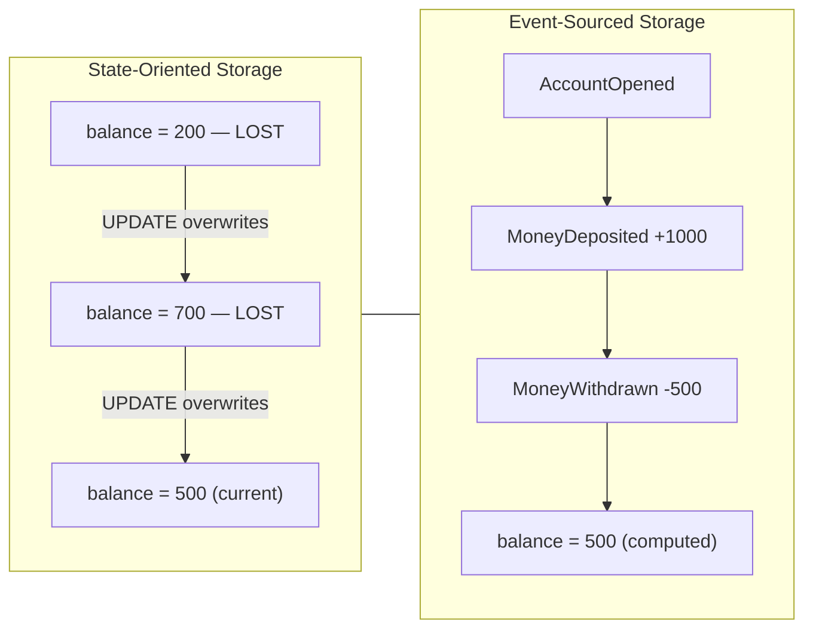
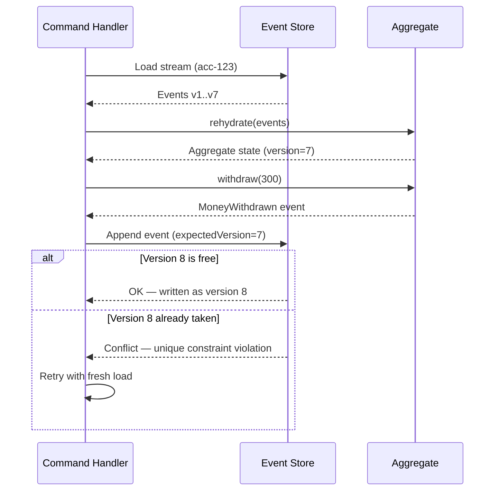
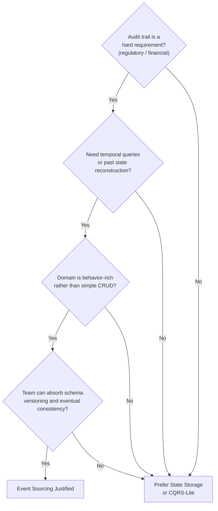

## Diagrams — Event Sourcing — State as a Sequence of Events

### side-by-side comparison. Left panel "State-Oriented": a single Account row with balance=500 being overwritten by an UPDATE, with prior values shown crossed out and labeled "lost". Right panel "Event-Sourced": an append-only list of events (AccountOpened, MoneyDeposited +1000, MoneyWithdrawn -500) with a derived balance=500 shown as computed, not stored. Flowchart/comparison style.

The diagram contrasts the two storage philosophies side by side: the state-oriented model overwrites previous values on each UPDATE, permanently destroying history, while the event-sourced model appends immutable facts and derives the current balance on demand. This contrast is the core trade-off of the chapter — convenience of direct reads versus an unforgeable history.

---

### sequence diagram of a write. Command handler loads events for stream, calls rehydrate to fold them into an aggregate, invokes a command method (withdraw) which validates the invariant and returns a new MoneyWithdrawn event, then appends that event to the store at expectedVersion+1. Show the concurrency check on append.

This sequence diagram traces the full lifecycle of a write command in an event-sourced system, from stream loading through aggregate rehydration, invariant validation, and optimistic-concurrency-controlled append. It makes visible exactly where validation lives (command method) and where the unique-constraint concurrency guard fires (the append step).

---

### decision flowchart for adopting Event Sourcing. Questions: Is a complete audit trail a hard requirement (regulatory/financial)? Do you need temporal queries or to reconstruct past states? Is the domain rich in behavior rather than simple CRUD? Can the team absorb schema-versioning and eventual-consistency complexity? Route "yes to the first three and the last" to "Event Sourcing is justified" and route CRUD-shaped or team-unready cases to "Prefer state storage / CQRS-lite".

This decision flowchart guides architects through the four qualifying questions before committing to Event Sourcing, routing toward adoption only when all four conditions hold and toward lighter alternatives otherwise. It operationalizes the blunt guidance in the prose: adopt Event Sourcing where history is the product, not where it is a novelty.

---
