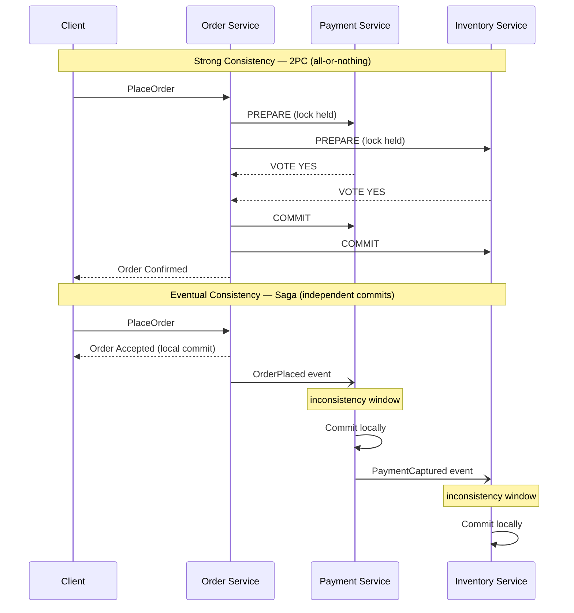
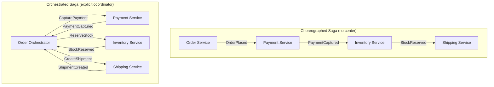
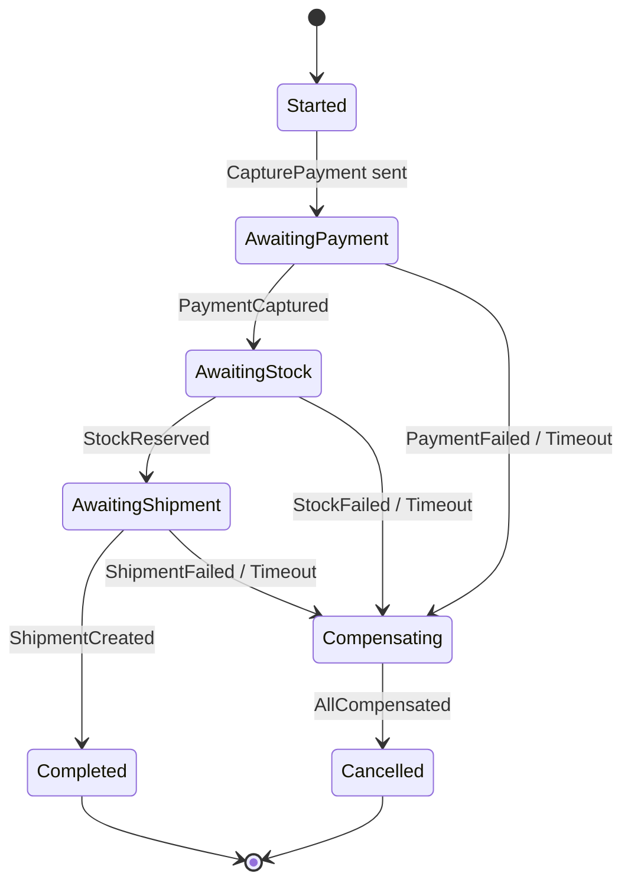
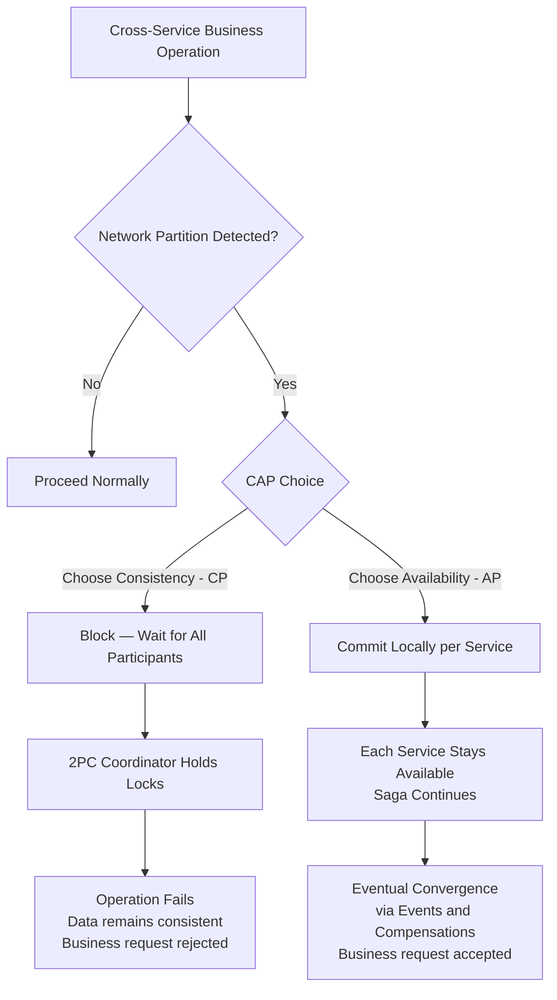

# Chapter 7: Consistency, Sagas, and Long-Running Processes

## Opening Problem Statement

Chapter 6 left the write side settled: state is an immutable log of events, and truth lives in the event store. But that chapter quietly assumed a comfortable boundary — one aggregate, one stream, one transaction. Real business processes are not so polite. Placing an order touches inventory, payment, and shipping. Onboarding a customer touches identity, billing, and compliance. Each of these lives in a different service, behind a different database, owned by a different team.

Here is the uncomfortable question this chapter answers: **how do you keep three services consistent when you cannot wrap them in a single transaction?** The classic instinct — a distributed transaction that locks all three and commits atomically — sounds correct and is almost always wrong in a cloud-native system. It couples availability, punishes latency, and fails in ways that are hard to reason about.

The alternative is the **saga**: a sequence of local transactions, each committing independently, coordinated by events, and reversed not by rollback but by *compensation*. Sagas trade the illusion of instantaneous global consistency for something honest and operable: **eventual consistency**. This chapter shows how sagas work, when to choreograph them and when to orchestrate them, how to design compensations that actually undo business effects, and how the CAP theorem quietly governs every one of these choices.

## Eventual Consistency Versus Strong Consistency

Start with the word every architect uses and few define precisely. **Strong consistency** means that once a write completes, every subsequent read — from anywhere — sees that write. The system behaves as if there were a single copy of the data and a single clock. This is the guarantee a local ACID transaction gives you inside one database.

**Eventual consistency** makes a weaker promise: if writes stop, all replicas and derived views will *eventually* converge to the same value. Between the write and that convergence, there is a window in which different parts of the system disagree. That window is not a bug. It is the price of keeping services independent and available.

The mistake is treating eventual consistency as "strong consistency, but sloppy." It is a different model with different rules. You do not ask "is the data consistent?" You ask "what is the maximum staleness the business can tolerate, and what happens inside that window?"

Consider a familiar analogy. When you transfer money between banks, the sender's balance drops immediately, but the recipient sees nothing for hours or days. The money is, for a while, *in flight* — visible nowhere. The banking system is eventually consistent by design, and it works because the business defined explicit intermediate states ("pending," "settled") and rules for each. That is the discipline eventual consistency demands.

**Figure 7.1** — Two-phase commit forces all participants to lock and commit atomically, creating a single all-or-nothing window; a saga lets each service commit locally in sequence, accepting a visible inconsistency window between steps that closes as events propagate forward.



The table below sharpens the contrast.

| Dimension | Strong consistency | Eventual consistency |
|---|---|---|
| Read after write | Always current | Current *eventually* |
| Scope | Single database / transaction | Multiple services |
| Availability under partition | Sacrificed | Preserved |
| Latency | Higher (coordination) | Lower (local commits) |
| Failure mode | All-or-nothing | Partial, then reconciled |
| Reasoning cost | Low | High — intermediate states matter |

The senior takeaway: **eventual consistency is not a compromise you accept reluctantly; it is the enabling assumption of independent services.** The moment you demand strong consistency across service boundaries, you have re-coupled the services you spent Chapters 1 through 6 decoupling.

<details>
<summary>💡 Expert Note</summary>

The prose presents consistency as a binary (strong vs. eventual), which is pedagogically useful but can lead architects to over-engineer. In practice, many UX and API requirements need only "read-your-writes" (causal) consistency — the user who just created a resource can see it on the next request, but other users seeing a slightly stale view is acceptable. This is weaker than strong consistency but stronger than bare eventual. Designing for read-your-writes often eliminates the need for synchronous cross-service calls: redirect the user to the newly created resource's canonical URL immediately after the local commit, and rely on event propagation for everyone else. Distinguishing "which consistency level does this user action actually need?" prevents the knee-jerk response of adding synchronous calls to achieve strong consistency where causal would suffice.
</details>

## Why Distributed ACID Transactions Fail

Before sagas, honor the pattern they replace. The textbook answer to multi-service consistency is the **two-phase commit** (2PC): a coordinator asks every participant to *prepare*, waits for all to vote yes, then tells all to *commit*. If any participant votes no, everyone aborts. On paper, atomicity across services.

In practice, 2PC has three fatal properties for cloud-native systems.

First, **it holds locks across the network.** Between prepare and commit, every participant keeps its rows locked, waiting for the coordinator. A slow network or a distant service turns a millisecond lock into a multi-second one, collapsing throughput.

Second, **it is a blocking protocol.** If the coordinator crashes after participants vote yes but before it broadcasts the decision, participants are stuck — locked, uncertain, unable to safely proceed or abort. This is the well-known "in-doubt" state, and recovering from it is operationally miserable.

Third, **it couples availability.** A transaction succeeds only if *every* participant is up at the same instant. Five services at 99.9% availability each yield roughly 99.5% combined — you have multiplied your fragility. This directly violates the independence that makes microservices worth their cost.

**Listing 7.1** — This example simulates a 2PC coordinator driving three services through the prepare and commit phases. The `simulate_crash_after_prepare` flag demonstrates the in-doubt window: participants have already voted yes and hold their locks, but the coordinator has not yet broadcast the decision — leaving the system in an unresolvable state until manual intervention or a recovery protocol.

```python
# O(n) per phase where n = number of participants; locks held across both phases are the core hazard
from __future__ import annotations

import enum
from dataclasses import dataclass


class VoteResult(enum.Enum):
    YES = "yes"
    NO = "no"


class CoordinatorState(enum.Enum):
    IDLE = "IDLE"
    PREPARING = "PREPARING"
    COMMITTED = "COMMITTED"
    ABORTED = "ABORTED"
    IN_DOUBT = "IN_DOUBT"  # coordinator crashed after votes, before broadcasting the decision


@dataclass
class Participant:
    """Represents one service participating in the distributed transaction."""
    name: str
    vote: VoteResult = VoteResult.YES
    locked: bool = False   # True while row locks are held during the prepare phase
    committed: bool = False

    def prepare(self) -> VoteResult:
        # Participant locks its rows and signals readiness; lock is NOT released until phase 2
        self.locked = True
        return self.vote

    def commit(self) -> None:
        self.locked = False
        self.committed = True

    def abort(self) -> None:
        self.locked = False
        self.committed = False


class TwoPhaseCommitCoordinator:
    """Drives the two phases; exposes the crash-induced in-doubt scenario."""

    def __init__(self, participants: list[Participant]) -> None:
        self.participants = participants
        self.state = CoordinatorState.IDLE
        self._votes: dict[str, VoteResult] = {}

    def run(self, simulate_crash_after_prepare: bool = False) -> CoordinatorState:
        # ── Phase 1 — Prepare ───────────────────────────────────────────────
        # Coordinator asks every participant to vote; each locks its rows.
        self.state = CoordinatorState.PREPARING
        for p in self.participants:
            vote = p.prepare()
            self._votes[p.name] = vote
            print(f"  {p.name:20s}  voted {vote.value:3s}  locked={p.locked}")

        all_yes = all(v == VoteResult.YES for v in self._votes.values())

        if simulate_crash_after_prepare:
            # The coordinator dies here. Participants hold locks and cannot safely
            # commit or abort on their own — the "in-doubt" blocking window begins.
            self.state = CoordinatorState.IN_DOUBT
            stuck = [p.name for p in self.participants if p.locked]
            print(f"\n  *** COORDINATOR CRASHED — in-doubt participants (locks held): {stuck} ***")
            print("  Recovery requires the coordinator to restart and re-broadcast its decision.")
            return self.state

        # ── Phase 2 — Commit or Abort ────────────────────────────────────────
        # Only reached if the coordinator survived; broadcasts a single uniform decision.
        if all_yes:
            for p in self.participants:
                p.commit()
            self.state = CoordinatorState.COMMITTED
        else:
            for p in self.participants:
                p.abort()
            self.state = CoordinatorState.ABORTED

        return self.state


# ── Demo ─────────────────────────────────────────────────────────────────────
if __name__ == "__main__":
    print("=== Happy path: all participants vote YES ===")
    services = [Participant("OrderSvc"), Participant("PaymentSvc"), Participant("InventorySvc")]
    result = TwoPhaseCommitCoordinator(services).run()
    print(f"Coordinator final state: {result.value}\n")

    print("=== Crash scenario: coordinator dies after phase 1 ===")
    services = [Participant("OrderSvc"), Participant("PaymentSvc"), Participant("InventorySvc")]
    result = TwoPhaseCommitCoordinator(services).run(simulate_crash_after_prepare=True)
    print(f"Coordinator final state: {result.value}")
    # Expected output:
    #   *** COORDINATOR CRASHED — in-doubt participants (locks held): ['OrderSvc', 'PaymentSvc', 'InventorySvc'] ***
```

There is a deeper truth here, and it is the CAP theorem, which we return to at the end of the chapter: when a network partition splits your services, 2PC chooses consistency by refusing to proceed. For most business processes — orders, bookings, signups — refusing to proceed is the wrong answer. The business would rather accept the order now and reconcile later. That preference *is* the choice of a saga.

> 💡 **Expert Note:** The prose correctly identifies 2PC as the pattern to replace, but misses a widespread enterprise trap: XA transactions (JTA in Jakarta EE, Spring's `@Transactional` spanning multiple `DataSource` or `ConnectionFactory` beans, and MSDTC in .NET) are 2PC in disguise. Many teams believe they are not using distributed ACID until they trace a production incident and find an XA coordinator quietly holding locks across a database and a message broker. The tell is a `javax.transaction.UserTransaction` or `ChainedTransactionManager` in the dependency tree. Audit your dependency graph before declaring you have eliminated 2PC from a legacy migration path.

<details>
<summary>⚠️ Critical Note</summary>

The chapter frames 2PC as a pure "CP" choice — a system that sacrifices availability in exchange for consistency when a partition occurs. This is an oversimplification that the in-doubt state already disproves within the same section. When the coordinator crashes after participants have voted *yes* but before the commit decision is broadcast, participants are locked and uncertain — they can neither commit nor abort safely. The system at that point is neither available *nor* consistent: it is stuck. 2PC does not reliably guarantee C under coordinator failure; it guarantees that no incorrect commit happens, which is not the same as providing a consistent read. The CAP characterization of 2PC as CP is a useful shorthand for the partition-tolerance trade-off, but presenting it without the caveat that the "C" guarantee degrades under coordinator failure is misleading for practitioners evaluating failure modes.

**Suggested fix:** Qualify the CP characterization: "2PC is typically described as CP, but the guarantee is more precisely 'no incorrect commit' — under coordinator failure, in-doubt participants achieve neither availability nor a guaranteed consistent state. The real cost of 2PC is not only lost availability under partitions but lost recoverability under coordinator crashes."
</details>

## Choreographed Versus Orchestrated Sagas

A **saga** is a sequence of local transactions where each step publishes an event that triggers the next. If a step fails, the saga runs **compensating transactions** to undo the completed steps. There are two ways to wire the steps together, and the distinction — first met in Chapter 3 as a topology, now applied specifically to sagas — defines how you will operate the system.

In a **choreographed saga**, there is no central coordinator. Each service listens for events, does its local work, and emits its own event. The Order service publishes `OrderPlaced`; the Payment service reacts, charges the card, and publishes `PaymentCaptured`; the Inventory service reacts to *that* and reserves stock. The flow lives in the reactions. No single component knows the whole process.

In an **orchestrated saga**, a dedicated coordinator — the **orchestrator** — owns the process. It sends explicit commands (`CapturePayment`, `ReserveStock`), waits for replies, and decides the next step. The Order Orchestrator knows every step, every possible failure, and every compensation. The flow lives in one place.

**Figure 7.2** — Choreography wires services together through a chain of reactive events with no single coordinator, while orchestration places all process logic in one explicit orchestrator that issues commands and awaits replies — understanding this trade-off determines how visible and maintainable the saga flow will be as complexity grows.



The trade-off is real and it is about *where the process logic lives*.

| Factor | Choreography | Orchestration |
|---|---|---|
| Coupling | Low — services know only events | Higher — orchestrator knows all steps |
| Visibility | Poor — flow is implicit | Excellent — flow is explicit in one place |
| Adding a step | Touch multiple services | Touch the orchestrator |
| Risk of cycles | High — events triggering events | Low — commands are directed |
| Best for | Short flows, 2–4 steps | Complex flows, many branches |
| Debugging | Hard — no single narrative | Easier — one state to inspect |

Here is the opinionated guidance. **Use choreography for short, stable flows** where the reactions are obvious and unlikely to change. The decoupling is genuine and the simplicity is real. But **the moment a saga grows past three or four steps, or acquires conditional branches, reach for orchestration.** Choreographed sagas at scale become "event spaghetti" — nobody can tell you what the process does without tracing events across six services. The implicit control flow that makes choreography elegant at small scale makes it unmaintainable at large scale. Prefer the boring, visible orchestrator.

> 💡 **Expert Note:** The prose correctly warns about "event spaghetti" in choreography, but the reliability dependency on transactional event publication deserves equal emphasis. In a choreographed saga, if a service commits its local database transaction but crashes before publishing the downstream event, the saga silently stalls — no exception, no alert, no next step. The Outbox Pattern (writing the event to a local `outbox` table in the same ACID transaction and polling it with a relay) is not optional for choreographed sagas in production; it is the mechanism that makes the choreography reliable at all. Without it, the decoupling advantage is undermined by a hidden reliability gap. If this chapter references the Outbox Pattern from an earlier chapter, make that dependency explicit here.

<details>
<summary>💡 Expert Note</summary>

Testing strategy diverges sharply between the two topologies, and this shapes team velocity in practice. Choreographed sagas require contract testing across service boundaries (Pact, Spring Cloud Contract) to verify that an event published by Service A actually satisfies Service B's consumer schema — without this, integration breaks silently when a field is renamed. Orchestrated sagas can be unit-tested in isolation: mock the downstream command channels, feed reply events, assert state transitions. The orchestrator test suite becomes the saga's living documentation. Teams that choose orchestration for visibility often underestimate that it also gives them a dramatically simpler test surface — a point worth making to architects who prefer choreography for ideological reasons.
</details>

## Compensating Transactions and Semantic Rollback

The heart of the saga is what happens when step four fails after steps one through three succeeded. There is no `ROLLBACK` — those transactions already committed, in other databases, possibly hours ago. Instead, the saga executes **compensating transactions**: new transactions that semantically undo the effect of the completed ones.

The critical word is **semantically**. A compensation is not a technical reversal to a prior state; it is a *new business action* that counteracts a previous one. You do not un-charge a credit card — you *issue a refund*. You do not un-send an email — you *send a correction*. You do not delete a shipment record — you *cancel the shipment*. The compensating action is itself a real, recorded, forward-moving fact.

**Listing 7.2** — This example implements the choreography-agnostic saga execution kernel: each `SagaStep` bundles a forward action with its semantic compensation. When any step raises, the executor unwinds only the already-completed steps in strict reverse order — ensuring effects are undone in a sensible business sequence. The compensation actions are new business facts (refund, release, cancel), never raw database undos.

```python
# Saga execution — O(n) forward, O(k) compensation where k = steps completed before failure
from __future__ import annotations

import enum
from dataclasses import dataclass, field
from typing import Callable


class StepStatus(enum.Enum):
    PENDING = "pending"
    COMPLETED = "completed"
    COMPENSATED = "compensated"
    FAILED = "failed"


@dataclass
class SagaStep:
    """Pairs a forward business action with its semantic compensation."""
    name: str
    action: Callable[[], None]
    compensation: Callable[[], None]
    status: StepStatus = field(default=StepStatus.PENDING, init=False)


class OrderSaga:
    """
    Executes an order saga: ReserveStock → CapturePayment → CreateShipment.
    On any failure, compensates completed steps in reverse order.
    """

    def __init__(self, order_id: str) -> None:
        self.order_id = order_id
        # Steps are declared in the intended execution order.
        # Compensations are the semantic inverse — a refund, not an un-charge.
        self.steps: list[SagaStep] = [
            SagaStep("ReserveStock",   self._reserve_stock,   self._release_stock),
            SagaStep("CapturePayment", self._capture_payment, self._refund_payment),
            SagaStep("CreateShipment", self._create_shipment, self._cancel_shipment),
        ]

    # ── Forward actions ───────────────────────────────────────────────────────

    def _reserve_stock(self) -> None:
        print(f"  [ReserveStock]   stock reserved   order={self.order_id}")

    def _capture_payment(self) -> None:
        print(f"  [CapturePayment] charging card     order={self.order_id}")
        # Simulate a transient infrastructure failure mid-saga
        raise RuntimeError("Payment gateway timeout — no charge was made")

    def _create_shipment(self) -> None:
        print(f"  [CreateShipment] shipment created  order={self.order_id}")

    # ── Compensating actions — semantic reversals, each a new business fact ──

    def _release_stock(self) -> None:
        # Idempotent: check a compensation key in production to guard against double-release
        print(f"  [ReleaseStock]   stock released    order={self.order_id}")

    def _refund_payment(self) -> None:
        # Issues a refund record, not a deletion of the charge attempt
        print(f"  [RefundPayment]  refund issued     order={self.order_id}")

    def _cancel_shipment(self) -> None:
        print(f"  [CancelShipment] shipment cancelled order={self.order_id}")

    # ── Saga runner ───────────────────────────────────────────────────────────

    def execute(self) -> bool:
        """
        Run forward steps in order. On the first failure, compensate every
        previously completed step in reverse order (LIFO), then return False.
        """
        completed: list[SagaStep] = []

        for step in self.steps:
            try:
                step.action()
                step.status = StepStatus.COMPLETED
                completed.append(step)
            except Exception as exc:
                step.status = StepStatus.FAILED
                print(f"\n  Step '{step.name}' failed: {exc}")
                print("  Compensating completed steps in reverse order...")
                # Reverse-order compensation ensures effects unwind in a sensible sequence
                for done in reversed(completed):
                    done.compensation()
                    done.status = StepStatus.COMPENSATED
                return False

        return True


# ── Demo ─────────────────────────────────────────────────────────────────────
if __name__ == "__main__":
    print("=== Order Saga: ReserveStock succeeds, CapturePayment fails ===\n")
    saga = OrderSaga(order_id="ORD-42")
    success = saga.execute()

    print(f"\nSaga result: {'completed' if success else 'compensated'}")
    for step in saga.steps:
        print(f"  {step.name:20s}  {step.status.value}")
    # Expected output:
    #   [ReserveStock]   stock reserved   order=ORD-42
    #   [CapturePayment] charging card     order=ORD-42
    #   Step 'CapturePayment' failed: Payment gateway timeout — no charge was made
    #   Compensating completed steps in reverse order...
    #   [ReleaseStock]   stock released    order=ORD-42
    #   Saga result: compensated
    #   ReserveStock          compensated
    #   CapturePayment        failed
    #   CreateShipment        pending
```

Three properties make compensations trustworthy, and each maps to a design rule.

1. **Compensations must be idempotent.** A refund command may be delivered more than once under at-least-once delivery (Chapter 4). Reissuing it must not refund twice. Use a compensation key and check "already compensated?" before acting.

2. **Compensations must be commutative-safe with respect to ordering.** Run them in reverse order of the forward steps, so effects unwind in a sensible sequence — release the stock you reserved, refund the payment you captured.

3. **Some actions cannot be compensated — so order the saga around them.** You cannot un-launch a missile or un-send a physical package. These are **pivot transactions**: after the pivot, the saga can only go forward. The design rule is to place all *compensatable* steps before the pivot and all *retriable* (guaranteed-to-eventually-succeed) steps after it. Structure the saga so the irreversible step happens last, once everything reversible has already succeeded.

This taxonomy — compensatable, pivot, retriable — is the single most useful mental model for designing sagas. Classify every step, then order them so failure is always either fully reversible or guaranteed to complete.

> **Pro Tip:** Compensation is not error handling bolted on afterward. It is half of the business process. If you cannot describe how to undo a step in business terms, you do not yet understand the step. Model the compensation at the same time you model the forward action — in the same Event Storming session from Chapter 2.

> 💡 **Expert Note:** The prose establishes that compensations must be idempotent, but it does not address the case where the compensation itself fails — and this is one of the most operationally dangerous scenarios in production sagas. A `RefundPayment` command can be rejected by a downstream payment processor that is temporarily down, or refused because the card has been cancelled. When the compensating transaction is undeliverable or rejected, the saga is stuck in a partially compensated state with no automatic resolution path. Production systems must model this explicitly: a `CompensationFailed` terminal state backed by a dead-letter queue, an alerting rule, and a manual remediation playbook. In regulated industries (financial services, healthcare) this state must also trigger a compliance event. Teams that omit this state discover it exists anyway — they just cannot observe or act on it.

> ⚠️ **Critical Note:** The entire section on compensations describes a single saga instance in isolation. It never addresses the *saga isolation problem*: because each local transaction commits independently and intermediate saga states are fully visible to other concurrent transactions, sagas suffer from phenomena that ACID isolation prevents — specifically dirty reads and lost updates. A concurrent process reading the order record between `PaymentCaptured` and `ShipmentCreated` sees a state that may later be compensated. Depending on what it does with that data, the compensation may be insufficient to restore global correctness. Garcia-Molina's original 1987 paper introducing sagas explicitly identified this limitation, and Chris Richardson's "Microservices Patterns" (the canonical practitioner reference) dedicates a full section to countermeasures: semantic locks, commutative updates, pessimistic views, and re-read values. For a senior architect audience designing high-concurrency order processing systems, omitting this is a material gap — it is the most common source of subtle data corruption in production saga implementations.

<details>
<summary>⚠️ Critical Note</summary>

Property 2 states "Compensations must be commutative-safe with respect to ordering." This is a terminology error that directly contradicts the advice that follows it. *Commutativity* means the order of operations does not matter — if compensations were commutative, there would be no need to run them in reverse order. The prose then immediately instructs the reader to run compensations in reverse order, which is the *opposite* of a commutativity requirement. What the property actually requires is strict *sequential* reverse ordering: each compensation must be applied in inverse sequence relative to the forward steps. Calling this "commutative-safe" will confuse any engineer who knows the term.

**Suggested fix:** Replace "Compensations must be commutative-safe with respect to ordering" with "Compensations must be applied in strict reverse sequence: undo the last committed step first." Clarify that commutativity would mean order is irrelevant, which is the opposite of the constraint here.
</details>

## Process Managers and State Machines

An orchestrator that merely forwards commands is thin. A real orchestrator must remember: which steps have completed, which are pending, what to do on each reply, when to time out, and when to start compensating. That stateful coordinator has a name — the **process manager** — and its most reliable implementation is an explicit **state machine**.

A process manager is a component that receives events, maintains the state of a single saga instance, and decides the next command based on that state. Model it as a finite set of states with defined transitions: `AwaitingPayment → AwaitingStock → AwaitingShipment → Completed`, with failure edges branching into `Compensating → Cancelled`. Every incoming event either advances the state or triggers compensation. Nothing happens implicitly.

**Figure 7.3** — This state machine captures every observable state of an in-flight order saga and makes both the happy path and compensation paths explicit transitions — persisting this state on each transition is what allows the process manager to survive crashes and resume without orphaning in-flight orders.



Two implementation disciplines separate a robust process manager from a fragile one.

**Persist the saga state on every transition.** The process manager is itself an aggregate — and everything from Chapter 6 applies. Its state must survive a crash. When the orchestrator restarts, it rehydrates each in-flight saga from its persisted state and resumes exactly where it left off. A process manager that keeps saga state only in memory will, on the first pod restart, orphan every in-flight order. This is not hypothetical; it is the most common saga bug in production.

**Make timeouts first-class states, not afterthoughts.** In a synchronous world, a hung call throws an exception. In a saga, a step that never replies simply... waits, forever, silently. The process manager must set a timer on each pending step. If `PaymentCaptured` does not arrive within the deadline, the timeout is an *event* that transitions the state machine — usually into compensation. Long-running processes live and die by their handling of the reply that never comes.

> **Pro Tip:** Resist the urge to hand-code process managers with nested conditionals and boolean flags (`paymentDone`, `stockDone`). That style rots the instant a fourth step appears. An explicit state machine — a table of (current state, event) → (next state, action) — stays readable at ten states and is directly testable without any infrastructure.

Many teams reach for a workflow engine here — Temporal, AWS Step Functions, Camunda — precisely because these tools provide durable state, timers, and retries out of the box. That is a reasonable choice. But understand what they give you: a managed, persistent state machine. The pattern is the same whether you hand-roll it or buy it.

<details>
<summary>💡 Expert Note</summary>

The prose recommends Temporal, AWS Step Functions, and Camunda as reasonable choices, which is accurate. However, their durability models differ in ways that surface under failure: Temporal persists a full replay-safe event history to a database (Postgres or Cassandra) and reconstructs workflow state by replaying that history — a crash mid-step replays all preceding activities on restart. AWS Step Functions stores execution state in its own managed store but imposes hard limits (25,000 history events per execution) that affect long-running processes spanning weeks. Camunda 8 uses Zeebe's replicated log. Teams that select one of these tools based on developer experience alone, then hit an execution history limit or discover that Temporal requires operating its own database cluster, face expensive migrations. Evaluate the durability model and operational footprint before committing.
</details>

<details>
<summary>💡 Expert Note</summary>

A common anti-pattern when teams adopt workflow engines is encoding business rules inside the orchestrator itself — conditional branches based on customer tier, pricing logic, compliance checks — turning it into a "God Workflow." The orchestrator should issue commands and receive replies; it should contain only control flow (sequence, branching on reply type, timeout). Business rules belong in the services that execute the commands. When the orchestrator grows past a few hundred lines of control logic, it becomes as hard to change as the monolith the saga replaced. The discipline is: if a branch condition requires domain knowledge, it belongs in a service, not in the saga coordinator.
</details>

## CAP Theorem Applied to Event Flows

Everything in this chapter is a consequence of one theorem, so make it explicit. The **CAP theorem** states that a distributed system, when a network **partition** (P) splits it, can preserve either **consistency** (C) — every node sees the same data — or **availability** (A) — every request gets a response — but not both. Partitions are not optional; networks fail. So the real choice is *not* "CA versus something." When the partition happens, you choose C or A.

Distributed transactions and 2PC are the **CP** choice: under a partition, they refuse to proceed to keep data consistent. The order simply fails. Sagas are the **AP** choice: under a partition, each local transaction still commits, the system stays available, and consistency is restored later through the flow of events and compensations. **A saga is, at its core, an architectural bet that availability matters more than instantaneous consistency** — and for most business processes, that bet is correct.

This reframes eventual consistency from a limitation into a deliberate position. You are not settling for weak consistency because sagas cannot do better. You are *choosing* availability, and eventual consistency is the disciplined way to honor that choice while still converging to a correct final state.

**Figure 7.4** — When a network partition occurs, the system must choose between blocking the operation to preserve consistency (CP — the 2PC path) or committing locally to stay available and converging later (AP — the saga path), and this diagram makes explicit that sagas are not a workaround but a deliberate architectural choice with predictable business consequences.



One nuance worth internalizing, and it is where senior architects earn their title. CAP is not a property of your whole system; it is a property of each *operation*. Charging a payment might demand CP-like strictness within the payment service's own boundary — a single ACID transaction, no ambiguity about money. Coordinating that payment with inventory and shipping across services is AP — a saga. Mature architectures are not uniformly consistent or uniformly available. They are strongly consistent *inside* each service boundary and eventually consistent *across* boundaries, with sagas as the bridge between the two regimes.

<details>
<summary>⚠️ Critical Note</summary>

The CAP theorem is presented as a complete and current framework for distributed consistency decisions, but its practical limitations are well-established. Eric Brewer himself acknowledged in his 2012 retrospective ("CAP Twelve Years Later: How the 'Rules' Have Changed," IEEE Computer) that the theorem's binary framing obscures more than it reveals. The PACELC theorem (Abadi, 2012) — which extends CAP to address the latency/consistency trade-off that exists *even when there is no partition* — is the more operationally relevant model for architects designing event-driven systems, where the everyday question is not "what happens during a partition" but "what is the latency cost of stronger consistency when the network is healthy." Presenting CAP without this context leads senior architects to use it as a blunt instrument when evaluating system behavior outside failure scenarios, which is the common case.

**Suggested fix:** Add a "Beyond CAP" sidebar noting: (1) CAP's "C" specifically means linearizability, not all consistency models; (2) the PACELC model extends the analysis to the latency/consistency dimension under normal operation; (3) Brewer's 2012 retrospective recommends treating the trade-off as continuous rather than binary. This positions the reader to read vendor documentation accurately.
</details>

## Key Takeaways

- **Distributed ACID transactions do not scale.** Two-phase commit holds locks across the network, blocks on coordinator failure, and multiplies your services' fragility into a single point of failure. Reject it for cross-service business processes.
- **A saga is a sequence of local transactions coordinated by events, reversed by compensation, not rollback.** It accepts eventual consistency to preserve availability and service independence.
- **Choreograph short, stable flows; orchestrate complex or branching ones.** Choreography decouples but hides the process; orchestration centralizes logic and makes the flow visible. Past three or four steps, prefer orchestration.
- **Compensations are new business actions, not technical undos.** Classify every step as compensatable, pivot, or retriable, and order the saga so irreversibility comes last.
- **A process manager is a persistent state machine.** Persist state on every transition and treat timeouts as first-class events, or the first pod restart will orphan your in-flight sagas.
- **Sagas are the AP choice of the CAP theorem.** Strong consistency inside each service boundary, eventual consistency across boundaries, with the saga as the bridge.

## What's Next

Sagas depend on events whose meaning stays stable across services and across time — which raises the problem Chapter 8 confronts head-on: how to evolve event schemas and contracts without breaking the consumers and long-running sagas that depend on them.

<!-- ASSEMBLY COMPLETE
  Chapter: Consistency, Sagas, and Long-Running Processes
  Code blocks resolved: 2 / 2
  Diagrams resolved: 4 / 4
  Expert callouts (inline): 3
  Expert callouts (collapsed): 4
  Critical callouts (inline): 1
  Critical callouts (collapsed): 3
  Unresolved markers: 0
-->
