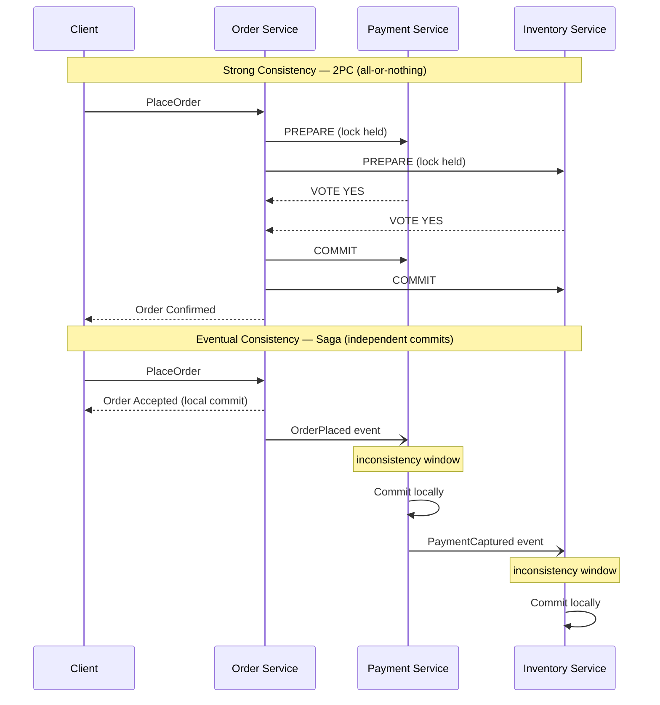
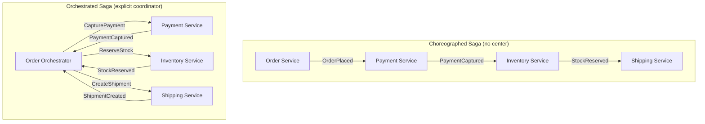
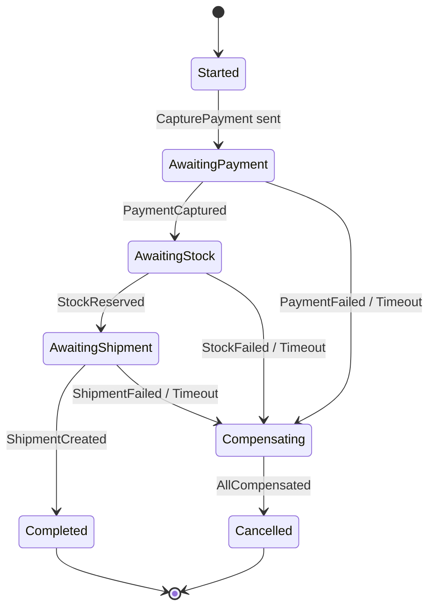
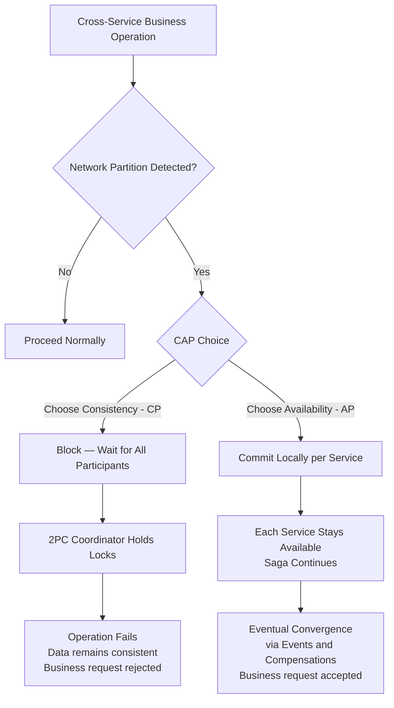

# Capítulo 7: Consistencia, Sagas y Procesos de Larga Duración

## Planteamiento del Problema Inicial

El Capítulo 6 dejó el lado de escritura resuelto: el estado es un registro inmutable de eventos, y la verdad vive en el almacén de eventos. Pero ese capítulo asumió silenciosamente un límite cómodo — un agregado, un stream, una transacción. Los procesos de negocio reales no son tan educados. Colocar un pedido toca inventario, pago y envío. Incorporar un cliente toca identidad, facturación y cumplimiento. Cada uno de estos vive en un servicio diferente, detrás de una base de datos diferente, propiedad de un equipo diferente.

Esta es la pregunta incómoda que responde este capítulo: **¿cómo se mantienen tres servicios consistentes cuando no se pueden envolver en una sola transacción?** El instinto clásico — una transacción distribuida (distributed transaction) que bloquea los tres y confirma atómicamente — suena correcto y casi siempre está equivocado en un sistema cloud-native. Acopla la disponibilidad, penaliza la latencia y falla de maneras difíciles de razonar.

La alternativa es la **saga**: una secuencia de transacciones locales, cada una confirmando de forma independiente, coordinadas por eventos, y revertidas no por rollback sino por *compensación*. Las sagas intercambian la ilusión de consistencia global instantánea por algo honesto y operable: **consistencia eventual** (eventual consistency). Este capítulo muestra cómo funcionan las sagas, cuándo coreografiarlas y cuándo orquestarlas, cómo diseñar compensaciones que realmente deshagan efectos de negocio, y cómo el teorema CAP gobierna silenciosamente cada una de estas decisiones.

## Consistencia Eventual Versus Consistencia Fuerte

Comencemos con la palabra que todo arquitecto usa y pocos definen con precisión. La **consistencia fuerte** (strong consistency) significa que una vez que se completa una escritura, cada lectura posterior — desde cualquier lugar — ve esa escritura. El sistema se comporta como si hubiera una sola copia de los datos y un solo reloj. Esta es la garantía que da una transacción ACID local dentro de una sola base de datos.

La **consistencia eventual** (eventual consistency) hace una promesa más débil: si las escrituras se detienen, todas las réplicas y vistas derivadas *eventualmente* convergerán al mismo valor. Entre la escritura y esa convergencia, existe una ventana en la que diferentes partes del sistema no están de acuerdo. Esa ventana no es un error. Es el precio de mantener los servicios independientes y disponibles.

El error es tratar la consistencia eventual como "consistencia fuerte, pero descuidada." Es un modelo diferente con reglas diferentes. No se pregunta "¿son los datos consistentes?" Se pregunta "¿cuál es la obsolescencia máxima que el negocio puede tolerar, y qué sucede dentro de esa ventana?"

Considere una analogía familiar. Cuando transfiere dinero entre bancos, el saldo del remitente cae inmediatamente, pero el destinatario no ve nada durante horas o días. El dinero está, por un tiempo, *en tránsito* — invisible en ningún lado. El sistema bancario es consistente de forma eventual por diseño, y funciona porque el negocio definió estados intermedios explícitos ("pendiente", "liquidado") y reglas para cada uno. Esa es la disciplina que exige la consistencia eventual.

**Figura 7.1** — El commit en dos fases obliga a todos los participantes a bloquearse y confirmar atómicamente, creando una única ventana de todo o nada; una saga deja que cada servicio confirme localmente en secuencia, aceptando una ventana de inconsistencia visible entre pasos que se cierra a medida que los eventos se propagan hacia adelante.



La siguiente tabla agudiza el contraste.

| Dimensión | Consistencia fuerte | Consistencia eventual |
|---|---|---|
| Lectura después de escritura | Siempre actualizada | Actualizada *eventualmente* |
| Alcance | Base de datos única / transacción | Múltiples servicios |
| Disponibilidad bajo partición | Sacrificada | Preservada |
| Latencia | Mayor (coordinación) | Menor (commits locales) |
| Modo de fallo | Todo o nada | Parcial, luego reconciliado |
| Costo de razonamiento | Bajo | Alto — los estados intermedios importan |

La conclusión para arquitectos senior: **la consistencia eventual no es un compromiso que se acepta a regañadientes; es el supuesto habilitador de los servicios independientes.** En el momento en que se exige consistencia fuerte a través de límites de servicio, se han reacoplado los servicios que los Capítulos 1 al 6 se esforzaron en desacoplar.

<details>
<summary>💡 Nota del Experto</summary>

El texto presenta la consistencia como algo binario (fuerte vs. eventual), lo cual es útil pedagógicamente pero puede llevar a los arquitectos a sobreingeniería. En la práctica, muchos requisitos de UX y API solo necesitan consistencia "read-your-writes" (causal) — el usuario que acaba de crear un recurso puede verlo en la siguiente solicitud, pero que otros usuarios vean una vista ligeramente obsoleta es aceptable. Esto es más débil que la consistencia fuerte pero más fuerte que la eventual pura. Diseñar para read-your-writes a menudo elimina la necesidad de llamadas síncronas entre servicios: redirige al usuario a la URL canónica del recurso recién creado inmediatamente después del commit local, y depende de la propagación de eventos para todos los demás. Distinguir "¿qué nivel de consistencia necesita realmente esta acción del usuario?" evita la respuesta instintiva de agregar llamadas síncronas para lograr consistencia fuerte donde la causal sería suficiente.
</details>

## Por Qué Fallan las Transacciones ACID Distribuidas

Antes de las sagas, hay que reconocer el patrón que reemplazan. La respuesta del libro de texto para la consistencia multi-servicio es el **commit en dos fases** (two-phase commit, 2PC): un coordinador le pide a cada participante que se *prepare*, espera que todos voten sí, y luego les dice que hagan *commit*. Si algún participante vota no, todos abortan. Sobre el papel, atomicidad a través de servicios.

En la práctica, 2PC tiene tres propiedades fatales para los sistemas cloud-native.

Primero, **mantiene bloqueos a través de la red.** Entre prepare y commit, cada participante mantiene sus filas bloqueadas, esperando al coordinador. Una red lenta o un servicio distante convierte un bloqueo de milisegundos en uno de varios segundos, colapsando el rendimiento.

Segundo, **es un protocolo bloqueante.** Si el coordinador falla después de que los participantes votan sí pero antes de que transmita la decisión, los participantes quedan atrapados — bloqueados, inciertos, incapaces de continuar o abortar de forma segura. Este es el conocido estado "en duda", y recuperarse de él es operacionalmente miserable.

Tercero, **acopla la disponibilidad.** Una transacción tiene éxito solo si *cada* participante está activo al mismo instante. Cinco servicios con 99.9% de disponibilidad cada uno producen aproximadamente 99.5% combinado — se ha multiplicado la fragilidad. Esto viola directamente la independencia que hace que los microservicios valgan su costo.

**Listing 7.1** — Este ejemplo simula un coordinador 2PC que dirige tres servicios a través de las fases de prepare y commit. El flag `simulate_crash_after_prepare` demuestra la ventana de estado en duda: los participantes ya votaron sí y mantienen sus bloqueos, pero el coordinador aún no transmitió la decisión — dejando al sistema en un estado irresoluble hasta una intervención manual o un protocolo de recuperación.

```python
# O(n) per phase where n = number of participants; locks held across both phases are the core hazard
from __future__ import annotations

import enum
from dataclasses import dataclass


class VoteResult(enum.Enum):
    YES = "yes"
    NO = "no"


class CoordinatorState(enum.Enum):
    IDLE = "IDLE"
    PREPARING = "PREPARING"
    COMMITTED = "COMMITTED"
    ABORTED = "ABORTED"
    IN_DOUBT = "IN_DOUBT"  # coordinator crashed after votes, before broadcasting the decision


@dataclass
class Participant:
    """Represents one service participating in the distributed transaction."""
    name: str
    vote: VoteResult = VoteResult.YES
    locked: bool = False   # True while row locks are held during the prepare phase
    committed: bool = False

    def prepare(self) -> VoteResult:
        # Participant locks its rows and signals readiness; lock is NOT released until phase 2
        self.locked = True
        return self.vote

    def commit(self) -> None:
        self.locked = False
        self.committed = True

    def abort(self) -> None:
        self.locked = False
        self.committed = False


class TwoPhaseCommitCoordinator:
    """Drives the two phases; exposes the crash-induced in-doubt scenario."""

    def __init__(self, participants: list[Participant]) -> None:
        self.participants = participants
        self.state = CoordinatorState.IDLE
        self._votes: dict[str, VoteResult] = {}

    def run(self, simulate_crash_after_prepare: bool = False) -> CoordinatorState:
        # ── Phase 1 — Prepare ───────────────────────────────────────────────
        # Coordinator asks every participant to vote; each locks its rows.
        self.state = CoordinatorState.PREPARING
        for p in self.participants:
            vote = p.prepare()
            self._votes[p.name] = vote
            print(f"  {p.name:20s}  voted {vote.value:3s}  locked={p.locked}")

        all_yes = all(v == VoteResult.YES for v in self._votes.values())

        if simulate_crash_after_prepare:
            # The coordinator dies here. Participants hold locks and cannot safely
            # commit or abort on their own — the "in-doubt" blocking window begins.
            self.state = CoordinatorState.IN_DOUBT
            stuck = [p.name for p in self.participants if p.locked]
            print(f"\n  *** COORDINATOR CRASHED — in-doubt participants (locks held): {stuck} ***")
            print("  Recovery requires the coordinator to restart and re-broadcast its decision.")
            return self.state

        # ── Phase 2 — Commit or Abort ────────────────────────────────────────
        # Only reached if the coordinator survived; broadcasts a single uniform decision.
        if all_yes:
            for p in self.participants:
                p.commit()
            self.state = CoordinatorState.COMMITTED
        else:
            for p in self.participants:
                p.abort()
            self.state = CoordinatorState.ABORTED

        return self.state


# ── Demo ─────────────────────────────────────────────────────────────────────
if __name__ == "__main__":
    print("=== Happy path: all participants vote YES ===")
    services = [Participant("OrderSvc"), Participant("PaymentSvc"), Participant("InventorySvc")]
    result = TwoPhaseCommitCoordinator(services).run()
    print(f"Coordinator final state: {result.value}\n")

    print("=== Crash scenario: coordinator dies after phase 1 ===")
    services = [Participant("OrderSvc"), Participant("PaymentSvc"), Participant("InventorySvc")]
    result = TwoPhaseCommitCoordinator(services).run(simulate_crash_after_prepare=True)
    print(f"Coordinator final state: {result.value}")
    # Expected output:
    #   *** COORDINATOR CRASHED — in-doubt participants (locks held): ['OrderSvc', 'PaymentSvc', 'InventorySvc'] ***
```

Hay una verdad más profunda aquí, y es el teorema CAP, al cual volvemos al final del capítulo: cuando una partición de red divide los servicios, 2PC elige consistencia negándose a continuar. Para la mayoría de los procesos de negocio — pedidos, reservas, registros — negarse a continuar es la respuesta incorrecta. El negocio preferiría aceptar el pedido ahora y reconciliar después. Esa preferencia *es* la elección de una saga.

> 💡 **Nota del Experto:** El texto identifica correctamente 2PC como el patrón a reemplazar, pero omite una trampa empresarial muy extendida: las transacciones XA (JTA en Jakarta EE, `@Transactional` de Spring abarcando múltiples beans `DataSource` o `ConnectionFactory`, y MSDTC en .NET) son 2PC disfrazado. Muchos equipos creen que no están usando ACID distribuido hasta que rastrean un incidente en producción y encuentran un coordinador XA manteniendo bloqueos silenciosamente a través de una base de datos y un message broker. La señal es un `javax.transaction.UserTransaction` o `ChainedTransactionManager` en el árbol de dependencias. Audite su grafo de dependencias antes de declarar que ha eliminado 2PC de una ruta de migración heredada.

<details>
<summary>⚠️ Nota Crítica</summary>

El capítulo enmarca 2PC como una elección puramente "CP" — un sistema que sacrifica disponibilidad a cambio de consistencia cuando ocurre una partición. Esto es una simplificación excesiva que el propio estado en duda ya refuta dentro de la misma sección. Cuando el coordinador falla después de que los participantes hayan votado *sí* pero antes de que se transmita la decisión de commit, los participantes están bloqueados e inciertos — no pueden ni confirmar ni abortar de forma segura. En ese punto, el sistema no es ni disponible *ni* consistente: está atascado. 2PC no garantía C de manera confiable bajo fallos del coordinador; garantiza que no ocurra ningún commit incorrecto, lo cual no es lo mismo que proporcionar una lectura consistente. La caracterización CAP de 2PC como CP es una abreviatura útil para el compromiso de tolerancia a particiones, pero presentarla sin la advertencia de que la garantía "C" se degrada bajo fallos del coordinador es engañoso para los profesionales que evalúan modos de fallo.

**Corrección sugerida:** Calificar la caracterización CP: "2PC se describe típicamente como CP, pero la garantía es más precisamente 'ningún commit incorrecto' — bajo fallos del coordinador, los participantes en duda no logran ni disponibilidad ni un estado consistente garantizado. El costo real de 2PC no es solo disponibilidad perdida bajo particiones sino recuperabilidad perdida bajo fallos del coordinador."
</details>

## Sagas Coreografiadas Versus Orquestadas

Una **saga** es una secuencia de transacciones locales donde cada paso publica un evento que desencadena el siguiente. Si un paso falla, la saga ejecuta **transacciones compensatorias** (compensating transactions) para deshacer los pasos completados. Hay dos formas de conectar los pasos, y la distinción — presentada por primera vez en el Capítulo 3 como una topología, aplicada ahora específicamente a las sagas — define cómo operará el sistema.

En una **saga coreografiada** (choreographed saga), no hay coordinador central. Cada servicio escucha eventos, hace su trabajo local y emite su propio evento. El servicio de pedidos publica `OrderPlaced`; el servicio de pagos reacciona, carga la tarjeta y publica `PaymentCaptured`; el servicio de inventario reacciona a *ese* y reserva el stock. El flujo vive en las reacciones. Ningún componente individual conoce el proceso completo.

En una **saga orquestada** (orchestrated saga), un coordinador dedicado — el **orquestador** (orchestrator) — es dueño del proceso. Envía comandos explícitos (`CapturePayment`, `ReserveStock`), espera respuestas y decide el siguiente paso. El Order Orchestrator conoce cada paso, cada posible fallo y cada compensación. El flujo vive en un solo lugar.

**Figura 7.2** — La coreografía conecta los servicios a través de una cadena de eventos reactivos sin coordinador único, mientras que la orquestación coloca toda la lógica del proceso en un orquestador explícito que emite comandos y espera respuestas — comprender este compromiso determina qué tan visible y mantenible será el flujo de la saga a medida que crece la complejidad.



El compromiso es real y se trata de *dónde vive la lógica del proceso*.

| Factor | Coreografía | Orquestación |
|---|---|---|
| Acoplamiento | Bajo — los servicios solo conocen eventos | Mayor — el orquestador conoce todos los pasos |
| Visibilidad | Deficiente — el flujo es implícito | Excelente — el flujo es explícito en un solo lugar |
| Agregar un paso | Tocar múltiples servicios | Tocar el orquestador |
| Riesgo de ciclos | Alto — eventos desencadenando eventos | Bajo — los comandos son dirigidos |
| Mejor para | Flujos cortos, 2–4 pasos | Flujos complejos, muchas ramificaciones |
| Depuración | Difícil — sin narrativa única | Más fácil — un solo estado para inspeccionar |

Aquí está la guía con posición propia. **Use coreografía para flujos cortos y estables** donde las reacciones son obvias e improbables de cambiar. El desacoplamiento es genuino y la simplicidad es real. Pero **en el momento en que una saga crece más allá de tres o cuatro pasos, o adquiere ramas condicionales, recurra a la orquestación.** Las sagas coreografiadas a escala se convierten en "espagueti de eventos" — nadie puede decirle lo que hace el proceso sin rastrear eventos a través de seis servicios. El flujo de control implícito que hace elegante a la coreografía a pequeña escala la hace inmantenible a gran escala. Prefiera el orquestador aburrido y visible.

> 💡 **Nota del Experto:** El texto advierte correctamente sobre el "espagueti de eventos" en la coreografía, pero la dependencia de confiabilidad en la publicación transaccional de eventos merece igual énfasis. En una saga coreografiada, si un servicio confirma su transacción de base de datos local pero falla antes de publicar el evento downstream, la saga se detiene silenciosamente — sin excepción, sin alerta, sin siguiente paso. El Outbox Pattern (escribir el evento en una tabla `outbox` local en la misma transacción ACID y sondearlo con un relay) no es opcional para sagas coreografiadas en producción; es el mecanismo que hace que la coreografía sea confiable en absoluto. Sin él, la ventaja del desacoplamiento se ve socavada por una brecha de confiabilidad oculta. Si este capítulo hace referencia al Outbox Pattern de un capítulo anterior, haga esa dependencia explícita aquí.

<details>
<summary>💡 Nota del Experto</summary>

La estrategia de pruebas diverge marcadamente entre las dos topologías, y esto moldea la velocidad del equipo en la práctica. Las sagas coreografiadas requieren pruebas de contrato a través de los límites de servicio (Pact, Spring Cloud Contract) para verificar que un evento publicado por el Servicio A satisface realmente el esquema de consumidor del Servicio B — sin esto, las integraciones se rompen silenciosamente cuando se renombra un campo. Las sagas orquestadas se pueden probar unitariamente de forma aislada: simular los canales de comandos downstream, alimentar eventos de respuesta, verificar transiciones de estado. El conjunto de pruebas del orquestador se convierte en la documentación viva de la saga. Los equipos que eligen orquestación por visibilidad a menudo subestiman que también les da una superficie de pruebas dramáticamente más simple — un punto que vale la pena destacar para los arquitectos que prefieren la coreografía por razones ideológicas.
</details>

## Transacciones Compensatorias y Rollback Semántico

El corazón de la saga es lo que sucede cuando el paso cuatro falla después de que los pasos uno al tres tuvieron éxito. No hay `ROLLBACK` — esas transacciones ya confirmaron, en otras bases de datos, posiblemente hace horas. En cambio, la saga ejecuta **transacciones compensatorias**: nuevas transacciones que semánticamente deshacen el efecto de las completadas.

La palabra crítica es **semánticamente**. Una compensación no es una reversión técnica a un estado anterior; es una *nueva acción de negocio* que contrarresta una anterior. No se descarga una tarjeta de crédito — se *emite un reembolso*. No se des-envía un correo electrónico — se *envía una corrección*. No se elimina un registro de envío — se *cancela el envío*. La acción compensatoria es en sí misma un hecho real, registrado y que avanza hacia adelante.

**Listing 7.2** — Este ejemplo implementa el núcleo de ejecución de saga independiente de coreografía: cada `SagaStep` agrupa una acción de avance con su compensación semántica. Cuando cualquier paso lanza una excepción, el ejecutor deshace solo los pasos ya completados en estricto orden inverso — asegurando que los efectos se deshagan en una secuencia de negocio sensata. Las acciones de compensación son nuevos hechos de negocio (reembolso, liberación, cancelación), nunca deshechos de base de datos en bruto.

```python
# Saga execution — O(n) forward, O(k) compensation where k = steps completed before failure
from __future__ import annotations

import enum
from dataclasses import dataclass, field
from typing import Callable


class StepStatus(enum.Enum):
    PENDING = "pending"
    COMPLETED = "completed"
    COMPENSATED = "compensated"
    FAILED = "failed"


@dataclass
class SagaStep:
    """Pairs a forward business action with its semantic compensation."""
    name: str
    action: Callable[[], None]
    compensation: Callable[[], None]
    status: StepStatus = field(default=StepStatus.PENDING, init=False)


class OrderSaga:
    """
    Executes an order saga: ReserveStock → CapturePayment → CreateShipment.
    On any failure, compensates completed steps in reverse order.
    """

    def __init__(self, order_id: str) -> None:
        self.order_id = order_id
        # Steps are declared in the intended execution order.
        # Compensations are the semantic inverse — a refund, not an un-charge.
        self.steps: list[SagaStep] = [
            SagaStep("ReserveStock",   self._reserve_stock,   self._release_stock),
            SagaStep("CapturePayment", self._capture_payment, self._refund_payment),
            SagaStep("CreateShipment", self._create_shipment, self._cancel_shipment),
        ]

    # ── Forward actions ───────────────────────────────────────────────────────

    def _reserve_stock(self) -> None:
        print(f"  [ReserveStock]   stock reserved   order={self.order_id}")

    def _capture_payment(self) -> None:
        print(f"  [CapturePayment] charging card     order={self.order_id}")
        # Simulate a transient infrastructure failure mid-saga
        raise RuntimeError("Payment gateway timeout — no charge was made")

    def _create_shipment(self) -> None:
        print(f"  [CreateShipment] shipment created  order={self.order_id}")

    # ── Compensating actions — semantic reversals, each a new business fact ──

    def _release_stock(self) -> None:
        # Idempotent: check a compensation key in production to guard against double-release
        print(f"  [ReleaseStock]   stock released    order={self.order_id}")

    def _refund_payment(self) -> None:
        # Issues a refund record, not a deletion of the charge attempt
        print(f"  [RefundPayment]  refund issued     order={self.order_id}")

    def _cancel_shipment(self) -> None:
        print(f"  [CancelShipment] shipment cancelled order={self.order_id}")

    # ── Saga runner ───────────────────────────────────────────────────────────

    def execute(self) -> bool:
        """
        Run forward steps in order. On the first failure, compensate every
        previously completed step in reverse order (LIFO), then return False.
        """
        completed: list[SagaStep] = []

        for step in self.steps:
            try:
                step.action()
                step.status = StepStatus.COMPLETED
                completed.append(step)
            except Exception as exc:
                step.status = StepStatus.FAILED
                print(f"\n  Step '{step.name}' failed: {exc}")
                print("  Compensating completed steps in reverse order...")
                # Reverse-order compensation ensures effects unwind in a sensible sequence
                for done in reversed(completed):
                    done.compensation()
                    done.status = StepStatus.COMPENSATED
                return False

        return True


# ── Demo ─────────────────────────────────────────────────────────────────────
if __name__ == "__main__":
    print("=== Order Saga: ReserveStock succeeds, CapturePayment fails ===\n")
    saga = OrderSaga(order_id="ORD-42")
    success = saga.execute()

    print(f"\nSaga result: {'completed' if success else 'compensated'}")
    for step in saga.steps:
        print(f"  {step.name:20s}  {step.status.value}")
    # Expected output:
    #   [ReserveStock]   stock reserved   order=ORD-42
    #   [CapturePayment] charging card     order=ORD-42
    #   Step 'CapturePayment' failed: Payment gateway timeout — no charge was made
    #   Compensating completed steps in reverse order...
    #   [ReleaseStock]   stock released    order=ORD-42
    #   Saga result: compensated
    #   ReserveStock          compensated
    #   CapturePayment        failed
    #   CreateShipment        pending
```

Tres propiedades hacen confiables a las compensaciones, y cada una se mapea a una regla de diseño.

1. **Las compensaciones deben ser idempotentes.** Un comando de reembolso puede entregarse más de una vez bajo entrega at-least-once (Capítulo 4). Reemitirlo no debe reembolsar dos veces. Use una clave de compensación y verifique "¿ya compensado?" antes de actuar.

2. **Las compensaciones deben aplicarse en estricto orden inverso.** Ejecútelas en orden inverso a los pasos de avance, para que los efectos se deshagan en una secuencia sensata — libere el stock que reservó, reembolse el pago que capturó.

3. **Algunas acciones no pueden compensarse — así que ordene la saga en torno a ellas.** No se puede des-lanzar un misil ni des-enviar un paquete físico. Estas son **transacciones pivote** (pivot transactions): después del pivote, la saga solo puede avanzar. La regla de diseño es colocar todos los pasos *compensables* antes del pivote y todos los pasos *reintentables* (garantizados de eventualmente tener éxito) después de él. Estructure la saga para que el paso irreversible ocurra al final, una vez que todo lo reversible ya haya tenido éxito.

Esta taxonomía — compensable, pivote, reintentable — es el modelo mental más útil para diseñar sagas. Clasifique cada paso, luego ordénelos para que el fallo sea siempre completamente reversible o garantizado de completarse.

> **Pro Tip:** La compensación no es manejo de errores añadido después. Es la mitad del proceso de negocio. Si no puede describir cómo deshacer un paso en términos de negocio, aún no comprende el paso. Modele la compensación al mismo tiempo que modela la acción de avance — en la misma sesión de Event Storming del Capítulo 2.

> 💡 **Nota del Experto:** El texto establece que las compensaciones deben ser idempotentes, pero no aborda el caso en que la propia compensación falla — y este es uno de los escenarios operacionalmente más peligrosos en sagas en producción. Un comando `RefundPayment` puede ser rechazado por un procesador de pagos downstream que está temporalmente caído, o rechazado porque la tarjeta ha sido cancelada. Cuando la transacción compensatoria es inentregable o rechazada, la saga queda atascada en un estado parcialmente compensado sin ruta de resolución automática. Los sistemas en producción deben modelar esto explícitamente: un estado terminal `CompensationFailed` respaldado por una dead-letter queue, una regla de alerta y un playbook de remediación manual. En industrias reguladas (servicios financieros, salud) este estado también debe disparar un evento de cumplimiento. Los equipos que omiten este estado descubren que existe de todos modos — simplemente no pueden observarlo ni actuar sobre él.

> ⚠️ **Nota Crítica:** Toda la sección sobre compensaciones describe una única instancia de saga de forma aislada. Nunca aborda el *problema de aislamiento de sagas*: porque cada transacción local confirma de forma independiente y los estados intermedios de la saga son completamente visibles para otras transacciones concurrentes, las sagas sufren de fenómenos que el aislamiento ACID previene — específicamente lecturas sucias y actualizaciones perdidas. Un proceso concurrente que lee el registro de pedido entre `PaymentCaptured` y `ShipmentCreated` ve un estado que puede compensarse posteriormente. Dependiendo de lo que haga con esos datos, la compensación puede ser insuficiente para restaurar la corrección global. El artículo original de Garcia-Molina de 1987 que introdujo las sagas identificó explícitamente esta limitación, y "Microservices Patterns" de Chris Richardson (la referencia canónica para profesionales) dedica una sección completa a las contramedidas: bloqueos semánticos, actualizaciones conmutativas, vistas pesimistas y re-lectura de valores. Para una audiencia de arquitectos senior que diseña sistemas de procesamiento de pedidos de alta concurrencia, omitir esto es una brecha material — es la fuente más común de corrupción sutil de datos en implementaciones de sagas en producción.

<details>
<summary>⚠️ Nota Crítica</summary>

La Propiedad 2 establece "Las compensaciones deben aplicarse en estricto orden inverso." La formulación original en inglés usaba el término "commutative-safe" (conmutativo seguro), lo cual es un error terminológico que contradice directamente el consejo que le sigue. La *conmutatividad* significa que el orden de las operaciones no importa — si las compensaciones fueran conmutativas, no habría necesidad de ejecutarlas en orden inverso. El texto luego instruye inmediatamente al lector a ejecutar las compensaciones en orden inverso, lo cual es lo *opuesto* a un requisito de conmutatividad. Lo que la propiedad realmente requiere es un estricto *orden secuencial* inverso: cada compensación debe aplicarse en secuencia inversa relativa a los pasos de avance. Llamar a esto "commutative-safe" confundirá a cualquier ingeniero que conozca el término.

**Corrección sugerida:** Reemplazar "Las compensaciones deben ser conmutativas seguras con respecto al orden" con "Las compensaciones deben aplicarse en estricta secuencia inversa: deshacer primero el último paso confirmado." Aclarar que la conmutatividad significaría que el orden es irrelevante, lo cual es lo opuesto a la restricción aquí.
</details>

## Gestores de Procesos y Máquinas de Estado

Un orquestador que simplemente reenvía comandos es delgado. Un orquestador real debe recordar: qué pasos se han completado, cuáles están pendientes, qué hacer en cada respuesta, cuándo agotar el tiempo de espera y cuándo comenzar a compensar. Ese coordinador con estado tiene un nombre — el **gestor de procesos** (process manager) — y su implementación más confiable es una **máquina de estados** (state machine) explícita.

Un gestor de procesos es un componente que recibe eventos, mantiene el estado de una única instancia de saga y decide el siguiente comando basándose en ese estado. Modélelo como un conjunto finito de estados con transiciones definidas: `AwaitingPayment → AwaitingStock → AwaitingShipment → Completed`, con aristas de fallo que ramifican en `Compensating → Cancelled`. Cada evento entrante avanza el estado o desencadena compensación. Nada sucede implícitamente.

**Figura 7.3** — Esta máquina de estados captura cada estado observable de una saga de pedido en vuelo y hace explícitas tanto la ruta feliz como las rutas de compensación como transiciones — persistir este estado en cada transición es lo que permite al gestor de procesos sobrevivir fallos y reanudar sin huérfanos de pedidos en vuelo.



Dos disciplinas de implementación separan un gestor de procesos robusto de uno frágil.

**Persistir el estado de la saga en cada transición.** El gestor de procesos es en sí mismo un agregado — y todo lo del Capítulo 6 aplica. Su estado debe sobrevivir a un fallo. Cuando el orquestador reinicia, rehidrata cada saga en vuelo desde su estado persistido y reanuda exactamente donde se quedó. Un gestor de procesos que mantiene el estado de la saga solo en memoria huérfanará, en el primer reinicio del pod, cada pedido en vuelo. Esto no es hipotético; es el error de saga más común en producción.

**Tratar los timeouts como estados de primera clase, no como ocurrencias tardías.** En un mundo síncrono, una llamada colgada lanza una excepción. En una saga, un paso que nunca responde simplemente... espera, para siempre, silenciosamente. El gestor de procesos debe establecer un temporizador en cada paso pendiente. Si `PaymentCaptured` no llega dentro del plazo, el timeout es un *evento* que transiciona la máquina de estados — usualmente hacia la compensación. Los procesos de larga duración viven y mueren por su manejo de la respuesta que nunca llega.

> **Pro Tip:** Resista el impulso de codificar gestores de procesos a mano con condicionales anidados y flags booleanos (`paymentDone`, `stockDone`). Ese estilo se deteriora en el instante en que aparece un cuarto paso. Una máquina de estados explícita — una tabla de (estado actual, evento) → (siguiente estado, acción) — permanece legible con diez estados y es directamente testeable sin ninguna infraestructura.

Muchos equipos recurren a un motor de workflow aquí — Temporal, AWS Step Functions, Camunda — precisamente porque estas herramientas proporcionan estado duradero, temporizadores y reintentos de forma nativa. Es una elección razonable. Pero comprenda lo que le dan: una máquina de estados persistida y gestionada. El patrón es el mismo ya sea que lo implemente a mano o lo adquiera.

<details>
<summary>💡 Nota del Experto</summary>

El texto recomienda Temporal, AWS Step Functions y Camunda como opciones razonables, lo cual es preciso. Sin embargo, sus modelos de durabilidad difieren de maneras que emergen bajo fallos: Temporal persiste un historial de eventos completo y seguro para replay en una base de datos (Postgres o Cassandra) y reconstruye el estado del workflow reproduciendo ese historial — un fallo a mitad de paso reproduce todas las actividades anteriores al reiniciar. AWS Step Functions almacena el estado de ejecución en su propio almacén gestionado pero impone límites estrictos (25,000 eventos de historial por ejecución) que afectan los procesos de larga duración que abarcan semanas. Camunda 8 utiliza el log replicado de Zeebe. Los equipos que seleccionan una de estas herramientas basándose únicamente en la experiencia del desarrollador, y luego alcanzan un límite de historial de ejecución o descubren que Temporal requiere operar su propio clúster de base de datos, enfrentan migraciones costosas. Evalúe el modelo de durabilidad y la huella operacional antes de comprometerse.
</details>

<details>
<summary>💡 Nota del Experto</summary>

Un antipatrón común cuando los equipos adoptan motores de workflow es codificar reglas de negocio dentro del propio orquestador — ramas condicionales basadas en el nivel del cliente, lógica de precios, verificaciones de cumplimiento — convirtiéndolo en un "God Workflow". El orquestador debe emitir comandos y recibir respuestas; debe contener solo flujo de control (secuencia, ramificación en tipo de respuesta, timeout). Las reglas de negocio pertenecen a los servicios que ejecutan los comandos. Cuando el orquestador crece más allá de unas pocas centenas de líneas de lógica de control, se vuelve tan difícil de cambiar como el monolito que la saga reemplazó. La disciplina es: si una condición de rama requiere conocimiento del dominio, pertenece a un servicio, no al coordinador de la saga.
</details>

## El Teorema CAP Aplicado a Flujos de Eventos

Todo en este capítulo es consecuencia de un teorema, así que hay que hacerlo explícito. El **teorema CAP** establece que un sistema distribuido, cuando una **partición** (P) de red lo divide, puede preservar ya sea **consistencia** (C) — cada nodo ve los mismos datos — o **disponibilidad** (A) — cada solicitud obtiene una respuesta — pero no ambas. Las particiones no son opcionales; las redes fallan. Así que la elección real no es "CA versus algo." Cuando ocurre la partición, se elige C o A.

Las transacciones distribuidas y 2PC son la elección **CP**: bajo una partición, se niegan a continuar para mantener los datos consistentes. El pedido simplemente falla. Las sagas son la elección **AP**: bajo una partición, cada transacción local aún confirma, el sistema permanece disponible, y la consistencia se restaura posteriormente a través del flujo de eventos y compensaciones. **Una saga es, en su núcleo, una apuesta arquitectónica de que la disponibilidad importa más que la consistencia instantánea** — y para la mayoría de los procesos de negocio, esa apuesta es correcta.

Esto reencuadra la consistencia eventual de una limitación a una posición deliberada. No se está conformando con consistencia débil porque las sagas no pueden hacerlo mejor. Se está *eligiendo* disponibilidad, y la consistencia eventual es la forma disciplinada de honrar esa elección mientras aún se converge a un estado final correcto.

**Figura 7.4** — Cuando ocurre una partición de red, el sistema debe elegir entre bloquear la operación para preservar la consistencia (CP — la ruta 2PC) o confirmar localmente para permanecer disponible y converger después (AP — la ruta de saga), y este diagrama hace explícito que las sagas no son una solución alternativa sino una elección arquitectónica deliberada con consecuencias de negocio predecibles.



Un matiz que vale la pena interiorizar, y es donde los arquitectos senior ganan su título. CAP no es una propiedad de todo el sistema; es una propiedad de cada *operación*. Cargar un pago podría demandar estrictez similar a CP dentro del propio límite del servicio de pagos — una única transacción ACID, sin ambigüedad sobre el dinero. Coordinar ese pago con inventario y envío a través de servicios es AP — una saga. Las arquitecturas maduras no son uniformemente consistentes o uniformemente disponibles. Son fuertemente consistentes *dentro* de cada límite de servicio y eventualmente consistentes *a través* de límites, con las sagas como el puente entre los dos regímenes.

<details>
<summary>⚠️ Nota Crítica</summary>

El teorema CAP se presenta como un marco completo y actual para las decisiones de consistencia distribuida, pero sus limitaciones prácticas están bien establecidas. El propio Eric Brewer reconoció en su retrospectiva de 2012 ("CAP Twelve Years Later: How the 'Rules' Have Changed," IEEE Computer) que el encuadre binario del teorema oscurece más de lo que revela. El teorema PACELC (Abadi, 2012) — que extiende CAP para abordar el compromiso latencia/consistencia que existe *incluso cuando no hay partición* — es el modelo más operacionalmente relevante para los arquitectos que diseñan sistemas dirigidos por eventos, donde la pregunta cotidiana no es "¿qué sucede durante una partición" sino "¿cuál es el costo de latencia de una consistencia más fuerte cuando la red está sana?" Presentar CAP sin este contexto lleva a los arquitectos senior a usarlo como un instrumento contundente al evaluar el comportamiento del sistema fuera de escenarios de fallo, que es el caso común.

**Corrección sugerida:** Agregar un cuadro lateral "Más allá de CAP" señalando: (1) la "C" de CAP significa específicamente linearizabilidad, no todos los modelos de consistencia; (2) el modelo PACELC extiende el análisis a la dimensión latencia/consistencia bajo operación normal; (3) la retrospectiva de Brewer de 2012 recomienda tratar el compromiso como continuo en lugar de binario. Esto posiciona al lector para leer la documentación de proveedores con precisión.
</details>

## Conclusiones Clave

- **Las transacciones ACID distribuidas no escalan.** El commit en dos fases mantiene bloqueos a través de la red, se bloquea ante fallos del coordinador y multiplica la fragilidad de sus servicios en un único punto de fallo. Rechácelo para procesos de negocio entre servicios.
- **Una saga es una secuencia de transacciones locales coordinadas por eventos, revertidas por compensación, no por rollback.** Acepta la consistencia eventual para preservar la disponibilidad y la independencia de los servicios.
- **Coreografíe flujos cortos y estables; orqueste los complejos o con ramificaciones.** La coreografía desacopla pero oculta el proceso; la orquestación centraliza la lógica y hace visible el flujo. Más allá de tres o cuatro pasos, prefiera la orquestación.
- **Las compensaciones son nuevas acciones de negocio, no deshechos técnicos.** Clasifique cada paso como compensable, pivote o reintentable, y ordene la saga para que la irreversibilidad llegue al final.
- **Un gestor de procesos es una máquina de estados persistida.** Persista el estado en cada transición y trate los timeouts como eventos de primera clase, o el primer reinicio del pod huérfanará sus sagas en vuelo.
- **Las sagas son la elección AP del teorema CAP.** Consistencia fuerte dentro de cada límite de servicio, consistencia eventual a través de límites, con la saga como el puente.

## Qué Sigue

Las sagas dependen de eventos cuyo significado permanece estable a través de servicios y a través del tiempo — lo que plantea el problema que el Capítulo 8 enfrenta de frente: cómo evolucionar esquemas y contratos de eventos sin romper los consumidores y las sagas de larga duración que dependen de ellos.

<!-- ASSEMBLY COMPLETE
  Chapter: Consistency, Sagas, and Long-Running Processes
  Code blocks resolved: 2 / 2
  Diagrams resolved: 4 / 4
  Expert callouts (inline): 3
  Expert callouts (collapsed): 4
  Critical callouts (inline): 1
  Critical callouts (collapsed): 3
  Unresolved markers: 0
-->
