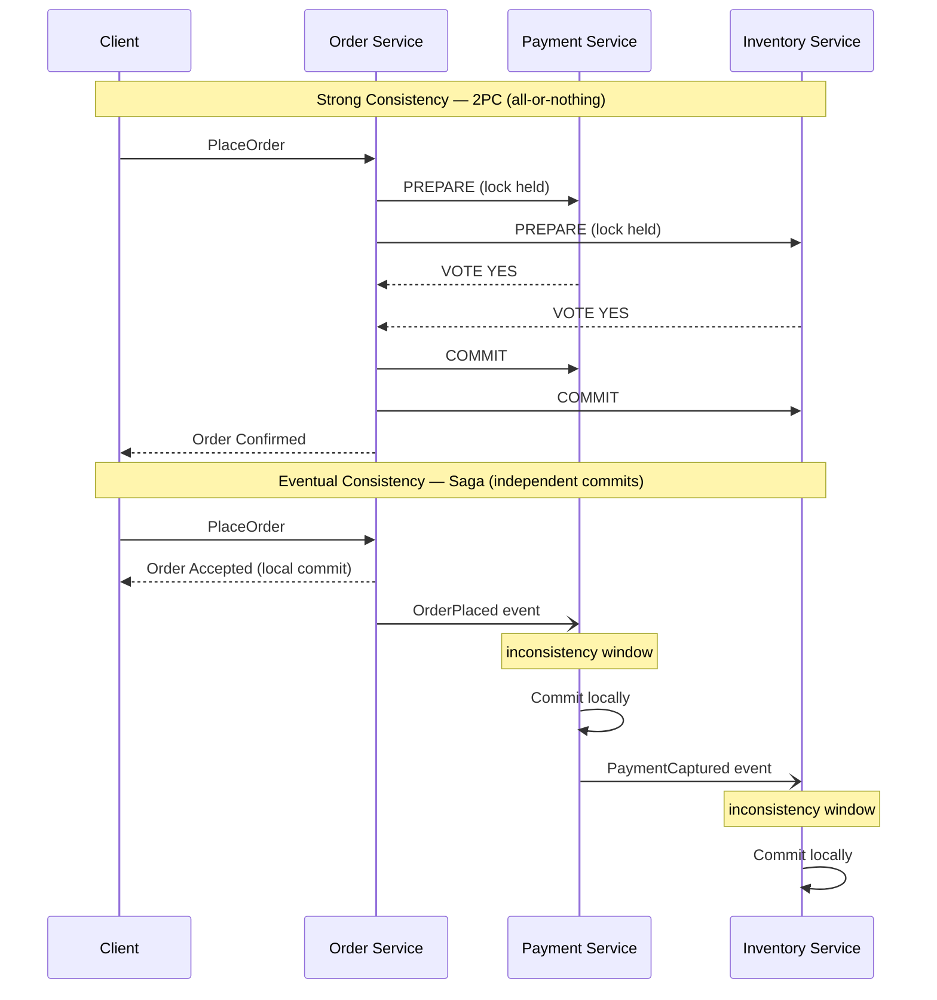
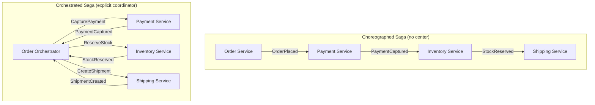
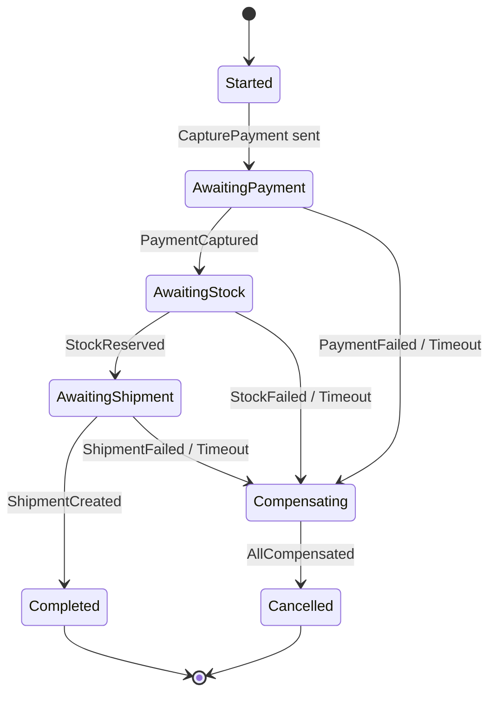
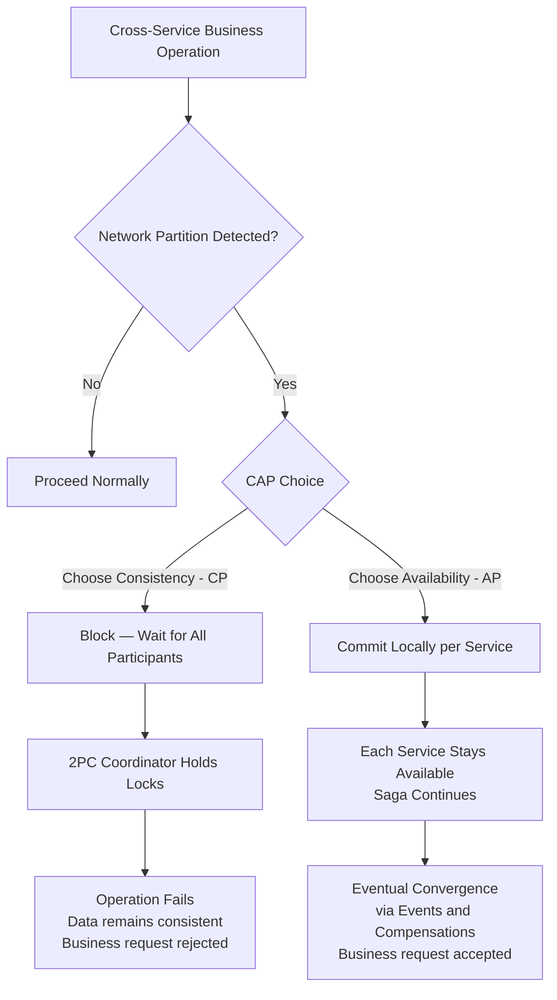

# Capítulo 7: Consistência, Sagas e Processos de Longa Duração

## Problema de Abertura

O Capítulo 6 deixou o lado de escrita resolvido: o estado é um log imutável de eventos, e a verdade reside no event store (armazenamento de eventos). Mas aquele capítulo assumiu silenciosamente uma fronteira confortável — um agregado, um stream, uma transação. Os processos de negócio reais não são tão educados. Realizar um pedido envolve estoque, pagamento e entrega. Integrar um cliente envolve identidade, faturamento e conformidade. Cada um desses elementos vive em um serviço diferente, atrás de um banco de dados diferente, pertencente a uma equipe diferente.

Aqui está a questão desconfortável que este capítulo responde: **como você mantém três serviços consistentes quando não pode envolvê-los em uma única transação?** O instinto clássico — uma transação distribuída que bloqueia os três e confirma atomicamente — soa correto e está quase sempre errado em um sistema cloud-native. Ele acopla disponibilidade, penaliza a latência e falha de formas difíceis de raciocinar.

A alternativa é a **saga**: uma sequência de transações locais, cada uma confirmando independentemente, coordenadas por eventos, e revertidas não por rollback, mas por *compensação*. As sagas trocam a ilusão de consistência global instantânea por algo honesto e operável: **consistência eventual** (eventual consistency). Este capítulo mostra como as sagas funcionam, quando coreografá-las e quando orquestrá-las, como projetar compensações que realmente desfazem efeitos de negócio, e como o teorema CAP governa silenciosamente cada uma dessas escolhas.

## Consistência Eventual Versus Consistência Forte

Comece com a palavra que todo arquiteto usa e poucos definem com precisão. **Consistência forte** (strong consistency) significa que, uma vez concluída uma escrita, toda leitura subsequente — de qualquer lugar — verá essa escrita. O sistema se comporta como se houvesse uma única cópia dos dados e um único relógio. Essa é a garantia que uma transação ACID local fornece dentro de um banco de dados.

**Consistência eventual** (eventual consistency) faz uma promessa mais fraca: se as escritas pararem, todas as réplicas e visões derivadas *eventualmente* convergirão para o mesmo valor. Entre a escrita e essa convergência, existe uma janela na qual diferentes partes do sistema discordam. Essa janela não é um bug. É o preço de manter os serviços independentes e disponíveis.

O erro é tratar a consistência eventual como "consistência forte, porém desleixada." É um modelo diferente com regras diferentes. Você não pergunta "os dados são consistentes?" Você pergunta "qual é a desatualização máxima que o negócio pode tolerar e o que acontece dentro dessa janela?"

Considere uma analogia familiar. Quando você transfere dinheiro entre bancos, o saldo do remetente cai imediatamente, mas o destinatário não vê nada por horas ou dias. O dinheiro está, por um tempo, *em trânsito* — invisível em qualquer lugar. O sistema bancário é eventualmente consistente por design, e funciona porque o negócio definiu estados intermediários explícitos ("pendente," "liquidado") e regras para cada um. Essa é a disciplina que a consistência eventual exige.

**Figura 7.1** — O two-phase commit (confirmação em duas fases) força todos os participantes a bloquear e confirmar atomicamente, criando uma única janela de tudo-ou-nada; uma saga permite que cada serviço confirme localmente em sequência, aceitando uma janela de inconsistência visível entre as etapas que se fecha conforme os eventos se propagam para frente.



A tabela abaixo aprofunda o contraste.

| Dimensão | Consistência forte | Consistência eventual |
|---|---|---|
| Leitura após escrita | Sempre atual | Atual *eventualmente* |
| Escopo | Banco de dados único / transação | Múltiplos serviços |
| Disponibilidade sob partição | Sacrificada | Preservada |
| Latência | Maior (coordenação) | Menor (confirmações locais) |
| Modo de falha | Tudo-ou-nada | Parcial, depois reconciliado |
| Custo de raciocínio | Baixo | Alto — estados intermediários importam |

A conclusão sênior: **a consistência eventual não é um compromisso aceito com relutância; é a suposição habilitante de serviços independentes.** No momento em que você exige consistência forte entre fronteiras de serviços, você reacoplou os serviços que passou dos Capítulos 1 a 6 desacoplando.

<details>
<summary>💡 Nota do Especialista</summary>

O texto apresenta a consistência como binária (forte vs. eventual), o que é pedagogicamente útil, mas pode levar arquitetos a projetar em excesso. Na prática, muitos requisitos de UX e API precisam apenas de consistência "read-your-writes" (causal) — o usuário que acabou de criar um recurso pode vê-lo na próxima requisição, mas outros usuários verem uma visão ligeiramente desatualizada é aceitável. Isso é mais fraco que a consistência forte, mas mais forte que a consistência eventual pura. Projetar para read-your-writes frequentemente elimina a necessidade de chamadas síncronas entre serviços: redirecione o usuário para a URL canônica do recurso recém-criado imediatamente após a confirmação local, e confie na propagação de eventos para todos os outros. Distinguir "de qual nível de consistência esta ação do usuário realmente precisa?" evita a resposta de joelho de adicionar chamadas síncronas para alcançar consistência forte onde a causal seria suficiente.
</details>

## Por Que Transações ACID Distribuídas Falham

Antes das sagas, preste atenção ao padrão que elas substituem. A resposta do livro didático para consistência entre múltiplos serviços é o **two-phase commit** (2PC): um coordenador pede a cada participante que *prepare*, aguarda que todos votem sim, depois diz a todos para *confirmar*. Se algum participante votar não, todos abortam. No papel, atomicidade entre serviços.

Na prática, o 2PC possui três propriedades fatais para sistemas cloud-native.

Primeiro, **ele mantém bloqueios pela rede.** Entre prepare e commit, cada participante mantém suas linhas bloqueadas, aguardando o coordenador. Uma rede lenta ou um serviço distante transforma um bloqueio de milissegundos em um de vários segundos, colapsando o throughput.

Segundo, **é um protocolo bloqueante.** Se o coordenador falhar após os participantes votarem sim, mas antes de transmitir a decisão, os participantes ficam presos — bloqueados, incertos, incapazes de proceder ou abortar com segurança. Esse é o conhecido estado "in-doubt", e recuperar-se dele é operacionalmente miserável.

Terceiro, **ele acopla disponibilidade.** Uma transação só tem sucesso se *todos* os participantes estiverem ativos ao mesmo tempo. Cinco serviços com 99,9% de disponibilidade cada resultam em aproximadamente 99,5% combinados — você multiplicou sua fragilidade. Isso viola diretamente a independência que torna os microsserviços valiosos.

**Listing 7.1** — Este exemplo simula um coordenador 2PC conduzindo três serviços pelas fases de prepare e commit. O flag `simulate_crash_after_prepare` demonstra a janela in-doubt: os participantes já votaram sim e mantêm seus bloqueios, mas o coordenador ainda não transmitiu a decisão — deixando o sistema em um estado irresolvível até intervenção manual ou um protocolo de recuperação.

```python
# O(n) per phase where n = number of participants; locks held across both phases are the core hazard
from __future__ import annotations

import enum
from dataclasses import dataclass


class VoteResult(enum.Enum):
    YES = "yes"
    NO = "no"


class CoordinatorState(enum.Enum):
    IDLE = "IDLE"
    PREPARING = "PREPARING"
    COMMITTED = "COMMITTED"
    ABORTED = "ABORTED"
    IN_DOUBT = "IN_DOUBT"  # coordinator crashed after votes, before broadcasting the decision


@dataclass
class Participant:
    """Represents one service participating in the distributed transaction."""
    name: str
    vote: VoteResult = VoteResult.YES
    locked: bool = False   # True while row locks are held during the prepare phase
    committed: bool = False

    def prepare(self) -> VoteResult:
        # Participant locks its rows and signals readiness; lock is NOT released until phase 2
        self.locked = True
        return self.vote

    def commit(self) -> None:
        self.locked = False
        self.committed = True

    def abort(self) -> None:
        self.locked = False
        self.committed = False


class TwoPhaseCommitCoordinator:
    """Drives the two phases; exposes the crash-induced in-doubt scenario."""

    def __init__(self, participants: list[Participant]) -> None:
        self.participants = participants
        self.state = CoordinatorState.IDLE
        self._votes: dict[str, VoteResult] = {}

    def run(self, simulate_crash_after_prepare: bool = False) -> CoordinatorState:
        # ── Phase 1 — Prepare ───────────────────────────────────────────────
        # Coordinator asks every participant to vote; each locks its rows.
        self.state = CoordinatorState.PREPARING
        for p in self.participants:
            vote = p.prepare()
            self._votes[p.name] = vote
            print(f"  {p.name:20s}  voted {vote.value:3s}  locked={p.locked}")

        all_yes = all(v == VoteResult.YES for v in self._votes.values())

        if simulate_crash_after_prepare:
            # The coordinator dies here. Participants hold locks and cannot safely
            # commit or abort on their own — the "in-doubt" blocking window begins.
            self.state = CoordinatorState.IN_DOUBT
            stuck = [p.name for p in self.participants if p.locked]
            print(f"\n  *** COORDINATOR CRASHED — in-doubt participants (locks held): {stuck} ***")
            print("  Recovery requires the coordinator to restart and re-broadcast its decision.")
            return self.state

        # ── Phase 2 — Commit or Abort ────────────────────────────────────────
        # Only reached if the coordinator survived; broadcasts a single uniform decision.
        if all_yes:
            for p in self.participants:
                p.commit()
            self.state = CoordinatorState.COMMITTED
        else:
            for p in self.participants:
                p.abort()
            self.state = CoordinatorState.ABORTED

        return self.state


# ── Demo ─────────────────────────────────────────────────────────────────────
if __name__ == "__main__":
    print("=== Happy path: all participants vote YES ===")
    services = [Participant("OrderSvc"), Participant("PaymentSvc"), Participant("InventorySvc")]
    result = TwoPhaseCommitCoordinator(services).run()
    print(f"Coordinator final state: {result.value}\n")

    print("=== Crash scenario: coordinator dies after phase 1 ===")
    services = [Participant("OrderSvc"), Participant("PaymentSvc"), Participant("InventorySvc")]
    result = TwoPhaseCommitCoordinator(services).run(simulate_crash_after_prepare=True)
    print(f"Coordinator final state: {result.value}")
    # Expected output:
    #   *** COORDINATOR CRASHED — in-doubt participants (locks held): ['OrderSvc', 'PaymentSvc', 'InventorySvc'] ***
```

Há uma verdade mais profunda aqui, e é o teorema CAP, ao qual retornaremos no final do capítulo: quando uma partição de rede divide seus serviços, o 2PC escolhe consistência ao se recusar a prosseguir. Para a maioria dos processos de negócio — pedidos, reservas, cadastros — recusar-se a prosseguir é a resposta errada. O negócio prefere aceitar o pedido agora e reconciliar depois. Essa preferência *é* a escolha por uma saga.

> 💡 **Nota do Especialista:** O texto identifica corretamente o 2PC como o padrão a ser substituído, mas perde uma armadilha corporativa generalizada: transações XA (JTA no Jakarta EE, `@Transactional` do Spring abrangendo múltiplos beans `DataSource` ou `ConnectionFactory`, e MSDTC no .NET) são 2PC disfarçados. Muitas equipes acreditam que não estão usando ACID distribuído até rastrear um incidente em produção e encontrar um coordenador XA mantendo bloqueios silenciosamente entre um banco de dados e um broker de mensagens. O sinal é um `javax.transaction.UserTransaction` ou `ChainedTransactionManager` na árvore de dependências. Audite seu grafo de dependências antes de declarar que eliminou o 2PC de um caminho de migração legado.

<details>
<summary>⚠️ Nota Crítica</summary>

O capítulo enquadra o 2PC como uma escolha puramente "CP" — um sistema que sacrifica disponibilidade em troca de consistência quando ocorre uma partição. Isso é uma simplificação excessiva que o próprio estado in-doubt já refuta dentro da mesma seção. Quando o coordenador falha após os participantes terem votado *sim*, mas antes de a decisão de commit ser transmitida, os participantes ficam bloqueados e incertos — não podem confirmar nem abortar com segurança. O sistema nesse ponto não é nem disponível *nem* consistente: está travado. O 2PC não garante C de forma confiável sob falha do coordenador; ele garante que nenhum commit incorreto aconteça, o que não é o mesmo que fornecer uma leitura consistente. A caracterização CAP do 2PC como CP é uma abreviação útil para o trade-off de tolerância a partições, mas apresentá-la sem a ressalva de que a garantia "C" se degrada sob falha do coordenador é enganosa para profissionais que avaliam modos de falha.

**Correção sugerida:** Qualifique a caracterização CP: "O 2PC é tipicamente descrito como CP, mas a garantia é mais precisamente 'nenhum commit incorreto' — sob falha do coordenador, participantes in-doubt não alcançam nem disponibilidade nem um estado consistente garantido. O custo real do 2PC não é apenas a perda de disponibilidade sob partições, mas a perda de recuperabilidade sob falhas do coordenador."
</details>

## Sagas Coreografadas Versus Orquestradas

Uma **saga** é uma sequência de transações locais onde cada etapa publica um evento que aciona a próxima. Se uma etapa falha, a saga executa **transações compensatórias** para desfazer as etapas concluídas. Há duas formas de conectar as etapas, e a distinção — primeiro encontrada no Capítulo 3 como uma topologia, agora aplicada especificamente a sagas — define como você operará o sistema.

Em uma **saga coreografada** (choreographed saga), não há coordenador central. Cada serviço escuta eventos, realiza seu trabalho local e emite seu próprio evento. O serviço Order publica `OrderPlaced`; o serviço Payment reage, cobra o cartão e publica `PaymentCaptured`; o serviço Inventory reage *a isso* e reserva o estoque. O fluxo vive nas reações. Nenhum componente único conhece todo o processo.

Em uma **saga orquestrada** (orchestrated saga), um coordenador dedicado — o **orquestrador** — é dono do processo. Ele envia comandos explícitos (`CapturePayment`, `ReserveStock`), aguarda respostas e decide a próxima etapa. O Order Orchestrator conhece cada etapa, cada falha possível e cada compensação. O fluxo vive em um único lugar.

**Figura 7.2** — A coreografia conecta serviços por meio de uma cadeia de eventos reativos sem um coordenador único, enquanto a orquestração coloca toda a lógica do processo em um orquestrador explícito que emite comandos e aguarda respostas — entender esse trade-off determina quão visível e manutenível o fluxo da saga será à medida que a complexidade cresce.



O trade-off é real e diz respeito a *onde a lógica do processo reside*.

| Fator | Coreografia | Orquestração |
|---|---|---|
| Acoplamento | Baixo — serviços conhecem apenas eventos | Maior — orquestrador conhece todas as etapas |
| Visibilidade | Fraca — fluxo é implícito | Excelente — fluxo é explícito em um lugar |
| Adicionar uma etapa | Tocar múltiplos serviços | Tocar o orquestrador |
| Risco de ciclos | Alto — eventos disparando eventos | Baixo — comandos são direcionados |
| Melhor para | Fluxos curtos, 2 a 4 etapas | Fluxos complexos, muitas ramificações |
| Depuração | Difícil — sem narrativa única | Mais fácil — um único estado a inspecionar |

Aqui está a orientação opinativa. **Use coreografia para fluxos curtos e estáveis** onde as reações são óbvias e improváveis de mudar. O desacoplamento é genuíno e a simplicidade é real. Mas **assim que uma saga ultrapassa três ou quatro etapas, ou adquire ramificações condicionais, recorra à orquestração.** Sagas coreografadas em escala se tornam "espaguete de eventos" — ninguém consegue dizer o que o processo faz sem rastrear eventos por seis serviços. O fluxo de controle implícito que torna a coreografia elegante em pequena escala a torna impossível de manter em grande escala. Prefira o entediante, porém visível, orquestrador.

> 💡 **Nota do Especialista:** O texto alerta corretamente sobre o "espaguete de eventos" na coreografia, mas a dependência de confiabilidade na publicação transacional de eventos merece igual ênfase. Em uma saga coreografada, se um serviço confirma sua transação local no banco de dados, mas falha antes de publicar o evento downstream, a saga estagna silenciosamente — sem exceção, sem alerta, sem próxima etapa. O Outbox Pattern (gravar o evento em uma tabela `outbox` local na mesma transação ACID e fazê-la poll com um relay) não é opcional para sagas coreografadas em produção; é o mecanismo que torna a coreografia confiável. Sem ele, a vantagem de desacoplamento é comprometida por uma lacuna de confiabilidade oculta. Se este capítulo faz referência ao Outbox Pattern de um capítulo anterior, torne essa dependência explícita aqui.

<details>
<summary>💡 Nota do Especialista</summary>

A estratégia de testes diverge acentuadamente entre as duas topologias, e isso molda a velocidade das equipes na prática. Sagas coreografadas requerem contract testing entre fronteiras de serviços (Pact, Spring Cloud Contract) para verificar que um evento publicado pelo Serviço A realmente satisfaz o schema do consumidor do Serviço B — sem isso, integrações quebram silenciosamente quando um campo é renomeado. Sagas orquestradas podem ser testadas unitariamente em isolamento: simule os canais de comando downstream, alimente eventos de resposta, asserte transições de estado. O conjunto de testes do orquestrador se torna a documentação viva da saga. Equipes que escolhem orquestração por visibilidade frequentemente subestimam que isso também lhes dá uma superfície de teste dramaticamente mais simples — um ponto que vale ressaltar para arquitetos que preferem coreografia por razões ideológicas.
</details>

## Transações Compensatórias e Rollback Semântico

O coração da saga é o que acontece quando a quarta etapa falha após as etapas um a três terem sido concluídas com sucesso. Não há `ROLLBACK` — essas transações já foram confirmadas, em outros bancos de dados, possivelmente horas atrás. Em vez disso, a saga executa **transações compensatórias**: novas transações que semanticamente desfazem o efeito das concluídas.

A palavra crítica é **semanticamente**. Uma compensação não é uma reversão técnica para um estado anterior; é uma *nova ação de negócio* que contrabalança uma anterior. Você não descobra um cartão de crédito — você *emite um reembolso*. Você não desfaz o envio de um e-mail — você *envia uma correção*. Você não exclui um registro de remessa — você *cancela a remessa*. A ação compensatória é em si um fato real, registrado e que avança para frente.

**Listing 7.2** — Este exemplo implementa o núcleo de execução de saga agnóstico à coreografia: cada `SagaStep` agrupa uma ação avançada com sua compensação semântica. Quando qualquer etapa lança uma exceção, o executor desfaz apenas as etapas já concluídas em ordem estritamente inversa — garantindo que os efeitos sejam desfeitos em uma sequência sensata de negócio. As ações compensatórias são novos fatos de negócio (reembolso, liberação, cancelamento), nunca desfazimentos brutos do banco de dados.

```python
# Saga execution — O(n) forward, O(k) compensation where k = steps completed before failure
from __future__ import annotations

import enum
from dataclasses import dataclass, field
from typing import Callable


class StepStatus(enum.Enum):
    PENDING = "pending"
    COMPLETED = "completed"
    COMPENSATED = "compensated"
    FAILED = "failed"


@dataclass
class SagaStep:
    """Pairs a forward business action with its semantic compensation."""
    name: str
    action: Callable[[], None]
    compensation: Callable[[], None]
    status: StepStatus = field(default=StepStatus.PENDING, init=False)


class OrderSaga:
    """
    Executes an order saga: ReserveStock → CapturePayment → CreateShipment.
    On any failure, compensates completed steps in reverse order.
    """

    def __init__(self, order_id: str) -> None:
        self.order_id = order_id
        # Steps are declared in the intended execution order.
        # Compensations are the semantic inverse — a refund, not an un-charge.
        self.steps: list[SagaStep] = [
            SagaStep("ReserveStock",   self._reserve_stock,   self._release_stock),
            SagaStep("CapturePayment", self._capture_payment, self._refund_payment),
            SagaStep("CreateShipment", self._create_shipment, self._cancel_shipment),
        ]

    # ── Forward actions ───────────────────────────────────────────────────────

    def _reserve_stock(self) -> None:
        print(f"  [ReserveStock]   stock reserved   order={self.order_id}")

    def _capture_payment(self) -> None:
        print(f"  [CapturePayment] charging card     order={self.order_id}")
        # Simulate a transient infrastructure failure mid-saga
        raise RuntimeError("Payment gateway timeout — no charge was made")

    def _create_shipment(self) -> None:
        print(f"  [CreateShipment] shipment created  order={self.order_id}")

    # ── Compensating actions — semantic reversals, each a new business fact ──

    def _release_stock(self) -> None:
        # Idempotent: check a compensation key in production to guard against double-release
        print(f"  [ReleaseStock]   stock released    order={self.order_id}")

    def _refund_payment(self) -> None:
        # Issues a refund record, not a deletion of the charge attempt
        print(f"  [RefundPayment]  refund issued     order={self.order_id}")

    def _cancel_shipment(self) -> None:
        print(f"  [CancelShipment] shipment cancelled order={self.order_id}")

    # ── Saga runner ───────────────────────────────────────────────────────────

    def execute(self) -> bool:
        """
        Run forward steps in order. On the first failure, compensate every
        previously completed step in reverse order (LIFO), then return False.
        """
        completed: list[SagaStep] = []

        for step in self.steps:
            try:
                step.action()
                step.status = StepStatus.COMPLETED
                completed.append(step)
            except Exception as exc:
                step.status = StepStatus.FAILED
                print(f"\n  Step '{step.name}' failed: {exc}")
                print("  Compensating completed steps in reverse order...")
                # Reverse-order compensation ensures effects unwind in a sensible sequence
                for done in reversed(completed):
                    done.compensation()
                    done.status = StepStatus.COMPENSATED
                return False

        return True


# ── Demo ─────────────────────────────────────────────────────────────────────
if __name__ == "__main__":
    print("=== Order Saga: ReserveStock succeeds, CapturePayment fails ===\n")
    saga = OrderSaga(order_id="ORD-42")
    success = saga.execute()

    print(f"\nSaga result: {'completed' if success else 'compensated'}")
    for step in saga.steps:
        print(f"  {step.name:20s}  {step.status.value}")
    # Expected output:
    #   [ReserveStock]   stock reserved   order=ORD-42
    #   [CapturePayment] charging card     order=ORD-42
    #   Step 'CapturePayment' failed: Payment gateway timeout — no charge was made
    #   Compensating completed steps in reverse order...
    #   [ReleaseStock]   stock released    order=ORD-42
    #   Saga result: compensated
    #   ReserveStock          compensated
    #   CapturePayment        failed
    #   CreateShipment        pending
```

Três propriedades tornam as compensações confiáveis, e cada uma mapeia para uma regra de design.

1. **Compensações devem ser idempotentes.** Um comando de reembolso pode ser entregue mais de uma vez sob entrega at-least-once (Capítulo 4). Reemiti-lo não deve reembolsar duas vezes. Use uma chave de compensação e verifique "já foi compensado?" antes de agir.

2. **Compensações devem ser seguras com relação à ordenação.** Execute-as em ordem inversa às etapas avançadas, para que os efeitos sejam desfeitos em uma sequência sensata — libere o estoque que você reservou, reembolse o pagamento que você capturou.

3. **Algumas ações não podem ser compensadas — então ordene a saga em torno delas.** Você não pode desfazer o lançamento de um míssil ou desfazer o envio de um pacote físico. Essas são **transações pivot**: após o pivot, a saga só pode avançar. A regra de design é colocar todas as etapas *compensáveis* antes do pivot e todas as etapas *retriable* (com garantia de eventual sucesso) depois dele. Estruture a saga para que a etapa irreversível aconteça por último, uma vez que tudo o que é reversível já tenha sido bem-sucedido.

Essa taxonomia — compensável, pivot, retriable — é o modelo mental mais útil para projetar sagas. Classifique cada etapa e depois as ordene para que a falha seja sempre totalmente reversível ou garantida de completar.

> **Dica Pro:** A compensação não é tratamento de erros adicionado depois. É metade do processo de negócio. Se você não consegue descrever como desfazer uma etapa em termos de negócio, você ainda não entende a etapa. Modele a compensação ao mesmo tempo que modela a ação avançada — na mesma sessão de Event Storming do Capítulo 2.

> 💡 **Nota do Especialista:** O texto estabelece que as compensações devem ser idempotentes, mas não aborda o caso em que a própria compensação falha — e esse é um dos cenários operacionalmente mais perigosos em sagas de produção. Um comando `RefundPayment` pode ser rejeitado por um processador de pagamentos downstream que está temporariamente fora do ar, ou recusado porque o cartão foi cancelado. Quando a transação compensatória não pode ser entregue ou é rejeitada, a saga fica presa em um estado parcialmente compensado sem caminho de resolução automática. Sistemas de produção devem modelar isso explicitamente: um estado terminal `CompensationFailed` respaldado por uma dead-letter queue, uma regra de alertas e um playbook de remediação manual. Em indústrias regulamentadas (serviços financeiros, saúde), esse estado também deve acionar um evento de conformidade. Equipes que omitem esse estado o descobrem de qualquer forma — simplesmente não conseguem observá-lo ou agir sobre ele.

> ⚠️ **Nota Crítica:** A seção inteira sobre compensações descreve uma única instância de saga em isolamento. Ela nunca aborda o *problema de isolamento da saga*: porque cada transação local confirma independentemente e os estados intermediários da saga são totalmente visíveis para outras transações concorrentes, as sagas sofrem de fenômenos que o isolamento ACID previne — especificamente leituras sujas e atualizações perdidas. Um processo concorrente lendo o registro de pedido entre `PaymentCaptured` e `ShipmentCreated` vê um estado que pode ser compensado posteriormente. Dependendo do que ele faz com esses dados, a compensação pode ser insuficiente para restaurar a correção global. O artigo original de Garcia-Molina de 1987 introduzindo sagas identificou explicitamente essa limitação, e "Microservices Patterns" de Chris Richardson (a referência canônica para profissionais) dedica uma seção completa a contramedidas: semantic locks, commutative updates, pessimistic views e re-read values. Para uma audiência de arquitetos sêniors projetando sistemas de processamento de pedidos de alta concorrência, omitir isso é uma lacuna material — é a fonte mais comum de corrupção sutil de dados em implementações de sagas em produção.

<details>
<summary>⚠️ Nota Crítica</summary>

A Propriedade 2 afirma "Compensações devem ser seguras com relação à comutatividade de ordenação." Esse é um erro de terminologia que contradiz diretamente o conselho que se segue. *Comutatividade* significa que a ordem das operações não importa — se as compensações fossem comutativas, não haveria necessidade de executá-las em ordem inversa. O texto então instrui imediatamente o leitor a executar compensações em ordem inversa, o que é o *oposto* de um requisito de comutatividade. O que a propriedade realmente requer é uma ordenação estritamente *sequencial* inversa: cada compensação deve ser aplicada em sequência inversa em relação às etapas avançadas. Chamar isso de "comutativo-seguro" confundirá qualquer engenheiro que conheça o termo.

**Correção sugerida:** Substitua "Compensações devem ser comutativo-seguras com relação à ordenação" por "Compensações devem ser aplicadas em sequência estritamente inversa: desfaça a última etapa confirmada primeiro." Esclareça que comutatividade significaria que a ordem é irrelevante, o que é o oposto da restrição aqui.
</details>

## Gerenciadores de Processo e Máquinas de Estado

Um orquestrador que apenas encaminha comandos é superficial. Um orquestrador real deve lembrar: quais etapas foram concluídas, quais estão pendentes, o que fazer em cada resposta, quando atingir o timeout e quando começar a compensar. Esse coordenador com estado tem um nome — o **gerenciador de processo** (process manager) — e sua implementação mais confiável é uma **máquina de estado** (state machine) explícita.

Um gerenciador de processo é um componente que recebe eventos, mantém o estado de uma única instância de saga e decide o próximo comando com base nesse estado. Modele-o como um conjunto finito de estados com transições definidas: `AwaitingPayment → AwaitingStock → AwaitingShipment → Completed`, com arestas de falha ramificando-se em `Compensating → Cancelled`. Cada evento de entrada avança o estado ou aciona compensação. Nada acontece implicitamente.

**Figura 7.3** — Esta máquina de estado captura cada estado observável de uma saga de pedido em voo e torna explícitas as transições do caminho feliz e dos caminhos de compensação — persistir esse estado em cada transição é o que permite ao gerenciador de processo sobreviver a falhas e retomar sem abandonar pedidos em voo.



Duas disciplinas de implementação separam um gerenciador de processo robusto de um frágil.

**Persista o estado da saga em cada transição.** O gerenciador de processo é em si um agregado — e tudo do Capítulo 6 se aplica. Seu estado deve sobreviver a uma falha. Quando o orquestrador reiniciar, ele reidrata cada saga em voo a partir de seu estado persistido e retoma exatamente de onde parou. Um gerenciador de processo que mantém o estado da saga apenas em memória irá, no primeiro reinício do pod, abandonar todos os pedidos em voo. Isso não é hipotético; é o bug de saga mais comum em produção.

**Trate timeouts como estados de primeira classe, não como reflexões posteriores.** Em um mundo síncrono, uma chamada travada lança uma exceção. Em uma saga, uma etapa que nunca responde simplesmente... aguarda, para sempre, silenciosamente. O gerenciador de processo deve definir um timer em cada etapa pendente. Se `PaymentCaptured` não chegar dentro do prazo, o timeout é um *evento* que faz a transição da máquina de estado — geralmente para compensação. Processos de longa duração vivem e morrem pelo tratamento da resposta que nunca chega.

> **Dica Pro:** Resista à tentação de codificar gerenciadores de processo manualmente com condicionais aninhados e flags booleanas (`paymentDone`, `stockDone`). Esse estilo apodrece no instante em que uma quarta etapa aparece. Uma máquina de estado explícita — uma tabela de (estado atual, evento) → (próximo estado, ação) — permanece legível com dez estados e é diretamente testável sem qualquer infraestrutura.

Muitas equipes recorrem a um motor de workflow aqui — Temporal, AWS Step Functions, Camunda — precisamente porque essas ferramentas fornecem estado durável, timers e retries prontos para uso. Essa é uma escolha razoável. Mas entenda o que eles lhe oferecem: uma máquina de estado persistente e gerenciada. O padrão é o mesmo, quer você implemente do zero ou compre a solução.

<details>
<summary>💡 Nota do Especialista</summary>

O texto recomenda Temporal, AWS Step Functions e Camunda como escolhas razoáveis, o que é preciso. No entanto, seus modelos de durabilidade diferem de formas que surgem sob falha: o Temporal persiste um histórico de eventos completo e safe para replay em um banco de dados (Postgres ou Cassandra) e reconstrói o estado do workflow repetindo esse histórico — uma falha no meio de uma etapa reproduz todas as atividades anteriores ao reiniciar. O AWS Step Functions armazena o estado de execução em seu próprio armazenamento gerenciado, mas impõe limites rígidos (25.000 eventos de histórico por execução) que afetam processos de longa duração que se estendem por semanas. O Camunda 8 usa o log replicado do Zeebe. Equipes que selecionam uma dessas ferramentas com base apenas na experiência do desenvolvedor, e depois atingem um limite de histórico de execução ou descobrem que o Temporal requer operar seu próprio cluster de banco de dados, enfrentam migrações custosas. Avalie o modelo de durabilidade e o footprint operacional antes de se comprometer.
</details>

<details>
<summary>💡 Nota do Especialista</summary>

Um anti-padrão comum quando equipes adotam motores de workflow é codificar regras de negócio dentro do próprio orquestrador — ramificações condicionais baseadas em tier do cliente, lógica de precificação, verificações de conformidade — transformando-o em um "God Workflow." O orquestrador deve emitir comandos e receber respostas; deve conter apenas fluxo de controle (sequência, ramificação no tipo de resposta, timeout). Regras de negócio pertencem aos serviços que executam os comandos. Quando o orquestrador cresce além de algumas centenas de linhas de lógica de controle, torna-se tão difícil de mudar quanto o monólito que a saga substituiu. A disciplina é: se uma condição de ramificação requer conhecimento de domínio, ela pertence a um serviço, não ao coordenador da saga.
</details>

## Teorema CAP Aplicado a Fluxos de Eventos

Tudo neste capítulo é consequência de um teorema, então torne-o explícito. O **teorema CAP** afirma que um sistema distribuído, quando uma **partição** (P) de rede o divide, pode preservar ou **consistência** (C) — todos os nós veem os mesmos dados — ou **disponibilidade** (A) — toda requisição recebe uma resposta — mas não ambas. Partições não são opcionais; redes falham. Então a escolha real *não* é "CA versus algo." Quando a partição acontece, você escolhe C ou A.

Transações distribuídas e 2PC são a escolha **CP**: sob uma partição, recusam-se a prosseguir para manter os dados consistentes. O pedido simplesmente falha. Sagas são a escolha **AP**: sob uma partição, cada transação local ainda confirma, o sistema permanece disponível e a consistência é restaurada depois pelo fluxo de eventos e compensações. **Uma saga é, em sua essência, uma aposta arquitetural de que a disponibilidade importa mais do que a consistência instantânea** — e para a maioria dos processos de negócio, essa aposta está correta.

Isso reformula a consistência eventual de uma limitação em uma posição deliberada. Você não está se conformando com consistência fraca porque as sagas não conseguem fazer melhor. Você está *escolhendo* disponibilidade, e a consistência eventual é a maneira disciplinada de honrar essa escolha enquanto ainda converge para um estado final correto.

**Figura 7.4** — Quando ocorre uma partição de rede, o sistema deve escolher entre bloquear a operação para preservar a consistência (CP — o caminho do 2PC) ou confirmar localmente para permanecer disponível e convergir depois (AP — o caminho da saga), e este diagrama torna explícito que sagas não são uma solução paliativa, mas uma escolha arquitetural deliberada com consequências de negócio previsíveis.



Uma nuance que vale internalizar, e é onde arquitetos sêniors ganham seu título. O CAP não é uma propriedade do seu sistema inteiro; é uma propriedade de cada *operação*. Cobrar um pagamento pode exigir rigor semelhante ao CP dentro da própria fronteira do serviço de pagamento — uma única transação ACID, sem ambiguidade sobre dinheiro. Coordenar esse pagamento com estoque e entrega entre serviços é AP — uma saga. Arquiteturas maduras não são uniformemente consistentes ou uniformemente disponíveis. Elas são fortemente consistentes *dentro* de cada fronteira de serviço e eventualmente consistentes *entre* fronteiras, com as sagas como a ponte entre os dois regimes.

<details>
<summary>⚠️ Nota Crítica</summary>

O teorema CAP é apresentado como um framework completo e atual para decisões de consistência distribuída, mas suas limitações práticas são bem estabelecidas. O próprio Eric Brewer reconheceu em sua retrospectiva de 2012 ("CAP Twelve Years Later: How the 'Rules' Have Changed," IEEE Computer) que o enquadramento binário do teorema obscurece mais do que revela. O teorema PACELC (Abadi, 2012) — que estende o CAP para abordar o trade-off latência/consistência que existe *mesmo quando não há partição* — é o modelo operacionalmente mais relevante para arquitetos projetando sistemas orientados a eventos, onde a questão cotidiana não é "o que acontece durante uma partição", mas "qual é o custo de latência de uma consistência mais forte quando a rede está saudável." Apresentar o CAP sem esse contexto leva arquitetos sêniors a usá-lo como um instrumento contundente ao avaliar o comportamento do sistema fora dos cenários de falha, que é o caso comum.

**Correção sugerida:** Adicione uma barra lateral "Beyond CAP" (Além do CAP) observando: (1) o "C" do CAP significa especificamente linearizabilidade, não todos os modelos de consistência; (2) o modelo PACELC estende a análise para a dimensão latência/consistência sob operação normal; (3) a retrospectiva de Brewer de 2012 recomenda tratar o trade-off como contínuo em vez de binário. Isso posiciona o leitor para ler a documentação de fornecedores com precisão.
</details>

## Principais Conclusões

- **Transações ACID distribuídas não escalam.** O two-phase commit mantém bloqueios pela rede, bloqueia sob falha do coordenador e multiplica a fragilidade de seus serviços em um único ponto de falha. Rejeite-o para processos de negócio entre serviços.
- **Uma saga é uma sequência de transações locais coordenadas por eventos, revertida por compensação, não por rollback.** Ela aceita consistência eventual para preservar disponibilidade e independência dos serviços.
- **Coreografe fluxos curtos e estáveis; orquestre os complexos ou com ramificações.** A coreografia desacopla, mas oculta o processo; a orquestração centraliza a lógica e torna o fluxo visível. Além de três ou quatro etapas, prefira a orquestração.
- **Compensações são novas ações de negócio, não desfazimentos técnicos.** Classifique cada etapa como compensável, pivot ou retriable, e ordene a saga para que a irreversibilidade venha por último.
- **Um gerenciador de processo é uma máquina de estado persistente.** Persista o estado em cada transição e trate timeouts como eventos de primeira classe, ou o primeiro reinício do pod abandonará suas sagas em voo.
- **Sagas são a escolha AP do teorema CAP.** Consistência forte dentro de cada fronteira de serviço, consistência eventual entre fronteiras, com a saga como a ponte.

## O Que Vem a Seguir

As sagas dependem de eventos cujo significado permanece estável entre serviços e ao longo do tempo — o que levanta o problema que o Capítulo 8 enfrenta diretamente: como evoluir schemas e contratos de eventos sem quebrar os consumidores e as sagas de longa duração que dependem deles.

<!-- ASSEMBLY COMPLETE
  Chapter: Consistency, Sagas, and Long-Running Processes
  Code blocks resolved: 2 / 2
  Diagrams resolved: 4 / 4
  Expert callouts (inline): 3
  Expert callouts (collapsed): 4
  Critical callouts (inline): 1
  Critical callouts (collapsed): 3
  Unresolved markers: 0
-->
