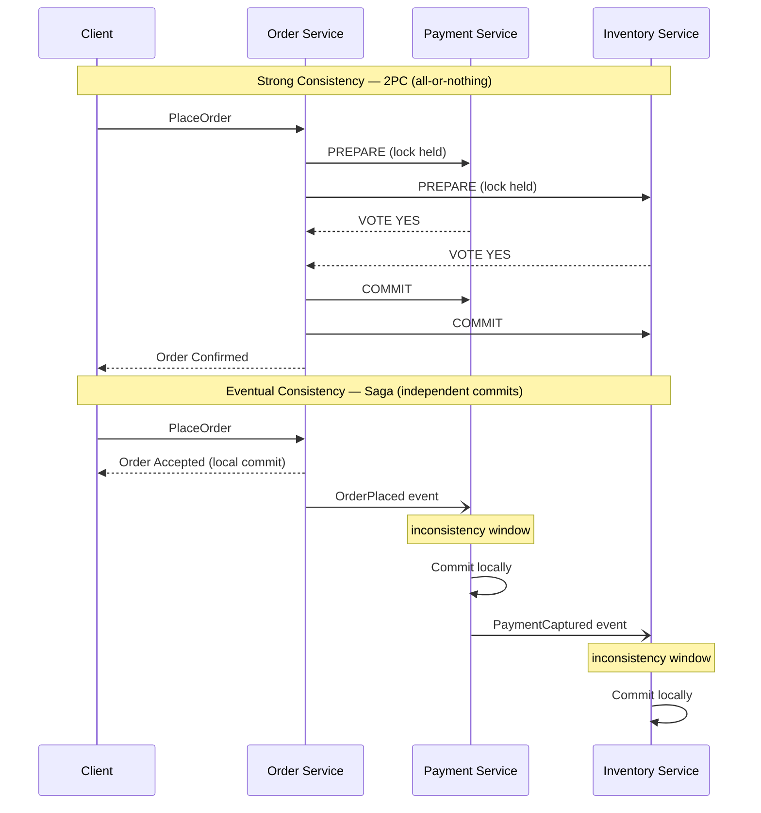
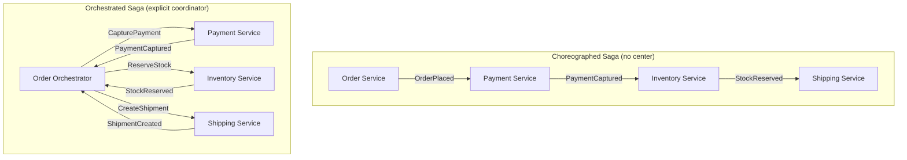
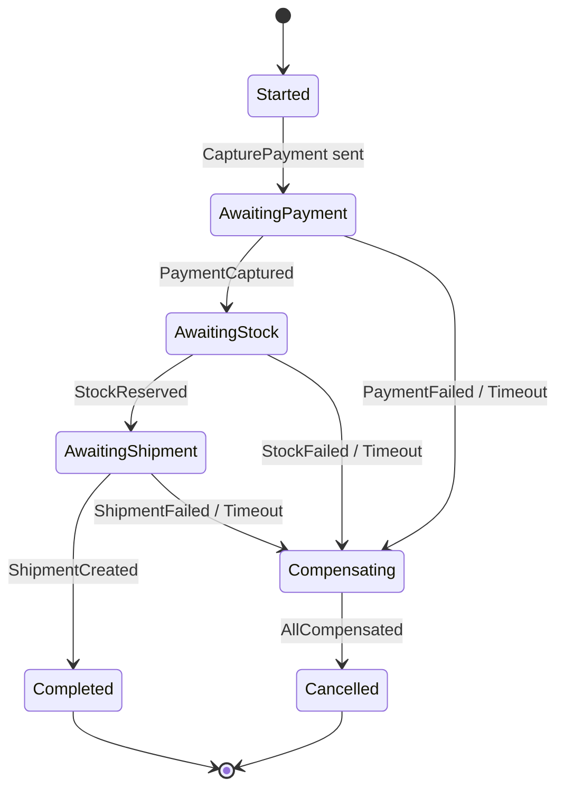
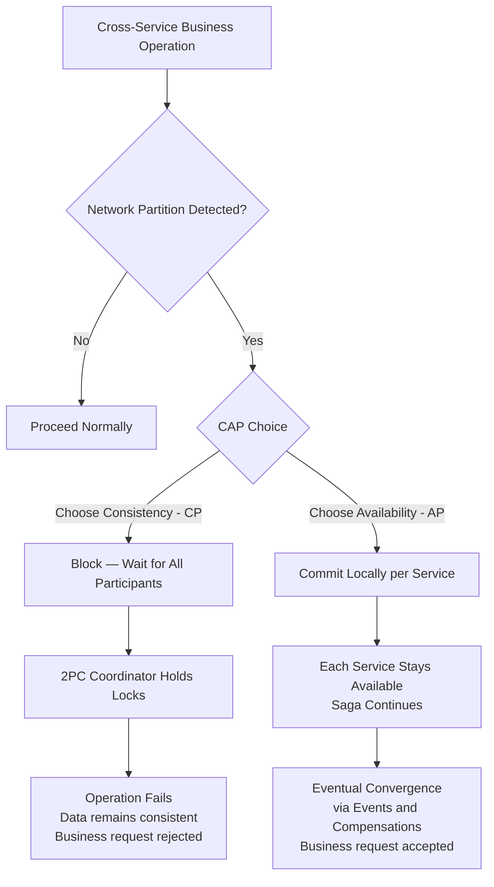

## Diagrams — Consistency, Sagas, and Long-Running Processes

### sequence diagram contrasting strong consistency (single locked transaction across Order, Payment, Inventory committing together) versus eventual consistency (three independent local commits over time, with a visible inconsistency window between them)

Two-phase commit forces all participants to lock and commit atomically, creating a single all-or-nothing window; a saga lets each service commit locally in sequence, accepting a visible inconsistency window between steps that closes as events propagate forward.

---

### side-by-side comparison — left panel choreographed saga as a chain of services each reacting to the previous event with no center; right panel orchestrated saga with a central orchestrator issuing commands and receiving replies from Payment, Inventory, Shipping

Choreography wires services together through a chain of reactive events with no single coordinator, while orchestration places all process logic in one explicit orchestrator that issues commands and awaits replies — understanding this trade-off determines how visible and maintainable the saga flow will be as complexity grows.

---

### state machine (state diagram) for an order saga with states Started, AwaitingPayment, AwaitingStock, AwaitingShipment, Completed, Compensating, Cancelled, showing the happy-path transitions on success events and the compensation transitions on failure/timeout events

This state machine captures every observable state of an in-flight order saga and makes both the happy path and compensation paths explicit transitions — persisting this state on each transition is what allows the process manager to survive crashes and resume without orphaning in-flight orders.

---

### flowchart showing the CAP decision for a cross-service business operation — partition detected → branch: choose Consistency (block, fail the operation, 2PC/CP) versus choose Availability (commit locally, converge later via saga/AP), annotating each branch with its business consequence

When a network partition occurs, the system must choose between blocking the operation to preserve consistency (CP — the 2PC path) or committing locally to stay available and converging later (AP — the saga path), and this diagram makes explicit that sagas are not a workaround but a deliberate architectural choice with predictable business consequences.

