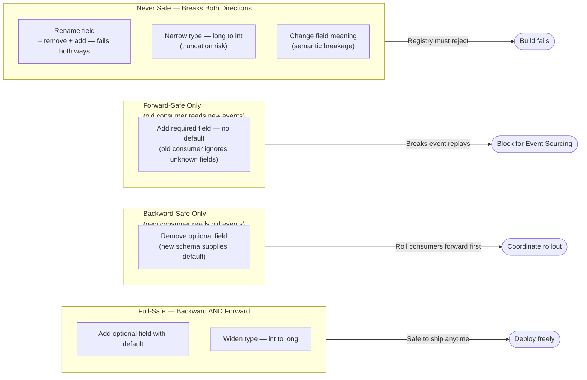
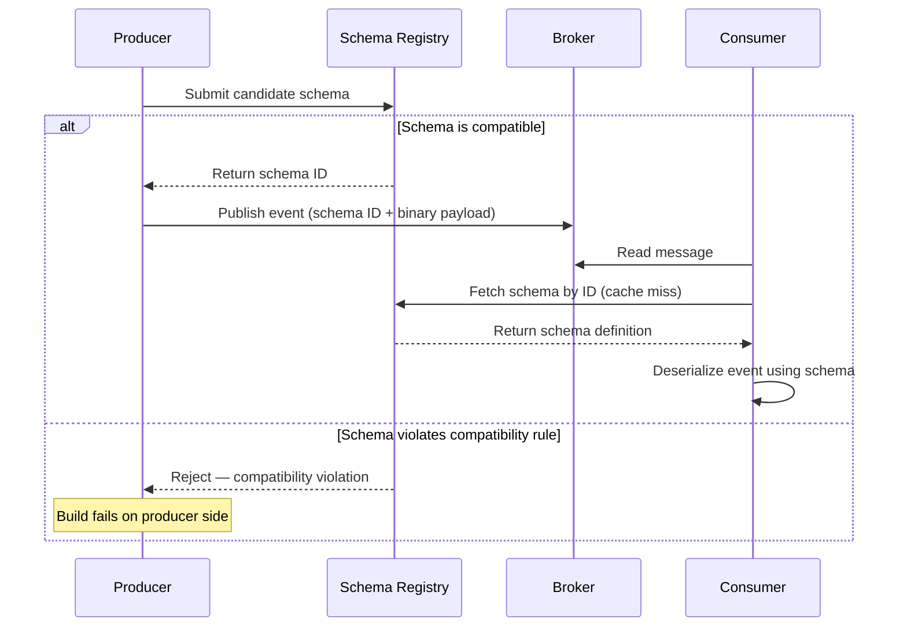
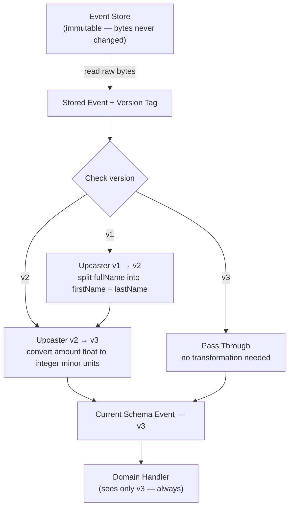
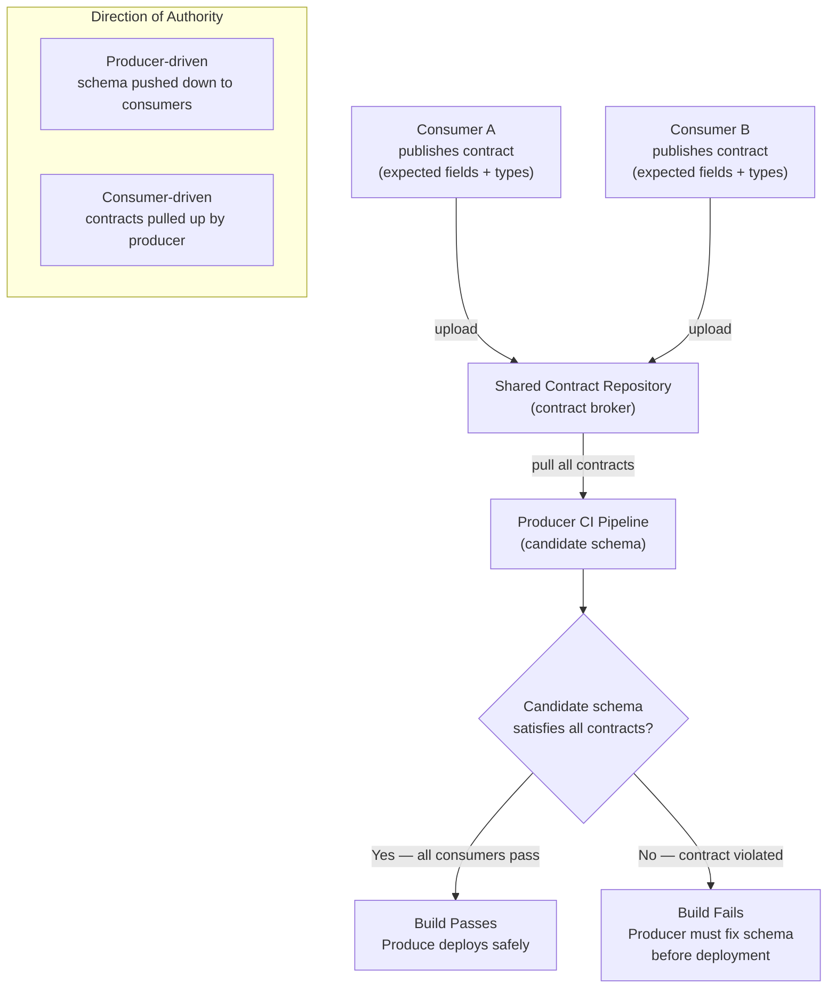

# Chapter 8: Schema Evolution and Event Versioning

## Opening Problem Statement

Chapter 7 left the reader with a system whose truth is spread across services that converge over time through sagas and compensations. Chapter 6 made a heavier promise still: with Event Sourcing, every event is kept forever. That promise now presents its bill. A request-response API can deprecate a field in a quarter and force every caller to upgrade. An event store cannot. An event written in 2021 will be read in 2027, by a consumer written in 2025, running code nobody on the original team remembers. The event is not a transient message; it is a **persisted contract with the future**. So the real question of this chapter is uncomfortable: how does an architect change the shape of a fact that has already happened, is stored millions of times over, and is consumed by teams they have never met? Get this wrong and every deployment becomes a coordinated, cross-team, high-risk event. Get it right and teams evolve their contracts independently, on their own schedule, without a single broken consumer. This chapter is about buying that independence — and about the one policy decision that, if skipped, quietly guarantees the opposite.

## Backward and Forward Compatibility

Every conversation about schema evolution eventually reduces to two words: **compatibility** direction. Confusing them is the most common — and most expensive — mistake in this domain, so define them precisely and never mix them again.

**Backward compatibility** means a *new consumer* can read *old events*. You changed the schema; a consumer running the new schema still understands data written under the old one. This is the direction Event Sourcing demands, because your event store is full of old events that will be replayed forever.

**Forward compatibility** means an *old consumer* can read *new events*. You changed the schema; a consumer still running the old version tolerates data written under the new one, typically by ignoring what it does not recognize. This is the direction that pub/sub integration demands, because you cannot upgrade every consumer at the same instant you upgrade the producer.

**Full compatibility** is both at once. It is the strictest and the safest, and it is the target most mature registries default to.

The practical payoff is a simple rule set for what a change is allowed to do. The safe changes are almost always additive.

**Figure 8.1 — Schema change compatibility decision matrix**



*This diagram classifies common schema changes into four safety groups, making it immediately clear which operations are safe to ship without consumer coordination. Understanding these groupings is the foundation of disciplined schema evolution: only full-safe changes can be deployed at any time without risk.*

Notice the trap hiding in that matrix. Adding a **required** field breaks backward compatibility, because old events simply do not carry it. Removing a field breaks forward compatibility, because old consumers still expect it. And a rename is not one operation — it is a delete plus an add, so it fails on both fronts. The discipline, then, is boring on purpose: prefer optional fields, always supply defaults, and treat "required" as a word you have to justify in a review.

**Listing 8.1 — Safe Avro schema evolution: adding an optional field with a null default**

This example shows two Avro schema versions for an `OrderPlaced` event. Adding a null-defaulted optional field achieves full compatibility: Avro's reader/writer resolution fills in the default for old events (backward), and newer fields absent in the reader schema are simply projected away (forward).

```python
# Schema evolution: safe addition of an optional field with a null default
# Demonstrates both backward and forward compatibility using Avro-style schemas

from typing import Any

# v1 schema: original OrderPlaced event (no coupon support yet)
ORDER_PLACED_V1: dict[str, Any] = {
    "type": "record",
    "name": "OrderPlaced",
    "namespace": "com.example.orders",
    "doc": "An order was placed by a customer.",
    "fields": [
        {"name": "orderId",    "type": "string"},
        {"name": "customerId", "type": "string"},
        {"name": "totalCents", "type": "long"},
    ],
}

# v2 schema: adds optional couponCode as a null-first union (default = null)
ORDER_PLACED_V2: dict[str, Any] = {
    "type": "record",
    "name": "OrderPlaced",
    "namespace": "com.example.orders",
    "doc": "An order was placed by a customer.",
    "fields": [
        {"name": "orderId",    "type": "string"},
        {"name": "customerId", "type": "string"},
        {"name": "totalCents", "type": "long"},
        # null-first union means the declared default (None/null) is valid.
        # Avro requires that the default value matches the first type in the union.
        {
            "name": "couponCode",
            "type": ["null", "string"],  # null-first union
            "default": None,             # Python None serialises as Avro null
            "doc": "Discount coupon applied at checkout, or null if none.",
        },
    ],
}

# --- Compatibility analysis ---
#
# BACKWARD-COMPATIBLE (new consumer reads old v1 event):
#   A v2 consumer deserialising a v1 event finds no couponCode bytes.
#   Avro reader/writer schema resolution fills in the declared default: null.
#   The v2 consumer proceeds without error. ✓
#
# FORWARD-COMPATIBLE (old consumer reads new v2 event):
#   A v1 consumer deserialising a v2 event encounters the couponCode bytes.
#   Avro projection: writer fields absent from the reader schema are skipped.
#   The v1 consumer proceeds without error. ✓
#
# RESULT: FULL compatibility — safe in both directions.


def demonstrate_compatibility() -> None:
    """Simulate reader/writer schema resolution in plain Python dicts."""
    import json

    # v1 event as it exists in the store — no couponCode field
    v1_payload: dict[str, Any] = {
        "orderId": "ord-001",
        "customerId": "cust-42",
        "totalCents": 4999,
    }

    # v2 consumer view: Avro fills in the default for absent fields
    def read_as_v2(payload: dict[str, Any]) -> dict[str, Any]:
        return {**{"couponCode": None}, **payload}  # default applied if key missing

    # v1 consumer view: extra fields in a v2 payload are projected away
    v1_field_names = {f["name"] for f in ORDER_PLACED_V1["fields"]}

    def read_as_v1(payload: dict[str, Any]) -> dict[str, Any]:
        return {k: v for k, v in payload.items() if k in v1_field_names}

    # v2 event as a newer producer would write it
    v2_payload: dict[str, Any] = {
        "orderId": "ord-002",
        "customerId": "cust-99",
        "totalCents": 2500,
        "couponCode": "SAVE10",
    }

    print("v2 consumer reads v1 event:", json.dumps(read_as_v2(v1_payload)))
    print("v1 consumer reads v2 event:", json.dumps(read_as_v1(v2_payload)))


if __name__ == "__main__":
    demonstrate_compatibility()
```

One more distinction that senior engineers routinely blur: compatibility is a property of the *schema pair*, not of the event. A single change can be backward-compatible and forward-incompatible at the same time. Always ask "compatible in which direction, for whom?" before approving anything.

> 💡 **Expert Note:** The prose states that full compatibility "is the target most mature registries default to." This is inaccurate and should be corrected before publication. Confluent Schema Registry — the de facto industry standard — defaults to **BACKWARD** compatibility, not FULL. AWS Glue Schema Registry also defaults to BACKWARD_ALL. FULL compatibility is an opt-in choice, not a default, precisely because it prohibits field removal and imposes constraints many teams cannot meet early in a product's lifecycle. Shipping the claim as written will cause practitioners to mis-configure registries, then be confused when the real defaults contradict the book.

<details>
<summary>💡 Expert Note</summary>

The prose covers what changes are safe and unsafe, but does not name the **Tolerant Reader** pattern — the consumer-side discipline that is the practical implementation of forward compatibility. A tolerant reader deserializes only the fields it explicitly needs and discards everything else without error, rather than failing on unrecognized or missing fields. This is the complementary discipline to additive-only producer changes: the producer adds fields safely only if consumers are written to tolerate them. In practice, many deserialization frameworks (especially Jackson with `FAIL_ON_UNKNOWN_PROPERTIES` defaulting to false in recent versions, or Avro's schema projection) implement this automatically, but teams using strict validation libraries or hand-written parsers must enforce it explicitly in code review. Naming the pattern gives teams a vocabulary to use in standards documents and review checklists.
</details>

> ⚠️ **Critical Note:** The prose states that FULL compatibility "is the target most mature registries default to." This is factually incorrect. Confluent Schema Registry — the dominant registry in Kafka-based systems and the de facto reference implementation — defaults to `BACKWARD`, not `FULL`. AWS Glue Schema Registry also defaults to `BACKWARD_ALL`. No widely deployed registry defaults to `FULL` out of the box. An architect who reads this claim and then opens their registry's admin UI will immediately encounter a contradiction, which undermines trust in the entire chapter. Replace the sentence with the accurate statement: most mature registries default to `BACKWARD` (Confluent) or `BACKWARD_ALL` (AWS Glue). Clarify that `FULL` must be explicitly configured and explain the trade-off: it prevents field removal, which causes schema bloat over time but eliminates an entire class of consumer breakage.

## Schema Registry and Formats (Avro, JSON Schema, Protobuf)

Rules are worthless if nobody enforces them. A **schema registry** is the component that stores the canonical schema for each event type, assigns it a version, and — this is the part that matters — *refuses* to register a new version that violates the configured compatibility rule. It turns compatibility from a code-review hope into a build-time gate.

The mechanics are straightforward. The producer registers a schema and gets back a numeric ID. It publishes events tagged with that ID rather than the full schema. The consumer reads the ID, fetches the matching schema from the registry (and caches it), and deserializes. Two benefits fall out immediately: events on the wire are small, and no consumer can ever guess the schema — it always resolves the exact one the producer used.

**Figure 8.2 — Schema registry interaction sequence**



*This sequence diagram shows how a schema registry converts a code-review policy into a hard build-time gate: incompatible schemas are rejected before a single event reaches the broker. The ID-based wire format is also shown, illustrating how consumers always resolve the exact schema the producer used — eliminating guesswork in deserialization.*

The registry is format-neutral in concept, but the choice of serialization format is itself a design decision with real consequences. The three that dominate cloud-native systems trade off differently.

| Format | Schema location | Evolution model | Human-readable | Best fit |
|---|---|---|---|---|
| **Avro** | External, resolved by ID | Reader/writer schema resolution — strongest evolution story | No (binary) | Kafka event streams, event stores |
| **Protobuf** | Compiled into code (field numbers) | Field-number based; add/reserve, never reuse numbers | No (binary) | gRPC, high-throughput internal contracts |
| **JSON Schema** | External or inline | Additive with defaults; validation-centric | Yes (text) | Public/partner events, debuggability first |

**Avro** deserves the architect's attention in event-sourced systems because of one feature: it deserializes using *both* the writer's schema (what produced the event) and the reader's schema (what the consumer expects), reconciling the difference automatically. That reader/writer split is exactly the backward-compatibility machinery Event Sourcing needs, built into the format.

**Protobuf** encodes fields by number, not name, so renaming a field costs nothing on the wire — but reusing a retired field number is catastrophic, silently mapping old bytes to a new meaning. The rule is absolute: **reserve** deleted field numbers, never recycle them.

**JSON Schema** buys you readability and painless debugging at the cost of size and weaker guarantees. For events that cross a company boundary to a partner who will inspect them by eye, that trade is often correct.

There is no universal winner. Streams internal to your platform lean Avro or Protobuf; contracts you hand to outsiders lean JSON. What is non-negotiable is that *some* registry enforces *some* policy.

<details>
<summary>💡 Expert Note</summary>

The prose explains that producers tag events with a schema ID, but omits the wire-format detail that makes this interoperable in practice. The Confluent wire format — now a de facto standard adopted by AWS MSK, Confluent Cloud, and most Kafka-adjacent tooling — is: `0x00` (magic byte) + 4-byte big-endian schema ID + serialized payload. Any non-Kafka consumer (an HTTP webhook bridge, a CDC pipeline, a legacy Java consumer) must understand this framing before it can even begin deserialization. Teams that treat the schema ID as an internal detail discover this the hard way when they onboard their first external or polyglot consumer. Architects should document this wire contract explicitly and test deserialization from at least one non-JVM client before go-live.
</details>

<details>
<summary>💡 Expert Note</summary>

The schema registry is mentioned as a build-time gate but its operational risk as a runtime dependency is not addressed. In production, every consumer performs a cache-miss lookup to the registry on first contact with a new schema ID. If the registry is unavailable, a consumer that has not yet cached that schema will fail to deserialize. The standard mitigation is a **local on-disk schema cache** that survives registry downtime — Confluent's Java client supports this via `SchemaRegistryClient` cache configuration, but it is not on by default. Teams that deploy the registry as a single instance without HA, or that do not seed the local cache before deploying consumers, treat a routine registry restart as a production incident. Treat the registry with the same availability SLA as the broker itself.
</details>

<details>
<summary>⚠️ Critical Note</summary>

The Protobuf section states that "renaming a field costs nothing on the wire." While true at the binary encoding level (fields are keyed by number, not name), it is misleading in practice for the target audience. Renaming a Protobuf field changes every generated client API — every service that imports the `.proto` file must recompile and update its call sites. For a shared internal contract with many consumers, a rename triggers a coordinated rollout of generated code across all consumers, which is exactly the coupling problem the chapter aims to avoid. Presenting this as "costs nothing" understates the operational impact. Qualify the statement: "renaming costs nothing on the *wire format*, but every consumer's generated code changes and must be recompiled and deployed." Add a note that this makes renaming a logistical concern even when it is wire-safe, particularly for widely shared contracts.
</details>

## Upcasting and Versioning of Persisted Events

Compatibility rules keep you safe as long as every change is additive. Reality is not that kind. Eventually a business concept genuinely changes shape — a single `name` field must become `firstName` and `lastName`, or an amount stored as a float must become an integer of minor units. No additive rule covers this, and you cannot rewrite history: the old events are immutable facts, already persisted, possibly by the millions.

The answer is **upcasting**: transforming an old event into the current schema *at read time*, in memory, on its way from the store to the application. The stored bytes never change. A component in the deserialization pipeline detects the old version and applies a function that maps it forward to the new shape. Your domain logic only ever sees the latest version and stays blissfully unaware that five historical formats exist beneath it.

**Listing 8.2 — Upcaster pipeline: promoting versioned events to the current schema at read time**

This example implements a versioned upcaster pipeline as a decorator-based registry. Each upcaster promotes exactly one version forward; the pipeline chains them automatically. Stored bytes are never mutated — transformation happens at read time, in memory. The domain handler is intentionally written knowing only `CustomerRegisteredV2`.

```python
# Upcaster pipeline: promote persisted events to the current schema at read time.
# Stored bytes are never modified; the upgrade is purely in-memory on the read path.
# Time complexity: O(n) per event, where n = number of version steps required.

from __future__ import annotations

import dataclasses
from collections.abc import Callable
from typing import Any

UpcasterKey = tuple[str, int]          # (event_type, from_version)
UpcasterFn  = Callable[[dict[str, Any]], dict[str, Any]]


class UpcasterPipeline:
    """Registry and executor of upcaster functions keyed by (event_type, from_version).

    Each registered upcaster promotes one version forward. The pipeline walks
    the chain until no further upcaster is registered for the current version.
    """

    def __init__(self) -> None:
        self._registry: dict[UpcasterKey, UpcasterFn] = {}

    def register(
        self, event_type: str, from_version: int
    ) -> Callable[[UpcasterFn], UpcasterFn]:
        """Decorator: register a function as the upcaster for (event_type, from_version)."""
        def decorator(fn: UpcasterFn) -> UpcasterFn:
            self._registry[(event_type, from_version)] = fn
            return fn
        return decorator

    def upcast(self, raw: dict[str, Any]) -> dict[str, Any]:
        """Walk the upcaster chain until the payload reaches the latest version."""
        payload = dict(raw)  # shallow copy — original dict (stored bytes) is untouched
        event_type: str = payload["event_type"]

        while (key := (event_type, payload["version"])) in self._registry:
            payload = self._registry[key](payload)

        return payload


# Singleton pipeline shared across the read path
pipeline = UpcasterPipeline()


# ── Upcaster: CustomerRegistered v1 → v2 ──────────────────────────────────────
# Business change: the single denormalised fullName field was split into
# firstName and lastName to support proper sorting and personalisation.

@pipeline.register("CustomerRegistered", from_version=1)
def upcast_customer_registered_v1_to_v2(payload: dict[str, Any]) -> dict[str, Any]:
    full_name: str = payload["full_name"]
    first, _, last = full_name.partition(" ")   # partition on first space only
    return {
        "event_type":  payload["event_type"],
        "version":     2,                        # bumped — v2 upcaster can now run if needed
        "customer_id": payload["customer_id"],
        "first_name":  first,
        "last_name":   last or "",
        # full_name is intentionally absent — it no longer exists in v2
    }


# ── Current domain schema ──────────────────────────────────────────────────────

@dataclasses.dataclass(frozen=True)
class CustomerRegisteredV2:
    event_type:  str
    version:     int
    customer_id: str
    first_name:  str
    last_name:   str


# ── Domain handler ─────────────────────────────────────────────────────────────
# This handler knows nothing about v1. It only works with CustomerRegisteredV2.

def handle_customer_registered(event: CustomerRegisteredV2) -> None:
    print(
        f"[handler] Welcome, {event.first_name} {event.last_name}!"
        f" (customer_id={event.customer_id}, schema_version={event.version})"
    )


# ── Read-path orchestration ────────────────────────────────────────────────────

def load_and_dispatch(raw: dict[str, Any]) -> None:
    """Read a stored event payload, upcast transparently, dispatch to handler."""
    current = pipeline.upcast(raw)          # v1 is promoted; v2+ passes through
    event = CustomerRegisteredV2(**current)
    handle_customer_registered(event)


if __name__ == "__main__":
    # Simulate a v1 event written to the event store years ago
    stored_v1: dict[str, Any] = {
        "event_type":  "CustomerRegistered",
        "version":     1,
        "customer_id": "cust-007",
        "full_name":   "Ada Lovelace",     # old single-field schema
    }

    # Simulate a v2 event written after the schema change
    stored_v2: dict[str, Any] = {
        "event_type":  "CustomerRegistered",
        "version":     2,
        "customer_id": "cust-008",
        "first_name":  "Grace",
        "last_name":   "Hopper",
    }

    load_and_dispatch(stored_v1)  # upcasted v1 → v2 transparently
    load_and_dispatch(stored_v2)  # already current; passes through unchanged
```

The upcaster chain is the pattern that scales this. Each upcaster promotes exactly one version forward — v1→v2, v2→v3 — and the pipeline runs them in sequence. A v1 event on disk passes through both upcasters and arrives as v3. This keeps every transformation small, independently testable, and honest about exactly which change it represents.

**Figure 8.3 — Upcaster pipeline flowchart**



*This flowchart illustrates how an upcaster chain promotes any historical event version to the current schema at read time, without ever touching the stored bytes. Each upcaster transforms exactly one version step, keeping individual transformations small, testable, and independently reasoned about — while the domain handler remains unaware that multiple historical formats exist.*

Two disciplines make upcasting sustainable rather than a growing tax. First, **every event carries an explicit version number** in its metadata from day one — retrofitting versioning onto an unversioned store is painful, so pay this cost up front even when v1 is all you have. Second, upcasting is not the *only* option for large migrations. When an upcaster chain grows unwieldy, you can **rewrite the stream** into a new one under the new schema (a "copy-and-transform" migration), leaving the old stream as an immutable archive. Upcasting is cheaper day to day; stream rewriting is cleaner long-term. Most systems use both, and choosing between them is a genuine architectural judgment, not a default.

Resist the temptation to "just fix the data" with an in-place update to the store. That destroys the one property — an immutable, auditable history — that justified Event Sourcing in the first place.

<details>
<summary>💡 Expert Note</summary>

At production scale, an upcaster chain interacts dangerously with Event Sourcing aggregate reconstruction. Replaying a stream of 500k events through even two upcasters per event adds meaningful CPU and wall-clock time during cold restarts or aggregate rebuilds from scratch. The standard mitigation — **aggregate snapshots** — must be co-designed with the upcasting strategy: a snapshot stores a fully-upcasted, current-version aggregate state, so replays only process events *since* the last snapshot. If snapshotting is added as an afterthought after the upcaster chain is already in place, teams discover that old snapshots may themselves need versioning and upcasting, creating a recursive problem. Both versioning and snapshotting should be designed together from the start, not sequentially.
</details>

<details>
<summary>⚠️ Critical Note</summary>

The upcaster chain pattern is presented entirely in the happy path. There is no discussion of what happens when an upcaster throws an exception or produces an output that fails downstream validation. In an event-sourced system, a defective upcaster does not just fail one message — it renders the entire aggregate history unreadable, blocking all command processing for that aggregate until the bug is fixed and redeployed. This is one of the most operationally dangerous failure modes in event-sourced systems and is completely absent from the prose. Upcasters must be tested against a corpus of real historical events before deployment; a failing upcaster should surface a clear error with the stored event payload and version, not silently corrupt state; consider wrapping the pipeline in a fallback that surfaces the raw event for triage rather than crashing the read side entirely.
</details>

## Contracts, Consumer-Driven Contracts, and Governance

Everything so far is mechanism. The hardest part of schema evolution is not technical; it is organizational. An event that crosses a bounded context (Chapter 2 framed events as owned contracts) is a promise from a producing team to consuming teams that may sit in other departments, other time zones, other reporting lines. The registry enforces syntactic compatibility. It cannot tell you *who is actually consuming what*, and therefore cannot tell you whether a technically-compatible change is *semantically* safe to ship.

This is where **consumer-driven contracts** (CDC) earn their place. The idea inverts the usual direction of authority. Instead of the producer declaring "here is my schema, adapt to it," each consumer publishes a contract stating exactly the fields and shapes *it* depends on. The producer's build then verifies its schema against the union of all consumer contracts. If a proposed change breaks any consumer's stated expectations, the producer's pipeline fails — before deployment, on the producer's side, where the change originated.

**Figure 8.4 — Consumer-driven contract workflow**



*This diagram shows how consumer-driven contracts invert the authority relationship: instead of the producer declaring a schema and pushing it down, each consumer states what it needs and the producer's own CI pipeline is responsible for satisfying all of them. This is the mechanism that catches semantically breaking changes that a schema registry — which has no knowledge of actual consumers — cannot detect.*

The distinction between a schema registry and consumer-driven contracts is worth stating plainly, because teams often assume one replaces the other.

| Concern | Schema registry | Consumer-driven contracts |
|---|---|---|
| Question answered | "Is this change structurally compatible?" | "Does any real consumer actually break?" |
| Knows about consumers | No | Yes, explicitly |
| Enforcement point | Schema registration | Producer CI build |
| Catches semantic misuse | No | Partially (only stated expectations) |

They are complementary layers, not competitors. The registry is the fast, coarse gate; CDC is the slower, consumer-aware one.

Around both sits **governance**: the policies that make evolution predictable across an organization. Effective governance is lighter than teams fear and consists of a few durable rules. Assign every event type a single owning team. Mandate an explicit compatibility mode per event stream, registered and visible. Require deprecation to be announced with a timeline and a metric proving the old version is no longer read before it is retired. Version in metadata, never by mutating payloads. Governance is not a committee that slows teams down; it is the small set of agreements that let teams move *without* coordinating every release.

<details>
<summary>💡 Expert Note</summary>

The prose describes consumer-driven contracts conceptually but does not name the tooling, which matters for practitioners. **Pact** (pact.io) is the dominant open-source implementation: consumers write Pact files expressing the interactions they depend on, a **Pact Broker** (or PactFlow for SaaS) stores them, and the producer's CI pipeline runs `can-i-deploy` against the broker before any release. The critical production discipline that the prose does not mention is **pending pacts and WIP pacts** — Pact's mechanism for introducing new consumer contracts without immediately blocking the producer's build during the initial negotiation period. Without this mechanism, onboarding a new consumer becomes a coordinated freeze across both teams. Senior architects evaluating CDC should specifically assess whether their chosen tool supports this graduated rollout mode.
</details>

<details>
<summary>💡 Expert Note</summary>

The prose recommends "metric-backed deprecation" before retiring old schema versions, which is the right principle, but the measurement gap in practice is worth naming explicitly. Schema registry metrics tell you whether a schema *version* is being registered or fetched — they do not tell you whether a specific *field* within that version is being used by downstream consumers. A consumer might fetch schema v3 while only reading the `orderId` field and ignoring `couponCode`. If `couponCode` is the field you want to remove, fetch counts give you false confidence. The safest metric is **consumer-side field-level telemetry**: instrumented deserialization that logs which fields are accessed per consumer group. Few teams implement this, but those who have gone through a painful field removal incident almost always add it afterward.
</details>

<details>
<summary>⚠️ Critical Note</summary>

The consumer-driven contracts (CDC) section presents the pattern as a reliable safety net with little acknowledgment of its primary organizational failure mode: CDC only works when every consumer actively maintains and publishes its contract. In practice, getting 100% participation is difficult — teams deprioritize contract updates, new consumers are onboarded without contracts, and legacy consumers are forgotten. A producer CI build that passes against the union of *published* contracts can still break an unpublished consumer. The prose implies CDC answers "does any real consumer actually break?" but the honest answer is "does any real consumer *that published a contract* break?" — a weaker guarantee than the table suggests. The guarantee is bounded by participation — a consuming team that never publishes a contract gets no protection. CDC must be paired with a registry of known consumers and an onboarding checklist that makes contract publication mandatory.
</details>

## The Missing-Policy Pitfall

The single most damaging mistake in this entire chapter is not a bad schema change. It is the *absence of a declared compatibility policy at all*. This deserves its own section because it fails silently and is nearly always discovered too late.

A system without a policy does not announce the problem. Everything works — right up until the first genuinely breaking change ships, a consumer three teams away deserializes garbage, and a production incident traces back to a field someone "cleaned up" months earlier. Because there was no gate, nothing stopped it. Because events are persisted, the poison is now in the store permanently, and every replay re-triggers it.

The fix is embarrassingly cheap relative to the damage it prevents: **choose a default compatibility mode before your first event ships**, and make the registry enforce it. `BACKWARD` is the sane default for most event-sourced systems; `FULL` if you can afford the discipline. That one decision, made early, converts an entire class of cross-team production incidents into build-time failures on the desk of the person who caused them.

> 💡 **Expert Note:** The prose correctly identifies the absence of a declared policy as the most damaging mistake, but does not distinguish between two failure modes that require different remediation. The first is a greenfield team with no registry at all — the fix is straightforward: stand up a registry, pick BACKWARD, enforce it. The second, more painful case is a running system where events have been shipped for months without a registry, and a registry is now being retrofitted. In this case, the initial schema registration must be treated as a **compatibility baseline** audit, not a simple import: every existing schema must be manually reviewed before being registered, because the registry's first compatibility check will be against whatever you declare as v1. Teams that bulk-import existing schemas without review often discover that their "stable" schemas already contain patterns (undocumented required fields, implicit type coercions) that would fail a BACKWARD check, requiring immediate remediation of live consumers before the registry can be enforced.

## Key Takeaways

- **Compatibility has a direction.** Backward = new consumer reads old events (Event Sourcing needs this); forward = old consumer reads new events (pub/sub needs this); full = both. Always ask "compatible in which direction, for whom?"
- **Additive-only is the safe path.** Add optional fields with defaults; never rename in place, add required fields without defaults, or reuse a retired Protobuf field number.
- **A schema registry turns policy into a build-time gate.** It rejects incompatible schemas before they ship; Avro's reader/writer resolution makes it especially strong for event stores.
- **Upcast, don't mutate.** Transform old persisted events to the current schema at read time through a versioned upcaster chain; version every event in metadata from day one.
- **The registry answers "is it structurally compatible?"; consumer-driven contracts answer "does any real consumer break?"** You need both, plus lightweight governance: one owner per event type, an explicit compatibility mode, and metric-backed deprecation.
- **No compatibility policy is the pitfall.** Choose a default mode (BACKWARD or FULL) and enforce it before your first event ships.

## What's Next

With contracts that can evolve safely in place, Chapter 9 turns to the operational reality of running these systems — observing, tracing, and debugging event flows whose control flow is implicit and spread across decoupled services.

<!-- ASSEMBLY COMPLETE
  Chapter: Schema Evolution and Event Versioning
  Code blocks resolved: 2 / 2
  Diagrams resolved: 4 / 4
  Expert callouts (inline): 2
  Expert callouts (collapsed): 6
  Critical callouts (inline): 1
  Critical callouts (collapsed): 3
  Unresolved markers: 0
-->
