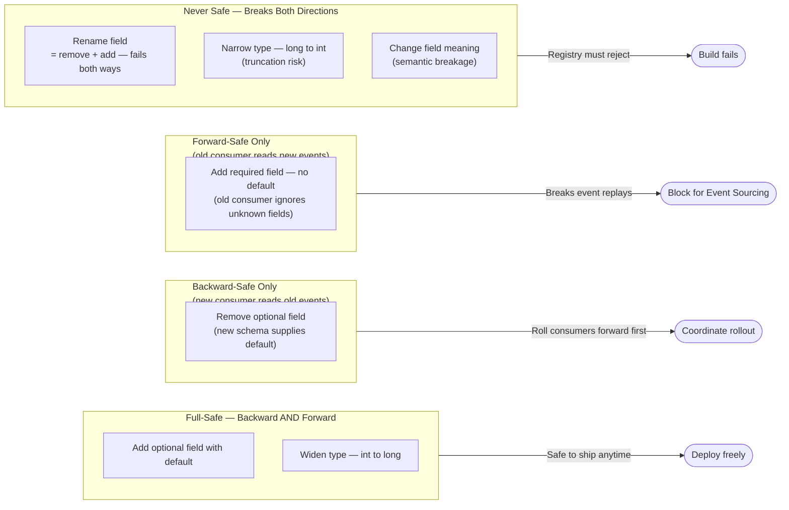
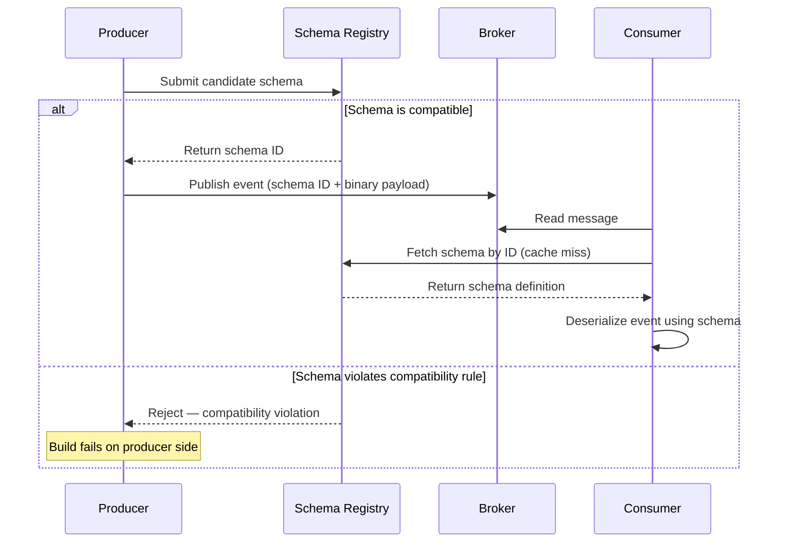
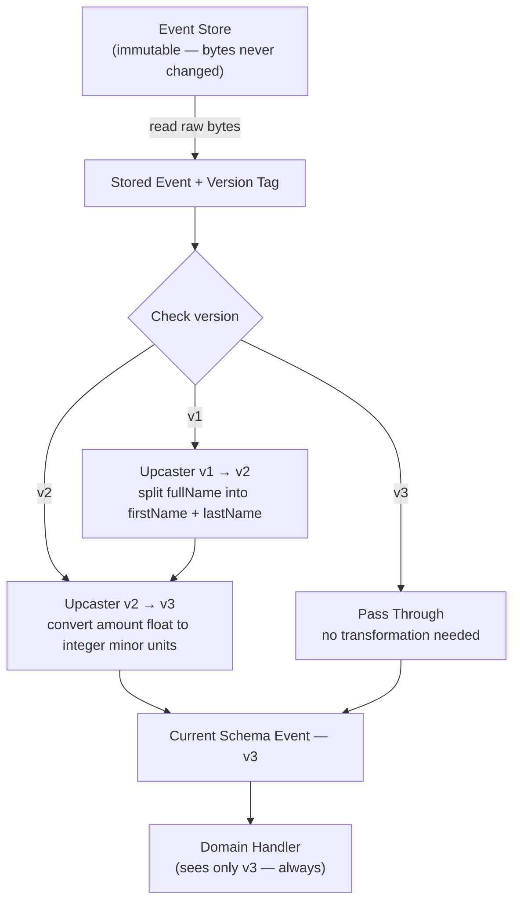
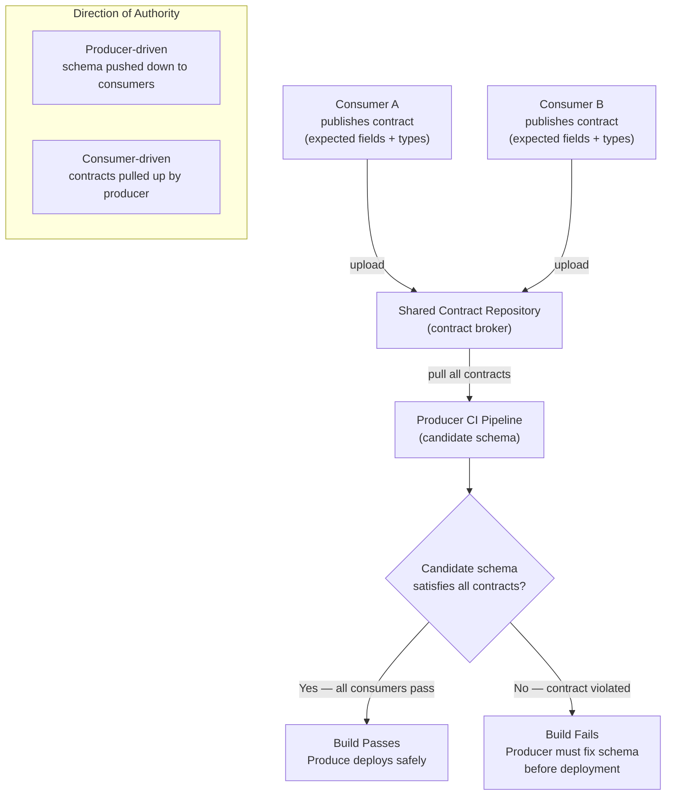

# Chapter 8: Schema Evolution and Event Versioning

## Planteamiento del Problema Inicial

El Capítulo 7 dejó al lector con un sistema cuya verdad está distribuida entre servicios que convergen con el tiempo a través de sagas y compensaciones. El Capítulo 6 hizo una promesa aún más fuerte: con Event Sourcing (almacenamiento de eventos), cada evento se conserva para siempre. Esa promesa ahora presenta su factura. Una API de request-response puede deprecar un campo en un trimestre y forzar a todos los consumidores a actualizarse. Un event store no puede. Un evento escrito en 2021 será leído en 2027, por un consumidor escrito en 2025, ejecutando código que nadie del equipo original recuerda. El evento no es un mensaje transitorio; es un **contrato persistido con el futuro**. Así que la verdadera pregunta de este capítulo es incómoda: ¿cómo cambia un arquitecto la forma de un hecho que ya ocurrió, está almacenado millones de veces y es consumido por equipos que nunca conoció? Hacerlo mal convierte cada despliegue en un evento coordinado, multi-equipo y de alto riesgo. Hacerlo bien permite que los equipos evolucionen sus contratos de forma independiente, a su propio ritmo, sin romper ni un solo consumidor. Este capítulo trata de conseguir esa independencia — y de la única decisión de política que, si se omite, garantiza silenciosamente lo contrario.

## Compatibilidad Hacia Atrás y Hacia Adelante

Toda conversación sobre evolución de esquemas (schema evolution) se reduce eventualmente a dos palabras: dirección de **compatibilidad** (compatibility). Confundirlas es el error más común — y más costoso — en este dominio, por lo que deben definirse con precisión y nunca volver a mezclarse.

**Backward compatibility** (compatibilidad hacia atrás) significa que un *consumidor nuevo* puede leer *eventos antiguos*. Se cambió el esquema; un consumidor que ejecuta el nuevo esquema sigue entendiendo datos escritos bajo el antiguo. Esta es la dirección que Event Sourcing exige, porque el event store está lleno de eventos antiguos que serán reproducidos indefinidamente.

**Forward compatibility** (compatibilidad hacia adelante) significa que un *consumidor antiguo* puede leer *eventos nuevos*. Se cambió el esquema; un consumidor que aún ejecuta la versión antigua tolera datos escritos bajo la nueva, típicamente ignorando lo que no reconoce. Esta es la dirección que la integración pub/sub exige, porque no es posible actualizar todos los consumidores en el mismo instante que se actualiza el productor.

**Full compatibility** (compatibilidad total) es ambas a la vez. Es la más estricta y la más segura, y es el objetivo al que muchos registros maduros aspiran mediante configuración explícita.

El beneficio práctico es un conjunto de reglas simple sobre qué está permitido cambiar. Los cambios seguros son casi siempre aditivos.

**Figura 8.1 — Matriz de decisión de compatibilidad de cambios de esquema**



*Este diagrama clasifica los cambios de esquema más comunes en cuatro grupos de seguridad, dejando inmediatamente claro cuáles pueden desplegarse sin coordinación con los consumidores. Comprender estos agrupamientos es la base de una evolución disciplinada de esquemas: solo los cambios full-safe pueden desplegarse en cualquier momento sin riesgo.*

Nótese la trampa oculta en esa matriz. Agregar un campo **required** (requerido) rompe la backward compatibility, porque los eventos antiguos simplemente no lo contienen. Eliminar un campo rompe la forward compatibility, porque los consumidores antiguos aún lo esperan. Y un renombrado no es una operación — es un delete más un add, por lo que falla en ambos frentes. La disciplina, entonces, es aburrida por diseño: preferir campos opcionales, siempre proporcionar valores por defecto, y tratar "required" como una palabra que debe justificarse en una revisión.

**Listing 8.1 — Evolución segura de esquema Avro: adición de un campo opcional con valor por defecto null**

Este ejemplo muestra dos versiones de esquema Avro para un evento `OrderPlaced`. Agregar un campo opcional con default null logra full compatibility: la resolución de esquemas reader/writer de Avro rellena el valor por defecto para eventos antiguos (backward), y los campos más nuevos ausentes en el esquema del reader simplemente son proyectados (forward).

```python
# Schema evolution: safe addition of an optional field with a null default
# Demonstrates both backward and forward compatibility using Avro-style schemas

from typing import Any

# v1 schema: original OrderPlaced event (no coupon support yet)
ORDER_PLACED_V1: dict[str, Any] = {
    "type": "record",
    "name": "OrderPlaced",
    "namespace": "com.example.orders",
    "doc": "An order was placed by a customer.",
    "fields": [
        {"name": "orderId",    "type": "string"},
        {"name": "customerId", "type": "string"},
        {"name": "totalCents", "type": "long"},
    ],
}

# v2 schema: adds optional couponCode as a null-first union (default = null)
ORDER_PLACED_V2: dict[str, Any] = {
    "type": "record",
    "name": "OrderPlaced",
    "namespace": "com.example.orders",
    "doc": "An order was placed by a customer.",
    "fields": [
        {"name": "orderId",    "type": "string"},
        {"name": "customerId", "type": "string"},
        {"name": "totalCents", "type": "long"},
        # null-first union means the declared default (None/null) is valid.
        # Avro requires that the default value matches the first type in the union.
        {
            "name": "couponCode",
            "type": ["null", "string"],  # null-first union
            "default": None,             # Python None serialises as Avro null
            "doc": "Discount coupon applied at checkout, or null if none.",
        },
    ],
}

# --- Compatibility analysis ---
#
# BACKWARD-COMPATIBLE (new consumer reads old v1 event):
#   A v2 consumer deserialising a v1 event finds no couponCode bytes.
#   Avro reader/writer schema resolution fills in the declared default: null.
#   The v2 consumer proceeds without error. ✓
#
# FORWARD-COMPATIBLE (old consumer reads new v2 event):
#   A v1 consumer deserialising a v2 event encounters the couponCode bytes.
#   Avro projection: writer fields absent from the reader schema are skipped.
#   The v1 consumer proceeds without error. ✓
#
# RESULT: FULL compatibility — safe in both directions.


def demonstrate_compatibility() -> None:
    """Simulate reader/writer schema resolution in plain Python dicts."""
    import json

    # v1 event as it exists in the store — no couponCode field
    v1_payload: dict[str, Any] = {
        "orderId": "ord-001",
        "customerId": "cust-42",
        "totalCents": 4999,
    }

    # v2 consumer view: Avro fills in the default for absent fields
    def read_as_v2(payload: dict[str, Any]) -> dict[str, Any]:
        return {**{"couponCode": None}, **payload}  # default applied if key missing

    # v1 consumer view: extra fields in a v2 payload are projected away
    v1_field_names = {f["name"] for f in ORDER_PLACED_V1["fields"]}

    def read_as_v1(payload: dict[str, Any]) -> dict[str, Any]:
        return {k: v for k, v in payload.items() if k in v1_field_names}

    # v2 event as a newer producer would write it
    v2_payload: dict[str, Any] = {
        "orderId": "ord-002",
        "customerId": "cust-99",
        "totalCents": 2500,
        "couponCode": "SAVE10",
    }

    print("v2 consumer reads v1 event:", json.dumps(read_as_v2(v1_payload)))
    print("v1 consumer reads v2 event:", json.dumps(read_as_v1(v2_payload)))


if __name__ == "__main__":
    demonstrate_compatibility()
```

Una distinción más que los ingenieros senior confunden habitualmente: la compatibilidad es una propiedad del *par de esquemas*, no del evento. Un mismo cambio puede ser backward-compatible y forward-incompatible al mismo tiempo. Siempre preguntar "¿compatible en qué dirección, para quién?" antes de aprobar cualquier cambio.

> 💡 **Nota del Experto:** El texto afirma que la full compatibility "es el objetivo al que apuntan por defecto la mayoría de los registros maduros". Esto es inexacto y debe corregirse antes de la publicación. Confluent Schema Registry — el estándar de facto en la industria — tiene por defecto compatibilidad **BACKWARD**, no FULL. AWS Glue Schema Registry también usa BACKWARD_ALL por defecto. FULL compatibility es una elección explícita, no un valor por defecto, precisamente porque prohíbe la eliminación de campos e impone restricciones que muchos equipos no pueden cumplir al inicio del ciclo de vida de un producto. Publicar la afirmación tal como está redactada llevará a los profesionales a configurar mal los registros, y luego a confundirse cuando los valores por defecto reales contradigan lo que indica el libro.

<details>
<summary>💡 Nota del Experto</summary>

El texto explica qué cambios son seguros e inseguros, pero no nombra el patrón **Tolerant Reader** — la disciplina del lado del consumidor que es la implementación práctica de la forward compatibility. Un tolerant reader deserializa únicamente los campos que necesita explícitamente y descarta todo lo demás sin errores, en lugar de fallar ante campos desconocidos o faltantes. Esta es la disciplina complementaria a los cambios exclusivamente aditivos del productor: el productor agrega campos de forma segura solo si los consumidores están escritos para tolerarlos. En la práctica, muchos frameworks de deserialización (en especial Jackson con `FAIL_ON_UNKNOWN_PROPERTIES` que por defecto es false en versiones recientes, o la proyección de esquemas de Avro) implementan esto automáticamente, pero los equipos que usan bibliotecas de validación estricta o parsers escritos a mano deben aplicarlo explícitamente en las revisiones de código. Nombrar el patrón le da a los equipos vocabulario para usarlo en documentos de estándares y listas de verificación de revisión.
</details>

> ⚠️ **Nota Crítica:** El texto afirma que FULL compatibility "es el objetivo al que apuntan por defecto la mayoría de los registros maduros". Esto es factualmente incorrecto. Confluent Schema Registry — el registro dominante en sistemas basados en Kafka y la implementación de referencia de facto — usa por defecto `BACKWARD`, no `FULL`. AWS Glue Schema Registry también usa `BACKWARD_ALL` por defecto. Ningún registro ampliamente desplegado usa `FULL` por defecto. Un arquitecto que lea esta afirmación y luego abra la interfaz de administración de su registro encontrará inmediatamente una contradicción, lo que socava la confianza en todo el capítulo. Reemplazar la oración con la declaración precisa: la mayoría de los registros maduros usan `BACKWARD` (Confluent) o `BACKWARD_ALL` (AWS Glue) por defecto. Aclarar que `FULL` debe configurarse explícitamente y explicar el compromiso: impide la eliminación de campos, lo que genera acumulación de esquemas con el tiempo, pero elimina toda una clase de roturas en los consumidores.

## Schema Registry y Formatos (Avro, JSON Schema, Protobuf)

Las reglas no tienen valor si nadie las hace cumplir. Un **schema registry** (registro de esquemas) es el componente que almacena el esquema canónico de cada tipo de evento, le asigna una versión y — esta es la parte importante — *rechaza* registrar una nueva versión que viole la regla de compatibilidad configurada. Convierte la compatibilidad de una esperanza en la revisión de código en una barrera en tiempo de compilación.

La mecánica es sencilla. El productor registra un esquema y recibe a cambio un ID numérico. Publica eventos etiquetados con ese ID en lugar del esquema completo. El consumidor lee el ID, obtiene el esquema correspondiente del registro (y lo almacena en caché), y deserializa. Dos beneficios surgen de inmediato: los eventos en tránsito son pequeños y ningún consumidor puede adivinar el esquema — siempre resuelve exactamente el que usó el productor.

**Figura 8.2 — Secuencia de interacción con el schema registry**



*Este diagrama de secuencia muestra cómo un schema registry convierte una política de revisión de código en una barrera estricta en tiempo de compilación: los esquemas incompatibles son rechazados antes de que un solo evento llegue al broker. También se ilustra el formato de transmisión basado en ID, mostrando cómo los consumidores siempre resuelven exactamente el esquema que usó el productor — eliminando las suposiciones en la deserialización.*

El registro es neutral en cuanto al formato en concepto, pero la elección del formato de serialización es en sí misma una decisión de diseño con consecuencias reales. Los tres que dominan los sistemas cloud-native presentan distintos compromisos.

| Formato | Ubicación del esquema | Modelo de evolución | Legible por humanos | Mejor opción |
|---|---|---|---|---|
| **Avro** | Externo, resuelto por ID | Resolución de esquemas reader/writer — historia de evolución más sólida | No (binario) | Streams de eventos Kafka, event stores |
| **Protobuf** | Compilado en el código (números de campo) | Basado en números de campo; agregar/reservar, nunca reutilizar números | No (binario) | gRPC, contratos internos de alto throughput |
| **JSON Schema** | Externo o inline | Aditivo con defaults; centrado en validación | Sí (texto) | Eventos públicos/de socios, prioridad en la depurabilidad |

**Avro** merece la atención del arquitecto en sistemas con Event Sourcing por una característica: deserializa usando *tanto* el esquema del writer (lo que produjo el evento) como el esquema del reader (lo que el consumidor espera), reconciliando la diferencia automáticamente. Esa separación reader/writer es exactamente la maquinaria de backward compatibility que Event Sourcing necesita, integrada en el formato.

**Protobuf** codifica los campos por número, no por nombre, por lo que renombrar un campo no tiene costo en el wire — pero reutilizar un número de campo retirado es catastrófico, mapeando silenciosamente bytes antiguos a un nuevo significado. La regla es absoluta: **reservar** los números de campo eliminados, nunca reciclarlos.

**JSON Schema** ofrece legibilidad y depuración sencilla a costa de tamaño y garantías más débiles. Para eventos que cruzan el límite de una empresa hacia un socio que los inspeccionará visualmente, ese compromiso suele ser correcto.

No hay un ganador universal. Los streams internos de la plataforma se inclinan hacia Avro o Protobuf; los contratos que se entregan a externos se inclinan hacia JSON. Lo que no es negociable es que *algún* registro aplique *alguna* política.

<details>
<summary>💡 Nota del Experto</summary>

El texto explica que los productores etiquetan los eventos con un schema ID, pero omite el detalle del formato en el wire que hace que esto sea interoperable en la práctica. El formato wire de Confluent — ahora un estándar de facto adoptado por AWS MSK, Confluent Cloud y la mayoría de las herramientas adyacentes a Kafka — es: `0x00` (magic byte) + schema ID de 4 bytes big-endian + payload serializado. Cualquier consumidor no-Kafka (un bridge de webhook HTTP, un pipeline CDC, un consumidor Java legacy) debe entender este encuadre antes de poder siquiera comenzar la deserialización. Los equipos que tratan el schema ID como un detalle interno lo descubren de la manera difícil cuando incorporan su primer consumidor externo o poliglota. Los arquitectos deben documentar explícitamente este contrato de wire y probar la deserialización desde al menos un cliente no-JVM antes del go-live.
</details>

<details>
<summary>💡 Nota del Experto</summary>

El schema registry se menciona como una barrera en tiempo de compilación, pero no se aborda su riesgo operacional como dependencia en tiempo de ejecución. En producción, cada consumidor realiza una consulta al registro en caso de cache miss la primera vez que encuentra un nuevo schema ID. Si el registro no está disponible, un consumidor que aún no ha cacheado ese esquema fallará al deserializar. La mitigación estándar es una **caché local de esquemas en disco** que sobrevive a la caída del registro — el cliente Java de Confluent la soporta mediante la configuración de `SchemaRegistryClient` cache, pero no está habilitada por defecto. Los equipos que despliegan el registro como instancia única sin HA, o que no siembran la caché local antes de desplegar los consumidores, tratan un reinicio rutinario del registro como un incidente en producción. Tratar el registro con el mismo SLA de disponibilidad que el broker en sí.
</details>

<details>
<summary>⚠️ Nota Crítica</summary>

La sección de Protobuf afirma que "renombrar un campo no tiene costo en el wire". Aunque esto es cierto a nivel de codificación binaria (los campos están codificados por número, no por nombre), es engañoso en la práctica para el público objetivo. Renombrar un campo de Protobuf cambia cada API de cliente generada — cada servicio que importa el archivo `.proto` debe recompilar y actualizar sus call sites. Para un contrato interno compartido con muchos consumidores, un renombrado desencadena un despliegue coordinado de código generado en todos los consumidores, que es exactamente el problema de acoplamiento que el capítulo busca evitar. Presentar esto como "no tiene costo" subestima el impacto operacional. Matizar la afirmación: "renombrar no tiene costo en el *formato wire*, pero el código generado de cada consumidor cambia y debe recompilarse y desplegarse". Agregar una nota de que esto convierte el renombrado en una preocupación logística incluso cuando es seguro a nivel de wire, en particular para contratos ampliamente compartidos.
</details>

## Upcasting y Versionado de Eventos Persistidos

Las reglas de compatibilidad mantienen la seguridad siempre que cada cambio sea aditivo. La realidad no es tan amable. Eventualmente un concepto de negocio cambia genuinamente de forma — un único campo `name` debe convertirse en `firstName` y `lastName`, o un monto almacenado como float debe convertirse en un entero de unidades menores. Ninguna regla aditiva cubre esto, y no es posible reescribir la historia: los eventos antiguos son hechos inmutables, ya persistidos, posiblemente en millones.

La respuesta es **upcasting** (promoción de versiones): transformar un evento antiguo al esquema actual *en el momento de la lectura*, en memoria, en su camino desde el store hacia la aplicación. Los bytes almacenados nunca cambian. Un componente en el pipeline de deserialización detecta la versión antigua y aplica una función que lo proyecta hacia la nueva forma. La lógica de dominio solo ve la última versión y permanece ajena al hecho de que existen cinco formatos históricos por debajo.

**Listing 8.2 — Pipeline de upcaster: promover eventos versionados al esquema actual en tiempo de lectura**

Este ejemplo implementa un pipeline de upcaster versionado como un registro basado en decoradores. Cada upcaster promueve exactamente una versión hacia adelante; el pipeline los encadena automáticamente. Los bytes almacenados nunca se mutan — la transformación ocurre en tiempo de lectura, en memoria. El handler de dominio está escrito intencionalmente conociendo solo `CustomerRegisteredV2`.

```python
# Upcaster pipeline: promote persisted events to the current schema at read time.
# Stored bytes are never modified; the upgrade is purely in-memory on the read path.
# Time complexity: O(n) per event, where n = number of version steps required.

from __future__ import annotations

import dataclasses
from collections.abc import Callable
from typing import Any

UpcasterKey = tuple[str, int]          # (event_type, from_version)
UpcasterFn  = Callable[[dict[str, Any]], dict[str, Any]]


class UpcasterPipeline:
    """Registry and executor of upcaster functions keyed by (event_type, from_version).

    Each registered upcaster promotes one version forward. The pipeline walks
    the chain until no further upcaster is registered for the current version.
    """

    def __init__(self) -> None:
        self._registry: dict[UpcasterKey, UpcasterFn] = {}

    def register(
        self, event_type: str, from_version: int
    ) -> Callable[[UpcasterFn], UpcasterFn]:
        """Decorator: register a function as the upcaster for (event_type, from_version)."""
        def decorator(fn: UpcasterFn) -> UpcasterFn:
            self._registry[(event_type, from_version)] = fn
            return fn
        return decorator

    def upcast(self, raw: dict[str, Any]) -> dict[str, Any]:
        """Walk the upcaster chain until the payload reaches the latest version."""
        payload = dict(raw)  # shallow copy — original dict (stored bytes) is untouched
        event_type: str = payload["event_type"]

        while (key := (event_type, payload["version"])) in self._registry:
            payload = self._registry[key](payload)

        return payload


# Singleton pipeline shared across the read path
pipeline = UpcasterPipeline()


# ── Upcaster: CustomerRegistered v1 → v2 ──────────────────────────────────────
# Business change: the single denormalised fullName field was split into
# firstName and lastName to support proper sorting and personalisation.

@pipeline.register("CustomerRegistered", from_version=1)
def upcast_customer_registered_v1_to_v2(payload: dict[str, Any]) -> dict[str, Any]:
    full_name: str = payload["full_name"]
    first, _, last = full_name.partition(" ")   # partition on first space only
    return {
        "event_type":  payload["event_type"],
        "version":     2,                        # bumped — v2 upcaster can now run if needed
        "customer_id": payload["customer_id"],
        "first_name":  first,
        "last_name":   last or "",
        # full_name is intentionally absent — it no longer exists in v2
    }


# ── Current domain schema ──────────────────────────────────────────────────────

@dataclasses.dataclass(frozen=True)
class CustomerRegisteredV2:
    event_type:  str
    version:     int
    customer_id: str
    first_name:  str
    last_name:   str


# ── Domain handler ─────────────────────────────────────────────────────────────
# This handler knows nothing about v1. It only works with CustomerRegisteredV2.

def handle_customer_registered(event: CustomerRegisteredV2) -> None:
    print(
        f"[handler] Welcome, {event.first_name} {event.last_name}!"
        f" (customer_id={event.customer_id}, schema_version={event.version})"
    )


# ── Read-path orchestration ────────────────────────────────────────────────────

def load_and_dispatch(raw: dict[str, Any]) -> None:
    """Read a stored event payload, upcast transparently, dispatch to handler."""
    current = pipeline.upcast(raw)          # v1 is promoted; v2+ passes through
    event = CustomerRegisteredV2(**current)
    handle_customer_registered(event)


if __name__ == "__main__":
    # Simulate a v1 event written to the event store years ago
    stored_v1: dict[str, Any] = {
        "event_type":  "CustomerRegistered",
        "version":     1,
        "customer_id": "cust-007",
        "full_name":   "Ada Lovelace",     # old single-field schema
    }

    # Simulate a v2 event written after the schema change
    stored_v2: dict[str, Any] = {
        "event_type":  "CustomerRegistered",
        "version":     2,
        "customer_id": "cust-008",
        "first_name":  "Grace",
        "last_name":   "Hopper",
    }

    load_and_dispatch(stored_v1)  # upcasted v1 → v2 transparently
    load_and_dispatch(stored_v2)  # already current; passes through unchanged
```

La cadena de upcasters es el patrón que escala esto. Cada upcaster promueve exactamente una versión hacia adelante — v1→v2, v2→v3 — y el pipeline los ejecuta en secuencia. Un evento v1 en disco pasa por ambos upcasters y llega como v3. Esto mantiene cada transformación pequeña, independientemente testeable y honesta respecto a exactamente qué cambio representa.

**Figura 8.3 — Diagrama de flujo del pipeline de upcaster**



*Este diagrama de flujo ilustra cómo una cadena de upcasters promueve cualquier versión histórica de un evento al esquema actual en tiempo de lectura, sin tocar nunca los bytes almacenados. Cada upcaster transforma exactamente un paso de versión, manteniendo las transformaciones individuales pequeñas, testeables y razonables de forma independiente — mientras el handler de dominio permanece ajeno a que existen múltiples formatos históricos.*

Dos disciplinas hacen que el upcasting sea sostenible en lugar de una carga creciente. Primero, **cada evento lleva un número de versión explícito** en sus metadatos desde el primer día — retrofitar el versionado a un store sin versiones es doloroso, así que hay que pagar este costo por adelantado aunque la v1 sea todo lo que se tiene. Segundo, el upcasting no es la *única* opción para migraciones grandes. Cuando una cadena de upcasters se vuelve difícil de manejar, se puede **reescribir el stream** en uno nuevo bajo el nuevo esquema (una migración "copy-and-transform"), dejando el stream antiguo como un archivo inmutable. El upcasting es más barato día a día; la reescritura del stream es más limpia a largo plazo. La mayoría de los sistemas usan ambas, y elegir entre ellas es un juicio arquitectónico genuino, no un valor por defecto.

Resistir la tentación de "simplemente corregir los datos" con una actualización in-place del store. Eso destruye la única propiedad — una historia inmutable y auditable — que justificó Event Sourcing en primer lugar.

<details>
<summary>💡 Nota del Experto</summary>

A escala de producción, una cadena de upcasters interactúa peligrosamente con la reconstrucción de agregados en Event Sourcing. Reproducir un stream de 500k eventos a través de incluso dos upcasters por evento agrega un tiempo significativo de CPU y clock durante reinicios en frío o reconstrucciones de agregados desde cero. La mitigación estándar — **aggregate snapshots** — debe co-diseñarse con la estrategia de upcasting: un snapshot almacena el estado del agregado completamente promovido a la versión actual, de modo que las reproducciones solo procesan eventos *desde* el último snapshot. Si el snapshotting se agrega como una idea de última hora después de que la cadena de upcasters ya está en su lugar, los equipos descubren que los snapshots antiguos pueden ellos mismos necesitar versionado y upcasting, creando un problema recursivo. Tanto el versionado como el snapshotting deben diseñarse juntos desde el principio, no secuencialmente.
</details>

<details>
<summary>⚠️ Nota Crítica</summary>

El patrón de cadena de upcasters se presenta enteramente en el camino feliz. No hay discusión sobre qué ocurre cuando un upcaster lanza una excepción o produce una salida que falla la validación posterior. En un sistema event-sourced, un upcaster defectuoso no solo falla un mensaje — vuelve ilegible toda la historia del agregado, bloqueando todo el procesamiento de comandos para ese agregado hasta que el bug sea corregido y redespliegado. Este es uno de los modos de falla operacionalmente más peligrosos en sistemas event-sourced y está completamente ausente del texto. Los upcasters deben ser testeados contra un corpus de eventos históricos reales antes del despliegue; un upcaster fallido debería mostrar un error claro con el payload del evento almacenado y la versión, no corromper silenciosamente el estado; considerar envolver el pipeline en un fallback que exponga el evento raw para triaje en lugar de hacer crashear completamente el lado de lectura.
</details>

## Contratos, Consumer-Driven Contracts y Gobernanza

Todo lo anterior es mecanismo. La parte más difícil de la evolución de esquemas no es técnica; es organizacional. Un evento que cruza un bounded context (el Capítulo 2 enmarcó los eventos como contratos de propiedad) es una promesa de un equipo productor hacia equipos consumidores que pueden estar en otros departamentos, otras zonas horarias, otras líneas de reporte. El registro hace cumplir la compatibilidad sintáctica. No puede decirte *quién está consumiendo realmente qué*, y por lo tanto no puede decirte si un cambio técnicamente compatible es *semánticamente* seguro de desplegar.

Aquí es donde los **consumer-driven contracts** (CDC — contratos dirigidos por el consumidor) ganan su lugar. La idea invierte la dirección habitual de la autoridad. En lugar de que el productor declare "aquí está mi esquema, adáptate a él", cada consumidor publica un contrato que indica exactamente los campos y formas *de los que depende*. El pipeline de construcción del productor verifica su esquema contra la unión de todos los contratos del consumidor. Si un cambio propuesto rompe las expectativas declaradas de cualquier consumidor, el pipeline del productor falla — antes del despliegue, del lado del productor, donde se originó el cambio.

**Figura 8.4 — Flujo de trabajo de consumer-driven contracts**



*Este diagrama muestra cómo los consumer-driven contracts invierten la relación de autoridad: en lugar de que el productor declare un esquema y lo empuje hacia abajo, cada consumidor establece lo que necesita y el propio pipeline CI del productor es responsable de satisfacer todos ellos. Este es el mecanismo que detecta los cambios semánticamente disruptivos que un schema registry — que no tiene conocimiento de los consumidores reales — no puede detectar.*

La distinción entre un schema registry y los consumer-driven contracts vale la pena enunciarla claramente, porque los equipos suelen asumir que uno reemplaza al otro.

| Preocupación | Schema registry | Consumer-driven contracts |
|---|---|---|
| Pregunta respondida | "¿Es este cambio estructuralmente compatible?" | "¿Se rompe algún consumidor real?" |
| Conoce a los consumidores | No | Sí, explícitamente |
| Punto de aplicación | Registro del esquema | Build CI del productor |
| Detecta uso semántico incorrecto | No | Parcialmente (solo expectativas declaradas) |

Son capas complementarias, no competidoras. El registro es la barrera rápida y gruesa; CDC es la más lenta y consciente del consumidor.

Alrededor de ambas está la **gobernanza**: las políticas que hacen que la evolución sea predecible en toda una organización. La gobernanza efectiva es más liviana de lo que los equipos temen y consiste en unas pocas reglas duraderas. Asignar a cada tipo de evento un único equipo propietario. Exigir un modo de compatibilidad explícito por stream de eventos, registrado y visible. Requerir que la deprecación se anuncie con un plazo y una métrica que demuestre que la versión antigua ya no se lee antes de retirarla. Versionar en metadatos, nunca mutando payloads. La gobernanza no es un comité que frena a los equipos; es el pequeño conjunto de acuerdos que permite a los equipos moverse *sin* coordinar cada lanzamiento.

<details>
<summary>💡 Nota del Experto</summary>

El texto describe los consumer-driven contracts conceptualmente pero no nombra las herramientas, lo cual importa para los profesionales. **Pact** (pact.io) es la implementación open-source dominante: los consumidores escriben archivos Pact expresando las interacciones de las que dependen, un **Pact Broker** (o PactFlow para SaaS) los almacena, y el pipeline CI del productor ejecuta `can-i-deploy` contra el broker antes de cualquier lanzamiento. La disciplina crítica de producción que el texto no menciona son los **pending pacts y WIP pacts** — el mecanismo de Pact para introducir nuevos contratos de consumidor sin bloquear inmediatamente el build del productor durante el período de negociación inicial. Sin este mecanismo, incorporar un nuevo consumidor se convierte en un congelamiento coordinado entre ambos equipos. Los arquitectos senior que evalúen CDC deben valorar específicamente si la herramienta elegida soporta este modo de despliegue gradual.
</details>

<details>
<summary>💡 Nota del Experto</summary>

El texto recomienda "deprecación respaldada por métricas" antes de retirar versiones antiguas de esquemas, que es el principio correcto, pero vale la pena nombrar explícitamente la brecha de medición en la práctica. Las métricas del schema registry indican si una *versión* de esquema está siendo registrada o consultada — no indican si un *campo* específico dentro de esa versión está siendo usado por los consumidores posteriores. Un consumidor puede consultar el esquema v3 mientras solo lee el campo `orderId` e ignora `couponCode`. Si `couponCode` es el campo que se desea eliminar, los conteos de consultas dan una falsa confianza. La métrica más segura es la **telemetría de campo a nivel del consumidor**: deserialización instrumentada que registra qué campos se acceden por grupo de consumidor. Pocos equipos implementan esto, pero los que han pasado por un incidente doloroso de eliminación de campo casi siempre lo agregan después.
</details>

<details>
<summary>⚠️ Nota Crítica</summary>

La sección de consumer-driven contracts (CDC) presenta el patrón como una red de seguridad confiable con poco reconocimiento de su principal modo de fallo organizacional: CDC solo funciona cuando cada consumidor mantiene y publica activamente su contrato. En la práctica, lograr una participación del 100% es difícil — los equipos posponen las actualizaciones de contratos, se incorporan nuevos consumidores sin contratos, y los consumidores legacy son olvidados. Un build CI de productor que pasa contra la unión de los contratos *publicados* puede aún romper un consumidor no publicado. El texto implica que CDC responde "¿se rompe algún consumidor real?" pero la respuesta honesta es "¿se rompe algún consumidor real *que publicó un contrato*?" — una garantía más débil que la que sugiere la tabla. La garantía está acotada por la participación — un equipo consumidor que nunca publica un contrato no obtiene protección. CDC debe combinarse con un registro de consumidores conocidos y una lista de verificación de incorporación que haga obligatoria la publicación del contrato.
</details>

## La Trampa de la Política Ausente

El error más dañino en todo este capítulo no es un mal cambio de esquema. Es la *ausencia de una política de compatibilidad declarada*. Esto merece su propia sección porque falla silenciosamente y casi siempre se descubre demasiado tarde.

Un sistema sin política no anuncia el problema. Todo funciona — hasta que el primer cambio genuinamente disruptivo se despliega, un consumidor a tres equipos de distancia deserializa basura, y un incidente de producción se remonta a un campo que alguien "limpió" meses antes. Como no había ninguna barrera, nada lo detuvo. Como los eventos son persistidos, el veneno está ahora en el store permanentemente, y cada reproducción lo vuelve a disparar.

La solución es asombrosamente barata en relación con el daño que previene: **elegir un modo de compatibilidad por defecto antes de que se envíe el primer evento**, y hacer que el registro lo aplique. `BACKWARD` es el valor por defecto sensato para la mayoría de los sistemas event-sourced; `FULL` si se puede asumir la disciplina. Esa única decisión, tomada temprano, convierte toda una clase de incidentes de producción entre equipos en fallos en tiempo de compilación en el escritorio de quien los causó.

> 💡 **Nota del Experto:** El texto identifica correctamente la ausencia de una política declarada como el error más dañino, pero no distingue entre dos modos de fallo que requieren diferentes remedios. El primero es un equipo greenfield sin ningún registro — la solución es sencilla: levantar un registro, elegir BACKWARD, aplicarlo. El segundo caso, más doloroso, es un sistema en ejecución donde los eventos se han enviado durante meses sin un registro, y ahora se está implementando uno de forma retroactiva. En este caso, el registro inicial del esquema debe tratarse como una auditoría de **línea base de compatibilidad**, no como una importación simple: cada esquema existente debe revisarse manualmente antes de registrarse, porque la primera verificación de compatibilidad del registro se realizará contra lo que se declare como v1. Los equipos que importan en bloque esquemas existentes sin revisión frecuentemente descubren que sus esquemas "estables" ya contienen patrones (campos required no documentados, coerciones de tipo implícitas) que fallarían una verificación BACKWARD, requiriendo la remediación inmediata de los consumidores en producción antes de que el registro pueda aplicarse.

## Conclusiones Clave

- **La compatibilidad tiene una dirección.** Backward = el nuevo consumidor lee eventos antiguos (Event Sourcing necesita esto); forward = el consumidor antiguo lee eventos nuevos (pub/sub lo necesita); full = ambas. Siempre preguntar "¿compatible en qué dirección, para quién?"
- **Aditivo-únicamente es el camino seguro.** Agregar campos opcionales con defaults; nunca renombrar in-place, agregar campos required sin defaults, ni reutilizar un número de campo Protobuf retirado.
- **Un schema registry convierte la política en una barrera en tiempo de compilación.** Rechaza esquemas incompatibles antes de que se despleguen; la resolución reader/writer de Avro lo hace especialmente sólido para event stores.
- **Upcast, no mutar.** Transformar eventos persistidos antiguos al esquema actual en tiempo de lectura mediante una cadena de upcasters versionada; versionar cada evento en metadatos desde el primer día.
- **El registro responde "¿es estructuralmente compatible?"; los consumer-driven contracts responden "¿se rompe algún consumidor real?"** Se necesitan ambos, más gobernanza ligera: un propietario por tipo de evento, un modo de compatibilidad explícito y deprecación respaldada por métricas.
- **No tener política de compatibilidad es la trampa.** Elegir un modo por defecto (BACKWARD o FULL) y aplicarlo antes de que se envíe el primer evento.

## Qué Sigue

Con contratos que pueden evolucionar de forma segura, el Capítulo 9 aborda la realidad operacional de ejecutar estos sistemas — observar, rastrear y depurar flujos de eventos cuyo flujo de control es implícito y está distribuido entre servicios desacoplados.

<!-- ASSEMBLY COMPLETE
  Chapter: Schema Evolution and Event Versioning
  Code blocks resolved: 2 / 2
  Diagrams resolved: 4 / 4
  Expert callouts (inline): 2
  Expert callouts (collapsed): 6
  Critical callouts (inline): 1
  Critical callouts (collapsed): 3
  Unresolved markers: 0
-->
