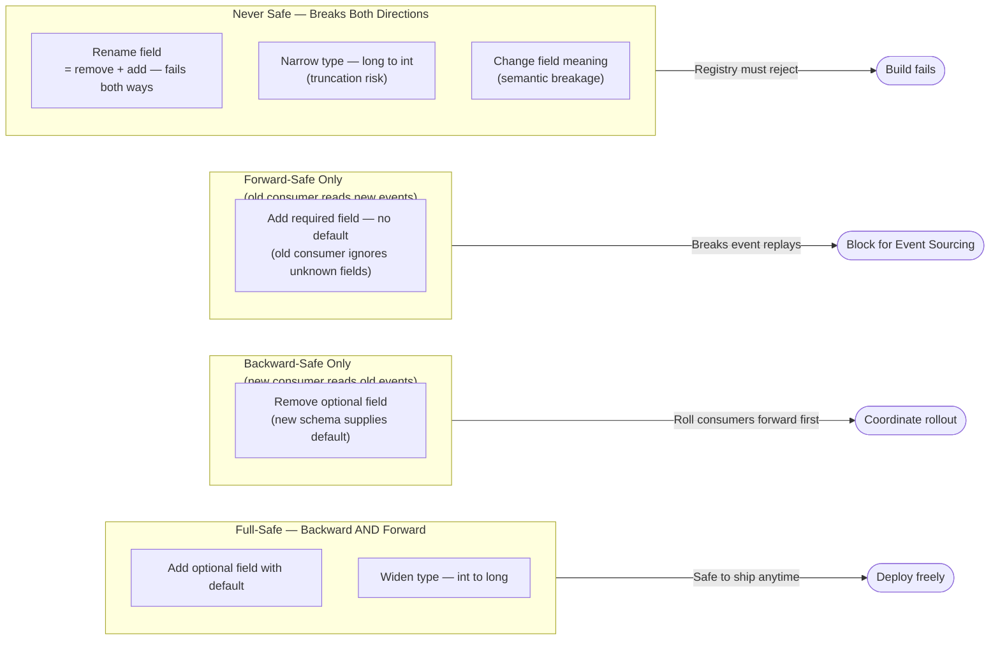
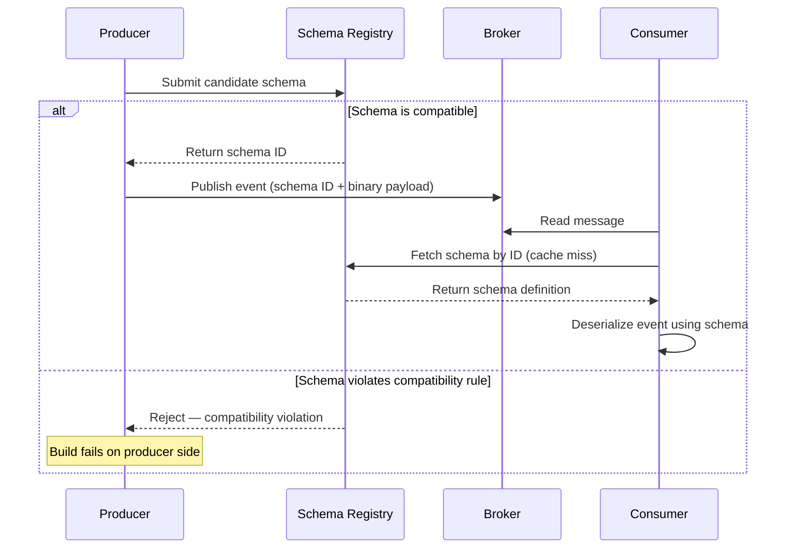
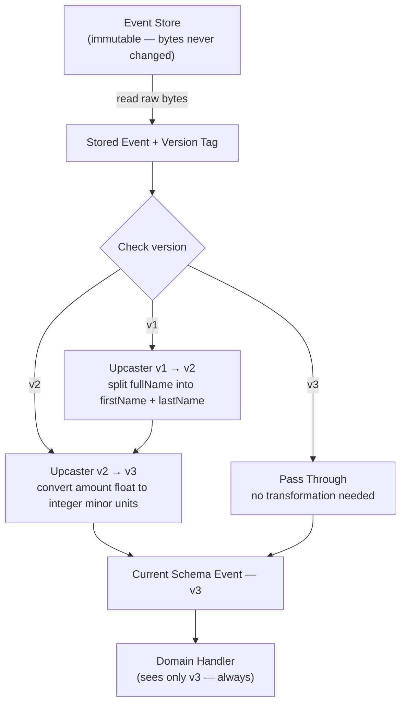
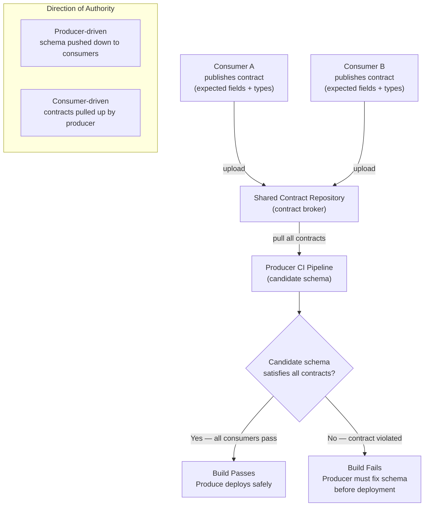

# Capítulo 8: Evolução de Schema e Versionamento de Eventos

## Declaração do Problema Inicial

O Capítulo 7 deixou o leitor com um sistema cuja verdade está distribuída entre serviços que convergem ao longo do tempo por meio de sagas e compensações. O Capítulo 6 fez uma promessa ainda mais pesada: com Event Sourcing (armazenamento de eventos), cada evento é guardado para sempre. Essa promessa agora apresenta sua conta. Uma API de request-response pode deprecar um campo em um trimestre e forçar todos os chamadores a atualizar. Um event store não pode. Um evento escrito em 2021 será lido em 2027, por um consumidor escrito em 2025, executando código que ninguém no time original se lembra. O evento não é uma mensagem transitória; é um **contrato persistido com o futuro**. Portanto, a verdadeira questão deste capítulo é desconfortável: como um arquiteto muda a forma de um fato que já aconteceu, está armazenado milhões de vezes, e é consumido por equipes que ele nunca conheceu? Errar aqui e cada implantação se torna um evento coordenado, entre equipes, de alto risco. Acertar e as equipes evoluem seus contratos de forma independente, no próprio ritmo, sem um único consumidor quebrado. Este capítulo trata de conquistar essa independência — e sobre a única decisão de política que, se pulada, silenciosamente garante o oposto.

## Compatibilidade Retroativa e Prospectiva

Toda conversa sobre evolução de schema eventualmente se reduz a duas palavras: direção de **compatibilidade**. Confundi-las é o erro mais comum — e mais caro — neste domínio, portanto defina-as com precisão e nunca as misture novamente.

**Compatibilidade retroativa** (backward compatibility) significa que um *novo consumidor* pode ler *eventos antigos*. Você alterou o schema; um consumidor rodando o novo schema ainda entende dados escritos sob o antigo. Essa é a direção que o Event Sourcing exige, porque seu event store está cheio de eventos antigos que serão reexecutados para sempre.

**Compatibilidade prospectiva** (forward compatibility) significa que um *consumidor antigo* pode ler *eventos novos*. Você alterou o schema; um consumidor ainda rodando a versão antiga tolera dados escritos sob a nova, geralmente ignorando o que não reconhece. Essa é a direção que a integração pub/sub exige, porque você não pode atualizar todos os consumidores no mesmo instante em que atualiza o produtor.

**Compatibilidade total** (full compatibility) é ambas ao mesmo tempo. É a mais restrita e a mais segura, e é o alvo para o qual a maioria dos registries maduros permite configurar.

O resultado prático é um conjunto simples de regras sobre o que uma mudança tem permissão de fazer. As mudanças seguras são quase sempre aditivas.

**Figura 8.1 — Matriz de decisão de compatibilidade para mudanças de schema**



*Este diagrama classifica mudanças comuns de schema em quatro grupos de segurança, deixando imediatamente claro quais operações são seguras para enviar sem coordenação com os consumidores. Entender esses agrupamentos é a base da evolução disciplinada de schema: apenas mudanças totalmente seguras (full-safe) podem ser implantadas a qualquer momento sem risco.*

Observe a armadilha escondida nessa matriz. Adicionar um campo **obrigatório** (required) quebra a compatibilidade retroativa, porque eventos antigos simplesmente não o carregam. Remover um campo quebra a compatibilidade prospectiva, porque consumidores antigos ainda o esperam. E uma renomeação não é uma operação — é uma exclusão mais uma adição, portanto falha nos dois lados. A disciplina, então, é intencionalmente entediante: prefira campos opcionais, sempre forneça defaults, e trate "required" como uma palavra que você precisa justificar em uma revisão.

**Listagem 8.1 — Evolução segura de schema Avro: adicionando um campo opcional com default nulo**

Este exemplo mostra duas versões de schema Avro para um evento `OrderPlaced`. Adicionar um campo opcional com default nulo alcança compatibilidade total: a resolução reader/writer do Avro preenche o default para eventos antigos (retroativa), e campos mais novos ausentes no schema do leitor são simplesmente projetados para fora (prospectiva).

```python
# Schema evolution: safe addition of an optional field with a null default
# Demonstrates both backward and forward compatibility using Avro-style schemas

from typing import Any

# v1 schema: original OrderPlaced event (no coupon support yet)
ORDER_PLACED_V1: dict[str, Any] = {
    "type": "record",
    "name": "OrderPlaced",
    "namespace": "com.example.orders",
    "doc": "An order was placed by a customer.",
    "fields": [
        {"name": "orderId",    "type": "string"},
        {"name": "customerId", "type": "string"},
        {"name": "totalCents", "type": "long"},
    ],
}

# v2 schema: adds optional couponCode as a null-first union (default = null)
ORDER_PLACED_V2: dict[str, Any] = {
    "type": "record",
    "name": "OrderPlaced",
    "namespace": "com.example.orders",
    "doc": "An order was placed by a customer.",
    "fields": [
        {"name": "orderId",    "type": "string"},
        {"name": "customerId", "type": "string"},
        {"name": "totalCents", "type": "long"},
        # null-first union means the declared default (None/null) is valid.
        # Avro requires that the default value matches the first type in the union.
        {
            "name": "couponCode",
            "type": ["null", "string"],  # null-first union
            "default": None,             # Python None serialises as Avro null
            "doc": "Discount coupon applied at checkout, or null if none.",
        },
    ],
}

# --- Compatibility analysis ---
#
# BACKWARD-COMPATIBLE (new consumer reads old v1 event):
#   A v2 consumer deserialising a v1 event finds no couponCode bytes.
#   Avro reader/writer schema resolution fills in the declared default: null.
#   The v2 consumer proceeds without error. ✓
#
# FORWARD-COMPATIBLE (old consumer reads new v2 event):
#   A v1 consumer deserialising a v2 event encounters the couponCode bytes.
#   Avro projection: writer fields absent from the reader schema are skipped.
#   The v1 consumer proceeds without error. ✓
#
# RESULT: FULL compatibility — safe in both directions.


def demonstrate_compatibility() -> None:
    """Simulate reader/writer schema resolution in plain Python dicts."""
    import json

    # v1 event as it exists in the store — no couponCode field
    v1_payload: dict[str, Any] = {
        "orderId": "ord-001",
        "customerId": "cust-42",
        "totalCents": 4999,
    }

    # v2 consumer view: Avro fills in the default for absent fields
    def read_as_v2(payload: dict[str, Any]) -> dict[str, Any]:
        return {**{"couponCode": None}, **payload}  # default applied if key missing

    # v1 consumer view: extra fields in a v2 payload are projected away
    v1_field_names = {f["name"] for f in ORDER_PLACED_V1["fields"]}

    def read_as_v1(payload: dict[str, Any]) -> dict[str, Any]:
        return {k: v for k, v in payload.items() if k in v1_field_names}

    # v2 event as a newer producer would write it
    v2_payload: dict[str, Any] = {
        "orderId": "ord-002",
        "customerId": "cust-99",
        "totalCents": 2500,
        "couponCode": "SAVE10",
    }

    print("v2 consumer reads v1 event:", json.dumps(read_as_v2(v1_payload)))
    print("v1 consumer reads v2 event:", json.dumps(read_as_v1(v2_payload)))


if __name__ == "__main__":
    demonstrate_compatibility()
```

Mais uma distinção que engenheiros seniores rotineiramente confundem: compatibilidade é uma propriedade do *par de schemas*, não do evento. Uma única mudança pode ser retrocompatível e prospectivamente incompatível ao mesmo tempo. Sempre pergunte "compatível em qual direção, para quem?" antes de aprovar qualquer coisa.

> 💡 **Nota do Especialista:** O texto afirma que compatibilidade total "é o alvo para o qual a maioria dos registries maduros usa como padrão." Isso é impreciso e deve ser corrigido antes da publicação. O Confluent Schema Registry — o padrão de fato da indústria — usa **BACKWARD** como padrão, não FULL. O AWS Glue Schema Registry também usa BACKWARD_ALL como padrão. FULL é uma escolha opt-in, não um padrão, precisamente porque proíbe a remoção de campos e impõe restrições que muitas equipes não conseguem cumprir no início do ciclo de vida de um produto. Publicar a afirmação como está fará com que profissionais configurem registries incorretamente, e depois fiquem confusos quando os padrões reais contradisserem o livro.

<details>
<summary>💡 Nota do Especialista</summary>

O texto cobre quais mudanças são seguras e inseguras, mas não nomeia o padrão **Tolerant Reader** — a disciplina do lado do consumidor que é a implementação prática da compatibilidade prospectiva. Um leitor tolerante desserializa apenas os campos de que explicitamente precisa e descarta todo o resto sem erro, em vez de falhar em campos não reconhecidos ou ausentes. Essa é a disciplina complementar às mudanças somente aditivas do produtor: o produtor adiciona campos com segurança apenas se os consumidores estiverem escritos para tolerá-los. Na prática, muitos frameworks de desserialização (especialmente Jackson com `FAIL_ON_UNKNOWN_PROPERTIES` com padrão false em versões recentes, ou a projeção de schema do Avro) implementam isso automaticamente, mas equipes que usam bibliotecas de validação rígidas ou parsers escritos manualmente devem impor isso explicitamente na revisão de código. Nomear o padrão dá às equipes um vocabulário para usar em documentos de padrões e checklists de revisão.
</details>

> ⚠️ **Nota Crítica:** O texto afirma que compatibilidade total "é o alvo para o qual a maioria dos registries maduros usa como padrão." Isso é factualmente incorreto. O Confluent Schema Registry — o registry dominante em sistemas baseados em Kafka e a implementação de referência de fato — usa `BACKWARD` como padrão, não `FULL`. O AWS Glue Schema Registry também usa `BACKWARD_ALL` como padrão. Nenhum registry amplamente implantado usa `FULL` por padrão. Um arquiteto que leia essa afirmação e então abra a interface de administração do seu registry encontrará imediatamente uma contradição, o que mina a confiança em todo o capítulo. Substitua a frase pela declaração precisa: a maioria dos registries maduros usa `BACKWARD` (Confluent) ou `BACKWARD_ALL` (AWS Glue) como padrão. Esclareça que `FULL` deve ser configurado explicitamente e explique o trade-off: impede a remoção de campos, o que causa inchaço do schema ao longo do tempo, mas elimina toda uma classe de quebras em consumidores.

## Schema Registry e Formatos (Avro, JSON Schema, Protobuf)

Regras não têm valor se ninguém as aplica. Um **schema registry** é o componente que armazena o schema canônico para cada tipo de evento, atribui uma versão e — esta é a parte que importa — *recusa* registrar uma nova versão que viole a regra de compatibilidade configurada. Ele transforma a compatibilidade de uma esperança na revisão de código em uma barreira em tempo de build.

A mecânica é direta. O produtor registra um schema e recebe de volta um ID numérico. Ele publica eventos marcados com esse ID em vez do schema completo. O consumidor lê o ID, busca o schema correspondente no registry (e o armazena em cache), e desserializa. Dois benefícios surgem imediatamente: os eventos no wire são pequenos, e nenhum consumidor pode jamais adivinhar o schema — ele sempre resolve exatamente aquele que o produtor usou.

**Figura 8.2 — Sequência de interação com o schema registry**



*Este diagrama de sequência mostra como um schema registry converte uma política de revisão de código em uma barreira rígida em tempo de build: schemas incompatíveis são rejeitados antes que um único evento chegue ao broker. O formato wire baseado em ID também é mostrado, ilustrando como os consumidores sempre resolvem o schema exato que o produtor usou — eliminando suposições na desserialização.*

O registry é neutro quanto ao formato em termos conceituais, mas a escolha do formato de serialização é em si uma decisão de design com consequências reais. Os três que dominam os sistemas cloud-native apresentam trade-offs diferentes.

| Formato | Localização do schema | Modelo de evolução | Legível por humanos | Melhor uso |
|---|---|---|---|---|
| **Avro** | Externo, resolvido por ID | Resolução reader/writer — história de evolução mais robusta | Não (binário) | Streams de eventos Kafka, event stores |
| **Protobuf** | Compilado no código (números de campo) | Baseado em número de campo; adicione/reserve, nunca reutilize números | Não (binário) | gRPC, contratos internos de alto throughput |
| **JSON Schema** | Externo ou inline | Aditivo com defaults; centrado em validação | Sim (texto) | Eventos públicos/parceiros, depurabilidade em primeiro lugar |

**Avro** merece a atenção do arquiteto em sistemas baseados em Event Sourcing por causa de uma funcionalidade: ele desserializa usando *tanto* o schema do escritor (o que produziu o evento) *quanto* o schema do leitor (o que o consumidor espera), reconciliando a diferença automaticamente. Essa divisão reader/writer é exatamente a maquinaria de compatibilidade retroativa que o Event Sourcing precisa, embutida no formato.

**Protobuf** codifica campos por número, não por nome, portanto renomear um campo não tem custo no wire — mas reutilizar um número de campo retirado é catastrófico, mapeando silenciosamente bytes antigos para um novo significado. A regra é absoluta: **reserve** números de campo excluídos, nunca os recicle.

**JSON Schema** compra legibilidade e depuração sem dor ao custo de tamanho e garantias mais fracas. Para eventos que cruzam uma fronteira de empresa para um parceiro que os inspecionará manualmente, essa troca frequentemente é a correta.

Não há um vencedor universal. Streams internos à sua plataforma tendem a usar Avro ou Protobuf; contratos que você entrega a externos tendem a usar JSON. O que não é negociável é que *algum* registry aplique *alguma* política.

<details>
<summary>💡 Nota do Especialista</summary>

O texto explica que os produtores marcam eventos com um schema ID, mas omite o detalhe do formato wire que torna isso interoperável na prática. O formato wire do Confluent — agora um padrão de fato adotado por AWS MSK, Confluent Cloud e a maioria das ferramentas adjacentes ao Kafka — é: `0x00` (magic byte) + ID de schema big-endian de 4 bytes + payload serializado. Qualquer consumidor não-Kafka (uma ponte de webhook HTTP, um pipeline CDC, um consumidor Java legado) deve entender esse enquadramento antes mesmo de começar a desserialização. Equipes que tratam o schema ID como um detalhe interno descobrem isso da maneira difícil quando integram seu primeiro consumidor externo ou poliglota. Arquitetos devem documentar esse contrato wire explicitamente e testar a desserialização de pelo menos um cliente não-JVM antes de entrar em produção.
</details>

<details>
<summary>💡 Nota do Especialista</summary>

O schema registry é mencionado como uma barreira em tempo de build, mas seu risco operacional como dependência em tempo de execução não é abordado. Em produção, todo consumidor realiza uma busca de cache miss no registry no primeiro contato com um novo schema ID. Se o registry estiver indisponível, um consumidor que ainda não armazenou em cache esse schema falhará ao desserializar. A mitigação padrão é um **cache de schema local em disco** que sobrevive à indisponibilidade do registry — o cliente Java do Confluent suporta isso via configuração de `SchemaRegistryClient` cache, mas não está ativado por padrão. Equipes que implantam o registry como uma única instância sem HA, ou que não pré-carregam o cache local antes de implantar os consumidores, tratam uma reinicialização rotineira do registry como um incidente de produção. Trate o registry com o mesmo SLA de disponibilidade que o broker em si.
</details>

<details>
<summary>⚠️ Nota Crítica</summary>

A seção sobre Protobuf afirma que "renomear um campo não tem custo no wire." Embora verdadeiro no nível de codificação binária (campos são identificados por número, não por nome), isso é enganoso na prática para o público-alvo. Renomear um campo Protobuf muda toda API de cliente gerada — todo serviço que importa o arquivo `.proto` deve recompilar e atualizar seus call sites. Para um contrato interno compartilhado com muitos consumidores, uma renomeação desencadeia uma implantação coordenada de código gerado em todos os consumidores, que é exatamente o problema de acoplamento que o capítulo busca evitar. Apresentar isso como "não tem custo" subestima o impacto operacional. Qualifique a afirmação: "renomear não tem custo no *formato wire*, mas o código gerado de todo consumidor muda e deve ser recompilado e reimplantado." Adicione uma observação de que isso torna a renomeação uma preocupação logística mesmo quando é segura no wire, especialmente para contratos amplamente compartilhados.
</details>

## Upcasting e Versionamento de Eventos Persistidos

As regras de compatibilidade mantêm você seguro enquanto cada mudança for aditiva. A realidade não é tão gentil. Eventualmente um conceito de negócio genuinamente muda de forma — um único campo `name` deve se tornar `firstName` e `lastName`, ou um valor armazenado como float deve se tornar um inteiro de unidades menores. Nenhuma regra aditiva cobre isso, e você não pode reescrever a história: os eventos antigos são fatos imutáveis, já persistidos, possivelmente por milhões.

A resposta é o **upcasting**: transformar um evento antigo no schema atual *no momento da leitura*, em memória, no caminho do store para a aplicação. Os bytes armazenados nunca mudam. Um componente no pipeline de desserialização detecta a versão antiga e aplica uma função que o mapeia adiante para a nova forma. Sua lógica de domínio sempre vê apenas a versão mais recente e permanece alegremente inconsciente de que cinco formatos históricos existem por baixo dela.

**Listagem 8.2 — Pipeline de upcaster: promovendo eventos versionados para o schema atual no momento da leitura**

Este exemplo implementa um pipeline de upcaster versionado como um registry baseado em decorators. Cada upcaster promove exatamente uma versão adiante; o pipeline os encadeia automaticamente. Os bytes armazenados nunca são mutados — a transformação ocorre no momento da leitura, em memória. O handler de domínio é intencionalmente escrito conhecendo apenas `CustomerRegisteredV2`.

```python
# Upcaster pipeline: promote persisted events to the current schema at read time.
# Stored bytes are never modified; the upgrade is purely in-memory on the read path.
# Time complexity: O(n) per event, where n = number of version steps required.

from __future__ import annotations

import dataclasses
from collections.abc import Callable
from typing import Any

UpcasterKey = tuple[str, int]          # (event_type, from_version)
UpcasterFn  = Callable[[dict[str, Any]], dict[str, Any]]


class UpcasterPipeline:
    """Registry and executor of upcaster functions keyed by (event_type, from_version).

    Each registered upcaster promotes one version forward. The pipeline walks
    the chain until no further upcaster is registered for the current version.
    """

    def __init__(self) -> None:
        self._registry: dict[UpcasterKey, UpcasterFn] = {}

    def register(
        self, event_type: str, from_version: int
    ) -> Callable[[UpcasterFn], UpcasterFn]:
        """Decorator: register a function as the upcaster for (event_type, from_version)."""
        def decorator(fn: UpcasterFn) -> UpcasterFn:
            self._registry[(event_type, from_version)] = fn
            return fn
        return decorator

    def upcast(self, raw: dict[str, Any]) -> dict[str, Any]:
        """Walk the upcaster chain until the payload reaches the latest version."""
        payload = dict(raw)  # shallow copy — original dict (stored bytes) is untouched
        event_type: str = payload["event_type"]

        while (key := (event_type, payload["version"])) in self._registry:
            payload = self._registry[key](payload)

        return payload


# Singleton pipeline shared across the read path
pipeline = UpcasterPipeline()


# ── Upcaster: CustomerRegistered v1 → v2 ──────────────────────────────────────
# Business change: the single denormalised fullName field was split into
# firstName and lastName to support proper sorting and personalisation.

@pipeline.register("CustomerRegistered", from_version=1)
def upcast_customer_registered_v1_to_v2(payload: dict[str, Any]) -> dict[str, Any]:
    full_name: str = payload["full_name"]
    first, _, last = full_name.partition(" ")   # partition on first space only
    return {
        "event_type":  payload["event_type"],
        "version":     2,                        # bumped — v2 upcaster can now run if needed
        "customer_id": payload["customer_id"],
        "first_name":  first,
        "last_name":   last or "",
        # full_name is intentionally absent — it no longer exists in v2
    }


# ── Current domain schema ──────────────────────────────────────────────────────

@dataclasses.dataclass(frozen=True)
class CustomerRegisteredV2:
    event_type:  str
    version:     int
    customer_id: str
    first_name:  str
    last_name:   str


# ── Domain handler ─────────────────────────────────────────────────────────────
# This handler knows nothing about v1. It only works with CustomerRegisteredV2.

def handle_customer_registered(event: CustomerRegisteredV2) -> None:
    print(
        f"[handler] Welcome, {event.first_name} {event.last_name}!"
        f" (customer_id={event.customer_id}, schema_version={event.version})"
    )


# ── Read-path orchestration ────────────────────────────────────────────────────

def load_and_dispatch(raw: dict[str, Any]) -> None:
    """Read a stored event payload, upcast transparently, dispatch to handler."""
    current = pipeline.upcast(raw)          # v1 is promoted; v2+ passes through
    event = CustomerRegisteredV2(**current)
    handle_customer_registered(event)


if __name__ == "__main__":
    # Simulate a v1 event written to the event store years ago
    stored_v1: dict[str, Any] = {
        "event_type":  "CustomerRegistered",
        "version":     1,
        "customer_id": "cust-007",
        "full_name":   "Ada Lovelace",     # old single-field schema
    }

    # Simulate a v2 event written after the schema change
    stored_v2: dict[str, Any] = {
        "event_type":  "CustomerRegistered",
        "version":     2,
        "customer_id": "cust-008",
        "first_name":  "Grace",
        "last_name":   "Hopper",
    }

    load_and_dispatch(stored_v1)  # upcasted v1 → v2 transparently
    load_and_dispatch(stored_v2)  # already current; passes through unchanged
```

A cadeia de upcasters é o padrão que escala isso. Cada upcaster promove exatamente uma versão adiante — v1→v2, v2→v3 — e o pipeline os executa em sequência. Um evento v1 em disco passa por ambos os upcasters e chega como v3. Isso mantém cada transformação pequena, independentemente testável e honesta sobre exatamente qual mudança ela representa.

**Figura 8.3 — Fluxograma do pipeline de upcaster**



*Este fluxograma ilustra como uma cadeia de upcasters promove qualquer versão histórica de evento para o schema atual no momento da leitura, sem nunca tocar nos bytes armazenados. Cada upcaster transforma exatamente um passo de versão, mantendo as transformações individuais pequenas, testáveis e razoadas de forma independente — enquanto o handler de domínio permanece inconsciente de que múltiplos formatos históricos existem.*

Duas disciplinas tornam o upcasting sustentável em vez de um custo crescente. Primeiro, **todo evento carrega um número de versão explícito** em seus metadados desde o primeiro dia — retrofitar o versionamento em um store sem versão é doloroso, portanto pague esse custo antecipadamente mesmo quando v1 é tudo que você tem. Segundo, upcasting não é a *única* opção para grandes migrações. Quando uma cadeia de upcasters cresce de forma incontrolável, você pode **reescrever o stream** para um novo sob o novo schema (uma migração "copiar e transformar"), deixando o stream antigo como um arquivo imutável. Upcasting é mais barato no dia a dia; reescrita de stream é mais limpa a longo prazo. A maioria dos sistemas usa ambos, e escolher entre eles é um julgamento arquitetural genuíno, não um padrão.

Resista à tentação de "simplesmente corrigir os dados" com uma atualização in-place no store. Isso destrói a única propriedade — uma história imutável e auditável — que justificou o Event Sourcing em primeiro lugar.

<details>
<summary>💡 Nota do Especialista</summary>

Em escala de produção, uma cadeia de upcasters interage de forma perigosa com a reconstrução de aggregates do Event Sourcing. Reproduzir um stream de 500k eventos através de mesmo dois upcasters por evento adiciona tempo significativo de CPU e wall-clock durante reinicializações a frio ou reconstruções de aggregates do zero. A mitigação padrão — **snapshots de aggregate** — deve ser co-projetada com a estratégia de upcasting: um snapshot armazena um estado de aggregate totalmente atualizado na versão atual, de modo que as reproduções processem apenas eventos *após* o último snapshot. Se o snapshotting for adicionado como uma reflexão tardia depois que a cadeia de upcasters já estiver em vigor, as equipes descobrem que snapshots antigos podem eles próprios precisar de versionamento e upcasting, criando um problema recursivo. Versionamento e snapshotting devem ser projetados juntos desde o início, não sequencialmente.
</details>

<details>
<summary>⚠️ Nota Crítica</summary>

O padrão de cadeia de upcasters é apresentado inteiramente no caminho feliz. Não há discussão sobre o que acontece quando um upcaster lança uma exceção ou produz uma saída que falha na validação downstream. Em um sistema baseado em Event Sourcing, um upcaster defeituoso não falha apenas em uma mensagem — ele torna toda a história do aggregate ilegível, bloqueando todo o processamento de comandos para aquele aggregate até que o bug seja corrigido e reimplantado. Este é um dos modos de falha operacionalmente mais perigosos em sistemas baseados em Event Sourcing e está completamente ausente do texto. Upcasters devem ser testados contra um corpus de eventos históricos reais antes da implantação; um upcaster com falha deve exibir um erro claro com o payload do evento armazenado e a versão, não corromper silenciosamente o estado; considere encapsular o pipeline em um fallback que expõe o evento bruto para triagem em vez de travar completamente o lado de leitura.
</details>

## Contratos, Contratos Orientados ao Consumidor e Governança

Tudo até aqui é mecanismo. A parte mais difícil da evolução de schema não é técnica; é organizacional. Um evento que cruza um bounded context (o Capítulo 2 enquadrou eventos como contratos pertencentes a alguém) é uma promessa de uma equipe produtora para equipes consumidoras que podem estar em outros departamentos, outros fusos horários, outras linhas de reporte. O registry aplica compatibilidade sintática. Ele não pode dizer *quem está realmente consumindo o quê*, e portanto não pode dizer se uma mudança tecnicamente compatível é *semanticamente* segura para ser enviada.

É aqui que os **contratos orientados ao consumidor** (consumer-driven contracts — CDC) ganham seu lugar. A ideia inverte a direção habitual de autoridade. Em vez de o produtor declarar "aqui está meu schema, adapte-se a ele," cada consumidor publica um contrato declarando exatamente os campos e formas de que *ele* depende. O build do produtor então verifica seu schema contra a união de todos os contratos dos consumidores. Se uma mudança proposta quebrar as expectativas declaradas de qualquer consumidor, o pipeline do produtor falha — antes da implantação, no lado do produtor, onde a mudança se originou.

**Figura 8.4 — Fluxo de trabalho de contratos orientados ao consumidor**



*Este diagrama mostra como os contratos orientados ao consumidor invertem a relação de autoridade: em vez de o produtor declarar um schema e empurrá-lo para baixo, cada consumidor declara o que precisa e o próprio pipeline de CI do produtor é responsável por satisfazer todos eles. Este é o mecanismo que captura mudanças semanticamente quebradas que um schema registry — que não tem conhecimento dos consumidores reais — não consegue detectar.*

A distinção entre um schema registry e contratos orientados ao consumidor vale ser declarada claramente, porque as equipes frequentemente assumem que um substitui o outro.

| Preocupação | Schema registry | Contratos orientados ao consumidor |
|---|---|---|
| Pergunta respondida | "Esta mudança é estruturalmente compatível?" | "Algum consumidor real realmente quebra?" |
| Conhece os consumidores | Não | Sim, explicitamente |
| Ponto de aplicação | Registro do schema | Build de CI do produtor |
| Captura uso semântico incorreto | Não | Parcialmente (apenas expectativas declaradas) |

Eles são camadas complementares, não concorrentes. O registry é a barreira rápida e grosseira; CDC é a mais lenta e consciente dos consumidores.

Em torno de ambos fica a **governança**: as políticas que tornam a evolução previsível em uma organização. A governança eficaz é mais leve do que as equipes temem e consiste em algumas regras duradouras. Atribua a cada tipo de evento uma única equipe responsável. Exija um modo de compatibilidade explícito por stream de eventos, registrado e visível. Exija que a depreciação seja anunciada com uma linha do tempo e uma métrica provando que a versão antiga não está mais sendo lida antes de ser retirada. Versione em metadados, nunca mutando payloads. Governança não é um comitê que desacelera as equipes; é o pequeno conjunto de acordos que permite que as equipes se movam *sem* coordenar cada release.

<details>
<summary>💡 Nota do Especialista</summary>

O texto descreve contratos orientados ao consumidor conceitualmente, mas não nomeia as ferramentas, o que importa para profissionais. **Pact** (pact.io) é a implementação open-source dominante: consumidores escrevem arquivos Pact expressando as interações de que dependem, um **Pact Broker** (ou PactFlow para SaaS) os armazena, e o pipeline de CI do produtor executa `can-i-deploy` contra o broker antes de qualquer release. A disciplina crítica de produção que o texto não menciona são os **pending pacts e WIP pacts** — o mecanismo do Pact para introduzir novos contratos de consumidor sem bloquear imediatamente o build do produtor durante o período de negociação inicial. Sem esse mecanismo, integrar um novo consumidor se torna um congelamento coordenado entre as duas equipes. Arquitetos seniores avaliando CDC devem avaliar especificamente se a ferramenta escolhida suporta esse modo de rollout gradual.
</details>

<details>
<summary>💡 Nota do Especialista</summary>

O texto recomenda "depreciação baseada em métricas" antes de retirar versões antigas de schema, que é o princípio correto, mas vale nomear explicitamente a lacuna de medição na prática. As métricas do schema registry indicam se uma *versão* do schema está sendo registrada ou buscada — elas não informam se um *campo* específico dentro dessa versão está sendo usado por consumidores downstream. Um consumidor pode buscar o schema v3 enquanto lê apenas o campo `orderId` e ignora `couponCode`. Se `couponCode` for o campo que você quer remover, as contagens de busca dão uma falsa confiança. A métrica mais segura é a **telemetria de nível de campo do lado do consumidor**: desserialização instrumentada que registra quais campos são acessados por grupo de consumidor. Poucas equipes implementam isso, mas aquelas que passaram por um incidente doloroso de remoção de campo quase sempre o adicionam depois.
</details>

<details>
<summary>⚠️ Nota Crítica</summary>

A seção de contratos orientados ao consumidor (CDC) apresenta o padrão como uma rede de segurança confiável com pouco reconhecimento de seu modo de falha organizacional primário: CDC só funciona quando cada consumidor mantém e publica ativamente seu contrato. Na prática, obter 100% de participação é difícil — equipes desprioritizam atualizações de contratos, novos consumidores são integrados sem contratos, e consumidores legados são esquecidos. Um build de CI do produtor que passa contra a união de contratos *publicados* ainda pode quebrar um consumidor não publicado. O texto implica que CDC responde "algum consumidor real realmente quebra?" mas a resposta honesta é "algum consumidor real *que publicou um contrato* quebra?" — uma garantia mais fraca do que a tabela sugere. A garantia é limitada pela participação — uma equipe consumidora que nunca publica um contrato não recebe proteção. CDC deve ser combinado com um registro de consumidores conhecidos e um checklist de integração que torna a publicação de contratos obrigatória.
</details>

## A Armadilha da Política Ausente

O único erro mais prejudicial em todo este capítulo não é uma má mudança de schema. É a *ausência de uma política de compatibilidade declarada*. Isso merece sua própria seção porque falha silenciosamente e é quase sempre descoberto tarde demais.

Um sistema sem uma política não anuncia o problema. Tudo funciona — até que a primeira mudança genuinamente quebradora é enviada, um consumidor de três equipes de distância desserializa lixo, e um incidente de produção rastreia até um campo que alguém "limpou" meses antes. Como não havia barreira, nada a impediu. Como os eventos são persistidos, o veneno agora está permanentemente no store, e toda reprodução o dispara novamente.

A correção é embaraçosamente barata em relação ao dano que previne: **escolha um modo de compatibilidade padrão antes que seu primeiro evento seja enviado**, e faça o registry aplicá-lo. `BACKWARD` é o padrão sensato para a maioria dos sistemas baseados em Event Sourcing; `FULL` se você puder arcar com a disciplina. Essa única decisão, tomada cedo, converte toda uma classe de incidentes de produção entre equipes em falhas em tempo de build na mesa da pessoa que os causou.

> 💡 **Nota do Especialista:** O texto identifica corretamente a ausência de uma política declarada como o erro mais prejudicial, mas não distingue entre dois modos de falha que requerem remediação diferente. O primeiro é uma equipe greenfield sem registry algum — a correção é direta: configure um registry, escolha BACKWARD, aplique-o. O segundo, caso mais doloroso, é um sistema em execução onde eventos foram enviados por meses sem um registry, e um registry está agora sendo retrofitado. Neste caso, o registro inicial do schema deve ser tratado como uma auditoria de **baseline de compatibilidade**, não como uma importação simples: cada schema existente deve ser revisado manualmente antes de ser registrado, porque a primeira verificação de compatibilidade do registry será contra o que você declarar como v1. Equipes que importam em massa schemas existentes sem revisão frequentemente descobrem que seus schemas "estáveis" já contêm padrões (campos obrigatórios não documentados, coerções de tipo implícitas) que falhariam em uma verificação BACKWARD, exigindo remediação imediata de consumidores ativos antes que o registry possa ser aplicado.

## Principais Conclusões

- **Compatibilidade tem uma direção.** Retroativa = novo consumidor lê eventos antigos (Event Sourcing precisa disso); prospectiva = consumidor antigo lê eventos novos (pub/sub precisa disso); total = ambas. Sempre pergunte "compatível em qual direção, para quem?"
- **Somente aditivo é o caminho seguro.** Adicione campos opcionais com defaults; nunca renomeie in-place, adicione campos obrigatórios sem defaults, ou reutilize um número de campo Protobuf retirado.
- **Um schema registry transforma política em uma barreira em tempo de build.** Ele rejeita schemas incompatíveis antes de serem enviados; a resolução reader/writer do Avro o torna especialmente robusto para event stores.
- **Faça upcasting, não mutação.** Transforme eventos antigos persistidos para o schema atual no momento da leitura por meio de uma cadeia de upcasters versionados; versione todo evento em metadados desde o primeiro dia.
- **O registry responde "é estruturalmente compatível?"; contratos orientados ao consumidor respondem "algum consumidor real quebra?"** Você precisa de ambos, mais governança leve: um responsável por tipo de evento, um modo de compatibilidade explícito, e depreciação baseada em métricas.
- **Nenhuma política de compatibilidade é a armadilha.** Escolha um modo padrão (BACKWARD ou FULL) e aplique-o antes de seu primeiro evento ser enviado.

## O Que Vem a Seguir

Com contratos que podem evoluir com segurança estabelecidos, o Capítulo 9 volta-se para a realidade operacional de executar esses sistemas — observando, rastreando e depurando fluxos de eventos cujo fluxo de controle é implícito e distribuído por serviços desacoplados.

<!-- ASSEMBLY COMPLETE
  Chapter: Schema Evolution and Event Versioning
  Code blocks resolved: 2 / 2
  Diagrams resolved: 4 / 4
  Expert callouts (inline): 2
  Expert callouts (collapsed): 6
  Critical callouts (inline): 1
  Critical callouts (collapsed): 3
  Unresolved markers: 0
-->
