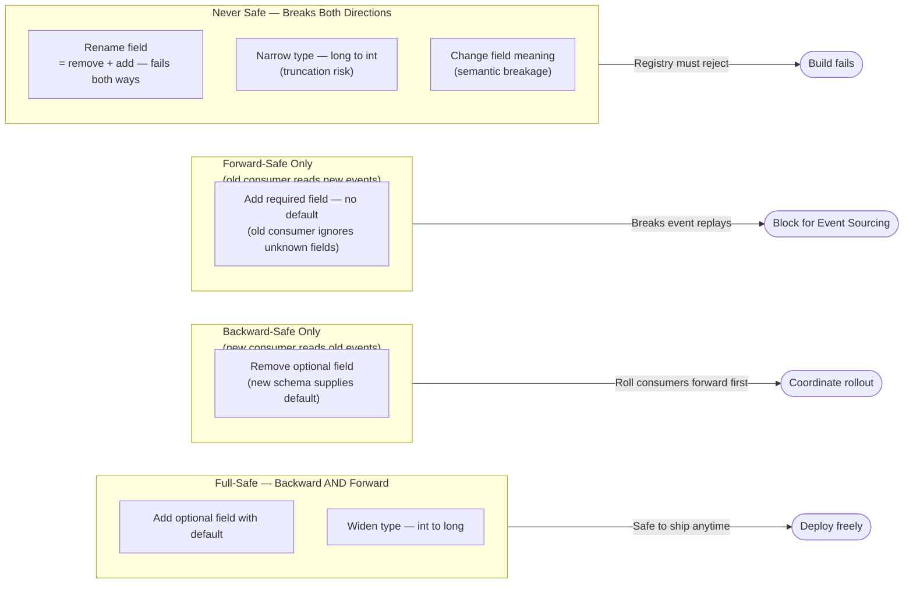
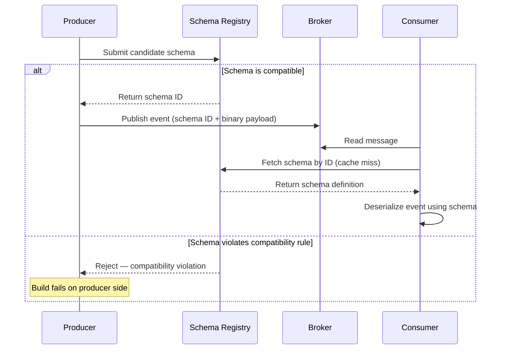
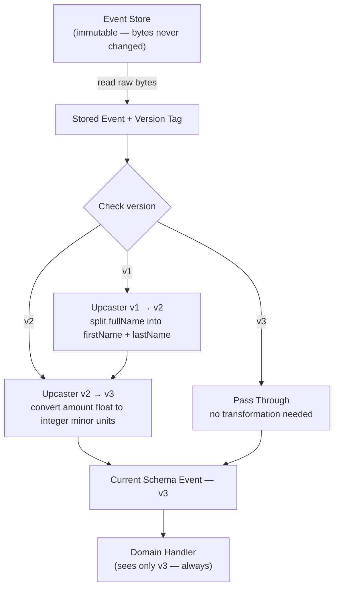
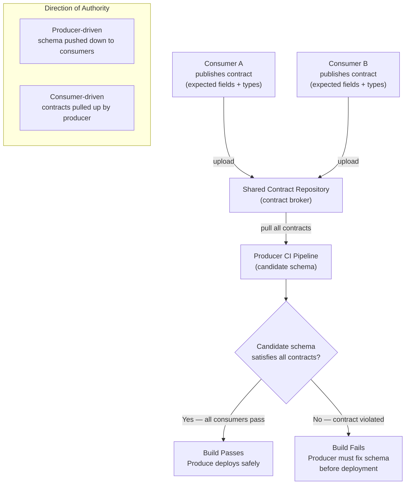

## Diagrams — Schema Evolution and Event Versioning

### A comparison table rendered as a decision matrix (class/table style) mapping schema changes to compatibility direction. Rows: "Add optional field with default", "Remove optional field", "Add required field (no default)", "Rename field", "Widen type (int->long)", "Narrow type (long->int)", "Change field meaning". Columns: "Backward-safe?", "Forward-safe?", "Full-safe?" with check/cross marks. Include a legend note that renaming = remove + add and is never safe.

This diagram classifies common schema changes into four safety groups, making it immediately clear which operations are safe to ship without consumer coordination. Understanding these groupings is the foundation of disciplined schema evolution: only full-safe changes can be deployed at any time without risk.

---

### Sequence diagram of a schema registry interaction. Actors: Producer, Schema Registry, Broker, Consumer. Flow: (1) Producer submits new schema -> Registry runs compatibility check -> returns schema ID or rejects. (2) Producer serializes event with schema ID, publishes to Broker. (3) Consumer reads message, extracts schema ID, requests schema from Registry (cache miss), Registry returns schema. (4) Consumer deserializes. Show the rejection path as an alternative branch.

This sequence diagram shows how a schema registry converts a code-review policy into a hard build-time gate: incompatible schemas are rejected before a single event reaches the broker. The ID-based wire format is also shown, illustrating how consumers always resolve the exact schema the producer used — eliminating guesswork in deserialization.

---

### Flowchart of an upcaster pipeline. Input: raw stored event with version tag. Branch on version: v1 enters upcaster v1->v2, output feeds upcaster v2->v3; v2 enters at v2->v3; v3 passes straight through. All paths converge to "current schema event" delivered to the domain handler. Emphasize that stored bytes are never mutated.

This flowchart illustrates how an upcaster chain promotes any historical event version to the current schema at read time, without ever touching the stored bytes. Each upcaster transforms exactly one version step, keeping individual transformations small, testable, and independently reasoned about — while the domain handler remains unaware that multiple historical formats exist.

---

### Sequence/flow diagram of a consumer-driven contract workflow. Consumer A and Consumer B each publish a contract (expected fields) to a shared contract broker. Producer's CI pipeline pulls all consumer contracts, runs its candidate schema against them, and either passes or fails the build. Contrast a small callout showing the producer-driven direction (schema pushed down) versus consumer-driven (contracts pulled up).

This diagram shows how consumer-driven contracts invert the authority relationship: instead of the producer declaring a schema and pushing it down, each consumer states what it needs and the producer's own CI pipeline is responsible for satisfying all of them. This is the mechanism that catches semantically breaking changes that a schema registry — which has no knowledge of actual consumers — cannot detect.

---
