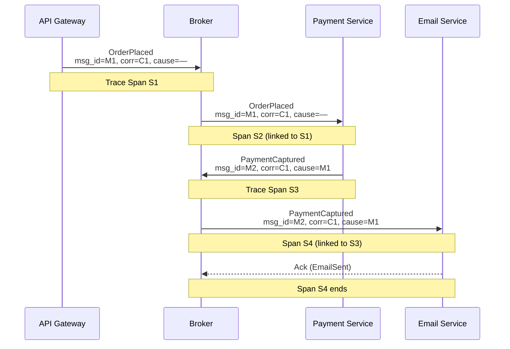
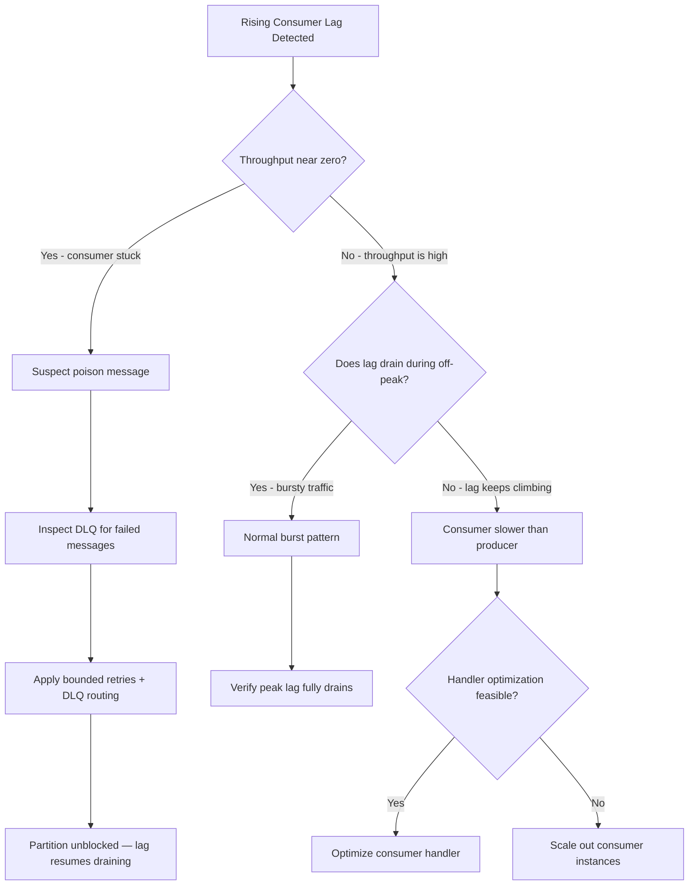
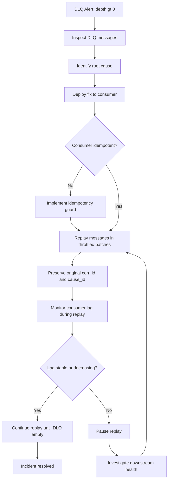

# Capítulo 9: Observabilidad, Depuración y Operaciones

## Planteamiento del Problema Inicial

El Capítulo 8 le proporcionó la disciplina para evolucionar esquemas de eventos sin romper consumidores, y añadió metadatos de versionado a cada evento. Ahora aparece un problema diferente en producción. Un cliente se queja de que un pedido fue cobrado dos veces pero el correo de confirmación nunca llegó. En un sistema sincrónico, abriría un stack trace y seguiría la cadena de llamadas de arriba a abajo. En un sistema event-driven (orientado a eventos), no hay stack trace. El servicio de pagos publicó un hecho. Tres consumidores reaccionaron de forma independiente. Uno de ellos publicó otro hecho. Se suponía que el servicio de correo estaba escuchando, pero no ocurrió nada. ¿Por dónde se empieza?

Este es el dolor operacional central de la Event-Driven Architecture (arquitectura orientada a eventos): **el flujo de control es implícito**. Ningún servicio individual conoce la historia completa, porque el desacoplamiento — la propiedad misma por la que pagó en el Capítulo 1 — oculta la cadena causal. Este capítulo le proporciona las herramientas para hacer visible esa cadena oculta nuevamente. Aprenderá a rastrear una solicitud a través de servicios desacoplados, a medir si los consumidores están al día, a depurar flujos que no tienen call stack, y a operar la maquinaria de fallos — dead-letter queues y reprocesamiento — sin empeorar las cosas. Estos no son extras opcionales. En un sistema distribuido, la observabilidad es un requisito arquitectónico de primera clase, no algo que se añade después de un incidente.

## Rastreo Distribuido e IDs de Correlación/Causalidad

Comencemos con la idea más importante de este capítulo. Para reconstruir una historia a partir de eventos desacoplados, debe transportar identidad a través de todo el flujo. Dos IDs realizan este trabajo, y no son lo mismo.

Un **correlation ID** (ID de correlación) es un identificador único compartido por cada evento que pertenece a la misma transacción de negocio lógica. Se genera una vez, en el borde — cuando se realiza el pedido — y se copia sin cambios en cada evento resultante, sin importar cuántos servicios toque el flujo. Filtrar sus logs por un correlation ID le da la historia completa de ese pedido.

Un **causation ID** (ID de causalidad) responde a una pregunta más acotada: *¿qué evento específico causó directamente este?* El causation ID de cada evento es el message ID de su padre inmediato. Mientras que el correlation ID agrupa todo el árbol, el causation ID reconstruye las aristas exactas padre-hijo de ese árbol. Con ambos, puede reconstruir no solo *qué* ocurrió sino *en qué orden causal*.

La regla es simple y absoluta: **todo consumidor que produce un nuevo evento copia el correlation ID y establece el causation ID al ID del evento padre.** Omitir esto en un consumidor rompe la cadena allí.

**Envelope de Mensaje con Campos de Trazabilidad y Patrón de Construcción de Eventos Hijos**

```python
# Message envelope with traceability fields and child-event construction pattern
from __future__ import annotations

import uuid
from dataclasses import dataclass, field
from datetime import datetime, timezone


@dataclass(frozen=True)
class EventEnvelope:
    """Immutable wrapper carried by every event through the system."""
    message_id: str                     # unique ID for this specific event
    event_type: str                     # e.g. "order.placed", "payment.captured"
    event_version: str                  # schema version, e.g. "1.0"
    payload: dict                       # domain-specific body
    correlation_id: str                 # shared by all events in one business transaction
    causation_id: str                   # message_id of the direct parent event
    timestamp: str = field(
        default_factory=lambda: datetime.now(timezone.utc).isoformat()
    )

    @staticmethod
    def create_root(event_type: str, event_version: str, payload: dict) -> "EventEnvelope":
        """Create the first event in a flow; its own ID seeds the correlation chain."""
        new_id = str(uuid.uuid4())
        return EventEnvelope(
            message_id=new_id,
            event_type=event_type,
            event_version=event_version,
            payload=payload,
            correlation_id=new_id,   # root event is its own correlation anchor
            causation_id=new_id,     # no parent, so self-reference by convention
        )

    def spawn_child(self, event_type: str, event_version: str, payload: dict) -> "EventEnvelope":
        """Produce a child event: copy correlation_id, set causation_id to this event's ID."""
        return EventEnvelope(
            message_id=str(uuid.uuid4()),
            event_type=event_type,
            event_version=event_version,
            payload=payload,
            correlation_id=self.correlation_id,  # unchanged — same business transaction
            causation_id=self.message_id,        # direct parent is this event
        )


# --- Consumer handler example ---

def handle_order_placed(parent: EventEnvelope, publisher) -> None:
    """
    Payment consumer: receives OrderPlaced, performs capture, emits PaymentCaptured.
    Demonstrates the mandatory ID-propagation rule.
    """
    order_id = parent.payload["order_id"]
    amount = parent.payload["amount"]

    # ... domain logic: charge the card ...
    charge_result = {"charge_id": "ch_abc123", "status": "captured"}

    # Construct child event — correlation_id copied, causation_id = parent.message_id
    child_event = parent.spawn_child(
        event_type="payment.captured",
        event_version="1.0",
        payload={
            "order_id": order_id,
            "amount": amount,
            "charge_id": charge_result["charge_id"],
        },
    )

    publisher.publish(topic="payments", event=child_event)
```

Estos IDs son lo que hace posible el **distributed tracing** (rastreo distribuido). El rastreo distribuido es la práctica de seguir una solicitud a medida que cruza límites de servicio, representando el recorrido como un **trace** (la solicitud completa) compuesto por **spans** (unidades individuales de trabajo). El estándar abierto es **OpenTelemetry**, que propaga un contexto de traza a través de cabeceras de mensajes. La sutileza importante para EDA: en una llamada sincrónica el span padre aún está abierto cuando el hijo se ejecuta, pero con mensajería asíncrona el padre ya ha retornado. Por tanto, su instrumentación debe vincular spans a través de **span links** en lugar de anidamiento simple padre-hijo, de modo que el salto por el broker quede preservado en la traza.

**Flujo de IDs de Correlación y Causalidad con Spans de Rastreo Distribuido**



*Este diagrama muestra cómo un único correlation ID se hila a través de cada servicio en un flujo asíncrono mientras los causation IDs preservan la relación padre-hijo en cada salto. Ilustra por qué ambos IDs son necesarios: la correlación agrupa toda la transacción, y la causalidad reconstruye el orden causal exacto, permitiendo el rastreo distribuido a través de saltos de broker mediante span links.*

Consejo profesional: genere el correlation ID lo antes posible — idealmente en el API gateway o el primer punto de entrada sincrónico — y rechace cualquier evento interno que llegue sin uno. Un evento sin correlation ID es un evento que no podrá depurar más adelante.

> 💡 **Nota del Experto:** El texto recomienda correctamente vincular spans asíncronos a través de span links de OpenTelemetry en lugar de anidamiento padre-hijo, pero en la práctica la mayoría de los backends de observabilidad — Jaeger, Zipkin, e incluso algunas configuraciones del agente Datadog — tienen soporte parcial o inconsistente para span links en sus versiones estables actuales. Los equipos que dependen de span links para flujos fan-out frecuentemente descubren que sus trazas se renderizan como fragmentos desconectados en la UI, haciendo invisible la causalidad fan-out. El workaround en producción es propagaar la cabecera W3C `traceparent` (definida en la W3C Trace Context Recommendation, https://www.w3.org/TR/trace-context/) a través de cada cabecera de mensaje y tratar los saltos asíncronos como relaciones FOLLOWS_FROM, luego cruzar referencias por correlation ID en consultas de logs hasta que el soporte del backend madure. Elija su backend de rastreo conociendo esta limitación antes de diseñar su contrato de instrumentación.

<details>
<summary>💡 Nota del Experto</summary>
Un error común en la capa del API gateway es reutilizar directamente la cabecera HTTP entrante `X-Request-ID` o `X-B3-TraceId` como correlation ID. Estas cabeceras son generadas por load balancers y proxies en formatos que varían entre proveedores — cadenas hexadecimales, IDs cortos, o codificación específica del proveedor — y las consultas de agregación de logs downstream frecuentemente fallan cuando encuentran valores no-UUID mezclados con correlation IDs UUID de servicios internos. La mejor práctica: genere siempre un UUID v4 fresco en el límite del dominio (el primer servicio propietario de la transacción de negocio) y úselo exclusivamente como correlation ID. Almacene el HTTP trace ID originante como un campo separado `http_trace_id` para depuración a nivel HTTP, pero nunca confunda los dos.
</details>

<details>
<summary>⚠️ Nota Crítica</summary>
El texto afirma "La regla es simple y absoluta: todo consumidor que produce un nuevo evento copia el correlation ID y establece el causation ID al ID del evento padre." Esto colapsa por completo en escenarios fan-in, que son comunes en sistemas EDA reales. Cuando un consumidor de saga o agregación emite un evento de salida solo después de recibir dos o más eventos upstream independientes (por ejemplo, tanto un `PaymentCaptured` como un `InventoryReserved` deben llegar antes de que se publique `OrderFulfilled`), no hay un único evento padre que establecer como causation ID. Elegir uno arbitrariamente pierde la mitad del grafo causal; el otro padre simplemente desaparece de la traza. La regla no es absoluta — solo es correcta para topologías fan-out (un padre, muchos hijos). En patrones fan-in como las sagas, lleve todos los IDs de eventos contribuyentes en una lista `causation_ids`, o vincule múltiples spans mediante span links de OpenTelemetry.
</details>

<details>
<summary>⚠️ Nota Crítica</summary>
El consejo profesional aconseja "rechazar cualquier evento interno que llegue sin [un correlation ID]." Aplicada literalmente, esta regla rompe una clase entera de eventos legítimos: los producidos por trabajos programados, pipelines disparados por cron, automatización de infraestructura, capturas CDC de bases de datos, y scripts de migración de datos. Ninguno de estos se origina de una solicitud de borde, por lo que no tienen ningún correlation ID natural que heredar. Rechazarlos detiene los consumidores que dependen de ellos sin producir ningún error accionable para el operador. La regla matizada: los eventos sintéticos (programados, generados por el sistema, o de origen CDC) deben generar su propio correlation ID raíz en el punto de emisión, documentado como una transacción originada por el sistema. La regla de rechazo se aplica a eventos que afirman ser parte de una transacción de negocio existente pero no llevan ID — no a todos los eventos universalmente.
</details>

## Lag, Rendimiento y Métricas de Salud del Consumidor

El rastreo le cuenta la historia de una solicitud. Las métricas le dicen el estado de salud del sistema completo. En sistemas event-driven, la métrica más valiosa es el **consumer lag** (retraso del consumidor).

El **consumer lag** es la brecha entre el último offset que un productor ha escrito en una partición y el último offset que un consumer group (grupo de consumidores) ha procesado. En un broker basado en log como Kafka, se mide en mensajes. En un broker basado en cola, la señal equivalente es la profundidad de la cola o la antigüedad del mensaje no confirmado más antiguo. El lag es el equivalente en sistemas distribuidos de una pila de tareas pendientes creciente: una pila pequeña y estable está bien, pero una pila que crece sin límite significa que el consumidor nunca podrá ponerse al día.

Observe cómo el lag se comporta con el tiempo, porque la tendencia importa más que el valor.

| Patrón de lag | Qué significa | Acción |
|---|---|---|
| Bajo y plano | El consumidor sigue el ritmo de los productores | Saludable; sin acción |
| Diente de sierra (sube, se drena) | Tráfico en ráfagas, el consumidor se recupera | Normal; verificar que el pico se drena completamente |
| Subiendo constantemente | El consumidor es más lento que el productor | Escalar consumidores u optimizar el handler |
| Plano pero alto, sin drenarse | Consumidor probablemente bloqueado o en crash-loop | Investigar poison message inmediatamente |

El lag por sí solo no es suficiente. Combínelo con **throughput** (eventos procesados por segundo) y **processing latency** (tiempo desde la recepción del evento hasta la finalización). Juntos distinguen dos fallos muy diferentes: un lag creciente con alto throughput significa que simplemente está abrumado por volumen, mientras que un lag creciente con *cero* throughput significa que el consumidor se ha detenido por completo — frecuentemente atascado en un solo mensaje que no puede ni procesar ni liberar.

**Árbol de Decisión para Diagnóstico de Consumer Lag**



*Este árbol de decisión ofrece a los ingenieros de guardia un camino estructurado desde una alerta de lag creciente hasta una acción concreta, distinguiendo los dos modos de fallo fundamentalmente diferentes — un consumidor que está abrumado versus uno que está completamente bloqueado — porque la solución para cada uno es diferente y aplicar la solución incorrecta desperdicia tiempo crítico de incidente.*

Alerte sobre la *tendencia y antigüedad* del lag, no sobre un número absoluto fijo. Un umbral de "10.000 mensajes" no tiene sentido sin conocer el throughput; diez mil mensajes a cien mil por segundo es una décima de segundo de retraso, pero el mismo número a diez por segundo es un cuarto de hora de interrupción. Alertar sobre la antigüedad del mensaje no procesado más antiguo expresa el impacto de negocio directamente.

> 💡 **Nota del Experto:** El texto distingue correctamente "abrumado" (alto throughput, lag creciente) de "bloqueado" (cero throughput, lag creciente), pero monitorea el throughput agregado del consumer group, lo que enmascara un modo de fallo crítico en producción. Un consumer group que procesa mensajes de diez particiones puede mostrar throughput agregado no nulo mientras una partición está completamente bloqueada en la cabecera de línea por un poison message. La métrica agregada nunca llega a cero, por lo que la alarma de "bloqueado" nunca se dispara, sin embargo esa partición acumula lag indefinidamente. La postura correcta de monitoreo es rastrear el lag y el throughput a nivel de **partición individual**, no solo a nivel del consumer group. La API de Consumer Group de Kafka expone offsets por partición; herramientas como Burrow de LinkedIn (https://github.com/linkedin/Burrow) y el Kafka Lag Exporter evalúan el estado de lag por partición de forma separada, que es cómo los equipos de producción detectan bloqueos de partición individual que los dashboards agregados ocultan.

<details>
<summary>💡 Nota del Experto</summary>
El texto recomienda correctamente alertar sobre la antigüedad del mensaje no procesado más antiguo en lugar del recuento absoluto de lag, pero no aborda cómo obtener esta métrica en la práctica, donde los equipos frecuentemente se quedan atascados. La API nativa de consumer group de Kafka reporta offsets confirmados y offsets de fin de log pero no expone marcas de tiempo de mensajes directamente en forma de antigüedad de lag. AWS MSK expone una métrica de CloudWatch llamada `EstimatedMaxTimeLag` que proporciona directamente el lag basado en antigüedad para clústeres MSK. Para Kafka autogestionado, Burrow calcula el estado del consumer group usando una ventana deslizante de velocidad de lag en lugar de una instantánea única, lo que convierte naturalmente el lag en una señal de dominio temporal. Los equipos que monitorean solo `kafka_consumer_group_lag` (la métrica de conteo raw de JMX o el exportador de Kafka) perderán completamente la señal de antigüedad a menos que agreguen explícitamente una de estas herramientas o la calculen ellos mismos a partir del índice de marcas de tiempo de la partición.
</details>

## Depuración de Flujos de Eventos Asíncronos

Ahora combine los dos. Cuando llega un incidente, raramente tiene una excepción clara apuntando a una línea. Tiene un síntoma — un correo faltante, un cargo duplicado — y debe trabajar hacia atrás a través de un flujo invisible. Siga un procedimiento disciplinado en lugar de adivinar.

1. **Ancle en el correlation ID.** Encuentre el ID de la transacción afectada desde cualquier evento conocido, línea de log, o referencia visible al usuario. Esta es su clave para todo lo demás.
2. **Reconstruya el árbol.** Consulte su agregación de logs para cada evento y entrada de log que lleve ese correlation ID, luego ordénelos por causation ID para reconstruir la cadena causal exacta. Esto le muestra cuál fue el último evento que se disparó.
3. **Encuentre el enlace roto.** El fallo está casi siempre en el primer *eslabón faltante* — el evento que debería haberse producido o consumido pero no lo fue. Si existe `PaymentCaptured` pero ningún `EmailRequested` lo siguió, su fallo está en el consumidor de correo o en su suscripción, no en el pago.
4. **Inspeccione el consumidor sospechoso.** Verifique su lag, su tasa de errores, y su dead-letter queue para ese mensaje. Un mensaje en el DLQ es su prueba irrefutable.

**Consulta de Incidente en Agregación de Logs: Reconstruir la Cadena Causal para un Correlation ID**

```python
# Log-aggregation incident query: reconstruct the causal chain for one correlation_id
from __future__ import annotations

from dataclasses import dataclass
from typing import Any

# --- Generic SQL query (ANSI-compatible; paste directly into Athena / BigQuery / ClickHouse) ---
INCIDENT_QUERY = """
SELECT
    timestamp,
    event_type,
    service,
    message_id,
    causation_id,
    correlation_id,
    COALESCE(status, 'unknown') AS status
FROM event_log
WHERE correlation_id = :correlation_id
ORDER BY timestamp ASC;
"""
# Note: replace :correlation_id with $1 / ? / %(correlation_id)s depending on your driver.


@dataclass
class EventRow:
    timestamp: str
    event_type: str
    service: str
    message_id: str
    causation_id: str
    correlation_id: str
    status: str


def fetch_causal_chain(
    connection,           # any PEP 249-compatible DB connection
    correlation_id: str,
) -> list[EventRow]:
    """
    Run the incident query and return rows ordered by timestamp.
    Each row's causation_id points to its parent message_id,
    giving you the exact causal tree without relying on wall-clock order.
    """
    cursor = connection.cursor()
    cursor.execute(
        INCIDENT_QUERY.replace(":correlation_id", "%s"),  # adapt placeholder per driver
        (correlation_id,),
    )
    rows = [EventRow(*row) for row in cursor.fetchall()]
    return rows


def print_causal_tree(rows: list[EventRow]) -> None:
    """
    Pretty-print the chain; highlight any gap where causation_id has no matching message_id.
    The first missing link is almost always where the incident occurred.
    """
    known_ids = {r.message_id for r in rows}
    print(f"{'TIMESTAMP':<30} {'EVENT TYPE':<30} {'SERVICE':<20} {'STATUS':<12} NOTE")
    print("-" * 100)
    for row in rows:
        gap_flag = ""
        # Flag the root event and any orphaned causation reference
        if row.causation_id not in known_ids and row.causation_id != row.message_id:
            gap_flag = "  <-- BROKEN LINK (parent not in trace)"
        print(
            f"{row.timestamp:<30} {row.event_type:<30} {row.service:<20} {row.status:<12}{gap_flag}"
        )
```

Dos advertencias surgidas de la experiencia. Primero, **los timestamps de reloj de pared mienten** entre máquinas. El desfase de reloj entre servicios significa que no puede confiar en el ordenamiento por timestamp solo; confíe en la cadena de causalidad, que codifica causalidad real. Segundo, resista el impulso de razonar sobre el flujo desde su diagrama de arquitectura. El diagrama muestra el flujo que *diseñó*; la traza de correlación muestra el flujo que *realmente ocurrió*. Cuando no coinciden, la traza tiene razón, y la brecha entre ellos es generalmente el bug.

<details>
<summary>💡 Nota del Experto</summary>
El texto advierte que los timestamps de reloj de pared mienten debido al desfase de reloj, lo cual es correcto. Vale la pena establecer explícitamente la magnitud práctica: en entornos cloud, incluso con NTP configurado, el desfase de reloj entre hosts de 50–200 milisegundos es común, y en despliegues Kubernetes en contenedores donde la sincronización NTP del host está mal configurada o el reloj del kubelet no se propaga correctamente a los contenedores, el desfase puede alcanzar varios segundos. Para cualquier flujo de eventos donde el ordenamiento importe, almacene el **número de secuencia asignado por el broker o el partition offset** junto al evento en su almacén de logs y úselo como clave de ordenamiento autoritativa. El broker es el único escritor en su propia secuencia de offsets y por tanto el único ancla de ordenamiento verdaderamente monótono entre servicios. El causation ID le da la forma del árbol causal; el broker offset le da la secuencia física dentro de una partición. Juntos eliminan completamente la ambigüedad de timestamp.
</details>

## Dead-Letter Queues y Reprocesamiento Operacional

El Capítulo 4 introdujo la **dead-letter queue (DLQ)** — un destino separado donde un broker aparca mensajes que no pudieron ser procesados después de agotar sus reintentos. Allí la tratamos como una red de seguridad. Aquí la tratamos como algo que debe operar activamente, porque un DLQ desatendido es uno de los fallos silenciosos más comunes en EDA en producción.

Un DLQ no es un basurero. Es una *cola de trabajo pendiente que requiere juicio humano o automatizado*. Cada mensaje en él representa un hecho de negocio que no tomó efecto: un pago no registrado, un pedido no enviado. Dejado solo, el DLQ se convierte en un cementerio de eventos de negocio perdidos que nadie descubre hasta que un cliente se queja. Por tanto: **alerte cuando la profundidad del DLQ sea mayor que cero.** Un DLQ no vacío es siempre un incidente, aunque sea pequeño.

El reprocesamiento — mover mensajes del DLQ de vuelta al flujo principal — es donde los operadores causan interrupciones secundarias si no son cuidadosos. Siga estas reglas.

- **Corrija la causa antes de reprocesar.** Reproducir un mensaje en el mismo consumidor roto simplemente lo envía de vuelta al DLQ. Despliegue la corrección primero.
- **El reprocesamiento exige idempotencia.** Por eso los consumidores idempotentes del Capítulo 4 importan operacionalmente. Un mensaje puede haber parcialmente tenido éxito antes de fallar; reproducirlo no debe cobrar doble. Sin idempotencia, el reprocesamiento es inseguro.
- **Preserve los metadatos originales.** Reprocese con los IDs de correlación y causalidad *originales*, no con nuevos, o separará el mensaje de su historia y perderá la trazabilidad.
- **Reprocese en lotes controlados.** Drenar diez mil mensajes del DLQ a velocidad total puede abrumar a un downstream que apenas se está recuperando. Regule la reproducción.

**Flujo de Trabajo de Reprocesamiento Seguro de DLQ**



*Este diagrama de flujo captura el procedimiento de reprocesamiento seguro que evita que los operadores desencadenen interrupciones secundarias al drenar un DLQ. Enfatiza el orden obligatorio de operaciones — corregir primero, verificar la idempotencia, luego reproducir en lotes controlados — porque omitir cualquier paso puede convertir una recuperación en un segundo incidente.*

Consejo profesional: adjunte un `dead_letter_reason` y un recuento de reintentos a cada mensaje del DLQ. Cuando abra el DLQ durante un incidente, quiere saber el *por qué* de inmediato, no un payload crudo que debe aplicar ingeniería inversa bajo presión.

> 💡 **Nota del Experto:** El texto afirma "alerte cuando la profundidad del DLQ sea mayor que cero — un DLQ no vacío es siempre un incidente, aunque sea pequeño." Esta regla es correcta e importante para equipos en sus inicios con EDA, pero a escala produce fatiga de alertas que lleva a los operadores a empezar a silenciar las alertas de DLQ por completo — el efecto contrario al deseado. El escenario de alto volumen: durante despliegues progresivos donde se están introduciendo nuevas versiones de esquema, los consumidores que ejecutan código antiguo pueden fallar transitoriamente al deserializar eventos de nueva versión y enviarlos al DLQ; esta es una condición esperada y temporal, no un incidente con impacto de negocio. El refinamiento maduro en producción es alertar sobre la **tasa de crecimiento del DLQ** (mensajes por minuto) y sobre la **antigüedad de mensajes del DLQ que supere su ventana de SLA de negocio** (por ejemplo, más de 15 minutos para un flujo de pago), en lugar del número absoluto mayor que cero. El principio — cada mensaje del DLQ representa un hecho de negocio que no ha tomado efecto — es correcto; la expresión de alerta debe codificar la urgencia de negocio, no solo la existencia.

> ⚠️ **Nota Crítica:** "Alerte cuando la profundidad del DLQ sea mayor que cero. Un DLQ no vacío es siempre un incidente, aunque sea pequeño." En sistemas de producción de alto volumen, esta prescripción es operacionalmente dañina. A escala, fallos transitorios aislados por timeouts de terceros, breve indisponibilidad downstream, o contratiempos de infraestructura rutinariamente depositarán uno o dos mensajes en el DLQ antes de la recuperación automática. Alertar sobre cualquier mensaje único crea fatiga de alertas crónica, lo que lleva a los ingenieros de guardia a comenzar a suprimir las alertas de DLQ — exactamente lo contrario del comportamiento deseado. El umbral absoluto tampoco tiene en cuenta las entradas del DLQ ya evaluadas y reconocidas que esperan una ventana de reproducción planificada. Reemplace la regla absoluta con una política graduada: alerte inmediatamente sobre la *tasa* del DLQ (nuevos mensajes por minuto por encima de una línea base) y sobre mensajes del DLQ que han estado sin reconocer más allá de un SLO basado en tiempo (por ejemplo, 30 minutos sin evaluación). Reserve una alerta de "profundidad > 0" para sistemas donde el DLQ debería estar ordinariamente vacío por contrato, y márquela como una elección de configuración, no como una regla universal.

> 💡 **Nota del Experto:** El texto instruye a los operadores a "preservar los metadatos originales" durante el reprocesamiento, lo que incluye los IDs de correlación y causalidad. Una dimensión de los metadatos originales que comúnmente se pasa por alto es la **clave de enrutamiento del mensaje** — en Kafka es la partition key, en RabbitMQ la routing key, en colas FIFO de SQS el message group ID. Cuando los operadores drenan un DLQ usando una herramienta de reproducción genérica o un script simple de re-publicación, es fácil re-publicar sin la partition key original, haciendo que el mensaje reproducido aterrice en una partición diferente a la original. Esto rompe las garantías de ordenamiento para todos los consumidores downstream que dependen del ordenamiento a nivel de partición, y puede causar errores de lógica de negocio (por ejemplo, un consumidor de máquina de estados que procesa eventos para un order ID siempre en la misma partición ahora ve eventos fuera de secuencia). Cualquier herramienta de reprocesamiento debe extraer y re-aplicar explícitamente la clave de enrutamiento original del envelope del mensaje DLQ.

<details>
<summary>⚠️ Nota Crítica</summary>
La regla "Preserve los metadatos originales — reprocese con los IDs de correlación y causalidad originales, no con nuevos" es sólida en la capa de aplicación, pero falla silenciosamente cuando se usan mecanismos DLQ nativos del broker. El redrive de dead-letter de AWS SQS, la resubmisión de dead-letter de Azure Service Bus, y características similares del broker reasignan un nuevo MessageId a nivel de broker al mensaje re-encolado independientemente del payload de la aplicación. Cualquier consumidor o instrumentación que lee causation/correlation del identificador de mensaje nativo del broker — en lugar de cabeceras definidas a nivel de aplicación — recibirá silenciosamente un ID nuevo y sin raíz y producirá una traza rota, incluso aunque el envelope de aplicación parezca correcto. Siempre embeba los IDs de correlación y causalidad en el cuerpo del mensaje o en cabeceras definidas por la aplicación (no en campos nativos del broker), y verifique que todos los consumidores lean de esos campos de aplicación en lugar de los metadatos del broker.
</details>

## Poison Messages y Estrategias de Contención

Algunos mensajes nunca pueden procesarse con éxito, sin importar cuántas veces se reintenten. Este es el **poison message** (mensaje veneno) — un evento cuyo contenido desencadena un fallo determinístico en el consumidor cada vez. La causa clásica es un payload malformado o inesperado: un campo nulo al que el handler hace dereference, un esquema que el consumidor no puede deserializar, un valor que viola un invariante.

El peligro es específico y severo. En una partición *ordenada*, un poison message es un **head-of-line blocking** (bloqueo en la cabecera de línea): porque el consumidor debe procesar mensajes en orden y no puede pasar este, todos los mensajes detrás de él también están bloqueados. Un evento malo puede congelar una partición entera. Esta es exactamente la firma de lag "plano pero alto, sin drenarse" mencionada anteriormente — un consumidor bloqueado en crash-loop sobre un único mensaje mientras miles se acumulan detrás de él.

La contención descansa en tres mecanismos trabajando juntos.

1. **Reintentos acotados con backoff.** Nunca reintente un poison message infinitamente. Después de un pequeño número de intentos con retraso creciente, desista de él y enrútelo al DLQ. El reintento infinito convierte un mensaje malo en una interrupción permanente.
2. **Enrutar al DLQ para desbloquear la partición.** Mover el poison message a un lado permite que el consumidor avance y procese los mensajes saludables encolados detrás de él. El DLQ es lo que convierte un bloqueo de todo el sistema en un único fallo aislado.
3. **Validar en el borde.** El poison message más barato es el que rechaza antes de que entre al flujo. La validación de esquema en la ingesta — el registry del Capítulo 8 — captura la mayoría de los payloads malformados antes de que puedan envenenar algo downstream.

**Bucle de Consumidor con Reintentos Acotados y Enrutamiento a DLQ para Prevenir Head-of-Line Blocking**

```python
# Bounded-retry consumer loop with DLQ routing to prevent head-of-line blocking
from __future__ import annotations

import logging
import time
from dataclasses import dataclass
from typing import Callable

logger = logging.getLogger(__name__)

MAX_ATTEMPTS = 3          # after this many failures the message is a confirmed poison message
BASE_BACKOFF_SECONDS = 1  # initial retry delay; doubles on each attempt


@dataclass
class MessageContext:
    """Thin wrapper around a broker message carrying the envelope and ack handle."""
    envelope: "EventEnvelope"   # from the envelope example above
    raw_payload: bytes
    ack: Callable[[], None]     # callable that commits the offset / deletes from queue
    nack: Callable[[], None]    # callable that returns the message for immediate retry


def process_with_dlq_fallback(
    ctx: MessageContext,
    handler: Callable[["EventEnvelope"], None],
    dlq_publisher,
    dlq_topic: str,
) -> None:
    """
    Attempt to process a message up to MAX_ATTEMPTS times with exponential backoff.
    On final failure, publish to the DLQ with diagnostic metadata and acknowledge
    the original so the partition advances past the poison message.
    """
    last_exception: Exception | None = None

    for attempt in range(1, MAX_ATTEMPTS + 1):
        try:
            handler(ctx.envelope)
            ctx.ack()   # success — commit the offset; we are done
            return

        except Exception as exc:  # noqa: BLE001  (intentional broad catch for poison detection)
            last_exception = exc
            logger.warning(
                "Handler failed (attempt %d/%d) for message_id=%s: %s",
                attempt,
                MAX_ATTEMPTS,
                ctx.envelope.message_id,
                exc,
            )
            if attempt < MAX_ATTEMPTS:
                backoff = BASE_BACKOFF_SECONDS * (2 ** (attempt - 1))  # 1s, 2s, 4s …
                time.sleep(backoff)

    # All attempts exhausted — this is a poison message.
    # Publish to DLQ *before* acking so the message is never silently dropped.
    dead_letter_payload = {
        "original_message_id": ctx.envelope.message_id,
        "original_event_type": ctx.envelope.event_type,
        "original_payload": ctx.envelope.payload,
        "correlation_id": ctx.envelope.correlation_id,   # preserve for traceability
        "causation_id": ctx.envelope.causation_id,       # preserve causal link
        "dead_letter_reason": str(last_exception),
        "retry_count": MAX_ATTEMPTS,
    }

    try:
        dlq_publisher.publish(topic=dlq_topic, payload=dead_letter_payload)
        logger.error(
            "Poison message routed to DLQ after %d attempts: message_id=%s reason=%s",
            MAX_ATTEMPTS,
            ctx.envelope.message_id,
            last_exception,
        )
    except Exception as dlq_exc:  # noqa: BLE001
        # DLQ publish failed — log loudly but still ack to avoid infinite head-of-line block.
        # An alert on DLQ publish errors must exist so this situation is never silent.
        logger.critical(
            "CRITICAL: DLQ publish failed for message_id=%s. Acknowledging anyway to unblock "
            "partition. Manual recovery required. dlq_error=%s original_error=%s",
            ctx.envelope.message_id,
            dlq_exc,
            last_exception,
        )

    # Acknowledge the original message so the partition advances past the poison message.
    # This is the key step that converts a system-wide stall into an isolated DLQ entry.
    ctx.ack()
```

La lección arquitectónica es fallar *rápido y lateralmente*, nunca *lento y hacia adelante*. Un poison message debe detectarse rápidamente, sacarse del camino caliente de inmediato, y preservarse para revisión humana posterior — no reintentarse para siempre de una manera que bloquee el tráfico saludable.

<details>
<summary>💡 Nota del Experto</summary>
El texto recomienda "validación de esquema en la ingesta" a través del registry como la principal defensa en el borde. En producción, la validación de esquema en el límite del broker (por ejemplo, Confluent Schema Registry con compatibilidad `FULL_TRANSITIVE` o AWS Glue Schema Registry con modo estricto) captura violaciones de contrato estructurales, pero no captura **poison messages semánticos** — eventos que son estructuralmente válidos según el esquema pero contienen valores que desencadenan fallos determinísticos en consumidores específicos: un ID de producto que existe en el esquema como una cadena no nula pero hace referencia a un registro eliminado, una cantidad numérica de cero que causa una división por cero en un cálculo de comisión, o un timestamp en formato ISO-8601 técnicamente válido que está en el futuro lejano y rompe una consulta de ventana de fechas. Estos pasan la validación de esquema y van directamente al DLQ. La capa defensiva para los poisons semánticos es la **validación de entrada a nivel del consumidor al inicio del handler** — cláusulas de guardia que verifican invariantes de dominio antes de que se ejecute cualquier lógica de negocio — combinada con un código de error claro en el campo `dead_letter_reason` que distingue los fallos semánticos de los fallos de infraestructura, permitiendo a los operadores evaluar el contenido del DLQ de un vistazo.
</details>

<details>
<summary>⚠️ Nota Crítica</summary>
El texto afirma "La validación de esquema en la ingesta — el registry del Capítulo 8 — captura la mayoría de los payloads malformados antes de que puedan envenenar algo downstream." Esto sobrevalora significativamente la cobertura de la validación de esquema. Los registries de esquema validan la conformidad estructural (tipos de campo, campos requeridos, valores permitidos de un enum). No capturan los poison messages más comunes en el mundo real: un entero sintácticamente válido que causa una división por cero en una regla de negocio, un valor nulo en un campo opcional que el consumidor desreferencia sin una guardia, una fecha en el pasado que viola un invariante asumido como inexistente, o un ID de cliente válido que ya no existe en la base de datos y causa un fallo en una búsqueda de clave foránea. Estos fallos semánticos son la fuente dominante de poison messages en sistemas EDA maduros, y la validación de esquema no hace nada para prevenirlos. Reencuadre: "La validación de esquema elimina la malformación *estructural* — el tipo incorrecto, campos requeridos faltantes — pero no los fallos semánticos, que son la fuente más común en el mundo real de poison messages." La validación semántica (guardias de reglas de negocio, verificaciones de nulos, verificaciones de existencia antes de desreferenciar) debe implementarse dentro del handler del consumidor, y try/catch con reintentos acotados sigue siendo la última línea de defensa para fallos que la validación de esquema no puede predecir.
</details>

## Conclusiones Clave

- **Los correlation IDs agrupan una transacción de negocio completa; los causation IDs reconstruyen la cadena causal exacta padre-hijo.** Todo consumidor productor debe copiar el correlation ID y establecer el causation ID al message ID de su padre, o la traza se rompe.
- **El consumer lag es su señal de salud primaria.** Alerte sobre su tendencia y sobre la antigüedad del mensaje no procesado más antiguo, y combínelo con el throughput para distinguir "abrumado" de "bloqueado."
- **Depure hacia atrás desde el correlation ID, no desde el diagrama de arquitectura.** Confíe en la cadena de causalidad sobre los timestamps de reloj de pared, y busque el primer eslabón faltante.
- **Un DLQ no vacío es siempre un incidente.** Corrija la causa raíz primero, confíe en la idempotencia, preserve los metadatos originales, y reprocese en lotes regulados.
- **Los poison messages causan head-of-line blocking.** Contóngalos con reintentos acotados, enrutamiento al DLQ para desbloquear la partición, y validación en el borde para mantenerlos fuera por completo.

## Qué Sigue

Con la observabilidad y las operaciones bajo control, el Capítulo 10 consolida todo el libro a través de casos de estudio reales de fintech y e-commerce, un mapa de decisión de trade-offs, y un catálogo de los errores más comunes al adoptar arquitecturas orientadas a eventos.

<!-- ASSEMBLY COMPLETE
  Chapter: Observability, Debugging, and Operations
  Code blocks resolved: 3 / 3
  Diagrams resolved: 3 / 3
  Expert callouts (inline): 4
  Expert callouts (collapsed): 4
  Critical callouts (inline): 2
  Critical callouts (collapsed): 3
  Unresolved markers: 0
-->
