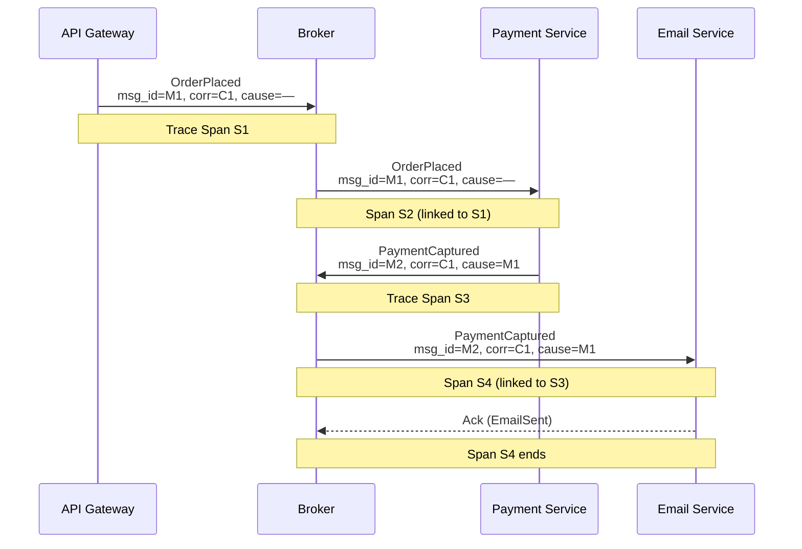
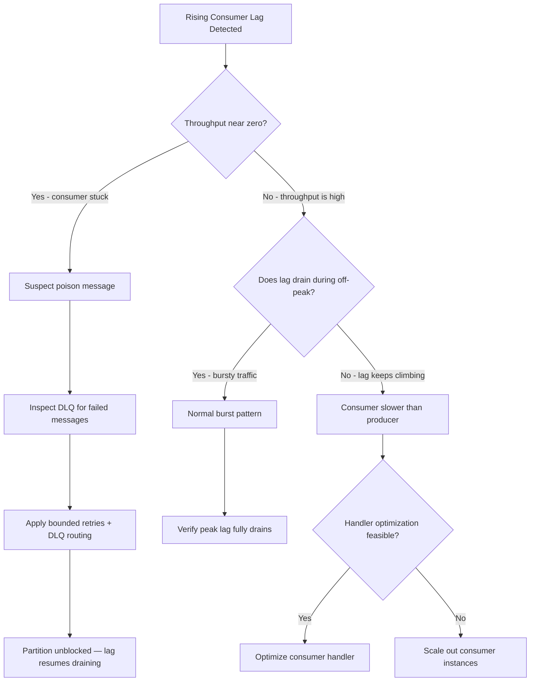
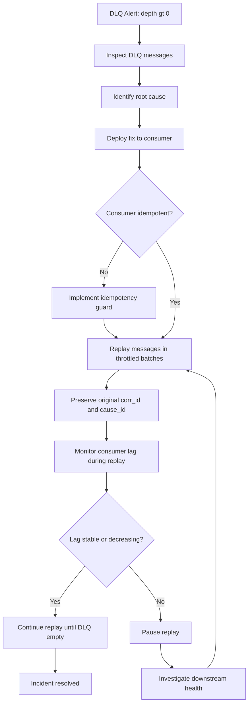

# Capítulo 9: Observabilidade, Depuração e Operações

## Declaração do Problema Inicial

O Capítulo 8 trouxe a disciplina de evoluir schemas de eventos sem quebrar consumidores, adicionando metadados de versionamento a cada evento. Agora um problema diferente aparece em produção. Um cliente reclama que um pedido foi cobrado duas vezes, mas o e-mail de confirmação nunca chegou. Em um sistema síncrono, você abriria um stack trace e seguiria a cadeia de chamadas do início ao fim. Em um sistema orientado a eventos, não há stack trace. O serviço de pagamento publicou um fato. Três consumidores reagiram de forma independente. Um deles publicou outro fato. O serviço de e-mail deveria estar ouvindo, mas nada aconteceu. Por onde você começa?

Esta é a dor operacional central da Arquitetura Orientada a Eventos (Event-Driven Architecture): **o fluxo de controle é implícito**. Nenhum serviço isolado conhece a história completa, porque o desacoplamento — a propriedade exata pela qual você pagou no Capítulo 1 — oculta a cadeia causal. Este capítulo fornece as ferramentas para tornar essa cadeia oculta visível novamente. Você aprenderá como rastrear uma requisição entre serviços desacoplados, como medir se os consumidores estão acompanhando o ritmo, como depurar fluxos que não possuem call stack, e como operar a maquinaria de falhas — filas de mensagens mortas e reprocessamento — sem piorar as coisas. Estes não são extras opcionais. Em um sistema distribuído, observabilidade é um requisito arquitetural de primeira classe, não algo que se adiciona depois de um incidente.

## Rastreamento Distribuído e IDs de Correlação/Causalidade

Vamos começar com a ideia mais importante deste capítulo. Para reconstruir uma história a partir de eventos desacoplados, você deve carregar identidade por todo o fluxo. Dois IDs fazem esse trabalho, e eles não são a mesma coisa.

Um **correlation ID** (ID de correlação) é um identificador único compartilhado por todo evento que pertence à mesma transação de negócio lógica. Ele é gerado uma única vez, na borda — quando o pedido é realizado — e copiado sem alteração para cada evento resultante, independentemente de quantos serviços o fluxo atravesse. Filtrar seus logs por um correlation ID fornece a história completa daquele pedido.

Um **causation ID** (ID de causalidade) responde a uma pergunta mais específica: *qual evento específico causou diretamente este?* O causation ID de cada evento é o message ID de seu pai imediato. Onde o correlation ID agrupa toda a árvore, o causation ID reconstrói as arestas exatas pai-filho dessa árvore. Com ambos, você pode reconstruir não apenas *o que* aconteceu, mas *em que ordem causal*.

A regra é simples e absoluta: **todo consumidor que produz um novo evento copia o correlation ID e define o causation ID como o ID do evento pai.** Esquecer isso em um único consumidor e a cadeia se rompe ali.

**Envelope de Mensagem com Campos de Rastreabilidade e Padrão de Construção de Evento-Filho**

```python
# Message envelope with traceability fields and child-event construction pattern
from __future__ import annotations

import uuid
from dataclasses import dataclass, field
from datetime import datetime, timezone


@dataclass(frozen=True)
class EventEnvelope:
    """Immutable wrapper carried by every event through the system."""
    message_id: str                     # unique ID for this specific event
    event_type: str                     # e.g. "order.placed", "payment.captured"
    event_version: str                  # schema version, e.g. "1.0"
    payload: dict                       # domain-specific body
    correlation_id: str                 # shared by all events in one business transaction
    causation_id: str                   # message_id of the direct parent event
    timestamp: str = field(
        default_factory=lambda: datetime.now(timezone.utc).isoformat()
    )

    @staticmethod
    def create_root(event_type: str, event_version: str, payload: dict) -> "EventEnvelope":
        """Create the first event in a flow; its own ID seeds the correlation chain."""
        new_id = str(uuid.uuid4())
        return EventEnvelope(
            message_id=new_id,
            event_type=event_type,
            event_version=event_version,
            payload=payload,
            correlation_id=new_id,   # root event is its own correlation anchor
            causation_id=new_id,     # no parent, so self-reference by convention
        )

    def spawn_child(self, event_type: str, event_version: str, payload: dict) -> "EventEnvelope":
        """Produce a child event: copy correlation_id, set causation_id to this event's ID."""
        return EventEnvelope(
            message_id=str(uuid.uuid4()),
            event_type=event_type,
            event_version=event_version,
            payload=payload,
            correlation_id=self.correlation_id,  # unchanged — same business transaction
            causation_id=self.message_id,        # direct parent is this event
        )


# --- Consumer handler example ---

def handle_order_placed(parent: EventEnvelope, publisher) -> None:
    """
    Payment consumer: receives OrderPlaced, performs capture, emits PaymentCaptured.
    Demonstrates the mandatory ID-propagation rule.
    """
    order_id = parent.payload["order_id"]
    amount = parent.payload["amount"]

    # ... domain logic: charge the card ...
    charge_result = {"charge_id": "ch_abc123", "status": "captured"}

    # Construct child event — correlation_id copied, causation_id = parent.message_id
    child_event = parent.spawn_child(
        event_type="payment.captured",
        event_version="1.0",
        payload={
            "order_id": order_id,
            "amount": amount,
            "charge_id": charge_result["charge_id"],
        },
    )

    publisher.publish(topic="payments", event=child_event)
```

Esses IDs são o que torna o **rastreamento distribuído** (distributed tracing) possível. Rastreamento distribuído é a prática de seguir uma requisição enquanto ela cruza fronteiras de serviços, representando a jornada como um **trace** (a requisição completa) composto por **spans** (unidades individuais de trabalho). O padrão aberto é o **OpenTelemetry**, que propaga um contexto de trace através de headers de mensagens. A sutileza importante para EDA: em uma chamada síncrona o span pai ainda está aberto quando o filho executa, mas com mensageria assíncrona o pai já retornou. Sua instrumentação deve, portanto, vincular spans por meio de **span links** em vez de aninhamento simples pai-filho, para que o salto pelo broker seja preservado no trace.

**Fluxo de IDs de Correlação e Causalidade com Spans de Rastreamento Distribuído**



*Este diagrama mostra como um único correlation ID percorre todos os serviços em um fluxo assíncrono, enquanto os causation IDs preservam a relação pai-filho em cada salto. Ele ilustra por que ambos os IDs são necessários: correlação agrupa toda a transação, e causalidade reconstrói a ordem causal exata, habilitando o rastreamento distribuído entre saltos pelo broker via span links.*

Dica de Especialista: gere o correlation ID o mais cedo possível — idealmente no API gateway ou no primeiro ponto de entrada síncrono — e rejeite qualquer evento interno que chegue sem um. Um evento sem correlation ID é um evento que você não poderá depurar mais tarde.

> 💡 **Nota do Especialista:** O texto recomenda corretamente vincular spans assíncronos por meio de span links do OpenTelemetry em vez de aninhamento pai-filho, mas na prática a maioria dos backends de observabilidade — Jaeger, Zipkin e até algumas configurações do agente Datadog — tem suporte parcial ou inconsistente para span links em suas versões estáveis atuais. Equipes que dependem de span links para fluxos fan-out frequentemente descobrem que seus traces são renderizados como fragmentos desconectados na interface, tornando a causalidade de fan-out invisível. O contorno utilizado em campo é propagar o header W3C `traceparent` (definido na W3C Trace Context Recommendation, https://www.w3.org/TR/trace-context/) por cada header de mensagem e tratar saltos assíncronos como relacionamentos FOLLOWS_FROM, depois fazer referência cruzada por correlation ID em consultas de log até que o suporte do backend amadureça. Escolha seu backend de tracing conhecendo essa limitação antes de projetar seu contrato de instrumentação.

<details>
<summary>💡 Nota do Especialista</summary>
Um erro comum na camada do API gateway é reutilizar o header HTTP de entrada `X-Request-ID` ou `X-B3-TraceId` diretamente como correlation ID. Esses headers são gerados por load balancers e proxies em formatos que variam entre fornecedores — strings hexadecimais, IDs curtos ou codificação proprietária — e consultas de agregação de logs frequentemente falham ao encontrar valores não-UUID misturados com correlation IDs em formato UUID de serviços internos. Melhor prática: sempre gere um UUID v4 novo na fronteira do domínio (o primeiro serviço que detém a transação de negócio) e use-o exclusivamente como correlation ID. Armazene o trace ID HTTP de origem como um campo separado `http_trace_id` para depuração em nível HTTP, mas nunca os confunda.
</details>

<details>
<summary>⚠️ Nota Crítica</summary>
O texto afirma "A regra é simples e absoluta: todo consumidor que produz um novo evento copia o correlation ID e define o causation ID como o ID do evento pai." Isso colapsa completamente em cenários fan-in, que são comuns em sistemas EDA reais. Quando um consumidor de saga ou agregação emite um evento de saída apenas após receber dois ou mais eventos upstream independentes (por exemplo, tanto um `PaymentCaptured` quanto um `InventoryReserved` devem chegar antes que `OrderFulfilled` seja publicado), não há um único evento pai para definir como causation ID. Escolher um arbitrariamente perde metade do grafo causal; o outro pai simplesmente desaparece do trace. A regra não é absoluta — ela é correta apenas para topologias fan-out (um pai, muitos filhos). Em padrões fan-in como sagas, carregue todos os IDs de eventos contribuintes em uma lista `causation_ids`, ou vincule múltiplos spans via span links do OpenTelemetry.
</details>

<details>
<summary>⚠️ Nota Crítica</summary>
A Dica de Especialista aconselha "rejeitar qualquer evento interno que chegue sem [um correlation ID]." Aplicada literalmente, esta regra quebra toda uma classe de eventos legítimos: aqueles produzidos por jobs agendados, pipelines disparados por cron, automação de infraestrutura, capturas CDC de banco de dados e scripts de migração de dados. Nenhum desses se origina de uma requisição de borda, portanto não têm um correlation ID natural para herdar. Rejeitá-los paralisa os consumidores que dependem deles sem produzir nenhum erro acionável para o operador. A regra qualificada: eventos sintéticos (agendados, gerados pelo sistema ou originados de CDC) devem gerar seu próprio correlation ID raiz no ponto de emissão, documentado como uma transação originada pelo sistema. A regra de rejeição se aplica a eventos que afirmam fazer parte de uma transação de negócio existente mas não carregam um ID — não a todos os eventos universalmente.
</details>

## Lag, Throughput e Métricas de Saúde do Consumidor

O rastreamento conta a história de uma requisição. As métricas contam a saúde de todo o sistema. Em sistemas orientados a eventos, a métrica mais valiosa é o **consumer lag** (atraso do consumidor).

**Consumer lag** é a diferença entre o offset mais recente que um produtor escreveu em uma partição e o offset mais recente que um grupo de consumidores processou. Em um broker baseado em log como o Kafka, é medido em mensagens. Em um broker baseado em fila, o sinal equivalente é a profundidade da fila ou a idade da mensagem não reconhecida mais antiga. Lag é o equivalente em sistemas distribuídos de uma pilha de tarefas crescente: uma pilha pequena e estável é normal, mas uma pilha que cresce sem limite significa que o consumidor nunca vai se recuperar.

Observe como o lag se comporta ao longo do tempo, porque a tendência importa mais do que o valor.

| Padrão de lag | O que significa | Ação |
|---|---|---|
| Baixo e estável | Consumidor acompanha os produtores | Saudável; nenhuma ação |
| Dente de serra (sobe, drena) | Tráfego em rajadas, consumidor se recupera | Normal; verificar se o pico drena completamente |
| Subindo constantemente | Consumidor é mais lento que o produtor | Escalar consumidores horizontalmente ou otimizar o handler |
| Estável mas alto, sem drenagem | Consumidor provavelmente travado ou em crash-loop | Investigar mensagem envenenada imediatamente |

Lag sozinho não é suficiente. Combine-o com **throughput** (eventos processados por segundo) e **latência de processamento** (tempo desde o recebimento do evento até a conclusão). Juntos eles distinguem duas falhas muito diferentes: lag crescente com alto throughput significa que você está simplesmente sobrecarregado por volume, enquanto lag crescente com *zero* throughput significa que o consumidor parou completamente — frequentemente travado em uma única mensagem que não consegue processar nem liberar.

**Árvore de Decisão para Diagnóstico de Consumer Lag**



*Esta árvore de decisão fornece aos engenheiros de plantão um caminho estruturado de um alerta de lag crescente a uma ação concreta, distinguindo os dois modos de falha fundamentalmente diferentes — um consumidor sobrecarregado versus um completamente travado — porque a solução para cada um é diferente e aplicar a correção errada desperdiça tempo crítico de incidente.*

Alerte sobre *tendência e idade* do lag, não sobre um número absoluto fixo. Um limite de "10.000 mensagens" não tem sentido sem conhecer o throughput; dez mil mensagens a cem mil por segundo é um décimo de segundo de atraso, mas o mesmo número a dez por segundo é um quarto de hora de indisponibilidade. Alertar sobre a idade da mensagem não processada mais antiga expressa diretamente o impacto no negócio.

> 💡 **Nota do Especialista:** O texto distingue corretamente "sobrecarregado" (alto throughput, lag crescente) de "travado" (zero throughput, lag crescente), mas monitora o throughput agregado do grupo de consumidores, o que oculta um modo de falha crítico em produção. Um grupo de consumidores processando mensagens de dez partições pode mostrar throughput agregado diferente de zero enquanto uma partição está completamente bloqueada por head-of-line por uma mensagem envenenada. A métrica agregada nunca atinge zero, então o alarme de "travado" nunca dispara, mas aquela partição acumula lag indefinidamente. A postura correta de monitoramento é rastrear lag e throughput no nível **por partição**, não apenas no nível do grupo de consumidores. A API Consumer Group do Kafka expõe offsets por partição; ferramentas como o Burrow da LinkedIn (https://github.com/linkedin/Burrow) e o Kafka Lag Exporter avaliam a saúde do lag por partição separadamente, que é como as equipes de produção identificam paralisações de partição única que os dashboards agregados ocultam.

<details>
<summary>💡 Nota do Especialista</summary>
O texto recomenda corretamente alertar sobre a idade da mensagem não processada mais antiga em vez do número absoluto de lag, mas não aborda como obter essa métrica na prática, onde equipes frequentemente ficam presas. A API nativa do Kafka para grupos de consumidores reporta offsets confirmados e offsets de fim de log, mas não expõe carimbos de tempo de mensagens diretamente em forma de lag por idade. O AWS MSK expõe uma métrica do CloudWatch chamada `EstimatedMaxTimeLag` que fornece o lag baseado em idade para clusters MSK diretamente. Para Kafka gerenciado pelo próprio time, o Burrow calcula a saúde do grupo de consumidores usando uma janela deslizante de velocidade de lag em vez de um único snapshot, o que naturalmente converte o lag em um sinal no domínio do tempo. Equipes que monitoram apenas `kafka_consumer_group_lag` (a métrica de contagem bruta do JMX ou do exportador Kafka) perderão completamente o sinal de idade a menos que adicionem explicitamente uma dessas ferramentas ou o calculem por conta própria.
</details>

## Depurando Fluxos de Eventos Assíncronos

Agora combine os dois. Quando um incidente acontece, você raramente tem uma exceção clara apontando para uma linha. Você tem um sintoma — um e-mail ausente, uma cobrança duplicada — e deve trabalhar retroativamente por um fluxo invisível. Siga um procedimento disciplinado em vez de adivinhar.

1. **Ancore no correlation ID.** Encontre o ID para a transação afetada a partir de qualquer evento conhecido, linha de log ou referência voltada ao usuário. Esta é a sua chave para todo o resto.
2. **Reconstrua a árvore.** Consulte sua agregação de logs por cada evento e entrada de log carregando aquele correlation ID, depois ordene-os por causation ID para reconstruir a cadeia causal exata. Isso mostra qual evento foi o último a disparar.
3. **Encontre a aresta quebrada.** A falha está quase sempre no primeiro *elo ausente* — o evento que deveria ter sido produzido ou consumido mas não foi. Se `PaymentCaptured` existe mas nenhum `EmailRequested` se seguiu, sua falha está no consumidor de e-mail ou em sua assinatura, não no pagamento.
4. **Inspecione o consumidor suspeito.** Verifique seu lag, sua taxa de erros e sua dead-letter queue para aquela mensagem. Uma mensagem na DLQ é a sua prova concreta.

**Consulta de Incidente na Agregação de Logs: Reconstruir a Cadeia Causal para um Correlation ID**

```python
# Log-aggregation incident query: reconstruct the causal chain for one correlation_id
from __future__ import annotations

from dataclasses import dataclass
from typing import Any

# --- Generic SQL query (ANSI-compatible; paste directly into Athena / BigQuery / ClickHouse) ---
INCIDENT_QUERY = """
SELECT
    timestamp,
    event_type,
    service,
    message_id,
    causation_id,
    correlation_id,
    COALESCE(status, 'unknown') AS status
FROM event_log
WHERE correlation_id = :correlation_id
ORDER BY timestamp ASC;
"""
# Note: replace :correlation_id with $1 / ? / %(correlation_id)s depending on your driver.


@dataclass
class EventRow:
    timestamp: str
    event_type: str
    service: str
    message_id: str
    causation_id: str
    correlation_id: str
    status: str


def fetch_causal_chain(
    connection,           # any PEP 249-compatible DB connection
    correlation_id: str,
) -> list[EventRow]:
    """
    Run the incident query and return rows ordered by timestamp.
    Each row's causation_id points to its parent message_id,
    giving you the exact causal tree without relying on wall-clock order.
    """
    cursor = connection.cursor()
    cursor.execute(
        INCIDENT_QUERY.replace(":correlation_id", "%s"),  # adapt placeholder per driver
        (correlation_id,),
    )
    rows = [EventRow(*row) for row in cursor.fetchall()]
    return rows


def print_causal_tree(rows: list[EventRow]) -> None:
    """
    Pretty-print the chain; highlight any gap where causation_id has no matching message_id.
    The first missing link is almost always where the incident occurred.
    """
    known_ids = {r.message_id for r in rows}
    print(f"{'TIMESTAMP':<30} {'EVENT TYPE':<30} {'SERVICE':<20} {'STATUS':<12} NOTE")
    print("-" * 100)
    for row in rows:
        gap_flag = ""
        # Flag the root event and any orphaned causation reference
        if row.causation_id not in known_ids and row.causation_id != row.message_id:
            gap_flag = "  <-- BROKEN LINK (parent not in trace)"
        print(
            f"{row.timestamp:<30} {row.event_type:<30} {row.service:<20} {row.status:<12}{gap_flag}"
        )
```

Dois avisos conquistados na prática. Primeiro, **carimbos de tempo do relógio de parede mentem** entre máquinas. A diferença de clock skew entre serviços significa que você não pode confiar na ordenação por timestamp isoladamente; confie na cadeia de causalidade, que codifica a causalidade real. Segundo, resista ao impulso de raciocinar sobre o fluxo a partir do seu diagrama de arquitetura. O diagrama mostra o fluxo que você *projetou*; o trace de correlação mostra o fluxo que *realmente aconteceu*. Quando eles discordam, o trace está certo, e a diferença entre eles geralmente é o bug.

<details>
<summary>💡 Nota do Especialista</summary>
O texto avisa que os carimbos de tempo do relógio de parede mentem devido ao clock skew, o que é correto. A magnitude prática vale ser declarada explicitamente: em ambientes de nuvem, mesmo com NTP configurado, clock skew entre hosts de 50–200 milissegundos é comum, e em implantações Kubernetes conteinerizadas onde a sincronização NTP do host está mal configurada ou o clock do kubelet não é propagado corretamente para os containers, o skew pode chegar a vários segundos. Para qualquer fluxo de eventos onde a ordenação importa, armazene o **número de sequência atribuído pelo broker ou offset de partição** junto ao evento em seu armazenamento de logs e use-o como chave de ordenação autoritativa. O broker é o único escritor em sua própria sequência de offsets e, portanto, a única âncora de ordenação verdadeiramente monotônica entre serviços. O causation ID fornece o formato da árvore causal; o offset do broker fornece a sequência física dentro de uma partição. Juntos, eliminam completamente a ambiguidade de timestamp.
</details>

## Filas de Mensagens Mortas e Reprocessamento Operacional

O Capítulo 4 introduziu a **dead-letter queue (DLQ)** — um destino separado onde um broker estaciona mensagens que não puderam ser processadas após esgotar suas tentativas. Lá a tratamos como uma rede de segurança. Aqui a tratamos como algo que você deve operar ativamente, porque uma DLQ sem atenção é uma das falhas silenciosas mais comuns em EDA em produção.

Uma DLQ não é uma lata de lixo. É uma *fila de trabalho pendente que requer julgamento humano ou automatizado.* Cada mensagem nela representa um fato de negócio que não produziu efeito: um pagamento não registrado, um pedido não enviado. Deixada sozinha, a DLQ torna-se um cemitério de eventos de negócio perdidos que ninguém descobre até que um cliente reclame. Portanto: **alerte quando a profundidade da DLQ for maior que zero.** Uma DLQ não vazia é sempre um incidente, mesmo que pequeno.

Reprocessamento — mover mensagens da DLQ de volta para o fluxo principal — é onde operadores causam interrupções secundárias se não forem cuidadosos. Siga estas regras.

- **Corrija a causa antes de reprocessar.** Reenviar uma mensagem para o mesmo consumidor quebrado apenas a envia de volta para a DLQ. Implante a correção primeiro.
- **Reprocessamento exige idempotência.** É por isso que os consumidores idempotentes do Capítulo 4 são importantes operacionalmente. Uma mensagem pode ter parcialmente tido sucesso antes de falhar; repeti-la não deve gerar cobrança dupla. Sem idempotência, o reprocessamento é inseguro.
- **Preserve os metadados originais.** Reprocesse com os correlation e causation IDs *originais*, não com novos, ou você desconecta a mensagem de seu histórico e perde a rastreabilidade.
- **Reprocesse em lotes controlados.** Drenar dez mil mensagens da DLQ em velocidade total pode sobrecarregar um downstream que está apenas se recuperando. Limite a velocidade do replay.

**Fluxo de Trabalho Seguro de Reprocessamento de DLQ**



*Este fluxograma captura o procedimento de reprocessamento seguro que impede operadores de desencadear interrupções secundárias ao drenar uma DLQ. Ele enfatiza a ordem obrigatória de operações — corrigir primeiro, verificar idempotência, depois fazer replay em lotes controlados — porque pular qualquer etapa pode transformar uma recuperação em um segundo incidente.*

Dica de Especialista: anexe um `dead_letter_reason` e uma contagem de tentativas a cada mensagem da DLQ. Quando você abre a DLQ durante um incidente, você quer o *porquê* imediatamente, não um payload bruto que você precisa fazer engenharia reversa sob pressão.

> 💡 **Nota do Especialista:** O texto afirma "alerte quando a profundidade da DLQ for maior que zero — uma DLQ não vazia é sempre um incidente, mesmo que pequeno." Esta regra é correta e importante para equipes no início de sua jornada com EDA, mas em escala produz fadiga de alertas que leva operadores a começar a silenciar alertas de DLQ — o efeito oposto ao pretendido. O cenário de alto volume: durante implantações rolling onde novas versões de schema estão sendo introduzidas, consumidores executando código antigo podem falhar transitoriamente ao deserializar eventos de nova versão e enviá-los para a DLQ; esta é uma condição esperada e temporária, não um incidente que impacta o negócio. O refinamento em produção madura é alertar sobre a **taxa de crescimento da DLQ** (mensagens por minuto) e sobre a **idade das mensagens na DLQ excedendo sua janela de SLA de negócio** (por exemplo, mais antigas que 15 minutos para um fluxo de pagamento), em vez de profundidade absoluta acima de zero. O princípio — toda mensagem na DLQ representa um fato de negócio que não produziu efeito — é correto; a expressão de alerta deve codificar a urgência do negócio, não apenas a existência.

> ⚠️ **Nota Crítica:** "Alerte quando a profundidade da DLQ for maior que zero. Uma DLQ não vazia é sempre um incidente, mesmo que pequeno." Em sistemas de produção de alto volume esta prescrição é operacionalmente prejudicial. Em escala, falhas transitórias isoladas de timeouts de terceiros, breve indisponibilidade de downstream, ou falhas de infraestrutura rotineiramente depositarão uma ou duas mensagens na DLQ antes da auto-recuperação. Alertar em qualquer mensagem única cria fadiga de alertas crônica, o que leva engenheiros de plantão a começar a suprimir alertas de DLQ — exatamente o oposto do comportamento desejado. O limite absoluto também não considera entradas da DLQ já triadas e reconhecidas aguardando uma janela de replay planejada. Substitua a regra absoluta por uma política graduada: alerte imediatamente sobre a *taxa* da DLQ (novas mensagens por minuto acima de uma linha de base) e sobre mensagens na DLQ que estão não reconhecidas além de um SLO baseado em tempo (por exemplo, 30 minutos sem triagem). Reserve um alerta de "profundidade > 0" para sistemas onde a DLQ normalmente deveria estar vazia por contrato, e marque isso como uma escolha de configuração, não uma regra universal.

> 💡 **Nota do Especialista:** O texto instrui operadores a "preservar os metadados originais" durante o reprocessamento, o que inclui correlation e causation IDs. Uma dimensão frequentemente esquecida dos metadados originais é a **chave de roteamento da mensagem** — no Kafka é a chave de partição, no RabbitMQ é a routing key, nas filas FIFO do SQS é o message group ID. Quando operadores drenam uma DLQ usando uma ferramenta de replay genérica ou um simples script de re-publicação, é fácil republicar sem a chave de partição original, fazendo com que a mensagem reprocessada caia em uma partição diferente da original. Isso quebra as garantias de ordenação para todos os consumidores downstream que dependem de ordenação no nível de partição, e pode causar erros de lógica de negócio (por exemplo, um consumidor de máquina de estados que processa eventos para um determinado ID de pedido sempre na mesma partição agora vê eventos fora de sequência). Qualquer ferramenta de reprocessamento deve extrair explicitamente e reaplicar a chave de roteamento original do envelope de mensagem da DLQ.

<details>
<summary>⚠️ Nota Crítica</summary>
A regra "Preserve os metadados originais — reprocesse com os correlation e causation IDs originais, não com novos" é sólida na camada de aplicação, mas falha silenciosamente ao usar mecanismos nativos de redirecionamento de DLQ do broker. O redirecionamento de dead-letter do AWS SQS, a resubmissão de dead-letter do Azure Service Bus, e recursos similares do broker reatribuem um novo MessageId em nível de broker à mensagem reenfileirada, independentemente do payload da aplicação. Qualquer consumidor ou instrumentação que lê causation/correlation do identificador de mensagem nativo do broker — em vez de dos headers definidos pela aplicação — receberá silenciosamente um ID novo e sem raiz e produzirá um trace quebrado, mesmo que o envelope da aplicação pareça correto. Sempre incorpore correlation e causation IDs no corpo da mensagem ou em headers definidos pela aplicação (não em campos nativos do broker), e verifique se todos os consumidores leem desses campos de aplicação em vez de dos metadados do broker.
</details>

## Mensagens Envenenadas e Estratégias de Contenção

Algumas mensagens nunca podem ser processadas com sucesso, independentemente de quantas vezes você tente novamente. Esta é a **mensagem envenenada** (poison message) — um evento cujo conteúdo desencadeia uma falha determinística no consumidor todas as vezes. A causa clássica é um payload malformado ou inesperado: um campo nulo que o handler desreferencia, um schema que o consumidor não consegue deserializar, um valor que viola um invariante.

O perigo é específico e severo. Em uma partição *ordenada*, uma mensagem envenenada causa **bloqueio head-of-line**: porque o consumidor deve processar mensagens em ordem e não consegue passar por esta, cada mensagem atrás dela também está presa. Um único evento ruim pode congelar uma partição inteira. Esta é exatamente a assinatura de lag "estável mas alto, sem drenagem" mencionada anteriormente — um consumidor preso em crash-loop em uma única mensagem enquanto milhares se acumulam atrás dela.

A contenção repousa em três mecanismos trabalhando juntos.

1. **Tentativas limitadas com backoff.** Nunca tente processar uma mensagem envenenada infinitamente. Após um pequeno número de tentativas com atraso crescente, desista dela e roteie-a para a DLQ. Retry infinito transforma uma mensagem ruim em uma interrupção permanente.
2. **Rotear para a DLQ para desbloquear a partição.** Mover a mensagem envenenada para o lado permite que o consumidor avance e processe as mensagens saudáveis enfileiradas atrás dela. A DLQ é o que converte uma paralisação de todo o sistema em uma única falha isolada.
3. **Validar na borda.** A mensagem envenenada mais barata é aquela que você rejeita antes de entrar no fluxo. A validação de schema na ingestão — o registry do Capítulo 8 — captura a maioria dos payloads malformados antes que possam envenenar qualquer coisa downstream.

**Loop de Consumidor com Tentativas Limitadas e Roteamento para DLQ para Prevenir Bloqueio Head-of-Line**

```python
# Bounded-retry consumer loop with DLQ routing to prevent head-of-line blocking
from __future__ import annotations

import logging
import time
from dataclasses import dataclass
from typing import Callable

logger = logging.getLogger(__name__)

MAX_ATTEMPTS = 3          # after this many failures the message is a confirmed poison message
BASE_BACKOFF_SECONDS = 1  # initial retry delay; doubles on each attempt


@dataclass
class MessageContext:
    """Thin wrapper around a broker message carrying the envelope and ack handle."""
    envelope: "EventEnvelope"   # from the envelope example above
    raw_payload: bytes
    ack: Callable[[], None]     # callable that commits the offset / deletes from queue
    nack: Callable[[], None]    # callable that returns the message for immediate retry


def process_with_dlq_fallback(
    ctx: MessageContext,
    handler: Callable[["EventEnvelope"], None],
    dlq_publisher,
    dlq_topic: str,
) -> None:
    """
    Attempt to process a message up to MAX_ATTEMPTS times with exponential backoff.
    On final failure, publish to the DLQ with diagnostic metadata and acknowledge
    the original so the partition advances past the poison message.
    """
    last_exception: Exception | None = None

    for attempt in range(1, MAX_ATTEMPTS + 1):
        try:
            handler(ctx.envelope)
            ctx.ack()   # success — commit the offset; we are done
            return

        except Exception as exc:  # noqa: BLE001  (intentional broad catch for poison detection)
            last_exception = exc
            logger.warning(
                "Handler failed (attempt %d/%d) for message_id=%s: %s",
                attempt,
                MAX_ATTEMPTS,
                ctx.envelope.message_id,
                exc,
            )
            if attempt < MAX_ATTEMPTS:
                backoff = BASE_BACKOFF_SECONDS * (2 ** (attempt - 1))  # 1s, 2s, 4s …
                time.sleep(backoff)

    # All attempts exhausted — this is a poison message.
    # Publish to DLQ *before* acking so the message is never silently dropped.
    dead_letter_payload = {
        "original_message_id": ctx.envelope.message_id,
        "original_event_type": ctx.envelope.event_type,
        "original_payload": ctx.envelope.payload,
        "correlation_id": ctx.envelope.correlation_id,   # preserve for traceability
        "causation_id": ctx.envelope.causation_id,       # preserve causal link
        "dead_letter_reason": str(last_exception),
        "retry_count": MAX_ATTEMPTS,
    }

    try:
        dlq_publisher.publish(topic=dlq_topic, payload=dead_letter_payload)
        logger.error(
            "Poison message routed to DLQ after %d attempts: message_id=%s reason=%s",
            MAX_ATTEMPTS,
            ctx.envelope.message_id,
            last_exception,
        )
    except Exception as dlq_exc:  # noqa: BLE001
        # DLQ publish failed — log loudly but still ack to avoid infinite head-of-line block.
        # An alert on DLQ publish errors must exist so this situation is never silent.
        logger.critical(
            "CRITICAL: DLQ publish failed for message_id=%s. Acknowledging anyway to unblock "
            "partition. Manual recovery required. dlq_error=%s original_error=%s",
            ctx.envelope.message_id,
            dlq_exc,
            last_exception,
        )

    # Acknowledge the original message so the partition advances past the poison message.
    # This is the key step that converts a system-wide stall into an isolated DLQ entry.
    ctx.ack()
```

A lição arquitetural é falhar *rápido e lateralmente*, nunca *devagar e para frente*. Uma mensagem envenenada deve ser detectada rapidamente, removida do caminho crítico imediatamente, e preservada para revisão humana posterior — não reprocessada eternamente de uma forma que bloqueie tráfego saudável.

<details>
<summary>💡 Nota do Especialista</summary>
O texto recomenda "validação de schema na ingestão" via o registry como a principal defesa de borda. Em produção, a validação de schema na fronteira do broker (por exemplo, Confluent Schema Registry com compatibilidade `FULL_TRANSITIVE` ou AWS Glue Schema Registry no modo estrito) captura violações de contrato estrutural, mas não captura **mensagens envenenadas semânticas** — eventos que são estruturalmente válidos contra o schema, mas contêm valores que desencadeiam falhas determinísticas em consumidores específicos: um ID de produto que existe no schema como uma string não nula, mas se refere a um registro deletado; um valor numérico zero que causa uma divisão por zero em um cálculo de comissão; ou um timestamp em formato ISO-8601 tecnicamente válido que está no futuro distante e quebra uma consulta de janelamento de datas. Estes passam na validação de schema e vão direto para a DLQ. A camada defensiva para mensagens envenenadas semânticas é a **validação de entrada no nível do consumidor no início do handler** — cláusulas de guarda que verificam invariantes de domínio antes de qualquer lógica de negócio ser executada — combinada com um código de erro claro no campo `dead_letter_reason` que distingue falhas semânticas de falhas de infraestrutura, permitindo que operadores façam triagem do conteúdo da DLQ de relance.
</details>

<details>
<summary>⚠️ Nota Crítica</summary>
O texto afirma "Schema validation at ingestion — the registry from Chapter 8 — catches most malformed payloads before they can poison anything downstream." Isso superestima significativamente a cobertura da validação de schema. Os registries de schema validam conformidade estrutural (tipos de campo, campos obrigatórios, valores permitidos de um enum). Eles não capturam as mensagens envenenadas mais comuns do mundo real: um inteiro sintaticamente válido que causa divisão por zero em uma regra de negócio; um valor nulo em um campo opcional que o consumidor desreferencia sem uma guarda; uma data no passado que viola um invariante que se assume nunca ocorrer; ou um ID de cliente válido que não existe mais no banco de dados e causa uma falha de busca por chave estrangeira. Estas falhas semânticas são a fonte dominante de mensagens envenenadas em sistemas EDA maduros, e a validação de schema não faz nada para preveni-las. Reformule: "A validação de schema elimina malformação *estrutural* — o tipo errado, campos obrigatórios ausentes — mas não falhas semânticas, que são a fonte mais comum de mensagens envenenadas no mundo real." A validação semântica (guardas de regra de negócio, verificações de nulo, verificações de existência antes de desreferenciar) deve ser implementada dentro do handler do consumidor, e try/catch com tentativas limitadas permanece a última linha de defesa para falhas que a validação de schema não pode prever.
</details>

## Principais Conclusões

- **Correlation IDs agrupam uma transação de negócio inteira; causation IDs reconstroem a cadeia causal exata pai-filho.** Todo consumidor produtor deve copiar o correlation ID e definir o causation ID como o message ID de seu pai, ou o trace se rompe.
- **Consumer lag é seu principal sinal de saúde.** Alerte sobre sua tendência e sobre a idade da mensagem não processada mais antiga, e combine-o com throughput para distinguir "sobrecarregado" de "travado".
- **Depure retroativamente a partir do correlation ID, não do diagrama de arquitetura.** Confie na cadeia de causalidade em vez dos carimbos de tempo do relógio de parede, e procure o primeiro elo ausente.
- **Uma DLQ não vazia é sempre um incidente.** Corrija a causa raiz primeiro, dependa de idempotência, preserve os metadados originais e reprocesse em lotes com limitação de velocidade.
- **Mensagens envenenadas causam bloqueio head-of-line.** Contenha-as com tentativas limitadas, roteamento para DLQ para desbloquear a partição, e validação de borda para mantê-las completamente fora do fluxo.

## O Que Vem a Seguir

Com observabilidade e operações sob controle, o Capítulo 10 consolida o livro inteiro por meio de estudos de caso reais de fintech e e-commerce, um mapa de decisão de trade-offs, e um catálogo dos erros mais comuns na adoção de arquiteturas orientadas a eventos.

<!-- ASSEMBLY COMPLETE
  Chapter: Observability, Debugging, and Operations
  Code blocks resolved: 3 / 3
  Diagrams resolved: 3 / 3
  Expert callouts (inline): 4
  Expert callouts (collapsed): 4
  Critical callouts (inline): 2
  Critical callouts (collapsed): 3
  Unresolved markers: 0
-->
