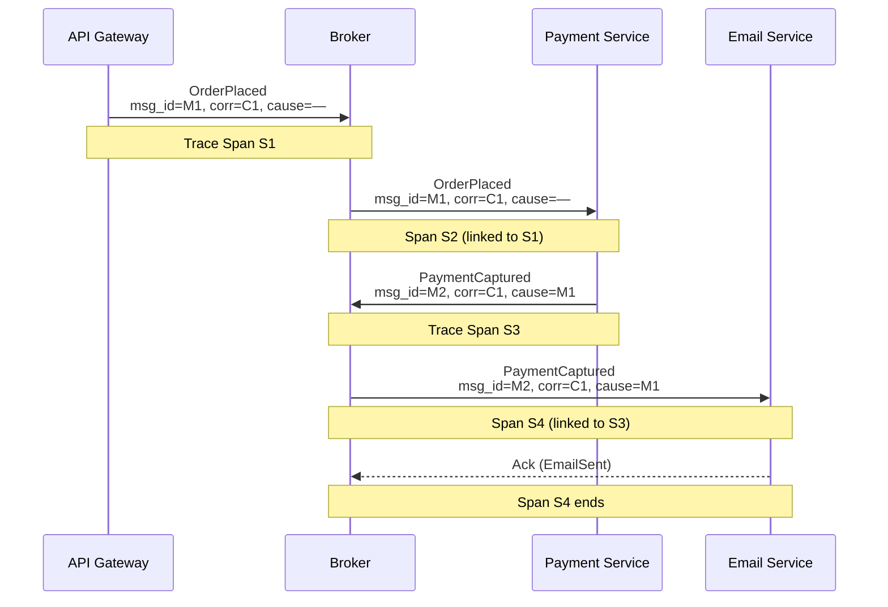
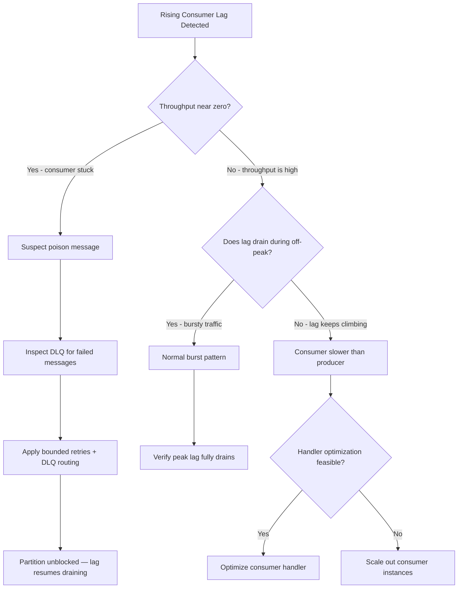
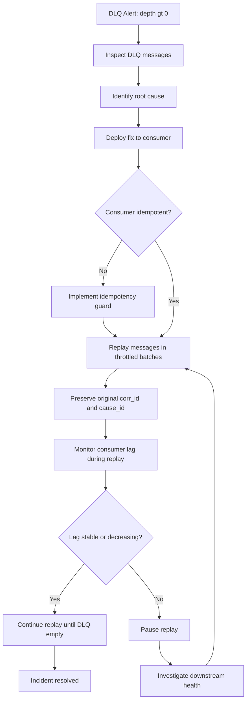

## Diagrams — Observability, Debugging, and Operations

### A sequence diagram showing an OrderPlaced event flowing from an API gateway through a broker to a Payment consumer, which publishes PaymentCaptured, which flows to an Email consumer. Each hop carries the same correlation_id, and each new event's causation_id points to the previous event. Trace spans link across each broker hop.

This diagram shows how a single correlation ID threads through every service in an asynchronous flow while causation IDs preserve the parent-child relationship at each hop. It illustrates why both IDs are necessary: correlation groups the whole transaction, and causation rebuilds the exact causal order, enabling distributed tracing across broker hops via span links.

---

### A flowchart decision tree for diagnosing rising consumer lag. Branches on throughput near zero (stuck consumer, check poison message) versus throughput high (scale out or optimize), and on whether lag drains during off-peak.

This decision tree gives on-call engineers a structured path from a rising-lag alert to a concrete action, distinguishing the two fundamentally different failure modes — a consumer that is overwhelmed versus one that is completely stuck — because the remediation for each is different and applying the wrong fix wastes critical incident time.

---

### A flowchart of the reprocessing workflow — DLQ alert fires, engineer inspects message and root cause, deploys fix, verifies consumer idempotency, then replays messages in throttled batches back to the source topic, monitoring lag during replay.

This flowchart captures the safe reprocessing procedure that prevents operators from triggering secondary outages when draining a DLQ. It emphasizes the mandatory order of operations — fix first, verify idempotency, then replay in controlled batches — because skipping any step can turn a recovery into a second incident.

---
