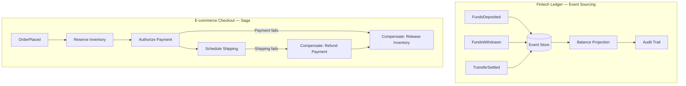
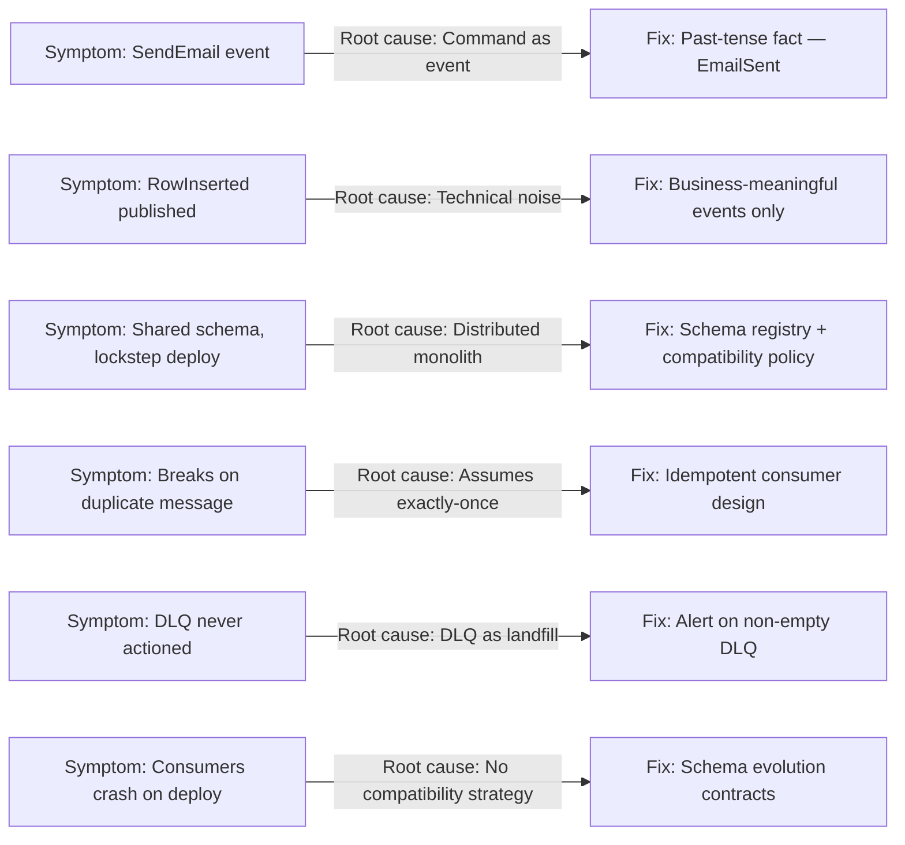
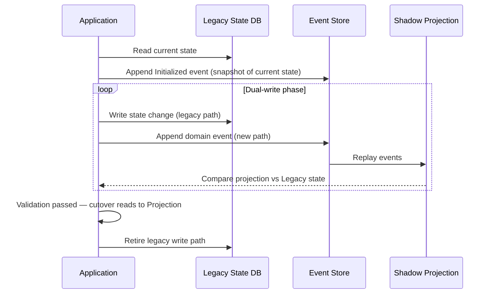
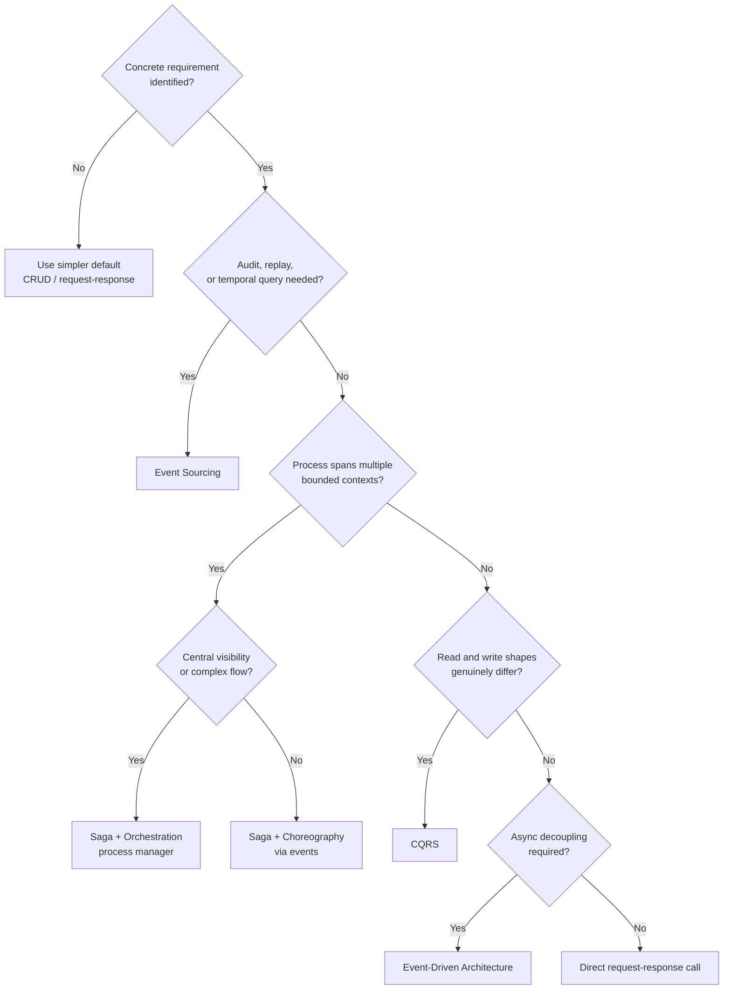

# Chapter 10: Real-World Cases, Trade-offs, and Pitfalls

## Opening Problem Statement

Nine chapters have handed you a toolbox. You now know what an event is, how to model it as a domain fact, how to move it through brokers and logs, how to guarantee delivery, how to split reads from writes with CQRS, how to store history with Event Sourcing, how to coordinate long-running work with sagas, how to evolve schemas, and how to operate the whole thing in production. But a toolbox is dangerous in the wrong hands. The single most expensive mistake in event-driven architecture is not a bug — it is adopting a pattern that solves a problem you do not have. This closing chapter changes the question. Instead of asking "how do I use this pattern?", it asks "should I use it at all, and what happens to the organization when I do?" We will walk through two real-world shapes of system — a fintech ledger and an e-commerce checkout — and watch decisions produce consequences. Then we will catalog the anti-patterns that recur across teams, examine the seductive trap of adopting Event Sourcing, CQRS, and sagas all at once, map the migration paths into and out of Event Sourcing, and finish with the decision framework that should govern every choice you make. This is where the book earns its subtitle.

## Case Studies in Fintech and E-commerce

Patterns are abstract. Consequences are concrete. Two industries expose the trade-offs of event-driven architecture with unusual clarity, because their failure modes are visible and expensive.

Consider a **fintech ledger** — the core system that records money movements for a digital bank. Money has a non-negotiable property: every balance must be explainable. A regulator or a customer can ask "why is this number what it is?", and "the database says so" is not an acceptable answer. This is the exact problem Event Sourcing was built for. The ledger stores every `FundsDeposited`, `FundsWithdrawn`, and `TransferSettled` event as an immutable fact. The current balance is a projection — a **read model** rebuilt by replaying the event stream. When an auditor arrives, the history *is* the audit trail. There is nothing to reconstruct because nothing was ever destroyed. Here, Event Sourcing is not over-engineering; it is the cheapest way to meet a hard requirement.

The e-commerce **checkout** tells a different story. A customer places an order, and behind that single click sit inventory reservation, payment authorization, fraud scoring, and shipping. No single database owns all of it. These services live in separate **bounded contexts**, and a distributed ACID transaction across them is impractical. This is saga territory. The order becomes a **saga** coordinated by a **process manager**, with **compensating transactions** ready to release inventory or refund a charge if a later step fails.

The two cases share DNA but diverge on emphasis, as the table below shows.

| Concern | Fintech Ledger | E-commerce Checkout |
|---|---|---|
| Primary driver | Auditability and correctness | Availability and coordination |
| Dominant pattern | Event Sourcing | Saga + process manager |
| Consistency stance | History is the source of truth | Eventual consistency, compensations |
| Cost of a lost event | Catastrophic (money) | Recoverable (retry or compensate) |
| Read model | Rebuilt balance projection | Order-status projection |

*These two subgraphs contrast the dominant pattern for each domain: the fintech ledger uses Event Sourcing to build an auditable, immutable history that drives a balance projection, while the e-commerce checkout uses a saga with compensating transactions to coordinate across bounded contexts when any step fails.*

Notice what neither case did. The fintech team did not bolt sagas onto every internal balance update. The e-commerce team did not event-source the shopping cart, which is disposable by nature. Each team applied one pattern where it paid for itself and resisted the urge to apply it everywhere. That restraint is the real lesson, and it sets up the failures we examine next.

> 💡 **Expert Note:** The fintech ledger example correctly motivates Event Sourcing for auditability, but omits a critical production constraint: as an aggregate accumulates tens of thousands of events — common for active accounts after 2–3 years — replaying the full stream on every read becomes prohibitive. Production Event Sourcing systems at scale universally require a **snapshot strategy**: periodically persisting the projected state as a checkpoint so replay starts from the nearest snapshot rather than event zero. Without snapshotting, read latency for high-frequency aggregates grows linearly with account age and can cross SLA thresholds within months of go-live. Teams that discover this late are forced into an emergency snapshot migration under production load.

💡 Expert Note

The e-commerce checkout saga section is accurate, but omits a production failure mode worth naming: the **saga rollback storm**. When a late-stage compensation fires at high volume — for example, a shipping service rejects an order after payment has already been captured — the compensating `RefundPayment` and `ReleaseInventory` events arrive at upstream services as a burst. At checkout peaks (Black Friday, flash sales), the compensation burst can overwhelm payment provider rate limits or inventory service capacity, causing a second failure wave that cascades back through the saga. Teams operating at scale add backpressure and exponential-backoff retry budgets specifically for the compensation path, treating it as a separate traffic class from the happy path.

⚠️ Critical Note

The prose claims Event Sourcing is "the cheapest way to meet" the auditability requirement of a fintech ledger, with no comparison against alternatives. Append-only audit log tables (a separate audit_log table that is INSERT-only and NEVER updated), Change Data Capture (CDC) with Debezium writing to an immutable sink, and purpose-built audit services (AWS CloudTrail-style) all satisfy the same auditability requirement at a fraction of the operational complexity. For many teams, an append-only audit table is the cheapest and most maintainable solution. Presenting Event Sourcing as the default-correct answer to "you need auditability" is the very over-adoption trap the chapter warns against.

⚠️ Critical Note

The e-commerce checkout section presents distributed ACID as "impractical" as a universal claim, without acknowledging that modern globally-distributed databases (Google Spanner, CockroachDB, YugabyteDB, AWS Aurora Global Database with serializable isolation) do provide distributed ACID semantics. For a target audience of senior architects, dismissing distributed ACID categorically may produce over-reliance on sagas even in cases where a strongly-consistent database satisfying all services' requirements is the simpler and safer choice.

⚠️ Critical Note

The shopping cart is described as "disposable by nature," implicitly endorsing the decision not to event-source it. While discouraging event-sourcing the cart is correct advice, characterizing carts as disposable is an oversimplification that does not match real-world e-commerce requirements. Abandoned cart recovery, GDPR right-to-erasure auditing over cart contents, tax-jurisdiction snapshotting, and wishlist/save-for-later features all require durable, queryable cart state. The framing may lead readers to under-invest in cart persistence design under the assumption it is inherently throwaway.

## Anti-Pattern Catalog and Recurring Pitfalls

Failures in event-driven systems are remarkably repetitive. The same mistakes appear across companies, teams, and technologies. Cataloging them lets you recognize a smell before it becomes an outage. Here are the recurring pitfalls, each tied to the chapters that armed you against them.

- **The event as disguised command.** A message named `SendEmail` or `UpdateInventory` is not an event — it is a command wearing a costume. Real events describe facts of the past (`OrderPlaced`), not instructions for the future. Confusing the two rebuilds the temporal coupling EDA was meant to remove (Chapters 1 and 2).
- **Technical noise as domain events.** Publishing `RowInserted` or `CacheInvalidated` floods the system with facts no business capability cares about. Events should express meaningful business change, not database mechanics (Chapter 2).
- **The distributed monolith.** Services communicate through events but remain so tightly coupled that none can deploy independently. A shared, synchronously-versioned schema across every service recreates the monolith with added network latency (Chapters 2 and 8).
- **Assuming exactly-once delivery.** Building consumers that break when a message arrives twice. Under **at-least-once** delivery — the realistic default — duplicates are guaranteed. Non-idempotent consumers are a time bomb (Chapter 4).
- **The ignored dead-letter queue.** Treating the **DLQ** as a landfill instead of a work queue. A non-empty DLQ is an incident, not a metric to glance at quarterly (Chapter 9).
- **Schema evolution by hope.** Shipping a breaking change to an event contract and discovering downstream consumers only when they crash. No compatibility policy means every producer change is a gamble (Chapter 8).

*This diagnostic map surfaces the six most common event-driven anti-patterns, their structural root cause, and the corrective pattern — allowing a team inheriting an unfamiliar system to identify architectural debt before reading business logic.*

**Pro Tip:** When you inherit an unfamiliar event-driven system, audit it against this list before reading a line of business logic. The anti-patterns present a system's health faster than any dashboard. A team that named its events as commands and ignores its DLQ has architectural debt no amount of scaling will fix.

> 💡 **Expert Note:** The "assuming exactly-once delivery" anti-pattern is correctly identified, but there is a specific, recurring misconception that the prose does not address: engineers who enable Kafka's **exactly-once semantics (EOS)** via transactional producers and idempotent consumers believe they have eliminated the idempotency requirement on the consumer side. This is wrong. Kafka EOS guarantees that each message is written to and read from the Kafka log exactly once; it makes no guarantee about the side effects of consumer processing — database writes, downstream HTTP calls, file mutations, or external API invocations are completely outside the EOS scope. A consumer that calls an external payment API or writes to a relational DB is still fully responsible for idempotency. Teams have shipped "EOS-enabled" consumers that double-charge customers because they conflated broker-level deduplication with end-to-end exactly-once processing.

💡 Expert Note

The distributed monolith anti-pattern could be made more specific with a concrete organizational trigger teams miss: using a **shared schema registry with synchronized releases**. Teams adopt Confluent Schema Registry or AWS Glue Schema Registry correctly, but then manage all schema versions in a single monorepo with a unified release pipeline — requiring schema owners and all consumer teams to coordinate each release cycle. This recreates the centralized release train of the monolith at the schema layer, even when the services themselves are independently deployable. The tell is a sprint board with "schema freeze" stories blocking unrelated feature work.

⚠️ Critical Note

The anti-pattern for "Assuming exactly-once delivery" states that "under at-least-once delivery — the realistic default — duplicates are guaranteed." The word "guaranteed" is technically wrong: at-least-once delivery means a message will be delivered at least once, which makes duplicates possible and likely under failure conditions, but not guaranteed in every execution. Saying they are guaranteed implies every single message will arrive more than once, which is false and could lead engineers to add unnecessary deduplication overhead on low-volume, low-failure paths while the real lesson — that idempotency must be designed in regardless of observed duplicate rate — is sound.

## Premature Adoption of ES, CQRS, and Saga Combined

There is a specific failure so common and so damaging that it deserves its own section: adopting **Event Sourcing**, **CQRS**, and **sagas** together, from day one, on a greenfield project. Teams do this because the patterns are presented together in conference talks and appear to form a coherent whole. They do form a coherent whole — for the small set of systems that genuinely need all three.

The seduction is understandable. Event Sourcing gives you history. CQRS gives you clean read models. Sagas give you distributed coordination. Combined, they look like the "correct" modern architecture. But each pattern carries a permanent tax, and the taxes compound.

Event Sourcing means you can never simply `UPDATE` a row; every state change requires an event, a projection, and a versioning strategy for events that will outlive the code that wrote them. CQRS means every read model is eventually consistent, so your UI must handle the gap between a write and its visible effect. Sagas mean every multi-step process needs designed compensating transactions and a process manager to track state. Adopt all three before you have proven you need any one of them, and you have built a system where a junior engineer cannot add a field without touching an event schema, a projection, an upcaster, and possibly a saga step.

The table below contrasts the promise with the operational reality.

| Pattern | What it promises | What it costs, permanently |
|---|---|---|
| Event Sourcing | Full history, perfect audit | Versioning, upcasting, no in-place edits |
| CQRS | Optimized reads, scalable queries | Eventual consistency, projection maintenance |
| Saga | Coordination without distributed ACID | Compensation logic, state tracking, partial-failure reasoning |

The correct sequence is subtractive, not additive. Start with the simplest thing that works — often a well-structured service with a normal database and a few integration events. Introduce CQRS only when read and write shapes genuinely diverge. Introduce Event Sourcing only when history is a hard requirement, as in the fintech ledger. Introduce sagas only when a business process truly spans bounded contexts. Each pattern must earn its place by solving a problem you can name. If you cannot name the problem, you do not have it yet.

💡 Expert Note

The prose correctly describes the technical taxes of combining all three patterns, but the organizational tax is equally significant and often hits first. In a system with Event Sourcing, CQRS, and sagas all active, a single P1 incident requires an engineer to simultaneously reason across four distinct layers: the event stream (what happened?), the projection state (what did it compute?), the saga state (what step is the process in?), and the compensation log (what was rolled back?). Mean time to diagnose spikes. Teams report that onboarding a new engineer to full-stack debugging in this environment takes 6–9 months rather than the 4–6 weeks typical for a service-based system. The complexity is not just a code problem — it is a hiring constraint and a key-person risk.

## Migrating to and from Event Sourcing

Event Sourcing is the highest-commitment decision in this book, so its two migration directions deserve explicit maps. Most teams focus on how to get in. The mature teams also know how to get out.

**Migrating to Event Sourcing** from a state-based system is a controlled procedure, not a rewrite:

1. **Identify the aggregate** whose history matters — the account, the order, the policy. Do not event-source the whole system; event-source the part with an audit or temporal requirement.
2. **Model the events** that would have produced the current state. This is domain work, not database work; it forces you to name the facts your CRUD tables silently discarded.
3. **Seed the event store** with a `Migrated` or `Initialized` event capturing the current state as a starting fact. Old history before the cutover is lost, and that is acceptable — you begin recording facts from now on.
4. **Run dual-write or shadow projections** to validate that replaying events reproduces the state the legacy system holds, before you cut over reads.
5. **Switch reads to the projection**, then retire the legacy write path once confidence is established.

*This sequence traces the five-stage controlled migration from a state-based system to Event Sourcing — seeding an initial fact, running shadow projections in parallel with the legacy system to validate correctness, and only then switching reads to the new projection and retiring the legacy write path.*

**Migrating away from Event Sourcing** is rarer but not a defeat. Sometimes a team discovers that a component was event-sourced out of enthusiasm, not need, and the versioning tax outweighs any benefit. The exit is straightforward precisely because the current state is always derivable: build the final projection, persist it as ordinary state in a conventional table, point reads and writes at that table, and archive the event store as a cold historical record. You keep the history for compliance without paying the runtime tax of rebuilding from it. The ability to leave cleanly is itself an argument for adopting deliberately — a reversible decision is a safer decision.

> 💡 **Expert Note:** Step 4 in the migration procedure — "run dual-write or shadow projections" — glosses over a critical atomicity problem. Dual-writing to a legacy state database and an event store in the same application transaction is not atomic unless both are in the same ACID boundary, which they typically are not. A crash between the DB write and the event store append leaves the two systems inconsistent. The production-safe approach is the **transactional outbox pattern**: write the event to a local outbox table in the same transaction as the state update, then relay it asynchronously to the event store via CDC (Change Data Capture, e.g., Debezium) or a dedicated relay process. Teams that skip this step discover inconsistencies only under failure injection testing or, worse, during an actual production incident.

> 💡 **Expert Note:** Step 3 states that "old history before the cutover is lost, and that is acceptable." This claim requires a hard qualification for regulated industries — precisely the fintech context the chapter uses as its primary case study. Under SOX, PCI-DSS, and most banking regulators' data retention requirements, historical transaction state must be auditable for 5–7 years. "Seeding with an Initialized event" satisfies the requirement going forward but does not satisfy backward-looking audits for the pre-migration period. Regulated teams must either (a) migrate historical CRUD records into synthetic events at cutover, (b) retain the legacy system in read-only mode as an archive for the retention window, or (c) export historical state snapshots to a compliant cold store. Treating pre-cutover history as acceptable loss without verifying regulatory obligations is an audit risk, not just a technical trade-off.

> ⚠️ **Critical Note:** Step 3 of the migration guide states "Old history before the cutover is lost, and that is acceptable." This assertion is directly contradicted by the fintech ledger case study introduced just two sections earlier, where the primary driver is auditability and the stated requirement is that "every balance must be explainable." Regulators (PCI-DSS, SOX, FCA, BACEN) routinely demand multi-year transaction history, and a migration strategy that discards pre-cutover state would be non-compliant in precisely the domain the chapter uses as its canonical success story. A senior architect reading this in a regulated industry context may follow this advice and produce a legally non-compliant migration plan.

⚠️ Critical Note

The exit from Event Sourcing is described as "straightforward" because "current state is always derivable." This glosses over three significant failure modes that senior practitioners regularly encounter: (1) projection bugs that have silently accumulated incorrect state over thousands of replays, meaning the "final" projection may not reflect reality; (2) event store volume — a system with hundreds of millions of events may take hours or days to replay into a final snapshot, making a clean cutover operationally complex; and (3) incomplete or corrupt event streams where gaps or deserialization failures mean the current state is not fully derivable. Calling the exit "straightforward" understates the due diligence required.

## Decision Framework: When Not to Use Each Pattern

The whole book converges here. Every pattern has a mirror question: not "when do I use this?" but "when do I refuse it?" Refusal is the senior architect's most underused skill. The framework below is deliberately phrased as prohibitions, because the default should always be the simpler option until a concrete requirement forces the complex one.

| Pattern | Do NOT use it when... | Prefer instead |
|---|---|---|
| Event-Driven Architecture | The workflow is a simple, synchronous request needing an immediate answer | Direct request-response call |
| Event Sourcing | You have no audit, temporal, or replay requirement | State-based persistence (CRUD) |
| CQRS | Read and write models have the same shape | A single shared model |
| Saga | The transaction lives inside one bounded context | A local ACID transaction |
| Choreography | The process has many steps and needs central visibility | Orchestration with a process manager |
| Orchestration | Two services need loose, independent coupling | Choreography via events |

*This decision tree operationalizes the book's refusal framework — defaulting always to the simpler option and introducing each pattern only when a named, concrete requirement cannot be met without it.*

The unifying principle is **coupling as a budget**. Every pattern in this book trades one kind of coupling for another. EDA trades temporal coupling for eventual consistency. CQRS trades a single model for two models kept in sync. Sagas trade ACID guarantees for compensation logic. You do not get decoupling for free; you pay for it in complexity, and that complexity is permanent. A senior architect spends the coupling budget only where the return is real.

That is the thread running through all ten chapters. Events are immutable facts. Decoupling is powerful but not free. Consistency is a spectrum you choose a point on, not a binary you switch. Delivery is at-least-once, so idempotency is not optional. History is a requirement to be justified, not a default to be assumed. The patterns are tools, and tools are chosen against problems. If you internalize nothing else, internalize this: the goal was never to build an event-driven system. The goal was to solve a business problem, and event-driven architecture is one means to that end — powerful when the problem demands it, and expensive over-engineering when it does not. Choose deliberately, and the toolbox serves you rather than the reverse.

💡 Expert Note

The decision table recommends choreography when "two services need loose, independent coupling," implying a two-service ceiling where orchestration is not yet justified. In practice, the threshold is more a function of **observability** than participant count. Choreography with even three or four services creates an implicit distributed state machine with no single component that knows the overall process state, making incident diagnosis and business-level reporting (e.g., "how many orders are stuck between payment and shipping right now?") extremely difficult. The operational rule of thumb used at scale: if a business stakeholder or SRE needs to ask a cross-service question about process state more than once per quarter, that process needs an orchestrator. Choreography should be reserved for fire-and-forget fan-out where the publisher genuinely does not care what consumers do with the event.

## Key Takeaways

- Real systems apply one pattern where it pays for itself and resist applying it everywhere; the fintech ledger needs Event Sourcing, the e-commerce checkout needs sagas, and neither needs both.
- Anti-patterns recur predictably — events disguised as commands, ignored DLQs, exactly-once assumptions, and breaking schema changes — and recognizing the smell is faster than any dashboard.
- Adopting Event Sourcing, CQRS, and sagas together from day one is the most expensive premature-optimization trap; the correct sequence is subtractive, adding each pattern only when a named problem demands it.
- Migration to Event Sourcing is a controlled, staged procedure, and migration away is clean because current state is always derivable — reversibility is a reason to adopt deliberately.
- Every pattern trades one coupling for another; spend the coupling budget only where the return is concrete, and default to the simpler option until a real requirement forces complexity.

## What's Next

This concludes the book — you now hold both the patterns and, more importantly, the judgment to know when to refuse them.

<!-- ASSEMBLY COMPLETE
  Chapter: Real-World Cases, Trade-offs, and Pitfalls
  Code blocks resolved: 0 / 0
  Diagrams resolved: 4 / 4
  Expert callouts (inline): 4
  Expert callouts (collapsed): 4
  Critical callouts (inline): 1
  Critical callouts (collapsed): 5
  Unresolved markers: 0
-->
