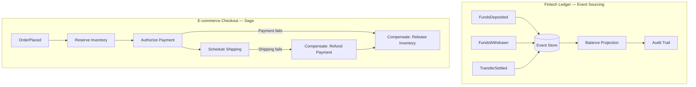
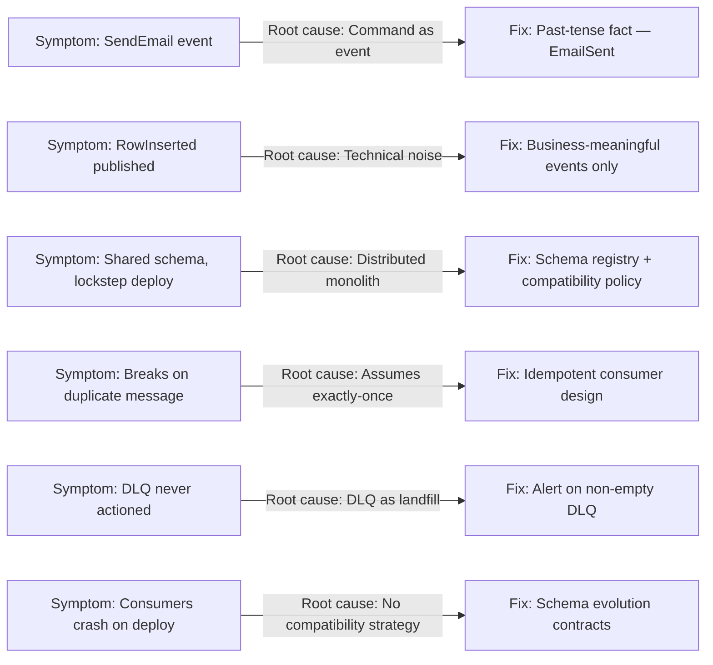
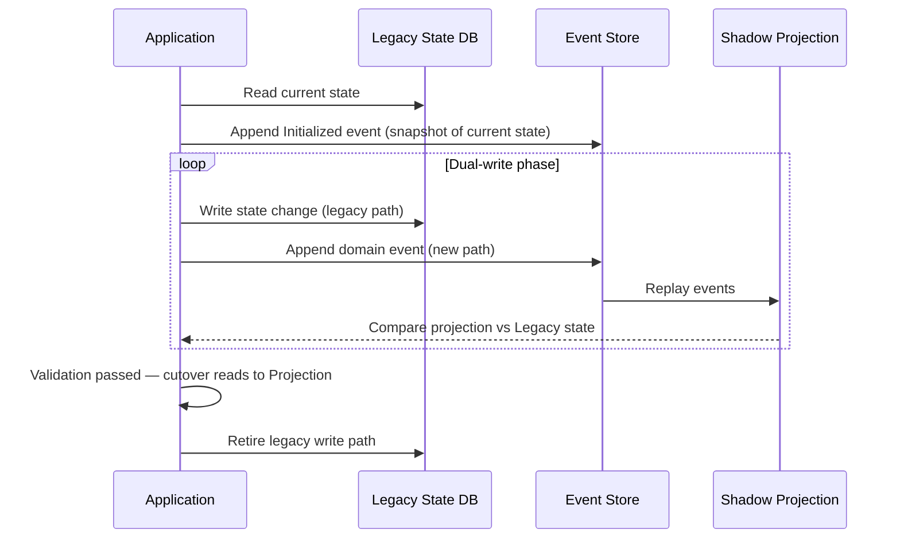
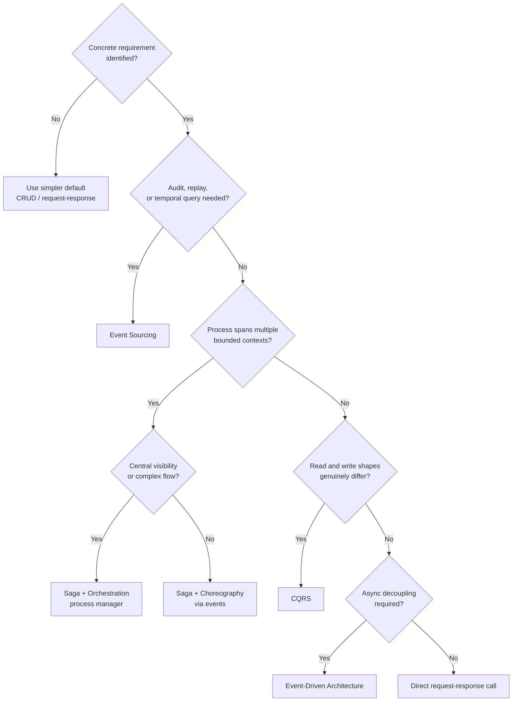

# Capítulo 10: Casos Reales, Trade-offs y Errores Comunes

## Planteamiento del Problema Inicial

Nueve capítulos te han entregado una caja de herramientas. Ahora sabes qué es un evento, cómo modelarlo como un hecho de dominio, cómo transportarlo a través de brokers y logs, cómo garantizar la entrega, cómo separar lecturas de escrituras con CQRS, cómo almacenar el historial con Event Sourcing (almacenamiento de eventos), cómo coordinar trabajos de larga duración con sagas, cómo evolucionar esquemas y cómo operar todo el sistema en producción. Pero una caja de herramientas es peligrosa en manos equivocadas. El error más costoso en la arquitectura basada en eventos no es un bug — es adoptar un patrón que resuelve un problema que no tienes. Este capítulo final cambia la pregunta. En lugar de preguntar "¿cómo uso este patrón?", pregunta "¿debería usarlo del todo, y qué le sucede a la organización cuando lo hago?" Recorreremos dos formas reales de sistemas — un libro mayor de fintech y un checkout de e-commerce — y observaremos cómo las decisiones producen consecuencias. Luego catalogaremos los anti-patrones que se repiten entre equipos, examinaremos la trampa seductora de adoptar Event Sourcing, CQRS y sagas todos a la vez, mapearemos las rutas de migración hacia y desde Event Sourcing, y terminaremos con el marco de decisión que debe regir cada elección que hagas. Aquí es donde el libro se gana su subtítulo.

## Casos de Estudio en Fintech y E-commerce

Los patrones son abstractos. Las consecuencias son concretas. Dos industrias exponen los trade-offs de la arquitectura basada en eventos con una claridad inusual, porque sus modos de fallo son visibles y costosos.

Considera un **libro mayor de fintech** — el sistema central que registra los movimientos de dinero para un banco digital. El dinero tiene una propiedad innegociable: cada saldo debe ser explicable. Un regulador o un cliente puede preguntar "¿por qué este número es el que es?", y "la base de datos lo dice" no es una respuesta aceptable. Este es exactamente el problema para el que fue construido Event Sourcing. El libro mayor almacena cada evento `FundsDeposited`, `FundsWithdrawn` y `TransferSettled` como un hecho inmutable. El saldo actual es una proyección — un **read model** (modelo de lectura) reconstruido reproduciendo el flujo de eventos. Cuando llega un auditor, el historial *es* la pista de auditoría. No hay nada que reconstruir porque nada fue destruido. Aquí, Event Sourcing no es sobreingeniería; es la forma más económica de cumplir un requisito estricto.

El **checkout** de e-commerce cuenta una historia diferente. Un cliente realiza un pedido, y detrás de ese único clic hay reserva de inventario, autorización de pago, puntuación antifraude y envío. Ninguna base de datos única posee todo eso. Estos servicios viven en **bounded contexts** (contextos delimitados) separados, y una transacción ACID distribuida entre ellos es impráctica. Este es territorio de sagas. El pedido se convierte en una **saga** coordinada por un **process manager** (gestor de procesos), con **compensating transactions** (transacciones compensatorias) listas para liberar inventario o reembolsar un cargo si un paso posterior falla.

Los dos casos comparten ADN pero divergen en énfasis, como muestra la tabla a continuación.

| Preocupación | Libro Mayor Fintech | Checkout E-commerce |
|---|---|---|
| Motor principal | Auditabilidad y corrección | Disponibilidad y coordinación |
| Patrón dominante | Event Sourcing | Saga + process manager |
| Postura de consistencia | El historial es la fuente de verdad | Consistencia eventual, compensaciones |
| Costo de un evento perdido | Catastrófico (dinero) | Recuperable (reintentar o compensar) |
| Read model | Proyección de saldo reconstruida | Proyección de estado de pedido |

*Estos dos subgrafos contrastan el patrón dominante para cada dominio: el libro mayor de fintech usa Event Sourcing para construir un historial auditable e inmutable que impulsa una proyección de saldo, mientras que el checkout de e-commerce usa una saga con transacciones compensatorias para coordinar entre bounded contexts cuando algún paso falla.*

Observa lo que ninguno de los dos casos hizo. El equipo de fintech no añadió sagas a cada actualización interna de saldo. El equipo de e-commerce no aplicó Event Sourcing al carrito de compras, que es desechable por naturaleza. Cada equipo aplicó un patrón donde se pagó por sí mismo y resistió el impulso de aplicarlo en todas partes. Esa contención es la verdadera lección, y configura los fallos que examinamos a continuación.

> 💡 **Nota del Experto:** El ejemplo del libro mayor de fintech motiva correctamente Event Sourcing para auditabilidad, pero omite una restricción crítica de producción: a medida que un agregado acumula decenas de miles de eventos — algo común en cuentas activas tras 2–3 años — reproducir el flujo completo en cada lectura se vuelve prohibitivo. Los sistemas de Event Sourcing en producción a escala requieren universalmente una **estrategia de snapshots** (instantáneas): persistir periódicamente el estado proyectado como un punto de control para que la reproducción comience desde el snapshot más cercano en lugar del evento cero. Sin snapshots, la latencia de lectura para agregados de alta frecuencia crece linealmente con la antigüedad de la cuenta y puede cruzar los umbrales de SLA a los pocos meses de la puesta en marcha. Los equipos que descubren esto tarde se ven obligados a realizar una migración de snapshots de emergencia bajo carga de producción.

💡 Nota del Experto

La sección sobre la saga del checkout de e-commerce es precisa, pero omite un modo de fallo de producción que vale la pena nombrar: la **tormenta de rollback de saga**. Cuando una compensación de etapa tardía se activa en alto volumen — por ejemplo, un servicio de envío rechaza un pedido después de que el pago ya fue capturado — los eventos compensatorios `RefundPayment` y `ReleaseInventory` llegan a los servicios upstream como una ráfaga. En los picos de checkout (Black Friday, ventas flash), la ráfaga de compensación puede sobrepasar los límites de tasa del proveedor de pagos o la capacidad del servicio de inventario, causando una segunda ola de fallos que se propaga en cascada por la saga. Los equipos que operan a escala añaden backpressure y presupuestos de reintento con retroceso exponencial específicamente para la ruta de compensación, tratándola como una clase de tráfico separada del camino feliz.

⚠️ Nota Crítica

El texto afirma que Event Sourcing es "la forma más económica de cumplir" el requisito de auditabilidad de un libro mayor de fintech, sin comparación con alternativas. Las tablas de log de auditoría de solo inserción (una tabla audit_log separada que es solo INSERT y NUNCA se actualiza), Change Data Capture (CDC) con Debezium escribiendo en un sink inmutable, y servicios de auditoría de propósito específico (al estilo de AWS CloudTrail) satisfacen el mismo requisito de auditabilidad a una fracción de la complejidad operacional. Para muchos equipos, una tabla de auditoría de solo inserción es la solución más económica y mantenible. Presentar Event Sourcing como la respuesta correcta por defecto a "necesitas auditabilidad" es precisamente la trampa de sobre-adopción contra la que el capítulo advierte.

⚠️ Nota Crítica

La sección del checkout de e-commerce presenta el ACID distribuido como "impráctica" como una afirmación universal, sin reconocer que las bases de datos modernas distribuidas globalmente (Google Spanner, CockroachDB, YugabyteDB, AWS Aurora Global Database con aislamiento serializable) sí proporcionan semántica ACID distribuida. Para una audiencia objetivo de arquitectos senior, descartar categóricamente el ACID distribuido puede producir una sobredependencia de las sagas incluso en casos donde una base de datos fuertemente consistente que satisfaga los requisitos de todos los servicios es la opción más simple y segura.

⚠️ Nota Crítica

El carrito de compras se describe como "desechable por naturaleza", lo que implícitamente avala la decisión de no aplicar Event Sourcing. Si bien desaconsejar el Event Sourcing del carrito es un consejo correcto, caracterizarlo como desechable es una simplificación excesiva que no coincide con los requisitos reales del e-commerce. La recuperación de carritos abandonados, la auditoría del derecho al borrado del GDPR sobre el contenido del carrito, el snapshotting de jurisdicción fiscal y las funciones de lista de deseos/guardar para después requieren un estado de carrito duradero y consultable. El enfoque puede llevar a los lectores a invertir insuficientemente en el diseño de la persistencia del carrito bajo el supuesto de que es inherentemente desechable.

## Catálogo de Anti-Patrones y Errores Recurrentes

Los fallos en los sistemas basados en eventos son notablemente repetitivos. Los mismos errores aparecen en empresas, equipos y tecnologías. Catalogarlos te permite reconocer un olor antes de que se convierta en una interrupción del servicio. Aquí están los errores recurrentes, cada uno vinculado a los capítulos que te armaron contra ellos.

- **El evento como comando disfrazado.** Un mensaje llamado `SendEmail` o `UpdateInventory` no es un evento — es un comando con disfraz. Los eventos reales describen hechos del pasado (`OrderPlaced`), no instrucciones para el futuro. Confundir los dos reconstruye el acoplamiento temporal que EDA pretendía eliminar (Capítulos 1 y 2).
- **Ruido técnico como eventos de dominio.** Publicar `RowInserted` o `CacheInvalidated` inunda el sistema con hechos que ninguna capacidad de negocio le importa. Los eventos deben expresar cambios de negocio significativos, no mecánicas de base de datos (Capítulo 2).
- **El monolito distribuido.** Los servicios se comunican mediante eventos pero permanecen tan fuertemente acoplados que ninguno puede desplegarse independientemente. Un esquema compartido y versionado sincrónicamente entre cada servicio recrea el monolito con latencia de red añadida (Capítulos 2 y 8).
- **Asumir entrega exactly-once.** Construir consumidores que fallan cuando un mensaje llega dos veces. Bajo la entrega **at-least-once** — el valor predeterminado realista — los duplicados están garantizados. Los consumidores no idempotentes son una bomba de tiempo (Capítulo 4).
- **La cola de mensajes muertos ignorada.** Tratar la **DLQ** como un vertedero en lugar de una cola de trabajo. Una DLQ no vacía es un incidente, no una métrica que se consulta trimestralmente (Capítulo 9).
- **Evolución de esquemas por esperanza.** Enviar un cambio incompatible a un contrato de evento y descubrir los consumidores downstream solo cuando fallan. No tener política de compatibilidad significa que cada cambio de productor es un riesgo (Capítulo 8).

*Este mapa de diagnóstico muestra los seis anti-patrones más comunes en sistemas basados en eventos, su causa raíz estructural y el patrón correctivo — permitiendo que un equipo que hereda un sistema desconocido identifique deuda arquitectónica antes de leer la lógica de negocio.*

**Consejo Pro:** Cuando heredas un sistema basado en eventos desconocido, audítalo contra esta lista antes de leer una línea de lógica de negocio. Los anti-patrones revelan la salud de un sistema más rápido que cualquier dashboard. Un equipo que nombró sus eventos como comandos e ignora su DLQ tiene deuda arquitectónica que ninguna cantidad de escalado podrá solucionar.

> 💡 **Nota del Experto:** El anti-patrón "asumir entrega exactly-once" está correctamente identificado, pero hay un malentendido específico y recurrente que el texto no aborda: los ingenieros que habilitan la **exactly-once semantics (EOS)** de Kafka mediante productores transaccionales y consumidores idempotentes creen que han eliminado el requisito de idempotencia en el lado del consumidor. Esto es incorrecto. El EOS de Kafka garantiza que cada mensaje se escribe y lee desde el log de Kafka exactamente una vez; no ofrece ninguna garantía sobre los efectos secundarios del procesamiento del consumidor — las escrituras en bases de datos, las llamadas HTTP downstream, las mutaciones de archivos o las invocaciones de API externas están completamente fuera del alcance del EOS. Un consumidor que llama a una API de pagos externa o escribe en una base de datos relacional sigue siendo totalmente responsable de la idempotencia. Equipos han enviado a producción consumidores "habilitados con EOS" que cobran doble a los clientes porque confundieron la deduplicación a nivel del broker con el procesamiento exactly-once de extremo a extremo.

💡 Nota del Experto

El anti-patrón del monolito distribuido podría hacerse más específico con un disparador organizacional concreto que los equipos pasan por alto: usar un **schema registry compartido con releases sincronizados**. Los equipos adoptan correctamente Confluent Schema Registry o AWS Glue Schema Registry, pero luego gestionan todas las versiones de esquema en un monorepo único con un pipeline de releases unificado — lo que requiere que los propietarios de esquemas y todos los equipos consumidores coordinen cada ciclo de release. Esto recrea el tren de releases centralizado del monolito en la capa de esquemas, incluso cuando los servicios en sí mismos son independientemente desplegables. La señal es un tablero de sprint con historias de "congelación de esquemas" bloqueando trabajo de funcionalidades no relacionadas.

⚠️ Nota Crítica

El anti-patrón para "Asumir entrega exactly-once" afirma que "bajo la entrega at-least-once — el valor predeterminado realista — los duplicados están garantizados." La palabra "garantizados" es técnicamente incorrecta: la entrega at-least-once significa que un mensaje será entregado al menos una vez, lo que hace que los duplicados sean posibles y probables bajo condiciones de fallo, pero no garantizados en cada ejecución. Decir que están garantizados implica que cada mensaje llegará más de una vez, lo cual es falso y podría llevar a los ingenieros a añadir sobrecarga de deduplicación innecesaria en rutas de bajo volumen y bajo fallo, mientras que la lección real — que la idempotencia debe diseñarse independientemente de la tasa de duplicados observada — es correcta.

## Adopción Prematura de ES, CQRS y Saga Combinados

Hay un fallo específico tan común y tan dañino que merece su propia sección: adoptar **Event Sourcing**, **CQRS** y **sagas** juntos, desde el primer día, en un proyecto greenfield. Los equipos hacen esto porque los patrones se presentan juntos en conferencias y parecen formar un todo coherente. Forman un todo coherente — para el pequeño conjunto de sistemas que genuinamente necesitan los tres.

La seducción es comprensible. Event Sourcing te da historial. CQRS te da modelos de lectura limpios. Las sagas te dan coordinación distribuida. Combinados, parecen la arquitectura "correcta" moderna. Pero cada patrón conlleva un impuesto permanente, y los impuestos se acumulan.

Event Sourcing significa que nunca puedes simplemente hacer `UPDATE` a una fila; cada cambio de estado requiere un evento, una proyección y una estrategia de versionado para eventos que sobrevivirán al código que los escribió. CQRS significa que cada modelo de lectura es eventualmente consistente, por lo que tu interfaz de usuario debe manejar la brecha entre una escritura y su efecto visible. Las sagas significan que cada proceso de múltiples pasos necesita transacciones compensatorias diseñadas y un process manager para rastrear el estado. Adopta los tres antes de haber demostrado que necesitas alguno de ellos, y habrás construido un sistema donde un ingeniero junior no puede añadir un campo sin tocar un esquema de evento, una proyección, un upcaster y posiblemente un paso de saga.

La tabla a continuación contrasta la promesa con la realidad operacional.

| Patrón | Lo que promete | Lo que cuesta, permanentemente |
|---|---|---|
| Event Sourcing | Historial completo, auditoría perfecta | Versionado, upcasting, sin ediciones en su lugar |
| CQRS | Lecturas optimizadas, consultas escalables | Consistencia eventual, mantenimiento de proyecciones |
| Saga | Coordinación sin ACID distribuido | Lógica de compensación, seguimiento de estado, razonamiento de fallos parciales |

La secuencia correcta es sustractiva, no aditiva. Comienza con lo más simple que funcione — a menudo un servicio bien estructurado con una base de datos normal y unos pocos eventos de integración. Introduce CQRS solo cuando las formas de lectura y escritura realmente diverjan. Introduce Event Sourcing solo cuando el historial sea un requisito estricto, como en el libro mayor de fintech. Introduce sagas solo cuando un proceso de negocio realmente abarque bounded contexts. Cada patrón debe ganarse su lugar resolviendo un problema que puedas nombrar. Si no puedes nombrar el problema, aún no lo tienes.

💡 Nota del Experto

El texto describe correctamente los impuestos técnicos de combinar los tres patrones, pero el impuesto organizacional es igualmente significativo y a menudo se siente primero. En un sistema con Event Sourcing, CQRS y sagas todos activos, un incidente P1 requiere que un ingeniero razone simultáneamente en cuatro capas distintas: el flujo de eventos (¿qué ocurrió?), el estado de la proyección (¿qué calculó?), el estado de la saga (¿en qué paso está el proceso?) y el log de compensación (¿qué se revirtió?). El tiempo medio de diagnóstico se dispara. Los equipos informan que incorporar a un nuevo ingeniero al debugging de pila completa en este entorno tarda 6–9 meses en lugar de las 4–6 semanas típicas de un sistema basado en servicios. La complejidad no es solo un problema de código — es una restricción de contratación y un riesgo de dependencia de personas clave.

## Migrar hacia y desde Event Sourcing

Event Sourcing es la decisión de mayor compromiso en este libro, por lo que sus dos direcciones de migración merecen mapas explícitos. La mayoría de los equipos se centra en cómo entrar. Los equipos maduros también saben cómo salir.

**Migrar a Event Sourcing** desde un sistema basado en estado es un procedimiento controlado, no una reescritura:

1. **Identifica el agregado** cuyo historial importa — la cuenta, el pedido, la póliza. No apliques Event Sourcing a todo el sistema; aplícalo a la parte con un requisito de auditoría o temporal.
2. **Modela los eventos** que habrían producido el estado actual. Esto es trabajo de dominio, no trabajo de base de datos; te obliga a nombrar los hechos que tus tablas CRUD descartaron silenciosamente.
3. **Siembra el event store** con un evento `Migrated` o `Initialized` que capture el estado actual como un hecho inicial. El historial anterior al corte se pierde, y eso es aceptable — comienzas a registrar hechos desde ahora.
4. **Ejecuta escritura dual o proyecciones sombra** para validar que reproducir los eventos reproduce el estado que mantiene el sistema heredado, antes de cortar las lecturas.
5. **Cambia las lecturas a la proyección**, luego retira la ruta de escritura heredada una vez establecida la confianza.

*Esta secuencia traza la migración controlada en cinco etapas desde un sistema basado en estado a Event Sourcing — sembrando un hecho inicial, ejecutando proyecciones sombra en paralelo con el sistema heredado para validar la corrección, y solo entonces cambiando las lecturas a la nueva proyección y retirando la ruta de escritura heredada.*

**Migrar fuera de Event Sourcing** es más raro pero no una derrota. A veces un equipo descubre que un componente fue sometido a Event Sourcing por entusiasmo, no por necesidad, y el impuesto de versionado supera cualquier beneficio. La salida es sencilla precisamente porque el estado actual siempre es derivable: construye la proyección final, persístela como estado ordinario en una tabla convencional, apunta las lecturas y escrituras a esa tabla, y archiva el event store como un registro histórico frío. Conservas el historial para cumplimiento sin pagar el impuesto en tiempo de ejecución de reconstruirlo. La capacidad de salir limpiamente es en sí misma un argumento para adoptar deliberadamente — una decisión reversible es una decisión más segura.

> 💡 **Nota del Experto:** El paso 4 del procedimiento de migración — "ejecutar escritura dual o proyecciones sombra" — pasa por alto un problema crítico de atomicidad. Escribir dualmente en una base de datos de estado heredada y en un event store en la misma transacción de aplicación no es atómico a menos que ambos estén en el mismo límite ACID, lo que típicamente no es el caso. Un fallo entre la escritura en la base de datos y el append en el event store deja los dos sistemas inconsistentes. El enfoque seguro para producción es el **patrón transactional outbox**: escribir el evento en una tabla de outbox local en la misma transacción que la actualización de estado, luego retransmitirlo de forma asíncrona al event store mediante CDC (Change Data Capture, por ejemplo, Debezium) o un proceso de relay dedicado. Los equipos que omiten este paso descubren inconsistencias solo durante pruebas de inyección de fallos o, peor aún, durante un incidente de producción real.

> 💡 **Nota del Experto:** El paso 3 afirma que "el historial anterior al corte se pierde, y eso es aceptable." Esta afirmación requiere una calificación estricta para las industrias reguladas — precisamente el contexto fintech que el capítulo usa como caso de estudio principal. Bajo SOX, PCI-DSS y los requisitos de retención de datos de la mayoría de los reguladores bancarios, el estado histórico de las transacciones debe ser auditable durante 5–7 años. "Sembrar con un evento Initialized" satisface el requisito en adelante, pero no satisface las auditorías retrospectivas del período pre-migración. Los equipos regulados deben (a) migrar los registros CRUD históricos a eventos sintéticos en el momento del corte, (b) mantener el sistema heredado en modo de solo lectura como archivo durante la ventana de retención, o (c) exportar instantáneas del estado histórico a un almacenamiento frío compatible. Tratar el historial pre-corte como una pérdida aceptable sin verificar las obligaciones regulatorias es un riesgo de auditoría, no solo un trade-off técnico.

> ⚠️ **Nota Crítica:** El paso 3 de la guía de migración afirma "El historial anterior al corte se pierde, y eso es aceptable." Esta afirmación está directamente contradicha por el caso de estudio del libro mayor de fintech introducido dos secciones antes, donde el motor principal es la auditabilidad y el requisito declarado es que "cada saldo debe ser explicable." Los reguladores (PCI-DSS, SOX, FCA, BACEN) exigen rutinariamente historial de transacciones de varios años, y una estrategia de migración que descarte el estado pre-corte sería no conforme en precisamente el dominio que el capítulo usa como historia de éxito canónica. Un arquitecto senior que lea esto en un contexto de industria regulada puede seguir este consejo y producir un plan de migración legalmente no conforme.

⚠️ Nota Crítica

La salida de Event Sourcing se describe como "sencilla" porque "el estado actual siempre es derivable." Esto pasa por alto tres modos de fallo significativos que los profesionales senior encuentran regularmente: (1) bugs de proyección que han acumulado silenciosamente estado incorrecto durante miles de reproducciones, lo que significa que la proyección "final" puede no reflejar la realidad; (2) volumen del event store — un sistema con cientos de millones de eventos puede tardar horas o días en reproducirse en una instantánea final, haciendo que un corte limpio sea operacionalmente complejo; y (3) flujos de eventos incompletos o corruptos donde los vacíos o fallos de deserialización significan que el estado actual no es completamente derivable. Llamar "sencilla" a la salida subestima la diligencia debida requerida.

## Marco de Decisión: Cuándo No Usar Cada Patrón

Todo el libro converge aquí. Cada patrón tiene una pregunta espejo: no "¿cuándo uso esto?" sino "¿cuándo lo rechazo?" El rechazo es la habilidad más infrautilizada del arquitecto senior. El marco a continuación está deliberadamente formulado como prohibiciones, porque el valor predeterminado siempre debe ser la opción más simple hasta que un requisito concreto fuerce la opción compleja.

| Patrón | NO lo uses cuando... | Prefiere en cambio |
|---|---|---|
| Event-Driven Architecture | El flujo de trabajo es una solicitud simple y sincrónica que necesita una respuesta inmediata | Llamada directa request-response |
| Event Sourcing | No tienes requisito de auditoría, temporal o de reproducción | Persistencia basada en estado (CRUD) |
| CQRS | Los modelos de lectura y escritura tienen la misma forma | Un único modelo compartido |
| Saga | La transacción vive dentro de un único bounded context | Una transacción ACID local |
| Choreography | El proceso tiene muchos pasos y necesita visibilidad central | Orchestration con un process manager |
| Orchestration | Dos servicios necesitan acoplamiento suelto e independiente | Choreography mediante eventos |

*Este árbol de decisión operacionaliza el marco de rechazo del libro — asumiendo siempre la opción más simple como predeterminada e introduciendo cada patrón solo cuando un requisito concreto y nombrado no puede satisfacerse sin él.*

El principio unificador es el **acoplamiento como presupuesto**. Cada patrón en este libro intercambia un tipo de acoplamiento por otro. EDA intercambia acoplamiento temporal por consistencia eventual. CQRS intercambia un único modelo por dos modelos mantenidos en sincronía. Las sagas intercambian garantías ACID por lógica de compensación. No obtienes desacoplamiento gratis; lo pagas en complejidad, y esa complejidad es permanente. Un arquitecto senior gasta el presupuesto de acoplamiento solo donde el retorno es real.

Ese es el hilo que recorre los diez capítulos. Los eventos son hechos inmutables. El desacoplamiento es poderoso pero no gratuito. La consistencia es un espectro en el que eliges un punto, no un binario que se activa. La entrega es at-least-once, por lo que la idempotencia no es opcional. El historial es un requisito que debe justificarse, no un valor predeterminado que se asume. Los patrones son herramientas, y las herramientas se eligen en función de los problemas. Si no internalizas nada más, internaliza esto: el objetivo nunca fue construir un sistema basado en eventos. El objetivo era resolver un problema de negocio, y la arquitectura basada en eventos es un medio para ese fin — poderosa cuando el problema la exige, y sobreingeniería costosa cuando no lo hace. Elige deliberadamente, y la caja de herramientas te sirve a ti en lugar de al revés.

💡 Nota del Experto

La tabla de decisión recomienda choreography cuando "dos servicios necesitan acoplamiento suelto e independiente", lo que implica un límite de dos servicios donde la orchestration aún no está justificada. En la práctica, el umbral es más una función de la **observabilidad** que del número de participantes. La choreography con incluso tres o cuatro servicios crea una máquina de estado distribuida implícita donde ningún componente conoce el estado general del proceso, lo que hace que el diagnóstico de incidentes y los informes a nivel de negocio (por ejemplo, "¿cuántos pedidos están atascados entre el pago y el envío ahora mismo?") sean extremadamente difíciles. La regla empírica operacional usada a escala: si una parte interesada del negocio o un SRE necesita hacer una pregunta sobre el estado del proceso entre servicios más de una vez por trimestre, ese proceso necesita un orquestador. La choreography debe reservarse para fan-out de disparar y olvidar donde el publicador genuinamente no le importa lo que los consumidores hacen con el evento.

## Conclusiones Clave

- Los sistemas reales aplican un patrón donde se paga por sí mismo y resisten aplicarlo en todas partes; el libro mayor de fintech necesita Event Sourcing, el checkout de e-commerce necesita sagas, y ninguno necesita ambos.
- Los anti-patrones se repiten de forma predecible — eventos disfrazados como comandos, DLQs ignoradas, suposiciones de exactly-once y cambios de esquema incompatibles — y reconocer el olor es más rápido que cualquier dashboard.
- Adoptar Event Sourcing, CQRS y sagas juntos desde el primer día es la trampa de optimización prematura más costosa; la secuencia correcta es sustractiva, añadiendo cada patrón solo cuando un problema nombrado lo exige.
- La migración a Event Sourcing es un procedimiento controlado y por etapas, y la migración fuera es limpia porque el estado actual siempre es derivable — la reversibilidad es una razón para adoptar deliberadamente.
- Cada patrón intercambia un acoplamiento por otro; gasta el presupuesto de acoplamiento solo donde el retorno es concreto, y asume la opción más simple como predeterminada hasta que un requisito real fuerce la complejidad.

## Qué Sigue

Esto concluye el libro — ahora posees tanto los patrones como, más importante aún, el juicio para saber cuándo rechazarlos.

<!-- ASSEMBLY COMPLETE
  Chapter: Real-World Cases, Trade-offs, and Pitfalls
  Code blocks resolved: 0 / 0
  Diagrams resolved: 4 / 4
  Expert callouts (inline): 4
  Expert callouts (collapsed): 4
  Critical callouts (inline): 1
  Critical callouts (collapsed): 5
  Unresolved markers: 0
-->
