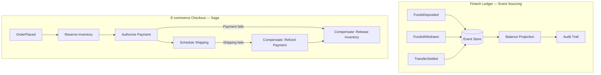
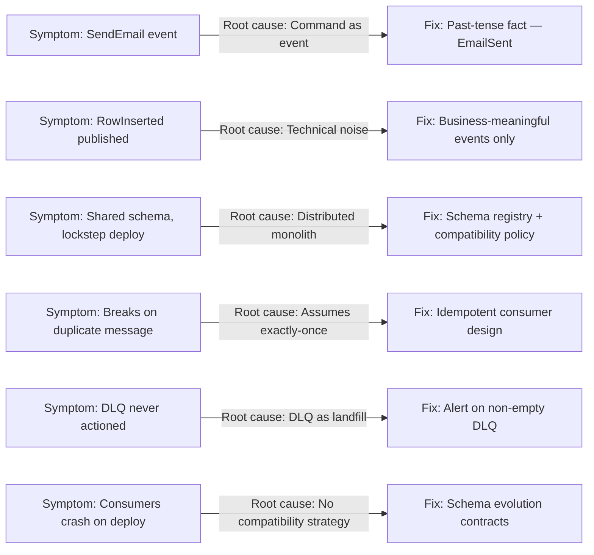
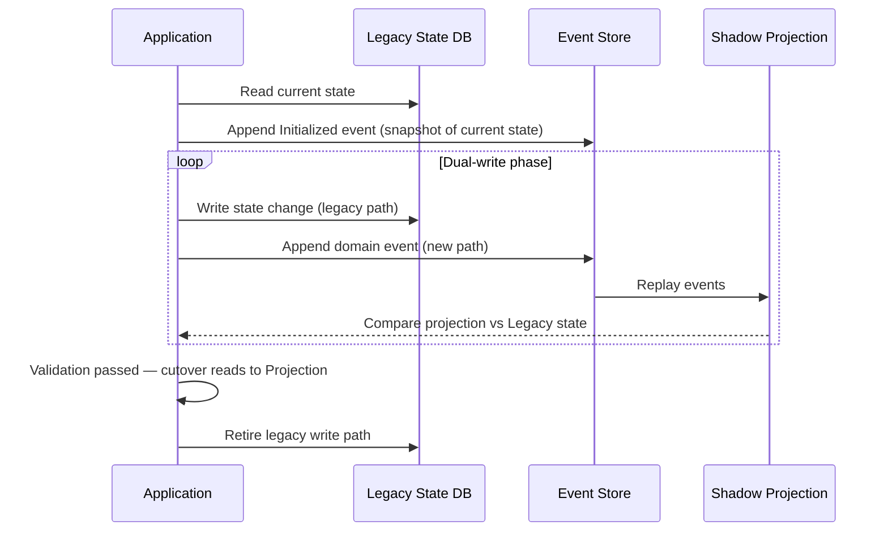
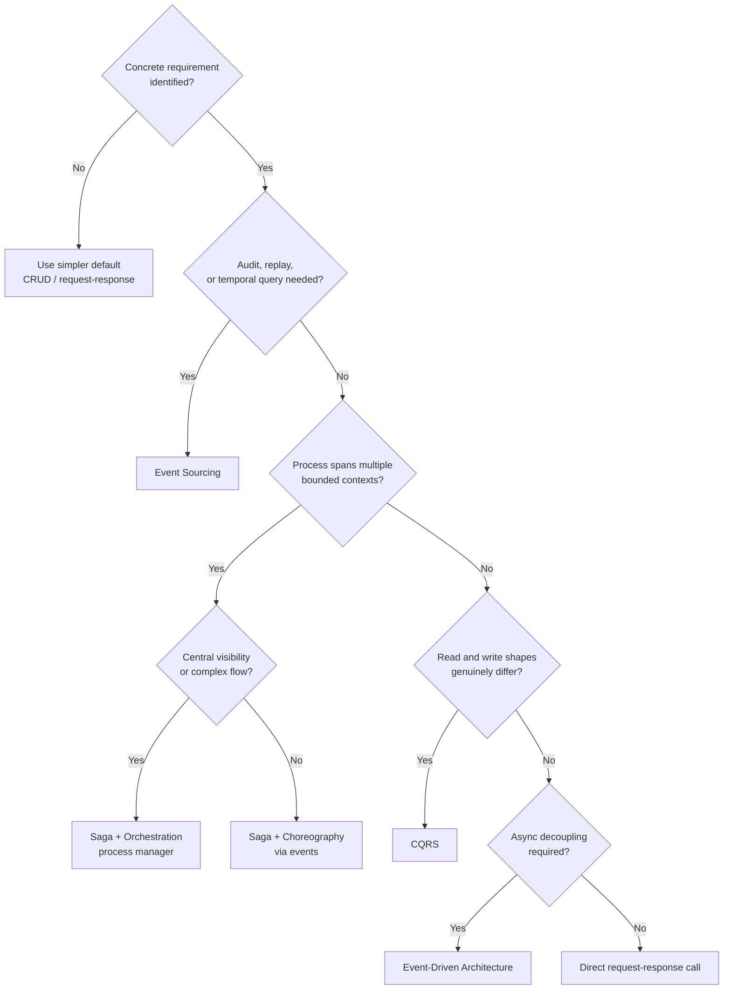

# Capítulo 10: Casos Reais, Trade-offs e Armadilhas

## Declaração do Problema Inicial

Nove capítulos colocaram em suas mãos uma caixa de ferramentas. Você agora sabe o que é um evento, como modelá-lo como um fato de domínio, como movê-lo por brokers e logs, como garantir a entrega, como separar leituras de escritas com CQRS (separação de responsabilidade entre consulta e comando), como armazenar histórico com Event Sourcing (armazenamento de eventos), como coordenar trabalhos de longa duração com sagas, como evoluir schemas, e como operar tudo isso em produção. Mas uma caixa de ferramentas é perigosa nas mãos erradas. O erro mais caro em arquitetura orientada a eventos não é um bug — é adotar um padrão que resolve um problema que você não tem. Este capítulo final muda a pergunta. Em vez de perguntar "como uso esse padrão?", ele pergunta "devo usá-lo, e o que acontece com a organização quando o faço?" Vamos percorrer dois formatos reais de sistema — um ledger (livro-razão) de fintech e um checkout de e-commerce — e observar como decisões produzem consequências. Em seguida, catalogaremos os anti-padrões que se repetem entre equipes, examinaremos a armadilha sedutora de adotar Event Sourcing, CQRS e sagas de uma só vez, mapearemos os caminhos de migração para dentro e para fora do Event Sourcing, e terminaremos com o framework de decisão que deve governar cada escolha que você fizer. É aqui que o livro justifica seu subtítulo.

## Estudos de Caso em Fintech e E-commerce

Padrões são abstratos. Consequências são concretas. Dois setores expõem os trade-offs da arquitetura orientada a eventos com clareza incomum, porque seus modos de falha são visíveis e custosos.

Considere um **ledger de fintech** — o sistema central que registra movimentações financeiras para um banco digital. Dinheiro tem uma propriedade inegociável: todo saldo deve ser explicável. Um regulador ou um cliente pode perguntar "por que este número é o que é?", e "o banco de dados diz assim" não é uma resposta aceitável. Esse é exatamente o problema para o qual o Event Sourcing foi criado. O ledger armazena cada evento `FundsDeposited`, `FundsWithdrawn` e `TransferSettled` como um fato imutável. O saldo atual é uma projeção — um **modelo de leitura** reconstruído ao reproduzir o stream de eventos. Quando um auditor chega, o histórico *é* a trilha de auditoria. Não há nada a reconstruir porque nada foi jamais destruído. Aqui, o Event Sourcing não é engenharia excessiva; é o modo mais barato de atender a um requisito rígido.

O **checkout** de e-commerce conta uma história diferente. Um cliente faz um pedido, e por trás desse único clique existem reserva de estoque, autorização de pagamento, pontuação antifraude e envio. Nenhum banco de dados único é dono de tudo isso. Esses serviços vivem em **bounded contexts** (contextos delimitados) separados, e uma transação ACID distribuída entre eles é impraticável. Este é território de saga. O pedido se torna uma **saga** coordenada por um **process manager** (gerenciador de processo), com **compensating transactions** (transações compensatórias) prontas para liberar o estoque ou reembolsar uma cobrança caso uma etapa posterior falhe.

Os dois casos compartilham DNA, mas divergem na ênfase, como a tabela abaixo mostra.

| Preocupação | Ledger de Fintech | Checkout de E-commerce |
|---|---|---|
| Motivador principal | Auditabilidade e correção | Disponibilidade e coordenação |
| Padrão dominante | Event Sourcing | Saga + process manager |
| Postura de consistência | Histórico é a fonte da verdade | Consistência eventual, compensações |
| Custo de um evento perdido | Catastrófico (dinheiro) | Recuperável (retry ou compensar) |
| Modelo de leitura | Projeção de saldo reconstruída | Projeção de status do pedido |

*Estes dois subgrafos contrastam o padrão dominante para cada domínio: o ledger de fintech usa Event Sourcing para construir um histórico auditável e imutável que alimenta uma projeção de saldo, enquanto o checkout de e-commerce usa uma saga com transações compensatórias para coordenar entre bounded contexts quando qualquer etapa falha.*

Observe o que nenhum dos casos fez. A equipe de fintech não acoplou sagas a cada atualização interna de saldo. A equipe de e-commerce não usou Event Sourcing no carrinho de compras, que é descartável por natureza. Cada equipe aplicou um padrão onde ele se pagava e resistiu ao impulso de aplicá-lo em todo lugar. Essa contenção é a lição real, e ela prepara o terreno para as falhas que examinaremos a seguir.

> 💡 **Nota do Especialista:** O exemplo do ledger de fintech motiva corretamente o Event Sourcing para auditabilidade, mas omite uma restrição crítica de produção: à medida que um agregado acumula dezenas de milhares de eventos — comum para contas ativas após 2–3 anos — reproduzir o stream completo a cada leitura torna-se proibitivo. Sistemas de Event Sourcing em produção em escala exigem universalmente uma **estratégia de snapshot** (instantâneo): persistir periodicamente o estado projetado como um checkpoint, para que a reprodução comece a partir do snapshot mais próximo em vez do evento zero. Sem snapshots, a latência de leitura para agregados de alta frequência cresce linearmente com a idade da conta e pode cruzar os limites de SLA poucos meses após o lançamento. Equipes que descobrem isso tarde são forçadas a uma migração emergencial de snapshots sob carga de produção.

💡 Nota do Especialista

A seção de saga do checkout de e-commerce é precisa, mas omite um modo de falha em produção que merece ser nomeado: a **tempestade de rollback de saga**. Quando uma compensação de estágio tardio dispara em alto volume — por exemplo, um serviço de envio rejeita um pedido depois que o pagamento já foi capturado — os eventos compensatórios `RefundPayment` e `ReleaseInventory` chegam aos serviços anteriores como uma rajada. Nos picos de checkout (Black Friday, flash sales), a rajada de compensação pode sobrecarregar os limites de taxa do provedor de pagamento ou a capacidade do serviço de estoque, causando uma segunda onda de falhas que se propaga de volta pela saga. Equipes que operam em escala adicionam backpressure e orçamentos de retry com backoff exponencial especificamente para o caminho de compensação, tratando-o como uma classe de tráfego separada do caminho feliz.

⚠️ Nota Crítica

O texto afirma que Event Sourcing é "o modo mais barato de atender" ao requisito de auditabilidade de um ledger de fintech, sem comparação com alternativas. Tabelas de log de auditoria append-only (uma tabela audit_log separada que é somente INSERT e NUNCA atualizada), Change Data Capture (CDC) com Debezium escrevendo em um sink imutável, e serviços de auditoria específicos (no estilo do AWS CloudTrail) atendem ao mesmo requisito de auditabilidade com uma fração da complexidade operacional. Para muitas equipes, uma tabela de auditoria append-only é a solução mais barata e sustentável. Apresentar o Event Sourcing como a resposta correta por padrão para "você precisa de auditabilidade" é exatamente a armadilha de adoção excessiva contra a qual o capítulo adverte.

⚠️ Nota Crítica

A seção de checkout de e-commerce apresenta o ACID distribuído como "impraticável" como uma afirmação universal, sem reconhecer que bancos de dados modernos globalmente distribuídos (Google Spanner, CockroachDB, YugabyteDB, AWS Aurora Global Database com isolamento serializável) oferecem semântica ACID distribuída. Para um público-alvo de arquitetos sêniores, descartar o ACID distribuído categoricamente pode produzir dependência excessiva de sagas mesmo em casos onde um banco de dados fortemente consistente satisfazendo os requisitos de todos os serviços é a escolha mais simples e segura.

⚠️ Nota Crítica

O carrinho de compras é descrito como "descartável por natureza", endossando implicitamente a decisão de não usá-lo com Event Sourcing. Embora desencorajar o Event Sourcing no carrinho seja um conselho correto, caracterizar carrinhos como descartáveis é uma simplificação excessiva que não corresponde aos requisitos reais do e-commerce. Recuperação de carrinho abandonado, auditoria de direito ao apagamento GDPR sobre conteúdo do carrinho, snapshot de jurisdição fiscal e recursos de lista de desejos/salvar para depois — todos requerem estado de carrinho durável e consultável. O enquadramento pode levar os leitores a investir insuficientemente no design de persistência do carrinho com base na suposição de que ele é inerentemente descartável.

## Catálogo de Anti-Padrões e Armadilhas Recorrentes

Falhas em sistemas orientados a eventos são notavelmente repetitivas. Os mesmos erros aparecem em empresas, equipes e tecnologias diferentes. Catalogá-los permite reconhecer o sintoma antes que ele se torne uma indisponibilidade. Aqui estão as armadilhas recorrentes, cada uma ligada aos capítulos que o armaram contra elas.

- **O evento como comando disfarçado.** Uma mensagem chamada `SendEmail` ou `UpdateInventory` não é um evento — é um comando com uma fantasia. Eventos reais descrevem fatos do passado (`OrderPlaced`), não instruções para o futuro. Confundir os dois reconstrói o acoplamento temporal que a EDA (arquitetura orientada a eventos) foi projetada para remover (Capítulos 1 e 2).
- **Ruído técnico como eventos de domínio.** Publicar `RowInserted` ou `CacheInvalidated` inunda o sistema com fatos que nenhuma capacidade de negócio se importa. Eventos devem expressar mudanças de negócio significativas, não mecânica de banco de dados (Capítulo 2).
- **O monolito distribuído.** Serviços se comunicam por eventos mas permanecem tão fortemente acoplados que nenhum pode fazer deploy de forma independente. Um schema compartilhado e versionado de forma síncrona entre todos os serviços recria o monolito com latência de rede adicionada (Capítulos 2 e 8).
- **Assumir entrega exatamente uma vez.** Construir consumidores que quebram quando uma mensagem chega duas vezes. Com entrega **at-least-once** (pelo menos uma vez) — o padrão realista — duplicatas são garantidas. Consumidores não idempotentes são uma bomba-relógio (Capítulo 4).
- **A fila de mensagens mortas ignorada.** Tratar a **DLQ** (dead-letter queue) como um depósito em vez de uma fila de trabalho. Uma DLQ não vazia é um incidente, não uma métrica para ser observada trimestralmente (Capítulo 9).
- **Evolução de schema pela esperança.** Lançar uma mudança incompatível em um contrato de evento e descobrir os consumidores afetados somente quando eles travam. Nenhuma política de compatibilidade significa que cada mudança de produtor é uma aposta (Capítulo 8).

*Este mapa de diagnóstico expõe os seis anti-padrões orientados a eventos mais comuns, sua causa raiz estrutural e o padrão corretivo — permitindo que uma equipe que herda um sistema desconhecido identifique dívida arquitetural antes de ler a lógica de negócio.*

**Dica Pro:** Quando você herda um sistema orientado a eventos desconhecido, audite-o com base nessa lista antes de ler uma linha de lógica de negócio. Os anti-padrões revelam a saúde de um sistema mais rapidamente do que qualquer dashboard. Uma equipe que nomeou seus eventos como comandos e ignora sua DLQ tem dívida arquitetural que nenhuma quantidade de escalabilidade resolverá.

> 💡 **Nota do Especialista:** O anti-padrão "assumir entrega exatamente uma vez" é identificado corretamente, mas há um equívoco específico e recorrente que o texto não aborda: engenheiros que habilitam a **semântica exactly-once (EOS)** do Kafka via produtores transacionais e consumidores idempotentes acreditam ter eliminado o requisito de idempotência no lado do consumidor. Isso está errado. O EOS do Kafka garante que cada mensagem seja escrita e lida do log do Kafka exatamente uma vez; ele não faz nenhuma garantia sobre os efeitos colaterais do processamento do consumidor — escritas em banco de dados, chamadas HTTP downstream, mutações de arquivo ou invocações de API externa estão completamente fora do escopo do EOS. Um consumidor que chama uma API de pagamento externa ou escreve em um banco de dados relacional ainda é totalmente responsável pela idempotência. Equipes lançaram consumidores "habilitados para EOS" que cobraram clientes em duplicidade porque confundiram deduplicação no nível do broker com processamento exatamente uma vez de ponta a ponta.

💡 Nota do Especialista

O anti-padrão de monolito distribuído poderia ser mais específico com um gatilho organizacional concreto que as equipes costumam perder: o uso de um **schema registry compartilhado com releases sincronizados**. As equipes adotam o Confluent Schema Registry ou o AWS Glue Schema Registry corretamente, mas então gerenciam todas as versões de schema em um monorepo único com um pipeline de release unificado — exigindo que os proprietários do schema e todas as equipes de consumidores coordenem cada ciclo de release. Isso recria o trem de release centralizado do monolito na camada de schema, mesmo quando os serviços em si são implantáveis de forma independente. O sinal revelador é um quadro de sprint com histórias de "congelamento de schema" bloqueando trabalho de funcionalidades não relacionadas.

⚠️ Nota Crítica

O anti-padrão "Assumir entrega exatamente uma vez" afirma que "com entrega at-least-once — o padrão realista — duplicatas são garantidas." A palavra "garantidas" está tecnicamente errada: entrega at-least-once significa que uma mensagem será entregue pelo menos uma vez, o que torna duplicatas possíveis e prováveis sob condições de falha, mas não garantidas em toda execução. Dizer que são garantidas implica que toda mensagem chegará mais de uma vez, o que é falso e poderia levar engenheiros a adicionar overhead de deduplicação desnecessário em caminhos de baixo volume e baixa falha, enquanto a lição real — que a idempotência deve ser projetada independentemente da taxa de duplicatas observada — é válida.

## Adoção Prematura de ES, CQRS e Saga em Conjunto

Há uma falha específica tão comum e tão prejudicial que merece sua própria seção: adotar **Event Sourcing**, **CQRS** e **sagas** juntos, desde o primeiro dia, em um projeto greenfield. As equipes fazem isso porque os padrões são apresentados juntos em palestras de conferências e parecem formar um conjunto coerente. Eles de fato formam um conjunto coerente — para o pequeno conjunto de sistemas que genuinamente precisam dos três.

A sedução é compreensível. O Event Sourcing oferece histórico. O CQRS oferece modelos de leitura limpos. As sagas oferecem coordenação distribuída. Combinados, parecem a arquitetura moderna "correta". Mas cada padrão carrega um imposto permanente, e os impostos se acumulam.

Event Sourcing significa que você nunca pode simplesmente fazer `UPDATE` em uma linha; toda mudança de estado requer um evento, uma projeção e uma estratégia de versionamento para eventos que sobreviverão ao código que os escreveu. CQRS significa que todo modelo de leitura é eventualmente consistente, portanto sua UI deve lidar com a lacuna entre uma escrita e seu efeito visível. Sagas significam que todo processo de múltiplas etapas precisa de transações compensatórias projetadas e um process manager para rastrear o estado. Adote os três antes de ter provado que precisa de qualquer um deles, e você construiu um sistema onde um engenheiro júnior não consegue adicionar um campo sem tocar em um schema de evento, uma projeção, um upcaster e possivelmente uma etapa de saga.

A tabela abaixo contrasta a promessa com a realidade operacional.

| Padrão | O que promete | O que custa, permanentemente |
|---|---|---|
| Event Sourcing | Histórico completo, auditoria perfeita | Versionamento, upcasting, sem edições in-place |
| CQRS | Leituras otimizadas, consultas escaláveis | Consistência eventual, manutenção de projeções |
| Saga | Coordenação sem ACID distribuído | Lógica de compensação, rastreamento de estado, raciocínio sobre falhas parciais |

A sequência correta é subtrativa, não aditiva. Comece com a coisa mais simples que funciona — muitas vezes um serviço bem estruturado com um banco de dados normal e alguns eventos de integração. Introduza CQRS somente quando as formas de leitura e escrita genuinamente divergem. Introduza Event Sourcing somente quando o histórico é um requisito rígido, como no ledger de fintech. Introduza sagas somente quando um processo de negócio realmente abrange bounded contexts. Cada padrão deve ganhar seu lugar resolvendo um problema que você consegue nomear. Se você não consegue nomear o problema, você ainda não o tem.

💡 Nota do Especialista

O texto descreve corretamente os impostos técnicos de combinar os três padrões, mas o imposto organizacional é igualmente significativo e muitas vezes aparece primeiro. Em um sistema com Event Sourcing, CQRS e sagas todos ativos, um único incidente P1 exige que um engenheiro raciocine simultaneamente em quatro camadas distintas: o stream de eventos (o que aconteceu?), o estado da projeção (o que foi computado?), o estado da saga (em qual etapa está o processo?) e o log de compensação (o que foi revertido?). O tempo médio de diagnóstico aumenta drasticamente. Equipes relatam que integrar um novo engenheiro para depuração full-stack neste ambiente leva 6–9 meses em vez das 4–6 semanas típicas de um sistema baseado em serviços. A complexidade não é apenas um problema de código — é uma restrição de contratação e um risco de concentração de conhecimento.

## Migrando para e do Event Sourcing

Event Sourcing é a decisão de maior comprometimento neste livro, portanto suas duas direções de migração merecem mapas explícitos. A maioria das equipes se concentra em como entrar. As equipes maduras também sabem como sair.

**Migrando para Event Sourcing** a partir de um sistema baseado em estado é um procedimento controlado, não uma reescrita:

1. **Identifique o agregado** cujo histórico importa — a conta, o pedido, a apólice. Não aplique Event Sourcing a todo o sistema; aplique à parte com um requisito de auditoria ou temporal.
2. **Modele os eventos** que teriam produzido o estado atual. Este é um trabalho de domínio, não de banco de dados; ele força você a nomear os fatos que suas tabelas CRUD descartaram silenciosamente.
3. **Popule o event store** com um evento `Migrated` ou `Initialized` que capture o estado atual como um fato inicial. O histórico antigo anterior ao corte é perdido, e isso é aceitável — você começa a registrar fatos a partir de agora.
4. **Execute dual-write ou shadow projections** (projeções paralelas de sombra) para validar que reproduzir os eventos reproduz o estado que o sistema legado mantém, antes de cortar as leituras.
5. **Transfira as leituras para a projeção**, depois encerre o caminho de escrita legado assim que a confiança estiver estabelecida.

*Esta sequência traça a migração controlada de cinco etapas de um sistema baseado em estado para Event Sourcing — populando um fato inicial, executando projeções paralelas de sombra com o sistema legado para validar a correção, e somente então transferindo as leituras para a nova projeção e encerrando o caminho de escrita legado.*

**Migrando para fora do Event Sourcing** é mais raro, mas não é uma derrota. Às vezes uma equipe descobre que um componente foi usado com Event Sourcing por entusiasmo, não por necessidade, e o imposto do versionamento supera qualquer benefício. A saída é direta exatamente porque o estado atual é sempre derivável: construa a projeção final, persista-a como estado ordinário em uma tabela convencional, aponte leituras e escritas para essa tabela, e arquive o event store como um registro histórico frio. Você mantém o histórico para conformidade sem pagar o imposto de tempo de execução de reconstruí-lo. A capacidade de sair de forma limpa é em si mesma um argumento para adotar deliberadamente — uma decisão reversível é uma decisão mais segura.

> 💡 **Nota do Especialista:** A etapa 4 do procedimento de migração — "execute dual-write ou shadow projections" — glosa sobre um problema crítico de atomicidade. Fazer dual-write em um banco de dados de estado legado e em um event store na mesma transação de aplicação não é atômico, a menos que ambos estejam no mesmo limite ACID, o que tipicamente não é o caso. Uma falha entre a escrita no banco de dados e o append no event store deixa os dois sistemas inconsistentes. A abordagem segura para produção é o **padrão transactional outbox**: escrever o evento em uma tabela de outbox local na mesma transação que a atualização de estado, então retransmiti-lo assincronamente para o event store via CDC (Change Data Capture, ex.: Debezium) ou um processo de relay dedicado. Equipes que pulam essa etapa descobrem inconsistências somente em testes de injeção de falhas ou, pior, durante um incidente real de produção.

> 💡 **Nota do Especialista:** A etapa 3 afirma que "o histórico antigo anterior ao corte é perdido, e isso é aceitável." Esta afirmação requer uma qualificação rígida para setores regulamentados — precisamente o contexto de fintech que o capítulo usa como seu estudo de caso principal. Sob SOX, PCI-DSS e os requisitos de retenção de dados da maioria dos reguladores bancários, o estado histórico de transações deve ser auditável por 5–7 anos. "Popular com um evento Initialized" satisfaz o requisito daqui para frente, mas não satisfaz auditorias retroativas para o período pré-migração. Equipes regulamentadas devem (a) migrar registros CRUD históricos para eventos sintéticos no corte, (b) manter o sistema legado em modo somente leitura como arquivo pelo período de retenção, ou (c) exportar snapshots de estado histórico para um armazenamento frio em conformidade. Tratar o histórico pré-corte como perda aceitável sem verificar as obrigações regulatórias é um risco de auditoria, não apenas um trade-off técnico.

> ⚠️ **Nota Crítica:** A etapa 3 do guia de migração afirma "O histórico antigo anterior ao corte é perdido, e isso é aceitável." Essa afirmação é diretamente contraditada pelo estudo de caso do ledger de fintech introduzido apenas duas seções antes, onde o motivador principal é auditabilidade e o requisito declarado é que "todo saldo deve ser explicável." Reguladores (PCI-DSS, SOX, FCA, BACEN) rotineiramente exigem histórico de transações de vários anos, e uma estratégia de migração que descarta o estado pré-corte seria não-conforme precisamente no domínio que o capítulo usa como sua história de sucesso canônica. Um arquiteto sênior lendo isso em um contexto de setor regulamentado pode seguir esse conselho e produzir um plano de migração legalmente não-conforme.

⚠️ Nota Crítica

A saída do Event Sourcing é descrita como "direta" porque "o estado atual é sempre derivável." Isso glosa sobre três modos de falha significativos que praticantes experientes encontram regularmente: (1) bugs de projeção que acumularam silenciosamente estado incorreto ao longo de milhares de reproduções, o que significa que a projeção "final" pode não refletir a realidade; (2) volume do event store — um sistema com centenas de milhões de eventos pode levar horas ou dias para reproduzir em um snapshot final, tornando um corte limpo operacionalmente complexo; e (3) streams de eventos incompletos ou corrompidos onde lacunas ou falhas de desserialização significam que o estado atual não é totalmente derivável. Chamar a saída de "direta" subestima a due diligence necessária.

## Framework de Decisão: Quando Não Usar Cada Padrão

Todo o livro converge aqui. Cada padrão tem uma pergunta espelhada: não "quando uso isso?", mas "quando recuso?" A recusa é a habilidade mais subutilizada do arquiteto sênior. O framework abaixo é deliberadamente formulado como proibições, porque o padrão deve ser sempre a opção mais simples até que um requisito concreto force o complexo.

| Padrão | NÃO use quando... | Prefira em vez disso |
|---|---|---|
| Arquitetura Orientada a Eventos | O fluxo de trabalho é uma solicitação simples e síncrona que precisa de uma resposta imediata | Chamada direta de request-response |
| Event Sourcing | Você não tem requisito de auditoria, temporal ou de replay | Persistência baseada em estado (CRUD) |
| CQRS | Os modelos de leitura e escrita têm a mesma forma | Um único modelo compartilhado |
| Saga | A transação vive dentro de um único bounded context | Uma transação ACID local |
| Choreography | O processo tem muitas etapas e precisa de visibilidade central | Orchestration com um process manager |
| Orchestration | Dois serviços precisam de acoplamento frouxo e independente | Choreography via eventos |

*Esta árvore de decisão operacionaliza o framework de recusa do livro — sempre defaultando para a opção mais simples e introduzindo cada padrão apenas quando um requisito concreto e nomeado não puder ser atendido sem ele.*

O princípio unificador é o **acoplamento como orçamento**. Cada padrão neste livro troca um tipo de acoplamento por outro. A EDA troca acoplamento temporal por consistência eventual. O CQRS troca um único modelo por dois modelos mantidos em sincronia. As sagas trocam garantias ACID por lógica de compensação. Você não obtém desacoplamento de graça; você paga em complexidade, e essa complexidade é permanente. Um arquiteto sênior gasta o orçamento de acoplamento somente onde o retorno é real.

Esse é o fio que percorre todos os dez capítulos. Eventos são fatos imutáveis. Desacoplamento é poderoso, mas não é gratuito. Consistência é um espectro no qual você escolhe um ponto, não um binário que você ativa ou desativa. A entrega é at-least-once, portanto a idempotência não é opcional. Histórico é um requisito a ser justificado, não um padrão a ser assumido. Os padrões são ferramentas, e ferramentas são escolhidas em função de problemas. Se você não interiorizar nada mais, interiorize isto: o objetivo nunca foi construir um sistema orientado a eventos. O objetivo era resolver um problema de negócio, e a arquitetura orientada a eventos é um dos meios para esse fim — poderosa quando o problema a exige, e engenharia excessiva cara quando não o exige. Escolha deliberadamente, e a caixa de ferramentas servirá a você, e não o contrário.

💡 Nota do Especialista

A tabela de decisão recomenda choreography quando "dois serviços precisam de acoplamento frouxo e independente", implicando um limite de dois serviços onde a orquestração ainda não se justifica. Na prática, o limiar é mais uma função de **observabilidade** do que de contagem de participantes. Choreography com apenas três ou quatro serviços cria uma máquina de estado distribuída implícita sem um componente único que conhece o estado geral do processo, tornando o diagnóstico de incidentes e relatórios de nível de negócio (ex.: "quantos pedidos estão presos entre pagamento e envio agora?") extremamente difíceis. A regra prática operacional usada em escala: se um stakeholder de negócio ou SRE precisar fazer uma pergunta entre serviços sobre o estado do processo mais de uma vez por trimestre, esse processo precisa de um orquestrador. Choreography deve ser reservada para fan-out fire-and-forget onde o publicador genuinamente não se importa com o que os consumidores fazem com o evento.

## Principais Conclusões

- Sistemas reais aplicam um padrão onde ele se paga e resistem a aplicá-lo em todo lugar; o ledger de fintech precisa de Event Sourcing, o checkout de e-commerce precisa de sagas, e nenhum dos dois precisa de ambos.
- Anti-padrões se repetem de forma previsível — eventos disfarçados de comandos, DLQs ignoradas, suposições de exatamente uma vez e mudanças de schema incompatíveis — e reconhecer o sintoma é mais rápido do que qualquer dashboard.
- Adotar Event Sourcing, CQRS e sagas juntos desde o primeiro dia é a armadilha de otimização prematura mais cara; a sequência correta é subtrativa, adicionando cada padrão somente quando um problema nomeado o exige.
- A migração para Event Sourcing é um procedimento controlado e em etapas, e a migração para fora é limpa porque o estado atual é sempre derivável — a reversibilidade é um motivo para adotar deliberadamente.
- Cada padrão troca um acoplamento por outro; gaste o orçamento de acoplamento somente onde o retorno é concreto, e mantenha como padrão a opção mais simples até que um requisito real force a complexidade.

## O Que Vem a Seguir

Este é o fim do livro — você agora possui tanto os padrões quanto, mais importante, o julgamento para saber quando recusá-los.

<!-- ASSEMBLY COMPLETE
  Chapter: Real-World Cases, Trade-offs, and Pitfalls
  Code blocks resolved: 0 / 0
  Diagrams resolved: 4 / 4
  Expert callouts (inline): 4
  Expert callouts (collapsed): 4
  Critical callouts (inline): 1
  Critical callouts (collapsed): 5
  Unresolved markers: 0
-->
