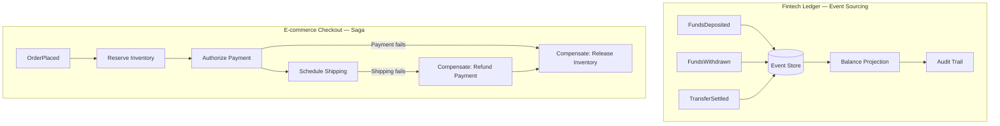
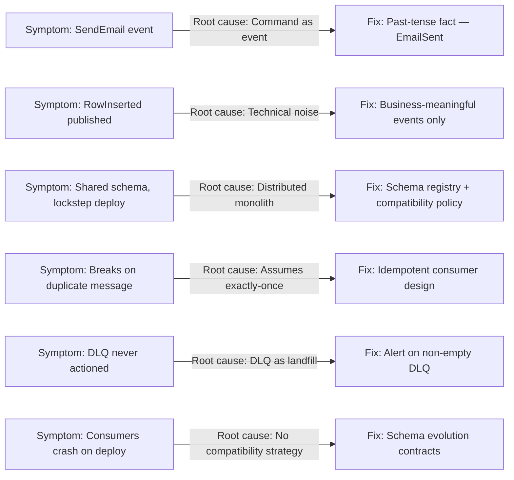
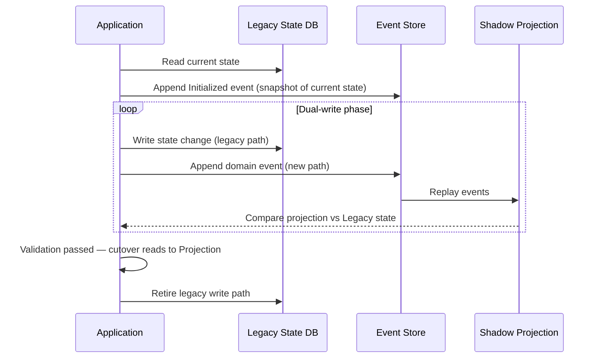
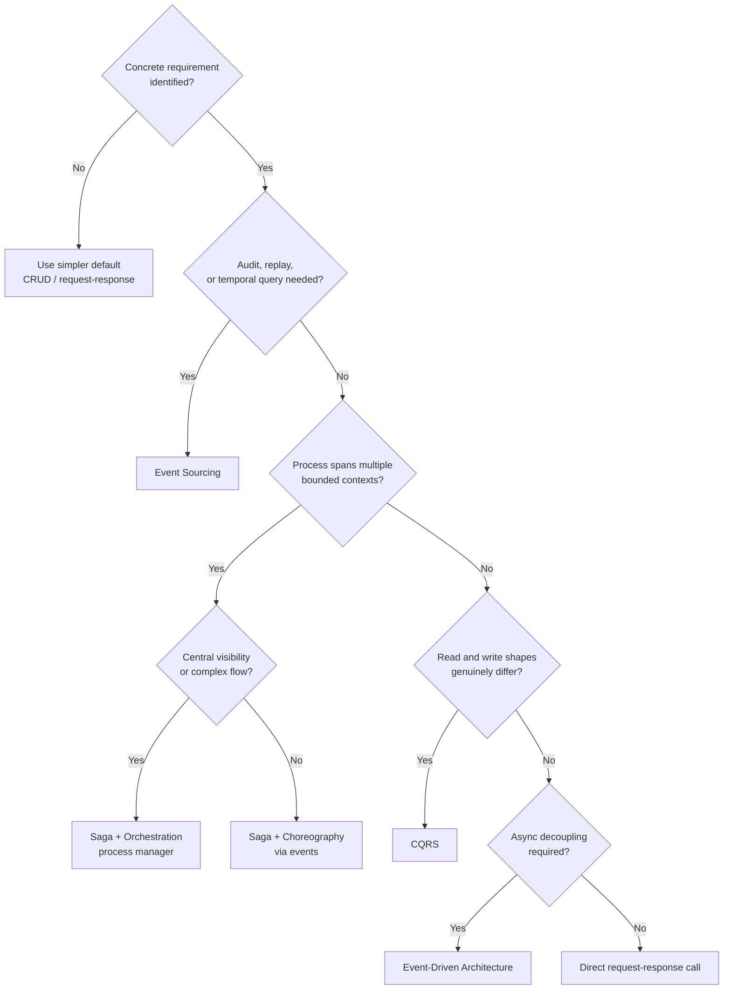

## Diagrams — Real-World Cases, Trade-offs, and Pitfalls

### side-by-side comparison (two-column flowchart) showing the fintech ledger flow — event store appending FundsDeposited/Withdrawn events feeding a balance projection — next to the e-commerce checkout saga flow — OrderPlaced triggering inventory, payment, and shipping steps with compensating paths back

These two subgraphs contrast the dominant pattern for each domain: the fintech ledger uses Event Sourcing to build an auditable, immutable history that drives a balance projection, while the e-commerce checkout uses a saga with compensating transactions to coordinate across bounded contexts when any step fails.

---

### a quick-reference table-style flowchart mapping each anti-pattern (symptom) to its root cause and the pattern that prevents it, formatted as a diagnostic decision aid

This diagnostic map surfaces the six most common event-driven anti-patterns, their structural root cause, and the corrective pattern — allowing a team inheriting an unfamiliar system to identify architectural debt before reading business logic.

---

### sequence diagram showing migration to Event Sourcing — legacy state DB, seeding the event store with an Initialized event, shadow projection validation against legacy state, then cutover of reads to the projection

This sequence traces the five-stage controlled migration from a state-based system to Event Sourcing — seeding an initial fact, running shadow projections in parallel with the legacy system to validate correctness, and only then switching reads to the new projection and retiring the legacy write path.

---

### a decision-tree flowchart that starts at "Do I have a concrete requirement?" and branches through auditability, cross-context transactions, read/write shape mismatch, and asynchronous need — routing each answer to the appropriate pattern or to the simpler default

This decision tree operationalizes the book's refusal framework — defaulting always to the simpler option and introducing each pattern only when a named, concrete requirement cannot be met without it.

---
