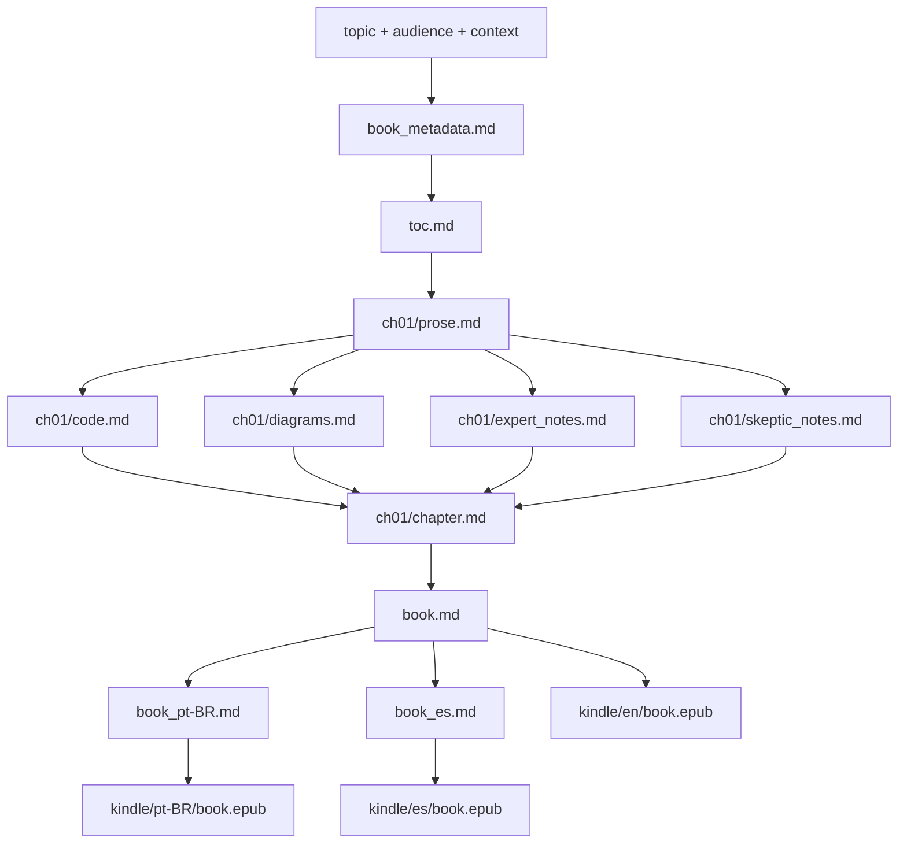

# Asset Traceability Matrix — Event-Driven Architecture
Generated: 2026-09-01 | Last updated: 2026-09-03 (switch-language + translations + EPUBs complete)
Validation gate: PASSED — all code.md and chapter.md regenerated, validated, and assembled

## Summary
| Phase | Assets Planned | Created | Verified | Failed |
|-------|---------------|---------|----------|--------|
| P1    | 0             | 1       | 1        | 0      |
| P2    | 0             | 1       | 1        | 0      |
| P4-Ch01 | 0           | 6       | 6        | 0      |
| P4-Ch02 | 0           | 6       | 6        | 0      |
| P4-Ch03 | 0           | 6       | 6        | 0      |
| P4-Ch04 | 0           | 6       | 6        | 0      |
| P4-Ch05 | 0           | 6       | 6        | 0      |
| P4-Ch06 | 0           | 6       | 6        | 0      |
| P4-Ch07 | 0           | 6       | 6        | 0      |
| P4-Ch08 | 0           | 6       | 6        | 0      |
| P4-Ch09 | 0           | 6       | 6        | 0      |
| P4-Ch10 | 0           | 6       | 6        | 0      |
| P5    | 0             | 1       | 1        | 0      |
| P6    | 0             | 2       | 2        | 0      |
| P7    | 0             | 4       | 4        | 0      |
| **TOTAL** | **0**     | **68**  | **68**   | **0**  |

## Asset Register

| Asset ID | Path | Type | Phase | Created By | Input Assets | Status | Notes |
|----------|------|------|-------|------------|--------------|--------|-------|
| A001 | Books/arquitetura-baseada-em-eventos/book_metadata.md | metadata | P1 | book-orchestrator | — | VERIFIED | code fields updated: python/working-code |
| A002 | Books/arquitetura-baseada-em-eventos/toc.md | toc | P2 | book-orchestrator | A001 | VERIFIED | 10 chapters confirmed |
| A003 | Books/arquitetura-baseada-em-eventos/chapters/ch01/prose.md | prose | P4-Ch01 | chapter-writer | A002 | VERIFIED | preserved |
| A004 | Books/arquitetura-baseada-em-eventos/chapters/ch01/code.md | code | P4-Ch01 | code-illustrator | A003 | VERIFIED | python/working-code; 1 block; CLEAN|
| A005 | Books/arquitetura-baseada-em-eventos/chapters/ch01/diagrams.md | diagrams | P4-Ch01 | diagram-illustrator | A003 | VERIFIED | preserved |
| A006 | Books/arquitetura-baseada-em-eventos/chapters/ch01/expert_notes.md | expert_notes | P4-Ch01 | expert-reviewer | A003 | VERIFIED | preserved |
| A007 | Books/arquitetura-baseada-em-eventos/chapters/ch01/skeptic_notes.md | skeptic_notes | P4-Ch01 | skeptic-reviewer | A003 | VERIFIED | preserved |
| A008 | Books/arquitetura-baseada-em-eventos/chapters/ch01/chapter.md | chapter | P4-Ch01 | chapter-assembler | A003,A004,A005,A006,A007 | VERIFIED | reassembled; 1 code + 2 diagrams + callouts integrated|
| A009 | Books/arquitetura-baseada-em-eventos/chapters/ch02/prose.md | prose | P4-Ch02 | chapter-writer | A002 | VERIFIED | preserved |
| A010 | Books/arquitetura-baseada-em-eventos/chapters/ch02/code.md | code | P4-Ch02 | code-illustrator | A009 | VERIFIED | python/working-code; 1 block; CLEAN (utcnow deprecation warning)|
| A011 | Books/arquitetura-baseada-em-eventos/chapters/ch02/diagrams.md | diagrams | P4-Ch02 | diagram-illustrator | A009 | VERIFIED | preserved |
| A012 | Books/arquitetura-baseada-em-eventos/chapters/ch02/expert_notes.md | expert_notes | P4-Ch02 | expert-reviewer | A009 | VERIFIED | preserved |
| A013 | Books/arquitetura-baseada-em-eventos/chapters/ch02/skeptic_notes.md | skeptic_notes | P4-Ch02 | skeptic-reviewer | A009 | VERIFIED | preserved |
| A014 | Books/arquitetura-baseada-em-eventos/chapters/ch02/chapter.md | chapter | P4-Ch02 | chapter-assembler | A009,A010,A011,A012,A013 | VERIFIED | reassembled; 1 code + 3 diagrams + callouts integrated|
| A015 | Books/arquitetura-baseada-em-eventos/chapters/ch03/prose.md | prose | P4-Ch03 | chapter-writer | A002 | VERIFIED | preserved |
| A016 | Books/arquitetura-baseada-em-eventos/chapters/ch03/code.md | code | P4-Ch03 | code-illustrator | A015 | VERIFIED | python/working-code; 1 block; syntax-only (confluent-kafka dep)|
| A017 | Books/arquitetura-baseada-em-eventos/chapters/ch03/diagrams.md | diagrams | P4-Ch03 | diagram-illustrator | A015 | VERIFIED | preserved |
| A018 | Books/arquitetura-baseada-em-eventos/chapters/ch03/expert_notes.md | expert_notes | P4-Ch03 | expert-reviewer | A015 | VERIFIED | preserved |
| A019 | Books/arquitetura-baseada-em-eventos/chapters/ch03/skeptic_notes.md | skeptic_notes | P4-Ch03 | skeptic-reviewer | A015 | VERIFIED | preserved |
| A020 | Books/arquitetura-baseada-em-eventos/chapters/ch03/chapter.md | chapter | P4-Ch03 | chapter-assembler | A015,A016,A017,A018,A019 | VERIFIED | reassembled; 1 code + 3 diagrams + callouts integrated|
| A021 | Books/arquitetura-baseada-em-eventos/chapters/ch04/prose.md | prose | P4-Ch04 | chapter-writer | A002 | VERIFIED | preserved |
| A022 | Books/arquitetura-baseada-em-eventos/chapters/ch04/code.md | code | P4-Ch04 | code-illustrator | A021 | VERIFIED | python/working-code; 5 blocks; 2 Unicode arrow fixes|
| A023 | Books/arquitetura-baseada-em-eventos/chapters/ch04/diagrams.md | diagrams | P4-Ch04 | diagram-illustrator | A021 | VERIFIED | preserved |
| A024 | Books/arquitetura-baseada-em-eventos/chapters/ch04/expert_notes.md | expert_notes | P4-Ch04 | expert-reviewer | A021 | VERIFIED | preserved |
| A025 | Books/arquitetura-baseada-em-eventos/chapters/ch04/skeptic_notes.md | skeptic_notes | P4-Ch04 | skeptic-reviewer | A021 | VERIFIED | preserved |
| A026 | Books/arquitetura-baseada-em-eventos/chapters/ch04/chapter.md | chapter | P4-Ch04 | chapter-assembler | A021,A022,A023,A024,A025 | VERIFIED | reassembled; 5 code + 3 diagrams + callouts integrated|
| A027 | Books/arquitetura-baseada-em-eventos/chapters/ch05/prose.md | prose | P4-Ch05 | chapter-writer | A002 | VERIFIED | preserved |
| A028 | Books/arquitetura-baseada-em-eventos/chapters/ch05/code.md | code | P4-Ch05 | code-illustrator | A027 | VERIFIED | python/working-code; 2 blocks; CLEAN|
| A029 | Books/arquitetura-baseada-em-eventos/chapters/ch05/diagrams.md | diagrams | P4-Ch05 | diagram-illustrator | A027 | VERIFIED | preserved |
| A030 | Books/arquitetura-baseada-em-eventos/chapters/ch05/expert_notes.md | expert_notes | P4-Ch05 | expert-reviewer | A027 | VERIFIED | preserved |
| A031 | Books/arquitetura-baseada-em-eventos/chapters/ch05/skeptic_notes.md | skeptic_notes | P4-Ch05 | skeptic-reviewer | A027 | VERIFIED | preserved |
| A032 | Books/arquitetura-baseada-em-eventos/chapters/ch05/chapter.md | chapter | P4-Ch05 | chapter-assembler | A027,A028,A029,A030,A031 | VERIFIED | reassembled; 2 code + 3 diagrams + callouts integrated|
| A033 | Books/arquitetura-baseada-em-eventos/chapters/ch06/prose.md | prose | P4-Ch06 | chapter-writer | A002 | VERIFIED | preserved |
| A034 | Books/arquitetura-baseada-em-eventos/chapters/ch06/code.md | code | P4-Ch06 | code-illustrator | A033 | VERIFIED | python/working-code; 4 blocks; sql fence corrected to python|
| A035 | Books/arquitetura-baseada-em-eventos/chapters/ch06/diagrams.md | diagrams | P4-Ch06 | diagram-illustrator | A033 | VERIFIED | preserved |
| A036 | Books/arquitetura-baseada-em-eventos/chapters/ch06/expert_notes.md | expert_notes | P4-Ch06 | expert-reviewer | A033 | VERIFIED | preserved |
| A037 | Books/arquitetura-baseada-em-eventos/chapters/ch06/skeptic_notes.md | skeptic_notes | P4-Ch06 | skeptic-reviewer | A033 | VERIFIED | preserved |
| A038 | Books/arquitetura-baseada-em-eventos/chapters/ch06/chapter.md | chapter | P4-Ch06 | chapter-assembler | A033,A034,A035,A036,A037 | VERIFIED | reassembled; 4 code + 3 diagrams + callouts integrated|
| A039 | Books/arquitetura-baseada-em-eventos/chapters/ch07/prose.md | prose | P4-Ch07 | chapter-writer | A002 | VERIFIED | preserved |
| A040 | Books/arquitetura-baseada-em-eventos/chapters/ch07/code.md | code | P4-Ch07 | code-illustrator | A039 | VERIFIED | python/working-code; 2 blocks; CLEAN|
| A041 | Books/arquitetura-baseada-em-eventos/chapters/ch07/diagrams.md | diagrams | P4-Ch07 | diagram-illustrator | A039 | VERIFIED | preserved |
| A042 | Books/arquitetura-baseada-em-eventos/chapters/ch07/expert_notes.md | expert_notes | P4-Ch07 | expert-reviewer | A039 | VERIFIED | preserved |
| A043 | Books/arquitetura-baseada-em-eventos/chapters/ch07/skeptic_notes.md | skeptic_notes | P4-Ch07 | skeptic-reviewer | A039 | VERIFIED | preserved |
| A044 | Books/arquitetura-baseada-em-eventos/chapters/ch07/chapter.md | chapter | P4-Ch07 | chapter-assembler | A039,A040,A041,A042,A043 | VERIFIED | reassembled; 2 code + 4 diagrams + callouts integrated|
| A045 | Books/arquitetura-baseada-em-eventos/chapters/ch08/prose.md | prose | P4-Ch08 | chapter-writer | A002 | VERIFIED | preserved |
| A046 | Books/arquitetura-baseada-em-eventos/chapters/ch08/code.md | code | P4-Ch08 | code-illustrator | A045 | VERIFIED | python/working-code; 2 blocks; CLEAN|
| A047 | Books/arquitetura-baseada-em-eventos/chapters/ch08/diagrams.md | diagrams | P4-Ch08 | diagram-illustrator | A045 | VERIFIED | preserved |
| A048 | Books/arquitetura-baseada-em-eventos/chapters/ch08/expert_notes.md | expert_notes | P4-Ch08 | expert-reviewer | A045 | VERIFIED | preserved |
| A049 | Books/arquitetura-baseada-em-eventos/chapters/ch08/skeptic_notes.md | skeptic_notes | P4-Ch08 | skeptic-reviewer | A045 | VERIFIED | preserved |
| A050 | Books/arquitetura-baseada-em-eventos/chapters/ch08/chapter.md | chapter | P4-Ch08 | chapter-assembler | A045,A046,A047,A048,A049 | VERIFIED | reassembled; 2 code + 4 diagrams + callouts integrated|
| A051 | Books/arquitetura-baseada-em-eventos/chapters/ch09/prose.md | prose | P4-Ch09 | chapter-writer | A002 | VERIFIED | preserved |
| A052 | Books/arquitetura-baseada-em-eventos/chapters/ch09/code.md | code | P4-Ch09 | code-illustrator | A051 | VERIFIED | python/working-code; 3 blocks; CLEAN|
| A053 | Books/arquitetura-baseada-em-eventos/chapters/ch09/diagrams.md | diagrams | P4-Ch09 | diagram-illustrator | A051 | VERIFIED | preserved |
| A054 | Books/arquitetura-baseada-em-eventos/chapters/ch09/expert_notes.md | expert_notes | P4-Ch09 | expert-reviewer | A051 | VERIFIED | preserved |
| A055 | Books/arquitetura-baseada-em-eventos/chapters/ch09/skeptic_notes.md | skeptic_notes | P4-Ch09 | skeptic-reviewer | A051 | VERIFIED | preserved |
| A056 | Books/arquitetura-baseada-em-eventos/chapters/ch09/chapter.md | chapter | P4-Ch09 | chapter-assembler | A051,A052,A053,A054,A055 | VERIFIED | reassembled; 3 code + 3 diagrams + callouts integrated|
| A057 | Books/arquitetura-baseada-em-eventos/chapters/ch10/prose.md | prose | P4-Ch10 | chapter-writer | A002 | VERIFIED | preserved |
| A058 | Books/arquitetura-baseada-em-eventos/chapters/ch10/code.md | code | P4-Ch10 | code-illustrator | A057 | VERIFIED | python/working-code; no-code sentinel (no CODE markers)|
| A059 | Books/arquitetura-baseada-em-eventos/chapters/ch10/diagrams.md | diagrams | P4-Ch10 | diagram-illustrator | A057 | VERIFIED | preserved |
| A060 | Books/arquitetura-baseada-em-eventos/chapters/ch10/expert_notes.md | expert_notes | P4-Ch10 | expert-reviewer | A057 | VERIFIED | preserved |
| A061 | Books/arquitetura-baseada-em-eventos/chapters/ch10/skeptic_notes.md | skeptic_notes | P4-Ch10 | skeptic-reviewer | A057 | VERIFIED | preserved |
| A062 | Books/arquitetura-baseada-em-eventos/chapters/ch10/chapter.md | chapter | P4-Ch10 | chapter-assembler | A057,A058,A059,A060,A061 | VERIFIED | reassembled; 0 code + 4 diagrams + callouts integrated|
| A063 | Books/arquitetura-baseada-em-eventos/book.md | book-en | P5 | book-orchestrator | A008,A014,A020,A026,A032,A038,A044,A050,A056,A062 | VERIFIED | 4411 lines; all 10 chapters assembled; python/working-code|
| A064 | Books/arquitetura-baseada-em-eventos/narrative_report.md | report | P5 | book-orchestrator | A008,A014,A020,A026,A032,A038,A044,A050,A056,A062 | VERIFIED | unchanged (prose preserved) |
| A065 | Books/arquitetura-baseada-em-eventos/book_pt-BR.md | book-ptbr | P6 | book-translator | A063 | VERIFIED | 4408 lines; chapter-by-chapter translation (10 agents)|
| A066 | Books/arquitetura-baseada-em-eventos/book_es.md | book-es | P6 | book-translator | A063 | VERIFIED | 4408 lines; chapter-by-chapter translation (10 agents)|
| A067 | Books/arquitetura-baseada-em-eventos/kindle/kdp_metadata.md | metadata | P7 | book-orchestrator | A063,A065,A066 | VERIFIED | unchanged |
| A068 | Books/arquitetura-baseada-em-eventos/kindle/en/book.epub | epub-en | P7 | book-formatter | A063 | VERIFIED | 120.7 KB; 17 files; 10 chapters|
| A069 | Books/arquitetura-baseada-em-eventos/kindle/pt-BR/book.epub | epub-ptbr | P7 | book-formatter | A065 | VERIFIED | 88.4 KB; 17 files; 10 chapters|
| A070 | Books/arquitetura-baseada-em-eventos/kindle/es/book.epub | epub-es | P7 | book-formatter | A066 | VERIFIED | 98.8 KB; 17 files; 10 chapters|

## Dependency Graph

