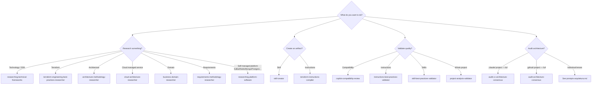

# Capabilities Catalog

All Agents Factory capabilities organized by category.

## Summary

| Category | Count | Purpose |
|-----------|:---:|-----------|
| [Research](prompts-pesquisa.md) | 7 | Build validated knowledge bases (technologies, cloud, domains, methodologies) |
| [Platform Software](../manual/platform-software-family.md) | 15 | Research self-managed platforms (1 orchestrator + 14 siblings: brokers, data stores, cache, search, API gateway) |
| [Compilation](prompts-compilacao.md) | 4 | Transform research into skills/instructions |
| [Validation](prompts-validacao.md) | 4 | Verify artifact quality |
| [Auditing](prompts-arquitetura.md) | 8 | Multi-model architecture auditing |
| [Framework](prompts-framework.md) | 1 | Validate agent projects |
| [Evaluation](prompts-avaliacao.md) | 1 | Test skill behavior via LLM-as-judge |
| **Total operational commands** | **40** | All via `/name` (`disable-model-invocation`) |
| [Templates](templates.md) | 24 | Scaffolding + shared platform-research assets |

---

## Full Table

| # | Name | Type | Category | Description |
|:-:|------|------|-----------|-----------|
| 1 | `researching-technical-frameworks` | Skill | Research | Researches technologies/frameworks with version absolutism |
| 2 | `agent-router-pattern-validator` | Prompt | Framework | Agent Router Pattern compliance analysis |
| 3 | `technical-framework-researcher-terraform` | Prompt | Research | Researches cloud services + Terraform |
| 4 | `terraform-engineering-best-practices-researcher` | Prompt | Research | Researches Terraform engineering practices |
| 5 | `architecture-methodology-researcher` | Prompt | Research | Researches architecture methodologies (C4, TOGAF, DDD) |
| 6 | `cloud-architecture-researcher` | Prompt | Research | Researches cloud architecture frameworks (WAF, CAF) |
| 7 | `business-domain-researcher` | Prompt | Research | Researches organizational and regulatory domains |
| 8 | `requirements-methodology-researcher` | Prompt | Research | Researches requirements frameworks (Scrum, SAFe) |
| 9 | `skill-creator` | Prompt | Compilation | Generates SKILL.md from research; incorporates authoring patterns (three-tier, YAML, blueprints) |
| 10 | `terraform-instructions-compiler` | Prompt | Compilation | Compiles Terraform research into .instructions.md |
| 11 | `architecture-approaches-skill-generator` | Prompt | Compilation | Generates SKILL.md for architecture methodology |
| 12 | `methodologies-skill-generator` | Prompt | Compilation | Generates SKILL.md for engineering methodology |
| 13 | `copilot-compatibility-review` | Prompt | Validation | Verifies compatibility with official Copilot docs |
| 14 | `instructions-best-practices-validator` | Prompt | Validation | Validates .instructions.md against best practices |
| 15 | `skill-best-practices-validator` | Prompt | Validation | Validates SKILL.md against Claude best practices |
| 16 | `project-analysis-validator` | Prompt | Validation | Overall project quality analysis |
| 17 | `audit-architecture-consensus` | Prompt | Auditing | Orchestrates 3 models in parallel + consensus (Copilot target) |
| 18 | `audit-architecture-scope` | Prompt | Auditing | Model A: responsibility hierarchy L0→L4 (Copilot target) |
| 19 | `audit-architecture-flow` | Prompt | Auditing | Model B: invocation chains prompt→agent→skill (Copilot target) |
| 20 | `audit-architecture-engine` | Prompt | Auditing | Model C: VS Code engine mechanics (Copilot target) |
| 21 | `audit-cc-architecture-consensus` | Prompt | Auditing | Orchestrates 3 models in parallel + consensus (Claude Code target) |
| 22 | `audit-cc-architecture-scope` | Prompt | Auditing | Model A: responsibility hierarchy G0→G4 (Claude Code target) |
| 23 | `audit-cc-architecture-flow` | Prompt | Auditing | Model B: invocation chains prompt→agent→skill (Claude Code target) |
| 24 | `audit-cc-architecture-engine` | Prompt | Auditing | Model C: Claude Code engine mechanics (Claude Code target) |
| 25 | `evaluating-skill-scenarios` | Prompt | Evaluation | Executes LLM-as-judge scenarios and judges skill behavior |
| 26 | `researching-platform-software` | Skill | Platform Software | **Orchestrator** — routes a platform request to the correct sibling below |
| 27 | `researching-streaming-broker` | Skill | Platform Software | Self-managed streaming/messaging brokers (Kafka, RabbitMQ, Pulsar, NATS) |
| 28 | `researching-cache-store` | Skill | Platform Software | In-memory cache / session stores (Redis-as-cache, Memcached, KeyDB, Dragonfly) |
| 29 | `researching-coordination-service` | Skill | Platform Software | Distributed coordination (etcd, ZooKeeper, Consul) |
| 30 | `researching-search-engine` | Skill | Platform Software | Full-text / analytics search (Elasticsearch, OpenSearch, Solr, Typesense) |
| 31 | `researching-api-gateway` | Skill | Platform Software | API gateways (Kong, APISIX, Tyk, Traefik EE, KrakenD, Envoy Gateway) |
| 32 | `researching-rdbms` | Skill | Platform Software | Relational / NewSQL (PostgreSQL, MySQL, MariaDB, CockroachDB) |
| 33 | `researching-document-store` | Skill | Platform Software | Document databases (MongoDB, Couchbase, RavenDB) |
| 34 | `researching-kv-store` | Skill | Platform Software | Persistent key-value stores (Redis-as-DB, RocksDB, LMDB, TiKV) |
| 35 | `researching-wide-column-store` | Skill | Platform Software | Wide-column databases (Cassandra, ScyllaDB, HBase) |
| 36 | `researching-graph-database` | Skill | Platform Software | Graph databases (Neo4j, JanusGraph, ArangoDB, Nebula) |
| 37 | `researching-timeseries-db` | Skill | Platform Software | Time-series databases (InfluxDB, TimescaleDB, VictoriaMetrics, QuestDB) |
| 38 | `researching-columnar-analytics` | Skill | Platform Software | Columnar OLAP (ClickHouse, Druid, Pinot, DuckDB) |
| 39 | `researching-vector-store` | Skill | Platform Software | Vector / ANN databases (Milvus, Qdrant, Weaviate, pgvector, Chroma) |
| 40 | `researching-object-storage` | Skill | Platform Software | S3-compatible object storage (MinIO, Ceph RGW, SeaweedFS, GarageHQ) |

> The **Platform Software** family (26–40) routes through the same `framework-researcher` subagent.
> Full detail: [Platform Software Research Family](../manual/platform-software-family.md).

---

## How to Choose

