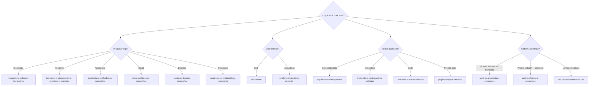

# Catálogo de Capacidades

Todas as capacidades do Agents Factory organizadas por categoria.

## Resumo

| Categoria | Qtd | Propósito |
|-----------|:---:|-----------|
| [Skills](skills.md) | 1 | Skill de pesquisa com version absolutism; padrões de autoria integrados ao `skill-creator` |
| [Templates](templates.md) | 14 | Scaffolding para criar qualquer artefato |
| [Pesquisa](prompts-pesquisa.md) | 7 | Construir bases de conhecimento validadas |
| [Compilação](prompts-compilacao.md) | 4 | Transformar pesquisa em skills/instructions |
| [Validação](prompts-validacao.md) | 4 | Verificar qualidade de artefatos |
| [Auditoria](prompts-arquitetura.md) | 8 | Auditar arquitetura multi-modelo |
| [Framework](prompts-framework.md) | 1 | Validar projetos de agente |

---

## Tabela Completa

| # | Nome | Tipo | Categoria | Descrição |
|:-:|------|------|-----------|-----------|
| 1 | `researching-technical-frameworks` | Skill | Pesquisa | Pesquisa tecnologias/frameworks com version absolutism |
| 2 | `agent-router-pattern-validator` | Prompt | Framework | Análise de conformidade com Agent Router Pattern |
| 3 | `technical-framework-researcher-terraform` | Prompt | Pesquisa | Pesquisa serviços cloud + Terraform |
| 5 | `terraform-engineering-best-practices-researcher` | Prompt | Pesquisa | Pesquisa práticas de engenharia Terraform |
| 6 | `architecture-methodology-researcher` | Prompt | Pesquisa | Pesquisa metodologias de arquitetura (C4, TOGAF, DDD) |
| 7 | `cloud-architecture-researcher` | Prompt | Pesquisa | Pesquisa frameworks de arquitetura cloud (WAF, CAF) |
| 8 | `business-domain-researcher` | Prompt | Pesquisa | Pesquisa domínios organizacionais e regulatórios |
| 9 | `requirements-methodology-researcher` | Prompt | Pesquisa | Pesquisa frameworks de requisitos (Scrum, SAFe) |
| 10 | `skill-creator` | Prompt | Compilação | Gera SKILL.md a partir de pesquisa; incorpora padrões de autoria (three-tier, YAML, blueprints) |
| 11 | `terraform-instructions-compiler` | Prompt | Compilação | Compila pesquisa Terraform em .instructions.md |
| 12 | `architecture-approaches-skill-generator` | Prompt | Compilação | Gera SKILL.md de metodologia de arquitetura |
| 13 | `methodologies-skill-generator` | Prompt | Compilação | Gera SKILL.md de metodologia de engenharia |
| 14 | `copilot-compatibility-review` | Prompt | Validação | Verifica compatibilidade com docs oficiais do Copilot |
| 15 | `instructions-best-practices-validator` | Prompt | Validação | Valida .instructions.md contra best practices |
| 16 | `skill-best-practices-validator` | Prompt | Validação | Valida SKILL.md contra Claude best practices |
| 17 | `project-analysis-validator` | Prompt | Validação | Análise de qualidade geral do projeto |
| 18 | `audit-architecture-consensus` | Prompt | Auditoria | Orquestra 3 modelos em paralelo + consenso (alvo Copilot) |
| 19 | `audit-architecture-scope` | Prompt | Auditoria | Modelo A: hierarquia de responsabilidades L0→L4 (alvo Copilot) |
| 20 | `audit-architecture-flow` | Prompt | Auditoria | Modelo B: cadeias de invocação prompt→agent→skill (alvo Copilot) |
| 21 | `audit-architecture-engine` | Prompt | Auditoria | Modelo C: mecânicas do VS Code engine (alvo Copilot) |
| 22 | `audit-cc-architecture-consensus` | Prompt | Auditoria | Orquestra 3 modelos em paralelo + consenso (alvo Claude Code) |
| 23 | `audit-cc-architecture-scope` | Prompt | Auditoria | Modelo A: hierarquia de responsabilidades G0→G4 (alvo Claude Code) |
| 24 | `audit-cc-architecture-flow` | Prompt | Auditoria | Modelo B: cadeias de invocação prompt→agent→skill (alvo Claude Code) |
| 25 | `audit-cc-architecture-engine` | Prompt | Auditoria | Modelo C: mecânicas do Claude Code engine (alvo Claude Code) |

---

## Como Escolher

