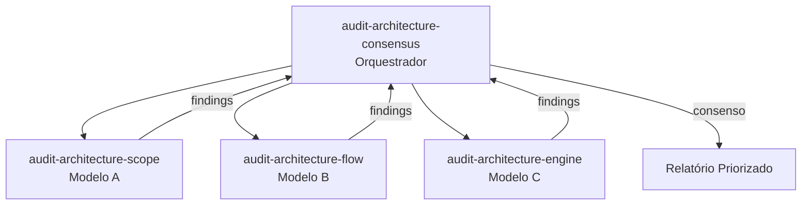

# Prompts de Auditoria de Arquitetura

5 prompts que formam um sistema de auditoria multi-modelo para projetos de agente.

---

## Visão Geral

O sistema de auditoria usa **3 modelos independentes** que analisam perspectivas diferentes em paralelo, depois um **orquestrador** compara findings e gera um relatório de consenso.



| Modelo | Perspectiva | Foco |
|--------|-------------|------|
| **A (Scope)** | Hierarquia de responsabilidades | Separação por camada L0→L4 |
| **B (Flow)** | Cadeias de invocação | Reachability, dead-ends, ciclos |
| **C (Engine)** | Mecânicas VS Code | applyTo, context, frontmatter |
| **Consensus** | Consolidação | Priorização por consenso |

---

## 1. audit-architecture-consensus (Orquestrador)

> **Arquivo**: `.github/prompts/audit-architecture-consensus.prompt.md`

### Descrição
Orquestra auditoria completa: executa Modelos A, B e C em paralelo, compara findings, e produz relatório priorizado por consenso.

### Invocação
```
@workspace /audit-architecture-consensus
```

### Workflow Interno
1. Identifica target (agente a auditar)
2. Executa `audit-architecture-scope` (Modelo A)
3. Executa `audit-architecture-flow` (Modelo B)
4. Executa `audit-architecture-engine` (Modelo C)
5. Compara findings dos 3 modelos
6. Prioriza: issue encontrada por 3 modelos > 2 > 1
7. Gera relatório de remediação

### Input Esperado
- Nome do agente ou caminho para `.github/`

### Output Produzido
- Relatório markdown com:
  - Score de conformidade
  - Issues priorizadas por consenso (3/3, 2/3, 1/3)
  - Plano de remediação ordenado por impacto

### Tools Necessários
- `read`, `search`, `create`

### Quando Usar
- Auditoria completa de um projeto de agente
- Antes de "production readiness"
- Como step final do [Fluxo de Criação de Projeto](../fluxos/fluxo-criacao-projeto.md)

---

## 2. audit-architecture-scope (Modelo A)

> **Arquivo**: `.github/prompts/audit-architecture-scope.prompt.md`

### Descrição
Audita hierarquia de responsabilidades por camada (L0→L4), detecta vazamento de responsabilidade entre camadas.

### Invocação
```
@workspace /audit-architecture-scope
```

### O que Verifica

| Camada | Responsabilidade | Violação típica |
|--------|-----------------|-----------------|
| **L0** | Configuração global (.vscode/settings) | Lógica de negócio em settings |
| **L1** | Instructions (projeto-wide) | Código em instructions |
| **L2** | Skills (domínio-specific) | Skill fazendo routing |
| **L3** | Agents (orquestração) | Agent sem skill, "hardcoded knowledge" |
| **L4** | Prompts (entry-point) | Prompt com lógica de implementação |

### Output Produzido
- Score por camada (compliance %)
- Violações de vazamento detectadas
- Sugestões de reorganização

### Tools Necessários
- `read`, `search`, `create`

---

## 3. audit-architecture-flow (Modelo B)

> **Arquivo**: `.github/prompts/audit-architecture-flow.prompt.md`

### Descrição
Audita cadeias de invocação (prompt → agent → instructions → skills), validando que todo entry-point tem cadeia completa.

### Invocação
```
@workspace /audit-architecture-flow
```

### O que Verifica
- **Reachability**: Todo componente é alcançável por algum prompt
- **Completude**: Toda cadeia prompt→agent→skill é completa (sem elos faltando)
- **Dead-ends**: Componentes referenciados mas inexistentes
- **Ciclos**: Dependências circulares
- **Orphans**: Componentes que ninguém referencia

### Output Produzido
- Grafo de invocação (textual)
- Lista de broken chains
- Lista de componentes órfãos
- Sugestões de ligação

### Tools Necessários
- `read`, `search`

---

## 4. audit-architecture-engine (Modelo C)

> **Arquivo**: `.github/prompts/audit-architecture-engine.prompt.md`

### Descrição
Audita mecânicas do VS Code engine — valida applyTo, context budget, frontmatter, deduplicação, conflitos.

### Invocação
```
@workspace /audit-architecture-engine
```

### O que Verifica
- **applyTo**: Padrões glob corretos, sem overlap excessivo
- **Context budget**: Instructions não excedem limites úteis
- **Frontmatter**: YAML válido, campos obrigatórios presentes
- **Deduplicação**: Mesmo conteúdo não injetado múltiplas vezes
- **Conflitos**: Instructions contraditórias no mesmo escopo
- **Active vs Passive**: Caminhos de ativação corretos

### Output Produzido
- Relatório de mecanismos técnicos
- Warnings de context pollution
- Conflitos detectados com sugestão de resolução

### Tools Necessários
- `read`, `search`

---

## Uso Individual vs. Completo

| Cenário | Usar |
|---------|------|
| Auditoria completa pre-release | `audit-architecture-consensus` |
| Verificar só se as cadeias funcionam | `audit-architecture-flow` |
| Verificar só mecânicas técnicas | `audit-architecture-engine` |
| Verificar só separação de responsabilidades | `audit-architecture-scope` |
| Debug: "por que meu prompt não funciona?" | `audit-architecture-flow` + `audit-architecture-engine` |
