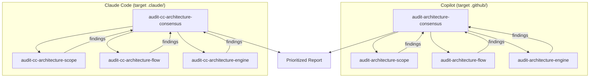

# Architecture Auditing Prompts

8 prompts that form a multi-model auditing system for agent projects — available in two variants: **Copilot** (target `.github/`) and **Claude Code** (target `.claude/`).

---

## Overview

The auditing system uses **3 independent models** that analyze different perspectives in parallel, then an **orchestrator** compares findings and generates a consensus report.



| Model | Perspective | Focus |
|--------|-------------|------|
| **A (Scope)** | Responsibility hierarchy | Layer separation L0→L4 |
| **B (Flow)** | Invocation chains | Reachability, dead-ends, cycles |
| **C (Engine)** | Engine mechanics | applyTo/paths, context, frontmatter |
| **Consensus** | Consolidation | Prioritization by consensus |

---

## 1. audit-architecture-consensus (Orchestrator)

> **File**: `.claude/skills/audit-architecture-consensus/SKILL.md`

### Description
Orchestrates full audit: executes Models A, B, and C in parallel, compares findings, and produces a consensus-prioritized report.

### Invocation
```
audit-architecture-consensus
```

### Internal Workflow
1. Identifies target (agent to audit)
2. Executes `audit-architecture-scope` (Model A)
3. Executes `audit-architecture-flow` (Model B)
4. Executes `audit-architecture-engine` (Model C)
5. Compares findings from all 3 models
6. Prioritizes: issue found by 3 models > 2 > 1
7. Generates remediation report

### Expected Input
- Agent name or path to `.github/`

### Produced Output
- Markdown report with:
  - Compliance score
  - Issues prioritized by consensus (3/3, 2/3, 1/3)
  - Remediation plan ordered by impact

### Required Tools
- `read`, `search`, `create`

### When to Use
- Full audit of an agent project
- Before "production readiness"
- As the final step of the [Project Creation Flow](../fluxos/fluxo-criacao-projeto.md)

---

## 2. audit-architecture-scope (Model A)

> **File**: `.claude/skills/audit-architecture-scope/SKILL.md`

### Description
Audits the responsibility hierarchy by layer (L0→L4), detecting responsibility leakage between layers.

### Invocation
```
audit-architecture-scope
```

### What It Verifies

| Layer | Responsibility | Typical Violation |
|--------|-----------------|-----------------|
| **L0** | Global configuration (.vscode/settings) | Business logic in settings |
| **L1** | Instructions (project-wide) | Code in instructions |
| **L2** | Skills (domain-specific) | Skill doing routing |
| **L3** | Agents (orchestration) | Agent without skill, "hardcoded knowledge" |
| **L4** | Prompts (entry-point) | Prompt with implementation logic |

### Produced Output
- Score per layer (compliance %)
- Detected leakage violations
- Reorganization suggestions

### Required Tools
- `read`, `search`, `create`

---

## 3. audit-architecture-flow (Model B)

> **File**: `.claude/skills/audit-architecture-flow/SKILL.md`

### Description
Audits invocation chains (prompt → agent → instructions → skills), validating that every entry-point has a complete chain.

### Invocation
```
audit-architecture-flow
```

### What It Verifies
- **Reachability**: Every component is reachable from some prompt
- **Completeness**: Every prompt→agent→skill chain is complete (no missing links)
- **Dead-ends**: Components referenced but non-existent
- **Cycles**: Circular dependencies
- **Orphans**: Components that nobody references

### Produced Output
- Invocation graph (textual)
- List of broken chains
- List of orphan components
- Linking suggestions

### Required Tools
- `read`, `search`

---

## 4. audit-architecture-engine (Model C)

> **File**: `.claude/skills/audit-architecture-engine/SKILL.md`

### Description
Audits VS Code engine mechanics — validates applyTo, context budget, frontmatter, deduplication, conflicts.

### Invocation
```
audit-architecture-engine
```

### What It Verifies
- **applyTo**: Correct glob patterns, no excessive overlap
- **Context budget**: Instructions do not exceed useful limits
- **Frontmatter**: Valid YAML, mandatory fields present
- **Deduplication**: Same content not injected multiple times
- **Conflicts**: Contradictory instructions in the same scope
- **Active vs Passive**: Correct activation paths

### Produced Output
- Technical mechanisms report
- Context pollution warnings
- Detected conflicts with resolution suggestions

### Required Tools
- `read`, `search`

---

---

## Claude Code Variant (target `.claude/`)

The four prompts below are identical in logic but audit **Claude Code** projects (`.claude/`), checking CC engine-specific conventions: `paths:` globs, `disable-model-invocation`, `context: fork`, `allowed-tools` vs `tools`, and the 4 CLAUDE.md → subagent → rules → skills layers.

### 5. audit-cc-architecture-consensus (CC Orchestrator)

> **File**: `.claude/skills/audit-cc-architecture-consensus/SKILL.md`

### Description
Orchestrates multi-model Claude Code audit: executes Scope + Flow + Engine in parallel via `Agent` tool and produces a consensus report prioritized by 3/3, 2/3, 1/3 agreement.

### Invocation
```
audit-cc-architecture-consensus
```

### Expected Input
- Path to `.claude/` or project root

### Produced Output
- Consensus report with score, prioritized issues, and remediation plan

---

### 6. audit-cc-architecture-scope (Model A — CC)

> **File**: `.claude/skills/audit-cc-architecture-scope/SKILL.md`

### Description
Audits responsibility hierarchy in a Claude Code project: CLAUDE.md → subagent → rules → skills, detecting responsibility leakage between layers.

### Invocation
```
audit-cc-architecture-scope
```

---

### 7. audit-cc-architecture-flow (Model B — CC)

> **File**: `.claude/skills/audit-cc-architecture-flow/SKILL.md`

### Description
Audits invocation chains `/command → subagent fork → rules → skills`, validating reachability and absence of dead-ends or orphans in a Claude Code project.

### Invocation
```
audit-cc-architecture-flow
```

---

### 8. audit-cc-architecture-engine (Model C — CC)

> **File**: `.claude/skills/audit-cc-architecture-engine/SKILL.md`

### Description
Audits Claude Code engine mechanics: `paths:` glob firing, skills budget without `disable-model-invocation`, `context: fork` isolation, `allowed-tools` vs `tools`, validity of `name`/`model`/`description`.

### Invocation
```
audit-cc-architecture-engine
```

---

## Individual vs. Full Use

| Scenario | Copilot Target | Claude Code Target |
|---------|-------------|-----------------|
| Full pre-release audit | `audit-architecture-consensus` | `audit-cc-architecture-consensus` |
| Check only whether chains work | `audit-architecture-flow` | `audit-cc-architecture-flow` |
| Check only technical mechanics | `audit-architecture-engine` | `audit-cc-architecture-engine` |
| Check only responsibility separation | `audit-architecture-scope` | `audit-cc-architecture-scope` |
| Debug: "why isn't my skill loading?" | `audit-architecture-flow` + `audit-architecture-engine` | `audit-cc-architecture-flow` + `audit-cc-architecture-engine` |
