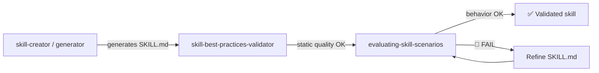

# Behavioral Evaluation Prompts

1 prompt dedicated to testing skill behavior via LLM-as-judge.

---

## Overview

| Prompt | Purpose | Output |
|--------|-----------|--------|
| `evaluating-skill-scenarios` | Execute evaluation scenarios for a skill and judge responses | Behavioral evaluation report |

---

## 1. evaluating-skill-scenarios

> **File**: `.claude/skills/evaluating-skill-scenarios/SKILL.md`

### Description

Executes all scenarios defined in a skill's `blueprints/evaluation-scenarios.md`, invoking it as an Agent subagent with the full SKILL.md body as context. Applies LLM-as-judge to verify responses against `must_pass` and `must_not` criteria.

### Invocation

```
/evaluating-skill-scenarios <skill-name>
```

### Expected Input

- Skill name (e.g., `cloud-architecture-researcher`)
- The skill must have `.claude/skills/{name}/blueprints/evaluation-scenarios.md` with ≥ 3 scenarios

### Produced Output

```
.claude/skills/{skill-name}/{skill-name}-evaluation-report.md
```

Report with a verdict per scenario (✅ PASS / ⚠️ PARTIAL / 🚫 FAIL), evidence cited from the actual response, and improvement recommendations.

### When to Use

- After `/skill-creator` or any generator produces a new SKILL.md with `evaluation-scenarios.md`
- When refining a skill and verifying that expected behavior is preserved
- As the final validation step after `/skill-best-practices-validator`

### Difference vs. quality-validator

| Evaluator | What it verifies |
|-----------|----------------|
| `skill-best-practices-validator` | **Static** quality: frontmatter, line count, three-tier, links |
| `evaluating-skill-scenarios` | **Dynamic** behavior: does the skill actually respond as expected to test cases? |

---

## Recommended Flow



See: [Quality Flow](../fluxos/fluxo-qualidade.md) for the complete pipeline.
