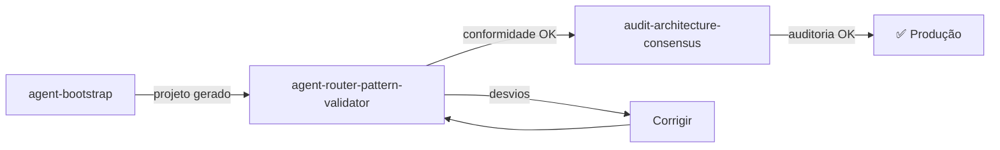

# Prompts de Framework (Ciclo de Vida)

2 prompts dedicados a criar e validar projetos completos de agente.

---

## Visão Geral

| Prompt | Propósito | Output |
|--------|-----------|--------|
| `agent-bootstrap` | Criar projeto completo de agente do zero | Agent + Instructions + Prompts + Skills |
| `agent-router-pattern-validator` | Validar conformidade com Agent Router Pattern | Relatório de compliance |

---

## 1. agent-bootstrap

> **Arquivo**: `.github/prompts/agent-bootstrap.prompt.md`

### Descrição
Wizard interativo que gera um projeto completo de GitHub Copilot agent seguindo o Agent Router Pattern. Technology-agnostic — funciona para qualquer domínio.

### Invocação
```
@workspace /agent-bootstrap
```

### Workflow Interno
1. **Coleta de contexto** (perguntas interativas):
   - Domínio do agente (ex: "provisionar infraestrutura OCI")
   - Tipo de agente (Implementation / Advisory / Orchestrator)
   - Skills necessárias (quais domínios de conhecimento)
   - Tecnologias envolvidas
2. **Planejamento**: Define estrutura de arquivos
3. **Geração**: Cria todos os artefatos seguindo templates
4. **Wiring**: Conecta prompts → agents → skills

### Input Esperado
- Opcionalmente: caminho do diretório de output
- Respostas às perguntas interativas

### Output Produzido
```
.github/
├── agents/
│   └── {domain}.agent.md
├── instructions/
│   ├── {domain}-config.instructions.md
│   ├── {domain}-standards.instructions.md
│   └── {domain}-skills.instructions.md
├── prompts/
│   └── {domain}.prompt.md
└── skills/
    └── {domain}/
        └── SKILL.md
```

### Templates Utilizados (implicitamente)
- `TEMPLATE.AGENT.md` / `TEMPLATE.ADVISORY-AGENT.md` / `TEMPLATE.ORCHESTRATOR-AGENT.md`
- `TEMPLATE.ENTRY-POINT.prompt.md`
- `TEMPLATE.SKILL.md`
- `TEMPLATE.CONFIG.instructions.md`, `TEMPLATE.STANDARDS.instructions.md`, `TEMPLATE.SKILLS.instructions.md`

### Tools Necessários
- `read`, `edit`, `create`, `execute`

### Quando Usar
- Começar um projeto de agente do zero
- Garantir que a estrutura segue o padrão completo
- Onboarding de novo domínio

### Próximos Passos
Após bootstrap → usar `agent-router-pattern-validator` para verificar

---

## 2. agent-router-pattern-validator

> **Arquivo**: `.github/prompts/agent-router-pattern-validator.prompt.md`

### Descrição
Analisa qualquer projeto de agente GitHub Copilot e gera relatório de conformidade com o Agent Router Pattern, identificando desvios e propondo melhorias.

### Invocação
```
@workspace /agent-router-pattern-validator
```

### O que Verifica

| Aspecto | Verificação |
|---------|-------------|
| **Estrutura** | Todos os artefatos esperados presentes? |
| **Routing** | Prompts apontam para agents corretos? |
| **Skills Loading** | Agents referenciam skills que existem? |
| **Instructions Scope** | Instructions com applyTo adequado? |
| **Naming** | Kebab-case, gerund-form, coerência? |
| **YAML** | Frontmatter válido em todos os arquivos? |
| **Completude** | Nenhum dead-end ou componente órfão? |

### Input Esperado
- Caminho para diretório do projeto de agente (ou raiz do repo)

### Output Produzido
- Relatório markdown com:
  - Score de conformidade (%)
  - Desvios categorizados (Critical / Warning / Info)
  - Sugestões de correção para cada desvio
  - Diagrama de routing atual vs. ideal

### Tools Necessários
- `read`, `search`

### Quando Usar
- Imediatamente após `agent-bootstrap`
- Após mudanças estruturais no projeto
- Como step 2 do [Fluxo de Criação de Projeto](../fluxos/fluxo-criacao-projeto.md)

---

## Fluxo Combinado



Ver: [Fluxo de Criação de Projeto](../fluxos/fluxo-criacao-projeto.md) para detalhes completos.
