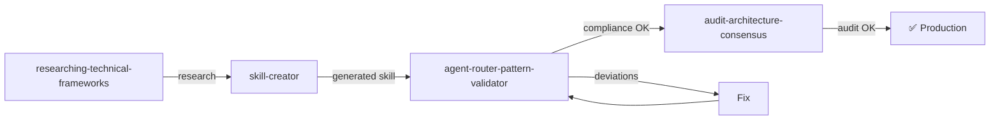

# Framework Prompts (Lifecycle)

1 prompt dedicated to validating agent projects.

---

## Overview

| Prompt | Purpose | Output |
|--------|-----------|--------|
| `agent-router-pattern-validator` | Validate compliance with Agent Router Pattern | Compliance report |

---

## 1. agent-router-pattern-validator

> **File**: `.claude/skills/agent-router-pattern-validator/SKILL.md`

### Description
Analyzes any Claude Code agent project and generates a compliance report with the Agent Router Pattern, identifying deviations and proposing improvements.

### Invocation
```
/agent-router-pattern-validator
```

### What It Verifies

| Aspect | Check |
|---------|-------------|
| **Structure** | Are all expected artifacts present? |
| **Routing** | Do prompts point to the correct agents? |
| **Skills Loading** | Do agents reference skills that exist? |
| **Instructions Scope** | Instructions with appropriate applyTo? |
| **Naming** | Kebab-case, gerund-form, consistency? |
| **YAML** | Valid frontmatter in all files? |
| **Completeness** | No dead-ends or orphan components? |

### Expected Input
- Path to agent project directory (or repo root)

### Produced Output
- Markdown report with:
  - Compliance score (%)
  - Categorized deviations (Critical / Warning / Info)
  - Fix suggestions for each deviation
  - Current vs. ideal routing diagram

### Required Tools
- `Read`, `Grep`

### When to Use
- After creating a new agent project
- After structural changes to the project
- As a validation step in the [Project Creation Flow](../fluxos/fluxo-criacao-projeto.md)

---

## Combined Flow



See: [Project Creation Flow](../fluxos/fluxo-criacao-projeto.md) for full details.
